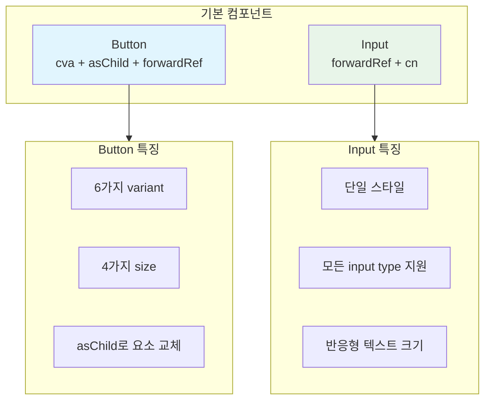
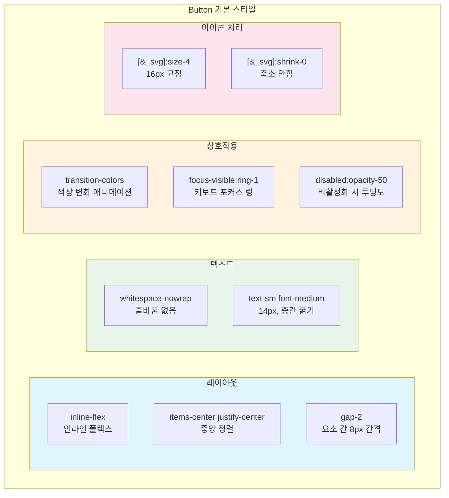
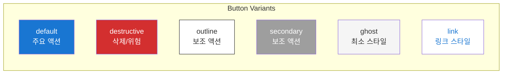
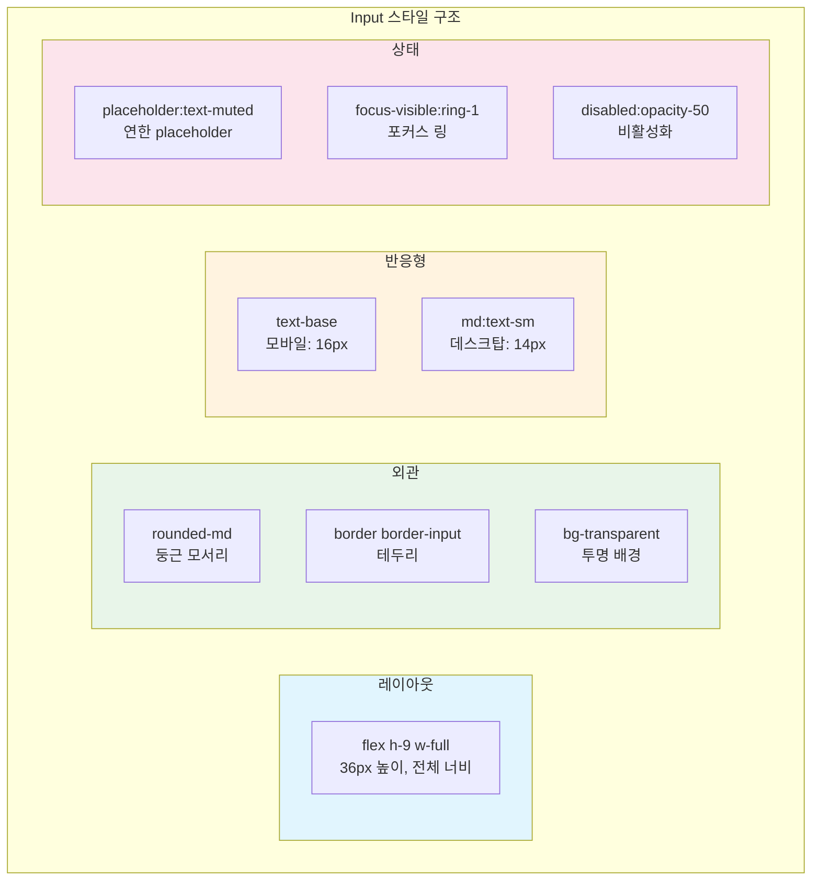
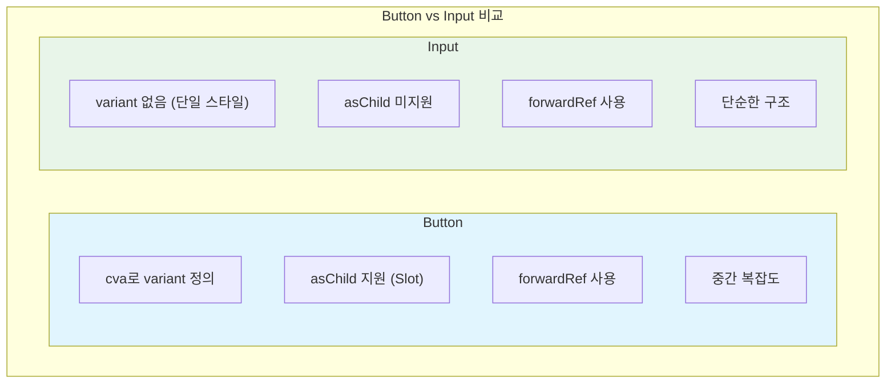

# Button & Input 컴포넌트 분석

## 개요

**Button**과 **Input**은 shadcn/ui의 가장 기본적인 컴포넌트입니다. Button은 cva를 활용한 variant 시스템과 asChild 패턴을 보여주고, Input은 단순하면서도 확장 가능한 컴포넌트 설계를 보여줍니다. 이 두 컴포넌트를 분석하면 shadcn/ui의 핵심 패턴을 모두 이해할 수 있으며, 자신만의 컴포넌트를 만들 때 참고할 수 있는 템플릿이 됩니다.



---

## Button 컴포넌트

### 전체 구현 코드

Button 컴포넌트는 shadcn/ui의 핵심 패턴들이 모두 적용된 대표적인 예시입니다. cva로 variant를 정의하고, Slot으로 asChild를 구현하며, forwardRef로 ref 전달을 지원합니다.

```tsx
// components/ui/button.tsx
import * as React from "react"
import { Slot } from "@radix-ui/react-slot"
import { cva, type VariantProps } from "class-variance-authority"
import { cn } from "@/lib/utils"

// 1. cva로 variants 정의
const buttonVariants = cva(
  // 기본 스타일 (모든 버튼에 공통 적용)
  "inline-flex items-center justify-center gap-2 whitespace-nowrap rounded-md text-sm font-medium transition-colors focus-visible:outline-none focus-visible:ring-1 focus-visible:ring-ring disabled:pointer-events-none disabled:opacity-50 [&_svg]:pointer-events-none [&_svg]:size-4 [&_svg]:shrink-0",
  {
    variants: {
      // variant: 버튼 스타일
      variant: {
        default:
          "bg-primary text-primary-foreground shadow hover:bg-primary/90",
        destructive:
          "bg-destructive text-destructive-foreground shadow-sm hover:bg-destructive/90",
        outline:
          "border border-input bg-background shadow-sm hover:bg-accent hover:text-accent-foreground",
        secondary:
          "bg-secondary text-secondary-foreground shadow-sm hover:bg-secondary/80",
        ghost: "hover:bg-accent hover:text-accent-foreground",
        link: "text-primary underline-offset-4 hover:underline",
      },
      // size: 버튼 크기
      size: {
        default: "h-9 px-4 py-2",
        sm: "h-8 rounded-md px-3 text-xs",
        lg: "h-10 rounded-md px-8",
        icon: "h-9 w-9",
      },
    },
    // 기본값
    defaultVariants: {
      variant: "default",
      size: "default",
    },
  }
)

// 2. Props 타입 정의
export interface ButtonProps
  extends React.ButtonHTMLAttributes<HTMLButtonElement>,
    VariantProps<typeof buttonVariants> {
  asChild?: boolean
}

// 3. 컴포넌트 구현
const Button = React.forwardRef<HTMLButtonElement, ButtonProps>(
  ({ className, variant, size, asChild = false, ...props }, ref) => {
    // asChild가 true면 Slot, 아니면 button
    const Comp = asChild ? Slot : "button"
    return (
      <Comp
        className={cn(buttonVariants({ variant, size, className }))}
        ref={ref}
        {...props}
      />
    )
  }
)
Button.displayName = "Button"

export { Button, buttonVariants }
```

### 코드 분석

#### 1. 기본 스타일 분석

기본 스타일은 모든 variant와 size에 공통으로 적용됩니다. 레이아웃, 텍스트, 상호작용, 접근성 관련 스타일이 포함됩니다.



```css
/* 레이아웃 */
inline-flex items-center justify-center gap-2
/* → 인라인 플렉스, 중앙 정렬, 요소 간 8px 간격 */

/* 텍스트 */
whitespace-nowrap text-sm font-medium
/* → 줄바꿈 없음, 14px, 중간 굵기 */

/* 모양 */
rounded-md
/* → 6px 둥근 모서리 */

/* 상호작용 */
transition-colors
/* → 색상 변화 애니메이션 */

/* 포커스 상태 - 접근성을 위한 키보드 포커스 표시 */
focus-visible:outline-none focus-visible:ring-1 focus-visible:ring-ring
/* → 키보드 포커스 시 링 표시 */

/* 비활성화 상태 */
disabled:pointer-events-none disabled:opacity-50
/* → 클릭 불가, 50% 투명도 */

/* SVG 아이콘 처리 - 버튼 내 아이콘 일관성 유지 */
[&_svg]:pointer-events-none [&_svg]:size-4 [&_svg]:shrink-0
/* → 아이콘 클릭 불가, 16px 고정, 축소 안함 */
```

#### 2. Variant별 스타일

각 variant는 특정 용도와 시각적 의미를 가집니다. 디자인 시스템에서 일관된 의미를 전달하기 위해 적절한 variant를 선택해야 합니다.



| Variant | 용도 | 스타일 설명 |
|---------|------|-------------|
| `default` | 주요 액션 (저장, 확인) | 기본 배경색, 흰색 텍스트, 그림자 |
| `destructive` | 삭제/위험 액션 | 빨간색 계열, 위험을 시각적으로 경고 |
| `outline` | 보조 액션 (취소) | 테두리만 있는 투명 버튼 |
| `secondary` | 보조 액션 | 회색 배경, default보다 낮은 중요도 |
| `ghost` | 최소한의 스타일 | 배경 없음, hover 시에만 배경 표시 |
| `link` | 링크 스타일 | 밑줄, 텍스트 색상만, 버튼처럼 보이지 않음 |

#### 3. Size별 스타일

size는 버튼의 물리적 크기를 결정합니다. UI의 밀도와 강조 정도에 따라 적절한 크기를 선택합니다.

| Size | 높이 | 패딩 | 용도 |
|------|------|------|------|
| `sm` | 32px (h-8) | px-3 | 조밀한 UI, 테이블 내 버튼 |
| `default` | 36px (h-9) | px-4 | 일반적인 버튼 |
| `lg` | 40px (h-10) | px-8 | 강조 버튼, CTA |
| `icon` | 36px × 36px (h-9 w-9) | - | 아이콘 전용 정사각형 버튼 |

### 사용 예시

```tsx
import { Button } from "@/components/ui/button"
import { Loader2, Mail, ChevronRight } from "lucide-react"

// 기본 사용 - defaultVariants가 적용됨
<Button>Click me</Button>

// Variants - 각 용도에 맞는 스타일 선택
<Button variant="destructive">Delete</Button>
<Button variant="outline">Cancel</Button>
<Button variant="secondary">Secondary</Button>
<Button variant="ghost">Ghost</Button>
<Button variant="link">Link</Button>

// Sizes - UI 밀도에 맞게 선택
<Button size="sm">Small</Button>
<Button size="lg">Large</Button>
<Button size="icon"><Mail /></Button>

// 아이콘과 함께 - gap-2로 자동 간격 적용
<Button>
  <Mail /> Login with Email
</Button>

<Button>
  Next <ChevronRight />
</Button>

// 로딩 상태 - disabled와 스피너 조합
<Button disabled>
  <Loader2 className="animate-spin" />
  Please wait
</Button>

// asChild로 Link 사용 - 버튼 스타일의 링크
import Link from "next/link"
<Button asChild>
  <Link href="/dashboard">Go to Dashboard</Link>
</Button>

// 커스텀 클래스 - cn()으로 병합되어 우선 적용
<Button className="w-full">Full Width</Button>
```

---

## Input 컴포넌트

### 전체 구현 코드

Input 컴포넌트는 Button보다 단순하지만, 확장 가능한 기본 구조를 보여줍니다. variant 없이 단일 스타일을 사용하며, forwardRef로 ref 전달을 지원합니다.

```tsx
// components/ui/input.tsx
import * as React from "react"
import { cn } from "@/lib/utils"

export interface InputProps
  extends React.InputHTMLAttributes<HTMLInputElement> {}

const Input = React.forwardRef<HTMLInputElement, InputProps>(
  ({ className, type, ...props }, ref) => {
    return (
      <input
        type={type}
        className={cn(
          // 레이아웃
          "flex h-9 w-full",
          // 모양
          "rounded-md border border-input bg-transparent",
          // 패딩
          "px-3 py-1",
          // 텍스트
          "text-base md:text-sm",
          // 그림자
          "shadow-sm",
          // 트랜지션
          "transition-colors",
          // placeholder
          "placeholder:text-muted-foreground",
          // 포커스
          "focus-visible:outline-none focus-visible:ring-1 focus-visible:ring-ring",
          // 비활성화
          "disabled:cursor-not-allowed disabled:opacity-50",
          // 파일 입력 스타일
          "file:border-0 file:bg-transparent file:text-sm file:font-medium file:text-foreground",
          // 외부 클래스
          className
        )}
        ref={ref}
        {...props}
      />
    )
  }
)
Input.displayName = "Input"

export { Input }
```

### 코드 분석

#### 스타일 분석

Input의 스타일은 사용성과 접근성을 고려하여 설계되었습니다. 특히 모바일에서의 자동 확대 방지를 위한 반응형 텍스트 크기가 주목할 만합니다.



```css
/* 기본 레이아웃 */
flex h-9 w-full
/* → 플렉스, 36px 높이, 전체 너비 */

/* 모양 */
rounded-md border border-input bg-transparent
/* → 둥근 모서리, 테두리, 투명 배경 */

/* 반응형 텍스트 - iOS에서 16px 미만 시 자동 확대 방지 */
text-base md:text-sm
/* → 모바일: 16px, 데스크탑: 14px */

/* placeholder - 입력 전 힌트 텍스트 */
placeholder:text-muted-foreground
/* → 연한 회색 placeholder */

/* 포커스 링 - 키보드 접근성 */
focus-visible:outline-none focus-visible:ring-1 focus-visible:ring-ring
/* → 키보드 포커스 시 링 표시 */

/* 비활성화 */
disabled:cursor-not-allowed disabled:opacity-50
/* → 커서 변경, 50% 투명도 */

/* 파일 입력 - type="file"일 때 적용 */
file:border-0 file:bg-transparent file:text-sm file:font-medium
/* → 파일 선택 버튼 스타일 */
```

### 사용 예시

```tsx
import { Input } from "@/components/ui/input"
import { Label } from "@/components/ui/label"

// 기본 사용
<Input placeholder="Enter your email" />

// type 지정 - 브라우저의 기본 유효성 검사 활용
<Input type="email" placeholder="email@example.com" />
<Input type="password" placeholder="Password" />
<Input type="number" min={0} max={100} />
<Input type="file" />

// Label과 함께 - 접근성을 위해 htmlFor와 id 연결 필수
<div className="grid gap-2">
  <Label htmlFor="email">Email</Label>
  <Input id="email" type="email" placeholder="Enter email" />
</div>

// 비활성화
<Input disabled placeholder="Disabled input" />

// 커스텀 스타일 - cn()으로 기존 스타일과 병합
<Input className="max-w-sm" placeholder="Max width 384px" />

// Controlled - React 상태와 연동
const [value, setValue] = React.useState("")
<Input
  value={value}
  onChange={(e) => setValue(e.target.value)}
/>

// Ref 사용 - DOM 메서드 직접 호출
const inputRef = React.useRef<HTMLInputElement>(null)
<Input ref={inputRef} />
<Button onClick={() => inputRef.current?.focus()}>
  Focus Input
</Button>
```

---

## Button vs Input 비교

두 컴포넌트의 설계 차이를 비교하면 shadcn/ui의 설계 철학을 더 잘 이해할 수 있습니다.



| 특성 | Button | Input |
|------|--------|-------|
| **Variants** | cva로 6개 variant + 4개 size | 없음 (단일 스타일) |
| **asChild** | 지원 (Slot 사용) | 미지원 |
| **forwardRef** | 사용 | 사용 |
| **외부 라이브러리** | @radix-ui/react-slot | 없음 |
| **복잡도** | 중간 | 단순 |

---

## 패턴 적용 분석

### cn() 사용

두 컴포넌트 모두 cn()을 사용하여 클래스를 병합합니다. 외부에서 전달받은 className이 마지막에 위치하여 우선 적용됩니다.

```tsx
// Button - cva 결과와 외부 className 병합
className={cn(buttonVariants({ variant, size, className }))}

// Input - 기본 스타일과 외부 className 병합
className={cn(
  "flex h-9 w-full rounded-md ...",
  className  // 외부 클래스가 마지막에 와서 우선 적용
)}
```

### forwardRef 사용

두 컴포넌트 모두 동일한 패턴으로 forwardRef를 구현합니다. 이 패턴은 shadcn/ui의 모든 컴포넌트에서 일관되게 사용됩니다.

```tsx
// 공통 패턴
const Component = React.forwardRef<HTMLElement, Props>(
  ({ className, ...props }, ref) => {
    return <element ref={ref} className={cn(...)} {...props} />
  }
)
Component.displayName = "Component"
```

### asChild 패턴 (Button만)

Button만 asChild를 지원합니다. 이는 버튼이 Link나 다른 요소로 대체될 필요가 많기 때문입니다.

```tsx
// Button에서만 사용
const Comp = asChild ? Slot : "button"
// → asChild가 true면 자식 요소의 속성을 사용
```

---

## 확장하기

### Button에 새 variant 추가

프로젝트 요구사항에 맞게 새로운 variant를 추가할 수 있습니다. cva 정의에 새로운 값을 추가하면 TypeScript가 자동으로 타입을 추론합니다.

```tsx
const buttonVariants = cva("...", {
  variants: {
    variant: {
      // ... 기존 variants
      success: "bg-green-500 text-white hover:bg-green-600",
      warning: "bg-yellow-500 text-black hover:bg-yellow-600",
    },
    // ...
  },
})
```

### Input에 variant 추가하기

Input도 cva를 적용하여 variant 시스템을 추가할 수 있습니다. 에러 상태나 성공 상태를 표현하는 데 유용합니다.

```tsx
import { cva, type VariantProps } from "class-variance-authority"

const inputVariants = cva(
  "flex h-9 w-full rounded-md border bg-transparent px-3 py-1 text-sm shadow-sm ...",
  {
    variants: {
      variant: {
        default: "border-input",
        error: "border-red-500 focus-visible:ring-red-500",
        success: "border-green-500 focus-visible:ring-green-500",
      },
    },
    defaultVariants: {
      variant: "default",
    },
  }
)

interface InputProps
  extends React.InputHTMLAttributes<HTMLInputElement>,
    VariantProps<typeof inputVariants> {}

const Input = React.forwardRef<HTMLInputElement, InputProps>(
  ({ className, type, variant, ...props }, ref) => {
    return (
      <input
        type={type}
        className={cn(inputVariants({ variant, className }))}
        ref={ref}
        {...props}
      />
    )
  }
)
```

---

## 실습 과제

1. **IconButton 컴포넌트 만들기**
   - Button의 `size="icon"`을 기본으로 하는 래퍼 컴포넌트
   - children으로 아이콘만 받도록 타입 제한

2. **SearchInput 컴포넌트 만들기**
   - Input 왼쪽에 검색 아이콘 고정 배치
   - 오른쪽에 clear 버튼 (입력 값이 있을 때만 표시)

3. **PasswordInput 컴포넌트 만들기**
   - 비밀번호 표시/숨기기 토글 버튼
   - Eye/EyeOff 아이콘 사용

---

## 다음 단계

Button과 Input의 기본을 이해했다면, 다음 문서에서는 React Hook Form과 통합되는 Form 컴포넌트를 살펴봅니다.
