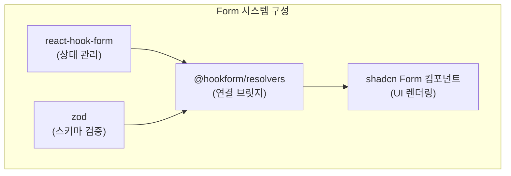
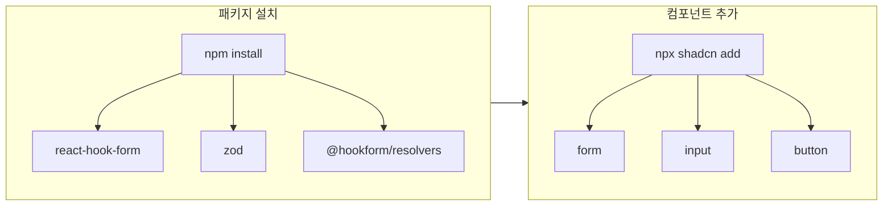
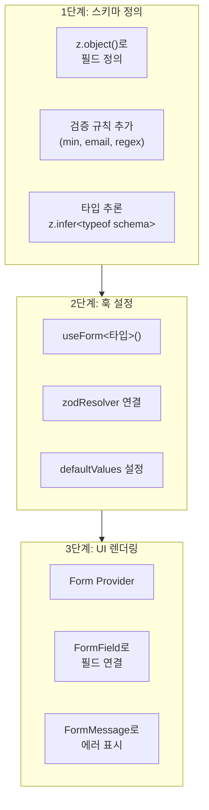
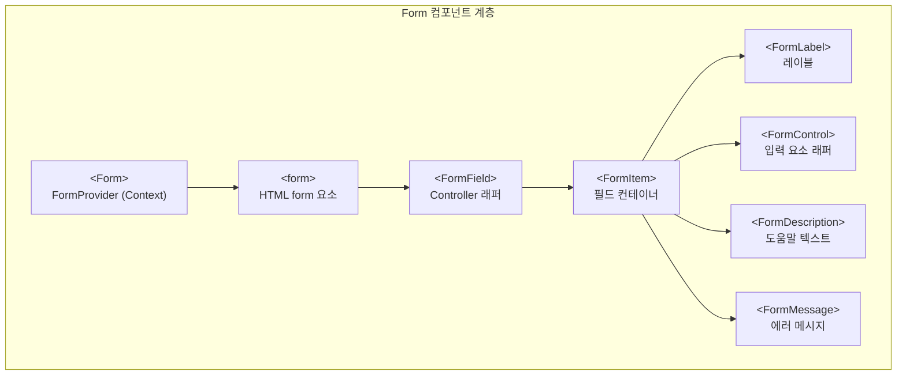
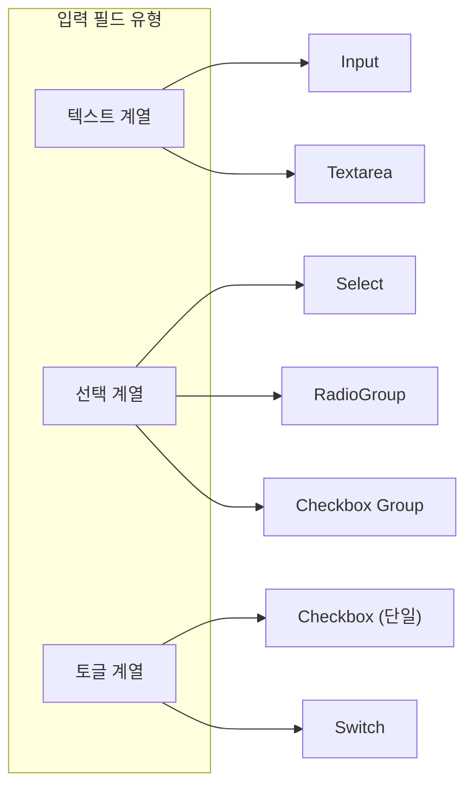
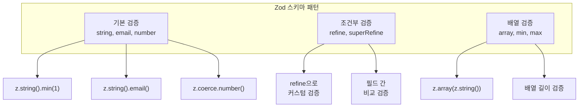
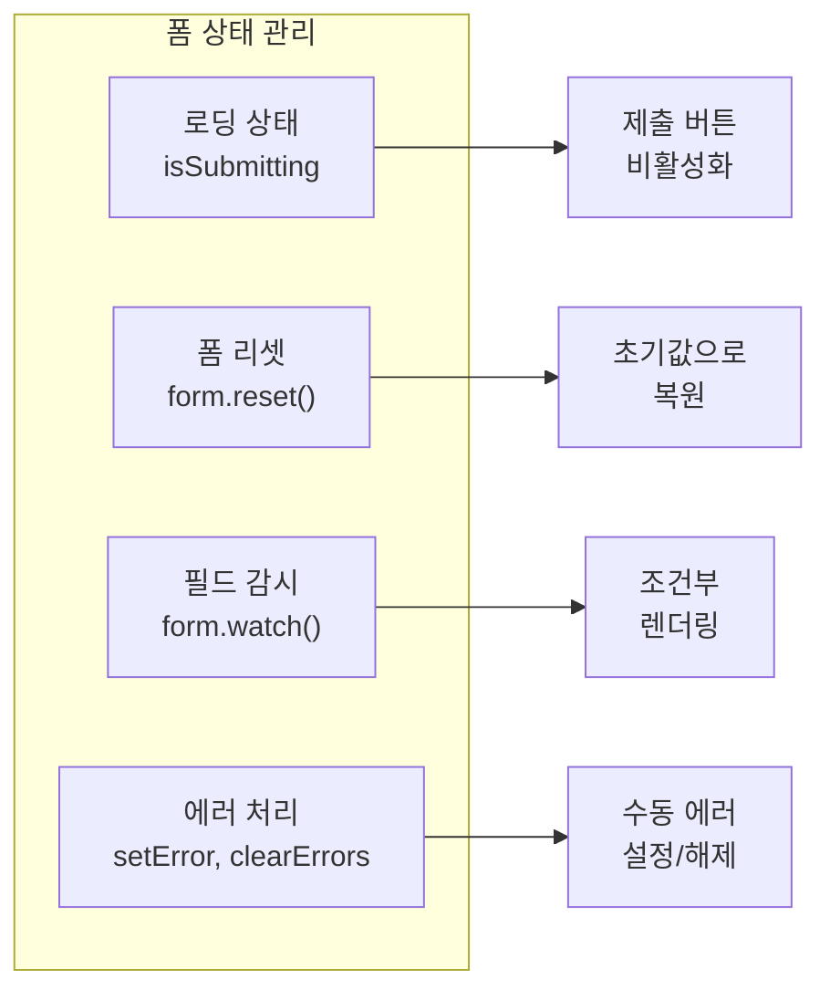
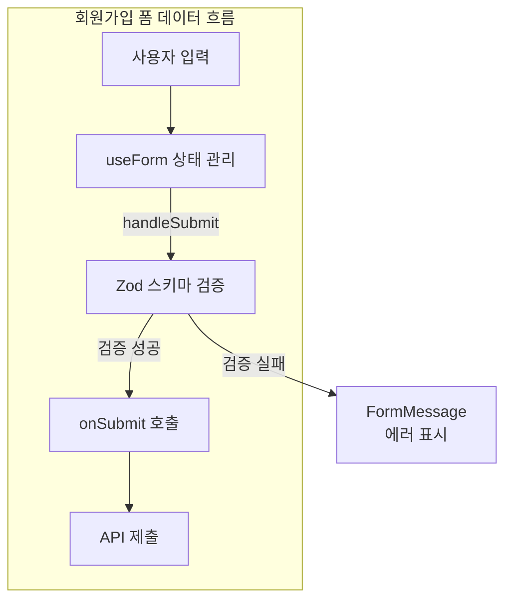
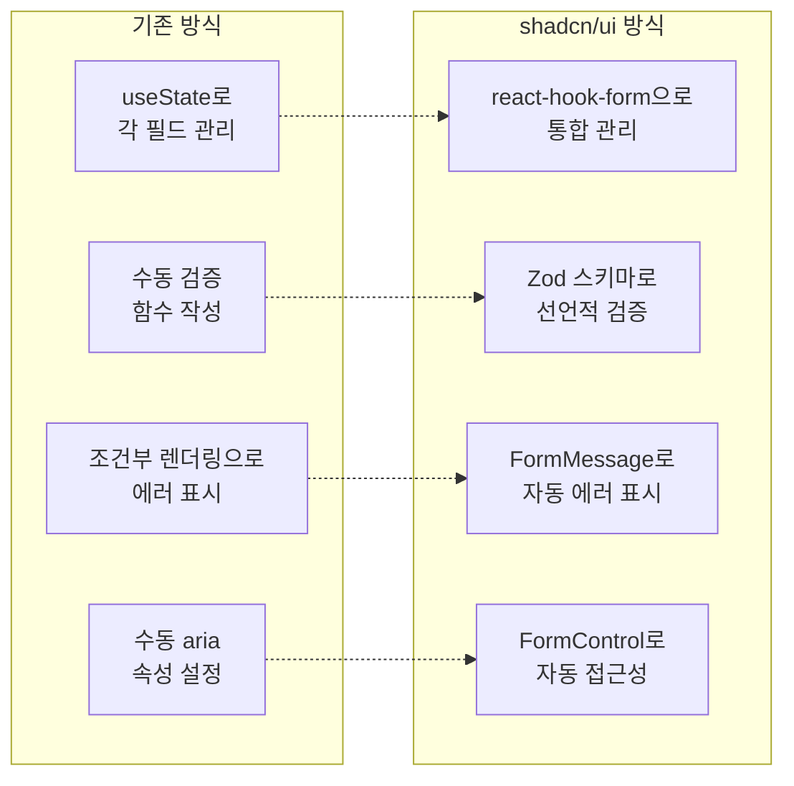

# Form 컴포넌트 심층 분석

## 개요

shadcn/ui의 Form 시스템은 **React Hook Form**과 **Zod**를 통합하여 타입 안전한 폼 검증을 제공합니다. React Hook Form은 폼의 상태를 효율적으로 관리하고, Zod는 런타임에서 데이터의 형태와 유효성을 검증합니다. 이 두 라이브러리를 연결하는 @hookform/resolvers를 통해 스키마 기반 검증이 자동으로 이루어지며, shadcn의 Form 컴포넌트는 이 모든 기능을 일관된 UI로 감싸 접근성과 에러 표시를 자동화합니다.

### 핵심 구성 요소



**React Hook Form**은 비제어 컴포넌트 기반으로 리렌더링을 최소화하면서 폼 상태를 관리합니다. **Zod**는 TypeScript 친화적인 스키마 검증 라이브러리로, 스키마 정의만으로 타입 추론이 가능합니다. **@hookform/resolvers**는 이 둘을 연결하여 Zod 스키마가 React Hook Form의 검증 로직으로 동작하게 합니다. **shadcn Form 컴포넌트**는 레이블, 에러 메시지, 접근성 속성을 자동으로 처리하는 UI 레이어입니다.

---

## 설치

```bash
# 필수 패키지
npm install react-hook-form zod @hookform/resolvers

# Form 컴포넌트 추가
npx shadcn@latest add form
npx shadcn@latest add input
npx shadcn@latest add button
```



npm으로 핵심 라이브러리를 설치한 후, shadcn CLI로 UI 컴포넌트를 프로젝트에 추가합니다. form 컴포넌트는 React Hook Form과 통합된 래퍼들(Form, FormField, FormItem 등)을 제공하고, input과 button은 폼 내에서 사용할 기본 입력 요소입니다.

---

## 기본 구조

shadcn/ui 폼은 세 단계로 구성됩니다. 첫째, Zod로 데이터 스키마를 정의합니다. 둘째, useForm 훅으로 폼 상태를 설정합니다. 셋째, Form 컴포넌트로 UI를 렌더링합니다.



### 1. Zod 스키마 정의

```tsx
import { z } from "zod"

const formSchema = z.object({
  username: z.string()
    .min(2, { message: "최소 2자 이상 입력하세요." })
    .max(20, { message: "최대 20자까지 입력 가능합니다." }),
  email: z.string()
    .email({ message: "올바른 이메일 형식이 아닙니다." }),
  password: z.string()
    .min(8, { message: "비밀번호는 최소 8자입니다." })
    .regex(/[A-Z]/, { message: "대문자를 포함해야 합니다." })
    .regex(/[0-9]/, { message: "숫자를 포함해야 합니다." }),
})

// 타입 추론
type FormValues = z.infer<typeof formSchema>
// → { username: string; email: string; password: string }
```

**z.object()**로 폼 필드의 구조를 정의하고, 각 필드에 **min**, **max**, **email**, **regex** 같은 검증 규칙을 체이닝합니다. 검증 실패 시 표시할 메시지는 객체 형태로 전달합니다. **z.infer**를 사용하면 스키마로부터 TypeScript 타입을 자동으로 추론할 수 있어, 스키마 정의 한 번으로 런타임 검증과 컴파일 타임 타입 안전성을 모두 확보합니다.

### 2. useForm 훅 설정

```tsx
import { useForm } from "react-hook-form"
import { zodResolver } from "@hookform/resolvers/zod"

function MyForm() {
  const form = useForm<FormValues>({
    resolver: zodResolver(formSchema),
    defaultValues: {
      username: "",
      email: "",
      password: "",
    },
  })

  function onSubmit(values: FormValues) {
    // ✅ 타입 안전 + 검증 완료
    console.log(values)
  }

  // ...
}
```

**useForm** 훅은 폼의 상태와 메서드를 반환합니다. **resolver** 옵션에 **zodResolver(formSchema)**를 전달하면 Zod 스키마가 검증 로직으로 연결됩니다. **defaultValues**는 폼의 초기값을 설정하며, 이 값들은 controlled 방식이 아닌 ref 기반으로 관리되어 리렌더링이 최소화됩니다. **onSubmit** 함수는 검증을 통과한 후에만 호출되므로, values 파라미터는 항상 유효한 데이터입니다.

### 3. Form 컴포넌트 구조

```tsx
import {
  Form,
  FormControl,
  FormDescription,
  FormField,
  FormItem,
  FormLabel,
  FormMessage,
} from "@/components/ui/form"

return (
  <Form {...form}>
    <form onSubmit={form.handleSubmit(onSubmit)} className="space-y-6">
      <FormField
        control={form.control}
        name="username"
        render={({ field }) => (
          <FormItem>
            <FormLabel>사용자명</FormLabel>
            <FormControl>
              <Input placeholder="username" {...field} />
            </FormControl>
            <FormDescription>
              공개적으로 표시되는 이름입니다.
            </FormDescription>
            <FormMessage />
          </FormItem>
        )}
      />
      <Button type="submit">제출</Button>
    </form>
  </Form>
)
```

**Form** 컴포넌트는 spread 문법으로 form 객체를 받아 Context로 자식에게 전달합니다. **FormField**는 react-hook-form의 Controller를 감싸며, name prop으로 스키마의 필드와 연결됩니다. render prop의 field 객체에는 value, onChange, onBlur 등이 포함되어 입력 컴포넌트에 전달됩니다. **FormMessage**는 해당 필드에 에러가 있으면 자동으로 메시지를 표시합니다.

---

## Form 컴포넌트 분석

### 컴포넌트 계층 구조



**Form**은 최상위에서 React Hook Form의 FormProvider 역할을 합니다. **FormField**는 react-hook-form의 Controller를 래핑하여 controlled 컴포넌트처럼 동작하게 합니다. **FormItem**은 하나의 폼 필드를 담는 컨테이너로, 내부적으로 고유한 id를 생성하여 레이블과 입력 요소를 연결합니다. **FormControl**은 입력 요소에 aria-describedby 같은 접근성 속성을 자동으로 추가합니다.

### 각 컴포넌트의 역할

| 컴포넌트 | 역할 | 내부 동작 |
|---------|------|----------|
| `Form` | Context Provider | form 객체를 자식에게 전달 |
| `FormField` | Controller 래퍼 | react-hook-form Controller 사용 |
| `FormItem` | 필드 컨테이너 | id 생성 및 Context 제공 |
| `FormLabel` | 레이블 | htmlFor 자동 연결 |
| `FormControl` | 입력 래퍼 | aria-* 속성 자동 추가 |
| `FormDescription` | 설명 텍스트 | aria-describedby 연결 |
| `FormMessage` | 에러 표시 | 에러 메시지 자동 표시 |

**Form**은 useForm이 반환한 객체를 Context로 제공하여 하위 컴포넌트들이 폼 상태에 접근할 수 있게 합니다. **FormField**는 name prop을 받아 해당 필드의 상태를 추적하고, render prop 패턴으로 커스텀 입력 컴포넌트를 렌더링합니다. **FormItem**은 useId로 고유 id를 생성하고, 이 id를 Context로 공유하여 FormLabel의 htmlFor와 FormControl의 id가 자동으로 일치하게 합니다. **FormMessage**는 해당 필드의 에러 상태를 구독하여 에러가 있을 때만 메시지를 렌더링합니다.

---

## 다양한 입력 필드 구현

shadcn/ui의 FormField는 다양한 입력 타입과 함께 사용할 수 있습니다. 각 입력 컴포넌트는 field 객체의 value와 onChange를 적절히 연결하면 되며, 컴포넌트별로 약간씩 다른 인터페이스를 가집니다.



### Input (텍스트 입력)

```tsx
<FormField
  control={form.control}
  name="email"
  render={({ field }) => (
    <FormItem>
      <FormLabel>이메일</FormLabel>
      <FormControl>
        <Input type="email" placeholder="email@example.com" {...field} />
      </FormControl>
      <FormMessage />
    </FormItem>
  )}
/>
```

Input은 가장 기본적인 텍스트 입력 컴포넌트입니다. field 객체를 spread하면 value, onChange, onBlur, name, ref가 모두 전달됩니다. type prop으로 email, password, number 등을 지정할 수 있습니다.

### Textarea

```tsx
import { Textarea } from "@/components/ui/textarea"

<FormField
  control={form.control}
  name="bio"
  render={({ field }) => (
    <FormItem>
      <FormLabel>자기소개</FormLabel>
      <FormControl>
        <Textarea
          placeholder="자신에 대해 소개해주세요..."
          className="min-h-[120px]"
          {...field}
        />
      </FormControl>
      <FormDescription>
        최소 20자 이상 작성해주세요.
      </FormDescription>
      <FormMessage />
    </FormItem>
  )}
/>
```

Textarea는 여러 줄의 텍스트를 입력받을 때 사용합니다. Input과 동일하게 field를 spread하면 되고, className으로 최소 높이를 지정하여 적절한 크기를 확보합니다.

### Select

```tsx
import {
  Select,
  SelectContent,
  SelectItem,
  SelectTrigger,
  SelectValue,
} from "@/components/ui/select"

<FormField
  control={form.control}
  name="role"
  render={({ field }) => (
    <FormItem>
      <FormLabel>역할</FormLabel>
      <Select onValueChange={field.onChange} defaultValue={field.value}>
        <FormControl>
          <SelectTrigger>
            <SelectValue placeholder="역할을 선택하세요" />
          </SelectTrigger>
        </FormControl>
        <SelectContent>
          <SelectItem value="admin">관리자</SelectItem>
          <SelectItem value="user">일반 사용자</SelectItem>
          <SelectItem value="guest">게스트</SelectItem>
        </SelectContent>
      </Select>
      <FormMessage />
    </FormItem>
  )}
/>
```

Select는 Radix UI 기반으로 네이티브 select보다 풍부한 스타일링이 가능합니다. **onValueChange**에 field.onChange를, **defaultValue**에 field.value를 전달합니다. FormControl은 SelectTrigger를 감싸 접근성 속성을 추가합니다. Select 컴포넌트 자체는 FormControl 밖에 위치해야 합니다.

### Checkbox (단일)

```tsx
import { Checkbox } from "@/components/ui/checkbox"

<FormField
  control={form.control}
  name="terms"
  render={({ field }) => (
    <FormItem className="flex flex-row items-start space-x-3 space-y-0">
      <FormControl>
        <Checkbox
          checked={field.value}
          onCheckedChange={field.onChange}
        />
      </FormControl>
      <div className="space-y-1 leading-none">
        <FormLabel>이용약관에 동의합니다</FormLabel>
        <FormDescription>
          서비스 이용을 위해 약관에 동의해주세요.
        </FormDescription>
      </div>
      <FormMessage />
    </FormItem>
  )}
/>
```

단일 Checkbox는 boolean 값을 다룹니다. **checked**에 field.value를, **onCheckedChange**에 field.onChange를 전달합니다. 레이아웃이 일반 필드와 다르므로 FormItem에 flex 스타일을 적용하여 체크박스와 레이블을 가로로 배치합니다.

### Checkbox Group (다중 선택)

```tsx
const items = [
  { id: "email", label: "이메일 알림" },
  { id: "sms", label: "SMS 알림" },
  { id: "push", label: "푸시 알림" },
]

<FormField
  control={form.control}
  name="notifications"
  render={({ field }) => (
    <FormItem>
      <FormLabel>알림 설정</FormLabel>
      <div className="space-y-2">
        {items.map((item) => (
          <div key={item.id} className="flex items-center space-x-2">
            <Checkbox
              id={item.id}
              checked={field.value?.includes(item.id)}
              onCheckedChange={(checked) => {
                const newValue = checked
                  ? [...(field.value || []), item.id]
                  : field.value?.filter((v: string) => v !== item.id)
                field.onChange(newValue)
              }}
            />
            <label htmlFor={item.id}>{item.label}</label>
          </div>
        ))}
      </div>
      <FormMessage />
    </FormItem>
  )}
/>
```

Checkbox Group은 배열 값을 다룹니다. 각 체크박스의 체크 상태는 field.value 배열에 해당 id가 포함되어 있는지로 판단합니다. onCheckedChange에서는 checked 상태에 따라 배열에 값을 추가하거나 제거하여 field.onChange로 전달합니다.

### Radio Group

```tsx
import { RadioGroup, RadioGroupItem } from "@/components/ui/radio-group"

<FormField
  control={form.control}
  name="plan"
  render={({ field }) => (
    <FormItem>
      <FormLabel>구독 플랜</FormLabel>
      <FormControl>
        <RadioGroup
          onValueChange={field.onChange}
          defaultValue={field.value}
          className="flex flex-col space-y-2"
        >
          <div className="flex items-center space-x-2">
            <RadioGroupItem value="free" id="free" />
            <label htmlFor="free">무료</label>
          </div>
          <div className="flex items-center space-x-2">
            <RadioGroupItem value="pro" id="pro" />
            <label htmlFor="pro">프로 ($9/월)</label>
          </div>
          <div className="flex items-center space-x-2">
            <RadioGroupItem value="enterprise" id="enterprise" />
            <label htmlFor="enterprise">엔터프라이즈 (문의)</label>
          </div>
        </RadioGroup>
      </FormControl>
      <FormMessage />
    </FormItem>
  )}
/>
```

RadioGroup은 단일 선택 그룹입니다. Select와 마찬가지로 **onValueChange**와 **defaultValue**를 사용합니다. 각 RadioGroupItem은 고유한 value를 가지며, 선택 시 해당 value가 field.onChange로 전달됩니다.

### Switch

```tsx
import { Switch } from "@/components/ui/switch"

<FormField
  control={form.control}
  name="marketing"
  render={({ field }) => (
    <FormItem className="flex flex-row items-center justify-between rounded-lg border p-4">
      <div className="space-y-0.5">
        <FormLabel className="text-base">마케팅 이메일</FormLabel>
        <FormDescription>
          새로운 제품 및 기능 소식을 받아보세요.
        </FormDescription>
      </div>
      <FormControl>
        <Switch
          checked={field.value}
          onCheckedChange={field.onChange}
        />
      </FormControl>
    </FormItem>
  )}
/>
```

Switch는 토글 형태의 boolean 입력입니다. Checkbox와 동일하게 **checked**와 **onCheckedChange**를 사용합니다. 설정 페이지에서 자주 사용되며, 레이블과 설명을 왼쪽에, 스위치를 오른쪽에 배치하는 레이아웃이 일반적입니다.

---

## Zod 스키마 패턴

Zod는 다양한 검증 시나리오를 지원합니다. 기본 타입 검증부터 조건부 검증, 배열 검증까지 선언적으로 정의할 수 있습니다.



### 기본 검증

```tsx
const schema = z.object({
  // 문자열
  name: z.string().min(1, "필수 입력"),

  // 이메일
  email: z.string().email("올바른 이메일 형식이 아닙니다"),

  // 숫자
  age: z.coerce.number().min(18, "18세 이상만 가입 가능"),

  // 선택적 필드
  nickname: z.string().optional(),

  // 기본값
  role: z.string().default("user"),

  // 불리언
  terms: z.literal(true, {
    errorMap: () => ({ message: "약관에 동의해야 합니다" }),
  }),
})
```

**z.string().min(1)**은 빈 문자열을 허용하지 않는 필수 입력을 의미합니다. **z.coerce.number()**는 문자열 입력을 숫자로 변환한 후 검증합니다. **optional()**은 undefined를 허용하고, **default()**는 값이 없을 때 기본값을 설정합니다. **z.literal(true)**는 정확히 true 값만 허용하여 필수 동의 체크박스에 적합합니다.

### 조건부 검증

```tsx
const schema = z.object({
  accountType: z.enum(["personal", "business"]),
  companyName: z.string().optional(),
}).refine(
  (data) => {
    // 비즈니스 계정이면 회사명 필수
    if (data.accountType === "business") {
      return !!data.companyName
    }
    return true
  },
  {
    message: "비즈니스 계정은 회사명이 필요합니다",
    path: ["companyName"],
  }
)
```

**refine**은 객체 전체를 검사하는 커스텀 검증 함수를 추가합니다. 첫 번째 인자는 유효성을 판단하는 함수이고, 두 번째 인자의 **path**는 에러 메시지가 표시될 필드를 지정합니다. 이 패턴으로 필드 간의 의존 관계를 검증할 수 있습니다.

### 비밀번호 확인

```tsx
const schema = z.object({
  password: z.string().min(8),
  confirmPassword: z.string(),
}).refine(
  (data) => data.password === data.confirmPassword,
  {
    message: "비밀번호가 일치하지 않습니다",
    path: ["confirmPassword"],
  }
)
```

비밀번호 확인은 refine의 대표적인 사용 사례입니다. password와 confirmPassword가 일치하는지 검사하고, 불일치 시 confirmPassword 필드에 에러를 표시합니다.

### 배열 검증

```tsx
const schema = z.object({
  tags: z.array(z.string())
    .min(1, "최소 1개 선택")
    .max(5, "최대 5개까지 선택 가능"),
})
```

**z.array()**는 배열 타입을 정의하며, 괄호 안에 배열 요소의 타입을 지정합니다. **min**과 **max**로 배열의 길이를 제한할 수 있습니다.

---

## 폼 상태 관리

React Hook Form은 다양한 폼 상태 관리 기능을 제공합니다. 로딩 상태, 리셋, 필드 감시, 에러 처리를 선언적으로 다룰 수 있습니다.



### 로딩 상태

```tsx
function MyForm() {
  const form = useForm<FormValues>({...})
  const [isLoading, setIsLoading] = React.useState(false)

  async function onSubmit(values: FormValues) {
    setIsLoading(true)
    try {
      await submitToAPI(values)
    } finally {
      setIsLoading(false)
    }
  }

  return (
    <Form {...form}>
      <form onSubmit={form.handleSubmit(onSubmit)}>
        {/* 필드들 */}
        <Button type="submit" disabled={isLoading}>
          {isLoading && <Loader2 className="mr-2 h-4 w-4 animate-spin" />}
          {isLoading ? "제출 중..." : "제출"}
        </Button>
      </form>
    </Form>
  )
}
```

API 호출 중에는 버튼을 비활성화하고 로딩 인디케이터를 표시하여 중복 제출을 방지합니다. React Hook Form의 **formState.isSubmitting**을 사용할 수도 있지만, 비동기 처리의 전체 라이프사이클을 제어하려면 별도의 state가 유용합니다.

### 폼 리셋

```tsx
<Button type="button" variant="outline" onClick={() => form.reset()}>
  초기화
</Button>
```

**form.reset()**은 모든 필드를 defaultValues로 복원하고 에러 상태도 초기화합니다. 특정 값으로 리셋하려면 **form.reset({ username: "new" })**처럼 객체를 전달합니다.

### 필드 감시

```tsx
// 특정 필드 값 감시
const watchedValue = form.watch("username")

// 모든 필드 감시
const allValues = form.watch()

// 조건부 렌더링에 활용
{form.watch("accountType") === "business" && (
  <FormField name="companyName" ... />
)}
```

**form.watch()**는 필드 값의 변화를 실시간으로 추적합니다. 특정 필드명을 전달하면 해당 값만, 인자 없이 호출하면 전체 폼 데이터를 반환합니다. 조건부 렌더링에 활용하여 특정 조건에서만 추가 필드를 표시할 수 있습니다.

### 에러 처리

```tsx
// 수동 에러 설정
form.setError("email", {
  type: "manual",
  message: "이미 사용 중인 이메일입니다",
})

// 특정 필드 에러 초기화
form.clearErrors("email")

// 모든 에러 초기화
form.clearErrors()
```

**setError**는 서버 응답에 따라 에러를 수동으로 설정할 때 사용합니다. 예를 들어 이메일 중복 확인 API 응답 후 해당 필드에 에러를 표시할 수 있습니다. **clearErrors**는 특정 필드 또는 전체 에러를 지웁니다.

---

## 전체 예시: 회원가입 폼

다음은 지금까지 설명한 패턴을 모두 적용한 회원가입 폼 예시입니다.



```tsx
"use client"

import { zodResolver } from "@hookform/resolvers/zod"
import { useForm } from "react-hook-form"
import { z } from "zod"
import { Loader2 } from "lucide-react"

import { Button } from "@/components/ui/button"
import { Checkbox } from "@/components/ui/checkbox"
import {
  Form,
  FormControl,
  FormDescription,
  FormField,
  FormItem,
  FormLabel,
  FormMessage,
} from "@/components/ui/form"
import { Input } from "@/components/ui/input"

const signUpSchema = z.object({
  username: z.string()
    .min(3, "사용자명은 최소 3자입니다")
    .max(20, "사용자명은 최대 20자입니다")
    .regex(/^[a-zA-Z0-9_]+$/, "영문, 숫자, 언더스코어만 허용"),
  email: z.string().email("올바른 이메일을 입력하세요"),
  password: z.string()
    .min(8, "비밀번호는 최소 8자입니다")
    .regex(/[A-Z]/, "대문자를 포함해야 합니다")
    .regex(/[0-9]/, "숫자를 포함해야 합니다"),
  confirmPassword: z.string(),
  terms: z.literal(true, {
    errorMap: () => ({ message: "약관에 동의해야 합니다" }),
  }),
}).refine((data) => data.password === data.confirmPassword, {
  message: "비밀번호가 일치하지 않습니다",
  path: ["confirmPassword"],
})

type SignUpValues = z.infer<typeof signUpSchema>

export function SignUpForm() {
  const [isLoading, setIsLoading] = React.useState(false)

  const form = useForm<SignUpValues>({
    resolver: zodResolver(signUpSchema),
    defaultValues: {
      username: "",
      email: "",
      password: "",
      confirmPassword: "",
      terms: false,
    },
  })

  async function onSubmit(values: SignUpValues) {
    setIsLoading(true)
    try {
      // API 호출
      console.log(values)
      // 성공 처리
    } catch (error) {
      // 에러 처리
    } finally {
      setIsLoading(false)
    }
  }

  return (
    <Form {...form}>
      <form onSubmit={form.handleSubmit(onSubmit)} className="space-y-6">
        <FormField
          control={form.control}
          name="username"
          render={({ field }) => (
            <FormItem>
              <FormLabel>사용자명</FormLabel>
              <FormControl>
                <Input placeholder="username" {...field} />
              </FormControl>
              <FormDescription>
                영문, 숫자, 언더스코어만 사용 가능합니다.
              </FormDescription>
              <FormMessage />
            </FormItem>
          )}
        />

        <FormField
          control={form.control}
          name="email"
          render={({ field }) => (
            <FormItem>
              <FormLabel>이메일</FormLabel>
              <FormControl>
                <Input type="email" placeholder="email@example.com" {...field} />
              </FormControl>
              <FormMessage />
            </FormItem>
          )}
        />

        <FormField
          control={form.control}
          name="password"
          render={({ field }) => (
            <FormItem>
              <FormLabel>비밀번호</FormLabel>
              <FormControl>
                <Input type="password" {...field} />
              </FormControl>
              <FormDescription>
                8자 이상, 대문자와 숫자 포함
              </FormDescription>
              <FormMessage />
            </FormItem>
          )}
        />

        <FormField
          control={form.control}
          name="confirmPassword"
          render={({ field }) => (
            <FormItem>
              <FormLabel>비밀번호 확인</FormLabel>
              <FormControl>
                <Input type="password" {...field} />
              </FormControl>
              <FormMessage />
            </FormItem>
          )}
        />

        <FormField
          control={form.control}
          name="terms"
          render={({ field }) => (
            <FormItem className="flex flex-row items-start space-x-3 space-y-0">
              <FormControl>
                <Checkbox
                  checked={field.value}
                  onCheckedChange={field.onChange}
                />
              </FormControl>
              <div className="space-y-1 leading-none">
                <FormLabel>이용약관에 동의합니다</FormLabel>
              </div>
              <FormMessage />
            </FormItem>
          )}
        />

        <Button type="submit" className="w-full" disabled={isLoading}>
          {isLoading && <Loader2 className="mr-2 h-4 w-4 animate-spin" />}
          {isLoading ? "가입 중..." : "회원가입"}
        </Button>
      </form>
    </Form>
  )
}
```

이 예시에서 Zod 스키마는 사용자명 규칙(3-20자, 영문숫자언더스코어), 이메일 형식, 비밀번호 강도(8자 이상, 대문자, 숫자 포함), 비밀번호 일치, 약관 동의를 검증합니다. 검증 실패 시 각 FormMessage에 해당 에러가 자동으로 표시됩니다.

---

## TPS 적용 포인트

### 기존 폼과 비교



| 항목 | 기존 방식 | shadcn/ui 방식 |
|-----|----------|---------------|
| 상태 관리 | useState 직접 관리 | react-hook-form |
| 검증 | 수동 검증 함수 | Zod 스키마 |
| 에러 표시 | 조건부 렌더링 | FormMessage 자동 |
| 접근성 | 수동 aria 설정 | 자동 처리 |

기존 방식에서는 각 필드마다 useState를 선언하고, 검증 로직을 직접 작성하며, 에러 메시지를 조건부로 렌더링해야 했습니다. shadcn/ui 방식에서는 useForm 하나로 모든 필드 상태를 관리하고, Zod 스키마로 검증 규칙을 선언적으로 정의하며, FormMessage가 에러를 자동으로 표시합니다.

### 도입 가능한 패턴

1. **Zod 스키마**: 타입과 검증을 한 번에 정의하여 런타임 검증과 컴파일 타임 타입 안전성을 동시에 확보합니다.
2. **FormField 패턴**: 모든 폼 필드가 동일한 구조(FormItem, FormLabel, FormControl, FormMessage)를 따르므로 코드 일관성이 높아집니다.
3. **에러 메시지 자동화**: 스키마에 정의된 에러 메시지가 FormMessage를 통해 자동으로 표시되어 UI와 검증 로직의 결합도가 낮아집니다.

---

## 다음 단계

Form 컴포넌트를 이해했다면, 다음 문서에서는 레이아웃/네비게이션 컴포넌트(Dialog, Tabs, Sidebar 등)를 살펴봅니다.
