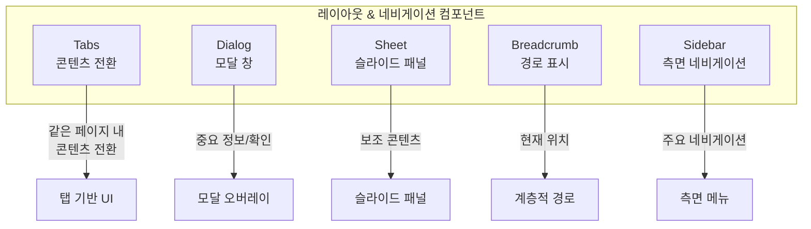
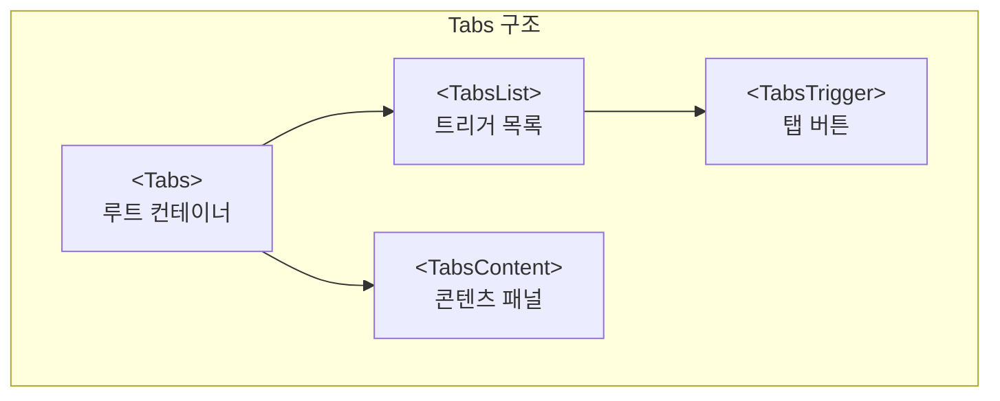
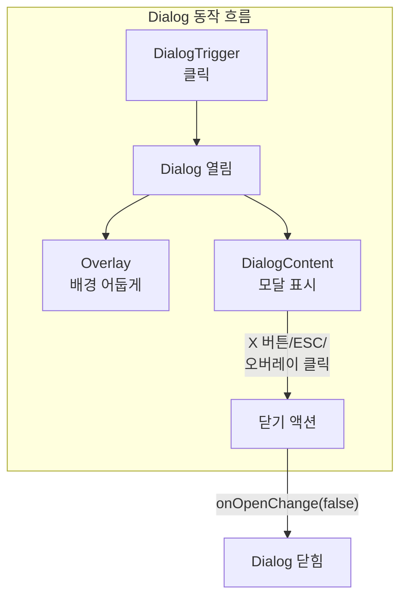
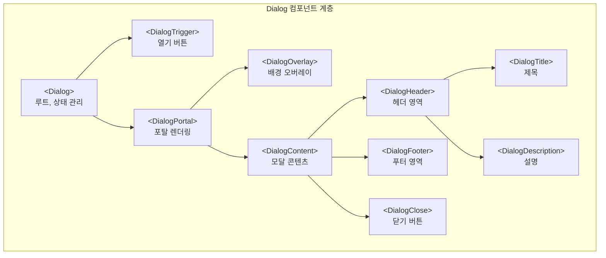
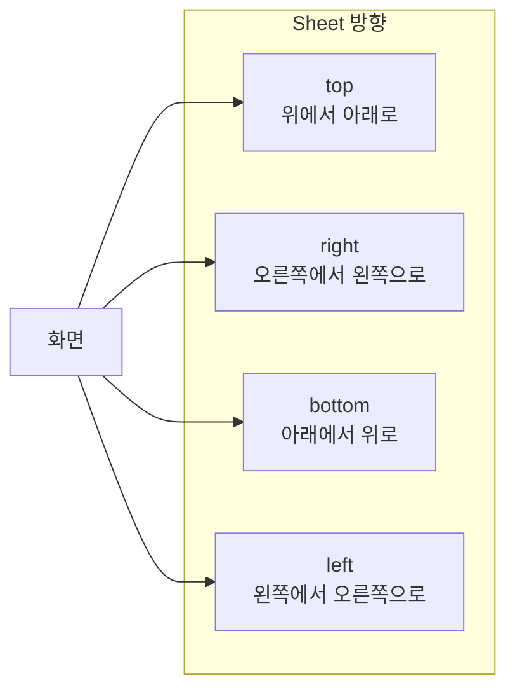
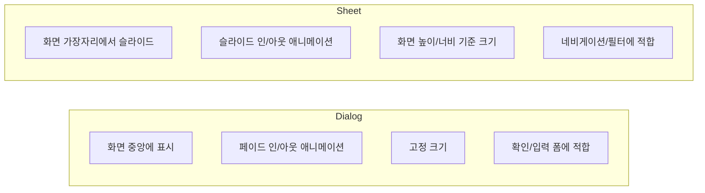
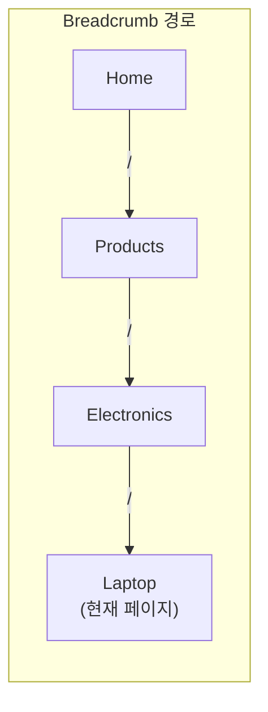
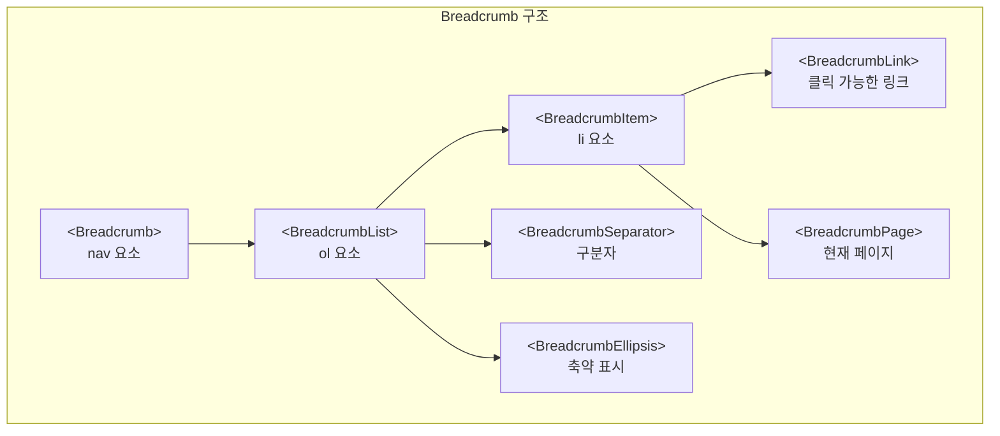
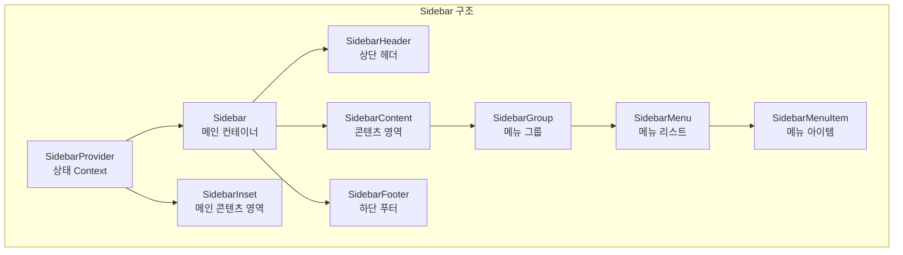
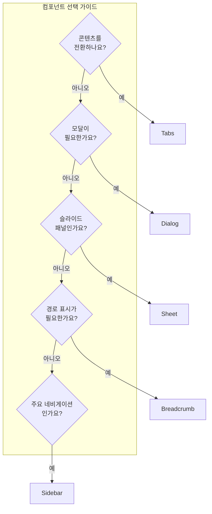

# 레이아웃 & 네비게이션 컴포넌트

## 개요

레이아웃과 네비게이션 컴포넌트는 애플리케이션의 구조와 사용자 경험을 결정하는 핵심 요소입니다. shadcn/ui는 Radix UI 프리미티브를 기반으로 접근성과 유연성을 갖춘 레이아웃 컴포넌트를 제공합니다. 이 문서에서는 Tabs, Dialog, Sheet, Breadcrumb, Sidebar 다섯 가지 핵심 컴포넌트를 심층적으로 다룹니다.



---

## Tabs 컴포넌트

### 개요

Tabs는 콘텐츠를 여러 패널로 나누어 한 번에 하나씩 표시하는 컴포넌트입니다. 같은 페이지 내에서 관련된 콘텐츠를 전환할 때 사용하며, 사용자가 전체 페이지를 새로고침하지 않고도 다른 섹션을 볼 수 있게 합니다.

### 의존성

```bash
# CLI로 설치
npx shadcn@latest add tabs

# 수동 설치
npm install @radix-ui/react-tabs
```

### 기본 구조

```tsx
import { Tabs, TabsContent, TabsList, TabsTrigger } from "@/components/ui/tabs"

<Tabs defaultValue="account" className="w-[400px]">
  <TabsList>
    <TabsTrigger value="account">Account</TabsTrigger>
    <TabsTrigger value="password">Password</TabsTrigger>
  </TabsList>
  <TabsContent value="account">Make changes to your account here.</TabsContent>
  <TabsContent value="password">Change your password here.</TabsContent>
</Tabs>
```

### 구성 요소



| 컴포넌트 | 역할 |
|---------|------|
| `Tabs` | 루트 컨테이너로 탭의 상태를 관리합니다. defaultValue 또는 value로 활성 탭을 지정합니다. |
| `TabsList` | 탭 트리거 버튼들을 담는 컨테이너입니다. 시각적으로 탭 버튼 그룹을 묶어줍니다. |
| `TabsTrigger` | 개별 탭을 선택하는 버튼입니다. value prop으로 해당 탭을 식별합니다. |
| `TabsContent` | 선택된 탭에 해당하는 콘텐츠를 표시하는 패널입니다. value가 일치할 때만 렌더링됩니다. |

### 실제 사용 예시

```tsx
import { Button } from "@/components/ui/button"
import {
  Card,
  CardContent,
  CardDescription,
  CardFooter,
  CardHeader,
  CardTitle,
} from "@/components/ui/card"
import { Input } from "@/components/ui/input"
import { Label } from "@/components/ui/label"
import { Tabs, TabsContent, TabsList, TabsTrigger } from "@/components/ui/tabs"

export function SettingsTabs() {
  return (
    <Tabs defaultValue="account" className="w-full max-w-md">
      <TabsList className="grid w-full grid-cols-2">
        <TabsTrigger value="account">Account</TabsTrigger>
        <TabsTrigger value="password">Password</TabsTrigger>
      </TabsList>

      <TabsContent value="account">
        <Card>
          <CardHeader>
            <CardTitle>Account</CardTitle>
            <CardDescription>
              Make changes to your account here.
            </CardDescription>
          </CardHeader>
          <CardContent className="space-y-4">
            <div className="space-y-2">
              <Label htmlFor="name">Name</Label>
              <Input id="name" defaultValue="Pedro Duarte" />
            </div>
            <div className="space-y-2">
              <Label htmlFor="username">Username</Label>
              <Input id="username" defaultValue="@peduarte" />
            </div>
          </CardContent>
          <CardFooter>
            <Button>Save changes</Button>
          </CardFooter>
        </Card>
      </TabsContent>

      <TabsContent value="password">
        <Card>
          <CardHeader>
            <CardTitle>Password</CardTitle>
            <CardDescription>
              Change your password here.
            </CardDescription>
          </CardHeader>
          <CardContent className="space-y-4">
            <div className="space-y-2">
              <Label htmlFor="current">Current password</Label>
              <Input id="current" type="password" />
            </div>
            <div className="space-y-2">
              <Label htmlFor="new">New password</Label>
              <Input id="new" type="password" />
            </div>
          </CardContent>
          <CardFooter>
            <Button>Save password</Button>
          </CardFooter>
        </Card>
      </TabsContent>
    </Tabs>
  )
}
```

이 예시는 설정 페이지에서 계정 정보와 비밀번호 변경을 탭으로 분리한 패턴입니다. `grid grid-cols-2` 클래스로 탭 버튼을 균등하게 배치하고, 각 탭 콘텐츠에 Card 컴포넌트를 사용하여 폼을 구조화합니다.

### 주요 Props

| Prop | 타입 | 설명 |
|------|------|------|
| `defaultValue` | `string` | 초기에 선택된 탭의 value입니다. Uncontrolled 모드에서 사용합니다. |
| `value` | `string` | 현재 선택된 탭의 value입니다. Controlled 모드에서 사용합니다. |
| `onValueChange` | `(value: string) => void` | 탭이 변경될 때 호출되는 콜백입니다. 새로 선택된 탭의 value가 전달됩니다. |
| `orientation` | `"horizontal" \| "vertical"` | 탭의 배치 방향입니다. 기본값은 horizontal입니다. |

### Controlled 사용

```tsx
import * as React from "react"

function ControlledTabs() {
  const [tab, setTab] = React.useState("account")

  return (
    <Tabs value={tab} onValueChange={setTab}>
      <TabsList>
        <TabsTrigger value="account">Account</TabsTrigger>
        <TabsTrigger value="settings">Settings</TabsTrigger>
      </TabsList>
      <TabsContent value="account">Account content</TabsContent>
      <TabsContent value="settings">Settings content</TabsContent>
    </Tabs>
  )
}
```

Controlled 모드에서는 value와 onValueChange를 함께 사용하여 탭 상태를 외부에서 관리합니다. URL 파라미터와 동기화하거나 다른 컴포넌트와 상태를 공유할 때 유용합니다.

---

## Dialog 컴포넌트

### 개요

Dialog는 사용자의 주의를 끌어 중요한 정보를 표시하거나 결정을 요청하는 모달 창입니다. 화면 중앙에 오버레이와 함께 나타나며, 사용자가 모달을 닫기 전까지 배경 콘텐츠와 상호작용할 수 없습니다.



### 의존성

```bash
npx shadcn@latest add dialog

# 수동 설치
npm install @radix-ui/react-dialog
```

### 기본 구조

```tsx
import {
  Dialog,
  DialogContent,
  DialogDescription,
  DialogHeader,
  DialogTitle,
  DialogTrigger,
} from "@/components/ui/dialog"

<Dialog>
  <DialogTrigger>Open</DialogTrigger>
  <DialogContent>
    <DialogHeader>
      <DialogTitle>Are you absolutely sure?</DialogTitle>
      <DialogDescription>
        This action cannot be undone. This will permanently delete your account
        and remove your data from our servers.
      </DialogDescription>
    </DialogHeader>
  </DialogContent>
</Dialog>
```

### 구성 요소



| 컴포넌트 | 역할 | Radix 프리미티브 |
|---------|------|-----------------|
| `Dialog` | 루트 컴포넌트로 열림/닫힘 상태를 관리합니다. | `DialogPrimitive.Root` |
| `DialogTrigger` | 클릭 시 Dialog를 여는 버튼입니다. | `DialogPrimitive.Trigger` |
| `DialogPortal` | 콘텐츠를 DOM 트리 최상위에 렌더링합니다. | `DialogPrimitive.Portal` |
| `DialogOverlay` | 배경을 어둡게 하는 오버레이입니다. | `DialogPrimitive.Overlay` |
| `DialogContent` | 실제 모달 콘텐츠가 들어가는 컨테이너입니다. | `DialogPrimitive.Content` |
| `DialogHeader` | 제목과 설명을 담는 헤더 영역입니다. | 커스텀 div |
| `DialogFooter` | 액션 버튼들을 담는 푸터 영역입니다. | 커스텀 div |
| `DialogTitle` | 모달의 제목으로, 스크린 리더가 인식합니다. | `DialogPrimitive.Title` |
| `DialogDescription` | 모달의 설명으로, 접근성을 위해 중요합니다. | `DialogPrimitive.Description` |
| `DialogClose` | 모달을 닫는 버튼입니다. | `DialogPrimitive.Close` |

### 폼과 함께 사용

```tsx
import { Button } from "@/components/ui/button"
import {
  Dialog,
  DialogContent,
  DialogDescription,
  DialogFooter,
  DialogHeader,
  DialogTitle,
  DialogTrigger,
  DialogClose,
} from "@/components/ui/dialog"
import { Input } from "@/components/ui/input"
import { Label } from "@/components/ui/label"

export function EditProfileDialog() {
  return (
    <Dialog>
      <DialogTrigger asChild>
        <Button variant="outline">Edit Profile</Button>
      </DialogTrigger>
      <DialogContent className="sm:max-w-[425px]">
        <DialogHeader>
          <DialogTitle>Edit profile</DialogTitle>
          <DialogDescription>
            Make changes to your profile here. Click save when you're done.
          </DialogDescription>
        </DialogHeader>
        <div className="grid gap-4 py-4">
          <div className="grid grid-cols-4 items-center gap-4">
            <Label htmlFor="name" className="text-right">
              Name
            </Label>
            <Input id="name" defaultValue="Pedro Duarte" className="col-span-3" />
          </div>
          <div className="grid grid-cols-4 items-center gap-4">
            <Label htmlFor="username" className="text-right">
              Username
            </Label>
            <Input id="username" defaultValue="@peduarte" className="col-span-3" />
          </div>
        </div>
        <DialogFooter>
          <DialogClose asChild>
            <Button variant="outline">Cancel</Button>
          </DialogClose>
          <Button type="submit">Save changes</Button>
        </DialogFooter>
      </DialogContent>
    </Dialog>
  )
}
```

**DialogTrigger asChild**는 기본 button 대신 커스텀 Button 컴포넌트를 트리거로 사용합니다. DialogFooter에서 **DialogClose asChild**로 취소 버튼을 감싸면 클릭 시 자동으로 모달이 닫힙니다.

### Controlled Dialog

```tsx
import * as React from "react"

function ControlledDialog() {
  const [open, setOpen] = React.useState(false)

  const handleSave = async () => {
    // 저장 로직
    await saveData()
    setOpen(false) // 저장 후 닫기
  }

  return (
    <Dialog open={open} onOpenChange={setOpen}>
      <DialogTrigger asChild>
        <Button>Open Dialog</Button>
      </DialogTrigger>
      <DialogContent>
        <DialogHeader>
          <DialogTitle>Edit</DialogTitle>
        </DialogHeader>
        {/* 콘텐츠 */}
        <DialogFooter>
          <Button onClick={handleSave}>Save</Button>
        </DialogFooter>
      </DialogContent>
    </Dialog>
  )
}
```

Controlled 모드에서는 open과 onOpenChange로 모달 상태를 직접 제어합니다. 비동기 작업 완료 후 모달을 닫거나, 특정 조건에서만 닫히도록 제어할 수 있습니다.

### DropdownMenu와 함께 사용

DropdownMenu에서 Dialog를 열 때는 **modal={false}** 설정이 필요합니다. 이 설정이 없으면 DropdownMenu가 닫힐 때 포커스 관리 충돌로 Dialog도 함께 닫힙니다.

```tsx
"use client"

import { useState } from "react"
import { Button } from "@/components/ui/button"
import {
  Dialog,
  DialogContent,
  DialogHeader,
  DialogTitle,
  DialogClose,
  DialogFooter,
} from "@/components/ui/dialog"
import {
  DropdownMenu,
  DropdownMenuContent,
  DropdownMenuItem,
  DropdownMenuTrigger,
} from "@/components/ui/dropdown-menu"

export function DropdownWithDialog() {
  const [showDialog, setShowDialog] = useState(false)

  return (
    <>
      {/* modal={false}가 핵심! */}
      <DropdownMenu modal={false}>
        <DropdownMenuTrigger asChild>
          <Button variant="outline">Actions</Button>
        </DropdownMenuTrigger>
        <DropdownMenuContent>
          <DropdownMenuItem onSelect={() => setShowDialog(true)}>
            Delete...
          </DropdownMenuItem>
        </DropdownMenuContent>
      </DropdownMenu>

      <Dialog open={showDialog} onOpenChange={setShowDialog}>
        <DialogContent>
          <DialogHeader>
            <DialogTitle>Confirm Delete</DialogTitle>
          </DialogHeader>
          <p>Are you sure you want to delete this item?</p>
          <DialogFooter>
            <DialogClose asChild>
              <Button variant="outline">Cancel</Button>
            </DialogClose>
            <Button variant="destructive">Delete</Button>
          </DialogFooter>
        </DialogContent>
      </Dialog>
    </>
  )
}
```

---

## Sheet 컴포넌트

### 개요

Sheet는 화면 가장자리에서 슬라이드되어 나오는 패널입니다. Dialog의 확장 형태로, 보조 콘텐츠나 네비게이션, 필터 패널 등에 사용됩니다. 모바일에서는 전체 화면 네비게이션으로 활용할 수 있습니다.



### 의존성

```bash
npx shadcn@latest add sheet

# 수동: Dialog와 동일한 패키지 사용
npm install @radix-ui/react-dialog
```

### 기본 구조

```tsx
import {
  Sheet,
  SheetContent,
  SheetDescription,
  SheetHeader,
  SheetTitle,
  SheetTrigger,
} from "@/components/ui/sheet"

<Sheet>
  <SheetTrigger>Open</SheetTrigger>
  <SheetContent>
    <SheetHeader>
      <SheetTitle>Edit profile</SheetTitle>
      <SheetDescription>
        Make changes to your profile here.
      </SheetDescription>
    </SheetHeader>
    {/* 콘텐츠 */}
  </SheetContent>
</Sheet>
```

### Side Variants

Sheet는 **side** prop으로 나타나는 방향을 지정합니다. cva(Class Variance Authority)로 각 방향에 맞는 스타일과 애니메이션을 정의합니다.

```tsx
import { cva, type VariantProps } from "class-variance-authority"

const sheetVariants = cva(
  "fixed z-50 gap-4 bg-background p-6 shadow-lg transition ease-in-out data-[state=open]:animate-in data-[state=closed]:animate-out data-[state=closed]:duration-300 data-[state=open]:duration-500",
  {
    variants: {
      side: {
        top: "inset-x-0 top-0 border-b data-[state=closed]:slide-out-to-top data-[state=open]:slide-in-from-top",
        bottom: "inset-x-0 bottom-0 border-t data-[state=closed]:slide-out-to-bottom data-[state=open]:slide-in-from-bottom",
        left: "inset-y-0 left-0 h-full w-3/4 border-r data-[state=closed]:slide-out-to-left data-[state=open]:slide-in-from-left sm:max-w-sm",
        right: "inset-y-0 right-0 h-full w-3/4 border-l data-[state=closed]:slide-out-to-right data-[state=open]:slide-in-from-right sm:max-w-sm",
      },
    },
    defaultVariants: {
      side: "right",
    },
  }
)
```

**data-[state=open/closed]** 속성을 사용하여 열림/닫힘 상태에 따른 애니메이션을 적용합니다. Tailwind의 animate-in/animate-out 유틸리티와 slide-in-from-*, slide-out-to-* 클래스로 슬라이드 효과를 구현합니다.

### 사용 예시: 4방향 Sheet

```tsx
"use client"

import { Button } from "@/components/ui/button"
import { Input } from "@/components/ui/input"
import { Label } from "@/components/ui/label"
import {
  Sheet,
  SheetClose,
  SheetContent,
  SheetDescription,
  SheetFooter,
  SheetHeader,
  SheetTitle,
  SheetTrigger,
} from "@/components/ui/sheet"

const SHEET_SIDES = ["top", "right", "bottom", "left"] as const
type SheetSide = (typeof SHEET_SIDES)[number]

export function SheetSideDemo() {
  return (
    <div className="grid grid-cols-2 gap-2">
      {SHEET_SIDES.map((side) => (
        <Sheet key={side}>
          <SheetTrigger asChild>
            <Button variant="outline">{side}</Button>
          </SheetTrigger>
          <SheetContent side={side}>
            <SheetHeader>
              <SheetTitle>Edit profile</SheetTitle>
              <SheetDescription>
                Make changes to your profile here.
              </SheetDescription>
            </SheetHeader>
            <div className="grid gap-4 py-4">
              <div className="grid grid-cols-4 items-center gap-4">
                <Label htmlFor="name" className="text-right">
                  Name
                </Label>
                <Input id="name" defaultValue="Pedro Duarte" className="col-span-3" />
              </div>
            </div>
            <SheetFooter>
              <SheetClose asChild>
                <Button type="submit">Save changes</Button>
              </SheetClose>
            </SheetFooter>
          </SheetContent>
        </Sheet>
      ))}
    </div>
  )
}
```

### Dialog vs Sheet 비교



| 특성 | Dialog | Sheet |
|------|--------|-------|
| 위치 | 화면 중앙에 오버레이와 함께 나타납니다. | 화면의 상/하/좌/우 가장자리에서 슬라이드됩니다. |
| 용도 | 중요한 확인이나 짧은 폼 입력에 적합합니다. | 네비게이션, 필터, 상세 정보 패널에 적합합니다. |
| 애니메이션 | 페이드 인/아웃으로 부드럽게 나타나고 사라집니다. | 지정된 방향에서 슬라이드 인/아웃됩니다. |
| 크기 | 콘텐츠에 맞는 고정 크기를 사용합니다. | 화면 높이(좌/우) 또는 너비(상/하)를 기준으로 합니다. |
| 방향 | 방향 개념이 없습니다. | top, right, bottom, left 네 방향을 지원합니다. |

---

## Breadcrumb 컴포넌트

### 개요

Breadcrumb는 현재 페이지의 계층적 위치를 보여주는 네비게이션 컴포넌트입니다. 사용자가 현재 위치를 파악하고 상위 페이지로 쉽게 이동할 수 있게 합니다. 복잡한 정보 구조를 가진 애플리케이션에서 특히 유용합니다.



### 의존성

```bash
npx shadcn@latest add breadcrumb
```

### 기본 구조

```tsx
import {
  Breadcrumb,
  BreadcrumbItem,
  BreadcrumbLink,
  BreadcrumbList,
  BreadcrumbPage,
  BreadcrumbSeparator,
} from "@/components/ui/breadcrumb"

<Breadcrumb>
  <BreadcrumbList>
    <BreadcrumbItem>
      <BreadcrumbLink href="/">Home</BreadcrumbLink>
    </BreadcrumbItem>
    <BreadcrumbSeparator />
    <BreadcrumbItem>
      <BreadcrumbLink href="/components">Components</BreadcrumbLink>
    </BreadcrumbItem>
    <BreadcrumbSeparator />
    <BreadcrumbItem>
      <BreadcrumbPage>Breadcrumb</BreadcrumbPage>
    </BreadcrumbItem>
  </BreadcrumbList>
</Breadcrumb>
```

### 구성 요소



| 컴포넌트 | 역할 |
|---------|------|
| `Breadcrumb` | 루트 컨테이너로 시맨틱 nav 요소입니다. aria-label="breadcrumb"이 자동 적용됩니다. |
| `BreadcrumbList` | 항목 목록을 담는 ol 요소입니다. 순서가 있는 리스트로 계층을 표현합니다. |
| `BreadcrumbItem` | 개별 항목을 담는 li 요소입니다. |
| `BreadcrumbLink` | 클릭하여 해당 페이지로 이동할 수 있는 링크입니다. |
| `BreadcrumbPage` | 현재 페이지를 나타내며 클릭할 수 없습니다. aria-current="page"가 적용됩니다. |
| `BreadcrumbSeparator` | 항목 간 구분자입니다. 기본값은 / 이고 커스터마이징 가능합니다. |
| `BreadcrumbEllipsis` | 긴 경로를 축약할 때 사용하는 ... 표시입니다. |

### React Router / Vite 사용

```tsx
import { Link } from "react-router-dom"
import {
  Breadcrumb,
  BreadcrumbItem,
  BreadcrumbLink,
  BreadcrumbList,
  BreadcrumbPage,
  BreadcrumbSeparator,
} from "@/components/ui/breadcrumb"

export function AppBreadcrumb() {
  return (
    <Breadcrumb>
      <BreadcrumbList>
        <BreadcrumbItem>
          <BreadcrumbLink asChild>
            <Link to="/">Home</Link>
          </BreadcrumbLink>
        </BreadcrumbItem>
        <BreadcrumbSeparator />
        <BreadcrumbItem>
          <BreadcrumbLink asChild>
            <Link to="/products">Products</Link>
          </BreadcrumbLink>
        </BreadcrumbItem>
        <BreadcrumbSeparator />
        <BreadcrumbItem>
          <BreadcrumbPage>Current Product</BreadcrumbPage>
        </BreadcrumbItem>
      </BreadcrumbList>
    </Breadcrumb>
  )
}
```

**asChild** 패턴을 사용하면 BreadcrumbLink의 스타일을 유지하면서 React Router의 Link 컴포넌트를 사용할 수 있습니다. 이 방식으로 SPA 라우팅이 제대로 동작합니다.

### 커스텀 구분자

```tsx
import { SlashIcon } from "lucide-react"

<Breadcrumb>
  <BreadcrumbList>
    <BreadcrumbItem>
      <BreadcrumbLink href="/">Home</BreadcrumbLink>
    </BreadcrumbItem>
    <BreadcrumbSeparator>
      <SlashIcon className="h-4 w-4" />
    </BreadcrumbSeparator>
    <BreadcrumbItem>
      <BreadcrumbLink href="/components">Components</BreadcrumbLink>
    </BreadcrumbItem>
    <BreadcrumbSeparator>
      <SlashIcon className="h-4 w-4" />
    </BreadcrumbSeparator>
    <BreadcrumbItem>
      <BreadcrumbPage>Breadcrumb</BreadcrumbPage>
    </BreadcrumbItem>
  </BreadcrumbList>
</Breadcrumb>
```

BreadcrumbSeparator의 자식으로 아이콘이나 다른 요소를 전달하면 기본 구분자를 대체할 수 있습니다.

### Ellipsis와 Dropdown 조합

긴 경로를 축약하고 드롭다운으로 숨겨진 경로를 표시하는 패턴입니다.

```tsx
import {
  Breadcrumb,
  BreadcrumbEllipsis,
  BreadcrumbItem,
  BreadcrumbLink,
  BreadcrumbList,
  BreadcrumbPage,
  BreadcrumbSeparator,
} from "@/components/ui/breadcrumb"
import {
  DropdownMenu,
  DropdownMenuContent,
  DropdownMenuItem,
  DropdownMenuTrigger,
} from "@/components/ui/dropdown-menu"

export function BreadcrumbWithEllipsis() {
  return (
    <Breadcrumb>
      <BreadcrumbList>
        <BreadcrumbItem>
          <BreadcrumbLink href="/">Home</BreadcrumbLink>
        </BreadcrumbItem>
        <BreadcrumbSeparator />

        {/* Ellipsis with Dropdown */}
        <BreadcrumbItem>
          <DropdownMenu>
            <DropdownMenuTrigger className="flex items-center gap-1">
              <BreadcrumbEllipsis className="h-4 w-4" />
              <span className="sr-only">Toggle menu</span>
            </DropdownMenuTrigger>
            <DropdownMenuContent align="start">
              <DropdownMenuItem>Documentation</DropdownMenuItem>
              <DropdownMenuItem>Themes</DropdownMenuItem>
              <DropdownMenuItem>GitHub</DropdownMenuItem>
            </DropdownMenuContent>
          </DropdownMenu>
        </BreadcrumbItem>
        <BreadcrumbSeparator />

        <BreadcrumbItem>
          <BreadcrumbLink href="/docs/components">Components</BreadcrumbLink>
        </BreadcrumbItem>
        <BreadcrumbSeparator />
        <BreadcrumbItem>
          <BreadcrumbPage>Breadcrumb</BreadcrumbPage>
        </BreadcrumbItem>
      </BreadcrumbList>
    </Breadcrumb>
  )
}
```

---

## Sidebar 컴포넌트

### 개요

Sidebar는 애플리케이션의 주요 네비게이션을 담당하는 측면 패널입니다. shadcn/ui의 Sidebar는 복잡한 계층 구조, 중첩 메뉴, 접힘/펼침 상태를 지원하며, Context API로 상태를 관리합니다.



### 의존성

```bash
npx shadcn@latest add sidebar
```

### 핵심 구성 요소

| 컴포넌트 | 역할 |
|---------|------|
| `SidebarProvider` | 사이드바 열림/닫힘 상태를 Context로 관리합니다. |
| `Sidebar` | 사이드바의 메인 컨테이너입니다. |
| `SidebarContent` | 메뉴와 콘텐츠가 들어가는 주요 영역입니다. |
| `SidebarHeader` | 로고나 사용자 정보를 표시하는 상단 영역입니다. |
| `SidebarFooter` | 설정이나 로그아웃 버튼을 배치하는 하단 영역입니다. |
| `SidebarGroup` | 관련된 메뉴 항목들을 묶는 그룹입니다. |
| `SidebarGroupLabel` | 그룹의 레이블(제목)입니다. |
| `SidebarGroupContent` | 그룹 내 메뉴 항목들이 들어가는 영역입니다. |
| `SidebarMenu` | 메뉴 항목들의 리스트 컨테이너입니다. |
| `SidebarMenuItem` | 개별 메뉴 항목입니다. |
| `SidebarMenuButton` | 클릭 가능한 메뉴 버튼입니다. |
| `SidebarTrigger` | 사이드바 열림/닫힘을 토글하는 버튼입니다. |
| `SidebarInset` | 사이드바 옆에 위치하는 메인 콘텐츠 영역입니다. |

### 기본 구조

```tsx
import { Calendar, Home, Inbox, Search, Settings } from "lucide-react"

import {
  Sidebar,
  SidebarContent,
  SidebarGroup,
  SidebarGroupContent,
  SidebarGroupLabel,
  SidebarMenu,
  SidebarMenuButton,
  SidebarMenuItem,
  SidebarProvider,
  SidebarTrigger,
  SidebarInset,
} from "@/components/ui/sidebar"

const menuItems = [
  { title: "Home", url: "#", icon: Home },
  { title: "Inbox", url: "#", icon: Inbox },
  { title: "Calendar", url: "#", icon: Calendar },
  { title: "Search", url: "#", icon: Search },
  { title: "Settings", url: "#", icon: Settings },
]

export function AppSidebar() {
  return (
    <SidebarProvider>
      <Sidebar>
        <SidebarContent>
          <SidebarGroup>
            <SidebarGroupLabel>Application</SidebarGroupLabel>
            <SidebarGroupContent>
              <SidebarMenu>
                {menuItems.map((item) => (
                  <SidebarMenuItem key={item.title}>
                    <SidebarMenuButton asChild>
                      <a href={item.url}>
                        <item.icon />
                        <span>{item.title}</span>
                      </a>
                    </SidebarMenuButton>
                  </SidebarMenuItem>
                ))}
              </SidebarMenu>
            </SidebarGroupContent>
          </SidebarGroup>
        </SidebarContent>
      </Sidebar>

      {/* 메인 콘텐츠 영역 */}
      <SidebarInset>
        <header className="flex h-12 items-center justify-between px-4">
          <SidebarTrigger />
          <h1>Main Content</h1>
        </header>
        <main className="p-4">
          {/* 페이지 콘텐츠 */}
        </main>
      </SidebarInset>
    </SidebarProvider>
  )
}
```

**SidebarProvider**로 전체를 감싸고, **Sidebar**와 **SidebarInset**을 형제로 배치합니다. SidebarInset은 사이드바 옆에 위치하는 메인 콘텐츠 영역으로, 사이드바 상태에 따라 자동으로 레이아웃이 조정됩니다.

### 중첩 메뉴 (Nested Menu)

```tsx
import {
  Sidebar,
  SidebarContent,
  SidebarGroup,
  SidebarGroupContent,
  SidebarMenu,
  SidebarMenuButton,
  SidebarMenuItem,
  SidebarMenuSub,
  SidebarMenuSubButton,
  SidebarMenuSubItem,
  SidebarProvider,
} from "@/components/ui/sidebar"

const items = [
  {
    title: "Getting Started",
    url: "#",
    items: [
      { title: "Installation", url: "#" },
      { title: "Project Structure", url: "#" },
    ],
  },
  {
    title: "Building Your Application",
    url: "#",
    items: [
      { title: "Routing", url: "#" },
      { title: "Data Fetching", url: "#", isActive: true },
      { title: "Rendering", url: "#" },
    ],
  },
]

export function NestedSidebar() {
  return (
    <SidebarProvider>
      <Sidebar>
        <SidebarContent>
          <SidebarGroup>
            <SidebarGroupContent>
              <SidebarMenu>
                {items.map((item) => (
                  <SidebarMenuItem key={item.title}>
                    <SidebarMenuButton asChild>
                      <a href={item.url}>
                        <span>{item.title}</span>
                      </a>
                    </SidebarMenuButton>
                    <SidebarMenuSub>
                      {item.items.map((subItem) => (
                        <SidebarMenuSubItem key={subItem.title}>
                          <SidebarMenuSubButton
                            asChild
                            isActive={subItem.isActive}
                          >
                            <a href={subItem.url}>
                              <span>{subItem.title}</span>
                            </a>
                          </SidebarMenuSubButton>
                        </SidebarMenuSubItem>
                      ))}
                    </SidebarMenuSub>
                  </SidebarMenuItem>
                ))}
              </SidebarMenu>
            </SidebarGroupContent>
          </SidebarGroup>
        </SidebarContent>
      </Sidebar>
    </SidebarProvider>
  )
}
```

**SidebarMenuSub**과 **SidebarMenuSubItem**으로 하위 메뉴를 구성합니다. **isActive** prop으로 현재 활성화된 메뉴를 표시할 수 있습니다.

### 메뉴 액션과 Dropdown

```tsx
import { MoreHorizontalIcon, FrameIcon, PieChartIcon, MapIcon } from "lucide-react"
import {
  DropdownMenu,
  DropdownMenuContent,
  DropdownMenuItem,
  DropdownMenuTrigger,
} from "@/components/ui/dropdown-menu"
import {
  Sidebar,
  SidebarContent,
  SidebarGroup,
  SidebarGroupContent,
  SidebarGroupLabel,
  SidebarMenu,
  SidebarMenuAction,
  SidebarMenuButton,
  SidebarMenuItem,
  SidebarProvider,
} from "@/components/ui/sidebar"

const projects = [
  { name: "Design Engineering", url: "#", icon: FrameIcon },
  { name: "Sales & Marketing", url: "#", icon: PieChartIcon },
  { name: "Travel", url: "#", icon: MapIcon },
]

export function SidebarWithActions() {
  return (
    <SidebarProvider>
      <Sidebar>
        <SidebarContent>
          <SidebarGroup>
            <SidebarGroupLabel>Projects</SidebarGroupLabel>
            <SidebarGroupContent>
              <SidebarMenu>
                {projects.map((project) => (
                  <SidebarMenuItem key={project.name}>
                    <SidebarMenuButton asChild>
                      <a href={project.url}>
                        <project.icon />
                        <span>{project.name}</span>
                      </a>
                    </SidebarMenuButton>

                    {/* 액션 드롭다운 */}
                    <DropdownMenu>
                      <DropdownMenuTrigger asChild>
                        <SidebarMenuAction>
                          <MoreHorizontalIcon />
                          <span className="sr-only">More</span>
                        </SidebarMenuAction>
                      </DropdownMenuTrigger>
                      <DropdownMenuContent side="right" align="start">
                        <DropdownMenuItem>Edit Project</DropdownMenuItem>
                        <DropdownMenuItem>Delete Project</DropdownMenuItem>
                      </DropdownMenuContent>
                    </DropdownMenu>
                  </SidebarMenuItem>
                ))}
              </SidebarMenu>
            </SidebarGroupContent>
          </SidebarGroup>
        </SidebarContent>
      </Sidebar>
    </SidebarProvider>
  )
}
```

**SidebarMenuAction**은 메뉴 항목의 오른쪽에 나타나는 액션 버튼입니다. 마우스 호버 시 나타나도록 스타일링되어 있으며, DropdownMenu와 결합하여 편집/삭제 등의 액션을 제공합니다.

### useSidebar Hook

useSidebar Hook으로 사이드바 상태에 프로그래매틱하게 접근할 수 있습니다.

```tsx
import { useSidebar } from "@/components/ui/sidebar"

function MyComponent() {
  const {
    state,           // "expanded" | "collapsed"
    open,            // boolean
    setOpen,         // (open: boolean) => void
    openMobile,      // boolean (모바일 시트 열림 상태)
    setOpenMobile,   // (open: boolean) => void
    isMobile,        // boolean
    toggleSidebar,   // () => void
  } = useSidebar()

  return (
    <Button onClick={toggleSidebar}>
      {state === "expanded" ? "Collapse" : "Expand"}
    </Button>
  )
}
```

**state**는 "expanded" 또는 "collapsed" 문자열로 현재 상태를 나타냅니다. **isMobile**은 현재 뷰포트가 모바일 크기인지 여부를 알려줍니다. **toggleSidebar**는 상태를 토글하는 간편한 함수입니다.

---

## 패턴 비교 및 선택 가이드

### 컴포넌트 선택 기준



| 상황 | 권장 컴포넌트 |
|------|--------------|
| 같은 페이지 내에서 관련 콘텐츠를 전환해야 할 때 | Tabs |
| 사용자의 확인이나 중요한 입력이 필요할 때 | Dialog |
| 보조 콘텐츠, 필터, 설정 패널이 필요할 때 | Sheet |
| 현재 페이지의 계층적 위치를 표시할 때 | Breadcrumb |
| 애플리케이션의 주요 네비게이션이 필요할 때 | Sidebar |

### 공통 패턴

#### 1. Radix UI 래핑

모든 컴포넌트가 Radix UI 프리미티브를 래핑하는 동일한 패턴을 따릅니다.

```tsx
// Tabs, Dialog, Sheet 모두 동일한 패턴
import * as TabsPrimitive from "@radix-ui/react-tabs"

const Tabs = TabsPrimitive.Root
const TabsList = React.forwardRef<...>(...)
```

Radix UI는 접근성(키보드 네비게이션, 포커스 관리, ARIA 속성)을 내장하고 있어, shadcn/ui 컴포넌트는 스타일링에만 집중할 수 있습니다.

#### 2. asChild 패턴

모든 Trigger/Link에서 **asChild** 패턴을 지원합니다.

```tsx
// 기본
<DialogTrigger>Open</DialogTrigger>

// asChild로 커스텀 요소 사용
<DialogTrigger asChild>
  <Button variant="destructive">Delete</Button>
</DialogTrigger>
```

asChild는 Radix의 Slot 컴포넌트를 통해 자식 요소를 병합합니다. 기본 요소 대신 커스텀 컴포넌트를 사용하면서도 Radix의 이벤트 핸들러와 접근성 속성이 그대로 적용됩니다.

#### 3. Compound Component 구조

```tsx
// 일관된 계층 구조
<RootComponent>
  <TriggerComponent />
  <ContentComponent>
    <HeaderComponent>
      <TitleComponent />
      <DescriptionComponent />
    </HeaderComponent>
    {/* 콘텐츠 */}
    <FooterComponent />
  </ContentComponent>
</RootComponent>
```

모든 오버레이 컴포넌트(Dialog, Sheet, AlertDialog)가 동일한 계층 구조를 따릅니다. Root > Trigger + Content > Header + Footer 패턴을 익히면 다른 컴포넌트도 쉽게 사용할 수 있습니다.

#### 4. Controlled/Uncontrolled 지원

```tsx
// Uncontrolled (내부 상태 관리)
<Dialog>...</Dialog>

// Controlled (외부 상태 관리)
<Dialog open={open} onOpenChange={setOpen}>...</Dialog>
```

모든 상태 관리 컴포넌트는 Controlled와 Uncontrolled 모드를 모두 지원합니다. 간단한 경우 Uncontrolled로 빠르게 구현하고, 복잡한 상태 관리가 필요하면 Controlled로 전환할 수 있습니다.

---

## 실습 과제

### 1. 대시보드 레이아웃

Sidebar + Breadcrumb + Tabs를 조합한 대시보드를 구현해보세요.
- 좌측에 Sidebar로 주요 네비게이션을 배치합니다.
- 상단에 Breadcrumb로 현재 경로를 표시합니다.
- 메인 영역에서 Tabs로 콘텐츠를 전환합니다.

### 2. 설정 패널

Sheet를 활용한 설정 패널을 구현해보세요.
- 우측에서 슬라이드 인되는 Sheet를 사용합니다.
- 여러 설정 그룹(알림, 프로필, 보안)을 구성합니다.
- 저장/취소 버튼을 Footer에 배치합니다.

### 3. 확인 Dialog

삭제 확인 Dialog를 구현해보세요.
- DropdownMenu에서 Delete 메뉴 클릭 시 Dialog가 열립니다.
- 확인/취소 버튼을 제공합니다.
- 삭제 API 호출 중 로딩 상태를 표시합니다.

---

## 다음 단계

레이아웃과 네비게이션의 기본을 이해했다면, 다음 문서에서는 데이터 표시 컴포넌트(Table, Card, Badge 등)를 살펴봅니다.
