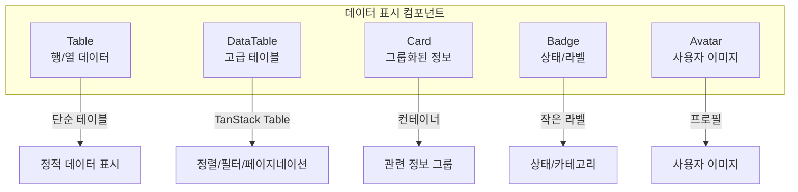
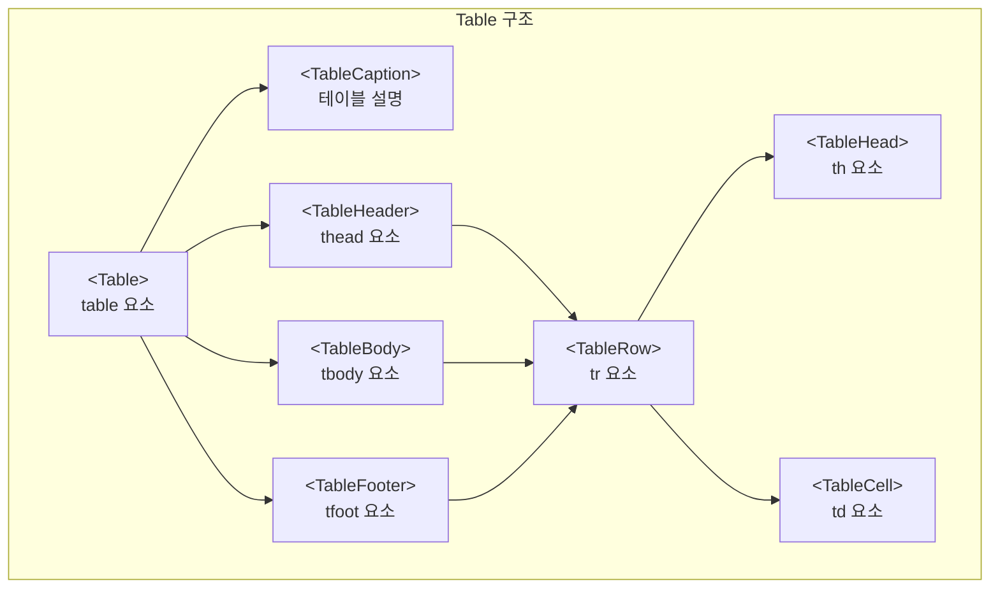
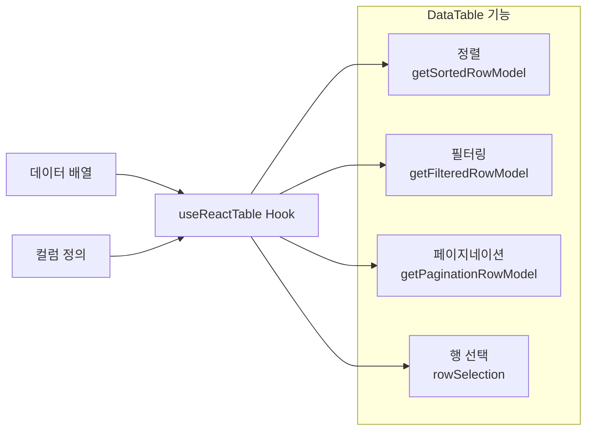
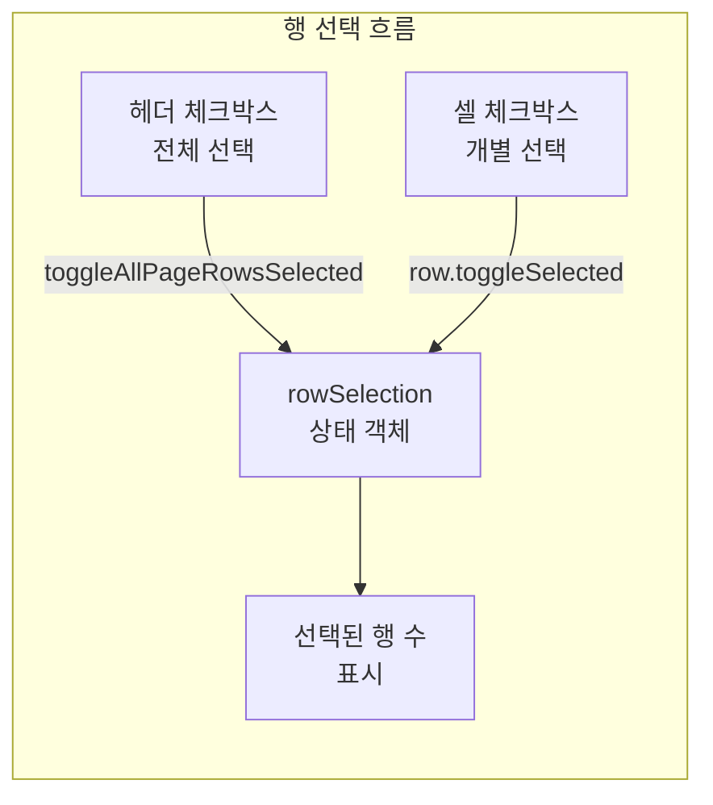
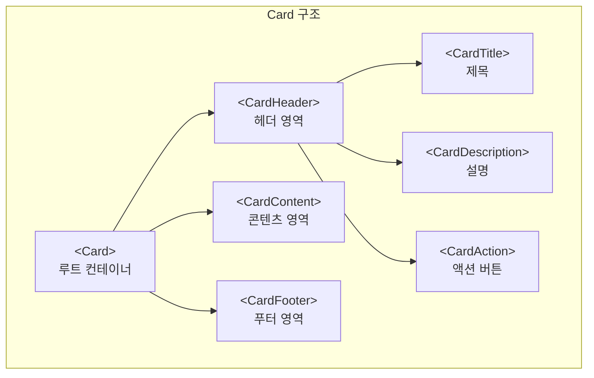
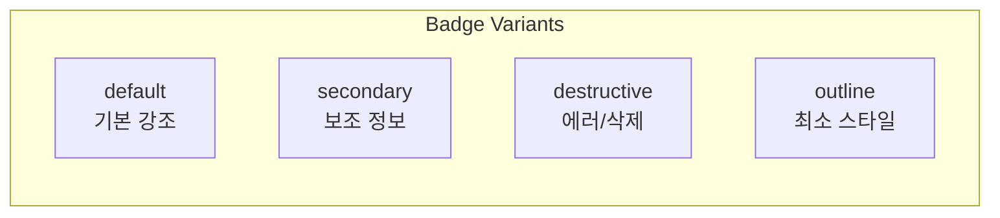
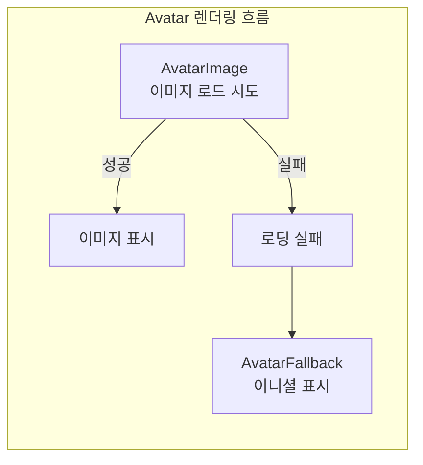
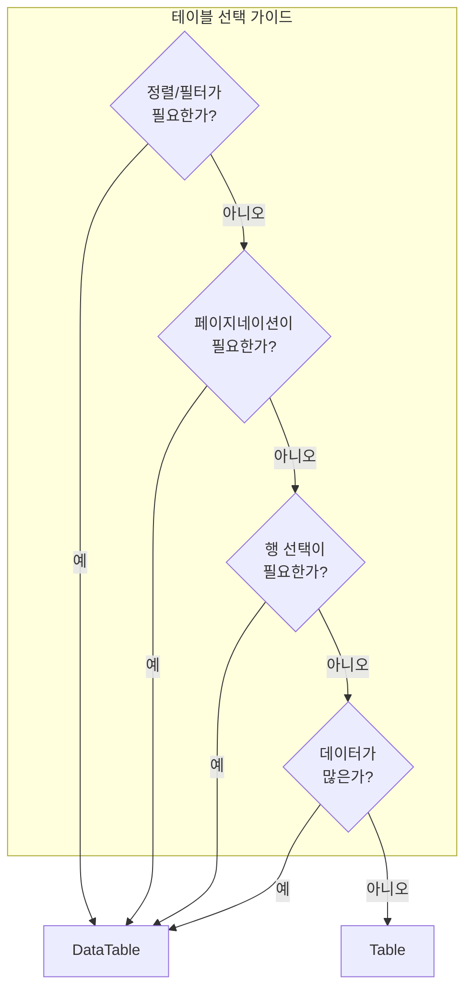

# 데이터 표시 컴포넌트

## 개요

데이터 표시 컴포넌트는 정보를 사용자에게 시각적으로 전달하는 핵심 요소입니다. shadcn/ui는 Table, Card, Badge, Avatar 등 다양한 데이터 표시 컴포넌트를 제공합니다. 이 컴포넌트들은 단독으로 사용하거나 조합하여 대시보드, 목록 페이지, 사용자 프로필 등 다양한 UI를 구성할 수 있습니다.



---

## Table 컴포넌트

### 개요

Table은 행과 열로 구성된 데이터를 표시하는 기본 컴포넌트입니다. HTML 테이블 요소를 래핑하여 일관된 스타일링을 제공하며, 간단한 데이터 목록을 표시할 때 적합합니다.

### 설치

```bash
npx shadcn@latest add table
```

### 구성 요소



```tsx
import {
  Table,
  TableBody,
  TableCaption,
  TableCell,
  TableFooter,
  TableHead,
  TableHeader,
  TableRow,
} from "@/components/ui/table"
```

| 컴포넌트 | HTML 요소 | 역할 |
|---------|----------|------|
| `Table` | `<table>` | 테이블의 루트 컨테이너입니다. border-collapse와 기본 스타일이 적용됩니다. |
| `TableHeader` | `<thead>` | 헤더 행들을 감싸는 영역입니다. |
| `TableBody` | `<tbody>` | 데이터 행들을 감싸는 본문 영역입니다. |
| `TableFooter` | `<tfoot>` | 합계나 요약을 표시하는 푸터 영역입니다. |
| `TableRow` | `<tr>` | 테이블의 한 행을 나타냅니다. |
| `TableHead` | `<th>` | 헤더 셀로, 컬럼 제목을 표시합니다. |
| `TableCell` | `<td>` | 데이터 셀로, 실제 값을 표시합니다. |
| `TableCaption` | `<caption>` | 테이블의 제목이나 설명을 표시합니다. |

### 기본 사용법

```tsx
<Table>
  <TableCaption>A list of your recent invoices.</TableCaption>
  <TableHeader>
    <TableRow>
      <TableHead className="w-[100px]">Invoice</TableHead>
      <TableHead>Status</TableHead>
      <TableHead>Method</TableHead>
      <TableHead className="text-right">Amount</TableHead>
    </TableRow>
  </TableHeader>
  <TableBody>
    <TableRow>
      <TableCell className="font-medium">INV001</TableCell>
      <TableCell>Paid</TableCell>
      <TableCell>Credit Card</TableCell>
      <TableCell className="text-right">$250.00</TableCell>
    </TableRow>
  </TableBody>
</Table>
```

### 동적 데이터 렌더링

```tsx
import {
  Table,
  TableBody,
  TableCaption,
  TableCell,
  TableFooter,
  TableHead,
  TableHeader,
  TableRow,
} from "@/components/ui/table"

interface Invoice {
  invoice: string
  paymentStatus: string
  totalAmount: string
  paymentMethod: string
}

const invoices: Invoice[] = [
  { invoice: "INV001", paymentStatus: "Paid", totalAmount: "$250.00", paymentMethod: "Credit Card" },
  { invoice: "INV002", paymentStatus: "Pending", totalAmount: "$150.00", paymentMethod: "PayPal" },
  { invoice: "INV003", paymentStatus: "Unpaid", totalAmount: "$350.00", paymentMethod: "Bank Transfer" },
  { invoice: "INV004", paymentStatus: "Paid", totalAmount: "$450.00", paymentMethod: "Credit Card" },
  { invoice: "INV005", paymentStatus: "Paid", totalAmount: "$550.00", paymentMethod: "PayPal" },
]

export function InvoiceTable() {
  const total = invoices.reduce((sum, inv) => {
    return sum + parseFloat(inv.totalAmount.replace("$", ""))
  }, 0)

  return (
    <Table>
      <TableCaption>A list of your recent invoices.</TableCaption>
      <TableHeader>
        <TableRow>
          <TableHead className="w-[100px]">Invoice</TableHead>
          <TableHead>Status</TableHead>
          <TableHead>Method</TableHead>
          <TableHead className="text-right">Amount</TableHead>
        </TableRow>
      </TableHeader>
      <TableBody>
        {invoices.map((invoice) => (
          <TableRow key={invoice.invoice}>
            <TableCell className="font-medium">{invoice.invoice}</TableCell>
            <TableCell>{invoice.paymentStatus}</TableCell>
            <TableCell>{invoice.paymentMethod}</TableCell>
            <TableCell className="text-right">{invoice.totalAmount}</TableCell>
          </TableRow>
        ))}
      </TableBody>
      <TableFooter>
        <TableRow>
          <TableCell colSpan={3}>Total</TableCell>
          <TableCell className="text-right">${total.toFixed(2)}</TableCell>
        </TableRow>
      </TableFooter>
    </Table>
  )
}
```

배열 데이터를 **map()**으로 순회하여 TableRow를 생성합니다. **TableFooter**에서는 **colSpan**으로 여러 셀을 병합하여 합계를 표시합니다.

### 스타일링 패턴

```tsx
// 특정 열 너비 지정
<TableHead className="w-[100px]">ID</TableHead>
<TableHead className="w-[200px]">Name</TableHead>

// 텍스트 정렬
<TableHead className="text-right">Amount</TableHead>
<TableCell className="text-center">Status</TableCell>

// 셀 병합
<TableCell colSpan={3}>Total</TableCell>

// 조건부 스타일
<TableRow className={isSelected ? "bg-muted" : ""}>
  ...
</TableRow>
```

**w-[100px]** 같은 Tailwind 클래스로 열 너비를 고정하고, **text-right/text-center**로 텍스트 정렬을 조정합니다. 조건부 클래스를 적용하여 선택된 행이나 특정 상태의 행을 시각적으로 구분할 수 있습니다.

---

## DataTable (TanStack Table)

### 개요

DataTable은 TanStack Table (구 React Table)을 기반으로 정렬, 필터링, 페이지네이션, 행 선택 등 고급 기능을 제공하는 테이블 컴포넌트입니다. 대량의 데이터를 다루거나 사용자 인터랙션이 필요한 테이블에 적합합니다.



### 의존성 설치

```bash
npm install @tanstack/react-table
```

### 기본 DataTable 컴포넌트

```tsx
"use client"

import {
  ColumnDef,
  flexRender,
  getCoreRowModel,
  useReactTable,
} from "@tanstack/react-table"

import {
  Table,
  TableBody,
  TableCell,
  TableHead,
  TableHeader,
  TableRow,
} from "@/components/ui/table"

interface DataTableProps<TData, TValue> {
  columns: ColumnDef<TData, TValue>[]
  data: TData[]
}

export function DataTable<TData, TValue>({
  columns,
  data,
}: DataTableProps<TData, TValue>) {
  const table = useReactTable({
    data,
    columns,
    getCoreRowModel: getCoreRowModel(),
  })

  return (
    <div className="rounded-md border">
      <Table>
        <TableHeader>
          {table.getHeaderGroups().map((headerGroup) => (
            <TableRow key={headerGroup.id}>
              {headerGroup.headers.map((header) => (
                <TableHead key={header.id}>
                  {header.isPlaceholder
                    ? null
                    : flexRender(
                        header.column.columnDef.header,
                        header.getContext()
                      )}
                </TableHead>
              ))}
            </TableRow>
          ))}
        </TableHeader>
        <TableBody>
          {table.getRowModel().rows?.length ? (
            table.getRowModel().rows.map((row) => (
              <TableRow
                key={row.id}
                data-state={row.getIsSelected() && "selected"}
              >
                {row.getVisibleCells().map((cell) => (
                  <TableCell key={cell.id}>
                    {flexRender(
                      cell.column.columnDef.cell,
                      cell.getContext()
                    )}
                  </TableCell>
                ))}
              </TableRow>
            ))
          ) : (
            <TableRow>
              <TableCell colSpan={columns.length} className="h-24 text-center">
                No results.
              </TableCell>
            </TableRow>
          )}
        </TableBody>
      </Table>
    </div>
  )
}
```

**useReactTable** Hook은 데이터와 컬럼 정의를 받아 테이블 인스턴스를 생성합니다. **flexRender**는 컬럼 정의에 따라 헤더와 셀을 동적으로 렌더링합니다. **getHeaderGroups()**와 **getRowModel()**로 테이블 구조에 접근합니다.

### 컬럼 정의

```tsx
import { ColumnDef } from "@tanstack/react-table"

// 데이터 타입 정의
interface User {
  id: string
  name: string
  email: string
  status: "active" | "inactive"
  amount: number
}

// 컬럼 정의
export const columns: ColumnDef<User>[] = [
  {
    accessorKey: "id",
    header: "ID",
  },
  {
    accessorKey: "name",
    header: "Name",
  },
  {
    accessorKey: "email",
    header: "Email",
  },
  {
    accessorKey: "status",
    header: "Status",
    cell: ({ row }) => {
      const status = row.getValue("status") as string
      return (
        <Badge variant={status === "active" ? "default" : "secondary"}>
          {status}
        </Badge>
      )
    },
  },
  {
    accessorKey: "amount",
    header: () => <div className="text-right">Amount</div>,
    cell: ({ row }) => {
      const amount = parseFloat(row.getValue("amount"))
      const formatted = new Intl.NumberFormat("ko-KR", {
        style: "currency",
        currency: "KRW",
      }).format(amount)
      return <div className="text-right font-medium">{formatted}</div>
    },
  },
]
```

**accessorKey**는 데이터 객체의 키와 매핑됩니다. **header**는 문자열이나 컴포넌트를 반환하는 함수로 정의할 수 있습니다. **cell**은 셀 내용을 커스터마이징하며, row.getValue()로 해당 행의 값에 접근합니다. 이 예시에서 status 컬럼은 Badge 컴포넌트로, amount 컬럼은 통화 형식으로 표시합니다.

### 정렬 기능 추가

```tsx
import {
  ColumnDef,
  SortingState,
  flexRender,
  getCoreRowModel,
  getSortedRowModel,
  useReactTable,
} from "@tanstack/react-table"
import { ArrowUpDown } from "lucide-react"
import { Button } from "@/components/ui/button"

// 정렬 가능한 컬럼 정의
const columns: ColumnDef<User>[] = [
  {
    accessorKey: "email",
    header: ({ column }) => {
      return (
        <Button
          variant="ghost"
          onClick={() => column.toggleSorting(column.getIsSorted() === "asc")}
        >
          Email
          <ArrowUpDown className="ml-2 h-4 w-4" />
        </Button>
      )
    },
  },
  // ...
]

// DataTable에서 정렬 상태 관리
function DataTable<TData, TValue>({ columns, data }: DataTableProps<TData, TValue>) {
  const [sorting, setSorting] = React.useState<SortingState>([])

  const table = useReactTable({
    data,
    columns,
    getCoreRowModel: getCoreRowModel(),
    getSortedRowModel: getSortedRowModel(),
    onSortingChange: setSorting,
    state: {
      sorting,
    },
  })

  // ... 렌더링
}
```

**getSortedRowModel()**을 추가하고, **sorting** 상태를 관리합니다. 헤더에서 **column.toggleSorting()**을 호출하면 정렬이 토글됩니다. **getIsSorted()**는 현재 정렬 방향("asc", "desc", false)을 반환합니다.

### 필터링 기능 추가

```tsx
import {
  ColumnFiltersState,
  getFilteredRowModel,
} from "@tanstack/react-table"
import { Input } from "@/components/ui/input"

function DataTable<TData, TValue>({ columns, data }: DataTableProps<TData, TValue>) {
  const [columnFilters, setColumnFilters] = React.useState<ColumnFiltersState>([])

  const table = useReactTable({
    data,
    columns,
    getCoreRowModel: getCoreRowModel(),
    getFilteredRowModel: getFilteredRowModel(),
    onColumnFiltersChange: setColumnFilters,
    state: {
      columnFilters,
    },
  })

  return (
    <div>
      {/* 필터 입력 */}
      <div className="flex items-center py-4">
        <Input
          placeholder="Filter emails..."
          value={(table.getColumn("email")?.getFilterValue() as string) ?? ""}
          onChange={(event) =>
            table.getColumn("email")?.setFilterValue(event.target.value)
          }
          className="max-w-sm"
        />
      </div>

      {/* 테이블 렌더링 */}
      <div className="rounded-md border">
        <Table>...</Table>
      </div>
    </div>
  )
}
```

**getFilteredRowModel()**을 추가하고, **columnFilters** 상태를 관리합니다. Input의 onChange에서 **setFilterValue()**를 호출하면 해당 컬럼의 필터가 적용됩니다.

### 페이지네이션 추가

```tsx
import { getPaginationRowModel } from "@tanstack/react-table"
import { Button } from "@/components/ui/button"

function DataTable<TData, TValue>({ columns, data }: DataTableProps<TData, TValue>) {
  const table = useReactTable({
    data,
    columns,
    getCoreRowModel: getCoreRowModel(),
    getPaginationRowModel: getPaginationRowModel(),
  })

  return (
    <div>
      {/* 테이블 */}
      <div className="rounded-md border">
        <Table>...</Table>
      </div>

      {/* 페이지네이션 컨트롤 */}
      <div className="flex items-center justify-end space-x-2 py-4">
        <Button
          variant="outline"
          size="sm"
          onClick={() => table.previousPage()}
          disabled={!table.getCanPreviousPage()}
        >
          Previous
        </Button>
        <Button
          variant="outline"
          size="sm"
          onClick={() => table.nextPage()}
          disabled={!table.getCanNextPage()}
        >
          Next
        </Button>
      </div>
    </div>
  )
}
```

**getPaginationRowModel()**을 추가하면 자동으로 페이지네이션이 활성화됩니다. **previousPage()**, **nextPage()**로 페이지를 이동하고, **getCanPreviousPage()**, **getCanNextPage()**로 이동 가능 여부를 확인합니다.

### 행 선택 기능



```tsx
import { RowSelectionState } from "@tanstack/react-table"
import { Checkbox } from "@/components/ui/checkbox"

// 선택 컬럼 추가
const columns: ColumnDef<User>[] = [
  {
    id: "select",
    header: ({ table }) => (
      <Checkbox
        checked={table.getIsAllPageRowsSelected()}
        onCheckedChange={(value) => table.toggleAllPageRowsSelected(!!value)}
        aria-label="Select all"
      />
    ),
    cell: ({ row }) => (
      <Checkbox
        checked={row.getIsSelected()}
        onCheckedChange={(value) => row.toggleSelected(!!value)}
        aria-label="Select row"
      />
    ),
    enableSorting: false,
    enableHiding: false,
  },
  // ... 다른 컬럼들
]

function DataTable<TData, TValue>({ columns, data }: DataTableProps<TData, TValue>) {
  const [rowSelection, setRowSelection] = React.useState<RowSelectionState>({})

  const table = useReactTable({
    data,
    columns,
    getCoreRowModel: getCoreRowModel(),
    onRowSelectionChange: setRowSelection,
    state: {
      rowSelection,
    },
  })

  return (
    <div>
      {/* 테이블 */}
      <Table>...</Table>

      {/* 선택된 행 수 표시 */}
      <div className="text-muted-foreground text-sm">
        {table.getFilteredSelectedRowModel().rows.length} of{" "}
        {table.getFilteredRowModel().rows.length} row(s) selected.
      </div>
    </div>
  )
}
```

select 컬럼을 첫 번째에 추가합니다. 헤더의 Checkbox는 **toggleAllPageRowsSelected()**로 현재 페이지의 모든 행을 선택/해제합니다. 셀의 Checkbox는 **row.toggleSelected()**로 개별 행을 선택합니다. **rowSelection** 상태는 선택된 행들의 인덱스를 객체 형태로 저장합니다.

---

## Card 컴포넌트

### 개요

Card는 관련 정보를 그룹화하여 표시하는 컨테이너 컴포넌트입니다. 로그인 폼, 통계 정보, 프로필 등 시각적으로 구분되는 콘텐츠 블록을 만들 때 사용합니다.



### 설치

```bash
npx shadcn@latest add card
```

### 구성 요소

```tsx
import {
  Card,
  CardAction,
  CardContent,
  CardDescription,
  CardFooter,
  CardHeader,
  CardTitle,
} from "@/components/ui/card"
```

| 컴포넌트 | 역할 |
|---------|------|
| `Card` | 루트 컨테이너로 테두리와 그림자가 적용된 박스입니다. |
| `CardHeader` | 제목과 설명을 담는 헤더 영역입니다. 상단 패딩이 적용됩니다. |
| `CardTitle` | 카드의 주요 제목입니다. h3 요소로 렌더링됩니다. |
| `CardDescription` | 제목 아래 부가 설명입니다. muted 색상이 적용됩니다. |
| `CardAction` | 헤더 오른쪽에 배치되는 액션 버튼 영역입니다. |
| `CardContent` | 메인 콘텐츠가 들어가는 영역입니다. |
| `CardFooter` | 버튼이나 링크를 배치하는 하단 영역입니다. |

### 기본 구조

```tsx
<Card>
  <CardHeader>
    <CardTitle>Card Title</CardTitle>
    <CardDescription>Card Description</CardDescription>
    <CardAction>
      <Button variant="ghost" size="icon">
        <MoreHorizontalIcon />
      </Button>
    </CardAction>
  </CardHeader>
  <CardContent>
    <p>Card Content</p>
  </CardContent>
  <CardFooter>
    <Button>Action</Button>
  </CardFooter>
</Card>
```

### 로그인 폼 카드 예시

```tsx
import { Button } from "@/components/ui/button"
import {
  Card,
  CardAction,
  CardContent,
  CardDescription,
  CardFooter,
  CardHeader,
  CardTitle,
} from "@/components/ui/card"
import { Input } from "@/components/ui/input"
import { Label } from "@/components/ui/label"

export function LoginCard() {
  return (
    <Card className="w-full max-w-sm">
      <CardHeader>
        <CardTitle>Login to your account</CardTitle>
        <CardDescription>
          Enter your email below to login to your account
        </CardDescription>
        <CardAction>
          <Button variant="link" size="sm">
            Sign Up
          </Button>
        </CardAction>
      </CardHeader>
      <CardContent>
        <form className="flex flex-col gap-4">
          <div className="grid gap-2">
            <Label htmlFor="email">Email</Label>
            <Input
              id="email"
              type="email"
              placeholder="m@example.com"
              required
            />
          </div>
          <div className="grid gap-2">
            <div className="flex items-center">
              <Label htmlFor="password">Password</Label>
              <a
                href="#"
                className="ml-auto text-sm underline-offset-4 hover:underline"
              >
                Forgot password?
              </a>
            </div>
            <Input id="password" type="password" required />
          </div>
        </form>
      </CardContent>
      <CardFooter className="flex-col gap-2">
        <Button type="submit" className="w-full">
          Login
        </Button>
        <Button variant="outline" className="w-full">
          Login with Google
        </Button>
      </CardFooter>
    </Card>
  )
}
```

**max-w-sm**으로 카드의 최대 너비를 제한합니다. CardFooter에 **flex-col gap-2**를 적용하여 버튼들을 수직으로 배치합니다.

### 정보 표시 카드

```tsx
import { Card, CardContent, CardHeader, CardTitle } from "@/components/ui/card"

interface StatCardProps {
  title: string
  value: string
  description: string
  icon: React.ReactNode
}

export function StatCard({ title, value, description, icon }: StatCardProps) {
  return (
    <Card>
      <CardHeader className="flex flex-row items-center justify-between space-y-0 pb-2">
        <CardTitle className="text-sm font-medium">{title}</CardTitle>
        {icon}
      </CardHeader>
      <CardContent>
        <div className="text-2xl font-bold">{value}</div>
        <p className="text-xs text-muted-foreground">{description}</p>
      </CardContent>
    </Card>
  )
}

// 사용 예시
<div className="grid gap-4 md:grid-cols-2 lg:grid-cols-4">
  <StatCard
    title="Total Revenue"
    value="$45,231.89"
    description="+20.1% from last month"
    icon={<DollarSign className="h-4 w-4 text-muted-foreground" />}
  />
  <StatCard
    title="Subscriptions"
    value="+2350"
    description="+180.1% from last month"
    icon={<Users className="h-4 w-4 text-muted-foreground" />}
  />
</div>
```

대시보드 통계 카드 패턴입니다. CardHeader에 **flex flex-row**를 적용하여 제목과 아이콘을 가로로 배치합니다. **space-y-0**은 기본 세로 간격을 제거합니다.

### 카드 그리드 레이아웃

```tsx
// 반응형 그리드
<div className="grid gap-4 sm:grid-cols-2 lg:grid-cols-3">
  <Card>...</Card>
  <Card>...</Card>
  <Card>...</Card>
</div>

// 고정 너비
<Card className="w-[350px]">...</Card>
<Card className="max-w-md">...</Card>

// 전체 너비
<Card className="w-full">...</Card>
```

**grid** 클래스와 반응형 **grid-cols-***를 조합하여 화면 크기에 따라 카드 배치가 변하는 그리드를 만듭니다.

---

## Badge 컴포넌트

### 개요

Badge는 상태, 카테고리, 카운트 등을 표시하는 작은 라벨 컴포넌트입니다. 테이블의 상태 표시, 알림 카운트, 태그 등에 사용됩니다.



### 설치

```bash
npx shadcn@latest add badge
```

### 기본 사용

```tsx
import { Badge } from "@/components/ui/badge"

// 기본
<Badge>Badge</Badge>

// Variants
<Badge variant="default">Default</Badge>
<Badge variant="secondary">Secondary</Badge>
<Badge variant="destructive">Destructive</Badge>
<Badge variant="outline">Outline</Badge>
```

### Variants

| Variant | 용도 | 스타일 |
|---------|------|--------|
| `default` | 기본적인 강조가 필요한 상태나 라벨에 사용합니다. | primary 색상으로 채워진 배경 |
| `secondary` | 보조적인 정보나 비활성 상태에 사용합니다. | 회색 배경 |
| `destructive` | 에러, 삭제, 위험 상태를 표시할 때 사용합니다. | 빨간색 배경 |
| `outline` | 최소한의 스타일로 테두리만 표시합니다. | 투명 배경, 테두리만 |

### 아이콘과 함께 사용

```tsx
import { Badge } from "@/components/ui/badge"
import { BadgeCheckIcon, AlertCircleIcon } from "lucide-react"

// 확인 배지
<Badge variant="secondary" className="bg-blue-500 text-white">
  <BadgeCheckIcon className="mr-1 h-3 w-3" />
  Verified
</Badge>

// 경고 배지
<Badge variant="destructive">
  <AlertCircleIcon className="mr-1 h-3 w-3" />
  Error
</Badge>
```

아이콘에 **mr-1**로 오른쪽 마진을 주고, Badge의 기본 크기에 맞게 **h-3 w-3**으로 아이콘 크기를 조정합니다. className으로 variant 외의 커스텀 색상을 적용할 수 있습니다.

### 카운트 배지

```tsx
// 원형 카운트 배지
<Badge className="h-5 min-w-5 rounded-full px-1 font-mono tabular-nums">
  8
</Badge>

<Badge
  variant="destructive"
  className="h-5 min-w-5 rounded-full px-1 font-mono tabular-nums"
>
  99+
</Badge>

// 알림 카운트
<div className="relative">
  <BellIcon className="h-6 w-6" />
  <Badge
    variant="destructive"
    className="absolute -top-1 -right-1 h-4 min-w-4 rounded-full px-1 text-xs"
  >
    3
  </Badge>
</div>
```

**rounded-full**로 원형 모양을 만들고, **min-w-5**로 최소 너비를 확보하여 숫자가 한 자리여도 원형이 유지되도록 합니다. **tabular-nums**는 숫자가 고정 폭을 가지도록 하여 정렬이 깔끔해집니다. 알림 아이콘에는 **absolute**로 오른쪽 상단에 배치합니다.

### 상태 표시 배지

```tsx
type Status = "active" | "inactive" | "pending"

function StatusBadge({ status }: { status: Status }) {
  const variants: Record<Status, { variant: "default" | "secondary" | "destructive", label: string }> = {
    active: { variant: "default", label: "Active" },
    inactive: { variant: "secondary", label: "Inactive" },
    pending: { variant: "destructive", label: "Pending" },
  }

  const { variant, label } = variants[status]

  return <Badge variant={variant}>{label}</Badge>
}

// 사용
<StatusBadge status="active" />
<StatusBadge status="inactive" />
<StatusBadge status="pending" />
```

상태 값을 variant와 label로 매핑하는 객체를 정의하여 타입 안전하게 상태 배지를 생성합니다.

### asChild로 링크로 사용

```tsx
import { Link } from "react-router-dom"  // 또는 next/link
import { Badge } from "@/components/ui/badge"

<Badge asChild>
  <Link to="/category/react">React</Link>
</Badge>
```

**asChild** 패턴으로 Badge의 스타일을 유지하면서 Link 컴포넌트로 렌더링할 수 있습니다. 태그 클릭 시 해당 카테고리 페이지로 이동하는 기능에 유용합니다.

---

## Avatar 컴포넌트

### 개요

Avatar는 사용자 프로필 이미지를 표시하는 컴포넌트입니다. 이미지 로딩에 실패하면 자동으로 폴백(이니셜 등)을 표시합니다.



### 설치

```bash
npx shadcn@latest add avatar

# 수동 설치
npm install @radix-ui/react-avatar
```

### 기본 사용

```tsx
import {
  Avatar,
  AvatarFallback,
  AvatarImage,
} from "@/components/ui/avatar"

<Avatar>
  <AvatarImage src="https://github.com/shadcn.png" alt="@shadcn" />
  <AvatarFallback>CN</AvatarFallback>
</Avatar>
```

### 구성 요소

| 컴포넌트 | 역할 |
|---------|------|
| `Avatar` | 루트 컨테이너로 원형 클리핑과 크기를 담당합니다. |
| `AvatarImage` | 프로필 이미지를 표시합니다. 로딩 상태를 내부적으로 추적합니다. |
| `AvatarFallback` | 이미지가 없거나 로딩 실패 시 표시되는 폴백입니다. 보통 이니셜이나 아이콘을 표시합니다. |

### 다양한 스타일

```tsx
// 기본 (원형)
<Avatar>
  <AvatarImage src="/user.png" alt="User" />
  <AvatarFallback>U</AvatarFallback>
</Avatar>

// 둥근 사각형
<Avatar className="rounded-lg">
  <AvatarImage src="/user.png" alt="User" />
  <AvatarFallback>U</AvatarFallback>
</Avatar>

// 크기 조절
<Avatar className="h-12 w-12">  {/* 48px */}
  <AvatarImage src="/user.png" alt="User" />
  <AvatarFallback>U</AvatarFallback>
</Avatar>

<Avatar className="h-8 w-8">  {/* 32px */}
  <AvatarImage src="/user.png" alt="User" />
  <AvatarFallback className="text-xs">U</AvatarFallback>
</Avatar>
```

기본 Avatar는 원형이며, **rounded-lg**로 둥근 사각형으로 변경할 수 있습니다. **h-***, **w-***로 크기를 조정하고, 작은 Avatar에서는 Fallback의 텍스트 크기도 함께 조정합니다.

### 아바타 그룹 (스택)

```tsx
const users = [
  { name: "User 1", image: "/user1.png", fallback: "U1" },
  { name: "User 2", image: "/user2.png", fallback: "U2" },
  { name: "User 3", image: "/user3.png", fallback: "U3" },
]

export function AvatarGroup() {
  return (
    <div className="flex -space-x-2">
      {users.map((user, index) => (
        <Avatar
          key={index}
          className="ring-2 ring-background"
        >
          <AvatarImage src={user.image} alt={user.name} />
          <AvatarFallback>{user.fallback}</AvatarFallback>
        </Avatar>
      ))}
      {/* 추가 멤버 표시 */}
      <Avatar className="ring-2 ring-background">
        <AvatarFallback>+5</AvatarFallback>
      </Avatar>
    </div>
  )
}
```

**-space-x-2**는 음수 마진으로 아바타들이 겹치도록 합니다. **ring-2 ring-background**는 겹친 부분의 경계를 명확히 하기 위해 배경색 테두리를 추가합니다. 마지막에 "+5" 같은 추가 멤버 수를 표시하는 것이 일반적인 패턴입니다.

### 사용자 정보와 함께

```tsx
interface UserInfoProps {
  name: string
  email: string
  image?: string
}

export function UserInfo({ name, email, image }: UserInfoProps) {
  const initials = name
    .split(" ")
    .map((n) => n[0])
    .join("")
    .toUpperCase()

  return (
    <div className="flex items-center gap-3">
      <Avatar>
        <AvatarImage src={image} alt={name} />
        <AvatarFallback>{initials}</AvatarFallback>
      </Avatar>
      <div>
        <p className="text-sm font-medium">{name}</p>
        <p className="text-xs text-muted-foreground">{email}</p>
      </div>
    </div>
  )
}

// 사용
<UserInfo
  name="John Doe"
  email="john@example.com"
  image="/john.png"
/>
```

이름에서 이니셜을 추출하여 Fallback으로 사용합니다. "John Doe"는 "JD"가 됩니다. Avatar와 텍스트 정보를 flex로 가로 배치하여 사용자 정보 UI를 구성합니다.

### 상태 표시 (온라인/오프라인)

```tsx
interface AvatarWithStatusProps {
  src?: string
  fallback: string
  status: "online" | "offline" | "away"
}

export function AvatarWithStatus({ src, fallback, status }: AvatarWithStatusProps) {
  const statusColors = {
    online: "bg-green-500",
    offline: "bg-gray-400",
    away: "bg-yellow-500",
  }

  return (
    <div className="relative">
      <Avatar>
        <AvatarImage src={src} />
        <AvatarFallback>{fallback}</AvatarFallback>
      </Avatar>
      <span
        className={`absolute bottom-0 right-0 h-3 w-3 rounded-full border-2 border-background ${statusColors[status]}`}
      />
    </div>
  )
}
```

Avatar를 relative 컨테이너로 감싸고, 상태 인디케이터를 **absolute**로 오른쪽 하단에 배치합니다. **border-2 border-background**로 배경과 구분되는 테두리를 추가합니다.

---

## 컴포넌트 조합 패턴

### 테이블에서 Badge와 Avatar 활용

```tsx
import { Avatar, AvatarFallback, AvatarImage } from "@/components/ui/avatar"
import { Badge } from "@/components/ui/badge"
import {
  Table,
  TableBody,
  TableCell,
  TableHead,
  TableHeader,
  TableRow,
} from "@/components/ui/table"

interface User {
  id: string
  name: string
  email: string
  avatar: string
  status: "active" | "inactive"
}

const users: User[] = [
  { id: "1", name: "John Doe", email: "john@example.com", avatar: "/john.png", status: "active" },
  { id: "2", name: "Jane Smith", email: "jane@example.com", avatar: "/jane.png", status: "inactive" },
]

export function UserTable() {
  return (
    <Table>
      <TableHeader>
        <TableRow>
          <TableHead>User</TableHead>
          <TableHead>Status</TableHead>
        </TableRow>
      </TableHeader>
      <TableBody>
        {users.map((user) => (
          <TableRow key={user.id}>
            <TableCell>
              <div className="flex items-center gap-3">
                <Avatar className="h-8 w-8">
                  <AvatarImage src={user.avatar} alt={user.name} />
                  <AvatarFallback>
                    {user.name.split(" ").map(n => n[0]).join("")}
                  </AvatarFallback>
                </Avatar>
                <div>
                  <p className="font-medium">{user.name}</p>
                  <p className="text-sm text-muted-foreground">{user.email}</p>
                </div>
              </div>
            </TableCell>
            <TableCell>
              <Badge variant={user.status === "active" ? "default" : "secondary"}>
                {user.status}
              </Badge>
            </TableCell>
          </TableRow>
        ))}
      </TableBody>
    </Table>
  )
}
```

사용자 목록 테이블에서 Avatar, Badge, Table을 조합합니다. 첫 번째 셀에 Avatar와 사용자 정보를 배치하고, 두 번째 셀에 상태 Badge를 표시합니다.

### Card 안에서 DataTable 사용

```tsx
import { Card, CardContent, CardHeader, CardTitle } from "@/components/ui/card"
import { DataTable } from "./data-table"
import { columns } from "./columns"

export function UsersCard({ data }) {
  return (
    <Card>
      <CardHeader>
        <CardTitle>Users</CardTitle>
      </CardHeader>
      <CardContent>
        <DataTable columns={columns} data={data} />
      </CardContent>
    </Card>
  )
}
```

Card로 DataTable을 감싸면 시각적으로 구분된 테이블 섹션을 만들 수 있습니다. 대시보드에서 여러 테이블을 카드로 구분하여 배치하는 패턴입니다.

---

## Table vs DataTable 선택 가이드



| 상황 | 권장 컴포넌트 |
|------|--------------|
| 단순 데이터 표시, 정적인 적은 양의 데이터 | Table |
| 정렬, 필터링, 검색이 필요한 경우 | DataTable |
| 페이지네이션이 필요한 대량 데이터 | DataTable |
| 행 선택 및 일괄 작업이 필요한 경우 | DataTable |
| 컬럼 가시성 토글이 필요한 경우 | DataTable |
| 서버 사이드 데이터 처리가 필요한 경우 | DataTable |

Table은 설정 없이 바로 사용할 수 있어 간단한 목록에 적합합니다. DataTable은 TanStack Table의 학습이 필요하지만 복잡한 데이터 조작에 강력합니다.

---

## 실습 과제

### 1. 사용자 목록 DataTable

TanStack Table을 활용한 사용자 관리 테이블을 구현해보세요.
- 이메일, 이름 컬럼에 정렬 기능을 추가합니다.
- 검색 입력으로 이메일 필터링을 구현합니다.
- 페이지당 10개씩 페이지네이션을 적용합니다.
- 체크박스로 행 선택 및 선택된 행 수를 표시합니다.
- 상태 컬럼에 Badge를 사용합니다.

### 2. 대시보드 카드 그리드

통계 카드 레이아웃을 구현해보세요.
- 반응형 그리드로 1-4 columns을 지원합니다.
- 각 카드에 아이콘, 수치, 변화율을 표시합니다.
- 카드 클릭 시 상세 페이지로 이동하는 링크를 추가합니다.

### 3. 팀 멤버 목록

Avatar와 Badge 조합을 구현해보세요.
- 아바타 그룹으로 겹치는 스택을 만듭니다.
- 각 아바타에 온라인/오프라인 상태를 표시합니다.
- 역할(Admin, Member, Guest)을 Badge로 표시합니다.

---

## 다음 단계

데이터 표시 컴포넌트를 이해했다면, 다음 문서에서는 피드백 및 인터랙션 컴포넌트(Toast, Alert Dialog, Popover, Command)를 살펴봅니다.
