# 피드백 & 인터랙션 컴포넌트

## 개요

사용자에게 피드백을 제공하고 인터랙션을 처리하는 컴포넌트들입니다. **Toast**는 일시적인 알림을, **Alert Dialog**는 중요한 확인 요청을, **Popover**는 트리거 근처의 부가 정보를, **Command**는 검색 기반 명령 팔레트를, **Tooltip**은 간단한 힌트를 제공합니다.

이 컴포넌트들은 사용자 경험의 핵심 요소로, 적절한 타이밍과 방식으로 정보를 전달해야 합니다. 각 컴포넌트는 고유한 역할이 있으며, 상황에 맞는 선택이 중요합니다.

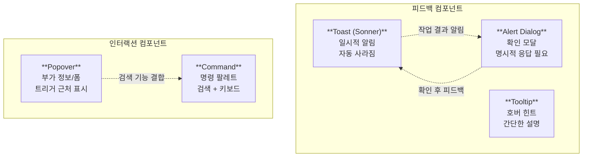

---

## 1. Toast (Sonner)

### 개념

**Toast**는 사용자에게 일시적인 알림을 보여주는 컴포넌트입니다. shadcn/ui는 **sonner** 라이브러리를 사용하여 Toast를 구현합니다. Toast는 작업 완료, 에러 발생, 정보 전달 등 다양한 상황에서 사용자에게 즉각적인 피드백을 제공하며, 일정 시간이 지나면 자동으로 사라집니다.

Toast의 핵심 특징은 **비침습적(non-intrusive)**이라는 점입니다. 사용자의 작업 흐름을 방해하지 않으면서 필요한 정보를 전달합니다. 중요한 확인이 필요한 경우에는 Toast 대신 Alert Dialog를 사용해야 합니다.

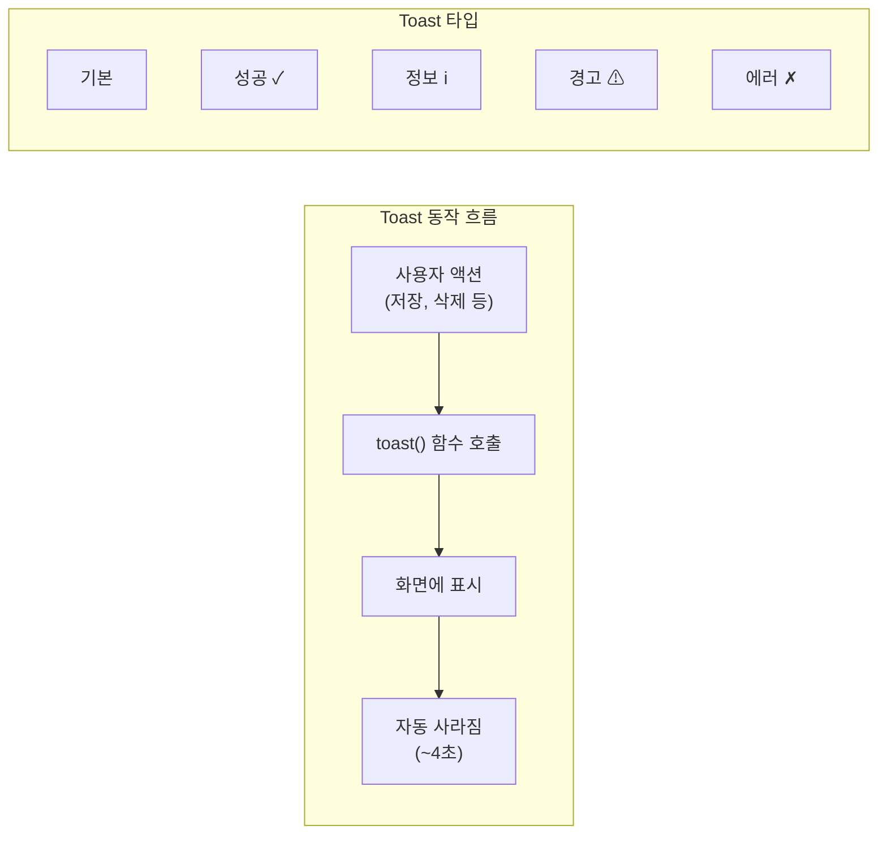

### 설치

```bash
npx shadcn@latest add sonner
```

### Toaster 설정

앱의 루트에 `Toaster` 컴포넌트를 추가합니다. **Toaster는 Toast가 렌더링될 컨테이너 역할**을 하며, 앱 전체에서 `toast()` 함수를 호출할 수 있게 해줍니다.

```tsx
// main.tsx 또는 App.tsx
import { Toaster } from "@/components/ui/sonner"

function App() {
  return (
    <>
      <MainContent />
      <Toaster />
    </>
  )
}
```

### 기본 사용법

Toast는 **함수 호출 방식**으로 사용합니다. 컴포넌트를 직접 렌더링하는 것이 아니라, 이벤트 핸들러 내에서 `toast()` 함수를 호출하면 됩니다.

```tsx
import { toast } from "sonner"
import { Button } from "@/components/ui/button"

export function ToastDemo() {
  return (
    <Button
      variant="outline"
      onClick={() => toast("이벤트가 생성되었습니다.")}
    >
      Show Toast
    </Button>
  )
}
```

### Toast 타입

sonner는 다양한 상황에 맞는 **사전 정의된 Toast 타입**을 제공합니다. 각 타입은 고유한 아이콘과 스타일을 가지고 있어 사용자가 메시지의 성격을 즉시 파악할 수 있습니다.

```tsx
import { toast } from "sonner"
import { Button } from "@/components/ui/button"

export function ToastTypes() {
  return (
    <div className="flex flex-wrap gap-2">
      {/* 기본 */}
      <Button
        variant="outline"
        onClick={() => toast("이벤트가 생성되었습니다.")}
      >
        Default
      </Button>

      {/* 성공 */}
      <Button
        variant="outline"
        onClick={() => toast.success("저장되었습니다.")}
      >
        Success
      </Button>

      {/* 정보 */}
      <Button
        variant="outline"
        onClick={() => toast.info("10분 전에 도착해주세요.")}
      >
        Info
      </Button>

      {/* 경고 */}
      <Button
        variant="outline"
        onClick={() => toast.warning("시작 시간은 8시 이후여야 합니다.")}
      >
        Warning
      </Button>

      {/* 에러 */}
      <Button
        variant="outline"
        onClick={() => toast.error("이벤트 생성에 실패했습니다.")}
      >
        Error
      </Button>
    </div>
  )
}
```

### 액션이 있는 Toast

Toast에 **액션 버튼**을 추가하면 사용자가 즉시 반응할 수 있습니다. 대표적인 예로 **실행 취소(Undo)** 기능이 있습니다. 이메일 삭제, 항목 이동 등 되돌릴 수 있는 작업에 유용합니다.

```tsx
toast("이벤트가 생성되었습니다", {
  description: "2024년 1월 3일 오전 9:00",
  action: {
    label: "실행 취소",
    onClick: () => console.log("Undo clicked"),
  },
})
```

### Promise Toast

**비동기 작업의 상태**를 자동으로 표시합니다. 로딩, 성공, 실패 세 가지 상태를 하나의 Toast로 관리할 수 있어, API 호출이나 데이터 저장 같은 작업에 적합합니다.

```tsx
<Button
  variant="outline"
  onClick={() => {
    toast.promise(
      // Promise 함수
      () => new Promise((resolve) =>
        setTimeout(() => resolve({ name: "Event" }), 2000)
      ),
      {
        loading: "저장 중...",
        success: (data) => `${data.name}이(가) 저장되었습니다`,
        error: "저장 실패",
      }
    )
  }}
>
  Promise Toast
</Button>
```

### 커스텀 스타일 Toast

description 속성에 **JSX 요소**를 전달하여 복잡한 콘텐츠를 표시할 수 있습니다. 폼 제출 결과를 JSON으로 보여주거나, 커스텀 스타일을 적용할 때 유용합니다.

```tsx
toast("폼이 제출되었습니다:", {
  description: (
    <pre className="bg-code text-code-foreground mt-2 w-[320px] rounded-md p-4">
      <code>{JSON.stringify(data, null, 2)}</code>
    </pre>
  ),
  position: "bottom-right",
  classNames: {
    content: "flex flex-col gap-2",
  },
})
```

### Toast 위치 옵션

Toast가 화면에 나타나는 위치를 지정할 수 있습니다. **일반적으로 오른쪽 하단(bottom-right)**이 가장 많이 사용됩니다. 작업 영역을 가리지 않으면서 눈에 잘 띄는 위치이기 때문입니다.

| Position | 설명 |
|----------|------|
| `top-left` | 왼쪽 상단 |
| `top-center` | 중앙 상단 |
| `top-right` | 오른쪽 상단 |
| `bottom-left` | 왼쪽 하단 |
| `bottom-center` | 중앙 하단 |
| `bottom-right` | 오른쪽 하단 |

---

## 2. Alert Dialog

### 개념

**Alert Dialog**는 사용자에게 확인을 요청하는 모달입니다. 계정 삭제, 결제 진행, 데이터 초기화 등 **되돌릴 수 없거나 중요한 결정**이 필요한 상황에서 사용합니다. 일반 Dialog와 달리, 배경 클릭이나 ESC 키로 닫히지 않아 사용자가 반드시 명시적으로 선택해야 합니다.

이 컴포넌트는 **접근성 측면에서 `role="alertdialog"`**를 사용하여, 스크린 리더 사용자에게도 중요한 알림임을 명확히 전달합니다.

### Dialog vs Alert Dialog

두 컴포넌트는 비슷해 보이지만 **용도와 동작 방식에서 중요한 차이**가 있습니다.

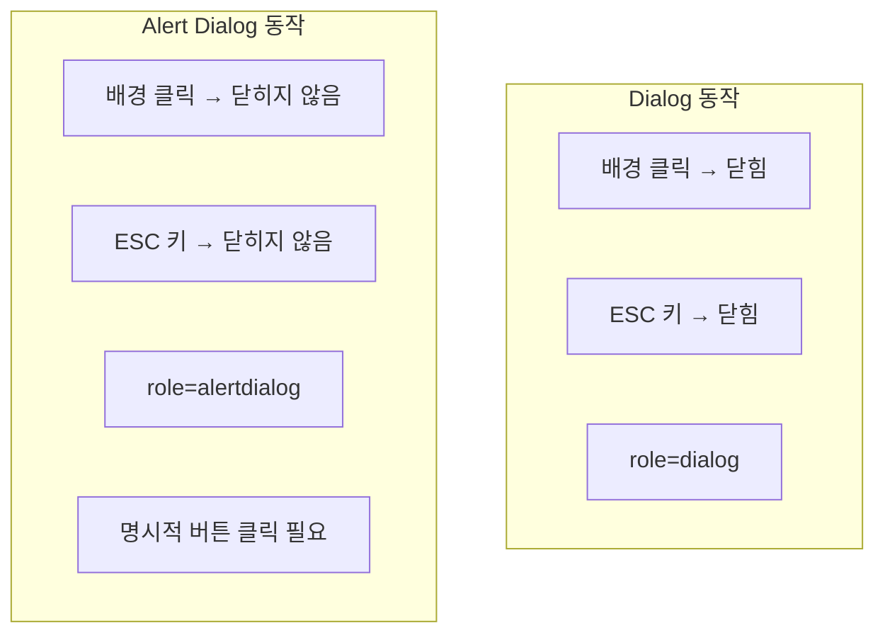

| 특성 | Dialog | Alert Dialog |
|------|--------|--------------|
| 닫기 방법 | 배경 클릭, ESC 키로 닫힘 | 명시적 버튼 클릭만 가능 |
| 용도 | 일반적인 모달 | 중요한 확인 필요 시 |
| 접근성 | role="dialog" | role="alertdialog" |

### 설치

```bash
npx shadcn@latest add alert-dialog
```

### 기본 구조

Alert Dialog는 **Compound Component 패턴**을 사용합니다. 각 하위 컴포넌트가 명확한 역할을 가지며, 트리 구조로 조합됩니다.

```tsx
import {
  AlertDialog,
  AlertDialogAction,
  AlertDialogCancel,
  AlertDialogContent,
  AlertDialogDescription,
  AlertDialogFooter,
  AlertDialogHeader,
  AlertDialogTitle,
  AlertDialogTrigger,
} from "@/components/ui/alert-dialog"
import { Button } from "@/components/ui/button"

export function AlertDialogDemo() {
  return (
    <AlertDialog>
      <AlertDialogTrigger asChild>
        <Button variant="outline">계정 삭제</Button>
      </AlertDialogTrigger>
      <AlertDialogContent>
        <AlertDialogHeader>
          <AlertDialogTitle>정말로 삭제하시겠습니까?</AlertDialogTitle>
          <AlertDialogDescription>
            이 작업은 되돌릴 수 없습니다. 계정이 영구적으로 삭제되며
            서버에서 모든 데이터가 제거됩니다.
          </AlertDialogDescription>
        </AlertDialogHeader>
        <AlertDialogFooter>
          <AlertDialogCancel>취소</AlertDialogCancel>
          <AlertDialogAction>계속</AlertDialogAction>
        </AlertDialogFooter>
      </AlertDialogContent>
    </AlertDialog>
  )
}
```

### Compound Component 구조

Alert Dialog의 각 구성 요소는 명확한 역할을 가지고 있습니다. **Root 컴포넌트가 열림/닫힘 상태를 관리**하고, Trigger가 열기를 담당하며, Content 내부에 실제 콘텐츠가 배치됩니다.

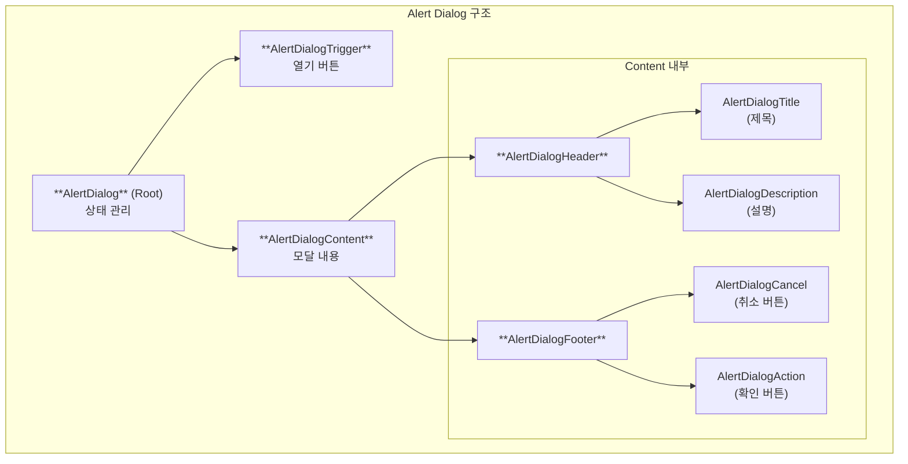

### 제어된(Controlled) Alert Dialog

외부에서 **열림/닫힘 상태를 직접 제어**해야 할 때 사용합니다. 비동기 작업 완료 후 Dialog를 닫거나, 다른 상태에 따라 Dialog를 열어야 할 때 유용합니다.

```tsx
import * as React from "react"

export function ControlledAlertDialog() {
  const [open, setOpen] = React.useState(false)

  const handleDelete = async () => {
    try {
      await deleteAccount()
      toast.success("계정이 삭제되었습니다")
      setOpen(false)
    } catch (error) {
      toast.error("삭제 실패")
    }
  }

  return (
    <AlertDialog open={open} onOpenChange={setOpen}>
      <AlertDialogTrigger asChild>
        <Button variant="destructive">계정 삭제</Button>
      </AlertDialogTrigger>
      <AlertDialogContent>
        <AlertDialogHeader>
          <AlertDialogTitle>정말로 삭제하시겠습니까?</AlertDialogTitle>
          <AlertDialogDescription>
            이 작업은 되돌릴 수 없습니다.
          </AlertDialogDescription>
        </AlertDialogHeader>
        <AlertDialogFooter>
          <AlertDialogCancel>취소</AlertDialogCancel>
          <AlertDialogAction onClick={handleDelete}>
            삭제
          </AlertDialogAction>
        </AlertDialogFooter>
      </AlertDialogContent>
    </AlertDialog>
  )
}
```

### Destructive 스타일 적용

삭제와 같은 **위험한 작업의 확인 버튼**에는 destructive 스타일을 적용하여 시각적으로 주의를 환기시킵니다.

```tsx
<AlertDialogAction
  className="bg-destructive text-destructive-foreground hover:bg-destructive/90"
>
  삭제
</AlertDialogAction>
```

---

## 3. Popover

### 개념

**Popover**는 트리거 요소 근처에 떠있는 패널을 표시합니다. Dialog와 달리 **배경 오버레이가 없고**, 트리거 요소 바로 옆에 나타나므로 추가 정보나 간단한 폼을 보여줄 때 적합합니다. 사용자의 컨텍스트를 유지하면서 부가 기능을 제공할 수 있습니다.

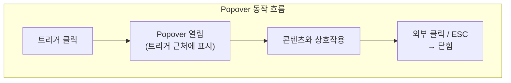

### 설치

```bash
npx shadcn@latest add popover
```

### 기본 구조

Popover는 **Trigger + Content** 구조로 이루어집니다. asChild 패턴을 사용하여 기존 버튼을 트리거로 활용할 수 있습니다.

```tsx
import { Button } from "@/components/ui/button"
import {
  Popover,
  PopoverContent,
  PopoverTrigger,
} from "@/components/ui/popover"

export function PopoverDemo() {
  return (
    <Popover>
      <PopoverTrigger asChild>
        <Button variant="outline">Open popover</Button>
      </PopoverTrigger>
      <PopoverContent>
        여기에 콘텐츠를 배치합니다.
      </PopoverContent>
    </Popover>
  )
}
```

### 폼이 있는 Popover

Popover 내부에 **간단한 설정 폼**을 배치하는 패턴입니다. 설정 변경이나 빠른 입력이 필요한 상황에서 Dialog보다 가볍게 사용할 수 있습니다.

```tsx
import { Button } from "@/components/ui/button"
import { Input } from "@/components/ui/input"
import { Label } from "@/components/ui/label"
import {
  Popover,
  PopoverContent,
  PopoverTrigger,
} from "@/components/ui/popover"

export function PopoverWithForm() {
  return (
    <Popover>
      <PopoverTrigger asChild>
        <Button variant="outline">설정 열기</Button>
      </PopoverTrigger>
      <PopoverContent className="w-80">
        <div className="grid gap-4">
          {/* 헤더 */}
          <div className="space-y-2">
            <h4 className="font-medium leading-none">크기 설정</h4>
            <p className="text-sm text-muted-foreground">
              레이어의 크기를 설정합니다.
            </p>
          </div>
          {/* 폼 필드 */}
          <div className="grid gap-2">
            <div className="grid grid-cols-3 items-center gap-4">
              <Label htmlFor="width">Width</Label>
              <Input
                id="width"
                defaultValue="100%"
                className="col-span-2 h-8"
              />
            </div>
            <div className="grid grid-cols-3 items-center gap-4">
              <Label htmlFor="height">Height</Label>
              <Input
                id="height"
                defaultValue="auto"
                className="col-span-2 h-8"
              />
            </div>
          </div>
        </div>
      </PopoverContent>
    </Popover>
  )
}
```

### Popover 위치 설정

Popover가 나타나는 **위치와 정렬**을 세밀하게 제어할 수 있습니다. side는 트리거 기준 방향을, align은 정렬 위치를, sideOffset은 간격을 지정합니다.

```tsx
<PopoverContent
  side="right"    // top, right, bottom, left
  align="start"   // start, center, end
  sideOffset={5}  // 트리거와의 간격
>
  콘텐츠
</PopoverContent>
```

### Popover vs Dialog vs Sheet

세 컴포넌트는 모두 추가 콘텐츠를 표시하지만, **용도와 특성이 다릅니다**. 상황에 맞는 컴포넌트를 선택하는 것이 중요합니다.

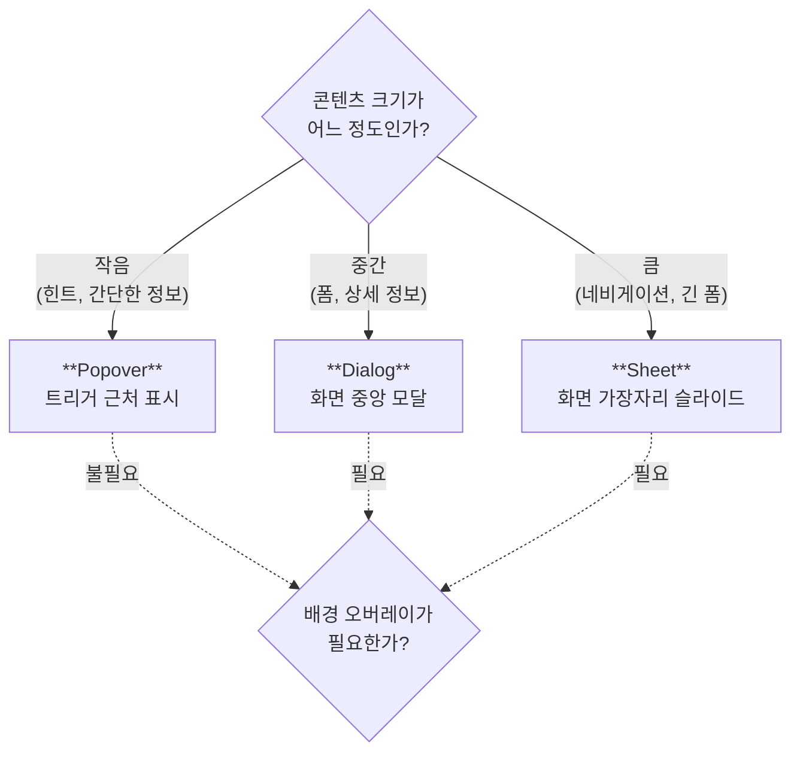

| 특성 | Popover | Dialog | Sheet |
|------|---------|--------|-------|
| 위치 | 트리거 근처 | 화면 중앙 | 화면 가장자리 |
| 크기 | 작음 | 중간 | 큼 |
| 배경 오버레이 | 없음 | 있음 | 있음 |
| 용도 | 간단한 정보/액션 | 복잡한 작업 | 네비게이션/긴 폼 |

---

## 4. Command

### 개념

**Command**는 커맨드 팔레트/검색 인터페이스를 구현하는 컴포넌트입니다. **cmdk** 라이브러리 기반이며, VS Code나 Notion의 Command Palette(⌘K)와 유사한 경험을 제공합니다. 검색과 키보드 내비게이션이 핵심이며, 사용자가 빠르게 원하는 명령이나 항목을 찾을 수 있습니다.

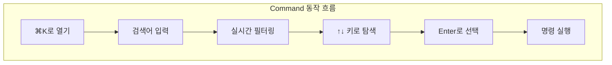

### 설치

```bash
npx shadcn@latest add command
```

### 기본 Command 메뉴

Command 컴포넌트의 기본 구조입니다. **검색 입력 → 결과 목록 → 그룹별 항목**의 계층으로 구성됩니다.

```tsx
import {
  Calculator,
  Calendar,
  CreditCard,
  Settings,
  Smile,
  User,
} from "lucide-react"
import {
  Command,
  CommandEmpty,
  CommandGroup,
  CommandInput,
  CommandItem,
  CommandList,
  CommandSeparator,
  CommandShortcut,
} from "@/components/ui/command"

export function CommandDemo() {
  return (
    <Command className="rounded-lg border shadow-md md:min-w-[450px]">
      <CommandInput placeholder="명령어 또는 검색어 입력..." />
      <CommandList>
        <CommandEmpty>결과가 없습니다.</CommandEmpty>

        <CommandGroup heading="추천">
          <CommandItem>
            <Calendar className="mr-2 h-4 w-4" />
            <span>캘린더</span>
          </CommandItem>
          <CommandItem>
            <Smile className="mr-2 h-4 w-4" />
            <span>이모지 검색</span>
          </CommandItem>
          <CommandItem disabled>
            <Calculator className="mr-2 h-4 w-4" />
            <span>계산기</span>
          </CommandItem>
        </CommandGroup>

        <CommandSeparator />

        <CommandGroup heading="설정">
          <CommandItem>
            <User className="mr-2 h-4 w-4" />
            <span>프로필</span>
            <CommandShortcut>⌘P</CommandShortcut>
          </CommandItem>
          <CommandItem>
            <CreditCard className="mr-2 h-4 w-4" />
            <span>결제</span>
            <CommandShortcut>⌘B</CommandShortcut>
          </CommandItem>
          <CommandItem>
            <Settings className="mr-2 h-4 w-4" />
            <span>설정</span>
            <CommandShortcut>⌘S</CommandShortcut>
          </CommandItem>
        </CommandGroup>
      </CommandList>
    </Command>
  )
}
```

### Command 컴포넌트 구조

Command는 **Compound Component 패턴**을 사용하여 유연한 구조를 제공합니다. 각 컴포넌트가 고유한 역할을 담당합니다.

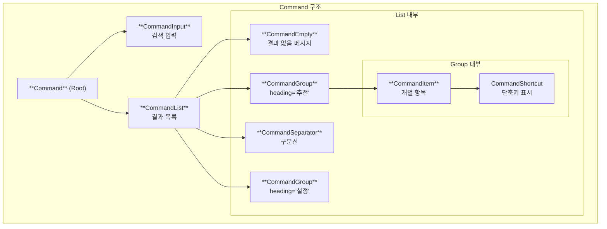

### Command Dialog (키보드 단축키로 열기)

**⌘K(Mac) 또는 Ctrl+K(Windows)**로 열리는 전역 Command Palette를 구현합니다. Dialog 형태로 화면 중앙에 표시됩니다.

```tsx
"use client"

import * as React from "react"
import {
  Calculator,
  Calendar,
  Settings,
  User,
} from "lucide-react"
import {
  CommandDialog,
  CommandEmpty,
  CommandGroup,
  CommandInput,
  CommandItem,
  CommandList,
  CommandSeparator,
  CommandShortcut,
} from "@/components/ui/command"

export function CommandDialogDemo() {
  const [open, setOpen] = React.useState(false)

  // ⌘K 또는 Ctrl+K로 열기
  React.useEffect(() => {
    const down = (e: KeyboardEvent) => {
      if (e.key === "k" && (e.metaKey || e.ctrlKey)) {
        e.preventDefault()
        setOpen((open) => !open)
      }
    }

    document.addEventListener("keydown", down)
    return () => document.removeEventListener("keydown", down)
  }, [])

  return (
    <>
      <p className="text-sm text-muted-foreground">
        Press{" "}
        <kbd className="pointer-events-none inline-flex h-5 select-none items-center gap-1 rounded border bg-muted px-1.5 font-mono text-[10px] font-medium text-muted-foreground">
          <span className="text-xs">⌘</span>K
        </kbd>
      </p>

      <CommandDialog open={open} onOpenChange={setOpen}>
        <CommandInput placeholder="명령어 또는 검색어 입력..." />
        <CommandList>
          <CommandEmpty>결과가 없습니다.</CommandEmpty>
          <CommandGroup heading="추천">
            <CommandItem>
              <Calendar className="mr-2 h-4 w-4" />
              <span>캘린더</span>
            </CommandItem>
          </CommandGroup>
          <CommandSeparator />
          <CommandGroup heading="설정">
            <CommandItem>
              <User className="mr-2 h-4 w-4" />
              <span>프로필</span>
              <CommandShortcut>⌘P</CommandShortcut>
            </CommandItem>
            <CommandItem>
              <Settings className="mr-2 h-4 w-4" />
              <span>설정</span>
              <CommandShortcut>⌘S</CommandShortcut>
            </CommandItem>
          </CommandGroup>
        </CommandList>
      </CommandDialog>
    </>
  )
}
```

### Combobox with Command + Popover

**Command와 Popover를 조합**하여 검색 가능한 드롭다운(Combobox)을 구현합니다. 많은 옵션 중에서 선택해야 할 때 특히 유용합니다.

```tsx
"use client"

import * as React from "react"
import { Check, ChevronsUpDown } from "lucide-react"
import { cn } from "@/lib/utils"
import { Button } from "@/components/ui/button"
import {
  Command,
  CommandEmpty,
  CommandGroup,
  CommandInput,
  CommandItem,
  CommandList,
} from "@/components/ui/command"
import {
  Popover,
  PopoverContent,
  PopoverTrigger,
} from "@/components/ui/popover"

const statuses = [
  { value: "backlog", label: "Backlog" },
  { value: "todo", label: "Todo" },
  { value: "in-progress", label: "In Progress" },
  { value: "done", label: "Done" },
  { value: "canceled", label: "Canceled" },
]

export function ComboboxDemo() {
  const [open, setOpen] = React.useState(false)
  const [value, setValue] = React.useState("")

  return (
    <Popover open={open} onOpenChange={setOpen}>
      <PopoverTrigger asChild>
        <Button
          variant="outline"
          role="combobox"
          aria-expanded={open}
          className="w-[200px] justify-between"
        >
          {value
            ? statuses.find((status) => status.value === value)?.label
            : "상태 선택..."}
          <ChevronsUpDown className="ml-2 h-4 w-4 shrink-0 opacity-50" />
        </Button>
      </PopoverTrigger>
      <PopoverContent className="w-[200px] p-0">
        <Command>
          <CommandInput placeholder="상태 검색..." />
          <CommandList>
            <CommandEmpty>결과가 없습니다.</CommandEmpty>
            <CommandGroup>
              {statuses.map((status) => (
                <CommandItem
                  key={status.value}
                  value={status.value}
                  onSelect={(currentValue) => {
                    setValue(currentValue === value ? "" : currentValue)
                    setOpen(false)
                  }}
                >
                  <Check
                    className={cn(
                      "mr-2 h-4 w-4",
                      value === status.value ? "opacity-100" : "opacity-0"
                    )}
                  />
                  {status.label}
                </CommandItem>
              ))}
            </CommandGroup>
          </CommandList>
        </Command>
      </PopoverContent>
    </Popover>
  )
}
```

---

## 5. Tooltip

### 개념

**Tooltip**은 요소에 hover하거나 focus할 때 추가 정보를 보여주는 작은 팝업입니다. 아이콘 버튼의 의미를 설명하거나, 축약된 텍스트의 전체 내용을 보여줄 때 사용합니다. Tooltip은 **보조적인 정보 전달 수단**이므로, 핵심 기능에 필수적인 정보는 항상 화면에 표시되어야 합니다.

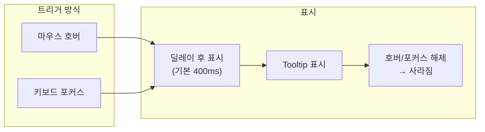

### 설치

```bash
npx shadcn@latest add tooltip
```

### 기본 사용법

Tooltip은 **Trigger + Content** 구조로 이루어집니다. TooltipProvider가 앱 루트에 있어야 동작합니다.

```tsx
import { Button } from "@/components/ui/button"
import {
  Tooltip,
  TooltipContent,
  TooltipTrigger,
} from "@/components/ui/tooltip"

export function TooltipDemo() {
  return (
    <Tooltip>
      <TooltipTrigger asChild>
        <Button variant="outline">Hover</Button>
      </TooltipTrigger>
      <TooltipContent>
        <p>라이브러리에 추가</p>
      </TooltipContent>
    </Tooltip>
  )
}
```

### Tooltip 위치

Tooltip이 나타나는 **위치와 간격**을 설정할 수 있습니다.

```tsx
<TooltipContent side="top">    {/* top, right, bottom, left */}
  <p>상단에 표시</p>
</TooltipContent>

<TooltipContent side="right" sideOffset={10}>
  <p>오른쪽에 10px 간격</p>
</TooltipContent>
```

### 아이콘 버튼에 Tooltip

아이콘만 있는 버튼에는 **반드시 Tooltip과 sr-only 텍스트**를 함께 사용해야 합니다. 시각적으로는 Tooltip이, 스크린 리더에는 sr-only 텍스트가 정보를 전달합니다.

```tsx
import { PlusIcon } from "lucide-react"

export function IconWithTooltip() {
  return (
    <Tooltip>
      <TooltipTrigger asChild>
        <Button variant="outline" size="icon">
          <PlusIcon className="h-4 w-4" />
          <span className="sr-only">추가</span>
        </Button>
      </TooltipTrigger>
      <TooltipContent>
        <p>새 항목 추가</p>
      </TooltipContent>
    </Tooltip>
  )
}
```

### TooltipProvider 설정

앱 전체에서 Tooltip을 사용하려면 **루트에 TooltipProvider를 설정**합니다. 전역 딜레이 설정 등을 관리할 수 있습니다.

```tsx
import { TooltipProvider } from "@/components/ui/tooltip"

function App() {
  return (
    <TooltipProvider delayDuration={300}>
      <MainContent />
    </TooltipProvider>
  )
}
```

| Prop | 기본값 | 설명 |
|------|--------|------|
| `delayDuration` | 400 | Tooltip 표시 딜레이 (ms) |
| `skipDelayDuration` | 300 | 다음 Tooltip 딜레이 생략 시간 |
| `disableHoverableContent` | false | 마우스가 content에 있을 때 유지 여부 |

---

## 6. 컴포넌트 조합 패턴

### Toast + Alert Dialog

**중요한 작업 확인 후 결과를 Toast로 알리는 패턴**입니다. Alert Dialog로 사용자의 의도를 확인하고, 작업 결과는 Toast로 피드백합니다.

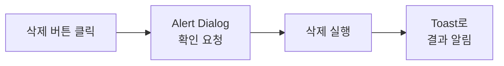

```tsx
function DeleteWithConfirmation({ itemId }: { itemId: string }) {
  const handleDelete = async () => {
    try {
      await deleteItem(itemId)
      toast.success("항목이 삭제되었습니다")
    } catch (error) {
      toast.error("삭제 실패")
    }
  }

  return (
    <AlertDialog>
      <AlertDialogTrigger asChild>
        <Button variant="destructive">삭제</Button>
      </AlertDialogTrigger>
      <AlertDialogContent>
        <AlertDialogHeader>
          <AlertDialogTitle>삭제 확인</AlertDialogTitle>
          <AlertDialogDescription>
            이 작업은 되돌릴 수 없습니다.
          </AlertDialogDescription>
        </AlertDialogHeader>
        <AlertDialogFooter>
          <AlertDialogCancel>취소</AlertDialogCancel>
          <AlertDialogAction onClick={handleDelete}>
            삭제
          </AlertDialogAction>
        </AlertDialogFooter>
      </AlertDialogContent>
    </AlertDialog>
  )
}
```

### Command + Keyboard Navigation

**전역 Command Palette**를 구현하는 패턴입니다. 페이지 이동, 테마 변경, 검색 등 다양한 기능을 키보드로 빠르게 실행할 수 있습니다.

```tsx
"use client"

import * as React from "react"
import { useNavigate } from "react-router-dom"

export function GlobalCommandPalette() {
  const [open, setOpen] = React.useState(false)
  const navigate = useNavigate()

  React.useEffect(() => {
    const down = (e: KeyboardEvent) => {
      if (e.key === "k" && (e.metaKey || e.ctrlKey)) {
        e.preventDefault()
        setOpen((open) => !open)
      }
    }

    document.addEventListener("keydown", down)
    return () => document.removeEventListener("keydown", down)
  }, [])

  const runCommand = React.useCallback((command: () => void) => {
    setOpen(false)
    command()
  }, [])

  return (
    <CommandDialog open={open} onOpenChange={setOpen}>
      <CommandInput placeholder="무엇을 하시겠습니까?" />
      <CommandList>
        <CommandEmpty>결과가 없습니다.</CommandEmpty>
        <CommandGroup heading="페이지 이동">
          <CommandItem onSelect={() => runCommand(() => navigate("/"))}>
            홈으로 이동
          </CommandItem>
          <CommandItem onSelect={() => runCommand(() => navigate("/dashboard"))}>
            대시보드로 이동
          </CommandItem>
        </CommandGroup>
        <CommandGroup heading="액션">
          <CommandItem onSelect={() => runCommand(() => {
            // 테마 토글 로직
          })}>
            테마 변경
          </CommandItem>
        </CommandGroup>
      </CommandList>
    </CommandDialog>
  )
}
```

### Tooltip + Icon Button 조합

**아이콘 버튼 그룹**에 Tooltip을 적용하는 패턴입니다. 반복되는 구조를 배열로 관리하여 코드를 간결하게 유지합니다.

```tsx
import { Settings, Bell, User, LogOut } from "lucide-react"

function IconButtonGroup() {
  const icons = [
    { icon: Settings, label: "설정" },
    { icon: Bell, label: "알림" },
    { icon: User, label: "프로필" },
    { icon: LogOut, label: "로그아웃" },
  ]

  return (
    <div className="flex gap-2">
      {icons.map(({ icon: Icon, label }) => (
        <Tooltip key={label}>
          <TooltipTrigger asChild>
            <Button variant="ghost" size="icon">
              <Icon className="h-4 w-4" />
              <span className="sr-only">{label}</span>
            </Button>
          </TooltipTrigger>
          <TooltipContent>
            <p>{label}</p>
          </TooltipContent>
        </Tooltip>
      ))}
    </div>
  )
}
```

---

## 7. 패턴 비교 요약

각 컴포넌트의 **특성과 용도를 한눈에 비교**할 수 있습니다.

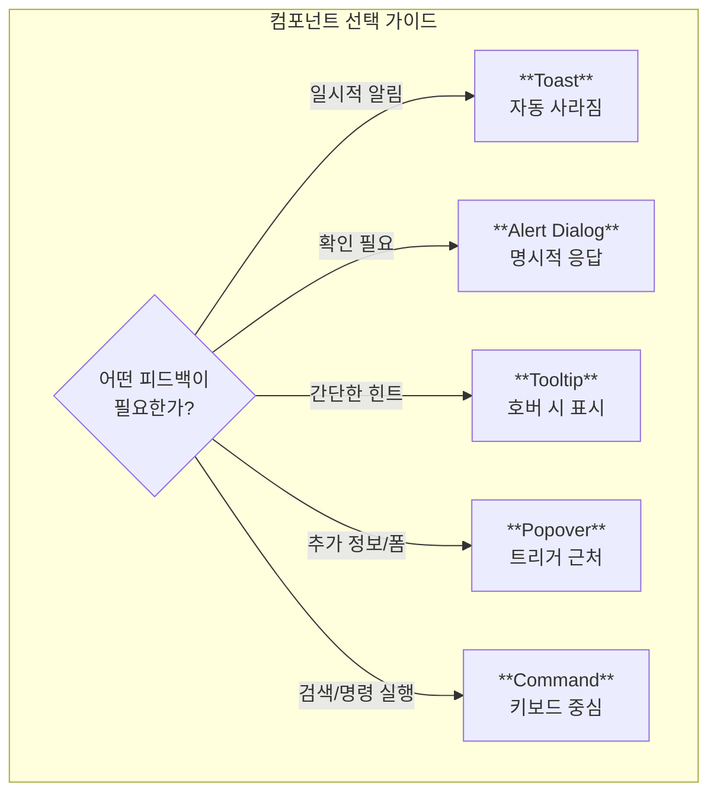

| 컴포넌트 | 용도 | 의존성 | 핵심 패턴 |
|----------|------|--------|-----------|
| **Toast (Sonner)** | 일시적 알림 | sonner | Provider + 함수 호출 |
| **Alert Dialog** | 확인 모달 | @radix-ui/react-alert-dialog | Compound Component |
| **Popover** | 부가 정보/폼 | @radix-ui/react-popover | Trigger + Content |
| **Command** | 커맨드 팔레트 | cmdk | 키보드 내비게이션 |
| **Tooltip** | 호버 힌트 | @radix-ui/react-tooltip | Provider + Trigger |

---

## 8. 접근성 고려사항

접근성은 **모든 사용자가 동등하게 기능을 이용**할 수 있도록 보장합니다. 각 컴포넌트가 제공하는 접근성 기능을 이해하고 올바르게 활용해야 합니다.

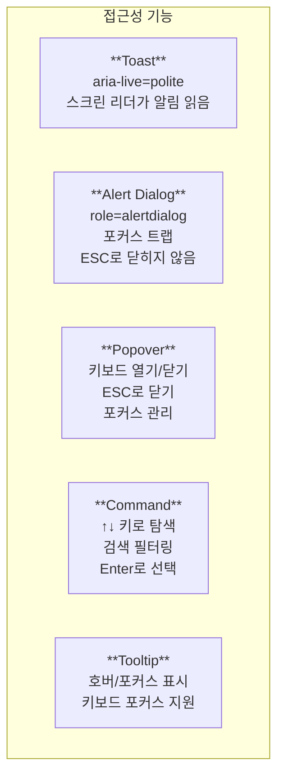

### Toast
- `aria-live="polite"` 자동 적용되어 스크린 리더가 알림을 읽습니다.
- 중요하지 않은 알림이므로 현재 작업을 방해하지 않습니다.

### Alert Dialog
- `role="alertdialog"` 적용되어 중요한 알림임을 스크린 리더에 전달합니다.
- **포커스 트랩**이 적용되어 dialog 밖으로 포커스가 이동하지 않습니다.
- ESC로 닫히지 않아 명시적인 버튼 클릭이 필요합니다.

### Popover
- 키보드로 열기/닫기가 가능합니다.
- ESC로 닫을 수 있습니다.
- 열릴 때 포커스가 적절히 관리됩니다.

### Command
- **위/아래 화살표**로 항목을 탐색합니다.
- 입력한 텍스트로 실시간 필터링됩니다.
- **Enter**로 선택된 항목을 실행합니다.

### Tooltip
- 마우스 호버와 **키보드 포커스** 모두에서 표시됩니다.
- 짧은 딜레이로 의도하지 않은 표시를 방지합니다.

---

## 다음 단계

피드백/인터랙션 컴포넌트를 이해했다면, 다음 문서에서는 **CSS 변수 기반 테마 시스템과 다크모드 구현**을 살펴봅니다.
