# 테마 시스템

## 개요

shadcn/ui는 **CSS 변수 기반의 테마 시스템**을 사용합니다. CSS 변수를 활용하면 JavaScript 없이도 테마를 전환할 수 있고, 모든 컴포넌트에 일관된 색상을 적용할 수 있습니다. 이 시스템은 **라이트/다크 모드 전환**과 **커스텀 테마 생성**을 간단하게 만들어 줍니다.

테마 시스템의 핵심 원리는 `:root`에 정의된 CSS 변수 값을 `.dark` 클래스가 적용되면 다른 값으로 **덮어쓰는** 방식입니다. Tailwind CSS의 유틸리티 클래스(`bg-primary`, `text-foreground` 등)가 이 CSS 변수를 참조하므로, 클래스만 바꿔도 전체 UI의 색상이 자동으로 변경됩니다.

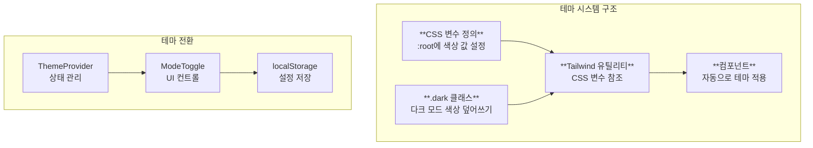

---

## 1. CSS 변수 구조

### 기본 변수 목록

shadcn/ui에서 사용하는 CSS 변수는 **의미론적(semantic) 이름**을 가지고 있습니다. `--blue-500` 같은 색상 이름 대신 `--primary`, `--destructive` 같은 **용도 기반 이름**을 사용하여 테마를 쉽게 커스터마이징할 수 있습니다.

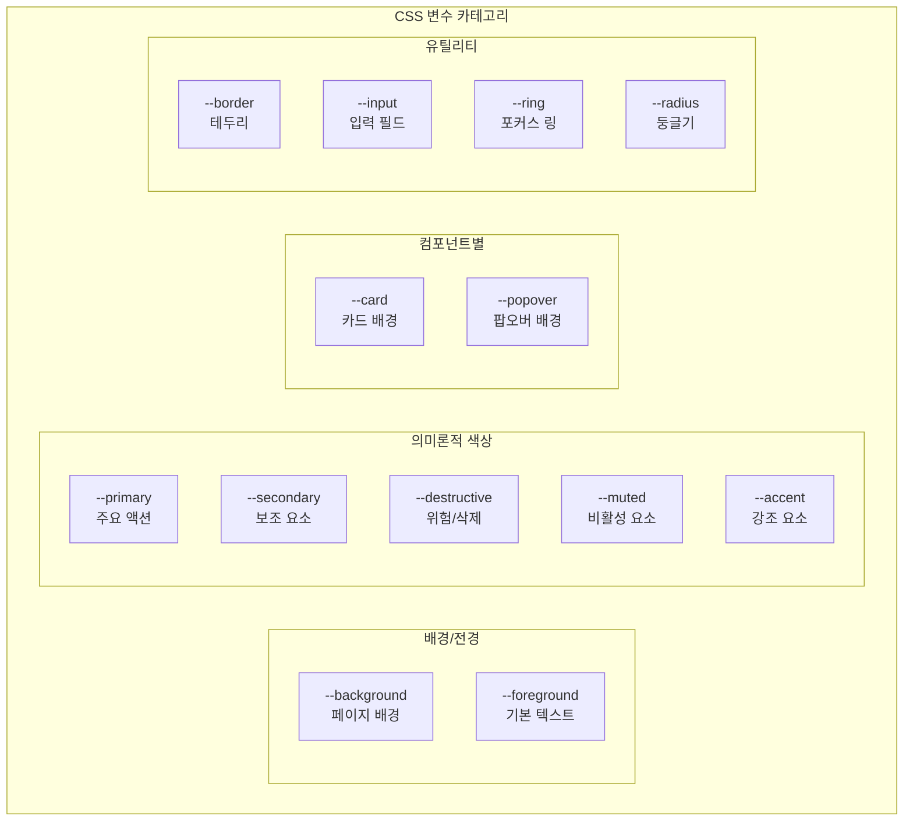

| 변수 | 용도 | 적용 예시 |
|------|------|----------|
| `--background` | 페이지 배경 | `bg-background` |
| `--foreground` | 기본 텍스트 색상 | `text-foreground` |
| `--card` | 카드 배경 | `bg-card` |
| `--card-foreground` | 카드 텍스트 | `text-card-foreground` |
| `--popover` | 팝오버 배경 | `bg-popover` |
| `--popover-foreground` | 팝오버 텍스트 | `text-popover-foreground` |
| `--primary` | 주요 색상 | `bg-primary` |
| `--primary-foreground` | 주요 색상 위 텍스트 | `text-primary-foreground` |
| `--secondary` | 보조 색상 | `bg-secondary` |
| `--secondary-foreground` | 보조 색상 위 텍스트 | `text-secondary-foreground` |
| `--muted` | 비활성/보조 배경 | `bg-muted` |
| `--muted-foreground` | 비활성 텍스트 | `text-muted-foreground` |
| `--accent` | 강조 색상 | `bg-accent` |
| `--accent-foreground` | 강조 텍스트 | `text-accent-foreground` |
| `--destructive` | 위험/삭제 색상 | `bg-destructive` |
| `--border` | 테두리 색상 | `border-border` |
| `--input` | 입력 필드 테두리 | `border-input` |
| `--ring` | 포커스 링 색상 | `ring-ring` |
| `--radius` | 기본 border-radius | - |

### 추가 변수 (차트, 사이드바)

대시보드나 복잡한 레이아웃에서 사용하는 추가 변수들도 있습니다. **차트 색상**은 데이터 시각화에, **사이드바 변수**는 네비게이션 영역에 사용됩니다.

```css
/* 차트 색상 */
--chart-1, --chart-2, --chart-3, --chart-4, --chart-5

/* 사이드바 전용 */
--sidebar, --sidebar-foreground
--sidebar-primary, --sidebar-primary-foreground
--sidebar-accent, --sidebar-accent-foreground
--sidebar-border, --sidebar-ring
```

---

## 2. globals.css 설정

### 기본 테마 정의

CSS 변수는 `globals.css`(또는 `index.css`)에서 정의합니다. **`:root`에 라이트 모드 값**을, **`.dark`에 다크 모드 값**을 정의합니다. html 요소에 `.dark` 클래스가 추가되면 다크 모드 변수가 적용됩니다.

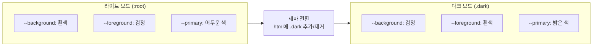

```css
/* src/index.css 또는 globals.css */
@import "tailwindcss";

:root {
  --radius: 0.625rem;

  /* 배경/전경 */
  --background: oklch(1 0 0);
  --foreground: oklch(0.141 0.005 285.823);

  /* 카드 */
  --card: oklch(1 0 0);
  --card-foreground: oklch(0.141 0.005 285.823);

  /* 팝오버 */
  --popover: oklch(1 0 0);
  --popover-foreground: oklch(0.141 0.005 285.823);

  /* Primary */
  --primary: oklch(0.21 0.006 285.885);
  --primary-foreground: oklch(0.985 0 0);

  /* Secondary */
  --secondary: oklch(0.967 0.001 286.375);
  --secondary-foreground: oklch(0.21 0.006 285.885);

  /* Muted */
  --muted: oklch(0.967 0.001 286.375);
  --muted-foreground: oklch(0.552 0.016 285.938);

  /* Accent */
  --accent: oklch(0.967 0.001 286.375);
  --accent-foreground: oklch(0.21 0.006 285.885);

  /* Destructive */
  --destructive: oklch(0.577 0.245 27.325);

  /* Border & Input */
  --border: oklch(0.92 0.004 286.32);
  --input: oklch(0.92 0.004 286.32);
  --ring: oklch(0.705 0.015 286.067);
}

/* 다크 모드 */
.dark {
  --background: oklch(0.141 0.005 285.823);
  --foreground: oklch(0.985 0 0);

  --card: oklch(0.21 0.006 285.885);
  --card-foreground: oklch(0.985 0 0);

  --popover: oklch(0.21 0.006 285.885);
  --popover-foreground: oklch(0.985 0 0);

  --primary: oklch(0.92 0.004 286.32);
  --primary-foreground: oklch(0.21 0.006 285.885);

  --secondary: oklch(0.274 0.006 286.033);
  --secondary-foreground: oklch(0.985 0 0);

  --muted: oklch(0.274 0.006 286.033);
  --muted-foreground: oklch(0.705 0.015 286.067);

  --accent: oklch(0.274 0.006 286.033);
  --accent-foreground: oklch(0.985 0 0);

  --destructive: oklch(0.704 0.191 22.216);

  --border: oklch(1 0 0 / 10%);
  --input: oklch(1 0 0 / 15%);
  --ring: oklch(0.552 0.016 285.938);
}
```

---

## 3. OKLCH 색상 형식

### OKLCH란?

shadcn/ui는 **OKLCH 색상 형식**을 사용합니다. OKLCH는 **인간의 색상 인지에 더 가까운 색상 공간**으로, 같은 밝기 값을 가진 색상은 실제로도 비슷한 밝기로 보입니다. 이는 HSL에서 발생하는 "노란색이 파란색보다 밝아 보이는" 문제를 해결합니다.

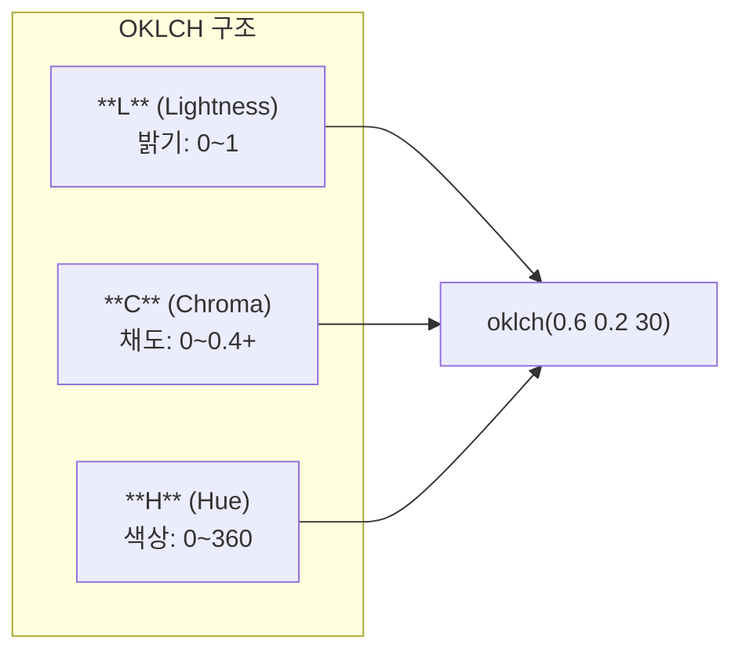

```
oklch(L C H)
      │ │ │
      │ │ └── Hue (색상, 0-360)
      │ └──── Chroma (채도, 0-0.4+)
      └────── Lightness (밝기, 0-1)
```

### 예시

```css
/* 순수한 흰색 */
oklch(1 0 0)

/* 순수한 검정 */
oklch(0 0 0)

/* 회색 (채도 없음) */
oklch(0.5 0 0)

/* 빨간색 계열 */
oklch(0.6 0.2 30)

/* 파란색 계열 */
oklch(0.5 0.2 260)
```

### OKLCH vs HSL

OKLCH는 **접근성**과 **디자인 일관성** 측면에서 HSL보다 우수합니다. 특히 대비 비율을 계산할 때 예측 가능한 결과를 얻을 수 있습니다.

| 특성 | HSL | OKLCH |
|------|-----|-------|
| 인지적 균일성 | 낮음 | 높음 |
| 밝기 일관성 | 색상에 따라 다름 | 일관됨 |
| 접근성 | 예측 어려움 | 예측 가능 |
| 브라우저 지원 | 모든 브라우저 | 최신 브라우저 |

---

## 4. Theme Provider (Vite)

### ThemeProvider 컴포넌트

테마 상태를 앱 전체에서 관리하려면 **React Context**를 사용합니다. ThemeProvider는 현재 테마 상태를 관리하고, localStorage에 사용자 선호를 저장하며, html 요소에 적절한 클래스를 적용합니다.

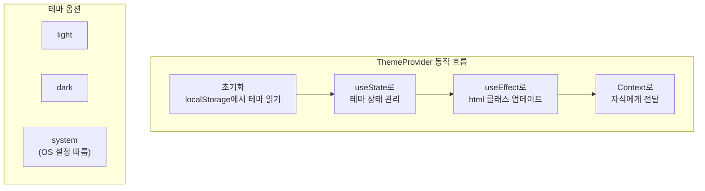

```tsx
// src/components/theme-provider.tsx
import { createContext, useContext, useEffect, useState } from "react"

type Theme = "dark" | "light" | "system"

type ThemeProviderProps = {
  children: React.ReactNode
  defaultTheme?: Theme
  storageKey?: string
}

type ThemeProviderState = {
  theme: Theme
  setTheme: (theme: Theme) => void
}

const initialState: ThemeProviderState = {
  theme: "system",
  setTheme: () => null,
}

const ThemeProviderContext = createContext<ThemeProviderState>(initialState)

export function ThemeProvider({
  children,
  defaultTheme = "system",
  storageKey = "vite-ui-theme",
  ...props
}: ThemeProviderProps) {
  const [theme, setTheme] = useState<Theme>(
    () => (localStorage.getItem(storageKey) as Theme) || defaultTheme
  )

  useEffect(() => {
    const root = window.document.documentElement

    // 기존 테마 클래스 제거
    root.classList.remove("light", "dark")

    // system 테마인 경우 OS 설정 확인
    if (theme === "system") {
      const systemTheme = window.matchMedia("(prefers-color-scheme: dark)")
        .matches
        ? "dark"
        : "light"

      root.classList.add(systemTheme)
      return
    }

    // light 또는 dark 클래스 추가
    root.classList.add(theme)
  }, [theme])

  const value = {
    theme,
    setTheme: (theme: Theme) => {
      localStorage.setItem(storageKey, theme)
      setTheme(theme)
    },
  }

  return (
    <ThemeProviderContext.Provider {...props} value={value}>
      {children}
    </ThemeProviderContext.Provider>
  )
}

// 커스텀 훅
export const useTheme = () => {
  const context = useContext(ThemeProviderContext)

  if (context === undefined)
    throw new Error("useTheme must be used within a ThemeProvider")

  return context
}
```

### App에 적용

ThemeProvider는 앱의 **최상위**에 배치합니다. 모든 하위 컴포넌트가 `useTheme` 훅을 통해 테마 상태에 접근할 수 있습니다.

```tsx
// src/App.tsx
import { ThemeProvider } from "@/components/theme-provider"

function App() {
  return (
    <ThemeProvider defaultTheme="system" storageKey="vite-ui-theme">
      <MainContent />
    </ThemeProvider>
  )
}

export default App
```

---

## 5. Mode Toggle 컴포넌트

### 드롭다운 방식

사용자에게 **Light, Dark, System 세 가지 옵션**을 제공하는 방식입니다. System 옵션을 선택하면 OS의 다크 모드 설정을 따릅니다.

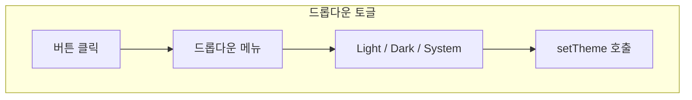

```tsx
// src/components/mode-toggle.tsx
import { Moon, Sun } from "lucide-react"
import { Button } from "@/components/ui/button"
import {
  DropdownMenu,
  DropdownMenuContent,
  DropdownMenuItem,
  DropdownMenuTrigger,
} from "@/components/ui/dropdown-menu"
import { useTheme } from "@/components/theme-provider"

export function ModeToggle() {
  const { setTheme } = useTheme()

  return (
    <DropdownMenu>
      <DropdownMenuTrigger asChild>
        <Button variant="outline" size="icon">
          {/* 라이트 모드 아이콘 */}
          <Sun className="h-[1.2rem] w-[1.2rem] scale-100 rotate-0 transition-all dark:scale-0 dark:-rotate-90" />
          {/* 다크 모드 아이콘 */}
          <Moon className="absolute h-[1.2rem] w-[1.2rem] scale-0 rotate-90 transition-all dark:scale-100 dark:rotate-0" />
          <span className="sr-only">Toggle theme</span>
        </Button>
      </DropdownMenuTrigger>
      <DropdownMenuContent align="end">
        <DropdownMenuItem onClick={() => setTheme("light")}>
          Light
        </DropdownMenuItem>
        <DropdownMenuItem onClick={() => setTheme("dark")}>
          Dark
        </DropdownMenuItem>
        <DropdownMenuItem onClick={() => setTheme("system")}>
          System
        </DropdownMenuItem>
      </DropdownMenuContent>
    </DropdownMenu>
  )
}
```

### 간단한 토글 방식

**Light ↔ Dark 두 상태만 전환**하는 간단한 버튼입니다. System 옵션이 필요 없는 경우에 사용합니다.

```tsx
// src/components/simple-mode-toggle.tsx
import { Moon, Sun } from "lucide-react"
import { Button } from "@/components/ui/button"
import { useTheme } from "@/components/theme-provider"

export function SimpleModeToggle() {
  const { theme, setTheme } = useTheme()

  const toggleTheme = () => {
    if (theme === "dark") {
      setTheme("light")
    } else {
      setTheme("dark")
    }
  }

  return (
    <Button variant="outline" size="icon" onClick={toggleTheme}>
      <Sun className="h-[1.2rem] w-[1.2rem] scale-100 rotate-0 transition-all dark:scale-0 dark:-rotate-90" />
      <Moon className="absolute h-[1.2rem] w-[1.2rem] scale-0 rotate-90 transition-all dark:scale-100 dark:rotate-0" />
      <span className="sr-only">Toggle theme</span>
    </Button>
  )
}
```

### 아이콘 전환 애니메이션 분석

Sun과 Moon 아이콘이 **동시에 렌더링**되지만, Tailwind의 `scale`과 `rotate` 클래스로 현재 테마에 맞는 아이콘만 보이게 합니다. `transition-all`로 부드러운 전환 효과를 적용합니다.

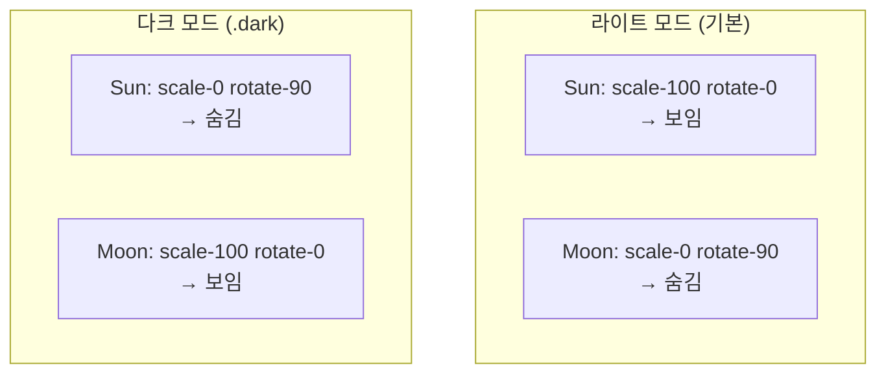

```css
/* 라이트 모드일 때 (기본) */
Sun: scale-100 rotate-0      /* 보임 */
Moon: scale-0 rotate-90      /* 숨김 */

/* 다크 모드일 때 (.dark 클래스) */
Sun: dark:scale-0 dark:-rotate-90  /* 숨김 */
Moon: dark:scale-100 dark:rotate-0 /* 보임 */
```

---

## 6. 테마 커스터마이징

### 색상 팔레트 선택

shadcn/ui는 다양한 **기본 팔레트**를 제공합니다. 프로젝트의 분위기에 맞는 팔레트를 선택하여 시작점으로 사용할 수 있습니다.

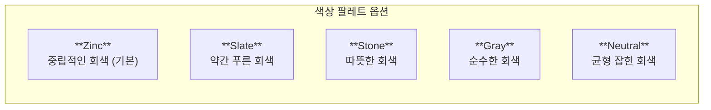

| 팔레트 | 특징 |
|--------|------|
| Zinc | 중립적인 회색 (기본) |
| Slate | 약간 푸른 회색 |
| Stone | 따뜻한 회색 |
| Gray | 순수한 회색 |
| Neutral | 균형 잡힌 회색 |

### 커스텀 Primary 색상

**브랜드 색상**을 적용하려면 `--primary` 변수를 변경합니다. 라이트 모드와 다크 모드에서 적절한 대비를 유지하도록 값을 조정해야 합니다.

```css
:root {
  /* 파란색 Primary */
  --primary: oklch(0.546 0.245 262.881);
  --primary-foreground: oklch(0.97 0.014 254.604);
}

.dark {
  /* 다크 모드에서 더 밝은 파란색 */
  --primary: oklch(0.707 0.165 254.624);
  --primary-foreground: oklch(0.97 0.014 254.604);
}
```

### 브랜드 색상 적용 예시

```css
/* 초록색 브랜드 */
:root {
  --primary: oklch(0.6 0.2 145);
  --primary-foreground: oklch(1 0 0);
}

/* 보라색 브랜드 */
:root {
  --primary: oklch(0.5 0.25 300);
  --primary-foreground: oklch(1 0 0);
}
```

---

## 7. Tailwind 설정

### tailwind.config.js

Tailwind가 CSS 변수를 인식하도록 **테마 확장**을 설정합니다. 이 설정을 통해 `bg-primary`, `text-foreground` 같은 유틸리티 클래스가 CSS 변수 값을 참조하게 됩니다.

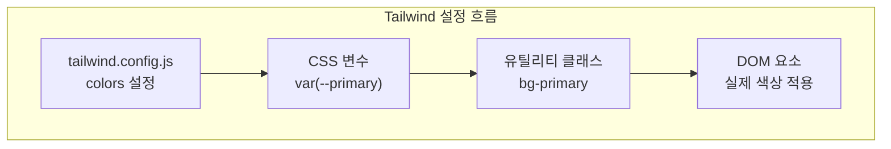

```javascript
// tailwind.config.js
export default {
  darkMode: ["class"],
  content: ["./src/**/*.{ts,tsx}"],
  theme: {
    extend: {
      colors: {
        background: "var(--background)",
        foreground: "var(--foreground)",
        card: {
          DEFAULT: "var(--card)",
          foreground: "var(--card-foreground)",
        },
        popover: {
          DEFAULT: "var(--popover)",
          foreground: "var(--popover-foreground)",
        },
        primary: {
          DEFAULT: "var(--primary)",
          foreground: "var(--primary-foreground)",
        },
        secondary: {
          DEFAULT: "var(--secondary)",
          foreground: "var(--secondary-foreground)",
        },
        muted: {
          DEFAULT: "var(--muted)",
          foreground: "var(--muted-foreground)",
        },
        accent: {
          DEFAULT: "var(--accent)",
          foreground: "var(--accent-foreground)",
        },
        destructive: {
          DEFAULT: "var(--destructive)",
          foreground: "var(--destructive-foreground)",
        },
        border: "var(--border)",
        input: "var(--input)",
        ring: "var(--ring)",
      },
      borderRadius: {
        lg: "var(--radius)",
        md: "calc(var(--radius) - 2px)",
        sm: "calc(var(--radius) - 4px)",
      },
    },
  },
}
```

---

## 8. 시스템 테마 감지

### OS 테마 변경 감지

사용자가 **system** 테마를 선택한 경우, OS의 다크 모드 설정이 변경되면 자동으로 UI가 업데이트되어야 합니다. `matchMedia` API의 `change` 이벤트를 사용하여 이를 구현합니다.

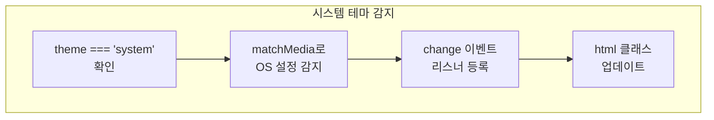

```tsx
import { useEffect } from "react"
import { useTheme } from "@/components/theme-provider"

export function useSystemThemeListener() {
  const { theme, setTheme } = useTheme()

  useEffect(() => {
    if (theme !== "system") return

    const mediaQuery = window.matchMedia("(prefers-color-scheme: dark)")

    const handleChange = (e: MediaQueryListEvent) => {
      const root = window.document.documentElement
      root.classList.remove("light", "dark")
      root.classList.add(e.matches ? "dark" : "light")
    }

    mediaQuery.addEventListener("change", handleChange)
    return () => mediaQuery.removeEventListener("change", handleChange)
  }, [theme])
}
```

---

## 9. 테마 전환 애니메이션

### 부드러운 전환 효과

테마 전환 시 **색상이 부드럽게 변하도록** CSS transition을 적용합니다. 단, 페이지 로드 시에는 전환 효과를 비활성화하여 깜빡임을 방지해야 합니다.

```css
/* globals.css */
* {
  transition: background-color 0.3s ease, color 0.3s ease, border-color 0.3s ease;
}

/* 전환 효과 비활성화 (깜빡임 방지) */
.disable-transitions * {
  transition: none !important;
}
```

### 전환 시 깜빡임 방지

테마 전환 직전에 transition을 비활성화하고, 클래스 적용 후 다음 프레임에서 다시 활성화합니다.

```tsx
// ThemeProvider에서 전환 시 처리
useEffect(() => {
  const root = window.document.documentElement

  // 전환 효과 비활성화
  root.classList.add("disable-transitions")

  root.classList.remove("light", "dark")

  if (theme === "system") {
    const systemTheme = window.matchMedia("(prefers-color-scheme: dark)").matches
      ? "dark"
      : "light"
    root.classList.add(systemTheme)
  } else {
    root.classList.add(theme)
  }

  // 다음 프레임에서 전환 효과 다시 활성화
  requestAnimationFrame(() => {
    root.classList.remove("disable-transitions")
  })
}, [theme])
```

---

## 10. 컴포넌트별 다크 모드 스타일

### 조건부 스타일링

Tailwind의 **`dark:` 접두사**를 사용하여 다크 모드에서만 적용되는 스타일을 정의할 수 있습니다.

```tsx
// dark: 접두사 사용
<div className="bg-white dark:bg-slate-800">
  <p className="text-black dark:text-white">
    라이트/다크 모드 텍스트
  </p>
</div>
```

### CSS 변수 활용

CSS 변수를 사용하면 **`dark:` 접두사 없이도 자동으로** 테마가 적용됩니다. 변수 값이 테마에 따라 변하기 때문입니다.

```tsx
// CSS 변수를 사용하면 자동으로 테마 적용
<div className="bg-background text-foreground">
  <p className="text-muted-foreground">
    자동으로 테마에 맞게 변경
  </p>
</div>
```

### 권장 방식

**CSS 변수 방식**을 권장합니다. 하드코딩된 색상은 테마 변경 시 일일이 수정해야 하지만, CSS 변수는 한 곳에서 관리할 수 있습니다.

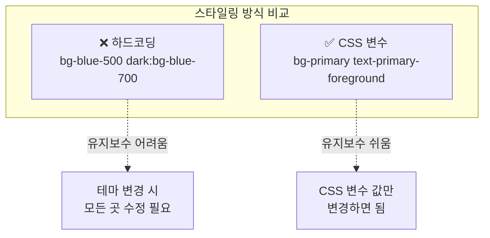

```tsx
// ❌ 하드코딩
<button className="bg-blue-500 dark:bg-blue-700">

// ✅ CSS 변수 사용
<button className="bg-primary text-primary-foreground">
```

---

## 11. 완전한 설정 예시

### 프로젝트 구조

```
src/
├── components/
│   ├── ui/
│   │   └── button.tsx
│   ├── theme-provider.tsx
│   └── mode-toggle.tsx
├── App.tsx
└── index.css
```

### index.css (전체)

```css
@import "tailwindcss";

:root {
  --radius: 0.625rem;
  --background: oklch(1 0 0);
  --foreground: oklch(0.141 0.005 285.823);
  --card: oklch(1 0 0);
  --card-foreground: oklch(0.141 0.005 285.823);
  --popover: oklch(1 0 0);
  --popover-foreground: oklch(0.141 0.005 285.823);
  --primary: oklch(0.21 0.006 285.885);
  --primary-foreground: oklch(0.985 0 0);
  --secondary: oklch(0.967 0.001 286.375);
  --secondary-foreground: oklch(0.21 0.006 285.885);
  --muted: oklch(0.967 0.001 286.375);
  --muted-foreground: oklch(0.552 0.016 285.938);
  --accent: oklch(0.967 0.001 286.375);
  --accent-foreground: oklch(0.21 0.006 285.885);
  --destructive: oklch(0.577 0.245 27.325);
  --destructive-foreground: oklch(0.985 0 0);
  --border: oklch(0.92 0.004 286.32);
  --input: oklch(0.92 0.004 286.32);
  --ring: oklch(0.705 0.015 286.067);
}

.dark {
  --background: oklch(0.141 0.005 285.823);
  --foreground: oklch(0.985 0 0);
  --card: oklch(0.21 0.006 285.885);
  --card-foreground: oklch(0.985 0 0);
  --popover: oklch(0.21 0.006 285.885);
  --popover-foreground: oklch(0.985 0 0);
  --primary: oklch(0.92 0.004 286.32);
  --primary-foreground: oklch(0.21 0.006 285.885);
  --secondary: oklch(0.274 0.006 286.033);
  --secondary-foreground: oklch(0.985 0 0);
  --muted: oklch(0.274 0.006 286.033);
  --muted-foreground: oklch(0.705 0.015 286.067);
  --accent: oklch(0.274 0.006 286.033);
  --accent-foreground: oklch(0.985 0 0);
  --destructive: oklch(0.704 0.191 22.216);
  --destructive-foreground: oklch(0.985 0 0);
  --border: oklch(1 0 0 / 10%);
  --input: oklch(1 0 0 / 15%);
  --ring: oklch(0.552 0.016 285.938);
}

@layer base {
  * {
    @apply border-border;
  }
  body {
    @apply bg-background text-foreground;
  }
}
```

### App.tsx (전체)

```tsx
import { ThemeProvider } from "@/components/theme-provider"
import { ModeToggle } from "@/components/mode-toggle"
import { Button } from "@/components/ui/button"

function App() {
  return (
    <ThemeProvider defaultTheme="system" storageKey="my-app-theme">
      <div className="min-h-screen bg-background">
        <header className="flex items-center justify-between p-4 border-b">
          <h1 className="text-xl font-bold">My App</h1>
          <ModeToggle />
        </header>

        <main className="p-4">
          <div className="space-y-4">
            <Button>Primary Button</Button>
            <Button variant="secondary">Secondary</Button>
            <Button variant="destructive">Destructive</Button>
          </div>
        </main>
      </div>
    </ThemeProvider>
  )
}

export default App
```

---

## 요약

테마 시스템의 핵심 개념을 정리합니다.

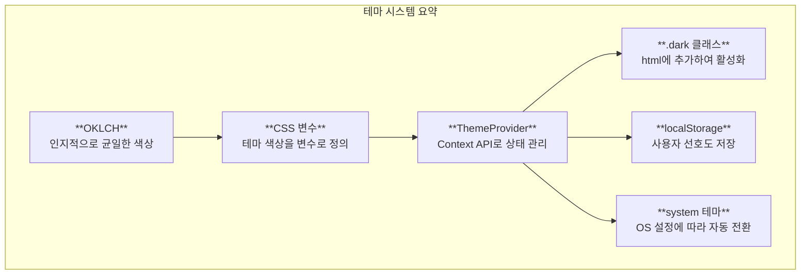

| 개념 | 설명 |
|------|------|
| CSS 변수 | 테마 색상을 변수로 정의하여 일관성 유지 |
| OKLCH | 인지적으로 균일한 색상 형식 |
| ThemeProvider | Context API로 테마 상태 관리 |
| .dark 클래스 | html 요소에 추가하여 다크 모드 활성화 |
| localStorage | 사용자 테마 선호도 저장 |
| system 테마 | OS 설정에 따라 자동 전환 |

---

## 다음 단계

테마 시스템을 이해했다면, 다음 문서에서는 **지금까지 학습한 shadcn/ui 패턴을 TPS 프로젝트에 적용하는 전략**을 살펴봅니다.
