# TPS 프로젝트 적용 전략

## 개요

이 문서는 shadcn/ui에서 학습한 패턴들을 TPS 프로젝트에 어떻게 참고할 수 있는지 분석합니다. **TPS는 이미 자체 컴포넌트 시스템을 갖추고 있으므로**, shadcn/ui를 직접 도입하는 것이 아니라 **패턴과 아이디어를 참고**하는 방식으로 접근합니다.

핵심은 "shadcn/ui를 쓰자"가 아니라 **"shadcn/ui가 왜 이렇게 설계했는지 이해하고, 그 원리를 우리 프로젝트에 적용하자"**입니다. 이를 통해 기존 코드베이스를 유지하면서도 개발 경험과 코드 품질을 점진적으로 개선할 수 있습니다.

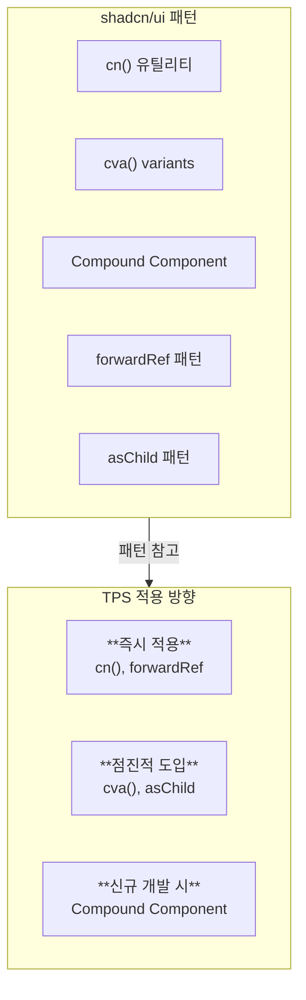

---

## 1. 적용 가능한 패턴 분석

### 1.1 cn() 유틸리티 패턴

**cn() 유틸리티**는 조건부 클래스 결합을 깔끔하게 처리하는 함수입니다. `clsx`로 조건부 클래스를 처리하고, `twMerge`로 Tailwind 클래스 충돌을 해결합니다. 이 패턴은 **가장 적은 노력으로 가장 큰 효과**를 얻을 수 있는 패턴입니다.

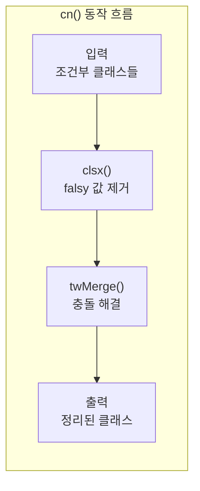

**shadcn/ui 방식**:
```tsx
import { clsx, type ClassValue } from "clsx"
import { twMerge } from "tailwind-merge"

export function cn(...inputs: ClassValue[]) {
  return twMerge(clsx(inputs))
}
```

**TPS 적용 고려사항**:
- TPS가 Tailwind CSS를 사용한다면 `twMerge`까지 포함하여 바로 적용 가능합니다.
- CSS Module이나 다른 스타일링 방식이라면 `clsx`만 사용해도 충분합니다.

```tsx
// TPS용 간소화 버전
import clsx, { type ClassValue } from "clsx"

export function cn(...inputs: ClassValue[]) {
  return clsx(inputs)
}

// 사용 예시
<Button className={cn(
  "base-styles",
  isActive && "active-styles",
  className
)} />
```

**적용 난이도**: ⭐ (매우 쉬움)
**영향 범위**: 모든 컴포넌트

---

### 1.2 cva() Variants 패턴

**cva() (Class Variance Authority)**는 컴포넌트의 variant를 타입 안전하게 관리하는 라이브러리입니다. variant와 size 같은 옵션을 선언적으로 정의하고, TypeScript 자동완성까지 지원받을 수 있습니다.

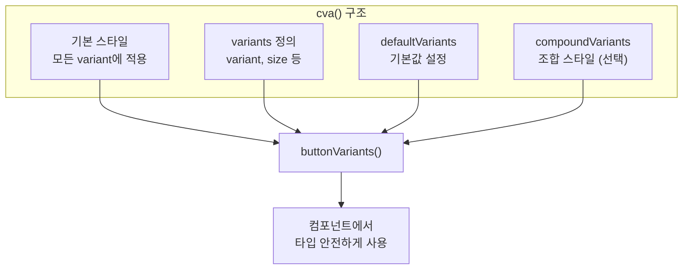

**shadcn/ui 방식**:
```tsx
const buttonVariants = cva(
  "base-styles",
  {
    variants: {
      variant: { default: "...", outline: "..." },
      size: { sm: "...", md: "...", lg: "..." },
    },
    defaultVariants: { variant: "default", size: "md" },
  }
)
```

**TPS 적용 방안**:

cva를 도입하면 **타입 안전성**과 **일관된 API**를 얻을 수 있습니다. 기존 TPS의 클래스 네이밍을 그대로 사용하면서 cva의 구조만 적용할 수 있습니다.

```tsx
// 1. cva 라이브러리 설치
// npm install class-variance-authority

// 2. 기존 TPS 버튼에 적용
import { cva, type VariantProps } from "class-variance-authority"
import { cn } from "@/lib/utils"

const buttonVariants = cva(
  // 기존 TPS 버튼 기본 스타일
  "tps-button-base",
  {
    variants: {
      variant: {
        primary: "tps-button-primary",
        secondary: "tps-button-secondary",
        danger: "tps-button-danger",
      },
      size: {
        sm: "tps-button-sm",
        md: "tps-button-md",
        lg: "tps-button-lg",
      },
    },
    defaultVariants: {
      variant: "primary",
      size: "md",
    },
  }
)

type ButtonProps = React.ButtonHTMLAttributes<HTMLButtonElement> &
  VariantProps<typeof buttonVariants>

export function Button({ className, variant, size, ...props }: ButtonProps) {
  return (
    <button
      className={cn(buttonVariants({ variant, size, className }))}
      {...props}
    />
  )
}
```

**적용 난이도**: ⭐⭐ (쉬움)
**장점**: 타입 안전한 variant 관리, IDE 자동완성, 일관된 API

---

### 1.3 Compound Component 패턴

**Compound Component 패턴**은 관련된 컴포넌트들이 **Context를 통해 상태를 공유**하면서 유연하게 조합되는 패턴입니다. 단일 컴포넌트에 모든 props를 전달하는 것보다 **구조가 명확**하고 **확장성이 좋습니다**.

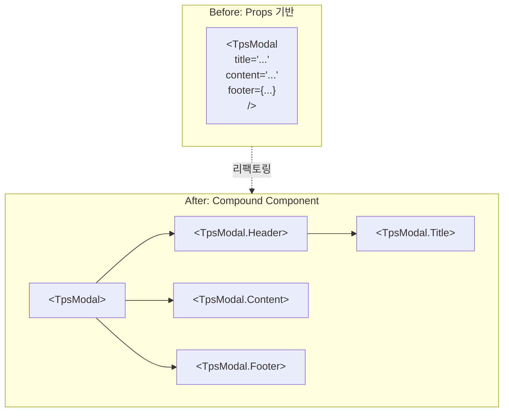

**shadcn/ui 방식**:
```tsx
<Dialog>
  <DialogTrigger>Open</DialogTrigger>
  <DialogContent>
    <DialogHeader>
      <DialogTitle>Title</DialogTitle>
    </DialogHeader>
  </DialogContent>
</Dialog>
```

**TPS 적용 예시**:

기존의 props 기반 API를 유지하면서 새로운 Compound Component API를 추가로 제공할 수 있습니다.

```tsx
// TPS 모달 컴포넌트 리팩토링
// Before: 단일 컴포넌트에 모든 props
<TpsModal
  title="제목"
  content="내용"
  footer={<Button>확인</Button>}
/>

// After: Compound Component 패턴
<TpsModal>
  <TpsModal.Header>
    <TpsModal.Title>제목</TpsModal.Title>
  </TpsModal.Header>
  <TpsModal.Content>
    내용
  </TpsModal.Content>
  <TpsModal.Footer>
    <Button>확인</Button>
  </TpsModal.Footer>
</TpsModal>
```

**구현 방법**:

Context를 사용하여 부모-자식 간 상태를 공유합니다. 이 패턴의 핵심은 **Root 컴포넌트가 상태를 소유**하고, **자식 컴포넌트들이 Context를 통해 접근**하는 것입니다.

```tsx
// Context로 상태 공유
const ModalContext = React.createContext<ModalContextType | null>(null)

function Modal({ children }: { children: React.ReactNode }) {
  const [open, setOpen] = useState(false)
  return (
    <ModalContext.Provider value={{ open, setOpen }}>
      {children}
    </ModalContext.Provider>
  )
}

Modal.Header = function ModalHeader({ children }) { ... }
Modal.Title = function ModalTitle({ children }) { ... }
Modal.Content = function ModalContent({ children }) { ... }
Modal.Footer = function ModalFooter({ children }) { ... }

export { Modal }
```

**적용 난이도**: ⭐⭐⭐ (보통)
**주의**: 기존 API와의 호환성 고려 필요

---

### 1.4 forwardRef 패턴

**forwardRef**는 컴포넌트가 받은 ref를 내부 DOM 요소로 전달하는 패턴입니다. 이를 통해 **외부에서 컴포넌트 내부 요소에 직접 접근**할 수 있어, 폼 라이브러리 통합이나 애니메이션 처리에 필수적입니다.

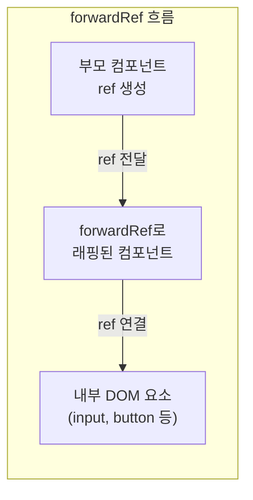

**TPS 적용 체크리스트**:

모든 UI 컴포넌트에서 ref 전달이 가능하도록 해야 합니다. 특히 **폼 요소**와 **버튼**은 반드시 forwardRef를 적용해야 합니다.

```tsx
// 모든 UI 컴포넌트에서 ref 전달 가능하도록
const Input = React.forwardRef<HTMLInputElement, InputProps>(
  ({ className, ...props }, ref) => {
    return (
      <input
        ref={ref}
        className={cn("tps-input", className)}
        {...props}
      />
    )
  }
)
Input.displayName = "Input"
```

**확인 필요 항목**:
- [ ] Button
- [ ] Input
- [ ] Select
- [ ] Textarea
- [ ] 기타 form 요소들

**적용 난이도**: ⭐⭐ (쉬움)

---

### 1.5 asChild 패턴

**asChild 패턴**은 컴포넌트의 스타일을 유지하면서 **렌더링되는 요소를 변경**할 수 있게 해줍니다. Radix UI의 `Slot` 컴포넌트를 사용하여 자식 요소에 props를 병합합니다.

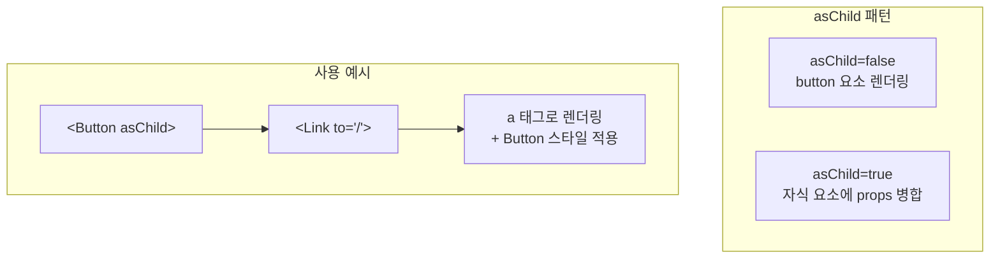

**Radix Slot 활용**:
```tsx
import { Slot } from "@radix-ui/react-slot"

interface ButtonProps extends React.ButtonHTMLAttributes<HTMLButtonElement> {
  asChild?: boolean
}

const Button = React.forwardRef<HTMLButtonElement, ButtonProps>(
  ({ asChild = false, ...props }, ref) => {
    const Comp = asChild ? Slot : "button"
    return <Comp ref={ref} {...props} />
  }
)
```

**TPS 활용 예시**:

버튼 스타일을 가진 링크, 또는 링크 스타일을 가진 버튼을 만들 때 유용합니다.

```tsx
// Link와 Button 조합
<Button asChild>
  <Link to="/dashboard">대시보드로 이동</Link>
</Button>
```

**적용 난이도**: ⭐⭐ (쉬움)
**의존성**: @radix-ui/react-slot

---

## 2. 패턴별 적용 우선순위

적용 우선순위는 **노력 대비 효과**를 기준으로 결정합니다. 즉시 적용 가능한 패턴부터 시작하여 점진적으로 확대합니다.

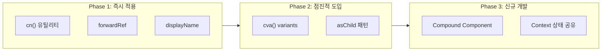

### 즉시 적용 가능 (Phase 1)

| 패턴 | 영향 범위 | 특징 |
|------|----------|------|
| cn() 유틸리티 | 전체 | 기존 코드 수정 없이 추가 가능 |
| forwardRef | 개별 컴포넌트 | 기존 컴포넌트를 래핑만 하면 됨 |
| displayName | 개별 컴포넌트 | DevTools 디버깅 개선 |

### 점진적 도입 (Phase 2)

| 패턴 | 영향 범위 | 특징 |
|------|----------|------|
| cva() variants | 주요 컴포넌트 | 기존 variant 로직 교체 |
| asChild | 필요한 컴포넌트 | 새 의존성 추가 필요 |

### 신규 컴포넌트 개발 시 적용 (Phase 3)

| 패턴 | 영향 범위 | 특징 |
|------|----------|------|
| Compound Component | 복잡한 컴포넌트 | 설계 단계부터 고려 필요 |
| Context 기반 상태 공유 | 관련 컴포넌트 그룹 | API 설계 변경 |

---

## 3. TPS 기존 컴포넌트와 비교

### 3.1 Button 컴포넌트

shadcn/ui 패턴을 적용하면 **타입 안전성**, **커스터마이징 용이성**, **다른 요소와의 조합**이 개선됩니다.

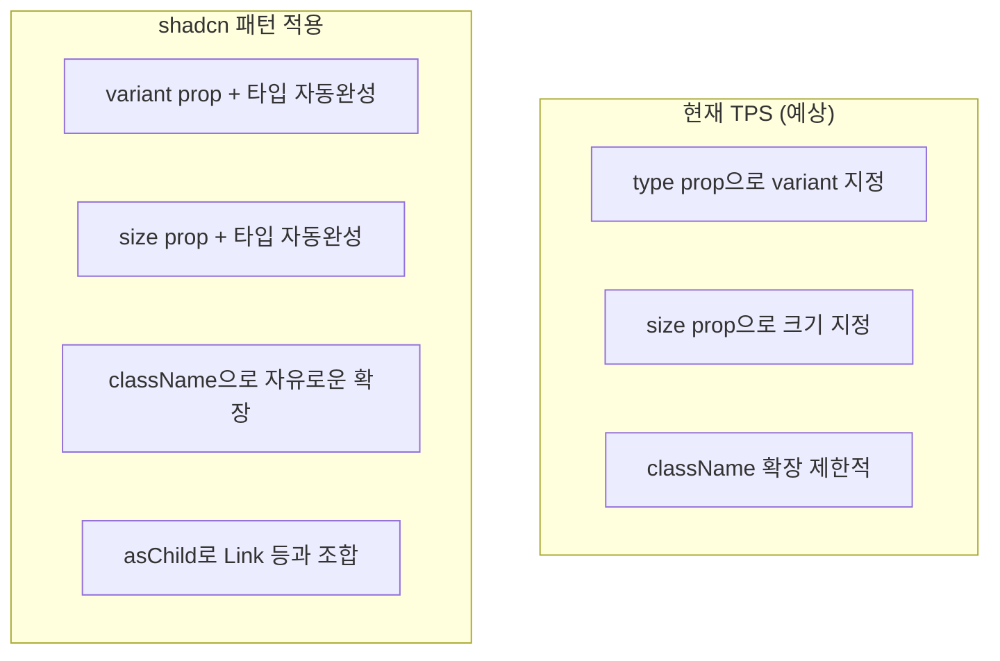

**현재 TPS 방식** (예상):
```tsx
// Props로 모든 것을 제어
<Button
  type="primary"
  size="large"
  disabled={false}
  onClick={handleClick}
>
  클릭
</Button>
```

**shadcn/ui 패턴 적용 시**:
```tsx
// TypeScript 자동완성 지원
<Button variant="primary" size="lg">
  클릭
</Button>

// 커스텀 클래스 쉽게 추가
<Button variant="primary" className="w-full">
  전체 너비
</Button>

// Link로 변환
<Button asChild variant="primary">
  <Link to="/page">이동</Link>
</Button>
```

### 3.2 Form 컴포넌트

React Hook Form과 통합하면 **유효성 검사**, **에러 처리**, **상태 관리**가 대폭 간소화됩니다.

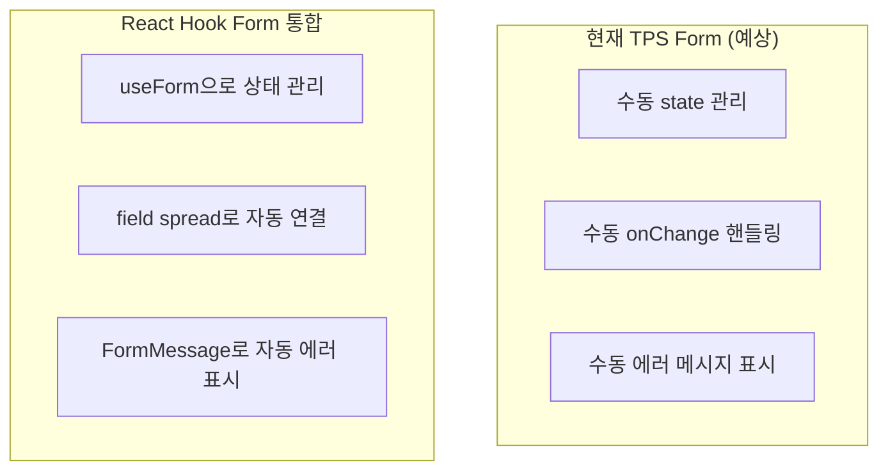

**현재 TPS 방식** (예상):
```tsx
<Form onSubmit={handleSubmit}>
  <FormItem label="이름" required>
    <Input name="name" value={name} onChange={handleChange} />
    {errors.name && <ErrorMessage>{errors.name}</ErrorMessage>}
  </FormItem>
</Form>
```

**shadcn/ui 패턴 참고 시**:
```tsx
// React Hook Form 통합 고려
<Form {...form}>
  <FormField
    control={form.control}
    name="name"
    render={({ field }) => (
      <FormItem>
        <FormLabel>이름</FormLabel>
        <FormControl>
          <Input {...field} />
        </FormControl>
        <FormMessage />  {/* 자동 에러 메시지 */}
      </FormItem>
    )}
  />
</Form>
```

### 3.3 Modal/Dialog 컴포넌트

Compound Component 패턴을 적용하면 **구조가 명확**해지고 **커스터마이징이 용이**해집니다.

**현재 TPS 방식** (예상):
```tsx
<Modal
  visible={isOpen}
  title="확인"
  onClose={handleClose}
  footer={
    <>
      <Button onClick={handleClose}>취소</Button>
      <Button type="primary" onClick={handleConfirm}>확인</Button>
    </>
  }
>
  정말 삭제하시겠습니까?
</Modal>
```

**shadcn/ui Compound 패턴**:
```tsx
<Dialog open={isOpen} onOpenChange={setIsOpen}>
  <DialogContent>
    <DialogHeader>
      <DialogTitle>확인</DialogTitle>
      <DialogDescription>
        정말 삭제하시겠습니까?
      </DialogDescription>
    </DialogHeader>
    <DialogFooter>
      <Button variant="outline" onClick={handleClose}>취소</Button>
      <Button onClick={handleConfirm}>확인</Button>
    </DialogFooter>
  </DialogContent>
</Dialog>
```

---

## 4. 도입 시 고려사항

### 4.1 호환성 유지

기존 API를 갑자기 변경하면 **기존 코드가 모두 깨질 수 있습니다**. 새 API를 추가하면서 기존 API는 deprecated 처리하여 점진적으로 마이그레이션합니다.

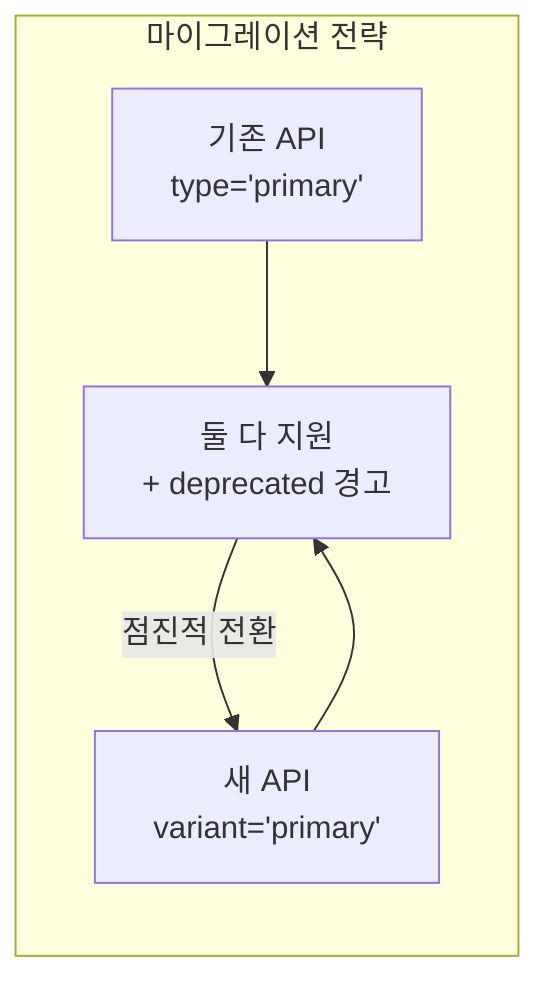

```tsx
// 기존 API 유지하면서 새 패턴 지원
interface ButtonProps extends React.ButtonHTMLAttributes<HTMLButtonElement> {
  // 기존 TPS props (deprecated 처리)
  /** @deprecated variant를 사용하세요 */
  type?: "primary" | "secondary" | "danger"

  // 새로운 shadcn 스타일 props
  variant?: "primary" | "secondary" | "destructive"
  size?: "sm" | "md" | "lg"
}

function Button({ type, variant, ...props }: ButtonProps) {
  // 하위 호환성 유지
  const finalVariant = variant || type || "primary"
  // ...
}
```

### 4.2 점진적 마이그레이션

**Big Bang 방식의 전면 교체는 위험합니다.** 새 유틸리티 추가 → 새 컴포넌트 적용 → 기존 컴포넌트 교체 순서로 진행합니다.

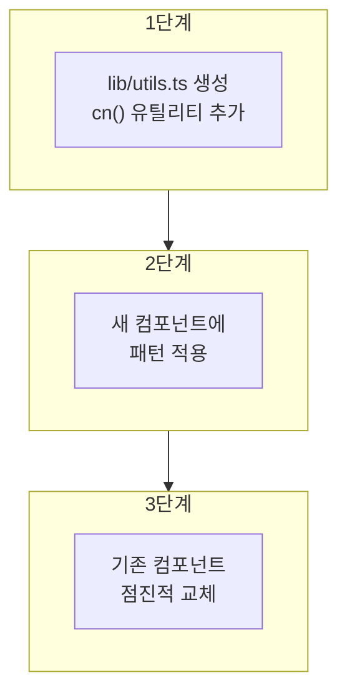

```tsx
// 1단계: 새 유틸리티 추가
// lib/utils.ts 생성

// 2단계: 새 컴포넌트에 패턴 적용
// components/ui/new-button.tsx

// 3단계: 기존 컴포넌트 점진적 교체
// - 신규 기능 개발 시 새 컴포넌트 사용
// - 리팩토링 작업 시 기존 컴포넌트 마이그레이션
```

### 4.3 테스트 전략

**기존 테스트를 유지**하면서 새 패턴에 대한 테스트를 추가합니다. 특히 **하위 호환성 테스트**가 중요합니다.

```tsx
// 기존 테스트 유지하면서 새 패턴 테스트 추가
describe("Button", () => {
  // 기존 테스트
  it("should render with type prop (legacy)", () => {
    render(<Button type="primary">Click</Button>)
    // ...
  })

  // 새 패턴 테스트
  it("should render with variant prop", () => {
    render(<Button variant="primary">Click</Button>)
    // ...
  })

  it("should forward ref", () => {
    const ref = React.createRef<HTMLButtonElement>()
    render(<Button ref={ref}>Click</Button>)
    expect(ref.current).toBeInstanceOf(HTMLButtonElement)
  })
})
```

---

## 5. 권장 액션 아이템

실제 적용을 위한 구체적인 액션 아이템입니다.

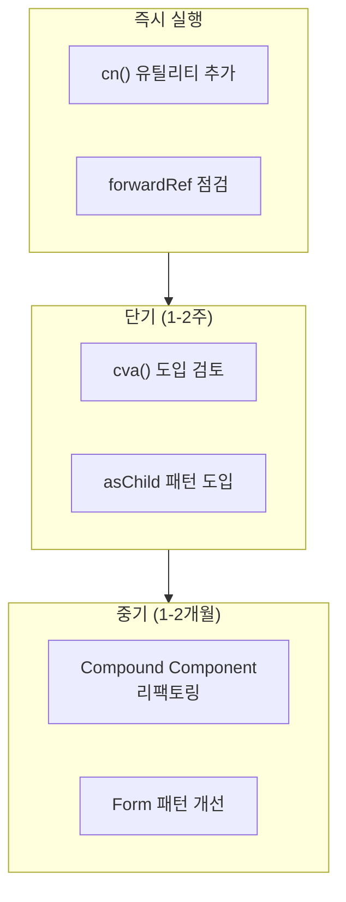

### 즉시 실행

1. **cn() 유틸리티 추가**
   - `src/lib/utils.ts` 파일 생성
   - clsx 패키지 설치 (`npm install clsx`)
   - Tailwind 사용 시 tailwind-merge도 설치

2. **forwardRef 점검**
   - 주요 UI 컴포넌트 ref 전달 확인
   - 필요시 forwardRef로 래핑
   - displayName 추가

### 단기 (1-2주)

3. **cva() 도입 검토**
   - Button, Badge 등 variant가 많은 컴포넌트에 적용
   - class-variance-authority 패키지 설치
   - 타입 안전성 향상 확인

4. **asChild 패턴 도입**
   - Link와 Button 조합이 필요한 곳 식별
   - @radix-ui/react-slot 설치
   - 필요한 컴포넌트에 적용

### 중기 (1-2개월)

5. **Compound Component 리팩토링**
   - Modal, Dropdown 등 복잡한 컴포넌트 대상
   - 새 API 설계 및 문서화
   - 기존 API와의 호환성 유지

6. **Form 패턴 개선**
   - React Hook Form 통합 검토
   - FormField, FormItem 패턴 적용
   - 유효성 검사 로직 통합

---

## 6. 참고: 개인 프로젝트 적용

개인 프로젝트에서는 **shadcn/ui를 직접 사용**할 수 있습니다. 이미 완성된 컴포넌트와 디자인 시스템을 바로 활용할 수 있어 빠른 개발이 가능합니다.

```bash
# 프로젝트 초기화
npm create vite@latest my-project -- --template react-ts
cd my-project

# Tailwind CSS 설치
npm install tailwindcss @tailwindcss/vite

# shadcn 초기화
npx shadcn@latest init

# 필요한 컴포넌트 추가
npx shadcn@latest add button input form dialog
```

**장점**:
- 완성된 컴포넌트를 바로 사용할 수 있습니다.
- 일관된 디자인 시스템이 적용되어 있습니다.
- 접근성(a11y)이 기본으로 내장되어 있습니다.
- 소스 코드를 직접 소유하여 자유롭게 커스터마이징할 수 있습니다.

---

## 요약

TPS 프로젝트와 개인 프로젝트의 적용 방식을 비교합니다.

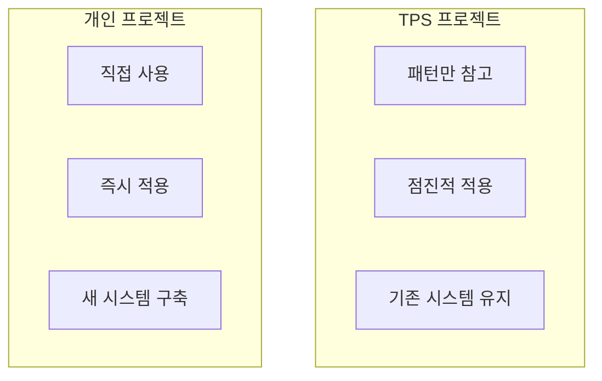

| 구분 | TPS 프로젝트 | 개인 프로젝트 |
|------|-------------|--------------|
| shadcn/ui 도입 | ❌ 패턴만 참고 | ✅ 직접 사용 |
| cn() 유틸리티 | ✅ 즉시 적용 | ✅ 자동 포함 |
| cva() variants | ✅ 점진적 적용 | ✅ 자동 포함 |
| Compound Component | ✅ 신규 개발 시 | ✅ 기본 패턴 |
| forwardRef | ✅ 점검 필요 | ✅ 기본 적용 |
| React Hook Form | 🔄 검토 필요 | ✅ 권장 |
| Radix UI | 🔄 선택적 | ✅ 기본 사용 |

---

## 다음 단계

1. **TPS 컴포넌트 현황 분석**: 현재 사용 중인 컴포넌트 목록 및 패턴 파악
2. **우선순위 결정**: 개선이 가장 필요한 컴포넌트 식별
3. **POC 진행**: 한두 개 컴포넌트에 패턴 적용 후 팀 피드백 수집
4. **가이드라인 수립**: 적용 패턴에 대한 팀 가이드라인 문서화
