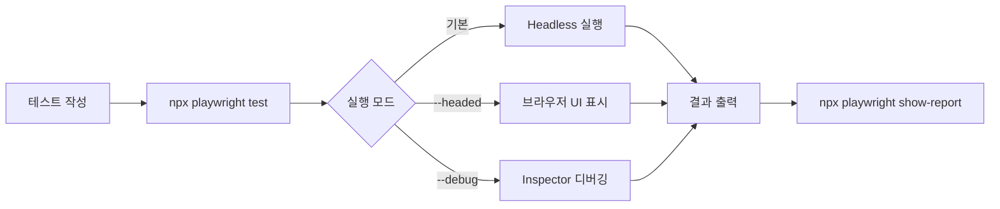
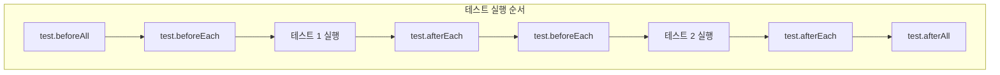
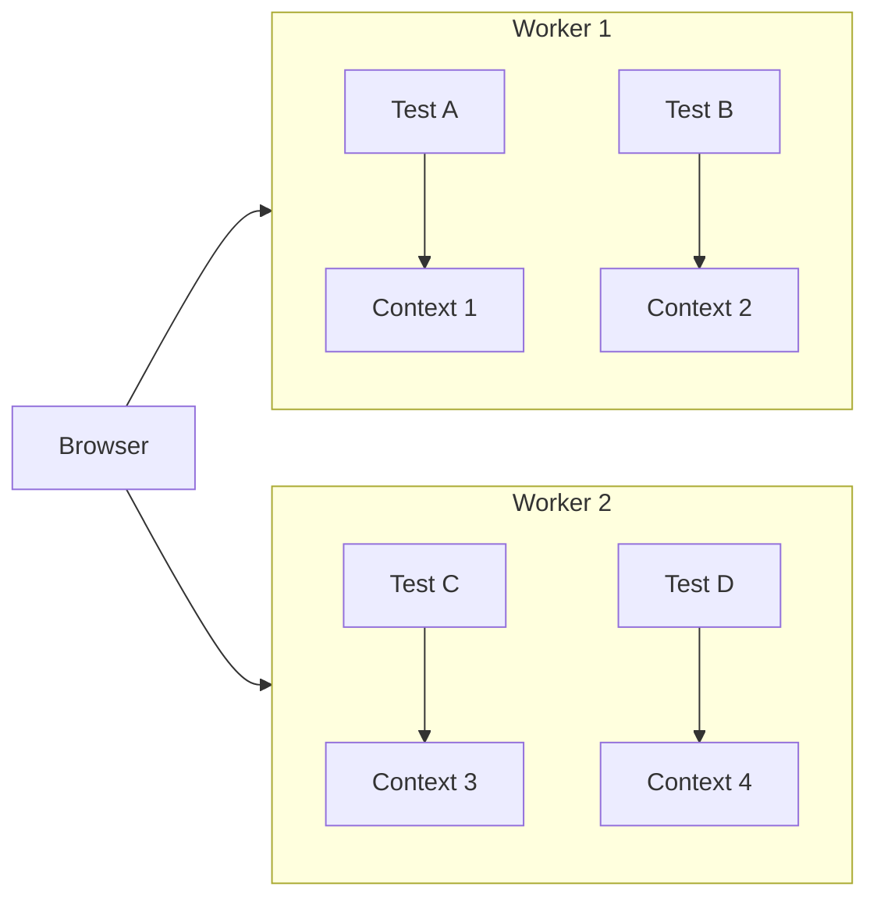

---

## 📌 핵심 요약
> 이 장에서는 Playwright 테스트 환경 설정과 기본 구성요소를 다룬다. 핵심은 **Playwright Test와 Playwright Library의 차이를 이해**하고, 첫 번째 테스트를 작성하며, 효율적인 개발 환경을 구축하는 것이다.

## 🎯 학습 목표
이 내용을 읽고 나면:
- [ ] Playwright Test와 Playwright Library의 차이를 설명할 수 있다
- [ ] Playwright 프로젝트를 처음부터 설정할 수 있다
- [ ] 첫 번째 E2E 테스트를 작성하고 실행할 수 있다
- [ ] playwright.config.ts의 주요 설정 옵션을 이해하고 구성할 수 있다
- [ ] 내장 Hook과 Fixture의 용도를 설명할 수 있다

## 📖 본문 정리

### 1. Playwright Test vs Playwright Library

두 가지 방식의 핵심 차이를 이해하는 것이 첫 번째 단계다.

| 구분 | Playwright Library | Playwright Test |
|------|-------------------|-----------------|
| **설치 명령어** | `npm install playwright` | `npm install --save-dev @playwright/test` |
| **용도** | 브라우저 자동화 API만 제공 | 테스트 프레임워크 통합 솔루션 |
| **테스트 러너** | Jest, Mocha 등 별도 필요 | 내장 테스트 러너 포함 |
| **리포트** | 직접 구현 필요 | HTML, JSON 등 내장 리포터 |
| **병렬 실행** | 직접 구현 필요 | 기본 지원 |

> 💬 **비유**: Playwright Library는 '자동차 엔진'만 제공하고, Playwright Test는 '완성된 자동차'를 제공한다고 생각하면 된다.

**선택 기준:**
- ✅ **Playwright Test**: 빠르게 E2E 테스트를 시작하고 싶을 때 (권장)
- ✅ **Playwright Library**: 기존 Jest/Mocha 환경에 통합하거나, 테스트 외 브라우저 자동화가 필요할 때

---

### 2. 설치 방법

#### Node.js 확인
```bash
node -v  # Node.js 버전 확인
npm -v   # npm 버전 확인
```
> LTS 버전 권장. 다중 버전 관리 시 `nvm` 사용 추천

#### 프로젝트 초기화
```bash
mkdir playwright-quick-setup
cd playwright-quick-setup
npm init -y
```

#### Playwright 설치 옵션 비교

| 방법 | 명령어 | 결과 |
|------|--------|------|
| **수동 설치** | `npm install --save-dev @playwright/test` | 패키지만 설치, 설정 직접 구성 필요 |
| **자동 초기화** (권장) | `npm init playwright@latest` | 설정 파일 + 예제 테스트 + 브라우저 자동 설치 |

```bash
# 권장: 가이드 방식 초기화
npm init playwright@latest
```

자동 초기화 시 생성되는 파일:
- `playwright.config.ts` - 설정 파일
- `tests/example.spec.ts` - 예제 테스트
- 브라우저 바이너리 (선택 시)

---

### 3. 첫 번째 테스트 작성 및 실행

#### 테스트 파일 생성 (`tests/example.spec.ts`)
```typescript
// Playwright Test에서 test, expect 함수를 가져온다
const { test, expect } = require('@playwright/test');

// 테스트 케이스 정의
test('homepage has Playwright in title', async ({ page }) => {
  // 1. Playwright 홈페이지로 이동
  await page.goto('https://playwright.dev');
  
  // 2. 페이지 타이틀 가져오기
  const title = await page.title();
  
  // 3. 타이틀에 'Playwright' 포함 여부 검증
  expect(title).toContain('Playwright');
});
```

#### 테스트 실행 명령어

| 명령어 | 설명 |
|--------|------|
| `npx playwright test` | 기본 실행 (Headless 모드) |
| `npx playwright test --headed` | 브라우저 UI 표시하며 실행 |
| `npx playwright test --debug` | 디버그 모드 (Inspector 열림) |
| `npx playwright test --project=chromium` | 특정 브라우저만 실행 |
| `npx playwright show-report` | HTML 리포트 확인 |



---

### 4. 테스트 환경 설정

#### 권장 프로젝트 구조
```
my-playwright-project/
├── tests/                    # 테스트 파일
│   ├── example.spec.ts
│   ├── logged-in/           # 로그인 필요 테스트
│   │   ├── api.spec.ts
│   │   └── login.setup.ts
│   └── logged-out/          # 비로그인 테스트
│       └── auth.spec.ts
│
├── src/
│   ├── pages/               # Page Object Model
│   │   ├── BasePage.ts
│   │   └── DashboardPage.ts
│   └── utils/               # 유틸리티 함수
│       └── apiHelper.ts
│
├── fixtures/                # 테스트 데이터
│   └── testData.json
│
├── auth/                    # 인증 정보
│   └── credentials.json
│
├── test-results/            # 실행 결과
├── playwright-report/       # HTML 리포트
├── playwright.config.ts     # 설정 파일
└── package.json
```

#### VS Code 확장 프로그램
- **Playwright Test for VSCode** (Microsoft) - 필수
- ESLint, Prettier - 권장

---

### 5. playwright.config.ts 주요 설정

#### 기본 설정 예시
```typescript
import { defineConfig } from '@playwright/test';

export default defineConfig({
  testDir: './tests',           // 테스트 디렉토리
  timeout: 30000,               // 테스트 타임아웃 (30초)
  
  use: {
    browserName: 'chromium',    // 기본 브라우저
    headless: true,             // Headless 모드
    viewport: { width: 1280, height: 720 },
  },
});
```

#### 주요 설정 옵션 정리

| 카테고리 | 옵션 | 설명 | 예시 |
|----------|------|------|------|
| **파일 매칭** | `testDir` | 테스트 디렉토리 | `'./tests'` |
| | `testMatch` | 테스트 파일 패턴 | `'*.spec.ts'` |
| | `testIgnore` | 제외 패턴 | `'*.unit.ts'` |
| **타임아웃** | `timeout` | 테스트 타임아웃 | `30000` (30초) |
| | `globalTimeout` | 전체 스위트 타임아웃 | `1800000` (30분) |
| | `actionTimeout` | 개별 액션 타임아웃 | `10000` (10초) |
| **브라우저** | `browserName` | 브라우저 종류 | `'chromium'`, `'firefox'`, `'webkit'` |
| | `headless` | Headless 모드 | `true` / `false` |
| | `viewport` | 뷰포트 크기 | `{ width: 1920, height: 1080 }` |
| | `device` | 디바이스 에뮬레이션 | `'iPhone 16'` |
| **병렬화** | `workers` | 워커 수 | `4` 또는 `'50%'` |
| | `fullyParallel` | 파일 내 병렬 실행 | `true` |
| **재시도** | `retries` | 실패 시 재시도 횟수 | `2` |
| | `maxFailures` | 최대 실패 허용 수 | `10` |

#### 멀티 브라우저 설정 (Projects)
```typescript
export default defineConfig({
  projects: [
    { name: 'Chromium', use: { browserName: 'chromium' } },
    { name: 'Firefox', use: { browserName: 'firefox' } },
    { name: 'Mobile Safari', use: { device: 'iPhone 16' } },
  ],
});
```

---

### 6. Test Runner 기초: Hook과 Fixture

#### Hooks (생명주기 함수)



| Hook | 실행 시점 | 용도 |
|------|----------|------|
| `test.beforeAll` | 파일 내 모든 테스트 전 1회 | DB 연결, 비용 큰 초기화 |
| `test.beforeEach` | 각 테스트 전 | 페이지 이동, 상태 초기화 |
| `test.afterEach` | 각 테스트 후 | 리소스 정리, 로그 기록 |
| `test.afterAll` | 파일 내 모든 테스트 후 1회 | 최종 정리 |

**실전 예시: 로그인 후 테스트**
```typescript
import { test, expect } from '@playwright/test';

// 각 테스트 전에 로그인 수행
test.beforeEach(async ({ page }) => {
  await page.goto('https://www.saucedemo.com/');
  await page.getByPlaceholder('Username').fill('standard_user');
  await page.getByPlaceholder('Password').fill('secret_sauce');
  await page.getByRole('button', { name: 'Login' }).click();
  await expect(page).toHaveURL(/inventory.html/);
});

test('Check inventory page title', async ({ page }) => {
  await expect(page).toHaveTitle('Swag Labs');
});

test('Check shopping cart link is visible', async ({ page }) => {
  const cartLink = page.locator('.shopping_cart_link');
  await expect(cartLink).toBeVisible();
});
```

#### Fixtures (테스트 리소스)

Playwright 내장 Fixture:

| Fixture | 타입 | 용도 |
|---------|------|------|
| `page` | Page | 브라우저 탭 (테스트별 격리) |
| `context` | BrowserContext | 브라우저 세션 (쿠키, 로컬스토리지 격리) |
| `browser` | Browser | 브라우저 인스턴스 (워커 간 공유) |
| `browserName` | string | 현재 브라우저 이름 (`'chromium'` 등) |
| `request` | APIRequestContext | API 요청 (HTTP 테스트용) |

**API 테스트 예시 (request fixture)**
```typescript
import { test, expect } from '@playwright/test';

test('check API response', async ({ request }) => {
  const response = await request.get('https://api.github.com');
  expect(response.status()).toBe(200);
});
```

> 💡 커스텀 Fixture가 필요하면 `test.extend()`로 확장 가능 (공식 문서 참조)

---

### 7. 테스트 격리(Test Isolation)와 병렬 실행



- **테스트 격리**: 각 테스트는 독립된 BrowserContext를 가짐 → 쿠키, 세션, 로컬스토리지가 공유되지 않음
- **병렬 실행**: 기본적으로 CPU 코어 수만큼 워커 생성 → 대규모 테스트 시 실행 시간 단축

```typescript
// 병렬 실행 설정
export default defineConfig({
  workers: 4,           // 4개 워커로 병렬 실행
  fullyParallel: true,  // 파일 내 테스트도 병렬 실행
});
```

---

## 🔍 심화 학습

### 추가 조사 내용
- **Playwright vs Cypress vs Selenium**: Playwright는 크로스 브라우저 지원과 자동 대기(Auto-waiting) 메커니즘이 강점. Cypress는 개발자 경험이 좋지만 크로스 브라우저 지원이 제한적.
- **2024년 이후 동향**: Playwright는 Component Testing, API Testing 지원을 강화하며 "올인원" 테스트 도구로 발전 중

### 출처
- [Playwright 공식 문서](https://playwright.dev/docs/intro)
- [Playwright GitHub](https://github.com/microsoft/playwright)

---

## 💡 실무 적용 포인트

### 이런 상황에서 사용하세요
- **신규 프로젝트**: `npm init playwright@latest`로 빠른 시작
- **기존 Jest 환경**: `npm install playwright`로 Library만 추가
- **CI/CD 통합**: Headless 모드 + HTML 리포터로 자동화

### 주의할 점 / 흔한 실수
- ⚠️ `npm install @playwright/test`만 하면 브라우저 바이너리가 설치되지 않음 → `npx playwright install` 별도 실행 필요
- ⚠️ `timeout` 설정이 너무 짧으면 느린 네트워크에서 flaky 테스트 발생
- ⚠️ `headless: false`는 디버깅용. CI에서는 반드시 `true`로

### 면접에서 나올 수 있는 질문
- Q: Playwright Test와 Playwright Library의 차이는?
- Q: 테스트 격리(Test Isolation)가 왜 중요한가?
- Q: `beforeEach`와 `beforeAll`의 차이는?
- Q: Fixture란 무엇이고, 어떤 내장 Fixture가 있는가?

---

## ✅ 핵심 개념 체크리스트
- [ ] Playwright Test vs Library 차이를 한 문장으로 설명할 수 있는가?
- [ ] `npm init playwright@latest`로 프로젝트를 초기화할 수 있는가?
- [ ] 기본 테스트를 작성하고 `npx playwright test`로 실행할 수 있는가?
- [ ] `playwright.config.ts`의 주요 옵션(timeout, workers, retries)을 설정할 수 있는가?
- [ ] Hook(beforeEach, afterEach)과 Fixture(page, context)의 용도를 알고 있는가?

---

## 🔗 참고 자료
- 📄 공식 문서: [Playwright - Getting Started](https://playwright.dev/docs/intro)
- 📄 설정 옵션: [Playwright Configuration](https://playwright.dev/docs/test-configuration)
- 📄 Fixture 확장: [Playwright Fixtures](https://playwright.dev/docs/test-fixtures)
- 🎬 추천 영상: [Playwright Official YouTube Channel](https://www.youtube.com/c/playwright)

---
