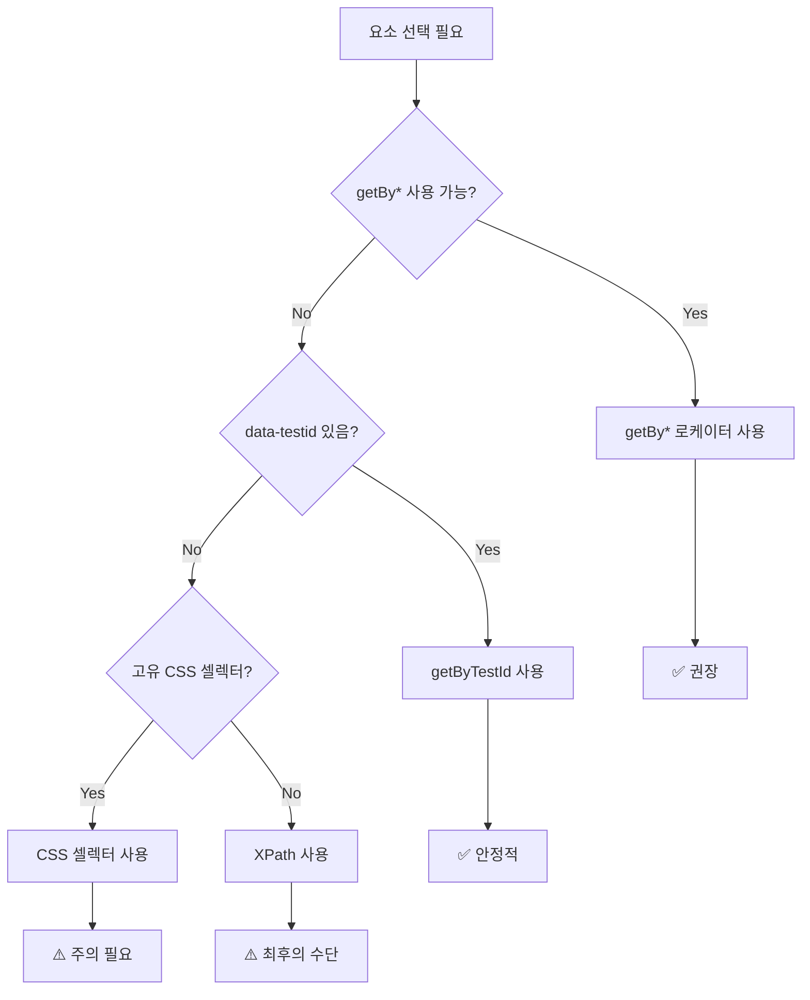
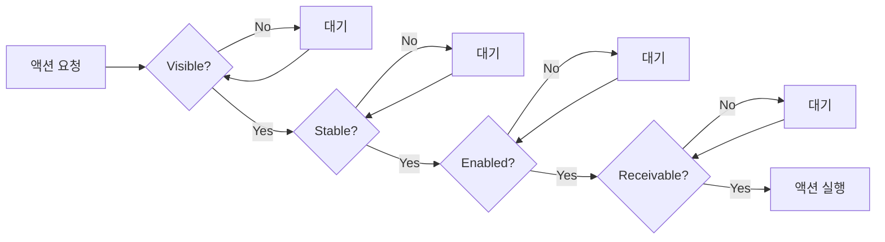
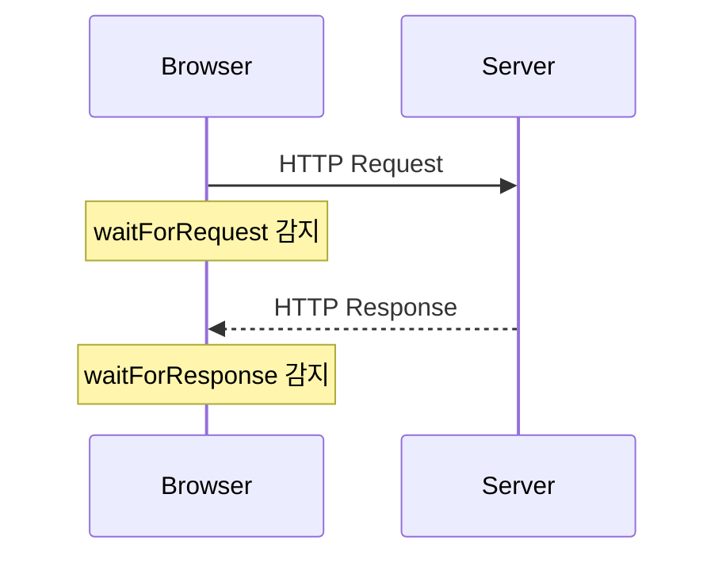
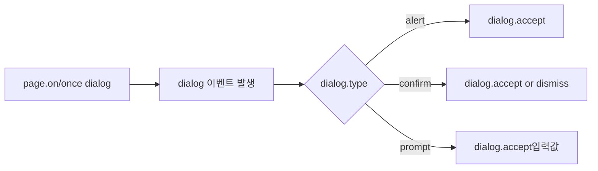
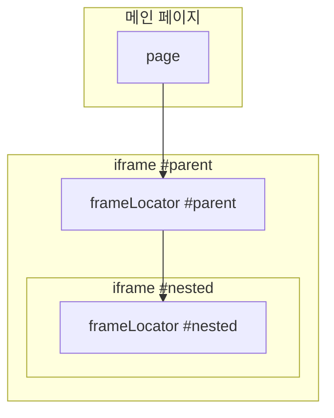

---

## 📌 핵심 요약
> 이 장에서는 동적 웹 애플리케이션 테스트를 위한 고급 셀렉터와 대기 전략을 다룬다. 핵심은 **getBy\* 로케이터를 우선 사용**하고, 동적 콘텐츠에는 **Auto-wait와 Custom wait**를 활용하며, **다이얼로그, iframe, Shadow DOM**을 올바르게 처리하는 것이다.

## 🎯 학습 목표
이 내용을 읽고 나면:
- [ ] getBy* 로케이터와 CSS/XPath 셀렉터의 차이를 설명할 수 있다
- [ ] 상황에 맞는 적절한 셀렉터를 선택할 수 있다
- [ ] Playwright의 Auto-wait 메커니즘을 이해하고 Custom wait를 작성할 수 있다
- [ ] 브라우저 다이얼로그(alert, confirm, prompt)를 핸들링할 수 있다
- [ ] iframe 내부 요소와 Shadow DOM 컴포넌트에 접근할 수 있다

## 📖 본문 정리

### 1. getBy* 로케이터 우선 사용하기

Playwright의 `getBy*` 로케이터는 **접근성(Accessibility)** 기반으로 설계되어 있다. CSS/XPath보다 안정적이고, 실제 사용자가 요소와 상호작용하는 방식을 반영한다.

#### getBy* vs CSS/XPath 비교

| 특성 | getBy* 로케이터 | CSS/XPath |
|------|----------------|-----------|
| **안정성** | 높음 (의미 기반) | 낮음 (구조 기반) |
| **접근성** | ARIA 속성 활용 | 무관 |
| **유지보수** | 쉬움 | 어려움 (구조 변경에 취약) |
| **가독성** | 높음 | 복잡해지면 낮음 |

> 💬 **비유**: getBy* 로케이터는 "제출 버튼을 찾아줘"라고 말하는 것이고, CSS/XPath는 "3번째 div 안의 2번째 button을 찾아줘"라고 말하는 것이다.

#### getBy* 로케이터 종류

| 로케이터 | 용도 | 예시 |
|----------|------|------|
| `getByRole` | ARIA 역할로 찾기 | `getByRole('button', { name: 'Submit' })` |
| `getByLabel` | `<label>` 연결 요소 | `getByLabel('Email')` |
| `getByPlaceholder` | placeholder 텍스트 | `getByPlaceholder('Enter email')` |
| `getByText` | 보이는 텍스트 | `getByText('Welcome')` |
| `getByAltText` | 이미지 alt 속성 | `getByAltText('Logo')` |
| `getByTitle` | title 속성 | `getByTitle('Close')` |
| `getByTestId` | data-testid 속성 | `getByTestId('submit-btn')` |

#### 실전 예시: 로그인 테스트
```typescript
import { test, expect } from '@playwright/test';

test.beforeEach(async ({ page }) => {
  await page.goto('https://www.saucedemo.com/');
  
  // getBy* 로케이터 사용 - 접근성 기반
  await page.getByPlaceholder('Username').fill('standard_user');
  await page.getByPlaceholder('Password').fill('secret_sauce');
  await page.getByRole('button', { name: 'Login' }).click();
  
  await expect(page).toHaveURL(/inventory.html/);
});
```

#### ARIA란?
> **ARIA**(Accessible Rich Internet Applications)는 웹 콘텐츠를 스크린 리더 등 보조 기술이 이해할 수 있도록 추가 정보를 제공하는 표준이다. `role`, `aria-label`, `aria-hidden` 등의 속성으로 요소의 역할과 상태를 명시한다.

---

### 2. 폴백 셀렉터: CSS, XPath, Text, TestId

getBy* 로케이터가 불가능한 경우(레거시 코드, 서드파티 컴포넌트, 접근성 속성 없음) 폴백 셀렉터를 사용한다.



#### CSS 셀렉터
```typescript
// 기본 사용
await page.locator('button').click();

// ID, 클래스, 속성 조합
await page.locator('#login-form').fill('user@example.com');
await page.locator('input[type="password"]').fill('secret');
```

⚠️ **주의**: `#tsf > div:nth-child(2) > button` 같은 깊은 중첩 셀렉터는 피할 것

#### XPath 셀렉터
```typescript
// // 또는 ..로 시작하면 자동으로 XPath로 인식
await page.locator('//button[@type="submit"]').click();

// 텍스트 기반 선택
await page.locator('//div[contains(text(), "Welcome")]').click();

// 명시적 XPath 접두사
await page.locator('xpath=//button[@type="submit"]').click();
```

⚠️ **주의**: XPath는 CSS보다 느리고, 구조 변경에 취약함

#### 텍스트 기반 셀렉터
```typescript
// 기본 (부분 문자열 + 공백 정규화)
await page.getByText('Welcome, John').click();

// 정확한 매칭
await page.getByText('Welcome, John', { exact: true }).click();

// 정규표현식 사용
await page.getByText(/welcome, [A-Za-z]+$/i).click();

// 필터링과 조합
await page.getByRole('button').filter({ hasText: 'Submit' }).click();
```

#### Test ID 활용
```typescript
// HTML: <button data-testid="submit-button">Submit</button>
await page.getByTestId('submit-button').click();
```

**커스텀 테스트 ID 속성 설정:**
```typescript
// playwright.config.ts
import { defineConfig } from '@playwright/test';

export default defineConfig({
  use: {
    testIdAttribute: 'data-pw'  // 기본값: data-testid
  }
});
```

---

### 3. 동적 요소 처리: Auto-Wait와 Custom Wait

#### Playwright Auto-Wait 메커니즘

Playwright는 액션 수행 전 자동으로 요소 상태를 확인한다:



| 상태 | 설명 |
|------|------|
| **Visible** | DOM에 렌더링되고 화면에 보임 |
| **Stable** | 애니메이션/리사이징 완료 |
| **Enabled** | disabled 상태가 아님 |
| **Receivable** | 다른 요소에 가려지지 않음 |

> 💡 대부분의 경우 Auto-Wait로 충분. 명시적 대기는 필요할 때만!

#### Custom Wait 메서드 정리

| 메서드 | 용도 | 예시 |
|--------|------|------|
| `waitForRequest` | 특정 요청 발생 대기 | `await page.waitForRequest('**/api/data')` |
| `waitForResponse` | 특정 응답 대기 | `await page.waitForResponse(r => r.status() === 200)` |
| `waitForLoadState` | 페이지 로드 상태 | `await page.waitForLoadState('networkidle')` |
| `waitForFunction` | JS 함수 반환값 대기 | `await page.waitForFunction('...')` |
| `waitForEvent` | 이벤트 발생 대기 | `await page.waitForEvent('popup')` |
| `waitForURL` | URL 변경 대기 | `await page.waitForURL('**/dashboard')` |
| `waitForSelector` | 셀렉터 매칭 대기 | `await page.waitForSelector('#btn')` |
| `waitForTimeout` | 고정 시간 대기 | `await page.waitForTimeout(3000)` |

⚠️ **Anti-pattern**: `waitForTimeout`은 flaky 테스트의 원인. 가능한 사용 피할 것!

#### 실전 예시: 언어 전환 테스트
```typescript
import { test, expect } from '@playwright/test';

test('Change article language to Deutsch', async ({ page }) => {
  // 1. 위키피디아 영문 페이지 방문
  await page.goto('https://en.wikipedia.org/wiki/Playwright_(software)');
  
  // 2. 언어 변경 버튼 클릭
  await page.getByRole('button', { 
    name: 'Go to an article in another' 
  }).click();
  
  // 3. 독일어 링크 클릭
  await page.getByRole('link', { name: 'Deutsch' }).click();
  
  // 4. URL 변경 대기 (Custom Wait)
  await page.waitForURL(
    'https://de.wikipedia.org/wiki/Playwright_(Software)',
    { timeout: 5000 }
  );
  
  // 5. 검증
  expect(page.url()).toContain('de.wikipedia.org');
});
```

#### waitForRequest vs waitForResponse



| 구분 | waitForRequest | waitForResponse |
|------|----------------|-----------------|
| 감지 시점 | 요청 발송 시 | 응답 수신 시 |
| 용도 | 요청이 전송되었는지 확인 | 응답 상태/내용 검증 |
| 예시 | API 호출 트리거 확인 | 200 OK 응답 확인 |

---

### 4. 다이얼로그 핸들링 (Alert, Confirm, Prompt)

브라우저 다이얼로그는 `dialog` 이벤트로 처리한다.



#### dialog 객체 메서드

| 메서드 | 설명 |
|--------|------|
| `dialog.type()` | 다이얼로그 유형 (`'alert'`, `'confirm'`, `'prompt'`) |
| `dialog.message()` | 표시된 메시지 |
| `dialog.defaultValue()` | prompt의 기본값 |
| `dialog.accept([value])` | OK 클릭 (prompt는 입력값 전달) |
| `dialog.dismiss()` | Cancel 클릭 |

#### 실전 예시: 모든 다이얼로그 처리
```typescript
import { test } from '@playwright/test';

test('handle all dialogs', async ({ page }) => {
  // 다이얼로그 핸들러 등록 (액션 전에!)
  page.on('dialog', async dialog => {
    console.log(`Type: ${dialog.type()}, Message: ${dialog.message()}`);
    
    if (dialog.type() === 'prompt') {
      await dialog.accept('some answer');  // 값 입력 후 OK
    } else if (dialog.type() === 'confirm') {
      await dialog.accept();  // OK
    } else {
      await dialog.dismiss(); // Cancel
    }
  });
  
  await page.goto('https://testpages.eviltester.com/styled/alerts/alert-test.html');
  await page.getByRole('button', { name: 'Show alert box' }).click();
  await page.getByRole('button', { name: 'Show confirm box' }).click();
});
```

> 💡 **팁**: 단일 다이얼로그는 `page.once('dialog', ...)`, 여러 개는 `page.on('dialog', ...)`

---

### 5. iframe 및 중첩 프레임 처리

iframe은 별도의 브라우저 컨텍스트를 가지므로 `frameLocator`로 접근해야 한다.



#### 단일 iframe 접근
```typescript
import { test, expect } from '@playwright/test';

test('Interact with iframe', async ({ page }) => {
  await page.goto('https://testpages.eviltester.com/styled/iframes-test.html');
  
  // 방법 1: frameLocator 사용 (권장)
  const frame = page.frameLocator('#thedynamichtml');
  await expect(frame.getByRole('heading', { name: 'iFrame' })).toBeVisible();
  
  // 방법 2: locator + contentFrame 사용
  await expect(
    page.locator('#thedynamichtml')
        .contentFrame()
        .getByRole('heading', { name: 'iFrame' })
  ).toBeVisible();
});
```

#### 중첩 iframe 접근
```typescript
test('Interact with nested iframes', async ({ page }) => {
  await page.goto('url');
  
  // 부모 iframe 선택
  const parentFrame = page.frameLocator('#parentIframe');
  
  // 중첩 iframe 선택 (체이닝)
  const nestedFrame = parentFrame.frameLocator('#nestedIframe');
  
  // 중첩 iframe 내부 요소 조작
  await nestedFrame.locator('input[name="email"]').fill('test@xyz.com');
  await nestedFrame.locator('button').click();
});
```

⚠️ **주의**: Cross-origin iframe은 브라우저 보안 정책으로 접근 제한될 수 있음

---

### 6. Shadow DOM 컴포넌트 처리

Shadow DOM은 웹 컴포넌트의 스타일/DOM을 캡슐화한다. Playwright는 **open Shadow DOM**에 자동 접근 가능.

#### Shadow DOM 구조 예시
```html
<my-widget>
  #shadow-root (open)
    <div class="internal-button">Click me!</div>
    <style>.internal-button { color: blue; }</style>
</my-widget>
```

#### 방법 1: 호스트 요소 통해 접근
```typescript
test('Shadow DOM - via host element', async ({ page }) => {
  await page.goto('webpage.html');
  
  // 호스트 요소 선택
  const widget = page.locator('my-widget');
  
  // Shadow DOM 내부 요소 접근
  const internalButton = widget.locator('.internal-button');
  await internalButton.click();
  
  console.log(await internalButton.innerText());
});
```

#### 방법 2: `>>>` 피어싱 셀렉터
```typescript
test('Shadow DOM - piercing selector', async ({ page }) => {
  await page.goto('webpage.html');
  
  // >>> 연산자로 Shadow 경계 관통
  const internalButton = page.locator('my-widget >>> .internal-button');
  await internalButton.click();
});

// 중첩된 Shadow DOM도 체이닝 가능
await page.click('parent-component >>> child-component >>> button');
```

| Shadow DOM 유형 | 접근 가능 여부 |
|-----------------|---------------|
| Open (`mode: 'open'`) | ✅ 가능 |
| Closed (`mode: 'closed'`) | ❌ 불가능 (웹 표준) |

---

## 🔍 심화 학습

### 추가 조사 내용
- **getBy* 로케이터와 Testing Library**: Playwright의 getBy* 로케이터는 [Testing Library](https://testing-library.com/)의 철학을 따름. "사용자가 보는 것으로 테스트하라"
- **Playwright의 Strict Mode**: Playwright는 기본적으로 locator가 여러 요소를 매칭하면 에러 발생. `first()`, `nth()`, `filter()`로 좁힐 수 있음
- **Web Components 테스트 전략**: Shadow DOM이 있는 컴포넌트는 `>>>` 셀렉터나 컴포넌트 내부 테스트 ID 사용 권장

### 출처
- [Playwright Locators 공식 문서](https://playwright.dev/docs/locators)
- [ARIA Authoring Practices](https://www.w3.org/WAI/ARIA/apg/)
- [Testing Library - Guiding Principles](https://testing-library.com/docs/guiding-principles)

---

## 💡 실무 적용 포인트

### 이런 상황에서 사용하세요

| 상황 | 권장 접근법 |
|------|------------|
| 일반적인 폼 요소 | `getByLabel`, `getByPlaceholder` |
| 버튼, 링크 클릭 | `getByRole('button')`, `getByRole('link')` |
| 레거시/서드파티 컴포넌트 | `getByTestId` 또는 CSS 셀렉터 |
| API 호출 후 UI 변경 | `waitForResponse` + UI 검증 |
| SPA 페이지 전환 | `waitForURL` |
| 결제 확인 팝업 | `page.on('dialog', ...)` |

### 주의할 점 / 흔한 실수
- ⚠️ `waitForTimeout(5000)` 같은 고정 대기는 flaky 테스트의 주범
- ⚠️ 다이얼로그 핸들러는 **액션 전에** 등록해야 함
- ⚠️ CSS 셀렉터에서 `nth-child` 남용은 유지보수 악몽
- ⚠️ Closed Shadow DOM은 Playwright로도 접근 불가능 (설계 변경 필요)
- ⚠️ iframe의 Cross-origin 제약 사항 항상 고려

### 면접에서 나올 수 있는 질문
- Q: getBy* 로케이터를 CSS/XPath보다 선호하는 이유는?
- Q: Playwright의 Auto-wait 메커니즘이 어떻게 동작하는가?
- Q: `waitForRequest`와 `waitForResponse`의 차이는?
- Q: Shadow DOM 내부 요소에 어떻게 접근하는가?
- Q: iframe 내부 요소를 테스트하려면 어떻게 해야 하는가?

---

## ✅ 핵심 개념 체크리스트
- [ ] getBy* 로케이터 7가지를 나열하고 용도를 설명할 수 있는가?
- [ ] CSS 셀렉터 대신 getBy*를 써야 하는 이유를 알고 있는가?
- [ ] Auto-wait가 확인하는 4가지 요소 상태를 알고 있는가?
- [ ] Custom wait 메서드 중 3개 이상을 작성할 수 있는가?
- [ ] 다이얼로그 핸들러를 등록하는 방법을 알고 있는가?
- [ ] frameLocator와 >>> 셀렉터의 사용법을 알고 있는가?

---

## 🔗 참고 자료
- 📄 공식 문서: [Playwright Locators](https://playwright.dev/docs/locators)
- 📄 공식 문서: [Auto-waiting](https://playwright.dev/docs/actionability)
- 📄 공식 문서: [Dialogs](https://playwright.dev/docs/dialogs)
- 📄 공식 문서: [Frames](https://playwright.dev/docs/frames)
- 📚 연관 서적: "Testing JavaScript Applications" by Lucas da Costa

---
