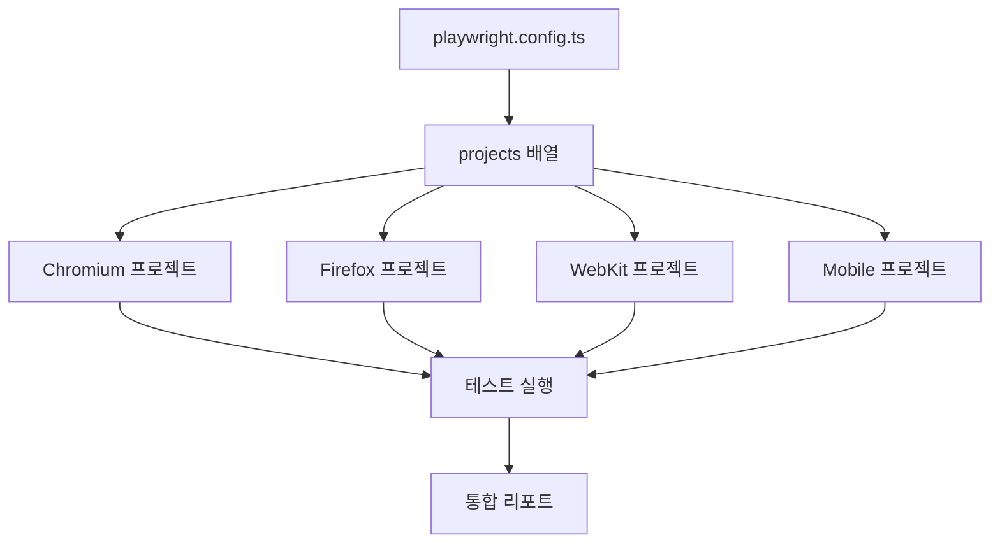
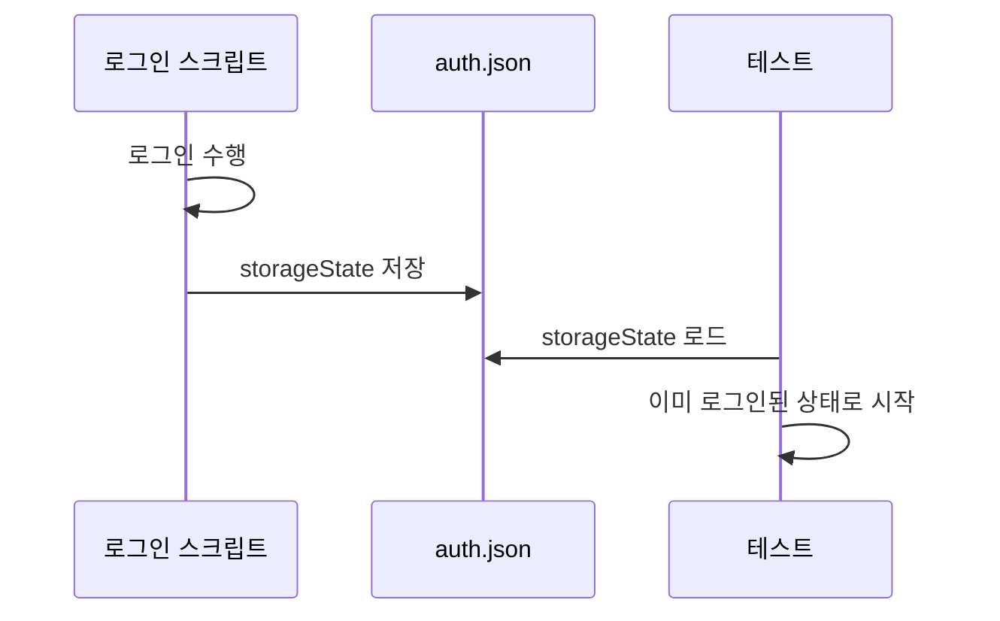
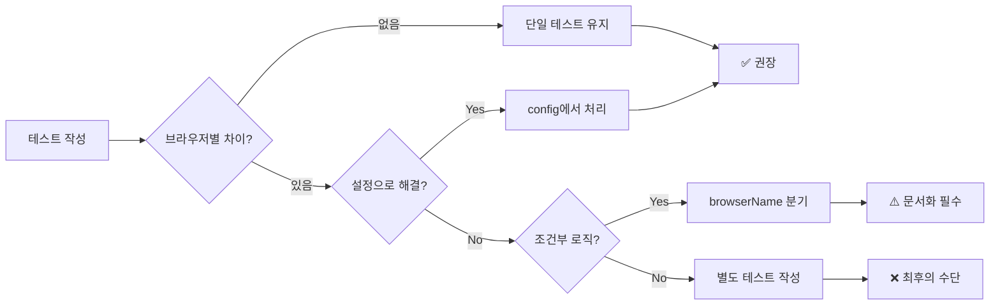
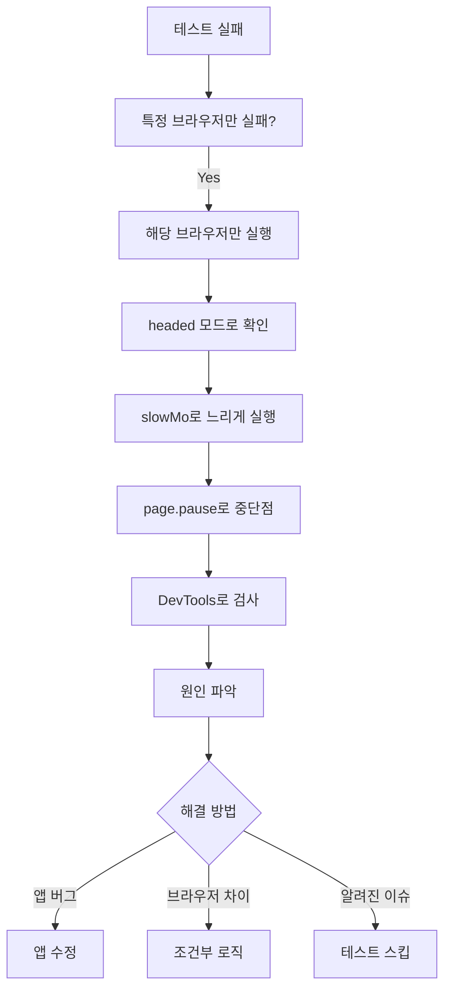

---

## 📌 핵심 요약
> 이 장에서는 Playwright의 크로스 브라우저 테스트 기능을 다룬다. 핵심은 **projects 설정으로 Chromium, Firefox, WebKit을 한 번에 테스트**하고, **디바이스 에뮬레이션**으로 다양한 환경을 시뮬레이션하며, **브라우저별 차이를 효과적으로 처리**하는 것이다.

## 🎯 학습 목표
이 내용을 읽고 나면:
- [ ] playwright.config.ts에서 멀티 브라우저 projects를 설정할 수 있다
- [ ] 브라우저 실행 옵션(viewport, userAgent, proxy 등)을 커스터마이징할 수 있다
- [ ] 특정 브라우저에서만 테스트를 실행할 수 있다
- [ ] browserName, isMobile fixture를 사용해 조건부 로직을 작성할 수 있다
- [ ] 디바이스 에뮬레이션을 설정하고 커스터마이징할 수 있다
- [ ] 브라우저별 테스트 실패를 디버깅할 수 있다

## 📖 본문 정리

### 1. Multi-Browser Testing 설정

Playwright의 **projects** 기능으로 코드 중복 없이 여러 브라우저에서 동일한 테스트를 실행할 수 있다.



#### 기본 projects 설정
```typescript
// playwright.config.ts
import { defineConfig, devices } from '@playwright/test';

export default defineConfig({
  projects: [
    {
      name: 'chromium',
      use: { ...devices['Desktop Chrome'] },
    },
    {
      name: 'firefox',
      use: { ...devices['Desktop Firefox'] },
    },
    {
      name: 'webkit',
      use: { ...devices['Desktop Safari'] },
    },
    {
      name: 'mobile-chrome',
      use: { ...devices['Pixel 5'] },
    },
  ],
});
```

| 속성 | 설명 |
|------|------|
| `name` | 프로젝트 식별자 (리포트에 표시) |
| `use` | 브라우저/디바이스 설정 객체 |
| `devices[...]` | Playwright 내장 디바이스 프로필 |

---

### 2. 브라우저 실행 옵션 커스터마이징

`use` 객체 내에서 다양한 옵션을 설정할 수 있다.

#### 주요 옵션 정리

| 옵션 | 타입 | 설명 | 예시 |
|------|------|------|------|
| `viewport` | object | 뷰포트 크기 | `{ width: 1920, height: 1080 }` |
| `userAgent` | string | User-Agent 문자열 | `'Mozilla/5.0 ...'` |
| `deviceScaleFactor` | number | DPI 배율 (Retina 등) | `2` |
| `isMobile` | boolean | 모바일 에뮬레이션 | `true` |
| `hasTouch` | boolean | 터치 이벤트 지원 | `true` |
| `javaScriptEnabled` | boolean | JS 활성화 여부 | `false` |
| `ignoreHTTPSErrors` | boolean | HTTPS 오류 무시 | `true` |
| `locale` | string | 브라우저 로케일 | `'ko-KR'` |
| `timezoneId` | string | 타임존 | `'Asia/Seoul'` |
| `geolocation` | object | 위치 정보 | `{ latitude: 37.5, longitude: 127.0 }` |
| `permissions` | array | 권한 부여 | `['geolocation', 'camera']` |
| `colorScheme` | string | 다크/라이트 모드 | `'dark'` |
| `storageState` | string | 저장된 세션 파일 | `'auth.json'` |

#### 예시: 고해상도 + 프록시 설정
```typescript
{
  name: 'chromium-high-dpi',
  use: {
    ...devices['Desktop Chrome'],
    viewport: { width: 1280, height: 720 },
    deviceScaleFactor: 2,  // Retina 디스플레이
    proxy: {
      server: 'http://proxy.example.com:8080',
      username: 'user',
      password: 'pass',
    },
  },
},
```

#### 예시: 권한 사전 부여
```typescript
{
  name: 'chromium-with-location',
  use: {
    ...devices['Desktop Chrome'],
    permissions: ['geolocation', 'notifications'],
    geolocation: { latitude: 37.5665, longitude: 126.9780 },  // 서울
  },
},
```

#### storageState로 로그인 세션 재사용



```typescript
// 1. 로그인 후 상태 저장 (setup 스크립트)
await context.storageState({ path: 'logged_in_state.json' });

// 2. 설정에서 로드
{
  name: 'chromium-logged-in',
  use: {
    ...devices['Desktop Chrome'],
    storageState: 'logged_in_state.json',
  },
},
```

---

### 3. 브랜드 브라우저 채널

Playwright 번들 브라우저 대신 실제 설치된 Chrome, Edge를 사용할 수 있다.

| 채널 | 설명 |
|------|------|
| `chrome` | Google Chrome Stable |
| `chrome-beta` | Chrome Beta |
| `chrome-dev` | Chrome Dev |
| `chrome-canary` | Chrome Canary |
| `msedge` | Microsoft Edge Stable |
| `msedge-beta` | Edge Beta |
| `msedge-dev` | Edge Dev |
| `msedge-canary` | Edge Canary |

```typescript
{
  name: 'edge-stable',
  use: {
    ...devices['Desktop Edge'],
    channel: 'msedge',
  },
},
{
  name: 'chrome-beta',
  use: {
    ...devices['Desktop Chrome'],
    channel: 'chrome-beta',
  },
},
```

> 💡 브랜드 브라우저는 시스템에 설치되어 있어야 함. 없으면 에러 발생.

---

### 4. 특정 브라우저에서 테스트 실행

#### CLI 명령어

| 명령어 | 설명 |
|--------|------|
| `npx playwright test` | 모든 프로젝트에서 실행 |
| `npx playwright test --project chromium` | Chromium만 |
| `npx playwright test --project chromium --project firefox` | 복수 지정 |
| `npx playwright test --project mobile-chrome --grep "login"` | 필터 조합 |

```bash
# Chromium에서만 실행
npx playwright test --project chromium

# Firefox와 WebKit에서 실행
npx playwright test --project firefox --project webkit

# 모바일 + 특정 테스트만
npx playwright test --project mobile-chrome --grep "user login"
```

⚠️ **주의**: 프로젝트 이름은 **대소문자 구분**. `chromium` ≠ `Chromium`

---

### 5. 브라우저별 동작 처리

Playwright는 `browserName`과 `isMobile` fixture를 제공하여 조건부 로직을 작성할 수 있다.

#### 방법 1: page 객체에서 브라우저 이름 가져오기
```typescript
test('browser-specific logic', async ({ page }) => {
  const browserName = page.context().browser().browserType().name();
  console.log(`Running on: ${browserName}`);  // 'chromium', 'firefox', 'webkit'
  
  if (browserName === 'firefox') {
    // Firefox 전용 로직
  }
});
```

#### 방법 2: fixture 직접 사용 (권장)
```typescript
import { test, expect } from '@playwright/test';

test('device-specific logic', async ({ page, browserName, isMobile }) => {
  await page.goto('https://github.com/');
  
  console.log(`Browser: ${browserName}, Mobile: ${isMobile}`);
  
  if (isMobile) {
    // 모바일: 햄버거 메뉴 클릭 필요
    await page.getByRole('button', { name: 'Toggle navigation' }).click();
  }
  
  await expect(page.getByRole('link', { name: 'Sign in' })).toBeVisible();
});
```

#### 테스트 스킵하기
```typescript
test('feature X works', async ({ page, browserName }) => {
  // WebKit에서 알려진 이슈로 스킵
  test.skip(browserName === 'webkit', 'Skipping due to WebKit issue #123');
  
  // 나머지 테스트 로직
});
```

---

### 6. 디바이스 에뮬레이션

#### 내장 디바이스 프로필

Playwright는 다양한 디바이스 프로필을 내장하고 있다.

```typescript
import { devices } from '@playwright/test';

// 내장 디바이스 목록 확인
console.log(Object.keys(devices));
// ['Desktop Chrome', 'Desktop Firefox', 'iPhone 16', 'Pixel 8', ...]
```

**주요 내장 디바이스:**
- Desktop: `Desktop Chrome`, `Desktop Firefox`, `Desktop Safari`, `Desktop Edge`
- iPhone: `iPhone 12`, `iPhone 14`, `iPhone 16`, `iPhone 16 Pro`
- Android: `Pixel 5`, `Pixel 7`, `Pixel 8`
- iPad: `iPad Pro 11`, `iPad Mini`
- Galaxy: `Galaxy S8`, `Galaxy Tab S4`

#### 수동 에뮬레이션 설정

내장 프로필에 없는 디바이스는 직접 설정:

```typescript
test('Custom Android emulation', async ({ browser }) => {
  const context = await browser.newContext({
    viewport: { width: 360, height: 640 },
    userAgent: 'Mozilla/5.0 (Linux; Android 10; SM-G975F) ...',
    deviceScaleFactor: 2,
    isMobile: true,
    hasTouch: true,
    geolocation: { latitude: 48.856613, longitude: 2.352222 },  // 파리
    locale: 'fr-FR',
    timezoneId: 'Europe/Paris',
    permissions: ['geolocation'],
  });
  
  const page = await context.newPage();
  await page.goto('https://example.com');
  
  // 테스트 로직
  
  await context.close();
});
```

#### 프로필 오버라이드

기존 프로필을 기반으로 일부만 변경:

```typescript
// playwright.config.ts
{
  name: 'Pixel 8 Dark Mode',
  use: {
    ...devices['Pixel 8'],        // 기본 설정 상속
    colorScheme: 'dark',          // 다크 모드로 변경
    locale: 'ko-KR',              // 한국어로 변경
  },
},
```

```typescript
// 테스트 파일 내에서 오버라이드
test.use({
  ...devices['iPhone 16'],
  viewport: { width: 390, height: 600 },  // 뷰포트만 변경
  locale: 'ja-JP',                        // 일본어로 변경
});

test('custom iPhone test', async ({ page }) => {
  // ...
});
```

⚠️ **주의**: 오버라이드는 spread(`...`) 다음에 와야 함. 순서가 중요!

---

### 7. 크로스 브라우저 호환성 테스트 작성



#### 권장 사항

| DO | DON'T |
|----|-------|
| 사용자 관점의 assertion | 픽셀 단위 비교 |
| `expect().toBeVisible()` 등 auto-retry | 고정 대기 시간 |
| 설정(config)으로 차이 처리 | 테스트 코드에 조건문 남발 |
| 기능 지원 여부 사전 확인 | 최신 CSS/JS 기능 무분별 사용 |
| 초기부터 크로스 브라우저 테스트 | 개발 완료 후 테스트 |

#### 브라우저별 기능 차이 확인

```typescript
// caniuse.com에서 확인 후 조건 처리
test('backdrop-filter test', async ({ page, browserName }) => {
  // Firefox는 backdrop-filter 지원이 제한적
  if (browserName === 'firefox') {
    test.skip(true, 'backdrop-filter not fully supported in Firefox');
  }
  
  // 테스트 로직
});
```

---

### 8. 브라우저별 테스트 실패 디버깅

#### 디버깅 단계



#### 디버깅 명령어

```bash
# 1. 특정 브라우저만 실행
npx playwright test --project=webkit

# 2. headed 모드 (브라우저 UI 표시)
npx playwright test --project=webkit --headed

# 3. slowMo + headed (느리게 실행)
# playwright.config.ts에서 설정
```

#### slowMo 설정
```typescript
// playwright.config.ts
{
  name: 'chromium',
  use: {
    ...devices['Desktop Chrome'],
    launchOptions: {
      slowMo: 1000,  // 각 액션 사이 1초 대기
    },
  },
},
```

#### page.pause() 사용
```typescript
test('debug test', async ({ page }) => {
  await page.goto('https://example.com');
  await page.click('#some-button');
  
  // 여기서 일시정지 → Playwright Inspector 열림
  await page.pause();
  
  await page.click('#next-button');
});
```

#### Playwright Inspector 활용

`page.pause()` 실행 시 열리는 Inspector에서:
- 단계별 실행 (Step)
- 셀렉터 테스트
- 콘솔 로그 확인
- 네트워크 요청 확인
- DOM 검사

---

## 🔍 심화 학습

### 추가 조사 내용
- **browserName vs channel**: `browserName`은 엔진(chromium, firefox, webkit)을 구분하고, `channel`은 브랜드 브라우저(chrome, msedge)를 지정
- **User-Agent 스푸핑 한계**: UA만 변경해도 렌더링 엔진은 바뀌지 않음. 실제 브라우저 동작 테스트에는 해당 엔진 사용 필수
- **CI/CD에서 크로스 브라우저**: GitHub Actions에서 `shardIndex`와 `projects`를 조합해 병렬 실행 최적화 가능

### 출처
- [Playwright Projects 공식 문서](https://playwright.dev/docs/test-projects)
- [Playwright Device Descriptors](https://github.com/microsoft/playwright/blob/main/packages/playwright-core/src/server/deviceDescriptorsSource.json)
- [Can I Use](https://caniuse.com/) - 브라우저 기능 호환성 확인

---

## 💡 실무 적용 포인트

### 이런 상황에서 사용하세요

| 상황 | 권장 접근법 |
|------|------------|
| 신규 프로젝트 세팅 | 처음부터 3개 브라우저 projects 설정 |
| 로그인 필요 테스트 | `storageState`로 세션 재사용 |
| 모바일 반응형 테스트 | 내장 디바이스 프로필 활용 |
| 특정 지역 테스트 | `locale`, `timezoneId`, `geolocation` 조합 |
| 프로덕션 브라우저 정확도 필요 | `channel: 'msedge'` 또는 `'chrome'` |
| CI에서 빠른 피드백 | `--project` 플래그로 병렬 실행 |

### 주의할 점 / 흔한 실수
- ⚠️ 프로젝트 이름 대소문자 구분 주의 (`chromium` ≠ `Chromium`)
- ⚠️ `ignoreHTTPSErrors: true`는 프로덕션 환경에서 보안 문제 은폐 가능
- ⚠️ User-Agent 변경만으로는 실제 브라우저 동작을 시뮬레이션할 수 없음
- ⚠️ `channel` 사용 시 해당 브라우저가 시스템에 설치되어 있어야 함
- ⚠️ 조건부 로직(`if browserName === ...`)은 최소화하고 문서화 필수
- ⚠️ spread(`...devices[...]`) 후에 오버라이드 속성을 배치해야 함

### 면접에서 나올 수 있는 질문
- Q: Playwright에서 멀티 브라우저 테스트를 설정하는 방법은?
- Q: 특정 브라우저에서만 테스트를 실행하려면 어떻게 하는가?
- Q: `storageState`의 용도와 이점은?
- Q: 브라우저별로 다른 동작을 처리하는 방법은?
- Q: 디바이스 에뮬레이션과 실제 디바이스 테스트의 차이점은?

---

## ✅ 핵심 개념 체크리스트
- [ ] `playwright.config.ts`의 projects 배열 구조를 이해하는가?
- [ ] viewport, userAgent, permissions 등 주요 옵션을 설정할 수 있는가?
- [ ] `--project` CLI 플래그 사용법을 알고 있는가?
- [ ] browserName, isMobile fixture로 조건부 로직을 작성할 수 있는가?
- [ ] 내장 디바이스 프로필을 사용하고 오버라이드할 수 있는가?
- [ ] headed 모드, slowMo, page.pause()로 디버깅할 수 있는가?

---

## 🔗 참고 자료
- 📄 공식 문서: [Test Projects](https://playwright.dev/docs/test-projects)
- 📄 공식 문서: [Browser Contexts](https://playwright.dev/docs/browser-contexts)
- 📄 공식 문서: [Emulation](https://playwright.dev/docs/emulation)
- 📄 공식 문서: [Debugging](https://playwright.dev/docs/debug)
- 🔧 도구: [Can I Use](https://caniuse.com/) - 브라우저 기능 호환성

---
