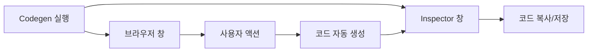
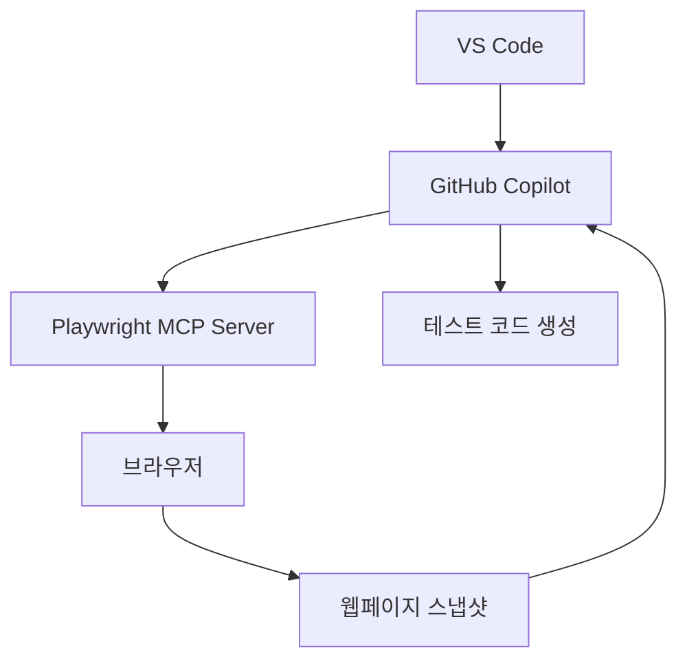
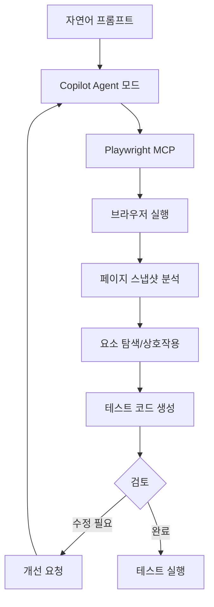
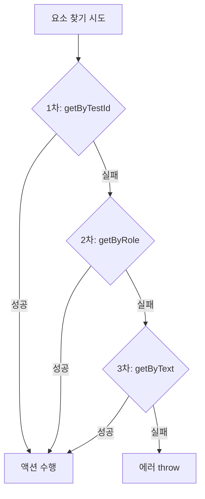
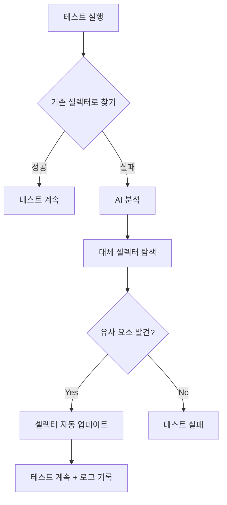

---

## 📌 핵심 요약
> 이 장에서는 AI를 활용한 Playwright 테스트 자동 생성을 다룬다. 핵심은 **Codegen으로 기본 스크립트를 녹화**하고, **MCP + Copilot으로 자연어 기반 테스트를 생성**하며, **AI 생성 코드를 개선하고 폴백 로케이터 전략**으로 안정성을 높이는 것이다.

## 🎯 학습 목표
이 내용을 읽고 나면:
- [ ] Playwright Codegen으로 테스트 스크립트를 녹화할 수 있다
- [ ] Playwright MCP를 설정하고 GitHub Copilot과 연동할 수 있다
- [ ] 자연어 프롬프트로 AI 기반 테스트를 생성할 수 있다
- [ ] AI 생성 스크립트의 문제점을 파악하고 개선할 수 있다
- [ ] 폴백 로케이터와 재시도 로직을 구현할 수 있다
- [ ] 동적 콘텐츠와 Self-Healing 개념을 이해할 수 있다

## 📖 본문 정리

### 1. Playwright Codegen으로 테스트 녹화

Codegen은 브라우저 상호작용을 실시간으로 Playwright 코드로 변환하는 도구다.



#### Codegen 실행 방법
```bash
# 기본 실행 (URL 지정)
npx playwright codegen https://www.google.com/

# URL 없이 실행 (수동 탐색)
npx playwright codegen

# 특정 언어로 출력
npx playwright codegen --lang=python
npx playwright codegen --lang=java
```

**지원 언어:**
- TypeScript (기본)
- JavaScript
- Python
- C#
- Java

#### Codegen 창 구성

| 창 | 역할 |
|----|------|
| **Browser Window** | 웹사이트 상호작용 수행 |
| **Playwright Inspector** | 실시간 코드 생성 확인, assertion 추가, 언어 선택 |

#### Assertion 추가하기

1. Inspector 툴바에서 assertion 아이콘 클릭
2. 검증할 요소 선택
3. assertion 유형 선택 (visibility, text, value 등)

```typescript
// 자동 생성된 assertion 예시
await expect(page.getByText('Welcome')).toBeVisible();
await expect(page.locator('#username')).toHaveValue('john');
```

> 💡 **팁**: assertion 없는 테스트는 "클릭만 하고 검증 안 함". 반드시 결과 검증 추가!

#### Pick Locator 도구

녹화 없이도 요소 위에 마우스를 올리면 최적의 셀렉터를 확인할 수 있다.

#### Codegen 한계

| 한계 | 설명 |
|------|------|
| 기본적인 스크립트 | 단순 플로우만 캡처, 복잡한 시나리오는 수동 수정 필요 |
| 로직 부재 | 조건문, 반복문, 에러 핸들링 없음 |
| 셀렉터 불완전 | 때때로 취약한 셀렉터 생성 → 수동 개선 필요 |

---

### 2. Playwright MCP 설정 (Model Context Protocol)

MCP는 AI 모델(Claude, ChatGPT 등)이 웹페이지를 "보고" 상호작용할 수 있게 해주는 프로토콜이다.



#### MCP 설치

```bash
# VS Code CLI로 설치
code --add-mcp '{"name":"playwright","command":"npx","args":["@playwright/mcp@latest"]}'
```

**`code` 명령어가 없는 경우:**
1. VS Code에서 `Cmd+Shift+P` (Mac) / `Ctrl+Shift+P` (Windows)
2. `Shell Command: Install 'code' command in PATH` 실행
3. 터미널 재시작

#### Copilot 연동 설정

1. GitHub Copilot + Copilot Chat 확장 설치
2. Secondary Sidebar 열기 (`Cmd+Alt+B` / `Ctrl+Alt+B`)
3. Copilot 채팅 하단에서 **Ask → Agent** 모드로 전환
4. 모델로 **Claude** 선택

> 💡 Agent 모드에서 Copilot이 Playwright 명령을 사용해 웹페이지와 상호작용 가능

---

### 3. MCP + Copilot으로 테스트 생성

자연어 프롬프트만으로 테스트를 생성할 수 있다.

#### 사용 예시

**프롬프트:**
```
Using Playwright, generate a test to verify the blog at mashable.com loads, 
the search input works, and clicking a tag filters posts correctly.
```

**Copilot 동작:**
1. 브라우저 실행
2. 페이지 접근성 트리(Accessibility Tree) 분석
3. 요소 탐색 및 상호작용
4. 완성된 테스트 스크립트 생성

#### AI 테스트 생성 워크플로우



**장점:**
- 소스 코드 접근 없이 자동화 가능
- 자연어로 테스트 작성
- 80-90% 완성도 → 나머지는 수동 개선

---

### 4. AI 생성 스크립트 개선

AI가 생성한 코드는 "시작점"일 뿐, 반드시 검토와 개선이 필요하다.

#### 주요 개선 포인트

| 문제 | 해결 방법 |
|------|----------|
| 취약한 셀렉터 (`div:nth-child(3)`) | role/text 기반 셀렉터로 변경 |
| 대기 로직 누락 | `waitForSelector`, `expect().toBeVisible()` 추가 |
| 에러 핸들링 없음 | try-catch 블록 추가 |
| 결과 검증 없음 | assertion 추가 |
| 독립 스크립트 형식 | test runner 형식으로 변환 |

#### Before/After 예시

**AI 생성 (개선 전):**
```typescript
import { test, expect } from '@playwright/test';

test('netlify.app - click on button', async ({ page }) => {
  await page.goto('https://sweetshop.netlify.app/');
  await page.click('.btn');  // 취약한 셀렉터, 검증 없음
});
```

**개선 후:**
```typescript
import { test, expect } from '@playwright/test';

test('netlify.app - click on button', async ({ page }) => {
  try {
    // 명시적 타임아웃 설정
    await page.goto('https://sweetshop.netlify.app', { timeout: 30000 });
    
    // 페이지 로드 검증
    await expect(page.getByText('Welcome')).toBeVisible();
    
    // role 기반 셀렉터 사용
    await page.getByRole('link', { name: 'Browse Sweets' }).click();
    
  } catch (error) {
    console.error('Something went wrong:', error);
    throw error;  // 에러 재throw로 테스트 실패 명시
  }
});
```

#### 독립 스크립트 → Test Runner 형식 변환

**AI 생성 (독립 스크립트):**
```typescript
const { chromium } = require('playwright');

(async () => {
  const browser = await chromium.launch();
  const page = await browser.newPage();
  await page.goto('url');
  await page.click('button');
  await browser.close();
})();
```

**Test Runner 형식으로 변환:**
```typescript
const { test, expect } = require('@playwright/test');

test.describe('Login Tests', () => {
  test('should log in successfully', async ({ page }) => {
    await page.goto('url');
    await page.getByRole('button', { name: 'Log In' }).click();
    await expect(page.getByText('Welcome')).toBeVisible();
  });
});
```

> 💡 **핵심 원칙**: "액션만 하지 말고, 결과를 검증하라"
> ```typescript
> await page.getByRole('button', { name: 'Submit' }).click();
> await expect(page.getByText('Success')).toBeVisible();  // 결과 검증!
> ```

---

### 5. Resilient Locator Strategy (폴백 로케이터)

UI 변경에도 테스트가 깨지지 않도록 여러 로케이터를 순차적으로 시도하는 전략.



#### 폴백 로케이터 구현

```typescript
import { test, expect } from '@playwright/test';

test('Google search button', async ({ page }) => {
  await page.goto('https://google.com');
  
  // 우선순위대로 시도할 로케이터 배열
  const locators = [
    page.getByTestId('submit-button'),
    page.getByRole('button', { name: 'Google Search' }),
    page.getByText('Google Search'),
  ];
  
  for (const locator of locators) {
    try {
      await locator.click({ timeout: 5000 });
      console.log('Success!');
      return;  // 성공 시 즉시 종료
    } catch {
      console.warn(`Locator failed: ${locator}, trying next...`);
    }
  }
  
  throw new Error('All locators failed for Submit button');
});
```

#### 재시도 로직 구현

**방법 1: Playwright 내장 `expect().toPass()`**
```typescript
await expect(async () => {
  await page.getByText('Login').click();
}).toPass({
  timeout: 3000,   // 최대 3초
  interval: 1000,  // 1초 간격으로 재시도
});
```

**방법 2: 커스텀 재시도 함수**
```typescript
async function retryAction(action, maxAttempts = 3) {
  for (let attempt = 1; attempt <= maxAttempts; attempt++) {
    try {
      await action();
      return;  // 성공 시 종료
    } catch (error) {
      console.warn(`Attempt ${attempt} failed: ${error}`);
      if (attempt === maxAttempts) throw error;
      await new Promise(res => setTimeout(res, 1000));  // 1초 대기
    }
  }
}

// 사용 예시
await retryAction(() => page.getByText('Login').click());
```

⚠️ **주의**: 무한 재시도 방지를 위해 반드시 `maxAttempts` 설정!

---

### 6. 동적 콘텐츠 처리

페이지 로드 후 비동기로 나타나는 콘텐츠 처리 방법.

#### 명시적 대기

```typescript
// 셀렉터로 대기
await page.waitForSelector('img', {
  state: 'visible',
  timeout: 10000,
});

// 조건 함수로 대기
await page.waitForFunction(
  () => document.querySelector('.loaded') !== null,
  { timeout: 15000 }
);
```

#### 대체 경로(Fallback Navigation)

```typescript
import { test, expect } from '@playwright/test';

test('should navigate to sweets page', async ({ page }) => {
  await page.goto('https://sweetshop.netlify.app/', 
                  { waitUntil: 'domcontentloaded' });
  
  try {
    // 1차: 링크 클릭 시도
    await page.getByRole('link', { name: 'Browse Sweets' })
              .click({ timeout: 5000 });
    await expect(page).toHaveURL(/sweets$/, { timeout: 5000 });
    
  } catch (error) {
    // 2차: 직접 URL 이동
    console.warn('Link click failed, navigating directly...');
    await page.goto('https://sweetshop.netlify.app/sweets',
                    { waitUntil: 'domcontentloaded' });
    await expect(page).toHaveURL(/sweets$/, { timeout: 10000 });
  }
});
```

**`waitUntil` 옵션:**

| 옵션 | 설명 | 사용 시기 |
|------|------|----------|
| `domcontentloaded` | HTML 파싱 완료 (빠름) | 대부분의 경우 |
| `load` | 모든 리소스 로드 완료 | 이미지/스타일 검증 필요 시 |
| `networkidle` | 네트워크 유휴 상태 | SPA, 동적 콘텐츠 |

---

### 7. AI 기반 Self-Healing

테스트가 UI 변경에 자동으로 적응하는 개념.



#### Self-Healing 동작 원리

1. **초기 학습**: 요소의 여러 속성 수집 (텍스트, 위치, 크기, ID, 클래스 등)
2. **실행 시**: 기존 셀렉터 실패 → 수집된 속성으로 유사 요소 탐색
3. **자동 복구**: 새 셀렉터로 테스트 계속, 변경 내역 로깅

#### Self-Healing 도구

Playwright 자체에는 Self-Healing이 없으나, 상용 도구로 구현 가능:

| 도구 | 특징 |
|------|------|
| **Testim** | ML 기반 셀렉터 자동 수정 |
| **Mabl** | 자동 복구 + 시각적 테스트 |
| **Healenium** | 오픈소스 Self-Healing 라이브러리 |

#### Self-Healing 트레이드오프

| 장점 | 단점 |
|------|------|
| 테스트 유지보수 시간 감소 | 실행 속도 저하 |
| UI 변경에 강한 내성 | 대규모 리디자인에는 여전히 취약 |
| 신뢰할 수 있는 테스트 결과 | 너무 관대하면 실제 버그 놓칠 수 있음 |
| | 구현 복잡성 증가 |

> 💡 소규모 프로젝트에서는 Self-Healing 도입 비용이 이점보다 클 수 있음

---

## 🔍 심화 학습

### 추가 조사 내용
- **Playwright MCP 원리**: Accessibility Tree 스냅샷을 AI 모델에 전달하여 페이지 구조 이해
- **Codegen vs MCP**: Codegen은 사용자 액션 기록, MCP는 AI가 자율적으로 페이지 탐색
- **Self-Healing 구현**: 커스텀 폴백 로케이터 + 속성 기반 유사도 매칭으로 간단히 구현 가능

### 출처
- [Playwright Codegen 공식 문서](https://playwright.dev/docs/codegen)
- [Playwright MCP GitHub](https://github.com/microsoft/playwright-mcp)
- [Testim Self-Healing](https://www.testim.io/)

---

## 💡 실무 적용 포인트

### 이런 상황에서 사용하세요

| 상황 | 권장 도구/접근법 |
|------|-----------------|
| 빠른 테스트 프로토타입 | Codegen으로 녹화 |
| 셀렉터 탐색 | Pick Locator 도구 |
| 복잡한 시나리오 테스트 생성 | MCP + Copilot |
| 레거시 코드 테스트 | AI로 초안 → 수동 개선 |
| UI 변경 잦은 프로젝트 | 폴백 로케이터 + 재시도 로직 |
| 대규모 테스트 유지보수 | Self-Healing 도구 검토 |

### 주의할 점 / 흔한 실수
- ⚠️ AI 생성 코드를 그대로 사용하지 말 것 (80-90% 완성도)
- ⚠️ `div:nth-child(3)` 같은 취약한 셀렉터는 즉시 개선
- ⚠️ 클릭만 하고 결과 검증을 빼먹지 말 것
- ⚠️ 재시도 로직에 반드시 최대 시도 횟수 설정
- ⚠️ Self-Healing이 너무 관대하면 실제 버그를 놓칠 수 있음
- ⚠️ Copilot에 비밀번호 등 민감 정보 입력 금지

### 면접에서 나올 수 있는 질문
- Q: Playwright Codegen의 용도와 한계는?
- Q: AI 생성 테스트 코드의 주요 개선 포인트는?
- Q: 폴백 로케이터 전략이란 무엇이고 왜 필요한가?
- Q: `expect().toPass()`와 커스텀 재시도 로직의 차이는?
- Q: Self-Healing 테스트의 장단점은?

---

## ✅ 핵심 개념 체크리스트
- [ ] Codegen을 실행하고 assertion을 추가할 수 있는가?
- [ ] Playwright MCP를 VS Code에 설치할 수 있는가?
- [ ] AI 생성 스크립트의 문제점(취약한 셀렉터, 검증 누락 등)을 식별할 수 있는가?
- [ ] 폴백 로케이터 배열을 구현할 수 있는가?
- [ ] `expect().toPass()`로 재시도 로직을 구현할 수 있는가?
- [ ] Self-Healing의 개념과 트레이드오프를 설명할 수 있는가?

---

## 🔗 참고 자료
- 📄 공식 문서: [Playwright Codegen](https://playwright.dev/docs/codegen)
- 📄 공식 문서: [Locators](https://playwright.dev/docs/locators)
- 🔧 GitHub: [Playwright MCP](https://github.com/microsoft/playwright-mcp)
- 🔧 도구: [Testim](https://www.testim.io/), [Mabl](https://www.mabl.com/)

---
