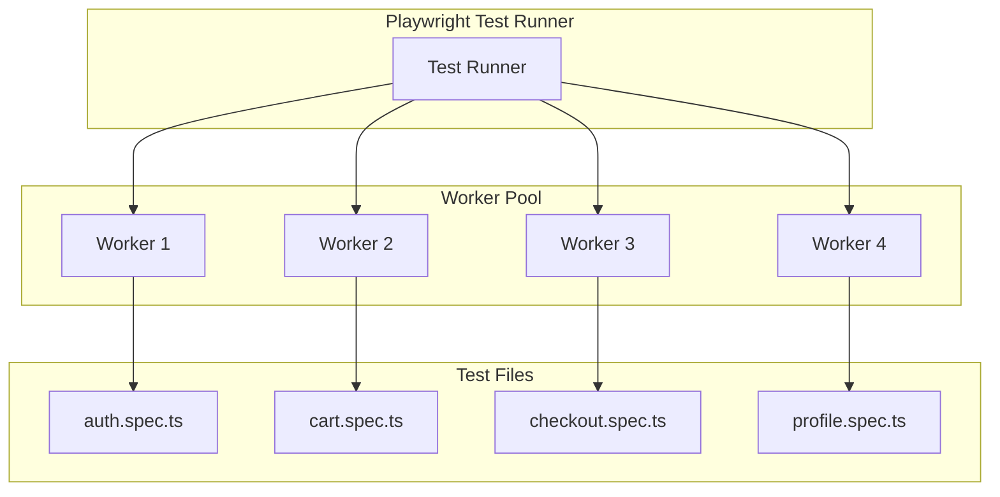
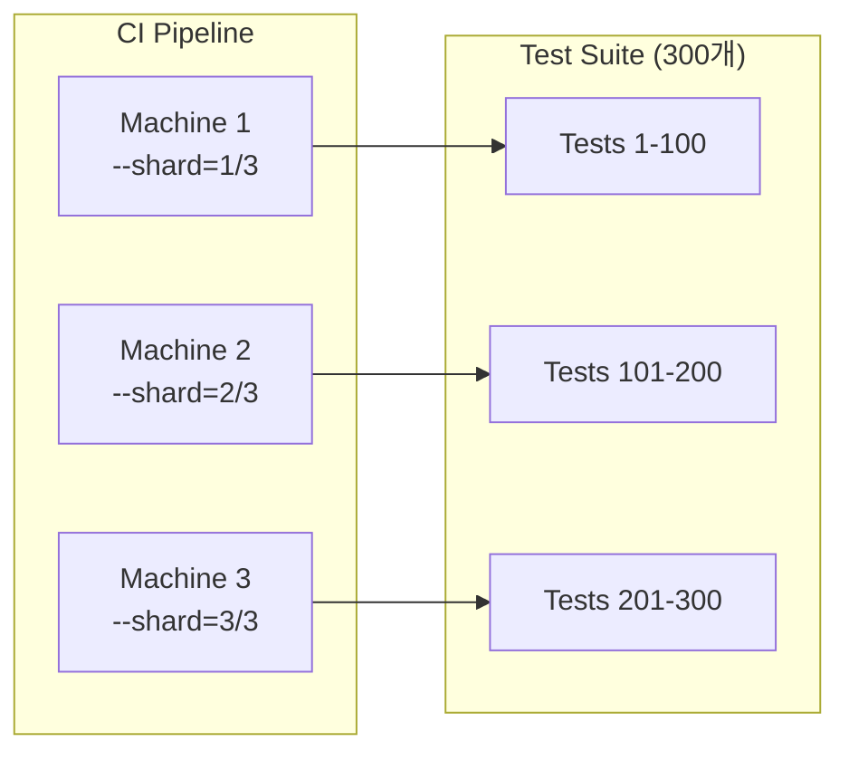
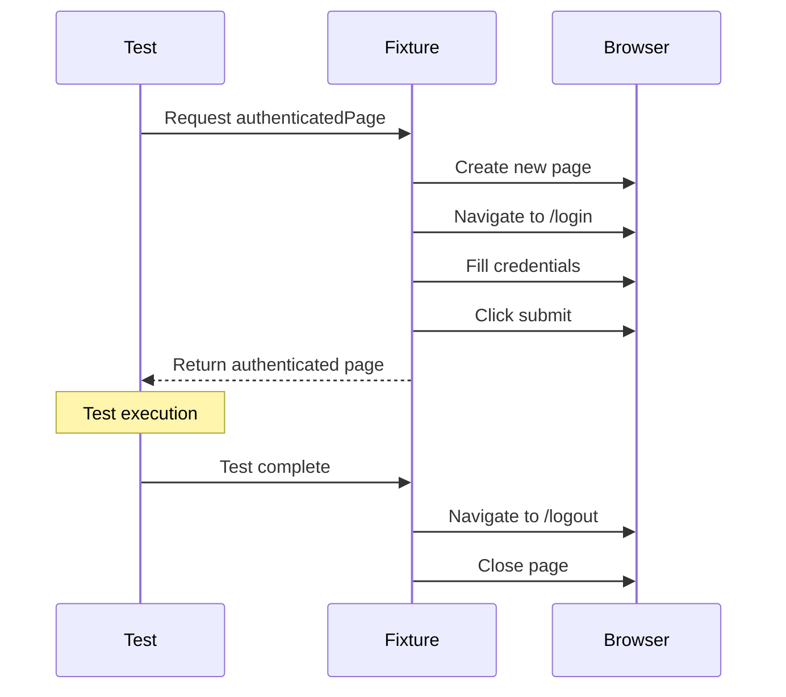
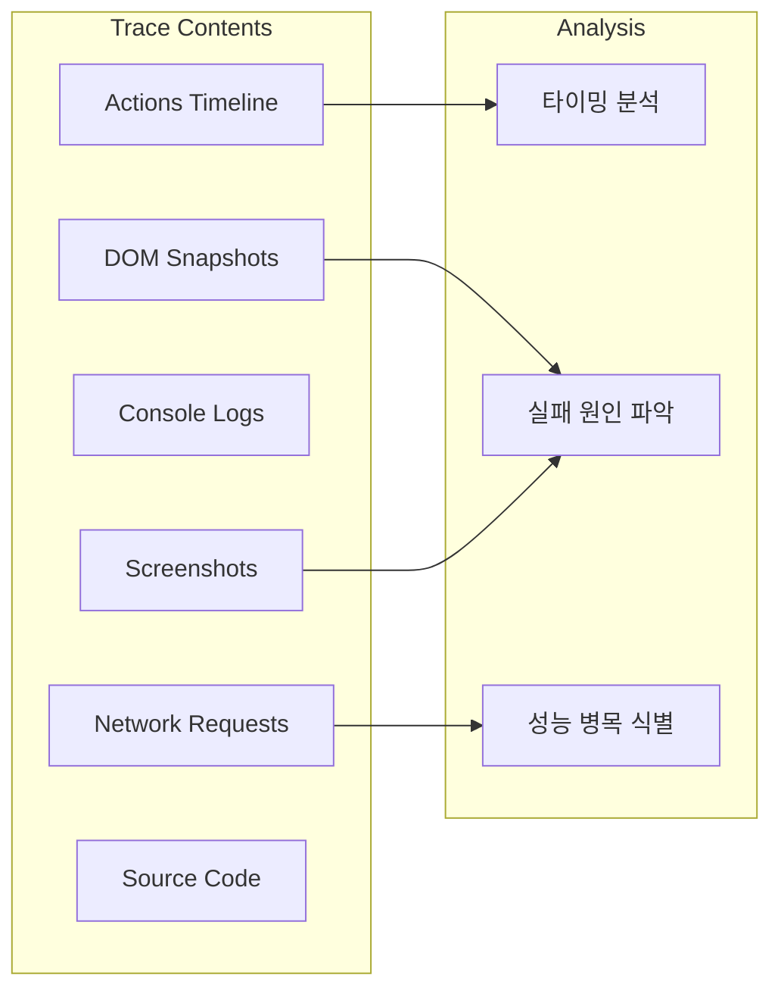

---

## 📌 핵심 요약
> 이 장에서는 Playwright의 테스트 병렬화와 성능 최적화 전략을 다룬다. 핵심은 **워커(Worker) 기반 병렬 실행 모델을 이해**하고, 샤딩(Sharding)으로 대규모 테스트를 분산 처리하며, CDP(Chrome DevTools Protocol)와 Performance API를 활용한 성능 측정 방법을 익히는 것이다.

## 🎯 학습 목표
이 내용을 읽고 나면:
- [ ] Playwright의 워커 기반 병렬화 모델을 설명할 수 있다
- [ ] `--workers` 옵션과 `fullyParallel` 설정을 적절히 사용할 수 있다
- [ ] 샤딩을 활용해 CI/CD에서 테스트를 분산 실행할 수 있다
- [ ] Fixture를 사용한 효율적인 리소스 관리를 구현할 수 있다
- [ ] Performance API와 CDP로 웹 성능 지표를 수집할 수 있다
- [ ] Playwright Tracing으로 테스트 실행을 분석할 수 있다

## 📖 본문 정리

### 1. Playwright 병렬화 모델

Playwright는 **워커(Worker)** 단위로 테스트를 병렬 실행한다.



#### 핵심 개념

| 개념 | 설명 | 격리 수준 |
|------|------|----------|
| **Worker** | 독립적인 Node.js 프로세스 | 프로세스 레벨 (완전 격리) |
| **Test File** | 기본적으로 하나의 워커에서 실행 | 파일 단위 |
| **Test Case** | 각 테스트는 독립된 BrowserContext | 테스트 단위 |

> 💬 **비유**: 워커는 "독립된 공장"과 같다. 각 공장(Worker)은 자체 설비(Browser)를 갖고 있어 서로 간섭 없이 제품(Test)을 생산한다.

---

### 2. 워커 제어 방법

#### CLI에서 워커 수 지정

```bash
# 기본: CPU 코어 수의 절반
npx playwright test

# 명시적 워커 수 지정
npx playwright test --workers=4

# 순차 실행 (디버깅용)
npx playwright test --workers=1

# CPU 비율로 지정
npx playwright test --workers=50%
```

#### playwright.config.ts 설정

```typescript
import { defineConfig } from '@playwright/test';

export default defineConfig({
  // 워커 수 설정 (숫자 또는 비율)
  workers: process.env.CI ? 2 : undefined,  // CI에서는 2개, 로컬은 자동

  // 파일 내 테스트도 병렬 실행
  fullyParallel: true,

  // 실패 시 재시도 (flaky 테스트 대응)
  retries: process.env.CI ? 2 : 0,

  // 최대 실패 허용 수 (빠른 실패)
  maxFailures: process.env.CI ? 10 : undefined,
});
```

#### 파일 내 병렬 실행

```typescript
import { test } from '@playwright/test';

// 이 describe 블록 내 테스트들을 병렬 실행
test.describe.parallel('Independent Tests', () => {
  test('test 1', async ({ page }) => {
    // 다른 테스트와 동시 실행 가능
  });

  test('test 2', async ({ page }) => {
    // 다른 테스트와 동시 실행 가능
  });
});

// 순차 실행이 필요한 경우
test.describe.serial('Dependent Tests', () => {
  test('step 1: login', async ({ page }) => {
    // 반드시 먼저 실행
  });

  test('step 2: checkout', async ({ page }) => {
    // step 1 이후 실행
  });
});
```

---

### 3. 샤딩(Sharding)으로 테스트 분산

대규모 테스트 스위트를 여러 CI 머신에서 분산 실행한다.



#### 샤딩 명령어

```bash
# 3개 머신에서 분산 실행
# Machine 1
npx playwright test --shard=1/3

# Machine 2
npx playwright test --shard=2/3

# Machine 3
npx playwright test --shard=3/3
```

#### GitHub Actions 예시

```yaml
# .github/workflows/playwright.yml
name: Playwright Tests

on: [push, pull_request]

jobs:
  test:
    runs-on: ubuntu-latest
    strategy:
      fail-fast: false
      matrix:
        shard: [1, 2, 3, 4]  # 4개 샤드로 분산

    steps:
      - uses: actions/checkout@v4

      - name: Setup Node.js
        uses: actions/setup-node@v4
        with:
          node-version: 20

      - name: Install dependencies
        run: npm ci

      - name: Install Playwright browsers
        run: npx playwright install --with-deps

      - name: Run tests
        run: npx playwright test --shard=${{ matrix.shard }}/4

      - name: Upload test results
        uses: actions/upload-artifact@v4
        if: always()
        with:
          name: playwright-report-${{ matrix.shard }}
          path: playwright-report/
          retention-days: 30
```

---

### 4. 리소스 관리와 최적화

#### 브라우저 재사용 전략

```typescript
import { test as base, Browser, BrowserContext } from '@playwright/test';

// 워커 레벨에서 브라우저 공유 (비용 절감)
const test = base.extend<{}, { workerBrowser: Browser }>({
  workerBrowser: [async ({ playwright }, use) => {
    const browser = await playwright.chromium.launch();
    await use(browser);
    await browser.close();
  }, { scope: 'worker' }],  // 워커 스코프: 워커당 1회 생성
});

// 테스트별 독립 컨텍스트 (격리 유지)
test('isolated test', async ({ workerBrowser }) => {
  const context = await workerBrowser.newContext();
  const page = await context.newPage();
  // 테스트 로직
  await context.close();
});
```

#### 네트워크 요청 차단 (속도 향상)

```typescript
import { test, expect } from '@playwright/test';

test.beforeEach(async ({ context }) => {
  // 불필요한 리소스 차단으로 테스트 속도 향상
  await context.route('**/*.{png,jpg,jpeg,gif,svg,ico}', route => route.abort());
  await context.route('**/*analytics*', route => route.abort());
  await context.route('**/*tracking*', route => route.abort());
  await context.route('**/*ads*', route => route.abort());
});

test('fast page load', async ({ page }) => {
  await page.goto('https://example.com');
  // 이미지, 분석 스크립트 없이 빠르게 로드
});
```

#### 아티팩트 제한 설정

```typescript
// playwright.config.ts
export default defineConfig({
  use: {
    // 스크린샷: 실패 시에만
    screenshot: 'only-on-failure',

    // 비디오: 재시도 시에만 (디스크 절약)
    video: 'on-first-retry',

    // 트레이스: 재시도 시에만
    trace: 'on-first-retry',
  },

  // 결과 보존 설정
  preserveOutput: 'failures-only',
});
```

---

### 5. Fixture를 활용한 Setup/Teardown

```typescript
import { test as base, expect } from '@playwright/test';

// 커스텀 Fixture 정의
type MyFixtures = {
  authenticatedPage: Page;
  testData: { userId: string; token: string };
};

const test = base.extend<MyFixtures>({
  // 인증된 페이지 Fixture
  authenticatedPage: async ({ page }, use) => {
    // Setup: 로그인
    await page.goto('/login');
    await page.fill('#username', 'testuser');
    await page.fill('#password', 'password');
    await page.click('button[type="submit"]');
    await page.waitForURL('/dashboard');

    // 테스트에 페이지 전달
    await use(page);

    // Teardown: 로그아웃 (선택적)
    await page.goto('/logout');
  },

  // 테스트 데이터 Fixture
  testData: async ({}, use) => {
    // Setup: API로 테스트 데이터 생성
    const response = await fetch('/api/test-data', { method: 'POST' });
    const data = await response.json();

    await use(data);

    // Teardown: 테스트 데이터 정리
    await fetch(`/api/test-data/${data.userId}`, { method: 'DELETE' });
  },
});

// Fixture 사용
test('authenticated user can view dashboard', async ({ authenticatedPage }) => {
  await expect(authenticatedPage.locator('h1')).toContainText('Dashboard');
});

test('can use test data', async ({ authenticatedPage, testData }) => {
  await authenticatedPage.goto(`/users/${testData.userId}`);
  await expect(authenticatedPage.locator('.user-id')).toContainText(testData.userId);
});
```



---

### 6. Performance API로 성능 측정

#### Navigation Timing API

```typescript
import { test, expect } from '@playwright/test';

test('measure page load performance', async ({ page }) => {
  await page.goto('https://example.com');

  // Navigation Timing 수집
  const timing = await page.evaluate(() => {
    const perf = performance.getEntriesByType('navigation')[0] as PerformanceNavigationTiming;
    return {
      // DNS 조회 시간
      dnsLookup: perf.domainLookupEnd - perf.domainLookupStart,
      // TCP 연결 시간
      tcpConnect: perf.connectEnd - perf.connectStart,
      // 서버 응답 시간 (TTFB)
      ttfb: perf.responseStart - perf.requestStart,
      // 콘텐츠 다운로드 시간
      contentDownload: perf.responseEnd - perf.responseStart,
      // DOM 파싱 시간
      domParsing: perf.domContentLoadedEventEnd - perf.responseEnd,
      // 전체 로드 시간
      totalLoad: perf.loadEventEnd - perf.startTime,
    };
  });

  console.log('Performance Metrics:', timing);

  // 성능 임계치 검증
  expect(timing.ttfb).toBeLessThan(200);  // TTFB < 200ms
  expect(timing.totalLoad).toBeLessThan(3000);  // 전체 < 3초
});
```

#### Paint Timing (FCP, LCP)

```typescript
test('measure paint timing', async ({ page }) => {
  await page.goto('https://example.com');

  // First Contentful Paint (FCP)
  const fcp = await page.evaluate(() => {
    return new Promise<number>((resolve) => {
      new PerformanceObserver((list) => {
        const entries = list.getEntries();
        const fcpEntry = entries.find(e => e.name === 'first-contentful-paint');
        if (fcpEntry) resolve(fcpEntry.startTime);
      }).observe({ entryTypes: ['paint'] });

      // 이미 발생한 경우
      const existing = performance.getEntriesByName('first-contentful-paint')[0];
      if (existing) resolve(existing.startTime);
    });
  });

  console.log(`FCP: ${fcp}ms`);
  expect(fcp).toBeLessThan(1800);  // Good FCP < 1.8초
});
```

#### Core Web Vitals 측정

```typescript
test('measure Core Web Vitals', async ({ page }) => {
  // web-vitals 라이브러리 주입
  await page.addInitScript(() => {
    window.__webVitals = {};
  });

  await page.goto('https://example.com');

  // LCP (Largest Contentful Paint)
  const lcp = await page.evaluate(() => {
    return new Promise<number>((resolve) => {
      new PerformanceObserver((list) => {
        const entries = list.getEntries();
        const lastEntry = entries[entries.length - 1];
        resolve(lastEntry.startTime);
      }).observe({ entryTypes: ['largest-contentful-paint'] });
    });
  });

  // CLS (Cumulative Layout Shift)
  const cls = await page.evaluate(() => {
    return new Promise<number>((resolve) => {
      let clsValue = 0;
      new PerformanceObserver((list) => {
        for (const entry of list.getEntries() as any[]) {
          if (!entry.hadRecentInput) {
            clsValue += entry.value;
          }
        }
        resolve(clsValue);
      }).observe({ entryTypes: ['layout-shift'] });

      // 5초 후 결과 반환
      setTimeout(() => resolve(clsValue), 5000);
    });
  });

  console.log(`LCP: ${lcp}ms, CLS: ${cls}`);

  // Core Web Vitals 기준
  expect(lcp).toBeLessThan(2500);  // Good LCP < 2.5초
  expect(cls).toBeLessThan(0.1);   // Good CLS < 0.1
});
```

---

### 7. CDP(Chrome DevTools Protocol)로 상세 메트릭 수집

```typescript
import { test, expect, chromium } from '@playwright/test';

test('collect CDP metrics', async () => {
  // CDP 세션을 위해 직접 브라우저 연결
  const browser = await chromium.launch();
  const context = await browser.newContext();
  const page = await context.newPage();

  // CDP 세션 시작
  const client = await context.newCDPSession(page);

  // Performance 도메인 활성화
  await client.send('Performance.enable');

  await page.goto('https://example.com');

  // 메트릭 수집
  const { metrics } = await client.send('Performance.getMetrics');

  // 주요 메트릭 추출
  const metricsMap = new Map(metrics.map(m => [m.name, m.value]));

  console.log('CDP Metrics:', {
    JSHeapUsedSize: metricsMap.get('JSHeapUsedSize'),
    JSHeapTotalSize: metricsMap.get('JSHeapTotalSize'),
    Documents: metricsMap.get('Documents'),
    Frames: metricsMap.get('Frames'),
    LayoutCount: metricsMap.get('LayoutCount'),
    RecalcStyleCount: metricsMap.get('RecalcStyleCount'),
    TaskDuration: metricsMap.get('TaskDuration'),
  });

  await browser.close();
});
```

#### CDP로 네트워크 모니터링

```typescript
test('monitor network with CDP', async ({ page, context }) => {
  const client = await context.newCDPSession(page);

  // Network 도메인 활성화
  await client.send('Network.enable');

  const requests: any[] = [];

  // 요청 이벤트 리스닝
  client.on('Network.requestWillBeSent', (params) => {
    requests.push({
      url: params.request.url,
      method: params.request.method,
      timestamp: params.timestamp,
    });
  });

  client.on('Network.responseReceived', (params) => {
    const request = requests.find(r => r.url === params.response.url);
    if (request) {
      request.status = params.response.status;
      request.mimeType = params.response.mimeType;
    }
  });

  await page.goto('https://example.com');

  console.log('Network Requests:', requests);

  // API 요청 검증
  const apiRequests = requests.filter(r => r.url.includes('/api/'));
  expect(apiRequests.every(r => r.status === 200)).toBeTruthy();
});
```

---

### 8. Playwright Tracing

테스트 실행을 상세히 기록하여 디버깅에 활용한다.

#### 트레이스 설정

```typescript
// playwright.config.ts
export default defineConfig({
  use: {
    // 트레이스 모드
    trace: 'on-first-retry',  // 첫 재시도 시 기록
    // 또는
    // trace: 'on',           // 항상 기록
    // trace: 'retain-on-failure',  // 실패 시 보존
  },
});
```

#### 프로그래매틱 트레이스

```typescript
import { test, expect } from '@playwright/test';

test('trace specific scenario', async ({ page, context }) => {
  // 트레이스 시작
  await context.tracing.start({
    screenshots: true,  // 스크린샷 포함
    snapshots: true,    // DOM 스냅샷 포함
    sources: true,      // 소스 코드 포함
  });

  try {
    await page.goto('https://example.com');
    await page.click('button#submit');
    await expect(page.locator('.result')).toBeVisible();
  } finally {
    // 트레이스 저장
    await context.tracing.stop({
      path: 'trace.zip',
    });
  }
});
```

#### 트레이스 분석

```bash
# 트레이스 뷰어 열기
npx playwright show-trace trace.zip

# 또는 온라인 뷰어
# https://trace.playwright.dev
```



---

### 9. 성능 최적화 체크리스트

| 영역 | 최적화 방법 | 효과 |
|------|------------|------|
| **병렬화** | `workers` 증가, `fullyParallel: true` | 실행 시간 단축 |
| **샤딩** | CI에서 `--shard=X/Y` 분산 | 대규모 스위트 처리 |
| **네트워크** | 불필요한 리소스 차단 | 페이지 로드 속도 향상 |
| **아티팩트** | 실패 시에만 저장 | 디스크/메모리 절약 |
| **브라우저** | 워커 레벨 재사용 | 시작 오버헤드 감소 |
| **Fixture** | 적절한 스코프 설정 | 중복 Setup 제거 |
| **재시도** | `retries` 설정 | flaky 테스트 안정화 |

---

## 🔍 심화 학습

### 추가 조사 내용
- **Playwright Reporter**: 커스텀 리포터로 성능 메트릭 수집 자동화
- **Lighthouse CI**: Playwright와 Lighthouse 통합으로 종합 성능 테스트
- **Grafana/InfluxDB**: 성능 메트릭 시계열 저장 및 대시보드 구축

### 출처
- [Playwright - Parallelism and Sharding](https://playwright.dev/docs/test-parallel)
- [Playwright - Test Fixtures](https://playwright.dev/docs/test-fixtures)
- [Playwright - Trace Viewer](https://playwright.dev/docs/trace-viewer)
- [Web Vitals](https://web.dev/vitals/)
- [Chrome DevTools Protocol](https://chromedevtools.github.io/devtools-protocol/)

---

## 💡 실무 적용 포인트

### 이런 상황에서 사용하세요
- **CI/CD 파이프라인**: 샤딩으로 빌드 시간 단축
- **대규모 테스트 스위트**: 워커 최적화로 로컬 개발 효율화
- **성능 모니터링**: Core Web Vitals 자동 측정으로 성능 회귀 방지
- **flaky 테스트 디버깅**: 트레이스로 간헐적 실패 원인 분석

### 주의할 점 / 흔한 실수
- ⚠️ 워커 수를 무작정 늘리면 오히려 리소스 경쟁으로 느려질 수 있음
- ⚠️ `fullyParallel: true`는 테스트 간 의존성이 없을 때만 사용
- ⚠️ 샤딩 시 각 샤드의 테스트 수가 균등하지 않을 수 있음 (테스트 시간 기반 분배 권장)
- ⚠️ CDP 사용 시 Chromium 계열 브라우저에서만 동작
- ⚠️ 트레이스 파일은 용량이 크므로 CI에서는 실패 시에만 저장

### 면접에서 나올 수 있는 질문
- Q: Playwright에서 테스트 격리는 어떻게 보장되는가?
- Q: `fullyParallel`과 `test.describe.parallel()`의 차이는?
- Q: 샤딩과 워커의 차이점과 사용 시나리오는?
- Q: Core Web Vitals(LCP, FID, CLS)가 무엇이고, Playwright로 어떻게 측정하는가?
- Q: Fixture의 scope 옵션(`test`, `worker`)은 언제 사용하는가?

---

## ✅ 핵심 개념 체크리스트
- [ ] 워커(Worker)가 테스트를 어떻게 병렬 실행하는지 설명할 수 있는가?
- [ ] `--workers`, `fullyParallel`, `--shard` 옵션을 적절히 사용할 수 있는가?
- [ ] Fixture의 `scope` 옵션(test vs worker)의 차이를 알고 있는가?
- [ ] Performance API로 TTFB, FCP, LCP를 측정할 수 있는가?
- [ ] CDP를 사용해 상세 메트릭을 수집할 수 있는가?
- [ ] 트레이스를 생성하고 분석할 수 있는가?

---

## 🔗 참고 자료
- 📄 공식 문서: [Playwright - Test Parallelism](https://playwright.dev/docs/test-parallel)
- 📄 공식 문서: [Playwright - Fixtures](https://playwright.dev/docs/test-fixtures)
- 📄 공식 문서: [Playwright - Tracing](https://playwright.dev/docs/trace-viewer)
- 📄 Web.dev: [Core Web Vitals](https://web.dev/vitals/)
- 📄 Chrome: [DevTools Protocol](https://chromedevtools.github.io/devtools-protocol/)
- 🎬 추천 영상: [Playwright Official YouTube - Parallelism](https://www.youtube.com/c/playwright)

---
