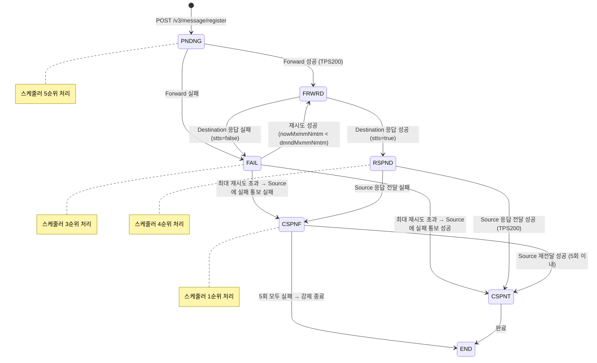
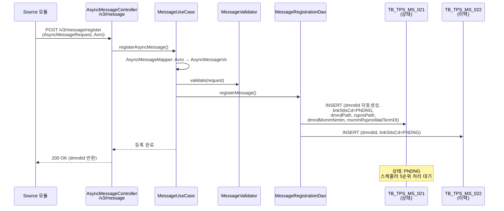
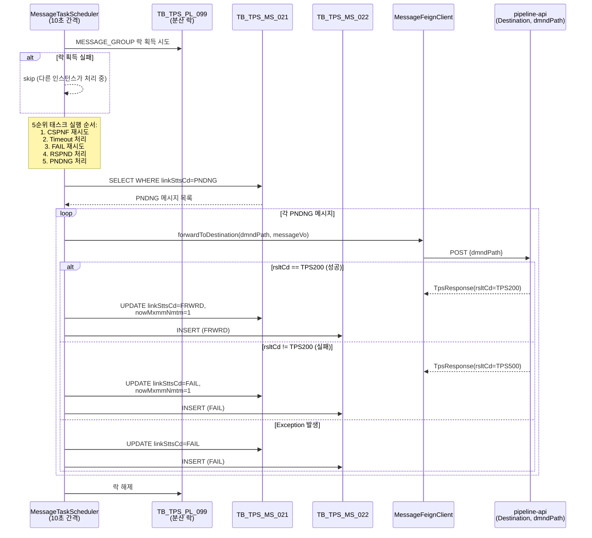
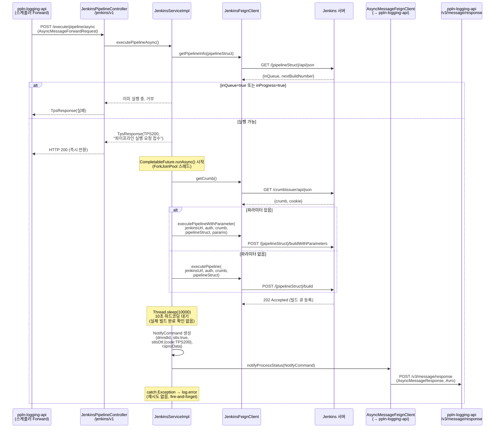
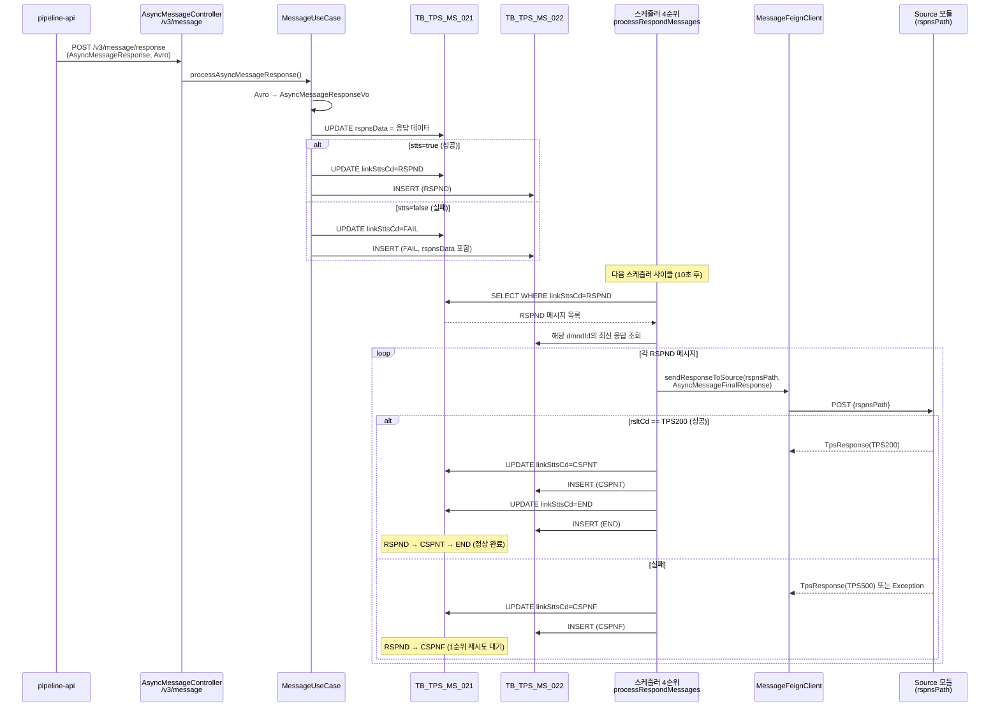
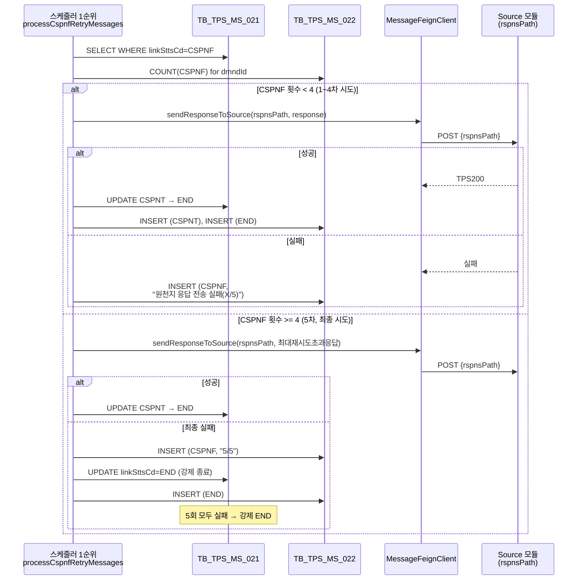
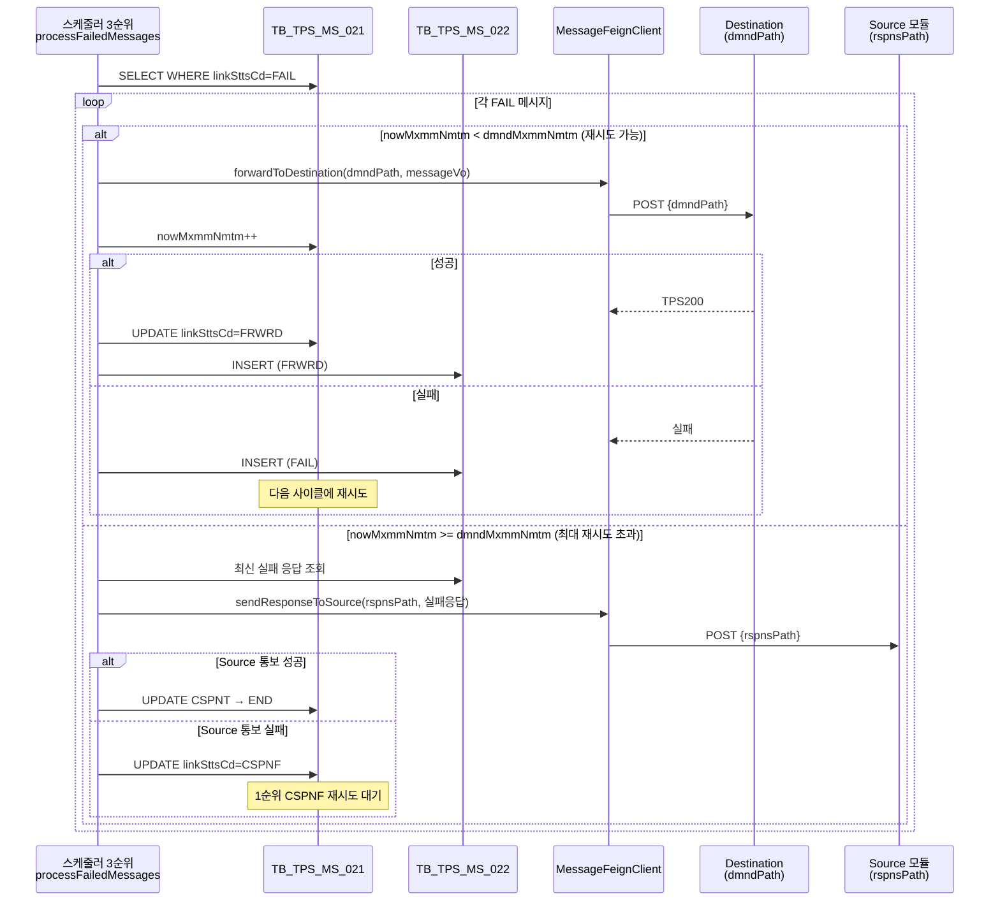
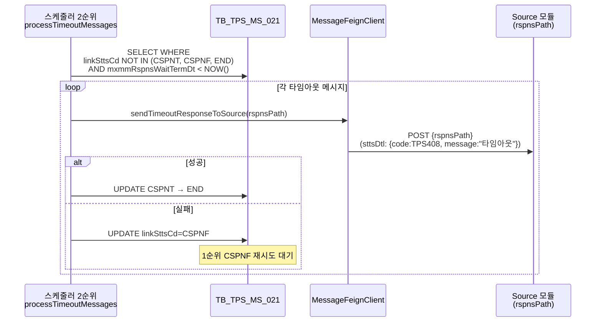
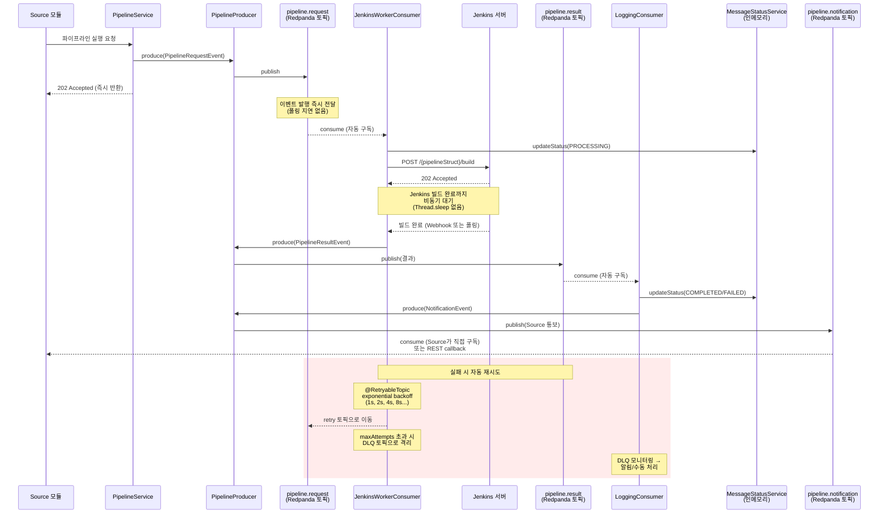
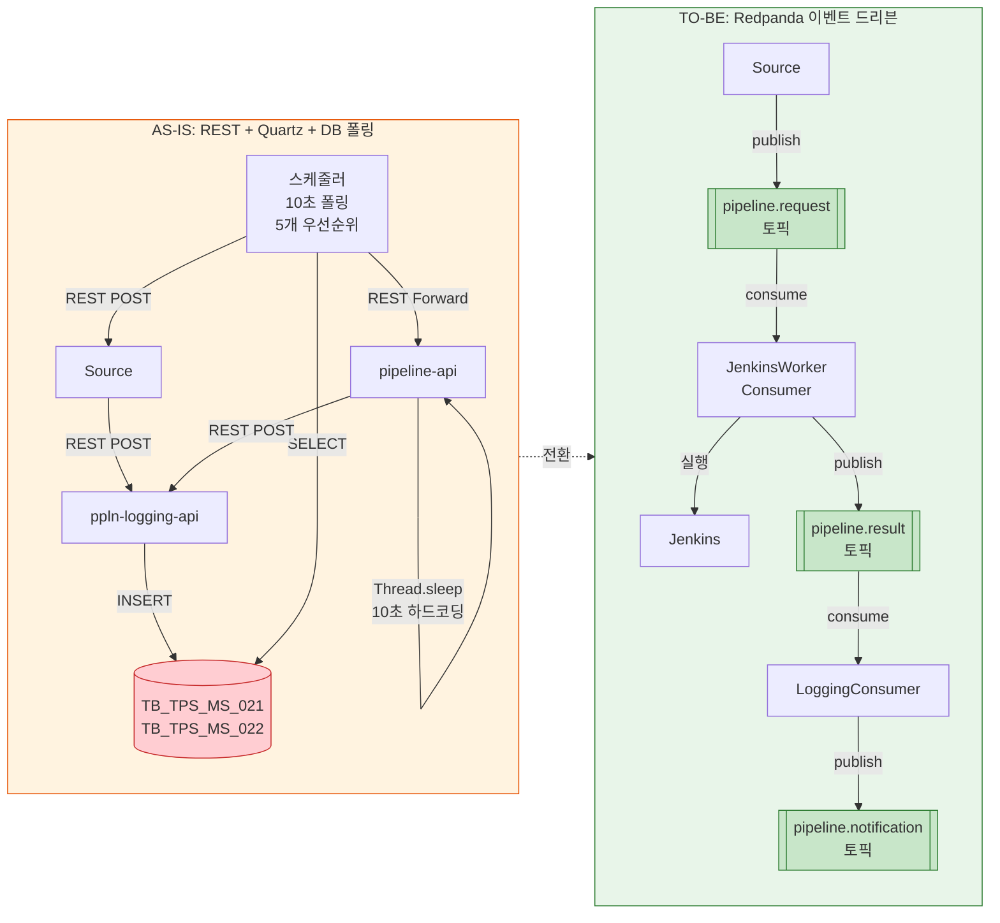

# TPS 비동기 메시지 흐름도: REST → Redpanda 전환

TPS의 pipeline-api ↔ ppln-logging-api 간 REST 기반 비동기 통신의 실제 전체 흐름과, Redpanda 메시지큐로 대체했을 때의 개선 흐름을 비교하는 문서.

> 매핑 테이블은 [README.md](README.md#tps-패턴-매핑-ch07) 참고

---

## 메시지 상태 생명주기

ppln-logging-api는 `TB_TPS_MS_021`(상태 테이블)과 `TB_TPS_MS_022`(이력 감사 로그, append-only)로 메시지를 관리한다. 모든 상태 전이마다 MS_022에 이력이 기록된다.

| 상태 | 코드 | 설명 | 스케줄러 우선순위 |
|------|------|------|------------------|
| PNDNG | PENDING | 메시지 등록 완료, Forward 대기 | 5순위 |
| FRWRD | FORWARD | Destination으로 전달 완료, 응답 대기 | - |
| RSPND | RESPOND | Destination에서 응답 수신, Source 전달 대기 | 4순위 |
| CSPNT | COMPLETE | Source에 최종 응답 전달 성공 | - |
| CSPNF | RESPONSE_FAILED | Source 응답 전달 실패 (최대 5회 재시도) | 1순위 |
| FAIL | FAILURE | Destination Forward 실패 (재시도 가능) | 3순위 |
| END | END | 종료 (최종 상태) | - |

> Timeout 처리는 2순위로, 어떤 상태에서든 `mxmmRspnsWaitTermDt < NOW()` 이면 Source에 타임아웃 응답을 보낸다.

---

## AS-IS: 전체 상세 시퀀스 (소스코드 기반)

### Phase 1: 메시지 등록

Source 모듈(예: 외부 시스템)이 ppln-logging-api에 비동기 메시지를 등록한다. 이 시점에서 어디로 Forward할지(`dmndPath`), 결과를 어디로 돌려줄지(`rspnsPath`), 최대 재시도 횟수(`dmndMxmmNmtm`), 타임아웃(`mxmmRspnsWaitTerm`)이 함께 등록된다.

### Phase 2: 스케줄러 Forward (PNDNG → FRWRD/FAIL)

`MessageTaskScheduler`가 10초 간격으로 실행되며, 분산 락(`TB_TPS_PL_099`)을 획득한 인스턴스만 처리한다. 5개 우선순위 태스크를 순차 실행하며, PNDNG 처리는 5순위(마지막)이다.

### Phase 3: pipeline-api Jenkins 실행

ppln-logging-api 스케줄러가 dmndPath(예: `/jenkins/v1/execute/pipeline/async`)로 Forward하면, pipeline-api가 수신하여 Jenkins 빌드를 트리거한다. **HTTP 200을 즉시 반환**한 뒤, `CompletableFuture.runAsync()`로 비동기 실행하고 **Thread.sleep(10000)으로 10초 하드코딩 대기** 후 결과를 ppln-logging-api에 통보한다.

### Phase 4: 응답 수신 및 Source 전달 (RSPND → CSPNT → END)

ppln-logging-api가 pipeline-api로부터 응답을 받으면 RSPND로 전이하고, 스케줄러 4순위 태스크가 Source에 최종 응답을 전달한다.

### Phase 5: 재시도 흐름

#### 5-1. CSPNF 재시도 (1순위, Source 응답 전달 재시도)

Source에 응답 전달이 실패하면 최대 5회 재시도한다. 5회 모두 실패하면 강제 END 처리된다.

#### 5-2. FAIL 재시도 (3순위, Destination Forward 재시도)

Destination으로의 Forward가 실패하면 `dmndMxmmNmtm`(메시지별 설정)까지 재시도한다. 최대 횟수를 초과하면 Source에 실패 결과를 통보한다.

### Phase 6: 타임아웃 처리 (2순위)

등록 시 설정한 `mxmmRspnsWaitTermDt` 시간을 초과하면 어떤 상태에서든(END, CSPNT, CSPNF 제외) 타임아웃으로 처리한다.

---

## AS-IS 문제점 분석

소스코드에서 확인된 핵심 문제:

| # | 문제 | 위치 | 영향 |
|---|------|------|------|
| 1 | **Thread.sleep(10000) 하드코딩** | `JenkinsServiceImpl:237` | Jenkins 빌드 완료 여부와 무관하게 10초 후 성공으로 통보. 실제 빌드가 10초 이상 걸리면 거짓 성공 |
| 2 | **Jenkins 상태 폴링 미구현** | `LoggingComponentV4` (주석 처리) | 빌드 진행률 추적 불가, 실패 감지 불가 |
| 3 | **fire-and-forget 패턴** | `CompletableFuture.runAsync()` | 통보 실패 시 재시도 없음, 예외는 로그만 남김 |
| 4 | **10초 폴링 지연** | `MessageTaskScheduler` | 최악의 경우 메시지 하나에 상태 전이마다 10초 지연 (등록→전달→응답→완료: 최소 30~40초) |
| 5 | **단일 스레드 스케줄러** | `SchedulerConfig(poolSize=1)` | 메시지 수 증가 시 병목, 5개 태스크가 순차 실행 |
| 6 | **DB 폴링 부하** | 매 10초마다 5개 SELECT | 메시지 누적 시 DB 부하 증가 |
| 7 | **Jenkins Webhook 미사용** | pipeline-api 전체 | 빌드 완료 이벤트를 받지 않고 하드코딩 대기 |

---

## TO-BE: Redpanda 이벤트 드리븐 흐름

AS-IS의 문제점을 해결하는 이벤트 기반 아키텍처. DB 폴링과 스케줄러를 토픽 기반 즉시 전달로 대체하고, Thread.sleep을 이벤트 구독으로 대체한다.

---

## AS-IS vs TO-BE 비교

| 비교 항목 | AS-IS (REST + Quartz) | TO-BE (Redpanda) |
|-----------|----------------------|------------------|
| **통신 방식** | REST 동기 호출 + DB 폴링 (10초 간격) | 토픽 기반 이벤트 구독 (즉시 전달) |
| **메시지 전달 지연** | 최소 10초 (스케줄러 사이클 대기) | 수 밀리초 (이벤트 발행 즉시) |
| **Jenkins 대기** | `Thread.sleep(10000)` 하드코딩 (빌드 완료 확인 없음) | 이벤트 기반 비동기 대기 (실제 완료 시점 감지) |
| **상태 관리** | DB 2개 테이블 (MS_021 상태 + MS_022 이력) | 인메모리 (PoC) / 토픽 오프셋 기반 |
| **재시도 (Destination)** | 스케줄러 3순위, `dmndMxmmNmtm`까지 10초 간격 | `@RetryableTopic` exponential backoff |
| **재시도 (Source)** | 스케줄러 1순위, 최대 5회 10초 간격 | `@RetryableTopic` + DLQ 자동 격리 |
| **타임아웃** | `mxmmRspnsWaitTermDt` 비교 (스케줄러 2순위) | Consumer timeout + DLQ |
| **동시 처리** | 단일 스레드 (poolSize=1), 5태스크 순차 실행 | Consumer 파티션별 병렬 처리 |
| **결합도** | FeignClient 강결합 (URL 직접 지정) | 토픽으로 느슨한 결합 (Producer/Consumer 독립) |
| **분산 락** | TB_TPS_PL_099 (DB 기반 분산 락) | Kafka Consumer Group (내장 파티션 할당) |
| **감사 로그** | TB_TPS_MS_022 append-only | 토픽 자체가 이벤트 로그 (retention 설정) |
| **확장성** | 스케줄러 인스턴스 1개만 처리 가능 | Consumer 인스턴스 추가로 수평 확장 |
