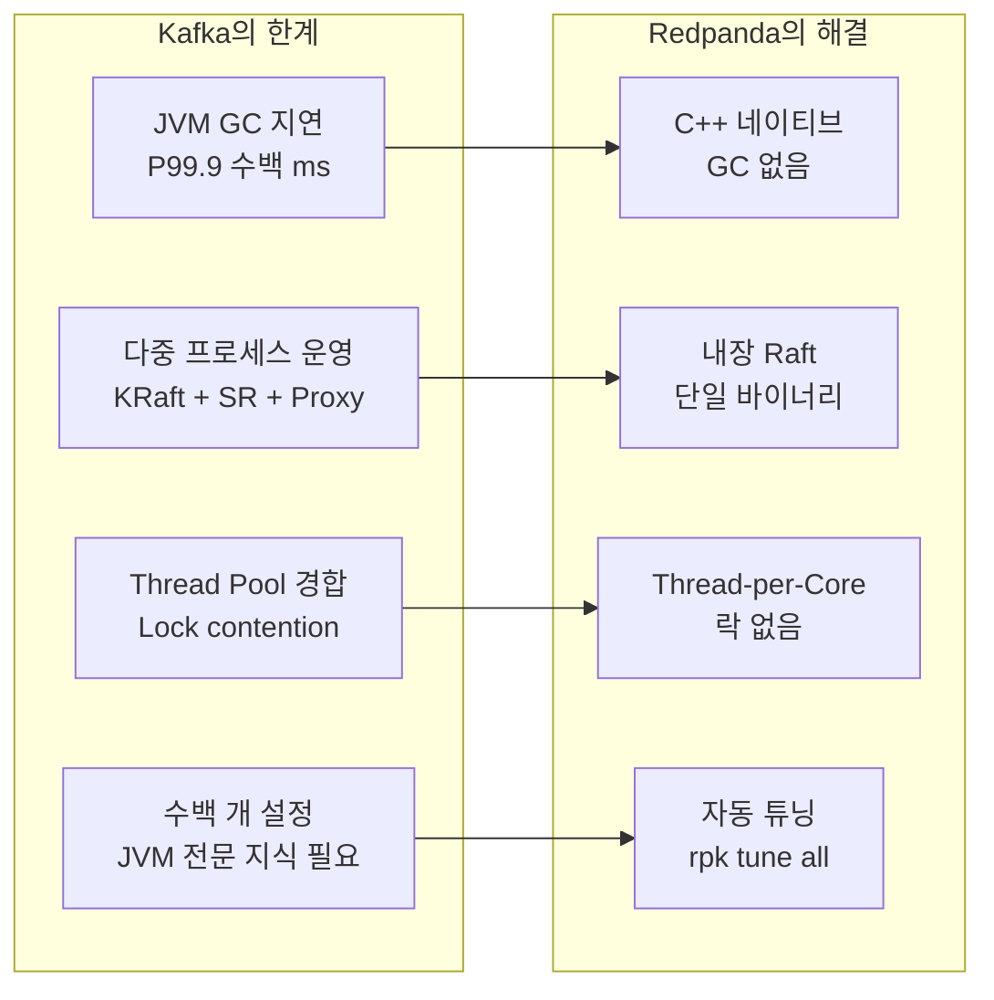
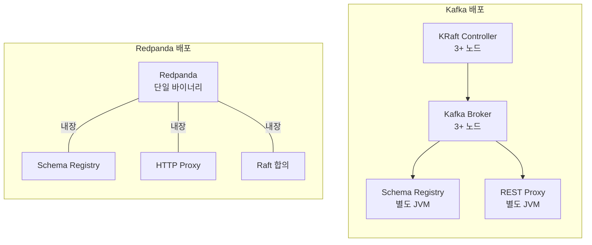
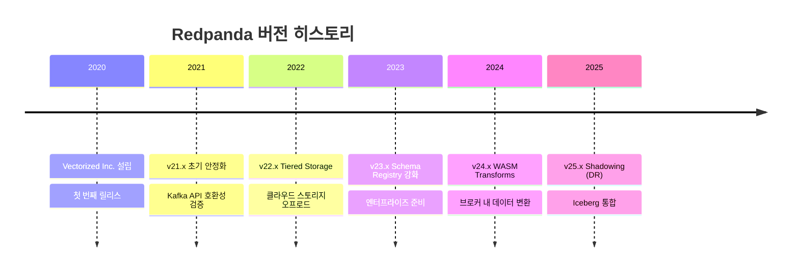

# 01. Redpanda Overview

Redpanda는 Apache Kafka의 API를 100% 호환하면서, C++로 처음부터 다시 작성한 스트리밍 데이터 플랫폼입니다. 이 문서에서는 Redpanda가 왜 탄생했는지, Kafka의 어떤 근본적 한계를 해결하려 했는지, 그리고 어떤 설계 철학으로 이를 달성했는지 학습합니다.

---

## 1. Redpanda란?

| 항목 | 설명 |
|------|------|
| **출시** | 2020년 (Vectorized Inc., 현 Redpanda Data) |
| **언어** | C++ (Seastar 프레임워크 기반) |
| **프로토콜** | Kafka Protocol 100% 호환 |
| **라이선스** | BSL 1.1 (4년 후 Apache 2.0 자동 전환) |
| **외부 의존성** | 없음 (ZooKeeper, KRaft 불필요) |
| **내장 기능** | Schema Registry, HTTP Proxy, Raft 합의 |

### 왜 Kafka를 개선하는 것이 아니라 새로 작성했는가

"Kafka를 fork해서 고치면 되지 않나?"라는 질문은 자연스럽습니다. 하지만 Redpanda 창업팀(Alexander Gallego 등)이 ground-up rewrite를 선택한 이유는 Kafka의 한계가 **코드 레벨이 아니라 플랫폼 레벨**에 있기 때문입니다.

Kafka는 JVM 위에서 동작합니다. JVM은 Garbage Collection이라는 자동 메모리 관리 메커니즘을 사용하는데, 이것은 범용 애플리케이션에서는 생산성을 높여주지만 **저지연 시스템에서는 근본적인 병목**이 됩니다. GC가 발생하면 애플리케이션의 모든 스레드가 일시 정지(Stop-the-World)되고, 이 정지 시간은 힙 크기에 비례합니다. Kafka 브로커처럼 수십 GB의 힙을 사용하는 시스템에서는 Full GC 한 번에 수백 밀리초가 소요될 수 있습니다.

이 문제를 해결하려면 JVM 자체를 제거해야 합니다. Java 코드를 아무리 최적화해도, GC라는 런타임 특성은 바꿀 수 없습니다. 마찬가지로 ZooKeeper 의존성, thread pool 기반 동시성 모델, OS 페이지 캐시에 의존하는 I/O 전략 모두 Kafka의 아키텍처에 깊이 뿌리박힌 설계 결정입니다. 이들을 바꾸려면 사실상 모든 코드를 새로 작성하는 것과 동일한 작업량이 필요합니다.

Redpanda는 이 판단 하에 Kafka의 **프로토콜(인터페이스)**은 그대로 유지하면서, **내부 구현(엔진)**을 완전히 새로운 기술 스택으로 교체하는 전략을 취했습니다. 기존 Kafka 클라이언트 라이브러리, Kafka Connect, ksqlDB 등 모든 에코시스템을 그대로 활용할 수 있으면서, 성능과 운영 복잡성이라는 두 가지 핵심 문제를 동시에 해결한 것입니다.

---

## 2. Kafka의 한계

Kafka는 LinkedIn에서 시작하여 스트리밍 플랫폼의 사실상 표준(de facto standard)이 되었습니다. 하지만 대규모 프로덕션 환경에서 운영하다 보면 다음과 같은 근본적 한계에 부딪힙니다.

### JVM Garbage Collection 지연

Kafka 브로커는 Java로 작성되어 JVM 위에서 실행됩니다. JVM의 Garbage Collector는 더 이상 참조되지 않는 객체의 메모리를 자동으로 회수하는데, 이 과정에서 **Stop-the-World(STW) pause**가 발생합니다. 모든 애플리케이션 스레드가 멈추고, GC 스레드만 동작하는 시간입니다.

일반적인 Minor GC는 수 밀리초로 끝나지만, 문제는 **Full GC**입니다. Kafka 브로커의 힙이 30-50GB로 설정된 환경에서 Full GC가 발생하면 200-500ms의 STW pause가 나타납니다. 이 시간 동안 브로커는 어떤 요청도 처리하지 못합니다.

금융 거래 시스템에서 P99.9 latency가 500ms라는 것은 **1000건 중 1건이 0.5초 동안 응답하지 않는다**는 의미입니다. 주식 거래에서 0.5초는 가격이 크게 변동할 수 있는 시간이며, 이런 지연이 간헐적으로 발생한다는 점이 더 위험합니다. 예측 불가능한 지연은 시스템 설계에서 가장 다루기 어려운 문제이기 때문입니다.

더 심각한 시나리오도 있습니다. Full GC가 오래 지속되면 KRaft 컨트롤러(또는 Kafka 3.x 이전의 ZooKeeper)는 해당 브로커가 죽었다고 판단하고 **리더 재선출(leader re-election)**을 시작합니다. GC가 끝나서 브로커가 복귀하면 불필요한 파티션 재배치가 발생하고, 이것이 연쇄적으로 다른 브로커에 부하를 가중시키는 **GC storm**으로 이어질 수 있습니다. Kafka 4.0에서 ZooKeeper가 제거되고 KRaft로 전환되었지만, JVM 기반인 한 GC 문제 자체는 해소되지 않습니다.

### 메타데이터 관리: ZooKeeper에서 KRaft로, 그리고 Redpanda

Kafka 3.x 이전까지는 클러스터 메타데이터 관리를 위해 **별도의 ZooKeeper 클러스터**를 운영해야 했습니다. ZooKeeper 자체도 3-5대의 노드로 구성된 분산 시스템이므로, Kafka를 운영한다는 것은 사실상 **두 개의 분산 시스템을 동시에 운영**하는 것을 의미했습니다. ZooKeeper의 split-brain, 세션 타임아웃, 메타데이터 크기 제한 등의 문제로 Kafka 운영 복잡성이 높았습니다.

**Kafka 4.0(2025년 3월)**에서 ZooKeeper가 완전히 제거되고 **KRaft(Kafka Raft)**가 유일한 메타데이터 관리 방식이 되었습니다. KRaft는 Kafka 브로커 내부에서 Raft 합의를 실행하여 ZooKeeper 없이 메타데이터를 관리합니다. 이로써 ZooKeeper 관련 장애 모드가 제거되었고, 대규모 클러스터에서 메타데이터 확장성도 크게 개선되었습니다.

그러나 KRaft가 해결하지 못하는 영역이 있습니다:
- **여전히 JVM 기반**: KRaft 컨트롤러도 JVM에서 실행되므로 GC 지연 문제는 동일합니다
- **별도 프로세스 운영**: Schema Registry, REST Proxy, Kafka Connect는 여전히 독립 JVM 프로세스로 배포해야 합니다
- **컨트롤러 노드 구성**: 대규모 클러스터에서는 전용 KRaft 컨트롤러 노드 3~5대를 별도 구성하는 것을 권장합니다

Redpanda는 이러한 문제를 **처음부터 다른 접근**으로 해결했습니다. 메타데이터와 데이터 모두 동일한 Raft 프로토콜로 복제하며, Schema Registry와 HTTP Proxy까지 단일 바이너리에 내장합니다. 별도 컨트롤러 노드 구성이 불필요하고, GC도 존재하지 않습니다.

### Thread Pool 기반 동시성 모델

Kafka는 전통적인 **thread pool** 모델을 사용합니다. 네트워크 요청을 처리하는 스레드, I/O를 처리하는 스레드, 복제를 처리하는 스레드 등이 분리되어 있고, 이 스레드들은 공유 자료구조에 접근하기 위해 **락(lock)**을 사용합니다.

락 기반 동시성의 문제는 **lock contention**입니다. 여러 스레드가 동시에 같은 락을 획득하려 하면 대기 시간이 발생합니다. CPU 코어가 16개, 32개, 64개로 늘어날수록 contention은 비례해서 심해지고, 코어를 추가해도 성능이 선형적으로 증가하지 않는 **Amdahl's Law**의 벽에 부딪힙니다.

하드웨어 수준에서는 **cache line bouncing** 문제도 있습니다. 여러 코어가 같은 메모리 영역(락이 보호하는 데이터)에 접근하면, CPU 캐시 일관성(coherence) 프로토콜이 캐시 라인을 코어 간에 끊임없이 전송합니다. 이 과정에서 L1/L2 캐시의 효율이 크게 떨어지고, 실제 계산보다 캐시 동기화에 더 많은 사이클을 소비하게 됩니다.

### 복잡한 설정 관리

Kafka는 **수백 개의 설정 파라미터**를 가지고 있습니다. 브로커 설정, 토픽 설정, Producer/Consumer 설정, JVM 튜닝 파라미터까지 합치면 최적의 성능을 내기 위해 조정해야 할 항목이 방대합니다.

JVM 튜닝만 해도 Heap 크기(`-Xmx`, `-Xms`), GC 알고리즘 선택(G1GC, ZGC), GC 튜닝 파라미터(`-XX:MaxGCPauseMillis`, `-XX:G1HeapRegionSize` 등), Direct Memory 설정 등 전문 지식이 필요합니다. OS 수준에서는 페이지 캐시 크기, 파일 디스크립터 제한, 네트워크 버퍼 크기 등을 추가로 조정해야 합니다.

이런 복잡성은 "Kafka 전문가"라는 역할이 별도로 존재할 정도로 운영 부담을 가중시킵니다. 잘못된 설정 하나가 프로덕션 장애로 이어질 수 있고, 최적 설정은 워크로드에 따라 달라지므로 지속적인 모니터링과 조정이 필요합니다.



---

## 3. Redpanda의 설계 철학

### 외부 의존성 제거의 운영적 의미

Redpanda의 가장 눈에 띄는 특징은 **단일 바이너리(single binary)**입니다. 별도의 Schema Registry 서비스도, REST Proxy도 필요 없습니다. `redpanda` 하나의 프로세스가 모든 기능을 내장합니다.

이것이 단순히 "설치가 편하다"는 수준의 이야기가 아닙니다. Kafka 4.0에서 ZooKeeper가 제거되었지만, 프로덕션 Kafka 스택은 여전히 KRaft 컨트롤러 + Broker + Schema Registry + REST Proxy + Connect 등 **다중 JVM 프로세스**로 구성됩니다. 각 컴포넌트가 독립적으로 장애를 일으킬 수 있고, 컴포넌트 간 통신에서도 장애가 발생할 수 있습니다.

단일 바이너리는 이런 장애 모드를 근본적으로 제거합니다. 프로세스가 살아 있으면 모든 기능이 동작하고, 죽으면 모든 기능이 중단됩니다. 부분적 장애 상태(Schema Registry는 살아 있지만 브로커가 죽은 경우)가 존재하지 않으므로 장애 진단과 복구가 훨씬 단순해집니다.

복구 시간(MTTR, Mean Time To Recovery)도 크게 개선됩니다. Kafka 클러스터를 재시작하려면 KRaft 컨트롤러가 먼저 정상화되어야 하고, 그 위에서 Kafka 브로커가 부트스트랩되어야 합니다. Redpanda는 프로세스 하나를 시작하면 됩니다.



### 하드웨어 성능을 100% 활용하라

Redpanda의 두 번째 설계 원칙은 **"소프트웨어가 하드웨어의 성능을 낭비해서는 안 된다"**입니다.

현대 서버는 128코어 CPU, 수백 GB 메모리, NVMe SSD(수 GB/s 대역폭), 100Gbps 네트워크를 갖추고 있습니다. 하지만 전통적인 소프트웨어 아키텍처(thread pool + 공유 메모리 + 락)에서는 코어가 늘어날수록 동기화 오버헤드가 증가하여, 하드웨어의 이론적 성능의 일부만 활용합니다.

Redpanda는 Seastar 프레임워크의 **thread-per-core** 모델을 채택하여 각 CPU 코어가 독립적으로 동작하게 만들었습니다. 코어 간에 공유하는 데이터가 없으므로 락이 필요 없고, 각 코어는 자신에게 할당된 메모리, 디스크 I/O 큐, 네트워크 연결만 관리합니다. 이 모델에서는 코어를 추가하면 성능이 **거의 선형적으로(near-linearly)** 증가합니다.

메모리 관리도 마찬가지입니다. JVM은 Garbage Collector에게 메모리 회수를 위임하지만, Redpanda는 C++의 **수동 메모리 관리**(실제로는 Seastar의 메모리 할당자)를 사용하여 할당과 해제 시점을 정확히 제어합니다. 예측 불가능한 GC pause 대신, 일정한 메모리 할당/해제 비용만 지불합니다.

I/O 역시 OS 페이지 캐시에 의존하지 않고 **O_DIRECT**로 직접 디스크에 접근합니다. OS가 "최선을 다해" 캐싱하는 것에 의존하는 대신, Redpanda가 자체적으로 핫 데이터를 메모리에 캐싱합니다. 이를 통해 메모리 사용량을 정확히 예측하고 제어할 수 있습니다.

---

## 4. Seastar 프레임워크 소개

### ScyllaDB에서 검증된 C++ 비동기 프레임워크

Redpanda가 독자적으로 만든 것이 아닙니다. **Seastar**는 ScyllaDB(Apache Cassandra의 C++ 재작성)에서 먼저 사용되어 **프로덕션 레벨에서 이미 검증된** 고성능 C++ 프레임워크입니다. ScyllaDB는 Cassandra 대비 10배의 throughput을 달성한 바 있으며, 이 성능의 핵심이 바로 Seastar의 아키텍처입니다.

Seastar는 다음과 같은 핵심 설계 원칙을 따릅니다:

- **Shared-nothing architecture**: 코어 간 데이터 공유 없음. 각 코어는 독립된 메모리 영역, I/O 큐, 네트워크 연결을 소유
- **Cooperative scheduling**: OS의 preemptive scheduling 대신 태스크가 자발적으로 CPU를 양보. Context switch 비용 제거
- **Future/Promise 기반 비동기**: 모든 I/O가 비동기로 처리되며, callback hell 대신 composable future chain 사용
- **사용자 공간 메모리 할당**: malloc/free 대신 Seastar 자체 할당자로 메모리 단편화 최소화

### 왜 C++인가

Redpanda가 Rust, Go 대신 C++를 선택한 데에는 구체적인 기술적 이유가 있습니다.

**Seastar 프레임워크의 존재**가 가장 큰 이유입니다. Seastar는 이미 10년 가까이 성숙한 C++ 프레임워크로, 고성능 네트워크 서버를 위한 비동기 I/O, 메모리 관리, 스케줄링 인프라를 제공합니다. Rust나 Go에는 Seastar에 필적하는 thread-per-core 프레임워크가 Redpanda 개발 시점(2019-2020)에는 존재하지 않았습니다.

**Zero-cost abstraction**도 중요한 요인입니다. C++의 템플릿 메타프로그래밍과 인라인 함수는 추상화 계층을 추가해도 런타임 비용이 발생하지 않습니다. Future chain이 컴파일 타임에 최적화되어 함수 호출 오버헤드 없이 실행됩니다.

**하드웨어 직접 제어**도 필수 조건이었습니다. CPU 캐시 라인 정렬(`alignas`), NUMA-aware 메모리 할당, DPDK를 통한 커널 우회 네트워킹 등 하드웨어 레벨의 최적화는 C++에서 가장 성숙한 생태계를 갖추고 있습니다.

### Thread-per-Core 모델 개요

Seastar의 핵심인 **thread-per-core** 모델은 [02-architecture.md](02-architecture.md)에서 상세히 다룹니다. 여기서는 개요만 소개합니다.

전통적인 서버는 하나의 thread pool에서 수백-수천 개의 스레드가 동작하며, OS 스케줄러가 이를 CPU 코어에 할당합니다. 스레드 간 context switching, 락 경합, 캐시 오염이 필연적으로 발생합니다.

Thread-per-core 모델에서는 **CPU 코어 수만큼의 스레드**만 생성하고, 각 스레드는 하나의 코어에 고정(pinned)됩니다. 요청이 들어오면 해당 요청이 처리될 코어가 결정되고, 그 코어의 스레드가 시작부터 끝까지 처리합니다. 다른 코어와 통신이 필요하면 명시적 메시지 패싱(explicit message passing)을 사용합니다.

### io_uring / AIO 지원

디스크 I/O에서 Seastar는 Linux의 **io_uring**(커널 5.1+) 또는 **AIO(Asynchronous I/O)**를 활용합니다. 전통적인 `read()`/`write()` 시스템 콜은 동기적이라 I/O가 완료될 때까지 스레드가 블록됩니다. io_uring은 submission queue와 completion queue를 통해 **시스템 콜 없이** I/O 요청을 제출하고 완료를 확인할 수 있어, 커널-유저 공간 전환 비용을 극적으로 줄입니다.

Redpanda는 이를 O_DIRECT 플래그와 결합하여, OS 페이지 캐시를 우회하면서도 비동기로 디스크 I/O를 처리합니다. 결과적으로 하나의 코어에서 수천 개의 동시 I/O를 관리하면서도 블로킹이 발생하지 않습니다.

---

## 5. 핵심 특징 요약

### Kafka API 100% 호환

Redpanda는 Kafka 프로토콜을 네이티브로 구현합니다. 이것은 단순히 "비슷하게 동작한다"가 아니라, 기존 Kafka 클라이언트 라이브러리(librdkafka, kafka-python, Sarama 등)가 **코드 변경 없이** 동작한다는 의미입니다.

```java
// 기존 Kafka 코드: bootstrap.servers 주소만 변경하면 동작
Properties props = new Properties();
props.put("bootstrap.servers", "redpanda:9092");  // 주소만 변경

KafkaProducer<String, String> producer = new KafkaProducer<>(props);
producer.send(new ProducerRecord<>("topic", "key", "value"));
```

Kafka Connect, ksqlDB, Debezium, Apache Flink 등 Kafka 에코시스템의 도구들도 Redpanda와 함께 사용할 수 있습니다. 이는 마이그레이션 비용을 극적으로 낮추는 핵심 전략입니다. 기존 Kafka 기반 시스템에서 Redpanda로 전환할 때, 애플리케이션 코드를 수정할 필요가 없습니다.

### 단일 바이너리 배포

Kafka 4.0 환경을 구축하려면 KRaft 컨트롤러(3+노드), Kafka 브로커(3+노드), Schema Registry, REST Proxy를 각각 설치하고 설정해야 합니다. Redpanda는 이 모든 것이 하나의 바이너리에 내장되어 있습니다.

```bash
# Kafka 4.0: 여러 컴포넌트를 순서대로 시작
# 1. KRaft 컨트롤러 포맷 및 시작 (3대)
# 2. 컨트롤러 쿼럼 정상화 대기
# 3. Kafka 브로커 시작 (3대)
# 4. Schema Registry 시작 (별도 JVM)
# 5. REST Proxy 시작 (별도 JVM)

# Redpanda: 단일 명령
docker run -d --name=redpanda redpandadata/redpanda:latest \
  redpanda start --smp 4 --memory 8G
```

Docker Compose로 3노드 클러스터를 구성해도 `redpanda` 이미지 하나면 충분합니다. Kubernetes에서는 Redpanda Operator가 StatefulSet 하나로 전체 클러스터를 관리합니다.

### 자동 튜닝 (rpk tune)

Kafka 운영에서 가장 시간이 많이 드는 작업 중 하나가 OS와 JVM 튜닝입니다. Redpanda는 `rpk` CLI 도구를 통해 시스템 설정을 자동으로 최적화합니다.

```bash
# 시스템에 맞게 자동 최적화: NIC, 디스크 스케줄러, CPU 거버너 등
sudo rpk redpanda tune all

# 튜닝 결과 확인
rpk redpanda tune list
# TUNER                ENABLED  SUPPORTED  ERROR
# aio_events           true     true
# clocksource          true     true
# cpu                  true     true
# disk_irq             true     true
# disk_nomerges        true     true
# disk_scheduler       true     true
# fstrim               true     true
# net                  true     true
# swappiness           true     true
# transparent_hugepages true    true
```

`rpk tune all`은 CPU governor를 performance 모드로 설정하고, 디스크 I/O 스케줄러를 `none`(NVMe에 최적)으로 변경하며, 네트워크 IRQ를 CPU 코어에 균등 분배하고, AIO 이벤트 수를 충분히 높이는 등의 작업을 자동으로 수행합니다. Kafka에서는 이 각각을 수동으로 조사하고 설정해야 합니다.

---

## 6. 라이선스 (BSL 1.1)

### BSL 1.1이란 무엇인가

Redpanda는 **Business Source License 1.1 (BSL 1.1)**을 채택하고 있습니다. 이 라이선스는 MariaDB Corporation이 만든 것으로, 소스 코드는 완전히 공개되지만 **특정 상업적 용도에 제한**이 있는 "source-available" 라이선스입니다.

BSL 1.1의 핵심 메커니즘은 **Change Date**와 **Change License**입니다. 코드가 릴리스된 후 **4년이 지나면 자동으로 Apache License 2.0**으로 전환됩니다. 즉, 2022년에 릴리스된 코드는 2026년에 Apache 2.0이 되어 아무런 제한 없이 사용할 수 있습니다.

### 무엇이 허용되는가

대부분의 사용 시나리오에서 BSL 1.1은 **사실상 오픈소스와 동일**하게 사용할 수 있습니다:

- **내부 시스템**: 사내 데이터 파이프라인, 이벤트 스트리밍 등 자유롭게 사용
- **고객 대면 백엔드**: SaaS 제품의 백엔드로 Redpanda를 사용하는 것은 허용
- **개발/테스트**: 어떤 목적으로든 자유롭게 사용
- **수정 및 배포**: 소스 코드를 수정하여 내부적으로 사용하는 것은 허용
- **교육/연구**: 제한 없음

### 무엇이 제한되는가

제한되는 것은 단 하나입니다: **Redpanda를 기반으로 경쟁하는 관리형(managed) Kafka/스트리밍 서비스를 제공하는 것**. 구체적으로, Redpanda의 코드를 사용하여 Confluent Cloud나 Amazon MSK 같은 "Kafka-as-a-Service"를 만들어 판매하는 것이 제한됩니다.

### 엔터프라이즈 도입 시 고려사항

BSL 1.1은 기업의 법무/컴플라이언스 검토에서 종종 논의 대상이 됩니다. "오픈소스만 사용 가능"이라는 내부 정책이 있는 조직에서는 BSL이 OSI 인증 오픈소스가 아니라는 점이 장벽이 될 수 있습니다.

하지만 실질적으로 대부분의 기업 사용 패턴(내부 인프라, 백엔드 서비스)은 BSL 제한에 해당하지 않습니다. 4년 후 Apache 2.0 자동 전환이라는 안전장치도 있으므로, "벤더 락인" 우려도 제한적입니다. 의사결정 시에는 조직의 라이선스 정책과 실제 사용 패턴을 매칭하여 판단하는 것이 합리적입니다.

---

## 7. 버전 히스토리



### v21.x — 초기 안정화 (2021)

Redpanda의 첫 번째 안정 릴리스 시리즈입니다. 이 버전의 핵심 과제는 **"C++로 재작성한 Kafka가 실제로 프로덕션에서 동작하는가?"**를 증명하는 것이었습니다. Kafka 프로토콜의 주요 API(Produce, Fetch, Metadata, Offset 등)를 호환하고, 3노드 클러스터에서 안정적으로 데이터를 복제하는 것이 확인되었습니다. 이 시기에 많은 얼리 어답터들이 "정말 코드 수정 없이 Kafka 클라이언트가 동작하는지" 검증했습니다.

### v22.x — Tiered Storage (2022)

**Tiered Storage**는 Redpanda의 엔터프라이즈 전략에서 전환점이 된 기능입니다. 오래된 세그먼트를 로컬 NVMe SSD에서 S3, GCS 같은 오브젝트 스토리지로 자동 오프로드하여, **로컬 디스크 비용을 절감하면서도 데이터 보존 기간을 사실상 무제한으로 늘릴 수 있게** 되었습니다. Consumer는 투명하게 원격 세그먼트를 읽을 수 있으며, 캐싱 레이어가 자주 접근되는 데이터의 성능을 보장합니다.

### v23.x — Schema Registry 강화 (2023)

엔터프라이즈 환경에서 Schema Registry는 선택이 아닌 필수입니다. v23.x에서는 내장 Schema Registry의 **호환성 검증 규칙**(BACKWARD, FORWARD, FULL 등)이 강화되고, Avro/Protobuf/JSON Schema 지원이 안정화되었습니다. 이를 통해 Confluent Schema Registry를 별도로 운영하지 않아도 되는 수준의 기능 완성도를 달성했습니다.

### v24.x — WASM Transforms (2024)

**Data Transforms**는 WASM(WebAssembly) 기반으로 **브로커 내에서 데이터 변환 로직을 실행**하는 기능입니다. 기존에는 Kafka Streams, Flink 같은 별도 프로세싱 레이어가 필요했던 간단한 변환(필드 마스킹, 포맷 변환, 라우팅 등)을 브로커 자체에서 처리할 수 있게 되었습니다. 네트워크 홉이 줄어들어 지연시간이 개선되고, 별도 클러스터 운영 부담이 사라집니다.

### v25.x — Shadowing & Iceberg 통합 (2025)

v25.x의 **Shadowing**은 재해 복구(DR) 기능으로, 원격 클러스터로 **오프셋을 보존하면서 비동기 복제**합니다. 장애 발생 시 Consumer가 정확히 마지막으로 처리한 지점부터 다시 시작할 수 있어, RPO(Recovery Point Objective)를 최소화합니다.

**Apache Iceberg 통합**(AWS Glue Catalog 연동 포함)은 스트리밍과 배치 분석의 경계를 허물었습니다. Redpanda 토픽의 데이터를 Iceberg 테이블로 자동 내보내면, Spark, Trino, Athena 등의 쿼리 엔진에서 실시간에 가까운 데이터를 SQL로 분석할 수 있습니다. 이는 **데이터 레이크하우스(lakehouse)** 아키텍처로의 수렴을 의미합니다.

---

## 참고

### 공식 자료

- [Redpanda Documentation](https://docs.redpanda.com)
- [Redpanda GitHub](https://github.com/redpanda-data/redpanda)
- [Seastar Framework](https://seastar.io/)

### 학습 문서 연결

- [02-architecture.md](02-architecture.md) — Thread-per-core, Raft, 파티션 구조 상세
- [06-log-storage.md](06-log-storage.md) — 로그 기반 스토리지, 세그먼트, 인덱스, Compaction 상세
