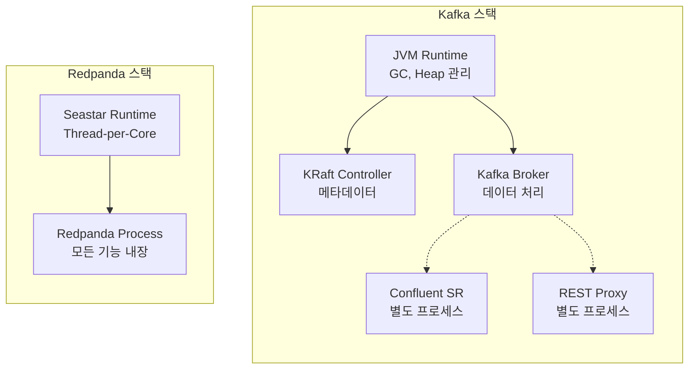
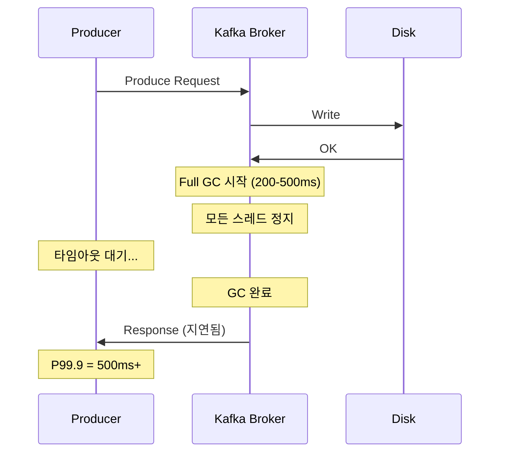
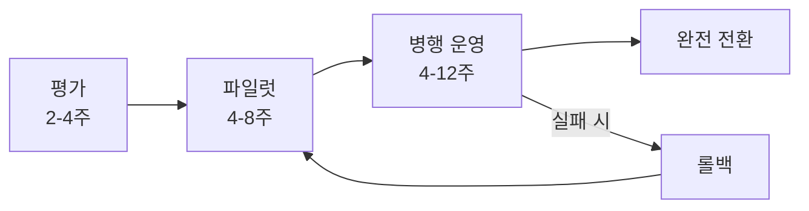
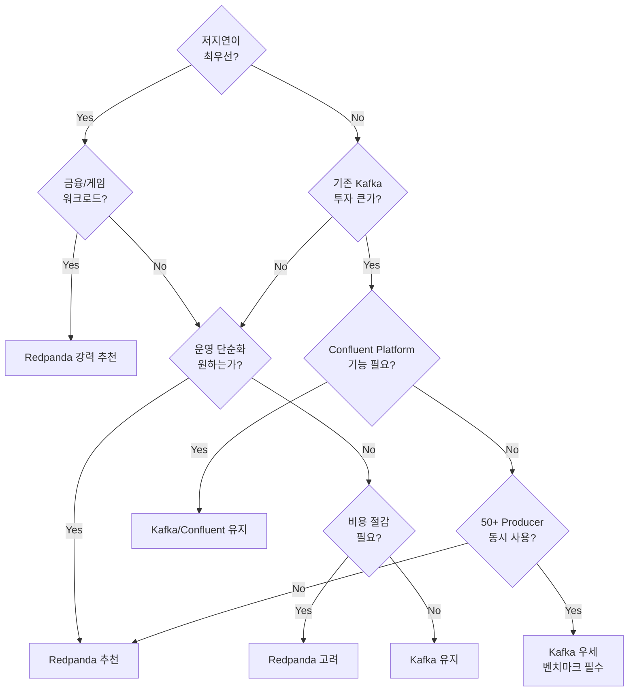

# 02. Kafka vs Redpanda 상세 비교

2026년 관점에서 두 플랫폼의 기술적 차이, 성능 벤치마크, 마이그레이션 전략을 분석합니다. 단순한 기능 비교가 아니라, 각 설계 결정이 **왜** 중요한지를 이해하는 것이 목표입니다.

---

## 1. 아키텍처 비교

### 비교 테이블

| 구성요소 | Kafka | Redpanda |
|---------|-------|----------|
| **언어** | Java/Scala | C++ |
| **런타임** | JVM | Native (Seastar) |
| **스레딩** | Thread Pool + Locks | Thread-per-Core (Lock-free) |
| **메타데이터** | KRaft (4.0부터 ZK 완전 제거) | 내장 Raft (Day 1부터) |
| **데이터 복제** | ISR (In-Sync Replicas) | Raft Quorum |
| **Schema Registry** | 별도 프로세스 (Confluent) | 내장 |
| **HTTP Proxy** | 별도 프로세스 (REST Proxy) | 내장 (Pandaproxy) |
| **설정** | 수동 튜닝 필요 | 자동 튜닝 (rpk tune) |

### 각 차이가 왜 중요한가

#### Language: Java vs C++

Kafka가 Java/Scala로 작성된 것은 초기 LinkedIn 시절의 합리적인 선택이었습니다. JVM은 풍부한 에코시스템, 자동 메모리 관리, 크로스 플랫폼 호환성을 제공합니다. 하지만 JVM은 **추상화 계층(abstraction layer)** 입니다. 애플리케이션 코드와 하드웨어 사이에 JIT 컴파일러, Garbage Collector, Memory Manager가 존재합니다.

C++는 하드웨어를 **직접 제어**할 수 있습니다. 메모리 할당 시점, CPU 캐시 라인 활용, I/O 스케줄링을 개발자가 결정합니다. Redpanda가 C++를 선택한 이유는 명확합니다. 메시지 브로커는 본질적으로 **I/O 바운드 시스템**이며, 하드웨어 자원을 얼마나 효율적으로 활용하느냐가 성능을 결정하기 때문입니다.

실무적 영향은 다음과 같습니다. Kafka 클러스터에서 동일한 처리량을 달성하려면 Redpanda보다 더 많은 노드가 필요할 수 있습니다. Redpanda는 단일 노드에서 하드웨어의 이론적 한계에 더 가까운 성능을 추출합니다.

#### Runtime: JVM Memory Model vs Native Memory Management

JVM의 메모리 모델에서 가장 큰 문제는 **Heap Pressure**입니다. Kafka Broker는 일반적으로 6-12GB의 JVM Heap을 할당받습니다. 이 Heap 안에서 메시지 처리, 인덱싱, 복제 관련 객체가 생성되고 소멸됩니다.

Heap이 가득 차면 Garbage Collector가 작동합니다. Minor GC는 Young Generation만 정리하므로 10-50ms 수준이지만, Old Generation까지 정리하는 Full GC는 **200-500ms의 Stop-the-World pause**를 유발합니다. 이 시간 동안 Broker의 모든 스레드가 정지합니다. Producer 요청은 응답을 받지 못하고, Consumer fetch는 타임아웃됩니다.

Redpanda는 Seastar 프레임워크 위에서 동작하며, 메모리를 **코어별로 분할(shard)** 하여 관리합니다. 각 코어는 자신만의 메모리 풀을 가지며, 다른 코어의 메모리에 접근하지 않습니다. GC가 존재하지 않으므로 Stop-the-World pause도 없습니다.

#### Threading: Thread Pool vs Thread-per-Core

Kafka는 전통적인 **Thread Pool** 모델을 사용합니다. Network Thread가 요청을 받으면 Request Queue에 넣고, IO Thread Pool이 이를 처리합니다. 여러 스레드가 공유 자원(파티션 메타데이터, 로그 파일 등)에 접근할 때 **Lock 경합(contention)** 이 발생합니다. 코어 수가 늘어날수록 Lock 경합이 증가하여 스케일링 효율이 떨어집니다.

Redpanda의 Thread-per-Core 모델은 근본적으로 다릅니다. 각 CPU 코어에 하나의 스레드가 배정되고, 파티션도 특정 코어에 고정(pinning)됩니다. 코어 간 통신은 Lock 대신 **메시지 패싱(message passing)** 으로 이루어집니다. Lock이 없으므로 코어 수에 비례하여 성능이 선형적으로 증가합니다.

다만 이 모델의 단점도 존재합니다. 특정 파티션에 트래픽이 집중되면 해당 코어만 과부하되고 다른 코어는 유휴 상태가 됩니다. 이 **핫스팟 문제(hot partition)** 는 섹션 2에서 더 자세히 다룹니다.

#### Metadata: KRaft vs Built-in Raft

Kafka는 오랫동안 ZooKeeper에 의존하여 메타데이터(브로커 목록, 토픽 설정, 컨트롤러 선출 등)를 관리했습니다. **Kafka 4.0(2025년 3월)**에서 ZooKeeper가 완전히 제거되고, KRaft(Kafka Raft)가 유일한 메타데이터 관리 방식이 되었습니다. KRaft는 Kafka 브로커 내부에서 Raft 합의를 실행하므로, 별도의 ZooKeeper 클러스터가 더 이상 필요하지 않습니다.

그러나 KRaft에도 한계가 있습니다. 첫째, KRaft 컨트롤러 노드를 별도로 구성하거나 브로커와 결합(combined) 모드로 운영할지 결정해야 합니다. 대규모 클러스터에서는 전용 컨트롤러 노드 3~5대를 권장합니다. 둘째, Schema Registry, REST Proxy, Kafka Connect 등은 여전히 **별도의 JVM 프로세스**로 운영해야 하므로, 전체 스택의 복잡성은 ZooKeeper 제거만으로 완전히 해소되지 않습니다.

Redpanda는 **처음부터 Raft를 내장**하여 설계되었습니다. 메타데이터와 데이터 모두 동일한 Raft 프로토콜로 복제됩니다. 별도 컨트롤러 노드 구성이 불필요하고, Schema Registry와 HTTP Proxy까지 단일 바이너리에 내장되어 있으므로 외부 의존성이 없습니다.

#### Data Replication: ISR vs Raft Quorum

Kafka의 ISR(In-Sync Replicas) 모델은 **동적(dynamic)** 입니다. 리더가 팔로워의 복제 상태를 모니터링하여, 뒤처진 팔로워를 ISR에서 제거하고 따라잡으면 다시 추가합니다. 이 유연성은 장점이지만, ISR이 축소되면 데이터 안전성이 저하될 수 있습니다. 극단적인 경우 ISR에 리더만 남으면 단일 장애점(SPOF)이 됩니다.

Redpanda의 Raft Quorum 모델은 **수학적(mathematical)** 입니다. `N`개 노드 중 `(N/2)+1`개가 응답해야 쓰기가 성공합니다. 3개 노드 중 2개, 5개 노드 중 3개가 항상 필요합니다. ISR처럼 동적으로 축소되지 않으므로 일관성 보장이 더 강력합니다. 대신 일시적으로 느린 팔로워가 있으면 쓰기 지연이 증가할 수 있습니다.

#### Built-in Components: 별도 배포 vs 통합 바이너리

Kafka 에코시스템에서 Schema Registry, REST Proxy, Kafka Connect는 모두 **별도의 JVM 프로세스**입니다. 각각 독립적인 배포, 설정, 모니터링이 필요합니다. 프로덕션 환경에서 이 모든 컴포넌트를 안정적으로 운영하는 것은 상당한 운영 부담입니다.

Redpanda는 Schema Registry와 HTTP Proxy(Pandaproxy)를 **단일 바이너리에 내장**합니다. 별도 프로세스를 관리할 필요가 없으며, 브로커와 동일한 라이프사이클로 운영됩니다.

### 아키텍처 스택 비교



Kafka 스택에서 점선은 별도 프로세스를 의미합니다. 각각 독립적인 JVM 인스턴스로 실행되며, 자체 Heap, GC, 모니터링 설정이 필요합니다. Redpanda는 Seastar 위에 단일 프로세스로 모든 기능을 제공합니다.

---

## 2. 성능 비교

### Redpanda 공식 주장

| 메트릭 | 주장 |
|--------|------|
| Tail Latency | 10x 낮음 |
| 비용 효율성 | 3-6x 효율적 |
| 노드 수 | 3x 적은 노드로 동일 처리량 |
| 테스트 시작 시간 | 2x 빠름 (Testcontainers) |

이 수치는 Redpanda의 **마케팅 자료**에서 가져온 것입니다. 모든 벤더가 자사에 유리한 워크로드와 설정으로 벤치마크를 수행합니다. 실제 성능은 워크로드 패턴, 하드웨어 구성, 네트워크 토폴로지에 따라 크게 달라집니다. 독립적인 검증 없이 이 수치를 액면 그대로 받아들여서는 안 됩니다.

### 독립 벤치마크 심층 분석 (Jack Vanlightly, 2023)

Jack Vanlightly는 Kafka와 Redpanda를 다양한 워크로드에서 독립적으로 벤치마크했습니다. 그의 분석은 두 시스템의 **실제 성능 특성과 한계**를 드러냅니다.

#### Producer 수 증가 시 성능 저하 원인

4개의 Producer에서 50개로 증가시키면 Redpanda의 성능이 상대적으로 저하되는 현상이 관찰되었습니다. 이유는 Thread-per-Core 아키텍처의 구조적 특성에 있습니다.

Redpanda에서 각 파티션은 **특정 코어에 고정**됩니다. 50개의 Producer가 동일한 파티션에 동시에 쓰기를 시도하면, 해당 파티션을 담당하는 코어 하나에 모든 부하가 집중됩니다. 다른 코어들은 유휴 상태인데 한 코어만 과부하되는 **핫스팟** 현상이 발생합니다.

Kafka의 Thread Pool 모델은 이 상황에서 더 유리합니다. 여러 IO 스레드가 동일한 파티션에 대한 요청을 분산 처리할 수 있기 때문입니다. Lock 경합이 발생하지만, 50개 Producer의 동시성을 여러 스레드가 나눠 처리하는 것이 단일 코어에 집중되는 것보다 나을 수 있습니다.

실무적 시사점은 분명합니다. **파티션 수를 코어 수에 맞춰 충분히 늘리면** 이 문제는 완화됩니다. 하지만 워크로드 특성상 소수의 파티션에 많은 Producer가 쓰는 구조라면, Kafka가 유리할 수 있습니다.

#### 장시간 테스트 (12시간+) 지연 증가 원인

초기 몇 시간 동안은 Redpanda가 우수한 지연시간을 보여주지만, 12시간 이상 지속되면 점진적으로 지연이 증가하는 패턴이 관찰되었습니다.

핵심 원인은 **백그라운드 작업의 누적**입니다. 시간이 지나면서 세그먼트 롤링(segment rolling)과 로그 Compaction이 시작됩니다. 이 작업들은 I/O와 CPU를 소비하며, 일반 쓰기/읽기 작업과 경쟁합니다. Redpanda의 O_DIRECT 접근 방식은 OS 페이지 캐시의 도움을 받지 못하므로, 이미 디스크에 기록된 데이터를 다시 읽어야 하는 Compaction에서 추가적인 디스크 I/O가 발생합니다.

Kafka는 시간이 지날수록 OS 페이지 캐시가 **워밍업(warm-up)** 되어, 자주 접근하는 데이터가 메모리에 캐싱됩니다. Compaction 시에도 캐싱된 데이터를 활용할 수 있어 디스크 I/O 부담이 상대적으로 적습니다.

#### 보존 정책(Retention) 도달 시 성능 변동

테스트 시작 후 retention 기간에 도달하면 세그먼트 삭제가 시작됩니다. 이 시점에서 I/O 패턴이 **순수한 순차 쓰기(sequential write)에서 혼합된 읽기/쓰기/삭제 패턴**으로 변합니다.

세그먼트를 삭제하려면 파일 메타데이터를 업데이트하고, 디스크 공간을 회수해야 합니다. 이 과정에서 발생하는 I/O가 쓰기 작업과 경쟁하여 지연시간이 변동합니다. 특히 NVMe SSD에서 TRIM 연산이 동시에 발생하면 쓰기 지연에 영향을 줄 수 있습니다.

#### NVMe 접근 패턴의 변화

Redpanda의 성능 강점 중 하나는 순차 쓰기 최적화입니다. 하지만 높은 동시성(high concurrency) 상황에서는 이 패턴이 변합니다.

여러 코어가 동시에 서로 다른 파티션의 세그먼트에 쓰기를 수행하면, NVMe 디바이스 입장에서는 **여러 위치에 동시에 쓰기**가 발생합니다. 논리적으로는 각각 순차 쓰기이지만, 물리적으로는 랜덤에 가까운 패턴이 됩니다. NVMe의 내부 병렬성(internal parallelism)이 이를 어느 정도 흡수하지만, 극한의 동시성에서는 순차 쓰기의 이점이 줄어듭니다.

### 벤치마크 결과 요약

| 시나리오 | Redpanda 우세 | Kafka 우세 | 비고 |
|---------|:---:|:---:|------|
| 소수 Producer, 저지연 | O | | Thread-per-Core 최적 |
| 다수 Producer (50+) | | O | Thread Pool의 분산 효과 |
| 초기 수 시간 | O | | O_DIRECT 장점 극대화 |
| 장시간 (12h+) | | O | 페이지 캐시 워밍업 효과 |
| P99.9 Tail Latency | O | | GC 부재 |
| Retention 삭제 중 | | O | 혼합 I/O 패턴 |

### 2026 관점: Confluent vs Redpanda 에코시스템

2026년 기준으로 두 플랫폼의 에코시스템은 각각의 강점을 가집니다.

**Confluent Platform / Confluent Cloud:**

Confluent는 Apache Flink와의 통합을 통해 **스트림 프로세싱 전체 파이프라인**을 제공합니다. Kafka Connect의 커넥터 에코시스템은 800개 이상으로 성숙했으며, 대부분의 엔터프라이즈 시스템과 즉시 연동 가능합니다. Confluent Schema Registry는 사실상 업계 표준이며, Schema Evolution 관리 기능이 풍부합니다. ksqlDB를 통한 SQL 기반 스트림 처리도 독자적인 강점입니다.

**Redpanda:**

Redpanda는 **운영 단순성과 비용 효율성**에서 우위를 점합니다. 단일 바이너리 배포로 Day 2 운영 부담이 크게 줄어듭니다. Redpanda Connect(Benthos 기반)는 300개 이상의 커넥터를 제공하며 빠르게 성장하고 있습니다. 클라우드 비용 측면에서 더 적은 노드로 동일 처리량을 달성하므로 TCO(Total Cost of Ownership)가 낮습니다. Edge 배포나 리소스 제한 환경에서도 효과적으로 동작합니다.

선택 기준은 명확합니다. **기존 Kafka 에코시스템에 깊이 투자했거나 Flink/ksqlDB가 필요하다면 Confluent**, **새 프로젝트에서 운영 단순성과 비용 효율을 우선한다면 Redpanda**가 유리합니다.

---

## 3. 메모리 관리 비교

### GC가 P99.9에 미치는 영향

메시지 브로커에서 **Tail Latency**(P99.9, P99.99)는 평균 지연시간보다 훨씬 중요합니다. 평균적으로 빠르더라도 가끔 발생하는 극단적 지연은 전체 시스템의 SLA를 위반시킬 수 있기 때문입니다.

#### Kafka의 정상 운영 시 지연시간

대부분의 시간 동안 Kafka는 우수한 성능을 보여줍니다:

- **P50 (중앙값)**: 2-5ms
- **P99**: 8-15ms
- **P99.9**: 15-30ms

이 수치는 충분히 훌륭하며 대부분의 워크로드에서 문제가 되지 않습니다.

#### Minor GC 발생 시

Young Generation(Eden Space)이 가득 차면 Minor GC가 발생합니다. 일반적으로 초당 수 회에서 분당 수 회 빈도입니다. Minor GC 동안 JVM의 **모든 애플리케이션 스레드가 일시 정지**됩니다.

- **Minor GC pause**: 10-50ms
- **P99.9 영향**: 50-100ms로 스파이크

이 정도의 지연은 대부분의 애플리케이션에서 허용 가능합니다. 하지만 금융 트레이딩이나 실시간 게임 서버처럼 일관된 저지연이 필수인 시스템에서는 문제가 됩니다.

#### Full GC 발생 시

Old Generation이 가득 차면 Full GC가 발생합니다. 빈도는 낮지만(수 시간에 한 번), 발생하면 치명적입니다.

- **Full GC pause**: 200ms - 2초 (Heap 크기에 비례)
- **P99.99 영향**: 수 초 단위의 응답 지연



#### 실제 사례: 금융 시스템

NYSE(뉴욕 증권거래소) 같은 금융 시스템에서 500ms의 지연은 **수백만 달러 가치의 주문 누락**을 의미할 수 있습니다. 장 시작 후 거래량이 폭증하는 시점에 Full GC가 발생하면 주문 매칭이 지연되고, 시장 조성자(market maker)의 호가가 누락됩니다. 이것이 금융 시스템에서 JVM 기반 메시지 브로커를 기피하는 핵심 이유입니다.

물론 Kafka도 GC 튜닝(G1GC, ZGC 적용, Heap 사이즈 최적화)을 통해 이 문제를 완화할 수 있습니다. 하지만 **GC를 튜닝하는 것은 문제를 줄이는 것이지 제거하는 것이 아닙니다**. JVM 위에서 동작하는 한 GC pause의 가능성은 항상 존재합니다.

#### Redpanda의 메모리 관리

Redpanda는 C++로 작성되어 **GC가 존재하지 않습니다**. 메모리 할당과 해제는 Seastar 프레임워크의 메모리 관리자가 코어별로 수행합니다.

- **P50**: 1-3ms
- **P99**: 3-8ms
- **P99.9**: 5-10ms (일관적)
- **P99.99**: 10-15ms (일관적)

P99.9와 P99.99 사이의 차이가 미미합니다. GC라는 불확정 요소가 없기 때문에 지연시간 분포가 **예측 가능(deterministic)** 합니다.

### 메모리 관리 비교 테이블

| 항목 | Kafka (JVM) | Redpanda (C++) |
|------|-------------|----------------|
| GC | Stop-the-World 발생 | GC 없음 |
| Heap 튜닝 | 필요 (-Xmx, -Xms, GC 알고리즘 선택) | 불필요 |
| 메모리 예측 | 어려움 (GC 동작에 따라 변동) | 예측 가능 (코어별 고정 할당) |
| Page Cache | OS 의존 | 자체 관리 (O_DIRECT) |
| Tail Latency | GC로 인한 스파이크 | 일정함 |
| 튜닝 난이도 | 높음 (JVM 전문 지식 필요) | 낮음 (대부분 자동 튜닝) |

---

## 4. 기능 비교 상세

### 호환되는 기능

Redpanda는 Kafka API를 **와이어 프로토콜(wire protocol) 수준에서 호환**합니다. 기존 Kafka 클라이언트 코드를 변경 없이 사용할 수 있다는 의미입니다.

| 기능 | 호환성 | 비고 |
|------|:------:|------|
| Kafka 클라이언트 (0.11+) | O | bootstrap.servers만 변경 |
| kafka-console-producer/consumer | O | 그대로 사용 가능 |
| Kafka Connect | O | Redpanda Connect도 대안 |
| Schema Registry API | O | 내장 SR 제공 |
| Kafka Streams | O | 성능 특성은 다를 수 있음 |
| ksqlDB | O | |
| MirrorMaker 2 | O | 마이그레이션에 활용 |
| ACL (접근 제어) | O | SASL/SCRAM, mTLS 지원 |
| Quotas | O | Producer/Consumer 제한 |

### 미묘한 차이점

호환성 테이블에 O 표시가 있다고 해서 **동일하게 동작한다는 의미는 아닙니다**. 내부 구현이 다르기 때문에 엣지 케이스에서 차이가 발생할 수 있습니다.

#### Transactions

Kafka와 Redpanda 모두 Exactly-Once Semantics(EOS)를 지원하는 트랜잭션을 제공합니다. 하지만 내부 구현이 근본적으로 다릅니다.

Kafka의 트랜잭션은 **ISR 기반 복제** 위에 구축됩니다. Transaction Coordinator가 트랜잭션 상태를 관리하며, 커밋/중단 결정을 ISR 멤버에게 전파합니다. ISR 멤버십이 동적으로 변하므로, 트랜잭션 도중 ISR 축소가 발생하면 복잡한 상황이 될 수 있습니다.

Redpanda의 트랜잭션은 **Raft Quorum 기반**입니다. 트랜잭션 상태 자체도 Raft 로그에 기록되므로 일관성 보장이 더 강력합니다. 그러나 트랜잭션 abort 처리의 일부 엣지 케이스에서 Kafka와 미세한 동작 차이가 보고된 바 있습니다. 트랜잭션을 많이 사용하는 워크로드라면 마이그레이션 전 **충분한 호환성 테스트**가 필요합니다.

#### Exactly-Once Semantics

두 플랫폼 모두 EOS를 지원하지만, Redpanda의 Raft 기반 접근은 기본적으로(by default) 더 강한 일관성을 제공합니다. Kafka에서 `acks=all`과 `min.insync.replicas=2`를 설정해야 달성하는 수준의 내구성을, Redpanda는 Raft Quorum의 기본 동작으로 보장합니다.

#### Kafka Streams

Kafka Streams 애플리케이션은 Redpanda 위에서 완전히 호환됩니다. 코드 변경이 필요 없습니다. 하지만 **성능 특성이 달라질 수 있습니다**.

Kafka Streams는 내부적으로 RocksDB를 사용한 State Store, Changelog Topic을 통한 상태 복구 등 복잡한 메커니즘을 갖습니다. 이 과정에서 발생하는 I/O 패턴이 Redpanda의 O_DIRECT + Thread-per-Core 모델과 어떻게 상호작용하는지는 워크로드에 따라 다릅니다. 일부 경우 Kafka에서보다 빠를 수 있고, 일부 경우 느릴 수 있습니다.

#### Redpanda Connect vs Kafka Connect

Kafka Connect는 Redpanda에서 완전히 호환됩니다. 하지만 Redpanda는 자체적으로 **Redpanda Connect(이전 Benthos)** 라는 대안을 제공합니다.

| 비교 항목 | Kafka Connect | Redpanda Connect |
|----------|--------------|------------------|
| 런타임 | JVM | Go (경량) |
| 커넥터 수 | 800+ | 300+ |
| 설정 방식 | REST API | YAML 선언형 |
| 데이터 변환 | SMT (제한적) | Bloblang (강력한 변환 DSL) |
| 메모리 사용 | 높음 (JVM) | 낮음 (Go) |

Redpanda Connect의 Bloblang DSL은 데이터 변환에서 Kafka Connect의 SMT(Single Message Transform)보다 표현력이 뛰어납니다. 하지만 엔터프라이즈 커넥터(SAP, Salesforce, Snowflake 등)의 가용성은 Kafka Connect 에코시스템이 아직 우위입니다.

---

## 5. 운영 비교

### 설치 복잡도

Kafka 프로덕션 클러스터를 구축하는 과정과 Redpanda의 과정은 복잡도에서 현저한 차이가 있습니다.

**Kafka 프로덕션 설치 (6단계):**

1. **JVM 설치 및 튜닝**: JDK 설치, GC 알고리즘 선택(G1GC, ZGC), Heap 크기 설정, JMX 포트 설정
2. **KRaft 컨트롤러 구성**: 전용 컨트롤러 노드 구성 또는 브로커 결합 모드 설정 (대규모 클러스터는 전용 3~5대 권장)
3. **Kafka Broker 설치**: `server.properties` 설정 (broker.id, listeners, log.dirs, 복제 설정 등 100개 이상의 설정 항목)
4. **Schema Registry 설치**: 별도 JVM 프로세스, Kafka 토픽 기반 스토리지 설정
5. **각 컴포넌트 설정 조정**: JVM 메모리 튜닝, 파일 디스크립터 한도, 네트워크 버퍼 크기
6. **모니터링 구성**: JMX Exporter 설치, Prometheus 연동, Grafana 대시보드 구성

**Redpanda 프로덕션 설치 (3단계):**

1. **단일 바이너리 설치**: `apt install redpanda` 또는 Helm Chart
2. **자동 튜닝**: `rpk redpanda tune all` (CPU, 메모리, 디스크, 네트워크 자동 최적화)
3. **클러스터 구성**: `rpk redpanda config set` (핵심 설정 10여 개)

### 모니터링

| 항목 | Kafka | Redpanda |
|------|-------|----------|
| 메트릭 노출 | JMX (Java 전용) | Prometheus (내장, `/metrics`) |
| 변환 필요 | JMX Exporter 필요 | 불필요 |
| 대시보드 | Grafana 별도 구성 | 공식 Grafana 대시보드 제공 |
| 관리 CLI | kafka-*.sh (복잡) | rpk (직관적) |
| Admin API | 없음 (JMX만) | REST Admin API 내장 |

Kafka의 JMX 기반 모니터링은 Java 생태계에 최적화되어 있지만, 현대적인 DevOps 파이프라인(Prometheus + Grafana)과 연동하려면 **JMX Exporter라는 변환 계층**이 필요합니다. 이 과정에서 메트릭 이름이 달라지거나, 일부 메트릭이 누락될 수 있습니다.

Redpanda는 `/metrics` 엔드포인트에서 바로 Prometheus 형식의 메트릭을 제공합니다. Kubernetes 환경에서 ServiceMonitor를 설정하면 즉시 수집이 시작됩니다.

### 업그레이드 절차

**Kafka 업그레이드:**

Kafka 업그레이드는 **다중 컴포넌트 조율(multi-component coordination)** 이 필요합니다.

1. KRaft 컨트롤러 노드 업그레이드 (전용 모드인 경우)
2. Kafka Broker를 Rolling Restart로 업그레이드
3. inter.broker.protocol.version 업데이트 (별도 Rolling Restart)
4. Schema Registry 업그레이드
5. REST Proxy 업그레이드
6. Kafka Connect 워커 업그레이드

각 단계에서 버전 호환성을 확인해야 하며, 한 컴포넌트의 업그레이드가 다른 컴포넌트에 영향을 줄 수 있습니다.

**Redpanda 업그레이드:**

1. 단일 바이너리 Rolling Restart

Redpanda는 단일 바이너리이므로 한 번의 Rolling Restart로 모든 기능(브로커, Schema Registry, HTTP Proxy)이 함께 업그레이드됩니다. Raft 기반 복제가 리더 전환을 자동 처리하므로 데이터 손실 없이 노드별 순차 재시작이 가능합니다.

---

## 6. 마이그레이션 전략

Kafka에서 Redpanda로의 마이그레이션은 **4단계**로 진행합니다. 중요한 원칙은 **점진적 전환과 롤백 가능성 확보**입니다.



### Phase 1: 평가 단계 (2-4주)

마이그레이션의 성패를 결정하는 가장 중요한 단계입니다.

**워크로드 프로파일링:**

기존 Kafka 클러스터의 실제 사용 패턴을 분석합니다. 단순히 "하루 100GB"가 아니라, 피크 시간대의 순간 처리량, Producer 수, 파티션 분포, Consumer Group 구성을 파악합니다.

```bash
# 토픽별 처리량 확인
kafka-consumer-groups.sh --bootstrap-server kafka:9092 \
  --describe --all-groups

# 토픽별 파티션 수 및 복제 팩터 확인
kafka-topics.sh --bootstrap-server kafka:9092 \
  --describe --topic my-topic
```

**호환성 체크리스트:**

- [ ] Kafka 클라이언트 버전 확인 (0.11+ 필요)
- [ ] 사용 중인 Kafka Connect 커넥터 목록 및 호환성 확인
- [ ] Kafka Streams 앱 존재 여부 및 State Store 크기
- [ ] 트랜잭션 사용 패턴 (EOS, Transactional Producer)
- [ ] ACL/보안 설정 (SASL, SSL/TLS)
- [ ] 커스텀 Serializer/Deserializer 사용 여부

**프로덕션 유사 벤치마크:**

마케팅 자료나 일반 벤치마크가 아닌, **실제 워크로드 패턴**으로 벤치마크해야 합니다. 메시지 크기, 배치 설정, 압축 방식, Producer/Consumer 비율을 실제와 동일하게 재현합니다.

### Phase 2: 파일럿 단계 (4-8주)

비핵심(non-critical) 토픽을 선택하여 Redpanda 클러스터에서 운영합니다.

**파일럿 대상 선정 기준:**

- 장애 시 비즈니스 영향이 낮은 토픽
- 메시지 형식이 단순한 토픽 (Avro/Protobuf보다 JSON 우선)
- Consumer가 적은 토픽 (전환 범위 최소화)

이 단계에서 Redpanda의 운영 특성(rpk CLI, 모니터링, 로그 형식)에 팀이 익숙해지는 것이 중요합니다.

### Phase 3: 병행 운영 (4-12주)

MirrorMaker 2를 사용하여 Kafka와 Redpanda 간 데이터를 동기화하며, 점진적으로 클라이언트를 전환합니다.

**MirrorMaker 2 설정 예시:**

```properties
# mm2.properties
clusters = kafka, redpanda
kafka.bootstrap.servers = kafka-broker1:9092,kafka-broker2:9092
redpanda.bootstrap.servers = redpanda1:9092,redpanda2:9092

# Kafka -> Redpanda 복제
kafka->redpanda.enabled = true
kafka->redpanda.topics = .*

# Consumer Offset 동기화
sync.group.offsets.enabled = true
sync.group.offsets.interval.seconds = 10

# Heartbeat (연결 상태 모니터링)
heartbeats.topic.replication.factor = 3
```

MirrorMaker 2는 토픽 데이터뿐만 아니라 **Consumer Group Offset도 복제**합니다. 이를 통해 Consumer를 Redpanda로 전환해도 마지막으로 읽은 위치부터 이어서 소비할 수 있습니다.

**점진적 클라이언트 전환:**

1. 먼저 Consumer를 Redpanda로 전환 (MirrorMaker가 데이터를 동기화하므로 안전)
2. Consumer가 안정적이면 Producer를 Redpanda로 전환
3. 모든 클라이언트 전환 완료 후 MirrorMaker 중지

### Phase 4: 완전 전환

모든 클라이언트가 Redpanda를 사용하고, 안정성이 검증되면 기존 Kafka 클러스터를 해제합니다.

**전환 완료 기준 (충족 후 Kafka 해제):**

- [ ] 모든 Producer/Consumer가 Redpanda 사용 중
- [ ] 2주 이상 무장애 운영
- [ ] P99.9 지연시간이 SLA 이내
- [ ] 모니터링/알림이 정상 동작
- [ ] 운영팀이 Redpanda 운영에 익숙

### 롤백 전략

마이그레이션 실패에 대비한 롤백 전략은 **마이그레이션 시작 전에 수립**해야 합니다.

**핵심 원칙: 병행 운영 기간 동안 Kafka 클러스터를 유지합니다.**

롤백이 필요한 경우:

1. MirrorMaker 2를 **역방향(Redpanda -> Kafka)** 으로 설정하여 Redpanda에 쓰인 최신 데이터를 Kafka로 동기화
2. 클라이언트의 bootstrap.servers를 Kafka로 복구
3. 롤백 원인을 분석하고 Phase 2로 돌아가 재시도

```properties
# 역방향 MirrorMaker 설정
redpanda->kafka.enabled = true
redpanda->kafka.topics = .*
```

**Kafka 해제 시점**: 모든 전환 완료 기준을 충족하고, 최소 2주의 안정 운영 후 Kafka 클러스터를 해제합니다. 이 기간이 롤백 윈도우(rollback window)입니다.

---

## 7. 선택 의사결정 트리

플랫폼 선택은 기술적 우열이 아니라 **워크로드 특성과 조직 상황**에 따라 결정해야 합니다.



### 시나리오별 권장 사항

| 시나리오 | 권장 | 근거 |
|---------|------|------|
| 금융 트레이딩 시스템 | Redpanda | GC 없는 일관된 P99.9 |
| 대규모 IoT 데이터 수집 | Redpanda | 낮은 리소스 사용, Edge 배포 가능 |
| 기존 Kafka + Flink 파이프라인 | Kafka 유지 | 마이그레이션 비용 > 이점 |
| 엔터프라이즈 CDC (Change Data Capture) | Kafka/Confluent | Debezium, 풍부한 커넥터 |
| 새 마이크로서비스 이벤트 버스 | Redpanda | 운영 단순성, 빠른 시작 |
| 50+ Producer 고동시성 | 벤치마크 필수 | Thread Pool vs Thread-per-Core 트레이드오프 |
| Kubernetes-native 배포 | Redpanda | 단일 바이너리, 낮은 리소스 풋프린트 |
| 규제 환경 (은행, 보험) | Kafka/Confluent | 더 긴 실전 검증 기간, 규제 레퍼런스 |

### 잘못된 선택을 하는 패턴

다음과 같은 이유로 플랫폼을 선택하면 후회할 가능성이 높습니다:

- **"Redpanda가 새롭고 멋지니까"**: 기술적 판단 없는 트렌드 추종
- **"Kafka가 업계 표준이니까"**: 워크로드 특성을 무시한 관성적 선택
- **"벤치마크에서 X가 더 빠르니까"**: 마케팅 벤치마크를 자신의 워크로드로 오인
- **"마이그레이션이 쉽다고 하니까"**: 호환성 != 동일한 동작

올바른 접근은 **자신의 워크로드로 직접 벤치마크하고, 운영 역량을 고려하여 결정**하는 것입니다.

---

## 참고

### 공식 문서
- [Redpanda vs Kafka Comparison](https://www.redpanda.com/compare/redpanda-vs-kafka)
- [Confluent vs Redpanda 2026](https://www.automq.com/blog/confluent-vs-redpanda-in-2026)
- [Redpanda Migration Guide](https://docs.redpanda.com/current/migrate/migrate-from-kafka/)

### 독립 분석
- [Jack Vanlightly - Kafka vs Redpanda Performance](https://jack-vanlightly.com/blog/2023/5/15/kafka-vs-redpanda-performance-do-the-claims-add-up)

### 시리즈 내 교차 참조
- [01-overview.md](./01-overview.md): Redpanda 개요 및 핵심 특징
- [02-architecture.md](./04-architecture.md): Thread-per-Core, Raft, Seastar 아키텍처 상세
- [05-use-cases.md](./05-use-cases.md): 워크로드별 적용 시나리오
- [06-log-storage.md](./12-log-storage.md): 로그 기반 스토리지, O_DIRECT, 세그먼트 구조
