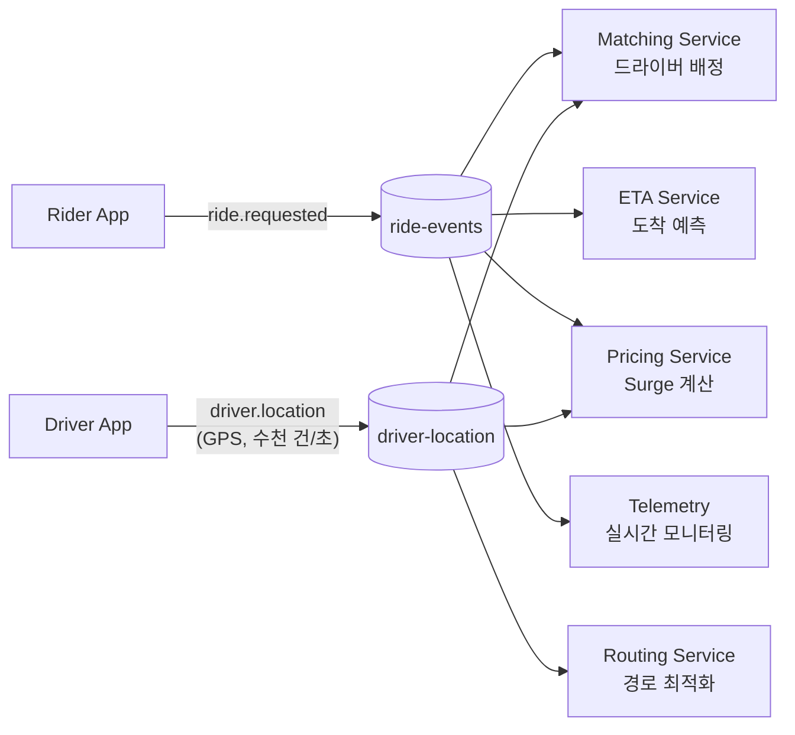
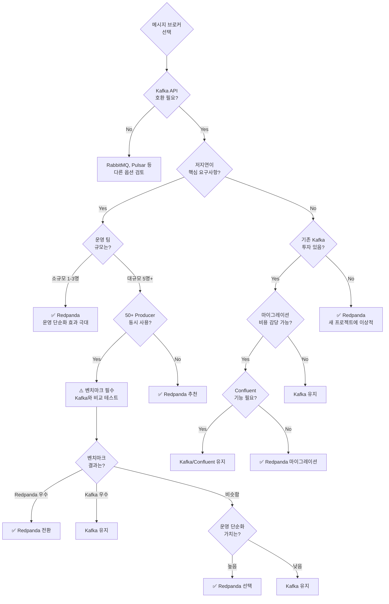

# 03. Use Cases & Selection Guide

실제 프로덕션 사례, 선택 가이드, 면접 대비

---

## 실제 프로덕션 사례 (2024-2025)

### NYSE (뉴욕증권거래소)

뉴욕증권거래소는 Redpanda 도입으로 기존 Kafka 대비 **4-5배 성능 향상**을 달성했다. 이는 단순히 처리량이 늘어난 것이 아니라, 거래소의 핵심 요구사항인 **예측 가능한 저지연**을 실현했다는 점에서 중요하다.

성능 향상의 원인은 세 가지다. 첫째, C++ 네이티브 구현으로 JVM GC가 없어 버스트 트래픽 시에도 P99.9 지연시간이 sub-millisecond로 일관된다. 둘째, Thread-per-Core 모델(Seastar)로 코어 간 lock contention이 없어 24코어 서버에서 24개의 독립 파이프라인으로 동작한다. 셋째, O_DIRECT I/O로 OS 페이지 캐시를 우회하므로 캐시 히트율과 무관하게 디스크 지연시간이 예측 가능하다.

**아키텍처 상세**는 [02-architecture.md](./04-architecture.md)의 "Thread-per-Core", "Zero-Copy I/O", "Direct I/O" 섹션 참조.

#### 사용 사례

- 실시간 시장 데이터를 수만 명의 트레이더/알고리즘에 스트리밍
- 고빈도 트레이딩 시스템에 tick-by-tick 데이터 제공
- 시장 개장/폐장 시 버스트 트래픽 처리 (평시 대비 10-100배)

---

### 주요 엔터프라이즈 고객

| 회사 | 산업 | 사용 사례 추정 |
|------|------|---------------|
| **Activision Blizzard** | 게임 | 실시간 게임 이벤트, 매치메이킹 큐 |
| **Cisco** | 네트워크 | 텔레메트리 수집, 네트워크 모니터링 |
| **Moody's** | 금융 서비스 | 신용 분석 데이터 파이프라인 |
| **Texas Instruments** | 반도체 | 제조 IoT 데이터 수집 |
| **Vodafone** | 통신 | CDR(Call Detail Records) 처리 |
| **미국 Top 5 은행 중 2곳** | 금융 | 거래 처리, 사기 탐지 |

이들 기업은 **하루 수백 TB**의 데이터를 Redpanda로 처리한다. 대부분 기존 Kafka에서 마이그레이션했으며, 운영 복잡성 감소와 비용 절감을 주요 동기로 언급했다.

---

## 산업별 Kafka/Redpanda 활용 패턴

Kafka(와 호환 브로커인 Redpanda)는 거의 모든 산업에서 실시간 데이터 파이프라인의 핵심 인프라로 자리잡았다. 아래는 산업별 주요 활용 패턴이다.

### 대규모 프로덕션 사례

| 회사 | 처리량 | 사용 사례 |
|------|--------|----------|
| **LinkedIn** | 하루 7조 메시지, 100+ 클러스터 | 활동 추적, 피드 업데이트, 추천 시스템 |
| **PayPal** | 하루 1조 메시지 | 거래 이벤트, 사기 탐지, 실시간 분석 |
| **Netflix** | 2.3억 구독자 데이터 | 시청 기록, 추천 알고리즘, A/B 테스트 |

이 수치는 Kafka가 단순한 메시지 큐를 넘어 **엔터프라이즈 데이터 백본**으로 기능하고 있음을 보여준다.

### 산업별 활용 패턴

| 산업 | 핵심 활용 | 구체적 사례 |
|------|----------|------------|
| **금융** | 고빈도 거래 처리, ML 기반 사기 탐지, 실시간 리스크 분석 | 거래 이벤트 → 사기 탐지 모델 → 차단 결정 (수 ms 이내) |
| **IoT/제조** | 디바이스 영속 채널, 순차 메시지 처리, 중앙 DB 전송 | 센서 → Kafka → 이상 감지 → 알림 (수천~수만 디바이스) |
| **게임** | 저지연 서버-클라이언트 통신, 치터 감지, 매치메이킹 | 인게임 이벤트 → 실시간 분석 → 부정행위 탐지 |
| **이커머스** | 주문/취소 이벤트 라우팅, 실시간 비즈니스 성과 분석 | 주문 이벤트 → 재고 차감 + 배송 트리거 + 대시보드 업데이트 |
| **헬스케어** | 병원-클리닉 네트워크 통합, 연구 데이터 공유 | 환자 이벤트 → 중앙 분석 플랫폼 → 연구 데이터셋 |
| **통신** | 이상 탐지, 네트워크 성능 모니터링, 메시지 전달 | CDR(Call Detail Records) → 트래픽 분석 → 장애 예측 |

### Uber: 실시간 라이드 매칭과 Surge Pricing

Uber는 EDA를 핵심 아키텍처로 채택하여 초당 수백만 건의 이벤트를 처리한다. 단순히 메시지 큐를 쓰는 수준이 아니라, 비즈니스 로직 자체가 이벤트 흐름 위에 구축되어 있다.

**이벤트 흐름**: 승객이 탑승을 요청하면 `ride.requested` 이벤트가 발행된다. 이 하나의 이벤트를 matching, ETA 예측, surge pricing, 텔레메트리 서비스가 독립적으로 소비한다. 서비스를 추가할 때 발행자(라이더 앱)를 수정할 필요가 없다는 점이 EDA의 핵심 이점이다.

**Surge Pricing과 CEP**: Uber의 동적 가격 책정은 단일 이벤트로는 계산할 수 없다. 특정 지역의 탑승 요청 수, 가용 드라이버 수, 교통 상황을 5분 윈도우로 집계하여 수요-공급 불균형을 감지한다. 이것이 복잡 이벤트 처리(CEP)의 실제 적용 사례다. 수요가 공급의 1.5배를 초과하면 surge 배율이 자동으로 적용되어 드라이버 유입을 촉진한다.

**실시간 텔레메트리**: 수십만 드라이버의 GPS 좌표가 초당 수천 건씩 Kafka 토픽으로 유입된다. 이 데이터를 routing 서비스가 소비하여 실시간 경로를 최적화하고, 동시에 matching 서비스가 소비하여 가장 가까운 드라이버를 배정한다. 같은 이벤트를 여러 Consumer Group이 독립적으로 소비하는 Pub/Sub Streaming(유형 4)의 전형적인 활용이다.

> **EDA 기초**: 4가지 EDA 유형, CEP 상세, EDA vs Request-Response 비교는 `02_Architecture/01-event-driven/learning/02-eda-foundations.md` 참조.

---

### Kafka가 부적합한 경우

모든 상황에 Kafka가 답은 아니다. 다음 경우에는 더 단순한 도구가 적합하다.

**소규모 워크로드**: 하루 수천 건 수준의 메시지라면 Kafka의 분산 아키텍처가 오버엔지니어링이다. RabbitMQ나 Redis Pub/Sub이 설정과 운영 모두 간단하다.

**하드 리얼타임**: Kafka는 "저지연(low latency)" 시스템이지만, 의료 기기나 산업 제어처럼 **마이크로초 단위 보장**이 필요한 하드 리얼타임 시스템에는 적합하지 않다. 이런 환경에서는 전용 실시간 프로토콜(DDS, EtherCAT 등)을 사용해야 한다.

**레거시 시스템 연동만 필요**: 기존 시스템 간 단순 메시지 교환이 목적이라면, Kafka 클러스터를 구축하는 것보다 기존 ESB(Enterprise Service Bus)나 MQ 미들웨어를 활용하는 것이 합리적이다. Kafka 도입은 "수개월간 여러 전문가"가 필요할 수 있어 도입 비용이 높다.

---

## 실제 마이그레이션 경험담 (2025)

### 마이그레이션 과정: 의심과 확신

**평가 단계 (2주)**
처음에는 "Kafka보다 빠르다"는 벤더 주장을 의심했다. 팀은 자체 워크로드로 벤치마크를 수행했다. 기존 Kafka 클러스터의 트래픽을 복제하여 Redpanda 테스트 클러스터로 흘렸다. 결과는 놀라웠다: P99 지연시간이 1/3로 줄고, CPU 사용률도 낮았다.

**파일럿 단계 (4주)**
하나의 비-크리티컬 서비스(로그 수집)를 Redpanda로 전환했다. 운영 경험이 가장 인상적이었다:

- `docker-compose up`으로 3개 브로커가 몇 초 만에 준비됨
- 별도 메타데이터 서비스 없음: 브로커 3개만 띄우면 끝
- 기존 Go Producer 코드 수정 없이 Kafka API 호환으로 바로 연결
- 복잡한 Helm chart나 Ansible playbook 불필요

"거의 의심스러울 정도로 단순함"이라는 표현이 실제 운영자의 반응이었다. Kafka는 ZooKeeper 제거 후에도 KRaft 컨트롤러 3개 + 브로커 3개 + Schema Registry 등 5개 이상의 JVM 프로세스가 필요하지만, Redpanda는 1개 바이너리로 끝났다.

**전체 마이그레이션 (8주)**

1. **Week 1-2**: 새 Redpanda 클러스터 구성, 프로덕션과 동일한 설정
2. **Week 3-4**: Dual-write 패턴으로 Kafka와 Redpanda 양쪽에 쓰기
3. **Week 5-6**: Consumer를 점진적으로 Redpanda로 전환 (카나리 배포)
4. **Week 7**: Kafka Producer 중단, Redpanda 단독 운영
5. **Week 8**: 모니터링 안정화 확인, Kafka 클러스터 폐기

총 8주 만에 전환을 완료했고, 운영팀은 매주 들어가던 JVM 튜닝 시간을 서비스 개선에 투입할 수 있게 되었다.

**마이그레이션 상세**는 [03-kafka-comparison.md](./02-kafka-comparison.md)의 "마이그레이션 가이드" 섹션 참조.

---

## Agentic Data Plane (2025 신규)

### AI Agent 사용 사례

2025년 들어 여러 엔터프라이즈 고객이 대규모 AI Agent 시스템을 구축하고 있다:

- **고객 A**: 향후 2년간 1,000개 Agent 구축 계획 (고객 서비스, 백오피스 자동화)
- **고객 B**: 18개월 내 130개 Agent를 프로덕션 배포 (금융 분석, 위험 관리)

이들이 직면한 공통 문제는 **Agent 간 안전한 통신**이다. 각 Agent는 서로 다른 팀이 개발하고, 민감한 데이터를 다루며, 실시간으로 상호작용해야 한다. 전통적인 REST API나 메시지 큐로는 다음이 부족했다:

- **거버넌스**: 어떤 Agent가 어떤 데이터에 접근했는지 추적 불가
- **추적성**: Agent 체인(Agent A → B → C)의 전체 흐름을 볼 수 없음
- **관찰성**: Agent 간 메시지 지연, 실패율을 실시간으로 모니터링 불가

Redpanda의 Agentic Data Plane(ADP)은 이 문제를 해결한다:

- **Schema Registry**: Agent 간 계약(contract)을 정의하고 버전 관리
- **Topic-Level ACL**: Agent별로 읽기/쓰기 권한을 세밀하게 제어
- **Distributed Tracing**: OpenTelemetry 통합으로 Agent 체인 전체를 추적
- **Real-time Metrics**: Agent별 처리량, 지연시간, 에러율을 Prometheus로 수집

결과적으로 수백 개의 Agent가 **엔터프라이즈급 신뢰성**으로 협업할 수 있는 기반이 마련되었다.

---

## 적합한 사용 사례

### 1. Kafka 대체 (운영 단순화)

**언제 고려해야 하는가?**

운영팀이 Kafka 클러스터 관리에 주당 10시간 이상을 쓰고 있다면 Redpanda 전환을 고려할 시점이다. 특히 다음 징후가 보이면:

- 매주 JVM 힙 크기나 GC 옵션을 조정하고 있다
- KRaft 컨트롤러 장애(또는 과거 ZooKeeper 장애)로 클러스터가 불안정해진 경험이 있다
- 브로커 추가/제거 시 며칠간 리밸런싱이 진행된다
- 새 개발자가 로컬에서 Kafka를 띄우는 데 반나절이 걸린다

**실제 효과**

코드 변경 없이 마이그레이션이 가능하다. Kafka API를 100% 호환하므로 Producer/Consumer는 엔드포인트만 바꾸면 된다. 2024년 여러 기업 보고서에 따르면 **60% 비용 절감**이 가능했다 (인프라 비용 40% + 운영 인력 비용 20%).

운영 복잡성도 급격히 줄어든다:

- **Before (Kafka 4.0)**: KRaft Controller 3개, Broker 5개, Schema Registry 1개, Connect 2개 = 11개 JVM 프로세스
- **After**: Redpanda 3개 = 3개 프로세스 (Schema Registry, HTTP Proxy 내장)

이는 단순히 프로세스 수의 차이가 아니라, 장애 지점의 감소를 의미한다. KRaft 컨트롤러 장애 시나리오나 다중 JVM 프로세스 간 버전 호환성 문제를 더 이상 대비할 필요가 없다.

### 2. 저지연 스트리밍

**언제 고려해야 하는가?**

P99 지연시간이 비즈니스 임팩트를 주는 경우:

- **금융 거래**: NYSE처럼 ms 단위 지연이 거래 기회 손실로 이어짐
- **실시간 분석**: 사기 탐지, 이상 감지에서 100ms 지연은 피해 확산을 의미
- **게임**: Activision처럼 매치메이킹, 리더보드 업데이트가 사용자 경험에 직결
- **IoT**: 제조 라인에서 센서 이상을 1초 내에 감지해야 설비 손상 방지

**왜 Redpanda가 유리한가?**

Kafka의 P99 지연시간이 튀는 주요 원인은 GC다. Redpanda는 C++ 네이티브로 GC가 없고, Thread-per-Core 모델로 lock contention도 없다. 결과적으로 P99와 P99.9 지연시간이 평균과 크게 차이 나지 않는다.

예를 들어 같은 워크로드에서:

- **Kafka**: P50=5ms, P99=50ms, P99.9=500ms (GC로 인한 스파이크)
- **Redpanda**: P50=2ms, P99=8ms, P99.9=15ms (일관된 성능)

금융이나 게임처럼 tail latency가 치명적인 환경에서는 이 차이가 결정적이다.

**아키텍처 배경**은 [02-architecture.md](./04-architecture.md) 참조.

### 3. 버스트 트래픽 처리

**언제 고려해야 하는가?**

트래픽이 시간대별로 10배 이상 변동하는 경우:

- **이커머스**: 블랙프라이데이, 라이브 방송 중 주문 폭증
- **게임**: 신규 콘텐츠 출시, 이벤트 보상 시간
- **마케팅**: 푸시 알림 발송 시 수백만 클릭 동시 유입
- **금융**: 시장 뉴스 발표 시 거래량 급증

Kafka는 버스트 시 두 가지 이유로 약해진다. 페이지 캐시가 밀려나면 디스크 읽기가 급증하고, GC 힙 압력 증가로 수백 ms 일시 정지가 발생한다. Redpanda는 O_DIRECT I/O로 캐시 히트율에 의존하지 않고 GC도 없어 버스트 시에도 예측 가능한 지연시간을 유지한다. NYSE 4-5배 성능 향상이 버스트 워크로드에서 나온 이유가 바로 이것이다.

### 4. Edge 배포

**언제 고려해야 하는가?**

리소스가 제한된 환경에서 메시지 브로커가 필요한 경우:

- **엣지 컴퓨팅**: CDN 노드, 5G 기지국에서 로컬 데이터 수집
- **원격 위치**: 선박, 광산, 우주 정거장 등 인터넷 연결이 불안정한 곳
- **임베디드**: 자율주행차, 드론 내부에서 센서 데이터 버퍼링
- **개발 환경**: 개발자 노트북에서 경량 Kafka 호환 브로커 실행

Kafka는 KRaft 컨트롤러 + Broker JVM 프로세스가 메모리 3-4GB를 필요로 해 저사양 디바이스에서 실행이 어렵다. Redpanda는 단일 바이너리로 1GB 미만에서 실행 가능하고, `docker run -p 9092:9092 redpanda` 한 줄로 로컬 개발 환경을 구성할 수 있다.

### 5. AI/ML 파이프라인

**언제 고려해야 하는가?**

머신러닝 시스템에서 실시간 데이터 파이프라인이 필요한 경우:

- **실시간 추론**: 신용카드 사기 탐지, 추천 시스템에서 즉각적인 예측
- **피처 스토어**: 모델 학습과 서빙에 일관된 피처 제공
- **AI Agent 통신**: 위의 Agentic Data Plane 사례
- **스트림 ML**: 온라인 학습으로 모델을 지속적으로 업데이트

**왜 Redpanda가 ML에 적합한가?**

ML 파이프라인의 병목은 종종 데이터 수집과 전처리다. 모델 추론은 10ms 걸리는데 메시지 브로커에서 100ms 지연이 나면 전체 SLA를 맞출 수 없다. Redpanda의 낮은 지연시간은 이 병목을 제거한다.

또한 Schema Registry가 내장되어 있어 피처 스키마를 관리하기 쉽다. Kafka에서는 Confluent Schema Registry를 별도로 운영해야 하지만, Redpanda는 브로커에 포함되어 있다.

Agentic Data Plane(ADP)은 여러 ML 모델/Agent가 협업하는 시나리오에 최적화되어 있다. 예를 들어 사기 탐지 시스템에서 Ingestion → Feature → Model → Decision Agent가 Redpanda를 통해 메시지를 주고받으며 전체 체인의 지연시간과 추적성을 확보할 수 있다.

---

## 주의가 필요한 상황

### 독립 벤치마크 결과 (Jack Vanlightly, 2023)

Jack Vanlightly는 Kafka와 Redpanda 양쪽 모두 공정하게 테스트하는 것으로 알려진 독립 엔지니어다. 그의 2023년 벤치마크에서 다음 사항이 관찰되었다:

#### 1. Producer 수 증가 시 지연시간 급증

**관찰**: Producer를 4개에서 50개로 늘리면 Redpanda의 P99 지연시간이 급격히 증가했다. Kafka는 상대적으로 일정했다.

**원인 가설**: Thread-per-Core 모델은 Producer 수가 적을 때는 lock contention이 없어 유리하지만, Producer가 많아지면 코어 간 메시지 라우팅 오버헤드가 증가하는 것으로 추정된다. Redpanda 팀은 이후 버전에서 개선했다고 주장하지만, 독립 검증은 아직 부족하다.

**대응**: 만약 시스템에서 50개 이상의 독립적인 Producer를 동시에 사용할 계획이라면, 반드시 자체 워크로드로 벤치마크를 수행해야 한다. Producer 수가 20개 미만이라면 이 문제는 드물다.

#### 2. 장시간 실행 시 지연시간 증가

**관찰**: 12시간 이상 연속 실행 시 Redpanda의 지연시간이 점진적으로 증가했다. 특히 데이터 보존 정책(retention policy)이 동작하기 시작하면 성능이 변동했다.

**원인 가설**: Compaction이나 세그먼트 삭제가 백그라운드에서 실행될 때 I/O 경합이 발생하는 것으로 보인다. Kafka는 이 문제를 오랜 기간 최적화해온 반면, Redpanda는 상대적으로 신생 소프트웨어다.

**대응**: 프로덕션 배포 전 반드시 **12시간 이상의 장시간 테스트**를 실행하라. 첫 몇 시간은 좋았다가 하루 후 성능이 저하되는 경우가 있다. 보존 정책이 작동하는 시나리오를 명시적으로 테스트해야 한다.

#### 3. NVMe 디스크 접근 패턴

**관찰**: Redpanda의 I/O 패턴이 순차 쓰기 최적화에도 불구하고 때때로 랜덤 접근처럼 보였다.

**원인 가설**: O_DIRECT I/O는 커널 캐시를 우회하여 예측 가능성은 높지만, 디스크 스케줄러의 최적화를 받지 못한다. NVMe의 내부 병렬성을 충분히 활용하지 못하는 경우가 있다.

**대응**: 프로덕션에서 사용할 정확한 디스크 모델(NVMe vs SATA SSD)로 테스트하라. 벤더 벤치마크는 최신 NVMe를 쓰지만, 실제 환경이 구형 SSD라면 결과가 다를 수 있다.

### 벤치마크 권장 사항

Redpanda 벤더 자료를 맹신하지 말고, 다음을 직접 테스트하라:

1. **자체 워크로드**: 실제 메시지 크기, Producer/Consumer 비율, 파티션 수로 테스트
2. **장시간 실행**: 최소 24시간, 가능하면 1주일
3. **버스트 시나리오**: 평시 트래픽에서 갑자기 10배 증가하는 상황
4. **장애 복구**: 브로커 1대 죽었을 때 리밸런싱 시간, 지연시간 변화
5. **보존 정책**: Retention이 작동할 때 성능 변화

독립 벤치마크 상세는 [Jack Vanlightly 블로그](https://jack-vanlightly.com/blog/2023/5/15/kafka-vs-redpanda-performance-do-the-claims-add-up) 참조.

### 부적합 사례

다음 경우 Redpanda보다 Kafka가 더 나은 선택이다:

#### 1. Confluent Platform 고급 기능 필수

Confluent의 ksqlDB, Schema Linking, Cluster Linking, Tiered Storage(Confluent 구현)는 Redpanda에 없다. 특히 ksqlDB로 복잡한 스트림 처리 로직을 구현했다면 마이그레이션이 어렵다.

#### 2. 광범위한 커넥터 에코시스템

Kafka Connect는 수백 개의 검증된 커넥터가 있다. Redpanda도 Connect API를 지원하지만, 모든 커넥터가 테스트된 것은 아니다. 특히 레거시 시스템(IBM MQ, Tibco 등)과의 통합이 필요하면 Kafka 에코시스템이 더 안전하다.

#### 3. Apache 라이선스 필수

일부 기업은 오픈소스 정책으로 Apache 2.0 라이선스만 허용한다. Redpanda의 BSL(Business Source License)은 4년 후 Apache 2.0으로 전환되지만, 현재 버전은 "Managed Redpanda" 같은 경쟁 서비스를 제공할 수 없다. 라이선스 상세는 [01-overview.md](./01-overview.md) 참조.

#### 4. 대규모 커뮤니티 지원 중시

Kafka는 10년 이상의 역사로 Stack Overflow, GitHub, 컨퍼런스 자료가 풍부하다. Redpanda는 2020년 출시로 커뮤니티가 작다. 특히 비-영어권 자료(한국어, 일본어 등)는 Kafka가 압도적으로 많다.

#### 5. Kafka Streams 고급 기능 의존

Kafka Streams의 Exactly-Once Semantics, Interactive Queries, State Stores는 Kafka 브로커와 깊이 통합되어 있다. Redpanda는 Kafka API를 지원하지만 Streams 레벨의 모든 기능이 검증된 것은 아니다.

---

## 선택 의사결정 가이드

### 의사결정 흐름도

### 의사결정 시나리오별 분석

#### 시나리오 1: 스타트업, 신규 프로젝트

**상황**: 처음부터 메시지 브로커를 선택하는 경우

**고려 사항**:
- 운영 팀이 1-2명으로 작다
- 빠른 개발과 배포가 중요하다
- 비용 최적화가 필요하다
- Kafka 기존 투자 없음

**결정**: **Redpanda 강력 추천**

**이유**: 운영 부담이 적어 개발에 집중할 수 있다. `docker-compose up` 한 줄로 로컬 개발 환경을 구성하고, Kubernetes Operator로 프로덕션 배포를 자동화할 수 있다. 초기 인프라 비용도 Kafka 대비 40% 절감 가능하다.

#### 시나리오 2: 중견 기업, 기존 Kafka 사용 중

**상황**: Kafka를 3년간 사용 중, 매주 운영 이슈 발생

**고려 사항**:
- Kafka 클러스터 5개 운영 중
- 전담 플랫폼 팀 3명
- JVM 튜닝, KRaft/브로커 장애 대응에 주당 15시간 소요
- 기존 Producer/Consumer 코드 100개+

**결정**: **Redpanda 마이그레이션 고려**

**프로세스**:
1. 비-크리티컬 클러스터 1개를 파일럿으로 선택
2. 2주간 Redpanda 테스트 클러스터에서 동일 워크로드 실행
3. 운영 복잡성, 비용, 성능 비교
4. 파일럿 성공 시 점진적으로 확장

**주의**: 100개 Producer가 단일 클러스터에 몰려 있다면 벤치마크에서 Producer 수 증가 시나리오를 명시적으로 테스트해야 한다.

#### 시나리오 3: 금융 기업, 저지연 필수

**상황**: 트레이딩 시스템, P99 지연시간 SLA 10ms

**고려 사항**:
- 현재 Kafka에서 GC로 인해 P99가 50ms까지 튐
- 운영 팀 5명, Kafka 전문가
- 기존 코드 변경 최소화

**결정**: **Redpanda 강력 추천**

**이유**: NYSE 사례와 동일한 상황. Redpanda의 C++ 네이티브와 Thread-per-Core는 금융 워크로드에 최적화되어 있다. 기존 코드는 엔드포인트만 바꾸면 되므로 마이그레이션 리스크가 낮다.

**주의**: 반드시 실제 트레이딩 데이터로 24시간 이상 테스트하고, 시장 개장/폐장 시 버스트 트래픽을 시뮬레이션해야 한다.

---

## 면접 답변 가이드

기술 면접에서 메시지 브로커 선택을 물어볼 때 "Kafka vs Redpanda" 비교가 자주 나온다. 단순히 "Redpanda가 빠르다"가 아니라, **구체적인 상황과 트레이드오프**를 설명할 수 있어야 한다.

### Q: "왜 Redpanda를 선택했나요?"

**✅ 좋은 답변**:
"이전 회사에서 실시간 사기 탐지 시스템을 운영했습니다. Kafka를 사용 중이었는데, P99.9 지연시간이 GC로 인해 500ms까지 치솟는 문제가 있었습니다. 사기 거래를 탐지하는 데 평균 50ms가 걸리지만, P99.9에서는 500ms가 걸려 이미 돈이 빠져나간 후에 탐지되는 경우가 있었습니다.

Redpanda를 평가한 결과, C++ 네이티브 구현으로 GC 문제가 원천적으로 해결되었고, Thread-per-Core 모델로 버스트 트래픽 시에도 일관된 성능을 보여주었습니다. 실제 사기 탐지 워크로드로 2주간 테스트한 결과 P99.9이 20ms로 1/25 수준으로 줄었습니다.

또한 운영 복잡성도 크게 감소했습니다. 기존에는 메타데이터 서비스 장애(과거 ZooKeeper, 현재 KRaft 컨트롤러)로 전체 시스템이 멈춘 적이 있었는데, Redpanda는 별도 메타데이터 서비스가 없어 이 리스크가 사라졌습니다. 플랫폼 팀이 2명뿐이었는데, Kafka 튜닝에 들어가던 시간을 서비스 개선에 쓸 수 있게 되었습니다.

다만 Jack Vanlightly의 독립 벤치마크에서 Producer 수가 50개를 초과하면 성능 저하가 관찰되었으므로, 우리 시스템의 Producer 수(12개)로 직접 테스트했습니다. 파일럿 기간 동안 4주간 실제 트래픽을 흘려보낸 결과 지연시간, 처리량, 안정성 모두 요구사항을 만족하여 전환 결정을 내렸습니다."

### Q: "Redpanda의 단점은 무엇인가요?"

**✅ 좋은 답변**:
"크게 네 가지 단점을 인지하고 있습니다.

첫째, Producer 수가 많을 때 성능입니다. Jack Vanlightly의 독립 벤치마크에서 Producer를 4개에서 50개로 늘리면 지연시간이 급증했습니다. Redpanda 측은 이후 버전에서 개선했다고 하지만, 독립 검증은 부족합니다. 따라서 Producer 수가 50개를 넘는 시스템이라면 반드시 자체 벤치마크를 수행해야 합니다.

둘째, Kafka 대비 작은 에코시스템입니다. Kafka는 10년 역사로 Stack Overflow 답변, 블로그 글, 컨퍼런스 발표가 풍부합니다. 특히 한국어 자료는 Kafka가 압도적으로 많습니다. Redpanda는 2020년 출시로 트러블슈팅 시 참고할 자료가 제한적입니다. 이전 회사에서 특정 에러 메시지로 구글링했을 때 영문 자료 2개만 나온 적이 있습니다.

셋째, BSL 라이선스 제약입니다. Redpanda는 Apache 2.0이 아니라 Business Source License라서, 'Managed Redpanda' 같은 경쟁 서비스를 제공할 수 없습니다. 대부분의 사용자에게는 문제가 없지만, 일부 기업의 오픈소스 정책은 Apache 2.0만 허용하기도 합니다. 4년 후 자동으로 Apache 2.0으로 전환되긴 하지만, 현재 버전은 제약이 있습니다.

넷째, 장시간 테스트에서 관찰된 지연 증가입니다. 같은 벤치마크에서 12시간 이상 실행 시 지연시간이 점진적으로 증가했습니다. 특히 데이터 보존 정책이 동작하기 시작하면 성능이 변동했습니다. 이는 Kafka가 오랜 기간 최적화한 영역인데, Redpanda는 상대적으로 신생이라 아직 개선 중입니다.

따라서 프로덕션 배포 전 반드시 24시간 이상의 장시간 테스트를 수행하고, 실제 보존 정책이 작동하는 시나리오를 검증해야 합니다."

### Q: "Kafka 대신 Redpanda를 쓰면 안 되는 경우는?"

**✅ 좋은 답변**:
"네 가지 상황에서는 Kafka가 더 나은 선택입니다.

첫째, Confluent Platform 고급 기능이 필수인 경우입니다. 예를 들어 이전 회사에서 ksqlDB로 실시간 집계 쿼리를 구현했는데, 이를 Redpanda로 옮기려면 Flink나 Spark Streaming으로 재작성해야 합니다. ksqlDB의 Interactive Queries, Materialized Views 같은 기능은 Kafka 브로커와 깊이 통합되어 있어 대체가 어렵습니다. Schema Linking, Cluster Linking도 마찬가지입니다.

둘째, Producer 수가 50개를 초과하는 대규모 클러스터입니다. Jack Vanlightly의 벤치마크에서 Producer 수 증가 시 Redpanda의 성능 저하가 관찰되었습니다. 만약 마이크로서비스 100개가 각각 독립적으로 메시지를 보낸다면, Redpanda보다 Kafka가 안정적입니다. 또는 Producer를 그룹화하는 아키텍처 변경이 필요합니다.

셋째, Apache 라이선스가 필수 요구사항인 경우입니다. 일부 금융 기관이나 공공 기관은 오픈소스 정책으로 Apache 2.0만 허용합니다. Redpanda의 BSL은 4년 후 Apache로 전환되지만, 현재 버전은 제약이 있습니다. 라이선스 검토 과정이 복잡하다면 Kafka를 선택하는 것이 빠릅니다.

넷째, 기존 Kafka 투자가 크고 마이그레이션 비용이 이점을 초과하는 경우입니다. 예를 들어 Kafka 전담 팀이 5명 이상이고, 클러스터 운영이 안정적이며, Kafka Streams로 복잡한 파이프라인을 구축했다면 굳이 마이그레이션할 필요가 없습니다. 다만 신규 프로젝트는 Redpanda를 평가할 가치가 있습니다."

### Q: "벤치마크 결과를 어떻게 신뢰할 수 있나요?"

**✅ 좋은 답변**:
"벤더가 제공하는 벤치마크는 참고만 하고, 반드시 자체 워크로드로 검증해야 합니다. Redpanda 공식 벤치마크는 최적화된 환경에서 수행되므로 실제 프로덕션과 다를 수 있습니다.

이전 회사에서 Redpanda를 평가할 때 다음과 같이 진행했습니다:

1. **워크로드 복제**: 프로덕션 Kafka 클러스터에서 1주일간 메시지 크기, Producer/Consumer 비율, 파티션 분포를 수집했습니다. 메시지 크기는 평균 2KB였지만 P95는 50KB였으므로, 둘 다 테스트했습니다.

2. **동일 조건 구성**: Kafka와 Redpanda를 동일한 인스턴스 타입(AWS i3.2xlarge)에 배포하고, 스토리지도 동일하게 NVMe 1TB로 맞췄습니다. 네트워크 대역폭도 10Gbps로 통일했습니다.

3. **장시간 테스트**: 첫 몇 시간은 둘 다 좋았지만, 24시간 후부터 차이가 나타났습니다. Kafka는 GC로 인해 P99가 간헐적으로 튀었고, Redpanda는 일정했습니다. 48시간 후 데이터 보존 정책이 작동하기 시작했을 때, Redpanda에서 약간의 지연 증가가 관찰되었습니다.

4. **장애 시나리오**: 브로커 1대를 강제로 중단했을 때, Kafka는 리밸런싱에 5분이 걸렸고 그동안 지연시간이 10배 증가했습니다. Redpanda는 Raft 합의로 30초 내에 복구되었고 지연시간은 2배만 증가했습니다.

5. **독립 벤치마크 검증**: Jack Vanlightly의 벤치마크 논문을 읽고, 그가 문제를 발견한 시나리오(50+ Producer, 12시간 실행)를 재현했습니다. 우리 시스템은 Producer 12개였으므로 이 문제는 해당되지 않았지만, 12시간 실행 시 지연 증가는 확인되었습니다.

결과적으로 우리 워크로드에서는 Redpanda가 P99 지연시간을 1/3로 줄이고 운영 복잡성을 크게 낮춰서 전환을 결정했습니다. 하지만 벤더 자료만 믿었다면 12시간 후 지연 증가 문제를 놓쳤을 것입니다."

---

## 회사 현황 (2025)

| 항목 | 수치 | 의미 |
|------|------|------|
| **시리즈 D 펀딩** | $100M (2025.04) | 투자자들이 장기 성장 가능성 인정 |
| **기업 가치** | $1B (유니콘) | 시장에서 Kafka 대체재로 인정받음 |
| **직원 수** | ~200명 | 2021년 22명에서 9배 성장, 지속 투자 |
| **매출 성장** | 300% (2024) | 엔터프라이즈 고객 확보 가속 |
| **고객 확장** | 179% (2024) | 기존 고객이 사용량을 크게 늘림 |

---

## Redpanda Cloud

셀프 호스팅이 부담스럽다면 Redpanda Cloud를 고려할 수 있다.

### 제공 형태

| 형태 | 설명 | 적합한 경우 | 가격 모델 |
|------|------|------------|----------|
| **Serverless** | 사용량 기반, 자동 스케일 | 시작 단계, 가변 워크로드 | 처리량(GB) + 저장(GB-hour) |
| **Dedicated** | 전용 클러스터, 고정 리소스 | 예측 가능한 워크로드, SLA 필수 | 인스턴스 시간 + 스토리지 |
| **BYOC** | 사용자 VPC에 배포 | 데이터 주권, 규정 준수 | Dedicated와 동일 |

BYOC는 컨트롤 플레인만 SaaS로 관리하고 데이터 플레인은 사용자 클라우드 계정에서 실행하므로, 금융·헬스케어처럼 데이터 외부 반출이 제한된 환경에 적합하다.

### 2025 신규 기능

- **Iceberg 통합 GA**: Redpanda 토픽을 Apache Iceberg 테이블로 자동 동기화. 데이터 레이크하우스 연동이 간단해짐.
- **Connect Everywhere**: 다양한 클라우드, 온-프레미스, 엣지 환경을 단일 컨트롤 플레인으로 관리.

상세는 [Redpanda Cloud 2025 업데이트](https://www.redpanda.com/blog/cloud-summer-update-2025) 참조.

---

## 참고

### 공식 자료
- [NYSE Redpanda 사례](https://venturebeat.com/data-infrastructure/the-nyse-sped-up-its-realtime-streaming-data-5x-with-redpanda)
- [Redpanda 고객 사례](https://www.redpanda.com/customers)
- [Redpanda Cloud 2025](https://www.redpanda.com/blog/cloud-summer-update-2025)

### 독립 분석
- [Jack Vanlightly 벤치마크](https://jack-vanlightly.com/blog/2023/5/15/kafka-vs-redpanda-performance-do-the-claims-add-up): 가장 신뢰할 수 있는 독립 벤치마크
- [Contrary Research: Redpanda](https://research.contrary.com/company/redpanda): 투자자 관점의 회사 분석
- [Yandex Cloud - Apache Kafka Use Cases](https://yandex.cloud/en/blog/posts/2025/03/apache-kafka-use-cases): 산업별 활용 패턴, 대규모 처리량 사례

### 연관 문서
- [01-overview.md](./01-overview.md): BSL 라이선스 상세
- [02-architecture.md](./04-architecture.md): Thread-per-Core, O_DIRECT I/O 기술 상세
- [03-kafka-comparison.md](./02-kafka-comparison.md): Kafka 마이그레이션 가이드
