# 04. Architecture

Thread-per-core 모델, Raft 합의 프로토콜, 스토리지 아키텍처, 네트워크 구성

---

## 1. 전체 아키텍처 개요

Redpanda 클러스터는 **동일한 단일 바이너리(redpanda)**를 실행하는 여러 노드로 구성됩니다. Kafka 생태계에서 Zookeeper, KRaft Controller, Schema Registry, REST Proxy 등이 별도의 프로세스로 분리되어 있는 것과 달리, Redpanda는 이 모든 기능을 하나의 바이너리 안에 통합했습니다. 왜 이런 선택을 했을까요? 운영 복잡도 때문입니다. 분산 시스템에서 프로세스 수가 늘어날수록 장애 포인트가 증가하고, 배포와 모니터링이 기하급수적으로 어려워집니다. 단일 바이너리는 이 문제를 근본적으로 제거합니다.

### "단일 바이너리"란 무엇인가?

**바이너리(Binary)**란 소스 코드를 컴파일하여 만들어진 **하나의 실행 파일**입니다. Redpanda의 경우 C++로 작성된 소스 코드가 컴파일되어 `/usr/bin/redpanda`라는 단일 실행 파일이 됩니다. 이 파일 하나 안에 메시지 브로커, Schema Registry, HTTP Proxy, Admin API 기능이 모두 포함되어 있습니다. "단일"이 강조하는 포인트는 **노드 수가 아니라, 노드 하나에서 실행해야 하는 프로세스 수**입니다.

#### Kafka: 다중 프로세스 모델

Kafka 생태계에서 하나의 노드를 완전하게 운영하려면, 여러 개의 독립적인 프로세스를 각각 설치하고 실행해야 합니다. 각 프로세스는 별도의 JAR 파일(JVM 바이너리)이고, 별도의 설정 파일을 가지며, 별도의 포트를 열고, 별도의 모니터링이 필요합니다. 하나가 죽으면 나머지가 멀쩡해도 전체 기능에 영향을 줍니다. 예를 들어 Schema Registry가 죽으면 Broker는 살아있어도 스키마 검증이 불가능해집니다. 이런 프로세스들 사이의 의존성을 관리하는 것 자체가 운영 부담입니다.

#### Redpanda: 단일 프로세스 모델

Redpanda는 이 모든 기능을 하나의 C++ 바이너리에 컴파일하여 통합했습니다. 설치는 `apt install redpanda` 또는 `rpk` 명령 하나로 끝나고, 설정 파일도 `redpanda.yaml` 하나, 실행도 `systemctl start redpanda` 하나, 모니터링도 프로세스 하나만 보면 됩니다. 프로세스 간 네트워크 통신도 필요 없고(같은 프로세스 안이므로 함수 호출로 처리), 버전 호환성 문제도 없습니다(한 바이너리 안에 모든 기능이 같은 버전으로 포함되므로).

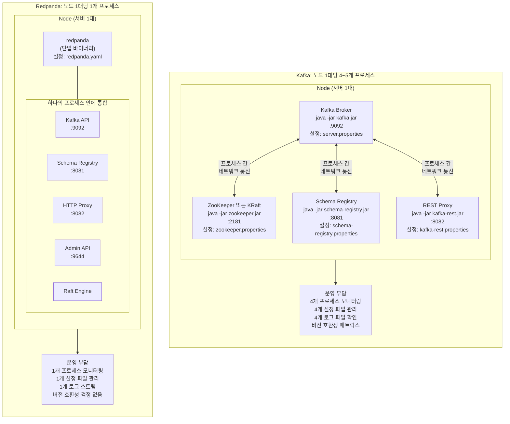

#### 클러스터 전체에서 보면

"단일 바이너리"라 해서 클러스터에 파일이 하나만 존재한다는 뜻이 아닙니다. **각 노드(서버)마다 동일한 바이너리를 개별 설치**하고, 각 노드에서 독립적인 프로세스로 실행합니다. 3노드 클러스터라면 3대의 서버에 각각 같은 `redpanda` 바이너리가 설치되고, 3개의 독립적인 프로세스가 실행됩니다. 이 프로세스들이 Internal RPC(:33145)를 통해 서로 통신하면서 하나의 클러스터를 형성합니다.

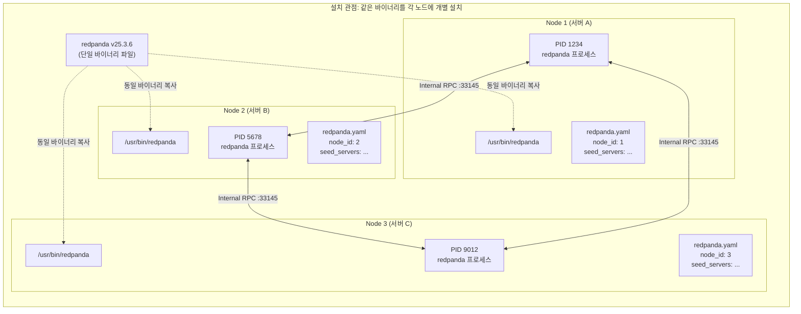

차이를 정리하면 다음과 같습니다:

| 관점 | Kafka (3노드 클러스터) | Redpanda (3노드 클러스터) |
|------|----------------------|--------------------------|
| **노드당 프로세스** | 4~5개 (Broker, ZK/KRaft, SR, Proxy) | 1개 (redpanda) |
| **클러스터 전체 프로세스** | 12~15개 | 3개 |
| **설치** | 컴포넌트마다 별도 설치 | `apt install redpanda` 하나 |
| **설정 파일** | 프로세스당 1개 × 4~5 = 노드당 4~5개 | 노드당 1개 (redpanda.yaml) |
| **업그레이드** | 컴포넌트별 순서와 호환성 확인 필요 | 바이너리 하나만 교체 |
| **장애 포인트** | 프로세스 간 통신 실패 가능 | 프로세스 내부이므로 통신 실패 없음 |
| **모니터링** | 프로세스 × 노드 수 = 12~15개 대시보드 | 노드 수 = 3개 대시보드 |

이 설계의 실질적 효과는 **운영 복잡도의 곱셈이 덧셈으로 바뀌는 것**입니다. Kafka에서 "노드 수 × 프로세스 종류 수"만큼 관리 대상이 늘어나는 반면, Redpanda에서는 "노드 수"만큼만 관리하면 됩니다. 노드가 10대, 50대, 100대로 늘어날수록 이 차이는 기하급수적으로 벌어집니다.

각 노드는 시작 시 seed 노드 목록을 통해 클러스터에 참여합니다. 클러스터 내에서 모든 노드는 동등한 역할을 수행할 수 있으며, 특정 노드가 "메타데이터 전용"이거나 "데이터 전용"인 구분은 없습니다. 토픽을 생성하면 파티션이 노드에 분산되고, 각 파티션은 독립적인 Raft 그룹을 형성하여 복제를 관리합니다. 이 구조 덕분에 노드 하나가 죽어도 해당 노드가 담당하던 파티션의 리더십이 다른 노드로 자동 이전되며, 클라이언트는 짧은 지연 후 정상적으로 메시지를 주고받을 수 있습니다.

클러스터 내부의 통신은 Internal RPC(기본 포트 33145)를 통해 이루어집니다. Raft 로그 복제, 리더 선출, 메타데이터 동기화 등 모든 노드 간 통신이 이 채널을 사용합니다. 외부 클라이언트는 Kafka API(9092), HTTP Proxy(8082), Schema Registry(8081), Admin API(9644)를 통해 접근합니다.

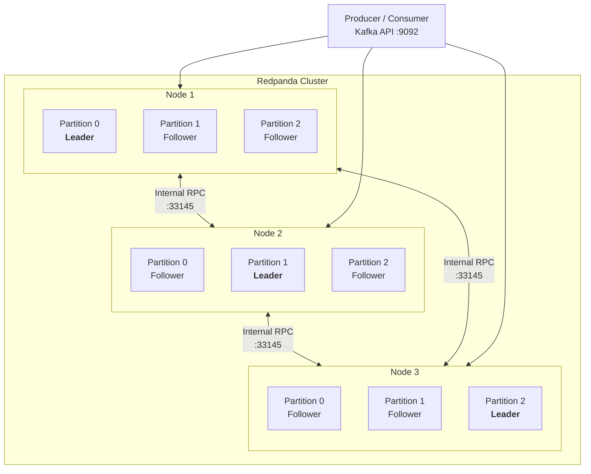

클러스터 메타데이터(토픽 설정, 파티션 할당, ACL, Consumer Group 오프셋)는 **Controller Raft Group**이라는 특수 Raft 그룹이 관리합니다. 이 그룹의 리더가 곧 클러스터의 Controller이며, Kafka의 KRaft Controller와 유사한 역할을 합니다. 다만 Redpanda에서는 별도의 프로세스가 아니라 일반 노드 중 하나가 이 역할을 겸합니다.

---

## 2. Thread-per-Core 모델

### 기존 모델의 문제 (Kafka/JVM)

전통적인 서버 애플리케이션은 **공유 메모리(Shared Memory) 모델**을 사용합니다. 여러 Thread가 같은 메모리 공간에 접근하고, 데이터 정합성을 위해 Lock(Mutex, Semaphore 등)을 사용합니다. Kafka도 JVM 위에서 이 모델로 동작합니다. 이 방식은 프로그래밍이 직관적이지만, 고성능 시나리오에서 심각한 병목을 만듭니다.

**Lock Contention(락 경합)**이 핵심 병목입니다. Thread 1이 Lock을 잡고 있으면 Thread 2는 대기해야 합니다. CPU 코어가 4개라도 Lock 하나에 4개 Thread가 경합하면, 실질적으로 단일 Thread와 다를 바 없는 처리량이 됩니다. 이를 **Amdahl's Law**라고 합니다. 프로그램에서 직렬화(Serialized)되는 부분의 비율이 높을수록, 코어를 아무리 추가해도 성능 향상이 수렴합니다.

**Cache Line Bouncing**은 Lock보다 더 미묘한 성능 저하 요인입니다. 현대 CPU에서 메모리 접근은 Cache Line(보통 64바이트) 단위로 이루어집니다. Thread 1이 Core 0에서 데이터를 수정하면, 해당 Cache Line은 Core 0의 L1 캐시에 "Modified" 상태로 저장됩니다. 이제 Thread 2가 Core 1에서 같은 데이터를 읽으려 하면, MESI 프로토콜에 의해 Core 0의 캐시를 무효화(Invalidate)하고 데이터를 가져와야 합니다. 이 과정이 같은 소켓 내에서는 약 20-40ns, **NUMA(Non-Uniform Memory Access) 시스템에서 다른 소켓을 넘어가면 100ns 이상** 소요됩니다. 메시지 브로커처럼 초당 수백만 건을 처리하는 시스템에서 매 접근마다 100ns가 추가되면 치명적입니다.

**False Sharing**은 Cache Line Bouncing의 특수한 형태입니다. 두 Thread가 서로 다른 변수를 수정하더라도, 이 변수들이 같은 64바이트 Cache Line 안에 있으면 불필요한 캐시 무효화가 발생합니다. 예를 들어 `counter_a`와 `counter_b`가 인접한 메모리에 있고, Thread 1은 `counter_a`만, Thread 2는 `counter_b`만 수정해도, CPU는 두 변수를 같은 Cache Line으로 취급하여 매번 상대 코어의 캐시를 무효화합니다. 논리적으로는 전혀 공유하지 않는 데이터인데도 물리적 메모리 배치 때문에 성능이 저하되는 것입니다.

**Context Switching 오버헤드**도 JVM Thread Pool 모델의 문제입니다. JVM은 수십~수백 개의 Thread를 생성하고, OS 스케줄러가 이들을 CPU 코어에 번갈아 배치합니다. Thread가 전환될 때마다 레지스터 저장/복원, TLB(Translation Lookaside Buffer) 플러시, 캐시 미스 등이 발생합니다. 이 오버헤드는 Thread 수가 코어 수를 크게 초과할수록 심해집니다.

### Redpanda의 Shard-Nothing 아키텍처

Redpanda는 이 문제들을 근본적으로 해결하기 위해 **Shard-Nothing(Shared-Nothing과 구분되는 프로세스 내부 개념)** 아키텍처를 채택했습니다. 핵심 원칙은 단순합니다. **각 CPU 코어를 독립적인 "Shard"로 취급하고, Shard 간에 어떤 상태도 공유하지 않는 것**입니다.

각 Shard는 자체적으로 다음을 소유합니다:
- **전용 메모리 영역**: 시작 시 전체 가용 메모리를 코어 수로 나누어 할당. `malloc()`/`free()` 경합이 없음
- **전용 I/O 큐**: 디스크 읽기/쓰기 요청을 독립적으로 관리
- **전용 네트워크 연결**: 각 코어가 자체 소켓을 관리
- **전용 파티션**: 특정 파티션은 특정 코어에 고정(CPU Affinity)

Shard 간 통신이 필요할 때는 Lock 대신 **비동기 메시지 패싱**을 사용합니다. 예를 들어 Core 0이 Core 1에 데이터를 전달해야 하면, Core 0은 Core 1의 수신 큐에 메시지를 넣고 즉시 다른 작업을 계속합니다. Core 1은 자신의 이벤트 루프에서 이 큐를 확인하고 처리합니다. Lock이 없으므로 대기도 없고, Cache Line Bouncing도 최소화됩니다.

파티션이 특정 코어에 고정되면 **L1/L2 캐시 적중률(Cache Hit Rate)**이 극대화됩니다. 파티션의 메타데이터, 인덱스, 최근 메시지가 항상 같은 코어의 캐시에 존재하므로, 메인 메모리까지 갈 필요 없이 수 ns 내에 데이터에 접근할 수 있습니다. 모든 I/O는 비동기(Asynchronous)로 처리되어 코어가 절대 블로킹되지 않습니다. 디스크 쓰기를 기다리는 동안 네트워크 요청을 처리하고, 네트워크 응답을 기다리는 동안 다른 파티션의 읽기를 처리합니다.

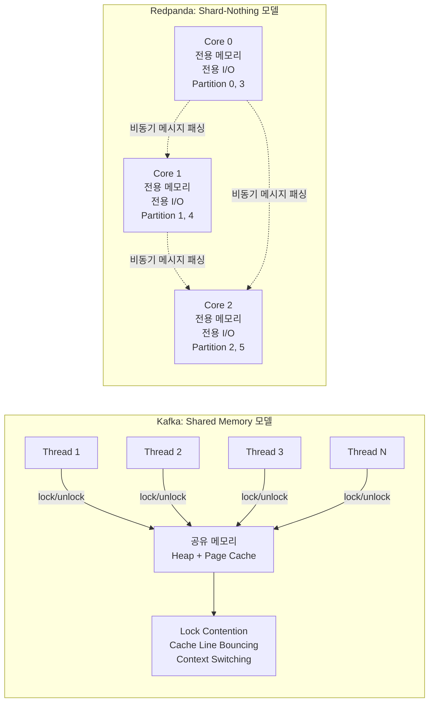

### Seastar 프레임워크 상세

Redpanda의 Shard-Nothing 아키텍처는 **Seastar** 프레임워크 위에 구축되었습니다. Seastar는 ScyllaDB(Cassandra의 C++ 재구현)에서 먼저 검증된 고성능 C++ 프레임워크로, Thread-per-Core 모델을 프로그래밍 가능하게 만들어줍니다.

**Future/Promise 프로그래밍 모델**은 Seastar의 핵심입니다. 전통적인 동기 코드에서 `read(fd, buf, size)` 호출은 디스크 I/O가 완료될 때까지 Thread를 블로킹합니다. Seastar에서는 이를 Future로 감싸서 비동기로 처리합니다:

```cpp
// 전통적 방식: Thread 블로킹
data = read(fd, buf, 4096);
process(data);
send(client, result);

// Seastar 방식: 비동기 체이닝
read_dma(fd, buf, 4096)
    .then([](auto data) { return process(data); })
    .then([client](auto result) { return send(client, result); });
```

`read_dma()`는 즉시 Future 객체를 반환합니다. 실제 디스크 I/O는 백그라운드에서 진행되고, I/O가 완료되면 `.then()`에 등록된 콜백이 **같은 코어**에서 실행됩니다. 이 체이닝 덕분에 복잡한 비동기 로직도 순차적으로 읽히는 코드로 표현할 수 있습니다. 하나의 코어에서 수천 개의 Future가 동시에 진행 중이더라도, Thread는 하나뿐이므로 Lock이 필요 없습니다.

**Cooperative Scheduling(협력적 스케줄링)**은 Seastar의 또 다른 핵심입니다. OS의 Preemptive Scheduling(선점형 스케줄링)은 Thread를 강제로 중단하고 다른 Thread로 전환합니다. 이때 Context Switching 비용이 발생합니다. Seastar에서는 각 Task가 **자발적으로 제어권을 양보(yield)**합니다. I/O를 요청하면 자연스럽게 yield되고, `.then()` 체인의 다음 단계로 다른 Task가 실행됩니다. 강제 전환이 없으므로 Context Switching 비용이 제로입니다.

이 방식의 단점은 하나의 Task가 yield하지 않으면(예: 오래 걸리는 CPU 연산) 다른 모든 Task가 대기한다는 점입니다. 따라서 Seastar 기반 코드는 오래 걸리는 연산을 작은 단위로 분할하고, 중간에 명시적으로 yield해야 합니다. Redpanda는 이런 패턴을 내부적으로 철저히 준수합니다.

**I/O Scheduler**는 각 코어마다 독립적으로 동작합니다. 단순히 I/O 요청을 큐에 넣는 것이 아니라, 디스크의 대역폭과 IOPS(Input/Output Operations Per Second)를 추적하면서 최적의 순서와 양으로 요청을 발행합니다. 예를 들어 NVMe SSD가 큐 깊이 32에서 최대 성능을 내면, I/O Scheduler는 항상 32개의 요청이 비행 중(in-flight)이 되도록 조절합니다. 이를 통해 디스크의 물리적 한계까지 활용하면서도, 과부하로 인한 지연 급증을 방지합니다.

**메모리 관리** 역시 코어별로 독립적입니다. Seastar는 시작 시 전체 가용 메모리를 코어 수로 균등 분할하여 각 코어에 할당합니다. 각 코어는 자신의 메모리 풀에서만 할당/해제하므로, `malloc()`/`free()`에서의 글로벌 Lock 경합이 없습니다. JVM의 Garbage Collector가 "Stop-the-World" 이벤트로 모든 Thread를 멈추는 것과 대조적으로, Seastar에서는 GC 자체가 존재하지 않습니다. C++의 RAII(Resource Acquisition Is Initialization)와 스마트 포인터로 메모리를 관리하므로, 예측 가능한 지연시간을 보장합니다.

**I/O 백엔드**로는 최신 Linux 커널(5.1+)에서 **io_uring**을 지원합니다. io_uring은 커널-유저 공간 간 공유 링 버퍼를 사용하여, System Call 오버헤드를 극적으로 줄입니다. 하나의 System Call로 수십 개의 I/O 요청을 제출하고, 별도의 System Call 없이 완료 결과를 확인할 수 있습니다. 구버전 커널에서는 Legacy AIO(`io_submit`/`io_getevents`)를 폴백으로 사용합니다. io_uring은 특히 NVMe SSD와 결합할 때 AIO 대비 20-30% 높은 IOPS를 달성합니다.

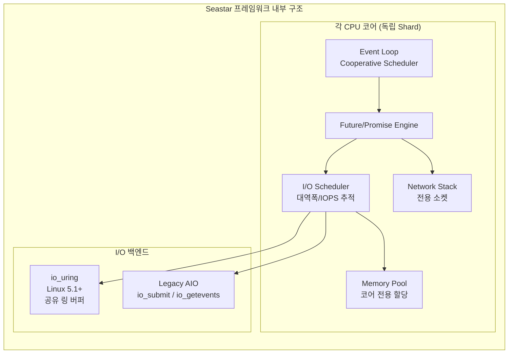

### Thread-per-Core의 실질적 효과

이 모든 요소가 합쳐져서 Redpanda는 하드웨어의 물리적 한계에 근접하는 성능을 달성합니다. 동일한 하드웨어에서 Kafka 대비 Redpanda가 최대 10배 낮은 P99 지연시간을 기록하는 것은, 알고리즘의 차이가 아니라 **시스템 프로그래밍 모델의 근본적 차이** 때문입니다. Lock이 없으면 경합이 없고, 경합이 없으면 코어 수에 비례하여 성능이 선형적으로 증가합니다.

| 항목 | Kafka (JVM Thread Pool) | Redpanda (Thread-per-Core) |
|------|------------------------|---------------------------|
| **Thread 모델** | 수십~수백 Thread, OS 스케줄링 | 코어당 1 Thread, 협력적 스케줄링 |
| **메모리 접근** | 공유 메모리 + Lock | 코어별 독립 메모리 |
| **I/O 방식** | Buffered I/O + Page Cache | O_DIRECT + io_uring |
| **GC** | JVM GC (Stop-the-World) | 없음 (C++ RAII) |
| **캐시 효율** | Thread 마이그레이션으로 캐시 미스 | CPU Affinity로 캐시 적중 극대화 |
| **확장성** | 코어 추가 시 Lock 경합 증가 | 코어 추가 시 선형 성능 향상 |

---

## 3. Raft 합의 프로토콜

분산 시스템에서 가장 어려운 문제는 **여러 노드가 같은 데이터에 대해 합의(Consensus)하는 것**입니다. 네트워크가 끊기거나, 노드가 죽거나, 메시지가 순서가 바뀌어 도착할 수 있는 환경에서, 모든 노드가 "같은 순서의 같은 데이터"를 가지고 있다는 보장이 필요합니다. Redpanda는 이를 위해 **Raft 합의 프로토콜**을 사용합니다.

Kafka가 자체적으로 설계한 ISR(In-Sync Replicas) 메커니즘을 사용하는 반면, Redpanda는 학계에서 형식적으로 증명된(Formally Proven) 표준 알고리즘인 Raft를 채택했습니다. 왜 검증된 표준을 선택했을까요? 분산 합의 알고리즘의 Edge Case는 인간의 직관으로 파악하기 어렵기 때문입니다. Raft는 수학적 증명이 있어 "이 조건에서는 반드시 이렇게 동작한다"는 보장이 있습니다.

### Raft의 3가지 역할

Raft에서 모든 노드는 항상 다음 세 가지 상태 중 하나에 있습니다:

- **Leader**: 모든 쓰기 요청을 처리하고, 데이터를 Follower에 복제합니다. 각 Raft 그룹에는 항상 최대 하나의 Leader만 존재합니다. Leader는 주기적으로 Heartbeat를 보내 자신이 살아있음을 알립니다.

- **Follower**: Leader로부터 복제된 데이터를 수신하고 저장합니다. 클라이언트의 읽기 요청을 처리할 수 있지만, 쓰기는 Leader로 리다이렉트합니다. Leader의 Heartbeat가 일정 시간(Election Timeout) 동안 오지 않으면 Candidate로 전환합니다.

- **Candidate**: Leader 선출 과정에 참여하는 임시 상태입니다. 다른 노드에 투표를 요청하고, 과반수를 얻으면 Leader가 됩니다. 투표에 실패하면 다시 Follower로 돌아갑니다.

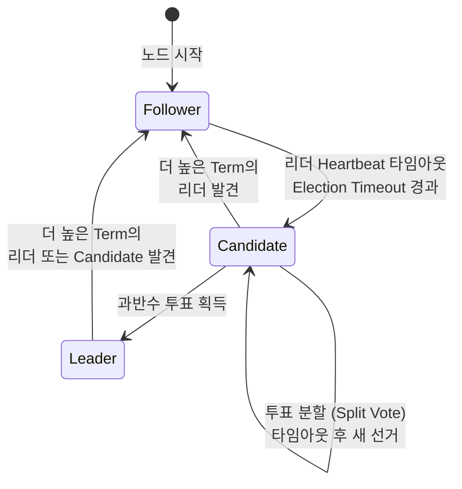

### Leader Election 과정

Leader Election은 Raft의 안전성을 보장하는 핵심 메커니즘입니다. 구체적인 과정을 이해하면 장애 시나리오를 예측할 수 있습니다.

정상 운영 중에는 Leader가 **Heartbeat Interval(기본 150ms)** 간격으로 모든 Follower에 빈 AppendEntries RPC를 보냅니다. 이것은 "나는 아직 살아있다"는 신호입니다. Follower는 Heartbeat를 받을 때마다 자신의 Election Timeout 타이머를 초기화합니다.

Leader가 장애를 겪으면(프로세스 크래시, 네트워크 단절 등) Heartbeat가 중단됩니다. 각 Follower는 **Election Timeout(150ms ~ 300ms 사이의 랜덤 값)**이 경과하면 Leader가 죽었다고 판단합니다. 타임아웃이 랜덤인 이유는 모든 Follower가 동시에 선거를 시작하는 것을 방지하기 위함입니다. 가장 먼저 타임아웃된 Follower가 Candidate가 되어 선거를 시작합니다.

Candidate는 다음 단계를 수행합니다:
1. **Term(임기) 번호를 1 증가**시킵니다. Term은 논리적 시계로, 더 높은 Term을 가진 노드가 항상 우선합니다.
2. **자기 자신에게 투표**합니다.
3. **모든 다른 노드에 RequestVote RPC를 전송**합니다. 이 요청에는 자신의 Term, 마지막 로그의 인덱스와 Term이 포함됩니다.
4. **투표 결과를 기다립니다**.

투표를 받는 노드는 다음 규칙으로 결정합니다:
- 해당 Term에서 아직 투표하지 않았어야 합니다 (각 Term에서 하나의 Candidate에만 투표 가능).
- Candidate의 로그가 자신의 로그보다 **최소한 같거나 최신(at least as up-to-date)**이어야 합니다.

**과반수(Majority)**의 투표를 얻으면 Leader가 됩니다. 3노드 클러스터에서는 2표(자신 포함), 5노드 클러스터에서는 3표가 필요합니다. 과반수 요건은 **동시에 두 개의 Leader가 선출되는 것을 수학적으로 불가능하게** 만듭니다. 과반수 집합 두 개는 반드시 겹치기 때문입니다.

### Write Path 상세

메시지가 Producer에서 출발하여 "커밋"되기까지의 전체 경로를 이해하면, 지연시간의 구성 요소와 장애 시 동작을 파악할 수 있습니다.

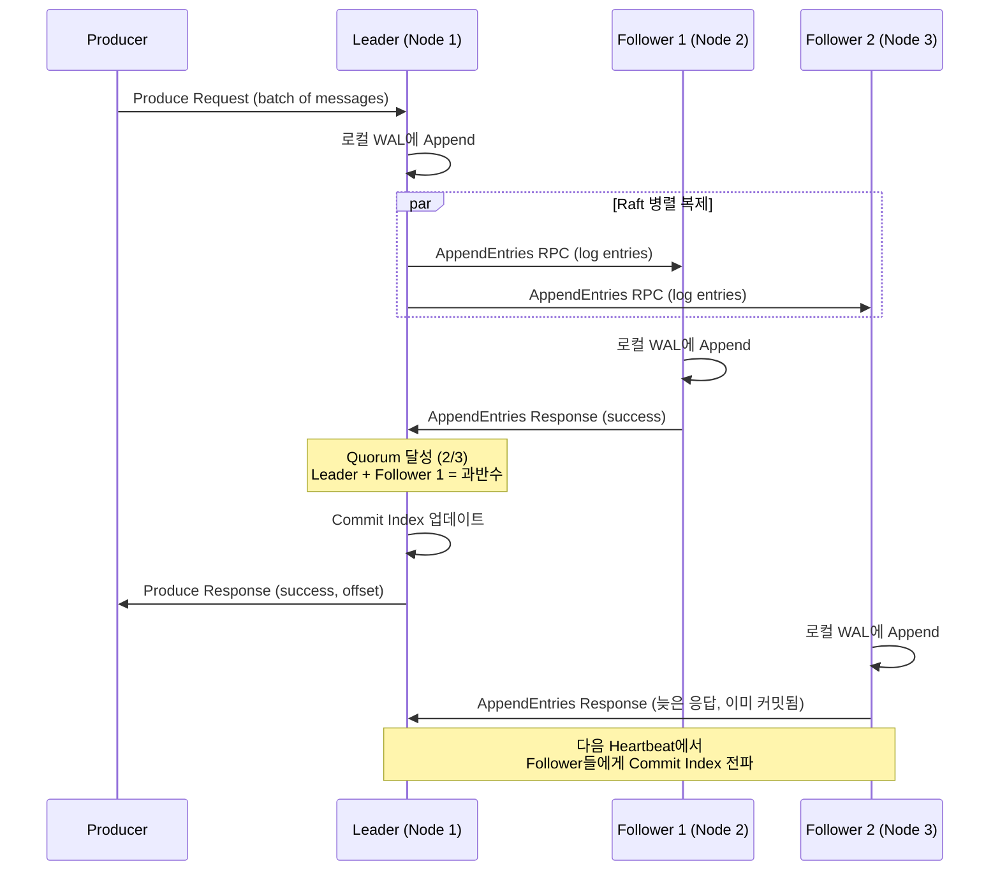

상세 단계:

1. **Producer가 파티션의 Leader에 Produce Request를 전송**합니다. Kafka API의 `acks=all` 설정 시 Leader는 Quorum이 달성될 때까지 응답을 보류합니다.

2. **Leader는 메시지를 자신의 로컬 WAL(Write-Ahead Log)에 먼저 Append**합니다. 이 시점에서 메시지는 아직 "커밋"되지 않은 상태입니다.

3. **Leader는 모든 Follower에 병렬로 AppendEntries RPC를 전송**합니다. 이 RPC에는 새로운 로그 엔트리와 Leader의 현재 Commit Index가 포함됩니다.

4. **각 Follower는 수신한 엔트리를 자신의 WAL에 Append하고, 성공 응답을 보냅니다.** 이때 Follower는 데이터 무결성 검증(Term 번호, 이전 엔트리 일치 등)을 수행합니다.

5. **Leader는 과반수(Quorum)의 노드가 성공 응답을 보내면 해당 엔트리를 "커밋"합니다.** RF(Replication Factor)=3에서는 자신 포함 2/3, RF=5에서는 3/5가 필요합니다. 가장 빠른 Follower의 응답만 있으면 되므로, **느린 Follower 하나가 전체 지연시간에 영향을 미치지 않습니다.**

6. **Leader가 Producer에 성공 응답(offset 포함)을 보냅니다.** 이 시점에서 메시지는 최소 과반수 노드에 복제된 상태이므로, 어떤 노드가 죽어도 데이터가 유실되지 않습니다.

### ISR vs Raft 서술형 비교

Kafka와 Redpanda의 복제 메커니즘 차이는 단순히 구현의 차이가 아니라, **철학적 접근의 차이**입니다.

**Kafka의 ISR(In-Sync Replicas) 모델**에서 Leader는 ISR이라는 동적 목록을 관리합니다. Follower가 Leader를 따라잡지 못하면(지연이 `replica.lag.time.max.ms`를 초과하면) ISR에서 제거됩니다. 이 설계의 의도는 "현재 동기화된 복제본만 고려하여 쓰기를 빠르게 처리"하는 것입니다.

문제는 ISR이 동적이라는 데서 발생합니다. RF=3, `min.insync.replicas=2`로 설정했다고 가정합니다. ISR이 [Leader, Follower1, Follower2]일 때는 정상 동작합니다. 그런데 Follower2가 GC Pause로 일시적으로 느려져 ISR에서 빠지면 ISR=[Leader, Follower1]이 됩니다. 이 상태에서 Follower1마저 장애가 발생하면 ISR=[Leader]가 되고, `min.insync.replicas=2`를 만족시키지 못하므로 **모든 쓰기가 중단**됩니다. Leader는 멀쩡히 살아있는데도 쓰기가 불가능한 상황이 발생하는 것입니다.

**Redpanda의 Raft 모델**은 수학적 Quorum(과반수)에 기반합니다. RF=3이면 항상 2/3의 동의가 필요합니다. ISR처럼 "누가 동기화되어 있는지"를 동적으로 관리하지 않습니다. 노드가 응답하면 카운트하고, 과반수가 응답하면 커밋합니다. RF=3에서 1개 노드가 죽어도, 나머지 2개가 살아있으면 정상 동작합니다. 2개 노드가 죽으면 과반수를 만족시킬 수 없으므로 쓰기가 중단됩니다. 이 동작은 **항상 동일하고 예측 가능합니다.**

Raft가 ISR보다 나은 이유를 정리하면:

1. **결정론적(Deterministic) 동작**: 같은 조건에서 항상 같은 결과. ISR 크기 변화에 따른 Edge Case가 없습니다.
2. **형식적 증명(Formal Proof)**: Raft는 TLA+ 등으로 수학적 안전성이 증명되어 있습니다. Kafka의 ISR은 실무적 검증에 의존합니다.
3. **표준화된 Leader Election**: Raft의 선출 알고리즘은 표준이며, 모든 구현이 동일한 보장을 제공합니다.
4. **단순한 운영**: ISR 크기 모니터링, `min.insync.replicas` 튜닝 등의 운영 부담이 없습니다.

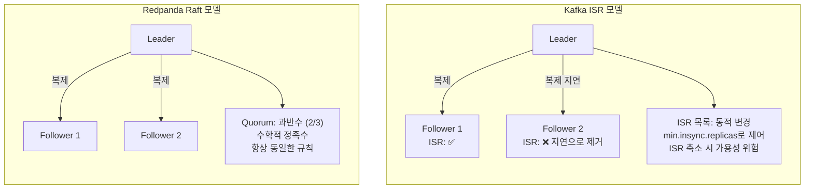

### Raft Group 구조

Redpanda에서 **각 파티션은 독립적인 Raft 그룹**을 형성합니다. 토픽 `orders`가 3개 파티션, RF=3으로 생성되면, 총 3개의 독립적인 Raft 그룹이 만들어집니다. 각 그룹은 자체적으로 Leader를 선출하고, 자체적으로 로그를 복제합니다.

이 설계의 장점은 **장애 격리(Fault Isolation)**입니다. Partition 0의 Leader 선출이 진행 중이더라도, Partition 1과 Partition 2는 정상적으로 읽기/쓰기를 처리합니다. 또한 **부하 분산(Load Balancing)**에도 유리합니다. Partition 0의 Leader가 Node 1, Partition 1의 Leader가 Node 2, Partition 2의 Leader가 Node 3에 있으면, 쓰기 부하가 세 노드에 고르게 분산됩니다.

클러스터 전체를 관리하는 **Controller Raft Group**도 존재합니다. 이 그룹은 다음과 같은 클러스터 메타데이터를 관리합니다:

| 관리 대상 | 설명 |
|-----------|------|
| **토픽 구성** | 파티션 수, 복제 계수, retention 설정 등 |
| **파티션 할당** | 어떤 파티션이 어떤 노드에 있는지 |
| **ACL** | 접근 제어 목록 |
| **Consumer Group** | Group 오프셋, 멤버 정보 |
| **Feature Flags** | 클러스터 기능 활성화 상태 |

Controller Raft Group의 Leader가 곧 클러스터의 Controller입니다. 이 노드가 장애를 겪으면, Raft 선출에 의해 새 Controller가 자동으로 선출됩니다.

---

## 4. 스토리지 아키텍처

> **상세 내용은 [06-log-storage.md](./12-log-storage.md) 참조**

Redpanda의 스토리지는 **분산 커밋 로그(Distributed Commit Log)** 구조입니다. 모든 메시지는 시간 순서대로 Append-Only 로그에 기록되며, 이 로그 자체가 곧 데이터입니다. 전통적인 데이터베이스에서 WAL과 테이블이 분리되어 있는 것과 달리, Redpanda에서는 로그가 곧 유일한 저장소입니다.

### 디렉토리 구조

```
/var/lib/redpanda/data/kafka/
├── orders/                    # 토픽명
│   ├── 0/                     # 파티션 번호
│   │   ├── 0-1-v1.log        # 세그먼트 파일 (base_offset=0, term=1)
│   │   ├── 0-1-v1.base_index # 오프셋 인덱스
│   │   ├── 0-1-v1.timeindex  # 타임스탬프 인덱스
│   │   └── snapshot           # Producer 상태
│   ├── 1/                     # 파티션 1
│   └── 2/                     # 파티션 2
└── another-topic/
```

핵심 특징:
- **O_DIRECT I/O**: OS Page Cache를 우회하고 자체 메모리 관리. GC Pause가 없어 예측 가능한 지연시간 달성. **XFS 파일시스템 필수**.
- **Segment 기반 관리**: 파티션은 여러 Segment 파일로 분할. Active Segment에만 쓰기, Closed Segment만 삭제/Compaction 가능.
- **Sparse Index**: 모든 오프셋이 아닌 일정 간격만 인덱싱하여 메모리 절약.
- **Raft 로그 통합**: 복제 메타데이터와 데이터가 같은 로그에 통합되어 Strong Consistency 보장.

### Tiered Storage

> **상세 내용은 [07-tiered-storage.md](./14-tiered-storage.md) 참조**

Tiered Storage는 오래된 세그먼트를 S3, GCS 등 Object Storage로 자동 이동시키는 기능입니다. 로컬 NVMe SSD에는 최근 데이터(Hot Data)만 유지하고, 과거 데이터(Cold Data)는 저비용 스토리지에 보관합니다. Consumer가 과거 데이터를 요청하면 Object Storage에서 투명하게 가져옵니다.

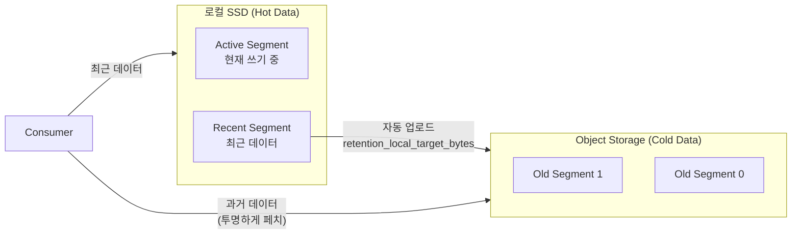

이를 통해 로컬 디스크 용량의 제약 없이 사실상 무제한의 데이터를 보관할 수 있으며, 비용은 Object Storage 요금만큼만 발생합니다.

---

## 5. 네트워크 아키텍처

Redpanda는 단일 바이너리에서 여러 API 엔드포인트를 제공합니다. 각 엔드포인트는 서로 다른 클라이언트 유형을 대상으로 하며, 독립적인 포트에서 동작합니다.

### 포트 구성

| 포트 | API | 프로토콜 | 용도 |
|------|-----|----------|------|
| **9092** | Kafka API | Kafka Binary Protocol | Producer/Consumer 메시지 송수신 |
| **8081** | Schema Registry | HTTP/REST | Avro, Protobuf, JSON Schema 관리 |
| **8082** | HTTP Proxy (Pandaproxy) | HTTP/REST | Kafka 클라이언트 없이 HTTP로 메시지 송수신 |
| **9644** | Admin API | HTTP/REST | 클러스터 관리, 설정 변경, 모니터링 |
| **33145** | Internal RPC | 내부 프로토콜 | Raft 복제, 리더 선출, 노드 간 통신 |

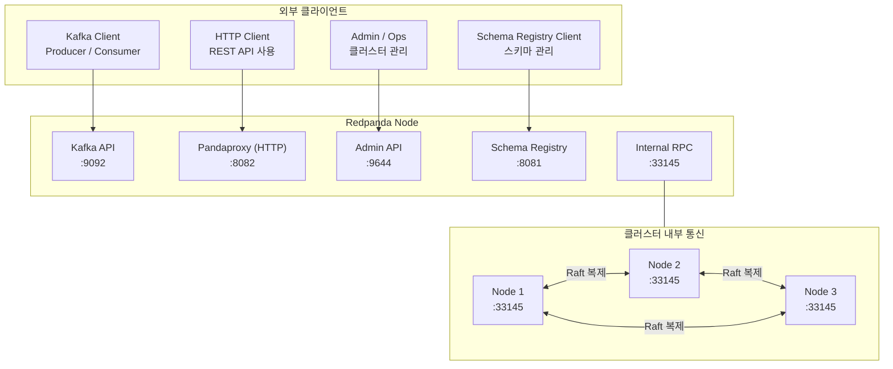

### Advertised Listeners

**Advertised Listeners**는 Redpanda가 "클라이언트에게 자신의 주소를 어떻게 알려줄 것인가"를 결정하는 설정입니다. 단순한 배포 환경에서는 직관적이지만, **Kubernetes나 Docker 환경에서는 필수적**인 개념입니다.

왜 이 설정이 필요한지 구체적으로 살펴봅니다. Kafka Protocol에서 클라이언트가 처음 연결하면, 브로커는 **메타데이터 응답에 각 파티션 리더의 주소를 포함**합니다. 클라이언트는 이 주소로 실제 데이터를 주고받습니다. 문제는 Docker 컨테이너 안에서 Redpanda가 보는 자신의 주소(예: `172.17.0.2:9092`)와 외부 클라이언트가 접근 가능한 주소(예: `my-host:19092`)가 다르다는 것입니다.

Advertised Listeners가 없으면, 외부 클라이언트는 메타데이터에 포함된 컨테이너 내부 IP로 연결을 시도하고, 당연히 실패합니다. Advertised Listeners를 설정하면 Redpanda는 클라이언트에게 **접근 가능한 외부 주소**를 알려줍니다.

```yaml
# redpanda.yaml 설정 예시
redpanda:
  advertised_kafka_api:
    - address: 0.0.0.0       # 내부 클라이언트용
      port: 9092
      name: internal
    - address: my-host.com   # 외부 클라이언트용
      port: 19092
      name: external
```

### Docker CLI 플래그와 Advertise 설정

`redpanda start` CLI에서 listen 주소와 advertise 주소를 설정할 수 있지만, **모든 API에 대해 advertise CLI 플래그가 존재하는 것은 아닙니다.** v25.3.6 기준으로 공식 docker-compose 예시에서 확인된 지원 현황은 다음과 같습니다:

| API | Listen 플래그 | Advertise 플래그 | CLI 지원 |
|-----|--------------|-----------------|----------|
| Kafka API | `--kafka-addr` | `--advertise-kafka-addr` | O |
| Internal RPC | `--rpc-addr` | `--advertise-rpc-addr` | O |
| Pandaproxy | `--pandaproxy-addr` | `--advertise-pandaproxy-addr` | O |
| Schema Registry | `--schema-registry-addr` | `--advertise-schema-registry-addr` | **X** |

Schema Registry의 advertise 주소는 CLI 플래그가 없으며, 필요한 경우 `redpanda.yaml` 설정 파일의 `schema_registry.advertised_schema_registry` 항목으로 설정해야 합니다. 단일 노드 로컬 환경에서는 listen 주소가 그대로 사용되므로 별도 설정이 불필요합니다.

> **참고**: [Redpanda Labs - Single Broker Docker Compose](https://docs.redpanda.com/redpanda-labs/docker-compose/single-broker/)에서 공식 예시를 확인할 수 있습니다.

### Kubernetes 네트워크 패턴

Kubernetes 환경에서 Redpanda를 배포할 때는 내부/외부 접근을 위한 네트워크 설계가 중요합니다.

**클러스터 내부 접근(Pod-to-Pod)**: 같은 Kubernetes 클러스터 내 애플리케이션은 Headless Service를 통해 각 Pod에 직접 접근합니다. DNS 이름은 `redpanda-0.redpanda.namespace.svc.cluster.local:9092` 형태입니다.

**클러스터 외부 접근**: 두 가지 주요 패턴이 있습니다:

| 패턴 | 장점 | 단점 | 적합한 환경 |
|------|------|------|------------|
| **NodePort** | 설정 간단, 추가 비용 없음 | 포트 범위 제한(30000-32767), 노드 IP 노출 | 개발/테스트 |
| **LoadBalancer** | 안정적인 외부 IP, TLS 종단 가능 | 각 브로커마다 별도 LB 필요, 비용 증가 | 프로덕션 |

LoadBalancer 패턴에서 주의할 점은 **각 브로커가 별도의 LoadBalancer를 가져야 한다**는 것입니다. Kafka Protocol은 클라이언트가 특정 브로커에 직접 연결해야 하므로(파티션 리더에 직접 쓰기), 단일 LoadBalancer 뒤에 모든 브로커를 두면 올바른 브로커로 라우팅되지 않습니다.

---

## 6. 실무 고려사항

### 파티션 수 계획

파티션 수는 병렬 처리 성능과 리소스 오버헤드 사이의 트레이드오프입니다. 너무 적으면 핫스팟이 발생하고, 너무 많으면 메모리와 파일 디스크립터를 낭비합니다.

**파티션이 너무 적을 때의 문제**: Consumer Group의 Consumer 수가 파티션 수를 초과하면, 초과분의 Consumer는 유휴 상태가 됩니다. 또한 단일 파티션에 트래픽이 집중되면 해당 코어가 병목이 됩니다.

**파티션이 너무 많을 때의 문제**: 각 파티션은 독립적인 Raft 그룹이므로, 메타데이터 오버헤드가 파티션 수에 비례하여 증가합니다. 파일 디스크립터도 파티션 수에 비례하여 소모됩니다. Leader Election 시 수천 개의 파티션이 동시에 선출을 진행하면 "Election Storm"이 발생할 수 있습니다.

**실무 가이드라인**:

| 시나리오 | 권장 파티션 수 | 근거 |
|----------|---------------|------|
| 저처리량 토픽 (< 10MB/s) | 3-6개 | 최소한의 병렬성 확보 |
| 중간 처리량 (10-100MB/s) | 6-12개 | Consumer 병렬 처리와 부하 분산 |
| 고처리량 (> 100MB/s) | 12-30개 | 코어 수 고려, 과도하게 늘리지 않음 |
| 순서 보장 필요 | 1개 | 파티션 내에서만 순서 보장 가능 |

Redpanda는 Kafka에 비해 파티션당 오버헤드가 낮지만, 그래도 토픽당 수백 개의 파티션을 만드는 것은 피해야 합니다. 클러스터 전체 파티션 수가 수만 개를 넘으면 성능 저하가 시작될 수 있습니다.

### Replication Factor 설정

Replication Factor(RF)는 데이터 안전성과 가용성을 결정합니다.

**RF=1 (복제 없음)**: 데이터가 단일 노드에만 존재합니다. 해당 노드 장애 시 데이터 유실이 발생합니다. **개발/테스트 환경에서만 사용**해야 합니다. 프로덕션에서 RF=1을 사용하면 디스크 장애 하나로 데이터를 영구적으로 잃게 됩니다.

**RF=3 (프로덕션 표준)**: 3개 노드에 데이터가 복제됩니다. 1개 노드 장애를 허용하면서 정상 운영이 가능합니다(Quorum 2/3). 대부분의 프로덕션 환경에서 충분한 안전성을 제공합니다. 쓰기 지연시간은 가장 빠른 Follower의 응답 시간에 의해 결정됩니다.

**RF=5 (높은 가용성)**: 5개 노드에 데이터가 복제됩니다. 2개 노드 동시 장애를 허용합니다(Quorum 3/5). 금융, 의료 등 데이터 유실이 절대 불가능한 환경에서 사용합니다. 다만 저장 공간이 5배 필요하고, 쓰기 시 3개 노드의 응답을 기다려야 하므로 지연시간이 약간 증가합니다.

| RF | 허용 장애 노드 | Quorum | 저장 공간 | 적합 환경 |
|----|---------------|--------|-----------|-----------|
| 1 | 0개 | 1/1 | 1x | 개발/테스트 |
| 3 | 1개 | 2/3 | 3x | 일반 프로덕션 |
| 5 | 2개 | 3/5 | 5x | 고가용성 프로덕션 |

### 노드 수 계획

**최소 3노드**가 Raft Quorum을 위한 최소 요건입니다. 2노드에서는 1노드 장애 시 과반수를 달성할 수 없어 쓰기가 중단됩니다. 짝수 노드(2, 4, 6)는 홀수 노드(3, 5, 7)에 비해 장애 허용 능력이 동일하면서 비용만 증가합니다(4노드와 3노드 모두 1개 장애까지 허용).

| 노드 수 | 허용 장애 | 비고 |
|---------|----------|------|
| 3 | 1개 | 프로덕션 최소 |
| 5 | 2개 | 높은 가용성, 롤링 업그레이드 안전 |
| 7 | 3개 | 매우 높은 가용성, 대규모 클러스터 |

**홀수를 권장하는 이유**: 4노드 클러스터에서 RF=3이면 Quorum은 여전히 2/3입니다. 4번째 노드는 데이터를 분산하는 데는 도움이 되지만, 장애 허용 능력은 3노드와 동일합니다. 5노드부터 2개 동시 장애를 허용하므로 의미 있는 가용성 향상이 됩니다.

### 하드웨어 권장 사항

| 리소스 | 개발/테스트 | 프로덕션 |
|--------|------------|----------|
| **CPU** | 2-4 코어 | 8-16+ 코어 (Thread-per-Core이므로 코어 = 성능) |
| **메모리** | 4-8 GB | 32-64+ GB (Seastar가 코어별 분배) |
| **디스크** | SSD (어떤 FS든 가능) | NVMe SSD + **XFS 필수** (O_DIRECT) |
| **네트워크** | 1 Gbps | 10+ Gbps (Raft 복제 트래픽 고려) |

Thread-per-Core 모델에서는 **코어 수가 곧 성능**입니다. 2GHz 16코어가 4GHz 4코어보다 훨씬 높은 처리량을 달성합니다. 메모리는 Seastar가 코어별로 균등 분배하므로, 코어 수에 비례하여 충분히 할당해야 합니다.

---

## 7. ISR (In-Sync Replicas)과 복제 신뢰성

분산 메시지 브로커에서 **복제(Replication)** 는 데이터 유실을 방지하는 핵심 메커니즘입니다. 하지만 복제본이 항상 동기화되어 있다고 보장할 수 없습니다. 네트워크 지연, 디스크 성능 저하, GC Pause 등으로 인해 일부 복제본은 리더보다 뒤처질 수 있습니다. ISR(In-Sync Replicas)은 "현재 동기화된 복제본"을 추적하여 데이터 일관성과 가용성 사이의 균형을 맞추는 개념입니다.

### ISR이란 무엇인가

**ISR(In-Sync Replicas)** 은 리더와 충분히 동기화된 팔로워들의 집합입니다. "충분히"의 기준은 `replica.lag.time.max.ms` 설정으로 결정됩니다. 팔로워가 이 시간 내에 리더의 최신 메시지를 복제하면 ISR에 포함되고, 그렇지 않으면 제외됩니다.

예를 들어, `replica.lag.time.max.ms=10000` (10초)로 설정했다면, 팔로워가 10초 이내에 리더를 따라잡으면 ISR 상태입니다. 네트워크 장애나 성능 저하로 10초 이상 지연되면 ISR에서 제거됩니다.

**ISR의 목적**은 쓰기 성능과 데이터 안전성의 균형입니다. 모든 복제본을 기다리면 느린 노드 하나가 전체 쓰기를 지연시킵니다. ISR만 기다리면 "현재 동기화된" 노드만 고려하므로, 빠른 쓰기와 안전성을 동시에 달성할 수 있습니다.

### Redpanda vs Kafka: ISR의 의미 차이

Kafka와 Redpanda 모두 ISR 개념을 사용하지만, 내부 구현은 완전히 다릅니다.

**Kafka의 ISR 모델**에서 리더는 ISR이라는 동적 목록을 직접 관리합니다. 팔로워가 지연되면 리더가 ISR에서 제거하고, 따라잡으면 다시 추가합니다. `acks=all` 설정 시 리더는 **현재 ISR에 포함된 모든 복제본**이 메시지를 확인할 때까지 기다립니다.

**Redpanda의 Raft 모델**은 ISR을 별도로 관리하지 않습니다. 대신 **Raft Consensus 프로토콜의 Quorum(과반수)** 을 사용합니다. Raft에서는 "누가 동기화되어 있는지"를 추적하지 않고, 단순히 "몇 개 노드가 응답했는지"만 셉니다. RF=3이면 항상 2/3의 동의가 필요하며, 이는 동적으로 변하지 않습니다.

Kafka API 호환성을 위해 Redpanda도 ISR 개념을 노출하지만, 실제로는 **Raft Quorum을 ISR로 표현**한 것입니다. `acks=all`은 "모든 동기화된 복제본"이 아니라 "Raft Quorum(과반수)"을 의미합니다. 사용자 입장에서는 동일하게 동작하지만, 내부 메커니즘이 다르므로 장애 시나리오에서 차이가 발생합니다.

### `min.insync.replicas`: 최소 ISR 멤버 수

`min.insync.replicas`는 쓰기가 성공하기 위한 **최소 ISR 크기**를 지정합니다. `acks=all` 설정과 함께 사용하여 데이터 안전성을 강화합니다.

```yaml
# 프로덕션 권장 설정
replication.factor: 3           # 3개 복제본
min.insync.replicas: 2          # 최소 2개 ISR
acks: all                        # 모든 ISR 확인
```

이 설정의 의미는 "최소 2개 노드가 메시지를 확인해야만 쓰기 성공"입니다. RF=3, `min.insync.replicas=2`일 때:

- **정상 상황 (ISR=3)**: 리더 + 팔로워 2개 모두 응답. 가장 빠른 팔로워 1개만 응답해도 Quorum 달성 (2/3).
- **팔로워 1개 장애 (ISR=2)**: 리더 + 팔로워 1개 응답. 여전히 `min.insync.replicas=2` 만족. 정상 동작.
- **팔로워 2개 장애 (ISR=1)**: 리더만 살아있음. `min.insync.replicas=2` 미만이므로 **모든 쓰기 실패**.

**잘못된 설정 예시**:

```bash
# ❌ 위험한 설정: min.insync.replicas가 RF보다 큼
rpk topic create bad-topic --replicas 3 --topic-config min.insync.replicas=4
```

RF=3인데 `min.insync.replicas=4`이면 절대로 4개 ISR을 만들 수 없으므로 **모든 쓰기가 영구적으로 실패**합니다.

**권장 설정**:

| RF | min.insync.replicas | 허용 장애 | 설명 |
|----|---------------------|----------|------|
| 3 | 2 | 1개 노드 | 프로덕션 표준 |
| 5 | 3 | 2개 노드 | 높은 가용성 |
| 1 | 1 | 0개 노드 | 개발/테스트 (복제 없음) |

`min.insync.replicas`를 RF보다 1 작게 설정하는 것이 일반적입니다. 이렇게 하면 노드 1개 장애를 허용하면서도, 최소 과반수가 데이터를 가지고 있음을 보장합니다.

### Unclean Leader Election과 데이터 유실

**Unclean Leader Election**은 ISR 밖의 복제본이 리더로 선출되는 것을 의미합니다. 이는 데이터 유실을 유발할 수 있는 위험한 상황입니다.

시나리오를 가정합니다. RF=3, ISR=[Leader, Follower1, Follower2]인 상태에서:

1. 리더가 메시지 M1을 쓰고, Follower1은 복제했지만 Follower2는 네트워크 지연으로 아직 복제하지 못함
2. ISR=[Leader, Follower1]로 축소
3. 리더와 Follower1이 동시에 장애 발생 (데이터센터 랙 전체 장애 등)
4. Follower2만 살아있음. 하지만 Follower2는 M1을 가지고 있지 않음

이 상황에서 두 가지 선택지가 있습니다:

- **Unclean Leader Election 허용**: Follower2를 리더로 선출. 서비스는 복구되지만 **M1 유실**.
- **Unclean Leader Election 금지**: Follower2를 리더로 선출하지 않음. **서비스 중단**, 리더나 Follower1이 복구될 때까지 대기.

Kafka에서 `unclean.leader.election.enable=true`로 설정하면 전자를 선택합니다. 가용성을 선택하고 데이터 일관성을 포기하는 것입니다.

**Redpanda는 Raft 기반이므로 이 문제가 구조적으로 방지됩니다.** Raft에서는 **최신 로그를 가진 노드만 리더가 될 수 있습니다**. 투표 과정에서 후보자의 로그 인덱스를 비교하여, 자신보다 오래된 로그를 가진 후보자에게는 투표하지 않습니다. 따라서 Follower2는 M1을 가지고 있지 않으므로 리더로 선출될 수 없습니다.

Redpanda는 **가용성보다 일관성을 우선**합니다. 과반수 노드가 죽으면 쓰기가 중단되지만, 데이터 유실은 발생하지 않습니다. 이는 금융, 의료 등 데이터 정확성이 중요한 분야에서 중요한 보장입니다.

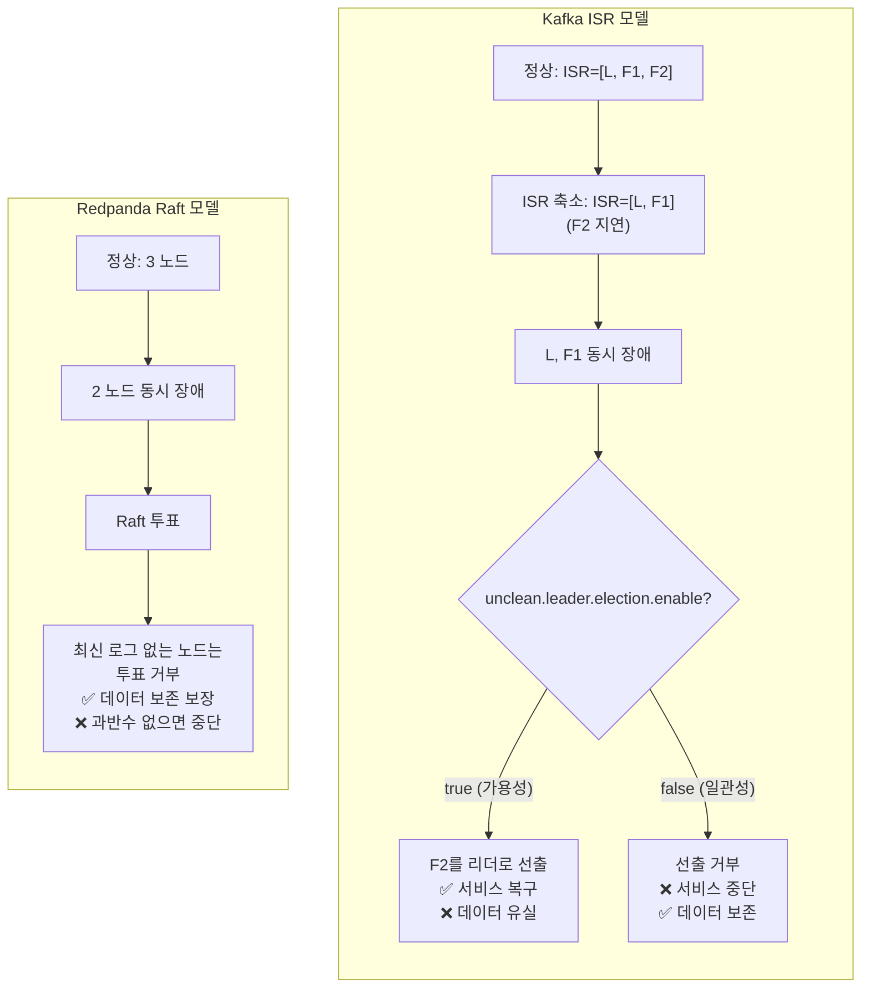

### 프로덕션 설정 예시

**Kafka API 호환 설정 (Redpanda 내부는 Raft)**:

```bash
# 토픽 생성 시
rpk topic create orders \
  --replicas 3 \
  --topic-config min.insync.replicas=2 \
  --topic-config replication.factor=3

# Producer 설정 (Java)
props.put("acks", "all");  // 모든 ISR 확인 (Redpanda에서는 Raft Quorum)
props.put("retries", 3);
props.put("max.in.flight.requests.per.connection", 1);  // 순서 보장
```

**클러스터 레벨 기본값**:

```bash
# 모든 토픽의 기본 min.insync.replicas
rpk cluster config set default_topic_replications 3
rpk cluster config set minimum_topic_replications 2
```

### 모니터링

ISR 상태를 모니터링하여 복제 지연을 조기에 발견할 수 있습니다.

```bash
# 토픽의 ISR 상태 확인
rpk topic describe orders --detailed

# 출력 예시:
# PARTITION  LEADER  REPLICAS  ISR        HIGH-WATERMARK
# 0          1       [1,2,3]   [1,2,3]    1000000
# 1          2       [2,3,1]   [2,3]      1500000  ← 주의: ISR 축소!
```

Partition 1에서 ISR이 [2,3]으로 축소된 것을 발견했다면, 노드 1이 지연되고 있다는 신호입니다. 원인을 파악하여 해결해야 합니다.

**Prometheus 메트릭**:

```bash
# ISR 크기 모니터링
redpanda_kafka_under_replicated_replicas > 0  # 경고: ISR 축소
redpanda_kafka_offline_replicas > 0           # 심각: 복제본 오프라인
```

Under-replicated 상태가 지속되면 가용성이 위험해집니다. RF=3, `min.insync.replicas=2`인 상태에서 ISR이 2개로 축소되었다면, 노드 하나만 더 장애가 발생해도 쓰기가 중단됩니다.

### 정리: ISR vs Raft

| 항목 | Kafka ISR | Redpanda Raft |
|------|-----------|---------------|
| **동기화 판단** | 리더가 동적으로 ISR 목록 관리 | Quorum 응답만 카운트 |
| **안전성 보장** | ISR 크기 변화에 따라 동적 | 수학적 과반수로 정적 |
| **Unclean Election** | 설정에 따라 허용 가능 | 구조적으로 방지 |
| **일관성 vs 가용성** | 설정으로 조정 | 일관성 우선 |
| **운영 복잡도** | ISR 크기 모니터링 필수 | Quorum만 이해하면 됨 |

Redpanda를 사용할 때는 Kafka의 ISR 개념을 알아야 호환성을 이해할 수 있지만, 실제 동작은 **Raft Quorum**이라는 점을 기억해야 합니다. 이는 더 예측 가능하고 안전한 동작을 보장합니다.

---

## 참고

### 공식 문서
- [Redpanda Architecture](https://docs.redpanda.com/current/get-started/architecture/)
- [Redpanda Networking](https://docs.redpanda.com/current/manage/security/networking/)
- [Cluster Configuration](https://docs.redpanda.com/current/reference/cluster-properties/)

### 프레임워크/알고리즘
- [Seastar Framework](https://seastar.io/)
- [Seastar Tutorial](https://seastar.io/futures-promises/)
- [Raft Consensus Algorithm (Original Paper)](https://raft.github.io/raft.pdf)
- [Raft Visualization](https://raft.github.io/)

### 크로스 레퍼런스
- 스토리지 상세: [06-log-storage.md](./12-log-storage.md)
- Tiered Storage: [07-tiered-storage.md](./14-tiered-storage.md)

---

## 학습 정리

### 핵심 개념

1. **단일 바이너리**: Kafka API, Schema Registry, HTTP Proxy, Admin API를 하나의 프로세스에 통합하여 운영 복잡도를 제거
2. **Thread-per-Core**: 각 코어가 독립 Shard로 동작하여 Lock 없이 하드웨어 한계까지 성능 달성. Seastar의 Future/Promise, Cooperative Scheduling, 코어별 I/O Scheduler가 핵심
3. **Raft 합의**: 수학적으로 증명된 합의 알고리즘으로 복제 관리. ISR의 동적 목록 대신 정적 Quorum 규칙으로 예측 가능한 동작
4. **파티션 = Raft 그룹**: 각 파티션이 독립적 Raft 그룹을 형성하여 장애 격리와 부하 분산을 동시에 달성
5. **네트워크 분리**: 외부 API(Kafka, HTTP, Admin, Schema Registry)와 내부 RPC를 분리하여 보안과 성능을 확보

### Kafka와의 핵심 차이

| 영역 | Kafka | Redpanda |
|------|-------|----------|
| **아키텍처** | 다중 프로세스 (Broker + ZK/KRaft + SR + Proxy) | 단일 바이너리 |
| **Threading** | JVM Thread Pool + Shared Memory | Thread-per-Core + Shard-Nothing |
| **복제** | ISR (동적 목록) | Raft (수학적 Quorum) |
| **I/O** | Buffered I/O + Page Cache | O_DIRECT + io_uring |
| **Tail Latency** | GC Pause 영향 (P99.9 수백 ms) | 예측 가능 (P99.9 수 ms) |

### 실무 적용 요약

- **파티션**: 토픽당 3-30개, Consumer 수와 처리량 기반으로 결정
- **RF**: 프로덕션은 RF=3 필수, 고가용성은 RF=5
- **노드**: 최소 3 (홀수 권장), 높은 가용성은 5
- **하드웨어**: 코어 수 = 성능, NVMe + XFS 필수
- **네트워크**: K8s 배포 시 Advertised Listeners 설정 필수
