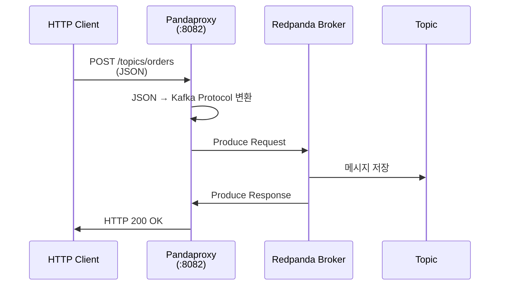
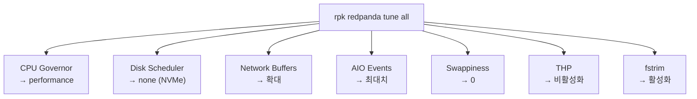
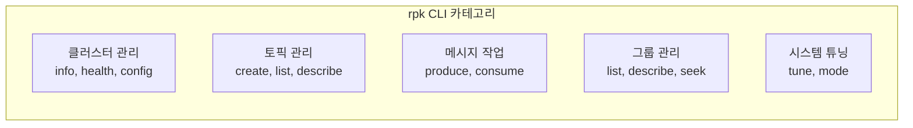
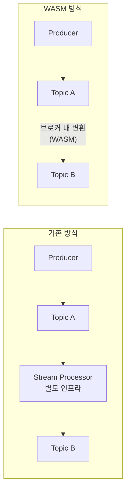
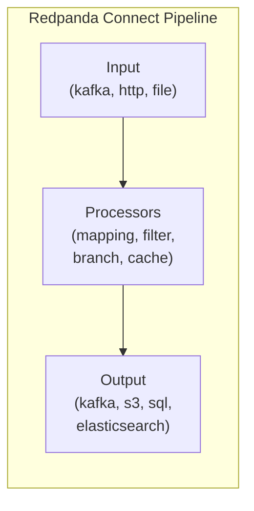

# 05. Core Features

Redpanda는 Kafka 호환성 외에도 운영 편의성과 개발 생산성을 높이는 고유 기능들을 제공합니다. 이 문서에서는 HTTP Proxy(Pandaproxy), 자동 튜닝, rpk CLI, WASM Data Transforms, Redpanda Connect를 학습합니다.

> Schema Registry와 Tiered Storage는 각각 [04-schema-registry.md](./07-schema-registry.md), [07-tiered-storage.md](./14-tiered-storage.md)에서 다룹니다.

---

## 1. HTTP Proxy (Pandaproxy)

### 왜 HTTP Proxy가 필요한가

모든 클라이언트가 Kafka 프로토콜을 사용할 수 있는 것은 아닙니다. Kafka 프로토콜은 TCP 기반의 바이너리 프로토콜로, 전용 클라이언트 라이브러리가 필요합니다. 하지만 현실에서는 이 조건을 충족하기 어려운 환경이 많습니다.

**Serverless 환경**: AWS Lambda나 Cloud Functions는 실행 시간이 짧고 커넥션 풀을 유지할 수 없습니다. Kafka 클라이언트는 브로커와의 TCP 커넥션 수립, 메타데이터 교환, 파티션 할당 등 초기 핸드셰이크에 수백 ms가 소요되는데, 함수 실행 시간이 수 초인 환경에서는 이 오버헤드가 치명적입니다. HTTP는 단일 요청으로 메시지를 전송할 수 있어 이 문제를 해결합니다.

**방화벽 제약**: 많은 기업 환경에서 HTTP/HTTPS(포트 80/443)만 외부 통신을 허용합니다. Kafka의 기본 포트(9092)는 방화벽에서 차단되는 경우가 많으므로, HTTP Proxy를 통해 기존 네트워크 정책을 변경하지 않고 메시지를 전송할 수 있습니다.

**빠른 프로토타이핑**: curl 명령어 하나로 토픽에 메시지를 보내고 확인할 수 있습니다. Kafka 클라이언트 라이브러리를 설치하고 설정 코드를 작성하는 과정 없이, 터미널에서 바로 동작을 검증할 수 있습니다.

**언어 비종속성**: HTTP를 지원하는 언어라면 무엇이든 Producer/Consumer가 될 수 있습니다. Kafka 클라이언트가 공식 지원하지 않는 언어(셸 스크립트, 레거시 시스템 등)에서도 메시지를 주고받을 수 있습니다.

### 동작 방식

Pandaproxy는 Redpanda 브로커에 내장된 HTTP 서버(기본 포트 8082)로, 클라이언트의 HTTP 요청을 내부적으로 Kafka 프로토콜로 변환하여 브로커에 전달합니다.



### 메시지 생산

```bash
# JSON 메시지 전송
curl -X POST http://localhost:18082/topics/orders \
  -H "Content-Type: application/vnd.kafka.json.v2+json" \
  -d '{
    "records": [
      {"key": "order-1", "value": {"id": "order-1", "amount": 100}},
      {"key": "order-2", "value": {"id": "order-2", "amount": 200}}
    ]
  }'

# Binary 메시지 (Base64 인코딩)
curl -X POST http://localhost:18082/topics/orders \
  -H "Content-Type: application/vnd.kafka.binary.v2+json" \
  -d '{
    "records": [
      {"key": "b3JkZXItMQ==", "value": "eyJpZCI6Im9yZGVyLTEifQ=="}
    ]
  }'
```

### 메시지 소비

```bash
# 1. Consumer 인스턴스 생성
curl -X POST http://localhost:18082/consumers/my-group \
  -H "Content-Type: application/vnd.kafka.v2+json" \
  -d '{
    "name": "my-consumer",
    "format": "json",
    "auto.offset.reset": "earliest"
  }'

# 2. 토픽 구독
curl -X POST http://localhost:18082/consumers/my-group/instances/my-consumer/subscription \
  -H "Content-Type: application/vnd.kafka.v2+json" \
  -d '{"topics": ["orders"]}'

# 3. 메시지 가져오기
curl http://localhost:18082/consumers/my-group/instances/my-consumer/records \
  -H "Accept: application/vnd.kafka.json.v2+json"

# 4. Consumer 삭제 (정리)
curl -X DELETE http://localhost:18082/consumers/my-group/instances/my-consumer
```

### 적합/부적합 사례

| 환경 | 적합 여부 | 이유 |
|------|-----------|------|
| Serverless (Lambda, Cloud Functions) | 적합 | TCP 커넥션 유지 불필요, 단일 HTTP 요청으로 완료 |
| 브라우저 기반 대시보드 | 적합 | JavaScript fetch API로 직접 호출 가능 |
| 방화벽 제한 환경 | 적합 | HTTP/HTTPS 포트만 허용되는 네트워크에서 동작 |
| 빠른 테스트/디버깅 | 적합 | curl로 즉시 메시지 생산/소비 가능 |
| 고처리량 파이프라인 (수십만 msg/s) | 부적합 | HTTP 오버헤드(헤더, JSON 직렬화)가 성능 병목 |
| 지연시간 민감 시스템 | 부적합 | JSON 파싱 + HTTP 계층 추가로 수 ms 지연 증가 |
| 대규모 Consumer 그룹 | 부적합 | Consumer Group rebalancing 미지원, stateful 소비 제한적 |

---

## 2. 자동 튜닝

### 왜 자동 튜닝이 중요한가

Kafka를 운영하려면 JVM heap 크기, GC 알고리즘 선택, OS 커널 파라미터, 네트워크 버퍼 크기 등을 수동으로 조정해야 합니다. 이것은 운영팀의 전담 업무가 될 만큼 복잡합니다.

**JVM 튜닝의 고통**: heap이 너무 작으면 빈번한 GC가 발생하여 처리량이 급감하고, 너무 크면 Full GC pause가 수백 ms에서 수 초까지 늘어납니다. G1GC vs ZGC 선택, Eden/Old 비율 조정, GC 로그 분석 등 JVM 튜닝 자체가 전문 영역입니다.

**OS 레벨 튜닝**: Kafka 공식 문서에서도 `vm.swappiness`, 네트워크 버퍼, 파일 디스크립터 제한 등을 수동으로 설정하라고 안내합니다. 이 설정들은 서버 스펙마다 다르고, 잘못 설정하면 성능이 수십 배 저하될 수 있습니다.

**Redpanda의 철학**: 소프트웨어가 하드웨어에 적응해야지, 사용자가 소프트웨어를 하드웨어에 맞추느라 시간을 쓰면 안 됩니다. `rpk redpanda tune all` 한 줄이면 Redpanda가 현재 하드웨어를 감지하고 OS 레벨 설정을 자동으로 최적화합니다.

### rpk tune 명령어

```bash
# 모든 튜닝 항목 한 번에 적용
sudo rpk redpanda tune all

# 개별 튜닝 (필요 시)
sudo rpk redpanda tune cpu
sudo rpk redpanda tune disk_scheduler
sudo rpk redpanda tune network
sudo rpk redpanda tune aio_events
sudo rpk redpanda tune clocksource
sudo rpk redpanda tune swappiness
sudo rpk redpanda tune transparent_hugepages
sudo rpk redpanda tune fstrim
```

### 각 튜닝 항목의 이유

단순히 "최적화"라고 하면 왜 그렇게 설정하는지 알 수 없습니다. 각 항목이 해결하는 구체적인 문제를 이해해야 합니다.

| 항목 | 설정 | 이유 |
|------|------|------|
| cpu | governor → performance | ondemand 모드는 부하에 따라 CPU 주파수를 동적으로 변경합니다. 주파수 전환 시 수십 us의 지연이 발생하고, 스트리밍 워크로드는 지속적으로 CPU를 사용하므로 절전 효과도 미미합니다 |
| disk_scheduler | noop/none | 커널의 I/O 스케줄러(CFQ, deadline 등)는 HDD의 seek time을 줄이기 위해 요청을 재정렬합니다. NVMe SSD는 seek이 없으므로 이 재정렬이 순수 오버헤드입니다. Redpanda(Seastar)가 자체적으로 I/O 스케줄링을 수행합니다 |
| network | 버퍼 크기 확대 | 기본 Linux 네트워크 버퍼(수십 KB)는 일반 웹 워크로드 기준입니다. 스트리밍 시스템은 대량의 배치 데이터를 전송하므로, 수 MB 수준의 버퍼가 필요합니다. 버퍼가 작으면 TCP window가 축소되어 처리량이 제한됩니다 |
| aio_events | 최대 이벤트 수 증가 | Seastar의 비동기 I/O 엔진은 `io_submit` 시스템 콜로 다수의 I/O를 동시에 디스크에 요청합니다. 커널의 기본 `aio-max-nr` 값은 이 동시 요청을 제한할 수 있습니다 |
| swappiness | 0 또는 1 | 스왑이 발생하면 메모리 접근 지연이 수 ns에서 수 ms(디스크 수준)로 급증합니다. 스트리밍 시스템에서 이 수준의 지연은 Consumer timeout, rebalancing을 연쇄적으로 유발합니다 |
| transparent_hugepages | 비활성화 | THP(Transparent Huge Pages)는 메모리 할당 시 2MB 단위로 페이지를 병합하는데, 이 과정에서 수 ms의 stall이 발생할 수 있습니다. Seastar는 자체 메모리 관리자로 huge page를 직접 제어하므로 커널의 THP가 불필요합니다 |
| fstrim | 활성화 | SSD는 삭제된 블록을 OS에게 알려주지 않으면 GC(Garbage Collection)가 비효율적으로 동작합니다. fstrim은 사용하지 않는 블록을 SSD에 알려 쓰기 성능을 유지합니다 |



### 프로덕션 가이드

- **컨테이너 환경**: Docker/Kubernetes에서는 호스트 커널 파라미터를 컨테이너 내부에서 변경할 수 없습니다. `rpk redpanda tune`은 호스트에서 실행하거나, privileged 컨테이너에서 실행해야 합니다. Redpanda Operator(Kubernetes)는 이를 자동으로 처리합니다.
- **클라우드 인스턴스**: AWS `i3en`, `i4i`, GCP `n2-highmem` 등 NVMe 로컬 디스크가 있는 인스턴스 유형을 선택해야 자동 튜닝의 효과가 극대화됩니다. EBS만 사용하면 disk_scheduler 튜닝 효과가 제한적입니다.
- **확인 명령어**: `rpk redpanda tune all --check`로 현재 시스템의 튜닝 상태를 확인할 수 있습니다. FAIL 항목이 있으면 원인을 파악합니다.

---

## 3. rpk CLI

rpk(Redpanda Keeper)는 Redpanda의 공식 CLI 도구입니다. 클러스터 관리, 토픽 조작, 메시지 생산/소비, 시스템 튜닝까지 하나의 바이너리로 수행합니다. Kafka의 여러 셸 스크립트(`kafka-topics.sh`, `kafka-console-producer.sh`, `kafka-consumer-groups.sh` 등)를 하나로 통합한 것이라 볼 수 있습니다.

### rpk Top 10 명령어

일상적인 운영에서 가장 자주 사용하는 명령어를 중요도순으로 정리합니다.

| # | 명령어 | 용도 |
|---|--------|------|
| 1 | `rpk cluster info` | 브로커 목록, 컨트롤러, 파티션 수 등 클러스터 상태를 한눈에 확인 |
| 2 | `rpk cluster health` | 모든 브로커의 건강 상태, under-replicated 파티션 존재 여부 확인 |
| 3 | `rpk topic create <name> -p N -r N` | 토픽 생성. 파티션 수(-p)와 replication factor(-r)를 지정 |
| 4 | `rpk topic list` | 전체 토픽 목록과 파티션/레플리카 수 확인 |
| 5 | `rpk topic describe <name>` | 토픽의 파티션 배치, 리더, 오프셋, 설정값 상세 확인 |
| 6 | `rpk topic produce/consume` | 터미널에서 메시지 생산/소비 (디버깅, 연기 테스트용) |
| 7 | `rpk group list` / `rpk group describe` | Consumer 그룹 모니터링, lag 확인 |
| 8 | `rpk group seek` | Consumer 그룹의 오프셋을 특정 위치로 리셋 (장애 복구, 재처리) |
| 9 | `rpk cluster config set` | 클러스터 설정을 동적으로 변경 (재시작 불필요) |
| 10 | `rpk redpanda tune all` | 시스템 자동 최적화 (Section 2 참조) |



### 클러스터 관리

```bash
# 클러스터 개요
rpk cluster info

# 건강 상태 (under-replicated 파티션 등)
rpk cluster health

# 설정 상태 확인
rpk cluster config status

# 설정 변경 (동적, 재시작 불필요)
rpk cluster config set log_compression_type lz4
```

### 토픽 관리

```bash
# 토픽 생성 (파티션 6개, replication factor 3)
rpk topic create orders -p 6 -r 3

# 전체 토픽 목록
rpk topic list

# 토픽 상세 (파티션 배치, 오프셋, 설정)
rpk topic describe orders

# 토픽 설정 변경
rpk topic alter-config orders --set retention.ms=604800000

# 토픽 삭제
rpk topic delete orders
```

### 메시지 작업

```bash
# 메시지 생산 (파이프 입력)
echo '{"id": "1", "amount": 100}' | rpk topic produce orders

# 메시지 소비 (최근 10개)
rpk topic consume orders --num 10

# 처음부터 1개만 읽기
rpk topic consume orders --offset start --num 1

# 특정 파티션에서 읽기
rpk topic consume orders --partitions 0 --offset 100 --num 5
```

### Consumer Group 관리

```bash
# 전체 그룹 목록
rpk group list

# 그룹 상세 (각 파티션의 current offset, log-end offset, lag)
rpk group describe my-group

# 오프셋 리셋: 처음부터 재처리
rpk group seek my-group --to start --topics orders

# 오프셋 리셋: 특정 시점부터
rpk group seek my-group --to 1706745600 --topics orders
```

---

## 4. WASM Data Transforms

> **실습 심화** (PII 마스킹 구현, 배포, 모니터링): [05-event-driven-poc/01-wasm-transforms.md](../05-event-driven-poc/01-wasm-transforms.md)

### 개요

Redpanda Data Transforms는 **브로커 내부에서** 데이터를 변환하는 기능입니다. v24에서 Preview로 도입되었고, v25에서 GA(Generally Available)가 되었습니다.

기존 스트리밍 아키텍처에서 데이터 변환이 필요하면 Kafka Streams, Apache Flink, 또는 별도의 마이크로서비스를 배포해야 했습니다. 이는 추가 인프라(서버, 모니터링, 배포 파이프라인)를 의미하고, 변환 단계마다 네트워크 홉이 추가되어 지연시간이 증가합니다.

### 왜 브로커 내 변환인가

**기존 방식**: Producer가 Topic A에 메시지를 보내면, 별도의 Stream Processor가 이를 소비하고 변환하여 Topic B에 다시 발행합니다. 여기에 Consumer Group 관리, 추가 컴퓨팅 리소스, 장애 복구 로직이 모두 필요합니다.

**WASM 방식**: Producer가 Topic A에 메시지를 보내면, 브로커 내부에서 WASM 함수가 실행되어 변환된 메시지가 Topic B에 바로 저장됩니다. 추가 인프라 없이 밀리초 단위로 처리됩니다.



**적합한 Use Cases**:
- **PII 마스킹**: 개인정보 필드(이메일, 전화번호)를 해싱하여 다운스트림에 전달
- **포맷 변환**: JSON → Avro, 또는 필드 이름 변경
- **메시지 라우팅**: 메시지 내용에 따라 다른 토픽으로 분배
- **필터링**: 불필요한 이벤트를 제거하여 스토리지 절약

**부적합한 Use Cases**:
- **Stateful 처리**: 윈도우 집계, 조인 등 상태를 유지해야 하는 처리는 Flink/Streams 영역
- **복잡한 비즈니스 로직**: 외부 API 호출, DB 조회 등이 필요한 변환

### 기본 사용법

Transform 함수는 Rust, Go(TinyGo), 또는 JavaScript/TypeScript로 작성하고 WASM으로 컴파일합니다. **Java는 WASM 컴파일을 지원하지 않으므로 사용할 수 없습니다.**

```bash
# Transform 프로젝트 초기화
rpk transform init --language=tinygo --name=mask-pii

# 빌드
rpk transform build

# 배포
rpk transform deploy --name mask-pii \
  --input-topic raw-events \
  --output-topic clean-events

# 배포된 Transform 목록 확인
rpk transform list

# Transform 삭제
rpk transform delete mask-pii

# 로그 확인
rpk transform logs mask-pii
```

### Transform 코드 예시 (JavaScript)

```javascript
// transform.js — PII 마스킹 Transform
import { onRecordWritten } from "@redpanda-data/transform-sdk";

onRecordWritten((event, writer) => {
  const record = event.record;
  const data = JSON.parse(record.value.text());

  // 이메일 필드를 마스킹
  if (data.email) {
    const masked = data.email.replace(/(.{2}).*(@.*)/, "$1****$2");
    data.email = masked;
  }

  // 전화번호 필드 마스킹
  if (data.phone) {
    data.phone = data.phone.replace(/(\d{3})\d{4}(\d{4})/, "$1****$2");
  }

  writer.write({
    key: record.key,
    value: JSON.stringify(data),
  });
});
```

```bash
# 프로젝트 초기화 & 빌드 & 배포
rpk transform init --language=javascript --name=mask-pii
rpk transform build
rpk transform deploy --name mask-pii \
  --input-topic raw-events \
  --output-topic clean-events
```

### 주의사항

- Transform 함수는 **stateless**여야 합니다. 브로커 재시작이나 파티션 이동 시 상태가 유실됩니다.
- 입력 토픽의 각 레코드에 대해 함수가 호출되므로, 함수 실행 시간이 전체 처리량에 직접 영향을 미칩니다.
- WASM 샌드박스 안에서 실행되므로 파일시스템, 네트워크 접근이 제한됩니다.

---

## 5. Redpanda Connect

> **상세 학습**: Bloblang 문법, 에러 처리, 재시도 전략, 실무 시나리오 → [07-connectors/03-redpanda-connect.md](../07-connectors/03-redpanda-connect.md)
> **Kafka Connect 비교**: [07-connectors/02-kafka-connect.md](../07-connectors/02-kafka-connect.md)

### 개요

Redpanda Connect는 구 Benthos 프로젝트를 기반으로 한 **선언적 데이터 파이프라인** 도구입니다. YAML 파일 하나로 데이터 소스(input), 처리 로직(pipeline), 목적지(output)를 정의할 수 있습니다.

Kafka Connect는 JVM 기반의 분산 프레임워크로 Connector 플러그인 관리, Worker 설정, Offset 관리 등의 운영 부담이 큽니다. Redpanda Connect는 Go 기반 단일 바이너리(~20MB)로 YAML 설정만으로 파이프라인을 구성합니다.

### 왜 Redpanda Connect인가

- **300+ 커넥터**: HTTP, S3, PostgreSQL, Elasticsearch, MongoDB, Redis, AMQP 등 주요 시스템을 기본 지원
- **단일 바이너리**: JVM 불필요, 컨테이너 이미지 크기가 수십 MB 수준
- **선언적 설정**: YAML 파일 하나가 곧 파이프라인 전체 정의
- **내장 처리 로직**: Bloblang이라는 매핑 언어로 필드 변환, 필터링, 조건 분기 등을 파이프라인 내부에서 처리

### 기본 예시

Redpanda 토픽에서 메시지를 소비하여 Elasticsearch에 인덱싱하는 파이프라인입니다.

```yaml
input:
  kafka:
    addresses: ["localhost:19092"]
    topics: ["orders"]
    consumer_group: "connect-group"

pipeline:
  processors:
    - mapping: |
        root = this
        root.processed_at = now()
        root.order_id = this.id.uppercase()

output:
  elasticsearch:
    urls: ["http://localhost:9200"]
    index: "orders-${!timestamp_unix()}"
```

### 파이프라인 패턴 예시

```yaml
# S3에서 파일을 읽어 Redpanda 토픽으로 전송
input:
  aws_s3:
    bucket: raw-data
    prefix: events/
    region: ap-northeast-2

pipeline:
  processors:
    - mapping: |
        root = this
        root.source = "s3"

output:
  kafka:
    addresses: ["localhost:19092"]
    topic: "ingested-events"
```

```yaml
# 토픽 간 데이터 필터링 + 변환
input:
  kafka:
    addresses: ["localhost:19092"]
    topics: ["raw-logs"]
    consumer_group: "filter-group"

pipeline:
  processors:
    - mapping: |
        # ERROR 레벨 로그만 통과
        root = if this.level != "ERROR" { deleted() }

output:
  kafka:
    addresses: ["localhost:19092"]
    topic: "error-logs"
```

### 실행 방법

```bash
# 파이프라인 실행
rpk connect run pipeline.yaml

# 설정 검증 (실행 없이)
rpk connect lint pipeline.yaml

# 사용 가능한 컴포넌트 목록
rpk connect list
```

### WASM Transforms vs Redpanda Connect

두 기능의 사용 시나리오는 다릅니다.

| 기준 | WASM Transforms | Redpanda Connect |
|------|-----------------|-------------------|
| 실행 위치 | 브로커 내부 | 별도 프로세스 |
| 복잡도 | 간단한 변환 (마스킹, 필터링) | 복잡한 파이프라인 (다중 소스/목적지) |
| 외부 시스템 | 접근 불가 | 300+ 커넥터로 연동 |
| 지연시간 | 최소 (브로커 내) | 네트워크 홉 추가 |
| 적합 대상 | Topic A → Topic B 단순 변환 | ETL, 시스템 간 데이터 이동 |

Redpanda Connect 파이프라인의 구성 요소를 나타내면 다음과 같습니다.



---

## 참고

- [Pandaproxy HTTP API](https://docs.redpanda.com/current/develop/http-proxy/)
- [rpk Reference](https://docs.redpanda.com/current/reference/rpk/)
- [Data Transforms](https://docs.redpanda.com/current/develop/data-transforms/)
- [Redpanda Connect](https://docs.redpanda.com/redpanda-connect/about/)
- Schema Registry: [04-schema-registry.md](./07-schema-registry.md)
- Tiered Storage: [07-tiered-storage.md](./14-tiered-storage.md)

---

## 학습 정리

### 핵심 개념

1. **Pandaproxy**: Kafka 프로토콜을 사용할 수 없는 환경(serverless, 방화벽)에서 HTTP로 메시지를 주고받는 게이트웨이. 고처리량에는 부적합
2. **자동 튜닝**: `rpk redpanda tune all`로 CPU governor, I/O scheduler, 네트워크 버퍼 등 OS 레벨 설정을 하드웨어에 맞게 자동 최적화. Kafka의 수동 JVM/OS 튜닝을 대체
3. **rpk CLI**: Kafka의 여러 셸 스크립트를 하나의 바이너리로 통합. 클러스터/토픽/그룹 관리 + 메시지 작업 + 시스템 튜닝
4. **WASM Data Transforms**: 브로커 내부에서 stateless 데이터 변환. 별도 Stream Processor 인프라 불필요. 복잡한 stateful 처리는 Flink 영역
5. **Redpanda Connect**: Benthos 기반의 선언적 데이터 파이프라인. YAML로 300+ 시스템 간 데이터 이동을 정의. Kafka Connect의 경량 대안

### 이전 문서와의 관계

- [04-schema-registry.md](./07-schema-registry.md): 메시지 포맷 호환성 관리 (Avro, Protobuf, JSON Schema)
- [06-log-storage.md](./12-log-storage.md): 메시지가 디스크에 저장되는 구조와 세그먼트 라이프사이클
- [07-tiered-storage.md](./14-tiered-storage.md): 오래된 데이터를 클라우드 스토리지로 오프로드하는 전략
