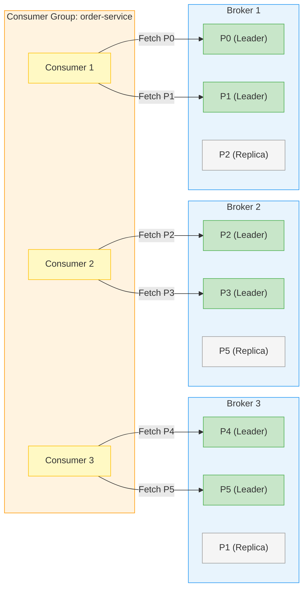
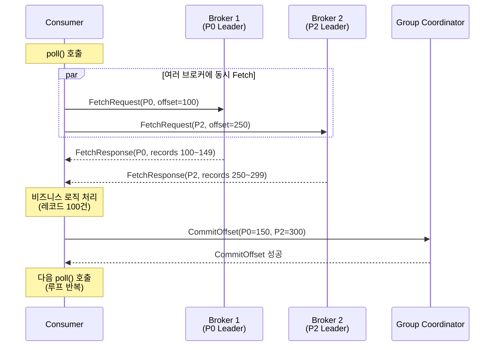
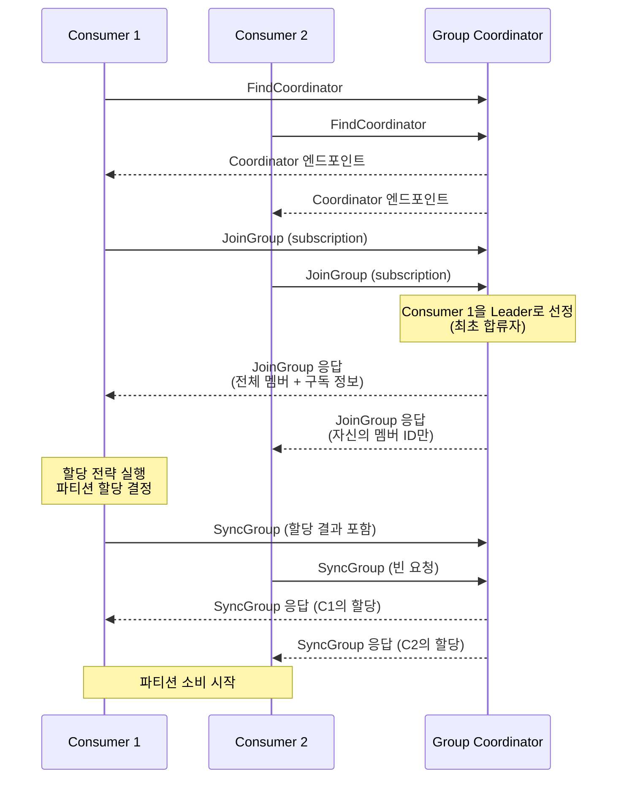

# 06. Consumer Group 프로토콜

Consumer Group의 내부 동작 원리 — Group Coordinator, 파티션 할당, 리밸런스 프로토콜, 성능 최적화

> **rpk 명령어**는 [05-core-features.md](./05-core-features.md) 참조
> **트랜잭션과의 관계**는 [12-transactions.md](./16-transactions.md) 참조

---

## 1. Consumer Group이란

Kafka/Redpanda에서 **Consumer Group**은 같은 토픽을 병렬로 소비하는 Consumer 인스턴스의 논리적 묶음입니다. 부하를 Consumer 인스턴스들 사이에 균등하게 분배하는 핵심 메커니즘입니다.

### 왜 필요한가

단일 Consumer로 초당 100만 건의 메시지를 처리할 수 없다면, Consumer를 늘려야 합니다. 하지만 각 Consumer가 같은 메시지를 중복으로 읽으면 의미가 없습니다. Consumer Group은 **파티션을 Consumer에게 배타적으로 할당**하여, 각 메시지가 그룹 내에서 정확히 하나의 Consumer만 처리하도록 보장합니다.

```
Topic: orders (6 partitions)

Consumer Group "order-service" (3 instances):
  Consumer 1 → Partition 0, 1
  Consumer 2 → Partition 2, 3
  Consumer 3 → Partition 4, 5
```

**핵심 규칙**: 하나의 파티션은 그룹 내 하나의 Consumer에만 할당됩니다. 따라서 Consumer 수가 파티션 수를 초과하면 초과분의 Consumer는 유휴 상태가 됩니다.

### 브로커별 파티션 분산과 Consumer의 Fetch 경로

파티션은 클러스터 내 여러 브로커에 분산 저장됩니다. Consumer는 **자신에게 할당된 파티션의 리더 브로커**에 직접 연결하여 메시지를 가져옵니다. 따라서 하나의 Consumer가 여러 브로커에 동시에 연결하는 것은 흔한 일입니다.



위 다이어그램에서 주목할 점은 다음과 같습니다:

- **Consumer는 Leader 파티션에만 Fetch 요청을 보냅니다.** Replica는 내구성을 위한 복제본이며 Consumer가 직접 읽지 않습니다(KIP-392 Follower Fetching을 활성화하지 않은 기본 설정 기준).
- **Consumer 1은 Broker 1에 두 번 연결합니다.** P0과 P1 모두 Broker 1에 있기 때문입니다. 반면 Consumer 2는 Broker 2 하나에만 연결하지만 두 파티션(P2, P3)을 소비합니다.
- **브로커 수와 Consumer 수는 독립적입니다.** 3개 브로커에 6개 파티션, 3개 Consumer라는 조합에서 각 Consumer는 자신이 담당하는 파티션이 어느 브로커에 있든 상관없이 해당 브로커에 연결합니다.

### Consumer의 메시지 처리 흐름

단일 Consumer가 브로커로부터 메시지를 가져와 처리하는 과정은 poll-process-commit 루프로 동작합니다.



`poll()` 한 번의 호출로 **할당된 모든 파티션의 데이터를 한꺼번에 가져옵니다.** 내부적으로 Consumer 클라이언트는 각 파티션의 Leader 브로커에 병렬로 FetchRequest를 보내고, 응답을 모아서 하나의 `ConsumerRecords` 객체로 반환합니다. 처리 완료 후 각 파티션의 다음 오프셋을 Coordinator에 커밋하면 한 사이클이 끝납니다.

### 기본 설정

```java
Properties props = new Properties();
props.put("group.id", "order-service");          // Consumer Group 이름
props.put("bootstrap.servers", "localhost:9092");
props.put("key.deserializer", StringDeserializer.class);
props.put("value.deserializer", StringDeserializer.class);

KafkaConsumer<String, String> consumer = new KafkaConsumer<>(props);
consumer.subscribe(Arrays.asList("orders", "payments"));  // 토픽 구독
```

`group.id`가 같은 모든 Consumer 인스턴스가 하나의 Consumer Group을 형성합니다.

---

## 2. Group Coordinator

### 역할

**Group Coordinator**는 Consumer Group의 멤버십과 파티션 할당을 관리하는 브로커 내부 컴포넌트입니다. 각 Consumer Group에는 하나의 Group Coordinator가 지정됩니다.

### Coordinator 결정 방법

Group Coordinator는 내부 토픽 `__consumer_offsets`의 파티션 리더에 의해 결정됩니다.

```
1. group.id를 해시하여 __consumer_offsets의 파티션 번호 결정
   partition = hash("order-service") % __consumer_offsets 파티션 수

2. 해당 파티션의 리더 브로커 = 이 그룹의 Group Coordinator
```

`__consumer_offsets` 토픽은 복제되므로, Coordinator가 장애를 겪어도 새 파티션 리더가 자동으로 Coordinator 역할을 이어받습니다.

### 책임

| 책임 | 설명 |
|------|------|
| **멤버십 관리** | Consumer의 JoinGroup/LeaveGroup 요청 처리 |
| **리밸런스 조율** | 멤버 변경 시 파티션 재할당 프로세스 주도 |
| **오프셋 저장** | Consumer의 CommitOffset 요청을 `__consumer_offsets`에 저장 |
| **Heartbeat 모니터링** | Consumer 생존 확인, 타임아웃 시 리밸런스 트리거 |

---

## 3. JoinGroup / SyncGroup 프로토콜

Consumer Group이 시작되거나 리밸런스가 발생하면, **JoinGroup → SyncGroup** 2단계 프로토콜이 실행됩니다.

### 전체 흐름



### 왜 Group Leader가 할당을 결정하는가?

Coordinator가 직접 할당할 수도 있지만, **할당 로직을 Consumer 측(플러그인)으로 분리**한 설계입니다. 이를 통해 애플리케이션이 자체 할당 전략(예: 특정 파티션을 특정 인스턴스에 고정)을 구현할 수 있습니다. Coordinator는 범용 프로토콜만 처리하고, 비즈니스 특화 할당은 Group Leader에 위임합니다.

---

## 4. 파티션 할당 전략

Group Leader가 사용하는 할당 전략(Assignor)은 플러그인 방식으로 교체 가능합니다.

### Range Assignor

토픽별로 파티션을 Consumer에게 순서대로 분배합니다.

```
Topic A: [P0, P1]    Topic B: [P0, P1]
Consumer 1, Consumer 2, Consumer 3

할당 결과:
  Consumer 1 → Topic A: P0, Topic B: P0
  Consumer 2 → Topic A: P1, Topic B: P1
  Consumer 3 → (유휴)
```

**핵심 장점: 코로케이션(Colocation)**. 같은 키를 공유하는 두 토픽에서 같은 파티션 번호가 같은 Consumer에 할당됩니다. 이를 통해 **로컬 조인(join)**이 가능합니다. 예를 들어 `orders` 토픽의 P0과 `payments` 토픽의 P0이 같은 Consumer에 할당되면, 같은 `orderId` 키를 가진 레코드들을 네트워크 없이 로컬에서 조인할 수 있습니다.

**단점**: Consumer 수가 파티션 수보다 많으면 유휴 Consumer가 발생합니다.

### Round Robin Assignor

토픽 경계를 무시하고, 모든 파티션을 Consumer에게 순환 분배합니다.

```
모든 파티션: [A-P0, A-P1, B-P0, B-P1]
Consumer 1, Consumer 2, Consumer 3

할당 결과:
  Consumer 1 → A-P0, B-P1
  Consumer 2 → A-P1
  Consumer 3 → B-P0
```

**장점**: 모든 Consumer에게 작업이 분배되어 **병렬성이 극대화**됩니다.
**단점**: 코로케이션이 보장되지 않으므로 로컬 조인이 불가능합니다.

### Sticky Assignor

Round Robin의 개선 버전으로, 리밸런스 시 **이전 할당을 최대한 유지**합니다.

```
리밸런스 전:
  Consumer 1 → P0, P1
  Consumer 2 → P2, P3

Consumer 3 합류 후 (Sticky):
  Consumer 1 → P0, P1        (유지)
  Consumer 2 → P2             (P3만 해제)
  Consumer 3 → P3             (해제된 P3 받음)

Consumer 3 합류 후 (Round Robin이었다면):
  Consumer 1 → P0, P3        (P1 해제, P3 새로 받음)
  Consumer 2 → P1             (P2 해제, P1 새로 받음)
  Consumer 3 → P2             (P2 받음)
```

**왜 중요한가?** Kafka Streams처럼 파티션별 내부 상태(State Store)를 유지하는 애플리케이션에서, 파티션 재할당은 상태 재구축 비용을 의미합니다. Sticky Assignor는 불필요한 파티션 이동을 최소화하여 이 비용을 줄입니다.

### 전략 선택 가이드

| 전략 | 적합한 경우 | 부적합한 경우 |
|------|------------|-------------|
| **Range** | 토픽 간 키 기반 조인이 필요할 때 | 파티션 수 < Consumer 수 |
| **Round Robin** | 최대 병렬성이 필요하고 조인이 불필요할 때 | 상태 유지 애플리케이션 |
| **Sticky** | Kafka Streams, 상태 유지 애플리케이션 | 특별한 할당 규칙이 필요할 때 |

---

## 5. 오프셋 추적

Consumer Group은 각 파티션에서 마지막으로 처리한 위치를 추적합니다.

### 동작 방식

```
Consumer → Coordinator: CommitOffsetRequest(topic=orders, partition=0, offset=1001)
Coordinator → __consumer_offsets: 오프셋 저장

--- Consumer 재시작 ---

Consumer → Coordinator: OffsetFetchRequest(topic=orders, partition=0)
Coordinator → Consumer: offset=1001
Consumer: offset 1001부터 소비 재개
```

- `__consumer_offsets` 토픽은 **복제**되어 있으므로, Coordinator 장애 시에도 오프셋이 유실되지 않습니다.
- Consumer 인스턴스가 최초 시작이고 저장된 오프셋이 없으면, `auto.offset.reset` 설정에 따라 **earliest**(처음부터) 또는 **latest**(최신부터) 소비를 시작합니다.

### 자동 vs 수동 커밋

| 방식 | 설정 | 특징 |
|------|------|------|
| **자동 커밋** | `enable.auto.commit=true` | 일정 간격(`auto.commit.interval.ms`, 기본 5초)마다 자동 커밋. 간편하지만 중복/유실 가능 |
| **수동 커밋** | `enable.auto.commit=false` | 애플리케이션이 처리 완료 후 명시적으로 `commitSync()` 또는 `commitAsync()` 호출 |

프로덕션에서는 **수동 커밋**이 권장됩니다. 메시지 처리가 완료된 후에만 오프셋을 커밋하여 데이터 유실을 방지합니다.

---

## 6. 리밸런스 프로토콜

### 리밸런스 트리거

다음 상황에서 리밸런스가 발생합니다:

| 트리거 | 설명 |
|--------|------|
| **Consumer 장애** | Heartbeat 타임아웃(`session.timeout.ms`) 초과 |
| **새 Consumer 합류** | 그룹에 새로운 Consumer 인스턴스 추가 |
| **파티션 추가** | 구독 중인 토픽에 파티션이 추가됨 |
| **토픽 매칭** | 와일드카드 구독 시 새 토픽이 패턴에 매칭 |

### Stop-the-World 리밸런스의 문제

초기 리밸런스 프로토콜(Eager Protocol)은 **모든 Consumer가 모든 파티션을 해제한 후 재할당**하는 방식이었습니다.

```
리밸런스 전:
  Consumer 1 → P0, P1
  Consumer 2 → P2, P3

Consumer 3 합류 → 리밸런스 시작

1단계: 모든 Consumer가 파티션 해제
  Consumer 1 → (없음)  ← P0, P1 처리 중단!
  Consumer 2 → (없음)  ← P2, P3 처리 중단!

2단계: JoinGroup/SyncGroup 프로토콜 실행

3단계: 새 할당
  Consumer 1 → P0, P1  ← 상태 재구축 필요 (불필요!)
  Consumer 2 → P2
  Consumer 3 → P3

문제점:
  ❌ P0, P1은 같은 Consumer에 다시 할당됨 → 상태 재구축이 낭비
  ❌ 리밸런스 동안 모든 파티션의 처리가 중단됨
```

**두 가지 핵심 문제**:
1. **불필요한 상태 재구축**: P0, P1은 Consumer 1에 다시 할당되지만, 상태를 이미 해제했으므로 처음부터 재구축해야 함
2. **전체 처리 중단**: 리밸런스 동안 모든 파티션의 메시지 처리가 멈춤

---

## 7. 개선된 리밸런스 프로토콜

### Cooperative Sticky Assignor (점진적 리밸런스)

Cooperative Sticky Assignor는 **필요한 파티션만 해제하고, 나머지는 계속 처리**하는 점진적(Incremental) 리밸런스를 구현합니다.

```
리밸런스 전:
  Consumer 1 → P0, P1, P2
  Consumer 2 → P3, P4

Consumer 3 합류 → 리밸런스 시작

1단계 (1차 리밸런스):
  Coordinator: "각 Consumer, 현재 할당을 보고하라"
  Consumer 1: "P0, P1, P2 보유 중"
  Consumer 2: "P3, P4 보유 중"

  Group Leader: "P2만 Consumer 1에서 해제"
  Consumer 1 → P0, P1      ← P0, P1은 계속 처리! ✅
  Consumer 2 → P3, P4      ← 계속 처리! ✅
  Consumer 3 → (대기)

2단계 (2차 리밸런스):
  Group Leader: "해제된 P2를 Consumer 3에 할당"
  Consumer 1 → P0, P1      ← 처리 중단 없음 ✅
  Consumer 2 → P3, P4      ← 처리 중단 없음 ✅
  Consumer 3 → P2           ← 새로 할당 ✅
```

**핵심 개선**: P0, P1, P3, P4의 처리가 **단 한 번도 중단되지 않았습니다**. P2만 잠시 해제되었다가 Consumer 3에 할당되었습니다.

### Eager vs Cooperative 비교

| 기준 | Eager (Stop-the-World) | Cooperative (Incremental) |
|------|----------------------|--------------------------|
| 파티션 해제 | **전체** 해제 후 재할당 | **필요한 것만** 해제 |
| 처리 중단 | 모든 파티션 중단 | 이동 대상 파티션만 중단 |
| 리밸런스 횟수 | 1회 | 2회 (해제 → 재할당) |
| 상태 재구축 | 불필요한 재구축 발생 | 최소화 |
| 적합 환경 | 레거시 호환 | **프로덕션 권장** |

### 설정 방법

```java
// Cooperative Sticky Assignor 활성화
props.put("partition.assignment.strategy",
    "org.apache.kafka.clients.consumer.CooperativeStickyAssignor");
```

---

## 8. Static Group Membership

### 문제: 불필요한 리밸런스

가장 흔한 리밸런스 원인은 **Consumer 인스턴스 재시작**(배포, 설정 변경 등)입니다. Consumer가 종료되면 `LeaveGroup` 요청이 전송되어 즉시 리밸런스가 트리거되지만, 잠시 후 같은 인스턴스가 다시 돌아옵니다. 이 경우 리밸런스는 완전히 불필요합니다.

### 해결: Static Membership

**Static Group Membership**은 각 Consumer에 고정된 `group.instance.id`를 할당하여, 재시작 시 리밸런스를 회피합니다.

```java
props.put("group.instance.id", "consumer-host-1");  // 고정 ID
props.put("session.timeout.ms", "30000");            // 30초 이내 복귀 예상
```

**동작 방식**:

1. Consumer가 종료되어도 **LeaveGroup 요청을 보내지 않음**
2. Coordinator는 `session.timeout.ms` 동안 해당 Consumer가 돌아올 것으로 기대하고 **리밸런스를 보류**
3. Consumer가 타임아웃 내에 재시작하면, Coordinator는 **이전과 동일한 파티션 할당**을 반환
4. 상태 재구축 없이 즉시 처리 재개

```
Static Membership (group.instance.id="host-1"):

Consumer (host-1) 종료 → LeaveGroup 안 보냄
Coordinator: "host-1이 30초 내 돌아올 것으로 기대, 리밸런스 안 함"

15초 후 Consumer (host-1) 재시작
Consumer → Coordinator: JoinGroup (group.instance.id="host-1")
Coordinator: "host-1 돌아왔네, 같은 파티션 할당"
→ 리밸런스 없음, 상태 재구축 없음 ✅
```

### 적합한 사용 사례

| 사례 | 적합 여부 | 이유 |
|------|-----------|------|
| 롤링 배포 | 적합 | 인스턴스가 순차적으로 재시작, 빠르게 복귀 |
| 설정 변경 재시작 | 적합 | 같은 인스턴스가 같은 역할로 복귀 |
| 스케일 아웃/인 | 부적합 | 인스턴스 수 자체가 변경되므로 리밸런스 필요 |
| Kubernetes Pod 스케줄링 | 주의 | StatefulSet + 고정 ID 조합으로 활용 가능 |

---

## 9. Consumer 핵심 설정

Consumer의 안정성과 성능은 아래 파라미터에 의해 결정됩니다. 잘못 설정하면 불필요한 리밸런스가 반복되거나 장애 감지가 지연됩니다.

### Heartbeat와 Session

| 파라미터 | 기본값 | 역할 |
|---------|--------|------|
| `session.timeout.ms` | 45000 (45초) | 이 시간 안에 Heartbeat가 없으면 Coordinator가 Consumer를 죽은 것으로 판단하고 리밸런스 트리거 |
| `heartbeat.interval.ms` | 3000 (3초) | Heartbeat 전송 간격. `session.timeout.ms`의 1/3 이하 권장 |

### Poll과 처리

| 파라미터 | 기본값 | 역할 |
|---------|--------|------|
| `max.poll.interval.ms` | 300000 (5분) | `poll()` 호출 간격 최대 허용 시간. 초과하면 리밸런스 |
| `max.poll.records` | 500 | `poll()` 한 번에 가져오는 최대 레코드 수 |
| `fetch.min.bytes` | 1 | 브로커가 응답 전 최소 데이터 크기. 높이면 배치 효율 증가, 지연 증가 |
| `fetch.max.wait.ms` | 500 | `fetch.min.bytes` 미충족 시 최대 대기 시간 |

### session.timeout.ms vs max.poll.interval.ms

이 두 파라미터는 자주 혼동되지만 감지하는 장애 유형이 다릅니다.

- **session.timeout.ms**: **네트워크 레벨** 생존 확인. Heartbeat 스레드가 별도로 전송하므로, Consumer 프로세스 자체가 죽으면(`kill -9`) 이 타임아웃에 걸립니다.
- **max.poll.interval.ms**: **애플리케이션 레벨** 처리 확인. 메시지 처리가 오래 걸려 `poll()`을 제때 호출하지 못하면 이 타임아웃에 걸립니다.

```
시나리오: 메시지 하나를 처리하는 데 10분 걸리는 Consumer

session.timeout.ms = 45초  → Heartbeat 스레드는 별도이므로 문제 없음 ✅
max.poll.interval.ms = 5분 → poll() 간격이 10분 → 5분 초과 → 리밸런스 ❌

해결: max.poll.interval.ms를 늘리거나, max.poll.records를 줄여 배치 크기 축소
```

### 환경별 권장 설정

| 환경 | session.timeout.ms | max.poll.interval.ms | max.poll.records |
|------|-------------------|---------------------|-----------------|
| 빠른 처리 (< 100ms/건) | 10000 | 300000 | 500 |
| 느린 처리 (외부 API 호출) | 30000 | 600000 | 50~100 |
| Kafka Streams | 10000 | 300000 | 500 |
| 배치 처리 | 45000 | 900000 | 1000+ |

---

## 참고

- [Confluent: Consumer Group Protocol](https://developer.confluent.io/courses/architecture/consumer-group-protocol/)
- [KIP-429: Kafka Consumer Incremental Rebalance Protocol](https://cwiki.apache.org/confluence/display/KAFKA/KIP-429)
- [KIP-345: Static Membership](https://cwiki.apache.org/confluence/display/KAFKA/KIP-345)
- rpk 명령어: [05-core-features.md](./05-core-features.md)
- 트랜잭션과 오프셋: [12-transactions.md](./16-transactions.md)

---

## 학습 정리

### 핵심 개념

1. **Consumer Group**: 파티션을 Consumer에 배타적으로 할당하여 병렬 소비를 가능하게 하는 메커니즘. 파티션 1개 = Consumer 1개
2. **Group Coordinator**: `__consumer_offsets` 파티션 리더가 담당. 멤버십, 오프셋, 리밸런스를 관리
3. **JoinGroup/SyncGroup**: 2단계 프로토콜. Group Leader가 할당을 결정하여 할당 전략을 플러그인화
4. **할당 전략**: Range(코로케이션/조인), Round Robin(최대 병렬성), Sticky(상태 보존)
5. **Cooperative Sticky**: 점진적 리밸런스로 처리 중단 최소화. 필요한 파티션만 해제
6. **Static Membership**: 고정 `group.instance.id`로 재시작 시 불필요한 리밸런스 회피
7. **session vs poll timeout**: session은 프로세스 생존, poll은 처리 속도를 감지. 혼동하면 불필요한 리밸런스 발생
