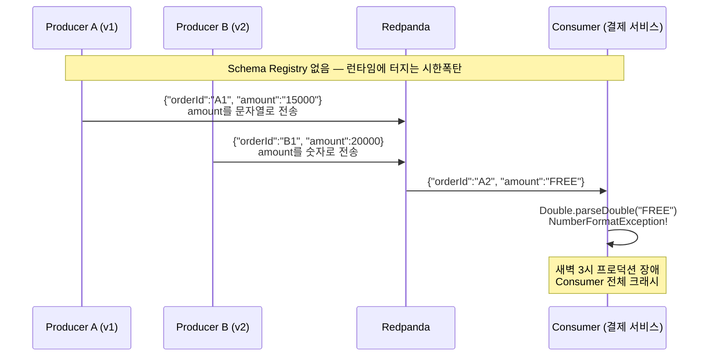
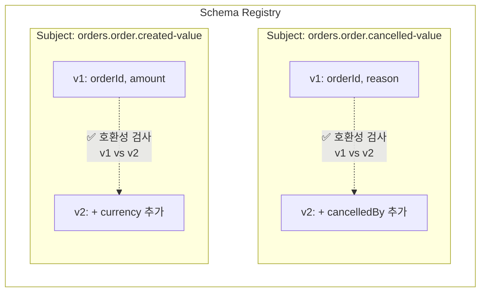
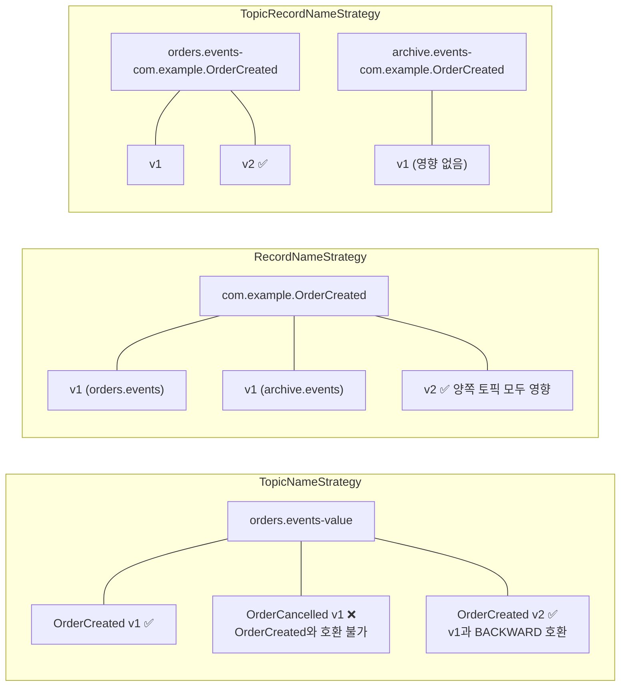
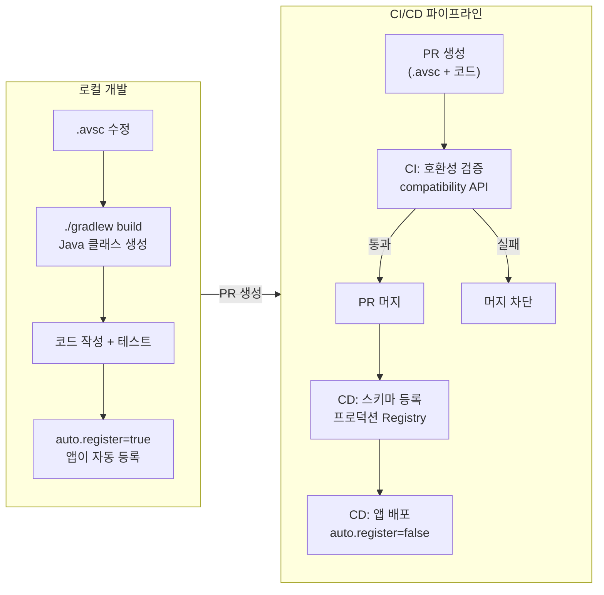

# 07. Schema Registry

스키마 관리가 왜 필요한지, Redpanda 내장 Schema Registry의 동작 원리, 프로덕션 운영 가이드

> **Avro 심화** (문법, 타입, 직렬화, 진화 규칙): [08-avro-deep-dive.md](./08-avro-deep-dive.md)
> **Spring Boot 연동**: [03-spring-boot-integration/](../03-spring-boot-integration/)
> **메시지 규격 설계** (CloudEvents, AsyncAPI): [09-message-schema-design.md](./09-message-schema-design.md)

---

## 1. Schema Registry가 왜 필요한가

### Schema Registry란 무엇인가

메시지 큐에서는 DB와 달리 **아무도 데이터 구조를 강제하지 않습니다.** Producer가 아무 형태의 바이트 배열이나 보내도 Redpanda는 그냥 저장합니다.

**Schema Registry는 스키마를 중앙에서 저장하고, 버전을 관리하고, 호환성을 검증하는 서버**입니다.

1. **스키마 저장소**: Producer가 등록하고, Consumer가 조회
2. **버전 관리**: 데이터 구조의 버전을 v1, v2, v3... 으로 이력 관리
3. **호환성 검증**: 새 버전이 이전 버전과 호환되는지 자동 검증. 호환되지 않으면 등록 자체를 거부

Swagger/OpenAPI 문서와 비슷하지만 **강제력이 있습니다.** 스키마에 맞지 않으면 직렬화 단계에서 전송 자체가 실패합니다.

### Schema Registry 없이 vs 사용 시



Redpanda는 바이트 배열을 저장할 뿐 내용을 검증하지 않으므로, 오류는 Consumer가 읽는 시점에서야 드러납니다. 팀들이 메시지 포맷을 독립적으로 변경하면 데이터 파이프라인이 **조용히 깨집니다** (Schema Drift).

Schema Registry를 사용하면 Producer의 Serializer 단계에서 타입 위반을 즉시 차단합니다. 이벤트 기반 시스템의 **계약을 인프라 수준에서 강제**하는 것입니다.

---

## 2. Redpanda 내장 Schema Registry

Confluent Kafka에서는 Schema Registry를 별도 JVM 프로세스로 운영해야 하지만, Redpanda는 **브로커 바이너리 안에 내장**했습니다. Confluent Schema Registry API와 100% 호환(포트 8081)이므로 기존 Kafka 클라이언트 코드 수정이 불필요합니다. 스키마 데이터는 내부 토픽 `_schemas`에 Raft 복제로 저장됩니다.

| 포맷 | 특성 | 권장 사용 사례 |
|------|------|--------------|
| Avro | 스키마 진화에 최적, 컴팩트 바이너리 | 대부분의 프로덕션 |
| Protobuf | 강타입, gRPC 호환 | gRPC 기반 마이크로서비스 |
| JSON Schema | 사람이 읽기 쉬움 | 개발/디버깅 |

등록 시 `schemaType` 필드로 구분하며, Avro는 생략 시 기본값입니다.

---

## 3. Wire Format

Schema Registry를 사용하는 메시지는 다음 바이너리 포맷으로 인코딩됩니다:

| 바이트 | 내용 | 설명 |
|--------|------|------|
| 1 byte | `0x00` | Magic Byte (Schema Registry 사용 표시) |
| 4 bytes | Schema ID | Big-endian 정수 |
| N bytes | Avro/Protobuf 바이너리 | 실제 데이터 |

Producer의 Serializer가 이 포맷으로 인코딩하고, Consumer의 Deserializer가 Schema ID를 추출하여 Schema Registry에서 스키마를 조회합니다. 스키마는 로컬에 캐싱되므로 매 메시지마다 네트워크 호출이 발생하지는 않습니다.

> **직렬화/역직렬화 상세** (바이너리 인코딩 원리, Writer/Reader Schema, Schema Resolution): [08-avro-deep-dive.md](./08-avro-deep-dive.md) §4 참조

---

## 4. 기본 API 및 클라이언트 동작

> **Docker 환경 실습 전제**: 아래 curl 예시는 `project/docker-compose.yml`의 포트 매핑 기준입니다. Schema Registry 외부 포트는 **18081**입니다.

### 스키마 등록

```bash
# Avro 스키마 등록 (v1)
curl -X POST http://localhost:18081/subjects/orders-value/versions \
  -H "Content-Type: application/vnd.schemaregistry.v1+json" \
  -d '{"schemaType":"AVRO","schema":"{\"type\":\"record\",\"name\":\"Order\",\"namespace\":\"com.example\",\"fields\":[{\"name\":\"orderId\",\"type\":\"string\"},{\"name\":\"amount\",\"type\":\"double\"}]}"}'

# Avro 스키마 진화 (v2: currency 필드 추가)
curl -X POST http://localhost:18081/subjects/orders-value/versions \
  -H "Content-Type: application/vnd.schemaregistry.v1+json" \
  -d '{"schemaType":"AVRO","schema":"{\"type\":\"record\",\"name\":\"Order\",\"namespace\":\"com.example\",\"fields\":[{\"name\":\"orderId\",\"type\":\"string\"},{\"name\":\"amount\",\"type\":\"double\"},{\"name\":\"currency\",\"type\":\"string\",\"default\":\"KRW\"}]}"}'

# Protobuf 스키마 등록 (별도 subject)
curl -X POST http://localhost:18081/subjects/orders-proto-value/versions \
  -H "Content-Type: application/vnd.schemaregistry.v1+json" \
  -d '{"schemaType":"PROTOBUF","schema":"syntax = \"proto3\"; message Order { string order_id = 1; double amount = 2; }"}'
```

응답의 `id`가 메시지에 포함되는 **Schema ID**입니다.

### 스키마 조회 / 삭제

```bash
# 조회
curl http://localhost:18081/subjects/orders-value/versions/latest  # 최신 버전
curl http://localhost:18081/subjects/orders-value/versions          # 전체 버전 목록
curl http://localhost:18081/subjects                                # 전체 Subject 목록

# 삭제
curl -X DELETE http://localhost:18081/subjects/orders-value/versions/1       # Soft delete
curl -X DELETE "http://localhost:18081/subjects/orders-value?permanent=true" # Hard delete (복구 불가)
```

Hard delete는 `_schemas` 토픽에서 완전히 제거되므로 **프로덕션에서는 극도로 신중하게** 사용해야 합니다.

### 호환성 테스트

등록 **전에** 호환성을 미리 검증할 수 있습니다. CI/CD에서 필수적입니다.

```bash
curl -X POST http://localhost:18081/compatibility/subjects/orders-value/versions/latest \
  -H "Content-Type: application/vnd.schemaregistry.v1+json" \
  -d '{"schema":"{...}"}'
# 응답: {"is_compatible": true} — false이면 등록 거부
```

### 캐싱 동작

Producer와 Consumer는 스키마를 처음 한 번 조회한 후 로컬에 캐싱합니다. 이후 메시지는 Schema Registry에 매번 요청하지 않습니다. 캐싱 주체는 `KafkaAvroSerializer`/`KafkaAvroDeserializer`(Confluent 라이브러리)이며, 프로세스 종료 시 캐시도 사라지고 재시작 시 재조회합니다.

| 접근 방식 | 캐싱 | 검증 |
|----------|------|------|
| Confluent 라이브러리 (Java/Python/Go) | O (자동) | O (자동) |
| Pandaproxy (:8082) | X | X |
| curl 직접 호출 | X | 수동 |

Registry가 일시 불가용해도 캐싱된 스키마로 기존 메시지 송수신은 가능합니다. **새 스키마 등록이나 처음 보는 Schema ID 조회**만 불가능합니다.

### Producer/Consumer의 스키마 버전 전환

- **Producer**: `.avsc` 수정 후 새로 빌드해야 v2 사용. 단순 재시작은 jar 안의 v1을 그대로 사용
- **Consumer**: 코드 변경 불필요. 처음 보는 Schema ID가 오면 자동으로 Registry에 조회

| 상황 | 동작 | 문제 여부 |
|------|------|----------|
| v2 등록 후 Producer jar가 아직 v1 | 캐시된 ID:1로 계속 전송 | 문제 없음 |
| Consumer가 처음 보는 Schema ID 수신 | 자동으로 Registry에 조회 | 문제 없음 |
| Schema Registry 다운 + 새 Schema ID 수신 | 조회 실패 → 역직렬화 실패 | **이때만 문제** |

캐시는 "새 버전을 모른다"가 아니라 **"아직 만나지 않은 Schema ID를 모른다"**입니다. 만나는 순간 자동 조회하므로 캐시 무효화 정책이 불필요합니다.

---

## 5. 호환성 모드

### 모드 종류

| 모드 | 설명 | 배포 순서 |
|------|------|----------|
| BACKWARD (기본) | 새 스키마가 이전 데이터 읽기 가능 | Consumer 먼저 |
| FORWARD | 이전 스키마가 새 데이터 읽기 가능 | Producer 먼저 |
| FULL | 양방향 호환 | 순서 무관 (권장) |
| NONE | 호환성 검사 안 함 | 개발 환경 전용 |
| BACKWARD_TRANSITIVE | 모든 이전 버전과 BACKWARD 호환 | Consumer 먼저 |
| FORWARD_TRANSITIVE | 모든 이전 버전과 FORWARD 호환 | Producer 먼저 |
| FULL_TRANSITIVE | 모든 이전 버전과 FULL 호환 | 가장 엄격 |

### 호환성 설정 API

```bash
# 전역 설정 확인/변경
curl http://localhost:18081/config
curl -X PUT http://localhost:18081/config \
  -H "Content-Type: application/vnd.schemaregistry.v1+json" \
  -d '{"compatibility": "FULL"}'

# Subject별 설정 (전역 설정 오버라이드)
curl -X PUT http://localhost:18081/config/orders-value \
  -H "Content-Type: application/vnd.schemaregistry.v1+json" \
  -d '{"compatibility": "FULL_TRANSITIVE"}'
```

Subject별로 전역 설정을 오버라이드할 수 있습니다.

### 각 모드의 핵심 원리

| 모드 | 질문 | 허용 | 금지 |
|------|------|------|------|
| BACKWARD | 새 Consumer가 옛 데이터를 읽을 수 있는가? | 기본값 있는 필드 추가, 필드 삭제 | 기본값 없는 필드 추가, 타입 변경 |
| FORWARD | 옛 Consumer가 새 데이터를 읽을 수 있는가? | 필드 추가(무시됨), 기본값 있는 필드 삭제 | 기본값 없는 필드 삭제, 타입 변경 |
| FULL | 양방향 모두 가능한가? | 기본값 있는 필드 추가/삭제만 | 기본값 없는 필드 변경 일체 |

FULL의 핵심: **"기본값이 열쇠다."** 추가든 삭제든 기본값 필수.

> **스키마 진화 규칙 상세** (JSON 예시, 요약표, 안전한/위험한 변경): [08-avro-deep-dive.md](./08-avro-deep-dive.md) §5 참조

### 배포 순서

호환성 모드는 **배포 순서를 결정**합니다.

- **BACKWARD** → Consumer 먼저 배포 (새 Consumer가 옛 데이터를 읽을 수 있으므로)
- **FORWARD** → Producer 먼저 배포 (옛 Consumer가 새 데이터를 읽을 수 있으므로)
- **FULL** → 순서 무관 (양방향 호환, 배포 자유도 최고, 스키마 제약 최대)

### Transitive vs Non-Transitive

Non-transitive(기본)는 **직전 버전**과만, Transitive는 **모든 이전 버전**과 검증합니다. 장기 보관 토픽처럼 여러 버전의 데이터를 동시에 읽을 가능성이 있으면 Transitive가 안전합니다.

### 권장 전략

| 환경 | 권장 모드 | 이유 |
|------|----------|------|
| 개발/스테이징 | BACKWARD | 유연한 반복 개발 |
| 프로덕션 (일반) | FULL | 배포 순서 무관, 안전 |
| 프로덕션 (장기 보관) | FULL_TRANSITIVE | 모든 버전 호환 보장 |

---

## 6. Subject Naming Strategy

### Subject란

Subject는 Schema Registry에서 **스키마 버전을 묶는 논리적 그룹**입니다. 하나의 Subject 안에 v1, v2, v3... 스키마 버전이 쌓이고, 호환성 검사는 **같은 Subject 내의 이전 버전과** 비교하여 수행됩니다. Subject가 다르면 호환성 검사가 독립적입니다.



> **포인트**: v2 등록 시 호환성 검사는 **같은 Subject 내의 이전 버전과만** 수행된다. S1의 v2는 S1의 v1과만 비교하고, S2의 스키마와는 무관하다.

Subject Naming Strategy는 **"어떤 기준으로 Subject를 만들 것인가"**를 결정합니다. 이 선택이 "어떤 스키마끼리 호환성 검사를 받는가"를 결정하므로 토픽 설계와 직결됩니다.

### 전략은 실제 Java 클래스 설정이다

`TopicNameStrategy`, `RecordNameStrategy`, `TopicRecordNameStrategy`는 Confluent Serializer의 `SubjectNameStrategy` 인터페이스 구현체입니다.

```yaml
spring:
  kafka:
    properties:
      value.subject.name.strategy: io.confluent.kafka.serializers.subject.TopicNameStrategy
```

### 3가지 전략이 생성하는 Subject 이름

```
토픽: orders.events / 레코드: com.example.OrderCreated

TopicNameStrategy (기본):     "orders.events-value"
  → 토픽당 하나의 스키마만 허용

RecordNameStrategy:           "com.example.OrderCreated"
  → 레코드 타입별 독립. 같은 레코드는 모든 토픽에서 같은 스키마 공유

TopicRecordNameStrategy:      "orders.events-com.example.OrderCreated"
  → 토픽+레코드 조합별 독립. 가장 유연
```

### 전략별 스키마 진화 시나리오

`orders.events` 토픽에 `OrderCreated`와 `OrderCancelled` 두 이벤트를 넣는 상황:

**TopicNameStrategy**: Subject가 `orders.events-value` 하나뿐이므로 `OrderCancelled`를 등록하면 `OrderCreated`와 호환성 검사 → **실패**. 하나의 토픽에 하나의 스키마 타입만 허용됩니다.

**RecordNameStrategy**: Subject가 레코드별 독립(`com.example.OrderCreated`, `com.example.OrderCancelled`). 같은 토픽에 여러 이벤트 가능합니다. 단, 같은 레코드 타입은 **모든 토픽에서 같은 스키마를 공유**합니다. `orders.events`와 `archive.events`에서 모두 `OrderCreated`를 쓰면, 한쪽에서 변경하면 다른 쪽에도 영향이 갑니다.

**TopicRecordNameStrategy**: 토픽+레코드 조합별 독립. 같은 레코드 타입이라도 토픽이 다르면 독립적으로 진화 가능합니다. 가장 유연하지만 Subject 수가 `토픽 수 × 레코드 타입 수`로 증가합니다.

### .avsc 기반 호환성 검사 예시

다음 상황을 가정합니다:

- `.avsc` 파일 2개: `OrderCreated`(v1→v2), `OrderCancelled`(v1)
- 토픽 2개: `orders.events`, `archive.events`
- v2 변경: `OrderCreated`에 `currency` 필드 추가 (default: "KRW")

```
# OrderCreated.avsc (v1)                    # OrderCreated.avsc (v2)
{"type":"record",                           {"type":"record",
 "name":"OrderCreated",                      "name":"OrderCreated",
 "namespace":"com.example",                  "namespace":"com.example",
 "fields":[                                  "fields":[
   {"name":"orderId","type":"string"},          {"name":"orderId","type":"string"},
   {"name":"amount","type":"double"}            {"name":"amount","type":"double"},
 ]}                                             {"name":"currency","type":"string",
                                                 "default":"KRW"}
                                              ]}

# OrderCancelled.avsc (v1) — OrderCreated와 완전히 다른 레코드 타입
{"type":"record",
 "name":"OrderCancelled",
 "namespace":"com.example",
 "fields":[
   {"name":"orderId","type":"string"},
   {"name":"cancelledAt","type":"long"},
   {"name":"reason","type":"string"}
 ]}
```

**v2를 등록할 때, 전략별로 "무엇과 비교하는가"가 달라집니다:**

| 전략 | 생성되는 Subject | v2 등록 시 비교 대상 |
|------|-----------------|-------------------|
| **TopicNameStrategy** | `orders.events-value` (1개) | Subject에 OrderCreated v1이 먼저 등록된 상태 → OrderCancelled v1 등록 시도도 **실패** (서로 다른 레코드 타입), OrderCreated v2 등록은 v1과만 비교하므로 **성공** |
| **RecordNameStrategy** | `com.example.OrderCreated` | OrderCreated v1과만 비교 → **성공**. 단, `archive.events`에서도 같은 Subject를 공유하므로 양쪽 모두 v2로 전환됨 |
| **TopicRecordNameStrategy** | `orders.events-com.example.OrderCreated` | OrderCreated v1과만 비교 → **성공**. `archive.events`의 OrderCreated는 별도 Subject이므로 영향 없음 |



핵심은 **Subject가 호환성 검사의 경계**라는 것입니다. 같은 `.avsc` 파일이라도 전략에 따라 다른 Subject에 배치되고, Subject가 다르면 서로 호환성 검사를 하지 않습니다.

### Producer-Consumer 전략 불일치 주의

Producer가 `RecordNameStrategy`로 `com.example.OrderCreated` Subject에 스키마를 등록했는데, Consumer가 `TopicNameStrategy`(기본)로 `orders.events-value` Subject에서 찾으면 존재하지 않으므로 역직렬화에 문제가 발생합니다. **Producer와 Consumer는 반드시 같은 전략**을 사용해야 합니다. 팀/조직 단위로 하나의 전략을 표준으로 정하고 모든 서비스가 동일하게 설정해야 합니다.

### 선택 가이드

| 상황 | 전략 | 이유 |
|------|------|------|
| 이벤트 타입별 토픽 분리 | `TopicNameStrategy` (기본) | 토픽=스키마 1:1, 가장 단순 |
| 도메인 단일 토픽에 여러 이벤트 | `TopicRecordNameStrategy` | 토픽 내 각 레코드 타입이 독립 진화 |
| 전사 표준 스키마 공유 | `RecordNameStrategy` | 동일 레코드는 어디서든 같은 스키마 |
| 마이그레이션 중 (점진 전환) | `TopicRecordNameStrategy` | 기존/신규 토픽이 같은 레코드를 써도 독립 진화 가능 |

> **요기요 사례**: 하나의 토픽에 여러 이벤트 타입을 넣는 경우 `TopicNameStrategy`로는 스키마 진화가 어려워 `TopicRecordNameStrategy`를 선택했다. 토픽 세분화 전략과 Subject Naming Strategy는 반드시 동시에 결정해야 한다. ([참고](https://techblog.yogiyo.co.kr/confluent-schema-registry-%EB%8F%84%EC%9E%85%EA%B8%B0-54d112b9b53f))

> **토픽 설계 관점**: 토픽 세분화 수준과 Subject Strategy의 매핑, 토픽 네이밍과의 연계 → [10-topic-design.md](./10-topic-design.md) §1

---

## 7. 개발 워크플로우

### 로컬 개발: 자동 등록

로컬에서 개발할 때는 스키마를 수동으로 등록할 필요가 없습니다. `auto.register.schemas=true`(기본값)로 설정하면 첫 메시지 전송 시 KafkaAvroSerializer가 자동으로 Schema Registry에 등록합니다. `.avsc` 파일만 작성하고 코드를 짜면 됩니다.

```yaml
# application-local.yml
spring:
  kafka:
    bootstrap-servers: localhost:19092
    producer:
      properties:
        schema.registry.url: http://localhost:18081
        auto.register.schemas: true    # 앱이 알아서 등록
```

### 프로덕션: 파이프라인에서 등록

프로덕션에서는 `auto.register.schemas=false`로 설정하고 **CI/CD 파이프라인만** 스키마를 등록합니다. 자동 등록은 리뷰 없이 스키마가 변경되므로 사고를 원천 차단할 수 없기 때문입니다.

```yaml
# application-prod.yml
spring:
  kafka:
    producer:
      properties:
        auto.register.schemas: false   # 앱은 등록 권한 없음
        use.latest.version: true       # Registry에서 최신 버전 조회만
```

### 배포 흐름



핵심은 **로컬에서는 `.avsc`와 코드를 동시에 개발**하고, **프로덕션에서는 파이프라인이 스키마 등록과 앱 배포를 순서대로 처리**한다는 것입니다. `.avsc`를 먼저 배포하고 나중에 코드를 짜는 것이 아닙니다.

### 환경별 설정 요약

| 설정 | 로컬 | 스테이징 | 프로덕션 |
|------|------|---------|---------|
| `auto.register.schemas` | `true` | `true`/`false` | **`false`** |
| `use.latest.version` | 미설정 | 미설정 | `true` |
| 스키마 등록 주체 | 앱 자동 | 앱 또는 파이프라인 | **파이프라인만** |
| 호환성 모드 | BACKWARD | BACKWARD/FULL | **FULL** |
| 호환성 검증 | 없음 | CI에서 검증 | **CI 필수 게이트** |

> **Spring Boot + Avro 설정 상세** (의존성, Gradle 플러그인, Producer/Consumer 코드, application.yml): [03-spring-boot-integration/](../03-spring-boot-integration/) 참조

---

## 8. 프로덕션 운영 가이드

### 스키마 거버넌스

스키마 변경은 **API 변경과 동일한 수준의 리뷰 프로세스**를 거쳐야 합니다.

- 프로덕션에서는 **CI/CD 파이프라인만** 스키마를 등록하도록 제한
- Redpanda ACL로 `_schemas` 토픽에 대한 쓰기 권한 제어
- PR 리뷰에서 `.avsc` 변경의 하위 호환성 검토

**스키마 린팅 규칙:**
- 필드 이름은 camelCase 사용
- 모든 필드에 기본값 지정 (FULL 호환성 유지)
- namespace는 패키지 경로와 일치

### CI/CD 호환성 검증

```bash
# CI/CD pipeline에서 호환성 검증
COMPATIBLE=$(curl -s \
  -X POST http://schema-registry:8081/compatibility/subjects/orders-value/versions/latest \
  -H "Content-Type: application/vnd.schemaregistry.v1+json" \
  -d @new-schema.json | jq -r '.is_compatible')

if [ "$COMPATIBLE" != "true" ]; then
  echo "Breaking schema change detected - deployment blocked"
  exit 1
fi
```

이 검증을 CI의 **필수 단계(required step)** 로 설정하면 호환되지 않는 스키마 변경이 프로덕션에 도달하는 것을 원천 차단합니다.

### 안티패턴

| 안티패턴 | 위험 | 올바른 접근 |
|----------|------|------------|
| NONE 호환성 모드를 프로덕션에서 사용 | 아무 스키마나 등록 가능, 런타임 크래시 | 최소 BACKWARD, 권장 FULL |
| `auto.register.schemas=true` in prod | 의도하지 않은 스키마가 자동 등록 | CI/CD에서만 등록, 앱은 `false` |
| Subject 삭제 후 같은 이름으로 재생성 | Schema ID가 새로 할당되어 기존 메시지 역직렬화 실패 | 새 Subject 이름 사용 |
| 모든 필드를 optional로 설정 | 스키마가 의미 없어짐, 런타임 null 체크 증가 | 핵심 필드는 required, 확장 필드에만 default |
| 하나의 스키마에 모든 이벤트 타입 포함 | 스키마 변경 시 전체 Consumer 영향 | 이벤트 타입별 별도 Subject |

---

## 참고

- [Redpanda Schema Registry](https://docs.redpanda.com/current/manage/schema-reg/)
- [Confluent Schema Registry API Reference](https://docs.confluent.io/platform/current/schema-registry/develop/api.html)
- [Avro Schema Evolution](https://avro.apache.org/docs/current/spec.html#Schema+Resolution)
- 관련 문서: [08-avro-deep-dive.md](./08-avro-deep-dive.md) (Avro 스키마 문법, 타입, 직렬화, 진화 규칙)
- 관련 문서: [09-message-schema-design.md](./09-message-schema-design.md) (CloudEvents, AsyncAPI, 미들웨어별 스키마 제어)
- 관련 문서: [05-core-features.md](./05-core-features.md) (Pandaproxy, Tiered Storage, rpk CLI)
- 관련 문서: [10-topic-design.md](./10-topic-design.md) (토픽 설계, 네이밍)

---

## 학습 정리

### 핵심 개념

1. **Schema Registry의 존재 이유**: Producer/Consumer 간 암묵적 계약을 명시적으로 강제하여 런타임 역직렬화 실패를 방지한다
2. **Redpanda 내장**: 별도 프로세스 없이 브로커 안에서 동작하며, `_schemas` 토픽에 Raft 복제로 저장된다
3. **Wire Format**: `[0x00][Schema ID 4bytes][Data]` — 모든 메시지에 스키마 ID가 포함된다
4. **캐싱**: 클라이언트 라이브러리가 JVM 힙에 자동 캐싱. Registry 다운 시에도 기존 메시지 처리 가능
5. **호환성 모드**: BACKWARD(Consumer 먼저), FORWARD(Producer 먼저), FULL(순서 무관) — 배포 전략을 결정한다
6. **Subject Naming Strategy**: 토픽 설계와 직결. Producer/Consumer 간 전략 불일치는 즉시 장애로 이어진다

### 프로덕션 체크리스트

- [ ] 호환성 모드: FULL 이상으로 설정
- [ ] `auto.register.schemas`: 프로덕션에서 `false`
- [ ] CI/CD에서 호환성 검증 단계 추가
- [ ] Subject Naming Strategy 결정 및 팀 표준화
- [ ] 스키마 변경 리뷰 프로세스 수립
- [ ] 모든 필드에 기본값 지정 (FULL 호환성)
