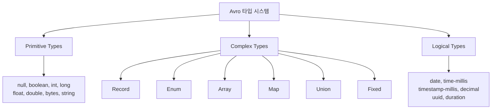
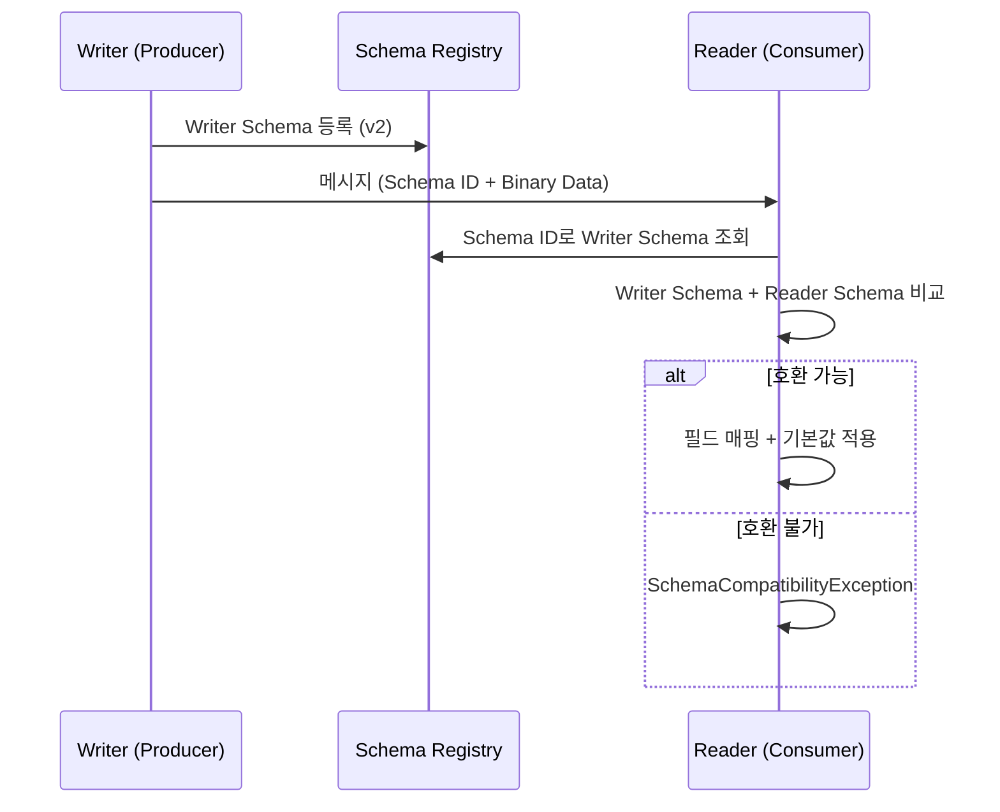

# 08. Apache Avro Deep Dive

Kafka/Redpanda 생태계의 사실상 표준 직렬화 포맷인 Apache Avro의 스키마 문법, 데이터 타입, 직렬화 원리, 스키마 진화 규칙을 상세히 다룹니다.

> **Schema Registry와의 연동**은 [04-schema-registry.md](./07-schema-registry.md) 참조
> **메시지 규격 설계**는 [10-message-schema-design.md](./09-message-schema-design.md) 참조

---

## 1. Avro란 무엇인가

### 왜 Kafka에서 Avro를 쓰는가

Kafka 브로커는 메시지를 **바이트 배열**로 저장합니다. Producer가 뭘 보내든 내용을 검증하지 않습니다. 이 말은 직렬화 포맷을 개발자가 직접 선택해야 한다는 뜻입니다. JSON을 쓸 수도 있고, XML을 쓸 수도 있고, 심지어 `toString()`의 결과를 보낼 수도 있습니다. 문제는 이런 자유가 **런타임 장애의 원인**이 된다는 것입니다.

Apache Avro는 이 문제를 해결하기 위해 만들어진 **스키마 기반 바이너리 직렬화 프레임워크**입니다. 원래 Apache Hadoop 프로젝트에서 대용량 데이터 처리를 위해 개발되었으며, Kafka 생태계에서 사실상의 표준(de facto standard)으로 자리잡았습니다.

Avro가 Kafka에 적합한 이유는 세 가지입니다:

1. **스키마가 데이터와 분리**: 스키마를 Schema Registry에 등록하고, 메시지에는 Schema ID(4바이트)만 포함합니다. JSON처럼 매 메시지마다 필드명을 반복하지 않으므로 페이로드가 작습니다.
2. **스키마 진화(Evolution)가 자유로움**: 필드 추가/삭제 시 기본값(default)만 지정하면, 이전/이후 버전의 Producer/Consumer가 공존할 수 있습니다. Protobuf보다 유연하고, JSON Schema보다 엄격한 적절한 균형입니다.
3. **코드 생성 지원**: `.avsc` 파일에서 Java/Python/Go 클래스를 자동 생성하여, 타입 안전한 개발이 가능합니다. `record.get("amount")`가 아니라 `record.getAmount()`로 접근합니다.

### JSON vs Avro: 무엇이 다른가

같은 주문 데이터를 JSON과 Avro로 직렬화하면:

```
JSON (78 bytes, 텍스트):
{"orderId":"ORD-001","amount":15000.0,"currency":"KRW","createdAt":1718444400000}

Avro (약 25 bytes, 바이너리):
[0E]ORD-001[00 00 00 00 00 4E D4 40][06]KRW[80 C8 E4 F0 8F 63]
```

JSON은 **필드명이 매 메시지마다 반복**됩니다. `"orderId"`, `"amount"`, `"currency"`, `"createdAt"`가 모든 메시지에 포함됩니다. 1초에 10만 건을 처리하면 필드명 반복만으로 수 MB의 네트워크 대역폭이 낭비됩니다.

Avro는 **필드명을 메시지에 포함하지 않습니다.** 스키마에서 필드 순서와 타입이 정의되어 있으므로, 바이너리 데이터만 순서대로 읽으면 됩니다. 필드명은 Schema Registry에 한 번만 등록됩니다.

| 비교 항목 | JSON | Avro |
|-----------|------|------|
| 인코딩 | 텍스트 (UTF-8) | 바이너리 |
| 필드명 포함 | 매 메시지마다 반복 | 스키마에만 존재 |
| 페이로드 크기 | 큼 (필드명 + 따옴표 + 콜론) | 작음 (데이터만) |
| 타입 강제 | 없음 (`"amount": "FREE"` 가능) | 있음 (스키마 위반 시 직렬화 실패) |
| 스키마 진화 | 규칙 없음 (암묵적 계약) | 명시적 규칙 (호환성 모드) |
| 디버깅 편의성 | 높음 (사람이 읽기 쉬움) | 낮음 (바이너리 → 도구 필요) |
| Kafka 통합 | StringSerializer 사용 | KafkaAvroSerializer + Schema Registry |

> JSON이 나쁜 것이 아닙니다. 디버깅, 프로토타이핑, 외부 API 연동에서는 JSON이 훨씬 편리합니다. 하지만 **고처리량 내부 이벤트 스트리밍**에서는 Avro의 크기/성능/타입 안전성 장점이 압도적입니다.

---

## 2. Avro 스키마 문법

### 스키마 정의 파일 (.avsc)

Avro 스키마는 **JSON 형식**으로 작성하며, 확장자는 `.avsc`입니다. 가장 기본적인 Record 스키마:

```json
{
  "type": "record",
  "name": "Order",
  "namespace": "com.example.avro",
  "doc": "주문 이벤트를 나타내는 레코드",
  "fields": [
    {"name": "orderId", "type": "string", "doc": "주문 고유 식별자"},
    {"name": "amount", "type": "double", "doc": "주문 금액"},
    {"name": "currency", "type": "string", "default": "KRW", "doc": "통화 코드"},
    {"name": "createdAt", "type": "long", "logicalType": "timestamp-millis", "doc": "주문 생성 시각"}
  ]
}
```

### Record 속성

| 속성 | 필수 | 설명 |
|------|------|------|
| `type` | O | 항상 `"record"` |
| `name` | O | 레코드 이름 (Java 클래스명이 됨) |
| `namespace` | | Java 패키지 경로 (예: `com.example.avro`) |
| `doc` | | 문서화 문자열 |
| `aliases` | | 이전 이름 목록 (스키마 진화 시 이름 변경 지원) |
| `fields` | O | 필드 배열 |

### Field 속성

| 속성 | 필수 | 설명 |
|------|------|------|
| `name` | O | 필드 이름 (camelCase 권장) |
| `type` | O | 데이터 타입 (primitive, complex, union 등) |
| `default` | | 기본값. 스키마 진화 시 필수적 역할 |
| `doc` | | 필드 설명 |
| `order` | | 정렬 순서 (`ascending`, `descending`, `ignore`) |
| `aliases` | | 이전 필드명 목록 |

> **`default`의 역할**: `default`는 "이 필드를 생략해도 된다"는 의미가 **아닙니다.** 인코딩 시 필드는 항상 필수입니다. `default`는 **Reader 스키마에는 있지만 Writer 스키마에는 없는 필드**를 읽을 때만 사용됩니다. 즉, 스키마 진화(evolution) 전용입니다.

---

## 3. 데이터 타입

### Primitive Types (기본 타입)

| 타입 | 크기 | Java 타입 | 설명 | 예시 |
|------|------|-----------|------|------|
| `null` | 0 bytes | `null` | 값 없음 | `null` |
| `boolean` | 1 byte | `boolean` | true/false | `true` |
| `int` | 1-5 bytes | `int` | 32비트 부호 있는 정수 | `42` |
| `long` | 1-10 bytes | `long` | 64비트 부호 있는 정수 | `1718444400000` |
| `float` | 4 bytes | `float` | 32비트 IEEE 754 부동소수점 | `3.14` |
| `double` | 8 bytes | `double` | 64비트 IEEE 754 부동소수점 | `15000.0` |
| `bytes` | 가변 | `ByteBuffer` | 바이트 시퀀스 | `\u00FF\u00FE` |
| `string` | 가변 | `String` | UTF-8 문자열 | `"hello"` |

> `int`와 `long`은 Avro 바이너리 인코딩에서 **가변 길이(variable-length)** 인코딩을 사용합니다. 작은 값은 적은 바이트로, 큰 값은 더 많은 바이트로 표현합니다. 이것이 JSON 대비 크기를 줄이는 핵심 메커니즘입니다.

### Complex Types (복합 타입)

#### Record

다른 타입을 필드로 가지는 구조체입니다. 가장 많이 사용하는 타입입니다.

```json
{
  "type": "record",
  "name": "Address",
  "namespace": "com.example.avro",
  "fields": [
    {"name": "street", "type": "string"},
    {"name": "city", "type": "string"},
    {"name": "zipCode", "type": "string"}
  ]
}
```

Record는 **중첩(nesting)** 가능합니다:

```json
{
  "type": "record",
  "name": "Customer",
  "namespace": "com.example.avro",
  "fields": [
    {"name": "customerId", "type": "string"},
    {"name": "name", "type": "string"},
    {
      "name": "address",
      "type": {
        "type": "record",
        "name": "Address",
        "fields": [
          {"name": "street", "type": "string"},
          {"name": "city", "type": "string"},
          {"name": "zipCode", "type": "string"}
        ]
      }
    }
  ]
}
```

#### Enum

고정된 값 집합을 나타냅니다. Java의 `enum`과 동일한 개념입니다.

```json
{
  "type": "enum",
  "name": "OrderStatus",
  "namespace": "com.example.avro",
  "symbols": ["PENDING", "CONFIRMED", "SHIPPED", "DELIVERED", "CANCELLED"],
  "default": "PENDING",
  "doc": "주문 상태"
}
```

| 속성 | 필수 | 설명 |
|------|------|------|
| `type` | O | `"enum"` |
| `name` | O | 열거형 이름 |
| `symbols` | O | 값 목록 (순서 중요 — 바이너리에서 인덱스로 인코딩) |
| `default` | | 기본값. 스키마 진화 시 알 수 없는 심볼 대체 |

> **Enum 진화 주의점**: 새 심볼을 추가할 때, **`default`가 없으면 이전 Consumer가 새 심볼을 만났을 때 크래시합니다.** FULL 호환성을 위해서는 반드시 `default`를 지정해야 합니다. 또한 Avro enum은 Java enum과 달리 **메서드를 추가할 수 없으므로**, 비즈니스 로직은 별도 유틸리티 클래스로 분리해야 합니다.

#### Array

동일 타입의 값 목록입니다.

```json
{
  "type": "array",
  "items": "string"
}
```

Record 필드에서 사용:

```json
{
  "name": "tags",
  "type": {
    "type": "array",
    "items": "string"
  },
  "default": []
}
```

#### Map

문자열 키와 특정 타입 값의 맵입니다. 키는 항상 `string`입니다.

```json
{
  "name": "metadata",
  "type": {
    "type": "map",
    "values": "string"
  },
  "default": {}
}
```

#### Union

여러 타입 중 하나를 허용합니다. JSON 배열로 표현하며, **nullable 필드를 만드는 핵심 도구**입니다.

```json
{
  "name": "middleName",
  "type": ["null", "string"],
  "default": null
}
```

이 정의는 "middleName은 null이거나 string이다"를 의미합니다. Java에서는 `@Nullable String`에 해당합니다.

**Union 규칙**:
- 같은 타입을 두 번 포함할 수 없음 (`["string", "string"]` 불가)
- 이름이 있는 타입(Record, Enum, Fixed)은 이름이 다르면 여러 개 가능
- `default` 값의 타입은 **Union의 첫 번째 타입**과 일치해야 함

```json
// null을 기본값으로 하려면 null이 첫 번째
{"name": "note", "type": ["null", "string"], "default": null}    // OK

// string을 기본값으로 하려면 string이 첫 번째
{"name": "country", "type": ["string", "null"], "default": "KR"}  // OK

// 순서 불일치 → 오류
{"name": "bad", "type": ["string", "null"], "default": null}      // ERROR!
```

> **실무 패턴**: 선택적(optional) 필드는 항상 `["null", "실제타입"]` + `"default": null`로 정의합니다. 이렇게 하면 FULL 호환성에서 필드 추가/삭제가 자유롭습니다.

#### Fixed

고정 길이 바이트 배열입니다. UUID, 해시 값 등에 사용합니다.

```json
{
  "type": "fixed",
  "name": "MD5Hash",
  "size": 16
}
```

### Logical Types (논리 타입)

Logical Type은 Primitive/Complex 타입 위에 **의미적 레이어**를 추가합니다. 물리적 저장은 기본 타입으로 하되, 애플리케이션에서는 논리적 타입으로 해석합니다.

| Logical Type | 기반 타입 | 설명 | Java 타입 |
|-------------|-----------|------|-----------|
| `date` | `int` | 1970-01-01부터의 일수 | `LocalDate` |
| `time-millis` | `int` | 자정부터의 밀리초 | `LocalTime` |
| `time-micros` | `long` | 자정부터의 마이크로초 | `LocalTime` |
| `timestamp-millis` | `long` | epoch부터의 밀리초 (UTC) | `Instant` |
| `timestamp-micros` | `long` | epoch부터의 마이크로초 (UTC) | `Instant` |
| `decimal` | `bytes` 또는 `fixed` | 고정 소수점 (precision, scale 지정) | `BigDecimal` |
| `uuid` | `string` | RFC 4122 UUID | `UUID` |
| `duration` | `fixed(12)` | 월/일/밀리초 단위 기간 | - |

```json
// 날짜
{"name": "orderDate", "type": {"type": "int", "logicalType": "date"}}

// 타임스탬프
{"name": "createdAt", "type": {"type": "long", "logicalType": "timestamp-millis"}}

// 금액 (소수점 2자리, 최대 10자리)
{"name": "amount", "type": {"type": "bytes", "logicalType": "decimal", "precision": 10, "scale": 2}}

// UUID
{"name": "traceId", "type": {"type": "string", "logicalType": "uuid"}}
```

> **금융 데이터에서 `double` 대신 `decimal` 사용**: `double`은 부동소수점이므로 `0.1 + 0.2 = 0.30000000000000004` 같은 오차가 발생합니다. 금액 계산에서는 반드시 `decimal`을 사용합니다.

Avro 타입 시스템의 전체 구조를 한눈에 정리하면 다음과 같습니다.



---

## 4. 직렬화와 역직렬화

### 바이너리 인코딩 원리

Avro 바이너리 인코딩은 **필드명을 저장하지 않습니다.** 스키마에 정의된 필드 순서대로 값만 연속으로 기록합니다.

```
스키마:
  fields: [orderId(string), amount(double), currency(string)]

메시지 (바이너리):
  [orderId 길이][orderId 데이터][amount 8바이트][currency 길이][currency 데이터]
  [0E]          [ORD-001]      [40 D4 4E...]   [06]           [KRW]

→ 필드명 없이 값만 순서대로 저장
→ Reader가 같은 스키마를 알고 있으므로 순서대로 읽으면 됨
```

**가변 길이 인코딩 (Zig-zag + Varint)**:

`int`와 `long`은 고정 크기가 아니라 **값의 크기에 따라 바이트 수가 달라집니다.** 작은 값(0, 1, -1 등)은 1바이트, 큰 값은 최대 5바이트(int) 또는 10바이트(long)를 사용합니다.

```
값 0     → 0x00         (1 byte)
값 1     → 0x02         (1 byte)
값 -1    → 0x01         (1 byte)
값 63    → 0x7E         (1 byte)
값 64    → 0x80 0x01    (2 bytes)
값 10000 → 0xA0 0x9C 0x01 (3 bytes)
```

이 인코딩 덕분에 대부분의 실제 데이터에서 `int`는 1-2바이트, `long`은 1-3바이트만 차지합니다. JSON에서 `"amount": 15000`이 14바이트(문자열)인 것과 비교하면 큰 차이입니다.

### Java 클래스의 필드 순서는 상관없다

바이너리에 필드명이 없으면 "Java 클래스의 필드 순서가 달라도 되는가?"라는 의문이 생긴다. **상관없다.** Avro는 Java 리플렉션으로 필드 순서를 보지 않고, **스키마 파일(.avsc)의 필드 인덱스**를 사용한다.

Avro가 생성하는 `SpecificRecord` 클래스는 내부적으로 `get(int field)`와 `put(int field, Object value)` 메서드로 데이터에 접근한다. 여기서 `int field`가 스키마의 필드 인덱스다.

```java
// Avro가 자동 생성한 코드 (간략화)
public class Order extends SpecificRecordBase {
    // Java 필드 선언 순서는 무관
    private String currency;   // Java에서 첫 번째여도
    private String orderId;    // Java에서 두 번째여도
    private double amount;     // Java에서 세 번째여도

    @Override
    public Object get(int field) {
        switch (field) {
            case 0: return orderId;    // 스키마 순서 0번
            case 1: return amount;     // 스키마 순서 1번
            case 2: return currency;   // 스키마 순서 2번
        }
    }

    @Override
    public void put(int field, Object value) {
        switch (field) {
            case 0: orderId = (String) value; break;
            case 1: amount = (Double) value; break;
            case 2: currency = (String) value; break;
        }
    }
}
```

바이너리에서 두 번째 값을 읽으면 → 스키마 인덱스 1 → `put(1, value)` → `amount`에 저장. Java 클래스에서 `amount`가 몇 번째 필드인지는 무관하다.

| 상황 | 매칭 기준 | Java 필드 순서 영향 |
|------|----------|-------------------|
| 같은 스키마로 쓰기/읽기 | 스키마 필드 **인덱스** (`get(int)`, `put(int)`) | 없음 |
| 다른 버전 스키마로 읽기 (Schema Evolution) | 필드 **이름** (Schema Resolution) | 없음 |
| GenericRecord 사용 | 필드 **이름** (`record.get("orderId")`) | 없음 (Java 클래스 자체가 없음) |

> 같은 스키마 버전 내에서는 **인덱스 기반**, 스키마 버전이 다를 때(Writer/Reader 스키마 불일치)는 **이름 기반**으로 매칭한다. 이 구분은 면접에서 "Avro가 필드를 어떻게 매칭하느냐"는 질문에 정확히 답하는 포인트다.

### Writer Schema vs Reader Schema

Avro의 핵심 개념은 **Writer Schema**(데이터를 쓴 시점의 스키마)와 **Reader Schema**(데이터를 읽는 시점의 스키마)가 **다를 수 있다**는 것입니다. Avro는 두 스키마를 비교하여 자동으로 **Schema Resolution**(스키마 해석)을 수행합니다.

```
Writer Schema (v1):              Reader Schema (v2):
┌──────────────────┐             ┌──────────────────┐
│ orderId: string  │──── 매칭 ───│ orderId: string  │
│ amount: double   │──── 매칭 ───│ amount: double   │
│                  │             │ currency: string │ ← 기본값 "KRW" 사용
└──────────────────┘             │   default: "KRW" │
                                 └──────────────────┘

→ Writer가 v1으로 쓴 데이터를 Reader가 v2로 읽을 때:
  orderId, amount는 데이터에서 읽음
  currency는 데이터에 없으므로 default "KRW"로 채움
```

이 메커니즘이 **독립 배포**를 가능하게 합니다. Producer가 v1으로 보내고 Consumer가 v2로 읽어도, Avro가 자동으로 차이를 해결합니다.

### Schema Resolution 규칙

| Writer 필드 | Reader 필드 | 동작 |
|------------|------------|------|
| 있음 | 있음 (같은 이름) | 데이터에서 읽음 |
| 있음 | 없음 | 무시 (Reader가 모르는 필드) |
| 없음 | 있음 (default 있음) | default 값 사용 |
| 없음 | 있음 (default 없음) | **오류 발생** |

Schema Registry를 통해 Writer/Reader 스키마가 어떻게 협상되는지 흐름으로 나타내면 다음과 같습니다.



---

## 5. 스키마 진화 실전 패턴

### 안전한 변경 (FULL 호환)

FULL 호환성 모드에서 안전하게 수행할 수 있는 변경 목록입니다.

**1. Optional 필드 추가**

가장 흔한 진화 패턴입니다. `["null", "타입"]` + `default: null`을 사용합니다.

```json
// v1
{
  "type": "record",
  "name": "Order",
  "fields": [
    {"name": "orderId", "type": "string"},
    {"name": "amount", "type": "double"}
  ]
}

// v2 - couponCode 필드 추가
{
  "type": "record",
  "name": "Order",
  "fields": [
    {"name": "orderId", "type": "string"},
    {"name": "amount", "type": "double"},
    {"name": "couponCode", "type": ["null", "string"], "default": null}
  ]
}
```

- v1 Reader가 v2 데이터를 읽으면: `couponCode`를 모르므로 무시 (FORWARD OK)
- v2 Reader가 v1 데이터를 읽으면: `couponCode`가 없으므로 `null` 사용 (BACKWARD OK)

**2. 기본값 있는 필드 추가**

```json
// v2 - currency 필드 추가 (기본값 있음)
{
  "name": "currency",
  "type": "string",
  "default": "KRW"
}
```

**3. 기본값 있는 필드 삭제**

삭제할 필드에 기본값이 있으면 안전합니다.

```json
// v1에서 currency에 default: "KRW"가 있었으므로
// v2에서 currency를 삭제해도:
//   v1 Reader가 v2 데이터를 읽을 때 currency가 없으면 "KRW"로 채움
```

**4. Enum 심볼 추가 (default 필수)**

```json
// v1
{"type": "enum", "name": "Status", "symbols": ["PENDING", "CONFIRMED"], "default": "PENDING"}

// v2 - SHIPPED 추가
{"type": "enum", "name": "Status", "symbols": ["PENDING", "CONFIRMED", "SHIPPED"], "default": "PENDING"}
```

v1 Reader가 `SHIPPED`를 만나면 `default`인 `PENDING`으로 대체합니다.

### 위험한 변경 (호환성 깨짐)

**1. 필드 타입 변경**

```json
// v1: amount가 double
{"name": "amount", "type": "double"}

// v2: amount를 string으로 변경 → FULL/BACKWARD/FORWARD 모두 위반
{"name": "amount", "type": "string"}
```

타입 변경이 필요하면: 새 필드(`amountStr`)를 추가하고, 이전 필드(`amount`)를 점진적으로 폐기합니다.

**2. 기본값 없는 필수 필드 추가**

```json
// v2: region을 기본값 없이 추가 → BACKWARD 위반
{"name": "region", "type": "string"}
```

v2 Reader가 v1 데이터를 읽을 때 `region`이 없고 기본값도 없어서 오류 발생.

**3. 필드명 변경**

Avro는 필드명으로 매칭하므로, 이름을 바꾸면 다른 필드로 인식됩니다. `aliases`를 사용하면 우회할 수 있지만, Schema Registry 호환성 검증에서는 제한적입니다.

### 진화 규칙 요약표

| 변경 | BACKWARD | FORWARD | FULL |
|------|----------|---------|------|
| 기본값 있는 필드 추가 | OK | OK | OK |
| 기본값 없는 필드 추가 | FAIL | OK | FAIL |
| 기본값 있는 필드 삭제 | OK | OK | OK |
| 기본값 없는 필드 삭제 | OK | FAIL | FAIL |
| 필드 타입 변경 | FAIL | FAIL | FAIL |
| Enum 심볼 추가 (default 있음) | OK | OK | OK |
| Enum 심볼 추가 (default 없음) | FAIL | OK | FAIL |
| 필드명 변경 (aliases 없이) | FAIL | FAIL | FAIL |

---

## 6. 실전 스키마 설계 패턴

### 패턴 1: 모든 필드에 기본값 제공

FULL 호환성을 유지하려면 모든 필드에 기본값을 제공하는 것이 가장 안전합니다.

```json
{
  "type": "record",
  "name": "OrderCreated",
  "namespace": "com.example.avro.events",
  "fields": [
    {"name": "eventId", "type": "string"},
    {"name": "orderId", "type": "string"},
    {"name": "customerId", "type": "string"},
    {"name": "amount", "type": "double", "default": 0.0},
    {"name": "currency", "type": "string", "default": "KRW"},
    {"name": "items", "type": {"type": "array", "items": "string"}, "default": []},
    {"name": "metadata", "type": {"type": "map", "values": "string"}, "default": {}},
    {"name": "note", "type": ["null", "string"], "default": null},
    {"name": "createdAt", "type": {"type": "long", "logicalType": "timestamp-millis"}}
  ]
}
```

> `orderId`, `eventId`, `createdAt`처럼 **의미적으로 반드시 있어야 하는 핵심 필드**는 기본값 없이 required로 두는 것이 올바릅니다. 모든 필드를 optional로 만들면 스키마가 의미를 잃고, 런타임 null 체크가 폭발합니다.

### 패턴 2: Envelope 패턴 (메타데이터 분리 + 파일 간 타입 참조)

이벤트 공통 메타데이터를 별도 `.avsc` 파일로 분리하고, 각 이벤트에서 참조합니다. Avro의 Named Type(Record, Enum, Fixed)은 **Full Qualified Name(namespace.name)**으로 다른 `.avsc`에서 참조할 수 있습니다.

#### 파일 구조

```
src/main/avro/
├── common/
│   ├── EventType.avsc          # 공용 Enum
│   └── EventMetadata.avsc      # 공용 Envelope Record
└── order/
    ├── OrderCreated.avsc       # common/ 타입 참조
    └── OrderCancelled.avsc     # common/ 타입 참조
```

#### 공용 Enum 정의

```json
// common/EventType.avsc
{
  "type": "enum",
  "name": "EventType",
  "namespace": "com.example.avro.common",
  "symbols": ["ORDER_CREATED", "ORDER_CANCELLED", "ORDER_SHIPPED", "PAYMENT_COMPLETED"],
  "default": "ORDER_CREATED",
  "doc": "도메인 이벤트 타입. 새 심볼 추가 시 반드시 default 유지"
}
```

#### Envelope Record 정의 (Enum 참조)

`EventType` enum을 FQCN으로 참조합니다. `eventType`을 `string`이 아닌 enum으로 정의하면 **`"ORDER_CRAETED"` 같은 오타가 런타임이 아니라 컴파일 타임에 잡힙니다.**

```json
// common/EventMetadata.avsc
{
  "type": "record",
  "name": "EventMetadata",
  "namespace": "com.example.avro.common",
  "doc": "모든 이벤트에 공통으로 포함되는 메타데이터",
  "fields": [
    {"name": "eventId", "type": {"type": "string", "logicalType": "uuid"}},
    {"name": "eventType", "type": "com.example.avro.common.EventType"},
    {"name": "source", "type": "string", "default": "unknown"},
    {"name": "timestamp", "type": {"type": "long", "logicalType": "timestamp-millis"}},
    {"name": "correlationId", "type": ["null", "string"], "default": null}
  ]
}
```

#### 이벤트에서 Envelope 참조

```json
// order/OrderCreated.avsc
{
  "type": "record",
  "name": "OrderCreated",
  "namespace": "com.example.avro.order",
  "fields": [
    {"name": "metadata", "type": "com.example.avro.common.EventMetadata"},
    {"name": "orderId", "type": "string"},
    {"name": "customerId", "type": "string"},
    {"name": "amount", "type": "double", "default": 0.0},
    {"name": "currency", "type": "string", "default": "KRW"}
  ]
}
```

```json
// order/OrderCancelled.avsc
{
  "type": "record",
  "name": "OrderCancelled",
  "namespace": "com.example.avro.order",
  "fields": [
    {"name": "metadata", "type": "com.example.avro.common.EventMetadata"},
    {"name": "orderId", "type": "string"},
    {"name": "reason", "type": "string", "default": ""},
    {"name": "cancelledBy", "type": ["null", "string"], "default": null}
  ]
}
```

`EventMetadata`를 참조하면 그 안의 `EventType` enum도 자동으로 따라옵니다. Java 코드에서는 이렇게 사용합니다:

```java
OrderCreated event = OrderCreated.newBuilder()
    .setMetadata(EventMetadata.newBuilder()
        .setEventId(UUID.randomUUID().toString())
        .setEventType(EventType.ORDER_CREATED)  // enum 타입 강제
        .setSource("order-service")
        .setTimestamp(Instant.now().toEpochMilli())
        .build())
    .setOrderId("ORD-001")
    .setCustomerId("CUST-001")
    .setAmount(15000.0)
    .build();
```

#### 빌드와 Registry 주의사항

**Gradle**: Avro 플러그인은 `src/main/avro/` 하위를 재귀 스캔하며 파일 간 의존 순서를 자동 해결합니다. 단, 순환 참조(A→B→A)는 빌드 실패를 일으킵니다.

**Schema Registry**: 파일 분리는 소스코드 수준의 조직화입니다. Registry에 등록될 때는 참조된 타입이 **인라인으로 풀려서** 하나의 자체 완결적 스키마로 등록됩니다. `EventType.avsc`에 심볼을 추가하면, 이를 참조하는 모든 레코드 스키마가 새 버전으로 등록되므로, 공용 타입일수록 `default` 지정과 FULL 호환성 준수가 중요합니다.

### 패턴 3: Union으로 다형성 표현

하나의 토픽에 여러 이벤트 타입을 보낼 때, Union으로 다형성을 구현합니다.

```json
{
  "type": "record",
  "name": "OrderEvent",
  "namespace": "com.example.avro",
  "fields": [
    {"name": "orderId", "type": "string"},
    {
      "name": "event",
      "type": [
        {
          "type": "record",
          "name": "OrderCreated",
          "fields": [
            {"name": "amount", "type": "double"},
            {"name": "customerId", "type": "string"}
          ]
        },
        {
          "type": "record",
          "name": "OrderCancelled",
          "fields": [
            {"name": "reason", "type": "string"},
            {"name": "cancelledAt", "type": {"type": "long", "logicalType": "timestamp-millis"}}
          ]
        }
      ]
    }
  ]
}
```

하나의 `.avsc` 파일에 3개의 Record가 인라인으로 정의되어 있지만, Avro 코드 생성기는 **인라인 Record라도 별도 Java 클래스로 생성**합니다.

```
build/generated-main-avro-java/com/example/avro/
├── OrderEvent.java        # 최상위 Record
├── OrderCreated.java      # Union 안의 Record → 별도 클래스로 추출
└── OrderCancelled.java    # Union 안의 Record → 별도 클래스로 추출
```

Union 필드의 타입은 `Object`가 됩니다. 따라서 소비 시 `instanceof` 분기가 필수입니다.

```java
// 생성
OrderEvent event = OrderEvent.newBuilder()
    .setOrderId("ORD-001")
    .setEvent(OrderCreated.newBuilder()
        .setAmount(15000.0)
        .setCustomerId("CUST-001")
        .build())
    .build();

// 소비 — instanceof로 타입 분기
Object payload = event.getEvent();
if (payload instanceof OrderCreated created) {
    System.out.println("주문 생성: " + created.getAmount());
} else if (payload instanceof OrderCancelled cancelled) {
    System.out.println("주문 취소: " + cancelled.getReason());
}
```

> 이 패턴은 토픽 수를 줄이지만, Union 필드가 `Object` 타입이므로 **컴파일 타임 타입 안전성이 없고**, 새 타입이 Union에 추가되면 모든 Consumer의 분기 로직을 수정해야 합니다. 대부분의 경우 **이벤트 타입별 별도 토픽 + TopicNameStrategy**가 더 단순하고 권장됩니다.

---

## 7. Spring Boot에서 Avro 사용하기

### 프로젝트 구조

```
src/
├── main/
│   ├── avro/                          # Avro 스키마 파일
│   │   ├── Order.avsc
│   │   └── OrderStatus.avsc
│   ├── java/com/example/
│   │   ├── producer/OrderProducer.java
│   │   └── consumer/OrderConsumer.java
│   └── resources/
│       └── application.yml
build/
└── generated-main-avro-java/          # Gradle이 자동 생성
    └── com/example/avro/
        ├── Order.java
        └── OrderStatus.java
```

### Gradle 설정

```groovy
plugins {
    id 'org.springframework.boot' version '3.3.0'
    id 'com.github.davidmc24.gradle.plugin.avro' version '1.9.1'
}

repositories {
    mavenCentral()
    maven { url 'https://packages.confluent.io/maven/' }
}

dependencies {
    implementation 'org.springframework.boot:spring-boot-starter'
    implementation 'org.springframework.kafka:spring-kafka'
    implementation 'io.confluent:kafka-avro-serializer:7.5.0'
    implementation 'org.apache.avro:avro:1.11.3'
}

avro {
    outputCharacterEncoding = 'UTF-8'
    stringType = 'String'       // CharSequence 대신 String 사용
}
```

`stringType = 'String'`은 중요합니다. 기본값인 `CharSequence`로 생성하면 `order.getOrderId()`의 반환 타입이 `CharSequence`가 되어 `equals()` 비교에서 문제가 발생할 수 있습니다.

### Producer 코드

```java
@Service
@RequiredArgsConstructor
public class OrderProducer {
    private final KafkaTemplate<String, Order> kafkaTemplate;

    public void sendOrder(String orderId, double amount) {
        Order order = Order.newBuilder()
            .setOrderId(orderId)
            .setAmount(amount)
            .setCurrency("KRW")
            .setCreatedAt(Instant.now().toEpochMilli())
            .build();

        kafkaTemplate.send("orders.order.created", orderId, order);
    }
}
```

Builder 패턴은 `.avsc`에서 자동 생성됩니다. 스키마에 정의된 타입과 다른 값을 넣으면 **컴파일 타임에 오류**가 발생합니다.

### Consumer 코드

```java
@Service
public class OrderConsumer {

    @KafkaListener(topics = "orders.order.created", groupId = "payment-service")
    public void handleOrderCreated(Order order) {
        // 타입 안전: order.getAmount()는 반드시 double
        System.out.println("주문 수신: " + order.getOrderId());
        System.out.println("금액: " + order.getAmount());
        System.out.println("통화: " + order.getCurrency());
    }
}
```

`specific.avro.reader: true` 설정 시 `Order` 클래스로 직접 역직렬화됩니다. `GenericRecord`로 받아서 `record.get("orderId")` 하는 것보다 타입 안전합니다.

### application.yml

```yaml
spring:
  kafka:
    bootstrap-servers: localhost:19092
    producer:
      key-serializer: org.apache.kafka.common.serialization.StringSerializer
      value-serializer: io.confluent.kafka.serializers.KafkaAvroSerializer
      properties:
        schema.registry.url: http://localhost:18081
        auto.register.schemas: true    # 로컬 개발용
    consumer:
      group-id: payment-service
      key-deserializer: org.apache.kafka.common.serialization.StringDeserializer
      value-deserializer: io.confluent.kafka.serializers.KafkaAvroDeserializer
      properties:
        schema.registry.url: http://localhost:18081
        specific.avro.reader: true     # 생성된 클래스로 역직렬화
```

---

## 8. GenericRecord vs SpecificRecord

Avro는 두 가지 방식으로 데이터에 접근할 수 있습니다.

### SpecificRecord (권장)

`.avsc` → 코드 생성 → 타입 안전한 Java 클래스 사용

```java
// 컴파일 타임 타입 체크
Order order = Order.newBuilder()
    .setOrderId("ORD-001")
    .setAmount(15000.0)       // double만 허용
    .build();

String id = order.getOrderId();  // 반환 타입: String
double amt = order.getAmount();   // 반환 타입: double
```

**장점**: IDE 자동완성, 컴파일 타임 타입 검증, 리팩토링 안전
**단점**: 스키마 변경 시 재빌드 필요, 코드 생성 과정 필요

### GenericRecord

코드 생성 없이 동적으로 접근

```java
// 런타임 타입 체크 (캐스팅 필요)
GenericRecord record = new GenericData.Record(schema);
record.put("orderId", "ORD-001");
record.put("amount", 15000.0);

Object id = record.get("orderId");     // 반환 타입: Object
Object amt = record.get("amount");     // 반환 타입: Object → 캐스팅 필요
```

**장점**: 코드 생성 불필요, 동적 스키마 대응 가능
**단점**: 타입 안전성 없음, 필드명 오타 시 런타임 오류

### 선택 기준

| 상황 | 권장 |
|------|------|
| 일반 애플리케이션 (Producer/Consumer) | **SpecificRecord** |
| 범용 데이터 파이프라인 (다양한 스키마 처리) | GenericRecord |
| Kafka Streams 처리 | SpecificRecord |
| 스키마를 모르는 상태에서 데이터 검사 | GenericRecord |

---

## 참고

- [Apache Avro Specification](https://avro.apache.org/docs/1.11.1/specification/)
- [Martin Kleppmann - Schema Evolution in Avro, Protocol Buffers and Thrift](https://martin.kleppmann.com/2012/12/05/schema-evolution-in-avro-protocol-buffers-thrift.html)
- [Confluent - Why Avro for Kafka Data?](https://www.confluent.io/blog/avro-kafka-data/)
- [Techeer Tech Blog - 카프카 메시지에 스키마를 정의해 보자: Apache Avro](https://blog.techeer.net/%EC%B9%B4%ED%94%84%EC%B9%B4-%EB%A9%94%EC%8B%9C%EC%A7%80%EC%97%90-%EC%8A%A4%ED%82%A4%EB%A7%88%EB%A5%BC-%EC%A0%95%EC%9D%98%ED%95%B4-%EB%B3%B4%EC%9E%90-apache-avro-7162e250ae69)
- [Avro를 사용해 Kafka message를 송수신 해보자](https://taes-k.github.io/2021/02/05/avro/)
- 관련 문서: [04-schema-registry.md](./07-schema-registry.md) (Schema Registry 동작 원리, 호환성 모드, 운영 가이드)
- 관련 문서: [10-message-schema-design.md](./09-message-schema-design.md) (미들웨어 독립적 메시지 규격 설계)

---

## 학습 정리

### 핵심 개념

1. **Avro는 스키마 기반 바이너리 직렬화**: 필드명을 메시지에 포함하지 않아 JSON 대비 페이로드가 3-5배 작고, 스키마로 타입을 강제하여 런타임 역직렬화 실패를 방지한다
2. **Writer Schema vs Reader Schema**: Avro의 핵심 메커니즘. 두 스키마가 달라도 Schema Resolution으로 자동 해석하므로, Producer와 Consumer를 독립적으로 배포할 수 있다
3. **Union + default = nullable 필드**: `["null", "string"]` + `default: null`이 선택적 필드의 표준 패턴이며, FULL 호환성에서 가장 안전하게 필드를 추가/삭제할 수 있다
4. **Enum 진화 시 default 필수**: default가 없으면 이전 Consumer가 새 심볼을 만났을 때 크래시한다. Avro enum은 메서드를 추가할 수 없으므로 비즈니스 로직은 별도 유틸리티 클래스로 분리
5. **SpecificRecord > GenericRecord**: 일반 애플리케이션에서는 코드 생성 기반의 SpecificRecord가 타입 안전성과 개발 편의성 모두에서 우월하다
