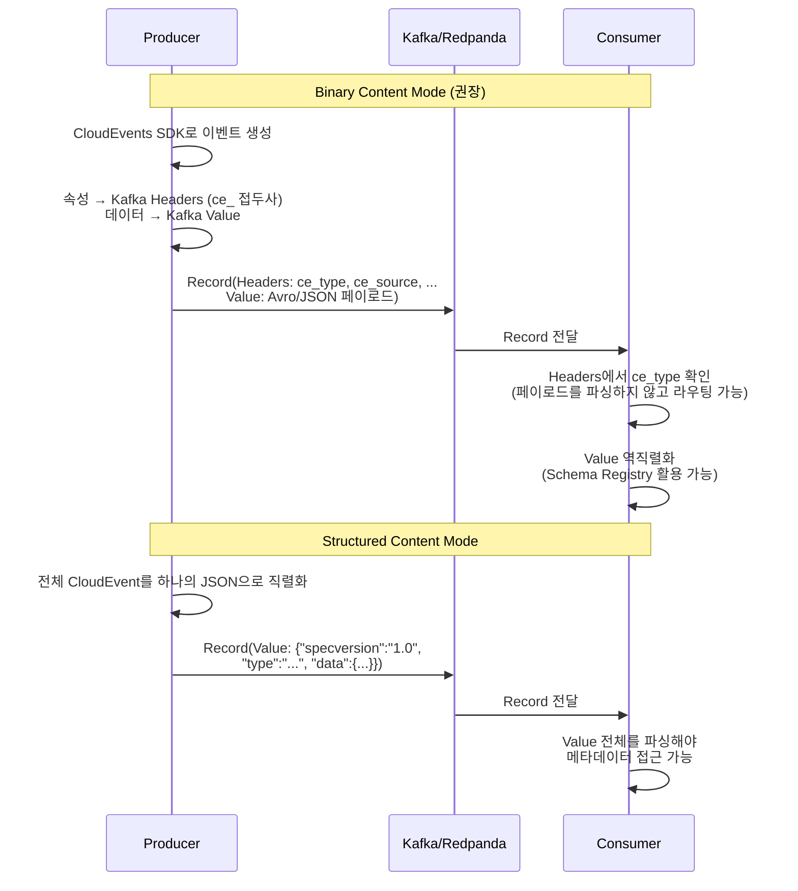
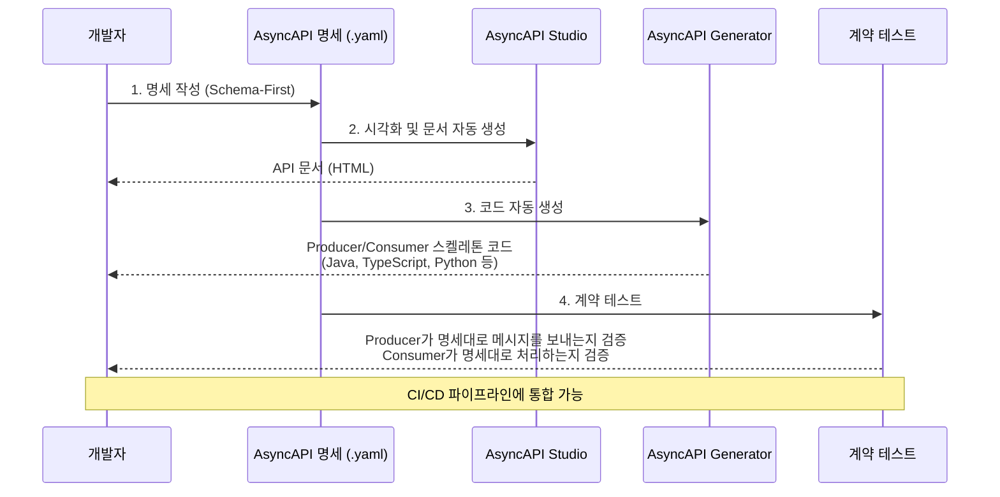

# 09. Message Schema Design

미들웨어에 상관없이 적용할 수 있는 메시지 규격 설계 방법론. CloudEvents, AsyncAPI 등 표준 명세와 미들웨어별 스키마 제어 현황을 다룹니다.

> **Redpanda 특화 Schema Registry 운영**은 [07-schema-registry.md](./07-schema-registry.md) 참조

---

## 1. 메시지 규격이란 무엇인가

### 메시지 규격이 없으면 무슨 일이 벌어지는가

5개 팀이 각자 이벤트를 발행하는 시스템을 떠올려봅시다. 메시지 규격에 대한 합의 없이 각 팀이 독립적으로 이벤트를 설계하면 이런 상황이 됩니다.

```
Team A (주문): {"eventType": "ORDER_CREATED",  "timestamp": "2026-02-11T09:30:00Z", ...}
Team B (결제): {"type": "payment.completed",   "time": 1707629400, ...}
Team C (배송): {"event_name": "ShipmentReady", "created_at": "2026/02/11 09:30", ...}
Team D (재고): {"kind": "stock_reserved",      "ts": "20260211T093000", ...}
Team E (알림): {"action": "NOTIFY_SENT",       "at": 1707629400000, ...}
```

이벤트 타입 필드 이름만 5개(`eventType`, `type`, `event_name`, `kind`, `action`), 타임스탬프 형식도 5개(ISO 8601, epoch 초, 슬래시 구분, compact, epoch 밀리초)입니다. Consumer 팀이 이 이벤트들을 통합 처리하려면, 팀마다 파싱 로직을 따로 작성해야 합니다. 모니터링 도구도 "이벤트 타입"을 추출하는 방법이 팀마다 달라서 통합 대시보드를 만들 수 없습니다.

이것이 **메타데이터 파편화** 문제입니다. 페이로드(비즈니스 데이터)의 스키마 차이는 Schema Registry로 해결하지만, **엔벨로프(메타데이터)의 형식 차이**는 별도의 표준이 필요합니다.

### 메시지 = 엔벨로프 + 페이로드

메시지 규격을 이해하려면 편지에 비유하면 됩니다. 편지 봉투(엔벨로프)에는 보내는 사람, 받는 사람, 우표(메타데이터)가 있고, 봉투 안에 실제 내용(페이로드)이 들어있습니다. 메시징 시스템에서도 동일합니다.

```
메시지 구조
├── 엔벨로프 (Envelope / Metadata)
│   ├── 이벤트 ID          (이 메시지를 고유하게 식별)
│   ├── 이벤트 타입         (무슨 일이 발생했는가)
│   ├── 소스              (어디서 발생했는가)
│   ├── 발생 시각           (언제 발생했는가)
│   ├── 스키마 참조         (페이로드 구조를 어디서 확인하는가)
│   └── 상관관계 ID         (관련된 다른 메시지와의 연결)
└── 페이로드 (Payload / Data)
    └── 비즈니스 데이터      (주문 정보, 결제 정보 등)
```

**엔벨로프**는 메시지를 라우팅하고 추적하는 데 필요한 메타데이터입니다. 미들웨어와 인프라 도구가 페이로드를 열어보지 않고도 메시지를 처리할 수 있게 합니다. **페이로드**는 비즈니스 데이터 그 자체이며, Producer와 Consumer 사이의 계약(Contract)에 해당합니다.

### API 설계와의 비유

REST API 세계에는 이미 성숙한 도구 생태계가 있습니다. **OpenAPI(Swagger)**로 API 규격을 정의하고, 코드를 자동 생성하고, 문서를 자동화합니다. 비동기 메시징 세계에서는 이에 대응하는 표준이 늦게 등장했습니다.

| REST API 세계 | 비동기 메시징 세계 | 역할 |
|--------------|-----------------|------|
| HTTP 요청/응답 | 메시지 (이벤트/커맨드) | 통신 단위 |
| OpenAPI (Swagger) | **AsyncAPI** | API 명세 표준 |
| HTTP 헤더 | **CloudEvents** 속성 | 엔벨로프 표준 |
| JSON Schema / Protobuf | Avro / Protobuf / JSON Schema | 페이로드 스키마 |
| Swagger UI | AsyncAPI Studio | 문서 자동화 |
| Swagger Codegen | AsyncAPI Generator | 코드 자동 생성 |

핵심 차이점은 REST API는 **동기(synchronous)** 이고 요청-응답 쌍이 명확한 반면, 메시징은 **비동기(asynchronous)** 이고 Producer와 Consumer가 서로를 모른다는 것입니다. 이 때문에 명시적 계약이 더욱 중요합니다. REST API에서는 서버가 잘못된 요청에 400 Bad Request를 즉시 반환하지만, 메시징에서는 잘못된 메시지가 큐에 들어간 후 Consumer가 처리하는 시점에야 오류가 드러납니다.

---

## 2. 미들웨어별 메시지 스키마 제어 현황 (2026년 기준)

메시지 규격의 필요성을 이해했으니, 실제 미들웨어들이 스키마를 어떻게 제어하는지 살펴봅시다. 결론부터 말하면, **대부분의 미들웨어는 메시지 내용을 전혀 검증하지 않습니다.** 이 현실이 §3-4에서 다루는 CloudEvents, AsyncAPI 같은 표준이 필요한 이유입니다.

### Kafka / Redpanda

**접근법**: Confluent Schema Registry (내장 또는 외부)

Kafka/Redpanda 생태계는 메시지 스키마 제어가 가장 성숙한 환경입니다. Confluent Schema Registry가 사실상의 표준이며, Redpanda는 이를 브로커에 내장하여 별도 프로세스 없이 사용할 수 있습니다.

- **지원 포맷**: Avro, Protobuf, JSON Schema
- **Wire Format**: `[0x00][Schema ID 4bytes][Data]`
- **호환성 검증**: 7단계 호환성 모드 (BACKWARD ~ FULL_TRANSITIVE)
- **클라이언트 캐싱**: Serializer/Deserializer 라이브러리가 JVM/런타임 메모리에 자동 캐싱

> 상세 내용은 [07-schema-registry.md](./07-schema-registry.md) 참조

### RabbitMQ

**접근법**: 내장 Schema Registry 없음 → 애플리케이션 레벨 검증

RabbitMQ는 메시지 브로커로서 **메시지 내용을 전혀 검사하지 않습니다**. 바이트 배열을 받아서 큐에 넣고, 소비자에게 전달할 뿐입니다. 2026년 현재 RabbitMQ 4.x에도 내장 Schema Registry는 없습니다.

**실무 접근법**:

| 접근법 | 설명 | 장단점 |
|--------|------|--------|
| Confluent Schema Registry 차용 | Kafka용 SR을 RabbitMQ에서도 사용. Producer/Consumer가 SR에 스키마 등록/조회 | Wire Format 호환은 수동 구현 필요. 멀티 브로커 환경에서 스키마 통합 가능 |
| 애플리케이션 레벨 JSON Schema 검증 | 라이브러리(ajv, everit 등)로 메시지 전송/수신 시 검증 | 인프라 의존 없음. 검증 책임이 각 서비스에 분산 |
| AMQP 헤더에 스키마 버전 포함 | `content-type` 헤더에 스키마 참조 포함 (예: `application/vnd.order.v2+json`) | 라우팅과 스키마 버전을 함께 관리. 표준은 아님 |

**RabbitMQ 4.0 Khepri**: RabbitMQ 4.0에서 도입된 Khepri는 **메타데이터 스토어**(큐/Exchange/바인딩 정의 저장)를 Mnesia에서 Raft 기반으로 교체한 것이며, 메시지 스키마와는 무관합니다. 메시지 내용 검증 기능은 추가되지 않았습니다.

### NATS

**접근법**: 내장 Schema Registry는 제한적 → 주로 애플리케이션 레벨 검증

NATS 서버 자체는 **JetStream API 메시지와 내부 이벤트**에 대한 JSON Schema를 가지고 있습니다(`nats schemas` CLI 명령). 하지만 이는 NATS 자체의 관리 API를 위한 것이지, **사용자 메시지의 스키마를 관리하는 기능은 아닙니다**.

**실무 접근법**:

| 접근법 | 설명 |
|--------|------|
| JetStream 헤더에 스키마 버전 포함 | `Nats-Schema-Version: v2` 같은 커스텀 헤더 추가. Consumer가 헤더를 보고 역직렬화 전략 결정 |
| Protobuf / Avro + 앱 레벨 검증 | `.proto` 또는 `.avsc` 파일을 리포지토리에서 관리하고, 빌드 시 코드 생성. 런타임에 타입 안전성 확보 |
| 커뮤니티 Schema Registry | `codegangsta/schema_registry` 같은 커뮤니티 프로젝트 존재하지만, 프로덕션 수준은 아님 |

### Redis Streams

**접근법**: 내장 Schema Registry 없음 → 순수 애플리케이션 레벨 검증

Redis Streams는 메시지를 **필드-값 쌍(hash-like)**으로 저장합니다. `XADD` 명령으로 임의의 필드를 넣을 수 있으며, Redis는 필드 타입이나 구조를 전혀 검증하지 않습니다.

**실무 접근법**:
- 대부분 **JSON 문자열**을 하나의 필드에 넣고, 애플리케이션에서 JSON Schema로 검증
- 바이너리 직렬화(Avro, Protobuf)는 드묾 (Redis Streams의 주 사용처가 경량 이벤트 처리이므로)
- `_schema_version` 같은 필드를 메시지에 포함하여 버전 관리하는 패턴

### 비교 테이블

| 기능 | Kafka/Redpanda | RabbitMQ | NATS | Redis Streams |
|------|---------------|----------|------|---------------|
| 내장 Schema Registry | Redpanda 내장 / Kafka는 외부(Confluent SR) | 없음 | 관리 API용만 존재 | 없음 |
| 스키마 검증 주체 | Serializer 라이브러리 (인프라 수준) | 애플리케이션 | 애플리케이션 | 애플리케이션 |
| Wire Format 표준 | `[0x00][Schema ID][Data]` | 없음 (자유) | 없음 (자유) | 없음 (필드-값 쌍) |
| 호환성 자동 검증 | 7단계 모드 | 수동 구현 | 수동 구현 | 수동 구현 |
| 권장 직렬화 포맷 | Avro (기본) / Protobuf | JSON + JSON Schema | Protobuf / JSON | JSON |
| 스키마 캐싱 | 클라이언트 라이브러리 자동 | 해당 없음 | 해당 없음 | 해당 없음 |
| 클라이언트 SDK 지원 | Java, Go, Python, .NET 등 | 없음 (커스텀) | 없음 (커스텀) | 없음 (커스텀) |

**핵심 인사이트**: Kafka/Redpanda만이 **인프라 수준의 스키마 강제**를 제공합니다. 나머지 미들웨어에서는 스키마 검증이 **각 서비스의 책임**이며, 이는 "팀마다 다르게 검증하거나, 아예 검증하지 않는" 위험을 내포합니다. 이 격차를 줄이는 방법이 아래에서 다루는 CloudEvents + AsyncAPI 같은 표준 채택입니다.

---

## 3. 메시지 엔벨로프 표준: CloudEvents

### CloudEvents란 무엇인가

**CloudEvents**는 이벤트 데이터를 공통 방식으로 기술하기 위한 **CNCF Graduated 프로젝트**(2024년 1월 졸업)입니다. 현재 스펙 버전은 **v1.0.2**(2022년 2월)이며, 이벤트의 메타데이터(엔벨로프)를 표준화합니다. 페이로드(data) 자체의 스키마는 정의하지 않고, "이벤트를 설명하는 공통 속성"만 정의합니다.

CloudEvents가 해결하는 문제는 §1에서 본 **이벤트 포맷의 파편화**입니다. 팀마다, 서비스마다 이벤트 메타데이터를 제각각 정의하면, 이벤트를 소비하는 쪽에서 매번 "이 이벤트의 타입 필드 이름이 뭐지? eventType? type? event_type?"을 확인해야 합니다. CloudEvents는 이 메타데이터를 표준화하여, **서로 다른 시스템이 같은 방식으로 이벤트를 이해**할 수 있게 합니다.

### 필수 속성 (REQUIRED)

모든 CloudEvent는 반드시 다음 4개 속성을 포함해야 합니다.

| 속성 | 타입 | 설명 | 예시 |
|------|------|------|------|
| `id` | String | 이벤트 고유 식별자. `source + id` 조합이 유일해야 함 | `"A234-1234-1234"` |
| `source` | URI-reference | 이벤트가 발생한 컨텍스트 식별 | `"/orders/order-service"` |
| `specversion` | String | CloudEvents 스펙 버전 | `"1.0"` |
| `type` | String | 이벤트 타입. 라우팅과 정책 적용에 사용 | `"com.example.order.created"` |

### 선택 속성 (OPTIONAL)

| 속성 | 타입 | 설명 | 예시 |
|------|------|------|------|
| `datacontenttype` | String (RFC 2046) | 페이로드의 미디어 타입 | `"application/json"` |
| `dataschema` | URI | 페이로드가 따르는 스키마 위치 | `"https://schema.example.com/order/v1"` |
| `subject` | String | 이벤트 주체(구독 필터링에 활용) | `"order-12345"` |
| `time` | Timestamp (RFC 3339) | 이벤트 발생 시각 | `"2026-02-11T09:30:00Z"` |

### CloudEvents JSON 형식 예시

```json
{
  "specversion": "1.0",
  "id": "evt-20260211-001",
  "source": "/orders/order-service",
  "type": "com.example.order.created",
  "time": "2026-02-11T09:30:00Z",
  "datacontenttype": "application/json",
  "dataschema": "https://schema.example.com/order/v1",
  "subject": "order-12345",
  "data": {
    "orderId": "order-12345",
    "customerId": "cust-789",
    "amount": 45000,
    "currency": "KRW"
  }
}
```

### Kafka/Redpanda Protocol Binding

CloudEvents를 Kafka에서 전송할 때 두 가지 모드가 있습니다.

**Binary Content Mode (권장)**: CloudEvents 속성을 Kafka 헤더에, 페이로드를 Kafka 메시지 value에 배치합니다. 속성명 앞에 `ce_` 접두사를 붙입니다.

```
Kafka Record
├── Headers
│   ├── ce_specversion: "1.0"
│   ├── ce_id: "evt-20260211-001"
│   ├── ce_source: "/orders/order-service"
│   ├── ce_type: "com.example.order.created"
│   ├── ce_time: "2026-02-11T09:30:00Z"
│   └── content-type: "application/json"
└── Value
    └── {"orderId": "order-12345", "amount": 45000, ...}
```

**Structured Content Mode**: 전체 CloudEvent(속성 + 데이터)를 하나의 JSON으로 직렬화하여 Kafka 메시지 value에 배치합니다. Content-Type 헤더가 `application/cloudevents+json`으로 설정됩니다.

수신 측은 `content-type` 헤더를 보고 모드를 판별합니다. `application/cloudevents`로 시작하면 Structured, 아니면 Binary입니다.

**Binary 모드를 권장하는 이유**: 기존 Kafka 도구(모니터링, 스트림 처리)가 메시지 value를 그대로 처리할 수 있고, 엔벨로프 오버헤드가 value에 포함되지 않아 페이로드 크기가 더 작습니다. 또한 Schema Registry와의 통합이 자연스럽습니다(value에 순수 Avro/Protobuf 데이터만 들어가므로).



### CloudEvents를 왜 써야 하는가

CloudEvents는 "이벤트 메타데이터의 HTTP 헤더 표준"이라고 생각하면 됩니다. HTTP에서 `Content-Type`, `Authorization`, `X-Request-ID` 같은 표준 헤더가 있듯이, CloudEvents는 이벤트 세계의 표준 헤더입니다.

**도입 효과**:
- **상호운용성**: 서로 다른 팀, 서로 다른 언어, 서로 다른 미들웨어가 같은 메타데이터 형식을 사용
- **도구 생태계**: CloudEvents를 이해하는 모니터링, 트레이싱, 라우팅 도구 활용 가능
- **SDK 지원**: Java, Go, Python, JavaScript, C#, Ruby, Rust 등 공식 SDK 제공
- **벤더 중립**: CNCF Graduated 프로젝트로, 특정 벤더에 종속되지 않음

**도입하지 않아도 되는 경우**:
- 단일 팀이 단일 미들웨어로 소수의 이벤트만 처리하는 경우
- 이미 팀 내부 표준이 확립되어 있고 외부 시스템과 연동이 없는 경우

---

## 4. 메시지 계약 명세: AsyncAPI

### AsyncAPI란 무엇인가

**AsyncAPI**는 이벤트 기반(비동기) API를 기술하기 위한 명세 표준입니다. OpenAPI가 REST API의 엔드포인트, 요청/응답 스키마를 정의하듯이, AsyncAPI는 **채널(토픽/큐), 메시지 스키마, 프로토콜 바인딩**을 정의합니다. 현재 최신 버전은 **3.0**(2023년 12월 릴리스)입니다.

AsyncAPI가 해결하는 문제는 **"이 토픽에 어떤 메시지가 오가는가?"라는 질문에 대한 단일 소스 오브 트루스(Single Source of Truth)**를 제공하는 것입니다. 코드를 뒤져보지 않아도, 위키를 찾아다니지 않아도, AsyncAPI 명세 파일 하나를 보면 전체 메시징 아키텍처를 파악할 수 있습니다.

### AsyncAPI 3.0의 핵심 구조

```yaml
asyncapi: '3.0.0'
info:
  title: 주문 서비스 API
  version: '1.0.0'
  description: 주문 관련 이벤트를 발행하는 서비스

channels:
  orderCreated:
    address: 'orders.created'
    messages:
      orderCreatedMessage:
        $ref: '#/components/messages/OrderCreated'

  orderCancelled:
    address: 'orders.cancelled'
    messages:
      orderCancelledMessage:
        $ref: '#/components/messages/OrderCancelled'

operations:
  publishOrderCreated:
    action: send
    channel:
      $ref: '#/channels/orderCreated'
    summary: 주문 생성 이벤트 발행

  publishOrderCancelled:
    action: send
    channel:
      $ref: '#/channels/orderCancelled'
    summary: 주문 취소 이벤트 발행

components:
  messages:
    OrderCreated:
      payload:
        type: object
        properties:
          orderId:
            type: string
          customerId:
            type: string
          amount:
            type: number
          currency:
            type: string
            default: KRW
        required:
          - orderId
          - customerId
          - amount

    OrderCancelled:
      payload:
        type: object
        properties:
          orderId:
            type: string
          reason:
            type: string
        required:
          - orderId
```

### AsyncAPI 3.0의 주요 변경 (2.x → 3.0)

| 변경 | 2.x | 3.0 | 이유 |
|------|-----|-----|------|
| Channel-Operation 분리 | Channel 안에 publish/subscribe 정의 | Channel과 Operation이 독립 | 재사용성 향상, 한 채널을 여러 오퍼레이션에서 참조 가능 |
| 액션 방향 | `publish` / `subscribe` | `send` / `receive` | 의미가 더 명확 (누가 보내고 누가 받는가) |
| Request/Reply 패턴 | 미지원 | `reply` 채널 참조 지원 | RPC 스타일 비동기 패턴 문서화 가능 |
| 메시지 재사용 | Channel에 종속 | `components/messages`에 독립 정의 | 여러 채널에서 같은 메시지 타입 참조 가능 |

### AsyncAPI 도구 생태계



**주요 도구**:
- **AsyncAPI Studio**: 브라우저 기반 편집기 + 실시간 미리보기 (studio.asyncapi.com)
- **AsyncAPI Generator**: 명세에서 코드, 문서, 다이어그램 자동 생성
- **AsyncAPI CLI**: 명세 검증(validate), 번들링(bundle), 변환(convert)
- **Microcks**: AsyncAPI 명세 기반 목(mock) 서버 + 계약 테스트
- **Springwolf**: Spring Boot 어노테이션에서 AsyncAPI 문서 자동 생성 (아래 상세)

### Spring Boot Code-First: Springwolf

Swagger(springdoc-openapi)가 `@RestController`에서 OpenAPI 문서를 자동 생성하듯, **[Springwolf](https://www.springwolf.dev/)** 는 `@KafkaListener` 같은 리스너 어노테이션에서 AsyncAPI 문서를 자동 생성한다. YAML을 직접 작성하는 Schema-First 방식과 달리, 코드에 이미 존재하는 메타데이터를 활용하는 Code-First 접근법이다.

**Swagger와의 대응 관계**:

| Swagger (REST) | Springwolf (Event-Driven) | 역할 |
|---------------|--------------------------|------|
| `springdoc-openapi` | `springwolf-kafka` | 자동 문서 생성 라이브러리 |
| `@RestController` 자동 감지 | `@KafkaListener` 자동 감지 | Consumer 문서화 |
| `@Operation` | `@AsyncPublisher` / `@AsyncListener` | 추가 메타데이터 어노테이션 |
| `@Schema` | 페이로드 클래스에서 자동 추출 | 메시지 스키마 문서화 |
| Swagger UI (`/swagger-ui.html`) | Springwolf UI (`/springwolf/asyncapi-ui.html`) | 웹 UI |
| "Try it out" 버튼 | "Publish" 버튼 | 브라우저에서 직접 호출/발행 |
| OpenAPI 3.x JSON | AsyncAPI 3.x JSON | 출력 스펙 |

**의존성 설정** (Kafka/Redpanda 기준):

```gradle
// build.gradle
dependencies {
    implementation 'io.github.springwolf:springwolf-kafka:1.+'
    implementation 'io.github.springwolf:springwolf-ui:1.+'
}
```

**application.yml 설정**:

```yaml
springwolf:
  docket:
    base-package: com.example.messaging
    info:
      title: Order Event API
      version: 1.0.0
      description: 주문 도메인 이벤트 명세
    servers:
      kafka:
        protocol: kafka
        host: ${spring.kafka.bootstrap-servers}
```

**Consumer — 자동 감지 (코드 수정 불필요)**:

`@KafkaListener`가 있으면 Springwolf가 base-package를 스캔하여 자동으로 Consumer 문서를 생성한다. 기존 코드를 건드릴 필요가 없다.

```java
// 이 코드만으로 AsyncAPI 문서에 Consumer 채널이 등록된다
@KafkaListener(topics = "orders.created", groupId = "order-group")
public void handleOrderCreated(OrderCreatedEvent event) {
    // 비즈니스 로직
}
```

**Producer — 어노테이션 추가 필요**:

Producer는 리스너 어노테이션이 없으므로 Springwolf 전용 어노테이션을 추가한다. `@AsyncPublisher`가 "이 메서드는 메시지를 발행한다"는 사실을, `@KafkaAsyncOperationBinding`이 Kafka 프로토콜 바인딩 정보를 제공한다.

```java
@AsyncPublisher(
    operation = @AsyncOperation(
        channelName = "orders.created",
        description = "주문 생성 시 이벤트 발행"
    )
)
@KafkaAsyncOperationBinding  // Kafka 프로토콜 바인딩
public void publishOrderCreated(OrderCreatedEvent event) {
    kafkaTemplate.send("orders.created", event);
}
```

**출력 결과**: 앱 실행 후 `/springwolf/asyncapi-ui.html`에 접속하면 Swagger UI와 유사한 화면에서 토픽 목록, 메시지 스키마, pub/sub 관계를 확인할 수 있다. "Publish" 버튼으로 브라우저에서 Kafka에 직접 메시지를 발행할 수도 있어 개발/디버깅에 유용하다.

**정적 문서 생성**:

런타임 UI 외에 빌드 시점에 AsyncAPI JSON을 추출할 수 있다. CI/CD에서 API 변경을 감지하거나, GitLab Pages에 정적 문서를 배포하는 데 활용한다.

```gradle
// build.gradle — Springwolf 정적 생성 플러그인
tasks.register('generateAsyncApi', Test) {
    useJUnitPlatform()
    include '**/AsyncApiGeneratorTest*'
}
```

**Schema-First vs Code-First 선택 기준**:

두 접근법은 배타적이지 않다. Springwolf(Code-First)로 시작하여 팀이 AsyncAPI에 익숙해진 후, 생성된 YAML을 기반으로 Schema-First로 전환하는 것도 가능하다.

| 기준 | Schema-First (AsyncAPI YAML 직접 작성) | Code-First (Springwolf) |
|------|--------------------------------------|------------------------|
| 도입 비용 | 높음 (YAML 학습, 별도 파일 관리) | 낮음 (의존성 추가만으로 시작) |
| 코드-문서 동기화 | 수동 (코드 변경 시 YAML도 수정) | 자동 (코드가 곧 문서) |
| 팀 간 사전 합의 | 강점 (스키마 PR 리뷰) | 약점 (코드 리뷰에 의존) |
| 코드 생성 | 가능 (AsyncAPI Generator) | 해당 없음 (코드가 이미 존재) |
| 적합 시점 | 새 시스템 설계, 팀 간 계약 필요 | 기존 시스템 문서화, 점진적 도입 |

> §5 Schema-First vs Code-First에서 이 비교를 전체 맥락에서 다시 다룬다.

### 멀티 프로토콜 지원

AsyncAPI는 프로토콜에 독립적(protocol-agnostic)입니다. 동일한 명세 구조로 다양한 미들웨어를 기술할 수 있습니다.

| 프로토콜 | AsyncAPI에서의 표현 | 비고 |
|---------|-------------------|------|
| Kafka / Redpanda | `kafka://` 서버, 토픽 = Channel | Confluent Schema Registry 참조 가능 |
| RabbitMQ (AMQP) | `amqp://` 서버, Exchange+Queue = Channel | Binding에서 exchange type, routing key 정의 |
| NATS | `nats://` 서버, Subject = Channel | JetStream 바인딩 지원 |
| MQTT | `mqtt://` 서버, Topic = Channel | QoS, retain 등 바인딩 |
| WebSocket | `ws://` 서버 | 양방향 통신 문서화 |

---

## 5. 실무 메시지 설계 패턴

### Schema-First vs Code-First

메시지 스키마를 설계하는 두 가지 접근법이 있습니다.

**Schema-First (권장)**:
1. `.avsc`, `.proto`, 또는 AsyncAPI 명세를 **먼저** 작성
2. 스키마에서 코드를 자동 생성 (Avro → Java 클래스, Protobuf → stub)
3. 생성된 코드로 Producer/Consumer 구현
4. 스키마 변경 시 PR 리뷰 → 호환성 검증 → 코드 재생성

**Code-First**:
1. Java/Kotlin 클래스를 먼저 작성
2. 클래스에서 스키마를 자동 추출 (Spring Cloud Stream 등)
3. 추출된 스키마를 Schema Registry에 등록

Spring Boot에서 Code-First를 선택한다면 **Springwolf**가 사실상 유일한 선택지다. `@KafkaListener`에서 Consumer 문서를 자동 생성하고, `@AsyncPublisher`로 Producer 문서를 추가한다. 구체적인 설정과 어노테이션은 §4의 "Spring Boot Code-First: Springwolf" 참조.

| 기준 | Schema-First | Code-First |
|------|-------------|-----------|
| 계약 명확성 | 스키마가 단일 진실 소스 | 코드가 진실 소스 (암묵적) |
| 팀 간 협업 | 스키마 PR 리뷰로 합의 | 코드 리뷰에서 발견해야 함 |
| 호환성 제어 | 명시적, CI에서 검증 가능 | 실수 가능성 높음 |
| 초기 비용 | 높음 (도구 셋업 필요) | 낮음 (바로 코딩) |
| 프로덕션 권장 | 강력 권장 | 소규모/프로토타입에 적합 |

### 메시지 엔벨로프 표준 패턴

모든 메시지에 공통 메타데이터를 포함하는 **표준 엔벨로프 패턴**입니다. CloudEvents를 채택하면 이 패턴이 자동으로 적용됩니다.

```json
{
  "metadata": {
    "eventId": "evt-20260211-001",
    "eventType": "order.created",
    "source": "order-service",
    "timestamp": "2026-02-11T09:30:00Z",
    "correlationId": "req-abc-123",
    "schemaVersion": "v2",
    "traceId": "4bf92f3577b34da6a3ce929d0e0e4736"
  },
  "payload": {
    "orderId": "order-12345",
    "amount": 45000
  }
}
```

**필수 필드 가이드**:
- `eventId`: 멱등성 처리의 키. Consumer가 중복 메시지를 감지하는 데 사용
- `eventType`: Consumer 라우팅의 핵심. 하나의 토픽에 여러 이벤트 타입이 올 때 필수
- `timestamp`: 이벤트 순서 파악 및 디버깅에 필수
- `correlationId`: 분산 트레이싱에서 요청 흐름을 추적하는 데 사용
- `schemaVersion`: Schema Registry를 사용하지 않는 환경에서 버전 관리

### 이벤트 타입별 스키마 분리

하나의 거대한 스키마에 모든 이벤트를 우겨넣는 것은 안티패턴입니다.

```
안티패턴: 하나의 스키마에 모든 이벤트
{
  "eventType": "order.created" | "order.cancelled" | "order.shipped",
  "orderId": "...",
  "amount": ...,           // created에서만 사용
  "reason": "...",         // cancelled에서만 사용
  "trackingNumber": "...", // shipped에서만 사용
  "carrier": "..."         // shipped에서만 사용
}
→ 대부분의 필드가 null이고, 스키마 변경 시 모든 Consumer에 영향

올바른 패턴: 이벤트 타입별 별도 스키마
- OrderCreated: {orderId, customerId, amount, currency}
- OrderCancelled: {orderId, reason, cancelledAt}
- OrderShipped: {orderId, trackingNumber, carrier, shippedAt}
→ 각 스키마가 독립적으로 진화 가능
```

Schema Registry에서 이를 지원하려면 **RecordNameStrategy** 또는 **TopicRecordNameStrategy**를 사용합니다. 전략별 차이, 스키마 진화 시나리오, Producer-Consumer 전략 불일치 문제는 [07-schema-registry.md](./07-schema-registry.md) §6 Subject Naming Strategy 참조.

### 버전 관리 전략

스키마 버전을 전달하는 방법은 환경에 따라 다릅니다.

| 방법 | 적용 환경 | 예시 |
|------|----------|------|
| Schema Registry Wire Format | Kafka/Redpanda | `[0x00][Schema ID][Data]` — ID에 버전 정보 내포 |
| 메시지 헤더 | RabbitMQ, NATS | `content-type: application/vnd.order.v2+json` |
| 페이로드 내 필드 | Redis Streams, 범용 | `{"schemaVersion": "v2", ...}` |
| 토픽/채널 이름 | 모든 환경 (비권장) | `orders.v1`, `orders.v2` — Consumer 마이그레이션 필요 |

**토픽 이름에 버전을 넣지 않는 이유**: 버전이 올라갈 때마다 새 토픽이 생기고, 모든 Consumer가 새 토픽을 구독하도록 변경해야 합니다. 스키마 진화(evolution)의 핵심 이점인 "Consumer 코드 변경 없이 새 버전 처리"가 무효화됩니다.

### Dead Letter 처리를 고려한 설계

메시지 설계 시 **역직렬화 실패** 시나리오를 고려해야 합니다. 스키마가 맞지 않거나 손상된 메시지가 오면, Consumer가 무한 재시도하거나 크래시할 수 있습니다.

```
메시지 처리 흐름
┌─────────┐     ┌──────────┐     ┌───────────────┐
│ Consumer │────→│ 역직렬화  │──→  │ 비즈니스 로직   │
└─────────┘     └──────────┘     └───────────────┘
                     │ 실패
                     ▼
              ┌──────────────┐
              │ Dead Letter  │  ← 원본 메시지 + 실패 메타데이터
              │ Topic/Queue  │    (오류 원인, 시각, 원본 토픽)
              └──────────────┘
```

**Dead Letter에 포함해야 할 메타데이터**:
- 원본 메시지 (바이트 그대로)
- 원본 토픽/큐 이름
- 실패 사유 (예외 메시지)
- 실패 시각
- 재시도 횟수

이를 위해 메시지 엔벨로프에 `correlationId`와 `eventId`가 있어야 Dead Letter에서 원본을 추적할 수 있습니다.

---

## 6. 추천 조합

| 환경 | 추천 스택 | 이유 |
|------|----------|------|
| Kafka / Redpanda | Schema Registry + Avro + AsyncAPI | 인프라 수준 스키마 강제, 가장 성숙한 생태계 |
| RabbitMQ | JSON Schema + AsyncAPI + 앱 레벨 검증 | 내장 SR 없으므로 앱 레벨 검증 필수. AsyncAPI로 계약 문서화 |
| NATS | Protobuf + AsyncAPI + 앱 레벨 검증 | Protobuf의 강타입 코드 생성으로 검증 부담 경감 |
| Redis Streams | JSON Schema + 앱 레벨 검증 | 경량 환경에 적합. JSON 기반이 대부분 |
| 멀티 브로커 | CloudEvents + AsyncAPI + Protobuf | 브로커 독립적 표준으로 통일. Protobuf은 언어/플랫폼 중립적 |

### 선택 의사결정 플로우

```
스키마 제어 수준을 결정하시오:

Q1. Kafka/Redpanda를 사용하는가?
    ├── YES → Schema Registry + Avro (기본 선택)
    └── NO → Q2로

Q2. 여러 미들웨어를 혼용하는가?
    ├── YES → CloudEvents (엔벨로프) + AsyncAPI (명세) + Protobuf (직렬화)
    └── NO → Q3로

Q3. 팀/서비스가 5개 이상인가?
    ├── YES → AsyncAPI + JSON Schema + 앱 레벨 검증
    └── NO → JSON Schema + 앱 레벨 검증 (최소 구성)
```

---

## 참고

- [CloudEvents Specification](https://github.com/cloudevents/spec) (CNCF Graduated, v1.0.2)
- [CloudEvents Kafka Protocol Binding](https://github.com/cloudevents/spec/blob/main/cloudevents/bindings/kafka-protocol-binding.md)
- [AsyncAPI 3.0 Specification](https://www.asyncapi.com/docs/reference/specification/v3.0.0)
- [AsyncAPI Studio](https://studio.asyncapi.com/)
- [Springwolf — Spring Boot AsyncAPI 자동 생성](https://www.springwolf.dev/)
- [Springwolf GitHub](https://github.com/springwolf/springwolf-core)
- [Baeldung — Springwolf 튜토리얼](https://www.baeldung.com/java-spring-doc-asyncapi-springwolf)
- [Confluent Schema Registry](https://docs.confluent.io/platform/current/schema-registry/)
- 관련 문서: [07-schema-registry.md](./07-schema-registry.md) (Redpanda Schema Registry 운영)
- 관련 문서: [10-topic-design.md](./10-topic-design.md) (토픽/채널 설계 방법론)

---

## 학습 정리

### 핵심 개념

1. **메시지 = 엔벨로프 + 페이로드**: 엔벨로프(메타데이터)와 페이로드(비즈니스 데이터)를 분리하면, 인프라 도구가 페이로드를 열지 않고도 메시지를 라우팅하고 추적할 수 있다
2. **미들웨어 격차**: Kafka/Redpanda만 인프라 수준 스키마 강제를 제공하며, 나머지(RabbitMQ, NATS, Redis)는 애플리케이션이 직접 검증해야 한다. 이 격차가 표준 채택의 동기다
3. **CloudEvents**: CNCF Graduated 표준으로, 이벤트 메타데이터(id, source, type, specversion)를 표준화한다. 이벤트 세계의 HTTP 헤더 표준
4. **AsyncAPI**: 비동기 API의 OpenAPI. 채널, 메시지, 스키마를 하나의 명세로 문서화하고 코드 생성까지 지원한다
5. **Schema-First 개발**: 스키마를 먼저 정의하고 코드를 생성하는 방식이 프로덕션 환경에서 권장된다. 계약이 코드보다 먼저 존재해야 팀 간 합의가 가능하다

### 미들웨어 선택 가이드

- **스키마 강제가 중요하다면**: Kafka/Redpanda (Schema Registry 내장/통합)
- **경량이면서 빠른 메시징이 필요하다면**: NATS + Protobuf (앱 레벨 검증)
- **복잡한 라우팅이 필요하다면**: RabbitMQ + JSON Schema (Exchange 라우팅 활용)
- **이미 Redis를 쓰고 있다면**: Redis Streams + JSON Schema (추가 인프라 없이)
- **여러 미들웨어를 혼용한다면**: CloudEvents + AsyncAPI로 통일
