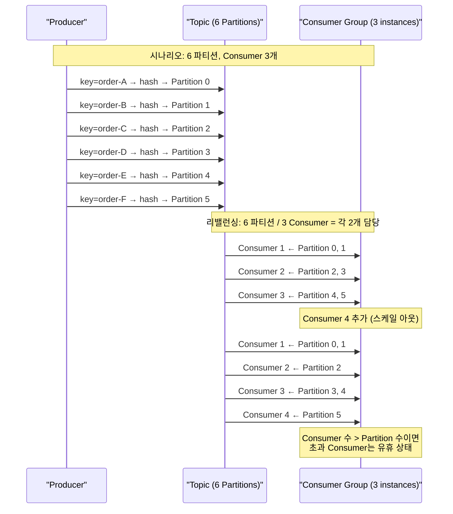
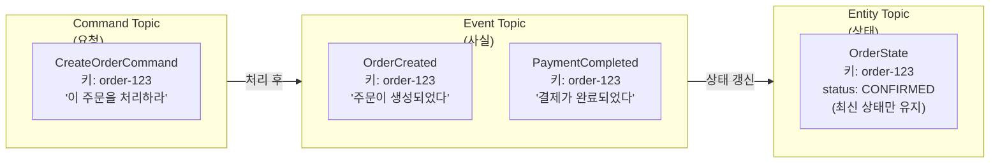
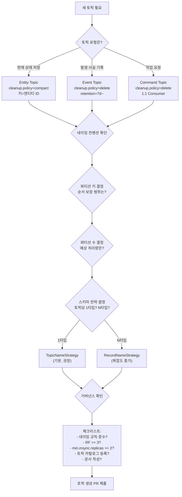

# 10. Topic Design

미들웨어에 상관없이 적용할 수 있는 토픽/채널/큐 설계 방법론. 네이밍 컨벤션, 파티셔닝 전략, 미들웨어별 주소 체계를 다룹니다.

> **메시지 규격(스키마) 설계**는 [09-message-schema-design.md](./09-message-schema-design.md) 참조

---

## 1. 토픽 설계가 왜 중요한가

### 토픽은 메시징 시스템의 파일 시스템이다

파일 시스템에서 디렉토리 구조를 잘 설계하면 파일을 쉽게 찾고 관리할 수 있듯이, 메시징 시스템에서 토픽 구조를 잘 설계하면 메시지 흐름을 쉽게 파악하고 운영할 수 있습니다. 토픽 설계가 나쁘면:

- **검색 불가**: "이 이벤트가 어느 토픽으로 가지?" → 코드를 뒤져야 함
- **권한 관리 불가**: 토픽 이름에 규칙이 없으면 ACL(접근 제어)을 패턴으로 설정할 수 없음
- **모니터링 불가**: Consumer Lag 대시보드에서 토픽 이름만 보고 상태를 파악할 수 없음
- **확장 불가**: 초기 설계 실수가 수백 개의 토픽으로 퍼진 후에는 변경이 극도로 어려움

### 토픽 설계와 스키마 설계의 관계

토픽 설계와 스키마 설계는 동전의 양면이다. 토픽이 "어디로 보낼 것인가"를 결정한다면, 스키마는 "무엇을 보낼 것인가"를 결정한다. 이 둘은 서로 강하게 영향을 미치기 때문에 함께 고려해야 한다.

**토픽 세분화 수준이 스키마 전략을 결정한다.** 이벤트 타입별로 토픽을 분리하면(`orders.order.created`, `orders.order.cancelled`) 각 토픽이 하나의 스키마만 가지므로 기본 `TopicNameStrategy`로 충분하다. 반면 도메인 단일 토픽(`orders.events`)에 여러 이벤트 타입을 넣으면 `RecordNameStrategy`가 필요하고, 스키마 관리가 복잡해진다.

**스키마 호환성 모드가 토픽 설계에 영향을 준다.** FULL 호환성 모드에서는 기본값이 있는 필드만 추가/삭제할 수 있으므로, 토픽을 세분화하여 각 스키마가 독립적으로 진화할 수 있게 하는 것이 유리하다. 하나의 거대한 스키마에 모든 이벤트를 우겨넣으면, 한 이벤트의 스키마 변경이 다른 이벤트의 Consumer에 영향을 줄 수 있다.

**Schema Registry의 Subject Naming Strategy와 토픽 네이밍은 함께 결정해야 한다.**

| 토픽 전략 | Subject Strategy | 결과 |
|-----------|-----------------|------|
| 이벤트 타입별 토픽 | TopicNameStrategy (기본) | `orders.order.created-value` — 단순하고 명확 |
| 도메인 단일 토픽 | RecordNameStrategy | `com.example.OrderCreated` — 이벤트별 독립 진화 |
| 도메인 단일 토픽 | TopicRecordNameStrategy | `orders.events-com.example.OrderCreated` — 토픽+레코드 구분 |

실무에서는 **이벤트 타입별 토픽 + TopicNameStrategy**가 가장 단순하고 관리하기 쉽다. 스키마가 토픽과 1:1로 대응하므로 "이 토픽에 어떤 스키마가 쓰이는가?"를 즉시 파악할 수 있다.

Subject Naming Strategy는 추상적 개념이 아니라 **실제 Java 클래스 설정**(`value.subject.name.strategy`)이며, Subject 범위가 스키마 호환성 검사 범위를 결정한다. 토픽 세분화 수준에 따라 어떤 전략을 선택할지가 달라지므로, 토픽 설계와 Subject Strategy는 반드시 동시에 결정해야 한다.

> **요기요 사례**: 요기요 데이터 파이프라인팀은 하나의 토픽에 여러 이벤트 타입을 넣는 환경에서 `TopicNameStrategy`(기본)의 한계를 발견하고, `TopicRecordNameStrategy`를 선택하여 토픽 내 레코드 타입별 독립 스키마 진화를 보장했다.
> 참고: [요기요 — Confluent Schema Registry 도입기](https://techblog.yogiyo.co.kr/confluent-schema-registry-%EB%8F%84%EC%9E%85%EA%B8%B0-54d112b9b53f)

> **상세**: Subject 개념, 3가지 전략이 생성하는 Subject 이름, 전략별 스키마 진화 시나리오, Producer-Consumer 전략 불일치 문제, 호환성 모드와의 상호작용, 선택 가이드 → [07-schema-registry.md](./07-schema-registry.md) §10 Subject Naming Strategy
> 상세: [09-message-schema-design.md](./09-message-schema-design.md) — CloudEvents, AsyncAPI, 미들웨어별 스키마 제어 현황

### 미들웨어별 "토픽"의 이름

각 미들웨어는 메시지 주소 지정 단위를 다르게 부릅니다.

| 미들웨어 | 주소 단위 | 설명 |
|---------|----------|------|
| Kafka / Redpanda | **Topic** | 파티션된 로그. Producer가 토픽에 쓰고 Consumer가 읽음 |
| RabbitMQ | **Exchange + Queue** | Producer → Exchange → (Binding/Routing Key) → Queue → Consumer |
| NATS | **Subject** | 계층적 점(.) 구분 주소. 와일드카드 구독 지원 |
| Redis Streams | **Stream Key** | Redis 키 이름이 곧 스트림 주소 |

이 문서에서는 편의상 "토픽"으로 통칭하되, 미들웨어별 차이는 4절에서 상세히 다룹니다.

---

## 2. 토픽 네이밍 컨벤션

### 좋은 네이밍의 원칙

토픽 이름은 **그 이름만 보고도 어떤 데이터가 흐르는지 알 수 있어야** 합니다.

**원칙 1: 계층적 구조 사용**
```
{도메인}.{엔티티}.{이벤트/액션}

예시:
orders.order.created
orders.order.cancelled
payments.payment.completed
inventory.stock.updated
```

**원칙 2: 구분자 일관성**
- 점(`.`): Kafka, NATS에서 가장 일반적
- 하이픈(`-`): Kafka에서도 흔히 사용 (예: `order-events`)
- 밑줄(`_`): Kafka 내부 토픽이 사용 (`__consumer_offsets`)

> Kafka에서 `.`과 `_`를 혼용하면 메트릭 이름 충돌이 발생할 수 있습니다. **하나만 선택**하고 프로젝트 전체에서 일관되게 사용합니다.

**원칙 3: 소문자 사용**
```
orders.order.created    ✅
Orders.Order.Created    ❌ (대소문자 실수로 다른 토픽에 발행)
```

**원칙 4: 동적 값 배제**
```
orders.order.created           ✅ (안정적)
team-alpha.orders.created      ❌ (팀 이름은 변경됨)
john.orders.created            ❌ (개인 이름은 변경됨)
orders-service.order.created   ❌ (서비스 이름은 리네이밍 가능)
```

### 네이밍 패턴

#### 패턴 1: 도메인 기반 (가장 일반적)

```
{도메인}.{엔티티}.{이벤트}

orders.order.created
orders.order.cancelled
payments.payment.completed
payments.refund.initiated
shipping.shipment.dispatched
```

**장점**: 도메인 경계가 명확하고, ACL을 `orders.*`로 도메인별로 설정 가능
**적합**: DDD(Domain-Driven Design) 기반 마이크로서비스

#### 패턴 2: 데이터 파이프라인 기반

```
{소스시스템}.{데이터베이스}.{테이블}

mysql.ecommerce.orders
mysql.ecommerce.products
postgres.analytics.page_views
```

**장점**: CDC(Change Data Capture) 파이프라인에 자연스러움. Debezium 기본 토픽 네이밍
**적합**: 데이터 파이프라인, ETL, 데이터 레이크

#### 패턴 3: 환경 접두사 포함

```
{환경}.{도메인}.{엔티티}.{이벤트}

prod.orders.order.created
staging.orders.order.created
dev.orders.order.created
```

**장점**: 멀티 환경 클러스터에서 구분 명확
**주의**: 환경별 클러스터가 분리되어 있다면 접두사 불필요 (불필요한 길이 추가)

#### 패턴 4: 데이터 분류 포함

```
{도메인}.{분류}.{엔티티}.{이벤트}

orders.pii.customer.updated        (개인정보 포함)
orders.internal.order.created      (내부용)
orders.public.order.status-changed (외부 공개 가능)
```

**장점**: GDPR/개인정보 처리 정책을 토픽 레벨에서 적용 가능
**적합**: 규제가 엄격한 환경 (금융, 의료)

**원칙 5: Public/Private 접두사로 접근 범위 명시**

도메인 간 데이터 공유 여부를 토픽 이름에 명시하면, 소비자가 "이 데이터를 써도 되는가?"를 이름만으로 판단할 수 있습니다.

```
public.sales.ecommerce.shoppingcarts     ✅ (다른 도메인에서 소비 허용)
private.risk.portfolio.analysis.loans     ✅ (도메인 내부 전용, 외부 소비 금지)
```

- `public`: 안정적이고 신뢰할 수 있는 데이터. 다른 팀/도메인이 소비해도 됨
- `private`: 실험적이거나 내부 전용. 외부 도메인이 의존하면 안 됨

> 이 접두사는 **의미적 표시**이며, ACL 기반 접근 제어를 대체하지 않습니다. 실제 접근 권한은 별도로 설정해야 합니다.

**원칙 6: Beer Coaster Rule (맥주 코스터 규칙)**

네이밍 컨벤션은 **맥주 코스터 뒷면에 적을 수 있을 정도로 단순**해야 합니다. 전문가만 이해할 수 있는 복잡한 규칙은 팀 전체가 따르지 않게 되고, 결국 규칙이 무너집니다.

```
✅ 좋은 규칙: "{public|private}.{도메인}.{엔티티}.{이벤트}" (한 줄로 설명 가능)
❌ 나쁜 규칙: 10페이지짜리 네이밍 가이드 (아무도 안 읽음)
```

핵심은 "너무 적게도, 너무 많이도 하지 않는 것"입니다. 최소한의 규칙으로 최대한의 일관성을 확보합니다.

### 안티패턴

| 안티패턴 | 문제 | 올바른 접근 |
|----------|------|------------|
| 버전을 토픽 이름에 포함 (`orders.v1`, `orders.v2`) | 버전 올릴 때마다 모든 Consumer 변경 필요. 토픽이 끝없이 증식 | Schema Registry로 스키마 버전 관리하거나 메시지 헤더에 버전 포함 |
| 애플리케이션 이름 포함 (`payment-app.orders.created`) | 앱 리네이밍 시 토픽도 변경해야 함. 서비스와 토픽 간 강결합 | DDD 도메인 서비스 이름 사용 (예: `pricingengine`, `ordermanagement`) |
| 회사/네임스페이스 접두사 (`acme.orders.created`) | 단일 조직 환경에서는 불필요한 길이 추가 | 멀티 테넌트 환경이 아니면 생략 |
| 너무 세분화 (`orders.order.created.kr.seoul.gangnam`) | 토픽 수 폭발, 관리 불가 | 파티션 키나 메시지 헤더로 세분화 |
| 너무 범용적 (`events`, `messages`, `data`) | 이름만으로 내용 파악 불가 | 도메인+엔티티+이벤트 구조 사용 |
| Consumer 이름 포함 (`orders-for-payment-service`) | Consumer 변경 시 토픽 이름도 변경해야 함 | Producer 관점으로 네이밍 (무엇을 발행하는가) |
| 대소문자 혼용 (`OrderCreated`, `orderCreated`) | 실수로 다른 토픽 생성 가능 | 소문자 + 구분자 일관 사용 |

---

## 3. 파티셔닝 전략

### 파티셔닝이란

Kafka/Redpanda에서 하나의 토픽은 여러 **파티션**으로 나뉩니다. 파티셔닝의 핵심 목적은 **병렬 처리**입니다. Consumer 그룹 내 각 Consumer가 서로 다른 파티션을 담당하여 처리량을 높입니다.

```
Topic: orders.order.created (6 partitions)

Partition 0: [order-A, order-D, order-G, ...]  → Consumer 1
Partition 1: [order-B, order-E, order-H, ...]  → Consumer 2
Partition 2: [order-C, order-F, order-I, ...]  → Consumer 3
Partition 3: [order-J, order-M, order-P, ...]  → Consumer 4
Partition 4: [order-K, order-N, order-Q, ...]  → Consumer 5
Partition 5: [order-L, order-O, order-R, ...]  → Consumer 6

→ 6개 Consumer가 병렬로 처리 (처리량 6배)
```

**핵심 제약**: **같은 파티션 내에서만 순서가 보장됩니다.** 서로 다른 파티션의 메시지 순서는 보장되지 않습니다. 따라서 파티셔닝 전략은 **"어떤 메시지끼리 순서를 보장해야 하는가?"**에서 출발합니다.

### 파티션 키 선택 전략

파티션 키는 메시지가 어느 파티션에 할당될지를 결정합니다. `hash(key) % partition_count = partition_number`

| 파티션 키 | 보장하는 것 | 사용 사례 |
|-----------|-----------|----------|
| `orderId` | 같은 주문의 이벤트 순서 보장 | 주문 생성 → 결제 → 배송 순서 |
| `customerId` | 같은 고객의 이벤트 순서 보장 | 고객 행동 분석, 세션 추적 |
| `deviceId` | 같은 기기의 이벤트 순서 보장 | IoT 센서 데이터 |
| `null` (미지정) | 순서 보장 없음 (라운드 로빈) | 순서 무관한 독립 이벤트 |
| `tenantId` | 같은 테넌트의 이벤트 순서 보장 | 멀티 테넌트 SaaS |

### 파티션 키 설계 원칙

**원칙 1: 카디널리티(Cardinality)가 높은 키 사용**

카디널리티란 키의 고유 값 수입니다. 카디널리티가 낮으면 파티션이 불균형해집니다.

```
❌ 낮은 카디널리티: country (한국, 미국, 일본 → 3개)
   → 6개 파티션 중 3개만 사용, 나머지 비어있음

✅ 높은 카디널리티: orderId (수백만 개)
   → 6개 파티션에 고르게 분산
```

**원칙 2: 핫 파티션 회피**

특정 키에 트래픽이 집중되면 하나의 파티션만 과부하됩니다.

```
❌ 핫 파티션: partitionKey = sellerId
   → 대형 판매자(쿠팡, 네이버) 이벤트가 하나의 파티션에 집중

✅ 복합 키: partitionKey = sellerId + "-" + orderId.hashCode() % 10
   → 대형 판매자도 10개 버킷으로 분산 (순서 보장 범위를 축소)
```

**원칙 3: 파티션 수 결정**

| 규모 | 처리량 | 파티션 수 |
|------|--------|----------|
| 소규모 | < 1,000 msg/s | 3-6 |
| 중규모 | 1,000-10,000 msg/s | 6-12 |
| 대규모 | > 10,000 msg/s | 12-50 |
| 초대규모 | > 100,000 msg/s | 50-200+ |

> 파티션 수는 **늘릴 수는 있지만 줄일 수 없습니다** (Kafka/Redpanda). 처음에 넉넉하게 잡되, 너무 많으면 메타데이터 오버헤드가 증가합니다.

### 파티셔닝과 Consumer 그룹



**핵심**: Consumer 수는 파티션 수를 초과해도 의미가 없습니다. 파티션 수가 병렬 처리의 상한입니다.

---

## 4. 미들웨어별 토픽/채널 설계

### Kafka / Redpanda: Topic

**주소 체계**: 플랫(flat) 네임스페이스. 계층 구조가 없으므로 네이밍 컨벤션으로 구조화합니다.

```
orders.order.created        (도메인.엔티티.이벤트)
orders.order.cancelled
payments.payment.completed
```

**설계 결정 포인트**:

| 결정 | 옵션 | 권장 |
|------|------|------|
| 이벤트 타입당 토픽 vs 도메인당 토픽 | `order.created` + `order.cancelled` vs `order-events` | 이벤트 타입당 토픽 (스키마 독립 진화) |
| 파티션 수 | 고정 vs 동적 | 초기 6-12, 부하에 따라 증설 |
| 보존 기간 | 시간 기반 vs 크기 기반 | 7일 기본, 감사 로그는 무제한(compacted) |
| Compaction | delete vs compact | 최신 상태 유지가 필요하면 compact (예: 사용자 프로필) |

**Schema Registry와의 연동**: Kafka/Redpanda는 메시지 내용을 검증하지 않는다. 브로커는 바이트 배열을 그대로 저장할 뿐이다. Schema Registry를 사용하면 Producer의 Serializer 단계에서 스키마 위반을 차단하고, Consumer의 Deserializer 단계에서 올바른 스키마로 역직렬화할 수 있다. 메시지는 `[0x00][Schema ID 4bytes][Data]` Wire Format으로 인코딩되며, Schema ID로 스키마를 조회하여 타입 안전성을 보장한다. Redpanda는 Schema Registry를 브로커에 내장하여 별도 프로세스 없이 사용할 수 있다는 장점이 있다.

**토픽 생성 자동화**: `auto.create.topics.enable=false`로 설정하고, Terraform, Ansible, 또는 CI/CD 파이프라인에서 토픽을 선언적으로 관리합니다.

```bash
# rpk으로 토픽 생성 (Redpanda)
rpk topic create orders.order.created \
  --partitions 6 \
  --replicas 3 \
  --topic-config retention.ms=604800000 \
  --topic-config cleanup.policy=delete
```

### RabbitMQ: Exchange + Queue

Producer는 **Exchange**에 메시지를 보내고, Exchange는 바인딩 규칙에 따라 **Queue**로 라우팅합니다.

```
Exchange: {도메인}.{목적}
  예: orders.events, payments.commands

Queue: {소비자서비스}.{도메인}.{이벤트}_q
  예: payment-service.orders.order-created_q

Routing Key: {도메인}.{엔티티}.{이벤트}
  예: orders.order.created
```

Exchange는 Publisher가, Queue는 Consumer가 선언합니다. Exchange 타입은 `Topic`(패턴 매칭)을 기본으로 사용합니다.

### NATS: Subject

**계층적 점(.) 구분 Subject**를 사용하며, 네이티브 와일드카드 구독을 지원합니다.

```
orders.order.created
orders.order.*     → order 엔티티의 모든 이벤트 (* = 단일 토큰)
orders.>           → orders 도메인의 모든 이벤트 (> = 이후 모든 토큰)
```

Subject Mapping으로 서버 레벨 라우팅 변경도 가능합니다(`legacy.orders.*` → `orders.order.{{wildcard(1)}}`). 넓은 범위에서 좁은 범위 순서로 네이밍합니다(`orders.order.created`).

### Redis Streams: Stream Key

Redis 키 이름이 곧 스트림 주소입니다. 콜론(`:`) 구분이 관례(`orders:order:created`)이며, Consumer Group을 지원하지만 파티셔닝이 없어 대규모 처리량에는 부적합합니다.

### 미들웨어별 토픽 설계 비교

| 기능 | Kafka/Redpanda | RabbitMQ | NATS | Redis Streams |
|------|---------------|----------|------|---------------|
| 주소 구조 | 플랫 (컨벤션으로 계층화) | Exchange + Queue + Binding | 네이티브 계층 (점 구분) | 플랫 (콜론 구분 관례) |
| 와일드카드 구독 | 불가 (정확한 토픽명만) | Routing Key 패턴 (`*`, `#`) | Subject 와일드카드 (`*`, `>`) | 불가 |
| 파티셔닝 | 토픽 레벨 파티션 | 큐 레벨 (Quorum Queue) | JetStream 미러링 | 없음 |
| 메시지 보존 | 설정 기간 동안 보존 | 소비 즉시 삭제 (기본) | JetStream으로 보존 가능 | MAXLEN으로 제한 |
| 토픽 수 제한 | 수천 개 가능 | Exchange/Queue 수천 개 가능 | 제한 없음 (동적 생성) | 키 수에 의존 |
| ACL 패턴 | 토픽 이름 접두사 기반 | Exchange/Queue 이름 기반 | Subject 패턴 기반 | 키 패턴 기반 |
| 스키마 강제 | Schema Registry (인프라 수준) | 없음 (앱 레벨 검증) | 없음 (앱 레벨 검증) | 없음 (앱 레벨 검증) |

---

## 5. 토픽 거버넌스

토픽은 "만들고 끝"이 아니라 **제안 → 검토 → 생성 → 운영 → 폐기**까지 관리해야 한다. 이 과정에서 네이밍 규칙, RF/ISR 설정, 보존 정책 등을 인간의 기억이 아닌 **시스템(가드레일)**으로 강제하는 것이 핵심이다. GitOps 기반으로 토픽 설정을 Git 저장소에서 선언적으로 관리하고, CI/CD 파이프라인을 통해 자동 검증·적용하면 정책 위반을 원천 차단할 수 있다.

> **상세**: 가드레일 vs 가이드라인 비교, GitOps 저장소 구조(중앙집중형/분산형), Jikkou·Redpanda Operator·Terraform 도구 활용, CI/CD 파이프라인 전체 YAML, 정책 자동 강제 스크립트, 토픽 카탈로그, 토픽 문서화, Deprecated 토픽 관리, 운영 체크리스트 → [11-topic-governance-gitops.md](./11-topic-governance-gitops.md)

---

## 6. 실무 설계 패턴

### 패턴 1: 이벤트 타입별 토픽 (Fine-Grained)

```
orders.order.created
orders.order.updated
orders.order.cancelled
orders.order.shipped
```

스키마 독립 진화가 필요하면 이 패턴을 선택한다. 토픽 수가 많아지는 것이 단점이지만, 마이크로서비스·이벤트 소싱에 적합하다.

### 패턴 2: 도메인 단일 토픽 (Coarse-Grained)

```
orders.events   (order.created, order.cancelled, order.shipped 모두 포함)
payments.events (payment.completed, refund.initiated 모두 포함)
```

토픽 수가 적고 도메인 내 순서가 보장되지만, 스키마 관리가 복잡해진다(RecordNameStrategy 필요). 소규모 시스템에 적합하다.

### 패턴 3: 명령과 이벤트 분리

```
orders.commands.create-order    (명령: "주문을 생성하라")
orders.events.order-created     (이벤트: "주문이 생성되었다")
```

CQRS 패턴에서 Command/Event를 의미적으로 구분한다. 토픽 수가 2배가 되는 트레이드오프가 있다.

### 패턴 4: CDC 전용 토픽

```
cdc.mysql.ecommerce.orders      (Debezium이 생성)
cdc.mysql.ecommerce.products
cdc.postgres.analytics.sessions
```

Debezium이 자동 생성하며 데이터 레이크·분석 파이프라인에 자연스럽다. 비즈니스 이벤트와 혼재하지 않도록 접두사(`cdc.`)로 분리한다.

### 패턴 5: Compacted 토픽 (상태 저장)

```
entities.customer.profile  (cleanup.policy=compact)
entities.product.catalog   (cleanup.policy=compact)
```

같은 키의 최신 메시지만 유지한다. 마스터 데이터·캐시 동기화에 적합하며, tombstone으로 삭제를 표현한다.

---

## 7. 토픽 유형 심화 (Entity / Event / Command)

토픽 설계에서 가장 먼저 결정해야 할 것은 "이 토픽이 어떤 유형인가"이다. 유형에 따라 cleanup policy, retention, 메시지 구조, 프로듀서-컨슈머 관계가 근본적으로 달라지기 때문이다.

### 왜 유형 구분이 중요한가

"주문" 데이터를 토픽에 넣는다고 할 때, 같은 데이터라도 유형에 따라 설계가 완전히 달라진다:

| | Entity Topic | Event Topic | Command Topic |
|---|---|---|---|
| 토픽명 | `order.customers.state` | `orders.order.created` | `orders.commands.create-order` |
| 메시지 내용 | 고객의 **현재 전체 상태** | "주문이 생성**되었다**"는 사실 | "주문을 생성**하라**"는 요청 |
| 같은 키 메시지 도착 시 | 이전 상태를 **덮어씀** | 별개의 이벤트로 **공존** | 별개의 요청으로 **공존** |
| cleanup.policy | `compact` | `delete` | `delete` |
| 시제 | 현재형 (CustomerProfile) | 과거형 (OrderCreated) | 명령형 (CreateOrder) |

이 구분을 무시하면 어떤 일이 생기는가? Entity 데이터를 delete 정책 토픽에 넣으면 retention 만료 시 현재 상태를 잃고, Event 데이터를 compact 토픽에 넣으면 과거 이벤트가 삭제되어 히스토리를 잃는다.

### 하나의 시나리오로 보는 3가지 유형

전자상거래 시스템에서 "고객이 주문을 생성하는" 흐름을 3가지 유형으로 나누면:



- **Command**: "이 주문을 처리하라" — 거부될 수 있고, 한 번 처리되면 끝
- **Event**: "주문이 생성되었다" — 이미 일어난 사실, 불변, 되돌릴 수 없음
- **Entity**: "주문 #123의 현재 상태는 CONFIRMED" — 항상 최신 상태만 유지

### 7.1 Entity Topic (엔티티 토픽)

엔티티 토픽은 특정 비즈니스 객체의 **현재 상태(current state)**를 나타낸다.

관계형 DB의 테이블 행 하나에 대응한다고 생각하면 이해하기 쉽다. `UPDATE customers SET name='김철수' WHERE id=123`이 DB에서 이전 값을 덮어쓰듯이, 엔티티 토픽에서 같은 키(id=123)로 새 메시지를 발행하면 Log Compaction이 이전 메시지를 정리하고 최신 상태만 유지한다.

**DB 테이블과의 비유:**

```
┌─────────────────────────────────────────────┐
│  customers 테이블 (DB)                       │
│  id=123 │ name=김철수 │ email=kim@example.com │  ← UPDATE로 덮어씀
└─────────────────────────────────────────────┘

┌─────────────────────────────────────────────┐
│  order.customers.state 토픽 (Kafka)          │
│  key=123 → {name: "김철수", email: "kim@..."}│  ← Compaction으로 최신만 유지
└─────────────────────────────────────────────┘
```

핵심 속성:

| 속성 | 값 |
|------|-----|
| 메시지 키 | 엔티티 고유 ID (customer_id, order_id) |
| 프로듀서 | 일반적으로 **1개** (소유 서비스) |
| 컨슈머 | **다수** (데이터가 필요한 모든 서비스) |
| Cleanup Policy | `compact` |
| 삭제 표현 | null payload (tombstone) |
| 보존 정책 | 무기한 (compaction이 오래된 레코드를 정리) |

#### 보존 정책: Log Compaction 동작 원리

Entity Topic의 `cleanup.policy=compact`는 "키별로 최신 메시지만 남긴다"는 의미다. 이것이 어떻게 가능한지 내부 동작을 이해해야 설정값의 의미를 알 수 있다.

Log Compaction의 핵심 메커니즘은 다음과 같다:

1. **세그먼트 단위 처리**: 파티션 로그는 여러 세그먼트 파일로 나뉜다. Compaction은 **닫힌(closed) 세그먼트**에만 적용되고, 현재 쓰기 중인 **활성(active) 세그먼트**는 건드리지 않는다. 이 때문에 동일 키의 메시지가 일시적으로 여러 개 존재할 수 있다.

2. **Dirty Ratio 기반 트리거**: 브로커가 compaction을 시작하는 기준은 `min.cleanable.dirty.ratio`다. 이 값이 0.5면 "정리 안 된(dirty) 세그먼트가 전체의 50% 이상일 때 compaction 시작"이라는 뜻이다. 값이 낮을수록 자주 compaction하지만 I/O 부하가 증가한다.

3. **Compaction Lag**: `max.compaction.lag.ms`는 "메시지가 작성된 후 최소 이 시간이 지나야 compaction 대상이 된다"는 의미다. 24시간(86400000ms)으로 설정하면, 오늘 들어온 메시지는 내일까지는 키가 중복되더라도 모두 보존된다. 컨슈머가 최근 변경 이력을 추적해야 할 때 유용하다.

"무기한 보존"이라고 해서 디스크가 무한히 커지는 것은 아니다. Compaction이 동일 키의 이전 버전을 지속적으로 제거하므로, 토픽의 실제 크기는 **고유 키 수 × 최신 메시지 크기**에 수렴한다. 고객이 100만 명이고 메시지 평균 1KB라면, compaction 후 토픽 크기는 약 1GB 수준이다.

```
┌────────────────────── Compaction 전 ──────────────────────┐
│ key=A value=v1 │ key=B value=v1 │ key=A value=v2 │ key=A value=v3 │
└───────────────────────────────────────────────────────────┘
                              ↓ Compaction 실행
┌────────────────────── Compaction 후 ──────────────────────┐
│ key=B value=v1 │ key=A value=v3 │    (v1, v2 제거)       │
└───────────────────────────────────────────────────────────┘
```

#### 삭제 표현: Tombstone 메커니즘

Entity Topic에서 "삭제"는 별도의 DELETE 명령이 아니라, **해당 키에 null payload를 발행**하는 방식으로 표현한다. 이 null 메시지를 tombstone(묘비석)이라 부른다.

tombstone의 생애주기는 3단계로 나뉜다:

1. **발행**: 프로듀서가 `key=123, value=null`을 발행한다. 이 시점부터 컨슈머는 "키 123이 삭제됨"을 인지할 수 있다.

2. **보존 기간**: `delete.retention.ms`(기본 24시간) 동안 tombstone이 로그에 남아 있다. 이 기간 동안 느린 컨슈머나 새로 추가된 컨슈머도 삭제 이벤트를 수신할 수 있다. 이 기간이 너무 짧으면 컨슈머가 삭제 사실을 놓칠 수 있고, 너무 길면 디스크 공간을 낭비한다.

3. **완전 제거**: 보존 기간이 지나면 다음 compaction에서 tombstone 자체도 삭제된다. 이후에는 해당 키의 흔적이 로그에서 완전히 사라진다.

컨슈머 구현 시 반드시 **null 체크**를 해야 한다. tombstone을 무시하면 삭제된 엔티티가 컨슈머 쪽 DB에 영원히 남게 된다.

```java
// 컨슈머에서 tombstone 처리 예시
@KafkaListener(topics = "order.customers.state")
public void consume(ConsumerRecord<String, Customer> record) {
    if (record.value() == null) {
        // tombstone — 해당 고객 삭제 처리
        customerRepository.deleteById(record.key());
        return;
    }
    // 정상 upsert
    customerRepository.save(record.value());
}
```

tombstone은 GDPR "잊힐 권리" 구현에도 핵심적이다. 사용자가 탈퇴를 요청하면 해당 사용자 키로 tombstone을 발행하고, compaction이 이전 데이터를 모두 제거하면 개인정보가 Kafka에서 완전히 삭제된다. 단, `delete.retention.ms`와 `max.compaction.lag.ms`의 합산 시간 동안은 데이터가 잔존하므로, GDPR 대응 시 이 시간을 고려해야 한다.

#### Flipp의 Entity Topic 5원칙 (Daniel Orner)

Flipp(캐나다 리테일 플랫폼)은 수백 개의 Entity Topic을 운영하면서 얻은 교훈을 5가지 원칙으로 정리했다. 각 원칙이 왜 중요한지, 위반하면 어떤 문제가 발생하는지 살펴보자.

**원칙 1. DB 스키마를 토픽에 미러링하지 말 것**

DB 테이블의 컬럼을 그대로 Avro/Protobuf 스키마로 변환하고 싶은 유혹은 강하다. 하지만 DB 스키마는 해당 서비스의 **내부 구현 세부사항**이고, 토픽 스키마는 **서비스 간 공개 계약(public contract)**이다. 이 둘을 결합하면 내부 변경이 외부에 전파된다.

```
안티패턴:
  customers 테이블 (30개 컬럼)
    → 그대로 Avro 스키마
    → customer.state 토픽에 발행
    → 결제/배송/마케팅 서비스 모두 30개 필드 스키마에 의존

문제: DB에 internal_credit_score 컬럼 추가
  → 토픽 스키마 변경 → 모든 컨슈머 재배포 필요 (컨슈머가 이 필드를 쓰지도 않는데!)

올바른 접근:
  customers 테이블 (30개 컬럼)
    → 컨슈머에게 필요한 7개 필드만 선별
    → customer.state 토픽 스키마 (id, name, email, tier, status, created_at, updated_at)
    → DB 내부 변경과 토픽이 분리됨
```

CDC(Debezium)를 쓰면 DB 행 전체가 자동으로 토픽에 들어가므로 이 원칙을 위반하기 쉽다. CDC 파이프라인 뒤에 SMT(Single Message Transform)로 필요한 필드만 추출하거나, CDC 토픽과 Entity Topic을 별도로 운영하는 방식이 필요하다.

**원칙 2. 필드는 최소한으로**

Entity Topic의 필드 전략은 Event Topic과 **정반대**다. Event는 "발행 시점에 넣지 않은 정보는 영원히 복구 불가"이므로 넉넉하게 넣어야 하지만, Entity는 "현재 상태"이므로 필요할 때 필드를 추가하면 다음 업데이트부터 반영된다.

문제는 **필드 삭제의 비대칭성**에 있다:
- 필드 **추가**: BACKWARD 호환 → 기존 컨슈머가 새 필드를 무시하면 됨 (쉬움)
- 필드 **삭제**: FORWARD 호환 필요 → 기존 컨슈머가 사라진 필드를 참조하면 에러 (어려움)

한번 추가한 필드는 사실상 영구적이다. "나중에 필요할 수 있으니 넣어두자"는 Entity에서 기술 부채를 만드는 안티패턴이다. 필드가 실제로 필요해지는 시점에 추가해도 늦지 않다.

**원칙 3. 프로듀서는 원칙적으로 1개**

Entity Topic의 각 키는 하나의 엔티티 상태를 나타낸다. 2개 이상의 서비스가 같은 키에 쓰면, 서로의 업데이트를 덮어쓰는 **Last Writer Wins** 문제가 발생한다.

```
주문 서비스: key=order-123, value={status: "배송중", address: "강남구"}
재고 서비스: key=order-123, value={status: "준비중", stock: 5}
                          ↓ Compaction 후
결과: 재고 서비스의 메시지만 남음 → 주문 상태가 "준비중"으로 퇴행!
```

만약 두 서비스가 같은 Entity Topic에 써야 하는 상황이라면, 이는 서비스 경계(Bounded Context)가 잘못 그어진 신호다. 해당 엔티티의 소유권을 하나의 서비스로 정리하거나, 엔티티를 분리해야 한다(예: `order.status.state`와 `order.inventory.state`).

**원칙 4. upsert 패턴**

Entity Topic의 컨슈머는 "insert인지 update인지"를 구분할 필요 없이, 수신한 메시지를 무조건 저장하면 된다. Compaction이 이전 버전을 정리하므로, 각 키에 대해 가장 마지막에 수신한 메시지가 현재 상태다.

```java
// upsert 구현 — INSERT ON CONFLICT UPDATE
customerRepository.upsert(record.key(), record.value());

// 또는 JPA의 save() — 이미 존재하면 update, 없으면 insert
customerRepository.save(toEntity(record));
```

이 패턴의 장점은 **컨슈머 복구가 단순해진다**는 것이다. 컨슈머 DB가 손상되면 토픽 처음(earliest)부터 다시 읽으면서 upsert를 반복하면, 최종 상태가 자연스럽게 복원된다. insert/update를 구분하는 로직이 있으면 이런 리플레이가 불가능하다.

**원칙 5. tombstone으로 삭제**

Entity를 삭제할 때 `{status: "DELETED"}` 같은 소프트 삭제 필드를 쓰는 것은 안티패턴이다. Compaction은 null payload만 특별 취급하여 키 자체를 제거한다. 소프트 삭제 필드를 쓰면 삭제된 엔티티가 토픽에 영원히 남게 되고, 모든 컨슈머가 `status == "DELETED"` 체크 로직을 구현해야 한다.

올바른 삭제 흐름:
1. 프로듀서가 `key=customer-456, value=null` 발행
2. 컨슈머가 null을 수신하면 로컬 DB에서 해당 레코드 삭제
3. `delete.retention.ms` 경과 후 compaction이 tombstone 제거
4. 해당 키가 로그에서 완전히 사라짐

tombstone 기반 삭제가 Compaction의 정상 흐름과 맞물려 동작하는 방식이므로, 별도의 삭제 메커니즘을 만들 필요가 없다. 위 "삭제 표현: Tombstone 메커니즘" 섹션에서 생애주기와 컨슈머 구현 예시를 참고할 수 있다.

**Spring Boot compact 토픽 설정 예시:**

```java
@Bean
public NewTopic customerStateTopic() {
    return TopicBuilder.name("order.customers.state")
        .partitions(12)
        .replicas(3)
        .compact()
        .config(TopicConfig.MIN_CLEANABLE_DIRTY_RATIO_CONFIG, "0.3")
        .config(TopicConfig.MAX_COMPACTION_LAG_MS_CONFIG, "86400000")
        .config(TopicConfig.DELETE_RETENTION_MS_CONFIG, "86400000")  // tombstone 보존 24시간
        .config(TopicConfig.SEGMENT_MS_CONFIG, "3600000")            // 1시간 세그먼트
        .build();
}
```

**언제 Entity Topic을 선택하는가:**
- 다른 서비스가 "현재 상태"를 조회해야 할 때 (DB 직접 조회 대신)
- KTable/GlobalKTable로 조인할 때 (Kafka Streams)
- 마스터 데이터 동기화 (고객 프로필, 상품 카탈로그)
- CDC 파이프라인의 결과를 Kafka에 유지하고 싶을 때

### 7.2 Event Topic (이벤트 토픽)

이벤트 토픽은 **이미 발생한 사실(fact)**을 불변 레코드로 기록한다. "주문이 생성되었다", "결제가 완료되었다" 같은 비즈니스 이벤트를 시간 순서대로 저장한다.

Entity Topic과의 핵심 차이를 이해하는 가장 쉬운 방법은 **은행 계좌**로 비유하는 것이다:
- **Entity Topic** = 통장 잔액 (현재 상태: 잔액 50만원)
- **Event Topic** = 거래 내역 (사실의 기록: 입금 100만원 → 출금 30만원 → 출금 20만원)

잔액(Entity)만 있으면 "지금 얼마 있는지"만 알 수 있다. 거래 내역(Event)이 있어야 "왜 50만원인지"를 추적할 수 있다. 둘 다 필요하지만 성격이 완전히 다르다.

**Entity Topic과의 상세 비교:**

| 비교 항목 | Entity Topic | Event Topic |
|-----------|-------------|-------------|
| 표현 대상 | 현재 상태 ("잔액 50만원") | 발생한 사실 ("30만원 출금") |
| 메시지 내용 | 전체 상태 스냅샷 | 이벤트 시점의 정보 |
| 같은 키 메시지 | 이전 상태를 **대체** | 별개의 이벤트로 **공존** |
| 필드 전략 | **최소한**으로 (추가는 쉬움) | **최대한**으로 (나중에 추가 불가) |
| Compaction | 적합 (최신만 유지) | **부적합** (과거 이벤트 삭제됨!) |
| 보존 정책 | compact (무기한) | delete (시간/크기 기반) |

> **필드 전략이 정반대인 이유**: Entity는 현재 상태이므로 필요할 때 필드를 추가하면 다음 업데이트부터 반영된다. 하지만 Event는 "그 순간"의 기록이므로, 발행 시점에 넣지 않은 정보는 영원히 복구할 수 없다. "주문 생성" 이벤트에 배송 주소를 넣지 않았다면, 나중에 이벤트를 리플레이해도 배송 주소를 알 수 없다.

**이벤트 유형 3분류 (Christina Ljungberg 분류 체계):**

실무에서 "이벤트"라고 통칭하지만, 실제로는 성격이 다른 3가지 유형이 존재한다. 어떤 유형을 선택하느냐에 따라 프로듀서-컨슈머 간 결합도와 복잡성이 달라진다.

| 유형 | 핵심 질문 | 메시지 내용 | 프로듀서 부담 | 컨슈머 복잡도 |
|------|----------|------------|-------------|-------------|
| **FCT (Fact-based)** | "무엇이 변했는가?" | 변경된 필드만 | 낮음 | 높음 (전체 상태 재구성 필요) |
| **CDC** | "현재 전체 상태는?" | DB 행 전체 스냅샷 | 최소 (Debezium 자동) | 낮음 (그대로 저장) |
| **Domain Event** | "비즈니스적으로 무슨 일이?" | 비즈니스 의미를 담은 페이로드 | 높음 (의미 부여 필요) | 중간 |

**구체적 예시 — "고객이 주소를 변경했을 때":**

```
FCT (Fact):
  { customerId: 123, changed: { address: "서울 강남구 → 서울 서초구" } }
  → 컨슈머가 이전 상태를 알고 있어야 병합 가능

CDC (Change Data Capture):
  { before: {id:123, name:"김철수", addr:"강남구"},
    after:  {id:123, name:"김철수", addr:"서초구"} }
  → Debezium이 자동 생성. 컨슈머는 after만 저장하면 됨

Domain Event:
  { type: "CustomerRelocated", customerId: 123,
    fromDistrict: "강남구", toDistrict: "서초구",
    reason: "직장 이전", effectiveDate: "2025-07-01" }
  → 비즈니스 의미가 명확. 마케팅팀이 "이사 고객" 캠페인에 활용 가능
```

**선택 기준:**
- **이벤트 소싱, 특정 액션 트리거** → FCT (모든 변경 이벤트를 리플레이하여 상태 재구성)
- **레거시 시스템 통합, 데이터 파이프라인** → CDC (프로듀서 팀 부담 최소)
- **마이크로서비스 간 통신, DDD** → Domain Event (비즈니스 의미가 핵심)

**언제 Event Topic을 선택하는가:**
- 감사 로그, 이벤트 히스토리가 필요할 때
- 이벤트 소싱 패턴 적용 시
- 다른 서비스에 "무슨 일이 일어났는지" 알려야 할 때
- 이벤트 리플레이로 상태를 재구성해야 할 때

### 7.3 Command Topic (커맨드 토픽)

커맨드는 **수행 요청**이다. 이벤트가 "이미 일어난 사실"인 반면, 커맨드는 "일어날 수도 있고 거부될 수도 있는 요청"이다.

이 차이를 이해하는 가장 쉬운 비유는 **식당 주문**이다:
- **Command** = "짜장면 하나 주세요" (요청 — 재료가 없으면 거부될 수 있음)
- **Event** = "짜장면이 나왔습니다" (사실 — 이미 만들어진 것은 되돌릴 수 없음)

| 속성 | 이벤트 | 커맨드 |
|------|--------|--------|
| 시제 | 과거형 (OrderCreated) | 명령형 (CreateOrder) |
| 거부 가능 | 불가 (이미 발생) | 가능 (재고 부족, 권한 없음 등) |
| 프로듀서 수 | 보통 1개 | 여러 개 가능 |
| 컨슈머 수 | 여러 개 (pub-sub) | 보통 1개 (point-to-point) |
| Kafka 적합성 | 높음 (pub-sub) | 낮음 (point-to-point에 가까움) |

커맨드가 주된 통신 수단이라면 Kafka(pub-sub)보다 point-to-point 브로커(RabbitMQ 등)가 더 적합할 수 있다. CQRS 맥락에서는 커맨드 토픽이 유용하며, `ReplyingKafkaTemplate`으로 동기식 요청-응답을 비동기 인프라 위에 구현할 수 있다.

> **구현 상세**: ReplyingKafkaTemplate 설정·코드·reply 토픽 라우팅 전략, @SendTo와의 비교 → [12-replying-kafka-template.md](../03-spring-boot-integration/12-replying-kafka-template.md)

#### SAGA 워크플로우에서의 Command/Event 4가지 분류

Orchestration SAGA에서 메시지는 4가지로 분류된다. 이 분류를 명시하면 "이 리스너가 어떤 종류의 메시지를 처리하는가?"가 코드에서 즉시 드러나고, 각 유형에 맞는 토픽을 체계적으로 도출할 수 있다.

| 타입 | 정의 | 방향 | 네이밍 | 토픽 설계 시 의미 |
|------|------|------|--------|-----------------|
| **Command** | 상태 전이를 유발하는 **의도** | Orchestrator → Service | 명령형 (`Reserve~`, `Process~`) | 워커별 command 토픽 분리 |
| **Success Event** | 상태 전이 **완료 사실** | Service → Orchestrator | 과거분사 (`~Reserved`, `~Completed`) | 워커별 reply 토픽에 포함 |
| **Failure Event** | 상태 전이 **실패 사실** | Service → Orchestrator | `~Failed` 접미사 | reply 토픽에 포함 (Success와 동일 토픽) |
| **Compensation Event** | **보상 완료** 사실 | Service → Orchestrator | 과거분사 (`~Released`, `~Refunded`) | 별도 compensate-reply 토픽 |

**토픽 설계에 미치는 영향 — 워커별로 토픽을 왜 분리하는가:**

각 워커별, 방향별(Command/Reply), 작업별(정상/보상)로 토픽을 분리하면 메시지 타입이 명확해지고, 토픽별 파티션/리텐션을 독립 설정할 수 있으며, 모니터링 시 병목 파악이 쉽다.

| 토픽명 | 메시지 타입 | 방향 |
|--------|------------|------|
| `payment-commands` | ProcessPaymentCommand | Orchestrator → Worker |
| `payment-replies` | PaymentCompleted / PaymentFailed | Worker → Orchestrator |
| `payment-compensate-commands` | RefundPaymentCommand | Orchestrator → Worker |
| `payment-compensate-replies` | PaymentRefunded | Worker → Orchestrator |

Choreography에서는 Command가 없다. 중앙 조정자가 없으므로 "지시"할 주체가 없기 때문이다. 각 서비스가 이전 서비스의 Event를 듣고 자발적으로 다음 행동을 결정한다.

> **구현 상세**: Saga Orchestrator 전체 구현, 상태 머신에서 메시지 도출 규칙, Saga Log → [09-saga-orchestration.md](../03-spring-boot-integration/09-saga-orchestration.md)
> **구현 상세**: Choreography SAGA 패턴, 이벤트 기반 서비스 간 통신 → [08-saga-choreography.md](../03-spring-boot-integration/08-saga-choreography.md)

---

## 8. 토픽 경계 결정 원칙 (Martin Kleppmann)

"여러 이벤트 유형을 같은 토픽에 넣어야 하는가, 분리해야 하는가?" — Martin Kleppmann(Confluent)이 제시한 5가지 판단 기준이다.

### 원칙 1: 순서가 중요한 이벤트 → 반드시 같은 토픽

같은 엔티티의 이벤트(생성, 변경, 해지)는 같은 토픽에 넣어야 한다. 분리하면 컨슈머 재시작 시 토픽 간 읽기 순서가 뒤바뀔 수 있다.

### 원칙 2: 의존 관계가 있는 엔티티 → 같은 토픽 고려

주소가 고객에 속한다면 같은 토픽이 합리적이다. 분리하면 "고객 생성"과 "주소 설정" 사이의 인과 관계를 컨슈머가 직접 관리해야 한다.

### 원칙 3: 여러 엔티티가 관련된 이벤트 → 원자적 메시지로 기록

처음에는 하나의 메시지로 기록하라. 스트림 프로세서로 나중에 분리는 가능하지만, 분리된 이벤트를 재구성하기는 훨씬 어렵다.

### 원칙 4: 컨슈머 구독 패턴을 관찰하라

여러 컨슈머가 같은 토픽 그룹을 항상 구독한다면 합치는 것을 고려하라. Kafka의 메시지 소비 비용은 낮으므로 일부를 무시하는 것이 토픽 분리보다 단순하다.

### 원칙 5: 처리량이 극단적으로 다르면 → 분리

초당 수만 건의 로그 이벤트와 하루 수십 건의 관리자 이벤트를 같은 토픽에 넣으면, 저빈도 이벤트 컨슈머가 고빈도 이벤트를 모두 읽고 버려야 한다. 처리량 차이가 100배 이상이면 분리가 합리적이다.

> **참고 자료**
> - Martin Kleppmann, "Should You Put Several Event Types in the Same Kafka Topic?" (Confluent Blog, 2018)
> - Daniel Orner, "Schema and Topic Design in Event-Driven Systems" (Flipp Engineering, Stack Overflow Blog, 2022)
> - Christina Ljungberg, "Understanding Event Types in Kafka" (2024)

---

## 9. 토픽 설계 시 흔한 실수와 해결법

### 실수 1: 스키마 설계를 토픽 설계와 별개로 진행

토픽을 먼저 만들고 나중에 스키마를 정하거나, 반대로 스키마만 정하고 토픽 구조를 신경 쓰지 않는 경우가 흔하다. 토픽 세분화 수준과 스키마 전략(TopicNameStrategy vs RecordNameStrategy)은 상호 의존적이므로, 반드시 동시에 설계해야 한다.

### 실수 2: 초기에 파티션을 1개로 설정

개발 환경에서 파티션 1개로 시작했다가, 프로덕션에서 처리량이 부족해지면 파티션을 늘려야 한다. 파티션을 늘리면 기존 키의 파티션 할당이 변경되어 순서 보장이 깨질 수 있다. 처음부터 최소 3-6개로 시작하는 것이 안전하다.

### 실수 3: 토픽 이름에 버전을 넣음

`orders.v1`, `orders.v2`처럼 토픽 이름에 버전을 넣으면 버전이 올라갈 때마다 모든 Consumer가 새 토픽을 구독하도록 변경해야 한다. 스키마 버전 관리는 Schema Registry에 위임하고, 토픽 이름은 안정적으로 유지해야 한다. Schema Registry의 Wire Format(`[0x00][Schema ID][Data]`)이 바로 이 문제를 해결하기 위해 존재한다.

### 실수 4: auto.create.topics.enable을 프로덕션에서 활성화

자동 토픽 생성이 켜져 있으면, 오타로 인한 토픽 생성, 기본값(파티션 1개, RF 1)으로 생성된 토픽이 프로덕션에 존재하게 된다. 반드시 비활성화하고, GitOps나 CI/CD로 토픽을 선언적으로 관리해야 한다.

### 실수 5: Consumer 관점으로 토픽을 네이밍

`orders-for-payment-service`처럼 Consumer 이름을 포함하면, Consumer가 바뀔 때 토픽 이름도 바꿔야 한다. 토픽은 **Producer 관점**으로 네이밍해야 한다. "무엇이 발생했는가(order.created)"가 핵심이지, "누가 소비하는가"가 아니다.

### 실수 6: Compacted 토픽에 이벤트를 저장

Compacted 토픽은 같은 키의 최신 메시지만 유지한다. 이벤트(주문 생성, 결제 완료 등)를 compacted 토픽에 저장하면 이전 이벤트가 삭제되어 이벤트 히스토리를 잃는다. Entity 토픽(현재 상태)은 compact, Event 토픽(발생 사실)은 delete 정책을 사용해야 한다.

---

## 10. 토픽 설계 의사결정 플로우

토픽을 새로 만들 때 다음 플로우를 따르면, 주요 설계 결정을 빠뜨리지 않고 일관된 토픽을 생성할 수 있다.



---

## 참고

- [Kadeck - Kafka Topic Naming Conventions: 5 Recommendations](https://www.kadeck.com/blog/kafka-topic-naming-conventions-5-recommendations-with-examples)
- [Confluent - Kafka Topic Naming Conventions](https://www.confluent.io/learn/kafka-topic-naming-convention/)
- [RabbitMQ - Exchanges Documentation](https://www.rabbitmq.com/docs/exchanges)
- [NATS - Subject-Based Messaging](https://docs.nats.io/nats-concepts/subjects)
- [NATS - Subject Mapping and Partitioning](https://docs.nats.io/nats-concepts/subject_mapping)
- 관련 문서: [09-message-schema-design.md](./09-message-schema-design.md) (메시지 규격 설계)
- 관련 문서: [07-schema-registry.md](./07-schema-registry.md) (Redpanda Schema Registry)
- 관련 문서: [11-topic-governance-gitops.md](./11-topic-governance-gitops.md) (GitOps 기반 토픽 거버넌스)
- 관련 문서: [11-topic-pipeline-architecture.md](../03-spring-boot-integration/11-topic-pipeline-architecture.md) (토픽 파이프라인 아키텍처)
- 관련 문서: [07-orchestration-saga.md](../../02_Architecture/01-event-driven/learning/07-orchestration-saga.md) (오케스트레이션 SAGA 패턴)

---

## 학습 정리

### 핵심 개념

1. **토픽 이름은 자기 문서화**: 이름만 보고 어떤 데이터가 흐르는지 알 수 있어야 하며, `{도메인}.{엔티티}.{이벤트}` 패턴이 가장 일반적이다
2. **파티션 키 = 순서 보장 범위**: 같은 파티션 키를 가진 메시지만 순서가 보장되므로, "어떤 메시지끼리 순서를 보장해야 하는가?"가 파티션 키 선택의 핵심이다
3. **카디널리티와 핫 파티션**: 파티션 키의 고유 값 수가 낮거나 특정 키에 트래픽이 집중되면 파티션 불균형이 발생한다
4. **미들웨어별 주소 체계 차이**: Kafka는 플랫 토픽, RabbitMQ는 Exchange+Queue+Binding, NATS는 계층적 Subject, Redis는 키 이름. 각각의 강점에 맞는 네이밍 전략이 필요하다
5. **거버넌스 = 가드레일**: 가이드라인(위키 문서)이 아닌 가드레일(CI/CD 자동 차단)로 정책을 강제해야 한다. GitOps 기반으로 토픽을 선언적으로 관리하고, Jikkou나 Redpanda Operator로 자동 적용한다
6. **토픽 설계와 스키마 설계는 동전의 양면**: 토픽 세분화 수준이 Subject Naming Strategy를 결정하고, 스키마 호환성 모드가 토픽 진화 방식에 영향을 준다. 반드시 동시에 설계해야 한다
7. **SAGA에서의 4가지 메시지 분류**: Command, Success Event, Failure Event, Compensation Event로 분류하면 토픽을 체계적으로 도출할 수 있다. 워커별·방향별·작업별 토픽 분리가 핵심이다
8. **ReplyingKafkaTemplate**: Command 토픽에서 동기식 요청-응답이 필요할 때 사용하되, 고빈도 호출에는 부적합하다
