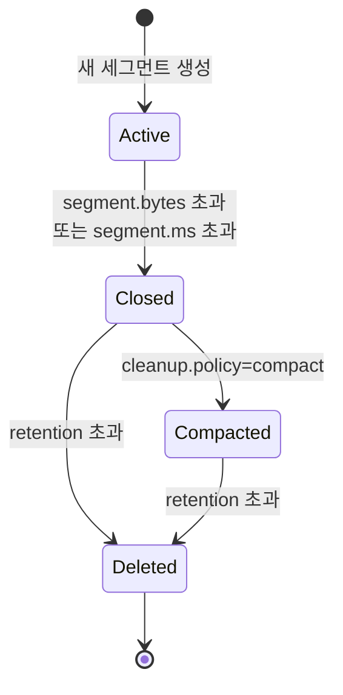

# 12. 로그 기반 스토리지 (Log-Structured Storage)

Redpanda의 핵심은 **분산 커밋 로그(Distributed Commit Log)** 입니다. 이 문서에서는 Redpanda가 메시지를 디스크에 어떻게 저장하고, 어떻게 빠른 읽기/쓰기 성능을 달성하는지 학습합니다.

---

## 1. 로그(Log)란 무엇인가

### 분산 커밋 로그의 개념

Redpanda는 **"분산 커밋 로그"** 시스템입니다. 로그(Log)는 단순히 "기록"을 의미하는 것이 아니라, **시간 순서대로 정렬된 불변(Immutable) 레코드의 시퀀스**를 의미합니다.

```
[Record 1] → [Record 2] → [Record 3] → [Record 4] → ...
   ↑                                          ↑
offset=0                                  offset=3
```

모든 메시지는 로그의 **끝(tail)** 에만 추가됩니다. 한 번 저장된 메시지는 수정되지 않고, 오직 읽거나 삭제만 가능합니다.

### Append-Only 구조의 핵심

Redpanda는 **Append-Only** 구조를 사용합니다. 새로운 데이터는 항상 파일의 끝에만 추가되고, 기존 데이터는 절대 수정되지 않습니다.

**왜 Append-Only인가?**

디스크의 물리적 특성 때문입니다. 전통적인 하드 디스크(HDD)에서:
- **Sequential I/O (순차 쓰기)**: 100-200 MB/s
- **Random I/O (랜덤 쓰기)**: 0.1-2 MB/s

**100배의 성능 차이가 발생합니다.** Append-Only는 디스크 헤드가 이리저리 움직이지 않고 한 방향으로만 쓰기 때문에 Sequential I/O의 이점을 최대한 활용합니다.

SSD에서도 Sequential Write는 Random Write보다 약 3-5배 빠르며, Write Amplification이 적어 수명이 늘어납니다.

### 데이터베이스 WAL과의 비교

전통적인 데이터베이스는 WAL(Write-Ahead Log)과 실제 테이블 파일을 분리합니다:

```
데이터베이스:
┌─────────────┐       ┌──────────────┐
│  WAL (로그)  │ ───→ │ 테이블 파일   │
│ (일시적)     │       │ (영구 저장)   │
└─────────────┘       └──────────────┘
```

반면 **Redpanda는 로그 자체가 곧 데이터**입니다:

```
Redpanda:
┌─────────────────────┐
│   로그 = 실제 데이터  │
│   (영구 저장)        │
└─────────────────────┘
```

WAL은 크래시 복구를 위한 일시적 기록이지만, Redpanda의 로그는 영구적인 데이터 저장소입니다. 이것이 "로그가 곧 데이터베이스"라는 개념입니다.

### Kafka와의 관계

Redpanda는 Kafka와 **동일한 로그 구조 개념**을 사용합니다. 하지만 구현이 완전히 다릅니다:

- **Kafka**: JVM 기반, Java로 작성
- **Redpanda**: C++ 기반, Seastar 프레임워크 사용

Kafka API와 호환되지만, 내부 구현은 처음부터 다시 작성되었습니다. 이를 통해 더 낮은 지연시간과 예측 가능한 성능을 달성했습니다.

---

## 2. 디스크 상의 파일 구조

### 디렉토리 구조

Redpanda는 토픽과 파티션별로 디렉토리를 생성하여 데이터를 저장합니다:

```
/var/lib/redpanda/data/kafka/
├── my-topic/                    # 토픽명
│   ├── 0/                       # 파티션 번호
│   │   ├── 0-1-v1.log           # 세그먼트 파일
│   │   ├── 0-1-v1.base_index    # 오프셋 인덱스
│   │   ├── 0-1-v1.timeindex     # 타임스탬프 인덱스
│   │   ├── 1000-1-v1.log        # 다음 세그먼트
│   │   ├── 1000-1-v1.base_index
│   │   └── snapshot             # Producer 상태
│   ├── 1/                       # 파티션 1
│   └── 2/                       # 파티션 2
└── another-topic/
```

파일명 형식: `{base_offset}-{term}-v1.log`
- `base_offset`: 이 세그먼트의 시작 오프셋
- `term`: Raft 리더 임기 번호
- `v1`: 파일 포맷 버전

### 각 파일의 역할

#### 1. `*.log` - 세그먼트 파일

실제 메시지 데이터가 저장되는 파일입니다. **Record Batch** 단위로 메시지들이 직렬화되어 저장됩니다.

```
[Record Batch 1] [Record Batch 2] [Record Batch 3] ...
```

기본 크기는 1GB이며, 이 크기에 도달하면 새로운 세그먼트 파일이 생성됩니다(`segment.bytes` 설정).

#### 2. `*.base_index` - 오프셋 인덱스

오프셋(Offset)을 파일 내 물리적 위치로 매핑하는 **Sparse Index**입니다.

```
Offset → File Position
1000   → 0 byte
1500   → 1024000 byte
2000   → 2048000 byte
```

모든 오프셋을 인덱싱하지 않고, 일정 간격(`index.interval.bytes`, 기본 4KB)으로만 기록합니다. 이를 통해 인덱스 크기를 줄입니다.

#### 3. `*.timeindex` - 타임스탬프 인덱스

타임스탬프(Timestamp)를 오프셋으로 매핑합니다.

```
Timestamp → Offset
2026-02-05 10:00:00 → 1000
2026-02-05 10:15:00 → 1500
```

Consumer가 "특정 시각부터 메시지를 읽고 싶다"고 요청할 때 사용됩니다.

#### 4. `snapshot` - Producer 상태 정보

Producer의 Idempotent Write를 지원하기 위한 상태 정보입니다:
- Producer ID와 Sequence Number
- 트랜잭션 상태
- 중복 제거를 위한 메타데이터

Raft 리더 선출 시 새 리더가 이 정보를 복원합니다.

#### 5. Leader Epoch Checkpoint

Raft 리더 변경 이력을 기록합니다:

```
Leader Epoch | Start Offset
0            | 0
1            | 1000
2            | 2500
```

리더가 바뀔 때마다 새로운 epoch가 시작되며, 이를 통해 로그 일관성을 보장합니다.

### O_DIRECT I/O의 중요성

**Kafka와 Redpanda의 가장 큰 차이점**은 I/O 방식입니다.

#### Kafka의 방식: Buffered I/O + OS 페이지 캐시

```
Kafka → write() → OS 페이지 캐시 → 디스크
               ↑
         (커널이 관리)
```

Kafka는 OS의 페이지 캐시에 의존합니다. 최근에 읽은 데이터는 메모리에 캐싱되어 빠르게 제공됩니다. 하지만 JVM Garbage Collection이 발생하면 tail latency가 급증하는 문제가 있습니다.

#### Redpanda의 방식: O_DIRECT + 자체 메모리 관리

```
Redpanda → io_submit (O_DIRECT) → 디스크
        ↑
   (페이지 캐시 우회)
```

Redpanda는 **O_DIRECT 플래그**를 사용하여 OS 페이지 캐시를 완전히 우회하고, 자체적으로 메모리를 관리합니다. 이를 통해:

- **예측 가능한 지연시간**: GC pause가 없음
- **CPU 효율성**: 커널-유저 공간 복사 제거
- **메모리 제어**: 정확한 메모리 사용량 파악

하지만 O_DIRECT는 **XFS 파일시스템에서만 제대로 동작**합니다. ext4에서는 성능 문제가 발생할 수 있으므로, Redpanda는 XFS를 필수로 요구합니다.

---

## 3. Record Batch 내부 구조

### Record Batch란?

Redpanda는 메시지를 개별적으로 저장하지 않고 **Record Batch** 단위로 묶어서 저장합니다.

```
Record Batch = [Record 1, Record 2, Record 3, ...]
```

하나의 Producer가 여러 메시지를 짧은 시간 내에 보내면, Redpanda는 이들을 하나의 Batch로 묶습니다.

### Batch의 구조

```
┌──────────────────────────────────────┐
│ Record Batch Header                  │
│ - Base Offset                        │
│ - Batch Length                       │
│ - Partition Leader Epoch             │
│ - Magic (포맷 버전)                   │
│ - CRC (체크섬)                        │
│ - Attributes (압축 코덱, 타임스탬프)   │
│ - Last Offset Delta                  │
│ - First Timestamp                    │
│ - Max Timestamp                      │
│ - Producer ID                        │
│ - Producer Epoch                     │
│ - Base Sequence                      │
│ - Records Count                      │
├──────────────────────────────────────┤
│ Record 1                             │
│ - Length                             │
│ - Attributes                         │
│ - Timestamp Delta                    │
│ - Offset Delta                       │
│ - Key                                │
│ - Value                              │
│ - Headers                            │
├──────────────────────────────────────┤
│ Record 2                             │
│ ...                                  │
└──────────────────────────────────────┘
```

### 왜 Batch 단위인가?

1. **네트워크 효율성**: 여러 메시지를 한 번의 네트워크 요청으로 전송
2. **디스크 효율성**: 하나의 fsync로 여러 메시지 보장
3. **압축 효율성**: 비슷한 메시지들을 함께 압축하면 압축률이 높아짐
4. **CPU 효율성**: 한 번의 체크섬 계산으로 여러 메시지 검증

예를 들어, 100개의 메시지를 개별적으로 쓰면 100번의 I/O가 발생하지만, 하나의 Batch로 묶으면 단 1번의 I/O만 발생합니다.

### 압축 코덱

Record Batch는 압축될 수 있습니다:

- `none`: 압축 없음
- `gzip`: 높은 압축률, 느린 속도
- `snappy`: 균형잡힌 성능 (기본값)
- `lz4`: 빠른 압축/해제
- `zstd`: 높은 압축률과 빠른 속도 (권장)

압축은 **Batch 단위**로 이루어집니다. 비슷한 패턴의 메시지들이 많을수록 압축률이 높아집니다.

### Configuration Batch (Redpanda 고유)

Redpanda는 Raft 기반 복제를 사용하기 때문에, 일반 데이터 외에도 **Configuration Batch**라는 특수 배치가 있습니다.

Configuration Batch는 Raft 상태 변경을 기록합니다:
- 리더 변경
- 복제본 추가/제거
- 설정 변경

이 배치는 **타임스탬프가 일반 메시지보다 이전**일 수 있습니다. 따라서 Batch 내에서 타임스탬프가 역전될 수 있습니다:

```
Batch 1: timestamp = 1000
Batch 2: timestamp = 2000
Batch 3: timestamp = 1500  ← Configuration Batch
```

Consumer는 이런 역전을 처리할 수 있어야 합니다.

---

## 4. 세그먼트 라이프사이클

### 세그먼트 상태 전이

세그먼트는 다음과 같은 라이프사이클을 거칩니다:



### Active 세그먼트

**Active 세그먼트**는 현재 쓰기 중인 세그먼트입니다. 파티션당 **정확히 하나의 Active 세그먼트**만 존재합니다.

```
Partition 0:
├── 0-1-v1.log        (Closed)
├── 1000-1-v1.log     (Closed)
└── 2000-1-v1.log     (Active) ← 여기에 새 메시지 추가
```

Producer가 메시지를 보내면, 이 Active 세그먼트의 끝에 append됩니다.

### 세그먼트가 닫히는 조건

Active 세그먼트는 다음 조건 중 하나를 만족하면 **Closed** 상태로 전환됩니다:

#### 1. 크기 제한: `segment.bytes` 초과

기본값은 1GB입니다. 세그먼트 크기가 이 값을 초과하면 닫히고, 새로운 Active 세그먼트가 생성됩니다.

```bash
# 토픽별 설정
rpk topic alter-config my-topic --set segment.bytes=536870912  # 512MB
```

#### 2. 시간 제한: `segment.ms` 초과

기본값은 7일입니다. 세그먼트가 생성된 지 이 시간이 지나면 자동으로 닫힙니다.

```bash
# 1시간마다 세그먼트 롤링
rpk topic alter-config my-topic --set segment.ms=3600000
```

이 설정은 **저처리량 토픽**에 중요합니다. 메시지가 적어서 `segment.bytes`에 도달하지 못하면, 오래된 메시지가 삭제되지 않을 수 있기 때문입니다.

#### 3. 강제 롤링

Redpanda는 다음 상황에서도 세그먼트를 강제로 닫습니다:
- Raft 리더 변경
- 토픽 설정 변경
- 수동 롤링 요청

### Closed 세그먼트만 삭제/Compaction 가능

**중요한 규칙**: Active 세그먼트는 절대 삭제되거나 compaction되지 않습니다. **Closed 세그먼트만** 대상이 됩니다.

이는 Active 세그먼트에 쓰기가 진행 중이므로, 삭제하면 데이터 손실이 발생하기 때문입니다.

### 세그먼트 크기 설정의 중요성

세그먼트 크기는 트레이드오프가 있습니다:

| 크기 | 장점 | 단점 |
|------|------|------|
| **큼 (2GB+)** | 파일 수 감소, 오버헤드 감소 | 삭제/compaction 지연, 메모리 사용 증가 |
| **작음 (<256MB)** | 빠른 삭제/compaction | 파일 수 증가, 오픈 파일 제한 도달 |

**권장 설정**:
- **고처리량 토픽**: `segment.bytes=536870912` (512MB) - 빠른 삭제
- **저처리량 토픽**: `segment.ms=3600000` (1시간) - 시간 기반 롤링
- **Compaction 토픽**: `segment.bytes=268435456` (256MB) - 빠른 compaction

---

## 5. 인덱스(Index)의 역할

### Sparse Index 방식

Redpanda는 **Sparse Index (희소 인덱스)** 방식을 사용합니다. 모든 오프셋을 인덱싱하지 않고, 일정 간격으로만 위치를 기록합니다.

```
Offset:  0    100   200   300   400   500
         |     |     |     |     |     |
Index:   0     ✓           ✓           ✓
         ↓     ↓           ↓           ↓
Position: 0   10KB       50KB        90KB
```

인덱스는 오프셋 0, 200, 400만 기록합니다 (100개 간격).

### 왜 Sparse Index인가?

**Full Index (모든 오프셋 인덱싱)**를 사용하면 정확한 위치를 바로 찾을 수 있지만, 인덱스 파일이 매우 커집니다.

예를 들어, 1억 개의 메시지를 저장하면:
- Full Index: 800MB (오프셋 8바이트 × 1억)
- Sparse Index (1000개 간격): 800KB (1000배 감소)

Sparse Index는 인덱스 크기를 대폭 줄이는 대신, 검색 시 약간의 순차 스캔이 필요합니다. 하지만 이 스캔은 매우 짧고(몇 KB) Sequential Read이므로 빠릅니다.

### 오프셋 검색 과정

Consumer가 **offset 1000**을 요청하면 다음 과정을 거칩니다:

```
1. Index에서 가장 가까운 이전 오프셋 찾기
   → Index: 990 → Position: 50KB

2. Position 50KB부터 순차 스캔
   990, 991, 992, ... 998, 999, 1000 ← 도착!

3. 1000부터 읽기 시작
```

인덱스 간격(`index.interval.bytes`, 기본 4KB)이 작을수록 스캔 범위가 줄지만, 인덱스 크기가 커집니다.

### 타임스탬프 인덱스

**타임스탬프 인덱스**는 시간을 오프셋으로 변환합니다.

```
Timestamp            → Offset
2026-02-05 10:00:00  → 1000
2026-02-05 11:00:00  → 5000
2026-02-05 12:00:00  → 9000
```

Consumer가 "2026-02-05 10:30:00부터 읽기"를 요청하면:

```
1. 타임스탬프 인덱스에서 가장 가까운 이전 시각 찾기
   → 10:00:00 → Offset 1000

2. Offset 1000부터 순차 스캔하며 10:30:00 도달
   → 실제 오프셋 2500 발견

3. Offset 2500부터 읽기 시작
```

이 기능은 **시간 기반 데이터 재처리**에 유용합니다. 예: "어제 오후 3시 이후 메시지만 다시 처리"

### Tiered Storage의 압축 인덱스

Redpanda의 **Tiered Storage** 기능을 사용하면, 오래된 세그먼트는 S3 같은 원격 스토리지로 이동됩니다.

원격 세그먼트는 **압축된 인메모리 인덱스**를 사용합니다:

```
로컬 세그먼트:   .base_index 파일 (디스크)
원격 세그먼트:   압축 인덱스 (메모리, 1/10 크기)
```

압축 인덱스는 Run-Length Encoding과 Delta Encoding을 사용하여 크기를 대폭 줄입니다. 이를 통해 수백 TB의 데이터를 관리하면서도 인덱스 메모리 사용량을 수 GB로 제한할 수 있습니다.

---

## 6. 리텐션(Retention) 정책

> **보존 정책 상세**: retention.ms/bytes, compaction 전략, 크기 기반 삭제, 시간 기반 삭제의 상세 비교는 [18-retention-compaction-strategies.md](./13-retention-compaction-strategies.md) 참조

### Retention의 목적

**Retention**은 "메시지를 얼마나 오래 보관할 것인가"를 결정합니다. Redpanda는 무한정 데이터를 보관할 수 없으므로, 오래된 데이터를 자동으로 삭제합니다.

### Time-based Retention: `retention.ms`

메시지의 **나이(age)** 를 기준으로 삭제합니다.

```bash
# 3일 동안만 보관
rpk topic alter-config my-topic --set retention.ms=259200000
```

세그먼트의 **Max Timestamp** (마지막 메시지의 타임스탬프)가 retention 시간을 초과하면 삭제됩니다.

```
현재 시각: 2026-02-05 10:00:00
Segment 1: Max Timestamp = 2026-02-01 10:00:00 (4일 전) → 삭제!
Segment 2: Max Timestamp = 2026-02-04 10:00:00 (1일 전) → 유지
```

기본값은 **7일**입니다. 무제한 보관을 원하면 `-1`로 설정합니다.

### Size-based Retention: `retention.bytes`

파티션의 **전체 크기**를 기준으로 삭제합니다.

```bash
# 파티션당 최대 100GB
rpk topic alter-config my-topic --set retention.bytes=107374182400
```

파티션 크기가 이 값을 초과하면, **가장 오래된 세그먼트부터 삭제**됩니다.

```
Partition 0: 120GB (100GB 초과)
├── Segment 1 (20GB) ← 삭제!
├── Segment 2 (30GB) ← 삭제!
├── Segment 3 (40GB) ← 유지 (합계 100GB 이하)
└── Segment 4 (30GB) ← 유지
```

기본값은 **무제한**(`-1`)입니다.

### 두 조건의 관계

`retention.ms`와 `retention.bytes`가 **모두 설정**되면, **둘 중 하나라도 초과하면 삭제**됩니다.

```
예시:
retention.ms = 7일
retention.bytes = 100GB

→ 7일 미만이지만 100GB 초과하면 삭제
→ 100GB 미만이지만 7일 초과하면 삭제
```

### Segment-based Deletion: 개별 메시지 삭제 불가

**중요한 제약**: Redpanda는 세그먼트 단위로만 삭제합니다. **개별 메시지는 삭제할 수 없습니다.**

```
Segment 1 (1GB):
├── Message 1 (3일 전)
├── Message 2 (3일 전)
└── Message 3 (1일 전) ← 최신 메시지

retention.ms = 2일 설정
→ Segment 1은 삭제되지 않음!
  (Max Timestamp = 1일 전)
```

세그먼트 내 단 하나의 메시지라도 retention 범위 내에 있으면, 전체 세그먼트가 보존됩니다.

### 왜 개별 삭제가 불가능한가?

Append-Only 구조이기 때문입니다. 파일 중간의 데이터를 삭제하면:
1. 파일 구조가 깨짐
2. 인덱스를 재작성해야 함
3. 성능 저하 발생

따라서 **세그먼트 전체를 삭제하는 것**이 유일한 방법입니다. 이것이 `segment.bytes`와 `segment.ms` 설정이 중요한 이유입니다.

### 로컬 보존량 제어: `retention_local_target_bytes_default`

Tiered Storage를 사용하면, 로컬과 원격의 retention을 분리할 수 있습니다.

```bash
# 로컬에는 100GB만 유지, 나머지는 S3로
rpk cluster config set retention_local_target_bytes_default 107374182400
```

오래된 세그먼트는 S3로 이동되지만 삭제되지 않으므로, Consumer는 여전히 읽을 수 있습니다(약간 느리지만).

---

## 7. 로그 Compaction

### Compaction이란?

**Compaction**은 동일한 키의 메시지 중 **최신 값만 유지**하고, 이전 값들을 제거하는 과정입니다.

```
압축 전:
key=user123, value=v1
key=user456, value=v2
key=user123, value=v3  ← 최신
key=user456, value=v4  ← 최신

압축 후:
key=user123, value=v3
key=user456, value=v4
```

`user123`의 이전 값 `v1`은 삭제되었습니다.

### 왜 Compaction이 필요한가?

**"마지막 값만 중요한"** 데이터에 유용합니다:

- **사용자 프로필**: 최신 이름, 이메일, 주소
- **설정값**: 최신 설정만 필요
- **센서 데이터**: 최신 온도, 습도
- **상태 스냅샷**: 최신 상태만 의미 있음

이런 데이터는 **모든 이력을 보관할 필요가 없으므로** 스토리지를 크게 절약할 수 있습니다.

예를 들어, 사용자가 프로필을 100번 수정했다면 100개의 메시지가 생기지만, compaction 후에는 1개만 남습니다.

### cleanup.policy 설정

```bash
# Compaction 활성화
rpk topic alter-config my-topic --set cleanup.policy=compact

# Compaction + Time-based deletion
rpk topic alter-config my-topic --set cleanup.policy=compact,delete
```

옵션:
- `delete` (기본): 시간/크기 기반 삭제만 수행
- `compact`: Compaction만 수행 (삭제 안 함)
- `compact,delete`: Compaction 후 오래된 세그먼트 삭제

`compact,delete`는 "최신 값은 유지하되, 너무 오래된 키는 삭제"하는 정책입니다.

### Dirty Ratio: Compaction 실행 시점

Compaction은 항상 실행되지 않고, **Dirty Ratio**가 임계값을 초과할 때만 실행됩니다.

```
Dirty Ratio = 미압축 세그먼트 크기 / 전체 닫힌 세그먼트 크기
```

```
예시:
전체 세그먼트: 10GB
압축된 세그먼트: 6GB
미압축 세그먼트: 4GB

Dirty Ratio = 4GB / 10GB = 40%
```

임계값(기본 50%)을 초과하면 compaction이 시작됩니다:

```bash
# Dirty Ratio 임계값 설정
rpk topic alter-config my-topic --set min.cleanable.dirty.ratio=0.3  # 30%
```

낮은 값일수록 자주 compaction되지만 CPU 사용량이 증가합니다.

### Tombstone: 삭제 마커

키를 "삭제"하려면 **Tombstone**을 사용합니다. Tombstone은 **value가 null인 메시지**입니다.

```java
// Tombstone 발행
producer.send(new ProducerRecord<>("my-topic", "user123", null));
```

Compaction 시:
1. Tombstone이 발견되면, 이 키의 모든 이전 값 삭제
2. Tombstone 자체도 일정 시간 후 삭제 (`delete.retention.ms`)

```
압축 전:
key=user123, value=v1
key=user123, value=v2
key=user123, value=null  ← Tombstone

압축 후:
key=user123, value=null  ← 일시적으로 유지

delete.retention.ms 초과 후:
(key=user123 완전히 삭제)
```

기본 `delete.retention.ms`는 24시간입니다. 이 시간 동안 Consumer는 "이 키가 삭제되었다"는 정보를 받을 수 있습니다.

### Sliding Window Compaction

Redpanda의 최신 버전은 **Sliding Window Compaction**을 사용합니다. 전통적인 Kafka의 compaction은 전체 세그먼트를 재작성하는 방식이었지만, Sliding Window는:

1. 세그먼트를 작은 **청크(chunk)** 로 분할
2. 청크별로 압축 수행
3. 청크를 병합하여 새 세그먼트 생성

이를 통해 **메모리 사용량 감소**와 **병렬 처리**가 가능합니다.

### Best-effort 보장

Compaction은 **Best-effort**입니다. 완벽한 중복 제거를 보장하지 않습니다.

이유:
1. Active 세그먼트는 압축되지 않음
2. 압축 실행 간 시간차 존재
3. Producer가 압축 중에도 메시지 발행 가능

따라서 동일한 키의 메시지가 일시적으로 여러 개 존재할 수 있습니다. Consumer는 이를 처리할 수 있어야 합니다(예: 최신 값으로 덮어쓰기).

### Compacted Segment 크기 설정

```bash
# Compacted 세그먼트 크기 (기본 256MB)
rpk topic alter-config my-topic --set compacted_log_segment_size=268435456

# 최대 크기 (기본 5GB)
rpk topic alter-config my-topic --set max_compacted_log_segment_size=5368709120
```

작은 세그먼트는 빠른 compaction을 가능하게 하지만, 파일 수가 증가합니다.

### 복합 정책: `compact,delete`

두 정책을 동시에 적용하면 Compaction으로 중복 키를 제거한 후, Retention으로 오래된 세그먼트를 삭제합니다. "최신 값은 유지하되, 오래된 키는 삭제"하는 정책이 필요할 때 사용합니다.

```bash
# Compaction + Time-based deletion (예: 탈퇴 사용자 30일 후 자동 삭제)
rpk topic alter-config user-profiles --set cleanup.policy=compact,delete \
  --set retention.ms=2592000000
```

### 정책 선택 비교

| 토픽 유형 | cleanup.policy | retention.ms | 설명 |
|-----------|----------------|--------------|------|
| **로그 데이터** | `delete` | `604800000` (7일) | 일주일 후 삭제 |
| **사용자 프로필** | `compact` | `-1` (무제한) | 최신 값만 유지, 삭제 안 함 |
| **주문 이벤트** | `delete` | `2592000000` (30일) | 30일 후 삭제 |
| **설정 스냅샷** | `compact,delete` | `7776000000` (90일) | 최신 값 유지, 90일 후 삭제 |

---

## 8. Kafka와의 스토리지 차이점

### 비교 테이블

| 항목 | Kafka | Redpanda |
|------|-------|----------|
| **런타임** | JVM (Java) | C++ (Seastar) |
| **페이지 캐시** | OS 페이지 캐시 의존 | O_DIRECT (자체 관리) |
| **I/O 방식** | Buffered I/O | Async Direct I/O (io_submit) |
| **메모리 관리** | JVM Heap + OS 캐시 | 자체 메모리 관리 |
| **세그먼트 구조** | .log + .index + .timeindex | .log + .base_index + snapshot |
| **복제 로그** | 데이터와 분리 | Raft 로그 안에 통합 |
| **파일시스템** | 제한 없음 (ext4, XFS 등) | XFS 필수 (Direct I/O) |
| **Tail Latency** | JVM GC 영향 (수백 ms) | 예측 가능 (수 ms) |

### Kafka의 페이지 캐시 의존성

Kafka는 **OS 페이지 캐시를 적극 활용**합니다.

```
Producer → Kafka → write() → 페이지 캐시 → 디스크
                                   ↓
Consumer ← Kafka ← read() ← 페이지 캐시
                   (캐시 히트: 빠름!)
```

최근에 쓴 데이터는 페이지 캐시에 있으므로, Consumer가 즉시 읽을 때 디스크 I/O 없이 메모리에서 제공됩니다. 이것이 Kafka가 "메모리만큼의 데이터는 매우 빠르게" 읽을 수 있는 이유입니다.

하지만 **단점**이 있습니다:
1. **JVM GC**: Full GC 발생 시 수백 ms의 pause
2. **메모리 경쟁**: JVM Heap과 페이지 캐시가 메모리를 나눠 씀
3. **예측 불가능**: 페이지 캐시 상태를 정확히 알 수 없음

### Redpanda의 O_DIRECT I/O

Redpanda는 **O_DIRECT 플래그**로 페이지 캐시를 완전히 우회합니다.

```
Producer → Redpanda → io_submit (O_DIRECT) → 디스크
                   ↑
           자체 캐시 관리
```

장점:
1. **예측 가능한 지연시간**: GC pause 없음 (C++는 GC 없음)
2. **정확한 메모리 제어**: 사용량을 정확히 파악
3. **CPU 효율성**: 불필요한 커널-유저 복사 제거
4. **꼬리 지연시간 개선**: P99.9 지연시간이 안정적

단점:
1. **XFS 필수**: ext4에서는 Direct I/O 성능 문제
2. **워밍업 필요**: 페이지 캐시에 비해 콜드 스타트가 느림

### 복제 로그 통합

**Kafka**는 복제를 위한 메타데이터와 실제 데이터를 분리합니다:

```
Kafka (4.0+):
├── replication-metadata (KRaft 컨트롤러)
└── data log (별도)
```

**Redpanda**는 Raft 로그 안에 데이터를 통합합니다:

```
Redpanda:
└── Raft log = data + metadata
```

이를 통해:
- 복제와 데이터가 강하게 일치 (Strong Consistency)
- 별도 메타데이터 서비스(KRaft 컨트롤러) 불필요
- 리더 선출이 더 빠름

### Tail Latency 비교

**Tail Latency**는 "P99.9 (상위 0.1%) 지연시간"을 의미합니다.

```
Kafka:
P50: 3ms
P99: 10ms
P99.9: 500ms  ← Full GC 발생!

Redpanda:
P50: 2ms
P99: 5ms
P99.9: 8ms  ← 안정적
```

Kafka는 대부분의 요청이 빠르지만, 가끔 GC로 인해 수백 ms의 급증이 발생합니다. Redpanda는 GC가 없으므로 훨씬 안정적입니다.

금융 거래, 실시간 게임처럼 **예측 가능한 지연시간이 중요한 경우** Redpanda가 유리합니다.

---

## 9. 실무 적용 가이드

### 세그먼트 크기 설정 가이드

#### 기본값 (1GB)이 대부분의 경우 적합

특별한 이유가 없다면 기본값을 사용하세요. Redpanda는 이 값을 기준으로 최적화되어 있습니다.

#### 고처리량 토픽 (수백 MB/s)

```bash
# 512MB로 줄여 빠른 삭제/compaction
rpk topic alter-config high-throughput --set segment.bytes=536870912
```

이유: 세그먼트가 빠르게 차므로, 작은 크기로 설정하여 retention이 즉시 작동하도록 합니다.

#### 저처리량 토픽 (수 KB/s)

```bash
# 시간 기반 롤링 활성화 (1시간)
rpk topic alter-config low-throughput --set segment.ms=3600000
```

이유: 메시지가 적어서 1GB에 도달하지 못하면, 오래된 메시지가 영원히 삭제되지 않을 수 있습니다. 시간 기반 롤링으로 해결합니다.

#### Compaction 토픽

```bash
# 256MB로 줄여 빠른 compaction
rpk topic alter-config compacted --set segment.bytes=268435456
rpk topic alter-config compacted --set cleanup.policy=compact
```

이유: Compaction은 CPU/메모리를 많이 사용하므로, 작은 세그먼트로 설정하여 부담을 줄입니다.

#### 안티패턴: 너무 큰 세그먼트

```bash
# ❌ 절대 하지 마세요!
rpk topic alter-config bad-config --set segment.bytes=5368709120  # 5GB
```

문제점:
1. Compaction 시 **5GB를 모두 메모리에 로드** → OOM 위험
2. 세그먼트가 닫히는 데 오래 걸림 → Retention 지연
3. 파일 복구 시간 증가

### rpk로 확인하는 명령어

#### 토픽 설정 확인

```bash
# 전체 설정 출력
rpk topic describe my-topic --print-configs

# 특정 설정만 확인
rpk topic describe my-topic -c retention.ms -c segment.bytes
```

출력 예시:
```
NAME        my-topic
PARTITIONS  3
REPLICAS    3

CONFIGS:
  retention.ms      604800000
  segment.bytes     1073741824
  cleanup.policy    delete
  compression.type  snappy
```

#### 파티션 상태 확인

```bash
# 파티션별 오프셋 정보
rpk topic describe my-topic

# 상세 정보
rpk topic describe my-topic --detailed
```

출력 예시:
```
PARTITION  LEADER  REPLICAS  HIGH-WATERMARK  LOG-SIZE
0          1       [1,2,3]   1000000         1.2 GB
1          2       [2,3,1]   1500000         1.8 GB
2          3       [3,1,2]   2000000         2.1 GB
```

#### 디스크 사용량 확인

```bash
# 토픽별 디스크 사용량
du -sh /var/lib/redpanda/data/kafka/my-topic/

# 파티션별 디스크 사용량
du -sh /var/lib/redpanda/data/kafka/my-topic/*/

# 세그먼트 파일 목록 (최신 순)
ls -lhtr /var/lib/redpanda/data/kafka/my-topic/0/*.log
```

출력 예시:
```
-rw-r--r-- 1 redpanda redpanda 1.0G Feb  1 10:00 0-1-v1.log
-rw-r--r-- 1 redpanda redpanda 1.0G Feb  2 14:30 1000000-1-v1.log
-rw-r--r-- 1 redpanda redpanda 512M Feb  3 09:15 2000000-1-v1.log
```

#### Compaction 상태 확인

```bash
# Compaction 메트릭 확인 (Prometheus 필요)
curl http://localhost:9644/metrics | grep compaction
```

출력 예시:
```
redpanda_storage_log_compacted_segment_count{...} 15
redpanda_storage_log_compaction_ratio{...} 0.35
```

### 모니터링 메트릭

#### 주요 메트릭

| 메트릭 | 의미 | 정상 범위 |
|--------|------|----------|
| `redpanda_storage_log_partition_size` | 파티션 크기 | retention 이하 |
| `redpanda_storage_log_compacted_segment` | 압축된 세그먼트 수 | 증가 추세 |
| `redpanda_storage_log_segments_count` | 세그먼트 수 | < 1000개 |
| `redpanda_storage_log_written_bytes` | 쓰기 처리량 | - |

#### 비정상 신호

**세그먼트 수가 비정상적으로 많음 (1000개 이상)**

```bash
# 세그먼트 수 확인
find /var/lib/redpanda/data/kafka/my-topic/0/ -name "*.log" | wc -l
```

원인:
- `segment.bytes`가 너무 작음 (< 100MB)
- Compaction이 실행되지 않음
- Retention이 무제한으로 설정됨

해결:
```bash
# 세그먼트 크기 증가
rpk topic alter-config my-topic --set segment.bytes=536870912

# Compaction 강제 실행 (Kafka 호환 명령어)
kafka-configs.sh --alter --entity-type topics --entity-name my-topic \
  --add-config segment.ms=1
```

**디스크 사용량이 계속 증가**

원인:
- Retention 설정이 잘못됨
- Compaction이 제대로 작동하지 않음
- Producer가 키 없이 메시지 발행 (compaction 불가)

해결:
```bash
# Retention 확인 및 설정
rpk topic alter-config my-topic --set retention.bytes=107374182400  # 100GB

# Compaction dirty ratio 확인
rpk topic describe my-topic -c min.cleanable.dirty.ratio
```

**Compaction이 실행되지 않음**

확인:
```bash
# Compaction 설정 확인
rpk topic describe my-topic -c cleanup.policy

# 세그먼트 상태 확인 (Active vs Closed)
ls -lh /var/lib/redpanda/data/kafka/my-topic/0/*.log
```

원인:
- `segment.ms`가 설정되지 않아 Active 세그먼트가 닫히지 않음
- Dirty ratio가 임계값에 도달하지 않음

해결:
```bash
# 시간 기반 롤링 활성화
rpk topic alter-config my-topic --set segment.ms=3600000

# Dirty ratio 임계값 낮춤
rpk topic alter-config my-topic --set min.cleanable.dirty.ratio=0.3
```

### 실무 체크리스트

#### 토픽 생성 시

- [ ] `segment.bytes` 결정 (기본 1GB, 고처리량 512MB, 저처리량 시간 기반)
- [ ] `retention.ms` 설정 (기본 7일, 요구사항에 따라 조정)
- [ ] `retention.bytes` 설정 (디스크 용량 고려)
- [ ] `cleanup.policy` 결정 (delete / compact / compact,delete)
- [ ] `compression.type` 설정 (권장: zstd 또는 snappy)
- [ ] Compaction 토픽이면: 모든 메시지에 키가 있는지 확인 (키 없으면 compaction 불가)
- [ ] Compaction 토픽이면: `segment.bytes=268435456` (256MB) + `min.cleanable.dirty.ratio` 조정
- [ ] Tombstone을 통한 키 삭제 방법 숙지 (value=null 메시지)

#### 운영 중 모니터링

- [ ] 디스크 사용량 추이 확인 (급증 여부)
- [ ] 세그먼트 수 확인 (< 1000개)
- [ ] Compaction 실행 여부 확인
- [ ] Tail latency 모니터링 (P99.9)
- [ ] Consumer lag 확인 (메시지 소비 지연)

#### 성능 튜닝

- [ ] `segment.bytes` 조정으로 retention 속도 개선
- [ ] `segment.ms` 설정으로 저처리량 토픽 롤링
- [ ] `min.cleanable.dirty.ratio` 조정으로 compaction 빈도 제어
- [ ] Tiered Storage로 로컬 디스크 절약
- [ ] 파일시스템이 XFS인지 확인 (ext4는 성능 저하)

---

## 참고

- [Redpanda Architecture](https://docs.redpanda.com/current/get-started/architecture/)
- [Manage Disk Space](https://docs.redpanda.com/current/manage/cluster-maintenance/disk-utilization/)
- [Compaction Settings](https://docs.redpanda.com/current/manage/cluster-maintenance/compaction-settings/)
- [Kafka Logs Guide](https://www.redpanda.com/guides/kafka-performance-kafka-logs)
- [Kafka Log Compaction](https://www.redpanda.com/guides/kafka-performance-kafka-log-compaction)
- [Tiered Storage Deep Dive](https://www.redpanda.com/blog/tiered-storage-architecture-deep-dive)
- [Seastar Framework](https://seastar.io/)
- [Raft Consensus Algorithm](https://raft.github.io/)

---

## 학습 정리

### 핵심 개념

1. **Append-Only 로그**: Sequential I/O로 100배 성능 향상
2. **O_DIRECT I/O**: OS 캐시 우회로 예측 가능한 지연시간
3. **Record Batch**: 네트워크/디스크 효율성과 압축 효율 개선
4. **Sparse Index**: 인덱스 크기 축소와 검색 성능의 균형
5. **Segment-based Operations**: 개별 삭제 불가, 세그먼트 단위만 가능

### Kafka와의 차이

- **런타임**: JVM → C++/Seastar
- **I/O**: Buffered → O_DIRECT
- **지연시간**: GC 영향 → 예측 가능
- **파일시스템**: 무제한 → XFS 필수

### 실무 적용

- **고처리량**: 작은 세그먼트 (512MB)
- **저처리량**: 시간 기반 롤링 (`segment.ms`)
- **Compaction**: 작은 세그먼트 (256MB) + dirty ratio 조정
- **모니터링**: 세그먼트 수, 디스크 사용량, tail latency

이 문서를 통해 Redpanda의 스토리지 시스템을 이해하고, 실무에서 효과적으로 운영할 수 있는 기초를 다졌습니다.
