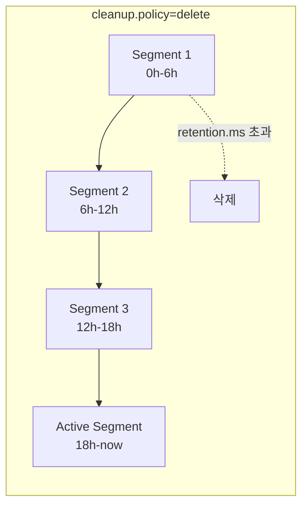
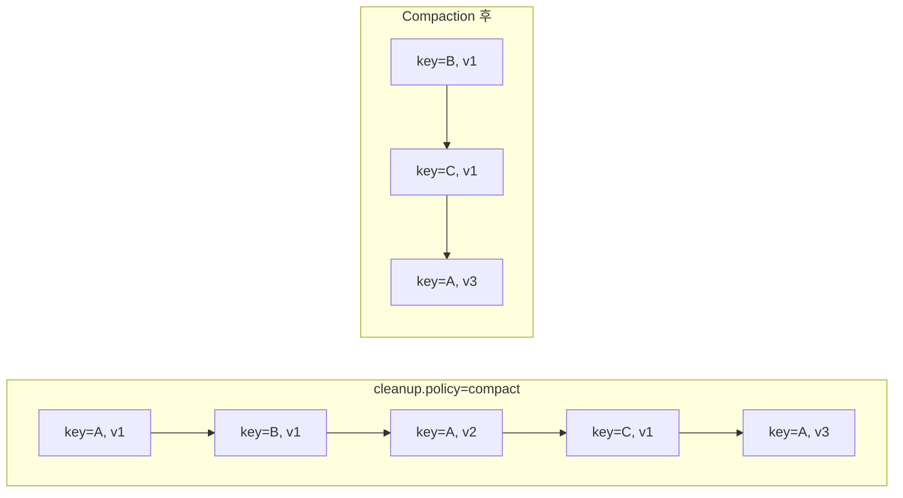

# 13. 보존 정책과 Compaction 전략

메시지를 얼마나 오래, 어떤 형태로 보존할지 결정하는 것은 스토리지 비용과 데이터 가용성 사이의 핵심 트레이드오프입니다. 이 문서에서는 Redpanda/Kafka의 세 가지 보존 전략과 Log Compaction의 동작 원리를 학습합니다.

---

## 학습 목표

- 세 가지 보존 전략(Delete, Compact, Delete+Compact)의 차이와 사용 사례 이해
- Log Compaction이 KTable/캐시 동기화에 어떻게 활용되는지 파악
- Tombstone 메시지의 역할과 `delete.retention.ms` 설정 이해
- Redpanda에서 보존 정책을 설정하고 모니터링하는 방법 습득

---

## 1. 세 가지 보존 전략 개요

### 보존 정책이란 무엇인가

Redpanda는 메시지를 영구적으로 보관하지 않습니다. 보존 정책(Retention Policy)은 **어떤 조건에서 오래된 메시지를 제거할지** 또는 **어떤 방식으로 메시지를 압축할지**를 결정하는 규칙입니다.

**왜 보존 정책이 중요한가?**

메시지 브로커의 디스크는 무한하지 않습니다. 보존 정책이 없다면:
- 디스크가 가득 차서 브로커가 다운됩니다.
- 필요 이상의 스토리지 비용이 발생합니다.
- Consumer가 수천 개의 불필요한 과거 메시지를 처음부터 읽어야 합니다.

반대로 보존 정책이 너무 공격적이라면:
- Consumer가 처리를 완료하기 전에 메시지가 삭제되어 데이터가 유실됩니다.
- 시스템 재구축 시 과거 이벤트를 재생할 수 없습니다.

보존 정책은 "데이터가 아직 필요한가?"라는 질문에 대한 운영상의 답변입니다. 이 질문에 대한 답은 서비스 성격, 규제 요건, 팀의 복구 전략에 따라 달라지므로, 토픽을 설계할 때 반드시 명시적으로 결정해야 합니다.

### cleanup.policy 설정으로 전략 선택

보존 전략은 토픽 단위로 `cleanup.policy` 설정으로 결정합니다.

| cleanup.policy 값 | 전략명 | Confluent 패턴 |
|------------------|--------|----------------|
| `delete` (기본값) | 시간/크기 기반 삭제 | Limited Retention Event Stream |
| `compact` | 키별 최신 값만 유지 | Compacted Event Stream |
| `compact,delete` | 두 정책 결합 | Compacted + Limited Retention |
| `delete` + `retention.ms=-1` | 무기한 보존 | Infinite Retention Event Stream |

각 전략은 서로 다른 질문에 답합니다.

- **delete**: "오래된 메시지는 언제 버릴 것인가?"
- **compact**: "같은 키의 오래된 값을 어떻게 최신 값으로 대체할 것인가?"
- **infinite**: "모든 메시지를 영원히 보관할 것인가?"

세 전략은 상호 배타적이지 않습니다. `compact,delete` 조합처럼 두 가지를 동시에 적용할 수 있으며, `retention.ms=-1`은 `delete` 정책 내에서 무기한 보존을 의미하는 특수 값입니다. 이 구분을 이해하는 것이 설정 실수를 줄이는 첫걸음입니다.

---

## 2. Limited Retention — 시간/크기 기반 삭제

### 동작 원리

`cleanup.policy=delete`(기본값)는 시간 또는 크기 기준으로 오래된 **세그먼트 파일 단위**로 삭제합니다. 세그먼트 전체가 retention 기간을 초과했을 때만 삭제되며, 세그먼트 내 가장 최신 메시지가 만료되기 전까지는 삭제되지 않습니다.

> 기본 개념(세그먼트 구조, 삭제 판단 메커니즘)은 [06-log-storage.md §6](./12-log-storage.md)에서 상세히 다룹니다. 여기서는 설정 파라미터와 실전 운영에 집중합니다.

### 핵심 설정 파라미터

```
retention.ms=604800000      # 7일 (기본값), -1이면 무기한
retention.bytes=1073741824  # 파티션당 1GB, -1이면 무제한 (기본값)
```

`retention.ms`는 메시지 생성 시점(timestamp) 기준, `retention.bytes`는 파티션당 크기 제한입니다. **두 조건은 OR 관계** — 어느 하나라도 초과하면 가장 오래된 세그먼트부터 삭제합니다. 토픽 전체 최대 크기는 `retention.bytes × 파티션 수`임을 주의합니다.

**세그먼트 크기/시간과의 관계**

```
segment.bytes=1073741824     # 세그먼트 최대 크기 (기본값: 1GB)
segment.ms=604800000         # 세그먼트 롤오버 시간 (기본값: 7일)
```

Active 세그먼트(현재 쓰기 중)는 삭제되지 않으며, 롤오버 후에야 삭제 대상이 됩니다. `segment.ms=7일, retention.ms=7일`이면 최대 14일까지 데이터가 남을 수 있습니다. 정확한 retention을 원한다면 `segment.ms`를 `retention.ms`의 1/7 ~ 1/10 수준으로 설정합니다.

### 삭제 체크 주기 조정

Redpanda는 기본 5분마다 retention 위반을 확인합니다. 주기를 짧게 하면 CPU 부하가 증가하므로, 고트래픽 환경에서만 단축을 고려합니다.

```bash
rpk cluster config get log_retention_check_interval_ms   # 기본값: 300000ms
rpk cluster config set log_retention_check_interval_ms=60000
```

### 적합한 사용 사례

Limited Retention은 **"최근 N일의 데이터만 필요한"** 경우에 적합합니다.

- 애플리케이션 이벤트 로그 (최근 7일 로그)
- 실시간 메트릭/모니터링 데이터 (최근 24시간)
- 일회성 알림, 임시 데이터 파이프라인
- Consumer가 빠르게 처리하는 고처리량 스트림

**주의**: Consumer가 retention 기간 내에 메시지를 처리하지 못하면 **데이터가 영구히 유실**됩니다. Consumer Lag 모니터링이 필수입니다. 허용 가능한 Consumer 최대 지연 시간의 1.5배를 `retention.ms`로 설정하는 것이 실무에서 권장하는 버퍼입니다.

`cleanup.policy=delete`에서 세그먼트가 만료되어 삭제되는 구조를 나타내면 다음과 같습니다.



---

## 3. Infinite Retention — 무기한 보존

### 동작 원리

`retention.ms=-1`과 `retention.bytes=-1`을 설정하면 메시지가 **영구적으로 보존**됩니다. 브로커가 삭제하지 않는 한, Consumer는 언제든 오프셋 0부터 전체 히스토리를 다시 읽을 수 있습니다.

```
retention.ms=-1        # 시간 기반 삭제 비활성화
retention.bytes=-1     # 크기 기반 삭제 비활성화
```

Redpanda에서 `-1`은 "제한 없음"을 의미하는 마법의 숫자입니다. 이 설정은 `cleanup.policy=delete`를 유지한 채로 동작하며, 단지 삭제 트리거 조건이 영원히 충족되지 않을 뿐입니다.

### 왜 Infinite Retention이 필요한가

**Event Sourcing**: 현재 상태는 과거 이벤트의 누적 결과이므로, 이벤트가 삭제되면 애플리케이션을 재구축할 수 없습니다. 신규 서비스가 추가될 때 오프셋 0부터 전체를 리플레이하여 초기 상태를 구축합니다.

**감사 로그 규제**: SOX법(재무 7년), HIPAA(의료 6년) 등 법적 보존 의무가 있는 도메인에서 필수입니다.

### 스토리지 비용 문제와 해결책

로컬 디스크 사용량이 선형으로 증가하므로, **Tiered Storage**([07-tiered-storage.md](./14-tiered-storage.md) 참조)로 오래된 데이터를 S3/GCS로 자동 오프로드합니다. S3 비용은 NVMe SSD 대비 약 20~50배 저렴합니다. Remote Read Replicas를 활용하면 분석 워크로드를 운영 클러스터와 분리할 수 있습니다.

### 적합한 사용 사례 및 운영 팁

**사용 사례**: Event Store, 감사 로그, 데이터 레이크 소스, 신규 서비스 초기 상태 구축

**운영 팁**:
- Tiered Storage는 처음부터 활성화하는 것이 가장 안전합니다 (디스크 50% 사용 전 계획)
- 애플리케이션 레벨에서 재처리 범위를 제한합니다 (예: 최대 1년치만 재처리)
- `compression.type=snappy` 또는 `lz4`로 스토리지를 30~70% 절약합니다

```bash
# Infinite Retention + 압축 조합
rpk topic create events.order.history \
  --partitions 12 \
  --replicas 3 \
  -c cleanup.policy=delete \
  -c retention.ms=-1 \
  -c retention.bytes=-1 \
  -c compression.type=snappy
```

---

## 4. Compacted Event Stream — Log Compaction

### Log Compaction이란 무엇인가

Log Compaction은 같은 키를 가진 레코드 중 오래된 값을 제거하고 **키별 최신 스냅샷**만 유지하는 전략입니다. 결과적으로 Compacted 토픽은 키-값 저장소(KV Store)처럼 동작하여, 서비스 재기동 시 현재 상태를 빠르게 복구할 수 있습니다.

> 기본 개념(Compaction 전/후 비교, 오프셋 처리 방식)은 [06-log-storage.md §7](./12-log-storage.md)에서 상세히 다룹니다. 여기서는 Compaction 프로세스 내부 동작과 운영 설정에 집중합니다.

### Compaction 프로세스 상세

백그라운드 cleaner thread가 트리거 조건 충족 후 비동기로 실행합니다. Compaction 중에도 읽기/쓰기는 차단되지 않습니다.

```
파티션 로그 구조:
┌─────────────┬─────────────┬─────────────┬──────────────┐
│  clean seg  │  clean seg  │  dirty seg  │  active seg  │
│ (이미 정리됨) │ (이미 정리됨) │ (정리 대상)  │ (쓰기 중)    │
└─────────────┴─────────────┴─────────────┴──────────────┘
                              ↑ cleaner thread가 처리
```

**Compaction 트리거**: `min.cleanable.dirty.ratio=0.5` — dirty 세그먼트가 전체의 50% 이상이면 시작합니다. 캐시 동기화처럼 실시간성이 중요하면 `0.1~0.3`, CPU를 아끼려면 `0.5~0.8`로 조정합니다.

### KTable 동기화에 활용되는 이유

Consumer 재기동 시 현재 상태를 빠르게 복구할 수 있기 때문입니다. 일반 토픽은 수백만 개의 과거 이벤트를 전부 읽어야 하지만, Compacted 토픽은 유니크 키 수만큼만 읽으면 완전한 스냅샷을 얻을 수 있습니다.

```
일반 토픽: offset 0부터 1,000,000개 이벤트 → 초기화 수십 분 ~ 수 시간
Compacted: 유니크 키 수(예: 10만 개)만 읽음  → 초기화 수 초 ~ 수 분
```

### 적합한 사용 사례

- KTable / 분산 캐시 동기화 (애플리케이션 재기동 시 상태 복구)
- 사용자 프로필, 상품 정보 등 "현재 상태"가 중요한 마스터 데이터
- 설정값 배포 (Config 변경 시 최신 설정만 유지)
- CDC(Change Data Capture) 변경 스트림의 최신 상태 추적

**주의 사항**: Compaction은 `key`가 반드시 설정된 메시지에서만 의미가 있습니다. key가 null인 메시지는 Compaction 대상이 아니며 영구적으로 유지됩니다. Compacted 토픽을 사용할 때는 Producer가 반드시 의미 있는 key를 설정해야 합니다.

### compact,delete 조합 — 두 전략의 결합

`cleanup.policy=compact,delete`는 Compaction과 시간/크기 기반 삭제를 동시에 적용합니다. CDC 변경 스트림처럼 "최신 상태 보장(compact) + 오래된 이력 제거(delete)"가 동시에 필요한 경우에 사용합니다. 순수 `compact`만 사용하면 삭제된 레코드의 Tombstone이 영구 유지되지만, `compact,delete`는 `retention.ms` 경과 후 오래된 Tombstone도 자연스럽게 제거합니다.

동작 순서: Compaction으로 중복 키 제거 → retention.ms 경과 세그먼트 삭제 → 결과적으로 최근 N일 내의 각 키별 최신 값만 남습니다.

Compaction 전후 로그 구조 변화를 나타내면 다음과 같습니다.



---

## 5. Tombstone과 삭제 의미론

### Tombstone이란 무엇인가

**Tombstone**은 `value=null`인 레코드로, Compacted 토픽에서 특정 키의 삭제를 브로커에 지시하는 유일한 수단입니다. Compaction 이후 해당 키의 레코드가 완전히 제거됩니다.

> 기본 개념(Tombstone 처리 흐름, 묘비 비유)은 [06-log-storage.md §7](./12-log-storage.md)에서 다룹니다. 여기서는 `delete.retention.ms` 설정과 운영 시 주의사항에 집중합니다.

Java에서 Tombstone을 발행하는 예시:

```java
// Tombstone 발행: value를 null로 설정
ProducerRecord<String, UserProfile> tombstone =
    new ProducerRecord<>("cache.user.profile", "user-id-123", null);
producer.send(tombstone);
```

### delete.retention.ms — Tombstone이 머무는 시간

```
delete.retention.ms=86400000   # 24시간 (기본값)
```

Tombstone은 Compaction 직후 즉시 삭제되지 않습니다. `delete.retention.ms` 기간 동안 유지됩니다.

**왜 Tombstone을 즉시 삭제하지 않는가?**

느린 Consumer 때문입니다. Consumer가 Tombstone이 생성되기 전 오프셋에서 읽고 있다면, Tombstone이 즉시 사라지면 Consumer는 "이 키가 삭제됐다"는 사실을 알 수 없습니다. `delete.retention.ms` 기간 동안 Tombstone을 유지하면, 느린 Consumer도 Tombstone을 수신하여 로컬 상태에서 해당 키를 삭제할 기회를 얻습니다.

```
Tombstone 유지 기간:
offset N:   user-1, null (Tombstone 생성 시점)
            ↓ delete.retention.ms (24시간) 동안 유지
            ↓ 24시간 경과 후 다음 Compaction 사이클에서 완전 제거

느린 Consumer:
  → 24시간 내에 Tombstone 수신 → 로컬 캐시에서 user-1 삭제 가능
  → 24시간 후 Consumer 재기동 → Tombstone 없음 → user-1이 애초에 없는 것으로 간주
```

`delete.retention.ms`는 시스템 내에서 **가장 느린 Consumer의 예상 지연 시간보다 커야** 합니다. Consumer가 최대 12시간 지연될 수 있다면 `delete.retention.ms`는 최소 24시간 이상으로 설정해야 합니다. 이보다 짧으면 일부 Consumer는 삭제 이벤트를 놓치고 오래된 데이터를 로컬에 유지하게 됩니다.

### Tombstone이 없는 경우의 문제

Tombstone을 사용하지 않고 단순히 빈 값(`""` 또는 `{}`)을 보내면 어떻게 될까요?

```
잘못된 접근: key=user-1, value="" 전송
  → Compaction 후 user-1: "" 가 최신 값으로 유지됨
  → Consumer는 빈 문자열을 받고, "삭제됐다"는 것을 알 수 없음
  → 애플리케이션 레벨 처리가 필요해지고, 브로커 레벨 삭제는 불가능
```

Tombstone(null value)만이 브로커에게 "이 키를 Compaction 시 제거하라"는 신호를 줍니다. 애플리케이션 레벨에서 "삭제됨"을 표현하는 별도 필드(`{"deleted": true}`)를 두는 방식은 브로커 레벨 정리와 무관하므로, 스토리지에서 실제로 데이터가 제거되지 않습니다.

### GDPR "잊힐 권리" 구현

Compacted 토픽의 Tombstone은 GDPR 같은 개인정보 삭제 요구사항을 구현하는 자연스러운 방법입니다.

```
사용자 계정 삭제 요청
  → key=user-id-123, value=null (Tombstone) 전송
  → Compaction 후 해당 사용자의 모든 데이터가 브로커에서 제거됨
  → delete.retention.ms 이후 완전 삭제 보장
```

단, 이 방식에는 두 가지 한계가 있습니다. 첫째, Tombstone이 완전히 삭제되기까지 `delete.retention.ms` 시간이 걸립니다. 즉각적인 삭제는 보장되지 않습니다. 둘째, Consumer가 이미 수신한 데이터는 Consumer 측에서도 별도 삭제 처리가 필요합니다. 브로커에서 데이터가 삭제되더라도, Consumer의 데이터베이스나 캐시에 남아 있는 데이터는 별도로 처리해야 합니다.

---

## 6. Redpanda 설정 예시

### rpk로 보존 전략 설정하기

**새 토픽 생성 시 보존 정책 지정**

```bash
# Limited Retention: 3일 보존, 파티션당 최대 500MB
rpk topic create events.user.activity \
  --partitions 6 \
  --replicas 3 \
  -c cleanup.policy=delete \
  -c retention.ms=259200000 \
  -c retention.bytes=524288000 \
  -c segment.bytes=134217728

# Infinite Retention: 무기한 보존 (Event Store용)
rpk topic create events.order.history \
  --partitions 12 \
  --replicas 3 \
  -c cleanup.policy=delete \
  -c retention.ms=-1 \
  -c retention.bytes=-1

# Compacted: KTable 동기화용 (사용자 프로필)
rpk topic create cache.user.profile \
  --partitions 6 \
  --replicas 3 \
  -c cleanup.policy=compact \
  -c min.cleanable.dirty.ratio=0.3 \
  -c delete.retention.ms=86400000

# Compact + Delete: CDC 변경 스트림 (30일 + 최신 상태 보장)
rpk topic create cdc.inventory.changes \
  --partitions 6 \
  --replicas 3 \
  -c cleanup.policy=compact,delete \
  -c retention.ms=2592000000 \
  -c delete.retention.ms=86400000
```

### 기존 토픽 설정 변경

```bash
# 기존 토픽의 retention.ms를 30일로 변경
rpk topic alter-config events.user.activity \
  --set retention.ms=2592000000

# Compaction 정책으로 전환 (운영 중 변경 가능)
rpk topic alter-config cache.user.profile \
  --set cleanup.policy=compact

# 특정 설정을 클러스터 기본값으로 되돌리기
rpk topic alter-config events.user.activity \
  --delete retention.ms
```

운영 중인 토픽의 `cleanup.policy`를 `delete`에서 `compact`로 변경하면, 변경 시점 이후부터 Compaction이 활성화됩니다. 기존에 이미 저장된 세그먼트들도 Compaction 대상이 됩니다. 다만 즉시 Compaction이 실행되지는 않으며, `min.cleanable.dirty.ratio` 조건이 충족될 때까지 기다립니다.

### 현재 설정 확인

```bash
# 토픽 설정 전체 확인
rpk topic describe cache.user.profile --config

# 예시 출력:
# TOPIC                CONFIG                        VALUE
# cache.user.profile   cleanup.policy                compact
# cache.user.profile   delete.retention.ms           86400000
# cache.user.profile   min.cleanable.dirty.ratio     0.3

# 토픽 파티션별 오프셋 확인 (Compaction 효과 측정)
rpk topic describe events.user.activity --print-partitions

# Consumer Lag 확인 (retention 기간 내 처리 여부 모니터링)
rpk group describe my-consumer-group
```

### Compaction 효과 직접 확인하기

Compaction이 실제로 동작하는지 확인하는 방법은 같은 키로 여러 번 메시지를 보낸 뒤, 일정 시간 후 토픽을 소비하여 중복 키가 사라졌는지 확인하는 것입니다.

```bash
# 같은 키(user-1)로 3번 메시지 발행
echo '{"key":"user-1","value":"{\"age\":25}"}' | \
  rpk topic produce cache.user.profile --key user-1

echo '{"key":"user-1","value":"{\"age\":26}"}' | \
  rpk topic produce cache.user.profile --key user-1

echo '{"key":"user-1","value":"{\"age\":27}"}' | \
  rpk topic produce cache.user.profile --key user-1

# min.cleanable.dirty.ratio 충족 후 일정 시간 대기...

# Compaction 후 user-1은 age=27인 레코드만 남아야 함
rpk topic consume cache.user.profile --from-beginning
```

### 클러스터 레벨 기본값 vs 토픽 레벨 오버라이드

Redpanda는 2단계 설정 계층을 가집니다.

```
클러스터 레벨 기본값 (redpanda.yaml 또는 rpk cluster config)
  └── 토픽 레벨 오버라이드 (rpk topic create -c / alter-config)
        └── 토픽 설정이 명시되지 않으면 클러스터 기본값 사용
```

```bash
# 클러스터 기본 retention.ms 확인
rpk cluster config get log_retention_ms

# 클러스터 기본 cleanup.policy 변경
rpk cluster config set log_cleanup_policy=compact
```

클러스터 기본값 변경은 이미 생성된 토픽에는 영향을 주지 않습니다. 토픽 생성 시 명시적 설정이 없었던 경우에만 새 기본값이 적용됩니다. 따라서 클러스터 기본값을 변경하더라도 기존 토픽의 보존 전략은 그대로 유지되므로, 의도치 않은 데이터 유실 위험이 없습니다.

### 보존 정책 모니터링

보존 정책이 제대로 동작하는지 확인하는 것은 설정만큼 중요합니다. 데이터가 예상보다 일찍 삭제되거나, 반대로 삭제되지 않아 디스크가 차는 상황을 조기에 발견해야 합니다.

**Consumer Lag 모니터링**

Limited Retention에서 가장 중요한 지표는 Consumer Lag입니다. Lag이 retention 기간 내에 처리될 수 있는 수준인지 확인합니다.

```bash
# Consumer 그룹 Lag 확인
rpk group describe my-consumer-group

# 예시 출력:
# GROUP           TOPIC                 PARTITION  OFFSET  LAG
# my-consumer-group events.user.activity 0         12345   5000
# my-consumer-group events.user.activity 1         11200   4800
```

Lag이 지속적으로 증가하고 있다면, Consumer 처리 속도가 생산 속도를 따라가지 못하는 것입니다. 이 상태가 `retention.ms` 기간보다 오래 지속되면 데이터 유실이 발생합니다.

**토픽 스토리지 크기 모니터링**

```bash
# 토픽의 총 로그 크기 확인
rpk topic describe events.user.activity --print-partitions

# Compacted 토픽에서 Compaction 진행률 확인
# (dirty 세그먼트 비율이 지속적으로 높다면 Compaction이 제대로 동작하지 않는 것)
rpk cluster config get compaction_ctrl_min_shares
```

**Prometheus/Grafana 연동 시 주요 메트릭**

Redpanda는 Prometheus 포맷으로 메트릭을 노출합니다. 보존 정책 관련 주요 메트릭은 다음과 같습니다.

```
# 파티션별 로그 크기 (retention.bytes 초과 여부 감시)
redpanda_storage_log_size_bytes

# Compaction이 처리한 레코드 수 (Compaction 활성 여부 확인)
redpanda_log_compacted_record_total

# Consumer Lag (retention 기간 내 처리 여부 감시)
redpanda_kafka_consumer_group_lag
```

---

### 실전 설정 예시 표

| 사용 사례 | cleanup.policy | retention.ms | retention.bytes | delete.retention.ms |
|-----------|---------------|--------------|-----------------|---------------------|
| 애플리케이션 이벤트 로그 | delete | 604800000 (7일) | 1073741824 (1GB) | N/A |
| 실시간 메트릭 | delete | 86400000 (1일) | 536870912 (512MB) | N/A |
| 캐시/KTable 동기화 | compact | -1 (무기한) | N/A | 86400000 (1일) |
| 감사 로그 | delete | -1 (무기한) | -1 (무제한) | N/A |
| CDC 변경 스트림 | compact,delete | 2592000000 (30일) | N/A | 86400000 (1일) |
| Event Store | delete | -1 (무기한) | -1 (무제한) | N/A |

---

## 7. 사용 사례별 선택 가이드

### 의사결정 흐름도

```
새 토픽의 보존 전략을 선택할 때:

"키별 최신 상태만 필요한가? (캐시, 프로필, 설정값)"
         │
    Yes ─┤
         ↓
"시간 기반 만료도 필요한가?"
    │              │
   Yes            No
    ↓              ↓
compact,delete   compact
(CDC, 변경 추적)  (KTable, 캐시)

         │
    No ──┘
         ↓
"모든 이력을 영구 보존해야 하는가? (법규, Event Sourcing)"
         │
    Yes ─→  delete + retention.ms=-1 + retention.bytes=-1
            (Infinite Retention, Tiered Storage 연계 권장)
         │
    No ──┘
         ↓
"Consumer가 최대 얼마나 지연될 수 있는가?"
         ↓
기간 × 1.5 버퍼 = retention.ms 설정값
(예: Consumer 최대 2일 지연 → retention.ms=3일)
         ↓
cleanup.policy=delete + retention.ms 설정
(Limited Retention)
```

### 전략 비교표

| 항목 | delete (Limited) | compact | compact,delete | delete (Infinite) |
|------|-----------------|---------|----------------|-------------------|
| 삭제 기준 | 시간/크기 | 키 중복 | 둘 다 | 없음 |
| 전체 이력 보존 | X | X (최신만) | X (최신 + 기간) | O |
| 스토리지 예측 가능성 | O (상한선 있음) | 키 수에 비례 | O | X (무한 증가) |
| 재구독 시 상태 복구 | 기간 내 이벤트만 | 전체 최신 상태 | 기간 내 최신 상태 | 전체 이력 |
| Tombstone 지원 | X | O | O | X |
| Consumer Lag 허용도 | 제한적 (기간 내) | 높음 | 중간 | 무제한 |
| 주요 사용처 | 이벤트 로그, 메트릭 | KTable, 캐시 | CDC | Event Store, 감사 |

### 스토리지 예상 계산 공식

실제 운영에서 토픽 스토리지를 사전에 계산하면 용량 계획에 도움이 됩니다.

```
Limited Retention 토픽 예상 스토리지:
  총 크기 = 초당 메시지 크기(bytes) × 보존 기간(초) × 복제 팩터

예시: 초당 1MB, 7일 보존, 복제 팩터 3
  = 1MB × 604800초 × 3
  = 1,814,400 MB ≈ 1.7 TB

Compacted 토픽 예상 스토리지:
  총 크기 = 유니크 키 수 × 평균 메시지 크기 × 복제 팩터 × (1 + dirty_ratio_buffer)

예시: 유니크 키 100만, 평균 1KB, 복제 팩터 3, dirty ratio 0.5
  = 1,000,000 × 1KB × 3 × 1.5
  = 4,500,000 KB ≈ 4.3 GB
```

Compacted 토픽은 키 수가 고정적이라면 스토리지 크기도 수렴합니다. 반면 키가 계속 추가되는 구조라면 (예: 주문 ID를 키로 사용) 사실상 무한 증가하므로 `compact,delete` 조합으로 시간 기반 상한선을 추가해야 합니다.

### 흔한 실수와 예방법

**실수 1: Compacted 토픽에 key=null 메시지 발행**

key가 null인 메시지는 Compaction 대상이 아닙니다. 모든 null-key 메시지는 영구적으로 누적되며 스토리지를 소진합니다. Compacted 토픽에 메시지를 발행하는 Producer는 반드시 의미 있는 key를 설정해야 합니다.

**실수 2: Limited Retention에서 segment.ms를 retention.ms와 동일하게 설정**

`segment.ms=7일, retention.ms=7일`로 설정하면 실제 삭제가 최대 14일까지 지연됩니다. 세그먼트가 롤오버되어야 삭제가 가능하므로, `segment.ms`를 `retention.ms`의 1/7 이하로 설정하는 것이 권장됩니다.

**실수 3: delete.retention.ms를 Consumer 지연보다 짧게 설정**

`delete.retention.ms`가 가장 느린 Consumer의 예상 지연보다 짧으면, 일부 Consumer가 Tombstone을 놓쳐 로컬 캐시에 삭제된 키가 남아 있게 됩니다. GDPR 요건이 있는 경우 특히 주의해야 합니다.

---

## 참고 자료

- [Confluent: Compacted Event Stream Pattern](https://developer.confluent.io/patterns/event-stream/compacted-event-stream/)
- [Confluent: Infinite Retention Event Stream Pattern](https://developer.confluent.io/patterns/event-stream/infinite-retention-event-stream/)
- [Confluent: Limited Retention Event Stream Pattern](https://developer.confluent.io/patterns/event-stream/limited-retention-event-stream/)
- [Redpanda 공식 문서: Topic Configuration](https://docs.redpanda.com/docs/reference/topic-properties/)
- [Redpanda 공식 문서: Log Compaction](https://docs.redpanda.com/docs/manage/tiered-storage/)
- 기존 문서: [`06-log-storage.md`](./12-log-storage.md) — 세그먼트 구조와 인덱스
- 기존 문서: [`07-tiered-storage.md`](./14-tiered-storage.md) — Infinite Retention과 연계되는 오브젝트 스토리지 티어링
- 기존 문서: [`11-topic-design.md`](./10-topic-design.md) — 파티셔닝 및 토픽 네이밍 전략
