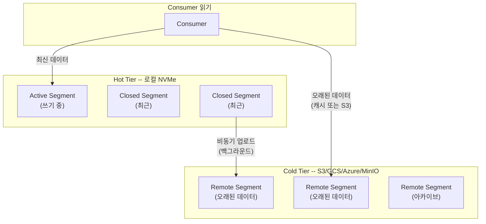
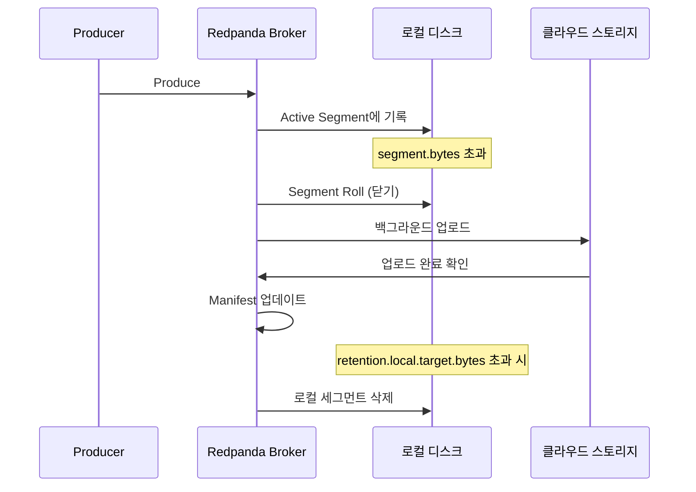
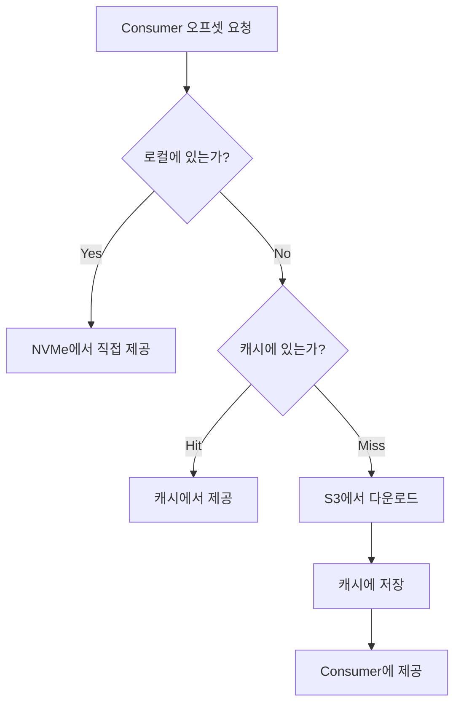
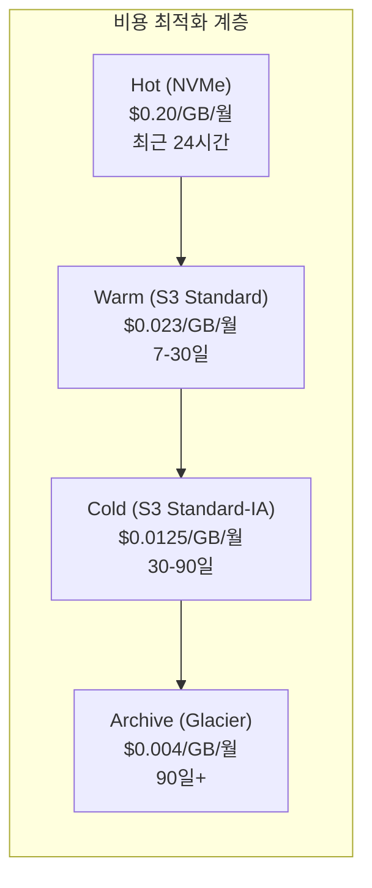

# 14. Tiered Storage

오래된 데이터를 클라우드 스토리지로 오프로드하여 비용을 최적화하고 무제한 보존을 달성하는 방법.

---

## 1. 왜 Tiered Storage가 필요한가

Redpanda는 처리량을 위해 NVMe SSD를 요구한다. 문제는 NVMe가 빠른 만큼 비싸다는 점이다. GB당 월 약 $0.20인데, AWS S3 Standard는 $0.023으로 거의 **10배 차이**가 난다. 하루 100GB씩 1년을 보존하면 NVMe만으로는 연간 $87,600이 드는 반면, S3를 섞으면 $3,288까지 떨어진다. (상세 비용 비교는 섹션 5에서 다룬다.)

비용만의 문제가 아니다. 금융이나 의료처럼 규제가 있는 산업에서는 7년 이상 데이터를 보존해야 하는 경우가 흔한데, 7년치를 전부 NVMe에 담는다는 건 현실적으로 불가능하다. S3 Glacier 같은 저비용 계층과 결합해야 비로소 장기 보존이 실현 가능한 수준이 된다.

그리고 근본적으로, 로컬 디스크만 쓰면 보존 기간이 디스크 용량에 묶인다. Tiered Storage를 켜면 `retention.local.target.bytes`만큼만 로컬에 유지하고 나머지는 클라우드로 넘기기 때문에, 사실상 보존 기간의 상한이 사라진다.

06-log-storage.md에서 배운 세그먼트 라이프사이클을 떠올려 보자. Active → Closed → Deleted라는 흐름이었다. Tiered Storage는 여기에 "Cloud Upload"라는 단계를 하나 끼워넣는다. 로컬은 빠른 최근 데이터를, 클라우드는 저렴한 과거 데이터를 맡으면서 **이중 계층**이 완성되는 구조다.

---

## 2. 아키텍처

> **보존 정책과 Tiered Storage 연동**: retention 정책에 따른 로컬/원격 스토리지 전환 전략은 [18-retention-compaction-strategies.md](./18-retention-compaction-strategies.md) 참조

Tiered Storage의 핵심 아이디어는 단순하다. **데이터를 온도별로 나누자**는 것이다.

Producer가 보낸 데이터는 먼저 로컬 NVMe에 쓰인다. 이것이 Hot Tier로, Sub-ms 지연으로 접근할 수 있는 가장 빠른 계층이다. 시간이 지나 세그먼트가 닫히면, 백그라운드 스레드가 해당 세그먼트를 클라우드(S3, GCS, Azure 또는 MinIO)에 복사한다. 이쪽이 Cold Tier인데, 접근에 수십 ms가 걸리지만 용량은 사실상 무제한이다.

| 계층 | 내용 | 지연시간 | 용량 제어 |
|------|------|---------|---------|
| **Hot Tier** (로컬 NVMe) | Active + 최근 Closed Segment | Sub-ms | `retention.local.target.bytes` |
| **Cold Tier** (S3/GCS/Azure/MinIO) | 오래된 세그먼트 | 수십 ms | 사실상 무제한 |

여기서 중요한 점은 **Consumer가 이 구분을 전혀 모른다**는 것이다. 브로커 메모리에는 메타데이터 매니페스트가 상주하고 있어서, Consumer가 특정 오프셋을 요청하면 브로커가 "이건 로컬에 있다" 또는 "이건 S3에 있다"를 즉시 판단한다. Consumer 입장에서는 항상 같은 Kafka API를 호출할 뿐이다.



업로드는 **비동기**라서 Producer 성능에 영향을 주지 않는다. Cold Tier에 실제로 접근하는 경우는 Consumer lag이 크거나, 과거 데이터를 replay하는 상황뿐이다.

---

## 3. 동작 원리 상세

### 업로드 흐름

데이터가 로컬에서 클라우드로 이동하는 과정을 단계별로 따라가 보자.

먼저 Active Segment가 `segment.bytes` 또는 `segment.ms` 조건에 도달하면 닫힌다. 06-log-storage.md에서 다룬 Active → Closed 전환이 바로 이 지점이다. 세그먼트가 닫히면 Redpanda 내부의 업로드 스레드가 이를 감지하는데, 감지 간격은 `cloud_storage_segment_max_upload_interval_sec`(기본 3600초)으로 조절할 수 있다.

업로드할 차례가 오면 세그먼트 데이터(.log)와 인덱스가 함께 클라우드 버킷으로 올라간다. 이때 메타데이터 매니페스트도 같이 기록된다. 업로드가 끝나면 브로커는 로컬 세그먼트와 원격 세그먼트의 **체크섬을 비교**해서 데이터가 깨지지 않았는지 검증한다.

이후 `retention.local.target.bytes`를 초과하게 되면, 이미 클라우드에 안전하게 복사된 로컬 세그먼트부터 삭제 대상이 된다. 삭제되더라도 매니페스트가 브로커 메모리에 남아 있기 때문에, 어떤 오프셋이 어떤 원격 세그먼트에 있는지는 언제든 빠르게 조회할 수 있다.



### 읽기 흐름

Consumer가 오프셋을 요청하면, 브로커는 매니페스트를 보고 데이터 위치를 판단한다. 로컬에 있으면 Sub-ms로 바로 돌려주니 아무 문제가 없다.

흥미로운 건 원격 데이터를 읽을 때다. 브로커는 곧바로 S3에 가지 않고, 먼저 **LRU 캐시**(`cloud_storage_cache_size`)를 확인한다. 최근에 다운로드한 세그먼트가 캐시에 남아 있으면 그걸 쓰고, 캐시에도 없을 때만 S3에서 다운로드한다. 다운로드한 세그먼트는 캐시에 저장해 두므로, 같은 데이터를 다시 읽을 때는 S3 왕복이 필요 없다. 다만 캐시 미스가 발생하면 수십~수백 ms의 추가 지연이 붙는데, 이 부분은 섹션 6에서 자세히 다룬다.



---

## 4. 설정 가이드

### 클러스터 설정 (Helm values.yaml)

#### AWS S3

가장 흔한 구성이다. IAM Role 기반 인증을 쓰면 Access Key를 설정 파일에 넣지 않아도 되므로 보안상 권장된다.

```yaml
config:
  cluster:
    cloud_storage_enabled: true
    cloud_storage_region: ap-northeast-2
    cloud_storage_bucket: redpanda-tiered-storage
    cloud_storage_api_endpoint: s3.ap-northeast-2.amazonaws.com
    cloud_storage_credentials_source: aws_instance_metadata  # IAM Role 권장
    retention_local_target_bytes: 10737418240    # 10GB
    retention_local_target_ms: 86400000          # 24시간
    cloud_storage_segment_max_upload_interval_sec: 3600
    cloud_storage_initial_backoff_ms: 100
    cloud_storage_segment_upload_timeout_ms: 30000
    cloud_storage_cache_size: 20737418240        # 20GB
```

#### GCS / Azure Blob

GCS와 Azure도 엔드포인트와 인증 방식만 바꾸면 같은 구조로 동작한다.

```yaml
# GCS
cloud_storage_region: asia-northeast3
cloud_storage_api_endpoint: storage.googleapis.com
cloud_storage_credentials_source: gcp_instance_metadata

# Azure Blob
cloud_storage_azure_container: redpanda-tiered-storage
cloud_storage_azure_storage_account: myaccount
cloud_storage_credentials_source: azure_vm_instance_metadata
```

#### S3 호환 스토리지 (MinIO 등)

클라우드를 쓸 수 없는 온프레미스 환경이거나 로컬에서 Tiered Storage를 실험해 보고 싶을 때는, MinIO 같은 S3 호환 오브젝트 스토리지를 Cold Tier로 쓸 수 있다. Redpanda가 내부적으로 S3 API를 사용하기 때문에, 엔드포인트와 인증 정보만 바꿔주면 나머지는 그대로 동작한다.

AWS S3 설정과 비교하면 달라지는 부분은 세 가지다. 리전이 필요 없으므로 빈 문자열을 넣고, 로컬 MinIO는 보통 TLS 없이 띄우므로 `cloud_storage_disable_tls`를 켜고, IAM 대신 정적 키를 사용하므로 `credentials_source`를 `config_file`로 바꾼다.

```yaml
config:
  cluster:
    cloud_storage_enabled: true
    cloud_storage_region: ""                              # MinIO는 리전 불필요
    cloud_storage_bucket: redpanda-tiered
    cloud_storage_api_endpoint: minio.internal:9000       # MinIO 엔드포인트
    cloud_storage_api_endpoint_port: 9000
    cloud_storage_disable_tls: true                       # 로컬 MinIO는 보통 TLS 미사용
    cloud_storage_access_key: minioadmin                  # 또는 Kubernetes Secret 참조
    cloud_storage_secret_key: minioadmin
    cloud_storage_credentials_source: config_file         # IAM 대신 정적 키
```

로컬 개발이나 PoC에서 MinIO를 빠르게 띄우려면 docker-compose 하나면 충분하다.

```yaml
services:
  minio:
    image: minio/minio:latest
    command: server /data --console-address ":9001"
    ports:
      - "9000:9000"   # S3 API
      - "9001:9001"   # Web Console
    environment:
      MINIO_ROOT_USER: minioadmin
      MINIO_ROOT_PASSWORD: minioadmin
    volumes:
      - minio-data:/data

volumes:
  minio-data:
```

한 가지 주의할 점은 **버킷을 Redpanda보다 먼저 생성해야 한다**는 것이다. Redpanda는 버킷이 없으면 업로드를 시도하다 실패하고 백오프에 들어간다.

```bash
# mc (MinIO Client)로 버킷 생성
mc alias set local http://localhost:9000 minioadmin minioadmin
mc mb local/redpanda-tiered
```

MinIO 말고도 S3 호환 스토리지는 여럿 있다. 규모와 운영 여건에 따라 선택이 달라진다.

| 서비스 | 용도 | 특징 |
|--------|------|------|
| **MinIO** | 온프레미스 / 로컬 개발 | S3 API 완전 호환, Erasure Coding 지원, 단일 바이너리 배포 가능 |
| **Ceph (RGW)** | 대규모 온프레미스 | 분산 스토리지, S3/Swift 이중 API, 운영 복잡도 높음 |
| **SeaweedFS** | 경량 온프레미스 | 빠른 설정, S3 게이트웨이 제공, 소규모에 적합 |

온프레미스에서 Tiered Storage를 쓰는 이유는 클라우드와 동일하다. NVMe는 비싸고, 오브젝트 스토리지는 HDD 기반이라 GB당 비용이 훨씬 낮다. 다만 클라우드와 달리 네트워크 전송 비용은 없는 대신, **오브젝트 스토리지의 가용성과 내구성을 직접 관리해야 한다**는 트레이드오프가 있다. MinIO의 Erasure Coding이나 Ceph의 복제 정책을 적절히 설정하지 않으면, Cold Tier에 올린 데이터가 디스크 장애로 유실될 수 있다.

### 토픽별 설정

클러스터 레벨에서 Tiered Storage를 켰다고 모든 토픽이 자동으로 적용되는 건 아니다. 토픽마다 개별적으로 `remote.write`와 `remote.read`를 활성화해야 한다.

```bash
# 생성 시
rpk topic create orders \
  --partitions 6 --replicas 3 \
  --config redpanda.remote.write=true \
  --config redpanda.remote.read=true \
  --config retention.local.target.bytes=5368709120 \
  --config retention.bytes=-1

# 기존 토픽 변경
rpk topic alter-config orders \
  --set redpanda.remote.write=true \
  --set redpanda.remote.read=true \
  --set retention.local.target.bytes=5368709120

# 설정 확인
rpk topic describe orders -c
```

### 핵심 설정 파라미터

설정이 많아 보이지만, 실제로 신경 써야 할 파라미터는 크게 두 부류다. 하나는 "어디에 얼마나 보존할 것인가"를 결정하는 retention 계열이고, 다른 하나는 "업로드와 읽기를 얼마나 효율적으로 할 것인가"를 결정하는 cloud_storage 계열이다.

| 파라미터 | 설명 | 기본값 | 권장값 |
|---------|------|--------|--------|
| `cloud_storage_enabled` | 클러스터 전체 활성화 | `false` | `true` |
| `redpanda.remote.write` | 토픽별 클라우드 업로드 | `false` | `true` |
| `redpanda.remote.read` | 토픽별 클라우드 읽기 | `false` | `true` |
| `retention.local.target.bytes` | 로컬 NVMe 보존 용량 | - | 워크로드별 |
| `cloud_storage_cache_size` | 원격 세그먼트 읽기 캐시 | 20GB | 로컬 디스크의 20% |
| `cloud_storage_segment_max_upload_interval_sec` | 최대 업로드 대기 시간 | 3600 | 워크로드별 |
| `retention.bytes` | 전체 보존 용량 (로컬+클라우드) | -1 (무제한) | -1 |
| `retention.ms` | 전체 보존 시간 (로컬+클라우드) | 7일 | 규정에 따라 |

`retention.bytes`와 `retention.local.target.bytes`의 관계가 처음에는 헷갈릴 수 있다. `retention.bytes`는 로컬+클라우드를 합산한 **전체** 보존 한도이고, `retention.local.target.bytes`는 그중 **로컬에만** 유지할 양이다. 로컬 한도를 넘은 세그먼트는 클라우드에 복사된 뒤 로컬에서 지워지고, `retention.bytes`까지 넘으면 클라우드에서도 지워진다.

---

## 5. 비용 최적화

### 스토리지 클래스 계층화

Tiered Storage를 켜는 것만으로도 NVMe 비용은 크게 줄어든다. 하지만 진짜 비용 절감은 여기서 한 발 더 나아가, **클라우드 스토리지 내부에서도 계층을 나눌 때** 나온다.

Redpanda 자체는 S3 Standard에 데이터를 올리는데, S3 Lifecycle Policy를 걸어두면 시간이 지남에 따라 더 저렴한 클래스로 자동 전환된다. 30일이 지난 데이터는 Standard-IA로, 90일이 지나면 Glacier로 내려가는 식이다. 각 클래스의 비용 차이를 보면 왜 이 전략이 중요한지 바로 느껴진다.



S3 Standard에서 Glacier까지 가면 비용이 약 6배 줄어든다. NVMe에서 Glacier까지는 50배다.

### S3 Lifecycle Policy

실제로 적용하는 정책은 간단하다. 버킷에 아래 Lifecycle Rule 하나만 걸면 된다.

```json
{
  "Rules": [
    {
      "ID": "RedpandaTieredStorageLifecycle",
      "Status": "Enabled",
      "Filter": {"Prefix": ""},
      "Transitions": [
        { "Days": 30, "StorageClass": "STANDARD_IA" },
        { "Days": 90, "StorageClass": "GLACIER" }
      ]
    }
  ]
}
```

다만 Glacier로 내려간 데이터는 Consumer가 접근할 때 수 분에서 수 시간의 복원 시간이 필요하다는 점을 기억해야 한다. 재처리 가능성이 있는 데이터는 Standard-IA에 유지하고, Glacier는 규정 준수 목적의 장기 보존에만 적용하는 게 안전하다.

### 비용 계산 예시

구체적인 숫자로 비교해 보자. 하루 100GB 유입, 1년 보존이라는 시나리오다.

**NVMe Only** — 36.5TB를 전부 NVMe에 담으면 연 $87,600이 든다.

**NVMe + S3 Lifecycle** — 계층별로 나누면 이야기가 완전히 달라진다.

| 계층 | 용량 | 단가 | 월 비용 | 연 비용 |
|------|------|------|---------|---------|
| NVMe (최근 1일) | 100GB | $0.20/GB/월 | $20 | $240 |
| S3 Standard (1~30일) | ~3TB | $0.023/GB/월 | $69 | $828 |
| S3 Standard-IA (30~90일) | ~6TB | $0.0125/GB/월 | $75 | $900 |
| S3 Glacier (90~365일) | ~27.5TB | $0.004/GB/월 | $110 | $1,320 |
| **합계** | | | **$274** | **$3,288** |

**연간 절감: $84,312 (96%)** — S3 API 호출 및 데이터 전송 비용을 제외한 순수 스토리지 비용만의 차이다. 실제로는 API 호출 비용이 추가되지만, 스토리지 비용 격차가 워낙 크기 때문에 전체 절감 효과에는 큰 영향을 주지 않는다.

---

## 6. 실무 주의사항

### 캐시 미스가 문제가 되는 순간

Tiered Storage를 운영하면서 마주치는 가장 큰 성능 리스크는 **캐시 미스**다. 정상적인 상황에서는 대부분의 Consumer가 최근 데이터를 읽기 때문에 Hot Tier에서 처리된다. 문제는 Cold Tier 접근이 빈번해지는 두 가지 상황이다.

첫째, **Consumer lag이 큰 경우**다. 읽기 위치가 로컬 보존 범위를 벗어나면 모든 읽기마다 S3 다운로드가 필요해진다. 수십~수백 ms 지연이 매 요청마다 붙으니 처리량이 급격히 떨어진다.

둘째, **대량 재처리(replay)**다. 과거 데이터를 대규모로 다시 읽으면 캐시가 빠르게 소진되고 S3 API 호출이 폭증한다. 수백 TB를 재처리하는 경우 S3 비용도 무시할 수 없는 수준이 된다.

이런 상황에 대비하는 전략은 세 가지다. 재처리 전에 `cloud_storage_cache_size`를 임시로 키우거나, 전용 Consumer Group을 분리하여 일반 Consumer의 캐시가 오염되지 않게 하거나, 아예 재처리 대상 기간을 별도 토픽으로 복사한 뒤 처리하는 방법이 있다.

### 장애 복구에 걸리는 시간

단일 노드 장애는 비교적 가벼운 편이다. Raft replica가 있으니 메타데이터 매니페스트만 복원하면 되고, Cold Data에 대해 S3를 건드릴 필요가 없다.

전체 클러스터 복구는 다른 이야기다. 10Gbps(1.25GB/s) 네트워크 기준으로 10TB는 약 2.2시간, 100TB면 약 22시간이 걸린다. 현실적인 접근은 최신 데이터를 우선 복구해서 서비스를 먼저 살리고, Cold Data는 Consumer가 실제로 요청할 때 on-demand로 가져오는 것이다.

### 네트워크 비용을 잊지 말 것

클라우드 환경에서 Tiered Storage를 쓸 때 간과하기 쉬운 게 네트워크 전송 비용이다.

| 구간 | 비용 |
|------|------|
| 같은 리전, 같은 AZ | 무료 |
| 같은 리전, 다른 AZ | $0.01/GB |
| 다른 리전 | $0.02/GB |
| 인터넷 | $0.09/GB |

Redpanda 클러스터와 S3 버킷은 **반드시 같은 리전**에 배치해야 한다. 같은 AZ까지 맞추면 전송 비용이 완전히 무료인데, 이걸 놓치고 다른 리전에 버킷을 만들면 하루 100GB 기준으로 월 $60 이상의 불필요한 비용이 발생한다. 온프레미스(MinIO 등)라면 이 부분은 걱정할 필요가 없다.

### 업로드가 실패하면 어떻게 되나

업로드 실패 시 `cloud_storage_initial_backoff_ms`(기본 100ms)부터 시작하는 지수적 백오프로 자동 재시도한다. 업로드가 밀리는 동안에도 로컬 세그먼트는 삭제되지 않기 때문에 **데이터 손실은 없다**. 다만 지연이 장기화되면 로컬 디스크가 가득 찰 수 있으므로, 업로드 지연 메트릭을 반드시 모니터링해야 한다.

---

## 7. 모니터링

Tiered Storage는 "설정하고 잊어버려도 되는" 기능이 아니다. 특히 캐시 미스율과 업로드 지연은 서비스 품질에 직접 영향을 주므로 지속적으로 관찰해야 한다.

### REST API

가장 빠르게 상태를 확인하는 방법은 Admin API를 호출하는 것이다.

```bash
# 업로드 상태
curl http://localhost:9644/v1/cloud_storage/status

# 토픽별 클라우드 스토리지 사용량
curl http://localhost:9644/v1/cloud_storage/usage
```

### Prometheus 메트릭

체계적인 모니터링을 위해서는 Prometheus 메트릭을 수집해야 한다. 아래 다섯 가지가 핵심이다.

| 메트릭 | 의미 | 주의해야 할 때 |
|--------|------|--------------|
| `redpanda_cloud_storage_uploaded_bytes` | 업로드된 총 바이트 | 꾸준히 증가하는 게 정상. 멈추면 업로드 장애 |
| `redpanda_cloud_storage_downloaded_bytes` | 다운로드된 총 바이트 | 급증하면 캐시 미스 의심 |
| `redpanda_cloud_storage_upload_latency_seconds` | 업로드 지연시간 | 급증하면 네트워크나 S3 쪽 문제 |
| `redpanda_cloud_storage_cache_hits` | 캐시 적중 횟수 | - |
| `redpanda_cloud_storage_cache_misses` | 캐시 미스 횟수 | miss/(hit+miss) > 30%면 캐시 증가 검토 |

이 중에서 가장 중요한 건 **캐시 미스율**이다. 30%를 넘으면 Consumer 지연이 눈에 띄게 증가하기 시작한다.

### 핵심 알림

```yaml
# 캐시 미스율 30% 초과
- alert: TieredStorageHighCacheMissRate
  expr: >
    rate(redpanda_cloud_storage_cache_misses[5m]) /
    (rate(redpanda_cloud_storage_cache_hits[5m]) + rate(redpanda_cloud_storage_cache_misses[5m]))
    > 0.3
  for: 10m
  annotations:
    summary: "Tiered Storage 캐시 미스율 30% 초과"

# 업로드 지연 10분 초과
- alert: TieredStorageUploadLatencyHigh
  expr: redpanda_cloud_storage_upload_latency_seconds > 600
  for: 5m
  annotations:
    summary: "클라우드 업로드 지연 10분 초과"
```

---

## 8. 06-log-storage.md와의 관계

Tiered Storage를 제대로 이해하려면, 06-log-storage.md에서 다룬 로컬 스토리지 메커니즘과 어떻게 맞물리는지를 알아야 한다.

### 세그먼트 라이프사이클이 어떻게 달라지는가

Tiered Storage 없이는 세그먼트가 Active → Closed → Deleted라는 단순한 생애를 산다. Tiered Storage를 켜면 Closed와 Deleted 사이에 "Cloud Upload" 단계가 끼어들면서, **로컬 삭제와 클라우드 삭제가 독립적으로 관리**되기 시작한다.

```
Active → Closed → Cloud Upload → [로컬 삭제] → Cloud Retention 만료 시 삭제
```

로컬에서 지워졌다고 데이터가 사라지는 게 아니라, 클라우드에 복사본이 남아 있다는 점이 핵심이다.

### Retention의 이중 구조

이 구조 때문에 Retention 설정도 두 층으로 나뉜다.

| 설정 | 적용 범위 | 역할 |
|------|----------|------|
| `retention.ms` | 전체 (로컬+클라우드) | 데이터의 최대 수명 |
| `retention.bytes` | 전체 (로컬+클라우드) | 데이터의 최대 총량 |
| `retention.local.target.bytes` | 로컬 NVMe만 | NVMe에 유지할 최대 용량 |

이 세 설정의 조합이 어떤 결과를 만드는지 두 가지 예시로 살펴보자.

`retention.ms=7일` + `retention.local.target.bytes=10GB`이면, 로컬에는 10GB만 유지하고 7일이 지난 데이터는 클라우드에서도 삭제된다. 일반적인 스트리밍 워크로드에 적합한 설정이다.

`retention.ms=-1` + `retention.local.target.bytes=10GB`이면, 로컬에는 여전히 10GB만 유지하지만 클라우드에서는 영구 보존된다. 섹션 1에서 말한 "무한 보존"이 바로 이 조합으로 달성된다.

### 인덱스도 두 층으로 나뉜다

06-log-storage.md에서 배운 Sparse Index는 로컬 세그먼트에 대해 `.base_index` 파일로 존재한다. 원격 세그먼트에 대해서는 어떨까? 수백 TB의 원격 데이터마다 같은 크기의 인덱스를 유지하면 메모리가 감당할 수 없을 것이다.

그래서 Redpanda는 원격 세그먼트용으로 **압축된 인메모리 인덱스**를 별도로 관리한다. Run-Length Encoding과 Delta Encoding을 적용해서 로컬 인덱스의 약 1/10 크기로 줄이는데, 덕분에 수백 TB의 원격 데이터를 추적하면서도 메모리 사용량은 수 GB 수준에 머문다.

---

## 참고

- [Redpanda Tiered Storage](https://docs.redpanda.com/current/manage/tiered-storage/)
- [Tiered Storage Architecture Deep Dive](https://www.redpanda.com/blog/tiered-storage-architecture-deep-dive)
- [AWS S3 Pricing](https://aws.amazon.com/s3/pricing/)
- [AWS S3 Lifecycle Configuration](https://docs.aws.amazon.com/AmazonS3/latest/userguide/object-lifecycle-mgmt.html)
- 06-log-storage.md — 세그먼트 라이프사이클, 인덱스, Retention 정책
- 08-storage-requirements.md — 디스크 용량 산정, 하드웨어 요구사항

---

## 학습 정리

### 한 줄 요약

NVMe는 빠르지만 비싸고, S3는 느리지만 싸다 — Tiered Storage는 이 둘을 세그먼트 단위로 자동 분리하여 비용과 성능을 동시에 잡는다.

### 실무 체크리스트

- [ ] `cloud_storage_enabled=true` 클러스터 설정
- [ ] S3 버킷(또는 MinIO)과 클러스터 같은 리전 배치 확인
- [ ] IAM Role 기반 인증 (온프레미스는 정적 키 + Secret 관리)
- [ ] 토픽별 `redpanda.remote.write=true` / `redpanda.remote.read=true`
- [ ] `retention.local.target.bytes` 워크로드에 맞게 설정
- [ ] `cloud_storage_cache_size` — 로컬 디스크의 20% 수준
- [ ] S3 Lifecycle Policy 적용 (Standard → IA → Glacier)
- [ ] 캐시 미스율 + 업로드 지연 알림 설정
- [ ] 재처리 시나리오 대비 캐시 증가 절차 문서화
