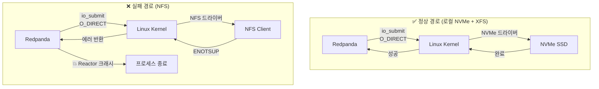
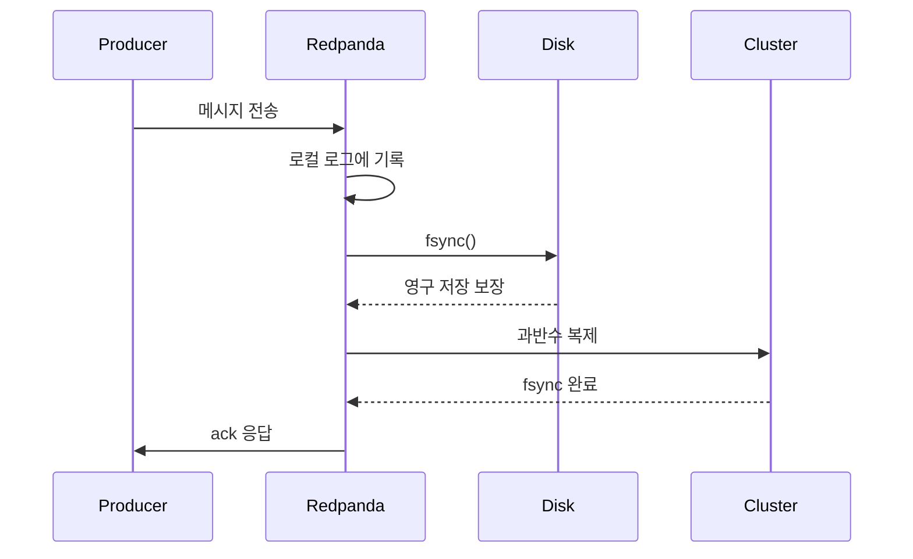
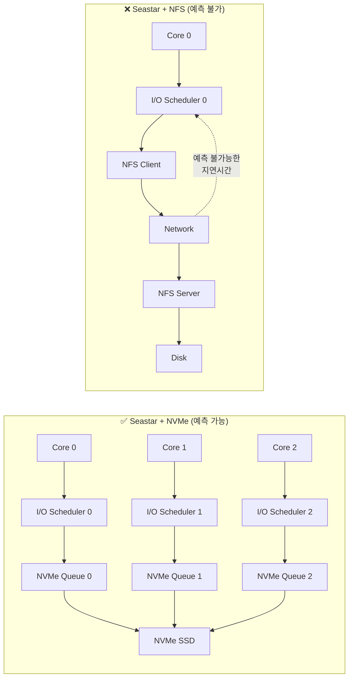
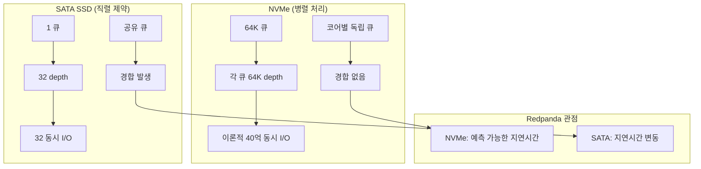
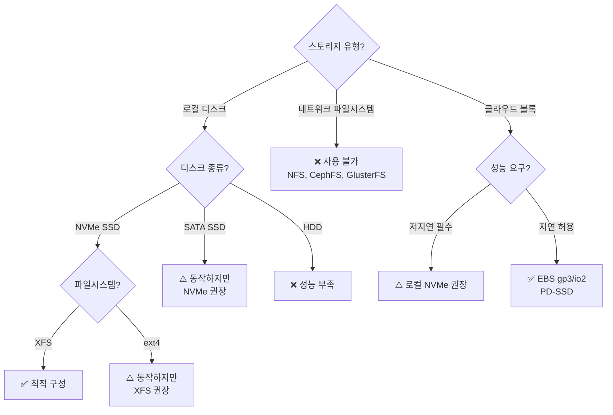
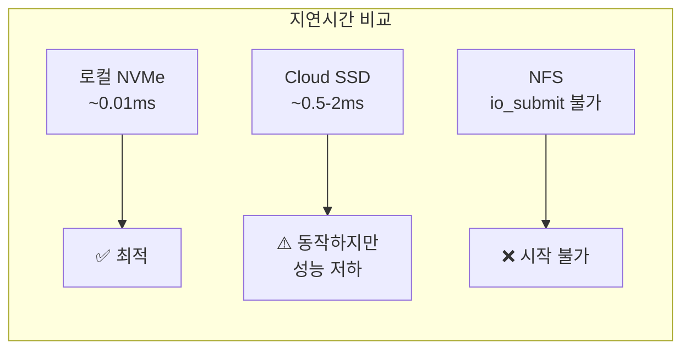
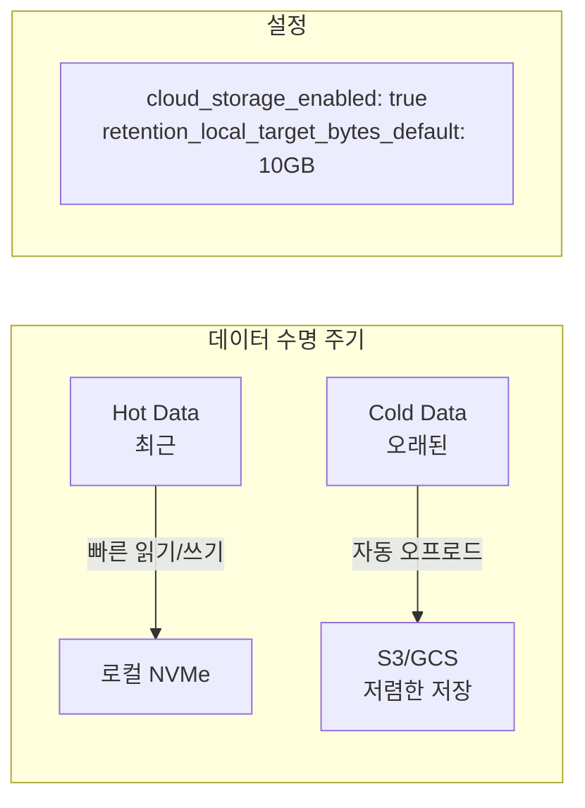
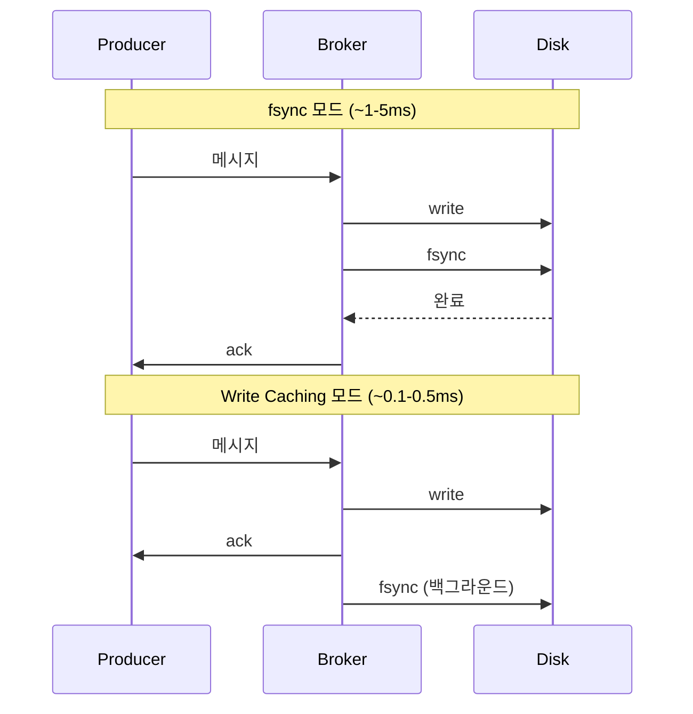

# 15. 스토리지 요구사항 및 NFS 비호환성

Redpanda의 디스크 요구사항, NFS를 사용할 수 없는 기술적 이유, 권장 스토리지 구성

---

## 결론 먼저: NFS는 사용할 수 없다

Redpanda에서 NFS는 **공식적으로 지원되지 않으며, 사용하면 브로커가 시작조차 되지 않습니다.** 단순히 "성능이 나쁜" 수준이 아니라, Seastar 프레임워크의 I/O 시스템콜(`io_submit`)이 NFS에서 동작하지 않아 프로세스가 크래시합니다.

```
❌ NFS (Network File System)
❌ 9p, CephFS, CIFS, OCFS2 (모든 네트워크 파일시스템)
❌ FUSE (Filesystem in Userspace)

✅ 로컬 NVMe SSD + XFS (권장)
✅ 로컬 NVMe SSD + ext4 (지원)
✅ 로컬 SSD + XFS/ext4 (최소 요구)
```

---

## NFS가 안 되는 기술적 이유

### 1. Linux AIO (io_submit)와 네트워크 파일시스템의 비호환

Redpanda는 Seastar 프레임워크 위에 구축되어 있으며, Seastar는 Linux의 비동기 I/O(AIO) 인터페이스인 `io_submit` 시스템콜을 사용합니다. `io_submit`은 `O_DIRECT` 플래그로 열린 파일에 대해 커널을 거치지 않고 직접 디스크에 비동기 읽기/쓰기를 수행합니다.

문제는 NFS를 포함한 네트워크 파일시스템은 `io_submit`의 nowait AIO를 지원하지 않는다는 것입니다. Linux 커널 소스 코드(v6.3 기준)를 확인하면, NFS, 9p, CephFS, CIFS, OCFS2, FUSE 모두 비동기 Direct I/O를 구현하지 않았습니다. 이로 인해 `io_submit` 호출 시 `ENOTSUP`(Operation not supported) 에러가 발생합니다.



### 2. 실제 발생하는 에러 (GitHub Issue #8504)

NFS StorageClass를 사용하는 Kubernetes 환경에서 Redpanda를 배포하면 다음 에러가 순차적으로 발생합니다.

```
WARN  - Path: '/var/lib/redpanda/data' is not on XFS.
        This is a non-supported setup. Expect poor performance.

ERROR - io_submit: Operation not supported

FATAL - exception running reactor main loop on shard 0
```

**1단계**: 파일시스템이 XFS가 아님을 감지하고 경고합니다. 이 시점에서는 아직 시작을 시도합니다.

**2단계**: Seastar가 실제 I/O를 수행하려고 `io_submit`을 호출하면 NFS 드라이버가 `ENOTSUP`를 반환합니다.

**3단계**: Reactor의 메인 루프가 예외를 처리하지 못하고 프로세스가 종료됩니다.

이 이슈는 Raspberry Pi 3노드 클러스터(K8s v1.25.0, NFS subdir provisioner)에서 보고되었으며, Redpanda 팀은 NFS가 테스트되지 않았고 지원되지 않는 구성임을 확인했습니다.

### 3. fsync 의존성

Redpanda는 데이터 안전성을 위해 **모든 메시지를 디스크에 fsync한 후에야 클라이언트에게 확인(ack)을 보냅니다** (`acks=all` 설정 시). 이는 Kafka와 다른 중요한 설계 결정입니다.



NFS를 통한 fsync는 네트워크 왕복 시간(RTT)이 추가되므로, 매 메시지마다 수 밀리초의 지연이 발생합니다. Redpanda가 목표로 하는 서브밀리초 지연시간과 근본적으로 양립할 수 없습니다.

**Redpanda 팀의 입장**: "단일 노드에서 동기화되지 않은 데이터가 유실되면 전체 클러스터의 데이터 유실로 이어질 수 있습니다." fsync의 신뢰성과 속도가 모두 보장되어야 하므로 로컬 디스크가 필수입니다.

### 4. Seastar의 Thread-per-Core와 Direct I/O

Seastar 프레임워크는 thread-per-core 모델을 사용하며, 각 코어가 자체 I/O 스케줄러를 가집니다. 이 스케줄러는 디스크의 I/O 대역폭을 정확하게 파악하고 요청을 최적으로 분배합니다.



Direct I/O(`O_DIRECT`)는 OS 페이지 캐시를 우회하여 Redpanda가 자체 캐싱을 제어합니다. NFS는 O_DIRECT를 지원하더라도 실제로는 NFS 클라이언트 캐시를 거치므로, Redpanda의 I/O 스케줄러가 정확한 디스크 상태를 파악할 수 없습니다.

---

## 지원되는 스토리지 구성

### 프로덕션 권장 사양

| 항목 | 요구사항 |
|------|----------|
| **디스크 유형** | 로컬 NVMe SSD (필수) |
| **파일시스템** | XFS (권장) 또는 ext4 |
| **IOPS** | 최소 16,000 IOPS |
| **다중 디스크** | RAID-0 (스트라이프) 구성 |
| **마운트 경로** | `/var/lib/redpanda/data` |

### 왜 NVMe인가

NVMe(Non-Volatile Memory Express)는 PCIe 버스를 통해 직접 CPU와 통신합니다. SATA SSD가 단일 큐(32 depth)를 사용하는 반면, NVMe는 최대 65,535개 큐를 가질 수 있어 Seastar의 thread-per-core 모델과 완벽하게 맞습니다. 각 코어가 자체 NVMe 큐를 사용하여 I/O 경합 없이 병렬 처리합니다.



### 왜 XFS인가

XFS는 대용량 파일의 순차적 쓰기에 최적화된 파일시스템입니다. Redpanda의 로그 세그먼트는 순차적으로 기록되므로 XFS의 장점을 최대한 활용합니다. ext4도 지원되지만, XFS가 Redpanda 워크로드에서 더 나은 성능을 보입니다.

**참고**: 로그 스토리지 아키텍처에 대한 자세한 내용은 [06-log-storage.md](./12-log-storage.md)를 참조하세요.

---

## 스토리지 선택 가이드



---

## Kubernetes 환경 스토리지 구성

### 권장: Local PersistentVolume

```yaml
# StorageClass (Local Volume)
apiVersion: storage.k8s.io/v1
kind: StorageClass
metadata:
  name: local-nvme
provisioner: kubernetes.io/no-provisioner
volumeBindingMode: WaitForFirstConsumer
reclaimPolicy: Delete

---
# PersistentVolume
apiVersion: v1
kind: PersistentVolume
metadata:
  name: redpanda-pv-0
spec:
  capacity:
    storage: 500Gi
  accessModes:
    - ReadWriteOnce
  storageClassName: local-nvme
  local:
    path: /mnt/nvme0
  nodeAffinity:
    required:
      nodeSelectorTerms:
        - matchExpressions:
            - key: kubernetes.io/hostname
              operator: In
              values:
                - worker-node-1
```

### 비권장하지만 사용 가능: Cloud Block Storage

AWS EBS(gp3/io2), GCP Persistent Disk(pd-ssd), Azure Ultra Disk도 동작하지만, 네트워크를 통한 블록 스토리지이므로 tail latency가 로컬 NVMe보다 높습니다.

```yaml
# AWS EBS gp3 StorageClass
apiVersion: storage.k8s.io/v1
kind: StorageClass
metadata:
  name: ebs-gp3
provisioner: ebs.csi.aws.com
parameters:
  type: gp3
  iops: "16000"
  throughput: "1000"
  fsType: xfs
volumeBindingMode: WaitForFirstConsumer
```

**중요**: EBS/PD는 블록 디바이스이므로 NFS와 달리 `io_submit`이 정상 동작합니다. 네트워크를 통하지만 로컬 블록 디바이스처럼 보이므로 Redpanda가 시작되고 동작합니다. 다만 로컬 NVMe 대비 지연시간이 높습니다.



### 절대 사용 불가

| 스토리지 | 이유 |
|----------|------|
| **NFS** | `io_submit` 미지원, 프로세스 크래시 |
| **CephFS** | 네트워크 파일시스템, `io_submit` 미지원 |
| **GlusterFS** | FUSE 기반, Direct I/O 미지원 |
| **CIFS/SMB** | 네트워크 파일시스템, `io_submit` 미지원 |
| **FUSE 기반** | 커널 AIO 미지원 |

---

## Tiered Storage로 스토리지 비용 최적화

로컬 NVMe가 비싸다면, Tiered Storage를 활용하여 오래된 데이터를 S3/GCS로 오프로드할 수 있습니다. 이렇게 하면 고가의 NVMe 용량을 줄이면서도 데이터를 장기 보존할 수 있습니다.



```yaml
# Tiered Storage 설정
cloud_storage_enabled: true
cloud_storage_bucket: my-redpanda-tiered
retention_local_target_bytes_default: 10737418240  # 로컬 10GB 유지
```

이 방식이면 NVMe 100GB + S3 무제한으로 운영할 수 있어, 모든 데이터를 NVMe에 보관하는 것보다 비용 효율적입니다.

**참고**: Tiered Storage 설계와 구현에 대한 자세한 내용은 [07-tiered-storage.md](./14-tiered-storage.md)를 참조하세요.

---

## 스토리지 성능 튜닝

### rpk autotuner

프로덕션 배포 시 `rpk`의 autotuner를 실행하면 하드웨어를 자동으로 감지하고 Linux 커널 파라미터를 최적화합니다.

```bash
# 프로덕션 모드 설정 + 자동 튜닝
sudo rpk redpanda mode production
sudo rpk redpanda tune all
```

이 명령어는 다음을 자동으로 수행합니다:
- I/O 스케줄러를 `none`(NVMe용) 또는 `noop`으로 변경
- AIO 최대 이벤트 수 증가 (`/proc/sys/fs/aio-max-nr`)
- THP(Transparent Huge Pages) 비활성화
- CPU 주파수 거버너를 `performance`로 설정
- 네트워크 IRQ 어피니티 최적화

### RAID-0 구성 (다중 디스크)

여러 NVMe가 있다면 RAID-0으로 묶어 성능을 극대화합니다. 데이터 복제는 Raft 합의 프로토콜이 브로커 레벨에서 처리하므로, 디스크 레벨의 미러링(RAID-1)은 불필요합니다.

```bash
# 2개 NVMe를 RAID-0으로 묶기
sudo mdadm --create /dev/md0 --level=0 --raid-devices=2 /dev/nvme0n1 /dev/nvme1n1

# XFS로 포맷
sudo mkfs.xfs /dev/md0

# 마운트
sudo mount /dev/md0 /var/lib/redpanda/data
```

### Write Caching (지연시간 최적화)

매 메시지마다 fsync를 하면 안전하지만 지연시간이 증가합니다. 약간의 데이터 유실 위험을 감수할 수 있다면 write caching을 활성화하여 지연시간을 줄일 수 있습니다.

```yaml
# redpanda.yaml 또는 Helm values
redpanda:
  write_caching_default: "true"
```

Write caching 활성화 시 과반수 브로커가 메시지를 수신하면 fsync 전에 ack을 보냅니다. 전원 장애 시 마지막 몇 메시지가 유실될 수 있지만, 지연시간이 크게 감소합니다.



---

## 프로덕션 체크리스트

Kubernetes 환경에서 Redpanda 스토리지를 설정할 때 다음을 확인하세요:

```yaml
# 권장 스토리지 설정 예시
storage:
  persistentVolume:
    enabled: true
    size: 100Gi
    storageClass: local-nvme  # ⚠️ NFS StorageClass 절대 사용 금지
  tieredConfig:
    cloud_storage_enabled: true  # 비용 최적화
    cloud_storage_bucket: redpanda-tiered-storage
    retention_local_target_bytes_default: 10737418240  # 10GB
```

**필수 확인 사항**:
- [ ] StorageClass가 로컬 볼륨 또는 클라우드 블록 스토리지인지 확인
- [ ] NFS, CephFS, GlusterFS 등 네트워크 파일시스템 사용 안 함
- [ ] XFS 파일시스템 사용 (ext4는 차선책)
- [ ] 최소 16,000 IOPS 보장
- [ ] Tiered Storage 설정으로 비용 최적화 고려
- [ ] 프로덕션 모드에서 `rpk redpanda tune all` 실행

만약 기존 K8s 환경에서 NFS provisioner만 있다면, Redpanda 전용 로컬 PV를 별도로 구성해야 합니다. 대안으로 AWS EBS gp3나 GCP pd-ssd 같은 클라우드 블록 스토리지를 사용할 수 있습니다.

---

## 요약

| 질문 | 답변 |
|------|------|
| NFS 사용 가능? | **불가능** (프로세스 크래시) |
| 왜 안 되는가? | Seastar의 `io_submit`(Linux AIO)이 NFS에서 `ENOTSUP` 반환 |
| CephFS, GlusterFS는? | 동일하게 불가능 (네트워크/FUSE 파일시스템) |
| EBS/PD(클라우드 블록)는? | 동작하지만 로컬 NVMe 대비 성능 저하 |
| 최적 구성은? | 로컬 NVMe + XFS + RAID-0 |
| 비용이 문제라면? | Tiered Storage로 S3/GCS 오프로드 |

---

## 참고

- [Redpanda 프로덕션 요구사항](https://docs.redpanda.com/current/deploy/redpanda/manual/production/requirements/)
- [Kubernetes 클러스터 요구사항](https://docs.redpanda.com/current/deploy/redpanda/kubernetes/k-requirements/)
- [GitHub Issue #8504 - NFS 크래시](https://github.com/redpanda-data/redpanda/issues/8504)
- [Seastar NFS 이슈 #1947](https://github.com/scylladb/seastar/issues/1947)
- [Redpanda fsync 설계 철학](https://www.redpanda.com/blog/why-fsync-is-needed-for-data-safety-in-kafka-or-non-byzantine-protocols)
- [Redpanda 사이징 가이드라인](https://docs.redpanda.com/current/deploy/redpanda/manual/sizing/)
- [06-log-storage.md](./12-log-storage.md) - 로그 스토리지 아키텍처
- [07-tiered-storage.md](./14-tiered-storage.md) - Tiered Storage 설계
