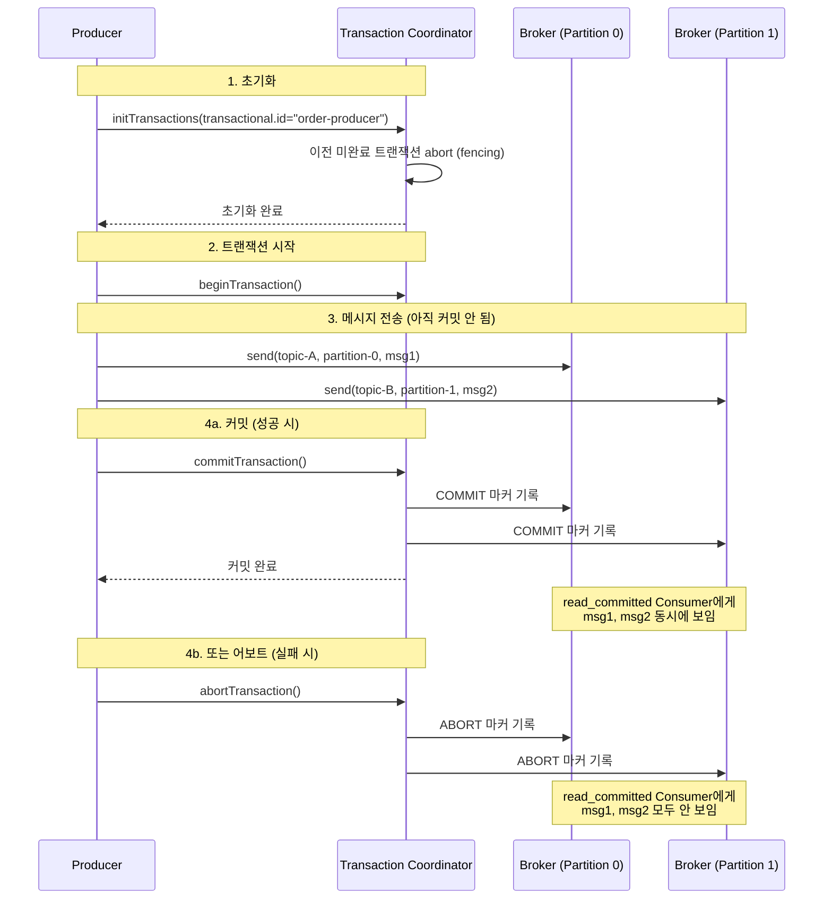
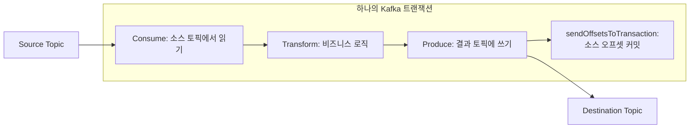
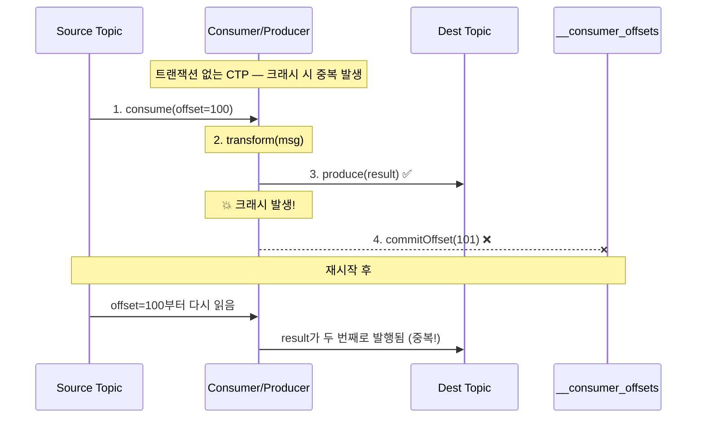
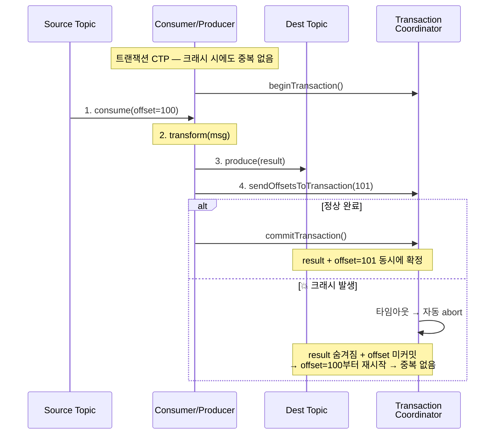
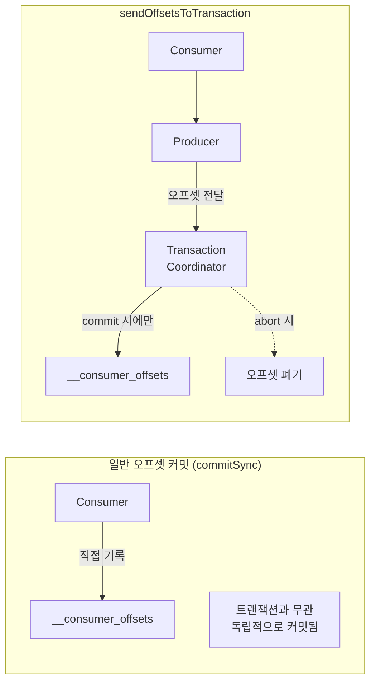
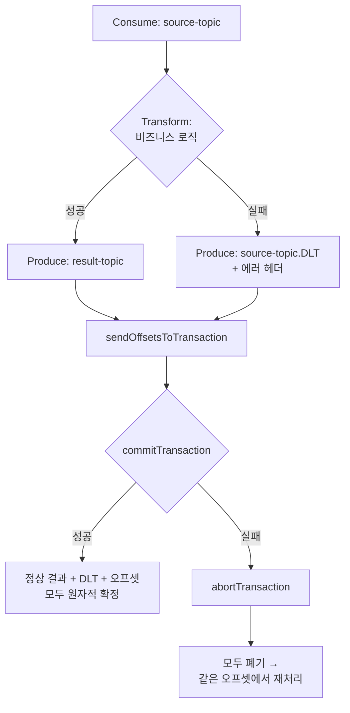
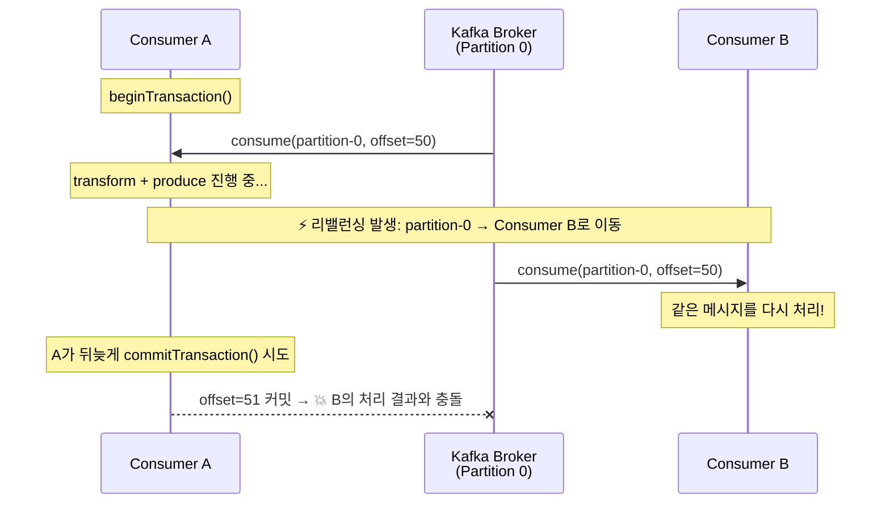
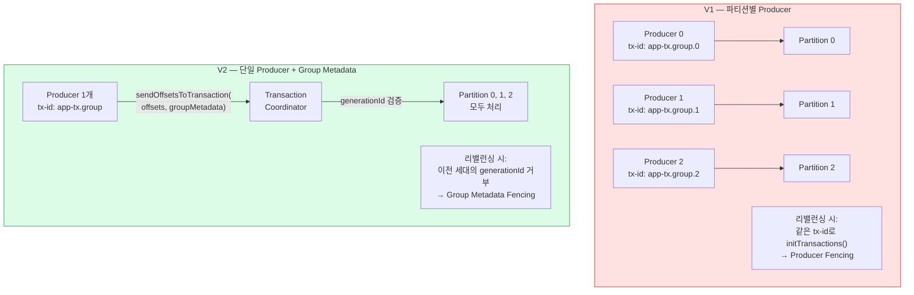
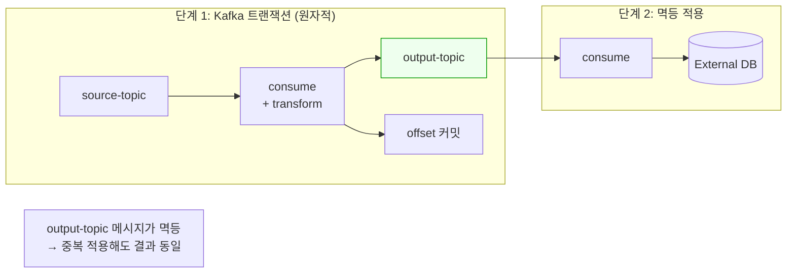
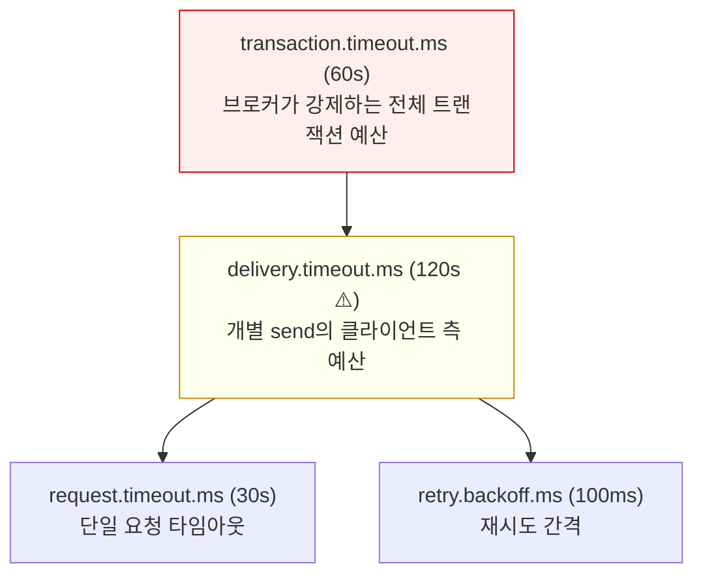

# 16. Kafka 트랜잭션과 Redpanda

Kafka Transactional API의 동작 원리, Redpanda의 호환성과 성능 특성, commit/abort 시맨틱스를 다룬다.

> **Spring Boot 연동 코드**는 [03-spring-boot-integration/08-transaction-patterns.md](../03-spring-boot-integration/08-transaction-patterns.md) 참조
> **SAGA에서의 트랜잭션 활용**은 [03-saga-choreography.md](../03-spring-boot-integration/03-saga-choreography.md), [04-saga-orchestration.md](../03-spring-boot-integration/04-saga-orchestration.md) 참조

---

## 1. 왜 Kafka 트랜잭션이 필요한가

### 메시지 전달 보장 수준

Kafka/Redpanda에서 메시지 전달은 세 가지 수준으로 나뉜다. 각 수준은 "유실과 중복 사이의 트레이드오프"를 어디에 놓느냐에 따라 결정된다.

| 보장 수준 | 의미 | 위험 | 설정 |
|-----------|------|------|------|
| **At-most-once** | 메시지가 유실될 수 있음 | 데이터 손실 | `acks=0` |
| **At-least-once** | 메시지가 중복될 수 있음 | 중복 처리 | `acks=all` + 재시도 |
| **Exactly-once** | 메시지가 정확히 한 번 처리됨 | 없음 (이상적) | 트랜잭션 + 멱등성 |

At-least-once가 기본 설정이지만, 여기에는 함정이 있다. Producer가 메시지를 보내고 브로커가 저장까지 완료했는데, ACK 응답이 네트워크에서 유실되는 경우를 생각해 보자. Producer는 "실패했다"고 판단해 같은 메시지를 재전송하고, 브로커에는 동일한 메시지가 두 번 기록된다. 바로 이 중복 문제가 멱등성과 트랜잭션이 필요한 출발점이다.

### 멱등성(Idempotence)으로 중복 방지

`enable.idempotence=true`를 설정하면 Producer에 PID(Producer ID)가 부여되고, 각 메시지에 시퀀스 번호가 붙는다. 브로커는 `(PID, 시퀀스 번호)` 조합을 추적하므로, 이미 받은 메시지가 다시 도착하면 저장하지 않고 무시한다. ACK 유실로 인한 재전송 문제가 깔끔하게 해결되는 셈이다.

그러나 멱등성에는 한계가 있다. 이 메커니즘은 단일 파티션 내에서만 작동하기 때문에, 여러 토픽이나 파티션에 걸친 원자성까지는 보장하지 못한다. 예를 들어 주문 이벤트를 `orders`, `analytics`, `notification` 세 토픽에 동시에 발행해야 하는 상황에서, 멱등성만으로는 "세 토픽 모두 성공하거나 모두 실패"를 보장할 방법이 없다.

### 트랜잭션: 여러 파티션에 걸친 원자성

Kafka 트랜잭션은 멱등성 위에 구축되어 여러 토픽/파티션의 쓰기를 하나의 원자적 단위로 묶는다. 아래 예시를 보면 차이가 분명해진다.

```
"주문 생성" 이벤트를 3개 토픽에 발행하는 경우:

트랜잭션 없이:
  send(orders) → 성공 ✅
  send(analytics) → 성공 ✅
  send(notification) → 실패 ❌
  → 주문과 분석에는 이벤트가 있지만 알림은 없음 (불일치)

트랜잭션으로:
  beginTransaction()
  send(orders)
  send(analytics)
  send(notification) → 실패
  abortTransaction()
  → 세 토픽 모두 메시지가 없음 (일관성 유지)
```

트랜잭션 없이는 세 토픽 중 일부만 성공하는 "부분 쓰기" 상태가 발생할 수 있다. 트랜잭션을 사용하면 전부 커밋되거나 전부 abort되므로, 다운스트림 서비스가 불일치한 데이터를 보게 되는 상황을 원천적으로 방지할 수 있다.

---

## 2. 트랜잭션 동작 원리

### Transaction Coordinator

브로커 내부의 Transaction Coordinator가 트랜잭션의 전체 생명주기를 관리한다. Producer는 먼저 Coordinator에 자신을 등록하고, 이후 메시지를 보내고, 마지막에 커밋 또는 abort를 요청하는 흐름으로 동작한다.



위 다이어그램에서 주목할 점은 3단계다. 메시지는 브로커에 물리적으로 기록되지만, COMMIT 마커가 붙기 전까지는 `read_committed` Consumer에게 노출되지 않는다. 커밋과 abort의 차이는 "마커를 무엇으로 찍느냐"일 뿐이며, 메시지 자체는 어느 쪽이든 브로커에 남아 있다.

### 트랜잭션 상태 전이

```
Empty → Ongoing → PrepareCommit → CompleteCommit → Empty
                → PrepareAbort  → CompleteAbort  → Empty
```

트랜잭션 상태는 내부 토픽 `__transaction_state`에 저장되며, Raft(Redpanda) 또는 ZooKeeper(Kafka)를 통해 복제된다. 브로커가 장애로 내려가도 이 상태 로그가 남아 있으므로, 새 Coordinator가 이어받아 미완료 트랜잭션을 abort 처리할 수 있다.

### transactional.id와 Producer Fencing

`transactional.id`는 Producer를 논리적으로 식별하는 문자열이다. 같은 ID로 새 Producer가 `initTransactions()`를 호출하면, Coordinator는 이전 미완료 트랜잭션을 abort하고 이전 Producer의 전송 권한을 박탈한다. 이것이 fencing이다.

```
Producer A (transactional.id="order-tx") → beginTransaction() → send(msg1)
→ Producer A 크래시

Producer B (transactional.id="order-tx") → initTransactions()
→ Transaction Coordinator: Producer A의 미완료 트랜잭션 abort
→ Producer A가 살아나도 "ProducerFencedException" 발생 → 전송 불가
→ Producer B만 유효
```

왜 이런 메커니즘이 필요할까? Producer A가 크래시 후 네트워크 파티션 때문에 뒤늦게 살아나는 상황을 떠올려 보자. 이때 Producer B가 이미 같은 역할을 이어받았는데, A까지 메시지를 보내면 동일한 논리적 Producer가 두 개 존재하는 "좀비 Producer" 문제가 발생한다. Fencing은 이런 상황을 원천 차단하는 안전장치인 셈이다.

### Epoch: 좀비 방어의 핵심

Producer Fencing의 구현 메커니즘은 Epoch(에포크) 번호에 있다. 새 Producer가 `initTransactions()`를 호출할 때마다 Coordinator는 해당 `transactional.id`의 Epoch를 1 증가시킨다(예: 3→4). 이전 Producer(epoch 3)가 뒤늦게 메시지를 보내면, 브로커는 현재 epoch(4)보다 낮은 값을 감지하고 `ProducerFencedException`을 발생시킨다.

이 설계가 우아한 이유는 단순한 정수 비교만으로 좀비 Producer를 즉시 걸러낸다는 점이다. 분산 락이나 하트비트 같은 복잡한 메커니즘 없이도, epoch 번호 하나로 "동시에 두 Producer가 쓰는 일"을 방지한다.

### KIP-890: Epoch 기반 경합 조건 수정

Epoch 메커니즘에도 허점이 있었다. 지연된 네트워크 패킷이 새 트랜잭션을 잘못 커밋하는 경합 조건이 KIP-890에서 발견되어 수정되었다.

```
T1 시작 (epoch=3) → send(msg1) → commitTransaction() 요청 전송
                                   ↓ 네트워크 지연으로 패킷이 늦게 도착
T1 타임아웃 → 자동 abort
T2 시작 (epoch=4) → send(msg2)
                                   ↓ 지연된 T1의 commit 패킷이 뒤늦게 도착
                                   → 브로커가 T2까지 함께 커밋! (의도하지 않은 동작)
```

문제의 핵심은 지연된 commit 요청이 도착했을 때 브로커가 epoch를 검증하지 않았다는 점이다. KIP-890은 commit/abort 요청에도 epoch 검증을 추가하여, 낮은 epoch의 지연 패킷이 현재 트랜잭션에 영향을 줄 수 없도록 수정했다. Kafka 3.x 이후 버전과 Redpanda에서는 이 문제가 해결된 상태다.

---

## 3. Commit vs Abort: 메시지 가시성

### Consumer의 isolation.level

트랜잭션이 commit되었는지 abort되었는지에 따라 Consumer가 메시지를 볼 수 있는지가 결정되며, 이를 제어하는 것이 Consumer의 `isolation.level` 설정이다.

| isolation.level | 커밋된 메시지 | abort된 메시지 | 비트랜잭션 메시지 |
|----------------|-------------|--------------|-----------------|
| `read_uncommitted` (기본) | 보임 | **보임** | 보임 |
| `read_committed` | 보임 | **안 보임** | 보임 |

주의할 점은 기본값이 `read_uncommitted`라는 사실이다. 트랜잭션을 도입했는데 Consumer 쪽에서 `read_committed`를 설정하지 않으면, abort된 메시지도 그대로 소비하게 되어 트랜잭션을 쓰는 의미가 사라진다. Producer 쪽 설정만으로는 절반밖에 완성되지 않는다.

### 가시성 시나리오

구체적으로 어떤 상황에서 메시지가 보이고 안 보이는지 세 가지 시나리오로 확인해 보자.

```
Producer: beginTransaction()
  send(partition-0, msg1, offset=100)
  send(partition-0, msg2, offset=101)
  send(partition-0, msg3, offset=102)

시나리오 A: commitTransaction()
  read_uncommitted Consumer: msg1, msg2, msg3 모두 보임
  read_committed Consumer:   msg1, msg2, msg3 모두 보임 ✅

시나리오 B: abortTransaction()
  read_uncommitted Consumer: msg1, msg2, msg3 모두 보임 (abort 무시!)
  read_committed Consumer:   아무것도 안 보임 ✅

시나리오 C: 트랜잭션 진행 중 (아직 commit/abort 안 함)
  read_uncommitted Consumer: msg1, msg2, msg3 모두 보임
  read_committed Consumer:   대기 (commit 또는 abort까지 블로킹)
```

시나리오 C가 실무에서 특히 주의해야 할 경우다. `read_committed` Consumer는 트랜잭션이 완료될 때까지 해당 오프셋 범위의 메시지를 버퍼링하며 대기하므로, 오래 걸리는 트랜잭션은 Consumer 지연의 직접적인 원인이 된다.

### Last Stable Offset (LSO)

브로커는 `read_committed` Consumer가 안전하게 읽을 수 있는 위치를 Last Stable Offset(LSO)이라는 개념으로 관리한다.

```
오프셋:    55   56   57   58   59   60   61   62   63   64   65   66
상태:     C    C    A    C    C    C    C    C    C    P    C    C
                                                      ↑
                                                     LSO
                    (C=Committed, A=Aborted, P=Pending)
```

LSO는 첫 번째 미결(Pending) 트랜잭션의 시작 오프셋이다. 위 예시에서 오프셋 63에 아직 commit도 abort도 되지 않은 레코드가 있으므로 LSO는 63에 머문다. 브로커는 LSO 이전의 레코드만 `read_committed` Consumer에게 반환하면서, abort된 트랜잭션 목록(메타데이터)도 함께 전송한다. Consumer 클라이언트가 이 메타데이터를 사용해 abort된 레코드를 자동으로 필터링하는 구조다. abort는 정상 운영에서 드문 경우이므로 이 필터링의 오버헤드는 무시할 수 있는 수준이다.

LSO 개념이 실무에서 중요한 이유가 하나 있다. 긴 트랜잭션이 commit도 abort도 되지 않은 채 방치되면 LSO가 진행하지 못하고, 그 뒤에 이미 commit된 레코드까지 `read_committed` Consumer가 읽지 못하는 상황이 벌어진다. 이것이 `transaction.timeout.ms`를 적절히 설정해야 하는 근본적인 이유다. 타임아웃이 너무 길면 방치된 트랜잭션이 전체 파이프라인을 막을 수 있고, 너무 짧으면 정상적인 트랜잭션이 중간에 abort될 위험이 생긴다.

### read_committed의 운영 주의사항

`read_committed` 모드에서는 두 가지 운영상 주의할 점이 있다.

**오프셋 불연속**: abort된 트랜잭션의 레코드를 건너뛰기 때문에 Consumer가 받는 오프셋이 연속적이지 않다. 예를 들어 오프셋 10, 11이 abort된 트랜잭션에 속하면, Consumer는 9 다음에 12를 받게 된다. 오프셋 연속성에 의존하는 로직(예: "빠진 오프셋이 있으면 에러")이 있다면 `read_committed` 환경에서는 오작동할 수 있으므로 주의가 필요하다.

**미커밋 메시지의 Consumer Lag**: 파티션의 마지막 레코드가 미커밋 트랜잭션에 속하면, LSO가 해당 오프셋에서 멈추어 `read_committed` Consumer는 더 이상 진행할 수 없다. 이때 모니터링 도구에는 Consumer Lag이 1로 표시되지만 실제로는 해당 메시지에 접근 자체가 불가능한 상태다. 이 Lag은 트랜잭션이 commit되거나 abort될 때까지(또는 `transaction.timeout.ms`에 의해 자동 abort될 때까지) 해소되지 않는다.

### 부분 실패 시 동작

트랜잭션 도중 일부 메시지만 전송에 성공하고 나머지가 실패하면 어떻게 될까? 아래 예시가 이 질문에 답한다.

```
beginTransaction()
  send(topic-A, msg1)  → 브로커에 기록됨
  send(topic-B, msg2)  → 브로커에 기록됨
  send(topic-C, msg3)  → 전송 중 예외 발생!

→ abortTransaction() 호출
→ topic-A의 msg1: ABORT 마커 → read_committed Consumer에게 안 보임
→ topic-B의 msg2: ABORT 마커 → read_committed Consumer에게 안 보임
→ topic-C의 msg3: 전송 자체가 안 됨

결과: 세 토픽 모두 마치 아무 일도 없었던 것처럼 됨 (원자성 보장)
```

msg1과 msg2는 브로커에 물리적으로 기록되었지만 ABORT 마커가 붙었으므로 `read_committed` Consumer에게는 보이지 않는다. msg3은 전송 자체가 실패했으니 브로커에 존재하지 않는다. 결과적으로 세 토픽 모두 "아무 일도 없었던 상태"가 되어 원자성이 보장된다.

---

## 4. Consume-Transform-Produce (CTP) 패턴

### 패턴 개요

CTP는 "소스 토픽에서 읽고, 비즈니스 로직으로 변환하고, 결과 토픽에 쓰고, 소스 오프셋을 커밋하는" 네 단계를 하나의 트랜잭션 안에서 원자적으로 처리하는 패턴이다. Kafka Streams의 Exactly-Once가 내부적으로 사용하는 메커니즘이기도 하다.



### 왜 CTP가 중요한가

CTP가 해결하는 문제를 이해하려면, 트랜잭션 없이 consume-produce를 수행할 때 무슨 일이 벌어지는지 살펴봐야 한다.



produce와 offset 커밋이 별개의 작업이라서 둘 사이에 실패 간극이 존재하는 것이 핵심 문제다. 트랜잭션으로 이 두 작업을 하나로 묶으면 간극이 사라진다.



### sendOffsetsToTransaction()의 동작 원리

CTP의 핵심은 `sendOffsetsToTransaction()`이다. 이 메서드가 하는 일을 정확히 이해하지 않으면 CTP 전체가 모호해진다.

일반적인 Consumer는 `commitSync()` 또는 `commitAsync()`로 오프셋을 커밋하는데, 이 커밋은 `__consumer_offsets` 토픽에 직접 기록된다. 문제는 이 기록이 Producer 트랜잭션과 독립적이라는 점이다. 트랜잭션이 abort되어도 오프셋 커밋은 이미 완료된 상태일 수 있고, 반대로 오프셋 커밋만 실패할 수도 있다.

`sendOffsetsToTransaction()`은 오프셋 커밋을 일반 Consumer 경로가 아닌 **Transaction Coordinator 경로**로 전달한다. Coordinator는 이 오프셋을 트랜잭션의 일부로 기록하고, 커밋 시에만 `__consumer_offsets`에 반영한다.



이 구조 덕분에 "출력 메시지 발행"과 "소스 오프셋 커밋"이 같은 트랜잭션의 원자적 단위가 된다.

메서드 시그니처를 보면 `consumerGroupId`를 받는 이유도 명확해진다.

```java
producer.sendOffsetsToTransaction(
    Map.of(new TopicPartition("source-topic", 0),
           new OffsetAndMetadata(101)),  // 다음에 읽을 오프셋
    consumer.groupMetadata()             // Consumer Group 메타데이터
);
```

Consumer Group 메타데이터가 필요한 이유는, 오프셋이 Consumer Group 단위로 관리되기 때문이다. Coordinator는 이 정보를 사용해 `__consumer_offsets` 토픽의 올바른 파티션에 오프셋을 기록한다. Kafka 2.5+에서는 `groupMetadata()`를 사용하는데, 이 안에 `groupId`뿐 아니라 `generationId`와 `memberId`가 포함되어 리밸런싱 중 좀비 Consumer의 오프셋 커밋을 Fencing할 수 있다.

### CTP 구현 코드

CTP를 직접 구현할 때의 전체 코드 흐름이다. Kafka Streams가 내부적으로 하는 일을 풀어쓴 것이라고 보면 된다.

**설정 (application.yml)**

```yaml
kafka:
  bootstrap-servers: localhost:9092
  producer:
    transactional-id: order-processor-1   # Raw API는 인스턴스별 고정 ID (Spring Boot에서는 transaction-id-prefix 사용)
    acks: all
    properties:
      enable.idempotence: true            # transactional.id 설정 시 자동 적용되지만 명시적으로 선언
  consumer:
    group-id: order-processor-group
    isolation-level: read_committed
    enable-auto-commit: false             # CTP 필수: 오프셋을 sendOffsetsToTransaction()으로 직접 제어
```

**구현 코드 (Raw API)**

```java
KafkaProducer<String, String> producer = new KafkaProducer<>(producerProps);
KafkaConsumer<String, String> consumer = new KafkaConsumer<>(consumerProps);

// 초기화 (앱 시작 시 1회) — 이전 미완료 트랜잭션을 abort하고 Producer를 등록
producer.initTransactions();
consumer.subscribe(List.of("raw-orders"));

while (running) {
    ConsumerRecords<String, String> records = consumer.poll(Duration.ofMillis(100));
    if (records.isEmpty()) continue;

    producer.beginTransaction();
    try {
        for (ConsumerRecord<String, String> record : records) {
            // Transform: 비즈니스 로직
            String enrichedOrder = enrichOrder(record.value());

            // Produce: 결과를 다른 토픽에 발행 (트랜잭션 안에서)
            producer.send(new ProducerRecord<>("validated-orders",
                record.key(), enrichedOrder));
        }

        // 소스 오프셋을 트랜잭션에 포함시킴
        // ※ consumer.commitSync()가 아님 — 반드시 이 메서드를 사용
        Map<TopicPartition, OffsetAndMetadata> offsets = new HashMap<>();
        for (TopicPartition partition : records.partitions()) {
            List<ConsumerRecord<String, String>> partRecords = records.records(partition);
            long lastOffset = partRecords.get(partRecords.size() - 1).offset();
            offsets.put(partition, new OffsetAndMetadata(lastOffset + 1));
        }
        producer.sendOffsetsToTransaction(offsets, consumer.groupMetadata());

        producer.commitTransaction();
    } catch (ProducerFencedException | OutOfOrderSequenceException e) {
        // 복구 불가 — 다른 Producer가 같은 transactional.id를 사용 중이거나
        // 시퀀스 번호가 깨짐. Producer를 새로 만들어야 함
        producer.close();
        break;
    } catch (KafkaException e) {
        // 복구 가능 — 네트워크 오류 등. abort 후 같은 메시지를 다시 처리
        producer.abortTransaction();
    }
}
```

주목할 부분이 세 가지 있다.

**첫째, `enable.auto.commit=false`가 필수다.** CTP에서 Consumer 오프셋 커밋은 반드시 `sendOffsetsToTransaction()`을 통해야 한다. 자동 커밋이 켜져 있으면 오프셋이 트랜잭션 밖에서 독립적으로 커밋되어, "결과 발행은 abort되었는데 오프셋은 이미 커밋됨" 상태가 발생할 수 있다. 이 상태가 되면 해당 메시지가 영원히 재처리되지 않으므로 데이터가 유실된다.

**둘째, `consumer.commitSync()`를 사용하지 않는다.** 같은 이유로, 수동 오프셋 커밋도 사용하면 안 된다. `commitSync()`는 트랜잭션에 참여하지 않는 독립적인 동작이기 때문이다.

**셋째, catch 블록에서 예외를 구분한다.** `ProducerFencedException`은 다른 Producer가 같은 `transactional.id`로 등록했다는 의미이므로 현재 Producer는 더 이상 사용할 수 없다. 반면 네트워크 오류 같은 일시적 `KafkaException`은 abort 후 다시 시도하면 된다.

### Spring Boot에서의 CTP (실무 코드)

위의 raw API는 동작 원리를 이해하기 위한 것이다. 실무에서는 Spring Kafka Container가 `beginTransaction()` → `sendOffsetsToTransaction()` → `commitTransaction()`을 자동 처리하므로, 개발자는 Transform + Produce 로직만 작성하면 된다.

```yaml
spring:
  kafka:
    bootstrap-servers: localhost:19092
    producer:
      transaction-id-prefix: ${spring.application.name}-tx-   # 애플리케이션 단위로 식별 (토픽 종속 X)
      acks: all
    consumer:
      group-id: order-enrichment
      isolation-level: read_committed
      enable-auto-commit: false
```

`transaction-id-prefix`는 토픽이 아닌 **Producer 인스턴스**를 식별하는 값이다. 하나의 트랜잭션 안에서 여러 토픽에 쓸 수 있으므로, 특정 토픽명을 prefix에 넣으면 오해를 유발한다. `${spring.application.name}-tx-`처럼 서비스 단위로 설정하는 것이 올바른 관례다.

**ContainerFactory 설정** — CTP의 핵심은 이 Factory다. `KafkaTransactionManager`를 등록하여 Container가 매 poll마다 트랜잭션을 자동 시작하도록 한다.

```java
@Configuration
public class CTPConfig {

    @Bean
    public ConcurrentKafkaListenerContainerFactory<String, Object> ctpListenerFactory(
            ConsumerFactory<String, Object> consumerFactory,
            KafkaTransactionManager<String, Object> txManager) {

        var factory = new ConcurrentKafkaListenerContainerFactory<String, Object>();
        factory.setConsumerFactory(consumerFactory);
        // Spring Kafka 3.0+: setTransactionManager() deprecated → setKafkaAwareTransactionManager()
        factory.getContainerProperties().setKafkaAwareTransactionManager(txManager);
        factory.getContainerProperties().setEosMode(EOSMode.V2);           // 좀비 Fencing (위 EOSMode 섹션 참조)
        return factory;
    }
}
```

**비즈니스 코드** — Factory가 트랜잭션을 관리하므로, 개발자는 Transform + Produce만 작성한다.

```java
@Service
@RequiredArgsConstructor
public class OrderEnrichmentCTP {

    private final KafkaTemplate<String, Object> kafkaTemplate;

    @KafkaListener(topics = "orders.raw", containerFactory = "ctpListenerFactory")
    public void process(ConsumerRecord<String, RawOrder> record) {
        // ─── 이 메서드 전체가 하나의 Kafka 트랜잭션 ───
        // Container가 자동으로: beginTransaction() → 메서드 호출 → sendOffsetsToTransaction() → commitTransaction()

        RawOrder raw = record.value();

        // Transform
        EnrichedOrder enriched = EnrichedOrder.builder()
            .orderId(raw.getOrderId())
            .totalAmount(calculateTotal(raw))
            .enrichedAt(Instant.now())
            .build();

        // Produce (같은 트랜잭션)
        kafkaTemplate.send("orders.enriched", raw.getOrderId(), enriched);

        // 메서드 종료 → 결과 메시지 + 소스 오프셋이 원자적으로 커밋
    }
}
```

raw API에서 직접 작성했던 `beginTransaction()`, `sendOffsetsToTransaction()`, `commitTransaction()`, `abortTransaction()`, `ConsumerRebalanceListener`가 모두 사라졌다. Container가 이 모든 것을 처리하므로 비즈니스 로직에만 집중할 수 있다.

> 비즈니스 예시(주문 검증 파이프라인, SAGA Orchestrator)와 ContainerFactory 설정, EOSMode.V2 등 심화 구현은 [03-spring-boot-integration/08-transaction-patterns.md 섹션 3](../03-spring-boot-integration/08-transaction-patterns.md) 참조.

### CTP에서의 에러 처리

Transform 단계에서 비즈니스 로직이 실패하면 어떻게 해야 할까? 아래 다이어그램은 실무에서 가장 많이 쓰는 "실패만 DLT로" 전략의 흐름이다.



세 가지 선택지가 있다.

| 전략 | 동작 | 장점 | 단점 |
|------|------|------|------|
| **전체 abort** | 배치의 모든 메시지를 다시 처리 | 단순함 | 1건 실패로 정상 메시지까지 재처리 |
| **실패만 DLT로** | 실패 메시지는 DLT, 나머지는 정상 처리 | 정상 메시지 영향 없음 | DLT 토픽 관리 필요 |
| **건너뛰고 로깅** | 실패 메시지를 skip | 가장 단순 | 데이터 유실 감수 |

**어떤 전략을 선택할까?**

결정 기준은 "실패한 메시지를 나중에 재처리할 수 있는가"와 "유실이 허용되는가"다.

```
Q1. 실패 메시지를 유실해도 되는가?
  → Yes: 건너뛰고 로깅 (로그 수집, 메트릭 등 best-effort 처리)
  → No: Q2로

Q2. 실패 원인이 재시도로 해결될 수 있는가? (일시적 오류)
  → Yes: 전체 abort (네트워크 타임아웃, 일시적 서비스 불능)
  → No: 실패만 DLT로 (데이터 검증 실패, 스키마 불일치 등 영구적 오류)
```

실무에서는 **실패만 DLT로** 전략이 가장 많이 쓰인다. 영구적 오류(잘못된 데이터)로 전체 배치를 abort하면 정상 메시지까지 무한 재처리에 빠지기 때문이다.

**Spring Boot 설정 방법:** 각 전략은 `ctpListenerFactory`에 `DefaultErrorHandler`를 주입하는 방식으로 구현한다. 전략별 설정 코드와 `DeadLetterPublishingRecoverer`의 동작 원리는 [06-dlq-strategy.md — CTP 패턴에서의 에러 전략](../03-spring-boot-integration/06-dlq-strategy.md) 참조.

### Consumer 리밸런싱과 CTP

CTP에서 가장 까다로운 문제가 Consumer 리밸런싱이다. 트랜잭션이 진행 중인데 리밸런싱이 발생하면, 현재 처리 중인 파티션이 다른 Consumer에게 넘어갈 수 있다.



이 문제를 방지하려면 `ConsumerRebalanceListener`를 구현해서 리밸런싱 시 진행 중인 트랜잭션을 abort해야 한다.

```java
consumer.subscribe(List.of("raw-orders"), new ConsumerRebalanceListener() {
    @Override
    public void onPartitionsRevoked(Collection<TopicPartition> partitions) {
        // 파티션을 뺏기기 전에 진행 중인 트랜잭션을 abort
        // → 결과 메시지 + 오프셋 커밋이 모두 무효화됨
        producer.abortTransaction();
    }

    @Override
    public void onPartitionsAssigned(Collection<TopicPartition> partitions) {
        // 새 파티션을 할당받으면 새 트랜잭션으로 시작
    }
});
```

abort 후 새로 할당받은 Consumer가 같은 오프셋부터 다시 처리한다. 다운스트림의 `read_committed` Consumer는 abort된 메시지를 볼 수 없으므로 최종 결과는 정확하다.

Kafka Streams는 이 리밸런싱 처리를 내부적으로 자동 수행한다. CTP를 직접 구현하는 경우에만 위 코드가 필요하다.

### EOSMode: Spring Kafka의 좀비 Fencing 자동화

위에서 `ConsumerRebalanceListener`를 직접 구현해야 했던 이유는 리밸런싱 중 좀비 Consumer가 뒤늦게 커밋하는 것을 막기 위해서였다. Spring Kafka는 이 처리를 `EOSMode`라는 설정으로 자동화한다. Container가 리밸런싱 감지, 트랜잭션 abort, 좀비 fencing을 알아서 수행하는 것이다.

**V1 (구 ALPHA, deprecated)** — 파티션마다 독립된 `transactional.id`를 할당하는 방식이다.

Container가 partition-0에는 `prefix.group.0`, partition-1에는 `prefix.group.1` 식으로 **파티션별 Producer를 별도 생성**한다. 리밸런싱으로 파티션이 다른 Consumer에게 넘어가면, 새 Consumer가 같은 `transactional.id`로 `initTransactions()`를 호출하여 이전 Producer를 fencing한다. Producer Fencing(§2에서 설명한 epoch 메커니즘)을 그대로 활용하는 셈이다.

문제는 파티션 수만큼 Producer 인스턴스가 필요하다는 점이다. 파티션이 100개면 Producer도 100개, Transaction Coordinator가 추적할 transactional.id도 100개가 된다.

**V2 (구 BETA, Kafka 2.5+)** — `consumer.groupMetadata()`를 활용하는 방식이다.

하나의 Producer가 할당된 모든 파티션을 처리한다. 좀비 감지는 Producer Fencing 대신 **Consumer Group 메타데이터 검증**으로 수행한다. `sendOffsetsToTransaction()` 호출 시 `groupId` + `generationId` + `memberId`를 함께 전달하면, Transaction Coordinator가 현재 세대(generation)와 비교하여 이전 세대의 커밋을 거부한다.



| 항목 | V1 (deprecated) | V2 (기본값) |
|------|-----------------|-------------|
| Producer 수 | 할당된 파티션 수만큼 | Consumer 스레드당 1개 |
| 좀비 감지 방식 | 같은 tx-id로 `initTransactions()` (epoch 기반) | `generationId` + `memberId` 검증 |
| Coordinator 부하 | 높음 (파티션 수에 비례) | 낮음 |
| 최소 Kafka 버전 | 0.11+ | 2.5+ |
| Spring Kafka 버전 | 2.3~2.5 | 2.6+ (3.0부터 기본값) |

V2가 가능해진 이유는 Kafka 2.5에서 `sendOffsetsToTransaction(offsets, ConsumerGroupMetadata)`가 추가되었기 때문이다. 이전에는 `sendOffsetsToTransaction(offsets, groupId)`로 groupId만 전달할 수 있어서, 리밸런싱 후 이전 세대의 Consumer를 구분할 방법이 없었다. `ConsumerGroupMetadata`에 `generationId`와 `memberId`가 포함되면서 Coordinator가 세대 비교로 좀비를 걸러낼 수 있게 되었고, 파티션별 Producer를 만들 필요가 사라졌다.

> Spring Kafka 3.0+를 사용한다면 별도 설정 없이 V2가 적용된다. Kafka 브로커 2.5 미만인 레거시 환경에서만 V1을 사용해야 한다.

### 실전 사용 사례

CTP 패턴은 "토픽 A에서 읽어서 가공한 뒤 토픽 B로 보내는" 모든 스트림 처리 시나리오에 적용할 수 있다.

> 참고: IBM Event-Driven Architecture Reference ([Consume-Transform-Produce](https://ibm-cloud-architecture.github.io/refarch-kc/implementation/consume-transform-produce/))에서 컨테이너 선적 관리 시스템의 CTP 패턴을 상세히 다루고 있다.

| 사용 사례 | 소스 | 변환 | 결과 |
|-----------|------|------|------|
| 이벤트 스트림 처리 | `raw-orders` | 검증 + 보강 | `validated-orders` |
| SAGA Orchestrator | `inventory-reserved` | 상태 전이 | `payment-commands` |
| CDC 파이프라인 | `cdc.mysql.orders` | 필드 매핑 | `analytics.orders` |
| DLQ 처리 | `orders` | 실패 분류 | `orders.DLT` |

#### 예시 1: 주문 검증 파이프라인

이커머스에서 `raw-orders` 토픽으로 들어오는 원시 주문 이벤트를 검증하고 보강한 뒤 `validated-orders`에 발행하는 시나리오다.

```
[raw-orders] → CTP Consumer
  ├── 재고 확인 (캐시 조회)
  ├── 가격 검증 (주문 시점 가격 == 현재 가격)
  ├── 사기 탐지 점수 계산
  └── 보강된 주문 이벤트에 검증 결과 + 타임스탬프 추가 → [validated-orders]
      └── 검증 실패한 주문 → [raw-orders.DLT] (수동 검토 대상)
```

```java
// Transform 로직 예시
private ProducerRecord<String, OrderEvent> transformOrder(
        ConsumerRecord<String, RawOrder> record) {

    RawOrder raw = record.value();

    // 1. 재고 확인 (로컬 캐시 — 외부 I/O 아님)
    if (!inventoryCache.hasStock(raw.getProductId(), raw.getQuantity())) {
        throw new ValidationException("재고 부족: " + raw.getProductId());
    }

    // 2. 가격 검증
    BigDecimal currentPrice = priceCache.getPrice(raw.getProductId());
    if (raw.getUnitPrice().compareTo(currentPrice) != 0) {
        throw new ValidationException("가격 불일치: 주문=" + raw.getUnitPrice()
            + ", 현재=" + currentPrice);
    }

    // 3. 보강
    OrderEvent validated = OrderEvent.builder()
        .orderId(raw.getOrderId())
        .customerId(raw.getCustomerId())
        .productId(raw.getProductId())
        .quantity(raw.getQuantity())
        .unitPrice(currentPrice)
        .totalAmount(currentPrice.multiply(BigDecimal.valueOf(raw.getQuantity())))
        .validatedAt(Instant.now())
        .fraudScore(fraudDetector.score(raw))
        .build();

    return new ProducerRecord<>("validated-orders", raw.getOrderId(), validated);
}
```

재고와 가격 조회가 로컬 캐시에서 이루어지는 점에 주목하자. CTP의 Transform 단계에서 외부 HTTP 호출이나 DB 쿼리를 하면, 그 호출의 결과는 Kafka 트랜잭션으로 롤백할 수 없다. 외부 I/O가 필요하면 결과를 미리 토픽이나 로컬 캐시에 물질화(materialize)해두고, Transform에서는 로컬 조회만 하는 것이 안전하다.

#### 예시 2: 컨테이너 이상 감지 (IBM EDA Reference)

IBM의 Reefer Container 사례에서 냉장 컨테이너의 IoT 센서 데이터를 실시간으로 분석하는 CTP 파이프라인이다.

```
[container-telemetry] → CTP Consumer
  ├── 온도/습도/진동 데이터 정규화
  ├── 이상 탐지 모델 적용 (이동 평균 대비 편차 계산)
  ├── 정상 → [container-metrics] (대시보드용)
  └── 이상 감지 → [container-anomalies] (알림 + 조치 트리거)
```

이 사례의 핵심은 하나의 소스에서 두 개의 출력 토픽으로 분기하면서도 원자성을 유지한다는 점이다. 정상 메트릭과 이상 알림이 항상 일관된 상태로 다운스트림에 도달한다. 만약 트랜잭션 없이 처리하면, 이상 감지 알림은 발행되었는데 대시보드 메트릭은 누락되는 상황이 생길 수 있다.

#### 예시 3: SAGA Orchestrator 상태 전이

주문 SAGA에서 Orchestrator가 각 단계의 응답을 받아 다음 명령을 발행하는 CTP다.

```
[saga-responses] → Orchestrator (CTP Consumer)
  ├── 현재 SAGA 상태 로드 (State Store)
  ├── 응답에 따른 상태 전이 결정
  │     ├── InventoryReserved → 다음 단계: PaymentCharge 명령 발행
  │     ├── PaymentCharged → 다음 단계: ShipmentCreate 명령 발행
  │     └── 실패 응답 → 보상 명령 발행 (InventoryRelease 등)
  └── 상태 전이 결과 → [saga-commands]
```

Orchestrator의 "응답 소비 + 상태 전이 + 다음 명령 발행"이 원자적이어야 하는 이유가 분명하다. 만약 명령은 발행되었는데 오프셋 커밋이 실패하면, 재시작 후 같은 응답을 다시 처리하여 동일한 명령이 두 번 발행된다. 결제가 두 번 청구되거나 재고가 두 번 차감되는 장애로 이어질 수 있다.

### Kafka Streams와의 관계

Kafka Streams의 `processing.guarantee=exactly_once_v2`는 CTP 패턴을 프레임워크 레벨에서 자동화한 것이다. 위에서 직접 작성한 `beginTransaction()`/`commitTransaction()`/`sendOffsetsToTransaction()` 호출을 Kafka Streams가 내부적으로 처리해준다.

| 항목 | 직접 CTP 구현 | Kafka Streams |
|------|-------------|---------------|
| 트랜잭션 관리 | 수동 (begin/commit/abort) | 자동 (`commit.interval.ms`마다) |
| 오프셋 커밋 | `sendOffsetsToTransaction()` 직접 호출 | 내부 자동 처리 |
| 리밸런싱 처리 | `ConsumerRebalanceListener` 구현 필요 | 내부 자동 처리 |
| 에러 복구 | catch 블록에서 abort + 재시도 | `StreamsUncaughtExceptionHandler`로 위임 |
| 유연성 | 높음 (커스텀 로직 자유) | DSL/Processor API 범위 내 |

단순한 스트림 처리는 Kafka Streams를 쓰는 편이 안전하다. CTP를 직접 구현해야 하는 경우는 Kafka Streams DSL로 표현하기 어려운 복잡한 상태 관리가 필요하거나, 기존 Consumer 기반 애플리케이션에 트랜잭션을 추가할 때다.

### 트랜잭션 커밋 간격 트레이드오프

CTP에서 트랜잭션을 얼마나 자주 커밋할지는 지연과 처리량 사이의 트레이드오프다.

| 전략 | 장점 | 단점 |
|------|------|------|
| **레코드 1개마다 커밋** | 최소 지연, abort 시 재처리 1건 | Coordinator 통신 오버헤드 큼 |
| **레코드 수천 개마다 커밋** | 높은 처리량 | 다운스트림 데이터 노출 지연 (LSO 진행 지연) |

Kafka Streams의 기본값은 `commit.interval.ms=100`(100ms)으로, 100ms마다 트랜잭션을 커밋한다. 실시간 대시보드처럼 지연에 민감한 경우 50ms 이하로 줄이고, 배치 분석처럼 처리량이 우선인 경우 500ms~1초까지 늘리는 것이 일반적이다.

커밋 간격이 길수록 abort 시 재처리해야 할 메시지 수가 증가한다는 점도 고려해야 한다. 1000건을 묶어 커밋하다가 999번째에서 실패하면, 998건의 정상 메시지까지 다시 처리된다. 처리량과 abort 비용의 균형점을 찾는 것이 실무에서의 튜닝 포인트다.

### 외부 시스템 연동: 두 개의 단일 트랜잭션 패턴

Kafka 트랜잭션은 Kafka 내부 리소스(토픽, 파티션, 오프셋)만 원자적으로 다룬다. 외부 DB와의 2PC(Two-Phase Commit)는 지원하지 않으므로, 외부 시스템과 연동할 때는 접근 방식을 바꿔야 한다.

실무에서 검증된 방법은 두 개의 단일 트랜잭션으로 분리하고, 출력 메시지를 멱등하게 설계하는 것이다.



output-topic의 메시지가 멱등하면, 단계 2에서 같은 메시지를 두 번 적용해도 외부 DB 상태는 동일하게 유지된다. 예를 들어 "잔액을 500원 추가"(상대적 연산)가 아니라 "잔액을 15,500원으로 설정"(절대값 설정)으로 설계하면, 중복 적용이 무해해진다.

```java
// ❌ 멱등하지 않은 메시지: 중복 적용 시 잔액이 두 배로 증가
{ "action": "ADD", "amount": 500 }

// ✅ 멱등한 메시지: 중복 적용해도 결과 동일
{ "action": "SET", "balance": 15500, "eventId": "evt-001" }
// DB 측: INSERT ... ON CONFLICT (eventId) DO NOTHING
```

이 패턴으로 2PC 없이도 최종 일관성을 달성할 수 있다. 단계 1의 Kafka 트랜잭션이 Kafka 내부 원자성을 보장하고, 단계 2의 멱등 설계가 외부 DB와의 일관성을 보장하는 구조다.

---

## 5. Redpanda의 트랜잭션 구현

### Kafka와의 호환성

Redpanda는 Kafka Transactional API를 완전 호환한다. 클라이언트 코드를 한 줄도 바꾸지 않고 Kafka에서 Redpanda로 전환해도 트랜잭션이 동일하게 동작한다.

| 기능 | Kafka | Redpanda |
|------|-------|----------|
| `initTransactions()` | O | O |
| `beginTransaction()` | O | O |
| `send()` (트랜잭션 내) | O | O |
| `sendOffsetsToTransaction()` | O | O |
| `commitTransaction()` | O | O |
| `abortTransaction()` | O | O |
| Producer Fencing | O | O |
| `read_committed` isolation | O | O |
| `__transaction_state` 토픽 | O | O (내부 Raft 복제) |

### Redpanda가 더 빠른 이유

Kafka의 Transaction Coordinator는 상태를 `__transaction_state` 토픽에 기록하고, 이 토픽의 복제는 ZooKeeper(또는 KRaft)를 경유한다. Redpanda는 ZooKeeper 없이 Raft 합의 프로토콜로 직접 복제하므로 경유 단계가 줄어든다.

```
Kafka:    Producer → Transaction Coordinator → ZooKeeper → 복제
Redpanda: Producer → Transaction Coordinator → Raft → 복제 (단계 축소, 2-10배 처리량)
```

이 차이는 트랜잭션이 빈번한 워크로드에서 두드러진다. 트랜잭션마다 Coordinator가 상태를 기록하고 복제 확인을 받아야 하는데, 경유 단계가 하나 적다는 것은 각 트랜잭션의 커밋 레이턴시가 그만큼 줄어든다는 의미이기 때문이다. Redpanda 공식 벤치마크에서 2~10배 처리량 향상을 보고하는 배경이 여기에 있다.

### Redpanda 트랜잭션 관리 명령어

운영 중 트랜잭션 상태를 확인하거나, 멈춘 트랜잭션을 강제로 정리해야 할 때 `rpk` CLI를 사용한다.

```bash
# 트랜잭션 목록 조회
rpk cluster txn list

# 특정 트랜잭션 상태 확인
rpk cluster txn describe --transactional-id order-producer

# 멈춘 트랜잭션 강제 abort (운영 시 주의)
rpk cluster txn abort --transactional-id order-producer
```

### 설정 파라미터

| 파라미터 | 기본값 | 설명 |
|---------|--------|------|
| `transaction_timeout_ms` | 60000 (1분) | 트랜잭션 최대 지속 시간. 초과 시 자동 abort |
| `max_transactions_per_coordinator` | 1000 | 코디네이터당 동시 트랜잭션 수 |
| `transactional_id_expiration_ms` | 604800000 (7일) | 미사용 transactional.id 만료 시간 |

`transaction_timeout_ms` 설정은 섹션 3에서 다룬 LSO 문제와 직결된다. 이 값이 길면 방치된 트랜잭션이 LSO를 오래 막아 `read_committed` Consumer 전체가 지연되고, 짧으면 정상 트랜잭션이 타임아웃으로 abort될 수 있다. 실무에서는 30초~2분 범위가 적절하며, 비즈니스 로직의 최대 처리 시간을 기준으로 결정하면 된다.

### 트랜잭션 초기화 실패와 동시성 제한

`max_transactions_per_coordinator`(기본 1000)는 하나의 Transaction Coordinator가 동시에 관리할 수 있는 활성 트랜잭션 수를 제한한다. 이 한도를 초과하면 새 Producer의 `initTransactions()` 호출이 거부된다. 거부된 transactional.id는 `transactional_id_expiration_ms`(기본 7일) 후 자동 만료되어야 슬롯이 회수되므로, 단기간에 많은 transactional.id를 생성하는 패턴(예: 요청마다 고유 ID)은 Coordinator를 포화시킬 수 있다. transactional.id는 애플리케이션 인스턴스 단위로 고정하고 재사용하는 것이 올바른 설계다.

트랜잭션 내부에서 메시지 전송이 실패할 때는 여러 타임아웃이 계층적으로 작용한다.



> **⚠️ 함정**: 기본값에서 `delivery.timeout.ms`(120s)가 `transaction.timeout.ms`(60s)보다 크다. 반드시 `delivery.timeout.ms < transaction.timeout.ms`로 설정해야 한다.

이 설정을 조정하지 않으면 send 재시도가 진행 중인데 브로커가 먼저 트랜잭션을 abort하여 `InvalidTxnStateException`이나 `ProducerFencedException`이 발생한다. 구체적인 Spring Boot 설정 가이드는 [03-spring-boot-integration/08-transaction-patterns.md 섹션 6](../03-spring-boot-integration/08-transaction-patterns.md)에서 다룬다.

---

## 6. 트랜잭션의 한계

### Kafka 트랜잭션이 하지 않는 것

Kafka 트랜잭션이 제공하는 것과 제공하지 않는 것을 명확히 구분하지 않으면 잘못된 기대를 갖게 된다. 아래 네 가지는 자주 오해하는 지점이다.

| 기대 | 현실 |
|------|------|
| "DB와 Kafka를 하나의 트랜잭션으로" | ❌ Kafka 트랜잭션은 Kafka 내부만 원자적. DB는 별도 |
| "msg1 결과를 보고 msg2 발행 여부 결정" | ❌ 조건부 실행은 애플리케이션 로직 |
| "여러 Consumer의 처리를 원자적으로" | ❌ 트랜잭션은 Producer 측 기능 |
| "트랜잭션 롤백으로 메시지 삭제" | ❌ abort된 메시지도 물리적으로 존재 (마커로 숨길 뿐) |

네 번째 항목은 특히 RDBMS 트랜잭션에 익숙한 개발자가 혼동하기 쉬운 부분이다. RDBMS에서 rollback하면 데이터가 실제로 사라지지만, Kafka에서 abort하면 메시지는 디스크에 그대로 남고 ABORT 마커만 추가된다. `read_committed` Consumer가 이 마커를 보고 해당 메시지를 건너뛸 뿐, 물리적 삭제는 retention 정책에 따라 나중에 일어난다.

### DB + Kafka 원자성

"DB 업데이트 + Kafka 메시지 발행"을 하나의 원자적 단위로 처리하는 것은 Kafka 트랜잭션만으로는 불가능하다. Kafka 트랜잭션은 Kafka 내부 리소스만 관리하므로, 외부 DB와의 원자성은 애플리케이션 레벨의 패턴(Transactional Outbox, Transactional Inbox, CDC 등)으로 해결해야 한다. 각 패턴의 구현 방법과 비교는 [03-spring-boot-integration/08-transaction-patterns.md 섹션 4](../03-spring-boot-integration/08-transaction-patterns.md)에서 상세하게 다룬다.

---

## 참고

- [Redpanda Transactions Documentation](https://docs.redpanda.com/current/develop/transactions/)
- [Redpanda - Fast Distributed Transactions](https://redpanda.com/blog/fast-transactions)
- [rpk cluster txn](https://docs.redpanda.com/current/reference/rpk/rpk-cluster/rpk-cluster-txn/)
- [Confluent - Transactions in Apache Kafka](https://www.confluent.io/blog/transactions-apache-kafka/)
- [IBM EDA Reference - Consume-Transform-Produce](https://ibm-cloud-architecture.github.io/refarch-kc/implementation/consume-transform-produce/) (컨테이너 선적 관리 CTP 사례)
- 관련 문서: [03-spring-boot-integration/08-transaction-patterns.md](../03-spring-boot-integration/08-transaction-patterns.md) (Spring Boot 트랜잭션 구현)
- 관련 문서: [03-kafka-comparison.md](./02-kafka-comparison.md) (Kafka vs Redpanda 비교)

---

## 학습 정리

### 핵심 개념

1. **멱등성 → 트랜잭션**: `enable.idempotence`는 단일 파티션 내에서 PID+시퀀스 번호로 중복을 걸러내고, 트랜잭션은 그 위에 구축되어 여러 파티션에 걸친 원자성을 보장한다. 트랜잭션을 쓰려면 멱등성이 전제조건이다.
2. **Commit vs Abort**: 커밋 시 모든 메시지가 Consumer에게 동시에 보이고, abort 시 모든 메시지가 ABORT 마커로 숨겨진다. 부분 결과가 노출되는 경우는 존재하지 않는다.
3. **isolation.level은 Consumer 쪽 설정**: `read_committed`를 설정하지 않으면 abort된 메시지도 소비하게 되어, Producer 쪽에서 트랜잭션을 아무리 잘 써도 의미가 없다. 기본값이 `read_uncommitted`이므로 반드시 명시적으로 변경해야 한다.
4. **CTP 패턴이 Exactly-Once의 핵심**: Consume-Transform-Produce에서 "결과 발행 + 소스 오프셋 커밋"을 하나의 트랜잭션으로 묶어야 크래시 후 재시작 시 중복 발행이 방지된다. 이 두 작업 사이의 간극이 곧 중복의 원인이기 때문이다. `sendOffsetsToTransaction()`이 오프셋을 Consumer 경로가 아닌 Transaction Coordinator 경로로 전달하여, 트랜잭션 abort 시 오프셋도 함께 폐기되는 것이 핵심 메커니즘이다.
5. **Redpanda는 Kafka Transactional API를 완전 호환**: 클라이언트 코드 변경 없이 전환 가능하며, ZooKeeper 대신 Raft로 직접 복제하므로 트랜잭션 커밋 레이턴시가 낮다.
6. **타임아웃 계층의 함정**: 기본값에서 `delivery.timeout.ms`(120s)가 `transaction.timeout.ms`(60s)보다 크므로, 느린 send 재시도 중 브로커가 먼저 트랜잭션을 abort한다. 트랜잭션 환경에서는 반드시 `delivery.timeout.ms < transaction.timeout.ms`로 설정해야 혼란스러운 실패 모드를 피할 수 있다.
