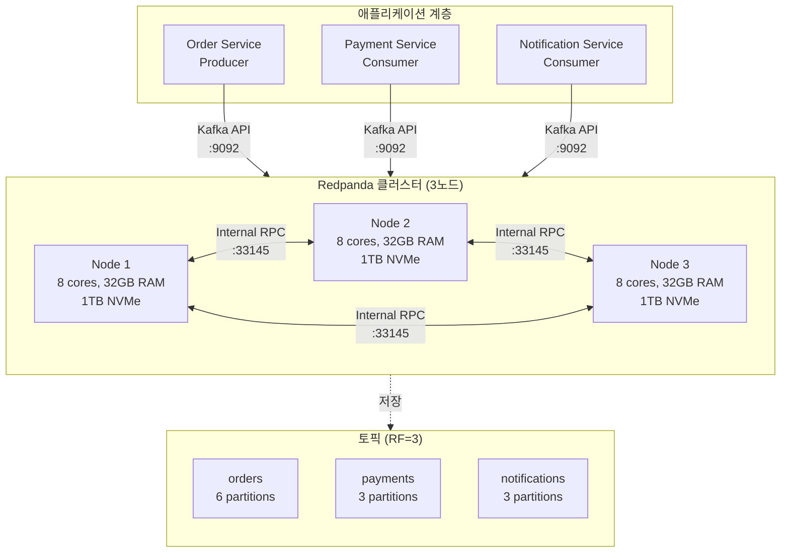
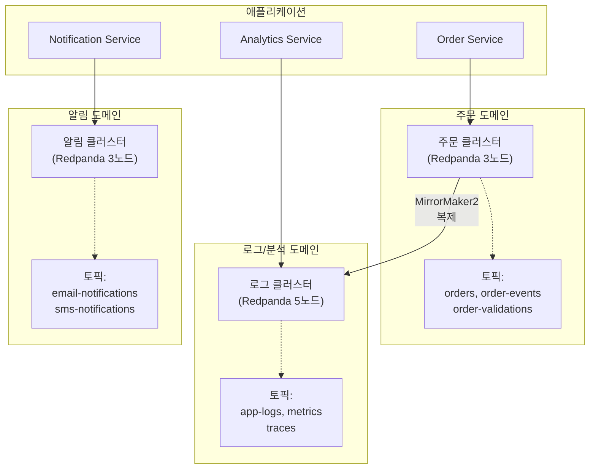
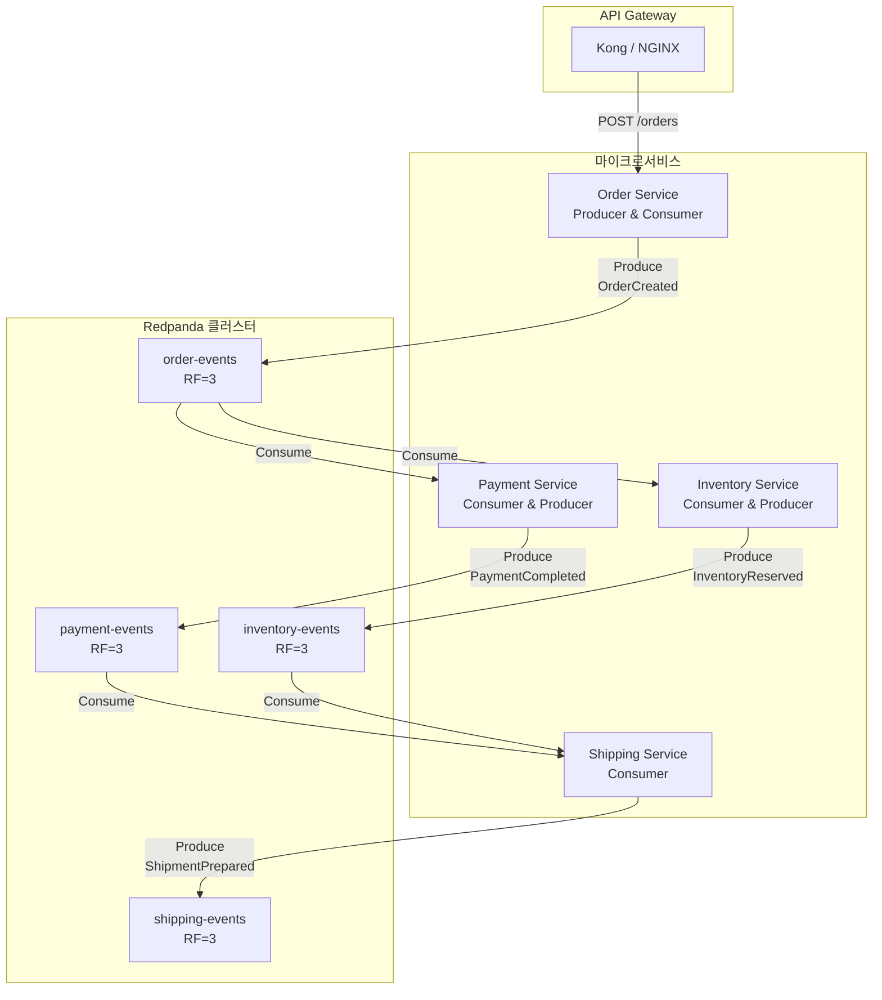
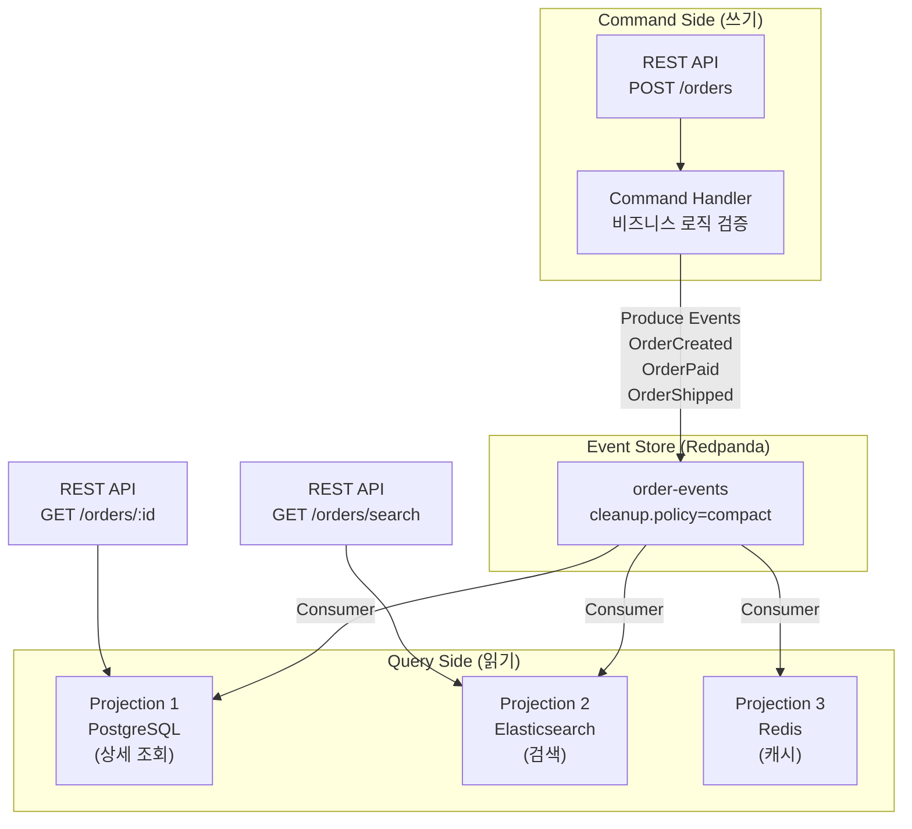
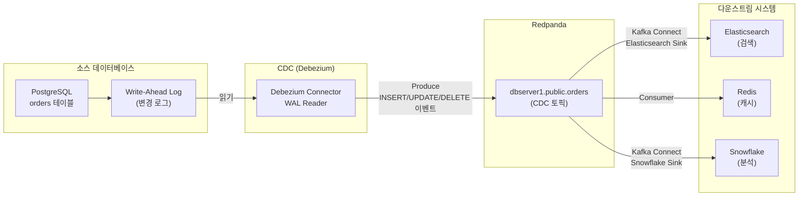

# 17. 레퍼런스 아키텍처 (Reference Architecture)

Redpanda를 실무에 도입할 때 가장 먼저 직면하는 질문은 "어떤 구조로 클러스터를 구성해야 하는가?"입니다. 이 문서는 검증된 아키텍처 패턴들을 제시하여, 요구사항에 맞는 설계를 선택하고 확장하는 데 도움을 줍니다. 단일 클러스터부터 멀티 클러스터, 이벤트 드리븐 MSA, CQRS, CDC 파이프라인까지 실무에서 자주 사용되는 패턴을 다룹니다.

---

## 1. 단일 클러스터 아키텍처

가장 단순한 형태로, **하나의 Redpanda 클러스터**에 모든 토픽을 배치하는 구조입니다. 개발 환경, 소규모 프로덕션, 또는 초기 단계 스타트업에 적합합니다.

### 구성 요소



### 특징

**장점**:
- 운영 복잡도 최소화 (하나의 클러스터만 관리)
- 토픽 간 데이터 이동 불필요 (같은 클러스터 내)
- 비용 효율적 (인프라 공유)

**단점**:
- 노이지 네이버(Noisy Neighbor) 문제 가능 (고부하 토픽이 다른 토픽 영향)
- 장애 시 전체 서비스 영향
- 팀/도메인별 격리 불가

### 권장 사양

| 구성 요소 | 개발/테스트 | 소규모 프로덕션 |
|----------|-----------|----------------|
| **노드 수** | 1 (RF=1) | 3 (RF=3) |
| **CPU** | 2-4 cores | 8-16 cores |
| **메모리** | 4-8 GB | 32-64 GB |
| **디스크** | SSD 100GB | NVMe 500GB-1TB |
| **네트워크** | 1 Gbps | 10 Gbps |

### 사용 시나리오

- 스타트업 초기 단계 (트래픽 < 100MB/s)
- 단일 팀이 운영하는 마이크로서비스
- 개발/스테이징 환경

---

## 2. 멀티 클러스터 아키텍처

**도메인별, 환경별, 또는 SLA별로 클러스터를 분리**하는 구조입니다. 각 클러스터는 독립적으로 운영되며, 필요 시 클러스터 간 데이터를 복제합니다.

### 도메인별 분리 예시



### 왜 클러스터를 분리하는가?

**격리(Isolation)**: 로그 처리 클러스터의 과부하가 주문 클러스터에 영향을 주지 않습니다. 각 클러스터는 독립적으로 장애를 격리합니다.

**SLA 차등 적용**: 주문 클러스터는 고가용성(RF=3, 고성능 NVMe), 로그 클러스터는 비용 최적화(RF=2, 일반 SSD)로 각각 최적화할 수 있습니다.

**보안 경계**: 민감한 데이터(개인정보, 금융 거래)와 일반 데이터를 물리적으로 분리하여 컴플라이언스 준수가 쉬워집니다.

**팀 소유권**: 각 팀이 자체 클러스터를 관리하여 배포 독립성과 책임 명확화를 달성합니다.

### 클러스터 간 복제

클러스터 간 데이터 이동은 **MirrorMaker2** 또는 **Redpanda Remote Read Replicas**를 사용합니다.

```bash
# MirrorMaker2 설정 예시
rpk connect mirror create \
  --source-cluster orders-cluster \
  --target-cluster analytics-cluster \
  --topics "orders.*"
```

복제는 비동기로 이루어지므로, 실시간 동기화가 필요한 경우 단일 클러스터가 더 적합할 수 있습니다.

---

## 3. 이벤트 드리븐 MSA 패턴

**마이크로서비스 간 통신을 이벤트 스트림으로 구현**하는 패턴입니다. 서비스 간 직접 HTTP 호출 대신, Redpanda를 중앙 이벤트 버스로 사용합니다.

### Choreography vs Orchestration

이벤트 드리븐 아키텍처에는 두 가지 주요 패턴이 있습니다.

**Choreography (안무 방식)**:
각 서비스가 이벤트를 발행하고 구독하여 자율적으로 동작합니다. 중앙 조정자 없이 이벤트 체인으로 워크플로우가 진행됩니다.

```
주문 생성:
Order Service → "OrderCreated" 이벤트 발행
  ↓
Payment Service → 구독하여 결제 처리 → "PaymentCompleted" 발행
  ↓
Inventory Service → 구독하여 재고 차감 → "InventoryReserved" 발행
  ↓
Shipping Service → 구독하여 배송 준비 → "ShipmentPrepared" 발행
```

장점: 서비스 간 결합도 낮음, 확장 용이
단점: 전체 워크플로우 파악 어려움, 디버깅 복잡

**Orchestration (오케스트라 방식)**:
중앙 조정자(Saga Orchestrator)가 각 서비스를 순차적으로 호출하여 워크플로우를 관리합니다.

```
Order Service → Saga Orchestrator에 주문 요청
  ↓
Orchestrator → Payment Service 호출 → 성공
  ↓
Orchestrator → Inventory Service 호출 → 성공
  ↓
Orchestrator → Shipping Service 호출 → 성공
  ↓
Orchestrator → Order Service에 완료 통지
```

장점: 워크플로우 명확, 중앙 모니터링 가능
단점: Orchestrator가 단일 장애점, 결합도 증가

> **상세 내용**: [03-spring-boot-integration](../03-spring-boot-integration/) 참조

### 아키텍처 다이어그램



### 핵심 원칙

**이벤트 우선 설계**: API 응답으로 즉시 결과를 반환하지 않고, 이벤트를 발행하여 비동기 처리합니다.

**멱등성(Idempotency)**: 같은 이벤트를 여러 번 받아도 결과가 동일하도록 설계합니다. Consumer는 중복 처리를 허용해야 합니다.

**이벤트 스키마 관리**: Avro, Protobuf, JSON Schema를 사용하여 이벤트 구조를 정의하고, Schema Registry로 버전 관리합니다.

**실패 처리**: Dead Letter Queue(DLQ) 토픽으로 처리 실패한 메시지를 격리하고, 재시도 정책을 명확히 정의합니다.

---

## 4. CQRS + Event Sourcing

**CQRS(Command Query Responsibility Segregation)** 는 쓰기 모델(Command)과 읽기 모델(Query)을 분리하는 패턴입니다. **Event Sourcing**은 상태 변경을 이벤트 시퀀스로 저장하는 패턴입니다. Redpanda는 이 두 패턴의 핵심 인프라 역할을 합니다.

### Command 모델 vs Query 모델

**Command 모델 (쓰기)**:
비즈니스 로직을 실행하고 이벤트를 Redpanda에 발행합니다. 데이터베이스에 직접 쓰지 않고, 이벤트만 생성합니다.

**Query 모델 (읽기)**:
Redpanda의 이벤트를 구독하여 읽기에 최적화된 View를 구축합니다. 예를 들어, 주문 상세 조회용 PostgreSQL, 검색용 Elasticsearch, 통계용 ClickHouse를 각각 유지합니다.



### Event Sourcing의 장점

**완전한 감사 추적(Audit Trail)**: 모든 상태 변경이 이벤트로 기록되므로, "언제, 누가, 무엇을" 정확히 추적할 수 있습니다. 금융, 의료 등 컴플라이언스가 중요한 분야에서 필수적입니다.

**시간 여행(Time Travel)**: 과거 특정 시점의 상태를 재구성할 수 있습니다. Redpanda의 오프셋을 조정하여 "2024년 1월 1일의 재고 상태"를 복원할 수 있습니다.

**새로운 View 생성**: 과거 이벤트를 재처리하여 새로운 읽기 모델을 구축할 수 있습니다. 예를 들어, 처음에는 주문 통계만 제공했지만, 나중에 고객별 구매 패턴 분석이 필요하면 같은 이벤트를 재처리하여 새 View를 만듭니다.

### Redpanda 설정

Event Store로 사용할 토픽은 **Compaction + 무제한 보존**으로 설정합니다.

```bash
rpk topic create order-events \
  --replicas 3 \
  --topic-config cleanup.policy=compact \
  --topic-config retention.ms=-1 \
  --topic-config segment.bytes=268435456
```

Compaction은 스냅샷 이벤트를 압축하고, 무제한 보존은 모든 이벤트 이력을 유지합니다.

---

## 5. CDC (Change Data Capture) 파이프라인

**CDC**는 데이터베이스의 변경사항을 실시간으로 캡처하여 다른 시스템에 전파하는 패턴입니다. 전통적인 배치 ETL을 대체하여 실시간 데이터 동기화를 달성합니다.

### CDC가 필요한 이유

**레거시 시스템 통합**: 기존 RDBMS를 직접 수정하지 않고, 변경사항만 캡처하여 새로운 시스템에 반영합니다.

**읽기 확장성**: Write는 PostgreSQL, Read는 Elasticsearch/Redis로 분산하여 부하를 분산합니다.

**실시간 분석**: 운영 DB의 변경사항을 실시간으로 Data Warehouse(Snowflake, BigQuery)에 전송하여 지연 없는 비즈니스 인텔리전스를 구현합니다.

**마이크로서비스 데이터 공유**: 각 마이크로서비스는 자체 DB를 가지지만, 다른 서비스의 데이터가 필요할 때 CDC로 동기화합니다.

### 아키텍처: Debezium + Redpanda

**Debezium**은 가장 널리 사용되는 CDC 플랫폼으로, MySQL, PostgreSQL, MongoDB 등의 변경 로그를 읽어 Kafka/Redpanda로 전송합니다.



### CDC 이벤트 형식

Debezium은 각 DB 변경을 Redpanda 메시지로 변환합니다.

```json
{
  "before": {
    "id": 123,
    "status": "pending"
  },
  "after": {
    "id": 123,
    "status": "paid"
  },
  "source": {
    "db": "orders_db",
    "table": "orders",
    "ts_ms": 1709380800000
  },
  "op": "u",  // c=create, u=update, d=delete, r=read(초기 스냅샷)
  "ts_ms": 1709380800050
}
```

`before`는 변경 전 값, `after`는 변경 후 값입니다. `op=u`는 UPDATE 연산을 의미합니다.

### 설정 예시

```json
{
  "name": "orders-connector",
  "config": {
    "connector.class": "io.debezium.connector.postgresql.PostgresConnector",
    "database.hostname": "postgres.example.com",
    "database.port": "5432",
    "database.user": "debezium",
    "database.password": "secret",
    "database.dbname": "orders_db",
    "database.server.name": "dbserver1",
    "table.include.list": "public.orders",
    "plugin.name": "pgoutput",
    "publication.autocreate.mode": "filtered",
    "value.converter": "io.confluent.connect.avro.AvroConverter",
    "value.converter.schema.registry.url": "http://redpanda:8081"
  }
}
```

이 설정은 PostgreSQL의 `orders` 테이블 변경사항을 `dbserver1.public.orders` 토픽으로 전송하며, Avro 포맷으로 직렬화합니다.

---

## 6. 클러스터 사이징 가이드라인

실무에서 "몇 개 노드가 필요한가?"를 결정하는 것은 복잡합니다. 다음 공식과 가이드라인을 참고하세요.

### 파티션 수 결정 공식

```
필요 파티션 수 = max(
    ceil(목표 처리량 / 파티션당 처리량),
    Consumer 수
)
```

**파티션당 처리량**은 네트워크, 메시지 크기, 압축률에 따라 다르지만, 일반적으로:
- 쓰기: 10-50 MB/s per partition
- 읽기: 50-100 MB/s per partition

예시: 목표 처리량이 500 MB/s 쓰기이고, 파티션당 25 MB/s를 처리할 수 있다면:
```
500 MB/s / 25 MB/s = 20개 파티션
```

### 브로커 수 결정

```
필요 노드 수 = max(
    ceil(총 파티션 수 / 노드당 파티션 수),
    Replication Factor
)
```

**노드당 파티션 수**는 CPU 코어 수와 메모리에 따라 결정됩니다:
- 8 core, 32GB: ~500-1000 파티션
- 16 core, 64GB: ~1000-2000 파티션

예시: 총 1500개 파티션, RF=3, 16코어 노드 사용 시:
```
1500 / 1000 = 2개 노드 (처리량 기준)
RF=3 → 최소 3개 노드 필요
→ 결론: 3개 노드
```

### 디스크 용량 계산

```
필요 디스크 = (일일 메시지 크기 × Retention 일수 × Replication Factor) / 노드 수 × 1.5 (여유)
```

예시:
- 일일 메시지: 1 TB
- Retention: 7일
- RF: 3
- 노드: 3대

```
(1 TB × 7 × 3) / 3 × 1.5 = 10.5 TB per node
→ 각 노드에 12TB 디스크 권장
```

### 메모리 계산

```
필요 메모리 = (파티션 수 × 파티션당 메모리) + OS 캐시 + Seastar 메모리
```

**파티션당 메모리**: 평균 1-2 MB (메타데이터, 인덱스)
**OS 캐시**: 불필요 (Redpanda는 O_DIRECT 사용)
**Seastar 메모리**: 전체 메모리의 80-90%를 Seastar가 사용

예시: 1000개 파티션을 호스팅하는 노드:
```
(1000 × 2 MB) + 2 GB (OS) + 30 GB (Seastar) = 34 GB
→ 32-64 GB 메모리 권장
```

### 실무 사이징 예시

| 시나리오 | 처리량 | 파티션 | 노드 | CPU | 메모리 | 디스크 |
|---------|-------|-------|------|-----|--------|--------|
| 소규모 | 100 MB/s | 50 | 3 | 8c | 32GB | 1TB |
| 중규모 | 500 MB/s | 200 | 5 | 16c | 64GB | 4TB |
| 대규모 | 2 GB/s | 1000 | 10 | 32c | 128GB | 10TB |

---

## 참고

### 공식 문서
- [Redpanda Production Deployment](https://docs.redpanda.com/current/deploy/deployment-option/self-hosted/)
- [Cluster Sizing](https://docs.redpanda.com/current/deploy/deployment-option/self-hosted/manual/sizing/)
- [Best Practices](https://docs.redpanda.com/current/manage/cluster-maintenance/cluster-property-configuration/)

### 패턴 및 설계
- [Event-Driven Architecture PoC](../../02_Architecture/01-event-driven/)
- [Spring Boot Integration](../03-spring-boot-integration/)

### CDC 및 통합
- [Debezium Documentation](https://debezium.io/documentation/)
- [Kafka Connect](https://docs.redpanda.com/current/develop/kafka-connect/)

---

## 학습 정리

### 핵심 아키텍처 패턴

1. **단일 클러스터**: 운영 단순성 우선. 소규모 또는 초기 단계에 적합.
2. **멀티 클러스터**: 도메인/SLA별 격리. 대규모 조직, 보안 경계 필요 시.
3. **이벤트 드리븐 MSA**: Choreography vs Orchestration. 서비스 간 느슨한 결합.
4. **CQRS + Event Sourcing**: 쓰기/읽기 모델 분리. 감사 추적, 시간 여행 가능.
5. **CDC 파이프라인**: 레거시 통합, 실시간 분석. Debezium + Redpanda 조합.

### 사이징 원칙

- **파티션 수**: 처리량과 Consumer 수 기반 결정
- **노드 수**: 파티션 수, RF, 가용성 요구사항 고려
- **디스크**: Retention × RF × 1.5 (여유분)
- **메모리**: 파티션 수 기반 + Seastar 메모리 (전체의 80%)
- **홀수 노드 권장**: 3, 5, 7 (짝수는 장애 허용 능력 동일하지만 비용 증가)

### 설계 결정 체크리스트

- [ ] 단일 vs 멀티 클러스터: 격리 필요성, 팀 구조, SLA 차등
- [ ] RF 결정: 데이터 중요도, 가용성 요구사항
- [ ] 파티션 수: 처리량 목표, Consumer 병렬성
- [ ] 이벤트 vs RPC: 비동기 허용 여부, 결합도 요구사항
- [ ] Event Sourcing: 감사 추적 필요성, 쿼리 복잡도
- [ ] CDC: 레거시 시스템 존재 여부, 실시간 동기화 필요성

이 레퍼런스 아키텍처들은 서로 배타적이지 않습니다. 단일 클러스터에서 시작하여 성장에 따라 멀티 클러스터로 확장하고, 필요한 패턴(CQRS, CDC)을 점진적으로 도입하는 것이 일반적입니다.
