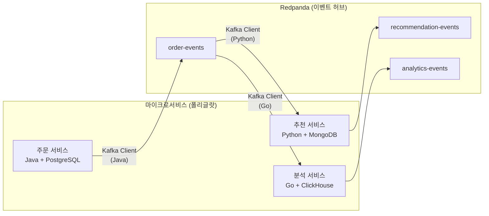
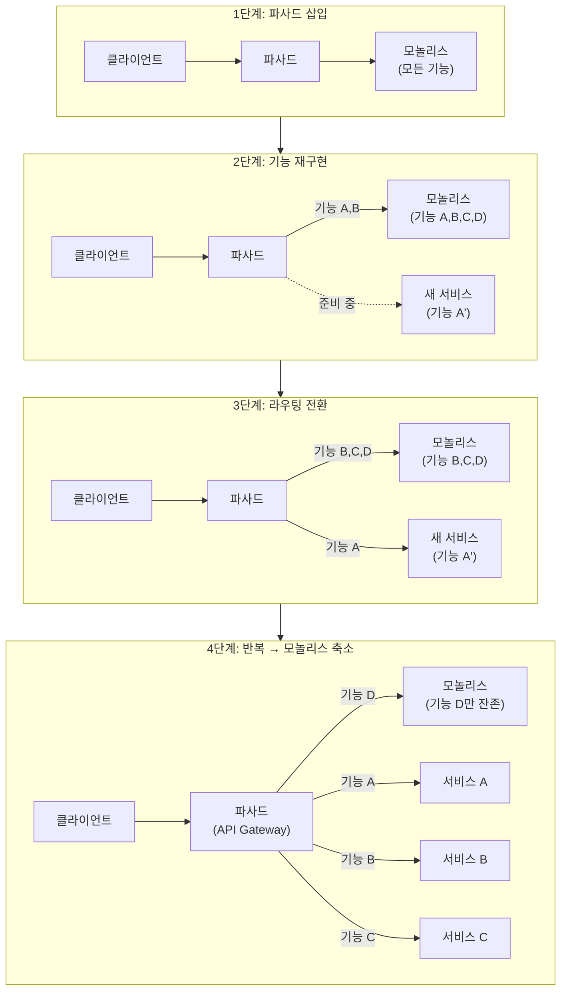
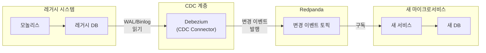
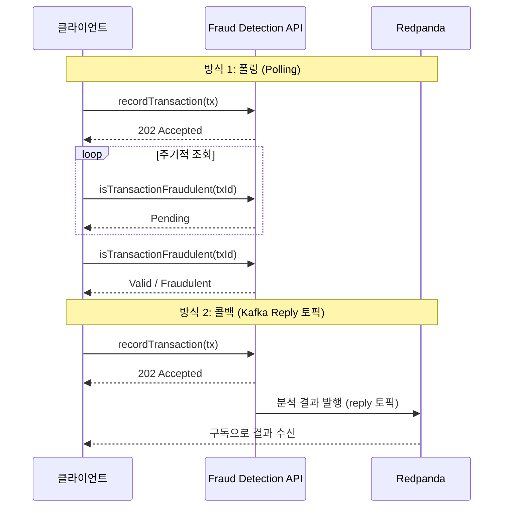
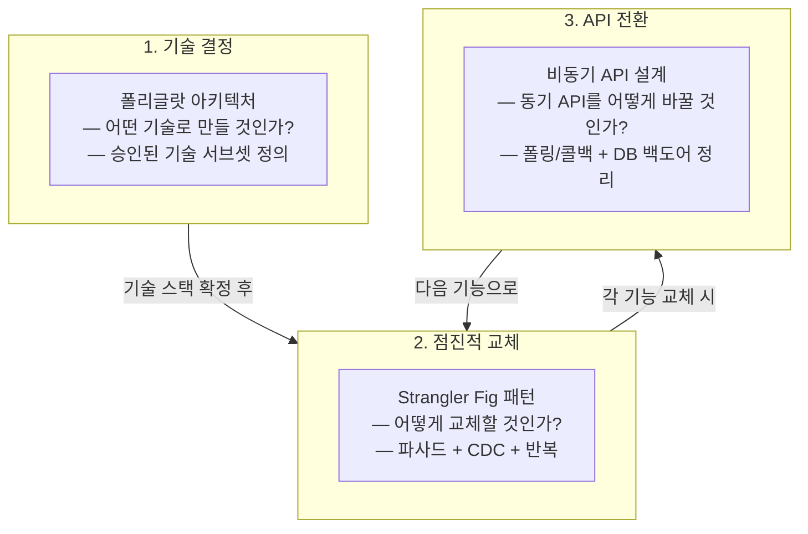

# 18. 마이크로서비스 마이그레이션 패턴

모놀리스에서 이벤트 기반 마이크로서비스로 전환할 때 직면하는 3가지 핵심 과제 — 기술 선택(폴리글랏), 점진적 교체(Strangler Fig), API 전환(비동기) — 를 다룹니다. 각 패턴은 독립적이지만, 실제 마이그레이션에서는 순차적으로 결합하여 사용합니다.

> **출처**: Confluent "Designing Event-Driven Microservices" 시리즈

---

## 1. 왜 마이크로서비스 마이그레이션인가?

### 모놀리스의 한계

모놀리스는 **단일 배포 단위**입니다. 여러 라이브러리로 분리할 수 있지만, 결국 하나의 인스턴스로 실행됩니다. 이 구조는 세 가지 근본적 제약을 만듭니다.

| 제약 | 설명 | 결과 |
|------|------|------|
| **단일 기술 스택** | Java 모놀리스에 Python 컴포넌트를 넣기 어려움 | 최적 도구 선택 불가, 인재 확보 제한 |
| **배포 결합** | 하나의 기능 변경이 전체 재배포를 요구 | 릴리스 주기 늘어남, 위험 증가 |
| **스케일링 제약** | 특정 기능만 스케일 아웃 불가 | 리소스 낭비, 비용 증가 |

### 이벤트 기반 마이크로서비스로의 전환 동기

마이크로서비스는 **독립 배포** 단위입니다. 각 서비스가 자체 기술 스택, 데이터베이스, 배포 주기를 가질 수 있습니다. 이벤트 기반 통신(Kafka/Redpanda)을 사용하면 서비스 간 결합도를 낮추면서도 데이터 일관성을 유지할 수 있습니다.

하지만 전환은 단순하지 않습니다. 세 가지 핵심 질문에 답해야 합니다:

1. **어떤 기술을 사용할 것인가?** → 폴리글랏 아키텍처
2. **어떻게 점진적으로 교체할 것인가?** → Strangler Fig 패턴
3. **동기식 API를 어떻게 전환할 것인가?** → 비동기 API 설계

---

## 2. 폴리글랏 아키텍처 (Polyglot Architecture)

### 정의

"폴리글랏"은 그리스어 "polu(많은)" + "glotta(언어)"에서 유래했습니다. 2006년 Neal Ford가 **Polyglot Programming** 개념을 제시했으며, 이후 데이터베이스까지 확장되어 **Polyglot Persistence**를 포함하는 **Polyglot Architecture**로 발전했습니다.

```
폴리글랏 아키텍처 = 폴리글랏 프로그래밍 + 폴리글랏 퍼시스턴스
                    (다중 프로그래밍 언어)    (다중 데이터베이스)
```

### 왜 폴리글랏인가?

모놀리스에서는 "망치만 있으면 모든 것이 못으로 보인다"는 문제가 발생합니다. Java와 관계형 데이터베이스만 있으면, 모든 문제를 그 기술의 관점으로 풀게 됩니다.

마이크로서비스는 독립 배포 단위이므로 이 제약에서 벗어납니다:

- **데이터 과학** 워크로드 → Python이 최적
- **트랜잭션 처리(OLTP)** → 관계형 DB가 최적
- **분석 처리(OLAP)** → 컬럼형 DB가 최적
- **문서 저장** → MongoDB 같은 문서 저장소가 최적

### 장점과 위험

| 장점 | 위험 |
|------|------|
| 각 작업에 최적의 도구 선택 가능 | 기술 폭발 — 너무 많은 기술을 관리해야 함 |
| 우수 인재 확보 용이 (좋은 도구 → 좋은 개발자) | 전문가 이탈 시 유지보수 불가 |
| 창의적 문제 해결 가능 | 서비스 간 경계를 넘는 인재 확보 어려움 |

### 완화 전략: 승인된 기술 서브셋

무제한 자유 대신 **제한적 폴리글랏**을 채택합니다. 회사가 승인한 기술 목록 내에서 자유롭게 선택하되, 목록 외 기술은 별도 승인이 필요합니다.

```
[ 승인된 기술 서브셋 ]
┌─────────────────────────────────────────────┐
│  언어: Java, Python, Go                     │
│  DB: PostgreSQL, MongoDB, Redis             │
│  메시징: Kafka/Redpanda                      │
│  API: REST, gRPC                            │
│  클라우드: AWS (오픈소스 기반 서비스 우선)      │
└─────────────────────────────────────────────┘
→ 이 범위 내에서 자유 선택
→ 범위 외 기술 = 별도 승인 필요
```

이 접근법의 핵심은 **유연성과 통제 사이의 균형**입니다. 완전한 자유는 기술 폭발을, 완전한 통제는 혁신 저하를 초래하므로, 적절한 서브셋을 유지하는 것이 중요합니다.

### 기술 선택 원칙: 오픈 표준 우선

폴리글랏 환경에서는 **벤더 종속(Vendor Lock-in)**이 특히 위험합니다. 서비스마다 다른 기술을 쓰는데, 특정 벤더에 종속되면 이기종 시스템 간 통합이 어려워집니다.

| 선택 기준 | 좋은 예 | 나쁜 예 |
|----------|---------|---------|
| 통신 프로토콜 | REST, gRPC | 벤더 전용 RPC |
| 이벤트 스트리밍 | Kafka Protocol (Redpanda 호환) | 벤더 전용 메시징 |
| 데이터 포맷 | Avro, Protobuf, JSON | 벤더 전용 직렬화 |
| 클라우드 서비스 | 오픈소스 기반 매니지드 서비스 | 벤더 전용 서비스 |

클라우드 서비스 사용 자체는 문제가 아닙니다. 오히려 운영 부담을 줄여 폴리글랏 채택 비용을 낮춥니다. 핵심은 **오픈 표준 기반** 서비스를 선택하여 이식성을 확보하는 것입니다.

### Kafka/Redpanda의 역할

폴리글랏 환경에서 Kafka/Redpanda는 **이기종 서비스 간 데이터 이동의 허브** 역할을 합니다. 커넥터를 통해 다양한 언어/DB로 작성된 서비스들이 데이터를 공유할 수 있습니다.



서비스 간 직접 통신 없이 Redpanda를 통해 이벤트를 교환하므로, 각 서비스는 자신의 기술 스택에만 집중할 수 있습니다.

---

## 3. Strangler Fig 패턴 (점진적 마이그레이션)

### 비유: 열대림의 교살자 무화과

열대림에서 교살자 무화과(Strangler Fig)는 숙주 나무의 가지에서 씨앗으로 시작합니다. 뿌리를 아래로 뻗고 가지를 하늘로 뻗으며 자라면서, 숙주 나무와 빛과 영양분을 두고 경쟁합니다. 점점 숙주를 감싸며 자원을 빼앗고, 결국 숙주 나무는 죽고 무화과만 남습니다.

Martin Fowler는 이 자연 현상에서 영감을 받아 **Strangler Fig Pattern**을 제안했습니다. 레거시 시스템(숙주)을 새 시스템(무화과)이 점진적으로 교체하는 패턴입니다.

### 전체 재작성 vs 점진적 교체

| 비교 항목 | 전체 재작성 (Big Bang) | 점진적 교체 (Strangler Fig) |
|----------|----------------------|---------------------------|
| **비즈니스 가치 전달** | 전체 완료 후에야 가치 전달 | 각 단계마다 가치 전달 |
| **위험도** | 매우 높음 (시간↑ → 비용↑ → 실패 확률↑) | 낮음 (작은 단위로 검증) |
| **사고방식** | 모놀리식 사고 | 마이크로서비스 사고 (작게, 반복적으로) |
| **적합한 시스템** | 소규모, 단순한 시스템 | 대규모, 복잡한 시스템 |
| **롤백** | 전체 롤백 (사실상 불가능) | 기능 단위 롤백 가능 |

> **핵심 판단 기준**: "어떤 접근이 비즈니스 가치를 가장 빨리 전달하는가?" — 소프트웨어 프로젝트의 가장 큰 위험은 **시간**입니다. 시간이 늘어날수록 비용과 실패 가능성이 함께 증가합니다.

### 구현 단계



**각 단계 설명**:

1. **파사드 삽입**: 모든 트래픽이 파사드를 통과하도록 변경합니다. 이 시점에서 파사드는 단순 프록시 역할만 합니다.
2. **기능 재구현**: 모놀리스의 기능 일부를 새 마이크로서비스로 재구현합니다. 아직 프로덕션 트래픽은 모놀리스로 갑니다.
3. **라우팅 전환**: 재구현이 검증되면 파사드가 해당 기능의 트래픽을 새 서비스로 라우팅합니다. 파사드는 이후 API Gateway로 남을 수 있습니다.
4. **반복**: 다음 기능을 선택하여 2~3단계를 반복합니다. 모놀리스는 점점 축소되다가 결국 완전히 대체됩니다.

### 주의사항

**어댑터 과다**: 동시에 너무 많은 기능을 교체하면 어댑터가 폭발적으로 늘어납니다. 한 번에 소수의 기능만 교체해야 합니다. 목표는 전체를 한꺼번에 바꾸는 것이 아니라 **천천히, 통제된 방식으로** 진행하는 것입니다.

**롤백 계획 필수**: 새 시스템으로 전환 후 예상치 못한 문제가 발생할 수 있습니다. 파사드의 라우팅을 다시 모놀리스로 되돌릴 수 있는 롤백 계획이 반드시 있어야 합니다.

**레거시 DB 의존성**: 가장 큰 도전입니다. 레거시 시스템의 의존성이 데이터베이스 깊숙이 얽혀 있는 경우, 깨끗한 파사드를 추출하는 것 자체가 긴 작업이 될 수 있습니다.

### CDC + Kafka로 데이터 동기화

레거시 DB 의존성 문제를 해결하는 핵심 도구가 **Change Data Capture(CDC)**입니다. 기존 데이터베이스를 직접 수정하지 않고, 변경사항을 캡처하여 Kafka/Redpanda 토픽으로 전송합니다. 새 마이크로서비스는 이 토픽을 구독하여 데이터를 동기화합니다.



이 방식의 장점은 **레거시 시스템을 수정하지 않고도** 신/구 시스템 간 데이터 동기화를 달성한다는 것입니다. 모놀리스는 평소처럼 DB에 쓰기만 하면 되고, CDC가 변경사항을 자동으로 캡처합니다.

> **상세**: CDC 파이프라인 구성은 [14-reference-architecture.md](14-reference-architecture.md) 섹션 5 참조

### 적용 판단

- **대규모 시스템** (수십 개 모듈, 수백만 줄 코드) → Strangler Fig 패턴
- **소규모 시스템** (몇 개 모듈, 단순 구조) → 전체 재작성이 더 빠를 수 있음
- **판단 기준**: "어떤 접근이 비즈니스 가치 전달 시간을 단축하는가?"

---

## 4. 비동기 마이크로서비스 API 설계

### 사례: Tributary Bank 사기 탐지

Tributary Bank는 모놀리스에서 사기 탐지(Fraud Detection) 마이크로서비스를 추출하려 합니다. 기존 API는 **동기식**으로 설계되어 있어, 마이크로서비스로 전환하기 전에 API를 먼저 재설계해야 합니다.

### 문제: 동기식 API의 한계

기존 `isFraudulent(transaction)` 메서드는 세 가지 책임을 하나에 혼합합니다:

```
isFraudulent(transaction) → boolean
├── 1. 트랜잭션을 DB에 등록
├── 2. 과거 데이터 기반 분석 실행
└── 3. 결과 반환 (true/false)
```

이 설계의 문제:

| 문제 | 설명 |
|------|------|
| **지연 증가** | 분석이 복잡해질수록 모든 트랜잭션이 지연됨 |
| **가용성 종속** | 사기 탐지 서비스 불가용 → 전체 트랜잭션 실패 |
| **동기 블로킹** | 결과를 반환해야 하므로 비동기 처리 불가 |

사기 탐지 알고리즘은 점점 복잡해지고 시간이 오래 걸립니다. 동기식 설계에서는 이 지연이 모든 트랜잭션에 직접 영향을 줍니다. 마이크로서비스로 추출하면 네트워크 지연까지 추가되고, 서비스 불가용 시 트랜잭션 자체가 실패합니다.

### 해결: API 분리 (동기 → 비동기)

하나의 메서드를 두 개로 분리합니다:

```
기존 (동기식):
  isFraudulent(transaction) → boolean

변환 (비동기식):
  recordTransaction(transaction) → void      ← Fire-and-forget
  isTransactionFraudulent(transactionId) → FraudResult  ← 결과 조회
```

**`recordTransaction(transaction)`**: 트랜잭션을 등록하고 즉시 반환합니다. 결과를 기다리지 않으므로 **Fire-and-forget** 패턴입니다. 실제 분석은 비동기로 처리됩니다.

**`isTransactionFraudulent(transactionId)`**: 분석 결과를 조회합니다. 여기서 중요한 설계 변경이 있습니다 — 반환 타입이 `boolean`에서 `FraudResult` **enum**으로 변경됩니다:

| 상태 | 의미 |
|------|------|
| `Valid` | 분석 완료, 정상 트랜잭션 |
| `Fraudulent` | 분석 완료, 사기 의심 |
| `Pending` | 아직 분석 중 (나중에 다시 조회) |

`boolean`으로는 "아직 분석 중"을 표현할 수 없습니다. `Pending` 상태를 추가함으로써 비동기 처리의 중간 상태를 클라이언트에게 알릴 수 있습니다.

### 결과 수신 전략: 폴링 vs 콜백

`Pending`이 반환되면 결과를 어떻게 받을까요?



| 방식 | 장점 | 단점 |
|------|------|------|
| **폴링** | 구현 단순, 클라이언트가 제어 | 불필요한 요청 발생, 지연 |
| **콜백 (Kafka Reply 토픽)** | 실시간 알림, 효율적 | 구현 복잡, 모놀리스가 Kafka 구독 필요 |

마이크로서비스 추출 시 콜백 방식은 **Kafka Reply 토픽**으로 구현합니다. 사기 탐지 서비스가 분석을 완료하면 reply 토픽에 결과를 발행하고, 모놀리스(또는 다른 서비스)가 이를 구독하여 결과를 수신합니다.

> **상세**: ReplyingKafkaTemplate 패턴은 [03-spring-boot-integration/13-topic-pipeline-architecture.md](../03-spring-boot-integration/13-topic-pipeline-architecture.md) 참조

### DB 직접 접근 문제 해결

마이그레이션에서 자주 간과되는 문제가 **데이터베이스 백도어**입니다. 개발자들이 API를 우회하여 DB에 직접 쿼리를 실행하는 경우입니다.

```
문제 상황:
  개발자 A → getFraudulentTransactions() SQL 직접 실행
  개발자 B → 같은 쿼리를 복사+붙여넣기
  개발자 C → 쿼리를 변형하여 사용
  → 마이크로서비스 추출 시 DB 접근 불가 → 전부 깨짐
```

**해결 단계**:

1. **API 래핑**: 직접 쿼리를 `getFraudulentTransactions()` 같은 API 메서드로 감쌈
2. **사용처 치환**: 코드 검색으로 직접 쿼리 사용처를 찾아 API 호출로 변환 (ORM이나 쿼리 변형으로 놓칠 수 있음에 주의)
3. **권한 제한**: 해당 테이블의 DB 접근 권한을 Fraud Detection API만 가능하도록 제한
4. **테스트 검증**: 권한 제한 후 자동화/수동 테스트를 실행하여 숨겨진 백도어를 발견

권한 제한은 단순한 보안 조치가 아닙니다. **검증 도구**이기도 합니다. 권한을 제한하고 테스트를 돌리면, 아직 API로 전환하지 못한 백도어 쿼리가 실패하면서 드러납니다.

### 교훈

> "작고 계획된 단계를 밟아 시스템을 점진적으로 진화시켜라. 한꺼번에 모든 것을 바꾸려 하면 더 많은 문제, 더 많은 실패, 더 많은 시간이 필요하다."

이 원칙은 API 전환뿐 아니라 마이그레이션 전체에 적용됩니다:
- 모놀리스 내부에서 먼저 API를 비동기로 전환
- 그 다음 마이크로서비스로 추출
- 각 단계가 독립적으로 검증 가능해야 함

---

## 5. 마이그레이션 패턴 종합

### 3가지 패턴의 연결 관계

세 패턴은 마이그레이션의 서로 다른 단계/측면을 다루며, 실제로는 함께 사용됩니다.



**실행 순서**:
1. 폴리글랏 전략으로 승인된 기술 서브셋을 먼저 결정
2. Strangler Fig 패턴으로 파사드를 삽입하고 기능 단위 교체 시작
3. 각 기능 교체 시 동기 API를 비동기로 전환
4. 2~3을 반복하여 모놀리스를 점진적으로 축소

### 마이그레이션 준비도 체크리스트

마이그레이션을 시작하기 전에 다음을 점검하세요:

**기술 전략**:
- [ ] 승인된 프로그래밍 언어 목록이 정의되어 있는가?
- [ ] 승인된 데이터베이스 목록이 정의되어 있는가?
- [ ] 통신 프로토콜이 오픈 표준 기반인가? (REST, gRPC, Kafka Protocol)
- [ ] 이벤트 스트리밍 플랫폼이 선정되어 있는가? (Kafka/Redpanda)

**교체 전략**:
- [ ] 모놀리스 앞에 파사드/API Gateway를 삽입할 수 있는가?
- [ ] 교체할 기능의 우선순위가 정해져 있는가?
- [ ] CDC로 레거시 DB 데이터를 실시간 동기화할 수 있는가?
- [ ] 각 단계별 롤백 계획이 있는가?

**API 전략**:
- [ ] 동기식 API 중 비동기로 전환해야 할 것들을 식별했는가?
- [ ] DB 직접 접근 코드를 파악하고 API로 래핑했는가?
- [ ] DB 권한을 API 서비스로 제한했는가?
- [ ] 전환 후 검증을 위한 테스트가 준비되어 있는가?

### 기존 학습 문서 크로스 레퍼런스

| 관련 주제 | 문서 | 연결 포인트 |
|----------|------|-----------|
| CDC 파이프라인 구성 | [14-reference-architecture.md](14-reference-architecture.md) | Debezium + Redpanda CDC 아키텍처 |
| 토픽 파이프라인 패턴 | [03-spring-boot-integration/13-topic-pipeline-architecture.md](../03-spring-boot-integration/13-topic-pipeline-architecture.md) | ReplyingKafkaTemplate, @SendTo |
| 이벤트 드리븐 아키텍처 | [02_Architecture/01-event-driven](../../02_Architecture/01-event-driven/) | Saga, Outbox+CDC, CQRS 패턴 |
| Choreography vs Orchestration | [14-reference-architecture.md](14-reference-architecture.md) | 이벤트 드리븐 MSA 패턴 |
| 스키마 관리 | [04-schema-registry.md](04-schema-registry.md) | 폴리글랏 환경에서의 Avro/Protobuf 스키마 |

---

## 학습 정리

### 핵심 패턴 요약

| 패턴 | 핵심 질문 | 해결책 |
|------|----------|--------|
| **폴리글랏 아키텍처** | 어떤 기술로 만들 것인가? | 승인된 기술 서브셋 + 오픈 표준 우선 |
| **Strangler Fig** | 어떻게 교체할 것인가? | 파사드 삽입 → 기능 단위 교체 → 반복 |
| **비동기 API 설계** | 동기 API를 어떻게 바꿀 것인가? | API 분리 + 폴링/콜백 + DB 백도어 정리 |

### 공통 원칙

1. **비즈니스 가치 전달 시간 단축**: 모든 결정의 핵심 기준. 시간이 줄면 위험도 줄어든다.
2. **작고 반복적인 단계**: 한꺼번에 모든 것을 바꾸지 않는다. 각 단계가 독립적으로 검증 가능해야 한다.
3. **롤백 가능성 확보**: 모든 전환에는 되돌릴 수 있는 계획이 필요하다.
4. **오픈 표준 선택**: 벤더 종속을 피하고 이기종 시스템 간 통합을 용이하게 한다.
