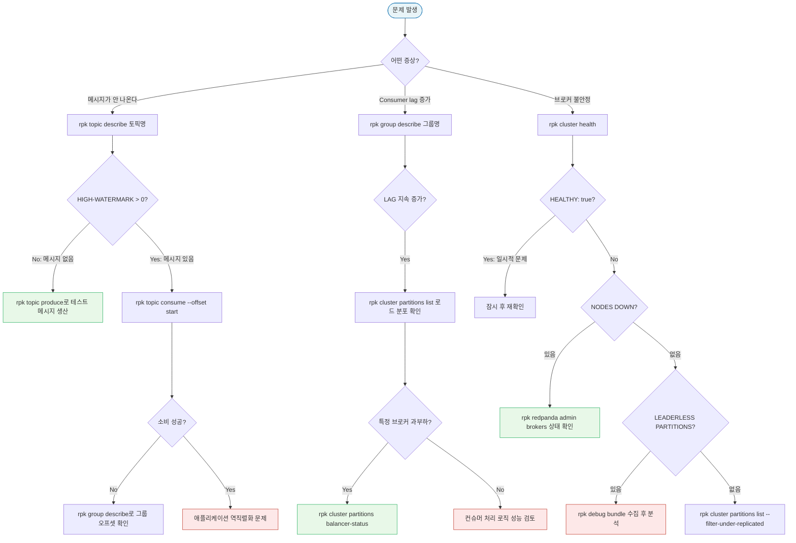

# Appendix. rpk CLI 레퍼런스

> **시리즈**: `learning/02-fundamentals/` — Redpanda 기초
> | [01-Overview](./01-overview.md) | [07-Schema Registry](./07-schema-registry.md) | [16-Transactions](./16-transactions.md) | **[Appendix-rpk CLI](./appendix-rpk-cli.md)** |

rpk는 Redpanda 클러스터를 관리하는 단일 CLI 도구다. Kafka 생태계에서 `kafka-topics.sh`, `kafka-consumer-groups.sh`, `kafka-configs.sh` 등 여러 스크립트에 분산되어 있던 기능을 하나의 바이너리로 통합했으며, Redpanda 전용 기능(튜닝, 진단, 관리자 API)도 함께 포함한다. 운영 환경에서 클러스터 상태 확인부터 트러블슈팅 번들 수집까지 rpk 하나로 처리할 수 있다.

---

## 학습 목표

- rpk의 설치와 기본 사용법을 이해한다
- 토픽/그룹/클러스터 명령어를 운영 시나리오에 맞게 활용할 수 있다
- 보안(ACL), 스키마 레지스트리, 진단 명령어의 용도를 파악한다

---

## 1. rpk 개요와 설치

### 왜 rpk인가

Kafka CLI 도구는 JVM 기반이라 실행할 때마다 JVM 시작 비용이 발생하고, 스크립트마다 연결 설정을 반복해야 한다. rpk는 Go로 컴파일된 단일 바이너리이므로 시작이 즉각적이고, `rpk profile`로 클러스터 연결 정보를 한 번만 저장해두면 모든 명령어에 자동으로 적용된다.

### 설치

```bash
# macOS (Homebrew)
brew install redpanda-data/tap/redpanda

# Linux (apt)
curl -1sLf 'https://dl.redpanda.com/nzc4YZRZ/redpanda/cfg/setup/bash.deb.sh' | sudo bash
sudo apt-get install redpanda

# Linux (rpm)
curl -1sLf 'https://dl.redpanda.com/nzc4YZRZ/redpanda/cfg/setup/bash.rpm.sh' | sudo bash
sudo yum install redpanda

# Docker 컨테이너 내 (이미 포함됨)
docker exec -it redpanda rpk version
```

설치 후 버전을 확인해 정상 동작 여부를 검증한다.

```bash
rpk version
# v24.2.7 (rev a1b2c3d)
```

### rpk profile — 클러스터 연결 관리

운영 환경에서는 로컬, 스테이징, 프로덕션 등 여러 클러스터를 오가며 작업해야 한다. 매번 `--brokers` 플래그를 입력하는 대신 profile을 사용하면 context switching이 간편해진다.

```bash
# 프로파일 생성
rpk profile create local --set brokers=localhost:9092
rpk profile create prd   --set brokers=10.255.17.176:31092

# 프로파일 전환
rpk profile use prd

# 현재 프로파일 확인
rpk profile print
# name: prd
# brokers: 10.255.17.176:31092

# 특정 커맨드에서 일시적으로 다른 브로커 사용
rpk topic list --brokers localhost:9092
```

**함정**: profile 파일은 `~/.config/rpk/rpk.yaml`에 저장된다. CI/CD 환경에서는 파일이 없으므로 `--brokers` 플래그나 환경변수 `RPK_BROKERS`를 명시해야 한다.

### 공통 플래그

| 플래그 | 설명 | 예시 |
|--------|------|------|
| `--brokers` | 브로커 주소 (쉼표 구분) | `--brokers b1:9092,b2:9092` |
| `--format` | 출력 형식 | `--format json` / `yaml` / `text` |
| `--tls-enabled` | TLS 활성화 | `--tls-enabled` |
| `--user` / `--password` | SASL 인증 | `--user alice --password secret` |
| `-v` / `--verbose` | 상세 출력 | `-v` |

---

## 2. Topic 관리

토픽은 Redpanda에서 데이터가 흐르는 기본 단위다. 토픽을 올바르게 생성하고 구성하는 것이 성능과 내구성의 출발점이다.

### 토픽 생성

```bash
# 기본 생성 (파티션 3, 복제 인수 1)
rpk topic create orders

# 파티션/복제 지정
rpk topic create payments \
  --partitions 12 \
  --replicas 3

# 설정 포함 생성 (보존 기간 7일, 압축)
rpk topic create events \
  --partitions 6 \
  --replicas 3 \
  --topic-config retention.ms=604800000 \
  --topic-config compression.type=lz4
```

**함정**: 복제 인수는 브로커 수를 초과할 수 없다. 3-노드 클러스터에서 `--replicas 4`를 지정하면 생성이 실패한다.

### 토픽 조회

```bash
# 전체 토픽 목록
rpk topic list

# JSON 형식으로 파이프 처리
rpk topic list --format json | jq '.[].name'

# 특정 토픽 상세 정보
rpk topic describe orders
# NAME        orders
# PARTITIONS  3
# REPLICAS    1
#
# PARTITION  LEADER  EPOCH  REPLICAS  LOG-START-OFFSET  HIGH-WATERMARK
# 0          1       1      [1]       0                 1042
# 1          1       1      [1]       0                 983
# 2          1       1      [1]       0                 1101
```

`HIGH-WATERMARK`는 파티션에서 컨슈머가 읽을 수 있는 최신 오프셋을 나타낸다. 이 값이 `LOG-START-OFFSET`과 같다면 파티션에 메시지가 없다는 뜻이다.

### 메시지 생산과 소비

```bash
# 단순 메시지 생산 (stdin에서 읽음)
echo '{"id":1,"event":"order_placed"}' | rpk topic produce orders

# Key-Value 페어로 생산
rpk topic produce payments --key payment-001 <<< '{"amount":50000}'

# JSON 포맷으로 여러 메시지 생산
rpk topic produce orders --format json \
  <<< '[{"key":"k1","value":"v1"},{"key":"k2","value":"v2"}]'

# 처음부터 소비 (--offset earliest 없으면 새 메시지만 수신)
rpk topic consume orders --offset start

# 특정 파티션/오프셋 지정
rpk topic consume orders --partitions 0 --offset 100

# JSON 출력으로 타임스탬프/헤더 포함
rpk topic consume orders --format json | jq .
```

**함정**: `rpk topic consume`은 기본적으로 계속 기다린다. 스크립트에서 사용할 때는 `--num 10`으로 메시지 수를 제한하거나 타임아웃을 설정해야 한다.

### 런타임 설정 변경

서비스 재시작 없이 토픽 설정을 변경해야 할 때 사용한다.

```bash
# 보존 기간을 24시간으로 변경
rpk topic alter-config orders --set retention.ms=86400000

# 압축 방식 변경
rpk topic alter-config events --set compression.type=snappy

# 설정 초기화 (클러스터 기본값으로 복구)
rpk topic alter-config orders --delete retention.ms

# 변경 확인
rpk topic describe orders --print-configs
```

### 파티션 추가와 삭제

```bash
# 파티션 추가 (6 → 12)
rpk topic add-partitions orders --num 6

# 토픽 삭제
rpk topic delete old-topic

# 여러 토픽 한번에 삭제
rpk topic delete topic-a topic-b topic-c
```

**주의**: 파티션은 추가만 가능하고 줄일 수 없다. Key 기반 라우팅을 사용 중이라면 파티션 추가 후 동일 Key가 다른 파티션으로 라우팅될 수 있어 순서 보장이 깨진다.

---

## 3. Consumer Group 관리

컨슈머 그룹을 모니터링하는 이유는 Lag 때문이다. Lag은 프로듀서가 생산한 메시지 중 컨슈머가 아직 처리하지 못한 메시지 수를 나타내며, 이 수치가 지속적으로 증가하면 컨슈머가 처리량을 따라가지 못하고 있다는 신호다.

### 그룹 조회와 Lag 분석

```bash
# 전체 그룹 목록
rpk group list

# 특정 그룹 상세 (Lag 포함)
rpk group describe payment-service
# GROUP         payment-service
# COORDINATOR   1
# STATE         Stable
# BALANCER      range
# MEMBERS       2
#
# TOPIC     PARTITION  CURRENT-OFFSET  LOG-END-OFFSET  LAG  MEMBER-ID
# payments  0          10234           10250           16   consumer-1
# payments  1          9876            9900            24   consumer-2
# payments  2          10100           10100           0    consumer-1
```

`LAG`이 0이면 컨슈머가 최신 메시지를 모두 처리한 상태다. 위 예시에서 파티션 0, 1은 처리 지연이 있고 파티션 2는 정상이다.

### Consumer Group 상태

| 상태 | 의미 |
|------|------|
| `Stable` | 정상 동작 중 |
| `Rebalancing` | 멤버 변동으로 파티션 재할당 진행 중 |
| `PreparingRebalance` | 리밸런싱 준비 단계 |
| `Empty` | 멤버가 없고 커밋된 오프셋만 존재 |
| `Dead` | 멤버도 없고 오프셋도 만료됨 |

### 오프셋 리셋 (rpk group seek)

장애 복구나 재처리가 필요할 때 오프셋을 수동으로 변경한다. 컨슈머가 실행 중이면 리셋이 적용되지 않으므로, 먼저 애플리케이션을 중지해야 한다.

```bash
# 처음부터 다시 처리
rpk group seek payment-service --to start

# 최신 메시지부터 처리 (이전 메시지 건너뜀)
rpk group seek payment-service --to end

# 특정 타임스탬프 이후부터 처리 (ISO 8601 형식)
rpk group seek payment-service --to 2026-03-01T00:00:00Z

# 특정 파티션의 특정 오프셋으로 지정
rpk group seek payment-service \
  --topics payments \
  --to 5000
```

**함정**: `--to start`는 `retention.ms` 이내의 메시지만 재처리할 수 있다. 보존 기간이 지난 메시지는 이미 삭제되어 있다.

---

## 4. Cluster 운영

클러스터 수준에서 전체 노드 상태와 파티션 분포를 파악하는 것은 운영의 기본이다.

### 클러스터 상태 확인

```bash
# 클러스터 기본 정보
rpk cluster info
# CLUSTER
# =======
# redpanda.71c91b77-66c0-4a48-ab14-9cceae7fb7cd
#
# BROKERS
# =======
# ID  HOST       PORT
# 0*  broker-0   9092
# 1   broker-1   9092
# 2   broker-2   9092
#
# (* = controller)

# 클러스터 헬스 체크 (노드 다운, 리더 없는 파티션 감지)
rpk cluster health
# HEALTHY:               true
# CONTROLLER ID:         0
# ALL NODES RESPONDING:  true
# NODES DOWN:            []
# LEADERLESS PARTITIONS: []
# UNDER REPLICATED PARTITIONS: []
```

`LEADERLESS PARTITIONS`가 있으면 해당 파티션의 메시지를 생산/소비할 수 없는 상태다. 브로커 장애 직후 잠시 나타날 수 있지만, 복구 후에도 지속된다면 추가 조사가 필요하다.

### 동적 설정 관리

Redpanda는 설정을 재시작 없이 변경할 수 있는 동적 설정과 재시작이 필요한 정적 설정으로 구분한다.

```bash
# 현재 클러스터 설정 조회
rpk cluster config get kafka_connections_max

# 동적 설정 변경
rpk cluster config set log_segment_size_max 268435456

# 전체 설정 내보내기 (백업 용도)
rpk cluster config export -o cluster-config.yaml

# 설정 파일 가져오기 (복구/마이그레이션)
rpk cluster config import -f cluster-config.yaml
```

### 파티션 분포 관리

파티션이 특정 브로커에 몰리면 해당 브로커에 부하가 집중된다. `rpk cluster partitions`로 분포를 확인하고 재조정할 수 있다.

```bash
# 파티션 분포 조회
rpk cluster partitions list

# 복제 부족 파티션 확인 (장애 감지)
rpk cluster partitions list --filter-under-replicated

# 리더 없는 파티션 확인
rpk cluster partitions list --filter-leaderless

# 파티션 밸런서 상태
rpk cluster partitions balancer-status
# Status:                          ready
# Seconds Since Last Tick:         3
# Current Reassignment Count:      0
```

---

## 5. Broker 관리 (rpk redpanda)

`rpk redpanda` 명령어는 브로커 프로세스 자체를 관리하는 서브커맨드다. Redpanda가 설치된 노드에서 직접 실행해야 한다.

### 브로커 설정 파일 관리

```bash
# 설정 파일 조회 (기본 경로: /etc/redpanda/redpanda.yaml)
rpk redpanda config print

# 특정 값 설정
rpk redpanda config set redpanda.kafka_api[0].port 9092

# 설정 초기화
rpk redpanda config bootstrap \
  --self 192.168.1.10 \
  --ips 192.168.1.10,192.168.1.11,192.168.1.12
```

### 운영 모드 전환

```bash
# 개발 모드 (성능 제약 완화, 로컬 테스트용)
rpk redpanda mode development

# 프로덕션 모드 (fsync 활성화, 엄격한 설정)
rpk redpanda mode production
```

개발 모드는 fsync를 비활성화해 쓰기 속도를 높이지만, 프로세스 충돌 시 데이터 손실 위험이 있다. 프로덕션 환경에서는 반드시 production 모드를 사용해야 한다.

### 자동 튜닝

Redpanda는 호스트 환경(CPU, 디스크, 네트워크)을 분석해 최적 설정을 자동 적용하는 튜닝 기능을 제공한다.

```bash
# 전체 튜닝 실행 (루트 권한 필요)
sudo rpk redpanda tune all

# 특정 항목만 튜닝
sudo rpk redpanda tune disk_irq
sudo rpk redpanda tune network
sudo rpk redpanda tune cpu

# 튜닝 가능한 항목 목록
rpk redpanda tune list
```

### Graceful Shutdown

브로커를 재시작할 때 파티션 리더십을 먼저 다른 브로커로 이전하면 다운타임을 최소화할 수 있다.

```bash
# 브로커 0의 리더십을 다른 노드로 이전 후 종료
rpk redpanda admin brokers decommission 0

# 브로커 추가 (스케일아웃)
rpk redpanda admin brokers recommission 3
```

---

## 6. 보안 (rpk acl)

ACL(Access Control List)은 특정 사용자가 어떤 리소스에 어떤 작업을 할 수 있는지 정의한다. SASL 인증과 함께 사용하면 멀티테넌트 환경에서 서비스 간 격리를 구현할 수 있다.

자세한 보안 설정은 [04-advanced-patterns/02-security.md](../04-advanced-patterns/02-security.md)를 참조한다.

### SASL 사용자 관리

```bash
# 사용자 생성
rpk acl user create alice --password secret123 --mechanism SCRAM-SHA-256

# 사용자 목록
rpk acl user list

# 사용자 삭제
rpk acl user delete alice
```

### ACL 규칙 관리

```bash
# 특정 토픽에 대한 읽기/쓰기 권한 부여
rpk acl create \
  --allow-principal User:alice \
  --operation read,write \
  --topic orders

# 컨슈머 그룹 접근 허용
rpk acl create \
  --allow-principal User:alice \
  --operation read \
  --group order-service

# ACL 목록 조회
rpk acl list

# ACL 삭제
rpk acl delete \
  --allow-principal User:alice \
  --operation write \
  --topic orders
```

**함정**: ACL이 없는 경우 기본 동작은 클러스터 설정(`kafka_mtls_principal_mapping_rules`)에 따라 달라진다. 테스트 환경에서는 ACL 없이 동작하다가 보안 설정을 켰을 때 갑자기 권한 오류가 발생할 수 있다.

---

## 7. Schema Registry (rpk registry)

Schema Registry에 접근하려면 브로커가 아닌 Schema Registry 엔드포인트가 필요하다. Redpanda의 내장 Schema Registry는 기본적으로 8081 포트에서 동작한다.

자세한 스키마 설계 가이드는 [02-fundamentals/07-schema-registry.md](./07-schema-registry.md)를 참조한다.

```bash
# Schema Registry 엔드포인트 설정
rpk profile set schema-registry-url=http://localhost:8081

# 스키마 주제(subject) 목록
rpk registry schema list

# 특정 주제의 스키마 조회
rpk registry schema get orders-value --schema-version latest

# 스키마 등록
rpk registry schema create orders-value \
  --schema '{"type":"record","name":"Order","fields":[{"name":"id","type":"string"}]}'

# 스키마 버전 목록
rpk registry schema list orders-value --list-versions

# 호환성 레벨 확인 및 변경
rpk registry compatibility-level get orders-value
rpk registry compatibility-level set orders-value --level BACKWARD
```

**함정**: 스키마를 등록할 때 subject 이름 규칙은 `{토픽명}-value` 또는 `{토픽명}-key`다. 규칙을 따르지 않으면 Avro 시리얼라이저가 자동으로 스키마를 찾지 못한다.

---

## 8. 진단과 트러블슈팅

운영 중 문제가 발생했을 때 체계적으로 접근하지 않으면 원인 파악에 시간을 낭비한다. rpk는 진단에 필요한 도구를 갖추고 있다.

### 진단 번들 수집

Redpanda 지원팀에 문의하거나 사후 분석을 위해 클러스터 상태 전체를 스냅샷으로 수집한다.

```bash
# 진단 번들 생성 (로그, 설정, 메트릭 포함)
rpk debug bundle
# Writing bundle to /tmp/bundle.zip
# Brokers: [broker-0:9092]
# Fetching logs from all nodes...
# Collecting cluster metadata...
# Bundle saved: /tmp/bundle-2026-03-09T12-00-00.zip

# 번들 내용 확인
unzip -l /tmp/bundle-2026-03-09T12-00-00.zip | head -20
```

### 트랜잭션 모니터링

Exactly-once semantics를 사용하는 프로듀서의 트랜잭션 상태를 조회한다.

```bash
# 활성 트랜잭션 목록
rpk cluster txn list

# 특정 트랜잭션 상세
rpk cluster txn describe payment-producer-txn-1
```

### 트러블슈팅 결정 흐름

운영 시나리오별로 어떤 명령어를 순서대로 실행해야 하는지 보여주는 흐름도다.



---

## 9. 빠른 참조 테이블

| 명령어 | 용도 | 주요 옵션 | 참조 |
|--------|------|-----------|------|
| `rpk topic create` | 토픽 생성 | `--partitions`, `--replicas`, `--topic-config` | §2 |
| `rpk topic list` | 토픽 목록 | `--format json` | §2 |
| `rpk topic describe` | 토픽 상세 | `--print-configs`, `--print-summary` | §2 |
| `rpk topic produce` | 메시지 생산 | `--key`, `--format`, `--num` | §2 |
| `rpk topic consume` | 메시지 소비 | `--offset start/end/숫자`, `--partitions`, `--num` | §2 |
| `rpk topic alter-config` | 설정 변경 | `--set`, `--delete` | §2 |
| `rpk topic add-partitions` | 파티션 추가 | `--num` | §2 |
| `rpk topic delete` | 토픽 삭제 | — | §2 |
| `rpk group list` | 그룹 목록 | `--format json` | §3 |
| `rpk group describe` | 그룹 Lag 분석 | `--format json` | §3 |
| `rpk group seek` | 오프셋 리셋 | `--to start/end/타임스탬프/숫자` | §3 |
| `rpk cluster info` | 클러스터 정보 | `--format json` | §4 |
| `rpk cluster health` | 클러스터 헬스 | — | §4 |
| `rpk cluster config get/set` | 동적 설정 | `--format`, `--all` | §4 |
| `rpk cluster config export/import` | 설정 백업/복구 | `-o`, `-f` | §4 |
| `rpk cluster partitions list` | 파티션 분포 | `--filter-under-replicated`, `--filter-leaderless` | §4 |
| `rpk cluster partitions balancer-status` | 밸런서 상태 | — | §4 |
| `rpk redpanda config print` | 브로커 설정 조회 | — | §5 |
| `rpk redpanda mode` | 운영 모드 변경 | `development`, `production` | §5 |
| `rpk redpanda tune` | 자동 튜닝 | `all`, `disk_irq`, `network`, `cpu` | §5 |
| `rpk acl create` | ACL 생성 | `--allow-principal`, `--operation`, `--topic` | §6 |
| `rpk acl list` | ACL 목록 | — | §6 |
| `rpk acl user create` | SASL 사용자 생성 | `--password`, `--mechanism` | §6 |
| `rpk registry schema list` | 스키마 목록 | `--list-versions` | §7 |
| `rpk registry schema get` | 스키마 조회 | `--schema-version` | §7 |
| `rpk registry schema create` | 스키마 등록 | `--schema`, `--schema-type` | §7 |
| `rpk registry compatibility-level` | 호환성 레벨 | `get`, `set --level` | §7 |
| `rpk debug bundle` | 진단 번들 수집 | — | §8 |
| `rpk cluster txn list` | 트랜잭션 목록 | — | §8 |
| `rpk profile create/use` | 클러스터 프로파일 | `--set brokers=` | §1 |

---

## 교차참조

- **rpk connect** (Redpanda Connect 파이프라인 관리): [07-connectors/02-redpanda-connect.md](../07-connectors/02-redpanda-connect.md)
- **rpk transform** (WASM 변환 함수 배포): [05-event-driven-poc/01-wasm-transforms.md](../05-event-driven-poc/01-wasm-transforms.md)
- **스키마 레지스트리 심화**: [02-fundamentals/07-schema-registry.md](./07-schema-registry.md)
- **보안/ACL 심화**: [04-advanced-patterns/02-security.md](../04-advanced-patterns/02-security.md)
- **트랜잭션 심화**: [02-fundamentals/16-transactions.md](./16-transactions.md)
