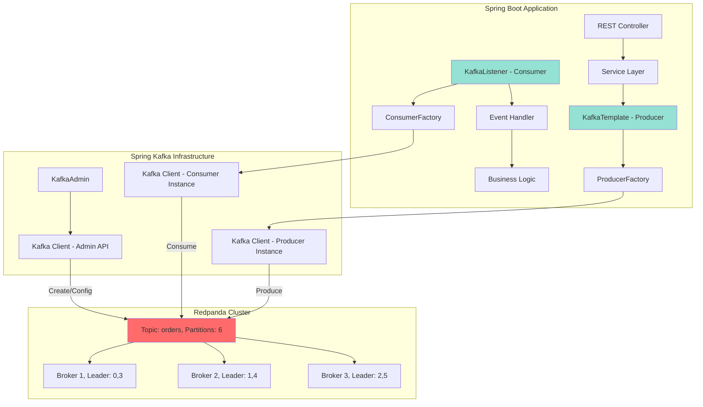

# 01. Basic Setup

Spring Boot + Redpanda 기본 연결 설정

---

## 왜 Spring Kafka인가

Spring Boot는 Java 생태계에서 가장 성숙한 엔터프라이즈 프레임워크입니다. 트랜잭션 관리, 보안, 모니터링, 의존성 주입 등 프로덕션급 기능을 기본 제공하며, Spring Kafka는 Kafka 클라이언트를 Spring 생태계와 자연스럽게 통합합니다. `@KafkaListener` 어노테이션으로 Consumer를 선언하고, `KafkaTemplate`으로 메시지를 발행하는 방식은 Spring의 일관된 프로그래밍 모델을 따릅니다.

Redpanda는 Kafka API와 100% 호환되므로, Spring Kafka를 그대로 사용할 수 있습니다. Kafka는 JVM 기반이지만 Redpanda는 C++로 작성되어 메모리 사용량이 절반이고, ZooKeeper가 필요 없어 운영이 단순하며, 시작 속도가 2배 빠릅니다. Spring Boot 개발자 입장에서는 설정 파일의 `bootstrap-servers` 주소만 변경하면 Kafka에서 Redpanda로 전환할 수 있습니다.

이 조합의 장점은 명확합니다. 첫째, 학습 곡선이 낮습니다. Spring 개발자는 기존 지식을 활용할 수 있습니다. 둘째, 운영 비용이 절감됩니다. Redpanda는 같은 처리량을 유지하면서 서버 비용을 30-50% 줄일 수 있습니다. 셋째, 생태계가 풍부합니다. Spring Actuator로 메트릭을 수집하고, Spring Cloud Sleuth로 분산 추적을 구현하며, Spring Retry로 재시도 정책을 선언적으로 정의할 수 있습니다.

---

## 의존성

```groovy
plugins {
    id 'com.github.davidmc24.gradle.plugin.avro' version '1.9.1'  // .avsc → Java 클래스 생성
}

repositories {
    mavenCentral()
    maven { url 'https://packages.confluent.io/maven/' }  // Confluent 의존성 저장소
}

dependencies {
    implementation 'org.springframework.kafka:spring-kafka'
    implementation 'org.apache.avro:avro:1.11.3'
    implementation 'io.confluent:kafka-avro-serializer:7.6.0'
}
```

`spring-kafka`는 Apache Kafka 클라이언트와 Spring 통합 레이어를 포함합니다. Spring Boot를 사용하면 `spring-boot-starter-parent`에서 버전 관리를 자동으로 처리하므로 버전을 명시하지 않아도 됩니다.

`avro`와 `kafka-avro-serializer`는 Avro 직렬화와 Schema Registry 연동을 담당합니다. `kafka-avro-serializer`는 Confluent의 라이브러리로, Schema Registry와 통신하여 스키마를 자동 등록하고 호환성을 검증합니다. Spring Kafka의 `KafkaTemplate`과 `@KafkaListener`에서 직접 사용할 수 있습니다.

Gradle Avro 플러그인(`com.github.davidmc24.gradle.plugin.avro`)은 `src/main/avro/*.avsc` 스키마 파일에서 Java 클래스를 자동 생성합니다. Schema Registry는 프로덕션 환경에서 강력히 권장됩니다. Producer가 이벤트 스키마를 변경하면 Consumer가 파싱 오류를 일으킬 수 있는데, Schema Registry가 스키마 버전을 관리하고 호환성을 검증합니다. Redpanda는 Confluent Schema Registry와 호환되는 Schema Registry를 내장하고 있어 별도 서비스 배포가 필요 없습니다.

> **설정 상세**: application.yml 전체 카탈로그, Configuration 클래스, 프로파일 전략은 [02-configuration-reference.md](./02-configuration-reference.md) 참조

---

## Spring Boot ↔ Redpanda 연결 아키텍처



**계층 구조 설명:**
1. **Application Layer**: REST API로 요청을 받아 Service Layer에서 비즈니스 로직을 처리합니다.
2. **Spring Kafka Layer**: `KafkaTemplate`과 `@KafkaListener`가 Producer/Consumer 추상화를 제공합니다.
3. **Factory Layer**: `ProducerFactory`와 `ConsumerFactory`가 Kafka 클라이언트 인스턴스를 생성합니다.
4. **Kafka Client Layer**: Apache Kafka 클라이언트가 Redpanda 브로커와 통신합니다.
5. **Redpanda Cluster**: 토픽의 파티션이 여러 브로커에 분산됩니다.

`KafkaAdmin` Bean은 토픽 생성/설정을 자동화합니다. 애플리케이션 시작 시 `NewTopic` Bean들을 감지하여 Redpanda에 토픽을 생성합니다.

> **토픽 관리**: KafkaAdmin, TopicBuilder, cleanup.policy, DLT 전략은 [16-topic-lifecycle.md](./16-topic-lifecycle.md) 참조

---

## 연결 테스트

### HealthCheck

```java
@Component
@RequiredArgsConstructor
@Slf4j
public class KafkaHealthIndicator implements HealthIndicator {

    private final KafkaTemplate<String, Object> kafkaTemplate;

    @Override
    public Health health() {
        try {
            kafkaTemplate.send("health-check", "ping").get(5, TimeUnit.SECONDS);
            return Health.up()
                .withDetail("status", "Redpanda is reachable")
                .build();
        } catch (Exception e) {
            return Health.down()
                .withDetail("error", e.getMessage())
                .build();
        }
    }
}
```

Spring Boot Actuator의 `/actuator/health` 엔드포인트에 Redpanda 연결 상태를 추가합니다. 실제로 메시지를 발행하여 연결을 검증합니다. Kubernetes의 Liveness/Readiness Probe에서 이 엔드포인트를 호출하여 Pod 상태를 모니터링할 수 있습니다.

주의: 헬스 체크가 너무 자주 호출되면 `health-check` 토픽에 메시지가 쌓입니다. 프로덕션에서는 메시지를 발행하지 않고 Admin API로 브로커 연결만 확인하는 것이 좋습니다.

### 연결 확인 테스트

```java
@SpringBootTest
class KafkaConnectionTest {

    @Autowired
    private KafkaTemplate<String, Object> kafkaTemplate;

    @Test
    void shouldConnectToRedpanda() {
        // Given
        String topic = "test-topic";
        String message = "hello";

        // When
        CompletableFuture<SendResult<String, Object>> future =
            kafkaTemplate.send(topic, message);

        // Then
        assertDoesNotThrow(() -> future.get(10, TimeUnit.SECONDS));
    }
}
```

통합 테스트에서 Redpanda 연결을 검증합니다. `kafkaTemplate.send()`는 비동기로 동작하므로 `CompletableFuture.get()`으로 결과를 기다립니다. 타임아웃을 설정하여 Redpanda가 다운되어 있으면 테스트가 빠르게 실패합니다.

---

> **상세**: [18-anti-patterns-troubleshooting.md](18-anti-patterns-troubleshooting.md) 참조 (안티패턴 + Consumer 리밸런스 트러블슈팅)

---

## Redpanda vs Kafka 설정 차이

대부분의 설정은 동일하지만 몇 가지 차이점이 있습니다.

### 1. ZooKeeper 설정 불필요

**Kafka:**
```yaml
spring:
  kafka:
    bootstrap-servers: kafka:9092
  zookeeper:
    connect: zookeeper:2181  # ZooKeeper 필요
```

**Redpanda:**
```yaml
spring:
  kafka:
    bootstrap-servers: redpanda:9092
# ZooKeeper 설정 없음 - Redpanda는 Raft 기반 자체 메타데이터 관리
```

Redpanda는 ZooKeeper를 사용하지 않으므로 운영이 단순합니다. Kafka는 브로커 메타데이터를 ZooKeeper에 저장하지만, Redpanda는 Raft 합의 알고리즘으로 브로커 간 메타데이터를 복제합니다.

### 2. Schema Registry URL

**Kafka (Confluent Schema Registry):**
```yaml
spring:
  kafka:
    properties:
      schema.registry.url: http://schema-registry:8081
```

**Redpanda (내장 Schema Registry):**
```yaml
spring:
  kafka:
    properties:
      schema.registry.url: http://redpanda:8081  # Docker 내부 네트워크 (로컬 개발 시 localhost:18081)
```

Redpanda는 Schema Registry를 브로커에 내장하고 있습니다. 별도 서비스를 배포할 필요가 없습니다.

### 3. 시작 속도

Redpanda는 Kafka보다 2배 빠르게 시작합니다. Testcontainers에서 통합 테스트를 실행할 때 이 차이가 체감됩니다.

```java
// Kafka: 시작까지 15-20초
@Container
static KafkaContainer kafka = new KafkaContainer(
    DockerImageName.parse("confluentinc/cp-kafka:7.5.0")
);

// Redpanda: 시작까지 7-10초
@Container
static RedpandaContainer redpanda = new RedpandaContainer(
    "docker.redpanda.com/redpandadata/redpanda:v25.3.6"
);
```

### 4. 클러스터 구성

**Kafka:** ZooKeeper 앙상블(3노드) + Kafka 브로커(3노드) = 총 6개 프로세스

**Redpanda:** Redpanda 브로커(3노드) = 총 3개 프로세스

Redpanda는 ZooKeeper가 없으므로 배포가 단순하고 리소스 사용량이 적습니다.

---

> **상세**: [04-manual-commit-deep-dive.md](04-manual-commit-deep-dive.md) 참조 (MANUAL vs MANUAL_IMMEDIATE, 배치 리스너, 흔한 실수, 체크리스트)

---

> **상세**: [19-production-case-studies.md](19-production-case-studies.md) 참조 (토스, 우아한형제들, LINE, 사람인 사례 + 프로덕션 설정 템플릿)

---

## 다음 단계

기본 설정이 완료되었습니다. 다음 문서에서는 Producer와 Consumer의 실전 패턴을 다룹니다.

**관련 문서:**
- [03-producer-consumer.md](./03-producer-consumer.md): Producer/Consumer 패턴, 에러 핸들링, 재시도 전략
- [10-testing.md](./10-testing.md): Testcontainers로 통합 테스트 작성
- [05-dlq-strategy.md](./05-dlq-strategy.md): Dead Letter Queue 전략, 에러 유형별 처리

---

## 참고

- [Spring Kafka Documentation](https://docs.spring.io/spring-kafka/reference/)
- [Redpanda Kafka Compatibility](https://docs.redpanda.com/current/develop/kafka-clients/)
- [Spring Boot Kafka Auto-configuration](https://docs.spring.io/spring-boot/docs/current/reference/html/messaging.html#messaging.kafka)
- [Kafka Producer Configuration](https://kafka.apache.org/documentation/#producerconfigs)
- [Kafka Consumer Configuration](https://kafka.apache.org/documentation/#consumerconfigs)
