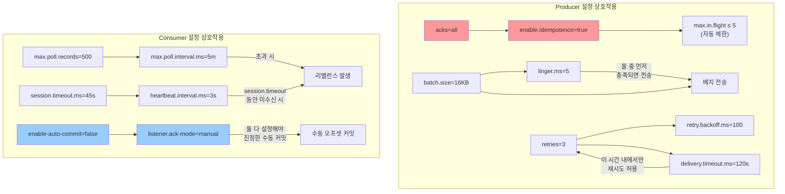
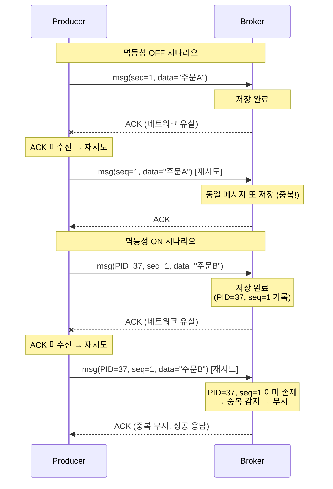
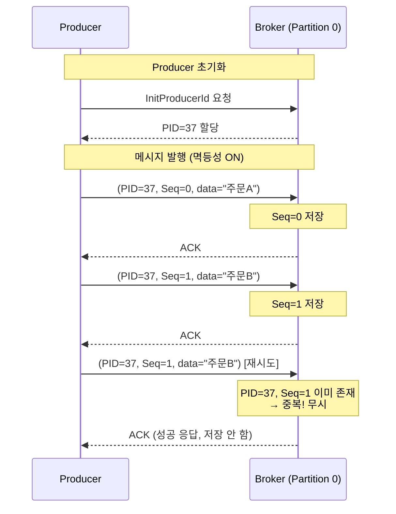
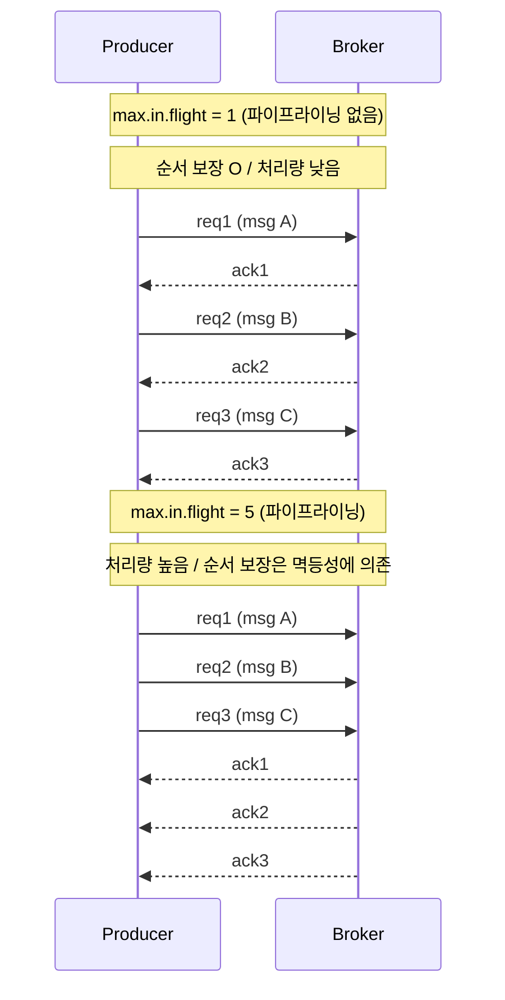
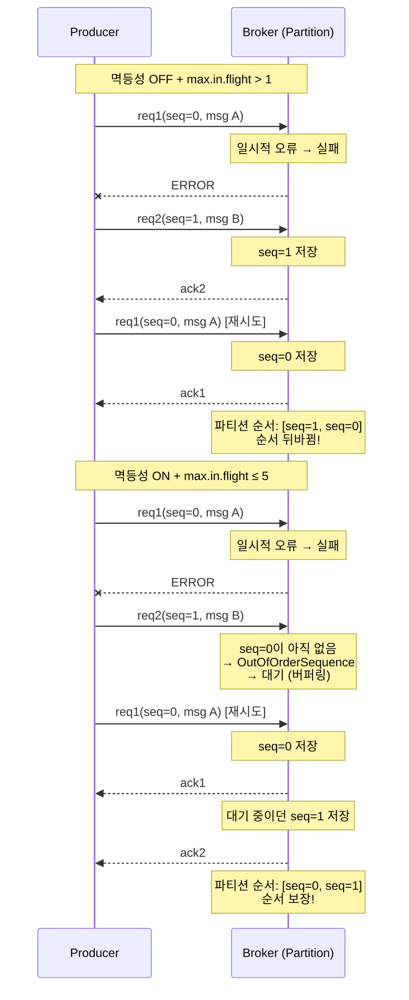
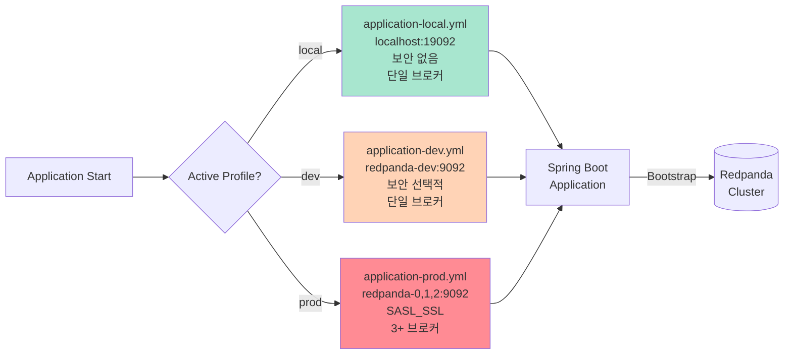

# 02. Spring Kafka 설정 레퍼런스

application.yml Producer/Consumer/Listener 설정 옵션과 프로파일별 전략. 프로젝트 설정은 [01-basic-setup.md](./01-basic-setup.md), 토픽 관리는 [16-topic-lifecycle.md](./16-topic-lifecycle.md) 참조.

---

## application.yml 설정

### 기본 설정

```yaml
spring:
  kafka:
    bootstrap-servers: localhost:19092

    producer:
      key-serializer: org.apache.kafka.common.serialization.StringSerializer
      value-serializer: io.confluent.kafka.serializers.KafkaAvroSerializer
      acks: all
      retries: 3
      properties:
        schema.registry.url: http://localhost:18081
        auto.register.schemas: true      # 로컬 개발 시 자동 등록

    consumer:
      group-id: ${spring.application.name}
      key-deserializer: org.apache.kafka.common.serialization.StringDeserializer
      value-deserializer: io.confluent.kafka.serializers.KafkaAvroDeserializer
      auto-offset-reset: earliest
      enable-auto-commit: false
      properties:
        schema.registry.url: http://localhost:18081
        specific.avro.reader: true       # Avro 생성 클래스로 역직렬화

    listener:
      ack-mode: manual
      concurrency: 3
```

### Producer 설정 전체 카탈로그

`spring.kafka.producer.*` 네임스페이스의 주요 설정을 카테고리별로 정리합니다.

#### 직렬화 (Serialization)

| 설정 | 기본값 | 설명 |
|------|--------|------|
| `key-serializer` | `StringSerializer` | 메시지 키 직렬화 클래스. 키는 파티션 결정에 사용됩니다. |
| `value-serializer` | `StringSerializer` | 메시지 값 직렬화 클래스. Avro 사용 시 `KafkaAvroSerializer`로 변경합니다. |

#### 신뢰성 (Reliability)

| 설정 | 기본값 | 설명 |
|------|--------|------|
| `acks` | `1` | 몇 개의 복제본이 메시지를 확인해야 성공으로 간주할지. `0`(확인 안 함), `1`(리더만), `all`(모든 ISR). |
| `retries` | `Integer.MAX_VALUE` | 전송 실패 시 최대 재시도 횟수. `delivery.timeout.ms`와 함께 동작합니다. |
| `properties.enable.idempotence` | `false` | `true`로 설정하면 PID+시퀀스 번호로 중복 메시지를 방지합니다. `acks=all`이 강제됩니다. |

#### 성능 튜닝 (Performance)

| 설정 | 기본값 | 설명 |
|------|--------|------|
| `batch-size` | `16384` (16KB) | 같은 파티션으로 보낼 메시지를 모아두는 배치의 최대 바이트 수. 클수록 처리량 증가, 지연 증가. |
| `buffer-memory` | `33554432` (32MB) | Producer가 브로커 전송 대기 중인 레코드를 버퍼링하는 총 메모리. 초과 시 `max.block.ms`만큼 블로킹 후 예외. |
| `properties.linger.ms` | `0` | 배치를 채우기 위해 대기하는 시간(ms). `0`이면 즉시 전송, `5~10`이면 배치 효율 증가. |
| `properties.compression.type` | `none` | 메시지 압축 방식. `none`, `gzip`, `snappy`, `lz4`, `zstd`. `lz4`가 속도/압축 균형이 좋습니다. |
| `properties.max.in.flight.requests.per.connection` | `5` | ACK 대기 없이 동시에 보낼 수 있는 요청 수. 멱등성 ON 시 최대 5. |

#### 타임아웃 (Timeout)

| 설정 | 기본값 | 설명 |
|------|--------|------|
| `properties.delivery.timeout.ms` | `120000` (2분) | 메시지 전송의 전체 시한. 재시도를 포함한 총 허용 시간입니다. |
| `properties.request.timeout.ms` | `30000` (30초) | 개별 요청의 응답 대기 시간. 초과 시 재시도합니다. |
| `properties.retry.backoff.ms` | `100` | 재시도 간 대기 시간(ms). |
| `properties.max.block.ms` | `60000` (1분) | `send()`와 `partitionsFor()` 호출 시 버퍼 가득 찼을 때 블로킹 최대 시간. |

#### Schema Registry (Avro 사용 시)

| 설정 | 기본값 | 설명 |
|------|--------|------|
| `properties.schema.registry.url` | - | Schema Registry 엔드포인트. Redpanda 내장 사용 시 `http://localhost:18081`. |
| `properties.auto.register.schemas` | `true` | 스키마 자동 등록. **프로덕션에서는 반드시 `false`**. |
| `properties.use.latest.version` | `false` | `true`이면 Registry에서 최신 스키마 ID를 자동 조회하여 사용합니다. |

#### Producer 전체 설정 yml

```yaml
spring:
  kafka:
    producer:
      # ── 직렬화 ──
      key-serializer: org.apache.kafka.common.serialization.StringSerializer
      value-serializer: io.confluent.kafka.serializers.KafkaAvroSerializer

      # ── 신뢰성 ──
      acks: all                              # 모든 ISR 복제 확인
      retries: 3                             # 최대 재시도 횟수

      # ── 성능 튜닝 ──
      batch-size: 16384                      # 16KB 배치
      buffer-memory: 33554432                # 32MB 버퍼

      properties:
        # 신뢰성
        enable.idempotence: true             # PID+시퀀스로 중복 방지

        # 성능 튜닝
        linger.ms: 5                         # 5ms 대기 후 배치 전송
        compression.type: lz4               # lz4 압축 (속도/압축 균형)
        max.in.flight.requests.per.connection: 5  # 파이프라이닝 (멱등성 ON 시 최대 5)

        # 타임아웃
        delivery.timeout.ms: 120000          # 전체 전송 시한 2분
        request.timeout.ms: 30000            # 개별 요청 응답 대기 30초
        retry.backoff.ms: 100                # 재시도 간 100ms 대기
        max.block.ms: 60000                  # 버퍼 가득 시 블로킹 최대 1분

        # Schema Registry (Avro 사용 시)
        schema.registry.url: http://localhost:18081
        auto.register.schemas: true          # ⚠️ 프로덕션에서는 반드시 false
        use.latest.version: false            # true이면 Registry 최신 스키마 ID 자동 조회
```

### Consumer 설정 전체 카탈로그

`spring.kafka.consumer.*` 네임스페이스의 주요 설정을 카테고리별로 정리합니다.

#### 그룹 관리 (Group Management)

| 설정 | 기본값 | 설명 |
|------|--------|------|
| `group-id` | - | Consumer Group 식별자. 같은 group-id의 Consumer들은 파티션을 나눠 처리합니다. |
| `client-id` | - | 브로커 로그에서 이 Consumer를 식별하는 이름. 디버깅에 유용합니다. |
| `properties.group.instance.id` | - | 정적 멤버십용 고유 ID. 설정하면 리밸런스 시 파티션 재할당이 최소화됩니다. |

#### 역직렬화 (Deserialization)

| 설정 | 기본값 | 설명 |
|------|--------|------|
| `key-deserializer` | `StringDeserializer` | 메시지 키 역직렬화 클래스. |
| `value-deserializer` | `StringDeserializer` | 메시지 값 역직렬화 클래스. Avro 사용 시 `KafkaAvroDeserializer`로 변경합니다. |
| `properties.specific.avro.reader` | `false` | `true`이면 Avro 생성 클래스(SpecificRecord)로 역직렬화. `false`이면 GenericRecord. |

#### 오프셋 관리 (Offset Management)

| 설정 | 기본값 | 설명 |
|------|--------|------|
| `auto-offset-reset` | `latest` | 커밋된 오프셋이 없을 때 시작 위치. `earliest`(처음부터), `latest`(최신부터), `none`(예외 발생). |
| `enable-auto-commit` | `true` | Kafka 클라이언트의 자동 오프셋 커밋. **프로덕션에서는 `false` 권장.** |
| `properties.auto.commit.interval.ms` | `5000` | 자동 커밋 주기(ms). `enable-auto-commit: true`일 때만 유효합니다. |

#### 폴링 제어 (Polling Control)

| 설정 | 기본값 | 설명 |
|------|--------|------|
| `properties.max.poll.records` | `500` | 한 번의 `poll()` 호출로 가져올 최대 레코드 수. 비즈니스 로직 처리 시간에 맞춰 조정합니다. |
| `properties.max.poll.interval.ms` | `300000` (5분) | `poll()` 호출 간 최대 간격. 초과 시 리밸런스가 발생합니다. |
| `properties.fetch.min.bytes` | `1` | 브로커가 fetch 응답을 보내기 위한 최소 데이터 크기. 클수록 배치 효율 증가. |
| `properties.fetch.max.bytes` | `52428800` (50MB) | 한 번의 fetch로 가져올 최대 바이트 수. |
| `properties.fetch.max.wait.ms` | `500` | `fetch.min.bytes`를 충족하지 못할 때 브로커가 대기하는 최대 시간. |
| `properties.max.partition.fetch.bytes` | `1048576` (1MB) | 파티션당 가져올 최대 바이트 수. |

#### 세션 관리 (Session Management)

| 설정 | 기본값 | 설명 |
|------|--------|------|
| `properties.session.timeout.ms` | `45000` (45초) | Heartbeat가 없으면 Consumer가 죽은 것으로 판단하는 시간. |
| `properties.heartbeat.interval.ms` | `3000` (3초) | Group Coordinator에 Heartbeat를 보내는 주기. `session.timeout`의 1/3 이하 권장. |

#### Consumer 전체 설정 yml

```yaml
spring:
  kafka:
    consumer:
      # ── 그룹 관리 ──
      group-id: ${spring.application.name}   # Consumer Group 식별자
      client-id: ${spring.application.name}-consumer  # 브로커 로그에서 식별용

      # ── 역직렬화 ──
      key-deserializer: org.apache.kafka.common.serialization.StringDeserializer
      value-deserializer: io.confluent.kafka.serializers.KafkaAvroDeserializer

      # ── 오프셋 관리 ──
      auto-offset-reset: earliest            # 커밋된 오프셋 없을 때 처음부터
      enable-auto-commit: false              # ⚠️ 프로덕션 필수: 수동 커밋

      properties:
        # 그룹 관리
        group.instance.id: ${HOSTNAME}       # 정적 멤버십 (리밸런스 최소화)

        # 역직렬화
        specific.avro.reader: true           # Avro SpecificRecord로 역직렬화
        schema.registry.url: http://localhost:18081

        # 오프셋 관리
        auto.commit.interval.ms: 5000        # 자동 커밋 주기 (auto-commit=true일 때만)

        # 폴링 제어
        max.poll.records: 500                # poll()당 최대 레코드 수
        max.poll.interval.ms: 300000         # poll() 간 최대 간격 5분
        fetch.min.bytes: 1                   # fetch 응답 최소 데이터 크기
        fetch.max.bytes: 52428800            # fetch당 최대 50MB
        fetch.max.wait.ms: 500               # fetch.min.bytes 미충족 시 대기 시간
        max.partition.fetch.bytes: 1048576   # 파티션당 최대 1MB

        # 세션 관리
        session.timeout.ms: 45000            # Consumer 생존 판단 45초
        heartbeat.interval.ms: 3000          # Heartbeat 주기 3초 (session.timeout의 1/3 이하)
```

### Listener 설정 전체 카탈로그

`spring.kafka.listener.*` 네임스페이스는 Spring Kafka 프레임워크 레벨의 설정입니다. Kafka 클라이언트가 아닌 Spring의 `KafkaMessageListenerContainer`가 사용합니다.

| 설정 | 기본값 | 설명 |
|------|--------|------|
| `ack-mode` | `BATCH` | 오프셋 커밋 모드. `RECORD`, `BATCH`, `TIME`, `COUNT`, `COUNT_TIME`, `MANUAL`, `MANUAL_IMMEDIATE`. |
| `concurrency` | `1` | 리스너 컨테이너가 생성하는 Consumer 스레드 수. 토픽의 파티션 수 이하로 설정합니다. |
| `type` | `single` | 리스너 유형. `single`(레코드 단위 처리), `batch`(배치 단위 처리). |
| `poll-timeout` | `5000` (5초) | Consumer의 `poll()` 타임아웃(ms). 이 시간 동안 메시지가 없으면 빈 결과를 반환합니다. |
| `idle-between-polls` | `0` | `poll()` 호출 사이 유휴 시간(ms). Consumer 스레드의 CPU 사용량을 제어합니다. |
| `idle-event-interval` | - | 메시지가 없을 때 `ListenerContainerIdleEvent`를 발행하는 간격(ms). 모니터링에 유용합니다. |
| `monitor-interval` | `30000` (30초) | 논응답(non-responsive) Consumer를 감지하는 모니터 간격(ms). |
| `no-poll-threshold` | `3.0` | `monitor-interval × no-poll-threshold` 시간 동안 `poll()` 호출이 없으면 논응답으로 판단합니다. |
| `missing-topics-fatal` | `false` | `true`이면 구독한 토픽이 존재하지 않을 때 애플리케이션 시작을 실패시킵니다. |

#### Listener 전체 설정 yml

```yaml
spring:
  kafka:
    listener:
      # ── 커밋 제어 ──
      ack-mode: manual                       # 수동 커밋 (RECORD/BATCH/TIME/COUNT/COUNT_TIME/MANUAL/MANUAL_IMMEDIATE)

      # ── 병렬 처리 ──
      concurrency: 3                         # Consumer 스레드 수 (파티션 수 이하)
      type: single                           # 리스너 유형 (single: 레코드 단위, batch: 배치 단위)

      # ── 폴링 제어 ──
      poll-timeout: 5000                     # poll() 타임아웃 5초
      idle-between-polls: 0                  # poll() 사이 유휴 시간 (CPU 제어)

      # ── 모니터링 ──
      idle-event-interval:                   # 메시지 없을 때 IdleEvent 발행 간격 (ms)
      monitor-interval: 30000                # 논응답 Consumer 감지 간격 30초
      no-poll-threshold: 3.0                 # monitor-interval × 이 값 동안 poll() 없으면 논응답

      # ── 안전 장치 ──
      missing-topics-fatal: false            # true이면 토픽 미존재 시 시작 실패
```

#### Listener 설정 상세 설명

**`ack-mode` - 오프셋 커밋 시점 제어**

Consumer가 메시지를 "처리 완료"로 표시하는 시점을 결정한다. 잘못 설정하면 메시지 유실이나 무한 재처리가 발생한다.

| 모드 | 커밋 시점 | 특징 |
|------|----------|------|
| `RECORD` | 레코드 하나 처리할 때마다 | 가장 안전하지만 커밋 빈도가 높아 성능 저하 |
| `BATCH` (기본) | `poll()`에서 가져온 레코드를 모두 처리한 후 | 안전성과 성능의 균형. 대부분의 자동 커밋 사용 시 적합 |
| `TIME` | 일정 시간 경과 후 | `ack-time` 설정과 함께 사용 |
| `COUNT` | 일정 개수 처리 후 | `ack-count` 설정과 함께 사용 |
| `COUNT_TIME` | `TIME` 또는 `COUNT` 중 먼저 도달한 조건 | TIME + COUNT 조합 |
| `MANUAL` | `ack.acknowledge()` 호출 시 (다음 `poll()` 때 실제 커밋) | 비즈니스 로직 성공 후에만 커밋. at-least-once 보장 |
| `MANUAL_IMMEDIATE` | `ack.acknowledge()` 호출 즉시 커밋 | MANUAL과 동일하되 즉시 커밋. 지연 없이 확인 필요 시 |

프로덕션에서는 `MANUAL` 또는 `MANUAL_IMMEDIATE`가 권장된다. `BATCH`는 편리하지만 처리 중 예외가 발생해도 다음 `poll()` 때 자동 커밋되어 메시지가 유실될 수 있다.

**`concurrency` - Consumer 스레드 수**

`@KafkaListener`가 몇 개의 Consumer 스레드를 생성할지 결정한다. 각 스레드는 독립적인 Kafka Consumer 인스턴스다.

핵심 원칙: **concurrency ≤ 파티션 수**. 파티션이 6개인데 `concurrency: 10`이면, 6개만 파티션을 할당받고 4개는 유휴 상태가 된다.

```
토픽: orders (6 파티션)

concurrency: 3 → 스레드 3개, 각각 파티션 2개씩 담당
  스레드 1: [파티션 0, 파티션 1]
  스레드 2: [파티션 2, 파티션 3]
  스레드 3: [파티션 4, 파티션 5]

concurrency: 6 → 스레드 6개, 각각 파티션 1개씩 (최적)
concurrency: 10 → 스레드 6개만 활성, 4개 유휴 (낭비)
```

**`type` - 리스너 유형 (single vs batch)**

`@KafkaListener` 메서드가 받는 파라미터 형태를 결정한다.

```java
// type: single (기본) → 메시지 하나씩 전달
@KafkaListener(topics = "orders")
public void consume(OrderEvent event) { ... }

// type: batch → List로 전달
@KafkaListener(topics = "orders")
public void consumeBatch(List<OrderEvent> events) { ... }
```

YAML의 `type: batch`는 **전역 설정**이므로 모든 Listener에 적용된다. Listener마다 다르게 하려면 `ConcurrentKafkaListenerContainerFactory`를 별도로 만들어 `containerFactory` 파라미터로 지정해야 한다. 자세한 내용은 [02-producer-consumer.md](02-producer-consumer.md)의 "배치 Container Factory" 섹션 참조.

**`poll-timeout` - poll() 블록 시간**

Consumer의 `poll()` 호출이 브로커 응답을 기다리는 최대 시간이다. 이 시간 동안 메시지가 없으면 빈 결과를 반환하고 다음 루프로 진행한다. 기본값 5초는 대부분의 경우 적절하다. 값을 너무 낮추면 빈 poll()이 빈번해지고, 너무 높이면 shutdown 시 응답이 느려진다.

**`idle-between-polls` - poll() 사이 대기 시간**

연속된 `poll()` 호출 사이에 스레드를 쉬게 하는 시간이다. 기본값 0은 쉬지 않고 즉시 다음 `poll()`을 호출한다. 메시지가 많지 않은 토픽에서 CPU 사용량을 줄이려면 100~500ms 정도 설정할 수 있다.

**`monitor-interval` + `no-poll-threshold` - 논응답 Consumer 감지**

`monitor-interval × no-poll-threshold` 시간 동안 `poll()`이 한 번도 호출되지 않으면 Consumer가 멈춘 것(stuck)으로 판단하고 `NonResponsiveConsumerEvent`를 발행한다. 기본값은 30초 × 3.0 = 90초다. 이 이벤트를 받아 알림을 보내거나 Container를 재시작하는 모니터링에 활용한다.

**`missing-topics-fatal` - 토픽 미존재 시 동작**

`true`이면 구독한 토픽이 존재하지 않을 때 애플리케이션 시작 자체가 실패한다. `false`(기본)이면 경고 로그만 남기고 시작한다. 프로덕션에서는 `true`로 설정하여 배포 실수(토픽 생성 누락)를 조기 발견하는 것이 안전하다.

### 설정 간 상호작용 다이어그램



Avro 설정의 핵심 포인트는 세 가지입니다. 첫째, `KafkaAvroSerializer`/`KafkaAvroDeserializer`가 메시지를 Avro 바이너리로 직렬화하고, Schema Registry에 스키마를 자동 등록합니다. 둘째, `schema.registry.url`이 Producer와 Consumer 양쪽에 필요합니다. Redpanda의 내장 Schema Registry는 Docker 환경에서 `localhost:18081`로 접근합니다. 셋째, Consumer에 `specific.avro.reader: true`를 설정해야 합니다.

**`specific.avro.reader`의 역할**

Avro Consumer가 메시지를 역직렬화할 때 두 가지 모드가 있습니다.

`specific.avro.reader: false` (기본값)이면 `GenericRecord`로 역직렬화됩니다. `Map<String, Object>`처럼 동작하므로 필드명을 문자열로 접근해야 하고, 반환 타입이 `Object`여서 매번 캐스팅이 필요합니다.

```java
// GenericRecord - 타입 안전하지 않음
@KafkaListener(topics = "orders")
public void handle(GenericRecord record) {
    String orderId = (String) record.get("orderId");      // 오타 → 런타임 NPE
    Integer quantity = (Integer) record.get("quantity");   // 타입 틀리면 ClassCastException
}
```

`specific.avro.reader: true`이면 `.avsc` 스키마 파일에서 Gradle Avro 플러그인이 생성한 Java 클래스로 역직렬화됩니다. 컴파일 타임에 타입이 검증되고 IDE 자동완성이 동작합니다.

```java
// SpecificRecord - 타입 안전
@KafkaListener(topics = "orders")
public void handle(OrderEvent event) {
    String orderId = event.getOrderId();      // 컴파일 타임 검증
    int quantity = event.getQuantity();        // 캐스팅 불필요
    OrderStatus status = event.getStatus();   // enum도 타입 안전
}
```

동작 원리는 이렇습니다. `KafkaAvroDeserializer`가 Schema Registry에서 스키마를 조회한 뒤, `specific.avro.reader: true`이면 스키마의 `namespace` + `name`으로 클래스패스에서 Java 클래스를 찾습니다. 예를 들어 스키마가 `"namespace": "com.study.event", "name": "OrderEvent"`이면 `com.study.event.OrderEvent` 클래스를 로드합니다.

```
src/main/avro/OrderEvent.avsc     ← 스키마 정의
        ↓ (gradle generateAvro)
build/generated-main-avro-java/   ← Java 클래스 자동 생성
  └── OrderEvent.java             ← getter/setter/builder 포함
        ↓
Consumer에서 타입 안전하게 사용
```

`GenericRecord`가 유용한 경우도 있습니다. 스키마를 모르는 범용 메시지 라우터나 프록시, 동적으로 여러 토픽의 다양한 스키마를 처리해야 하는 경우입니다. 하지만 대부분의 비즈니스 애플리케이션에서는 `specific.avro.reader: true`가 정답입니다.

#### Producer 설정 상세 설명

**`acks: all` - 왜 모든 복제본 확인이 필요한가?**

Kafka/Redpanda는 복제를 통해 데이터 유실을 방지합니다. 토픽을 생성할 때 복제 계수(replication factor)를 지정하면, 각 파티션의 데이터가 여러 브로커에 복제됩니다. `acks` 설정은 Producer가 메시지를 발행한 후 몇 개의 복제본에 쓰기가 완료되어야 성공으로 간주할지 결정합니다.

- `acks=0`: Producer는 메시지를 보내고 즉시 성공으로 간주합니다. 브로커가 메시지를 받았는지 확인하지 않습니다. 가장 빠르지만 데이터 유실 가능성이 높습니다.
- `acks=1`: 리더 브로커만 메시지를 받으면 성공입니다. 리더가 크래시하면 팔로워가 복제하기 전에 데이터를 잃을 수 있습니다.
- `acks=all` (또는 `acks=-1`): 모든 In-Sync Replica(ISR)에 쓰기가 완료되어야 성공입니다. 가장 안전하지만 레이턴시가 약간 증가합니다.

프로덕션에서는 `acks=all`을 사용하여 데이터 유실을 방지합니다. 주문, 결제 등 중요한 비즈니스 이벤트는 잃어버리면 안 됩니다.

**`enable.idempotence: true` - 왜 멱등성이 필요한가?**

```yaml
producer:
  properties:
    enable.idempotence: true
```

네트워크는 불안정합니다. Producer가 메시지를 보냈는데 ACK를 받기 전에 네트워크 타임아웃이 발생하면 어떻게 될까요? Producer는 메시지가 전송되었는지 알 수 없으므로 재시도합니다. 하지만 실제로는 첫 번째 메시지가 브로커에 도달했을 수 있습니다. 이 경우 같은 메시지가 두 번 저장됩니다.



멱등성(Idempotence)은 이 문제를 해결합니다. Producer가 초기화될 때 브로커로부터 고유한 Producer ID(PID)를 받고, 각 메시지에 시퀀스 번호를 붙입니다. 브로커는 `(PID, 시퀀스 번호)` 조합으로 중복을 감지하여 두 번째 메시지를 무시합니다.



멱등성을 활성화하면 `acks=all`이 강제 설정됩니다. 이미 `acks=all`을 명시한 경우 충돌은 없지만, `acks=0`이나 `acks=1`과는 함께 사용할 수 없습니다.

실무 예시: 주문 서비스가 "주문 생성" 이벤트를 발행하는데 네트워크 재전송으로 중복 메시지가 발생하면, 재고 서비스가 재고를 두 번 차감할 수 있습니다. 멱등성을 활성화하면 이런 문제를 방지합니다.

> **주의:** 멱등성은 **단일 Producer 세션 내에서만** 보장됩니다. Producer가 재시작되면 새로운 PID를 받으므로, 이전 세션의 중복은 감지하지 못합니다. 세션 간 중복 방지가 필요하면 트랜잭션(`transaction-id-prefix`)을 사용해야 합니다. 이에 대해서는 [07-transaction-patterns.md](./07-transaction-patterns.md)에서 다룹니다.

**`retries: 3` - 재시도 횟수**

```yaml
producer:
  retries: 3
  properties:
    retry.backoff.ms: 100              # 재시도 간격 (기본 100ms)
    delivery.timeout.ms: 120000        # 전체 전송 타임아웃 (기본 2분)
```

일시적인 네트워크 오류나 브로커 부하로 메시지 발행이 실패할 수 있습니다. `retries` 설정은 실패 시 몇 번까지 재시도할지 결정합니다.

재시도 동작은 세 가지 설정이 함께 작동합니다:

| 설정 | 기본값 | 역할 |
|------|--------|------|
| `retries` | `Integer.MAX_VALUE` | 최대 재시도 횟수 |
| `retry.backoff.ms` | `100` | 재시도 간 대기 시간 |
| `delivery.timeout.ms` | `120000` (2분) | 전체 전송 시한 (이 시간 내에서만 재시도) |

실제로는 `delivery.timeout.ms`가 최종 제한입니다. `retries`를 무한으로 설정해도 2분이 지나면 포기합니다. 따라서 `retries: 3`으로 명시하면 "최대 3번까지, 2분 이내에서" 재시도합니다.

```
시간축 →
|--100ms--|--100ms--|--100ms--|
 1차 시도   2차 재시도  3차 재시도  → 모두 실패 시 ProducerRecord 콜백에 예외 전달
```

재시도 가능한 에러와 불가능한 에러가 있습니다. `NetworkException`, `NotLeaderOrFollowerException` 같은 일시적 에러는 재시도로 해결되지만, `SerializationException`(직렬화 실패)이나 `RecordTooLargeException`(메시지 크기 초과)은 재시도해도 같은 결과이므로 즉시 실패합니다.

**`max.in.flight.requests.per.connection: 5` - 파이프라이닝과 순서 보장**

```yaml
producer:
  properties:
    max.in.flight.requests.per.connection: 5
```

Producer는 ACK를 기다리지 않고 여러 메시지를 동시에 보낼 수 있습니다. 이것이 파이프라이닝(pipelining)입니다. HTTP/1.1의 keep-alive와 비슷한 개념으로, 하나의 TCP 연결에서 여러 요청을 겹쳐서 보내 처리량을 높입니다.



순서 문제는 이렇게 발생합니다. `max.in.flight=5`에서 req1이 실패하고 req2가 성공하면, req1이 재시도되어 req2 뒤에 저장됩니다. 메시지 순서가 뒤바뀝니다.



`enable.idempotence=true`를 사용하면 브로커가 시퀀스 번호로 순서를 추적하므로, `max.in.flight`가 5 이하일 때 순서가 보장됩니다. 이것이 멱등성 활성화 시 `max.in.flight`의 최대값이 5로 제한되는 이유입니다. 6 이상으로 설정하면 `ConfigException`이 발생합니다.

| 조합 | 순서 보장 | 처리량 | 권장 |
|------|----------|--------|------|
| `idempotence=false`, `in.flight=1` | O | 매우 낮음 | X |
| `idempotence=false`, `in.flight=5` | X | 높음 | X |
| `idempotence=true`, `in.flight=1` | O | 낮음 | 순서가 절대적일 때 |
| `idempotence=true`, `in.flight=5` | O | 높음 | **대부분의 경우 권장** |

#### Consumer 설정 상세 설명

**`enable-auto-commit: false` - 왜 수동 커밋인가?**

Consumer는 메시지를 읽은 후 오프셋을 커밋하여 "여기까지 읽었다"는 체크포인트를 기록합니다. 자동 커밋(`enable-auto-commit: true`)은 주기적으로(기본 5초) 자동으로 오프셋을 커밋합니다.

문제는 비즈니스 로직이 실패해도 오프셋이 커밋될 수 있다는 점입니다. 예를 들어:
1. Consumer가 메시지를 읽습니다(오프셋 100).
2. 비즈니스 로직을 처리하는 중입니다.
3. 5초가 지나 자동 커밋이 발생합니다(오프셋 100 커밋).
4. 비즈니스 로직이 예외를 던지며 실패합니다.
5. Consumer가 재시작되면 오프셋 101부터 읽습니다.
6. 오프셋 100의 메시지는 영원히 유실됩니다.

수동 커밋은 비즈니스 로직이 성공한 후에만 오프셋을 커밋합니다. At-least-once 보장을 위해 프로덕션에서는 수동 커밋을 사용합니다.

**`ack-mode: manual` - 수동 ACK 모드**

Spring Kafka는 여러 ACK 모드를 제공합니다:
- `RECORD`: 레코드 하나를 처리할 때마다 커밋합니다. 가장 안전하지만 느립니다.
- `BATCH`: 배치 단위로 커밋합니다.
- `MANUAL`: 개발자가 명시적으로 `Acknowledgment.acknowledge()`를 호출합니다.

`MANUAL` 모드는 세밀한 제어가 가능합니다. 비즈니스 로직 완료 후 커밋하거나, 여러 레코드를 처리한 후 한 번에 커밋할 수 있습니다.

```java
@KafkaListener(topics = "orders")
public void handle(OrderEvent event, Acknowledgment ack) {
    try {
        orderService.process(event);  // 비즈니스 로직
        ack.acknowledge();             // 성공 시에만 커밋
    } catch (Exception e) {
        // 커밋하지 않음 → 재시도
        log.error("Failed to process event", e);
    }
}
```

**`concurrency: 3` - 리스너 스레드 수와 파티션 관계**

Spring Kafka의 `concurrency` 설정은 Consumer 리스너 컨테이너가 몇 개의 스레드를 생성할지 결정합니다. 각 스레드는 독립적인 Kafka Consumer 인스턴스를 만듭니다.

핵심 원칙: **Consumer 인스턴스 수는 파티션 수를 초과할 수 없습니다.**

토픽의 파티션이 6개인데 `concurrency: 10`으로 설정하면, 6개 Consumer만 파티션을 할당받고 나머지 4개는 유휴 상태가 됩니다. 따라서 `concurrency`는 파티션 수와 같거나 작아야 합니다.

실무 예시: 주문 토픽이 6개 파티션이고 `concurrency: 3`으로 설정하면, 각 Consumer 스레드가 2개 파티션씩 처리합니다. 주문 처리량이 증가하면 파티션 수를 12개로 늘리고 `concurrency: 6`으로 확장할 수 있습니다.

**`auto-offset-reset: earliest` - 처음부터 읽기**

새로운 Consumer Group이 토픽을 구독할 때, 커밋된 오프셋이 없으면 어디서부터 읽을까요?
- `earliest`: 토픽의 가장 오래된 메시지부터 읽습니다.
- `latest`: 현재 시점 이후의 새 메시지만 읽습니다.

개발 환경에서는 `earliest`가 유용합니다. 테스트 메시지를 다시 읽을 수 있습니다. 프로덕션에서는 상황에 따라 다릅니다. 이벤트 재생이 필요하면 `earliest`, 실시간 알림만 필요하면 `latest`를 사용합니다.

### 프로파일별 설정

```yaml
# application-local.yml
spring:
  kafka:
    bootstrap-servers: localhost:19092

---
# application-dev.yml
spring:
  kafka:
    bootstrap-servers: redpanda-dev:9092

---
# application-prod.yml
spring:
  kafka:
    bootstrap-servers: redpanda-0:9092,redpanda-1:9092,redpanda-2:9092
    properties:
      security.protocol: SASL_SSL
      sasl.mechanism: SCRAM-SHA-512
      sasl.jaas.config: >
        org.apache.kafka.common.security.scram.ScramLoginModule required
        username="${KAFKA_USERNAME}"
        password="${KAFKA_PASSWORD}";
```

#### 왜 환경별로 설정을 분리하는가?

개발 환경과 프로덕션 환경은 근본적으로 다릅니다. 개발 환경은 빠른 피드백과 디버깅 편의성이 중요합니다. 단일 Redpanda 인스턴스를 로컬에서 실행하고, 보안 설정 없이 빠르게 테스트합니다.

프로덕션 환경은 고가용성과 보안이 최우선입니다. 최소 3개 브로커로 클러스터를 구성하고, SASL/SSL로 암호화 및 인증을 활성화합니다. 브로커 주소를 여러 개 나열하면, 하나의 브로커가 다운되어도 Producer/Consumer는 다른 브로커로 자동 연결됩니다.

**단계적 보안 강화 전략:**
1. **로컬 (local)**: 보안 없음, 빠른 개발
2. **개발 (dev)**: 단일 브로커, 보안 선택적
3. **스테이징 (staging)**: 3 브로커 클러스터, SASL 인증 활성화
4. **프로덕션 (prod)**: 5+ 브로커, SASL_SSL, ACL(Access Control List)로 권한 제어

환경변수(`${KAFKA_USERNAME}`, `${KAFKA_PASSWORD}`)를 사용하여 시크릿을 코드에 하드코딩하지 않습니다. Kubernetes Secret이나 AWS Secrets Manager에서 주입합니다.

---

## Configuration 클래스

### KafkaConfig

```java
@Configuration
@EnableKafka
public class KafkaConfig {

    @Value("${spring.kafka.bootstrap-servers}")
    private String bootstrapServers;

    @Value("${spring.kafka.producer.properties.schema.registry.url}")
    private String schemaRegistryUrl;

    // Producer 설정
    @Bean
    public ProducerFactory<String, OrderEvent> producerFactory() {
        Map<String, Object> config = new HashMap<>();
        config.put(ProducerConfig.BOOTSTRAP_SERVERS_CONFIG, bootstrapServers);
        config.put(ProducerConfig.KEY_SERIALIZER_CLASS_CONFIG, StringSerializer.class);
        config.put(ProducerConfig.VALUE_SERIALIZER_CLASS_CONFIG, KafkaAvroSerializer.class);
        config.put(ProducerConfig.ACKS_CONFIG, "all");
        config.put(ProducerConfig.ENABLE_IDEMPOTENCE_CONFIG, true);
        config.put("schema.registry.url", schemaRegistryUrl);
        return new DefaultKafkaProducerFactory<>(config);
    }

    @Bean
    public KafkaTemplate<String, OrderEvent> kafkaTemplate() {
        return new KafkaTemplate<>(producerFactory());
    }

    // Consumer 설정
    @Bean
    public ConsumerFactory<String, OrderEvent> consumerFactory() {
        Map<String, Object> config = new HashMap<>();
        config.put(ConsumerConfig.BOOTSTRAP_SERVERS_CONFIG, bootstrapServers);
        config.put(ConsumerConfig.KEY_DESERIALIZER_CLASS_CONFIG, StringDeserializer.class);
        config.put(ConsumerConfig.VALUE_DESERIALIZER_CLASS_CONFIG, KafkaAvroDeserializer.class);
        config.put("schema.registry.url", schemaRegistryUrl);
        config.put("specific.avro.reader", true);
        return new DefaultKafkaConsumerFactory<>(config);
    }

    @Bean
    public ConcurrentKafkaListenerContainerFactory<String, OrderEvent> kafkaListenerContainerFactory() {
        ConcurrentKafkaListenerContainerFactory<String, OrderEvent> factory =
            new ConcurrentKafkaListenerContainerFactory<>();
        factory.setConsumerFactory(consumerFactory());
        factory.setConcurrency(3);
        factory.getContainerProperties().setAckMode(ContainerProperties.AckMode.MANUAL);
        return factory;
    }
}
```

이 설정 클래스는 Spring Boot Auto-configuration을 사용하지 않고 명시적으로 Bean을 정의합니다. `application.yml`만으로도 기본 설정이 가능하지만, Configuration 클래스를 사용하면 세밀한 제어가 가능합니다. 예를 들어, 커스텀 Interceptor를 등록하거나, Producer 전송 실패 시 콜백을 추가할 수 있습니다.

> **실제 프로젝트에서는** `application.yml` 설정만으로 Auto-configuration을 활용하고, 이 Configuration 클래스는 생략하는 것이 일반적입니다. 위 코드는 내부 동작을 이해하기 위한 참고용입니다.

`@EnableKafka`는 `@KafkaListener` 어노테이션을 활성화합니다. `ProducerFactory`와 `ConsumerFactory`는 팩토리 패턴으로 Producer/Consumer 인스턴스를 생성합니다. `KafkaTemplate`은 Spring의 일관된 Template 추상화(JdbcTemplate, RestTemplate)를 따라 메시지 발행을 단순화합니다.

---

## 프로파일별 설정 전략 다이어그램



**프로파일 선택 전략:**
- 개발자 로컬: `--spring.profiles.active=local`
- 개발/테스트 서버: `--spring.profiles.active=dev`
- 프로덕션: `--spring.profiles.active=prod`

각 환경은 독립적인 Redpanda 클러스터를 사용합니다. 개발 환경 메시지가 프로덕션으로 유입되지 않습니다. 토픽 이름은 환경 간 동일하게 유지하되, 클러스터를 분리하여 격리합니다.
