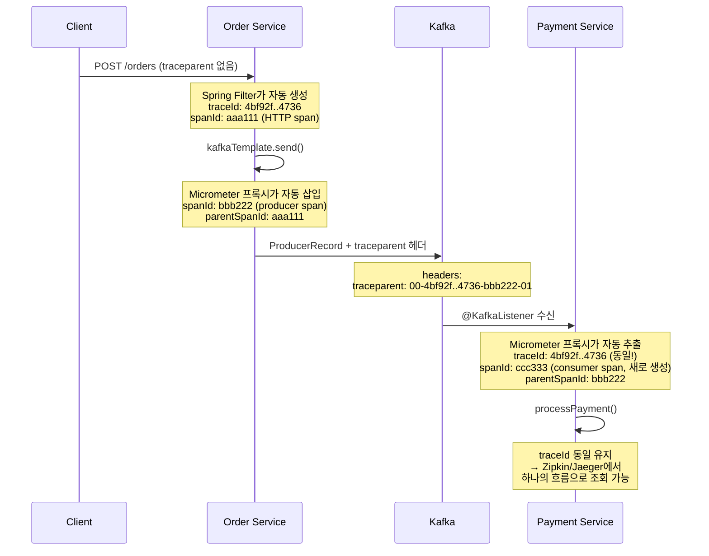
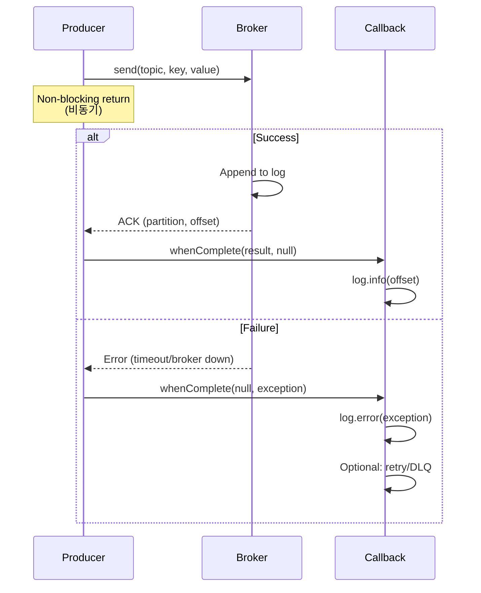
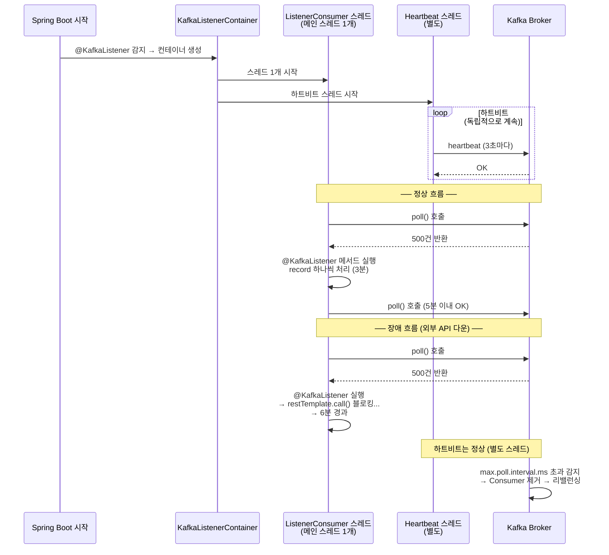
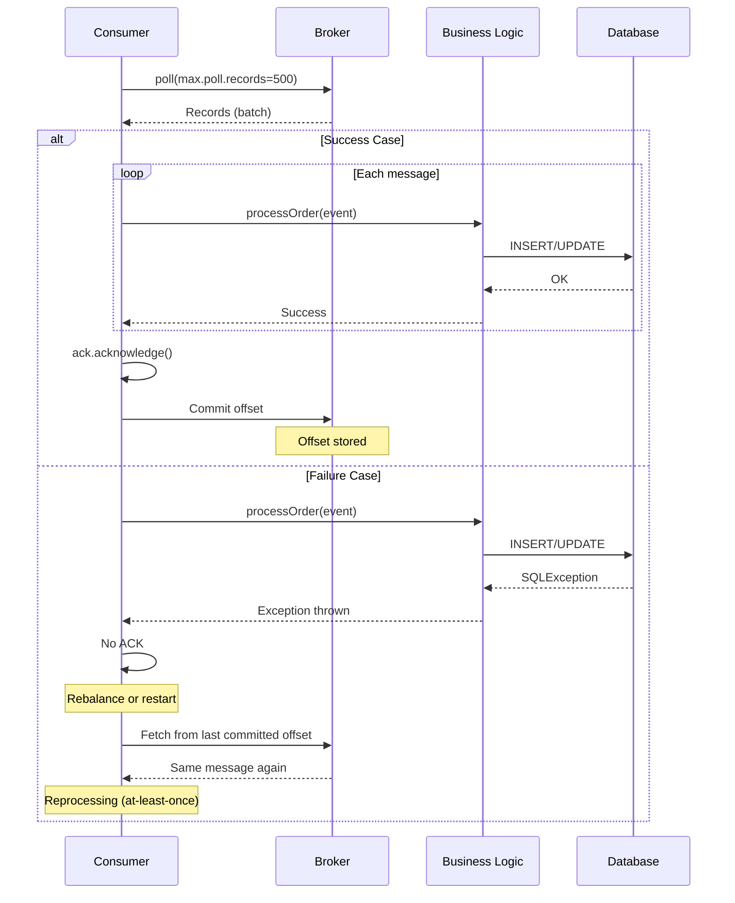

# 03. Producer & Consumer

Producer/Consumer 구현 패턴 및 베스트 프랙티스

---

## Producer 구현

Producer는 메시지를 Kafka 브로커로 전송하는 컴포넌트다. 전송 방식은 크게 비동기와 동기로 나뉘며, 각각 다른 트레이드오프를 가진다.

### 비동기 vs 동기 전송 선택 기준

**비동기 전송 (Async)**은 높은 처리량(throughput)이 필요한 경우 사용한다. `send()` 호출 즉시 반환되므로 호출 스레드가 블록되지 않는다. 로그 수집, 이벤트 스트리밍처럼 개별 메시지 손실이 치명적이지 않고, 대량의 메시지를 빠르게 전송해야 할 때 적합하다. 실패는 콜백으로 처리하며, 필요시 재시도 로직을 추가할 수 있다.

**동기 전송 (Sync)**은 신뢰성(reliability)이 우선인 경우 사용한다. `get()`으로 결과를 기다리므로 전송 성공/실패를 즉시 알 수 있다. 결제, 주문 생성처럼 메시지 손실이 허용되지 않고, 후속 로직이 전송 성공 여부에 의존하는 경우 적합하다. 대신 처리량은 크게 떨어진다 (환경에 따라 비동기 대비 수십 배 이상 차이가 발생할 수 있다).

대부분의 경우 비동기 전송을 사용하되, 콜백에서 실패를 로깅하거나 재시도하는 방식으로 신뢰성을 확보한다. 동기 전송은 정말 필요한 곳에만 제한적으로 사용해야 한다.

### "비동기 콜백이 있는데 동기 전송이 왜 필요한가?"

동기든 비동기든 브로커에 메시지가 도착하는 것까지만 확인한다. Consumer 처리 여부는 모른다. 비동기에도 실패 콜백이 있다. 그런데도 동기 전송이 필요한 이유는 **후속 로직이 전송 결과에 의존하는 경우** 때문이다.

비동기 전송의 콜백은 나중에 호출된다. `send()` 호출 직후 코드는 이미 다음 줄로 넘어간 상태다.

```java
// 비동기: send() 즉시 반환 → 브로커에 도착했는지 모르는 상태에서 응답
kafkaTemplate.send("orders", event);
return ResponseEntity.ok("주문 완료");  // 메시지 손실 가능성 존재

// 동기: 브로커 확인까지 대기 → 확실히 도착한 후 응답
kafkaTemplate.send("orders", event).get(10, TimeUnit.SECONDS);
return ResponseEntity.ok("주문 완료");  // 전송 성공이 보장된 상태
```

동기 전송이 필요한 구체적 시나리오는 세 가지다.

**1. API 응답이 전송 성공에 의존하는 경우.** 사용자가 "주문하기"를 눌렀을 때, 메시지가 브로커에 도착하지 못했으면 "주문 실패"를 응답해야 한다. 비동기로 보내면 일단 "주문 완료"를 응답하고, 나중에 콜백에서 실패를 발견한다. 이미 사용자에게 "완료"라고 응답한 뒤이므로 되돌릴 수 없다.

**2. 순서 의존적 전송.** 메시지 A가 반드시 브로커에 도착한 후에 메시지 B를 보내야 하는 경우다. 비동기로 A, B를 연속 전송하면 A가 실패하고 B만 성공할 수 있다.

**3. 트랜잭션 경계 내 전송.** DB 트랜잭션과 메시지 전송을 묶어야 할 때, 메시지 전송 실패 시 DB도 롤백해야 한다. 비동기 콜백 시점에는 이미 트랜잭션이 커밋된 후다.

| 상황 | 비동기 + 콜백 | 동기 |
|------|-------------|------|
| 호출자에게 성공/실패 전달 | 불가능 (이미 반환됨) | 가능 |
| 실패 시 즉시 보상 로직 | 콜백에서 처리 (컨텍스트 분리) | try-catch로 같은 흐름에서 처리 |
| 코드 흐름의 인과관계 | 끊어짐 | 유지됨 |

결론적으로, **"전송 결과를 기다려야 다음 행동을 결정할 수 있는 경우"**에 동기 전송을 쓴다. 콜백은 실패를 감지할 수 있지만, 그 시점에 원래 호출 흐름으로 돌아갈 수 없다는 것이 근본적 한계다.

### 기본 Producer

```java
@Component
@RequiredArgsConstructor
@Slf4j
public class OrderProducer {

    private final KafkaTemplate<String, OrderEvent> kafkaTemplate;

    public CompletableFuture<SendResult<String, OrderEvent>> send(OrderEvent event) {
        return kafkaTemplate.send("orders", event.getOrderId(), event)
            .whenComplete((result, ex) -> {
                if (ex != null) {
                    log.error("Failed to send message: {}", event.getOrderId(), ex);
                } else {
                    log.info("Sent message: topic={}, partition={}, offset={}",
                        result.getRecordMetadata().topic(),
                        result.getRecordMetadata().partition(),
                        result.getRecordMetadata().offset());
                }
            });
    }
}
```

### 동기 전송 (결과 대기)

```java
public void sendSync(OrderEvent event) {
    try {
        SendResult<String, OrderEvent> result =
            kafkaTemplate.send("orders", event.getOrderId(), event)
                .get(10, TimeUnit.SECONDS);  // 타임아웃

        log.info("Message sent: offset={}", result.getRecordMetadata().offset());
    } catch (InterruptedException e) {
        Thread.currentThread().interrupt();  // 인터럽트 상태 복구
        throw new MessageSendException("Failed to send message", e);
    } catch (ExecutionException | TimeoutException e) {
        throw new MessageSendException("Failed to send message", e);
    }
}
```

### SendResult 객체 구조

`KafkaTemplate.send()`의 반환 타입은 `CompletableFuture<SendResult<K, V>>`이다. `SendResult`는 전송 요청과 결과를 모두 담고 있는 래퍼 객체로, Producer 테스트와 디버깅에서 핵심적으로 사용된다.

`SendResult`는 두 가지 핵심 필드를 가진다.

**ProducerRecord** — Producer가 브로커에 **보낸 원본 메시지**다. `getProducerRecord()`로 접근한다. 전송 요청 시점의 정보를 담고 있으므로 "내가 무엇을 보냈는지" 확인할 때 사용한다.

| 메서드 | 반환 타입 | 설명 |
|--------|----------|------|
| `topic()` | String | 전송 대상 토픽 |
| `key()` | K | 메시지 키 |
| `value()` | V | 메시지 본문 |
| `partition()` | Integer | 지정한 파티션 (null이면 자동 할당) |
| `timestamp()` | Long | 지정한 타임스탬프 (null이면 브로커가 설정) |
| `headers()` | Headers | 커스텀 헤더 |

**RecordMetadata** — 브로커가 **실제로 저장한 결과**다. `getRecordMetadata()`로 접근한다. 브로커가 메시지를 어디에 저장했는지 확인할 때 사용한다.

| 메서드 | 반환 타입 | 설명 |
|--------|----------|------|
| `topic()` | String | 저장된 토픽 |
| `partition()` | int | 저장된 파티션 번호 |
| `offset()` | long | 파티션 내 오프셋 |
| `timestamp()` | long | 브로커가 기록한 타임스탬프 |
| `serializedKeySize()` | int | 직렬화된 키 크기 (bytes) |
| `serializedValueSize()` | int | 직렬화된 값 크기 (bytes) |

두 객체의 차이를 이해하면 테스트에서 무엇을 검증해야 하는지 명확해진다.

```java
SendResult<String, OrderEvent> result = future.get(10, TimeUnit.SECONDS);

// "내가 보낸 것" 검증
assertThat(result.getProducerRecord().key()).isEqualTo("ORD-001");
assertThat(result.getProducerRecord().value().getOrderId()).isEqualTo("ORD-001");

// "브로커가 저장한 결과" 검증
assertThat(result.getRecordMetadata().topic()).isEqualTo("chapter2.orders");
assertThat(result.getRecordMetadata().partition()).isGreaterThanOrEqualTo(0);
assertThat(result.getRecordMetadata().offset()).isGreaterThanOrEqualTo(0);
```

`ProducerRecord.partition()`이 `null`이면 파티셔너가 키 해시 기반으로 파티션을 결정한다. 이 경우 실제 저장된 파티션은 `RecordMetadata.partition()`에서만 확인 가능하다. 즉 "어디에 보내달라고 요청했는가"와 "실제로 어디에 저장되었는가"는 다를 수 있으며, 이 차이를 `SendResult` 하나로 모두 확인할 수 있다.

### 파티션 지정 전송

기본적으로 Kafka는 메시지 키의 해시값으로 파티션을 자동 결정한다. 대부분의 경우 이 방식으로 충분하지만, 파티션을 직접 지정해야 하는 경우가 있다.

**1. 우선순위 처리.** 파티션 0을 "긴급 주문 전용"으로 할당하고, 해당 파티션만 처리하는 Consumer를 별도로 띄우면 우선순위 큐를 구현할 수 있다. 키 해시 기반 분배로는 특정 파티션에 의도적으로 메시지를 몰아넣을 수 없다.

**2. 데이터 지역성(Data Locality).** 특정 Consumer가 로컬 캐시나 상태를 유지하고 있을 때, 관련 메시지를 해당 Consumer가 담당하는 파티션으로 보내면 캐시 히트율이 높아진다.

**3. Hot Partition 회피.** 키 해시가 특정 파티션에 몰리는 경우, 수동으로 분산시킬 수 있다.

단, 파티션을 직접 지정하면 파티션 수 변경 시 코드도 함께 수정해야 하므로 유지보수 부담이 생긴다. 특별한 이유가 없다면 키 기반 자동 분배를 사용하는 것이 바람직하다.

```java
public void sendToPartition(OrderEvent event, int partition) {
    kafkaTemplate.send("orders", partition, event.getOrderId(), event);
}
```

### 헤더 포함 전송

Kafka 헤더는 HTTP 헤더와 비슷한 역할을 한다. 메시지 본문(value)을 건드리지 않고 메타데이터를 전달하는 수단이다. 헤더가 필요한 이유는 **메시지 본문과 메타데이터의 관심사를 분리**하기 위해서다.

**1. 라우팅/필터링 정보.** Consumer가 메시지를 역직렬화하기 전에 헤더만 보고 처리 여부를 결정할 수 있다. 예를 들어 `X-Priority: high` 헤더가 있는 메시지만 우선 처리하는 식이다. 본문을 파싱하지 않으므로 불필요한 역직렬화 비용을 줄인다.

**2. 추적/관측성.** `correlationId`, `traceId` 같은 분산 추적 정보를 헤더에 넣으면, 모든 서비스가 동일한 이벤트 스키마를 공유하지 않아도 요청 흐름을 추적할 수 있다. Spring Cloud Sleuth/Micrometer Tracing이 이 방식을 사용한다.

**3. 스키마 호환성 유지.** 메타데이터를 본문에 넣으면 Avro 스키마를 변경해야 한다. 스키마 변경은 호환성 검증이 필요하고 모든 Consumer에 영향을 준다. 헤더에 넣으면 스키마 변경 없이 메타데이터를 확장할 수 있다.

```java
public void sendWithHeaders(OrderEvent event, Map<String, String> headers) {
    ProducerRecord<String, OrderEvent> record =
        new ProducerRecord<>("orders", event.getOrderId(), event);

    headers.forEach((key, value) ->
        record.headers().add(key, value.getBytes(StandardCharsets.UTF_8)));

    kafkaTemplate.send(record);
}
```

### 자동 헤더 주입

매번 수동으로 헤더를 넣는 것은 번거롭고, 누락 위험이 있다. `traceId`, 서비스명 같은 공통 헤더는 자동으로 주입하는 것이 바람직하다.

Kafka가 제공하는 `ProducerInterceptor`는 `send()` 호출 시 모든 메시지에 자동 적용된다. 등록 방식은 두 가지이며, Spring DI 사용 여부가 달라진다.

> **MDC (Mapped Diagnostic Context)**: SLF4J/Logback이 제공하는 스레드 로컬 키-값 저장소다. HTTP 요청 진입 시 Filter에서 `MDC.put("traceId", value)`로 넣어두면, 같은 스레드의 어디서든 `MDC.get("traceId")`로 꺼내 쓸 수 있다. 메서드 파라미터로 `traceId`를 계속 전달하지 않아도 되는 것이 핵심이다.

**방법 1-A: interceptor.classes (Kafka 네이티브)**

YAML에 클래스명을 등록하면 Kafka가 직접 인스턴스를 생성한다. Spring 컨텍스트와 독립적이므로 `@Value`, `@Autowired` 같은 DI를 사용할 수 없고, `configure(Map)` 메서드로 전달되는 Producer 설정값만 접근 가능하다.

```java
public class CommonHeaderInterceptor implements ProducerInterceptor<String, Object> {

    @Override
    public ProducerRecord<String, Object> onSend(ProducerRecord<String, Object> record) {
        record.headers().add("X-Service-Name",
            "order-service".getBytes(StandardCharsets.UTF_8));
        record.headers().add("X-Sent-At",
            Instant.now().toString().getBytes(StandardCharsets.UTF_8));

        // MDC에서 traceId 가져오기 (분산 추적)
        String traceId = MDC.get("traceId");
        if (traceId != null) {
            record.headers().add("X-Trace-Id",
                traceId.getBytes(StandardCharsets.UTF_8));
        }
        return record;
    }

    @Override
    public void onAcknowledgement(RecordMetadata metadata, Exception exception) {}
    @Override
    public void close() {}
    @Override
    public void configure(Map<String, ?> configs) {}
}
```

메트릭 수집용 인터셉터를 별도로 만들면 관심사를 분리할 수 있다.

```java
public class MetricsInterceptor implements ProducerInterceptor<String, Object> {

    @Override
    public ProducerRecord<String, Object> onSend(ProducerRecord<String, Object> record) {
        record.headers().add("X-Produced-At",
            String.valueOf(System.currentTimeMillis()).getBytes(StandardCharsets.UTF_8));
        return record;
    }

    @Override
    public void onAcknowledgement(RecordMetadata metadata, Exception exception) {
        // 전송 성공/실패 메트릭 수집 (Micrometer 등)
    }

    @Override
    public void close() {}
    @Override
    public void configure(Map<String, ?> configs) {}
}
```

인터셉터는 쉼표로 구분하여 여러 개를 등록할 수 있다. **등록 순서대로 체이닝**되며, 앞 인터셉터의 결과가 다음 인터셉터의 입력이 된다.

```yaml
spring:
  kafka:
    producer:
      properties:
        interceptor.classes: >
          com.study.redpanda.interceptor.CommonHeaderInterceptor,
          com.study.redpanda.interceptor.MetricsInterceptor
```

```
send() 호출
  → CommonHeaderInterceptor.onSend()  # X-Service-Name, X-Trace-Id 추가
  → MetricsInterceptor.onSend()       # X-Produced-At 추가
  → 브로커로 전송
```

**방법 1-B: setProducerInterceptor() (Spring Kafka 2.8+)**

같은 `ProducerInterceptor`를 Spring 빈으로 등록하고 `KafkaTemplate`에 직접 설정하는 방식이다. Kafka가 아닌 Spring이 인스턴스를 관리하므로 `@Value`, `@Autowired` 같은 DI를 자유롭게 쓸 수 있다.

```java
@Component
public class CommonHeaderInterceptor implements ProducerInterceptor<String, Object> {

    @Value("${spring.application.name}")
    private String serviceName;  // Spring DI 사용 가능

    @Override
    public ProducerRecord<String, Object> onSend(ProducerRecord<String, Object> record) {
        Headers headers = record.headers();
        if (headers.lastHeader("X-Service-Name") == null) {
            headers.add("X-Service-Name", serviceName.getBytes(StandardCharsets.UTF_8));
        }
        if (headers.lastHeader("X-Sent-At") == null) {
            headers.add("X-Sent-At", Instant.now().toString().getBytes(StandardCharsets.UTF_8));
        }
        return record;
    }

    @Override public void onAcknowledgement(RecordMetadata m, Exception e) {}
    @Override public void close() {}
    @Override public void configure(Map<String, ?> configs) {}
}

@Configuration
public class KafkaProducerConfig {

    @Bean
    public KafkaTemplate<String, Object> kafkaTemplate(
            ProducerFactory<String, Object> pf,
            CommonHeaderInterceptor headerInterceptor) {

        KafkaTemplate<String, Object> template = new KafkaTemplate<>(pf);
        template.setProducerInterceptor(headerInterceptor);
        return template;
    }
}
```

다중 인터셉터가 필요하면 `CompositeProducerInterceptor`(Spring Kafka 3.x)로 체이닝한다. 리스트 순서가 곧 실행 순서다.

```java
CompositeProducerInterceptor<String, Object> composite =
    new CompositeProducerInterceptor<>(headerInterceptor, metricsInterceptor);
template.setProducerInterceptor(composite);
```

> **주의**: `interceptor.classes`(방법 1-A)와 `setProducerInterceptor()`(방법 1-B)를 동시에 사용하면 인터셉터가 이중 실행된다. 반드시 하나만 선택할 것.

**방법 2: KafkaTemplate 래퍼**

이벤트별로 다른 헤더를 지정해야 하거나, 조건부 로직이 필요한 경우 KafkaTemplate을 감싸는 래퍼를 만든다. 인터셉터와 달리 호출부에서 헤더를 유연하게 제어할 수 있다.

```java
@Component
@RequiredArgsConstructor
public class EnhancedKafkaTemplate {

    private final KafkaTemplate<String, Object> kafkaTemplate;

    public CompletableFuture<SendResult<String, Object>> send(
            String topic, String key, Object value) {

        ProducerRecord<String, Object> record = new ProducerRecord<>(topic, key, value);

        // 공통 헤더 자동 추가
        record.headers().add("X-Service-Name",
            "order-service".getBytes(StandardCharsets.UTF_8));
        record.headers().add("X-Correlation-Id",
            UUID.randomUUID().toString().getBytes(StandardCharsets.UTF_8));

        return kafkaTemplate.send(record);
    }
}
```

**방법 3: Micrometer Tracing (제로 코드)**

Spring Boot 3.x + Micrometer Tracing 의존성만 추가하면, `traceId`와 `spanId`가 모든 Kafka 메시지 헤더에 자동 주입된다. 코드 변경이 전혀 없다.

```groovy
// build.gradle
implementation 'io.micrometer:micrometer-tracing-bridge-brave'
implementation 'org.springframework.kafka:spring-kafka'  // 자동 계측 포함
```

**동작 원리**: Spring Boot 자동 설정이 `KafkaTemplate`과 `@KafkaListener`에 Tracing 프록시를 감싼다. Producer가 `send()`를 호출하면 프록시가 현재 trace context에서 `traceId`와 `spanId`를 추출하여 `traceparent` 헤더에 자동 삽입한다. Consumer 쪽에서는 `@KafkaListener` 진입 시 `traceparent` 헤더를 읽어 같은 trace context를 복원한다. 개발자가 작성하는 비즈니스 코드에는 아무런 변경이 없다.

**`traceparent` 헤더 형식 (W3C Trace Context 표준)**:

```
traceparent: {version}-{traceId}-{spanId}-{traceFlags}

실제 예시:
traceparent: 00-4bf92f3577b34da6a3ce929d0e0e4736-00f067aa0ba902b7-01
             │   │                                │                  │
             │   │                                │                  └─ 01 = 샘플링됨
             │   │                                └─ spanId (8바이트, 16진수)
             │   └─ traceId (16바이트, 16진수)
             └─ 버전 (항상 00)
```

- **traceId**: 전체 요청 흐름을 식별하는 고유 ID. HTTP 요청 → Order Service → Kafka → Payment Service까지 동일한 값이 유지된다.
- **spanId**: 하나의 작업 단위(span)를 식별한다. Order Service가 Kafka로 보내는 것은 하나의 span, Payment Service가 받아서 처리하는 것은 또 다른 span이다.
- **traceFlags**: `01`이면 이 trace가 수집 대상(sampled)임을 의미한다.

**Kafka 메시지에 실제로 들어가는 모습**:

```
ProducerRecord {
  topic: "orders"
  key: "ORD-001"
  value: OrderEvent { orderId="ORD-001", productName="상품A", ... }
  headers: [
    traceparent: "00-4bf92f3577b34da6a3ce929d0e0e4736-00f067aa0ba902b7-01"
  ]
}
```

**서비스 간 trace 전파 흐름**:



`traceId`와 `spanId`는 클라이언트가 만드는 것이 아니다. 요청을 최초로 받은 서버(여기서는 Order Service)의 Spring Boot Filter가 자동 생성한다. 클라이언트가 `traceparent` 헤더를 보내는 경우(API Gateway → 서비스 체인)에는 기존 traceId를 이어받고, 없으면 새로 만든다.

`traceId`가 동일하므로 Zipkin, Jaeger 같은 추적 도구에서 HTTP 요청부터 Kafka를 거쳐 최종 처리까지 하나의 흐름으로 조회할 수 있다.

| 방법 | Spring DI | 코드 변경 | 적합한 경우 |
|------|----------|----------|------------|
| interceptor.classes (1-A) | 불가 | YAML 설정 | Spring 불필요한 단순 헤더 |
| setProducerInterceptor (1-B) | 가능 | @Bean 설정 | DI 필요한 공통 헤더 |
| KafkaTemplate 래퍼 (2) | 가능 | 래퍼 클래스 | 이벤트별 동적 헤더 |
| Micrometer Tracing (3) | 자동 | 없음 | 분산 추적 (traceId, spanId) |

### Producer 전송 플로우



---

## Consumer 구현

Consumer는 Kafka 토픽에서 메시지를 가져와 처리하는 컴포넌트다. 단일 메시지 처리와 배치 처리, 그리고 ACK(acknowledgment) 방식에 따라 다양한 패턴이 존재한다.

### 단일 vs 배치 Consumer 선택 기준

**단일 메시지 Consumer**는 메시지당 처리 시간이 길거나 불규칙한 경우 사용한다. 각 메시지를 독립적으로 처리하므로 실패 시 해당 메시지만 재시도하면 된다. DB 쓰기, 외부 API 호출처럼 I/O 바운드 작업에 적합하다. 코드가 직관적이고 디버깅이 쉽다는 장점이 있다.

**배치 Consumer**는 메시지당 처리 시간이 짧고 일정한 경우 사용한다. 여러 메시지를 한 번에 가져와 일괄 처리하므로 네트워크 오버헤드가 줄고 처리량이 증가한다. 로그 집계, 메트릭 수집처럼 CPU 바운드 작업이나 배치 DB insert에 적합하다. 단, 배치 중 하나라도 실패하면 전체를 재시도해야 하므로 실패율이 높은 작업에는 부적합하다.

기준은 **메시지당 처리 시간**이다. 10ms 이하라면 배치(500~1000건), 100ms 이상이라면 단일 메시지 처리를 고려한다.

### 수동 ACK를 사용하는 이유

Kafka는 **at-least-once** 전달 보장을 제공한다. 메시지는 최소 한 번 전달되지만, 중복이 발생할 수 있다는 의미다. 수동 ACK는 이 보장을 구현하는 핵심 메커니즘이다.

자동 커밋(`enable.auto.commit=true`)을 사용하면 `auto.commit.interval.ms` 주기(기본 5초)마다 poll 루프에서 주기적으로 offset이 커밋된다. 메시지를 가져오는 즉시 커밋하는 것이 아니라, poll 호출 시점에 이전 batch의 offset을 일괄 커밋하는 방식이다. 처리 완료 여부와 무관하게 커밋이 일어나므로 처리 중 예외가 발생하면 메시지가 "처리됨"으로 기록되어 재처리되지 않는다. 즉, 메시지 손실이 발생한다.

수동 ACK를 사용하면 처리 성공 후에만 `ack.acknowledge()`를 호출한다. 예외 발생 시 ACK를 하지 않으므로, Consumer 재시작 시 같은 메시지를 다시 가져온다(reprocessing). 이것이 at-least-once 보장의 핵심이다. 대신 멱등성(idempotency) 처리가 필수다.

### Consumer Group Rebalancing의 영향

Consumer Group은 여러 Consumer가 파티션을 나눠 가져가는 단위다. Consumer가 추가/제거되거나, 일정 시간 heartbeat를 보내지 못하면 **rebalancing**이 발생한다.

Rebalancing 중에는 모든 Consumer가 메시지 처리를 멈춘다. 파티션 재할당이 완료되면 각 Consumer는 마지막 커밋된 offset부터 다시 시작한다. 만약 처리 중이던 메시지가 ACK되지 않았다면, 다른 Consumer가 해당 메시지를 다시 처리한다(중복 발생).

Rebalancing을 최소화하려면 `max.poll.interval.ms`보다 빠르게 처리를 완료해야 한다. 배치 크기(`max.poll.records`)가 너무 크면 처리 시간이 길어져 rebalancing이 자주 발생하므로, 배치 크기와 처리 시간의 곱이 이 값보다 작아야 한다.

> **Static Membership 예외**: `group.instance.id`를 설정하면 Consumer가 static member가 된다. 이 경우 `max.poll.interval.ms`를 초과해도 즉시 리밸런싱이 발생하지 않고, `session.timeout.ms` 만료까지 기다린다. Consumer 재시작 시에도 같은 파티션을 재할당받으므로 불필요한 리밸런싱을 줄일 수 있다. 면접에서 리밸런싱을 설명할 때 이 예외를 함께 언급하면 깊이를 보여줄 수 있다.

### Consumer의 Pull 모델: poll()

Kafka Consumer는 **Pull 모델**이다. 브로커가 Consumer에게 메시지를 밀어넣는(Push) 것이 아니라, Consumer가 `poll()`을 호출하여 능동적으로 메시지를 당겨온다.

```java
while (true) {
    ConsumerRecords<K, V> records = consumer.poll(Duration.ofMillis(1000));
    for (ConsumerRecord<K, V> record : records) {
        process(record);
    }
}
```

`poll()`은 단순한 메시지 fetch가 아니다. 한 번의 호출에서 네 가지 일이 일어난다.

| 역할 | 설명 |
|------|------|
| 메시지 fetch | 브로커에서 레코드를 가져옴 |
| liveness 신호 | poll 간격으로 처리 진행 여부를 판단하는 기준 (`max.poll.interval.ms`) |
| 리밸런싱 참여 | 그룹 코디네이터와 통신 |
| 오프셋 커밋 | `enable.auto.commit=true`면 `auto.commit.interval.ms` 주기(기본 5초)에 따라 poll 루프 내에서 커밋 |

> **참고**: KIP-62 이후 하트비트는 별도 백그라운드 스레드가 전송한다. poll()은 하트비트를 직접 보내지 않지만, poll 간격 자체가 Consumer의 liveness를 판단하는 기준이 된다.

Kafka가 Push(RabbitMQ 기본)가 아닌 Pull을 선택한 이유는 **Consumer마다 처리 속도가 다르기 때문**이다. Pull 모델에서는 빠른 Consumer는 빠르게, 느린 Consumer는 느리게 자기 페이스로 가져간다. Backpressure가 자연스럽게 해결된다.

### Spring Boot의 Consumer 스레드 모델

Spring Boot에서 `@KafkaListener`는 **poll()과 같은 스레드**에서 실행된다. 이것이 리밸런싱 문제의 근본 원인이다. `concurrency=3`이면 ListenerConsumer 스레드가 3개 생기지만, 각 스레드 내에서는 여전히 poll()과 listener가 순차 실행된다.

```
[ListenerConsumer 스레드 (concurrency 수만큼)]
while (true) {
    records = consumer.poll(1000);   // ① fetch
    for (record : records) {
        handle(record);              // ② @KafkaListener 메서드 실행 (같은 스레드!)
    }
}

[Heartbeat 스레드 (Kafka client 내부, KIP-62)]
→ session.timeout.ms 용도로 브로커에 주기적 heartbeat 전송
```

**KIP-62 이전**(옛날 Kafka)에는 Heartbeat도 poll() 스레드에서 보냈다. 처리가 느리면 Heartbeat도 안 보내져서 `session.timeout.ms`로만 판단했다. KIP-62에서 Heartbeat를 별도 스레드로 분리하면서, **"프로세스는 살아있지만 처리가 멈춘 상태"**를 잡기 위해 `max.poll.interval.ms`가 추가되었다.

```
메인 스레드:      poll() → @KafkaListener 6분 블로킹... → poll() 못 함
하트비트 스레드:   heartbeat heartbeat heartbeat (계속 보냄, 정상)

session.timeout.ms (45초)  → 하트비트 살아있음 → 통과
max.poll.interval.ms (5분) → poll 간격 초과   → 리밸런싱!
```

Spring Boot에서의 전체 동작 흐름:



이 구조 때문에 `@KafkaListener` 메서드가 블로킹되면 poll()도 멈추고, 리밸런싱이 발생한다. 아래의 Circuit Breaker와 Consumer Pause는 모두 **"poll() 루프를 멈추지 않는 것"**이 목적이다.

| 대응 전략 | poll()과의 관계 |
|----------|----------------|
| Circuit Breaker | 블로킹 시간 제거 → poll() 간격 정상 유지 |
| Consumer Pause | 메시지 fetch 중단 → poll()은 빈 결과로 계속 호출 |
| 아무 대응 없음 | 처리 블로킹 → poll() 지연 → 리밸런싱 |

#### 애플리케이션 로직 지연의 대표적 원인

위의 스레드 모델에서 본 것처럼, `@KafkaListener` 메서드가 블로킹되면 poll() 간격이 `max.poll.interval.ms`를 초과하여 리밸런싱이 발생한다. 대표적인 원인은 다음과 같다.

- **외부 API 타임아웃**: 결제/알림 API 응답 지연 (가장 흔함)
- **DB 락 대기**: 비관적 락, 데드락으로 인한 스레드 블로킹
- **느린 쿼리**: 인덱스 미사용, 대량 데이터 조회
- **GC Pause**: Full GC로 인한 Stop-the-World
- **DefaultErrorHandler의 긴 BackOff 누적**: `ExponentialBackOff`의 총 대기 시간이 `max.poll.interval.ms`를 초과

#### 미들웨어 장애 시 리밸런싱은 무의미하다

리밸런싱은 **"이 Consumer가 문제"**일 때 의미가 있다. **"모든 Consumer가 의존하는 인프라(DB, 외부 API)가 문제"**일 때는 다른 Consumer로 재배정해도 같은 장애를 겪으므로 효과가 없다. 오히려 악화된다.

```
[미들웨어 장애 + 리밸런싱 = 연쇄 폭풍]

Consumer A: 파티션 0,1,2 담당
  → 결제 API 다운 → 처리 지연 → max.poll.interval.ms 초과 → 리밸런싱

Consumer B: 파티션 0,1,2 재할당
  → 같은 API 호출 → 똑같이 블록 → 또 리밸런싱

Consumer C: 재할당 → 같은 결과 → 또 리밸런싱...

→ 리밸런싱 폭풍 (Rebalance Storm)
→ 리밸런싱 중 전체 Consumer Group 일시 정지
→ 하나의 API 장애가 전체 Kafka Consumer로 전파
```

| 장애 유형 | 리밸런싱 효과 | 올바른 대응 |
|----------|-------------|-----------|
| Consumer 프로세스 죽음 | **효과 있음** | 리밸런싱이 정답 |
| 특정 Consumer만 느림 (메모리 등) | **효과 있음** | 리밸런싱이 정답 |
| 미들웨어 장애 (DB, 외부 API) | **효과 없음, 악화** | Circuit Breaker, Consumer Pause |

**대응 1: Circuit Breaker — 실패하는 호출을 차단**

```java
@KafkaListener(topics = "orders")
public void consume(OrderEvent event) {
    // Resilience4j: 연속 5회 실패 → OPEN → API 호출 안 하고 즉시 예외
    // → DefaultErrorHandler가 빠르게 DLT로 전송 → poll() 간격 초과 방지
    CircuitBreaker cb = circuitBreakerRegistry.circuitBreaker("payment");
    cb.executeSupplier(() -> paymentApi.charge(event));
}
```

Circuit Breaker가 OPEN이면 API를 호출하지 않고 즉시 예외를 던진다. 처리 시간이 밀리초 수준으로 줄어들어 `max.poll.interval.ms`를 초과하지 않는다.

```
[Circuit Breaker OPEN 상태에서의 poll() 루프]
poll() → @KafkaListener → paymentApi.charge()
       → Circuit OPEN → 즉시 CallNotPermittedException (0ms, 블로킹 없음)
       → DefaultErrorHandler → BackOff/재시도 정책에 따라 처리 (최종적으로 DLT 전송)
       → 다음 record → ... → poll() 간격 유지
```

> Circuit Breaker 예외가 즉시 DLT로 가는 것은 아니다. `DefaultErrorHandler`의 BackOff 설정에 따라 재시도가 먼저 일어날 수 있다. 다만 Circuit Breaker가 OPEN인 동안 재시도해도 즉시 실패하므로, 결과적으로 빠르게 DLT에 도달한다. `addNotRetryableExceptions(CallNotPermittedException.class)`를 설정하면 재시도 없이 즉시 DLT로 보낼 수 있다.

**대응 2: Consumer Pause — 메시지를 가져오지 않기**

```java
@Component
@RequiredArgsConstructor
public class ConsumerPauseManager {

    private final KafkaListenerEndpointRegistry registry;

    // 미들웨어 장애 감지 시
    public void pauseAll() {
        registry.getListenerContainers()
            .forEach(MessageListenerContainer::pause);
        // pause: poll()은 호출되지만 레코드를 가져오지 않음
        // → Heartbeat, poll 간격 유지 → 리밸런싱 없음
    }

    // 복구 시
    public void resumeAll() {
        registry.getListenerContainers()
            .forEach(MessageListenerContainer::resume);
    }
}
```

`pause()`는 Kafka Client 레벨의 `consumer.pause(partitions)`를 호출한다. **poll()은 계속 호출되지만 pause된 파티션에서는 fetch를 하지 않는다.** 파티션 할당은 그대로 유지된다.

```
[pause 전]
poll() → 500건 반환 → @KafkaListener 처리 → poll() → 500건 → ...

[pause 후]
poll() → 0건 반환 → @KafkaListener 호출 안 됨 → poll() → 0건 → ...
         ↑ 브로커에서 fetch 안 하지만 poll() 자체는 계속 호출
         → max.poll.interval.ms 초과 안 됨, 하트비트도 계속
         → 리밸런싱 없음, 파티션 소유권 유지
```

| | pause() | stop() | 아무 대응 없음 |
|---|---------|--------|--------------|
| poll() 호출 | 계속 | 중단 | 블로킹 (못 함) |
| 파티션 소유권 | **유지** | 반납 (리밸런싱) | 타임아웃 후 반납 |
| 복구 후 | resume()로 즉시 재개 | start()로 재시작 (리밸런싱 필요) | 리밸런싱 후 재할당 |
| 복구 속도 | **즉시** (밀리초) | 느림 (리밸런싱 대기) | 느림 |

**실무 패턴: Circuit Breaker 상태와 연동**

문서 위 코드는 메커니즘만 보여준다. 실무에서는 Circuit Breaker 상태 전이 이벤트와 연동하여 자동으로 pause/resume한다.

```java
@PostConstruct
public void init() {
    CircuitBreaker cb = cbRegistry.circuitBreaker("payment");
    cb.getEventPublisher()
        .onStateTransition(event -> {
            switch (event.getStateTransition()) {
                case CLOSED_TO_OPEN, HALF_OPEN_TO_OPEN -> pauseAll();
                case OPEN_TO_HALF_OPEN, HALF_OPEN_TO_CLOSED -> resumeAll();
            }
        });
}
```

**특정 리스너만 pause하기**

결제 API가 다운되었는데 알림 Consumer까지 멈출 필요는 없다. `@KafkaListener`의 `id`로 특정 리스너만 제어할 수 있다.

```java
public void pauseListener(String listenerId) {
    MessageListenerContainer container = registry.getListenerContainer(listenerId);
    if (container != null) container.pause();
}

@KafkaListener(id = "order-listener", topics = "orders")
public void consume(OrderEvent event) { ... }

// 주문 Consumer만 pause
pauseListener("order-listener");
```

### 기본 Consumer

```java
@Component
@Slf4j
public class OrderConsumer {

    @KafkaListener(topics = "orders", groupId = "order-service")
    public void consume(OrderEvent event, Acknowledgment ack) {
        try {
            log.info("Received: {}", event.getOrderId());
            processOrder(event);
            ack.acknowledge();  // 수동 ACK
        } catch (Exception e) {
            log.error("Failed to process: {}", event.getOrderId(), e);
            // ACK 안 함 → 재시도
        }
    }

    private void processOrder(OrderEvent event) {
        // 비즈니스 로직
    }
}
```

### 메타데이터 접근

```java
@KafkaListener(topics = "orders", groupId = "order-service")
public void consumeWithMetadata(
    @Payload OrderEvent event,
    @Header(KafkaHeaders.RECEIVED_TOPIC) String topic,
    @Header(KafkaHeaders.RECEIVED_PARTITION) int partition,
    @Header(KafkaHeaders.OFFSET) long offset,
    @Header(KafkaHeaders.RECEIVED_TIMESTAMP) long timestamp,
    Acknowledgment ack
) {
    log.info("Received: topic={}, partition={}, offset={}, timestamp={}",
        topic, partition, offset, timestamp);

    processOrder(event);
    ack.acknowledge();
}
```

커스텀 헤더나 `traceparent` 같은 분산 추적 헤더도 `@Header`로 조회할 수 있다. 해당 헤더가 없을 수 있는 경우 `required = false`로 설정하면 NPE를 방지할 수 있다.

```java
@KafkaListener(topics = "orders", groupId = "order-service")
public void consumeWithTracing(
    @Payload OrderEvent event,
    @Header(value = "traceparent", required = false) byte[] traceparent,
    @Header(value = "X-Service-Name", required = false) byte[] serviceName,
    @Header(value = "X-Correlation-Id", required = false) byte[] correlationId,
    Acknowledgment ack
) {
    // Kafka 헤더 값은 byte[]로 전달됨 → String 변환 필요
    if (traceparent != null) {
        String trace = new String(traceparent, StandardCharsets.UTF_8);
        log.info("traceparent: {}", trace);
        // 출력: traceparent: 00-4bf92f3577b34da6a3ce929d0e0e4736-00f067aa0ba902b7-01
    }

    if (serviceName != null) {
        log.info("from service: {}", new String(serviceName, StandardCharsets.UTF_8));
        // 출력: from service: order-service
    }

    processOrder(event);
    ack.acknowledge();
}
```

> **참고**: Micrometer Tracing을 사용하는 경우 `traceparent`를 직접 꺼낼 필요가 없다. `@KafkaListener` 진입 시 프록시가 자동으로 추출하여 MDC에 `traceId`, `spanId`를 넣어준다. 위 코드는 수동으로 확인하거나 Micrometer 없이 커스텀 추적을 할 때 사용한다.

### 배치 Consumer

```java
@KafkaListener(topics = "orders", groupId = "order-service",
    containerFactory = "batchKafkaListenerContainerFactory")
public void consumeBatch(List<OrderEvent> events, Acknowledgment ack) {
    log.info("Received batch: size={}", events.size());

    events.forEach(this::processOrder);
    ack.acknowledge();  // 배치 전체 ACK
}
```

### Factory 모드와 파라미터 타입 불일치 시 동작

Factory의 `setBatchListener()` 설정과 `@KafkaListener` 메서드의 파라미터 타입이 일치하지 않으면 **런타임에 실패**한다. 컴파일 시점에는 잡히지 않으므로 주의가 필요하다.

```java
// ❌ 배치 모드 Factory인데 단일 파라미터로 받는 경우
@KafkaListener(topics = "orders", containerFactory = "batchKafkaListenerContainerFactory")
public void consume(OrderEvent event, Acknowledgment ack) {
    // Spring Kafka가 List<ConsumerRecord>를 전달하는데
    // 메서드가 단일 OrderEvent를 기대 → ClassCastException 발생
}

// ❌ 단일 모드 Factory(기본)인데 List로 받는 경우
@KafkaListener(topics = "orders", groupId = "order-service")
public void consumeBatch(List<OrderEvent> events, Acknowledgment ack) {
    // Spring Kafka가 단일 ConsumerRecord를 전달하는데
    // 메서드가 List<OrderEvent>를 기대 → 타입 불일치 에러
}
```

| Factory 설정 | 메서드 파라미터 | 결과 |
|-------------|---------------|------|
| `setBatchListener(false)` | `OrderEvent event` | 정상 |
| `setBatchListener(true)` | `List<OrderEvent> events` | 정상 |
| `setBatchListener(false)` | `List<OrderEvent> events` | 런타임 에러 |
| `setBatchListener(true)` | `OrderEvent event` | 런타임 에러 |

Spring Boot 시작 시점에는 에러가 발생하지 않고, 실제로 메시지가 도착하여 Listener가 호출될 때 실패한다. 따라서 통합 테스트에서 반드시 검증해야 한다.

### 배치 Container Factory

#### YAML 설정 vs Factory 설정

YAML의 `spring.kafka.listener.*` 설정은 **모든 Consumer에 적용되는 전역 기본값**이다. 하지만 실무에서는 "주문 처리는 단일 메시지 + 수동 ACK, 로그 수집은 배치 + 자동 ACK"처럼 Consumer마다 다른 설정이 필요하다. Factory를 직접 만들면 `containerFactory` 파라미터로 특정 `@KafkaListener`에만 적용할 수 있다.

```java
// 이 Listener만 배치 모드 (batchKafkaListenerContainerFactory 사용)
@KafkaListener(topics = "orders", containerFactory = "batchKafkaListenerContainerFactory")
public void consumeBatch(List<OrderEvent> events, Acknowledgment ack) { ... }

// 이 Listener는 기본 Factory → 단일 메시지 모드
@KafkaListener(topics = "notifications", groupId = "notification-service")
public void consume(NotificationEvent event) { ... }
```

| 설정 | YAML (전역) | Factory (Listener별) |
|------|------------|---------------------|
| **배치 모드** | `spring.kafka.listener.type: batch` | `factory.setBatchListener(true)` |
| **ACK 모드** | `spring.kafka.listener.ack-mode: manual` | `factory.getContainerProperties().setAckMode(MANUAL)` |
| **concurrency** | `spring.kafka.listener.concurrency: 3` | `factory.setConcurrency(3)` |
| **적용 범위** | 모든 Consumer | `containerFactory`를 지정한 Listener만 |
| **사용 시점** | 모든 Consumer가 같은 설정일 때 | Consumer마다 다른 설정이 필요할 때 |

#### 각 설정의 의미

```java
@Bean
public ConcurrentKafkaListenerContainerFactory<String, OrderEvent> batchKafkaListenerContainerFactory() {
    ConcurrentKafkaListenerContainerFactory<String, OrderEvent> factory =
        new ConcurrentKafkaListenerContainerFactory<>();

    // 1. ConsumerFactory: Consumer 인스턴스를 만드는 팩토리
    //    bootstrap-servers, deserializer, group-id 등의 설정을 가지고 있다
    //    YAML의 spring.kafka.consumer.* 값이 여기에 주입된다
    factory.setConsumerFactory(consumerFactory());

    // 2. 배치 모드 활성화
    //    false (기본): @KafkaListener에 단일 객체 전달 → (OrderEvent event)
    //    true:         @KafkaListener에 List 전달     → (List<OrderEvent> events)
    factory.setBatchListener(true);

    // 3. ACK 모드
    //    BATCH (기본):       poll()에서 가져온 레코드를 모두 처리하면 자동 offset 커밋
    //    MANUAL:             ack.acknowledge() 호출 시 다음 poll() 때 offset 커밋
    //    MANUAL_IMMEDIATE:   ack.acknowledge() 호출 즉시 offset 커밋
    factory.getContainerProperties().setAckMode(ContainerProperties.AckMode.MANUAL);

    return factory;
}
```

### @SendTo 기반 Consumer (어노테이션 방식)

`@SendTo`를 사용하면 Consumer가 메시지를 처리한 후 반환값을 다른 토픽으로 자동 전송한다. KafkaTemplate을 직접 주입하지 않아도 된다.

```java
@Component
@Slf4j
public class OrderConsumer {

    @KafkaListener(topics = "orders", groupId = "order-service")
    @SendTo("order-results")
    public OrderResult consume(OrderEvent event, Acknowledgment ack) {
        log.info("Received: {}", event.getOrderId());
        OrderResult result = processOrder(event);
        ack.acknowledge();
        return result;  // order-results 토픽으로 자동 전송
    }
}
```

`@SendTo`는 Consumer가 받은 메시지를 가공해서 다른 토픽으로 보내는 파이프라인 패턴에 적합하다. 반환값이 `null`이면 전송하지 않는다. 단, 초기 이벤트를 발행하는 Producer(예: REST API에서 주문 생성 시 이벤트 발행)에는 사용할 수 없다. 이 경우 KafkaTemplate을 직접 사용해야 한다.

> **에러 처리 상세**: DefaultErrorHandler, @RetryableTopic, DLT 전략은 [05-dlq-strategy.md](./05-dlq-strategy.md)에서 다룬다.

### Consumer 처리 플로우



---

## 멱등성 (Idempotency)

멱등성은 같은 연산을 여러 번 수행해도 결과가 동일함을 의미한다. Kafka의 at-least-once 전달 보장 때문에 중복 메시지가 발생할 수 있으므로, Producer와 Consumer 양쪽에서 멱등성 처리가 필요하다.

### 중복 메시지가 발생하는 시나리오

**Producer 측**: 네트워크 지연으로 ACK를 받지 못하면 Producer는 전송 실패로 간주하고 재시도한다. 실제로는 첫 번째 메시지가 성공했지만, 같은 메시지가 두 번 전송된다.

**Consumer 측**: 메시지 처리는 완료했지만 ACK 전에 Consumer가 죽으면, 재시작 시 마지막 커밋된 offset부터 다시 가져온다. 이미 처리한 메시지를 다시 처리하게 된다.

**Rebalancing**: Consumer가 메시지를 처리하는 중에 rebalancing이 발생하면, 다른 Consumer가 같은 offset부터 시작한다. 처리 중이던 메시지가 중복 처리된다.

### Producer Idempotency vs Consumer Idempotency

**Producer Idempotency**는 브로커 수준에서 중복을 방지한다. Kafka는 각 Producer에게 PID(Producer ID)를 할당하고, 메시지마다 sequence number를 붙인다. 브로커는 `(PID, sequence)` 쌍으로 중복을 감지해 같은 메시지를 두 번 저장하지 않는다. 이는 **브로커 내부에서 발생하는 중복**만 방지한다. 설정만으로 활성화되며, 애플리케이션 코드 변경이 필요 없다.

**Consumer Idempotency**는 애플리케이션 수준에서 중복을 방지한다. 이미 처리한 이벤트인지 확인하기 위해 dedup 테이블을 사용한다. 이벤트 ID를 키로 저장하고, 처리 전에 존재 여부를 확인한다. 이는 **Consumer가 받는 모든 중복**을 방지한다 (네트워크, rebalancing 등). 비즈니스 로직에 따라 구현해야 하며, 코드 수정이 필요하다.

두 방식은 보완 관계다. Producer Idempotency는 네트워크 계층의 중복을, Consumer Idempotency는 처리 계층의 중복을 막는다. 프로덕션에서는 둘 다 사용해야 한다.

### Idempotent Consumer

```java
@Component
@RequiredArgsConstructor
public class IdempotentOrderConsumer {

    private final ProcessedEventRepository repository;

    @KafkaListener(topics = "orders", groupId = "order-service")
    @Transactional
    public void consume(OrderEvent event, Acknowledgment ack) {
        String eventId = event.getEventId();

        // 처리 + 중복 방지를 원자적으로 수행
        // existsById → save 방식은 경쟁 조건(race condition)이 있다.
        // 두 Consumer가 동시에 existsById=false를 받고 둘 다 처리할 수 있다.
        // PK/UNIQUE 제약 + insert 시도 방식이 안전하다.
        try {
            repository.save(new ProcessedEvent(eventId, Instant.now()));
        } catch (DataIntegrityViolationException e) {
            log.info("Duplicate event ignored: {}", eventId);
            ack.acknowledge();
            return;
        }

        // 처리
        processOrder(event);

        ack.acknowledge();
    }
}

@Entity
@Table(name = "processed_events")
public class ProcessedEvent {
    @Id
    private String eventId;
    private Instant processedAt;
}
```

### Idempotent Producer

```yaml
spring:
  kafka:
    producer:
      properties:
        enable.idempotence: true
        max.in.flight.requests.per.connection: 5
        acks: all
```

### 중복 이벤트 처리 전략 설계

> 참고: [Kafka에서 중복 이벤트를 전제로 설계해야 하는 이유와 처리 전략](https://velog.io/@be_zion/Kafka에서-중복-이벤트를-전제로-설계해야-하는-이유와-처리-전략)

Kafka의 at-least-once 전달 보장은 "메시지 유실을 방지하되, 중복 처리 책임은 Consumer에게 넘긴다"는 의미다. 따라서 중복 이벤트는 예외가 아니라 **설계 전제**다. 시스템이 중복 이벤트를 받아도 안정적으로 동작해야 한다.

#### 중복의 두 가지 유형

**기술적 중복 (eventId 기반)**: 같은 이벤트가 여러 번 전달되는 경우다. Producer 재시도, Consumer rebalancing, offset 롤백 등에서 발생한다. eventId로 식별하고 Inbox 테이블로 걸러낸다.

**비즈니스 중복 (aggregate 기반)**: 서로 다른 이벤트지만 동일한 비즈니스 결과를 만드는 경우다. 예를 들어 "좋아요" 이벤트가 두 번 들어와도 좋아요 수가 1만 증가해야 한다. aggregateId(userId + productId 등)로 비즈니스 수준에서 멱등성을 보장한다.

#### eventId 생성과 ULID

eventId는 Producer가 발행 전에 생성한다. DB auto-increment ID는 Outbox 패턴에서 복잡도가 증가하므로 ULID를 권장한다.

| 기준 | UUID v4 | ULID |
|------|---------|------|
| 시간 정보 | 없음 | 포함 (밀리초 단위) |
| 정렬 가능 | 불가 | 가능 (시간순) |
| DB 인덱스 친화적 | 불리 (랜덤 분산) | 유리 (시간 순서 → locality) |
| 이벤트 추적 | 어려움 | 시간 기반 흐름 추적 가능 |

ULID의 실용적 이점은 세 가지다. (1) Outbox 테이블에서 최신 이벤트 스캔 비용 감소, (2) DB 인덱스 locality 향상으로 쓰기 성능 개선, (3) 시간순 정렬로 이벤트 흐름 디버깅이 쉬움.

#### 전략 선택 기준

| 관점 | eventId Dedup (Inbox) | aggregateId 멱등성 |
|------|----------------------|-------------------|
| 일관성 중요도 | 매우 높음 | 중간 |
| 구현 비용 | 높음 (Inbox 테이블 + 조회) | 낮음 (UNIQUE 제약 활용) |
| 적합 도메인 | 주문, 결제, 쿠폰, 재고 | 좋아요, 팔로우, 위시리스트 |
| 핵심 원리 | "이 이벤트를 이미 처리했는가?" | "이 비즈니스 상태가 이미 반영되었는가?" |

#### Delta 이벤트 패턴

빈도가 높은 이벤트(좋아요, 조회수)는 절대값 대신 변화량만 전송해 부하를 줄일 수 있다.

```json
{ "type": "LIKE", "productId": "P001", "delta": +1 }
```

```sql
UPDATE product SET like_count = like_count + :delta WHERE id = :productId;
```

트레이드오프: 메시지 크기와 빈도가 줄어들지만, 중복 이벤트 시 정확도가 떨어진다(delta +1이 두 번 적용되면 +2가 됨). 따라서 주기적 배치 보정(reconciliation)이 필요하다. 정확도보다 성능이 우선인 도메인(조회수, 추천 점수)에 적합하다.

#### Outbox는 중복 방지가 아니다

Outbox 패턴의 역할은 **원자성 보장**이다. "주문은 저장됐는데 이벤트는 발행되지 않는" Dual Write 문제를 해결한다. 하지만 Outbox 릴레이가 같은 이벤트를 두 번 발행하는 것은 막지 않는다. 중복 방지는 Consumer 쪽의 책임이다.

```
Producer: DB 저장 + Outbox 저장 (같은 트랜잭션) → 원자성 보장 (Outbox 역할)
Relay:    Outbox → Kafka 발행 → 재시도 시 중복 가능
Consumer: Inbox 테이블로 중복 필터링 → 멱등성 보장 (Consumer 역할)
```

정리하면, Outbox는 "이벤트 유실 방지", Inbox는 "이벤트 중복 방지"다. 둘은 보완 관계이며, 프로덕션에서는 Producer 쪽 Outbox + Consumer 쪽 Inbox(또는 멱등성 처리)를 함께 사용하는 것이 이상적이다.

---

## 참고

- [Spring Kafka Error Handling](https://docs.spring.io/spring-kafka/reference/#annotation-error-handling)
- [Kafka Producer Config](https://kafka.apache.org/documentation/#producerconfigs)
- [Kafka Consumer Config](https://kafka.apache.org/documentation/#consumerconfigs)
- [Message Delivery Semantics](https://kafka.apache.org/documentation/#semantics)

### 분리된 문서

| 주제 | 파일 |
|------|------|
| 성능 튜닝, 메시지 키, 이벤트 정의 | [17-design-and-tuning.md](./17-design-and-tuning.md) |
| Testcontainers 테스트 환경 | [10-testing.md](./10-testing.md) |
| 토픽 생성과 관리 | [11-topic-pipeline-architecture.md](./11-topic-pipeline-architecture.md) |
| Schema Registry 등록 전략 | [15-schema-registry-strategy.md](./15-schema-registry-strategy.md) |
| 안티패턴 | [18-anti-patterns-troubleshooting.md](./18-anti-patterns-troubleshooting.md) |
