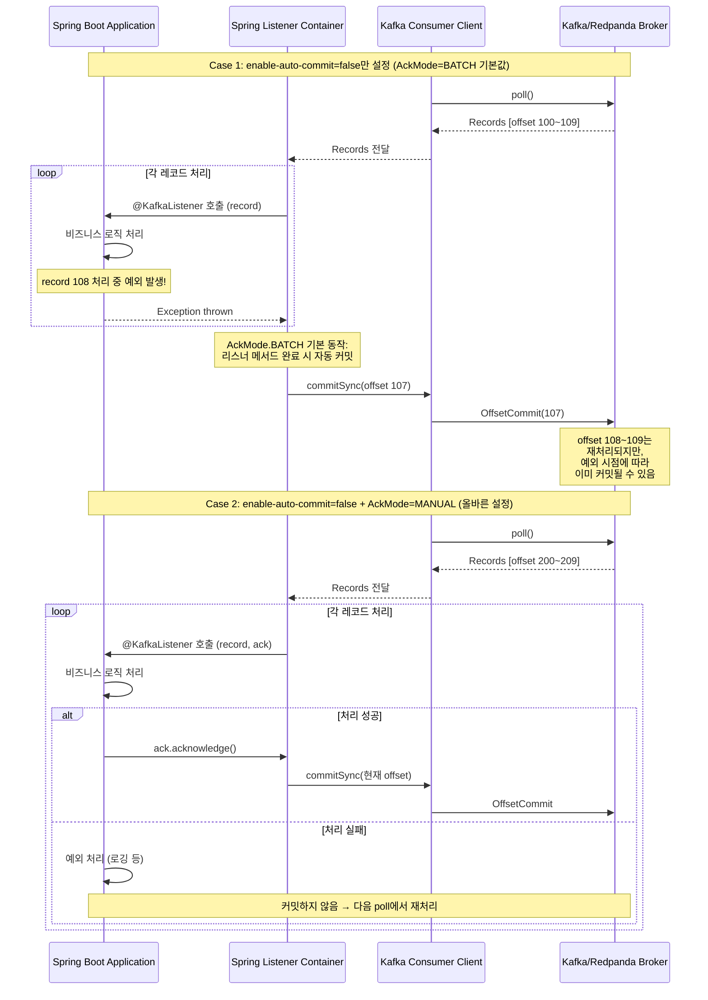
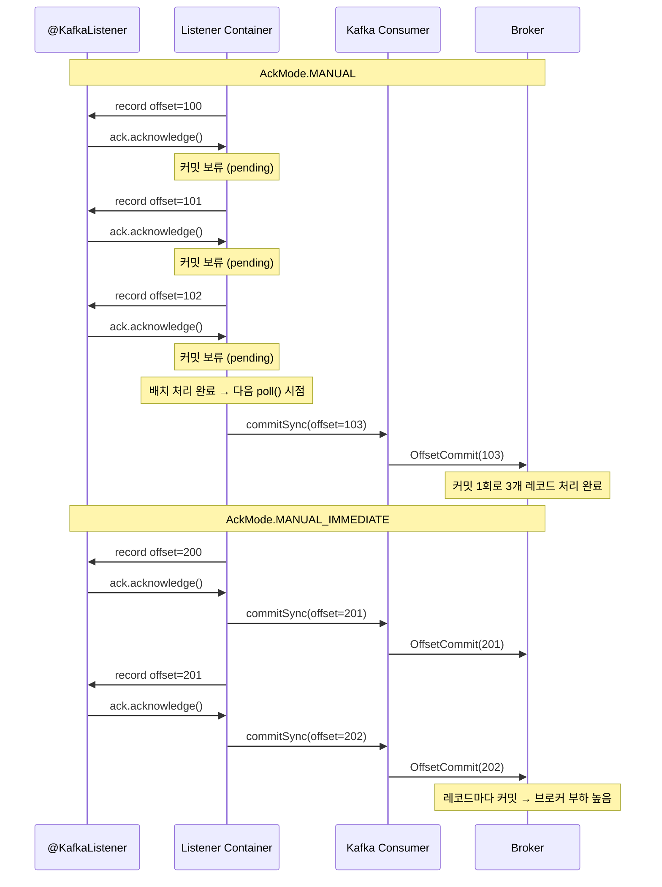
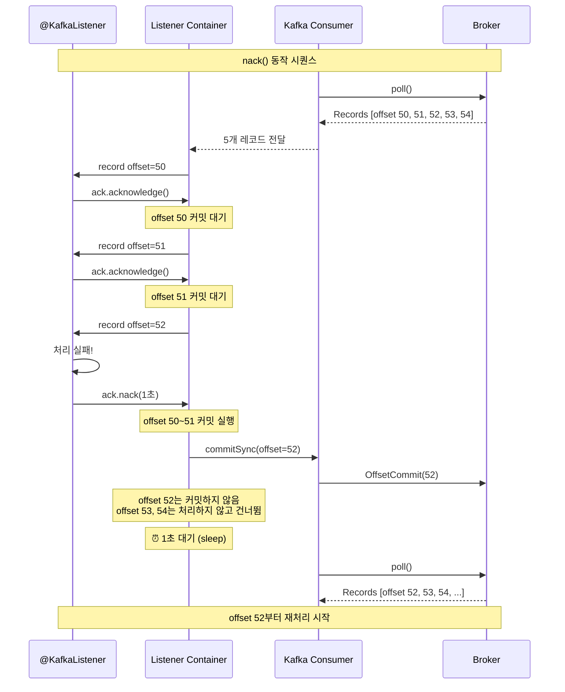

# 04. Manual Commit Deep Dive

수동 커밋의 함정, MANUAL vs MANUAL_IMMEDIATE, 배치 리스너, 흔한 실수, 체크리스트

---

## 수동 커밋의 함정: `enable-auto-commit: false`만으로는 부족하다

Spring Kafka에서 수동 커밋을 구현할 때 가장 흔한 실수는 `enable-auto-commit: false`만 설정하고 끝내는 것입니다. Kafka 클라이언트의 자동 커밋은 비활성화되지만, Spring Kafka 프레임워크 자체의 커밋 메커니즘이 별도로 존재하기 때문입니다.

### Kafka 클라이언트 vs Spring Kafka 커밋 메커니즘

Kafka 클라이언트의 자동 커밋은 `poll()` 메서드 내부에서 `maybeAutoCommitOffsetsAsync()` 메서드를 통해 동작합니다. 이 과정은 다음과 같습니다:

1. `auto.offset.commit=true` 여부 확인
2. 타이머 업데이트 (경과 시간 계산)
3. `auto.commit.interval.ms` 설정값 초과 여부 확인
4. 타이머 리셋
5. 오프셋 비동기 커밋 실행



### 왜 두 가지를 모두 설정해야 하는가?

`enable-auto-commit: false`는 Kafka 클라이언트 레벨의 자동 커밋만 비활성화합니다. 하지만 Spring Kafka의 `KafkaMessageListenerContainer`는 자체적인 오프셋 관리 메커니즘을 가지고 있으며, 기본 `AckMode`가 `BATCH`로 설정되어 있습니다. `BATCH` 모드에서는 `poll()`로 가져온 모든 레코드의 리스너 메서드가 완료되면 자동으로 오프셋을 커밋합니다.

```java
// Spring Kafka 내부 동작 (간략화)
public class KafkaMessageListenerContainer {

    private void invokeListener(ConsumerRecords<K, V> records) {
        for (ConsumerRecord<K, V> record : records) {
            listener.onMessage(record);  // @KafkaListener 호출
        }

        // AckMode.BATCH: 모든 레코드 처리 후 자동 커밋
        if (ackMode == AckMode.BATCH) {
            consumer.commitSync();  // ← 이것이 문제!
        }

        // AckMode.MANUAL: 개발자가 acknowledge() 호출할 때만 커밋
        // → 커밋 시점을 완전히 제어 가능
    }
}
```

따라서 진정한 수동 커밋을 위해서는 다음 두 가지를 **반드시 함께** 설정해야 합니다:

```yaml
spring:
  kafka:
    consumer:
      enable-auto-commit: false    # 1. Kafka 클라이언트 자동 커밋 비활성화
    listener:
      ack-mode: manual             # 2. Spring 프레임워크 자동 커밋 비활성화
```

### AckMode 옵션 비교

| 모드 | 동작 | 커밋 시점 | 사용 사례 |
|------|------|----------|----------|
| `RECORD` | 각 레코드 처리 후 커밋 | 레코드마다 | 안전하지만 처리량 낮음 |
| `BATCH` | poll() 배치 전체 처리 후 커밋 | 배치 완료 시 | **Spring 기본값**, 대부분 충분 |
| `TIME` | 일정 시간 경과 후 커밋 | 주기적 | 시간 기반 배치 처리 |
| `COUNT` | N개 레코드 처리 후 커밋 | 카운트 도달 시 | 카운트 기반 배치 처리 |
| `MANUAL` | `acknowledge()` 호출 시 다음 poll()에서 커밋 | 개발자 제어 | **프로덕션 권장** |
| `MANUAL_IMMEDIATE` | `acknowledge()` 호출 즉시 커밋 | 즉시 | 즉각적 커밋이 필요한 경우 |

> **참고**: 이 문서의 기본 설정에서 `enable-auto-commit: false`와 `ack-mode: manual`을 함께 설정한 이유가 바로 이것입니다. 하나만 설정하면 의도하지 않은 오프셋 커밋이 발생할 수 있습니다.

---

## `MANUAL` vs `MANUAL_IMMEDIATE` 차이

두 모드 모두 개발자가 `ack.acknowledge()`를 호출해야 커밋이 발생하지만, 커밋 시점이 다릅니다.

**`MANUAL`**: `acknowledge()`를 호출하면 즉시 커밋하지 않고, 다음 `poll()` 호출 시점에 모아서 커밋합니다. 여러 레코드에 대해 `acknowledge()`를 호출해도 실제 커밋은 한 번만 발생하므로 브로커 부하가 적습니다.

**`MANUAL_IMMEDIATE`**: `acknowledge()`를 호출하는 즉시 `commitSync()`를 실행합니다. 레코드 하나하나마다 브로커에 커밋 요청을 보내므로 처리량이 떨어지지만, 커밋 지연이 없어 장애 시 중복 소비 범위가 최소화됩니다.



| 기준 | `MANUAL` | `MANUAL_IMMEDIATE` |
|------|----------|-------------------|
| 커밋 시점 | 다음 `poll()` 시 일괄 | `acknowledge()` 호출 즉시 |
| 브로커 부하 | 낮음 (배치 커밋) | 높음 (레코드당 커밋) |
| 장애 시 중복 범위 | 마지막 poll 배치 전체 | 최대 1개 레코드 |
| 처리량 | 높음 | 낮음 |
| 권장 사례 | 대부분의 프로덕션 | 금융 거래 등 중복 최소화 필수 |

---

## Acknowledgment API 상세

Spring Kafka 2.3+에서 `Acknowledgment` 인터페이스는 `acknowledge()` 외에 `nack()` 메서드도 제공합니다. `nack()`은 현재 레코드의 처리를 실패로 표시하고, 지정한 시간 후 재처리를 요청합니다.

```java
@KafkaListener(topics = "orders")
public void handle(OrderEvent event, Acknowledgment ack) {
    try {
        orderService.process(event);
        ack.acknowledge();  // 성공: 오프셋 커밋
    } catch (RetryableException e) {
        // 재시도 가능한 에러: 1초 후 같은 레코드부터 재처리
        ack.nack(Duration.ofSeconds(1));
    } catch (NonRetryableException e) {
        // 재시도 불가: DLT로 보내고 다음 레코드로 진행
        dlqProducer.send(event);
        ack.acknowledge();
    }
}
```

`nack(Duration)` 호출 시 내부 동작은 다음과 같습니다:

1. 현재 레코드의 오프셋을 커밋하지 않습니다.
2. 같은 `poll()` 배치에서 아직 처리하지 않은 나머지 레코드도 건너뜁니다.
3. 지정한 Duration만큼 Consumer 스레드를 일시 정지(sleep)합니다.
4. 다음 `poll()`에서 실패한 레코드의 오프셋부터 다시 가져옵니다.



> **주의**: `nack()`은 레코드 단위 리스너(`type: single`)에서만 사용할 수 있습니다. 배치 리스너(`type: batch`)에서는 `nack(int index, Duration sleep)` 오버로드를 사용하여 배치 내 실패 인덱스를 지정합니다.

---

## 배치 리스너에서의 수동 커밋

대량 메시지를 처리할 때는 배치 리스너가 효율적입니다. `listener.type: batch`로 설정하면 `@KafkaListener`가 `List<>`로 레코드를 받습니다.

```yaml
spring:
  kafka:
    listener:
      type: batch
      ack-mode: manual
    consumer:
      enable-auto-commit: false
      properties:
        max.poll.records: 100
```

```java
@KafkaListener(topics = "orders")
public void handleBatch(List<OrderEvent> events,
                        Acknowledgment ack) {
    try {
        // 배치 단위로 DB 벌크 인서트
        orderService.bulkProcess(events);
        ack.acknowledge();  // 배치 전체 성공 시 커밋
    } catch (Exception e) {
        log.error("Batch processing failed, size={}", events.size(), e);
        // 커밋하지 않음 → 전체 배치 재처리
    }
}
```

배치 리스너에서 일부 레코드만 실패한 경우, `nack(index, duration)`으로 실패 지점을 알려줄 수 있습니다:

```java
@KafkaListener(topics = "orders")
public void handleBatch(List<OrderEvent> events,
                        Acknowledgment ack) {
    for (int i = 0; i < events.size(); i++) {
        try {
            orderService.process(events.get(i));
        } catch (Exception e) {
            // index i에서 실패: 0~(i-1)까지 커밋, i부터 재처리
            ack.nack(i, Duration.ofSeconds(1));
            return;
        }
    }
    ack.acknowledge();  // 전체 성공
}
```

---

## 수동 커밋 시 흔한 실수와 해결

**실수 1: acknowledge()를 호출하지 않는 코드 경로**

```java
// ❌ 특정 조건에서 acknowledge()가 호출되지 않음
@KafkaListener(topics = "orders")
public void handle(OrderEvent event, Acknowledgment ack) {
    if (event.getStatus() == CANCELLED) {
        return;  // ← acknowledge() 없이 반환!
    }
    orderService.process(event);
    ack.acknowledge();
}
```

이 경우 `CANCELLED` 상태의 메시지가 올 때마다 오프셋이 커밋되지 않아, 다음 `poll()`에서 같은 메시지를 반복 수신합니다. Consumer가 무한 루프에 빠집니다.

```java
// ✅ 모든 코드 경로에서 acknowledge() 호출
@KafkaListener(topics = "orders")
public void handle(OrderEvent event, Acknowledgment ack) {
    if (event.getStatus() != CANCELLED) {
        orderService.process(event);
    }
    ack.acknowledge();  // 항상 호출
}
```

**실수 2: 비동기 처리에서 acknowledge() 타이밍 오류**

```java
// ❌ 비동기 처리 완료 전에 acknowledge() 호출
@KafkaListener(topics = "orders")
public void handle(OrderEvent event, Acknowledgment ack) {
    asyncService.processAsync(event);  // 비동기 실행 (즉시 반환)
    ack.acknowledge();                 // ← 처리 완료 전에 커밋!
}
```

비동기 처리가 실패해도 이미 오프셋이 커밋되어 메시지가 유실됩니다.

```java
// ✅ 비동기 완료 콜백에서 acknowledge()
@KafkaListener(topics = "orders")
public void handle(OrderEvent event, Acknowledgment ack) {
    asyncService.processAsync(event)
        .thenRun(() -> ack.acknowledge())       // 성공 시 커밋
        .exceptionally(ex -> {
            log.error("Async processing failed", ex);
            return null;  // 커밋하지 않음 → 재처리
        });
}
```

> **주의**: 비동기 콜백에서 `acknowledge()`를 호출하면 `AckMode.MANUAL`에서는 다음 `poll()` 시점에 커밋됩니다. 비동기 처리가 `poll()` 주기보다 오래 걸리면 `max.poll.interval.ms` 초과로 리밸런스가 발생할 수 있으므로, 비동기 처리 시간을 반드시 고려해야 합니다.

---

## 수동 커밋 설정 체크리스트

프로덕션에서 수동 커밋을 올바르게 구현하기 위한 체크리스트입니다:

| # | 항목 | 확인 |
|---|------|------|
| 1 | `enable-auto-commit: false` 설정 | Kafka 클라이언트 자동 커밋 비활성화 |
| 2 | `ack-mode: manual` 또는 `manual_immediate` 설정 | Spring 프레임워크 자동 커밋 비활성화 |
| 3 | 모든 코드 경로에서 `acknowledge()` 호출 | 무한 루프 방지 |
| 4 | 예외 처리 시 커밋 여부 결정 | 재시도 vs DLT 전송 후 커밋 |
| 5 | 비동기 처리 시 완료 콜백에서 커밋 | 처리 완료 전 커밋 방지 |
| 6 | `max.poll.interval.ms` 충분히 설정 | 처리 시간 초과로 인한 리밸런스 방지 |

> **프로덕션 사례**: 무중단 Consumer Offset Seeking (ConsumerSeekAware + Redis Pub/Sub 분산 확장)은 [19-production-case-studies.md §쿠팡 주문팀](./19-production-case-studies.md)을 참조한다.
