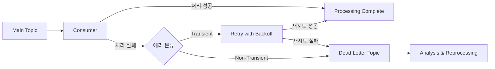
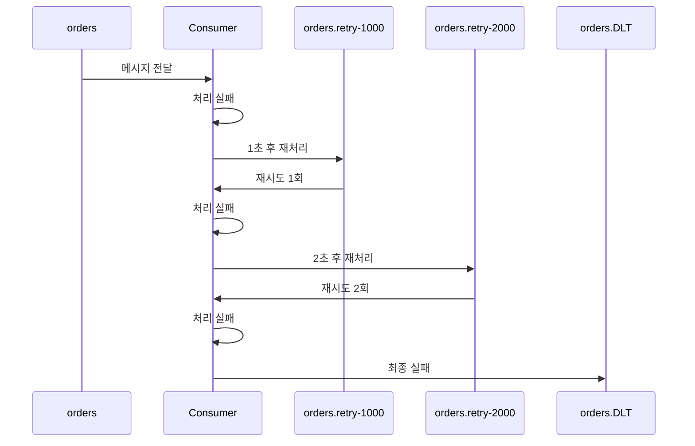

# 05. Dead Letter Queue (DLQ) Strategy

에러 처리, 재시도 전략, Dead Letter Topic 구현

> 고급 에러 처리 패턴(Circuit Breaker, DLT 재처리 자동화, 에러 분류 전략)은 [04/05-error-handling.md](../04-advanced-patterns/05-error-handling.md) 참조

---

## DLQ 개요

### Dead Letter Queue란?

Dead Letter Queue(DLQ)는 정상적으로 처리할 수 없는 메시지를 별도 토픽에 저장하여 나중에 분석하거나 재처리하는 패턴이다. 메시지 처리 중 발생하는 에러를 안전하게 격리하고, 시스템 전체의 안정성을 유지하면서 실패한 메시지를 추적할 수 있다.



### Redpanda에서의 DLQ

Redpanda는 플랫폼 레벨에서 DLQ를 제공하지 않는다. 대신 기존 토픽을 Dead Letter Topic으로 사용하며, Spring Kafka의 DLQ 패턴을 그대로 적용할 수 있다. 이는 Redpanda가 Kafka API와 완전히 호환되기 때문에 가능하다.

---

## 에러 유형 분류

### Transient Errors (일시적 오류)

시간이 지나면 자연히 해소되는 오류다. 네트워크 순단, 다운스트림 서비스 일시 불가, 타임아웃, DB 연결 풀 고갈 등이 해당한다. 원인이 인프라의 일시적 상태이므로 재시도하면 성공할 가능성이 높다.

처리 전략은 Exponential Backoff 재시도다. 간격을 점진적으로 늘려(1초→2초→4초) 과부하 상태의 다운스트림에 추가 부담을 주지 않으면서, 일정 횟수 실패 후에만 DLT로 이동한다.

### Non-Transient Errors (Poison Pills)

몇 번을 재시도해도 항상 같은 이유로 실패하는 결정론적 오류다. 역직렬화 오류(잘못된 JSON/Avro), 스키마 불일치, 필수 필드 누락, 비즈니스 검증 실패, Consumer 코드 버그가 해당한다. 코드 수정이나 데이터 보정 없이는 절대 해결되지 않으므로 재시도는 리소스 낭비다.

즉시 DLT로 이동시키고 운영팀에 알림을 보내야 한다. 이 유형의 메시지가 재시도 루프를 도는 동안 뒤의 정상 메시지까지 지연되기 때문이다.

---

## Spring Kafka DLQ 구현

### DefaultErrorHandler 개요

`DefaultErrorHandler`는 Spring Kafka 2.8부터 도입된 **Consumer 에러 처리의 표준 메커니즘**이다. 이전의 `SeekToCurrentErrorHandler`를 대체하며, Listener에서 예외가 발생했을 때 **재시도(BackOff)와 복구(Recoverer)를 담당**한다.

`@KafkaListener`에서 예외가 발생하면 기본적으로 Consumer가 중단되거나 무한 재시도에 빠진다. `DefaultErrorHandler`는 이 동작을 제어한다.

```
예외 발생 → DefaultErrorHandler가 가로챔
  → BackOff 전략에 따라 재시도 (같은 파티션 내 블록킹)
  → 재시도 소진 → Recoverer가 처리 (DLT 전송, 로깅 등)
  → offset을 다음으로 이동 → 정상 흐름 계속
```

등록하지 않으면 Spring Kafka가 기본 인스턴스를 사용한다. 기본 동작은 **10회 재시도, BackOff 없음, Recoverer 없음**(로그만 남기고 skip)이다. 대부분의 프로덕션 환경에서는 이 기본 동작이 부적합하므로 직접 Bean을 등록한다.

#### 왜 DefaultErrorHandler와 DeadLetterPublishingRecoverer가 분리되어 있는가

`DefaultErrorHandler`는 이름과 달리 **DLT 전송 기능을 내장하고 있지 않다**. 이것은 "에러를 감지하고 재시도 정책을 실행하는 프레임워크"이지, "실패한 메시지를 어디에 보낼지"는 알지 못한다. 재시도를 다 써도 실패하면 뭘 해야 하는가? 이 질문에 대한 답이 `ConsumerRecordRecoverer` 인터페이스이고, DLT에 발행하는 구현체가 `DeadLetterPublishingRecoverer`다.

이렇게 분리한 이유는 "재시도 소진 후 행동"이 프로젝트마다 다르기 때문이다. 어떤 시스템은 DLT로 보내고, 어떤 시스템은 DB에 저장하고, 어떤 시스템은 Slack 알림만 보내고 메시지를 버린다. DefaultErrorHandler가 DLT 전송을 직접 하면 이런 유연성이 사라진다.

```
DefaultErrorHandler (프레임워크)
  ├── BackOff: "몇 번, 얼마 간격으로 재시도할 것인가"
  └── ConsumerRecordRecoverer: "재시도 다 실패하면 뭘 할 것인가"
        ├── DeadLetterPublishingRecoverer → DLT 토픽에 발행
        ├── 커스텀 람다 → DB 저장, 알림 전송 등
        └── (없음) → 로그만 남기고 skip (기본 동작)
```

| 구성 요소 | 역할 | 주요 구현체 |
|----------|------|-----------|
| **BackOff** | 재시도 간격과 횟수 결정 | `FixedBackOff`, `ExponentialBackOff` |
| **ConsumerRecordRecoverer** | 재시도 소진 후 처리 | `DeadLetterPublishingRecoverer`, 커스텀 람다 |

Recoverer를 지정하지 않으면 기본 동작은 **로그 출력 후 해당 메시지를 skip**하는 것이다. 즉 메시지가 조용히 사라진다. 프로덕션에서 이 기본 동작은 데이터 유실과 같으므로, 반드시 Recoverer를 지정해야 한다.

#### DeadLetterPublishingRecoverer가 하는 일

`DeadLetterPublishingRecoverer`는 `ConsumerRecordRecoverer`의 구현체로, 실패한 `ConsumerRecord`를 받아서 `KafkaTemplate`을 통해 DLT 토픽에 발행한다. 단순히 send()를 호출하는 것 이상으로, 실패 원인 추적에 필요한 정보를 메시지 헤더에 자동으로 첨부한다.

**자동 첨부되는 헤더:**

| 헤더 | 값 | 용도 |
|------|------|------|
| `kafka_dlt-exception-fqcn` | 예외 클래스명 (FQCN) | 에러 유형 분류 |
| `kafka_dlt-exception-message` | 예외 메시지 | 장애 원인 파악 |
| `kafka_dlt-exception-stacktrace` | 스택 트레이스 | 디버깅 |
| `kafka_dlt-original-topic` | 원본 토픽명 | 재처리 시 원본 위치 추적 |
| `kafka_dlt-original-partition` | 원본 파티션 | 재처리 시 원본 위치 추적 |
| `kafka_dlt-original-offset` | 원본 오프셋 | 재처리 시 원본 위치 추적 |
| `kafka_dlt-original-timestamp` | 원본 타임스탬프 | 지연 시간 분석 |

이 헤더들 덕분에 DLT Consumer는 "이 메시지가 원래 어디서 왔고, 왜 실패했는지"를 별도 조회 없이 알 수 있다. 생성자에 넘기는 `BiFunction<ConsumerRecord<?, ?>, Exception, TopicPartition>`은 "어떤 DLT 토픽에 보낼지"를 결정하는 라우팅 함수다. 지정하지 않으면 기본값은 `원본토픽명-dlt`이다.

```
DeadLetterPublishingRecoverer
  ├── 입력: 실패한 ConsumerRecord + Exception
  ├── 라우팅: BiFunction으로 대상 DLT 토픽 결정
  ├── 헤더 추가: 예외 정보 + 원본 위치 정보 자동 첨부
  └── 발행: KafkaTemplate.send()로 DLT에 전송
```

### 1. DefaultErrorHandler 방식 (Bean 설정)

```java
@Configuration
public class KafkaErrorConfig {

    @Bean
    public DefaultErrorHandler errorHandler(
            KafkaTemplate<String, Object> kafkaTemplate) {

        // Dead Letter Topic으로 발행
        DeadLetterPublishingRecoverer recoverer =
            new DeadLetterPublishingRecoverer(kafkaTemplate,
                (record, ex) -> {
                    // 토픽명 + ".DLT" 형식
                    return new TopicPartition(
                        record.topic() + ".DLT",
                        record.partition()
                    );
                });

        // 3회 재시도, 1초 간격
        FixedBackOff backOff = new FixedBackOff(1000L, 3L);

        DefaultErrorHandler handler = new DefaultErrorHandler(recoverer, backOff);

        // Poison Pill은 재시도하지 않음
        handler.addNotRetryableExceptions(
            DeserializationException.class,
            MessageConversionException.class,
            ConversionException.class,
            MethodArgumentNotValidException.class
        );

        return handler;
    }
}
```

#### Bean 자동 적용 원리

`DefaultErrorHandler`를 `@Bean`으로 등록하면, Spring Kafka가 **모든 Listener Container에 자동 적용**한다. `KafkaAutoConfiguration`이 `DefaultErrorHandler` 타입의 Bean을 감지하면, `ConcurrentKafkaListenerContainerFactory`에 `setCommonErrorHandler()`로 등록한다. Container Factory에 수동으로 설정할 필요가 없다.

특정 Listener에만 다른 에러 핸들러를 적용하고 싶으면, 별도의 `ContainerFactory`를 만들어서 해당 Listener에 지정한다.

```java
// 특정 Listener만 다른 핸들러 적용
@Bean
public ConcurrentKafkaListenerContainerFactory<String, OrderEvent>
        strictFactory(ConsumerFactory<String, OrderEvent> cf,
                      KafkaTemplate<String, OrderEvent> template) {
    var factory = new ConcurrentKafkaListenerContainerFactory<String, OrderEvent>();
    factory.setConsumerFactory(cf);
    factory.setCommonErrorHandler(new DefaultErrorHandler(
        new DeadLetterPublishingRecoverer(template),
        new FixedBackOff(500L, 1)  // 1회만 재시도, 500ms
    ));
    return factory;
}

@KafkaListener(topics = "critical-orders", containerFactory = "strictFactory")
public void consumeStrict(OrderEvent event) { ... }
```

#### 재시도 방향 필터링

`addNotRetryableExceptions()`는 특정 예외를 재시도에서 제외한다. 반대로 특정 예외**만** 재시도하고 나머지는 즉시 DLT로 보내려면 `addRetryableExceptions()`를 사용한다.

```java
// 이 예외들만 재시도, 나머지는 즉시 DLT
handler.addRetryableExceptions(
    TransientDataAccessException.class,  // 일시적 DB 오류
    TimeoutException.class               // 타임아웃
);
```

### 2. Exponential Backoff

```java
@Bean
public DefaultErrorHandler errorHandler(KafkaTemplate<String, Object> kafkaTemplate) {

    DeadLetterPublishingRecoverer recoverer =
        new DeadLetterPublishingRecoverer(kafkaTemplate);

    // Exponential Backoff: 1초 → 2초 → 4초 → 8초
    ExponentialBackOffWithMaxRetries backOff =
        new ExponentialBackOffWithMaxRetries(4);
    backOff.setInitialInterval(1000L);
    backOff.setMultiplier(2.0);
    backOff.setMaxInterval(10000L);  // 최대 10초

    return new DefaultErrorHandler(recoverer, backOff);
}
```

### 3. 커스텀 DLT 메타데이터 추가

```java
@Bean
public DeadLetterPublishingRecoverer deadLetterPublishingRecoverer(
        KafkaTemplate<String, Object> kafkaTemplate) {

    return new DeadLetterPublishingRecoverer(kafkaTemplate,
        (record, ex) -> new TopicPartition(record.topic() + ".DLT", -1)) {

        @Override
        protected ProducerRecord<Object, Object> createProducerRecord(
                ConsumerRecord<?, ?> record,
                TopicPartition topicPartition,
                Headers headers,
                byte[] key,
                byte[] value) {

            // 원본 정보 추가
            headers.add("X-Original-Topic",
                record.topic().getBytes(StandardCharsets.UTF_8));
            headers.add("X-Original-Partition",
                String.valueOf(record.partition()).getBytes(StandardCharsets.UTF_8));
            headers.add("X-Original-Offset",
                String.valueOf(record.offset()).getBytes(StandardCharsets.UTF_8));
            headers.add("X-Original-Timestamp",
                String.valueOf(record.timestamp()).getBytes(StandardCharsets.UTF_8));

            // 에러 정보 추가
            headers.add("X-Error-Message",
                getErrorMessage(ex).getBytes(StandardCharsets.UTF_8));
            headers.add("X-Error-Timestamp",
                Instant.now().toString().getBytes(StandardCharsets.UTF_8));
            headers.add("X-Retry-Count",
                String.valueOf(getRetryCount(headers)).getBytes(StandardCharsets.UTF_8));

            return super.createProducerRecord(record, topicPartition, headers, key, value);
        }
    };
}
```

---

## Non-Blocking 재시도 (RetryableTopic)

### @RetryableTopic의 장점

`@RetryableTopic`은 재시도 로직을 별도 토픽으로 분리하여 논블로킹 방식으로 처리한다. `DefaultErrorHandler`의 블로킹 재시도와 결정적인 차이는 **메인 Consumer가 멈추지 않는다는 점**이다. 실패한 메시지가 retry 토픽으로 빠지는 순간, 메인 토픽의 Consumer는 다음 메시지를 즉시 처리할 수 있다. 한 메시지의 실패가 뒤따르는 수천 건의 정상 메시지를 지연시키지 않으므로 전체 처리량이 유지된다.

또한 실패 메시지가 물리적으로 다른 토픽에 격리되므로, 정상 흐름과 실패 흐름을 독립적으로 모니터링하고 스케일링할 수 있다.

**재시도 흐름**



### 2. @RetryableTopic 어노테이션 방식 (선언적 재시도)

`@RetryableTopic` 어노테이션을 사용하면 Bean 설정 없이 Consumer 메서드에 직접 재시도 정책을 선언할 수 있다. DefaultErrorHandler보다 간결하고 메서드별로 다른 재시도 전략을 적용하기 쉽다.

```java
@Service
@Slf4j
public class OrderConsumer {

    @RetryableTopic(
        attempts = "4",
        backoff = @Backoff(
            delay = 1000,      // 1초
            multiplier = 2,    // 2배씩 증가
            maxDelay = 10000   // 최대 10초
        ),
        dltTopicSuffix = ".DLT",
        retryTopicSuffix = ".retry",
        autoCreateTopics = "true",
        include = {RetryableException.class},  // 재시도할 예외
        exclude = {NonRetryableException.class}  // 재시도 안 할 예외
    )
    @KafkaListener(topics = "orders", groupId = "order-service")
    public void consume(OrderEvent event) {
        log.info("Processing order: {}", event.orderId());
        processOrder(event);
    }

    // @DltHandler는 @RetryableTopic 전용이다.
    // @RetryableTopic 없이 단독 사용 불가 — 무시된다.
    // DefaultErrorHandler 방식에서는 @KafkaListener(topics = "orders.DLT")로
    // DLT 토픽을 직접 구독해야 한다. (아래 DLT 모니터링 섹션 참조)
    @DltHandler
    public void handleDlt(OrderEvent event,
                          @Header(KafkaHeaders.RECEIVED_TOPIC) String topic,
                          @Header(KafkaHeaders.EXCEPTION_MESSAGE) String errorMessage) {
        log.error("DLT received: topic={}, orderId={}, error={}",
            topic, event.orderId(), errorMessage);

        // DLT 처리 로직
        saveToDltRepository(event, errorMessage);
        notifyOperations(event, errorMessage);
    }
}
```

### 생성되는 토픽

```
orders              (원본 토픽)
orders.retry-1000      (재시도 1회차, 1초 후)
orders.retry-2000      (재시도 2회차, 2초 후)
orders.retry-4000      (재시도 3회차, 4초 후)
orders.DLT          (최종 실패)
```

### 재시도 없이 DLT만 사용하기

재시도 없이 실패 즉시 DLT로 보내고 싶다면 `attempts = "1"`로 설정한다. `attempts`는 원본 시도를 포함한 전체 시도 횟수이므로, 1이면 원본 1회만 시도하고 실패 시 바로 DLT로 이동한다. retry 토픽은 생성되지 않는다.

```java
@RetryableTopic(
    attempts = "1",           // 원본 시도 1회만, 재시도 없음
    dltTopicSuffix = ".DLT"
)
@KafkaListener(topics = "orders", groupId = "order-service")
public void consume(OrderEvent event) {
    processOrder(event);  // 실패하면 즉시 DLT
}
```

| attempts | 동작 | 생성되는 토픽 |
|----------|------|-------------|
| `"1"` | 원본 1회 → 실패 시 DLT | `orders.DLT`만 |
| `"2"` | 원본 + 재시도 1회 | `orders-retry-0`, `orders.DLT` |
| `"4"` | 원본 + 재시도 3회 | `orders-retry-0/1/2`, `orders.DLT` |

이 방식은 `DefaultErrorHandler` + `DeadLetterPublishingRecoverer`(재시도 0회)와 동일한 결과를 낸다. 차이는 적용 범위다 — `DefaultErrorHandler`는 전역, `@RetryableTopic`은 메서드 단위다. 리스너마다 다른 DLT 정책이 필요하거나 `@DltHandler`의 선언적 방식이 편하면 `@RetryableTopic(attempts="1")`을, 전역 통일 정책이면 `DefaultErrorHandler`가 더 단순하다.

### Retry/DLT 토픽 자동 생성 메커니즘

`auto.create.topics.enable=false`로 설정한 운영 환경에서도 `@RetryableTopic`의 retry/DLT 토픽은 **정상적으로 생성된다.** 두 메커니즘이 완전히 다르기 때문이다.

| 구분 | `auto.create.topics.enable` | `@RetryableTopic` |
|---|---|---|
| **주체** | Kafka 브로커 | Spring Kafka (`AdminClient` API) |
| **방식** | Producer/Consumer가 없는 토픽 접근 시 브로커가 암묵적 생성 | 애플리케이션 시작 시 `AdminClient.createTopics()`로 **명시적 생성** |
| **생성 시점** | 런타임 접근 시 | 스프링 컨텍스트 초기화 시 |

`@RetryableTopic`를 붙이면 Spring Kafka 내부에서 `RetryTopicBootstrapper`가 다음과 같이 동작한다:

1. 메인 토픽 기준으로 retry/DLT 토픽 이름을 결정한다 (e.g. `orders-retry-0`, `orders.DLT`)
2. `KafkaAdmin`이 `AdminClient.createTopics()`를 호출하여 **브로커에 직접 토픽 생성을 요청**한다
3. 이 API 호출은 브로커의 `auto.create.topics.enable` 설정과 **무관**하게 동작한다

**운영 환경 주의사항**: `AdminClient.createTopics()`도 **브로커의 ACL 권한**은 필요하다. 토픽 생성 권한이 제한된 환경에서는 실패할 수 있으므로, 토픽을 CI/CD에서 미리 생성하고 자동 생성을 비활성화하는 것이 안전하다:

```java
@RetryableTopic(
    attempts = "3",
    autoCreateTopics = "false"  // AdminClient 자동 생성 비활성화 → 토픽 사전 생성 필수
)
```

### Retry 토픽 전략 옵션

> 참고: [Advanced Event-Driven Workflow in Spring Boot with Kafka and DLQ](https://medium.com/@27.rahul.k/advanced-event-driven-workflow-in-spring-boot-with-kafka-and-dead-letter-queues-dlq-9c3ee94ec0c1), [spring-kafka-error-handling](https://github.com/ashishqcs/spring-kafka-error-handling)

`@RetryableTopic`은 retry 토픽 생성 전략을 세밀하게 제어할 수 있다.

**전략 1: 다중 토픽 + Index Suffix (기본)**

```java
@RetryableTopic(
    attempts = "4",
    backoff = @Backoff(delay = 2000, multiplier = 2.0),
    topicSuffixingStrategy = TopicSuffixingStrategy.SUFFIX_WITH_INDEX_VALUE
)
@KafkaListener(topics = "orders", groupId = "order-service")
public void consume(OrderEvent event) { ... }
```

생성 토픽: `orders-retry-0`, `orders-retry-1`, `orders-retry-2`, `orders.DLT`
→ 각 재시도마다 별도 토픽, 지연 시간별 격리

**전략 2: 단일 토픽 + Fixed Delay**

```java
@RetryableTopic(
    attempts = "4",
    backoff = @Backoff(delay = 1000),
    fixedDelayTopicStrategy = FixedDelayStrategy.SINGLE_TOPIC
)
@KafkaListener(topics = "orders", groupId = "order-service")
public void consume(OrderEvent event) { ... }
```

생성 토픽: `orders-retry` (하나만), `orders.DLT`
→ 모든 재시도가 하나의 토픽에서 처리, 토픽 수 최소화

**전략 비교:**

| 전략 | 토픽 수 | 지연 제어 | 적합한 경우 |
|------|--------|----------|------------|
| 다중 토픽 + Delay Suffix | 재시도 횟수만큼 | Exponential 가능 | 재시도별 모니터링 필요 시 |
| 다중 토픽 + Index Suffix | 재시도 횟수만큼 | Exponential 가능 | 간결한 토픽명 선호 시 |
| 단일 토픽 (SINGLE_TOPIC) | 1개 | Fixed만 가능 | 토픽 수 최소화, 단순 재시도 |

> **주의**: Spring Kafka는 설정 조합에 따라 suffix 전략이 달라질 수 있다. 고정 지연 + 다중 토픽에서는 delay suffix 대신 index suffix(`retry-0`, `retry-1`)가 사용되기도 한다. 운영 적용 전에 `rpk topic list`로 실제 생성된 토픽명을 반드시 확인한다.

### DefaultErrorHandler vs @RetryableTopic 비교

| 특성 | DefaultErrorHandler | @RetryableTopic |
|------|-------------------|-----------------|
| **설정 방식** | Bean 설정 (전역 적용) | 어노테이션 (메서드별 적용) |
| **재시도 방식** | 블로킹 (같은 스레드에서 재시도) | 논블로킹 (별도 retry 토픽) |
| **Kafka 트랜잭션 호환** | **호환** — 같은 컨테이너 안에서 재시도 | **비호환** — 별도 컨테이너가 TX 참여 불가 |
| **메인 Consumer 처리량** | 재시도 중 블로킹됨 | 영향 없음 |
| **메시지 순서 보장** | 보장 (블로킹이므로 순서 유지) | 보장 안 됨 (retry 토픽에서 순서 깨짐) |
| **Batch Listener 호환** | 호환 | 비호환 |
| **토픽 생성** | 수동 생성 필요 | 자동 생성 가능 |
| **DLT 핸들러** | DeadLetterPublishingRecoverer | @DltHandler 어노테이션 |
| **메서드별 차등 정책** | 어려움 (ErrorHandler 분리 필요) | 쉬움 (각 메서드에 어노테이션) |
| **코드 간결성** | 중간 (Bean 클래스 필요) | 높음 (어노테이션만) |
| **적합한 경우** | 전체 애플리케이션 통일 정책, TX 필수 환경 | Consumer별 맞춤 재시도 정책, TX 미사용 환경 |

**실무 권장 조합:**
- **단일 재시도 정책**: DefaultErrorHandler (전역 설정으로 일관성 유지)
- **Consumer별 차등 정책**: @RetryableTopic (주문은 4회, 알림은 2회 등)
- **고처리량 요구**: @RetryableTopic (논블로킹 방식으로 처리량 유지)

**케이스별 선택:**

| 케이스 | 선택 | 이유 |
|--------|------|------|
| 주문/결제 처리 (TX 있음) | `DefaultErrorHandler` | **Kafka 트랜잭션 사용 시 @RetryableTopic 비호환** — 아래 경고 참조 |
| 주문/결제 처리 (TX 없음) | `@RetryableTopic` | 한 건 실패가 뒤의 수천 건을 블록하면 안 됨 |
| 로그/메트릭 수집 | `DefaultErrorHandler` | 순서 무관, 간단한 재시도 후 DLT로 충분 |
| 재고 차감 (순서 중요) | `DefaultErrorHandler` | 같은 상품의 재고 차감은 순서 보장 필요. 블록킹이 안전 |
| SAGA 패턴 | `DefaultErrorHandler` | **트랜잭션 필수** — @RetryableTopic 사용 불가 |
| 알림/이메일 발송 | `@RetryableTopic` | 외부 API 장애 시 분 단위 재시도. 다른 알림이 밀리면 안 됨 |
| CDC/데이터 동기화 | `DefaultErrorHandler` | 이벤트 순서가 깨지면 데이터 정합성 붕괴 |
| API Gateway → Kafka 중계 | `@RetryableTopic` | 다양한 도메인 이벤트가 섞여 있고, 하나의 실패가 전체를 막으면 안 됨 |

> **@RetryableTopic + KafkaTransactionManager = 공식 비호환**
>
> Spring Kafka 공식 문서에서 "Non-blocking retries CANNOT combine with Container Transactions"라고 명시한다. `@RetryableTopic`은 내부적으로 별도 리스너 컨테이너를 생성하여 retry 토픽을 소비하는데, 이 별도 컨테이너가 원본 리스너의 Kafka 트랜잭션에 참여할 수 없기 때문이다.
>
> 구체적으로 무엇이 깨지는가:
>
> - **블로킹 retry (DefaultErrorHandler)**: 리스너에서 예외 발생 → 트랜잭션 롤백 → outgoing 메시지도 함께 취소 → 원자성 보장
> - **논블로킹 retry (@RetryableTopic)**: 리스너에서 예외 발생 → `DeadLetterPublishingRecoverer`가 catch하여 retry 토픽으로 전송 → 컨테이너 입장에서는 정상 반환 → **트랜잭션이 커밋됨** → 리스너 안에서 `kafkaTemplate.send()`로 보낸 메시지들도 함께 커밋 → **실패한 처리의 부분 결과가 영구 저장됨**
>
> SAGA 예시: InventoryService가 `inventory-reserved` 메시지를 send한 뒤 외부 API 호출에서 예외가 발생하면, 블로킹 retry에서는 `inventory-reserved`가 취소되지만, 논블로킹 retry에서는 커밋되어 PaymentService가 결제를 진행한다. 재고 예약은 실패했는데 결제가 진행되는 불일치가 발생한다.
>
> **결론**: `KafkaTransactionManager`를 사용하면 `DefaultErrorHandler`가 유일한 선택이다. 트랜잭션 없이 높은 처리량이 필요하면 `@RetryableTopic`을 사용한다. 두 요구사항을 동시에 만족하는 방법은 없다.
>
> 참고: [Spring Kafka GitHub #2934](https://github.com/spring-projects/spring-kafka/issues/2934), [Spring Kafka 공식 — Non-Blocking Retries](https://docs.spring.io/spring-kafka/reference/retrytopic.html)
>
> 상세 분석: [07-transaction-patterns.md §6](./07-transaction-patterns.md) 트랜잭션 에러 처리 섹션 참조

**왜 둘 다 쓰는가?** `@RetryableTopic`을 적용한 Listener에서도 retry 토픽의 Consumer에서 예외가 발생하면 `DefaultErrorHandler`가 동작한다. 즉 `DefaultErrorHandler`는 **최후의 안전망**이다. 단, 이 조합은 **트랜잭션 미사용 환경에서만** 유효하다.

```
orders 토픽 → @RetryableTopic 적용
  msg1 실패 → orders-retry-0으로 이동 (논블록킹)
  orders-retry-0에서도 실패 → orders-retry-1로 이동
  orders-retry-1에서도 실패 → orders-dlt로 이동 (@DltHandler)
  @DltHandler에서도 실패 → DefaultErrorHandler가 처리 (최후의 안전망)
```

### @RetryableTopic 프로덕션 토픽 생성

`@RetryableTopic`은 내부적으로 `RetryTopicConfiguration`을 통해 `NewTopic` Bean을 자동 등록한다. 개발 환경에서는 편리하지만, 프로덕션에서는 파티션 수와 복제 계수를 직접 제어해야 하므로 명시적으로 선언하는 것이 권장된다.

```java
@Configuration
public class RetryTopicConfig {

    @Bean
    public NewTopic ordersRetry0() {
        return TopicBuilder.name("orders-retry-0").partitions(6).replicas(3).build();
    }

    @Bean
    public NewTopic ordersRetry1() {
        return TopicBuilder.name("orders-retry-1").partitions(6).replicas(3).build();
    }

    @Bean
    public NewTopic ordersDlt() {
        return TopicBuilder.name("orders-dlt").partitions(6).replicas(3).build();
    }
}
```

| 환경 | 토픽 생성 | 이유 |
|------|----------|------|
| **개발** | `@RetryableTopic` 자동 생성 | 편의성 |
| **프로덕션** | `NewTopic` Bean으로 명시적 생성 | 파티션 수, 복제 계수 직접 제어 |

> **주의: `@RetryableTopic` + 수동 ACK 조합.** `@RetryableTopic`은 내부적으로 자체 에러 핸들러와 리스너 컨테이너를 구성한다. `ack-mode: manual`을 사용하는 경우, 재시도 리스너의 ACK 모드와 충돌할 수 있다. 적용 전 반드시 컨테이너 설정과 함께 검증해야 한다.

---

## 역직렬화 에러 처리

### 왜 역직렬화 에러를 별도로 처리해야 하는가

역직렬화 에러는 다른 모든 Consumer 에러와 근본적으로 다른 지점에서 발생한다. 일반적인 비즈니스 로직 에러는 `@KafkaListener` 메서드 **안에서** 발생하므로 `DefaultErrorHandler`가 잡을 수 있다. 그런데 역직렬화 에러는 메시지가 리스너에 **도달하기 전에** 발생한다. Kafka Consumer가 브로커에서 바이트 배열을 가져온 뒤 Java 객체로 변환하는 과정에서 터지기 때문이다.

```
브로커 → Consumer.poll() → Deserializer → @KafkaListener
                              ↑ 여기서 실패
                              예외 발생 → 리스너에 도달 못 함
```

이것이 Poison Pill의 가장 치명적인 형태다. `ErrorHandlingDeserializer` 없이 역직렬화가 실패하면 Consumer는 해당 메시지의 오프셋을 커밋할 수 없고, `poll()`을 다시 호출하면 같은 메시지를 또 받는다. 결과적으로 **Consumer가 무한 루프에 빠져서 해당 파티션의 모든 후속 메시지 처리가 영구적으로 중단된다.** 재시도해도 소용없다 — 바이트 자체가 잘못됐으므로 100번을 역직렬화해도 같은 예외가 발생한다.

### ErrorHandlingDeserializer의 동작 원리

`ErrorHandlingDeserializer`는 실제 Deserializer를 감싸는 래퍼(Decorator)다. 내부 Deserializer가 예외를 던지면, 예외를 삼키고 대신 `null`을 반환하면서 에러 정보를 메시지 헤더에 기록한다. 이렇게 하면 `poll()`이 정상적으로 완료되고, 리스너가 호출되며, `DefaultErrorHandler`가 이 메시지를 DLT로 보낼 수 있다.

```
[ErrorHandlingDeserializer 없을 때]
잘못된 바이트 → JsonDeserializer → 예외 → poll() 실패 → 같은 메시지 재시도 → 무한 루프

[ErrorHandlingDeserializer 있을 때]
잘못된 바이트 → ErrorHandlingDeserializer → JsonDeserializer → 예외 발생
                → 예외를 catch → null 반환 + 헤더에 에러 정보 기록
                → poll() 성공 → 리스너 호출 → DefaultErrorHandler → DLT
```

### 왜 Spring Kafka의 기본값이 아닌가

ErrorHandlingDeserializer가 없으면 무한 루프에 빠지는데 기본값이 아닌 이유는, **Kafka의 설계 철학이 fail-fast이기 때문**이다. Kafka는 Producer와 Consumer가 같은 스키마를 공유하는 환경을 전제한다. 이 환경에서 역직렬화가 실패하면 스키마 배포 실수이거나 Producer 버그이므로, Consumer를 멈추고 즉시 수정하는 것이 올바른 대응이다. 메시지를 조용히 건너뛰면 데이터 유실을 인지하지 못하는 더 위험한 결과가 생길 수 있다.

ErrorHandlingDeserializer가 필요한 환경은 다르다 — 외부 시스템에서 메시지가 들어오거나, 다수의 팀이 독립적으로 Producer를 운영하는 경우다. 불량 메시지 한 건 때문에 Consumer 전체가 멈추는 것이 더 위험한 환경이다. 실무에서는 대부분 후자에 해당하므로 등록하는 것이 맞다.

### 설정

등록만 하면 된다. `DefaultErrorHandler`와의 연동 코드는 필요 없다 — ErrorHandlingDeserializer가 예외를 `null` + 에러 헤더로 변환하면, DefaultErrorHandler가 자동으로 DLT에 전송한다.

**방법 1: application.yml (Spring Boot 권장)**

```yaml
spring:
  kafka:
    consumer:
      # Deserializer를 ErrorHandlingDeserializer로 교체
      key-deserializer: org.springframework.kafka.support.serializer.ErrorHandlingDeserializer
      value-deserializer: org.springframework.kafka.support.serializer.ErrorHandlingDeserializer
      properties:
        # ErrorHandlingDeserializer가 내부적으로 위임할 실제 Deserializer
        spring.deserializer.key.delegate.class: org.apache.kafka.common.serialization.StringDeserializer
        spring.deserializer.value.delegate.class: org.springframework.kafka.support.serializer.JsonDeserializer
        # JsonDeserializer 설정
        spring.json.trusted.packages: "*"
        spring.json.value.default.type: com.example.OrderEvent
```

이 설정만 추가하면 기존 `spring.kafka.bootstrap-servers` 등 다른 Consumer 설정은 그대로 유지된다. ErrorHandlingDeserializer는 Deserializer 교체일 뿐, Consumer의 다른 설정에 영향을 주지 않는다.

**방법 2: Java Config (ConsumerFactory를 직접 구성하는 경우)**

ConsumerFactory를 이미 Java로 구성하고 있다면, 거기에 ErrorHandlingDeserializer 설정을 추가한다.

```java
// 기존 ConsumerFactory 설정에 아래 4줄만 추가
// ErrorHandlingDeserializer로 감싸기
props.put(ConsumerConfig.KEY_DESERIALIZER_CLASS_CONFIG,
    ErrorHandlingDeserializer.class);
props.put(ConsumerConfig.VALUE_DESERIALIZER_CLASS_CONFIG,
    ErrorHandlingDeserializer.class);

// 실제 위임할 Deserializer 지정
props.put(ErrorHandlingDeserializer.KEY_DESERIALIZER_CLASS,
    StringDeserializer.class);
props.put(ErrorHandlingDeserializer.VALUE_DESERIALIZER_CLASS,
    JsonDeserializer.class);
```

기존 ConsumerFactory에 이 설정만 추가하면 된다. `BOOTSTRAP_SERVERS_CONFIG` 같은 기본 설정은 이미 있으므로 중복 선언할 필요 없다.

### 역직렬화 실패 메시지 처리

대부분의 경우 `ErrorHandlingDeserializer` + `DefaultErrorHandler` 조합이면 역직렬화 실패 메시지가 자동으로 DLT에 도달한다. 그런데 리스너에서 직접 실패 원인을 로깅하거나, 원본 바이트를 별도 저장소에 보관하고 싶다면 리스너 파라미터로 에러 정보를 받아 처리할 수 있다.

`ErrorHandlingDeserializer`가 역직렬화에 실패하면 `@Payload`에는 `null`이 들어오고, 원본 바이트는 `springDeserializerExceptionValue` 헤더에 담긴다. 이 두 조건으로 정상 메시지와 실패 메시지를 구분한다.

```java
@KafkaListener(topics = "orders", groupId = "order-service")
public void consume(@Payload(required = false) OrderEvent event,
                    @Header(KafkaHeaders.RECEIVED_TOPIC) String topic,
                    @Header(name = "springDeserializerExceptionValue",
                            required = false) byte[] errorValue,
                    Acknowledgment ack) {

    if (event == null && errorValue != null) {
        // 역직렬화 실패 — event는 null, errorValue에 원본 바이트가 담겨 있음
        log.error("Deserialization failed for topic {}: {}",
            topic, new String(errorValue));
        // 원본 바이트를 DLT로 전송하여 나중에 분석/재처리 가능하게 보존
        sendToDeadLetter(topic, errorValue, "Deserialization failed");
        ack.acknowledge();  // 이 오프셋을 커밋해야 다음 메시지로 진행
        return;
    }

    // 정상 역직렬화된 경우
    processOrder(event);
    ack.acknowledge();
}
```

이 패턴은 `DefaultErrorHandler`의 자동 DLT 전송과 **중복 적용하지 않도록** 주의해야 한다. 둘 다 설정하면 같은 실패 메시지가 DLT에 두 번 들어갈 수 있다. 일반적으로는 `DefaultErrorHandler` + `DeadLetterPublishingRecoverer` 자동 처리에 맡기고, 리스너에서는 별도 로깅이나 커스텀 저장소 전송이 필요한 경우에만 이 패턴을 사용한다.

---

## DLT 모니터링 및 재처리

### 왜 DLT 모니터링이 필요한가

DLT에 메시지를 보내는 것은 에러 처리의 끝이 아니라 **시작**이다. DLT는 "처리할 수 없는 메시지의 임시 주차장"이지 "쓰레기통"이 아니다. 모니터링 없는 DLT는 블랙홀과 같다 — 메시지가 들어가면 아무도 모르고, 아무도 처리하지 않고, 비즈니스 데이터가 조용히 유실된다.

DLT 모니터링이 해결하는 문제는 세 가지다.

첫째, **장애 감지**다. DLT 유입률이 갑자기 치솟으면 다운스트림 서비스 장애, 스키마 변경, 코드 버그 등 시스템에 문제가 있다는 신호다. 메인 Consumer의 성공률 메트릭만으로는 이 신호를 놓치기 쉽다. 메시지가 DLT로 빠지면 메인 토픽의 Consumer Lag은 줄어들기 때문이다 — 정상적으로 처리된 것처럼 보이지만 실제로는 실패한 메시지가 DLT에 쌓이고 있는 것이다.

둘째, **근본 원인 분석**이다. DLT 메시지에는 원본 토픽, 파티션, 오프셋, 에러 메시지, 타임스탬프가 포함된다. 이 메타데이터를 DB에 저장하면 SQL로 "최근 1시간 동안 어떤 에러가 가장 많이 발생했는가?", "특정 파티션에서만 실패하는가?"를 분석할 수 있다. Kafka 토픽에 그대로 두면 이런 분석이 극도로 어렵다 — Consumer를 돌려서 하나씩 읽어야 하기 때문이다.

셋째, **재처리**다. 근본 원인을 수정한 후(코드 배포, 설정 변경, 데이터 보정 등) 실패한 메시지를 원본 토픽에 다시 넣어서 처리할 수 있어야 한다. 이것은 Kafka 토픽만으로는 불가능하다 — 한번 소비된 메시지를 "다시 원본 토픽에 전송"하는 기능이 Kafka에는 없기 때문이다. DB에 저장해두면 REST API로 선택적 재전송이 가능하다.

### 왜 DB 기반인가 (Kafka DLT 토픽만으로 부족한 이유)

| 기능 | Kafka DLT 토픽만 | DB + Kafka DLT |
|------|:---------------:|:-------------:|
| 메시지 보존 | O (retention 기간까지) | O (영구) |
| 에러 패턴 검색 | X (sequential scan만 가능) | O (SQL WHERE/GROUP BY) |
| 선택적 재처리 | X (전체 토픽을 다시 소비해야 함) | O (개별 메시지 단위) |
| 상태 추적 (PENDING/REPROCESSED/DISCARDED) | X | O |
| 알림 임계치 | X (별도 모니터링 필요) | O (COUNT 쿼리) |
| 감사 이력 (언제 누가 재처리했는지) | X | O |

Kafka DLT 토픽은 "실패 메시지를 안전하게 보존"하는 역할을 하고, DB는 "분석/재처리/추적"을 담당한다. 두 저장소의 역할이 다르므로 함께 사용하는 것이 일반적이다.

### DLT Consumer (운영용)

DLT 토픽을 구독하여 메시지를 DB에 저장하고, 임계치 초과 시 알림을 보내는 서비스다.

```java
@Service
@Slf4j
public class DltMonitoringService {

    private final DltRepository dltRepository;
    private final MeterRegistry meterRegistry;
    private final NotificationService notificationService;

    @KafkaListener(topics = "orders.DLT", groupId = "dlt-monitor")
    public void monitorDlt(ConsumerRecord<String, byte[]> record) {
        // 메트릭 기록
        meterRegistry.counter("dlt.messages.received",
            "topic", extractOriginalTopic(record)).increment();

        // DB 저장
        DltMessage dltMessage = DltMessage.builder()
            .id(UUID.randomUUID().toString())
            .originalTopic(extractOriginalTopic(record))
            .originalPartition(extractOriginalPartition(record))
            .originalOffset(extractOriginalOffset(record))
            .key(record.key())
            .value(record.value())
            .errorMessage(extractErrorMessage(record))
            .receivedAt(Instant.now())
            .status(DltStatus.PENDING)
            .build();

        dltRepository.save(dltMessage);

        // 알림 (임계치 초과 시)
        checkAndNotify(dltMessage);
    }

    private void checkAndNotify(DltMessage message) {
        long recentCount = dltRepository.countByOriginalTopicAndReceivedAtAfter(
            message.getOriginalTopic(),
            Instant.now().minus(Duration.ofMinutes(5))
        );

        if (recentCount > 10) {
            notificationService.sendAlert(
                "DLT Alert: " + message.getOriginalTopic(),
                "5분 내 " + recentCount + "개 메시지 실패"
            );
        }
    }
}
```

위 `DltMonitoringService`의 `meterRegistry.counter()`가 기록하는 메트릭은 Grafana에서 다음과 같이 조회한다.

```promql
# DLT 유입률 (5분 평균)
rate(dlt_messages_received_total[5m])

# 토픽별 DLT 메시지 수
sum(dlt_messages_received_total) by (topic)

# 재처리 성공률
sum(dlt_messages_reprocessed_total) / sum(dlt_messages_received_total) * 100
```

### DLT 재처리 API

재처리가 필요한 이유는 단순하다 — DLT에 쌓인 메시지 대부분은 "영구적으로 버려도 되는 메시지"가 아니라 "일시적 문제로 실패한 비즈니스 데이터"이기 때문이다. 주문, 결제, 재고 변경처럼 유실되면 안 되는 데이터가 DLT에 들어갔다면, 원인을 수정한 후 반드시 재처리해야 한다.

재처리의 핵심 원칙은 **원본 토픽에 다시 전송**하는 것이다. DLT Consumer가 직접 비즈니스 로직을 실행하는 게 아니라, 원본 토픽에 넣어서 원래의 Consumer가 다시 처리하게 한다. 이렇게 하면 재처리 경로와 정상 경로가 동일하므로, 별도의 재처리 로직을 유지할 필요가 없다.

운영 워크플로우는 다음과 같다: (1) 대시보드에서 DLT 급증 알람 수신 → (2) `/api/dlt`로 에러 패턴 분석 → (3) 근본 원인 수정 → (4) 단일 메시지 테스트 재처리 → (5) 성공 확인 후 일괄 재처리 → (6) 복구 불가 메시지 폐기.

```java
@RestController
@RequestMapping("/api/dlt")
@RequiredArgsConstructor
public class DltController {

    private final DltRepository dltRepository;
    private final KafkaTemplate<String, byte[]> kafkaTemplate;

    // 조회: 토픽별, 상태별 필터링 + 페이징
    // 운영팀이 "orders 토픽에서 PENDING 상태인 실패 메시지"를 조회할 때 사용
    @GetMapping
    public Page<DltMessage> list(
            @RequestParam(required = false) String topic,
            @RequestParam(defaultValue = "PENDING") DltStatus status,
            Pageable pageable) {
        return dltRepository.findByOriginalTopicAndStatus(topic, status, pageable);
    }

    // 단일 재처리: 원본 토픽에 메시지를 다시 전송
    // 근본 원인 수정 후 한 건을 먼저 테스트할 때 사용한다.
    // 202 Accepted를 즉시 반환하고, 전송 결과는 비동기로 DB 상태를 갱신한다.
    @PostMapping("/{id}/reprocess")
    public ResponseEntity<?> reprocess(@PathVariable String id) {
        DltMessage message = dltRepository.findById(id)
            .orElseThrow(() -> new NotFoundException("DLT message not found"));

        // 원본 토픽으로 재전송 — 원래의 Consumer가 다시 처리하게 한다
        kafkaTemplate.send(message.getOriginalTopic(), message.getKey(), message.getValue())
            .whenComplete((result, ex) -> {
                if (ex == null) {
                    message.setStatus(DltStatus.REPROCESSED);
                    message.setReprocessedAt(Instant.now());
                } else {
                    // 재처리 자체가 실패하면 상태를 별도로 기록
                    message.setStatus(DltStatus.REPROCESS_FAILED);
                    message.setReprocessError(ex.getMessage());
                }
                dltRepository.save(message);
            });

        return ResponseEntity.accepted().build();
    }

    // 일괄 재처리: 시간 범위 내 PENDING 메시지를 모두 원본 토픽에 재전송
    // 단일 테스트 성공 확인 후, 같은 원인으로 실패한 메시지를 한번에 재처리할 때 사용
    @PostMapping("/reprocess-batch")
    public ResponseEntity<?> reprocessBatch(
            @RequestParam String topic,
            @RequestParam @DateTimeFormat(iso = ISO.DATE_TIME) Instant from,
            @RequestParam @DateTimeFormat(iso = ISO.DATE_TIME) Instant to) {

        List<DltMessage> messages = dltRepository
            .findByOriginalTopicAndStatusAndReceivedAtBetween(
                topic, DltStatus.PENDING, from, to);

        messages.forEach(this::reprocessMessage);

        return ResponseEntity.ok(Map.of(
            "submitted", messages.size(),
            "message", "Reprocessing started"
        ));
    }

    // 폐기: 재처리 불가능한 메시지를 명시적으로 폐기 (사유 기록 필수)
    // 예: 테스트 데이터, 이미 수동 보정 완료, 비즈니스적으로 무효한 요청
    @PostMapping("/{id}/discard")
    public ResponseEntity<?> discard(@PathVariable String id,
                                     @RequestParam String reason) {
        DltMessage message = dltRepository.findById(id)
            .orElseThrow(() -> new NotFoundException("DLT message not found"));

        message.setStatus(DltStatus.DISCARDED);
        message.setDiscardReason(reason);
        message.setDiscardedAt(Instant.now());
        dltRepository.save(message);

        return ResponseEntity.ok().build();
    }
}
```

---

## Kafka 트랜잭션과 DLQ의 관계

이 섹션을 건너뛰면 두 가지 문제를 만난다. 하나는 abort된 트랜잭션의 메시지가 DLT에 쌓이는 노이즈 문제, 다른 하나는 DLT 전송과 오프셋 커밋이 따로 놀면서 메시지가 유실되는 정합성 문제다. 트랜잭션 없는 환경에서는 이 문제가 발생하지 않으므로, Transactional Producer를 사용하는 경우에만 해당한다.

### Kafka 트랜잭션이 무엇인지 짧게 복습

Kafka 트랜잭션은 여러 개의 메시지 발행과 오프셋 커밋을 하나의 원자적 단위로 묶는 메커니즘이다. "A 토픽에서 읽고 → 처리하고 → B 토픽에 쓰고 → A 토픽의 오프셋을 커밋"하는 과정이 전부 성공하거나 전부 실패한다.

트랜잭션이 커밋되면 모든 메시지가 확정된다. abort되면 브로커가 해당 메시지들에 **abort marker**를 기록한다. 메시지 자체는 토픽에 남아 있지만, abort marker가 붙은 메시지는 "무효화된 메시지"로 표시된다. 여기서 중요한 것은, abort된 메시지가 토픽에서 물리적으로 삭제되는 게 아니라 **남아 있다**는 점이다. 누가 이 메시지를 볼 수 있는지는 Consumer의 설정에 달려 있다.

### isolation.level과 DLT 노이즈

Consumer의 `isolation.level` 설정이 abort된 메시지의 가시성을 결정한다.

**`read_uncommitted` (기본값)**: abort marker를 무시하고 모든 메시지를 읽는다. 트랜잭션이 abort된 메시지도 Consumer에게 전달된다. 이 메시지는 보통 불완전한 상태(중간 단계까지만 처리된 데이터)이므로 비즈니스 로직에서 처리에 실패할 가능성이 높다. 실패하면 DLT로 이동한다. 결과적으로 DLT에 "원래 abort되어서 무시됐어야 할 메시지"가 쌓인다. 이것이 DLT 노이즈 문제다.

**`read_committed`**: 브로커가 abort marker를 확인하여 abort된 메시지를 Consumer에게 전달하지 않는다. 정확히는, 브로커가 **Last Stable Offset(LSO)**이라는 개념을 사용한다. LSO는 "현재 진행 중인 트랜잭션이 없는 마지막 오프셋"이다. Consumer는 LSO 이전의 커밋된 메시지만 볼 수 있다.

```
offset:  0    1    2    3    4    5    6
data:   [m1] [m2] [m3] [m4] [m5] [m6] [m7]
txn:     -   TxA  TxA   -  TxB  TxB   -
status:  -   commit     -  abort      -

read_uncommitted → m1, m2, m3, m4, m5, m6, m7 (전부 읽음)
read_committed   → m1, m2, m3, m4, m7         (TxB의 m5, m6은 안 보임)
```

이 동작이 DLT에 미치는 영향은 명확하다. `read_uncommitted`에서는 m5, m6이 Consumer에게 전달되어 처리 실패 → DLT 적재가 발생한다. 운영팀이 DLT를 분석하면 "왜 이 메시지가 실패했지?"를 조사하게 되는데, 원인이 "애초에 abort된 트랜잭션의 메시지"라서 조사 자체가 시간 낭비다. `read_committed`에서는 이 메시지가 아예 보이지 않으므로 DLT에 쌓이지 않는다.

```yaml
# 권장: Transactional Producer를 사용하는 토픽의 Consumer 설정
spring:
  kafka:
    consumer:
      isolation-level: read_committed
      # 또는 properties로 직접 설정
      properties:
        isolation.level: read_committed
```

한 가지 주의할 점이 있다. `read_committed`는 진행 중인 트랜잭션의 메시지도 보류한다. 트랜잭션이 오래 열려 있으면 그 뒤의 모든 메시지가 Consumer에게 전달되지 않는다. 즉, 하나의 느린 트랜잭션이 해당 파티션의 전체 소비를 지연시킬 수 있다. 트랜잭션 타임아웃(`transaction.timeout.ms`, 기본 60초)을 적절히 설정해야 하는 이유다.

### DLT 전송의 원자성 문제

트랜잭션과 DLT의 두 번째 접점은 "DLT로 보내는 행위 자체가 원자적인가?"이다. Consumer가 메시지를 처리하다 실패했을 때 세 가지 동작이 필요하다.

1. 실패한 메시지를 DLT 토픽에 전송
2. 원본 토픽의 오프셋을 커밋 (다음 메시지로 넘어가기 위해)
3. (선택) 처리 결과를 다른 토픽에 전송

트랜잭션이 없으면 이 동작들이 독립적이다. 각각이 따로 성공하거나 실패할 수 있어서 불일치 상태가 발생한다.

| 시나리오 | 트랜잭션 없음 | 결과 |
|---------|-------------|------|
| DLT 전송 성공 → 오프셋 커밋 성공 | 정상 | 문제 없음 |
| DLT 전송 실패 → 오프셋 커밋 성공 | **메시지 유실** | 오프셋이 넘어갔으므로 재시도 불가, DLT에도 없음 |
| DLT 전송 성공 → 오프셋 커밋 실패 | DLT 중복 | 재시작 시 같은 메시지를 다시 읽어서 또 DLT에 보냄 |

두 번째 시나리오가 가장 위험하다. 메시지가 원본 토픽에서도, DLT에서도 사라진다. 네트워크 순단이나 브로커 장애 시 실제로 발생할 수 있는 상황이다.

### 트랜잭션으로 원자성 확보

Kafka 트랜잭션 안에서 DLT 전송을 하면, "DLT 전송 + 오프셋 커밋"이 하나의 원자적 단위로 처리된다. 둘 다 성공하거나 둘 다 rollback된다.

**Spring Kafka에서의 설정**

트랜잭셔널 Consumer-Producer 패턴을 사용하려면 `KafkaTransactionManager`를 설정해야 한다.

```java
@Configuration
public class KafkaTransactionConfig {

    @Bean
    public KafkaTransactionManager<String, Object> kafkaTransactionManager(
            ProducerFactory<String, Object> producerFactory) {
        return new KafkaTransactionManager<>(producerFactory);
    }
}
```

```yaml
spring:
  kafka:
    producer:
      # transaction-id-prefix를 설정하면 ProducerFactory가 트랜잭셔널 모드로 동작
      transaction-id-prefix: order-service-tx-
    consumer:
      isolation-level: read_committed
```

`transaction-id-prefix`를 설정하는 순간 KafkaTemplate의 모든 send()가 트랜잭션 안에서만 동작한다. 트랜잭션 없이 send()를 호출하면 예외가 발생한다.

**트랜잭션과 DLT 전송은 독립적인 메커니즘이다**

혼동하기 쉬운 부분이 있다. `@Transactional`이나 `KafkaTransactionManager`를 설정했다고 해서 실패한 메시지가 자동으로 DLT에 전송되는 것은 **아니다**. 트랜잭션은 "여러 Kafka 동작을 하나로 묶는 경계"를 제공할 뿐, DLT 전송 자체는 `DefaultErrorHandler` + `DeadLetterPublishingRecoverer`가 담당한다. 이 둘은 각각 독립적으로 동작하며, 함께 쓸 때 비로소 "원자적인 DLT 전송"이 된다.

| 구성 | 트랜잭션 경계 | DLT 자동 전송 | 원자성 |
|------|:-----------:|:-----------:|:-----:|
| `KafkaTransactionManager`만 | O | **X** — 예외 발생 시 트랜잭션 abort + 재시도, DLT에 보내지 않음 | - |
| `DefaultErrorHandler` + `DeadLetterPublishingRecoverer`만 | X | O — 재시도 소진 후 DLT 전송 | X — DLT 전송과 오프셋 커밋이 별개 |
| **둘 다** | O | O | **O** — DLT 전송 + 오프셋 커밋이 하나의 트랜잭션 |

첫 번째 행이 핵심이다. 트랜잭션만 설정하면 리스너가 예외를 던졌을 때 트랜잭션이 abort되고 같은 메시지를 다시 읽을 뿐이다. "재시도를 다 써도 실패하면 DLT로 보내라"는 정책은 ErrorHandler의 책임이지, 트랜잭션의 책임이 아니다.

**리스너에서 직접 DLT를 전송하는 경우 (수동 방식)**

트랜잭션 환경에서 리스너가 직접 `kafkaTemplate.send()`로 DLT에 보내는 패턴도 가능하다. 이 경우 send()가 리스너의 트랜잭션 안에서 실행되므로 원자성은 보장된다.

```java
@KafkaListener(topics = "orders", groupId = "order-service")
public void consume(ConsumerRecord<String, Object> record) {
    try {
        processOrder(record.value());
    } catch (NonRetryableException e) {
        // 이 send()는 리스너의 트랜잭션 안에서 실행된다
        // 리스너가 정상 종료하면: DLT 메시지 발행 + 원본 오프셋 커밋이 함께 커밋
        // 리스너가 예외를 던지면: DLT 메시지 발행 + 원본 오프셋 커밋이 함께 abort
        kafkaTemplate.send(record.topic() + ".DLT", record.key(), record.value());
        // catch 블록이므로 예외를 다시 던지지 않음 → 정상 종료 → 트랜잭션 커밋
    }
}
```

주의할 점은, catch 블록에서 DLT 전송 후 **예외를 다시 던지면 안 된다**는 것이다. 예외를 던지면 트랜잭션이 abort되어 DLT 전송까지 롤백된다. "DLT에 보냈으니 이 메시지는 처리 완료"라고 판단하고 정상 종료해야 한다.

다만 이 수동 방식은 재시도 로직, 에러 분류, DLT 토픽 라우팅을 모두 직접 구현해야 한다. 실무에서는 아래의 ErrorHandler 조합을 사용한다.

### DefaultErrorHandler와 트랜잭션의 조합

실무에서는 `DefaultErrorHandler` + `DeadLetterPublishingRecoverer`가 DLT 전송을 자동으로 처리한다. 트랜잭션과 함께 동작할 때의 흐름은 다음과 같다.

```
리스너 실행 (KafkaTransactionManager가 트랜잭션 시작)
  → 비즈니스 로직 실패 → 예외 발생
  → DefaultErrorHandler가 예외를 잡음
  → 재시도 소진 → DeadLetterPublishingRecoverer가 DLT 전송
  → DLT 전송은 같은 트랜잭션 안에서 실행됨 (KafkaTemplate이 기존 트랜잭션에 참여)
  → ErrorHandler가 예외를 삼킴 → 리스너 정상 종료 → 트랜잭션 커밋
  → 결과: DLT 메시지 발행 + 원본 오프셋 커밋이 원자적으로 확정
```

여기서 "같은 트랜잭션에 참여"하는 조건은 `DeadLetterPublishingRecoverer`가 사용하는 `KafkaTemplate`에 `transaction-id-prefix`가 설정되어 있어야 한다는 것이다. 이 조건이 충족되면 별도 코드 없이 원자성이 보장된다.

| 시나리오 | 결과 |
|---------|------|
| DLT 전송 + 오프셋 커밋 → 커밋 성공 | 둘 다 확정 |
| DLT 전송 + 오프셋 커밋 → 커밋 실패 | 둘 다 abort → 재시작 시 같은 메시지를 다시 읽고, 다시 DLT에 보냄 (중복 가능하지만 유실 없음) |

abort 후 재처리 시 DLT에 중복 전송이 발생할 수 있으므로, DLT Consumer 측에서 멱등성을 고려해야 한다.

### CTP 패턴에서의 에러 전략

Consume-Transform-Produce(CTP) 패턴에서 Transform 단계가 실패하면 세 가지 선택지가 있다. 어떤 전략을 쓸지는 `ctpListenerFactory`에 등록하는 `ErrorHandler`로 결정한다.

| 전략 | 동작 | 적합한 경우 |
|------|------|-----------|
| **전체 abort** | 배치의 모든 메시지를 재처리 | 일시적 오류 (네트워크 타임아웃, 서비스 불능) |
| **실패만 DLT로** | 실패 메시지는 DLT, 나머지는 정상 처리 | 영구적 오류 (데이터 검증 실패, 스키마 불일치) |
| **건너뛰고 로깅** | 실패 메시지를 skip하고 로그만 기록 | 유실 허용 (로그 수집, 메트릭 등 best-effort) |

**선택 기준:**

```
Q1. 실패 메시지를 유실해도 되는가?
  → Yes: 건너뛰고 로깅
  → No: Q2로

Q2. 실패 원인이 재시도로 해결될 수 있는가?
  → Yes: 전체 abort (일시적 오류 — 재시도하면 성공할 가능성)
  → No: 실패만 DLT로 (영구적 오류 — 재시도해도 계속 실패)
```

영구적 오류에 "전체 abort"를 쓰면 정상 메시지까지 무한 재처리에 빠진다. 실무에서는 **실패만 DLT로** 전략이 기본 선택이다.

**설정 코드:**

```java
@Configuration
public class CTPErrorConfig {

    // ── 전략별 ErrorHandler Bean ──

    // 전략 1: 전체 abort
    // → 별도 ErrorHandler 불필요. Container 기본 동작이 예외 시 abort + 재처리

    // 전략 2: 실패만 DLT로 (권장)
    @Bean
    public DefaultErrorHandler ctpDltErrorHandler(KafkaTemplate<String, Object> template) {
        var recoverer = new DeadLetterPublishingRecoverer(template);
        // 1초 간격 3회 재시도 후에도 실패하면 DLT 전송
        return new DefaultErrorHandler(recoverer, new FixedBackOff(1000L, 3));
    }

    // 전략 3: 건너뛰고 로깅
    @Bean
    public DefaultErrorHandler ctpSkipErrorHandler() {
        var handler = new DefaultErrorHandler(new FixedBackOff(0L, 0));  // 재시도 없이 즉시 스킵
        handler.addNotRetryableExceptions(ValidationException.class);
        return handler;
    }

    // ── CTP ContainerFactory에 에러 전략 주입 ──

    @Bean
    public ConcurrentKafkaListenerContainerFactory<String, Object> ctpListenerFactory(
            ConsumerFactory<String, Object> consumerFactory,
            KafkaTransactionManager<String, Object> txManager,
            DefaultErrorHandler ctpDltErrorHandler) {  // 사용할 전략의 Bean 이름 지정

        var factory = new ConcurrentKafkaListenerContainerFactory<String, Object>();
        factory.setConsumerFactory(consumerFactory);
        // Spring Kafka 3.0+: setTransactionManager() deprecated
        factory.getContainerProperties().setKafkaAwareTransactionManager(txManager);
        factory.getContainerProperties().setEosMode(EOSMode.V2);
        factory.setCommonErrorHandler(ctpDltErrorHandler);  // 에러 전략 주입
        return factory;
    }
}
```

전략 2에서 DLT 전송은 `DeadLetterPublishingRecoverer`가 리스너의 트랜잭션 안에서 `kafkaTemplate.send()`를 호출하므로, "DLT 전송 + 소스 오프셋 커밋 + 결과 메시지 발행"이 모두 하나의 트랜잭션으로 원자적으로 처리된다. 위의 "DefaultErrorHandler와 트랜잭션의 조합" 흐름과 동일한 원리다.

> CTP 패턴의 동작 원리와 비즈니스 예시는 [02-fundamentals/12-transactions.md 섹션 4](../02-fundamentals/12-transactions.md), [07-transaction-patterns.md 섹션 3](07-transaction-patterns.md) 참조.

### 트랜잭션 사용 여부 판단 기준

모든 Consumer에 트랜잭션을 적용할 필요는 없다. 트랜잭션은 브로커에 추가 부하를 주고(트랜잭션 로그, abort marker 관리), Producer 처리량이 약 10~20% 감소한다.

| 시나리오 | 트랜잭션 필요 | 이유 |
|---------|:-----------:|------|
| 주문/결제 처리 | O | 메시지 유실 = 금전 손실 |
| Consume → Transform → Produce 패턴 | O | 입력 소비와 출력 발행이 원자적이어야 함 |
| 단순 로그 수집 | X | 유실 한 건이 치명적이지 않음 |
| 외부 API 호출 (HTTP) | X | Kafka 트랜잭션이 HTTP 호출을 롤백할 수 없음 |

마지막 행이 자주 간과되는 부분이다. Kafka 트랜잭션은 **Kafka 내부의 동작만** 원자적으로 묶는다. 리스너 안에서 DB에 INSERT하거나 HTTP API를 호출하는 부분은 Kafka 트랜잭션과 무관하게 실행된다. DB 작업까지 원자성이 필요하면 Outbox 패턴이 가장 실용적이다. 이전에는 `ChainedKafkaTransactionManager`가 대안이었으나 Spring Kafka 3.0에서 deprecated되었으므로, 신규 프로젝트에서는 Outbox 패턴을 사용해야 한다. 상세: [07-transaction-patterns.md — DB+Kafka 원자성](07-transaction-patterns.md)

---

## 운영 베스트 프랙티스

### 1. DLT 토픽 설계

```bash
# 토픽별 DLT 생성
rpk topic create orders.DLT --partitions 3 --replicas 3 \
  --config retention.ms=604800000  # 7일 보존

# 또는 공통 DLT
rpk topic create application.DLT --partitions 6 --replicas 3
```

### 2. 알림 설정

```yaml
# AlertManager 규칙
groups:
  - name: dlt-alerts
    rules:
      - alert: HighDltRate
        expr: rate(dlt_messages_received_total[5m]) > 1
        for: 5m
        labels:
          severity: warning
        annotations:
          summary: "DLT 메시지 유입률 높음"

      - alert: DltBacklogHigh
        expr: dlt_messages_pending > 100
        for: 10m
        labels:
          severity: critical
        annotations:
          summary: "처리되지 않은 DLT 메시지 100개 초과"
```

### 3. 정기 점검 프로세스

| 주기 | 항목 |
|------|------|
| **일일** | DLT 메시지 수 확인, 에러 패턴 분석, Poison Pill 원인 파악 |
| **주간** | DLT 재처리 실행, 폐기 대상 검토, 에러 트렌드 분석 |
| **월간** | DLT 보존 정책 검토, 재시도 설정 최적화, 알림 임계치 조정 |

---

## 실전 사례

### 사례 1: FCM 알림 시스템의 DLT + Slack 연동

> 출처: [Kafka와 DLT 및 Slack 연동을 통한 신뢰성 높은 알림 시스템 설계](https://velog.io/@mw310/Kafka-와-DLT-및-Slack-연동을-통한-신뢰성-높은-알림-시스템-설계-해보자)

지하철 알림 서비스에서 기존 Python 크론잡(1분 간격 Redis 폴링, 하루 1,440회 불필요 조회)을 Kafka 기반 비동기 아키텍처로 전환한 사례다.

**아키텍처**: 이슈 등록 API → Kafka Topic → Consumer(FCM 전송) → 실패 시 DLT → Slack 알림

**핵심 구현 — @RetryableTopic + Slack Webhook**:

```java
@RetryableTopic(
    attempts = "3",
    backoff = @Backoff(delay = 5000, multiplier = 2.0),
    dltTopicSuffix = ".dlt"
)
@KafkaListener(topics = "notification", groupId = "notification-service")
public void consume(NotificationCreate event) {
    fcmService.sendPush(event);  // FCM 전송, 실패 시 자동 재시도
}

@DltHandler
public void handleDlt(NotificationCreate event) {
    log.error("DLT로 이동된 메시지: {}", event);
    // Slack Webhook으로 즉시 알림
    String payload = objectMapper.writeValueAsString(event);
    String slackMessage = String.format(
        "⚠️ DLT Message Detected ⚠️\nDetails: ```%s```\nPlease check the issue.", payload);
    restTemplate.postForObject(SLACK_WEBHOOK_URL,
        objectMapper.writeValueAsString(new SlackPayload(slackMessage)), String.class);
}
```

**재시도 전략**: 5초 → 10초 → 20초 (exponential backoff, multiplier=2.0)

**교훈**: `@RetryableTopic` + `@DltHandler` 조합으로 재시도/DLT/알림을 선언적으로 구현할 수 있다. Slack Webhook은 DLT Handler에서 직접 호출하면 되므로 별도 인프라 없이 실시간 장애 알림이 가능하다.

### 사례 2: 다층 방어 전략과 DB 기반 DLQ

> 출처: [DeadLetterQueue로 빠른 장애 대응하기](https://velog.io/@praisebak/DeadLetterQueue로-빠른-장애-대응하기)

외부 AI API(OpenAI) 호출 실패에 대한 4단계 방어 전략을 구축한 사례다.

**방어 계층**:

```
1차: OpenAI API 직접 호출
  ↓ (실패)
2차: Failover API(Claude) 호출
  ↓ (실패)
3차: Transactional Outbox + 스케줄링 재시도
  ↓ (실패)
4차: DLQ 테이블 저장 + Slack 알람
```

**DB 기반 DLQ 엔티티 설계** — Kafka DLT 대신 DB 테이블을 DLQ로 사용하는 패턴:

```java
@Entity
@Table(name = "dlq_events")
public class DLQEvent {
    @Id @GeneratedValue
    private Long id;
    private String originalEventType;   // 원본 이벤트 추적
    private Long originalEventId;
    @Column(columnDefinition = "TEXT")
    private String payload;             // 실패한 요청 데이터
    @Column(columnDefinition = "TEXT")
    private String errorMessage;
    @Column(columnDefinition = "TEXT")
    private String stackTrace;          // 스택트레이스 전체 저장
    @Enumerated(EnumType.STRING)
    private DLQEventStatus status;      // PERMANENTLY_FAILED
    @Builder.Default
    private Boolean alarmSent = false;  // 알람 발송 여부 추적
}
```

**알람 2중 보장**: 즉시 `@Async` 알람 시도 + 1분 주기 스케줄러로 미발송 알람 재시도

**DLQ vs Outbox vs Circuit Breaker 비교**:

| 패턴 | 메시지 저장 | 실패 분석 | 일관성 보장 | 시스템 보호 |
|------|:---------:|:--------:|:---------:|:---------:|
| DLQ | O | O | X | X |
| Outbox | O | X | O | X |
| Circuit Breaker | X | X | X | O |

**핵심 통찰**: DLQ는 SLA 목표를 달성하기 위한 하나의 도구이지 은탄환이 아니다. "해당 기능의 안정성을 위해 얼마나 자원을 투자할 수 있는가?"라는 SLA 관점의 설계가 먼저 필요하다.

### Uber: 다단계 Retry + DLQ

Uber Insurance Engineering 팀은 **Driver Injury Protection** 프로그램(200개 이상 도시에서 운행당 보험료 차감)의 안정성을 위해 Non-blocking 다단계 재시도 아키텍처를 구축했다.

```
원본 토픽 ──실패──→ retry_1 ──실패──→ retry_2 ──실패──→ DLQ
   │                  │                  │
   │ 성공              │ 성공              │ 성공
   ↓                  ↓                  ↓
 처리 완료           처리 완료           처리 완료
```

핵심 설계 원칙:

1. **Non-blocking**: 실패 메시지가 별도 채널로 분리되어 성공 메시지 처리를 방해하지 않는다. 이것이 Spring Kafka의 `@RetryableTopic`과 동일한 원리다.
2. **Leaky Bucket 패턴**: 각 retry 레벨의 컨슈머가 지연 시간을 강제한다. "retry 큐라기보다 delayed processing 큐"에 가깝다.
3. **성공의 재정의**: "핸들러가 정상 응답을 리턴한 것"이 아니라 "메시지에 대한 결론적 결과가 나온 것"(성공 또는 DLQ 이동)이다.
4. **주의점**: 이벤트 타입별로 retry 토픽을 만들면 토픽 수가 폭증할 수 있다. 대안으로 메시지 헤더에 retry count와 timestamp를 래핑하는 방식을 고려해야 한다.

### Uber: uForwarder (Consumer Proxy, 2025)

Uber는 이후 **Consumer Proxy(uForwarder)**를 오픈소스로 발전시켰다. Kafka 컨슈머를 추상화하여 서비스 개발자에게 gRPC 인터페이스만 제공한다.

- **Poison-pill 메시지 대응**: Head-of-line blocking 감지 시 자동으로 DLQ 이동
- **완화 절차**: 오프셋 CANCELED → gRPC 요청 취소 → DLQ 전송 → 오프셋 COMMITTED
- **Context-aware routing**: 프로듀서가 메시지 헤더에 라우팅 컨텍스트 주입, zone isolation 지원

이 접근의 가치는 **서비스 개발자가 Kafka Consumer를 직접 구현하지 않아도 되는 것**이다. DLQ 처리, 재시도, poison-pill 대응이 인프라 레벨에서 해결된다.

### Robinhood: DB 기반 DLQ

Robinhood(금융 트레이딩 앱)는 Kafka 토픽이 아닌 **PostgreSQL에 실패 메시지를 저장**하는 접근을 택했다:

- 실패 메시지를 PostgreSQL에 삽입하고, CLI 도구로 문제 해결 후 Kafka 토픽으로 재발행
- DynamoDB 같은 다른 저장소로 교체 가능 (configurable data stores)

Robinhood가 이 방식을 택한 이유는 **Kafka 토픽에서는 실패 메시지를 검색/필터링하기 어렵기** 때문이다. DB에서는 SQL로 "특정 에러 유형의 메시지만 조회"하거나 "날짜 범위로 필터"하는 것이 자연스럽다. 이는 위 §DLQ 이벤트 추적 섹션의 JPA 기반 접근과 동일한 발상이다.

---

## 참고

**관련 문서**
- [10-testing.md](./10-testing.md) - DLQ 테스트 패턴
- [../04-advanced-patterns/05-error-handling.md](../04-advanced-patterns/05-error-handling.md) - 아키텍처 레벨 에러 전략

**외부 자료 (공식 문서)**
- [Spring Kafka - Topic Naming (Retry/DLT suffix 규칙)](https://docs.spring.io/spring-kafka/reference/retrytopic/topic-naming.html)
- [Spring Kafka - RetryableTopic API](https://docs.spring.io/spring-kafka/docs/current/api/org/springframework/kafka/annotation/RetryableTopic.html)
- [Spring Kafka - Annotation Error Handling](https://docs.spring.io/spring-kafka/reference/kafka/annotation-error-handling.html)
- [Apache Kafka - Consumer Configs (`isolation.level`)](https://kafka.apache.org/40/configuration/consumer-configs/)
- [Redpanda Docs - `rpk topic create`](https://docs.redpanda.com/current/reference/rpk/rpk-topic/rpk-topic-create/)

**기업 사례**
- Uber Engineering, "Building Reliable Reprocessing and Dead Letter Queues with Kafka" (2018)
- Uber Engineering, "Introducing uForwarder: The Consumer Proxy for Kafka" (2025)
- Kai Waehner, "Error Handling via Dead Letter Queue in Apache Kafka" — Uber, CrowdStrike, Santander, Robinhood 사례 (2022)

> **프로덕션 사례**: @RetryableTopic 145회(24시간) 자가 치유 + 토픽별 알림 정책은 [21-outbox-retry-architecture.md](./21-outbox-retry-architecture.md)를 참조한다.
