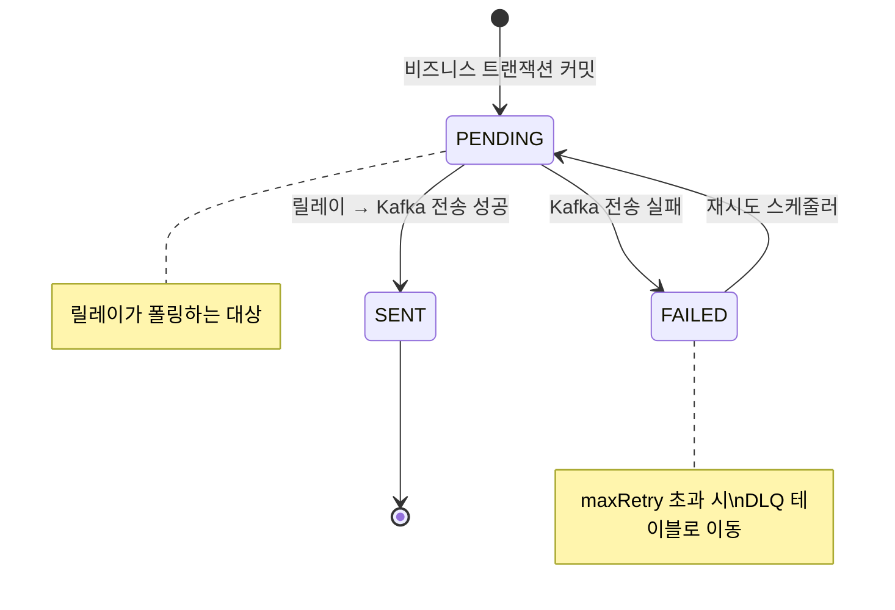
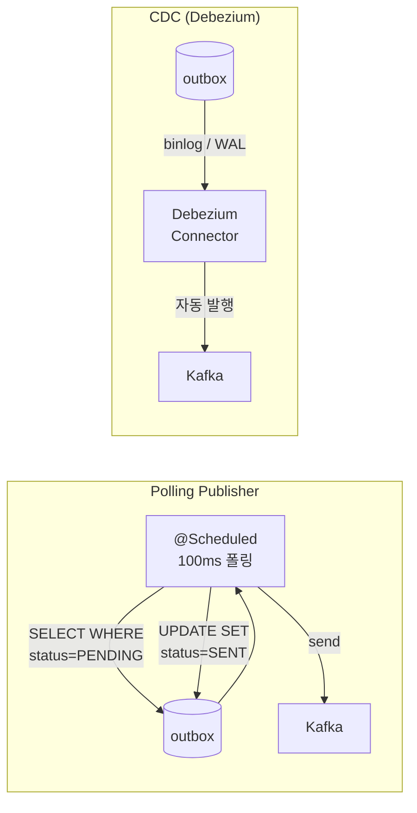
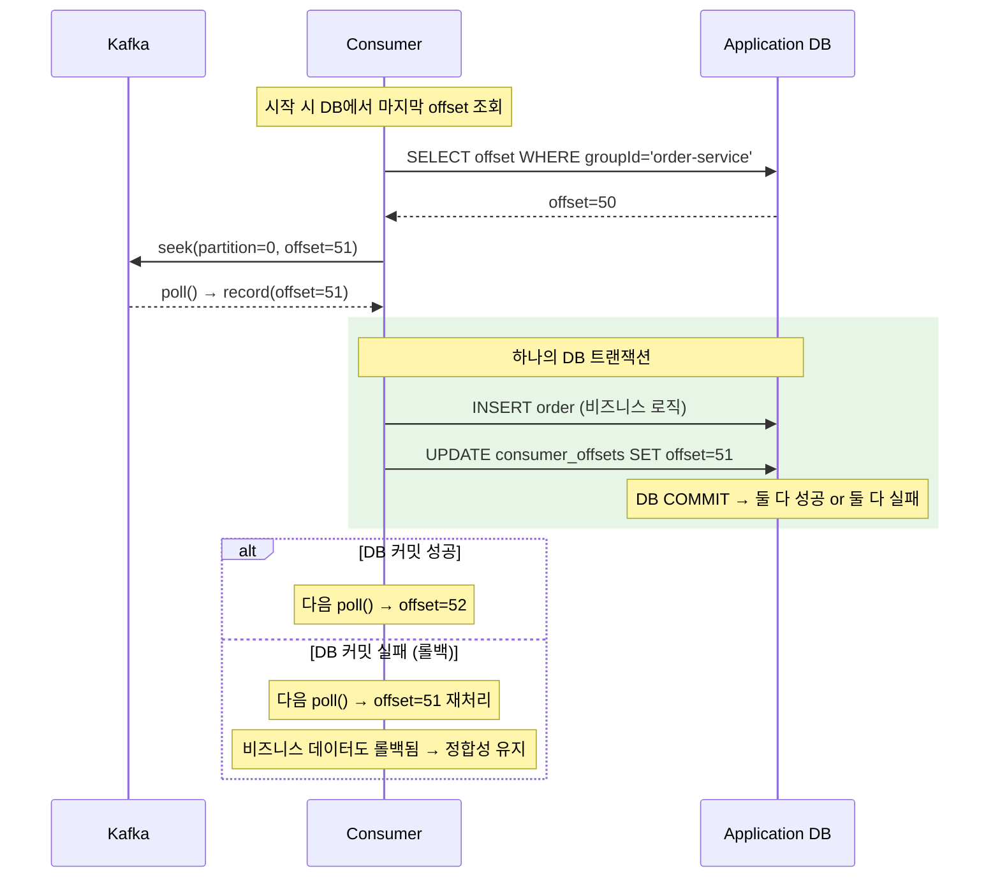
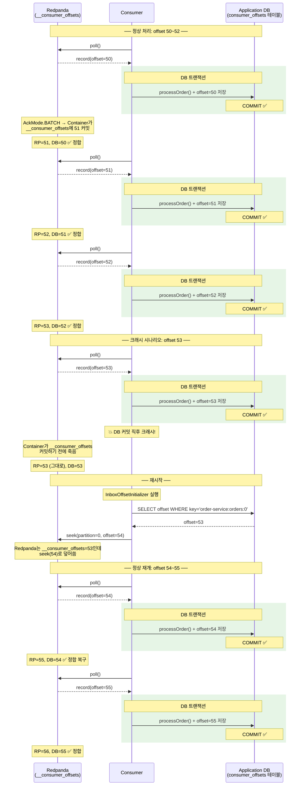
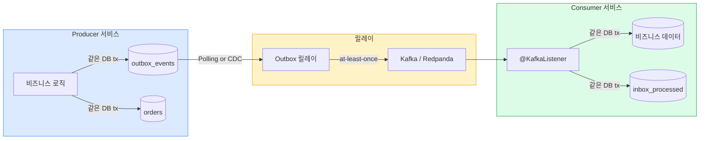
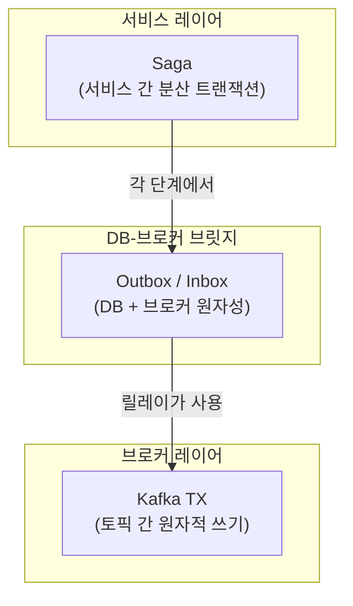

# 07. Spring Boot Kafka 트랜잭션 패턴

Spring Boot에서 Kafka/Redpanda 트랜잭션을 구현하는 실전 패턴을 다룬다. 설정부터 CTP 패턴, DB+Kafka 원자성, 실행 제어 패턴까지 코드 중심으로 정리했다.

> **이론적 배경**은 [02-fundamentals/12-transactions.md](../02-fundamentals/12-transactions.md) 참조
> **SAGA에서의 활용**은 [08-saga-choreography.md](08-saga-choreography.md), [09-saga-orchestration.md](09-saga-orchestration.md) 참조
> **DLQ에서의 활용**은 [05-dlq-strategy.md](05-dlq-strategy.md) 참조

---

## 1. 트랜잭션 Producer 설정

### application.yml

```yaml
spring:
  kafka:
    bootstrap-servers: localhost:19092
    producer:
      acks: all                          # 모든 ISR 복제본에 기록 확인
      retries: 3                         # 재시도 횟수
      properties:
        enable.idempotence: true         # 멱등성 활성화 (트랜잭션 전제조건)
        max.in.flight.requests.per.connection: 5  # 멱등성과 호환되는 최대값
      transaction-id-prefix: ${spring.application.name}-tx-  # 서비스 단위 식별 (필수)
    consumer:
      isolation-level: read_committed    # abort된 메시지 필터링
      enable-auto-commit: false          # 수동 오프셋 커밋 (트랜잭션에서 관리)
```

`transaction-id-prefix`를 설정하는 순간 Spring Kafka는 자동으로 `KafkaTransactionManager`를 생성하고, `KafkaTemplate`의 모든 send 호출이 트랜잭션 컨텍스트를 요구하게 된다. 이 한 줄이 트랜잭션 모드의 진입점이므로, 설정 없이 `executeInTransaction()`을 호출하면 `IllegalStateException`이 발생한다.

> **다중 인스턴스 주의**: 같은 `transaction-id-prefix`를 여러 애플리케이션 인스턴스가 공유하면, 각 인스턴스가 생성하는 `transactional.id`(= prefix + 증분값)가 충돌하여 서로를 fencing할 수 있다. Spring Kafka는 내부적으로 `{prefix}{n}` 형태(예: `my-app-tx-0`, `my-app-tx-1`)로 ID를 생성하는데, 두 인스턴스가 같은 prefix를 쓰면 같은 ID가 만들어져 한쪽이 `ProducerFencedException`으로 차단된다. 해결 방법은 인스턴스별로 고유한 prefix를 부여하는 것이다. 쿠버네티스라면 Pod 이름이나 호스트명을 prefix에 포함시키면 된다(예: `${spring.application.name}-${HOSTNAME}-tx-`).

### 왜 이 설정들이 필요한가

| 설정 | 이유 |
|------|------|
| `acks=all` | 트랜잭션 메시지가 모든 ISR에 복제되어야 커밋 시 유실되지 않음 |
| `enable.idempotence=true` | 네트워크 재시도 시 중복 방지. 트랜잭션의 전제조건 |
| `transaction-id-prefix` | Producer를 논리적으로 식별. Fencing에 사용 |
| `isolation-level: read_committed` | Consumer가 커밋된 메시지만 읽도록 보장 |
| `enable-auto-commit: false` | 오프셋 커밋을 트랜잭션에 포함시키기 위해 수동 관리 |

### Java Configuration

대부분의 경우 `application.yml`만으로 충분하지만, 여러 ProducerFactory를 사용하거나 세밀한 설정이 필요한 경우 Java 설정을 직접 작성할 수 있다.

```java
@Configuration
public class KafkaTransactionConfig {

    @Bean
    public ProducerFactory<String, Object> producerFactory(KafkaProperties properties) {
        Map<String, Object> props = properties.buildProducerProperties(null);
        DefaultKafkaProducerFactory<String, Object> factory =
            new DefaultKafkaProducerFactory<>(props);
        // transaction-id-prefix가 설정되면 자동으로 트랜잭션 모드
        factory.setTransactionIdPrefix(properties.getProducer().getTransactionIdPrefix());
        return factory;
    }

    @Bean
    public KafkaTransactionManager<String, Object> kafkaTransactionManager(
            ProducerFactory<String, Object> producerFactory) {
        return new KafkaTransactionManager<>(producerFactory);
    }

    @Bean
    public KafkaTemplate<String, Object> kafkaTemplate(
            ProducerFactory<String, Object> producerFactory) {
        return new KafkaTemplate<>(producerFactory);
    }
}
```

---

## 2. 기본 트랜잭션 사용법

### 방법 1: executeInTransaction (프로그래매틱 제어)

Kafka 트랜잭션만 필요하고 DB 트랜잭션은 관여하지 않을 때 가장 간단한 선택지다. 블록 안의 모든 send가 하나의 트랜잭션으로 묶이며, 블록이 정상 종료하면 `commitTransaction()`, 예외가 발생하면 `abortTransaction()`이 자동 호출된다.

```java
@Service
public class OrderEventPublisher {

    private final KafkaTemplate<String, Object> kafkaTemplate;

    public void publishOrderEvents(Order order) {
        kafkaTemplate.executeInTransaction(operations -> {
            // 이 블록 안의 모든 send는 하나의 트랜잭션
            operations.send("orders.order.created", order.getId(), orderCreatedEvent(order));
            operations.send("analytics.order.created", order.getId(), analyticsEvent(order));
            operations.send("notification.order.email", order.getId(), emailEvent(order));
            // 블록 종료 시 자동 commitTransaction()
            // 예외 발생 시 자동 abortTransaction()
            return null;
        });
    }
}
```

**동작 흐름:**
```
executeInTransaction() 호출
  → beginTransaction()
  → send(orders.order.created)     // 브로커에 기록되지만 아직 커밋 안 됨
  → send(analytics.order.created)  // 마찬가지
  → send(notification.order.email) // 마찬가지
  → 블록 정상 종료
  → commitTransaction()            // 세 메시지가 동시에 Consumer에게 보임
```

### 방법 2: @Transactional 어노테이션 (선언적 관리)

Spring의 `@Transactional` 어노테이션은 메서드 레벨에서 트랜잭션을 선언한다. Spring AOP가 메서드 진입 시 트랜잭션을 시작하고, 정상 종료 시 커밋, 예외 발생 시 롤백을 자동 처리하므로 코드가 간결해진다.

```java
@Service
public class OrderService {

    private final KafkaTemplate<String, Object> kafkaTemplate;
    private final OrderRepository orderRepository;

    // KafkaTransactionManager가 유일한 TransactionManager인 경우에만 이름 생략 가능
    @Transactional
    public void createOrder(CreateOrderRequest request) {
        kafkaTemplate.send("orders.order.created", request.getOrderId(), toEvent(request));
        kafkaTemplate.send("analytics.order.created", request.getOrderId(), toAnalytics(request));
        // 메서드 종료 시 자동 커밋, 예외 시 자동 abort
    }
}
```

**`@Transactional` 동작 메커니즘:**

Spring AOP는 프록시를 생성하여 메서드 진입/종료 시점에 트랜잭션을 자동으로 관리한다. 아래는 프록시가 내부적으로 수행하는 동작을 간략화한 코드다.

```java
// Spring AOP가 생성하는 프록시 (간략화)
public class OrderServiceProxy extends OrderService {

    @Override
    public void createOrder(CreateOrderRequest request) {
        TransactionStatus status = transactionManager.getTransaction();
        try {
            super.createOrder(request);  // 실제 비즈니스 로직 실행
            transactionManager.commit(status);  // 정상 종료 → 커밋
        } catch (Exception e) {
            transactionManager.rollback(status);  // 예외 발생 → 롤백
            throw e;
        }
    }
}
```

**언제 `@Transactional`을 사용할까?**

서비스 레이어 메서드 전체를 하나의 트랜잭션으로 묶을 때 적합하다. `executeInTransaction`과 달리 propagation 속성으로 전파 레벨을 선언적으로 제어할 수 있고, TransactionManager 이름 지정으로 DB/Kafka/체이닝을 전환할 수 있다.

```java
@Service
@RequiredArgsConstructor
public class OrderServiceWithDeclarativeTx {

    private final KafkaTemplate<String, Object> kafkaTemplate;
    private final OrderRepository orderRepository;

    // "kafkaTransactionManager"를 명시하는 이유는 아래 설명 참조
    @Transactional("kafkaTransactionManager")
    public void createOrderWithEvents(CreateOrderRequest request) {
        // 여러 비즈니스 로직
        Order order = buildOrder(request);
        validateOrder(order);

        // 여러 이벤트 발행
        kafkaTemplate.send("orders.created", order.getId(), toCreatedEvent(order));
        kafkaTemplate.send("analytics.order", order.getId(), toAnalytics(order));
        kafkaTemplate.send("notification.email", order.getId(), toEmailEvent(order));

        // 메서드 종료 시 자동 커밋, 중간에 예외 발생 시 모두 abort
    }

    // 트랜잭션 전파 레벨 제어
    @Transactional(propagation = Propagation.REQUIRES_NEW)
    public void publishAuditLog(AuditEvent event) {
        // 부모 트랜잭션과 무관하게 독립적인 트랜잭션
        kafkaTemplate.send("audit-log", event.getId(), event);
    }
}
```

**왜 `@Transactional("kafkaTransactionManager")`에 이름을 지정하는가?**

Spring Boot 애플리케이션에는 보통 여러 `TransactionManager`가 공존한다. JPA를 사용하면 `JpaTransactionManager`가 자동 등록되고, `transaction-id-prefix`를 설정하면 `KafkaTransactionManager`도 생성된다. `@Transactional`을 이름 없이 사용하면 Spring은 기본 TransactionManager(보통 JPA)를 선택하므로, Kafka 트랜잭션이 아니라 DB 트랜잭션이 열린다. Kafka 메시지를 원자적으로 발행하려면 반드시 `"kafkaTransactionManager"`를 명시해야 한다.

| 어노테이션 | 선택되는 TransactionManager | 트랜잭션 대상 |
|-----------|---------------------------|-------------|
| `@Transactional` | `JpaTransactionManager` (기본) | DB만 |
| `@Transactional("kafkaTransactionManager")` | `KafkaTransactionManager` | Kafka만 |
| `@Transactional("chainedTxManager")` | `ChainedKafkaTransactionManager` | DB + Kafka |

> `KafkaTransactionManager`만 등록된 프로젝트(JPA 미사용)라면 이름 없이 `@Transactional`만 써도 된다. 하지만 실무에서 DB 없이 Kafka만 쓰는 서비스는 드물기 때문에, 이름을 명시하는 습관을 들이는 것이 안전하다.

### 방법 1 vs 방법 2 비교

| 특성 | executeInTransaction | @Transactional |
|------|---------------------|----------------|
| **트랜잭션 범위** | 블록 내부만 | 메서드 전체 |
| **코드 간결성** | 중간 (명시적 블록) | 높음 (어노테이션만) |
| **세밀한 제어** | 블록 단위 제어 가능 | 메서드 단위만 |
| **DB 트랜잭션 체이닝** | 별도 구현 필요 | ChainedTransactionManager |
| **전파 레벨 제어** | 불가능 | propagation 속성 |
| **AOP 의존성** | 없음 | Spring AOP 필요 |
| **유연성** | 높음 (조건부 트랜잭션 쉬움) | 중간 (메서드 분리 필요) |
| **적합한 경우** | Kafka-to-Kafka 변환, 부분 트랜잭션 | 서비스 레이어 전체, DB+Kafka |

실무에서는 Consumer의 CTP 패턴이나 조건부 트랜잭션에는 `executeInTransaction`이 적합하고, Producer의 서비스 메서드나 DB 트랜잭션 체이닝에는 `@Transactional`이 자연스럽다.

---

## 3. Consume-Transform-Produce (CTP) 패턴

CTP 패턴의 이론적 배경(왜 오프셋 커밋과 메시지 발행을 하나의 트랜잭션으로 묶어야 하는지, 실패 시 어떻게 동작하는지)은 [02-fundamentals/12-transactions.md 섹션 4](../02-fundamentals/12-transactions.md)에서 다룬다. 여기서는 Spring Kafka로 CTP를 구현하는 방법에 집중한다.

### Spring Kafka에서의 CTP 구현

CTP를 Spring Kafka로 구현하려면 두 가지 설정이 필요하다. 첫째, `ConcurrentKafkaListenerContainerFactory`에 `KafkaTransactionManager`를 등록하여 Consumer Container가 매 폴 사이클마다 트랜잭션을 시작하도록 한다. 둘째, `EOSMode.V2`를 설정하여 오프셋 커밋이 트랜잭션에 포함되도록 한다. 이 두 설정이 조합되면 Container가 `@KafkaListener` 메서드 호출 전에 `beginTransaction()`을 하고, 메서드 정상 종료 시 `sendOffsetsToTransaction()` + `commitTransaction()`을 자동 수행한다.

raw API에서 직접 구현해야 했던 것(트랜잭션 경계, 오프셋 관리, 리밸런싱 방어)을 Spring Kafka Container가 자동 처리하므로, 개발자는 Transform + Produce 로직에만 집중하면 된다.

| 항목 | Raw API (12-transactions.md 참조) | Spring Boot |
|------|---------|-------------|
| 트랜잭션 시작 | `producer.beginTransaction()` 직접 호출 | Container가 자동 호출 |
| 오프셋 커밋 | `producer.sendOffsetsToTransaction()` 직접 호출 | Container가 자동 호출 |
| 트랜잭션 커밋/abort | 직접 호출 | 메서드 정상 종료 시 커밋, 예외 시 abort |
| 리밸런싱 처리 | `ConsumerRebalanceListener` 구현 | `EOSMode.V2`가 자동 처리 |
| 좀비 Fencing | `groupMetadata()` 직접 전달 | `EOSMode.V2`가 자동 전달 |
| 에러 복구 | catch 블록에서 예외 분류 | `DefaultErrorHandler`에 위임 |

**ContainerFactory 설정**

```java
@Configuration
public class CTPConsumerConfig {

    @Bean
    public ConcurrentKafkaListenerContainerFactory<String, Object> ctpListenerFactory(
            ConsumerFactory<String, Object> consumerFactory,
            KafkaTransactionManager<String, Object> transactionManager) {

        ConcurrentKafkaListenerContainerFactory<String, Object> factory =
            new ConcurrentKafkaListenerContainerFactory<>();
        factory.setConsumerFactory(consumerFactory);

        // Consumer Container가 Kafka 트랜잭션을 사용하도록 설정
        // Spring Kafka 3.0+: setTransactionManager() deprecated → setKafkaAwareTransactionManager()
        factory.getContainerProperties().setKafkaAwareTransactionManager(transactionManager);

        // V2: Consumer Group 메타데이터 기반 Fencing (Kafka 2.5+)
        // → 리밸런싱 중 좀비 Consumer의 오프셋 커밋을 자동 차단
        // → sendOffsetsToTransaction() 호출 시 groupId + generationId + memberId를 전달
        // → 이전 세대(generation)의 Consumer가 뒤늦게 커밋하면 Coordinator가 거부
        factory.getContainerProperties().setEosMode(
            ContainerProperties.EOSMode.V2);

        return factory;
    }
}
```

`EOSMode.V2`는 Consumer 리밸런싱 중 좀비 Consumer의 오프셋 커밋을 차단하는 방식을 결정한다. V1은 파티션마다 별도 Producer를 생성하여 Producer Fencing(epoch)으로 좀비를 막았는데, 파티션 수만큼 Producer가 필요해 Coordinator 부하가 컸다. V2는 하나의 Producer가 `sendOffsetsToTransaction()` 호출 시 `consumer.groupMetadata()`(generationId + memberId)를 전달하여, Coordinator가 세대 비교로 좀비를 거부한다. Spring Kafka 3.0부터 V2가 기본값이다.

> V1과 V2의 상세 비교(Mermaid 다이어그램 포함)는 [02-fundamentals/12-transactions.md — EOSMode](../02-fundamentals/12-transactions.md) 참조.

### 예시 1: 주문 검증 + 보강 파이프라인

이커머스에서 `orders.raw`로 들어오는 원시 주문 이벤트를 검증하고 보강한 뒤 다음 단계로 발행하는 시나리오다.

```
[orders.raw] → CTP Consumer
  ├── 재고 확인 (캐시 조회)
  ├── 가격 검증
  ├── 사기 탐지 점수 계산
  ├── 검증 성공 → [orders.enriched] + [analytics.orders]
  └── 검증 실패 → [orders.rejected]
```

```java
@Service
@RequiredArgsConstructor
public class OrderEnrichmentProcessor {

    private final KafkaTemplate<String, Object> kafkaTemplate;
    private final InventoryCache inventoryCache;
    private final PriceCache priceCache;
    private final FraudDetector fraudDetector;

    @KafkaListener(
        topics = "orders.raw",
        groupId = "order-enrichment",
        containerFactory = "ctpListenerFactory"  // CTP 전용 Factory
    )
    public void process(ConsumerRecord<String, RawOrder> record) {
        // ─── 이 메서드 전체가 하나의 Kafka 트랜잭션 안에서 실행됨 ───
        // Container가 poll() 후 자동으로 beginTransaction() 호출
        // 메서드 정상 종료 → sendOffsetsToTransaction() + commitTransaction()
        // 예외 발생 → abortTransaction() + 같은 오프셋에서 재처리

        RawOrder raw = record.value();

        // 1. 재고 확인 (로컬 캐시 — 외부 I/O 아님)
        if (!inventoryCache.hasStock(raw.getProductId(), raw.getQuantity())) {
            // 재고 부족 → 거부 토픽으로 (같은 트랜잭션)
            kafkaTemplate.send("orders.rejected", raw.getOrderId(),
                OrderRejected.builder()
                    .orderId(raw.getOrderId())
                    .reason("INSUFFICIENT_STOCK")
                    .build());
            return;  // 정상 종료 → 트랜잭션 커밋 (거부 메시지 + 오프셋 원자적)
        }

        // 2. 가격 검증 + 보강
        BigDecimal currentPrice = priceCache.getPrice(raw.getProductId());
        BigDecimal totalAmount = currentPrice.multiply(
            BigDecimal.valueOf(raw.getQuantity()));

        EnrichedOrder enriched = EnrichedOrder.builder()
            .orderId(raw.getOrderId())
            .customerId(raw.getCustomerId())
            .productId(raw.getProductId())
            .quantity(raw.getQuantity())
            .unitPrice(currentPrice)
            .totalAmount(totalAmount)
            .fraudScore(fraudDetector.score(raw))
            .enrichedAt(Instant.now())
            .build();

        // 3. 결과 발행 (같은 트랜잭션)
        kafkaTemplate.send("orders.enriched", raw.getOrderId(), enriched);

        // 4. 분석용 이벤트도 함께 발행 (같은 트랜잭션 — 원자적)
        kafkaTemplate.send("analytics.orders", raw.getOrderId(),
            OrderAnalytics.builder()
                .orderId(raw.getOrderId())
                .totalAmount(totalAmount)
                .fraudScore(enriched.getFraudScore())
                .processedAt(Instant.now())
                .build());

        // 메서드 종료 → Container가 자동으로:
        //   sendOffsetsToTransaction(orders.raw, nextOffset)
        //   commitTransaction()
        // → orders.enriched + analytics.orders + 오프셋이 원자적으로 커밋
    }
}
```

**Transform에서 외부 I/O를 피하는 이유**: 재고와 가격 조회가 로컬 캐시에서 이루어지는 점에 주목하자. CTP의 Transform 단계에서 외부 HTTP 호출이나 DB 쿼리를 하면, 그 호출의 결과는 Kafka 트랜잭션으로 롤백할 수 없다. 외부 I/O가 필요하면 결과를 미리 토픽이나 로컬 캐시에 물질화(materialize)해두고, Transform에서는 로컬 조회만 하는 것이 안전하다.

**다중 출력 토픽의 원자성**: `orders.enriched`와 `analytics.orders` 두 토픽에 메시지를 보내는 부분을 주목하자. 트랜잭션 없이 이 코드를 실행하면 한쪽만 성공하는 불일치가 발생할 수 있다. 트랜잭션 안에서 실행되므로 두 메시지가 반드시 함께 커밋되거나 함께 abort된다.

### 예시 2: SAGA Orchestrator 상태 전이

주문 SAGA에서 Orchestrator가 각 단계의 응답을 받아 다음 명령을 발행하는 CTP다. "응답 소비 + 상태 전이 + 다음 명령 발행"이 원자적이어야 하는 이유는, 분리되면 같은 응답을 두 번 처리하여 결제가 이중 청구되거나 재고가 이중 차감될 수 있기 때문이다.

```java
@Service
@RequiredArgsConstructor
public class OrderSagaOrchestrator {

    private final KafkaTemplate<String, Object> kafkaTemplate;
    private final SagaStateStore stateStore;

    @KafkaListener(
        topics = "saga.responses",
        containerFactory = "ctpListenerFactory"
    )
    public void handleSagaResponse(ConsumerRecord<String, SagaResponse> record) {
        // 하나의 트랜잭션: 응답 소비 + 상태 전이 + 다음 명령 발행

        SagaResponse response = record.value();
        String orderId = response.getOrderId();
        SagaState state = stateStore.get(orderId);

        switch (response.getStep()) {
            case INVENTORY_RESERVED:
                // 재고 확보 성공 → 결제 요청
                kafkaTemplate.send("payment.commands", orderId,
                    PaymentCommand.charge(orderId, state.getTotalAmount()));
                stateStore.update(orderId, SagaStatus.PAYMENT_PENDING);
                break;

            case PAYMENT_CHARGED:
                // 결제 성공 → 배송 요청
                kafkaTemplate.send("shipment.commands", orderId,
                    ShipmentCommand.create(orderId, state.getAddress()));
                stateStore.update(orderId, SagaStatus.SHIPMENT_PENDING);
                break;

            case INVENTORY_FAILED:
                // 재고 확보 실패 → 주문 취소 알림
                kafkaTemplate.send("order.notifications", orderId,
                    OrderNotification.cancelled(orderId, "재고 부족"));
                stateStore.update(orderId, SagaStatus.CANCELLED);
                break;

            case PAYMENT_FAILED:
                // 결제 실패 → 재고 보상 (release)
                kafkaTemplate.send("inventory.commands", orderId,
                    InventoryCommand.release(orderId, state.getProductId()));
                stateStore.update(orderId, SagaStatus.COMPENSATING);
                break;
        }
        // 메서드 종료 → "응답 오프셋 커밋 + 명령 발행"이 원자적
    }
}
```

### CTP에서 실패 시 동작

정상 케이스와 실패 케이스의 차이를 보면 트랜잭션의 원자성이 어떻게 작동하는지 분명해진다. 정상 시에는 결과 메시지와 소스 오프셋이 함께 커밋되고, 실패 시에는 둘 다 abort되어 다음 폴에서 같은 메시지를 재처리할 수 있다.

```
정상 케이스:
  beginTransaction()
  → consume(orders.raw, offset=50)
  → transform (비즈니스 로직)
  → send(orders.enriched, enrichedMsg)
  → send(analytics.orders, analyticsMsg)
  → sendOffsetsToTransaction(orders.raw, offset=51)
  → commitTransaction()
  결과: enrichedMsg + analyticsMsg 커밋 + offset=51 커밋

실패 케이스:
  beginTransaction()
  → consume(orders.raw, offset=50)
  → transform → 예외 발생!
  → abortTransaction()
  결과: 모든 메시지 abort + offset 미커밋 → offset=50 재처리
```

---

## 4. DB + Kafka 원자성 패턴 (Dual Write Problem)

실무에서 가장 흔한 요구사항은 "DB 업데이트와 Kafka 메시지 발행을 원자적으로" 처리하는 것이다. 이를 **Dual Write Problem**이라 부른다. DB와 Kafka는 서로 다른 시스템이므로, 둘을 하나의 트랜잭션으로 묶을 수 없다. 하나는 성공하고 다른 하나는 실패하면 데이터 불일치가 발생한다.

```
Dual Write Problem:
  Producer 쪽: DB에 주문 저장 + Kafka에 OrderCreated 발행 → 둘 중 하나만 실패하면?
  Consumer 쪽: Kafka에서 메시지 소비 + DB에 처리 결과 저장 → 둘 중 하나만 실패하면?
```

이 문제는 Producer 쪽과 Consumer 쪽에서 각각 다른 패턴으로 해결한다. 두 패턴 모두 핵심 원리는 동일한데, 두 시스템에 동시에 쓰는 대신 하나의 시스템(DB)에만 쓰고 나머지는 나중에 동기화하는 것이다.

| 패턴 | 적용 위치 | 핵심 아이디어 |
|------|----------|-------------|
| **Transactional Outbox** | Producer | 발행할 이벤트를 DB에 먼저 저장 → 별도 프로세스가 Kafka로 전달 |
| **Transactional Inbox** | Consumer | Kafka offset을 DB에 저장 → 메시지 처리와 offset 커밋이 같은 DB tx |

### 접근법 1: ChainedKafkaTransactionManager

> ⚠️ **Spring Kafka 3.0에서 deprecated.** `ChainedKafkaTransactionManager`는 두 트랜잭션 매니저를 순차 커밋하지만, 커밋 순서 간극에서 불일치가 발생할 수 있어 deprecated되었다. 신규 프로젝트에서는 **접근법 2: Transactional Outbox 패턴**을 사용할 것을 권장한다. 기존 코드의 마이그레이션이 어려운 경우에만 참고용으로 이 섹션을 확인하라.

DB 트랜잭션과 Kafka 트랜잭션을 순차적으로 체이닝하는 방식이다. 구현이 단순해서 빠르게 적용할 수 있지만, Kafka 커밋은 성공했는데 DB 커밋이 실패하는 극히 짧은 간극이 존재한다. 금융이나 결제처럼 100% 원자성이 필요한 시스템이 아니라면 이 방식으로 충분하다.

```java
@Configuration
public class ChainedTxConfig {

    @Bean
    public ChainedKafkaTransactionManager<String, Object> chainedTxManager(
            KafkaTransactionManager<String, Object> kafkaTxManager,
            DataSourceTransactionManager dbTxManager) {
        // Kafka TX → DB TX 순서로 커밋
        // 롤백은 역순 (DB TX → Kafka TX)
        return new ChainedKafkaTransactionManager<>(kafkaTxManager, dbTxManager);
    }
}
```

```java
@Service
public class OrderService {

    private final KafkaTemplate<String, Object> kafkaTemplate;
    private final OrderRepository orderRepository;

    @Transactional("chainedTxManager")
    public void createOrder(CreateOrderRequest request) {
        // 1. DB에 저장
        Order order = orderRepository.save(toEntity(request));

        // 2. Kafka에 이벤트 발행
        kafkaTemplate.send("orders.order.created", order.getId(), toEvent(order));

        // 메서드 종료 시: Kafka 커밋 → DB 커밋
        // 예외 발생 시: DB 롤백 → Kafka abort
    }
}
```

### 접근법 1.5: @TransactionalEventListener (경량 대안)

ChainedTxManager의 "DB 커밋 성공 → Kafka 커밋 실패" 간극이 걱정되지만, Outbox까지 도입하기에는 과하다고 느낄 때 사용할 수 있는 경량 패턴이다. Spring의 `@TransactionalEventListener`를 활용하여 DB 트랜잭션이 확실히 커밋된 후에만 Kafka 메시지를 발행한다.

```java
@Service
@RequiredArgsConstructor
public class OrderService {

    private final OrderRepository orderRepository;
    private final ApplicationEventPublisher eventPublisher;

    @Transactional  // DB 트랜잭션만
    public void createOrder(CreateOrderRequest request) {
        Order order = orderRepository.save(toEntity(request));

        // DB 커밋 전에는 이벤트만 등록 (Kafka 전송 안 함)
        eventPublisher.publishEvent(new OrderCreatedEvent(order));
    }
}

@Component
@RequiredArgsConstructor
public class OrderEventHandler {

    private final KafkaTemplate<String, Object> kafkaTemplate;

    // DB 트랜잭션이 커밋된 후에만 실행됨
    @TransactionalEventListener(phase = TransactionPhase.AFTER_COMMIT)
    public void handleOrderCreated(OrderCreatedEvent event) {
        kafkaTemplate.send("orders.order.created",
            event.getOrder().getId(), toKafkaEvent(event));
    }
}
```

**동작 흐름**: DB 트랜잭션 커밋 → Spring이 `AFTER_COMMIT` 리스너 호출 → Kafka 메시지 전송. DB 트랜잭션이 롤백되면 리스너 자체가 호출되지 않으므로, "DB는 롤백됐는데 Kafka 메시지만 나간" 상황이 원천 차단된다.

**한계**: DB 커밋은 성공했지만 Kafka 전송이 실패하면, DB에는 주문이 있는데 이벤트는 발행되지 않는 상태가 된다. 이 경우 재시도 로직을 직접 구현해야 하며, Outbox처럼 자동 복구가 되지 않는다. 메시지 유실이 허용되지 않는 시스템이라면 Outbox 패턴을 사용해야 한다.

| 비교 | ChainedTxManager | @TransactionalEventListener | Outbox |
|------|-----------------|----------------------------|--------|
| **DB 커밋 전 Kafka 발행** | 가능 (간극) | 불가능 (안전) | 불가능 (안전) |
| **Kafka 실패 시 DB 롤백** | 안 됨 | 안 됨 | 불필요 (DB만 씀) |
| **메시지 유실 방지** | 99.9%+ | 재시도 직접 구현 | 100% (릴레이 재시도) |
| **복잡도** | 낮음 | 낮음 | 중간 |

### 접근법 2: Transactional Outbox (Producer 쪽)

Producer가 DB에 주문을 저장하면서 Kafka에 이벤트도 발행해야 하는 상황을 생각해 보자. DB 커밋은 성공했는데 Kafka 전송이 실패하면, 주문은 생성됐지만 다른 서비스는 이를 모르는 상태가 된다. Outbox 패턴은 Kafka에 직접 보내지 않고, 발행할 이벤트를 DB의 outbox 테이블에 저장하는 방식으로 이 문제를 해결한다. 비즈니스 데이터와 outbox 기록이 같은 DB 트랜잭션이므로 원자성이 보장되며, 별도 릴레이 프로세스가 outbox를 폴링하여 Kafka로 전달한다.

```
기존 방식 (Dual Write):
  1. orderRepository.save(order)     → DB 커밋 ✅
  2. kafkaTemplate.send(event)       → Kafka 전송 ❌  ← 불일치!

Outbox 방식 (Single Write):
  1. orderRepository.save(order)     ┐
  2. outboxRepository.save(event)    ┘ 같은 DB tx → 원자적 ✅
  3. [릴레이] outbox → Kafka 전달    → 실패해도 재시도하면 됨 (at-least-once)
```

```java
// 1. 비즈니스 로직 + Outbox 기록 (하나의 DB 트랜잭션)
@Service
public class OrderService {

    private final OrderRepository orderRepository;
    private final OutboxRepository outboxRepository;

    @Transactional  // DB 트랜잭션만
    public void createOrder(CreateOrderRequest request) {
        Order order = orderRepository.save(toEntity(request));

        // Outbox에 이벤트 저장 (같은 DB 트랜잭션)
        outboxRepository.save(OutboxEvent.builder()
            .aggregateType("Order")
            .aggregateId(order.getId())
            .eventType("OrderCreated")
            .payload(toJson(toEvent(order)))
            .status(OutboxStatus.PENDING)
            .build());
        // DB 커밋 시 order + outbox_event가 원자적으로 저장됨
    }
}

// 2. Outbox 릴레이 (별도 스케줄러)
@Component
public class OutboxRelay {

    private final OutboxRepository outboxRepository;
    private final KafkaTemplate<String, Object> kafkaTemplate;

    @Scheduled(fixedDelay = 100)  // 100ms 간격으로 폴링
    @Transactional
    public void relay() {
        List<OutboxEvent> pending = outboxRepository.findByStatus(OutboxStatus.PENDING);
        for (OutboxEvent event : pending) {
            kafkaTemplate.send(
                resolveTopicName(event),
                event.getAggregateId(),
                event.getPayload()
            );
            event.setStatus(OutboxStatus.SENT);
        }
    }
}
```

#### Outbox 이벤트 상태 머신

Outbox 이벤트는 `PENDING → SENT` 또는 `PENDING → FAILED`로 전이된다. 릴레이가 Kafka 전송에 실패하면 FAILED로 기록하고, 별도 재시도 로직이 다시 PENDING으로 되돌려 재전송한다.



주의할 점은 릴레이가 **at-least-once** 특성을 가진다는 것이다. 릴레이가 Kafka 전송에 성공했지만 DB 상태를 SENT로 업데이트하기 전에 크래시하면, 재시작 후 같은 이벤트를 다시 전송한다. 따라서 Outbox를 사용하는 시스템에서는 **Consumer 쪽 멱등성이 필수**다 — 같은 메시지가 두 번 와도 결과가 동일해야 한다.

#### 릴레이 방식: Polling Publisher vs CDC

Outbox 릴레이를 구현하는 방식은 크게 두 가지다.

**Polling Publisher**: 위 코드처럼 `@Scheduled`로 outbox 테이블을 주기적으로 조회하여 PENDING 이벤트를 Kafka로 전달한다. 구현이 단순하지만, 폴링 주기만큼 지연이 발생하고 빈 폴링이 DB에 부하를 준다.

**CDC (Change Data Capture)**: Debezium 같은 도구가 DB의 트랜잭션 로그(MySQL binlog, PostgreSQL WAL)를 구독하여 outbox 테이블에 INSERT가 발생하면 자동으로 Kafka에 발행한다. 애플리케이션 코드에 릴레이가 필요 없고 실시간성이 높지만, Debezium 커넥터 운영이라는 추가 인프라가 필요하다.



| 항목 | Polling Publisher | CDC (Debezium) |
|------|------------------|----------------|
| 구현 복잡도 | 낮음 (`@Scheduled` + JPA) | 높음 (Debezium 커넥터 운영) |
| 지연시간 | 폴링 주기 (100ms~수 초) | 거의 실시간 (수십 ms) |
| DB 부하 | 빈 폴링 시에도 쿼리 발생 | 없음 (로그 구독) |
| 상태 관리 | 애플리케이션이 PENDING/SENT/FAILED 관리 | 불필요 (전송 즉시 삭제 가능) |
| 중복 발행 | 가능 (전송 후 상태 업데이트 전 크래시) | 낮음 (커넥터가 오프셋 관리) |
| 적합한 경우 | 소규모, 인프라 단순 | 대규모, 실시간성 중요 |

> Debezium의 Outbox Event Router(`io.debezium.transforms.outbox.EventRouter`)를 사용하면 outbox 테이블의 컬럼을 Kafka 토픽/키/값으로 자동 매핑할 수 있어, 릴레이 코드 자체가 불필요해진다.

#### Outbox 릴레이 트러블슈팅: Kafka 콜백 스레드와 EntityManager

> 출처: [회원가입 성공시 메일 무한 발송](https://velog.io/@dw_db/%ED%9A%8C%EC%9B%90%EA%B0%80%EC%9E%85-%EC%84%B1%EA%B3%B5%EC%8B%9C-%EB%A9%94%EC%9D%BC-%EB%AC%B4%ED%95%9C-%EB%B0%9C%EC%86%A1)

Outbox 릴레이에서 Kafka Producer 콜백을 사용할 때 실전에서 자주 발생하는 이슈가 있다. 릴레이가 outbox 이벤트를 Kafka로 전송한 후, Producer 콜백에서 `event.setStatus(SENT)`를 호출했는데 DB에 반영되지 않아 같은 이벤트가 무한 재전송되는 문제다.

```java
// ❌ 문제가 되는 코드
@Scheduled(fixedDelay = 100)
@Transactional
public void relay() {
    List<OutboxEvent> pending = outboxRepository.findByStatus(PENDING);
    for (OutboxEvent event : pending) {
        kafkaTemplate.send(resolveTopicName(event), event.getAggregateId(), event.getPayload())
            .addCallback(
                success -> event.setStatus(OutboxStatus.SENT),  // ← Kafka I/O 스레드에서 실행!
                failure -> event.setStatus(OutboxStatus.FAILED)
            );
    }
}
```

근본 원인은 Spring의 `EntityManager`가 **ThreadLocal**에 바인딩된다는 점이다. `@Scheduled` 스레드에서 조회한 영속 엔티티가 Kafka Producer 콜백 스레드(다른 스레드)에서 수정되면, 해당 스레드에는 영속성 컨텍스트가 없으므로 엔티티가 준영속(detached) 상태가 된다. JPA 변경 감지(dirty checking)가 작동하지 않아 DB UPDATE가 발생하지 않는 것이다.

```
스케줄러 스레드 (Thread-A)          Kafka 콜백 스레드 (Thread-B)
┌──────────────────────┐          ┌──────────────────────┐
│ EntityManager 존재    │          │ EntityManager 없음    │
│ outboxEvent = 영속    │  ──→     │ outboxEvent = 준영속  │
│ dirty checking ✅     │          │ dirty checking ❌     │
└──────────────────────┘          └──────────────────────┘
```

해결 방법은 콜백에서 새 트랜잭션을 열고 엔티티를 재조회하여 영속 상태로 만든 후 수정하는 것이다.

```java
// ✅ 수정된 코드
@Scheduled(fixedDelay = 100)
@Transactional
public void relay() {
    List<OutboxEvent> pending = outboxRepository.findByStatus(PENDING);
    for (OutboxEvent event : pending) {
        Long eventId = event.getId();  // ID만 캡처
        kafkaTemplate.send(resolveTopicName(event), event.getAggregateId(), event.getPayload())
            .addCallback(
                success -> updateStatus(eventId, OutboxStatus.SENT),
                failure -> updateStatus(eventId, OutboxStatus.FAILED)
            );
    }
}

@Transactional(propagation = Propagation.REQUIRES_NEW)  // 새 트랜잭션 + 새 EntityManager
public void updateStatus(Long eventId, OutboxStatus status) {
    OutboxEvent event = outboxRepository.findById(eventId).orElseThrow();  // 재조회 → 영속
    event.setStatus(status);  // dirty checking 정상 작동
}
```

이 문제는 Outbox 릴레이에만 국한되지 않는다. `@Async`, `CompletableFuture`, 스레드 풀 등 스레드 경계를 넘는 모든 JPA 작업에서 동일하게 발생할 수 있으므로, Kafka Producer 콜백에서 JPA 엔티티를 수정하려면 반드시 새 트랜잭션 + 재조회 패턴을 적용해야 한다.

#### Outbox + Failover 실전 사례: AI 태그 추천 시스템

> 출처: [Transactional Outbox/Failover로 AI 태그 추천 시스템 설계하기](https://velog.io/@praisebak/Transactional-OutboxFailover로-AI-태그-추천-시스템-설계하기)

TIL 플랫폼에서 외부 AI API(OpenAI)로 태그를 자동 추출하는 기능에 Outbox + Failover + DLQ를 조합한 3중 방어 사례다. 핵심 요구사항은 TIL 저장이 AI 서비스와 무관하게 성공해야 하고, 태그는 최종적 일관성(eventual consistency)으로 생성되어야 한다는 것이다.

```
TIL 저장 + Outbox 이벤트 저장 (같은 DB 트랜잭션)
  ↓
스케줄러(30초 간격) → Outbox 폴링 → AI API 호출
  ↓ (실패)
Failover: OpenAI → Claude 자동 전환
  ↓ (모두 실패)
DLQ 테이블 저장 + Slack 알람
```

**Failover 패턴 — 인터페이스 기반 대체 API 전환**:

```java
public interface AIClient {
    String callAI(List<Map<String, Object>> messages, Map<String, Object> functionDef);
    String getClientName();
    boolean isAvailable();
}

// Failover 실행: 등록된 AIClient를 순서대로 시도
public String callAIWithFallback(List<Map<String, Object>> messages,
                                  Map<String, Object> functionDef) {
    for (AIClient client : aiClients) {  // OpenAI → Claude 순서
        try {
            return client.callAI(messages, functionDef);
        } catch (Exception e) {
            log.warn("{} API 실패: {}", client.getClientName(), e.getMessage());
        }
    }
    throw new RuntimeException("사용 가능한 AI 서비스 없음");
}
```

**Outbox 스케줄러** — Kafka 릴레이 대신 직접 API 호출하는 변형:

```java
@Scheduled(fixedDelay = 30_000)  // 30초마다
@Transactional
public void processPendingEvents() {
    List<TagCreationOutboxEvent> events =
        outboxRepository.findPendingEvents(LocalDateTime.now());
    for (TagCreationOutboxEvent event : events) {
        try {
            String tags = aiService.callAIWithFallback(event.getTilContent());
            tagService.saveTags(event.getTilId(), tags);
            event.setStatus(OutboxEventStatus.COMPLETED);
        } catch (Exception e) {
            event.incrementRetryCount();
            if (event.getRetryCount() >= MAX_RETRIES) {
                dlqService.sendToDLQ("TAG_CREATION", event.getId(),
                    event.getTilContent(), e.getMessage(), getStackTrace(e));
                event.setStatus(OutboxEventStatus.FAILED);
            }
        }
    }
}
```

이 사례가 보여주는 교훈은 Outbox 패턴의 릴레이가 반드시 Kafka 전송일 필요가 없다는 점이다. 외부 API 호출처럼 DB 트랜잭션과 분리해야 하는 모든 부수 효과에 Outbox를 적용할 수 있으며, Failover + DLQ와 조합하면 외부 의존성 장애에 대한 다층 방어가 가능해진다.

### 접근법 비교

| 접근법 | 원자성 | 복잡도 | 지연시간 | 적합한 경우 |
|--------|--------|--------|----------|------------|
| Chained TX Manager | 99.9%+ (간극 존재) | 낮음 | 즉시 | 대부분의 서비스 |
| Transactional Outbox | 100% | 중간 | 릴레이 주기만큼 | 금융, 결제, 주문 |
| CDC (Debezium) | 100% | 높음 | 수 초 | 레거시 통합, 대규모 |

### 접근법 4: Transactional Inbox (Consumer 쪽)

Consumer 쪽에서도 Dual Write 문제가 발생한다. Kafka에서 메시지를 가져와 비즈니스 로직을 처리하고 offset을 커밋해야 하는데, DB에 결과를 저장한 후 offset 커밋 전에 Consumer가 죽으면 재시작 시 같은 메시지를 다시 처리하게 된다(중복). 반대로 offset을 먼저 커밋하고 DB 저장이 실패하면, 메시지가 처리된 것으로 간주되지만 실제로는 손실된 셈이다.

```
일반적인 방식 (Dual Write):
  1. poll() → 메시지 수신 (offset=50)
  2. processOrder(event)              → DB INSERT ✅
  3. ack.acknowledge()                → Kafka offset 커밋 ❌  ← Consumer 크래시!
  → 재시작 시 offset=50부터 다시 → 중복 처리

Inbox 방식 (Single Write):
  1. poll() → 메시지 수신 (offset=50)
  2. 같은 DB 트랜잭션에서:
     a. processOrder(event)           → DB INSERT
     b. consumer_offsets 테이블에 offset=51 저장
  3. 재시작 시 DB에서 마지막 offset 조회 → seek(51)
  → DB 트랜잭션이 롤백되면 offset도 롤백 → 정합성 보장
```

Inbox 패턴의 해결 전략은 Kafka의 내장 offset 관리(`ack.acknowledge()`)를 사용하지 않는 것이다. 대신 Consumer가 처리한 offset을 애플리케이션 DB에 저장한다. 비즈니스 로직과 offset 저장이 같은 DB 트랜잭션이므로, 둘 다 성공하거나 둘 다 실패할 수밖에 없다.

#### Inbox 구현

```java
// 1. Offset 저장 테이블
@Entity
@Table(name = "consumer_offsets")
public class ConsumerOffset {
    @Id
    private String id;  // "{groupId}:{topic}:{partition}"

    private String groupId;
    private String topic;
    private int partition;
    private long offset;
    private Instant updatedAt;
}

// 2. Inbox Consumer
@Service
@RequiredArgsConstructor
@Slf4j
public class InboxOrderConsumer {

    private final OrderRepository orderRepository;
    private final ConsumerOffsetRepository offsetRepository;

    @KafkaListener(
        topics = "orders",
        groupId = "order-service",
        properties = "enable.auto.commit=false"
    )
    @Transactional  // DB 트랜잭션: 비즈니스 로직 + offset 저장이 원자적
    public void consume(ConsumerRecord<String, OrderEvent> record) {
        String offsetKey = String.format("%s:%s:%d",
            "order-service", record.topic(), record.partition());

        // 이미 처리한 offset인지 확인 (재시작 후 중복 방지)
        ConsumerOffset saved = offsetRepository.findById(offsetKey).orElse(null);
        if (saved != null && record.offset() <= saved.getOffset()) {
            log.info("Already processed: topic={}, partition={}, offset={}",
                record.topic(), record.partition(), record.offset());
            return;  // 스킵
        }

        // 비즈니스 로직 처리
        processOrder(record.value());

        // offset을 DB에 저장 (같은 트랜잭션)
        offsetRepository.save(new ConsumerOffset(
            offsetKey,
            "order-service",
            record.topic(),
            record.partition(),
            record.offset(),
            Instant.now()
        ));

        // ack.acknowledge() 호출하지 않음 → Kafka offset 커밋 안 함
        // DB의 offset이 진짜 "처리 완료" 기록
    }
}

// 3. Consumer 시작 시 DB에서 offset 복원
//
// Inbox 패턴에서는 ack.acknowledge()를 호출하지 않으므로
// Kafka의 __consumer_offsets에 offset이 기록되지 않는다.
// Consumer 재시작이나 리밸런싱 시 Kafka는 __consumer_offsets에서
// 마지막 커밋 offset을 찾지만, Inbox에서는 이 값이 없거나 오래되었다.
// → DB에 저장한 "진짜 마지막 처리 offset"으로 seek해야 한다.
//
// ConsumerSeekAware: Spring Kafka 인터페이스로, 파티션 할당/해제 콜백을 받는다.
// @Component로 등록하면 Container가 파티션 할당 시 자동으로 onPartitionsAssigned() 호출.
@Component
@RequiredArgsConstructor
public class InboxOffsetInitializer implements ConsumerSeekAware {

    private final ConsumerOffsetRepository offsetRepository;

    @Override
    public void onPartitionsAssigned(
            Map<TopicPartition, Long> assignments,
            ConsumerSeekCallback callback) {

        // 할당된 각 파티션에 대해 DB에서 마지막 처리 offset을 조회
        for (TopicPartition tp : assignments.keySet()) {
            String key = String.format("order-service:%s:%d", tp.topic(), tp.partition());
            offsetRepository.findById(key).ifPresent(offset ->
                // +1: DB에 저장된 값은 "처리 완료한 offset"이므로, 그 다음부터 읽어야 함
                // 예: DB에 offset=50 → seek(51) → 51번부터 poll()
                callback.seek(tp.topic(), tp.partition(), offset.getOffset() + 1)
            );
            // DB에 offset이 없으면(최초 실행) seek하지 않음
            // → auto.offset.reset 설정(earliest/latest)에 따라 시작 위치 결정
        }
    }
}
```

#### Inbox 동작 플로우



#### Redpanda offset vs DB offset: 실제로 어떻게 달라지는가

Inbox 패턴에서 Redpanda의 `__consumer_offsets`와 애플리케이션 DB의 `consumer_offsets` 테이블이 어떻게 분기하는지, offset 50~55 흐름으로 살펴보자.



각 시점의 두 오프셋 값을 정리하면 다음과 같다.

| 시점 | Redpanda<br/>`__consumer_offsets` | DB<br/>`consumer_offsets` | 상태 | 설명 |
|------|:-:|:-:|------|------|
| offset 50 처리 후 | 51 | 50 | 정합 | 둘 다 정상 커밋 |
| offset 51 처리 후 | 52 | 51 | 정합 | |
| offset 52 처리 후 | 53 | 52 | 정합 | |
| offset 53 처리 후 | **53** | **53** | **불일치** | DB 커밋 ✅ → 크래시 → RP 커밋 ❌ |
| 재시작 (seek) | 53 → **54** | 53 | 복구 | `seek(54)`가 RP 값을 덮어씀 |
| offset 54 처리 후 | 55 | 54 | 정합 | 정상 재개 |
| offset 55 처리 후 | 56 | 55 | 정합 | |

핵심은 **크래시 시점에 두 값이 분기**한다는 점이다. DB에는 53이 저장됐지만 Redpanda에는 53이 커밋되지 않아 여전히 53(=다음에 줄 오프셋)인 상태다. 만약 `InboxOffsetInitializer`가 없었다면, Redpanda는 offset 53부터 다시 줘서 **중복 처리**가 발생했을 것이다. `seek(54)`가 이 불일치를 해소하고, 이후로는 다시 정합 상태가 된다.

> Redpanda의 `__consumer_offsets` 값은 "다음에 줄 오프셋"이고, DB의 `consumer_offsets` 값은 "마지막으로 처리 완료한 오프셋"이다. 따라서 정합 상태에서도 항상 `RP값 = DB값 + 1` 관계가 된다.

#### Outbox vs Inbox 비교

| 항목 | Transactional Outbox | Transactional Inbox |
|------|---------------------|---------------------|
| **적용 위치** | Producer (메시지 발행) | Consumer (메시지 소비) |
| **해결하는 문제** | DB 저장 + Kafka 발행 원자성 | Kafka 소비 + DB 처리 원자성 |
| **핵심 테이블** | `outbox_events` | `consumer_offsets` |
| **추가 컴포넌트** | Outbox 릴레이 (폴링 or CDC) | ConsumerSeekAware (offset 복원) |
| **Kafka offset 관리** | 관계 없음 | Kafka 대신 DB가 관리 |
| **멱등성** | 릴레이 재전송 → Consumer 멱등성 필요 | DB 중복 체크로 자체 해결 |
| **함께 사용** | 가능 — Producer는 Outbox, Consumer는 Inbox로 양쪽 모두 원자성 확보 |

#### Inbox 변형: 메시지 ID 기반 멱등성 (inbox_processed)

위의 Inbox 구현은 **오프셋 기반**이다. 하지만 실무에서는 오프셋이 아닌 **메시지 ID 기반**으로 중복을 판별하는 변형이 더 자주 쓰인다. Outbox 릴레이가 같은 이벤트를 두 번 발행할 수 있고(at-least-once), 이 경우 오프셋은 다르지만 비즈니스적으로 같은 이벤트이기 때문이다.

```java
// 1. 처리 이력 테이블
@Entity
@Table(name = "inbox_processed")
public class InboxProcessed {
    @Id
    private String messageId;  // Kafka 헤더의 eventId 또는 Outbox의 aggregateId + eventType
    private String eventType;
    private Instant processedAt;
}

// 2. 메시지 ID 기반 Inbox Consumer
@Service
@RequiredArgsConstructor
public class IdempotentOrderConsumer {

    private final OrderRepository orderRepository;
    private final InboxProcessedRepository inboxRepository;

    @KafkaListener(topics = "orders", groupId = "order-service")
    @Transactional  // 비즈니스 로직 + 처리 이력 = 같은 DB 트랜잭션
    public void consume(ConsumerRecord<String, OrderEvent> record) {
        String messageId = extractMessageId(record);  // 헤더 또는 페이로드에서 추출

        // 이미 처리한 메시지인지 확인
        if (inboxRepository.existsById(messageId)) {
            return;  // 멱등: 같은 결과를 보장하므로 스킵
        }

        // 비즈니스 로직 처리
        processOrder(record.value());

        // 처리 이력 저장 (같은 트랜잭션)
        inboxRepository.save(new InboxProcessed(
            messageId, "OrderCreated", Instant.now()));
    }

    private String extractMessageId(ConsumerRecord<String, OrderEvent> record) {
        // Outbox에서 발행한 이벤트라면 헤더에 eventId가 포함됨
        Header header = record.headers().lastHeader("eventId");
        if (header != null) return new String(header.value());
        // 헤더가 없으면 페이로드의 고유 필드 사용
        return record.value().getOrderId() + ":" + record.value().getEventType();
    }
}
```

| 비교 | 오프셋 기반 Inbox | 메시지 ID 기반 Inbox |
|------|-------------------|---------------------|
| 중복 판별 기준 | Kafka offset (파티션별) | 비즈니스 메시지 ID |
| Outbox 재발행 대응 | 불가 (다른 오프셋이면 재처리) | 가능 (같은 ID면 스킵) |
| 추가 컴포넌트 | `ConsumerSeekAware` (seek 필수) | 불필요 (Kafka offset 그대로 사용) |
| 테이블 크기 | 파티션 수만큼 (소량) | 처리한 메시지 수만큼 (대량 → 주기적 정리 필요) |
| 적합한 경우 | 단일 Producer, 중복 발행 없음 | Outbox 릴레이 사용, at-least-once 환경 |

> 메시지 ID 기반 방식은 Ch08 SAGA Choreography의 `ProcessedEvent` 테이블 (correlationId + eventType 복합 키)과 동일한 원리다. 자세한 구현은 [08-idempotent-consumer.md](../01-event-driven/17-idempotency-patterns.md) 참조.

#### Outbox + Inbox 전체 아키텍처

Producer는 Outbox로, Consumer는 Inbox(또는 멱등성)로 양쪽 모두 원자성을 확보하면, 엔드투엔드 exactly-once 처리가 가능해진다.



실무에서는 대부분의 시스템이 Outbox만으로 충분하다. Consumer 쪽은 멱등성(dedup 테이블)으로 해결하는 것이 더 간단하기 때문이다. Inbox 패턴(오프셋 기반이든 메시지 ID 기반이든)은 멱등성 구현이 어렵거나, 정확히 한 번(exactly-once) 처리가 비즈니스 요구사항인 경우(금융 정산, 포인트 적립 등)에 적합하다.

---

## 5. 실행 제어 패턴

Kafka/Redpanda는 메시지 전달 인프라이지 실행 엔진이 아니다. 병렬, 순차, 트랜잭션 실행은 Consumer 측 애플리케이션 로직으로 구현하며, Spring Kafka의 `concurrency` 설정과 파티션 키 전략이 핵심 도구가 된다.

### 5.1 병렬 실행

여러 메시지를 동시에 처리하는 패턴이다. 알림 발송처럼 메시지 간 의존성이 없을 때 `concurrency`를 파티션 수에 맞추면 처리량을 극대화할 수 있다.

```java
@Configuration
public class ParallelConsumerConfig {

    @Bean
    public ConcurrentKafkaListenerContainerFactory<String, Object> parallelFactory(
            ConsumerFactory<String, Object> consumerFactory) {

        ConcurrentKafkaListenerContainerFactory<String, Object> factory =
            new ConcurrentKafkaListenerContainerFactory<>();
        factory.setConsumerFactory(consumerFactory);
        factory.setConcurrency(3);  // 3개의 Consumer 스레드
        return factory;
    }
}

@Service
public class NotificationService {

    // 3개의 스레드가 각각 파티션을 담당하여 병렬 처리
    @KafkaListener(
        topics = "notification.send",
        groupId = "notification-service",
        containerFactory = "parallelFactory"
    )
    public void sendNotification(NotificationEvent event) {
        // 각 메시지를 독립적으로 처리 (순서 무관)
        emailService.send(event);
    }
}
```

파티션 내부에서는 순서가 보장되지만, 파티션 간에는 순서가 보장되지 않는다는 점을 이해해야 한다. 같은 키의 메시지는 같은 파티션에 배치되므로, 키 기반으로 순서를 보장할 수 있다.

```
토픽: notification.send (3 파티션)

파티션 0: [msg1, msg4, msg7] → Consumer 스레드 1 (순차 처리)
파티션 1: [msg2, msg5, msg8] → Consumer 스레드 2 (순차 처리)
파티션 2: [msg3, msg6, msg9] → Consumer 스레드 3 (순차 처리)

→ 파티션 내부에서는 순서 보장 (msg1 → msg4 → msg7)
→ 파티션 간에는 순서 보장 없음 (msg1과 msg2 중 누가 먼저일지 모름)
→ 같은 키의 메시지는 같은 파티션에 배치됨 (키 기반 순서 보장)
```

### 5.2 순차 실행

메시지를 순서대로 처리해야 하는 경우에 사용한다. 동일 엔티티의 상태 변경처럼 순서가 뒤바뀌면 데이터 정합성이 깨지는 상황이 대표적이다.

```java
@Configuration
public class SequentialConsumerConfig {

    @Bean
    public ConcurrentKafkaListenerContainerFactory<String, Object> sequentialFactory(
            ConsumerFactory<String, Object> consumerFactory) {

        ConcurrentKafkaListenerContainerFactory<String, Object> factory =
            new ConcurrentKafkaListenerContainerFactory<>();
        factory.setConsumerFactory(consumerFactory);
        factory.setConcurrency(1);  // 단일 스레드 → 완전 순차
        return factory;
    }
}

@Service
public class OrderStateService {

    // 단일 스레드로 순차 처리
    @KafkaListener(
        topics = "orders.state-changes",
        groupId = "order-state-service",
        containerFactory = "sequentialFactory"
    )
    public void handleStateChange(OrderStateChanged event) {
        // msg1 → msg2 → msg3 순서 보장
        orderStateMachine.transition(event);
    }
}
```

하지만 `concurrency=1`은 처리량이 낮다. 실무에서 가장 흔한 패턴은 키 기반 순차 + 파티션 간 병렬이다. 같은 주문 ID의 이벤트는 같은 파티션에 배치되어 순차 처리되고, 다른 주문의 이벤트는 다른 파티션에서 병렬 처리된다.

```java
// Producer: 같은 주문의 이벤트는 같은 파티션으로
kafkaTemplate.send("orders.state-changes", order.getId(), event);
// order.getId()가 파티션 키 → 같은 주문 ID는 항상 같은 파티션

// Consumer: 파티션 수만큼 병렬, 파티션 내부는 순차
@KafkaListener(
    topics = "orders.state-changes",
    groupId = "order-state-service",
    concurrency = "3"  // 파티션 수에 맞춤
)
public void handleStateChange(OrderStateChanged event) {
    // 주문 A의 이벤트끼리는 순차 보장 (같은 파티션)
    // 주문 A와 주문 B의 이벤트는 병렬 가능 (다른 파티션)
    orderStateMachine.transition(event);
}
```

### 5.3 트랜잭션 실행

여러 메시지를 하나의 원자적 단위로 발행하는 패턴이다. SAGA 단계 진행처럼 상태 이벤트, 다음 단계 명령, 감사 로그를 동시에 발행해야 하는데, 하나만 실패하면 전체가 abort되어야 하는 경우에 사용한다.

```java
@Service
public class SagaStepExecutor {

    private final KafkaTemplate<String, Object> kafkaTemplate;

    /**
     * 3개의 이벤트를 원자적으로 발행.
     * 하나라도 실패하면 모두 abort → Consumer에게 아무것도 안 보임.
     */
    public void executeStep(String orderId, StepResult result) {
        kafkaTemplate.executeInTransaction(ops -> {
            // msg1: 상태 변경 이벤트
            ops.send("saga.state", orderId, toStateEvent(result));

            // msg2: 다음 단계 명령
            ops.send("saga.commands", orderId, toCommand(result));

            // msg3: 감사 로그
            ops.send("audit.saga-steps", orderId, toAuditLog(result));

            // 세 메시지 모두 커밋되거나, 모두 abort
            return null;
        });
    }
}
```

### 세 패턴 비교

| 패턴 | concurrency | 순서 보장 | 처리량 | 사용 사례 |
|------|------------|-----------|--------|-----------|
| **병렬** | N (파티션 수) | 파티션 내만 | 높음 | 알림, 로그, 독립 이벤트 |
| **순차** | 1 | 전체 | 낮음 | 상태 머신, 순서 의존 처리 |
| **키 기반 순차+병렬** | N | 키 단위 | 중간 | 엔티티별 순서 보장 (실무 표준) |
| **트랜잭션** | - | 원자적 발행 | 중간 | 다중 토픽 원자적 쓰기 |

Redpanda/Kafka는 파티션 내 순서 보장과 트랜잭션 원자성을 인프라 레벨에서 지원하며, 그 위에서 Spring Kafka가 `concurrency`, 파티션 키, `executeInTransaction` 등의 도구로 실행 패턴을 구현하는 구조다.

---

## 6. 트랜잭션 에러 처리

### ProducerFencedException

Producer Fencing의 이론(같은 `transactional.id`로 새 Producer가 시작되면 이전 Producer가 차단되는 메커니즘, Epoch 번호 기반 좀비 방어)은 [02-fundamentals/12-transactions.md 섹션 2](../02-fundamentals/12-transactions.md)에서 다룬다. 여기서는 Spring Boot에서 이 예외를 처리하는 코드 패턴만 다룬다.

```java
@Service
public class ResilientProducer {

    private final KafkaTemplate<String, Object> kafkaTemplate;

    public void sendWithRetry(String topic, String key, Object value) {
        try {
            kafkaTemplate.executeInTransaction(ops -> {
                ops.send(topic, key, value);
                return null;
            });
        } catch (ProducerFencedException e) {
            // 이 Producer는 더 이상 사용 불가
            // 새 Producer 인스턴스가 필요 (보통 애플리케이션 재시작)
            log.error("Producer fenced. 다른 인스턴스가 같은 transactional.id를 사용 중", e);
            throw e;  // 상위로 전파하여 재시작 유도
        }
    }
}
```

`ProducerFencedException`은 복구 불가능한 예외다. 같은 `transactional.id`를 가진 새 Producer가 이미 활성화되었으므로, catch에서 재시도하는 것은 의미가 없다. 쿠버네티스 환경이라면 Pod 재시작으로 새 Epoch가 할당되어 자동 복구된다.

### 트랜잭션 타임아웃

트랜잭션이 `transaction.timeout.ms`(기본 60초)를 초과하면 브로커가 자동 abort한다. 오래 걸리는 처리가 있다면 타임아웃을 늘리는 것보다 트랜잭션 범위를 좁히는 편이 낫다. 트랜잭션이 길어지면 `read_committed` Consumer의 LSO가 진행하지 못해 다운스트림 전체가 지연되기 때문이다.

```java
// 긴 처리가 필요한 경우 타임아웃 조정
spring.kafka.producer.properties.transaction.timeout.ms=120000  # 2분

// 또는 트랜잭션 범위를 좁게 유지 (권장)
public void processLargeOrder(Order order) {
    // 트랜잭션 밖: 오래 걸리는 처리
    EnrichedOrder enriched = enrichmentService.enrich(order);  // 30초 소요

    // 트랜잭션 안: 메시지 발행만 (빠름)
    kafkaTemplate.executeInTransaction(ops -> {
        ops.send("orders.enriched", order.getId(), enriched);
        ops.send("analytics.order", order.getId(), toAnalytics(enriched));
        return null;
    });
}
```

### @RetryableTopic와 트랜잭션 비호환

`@RetryableTopic`(논블로킹 재시도)은 `KafkaTransactionManager`와 함께 사용할 수 없다. Spring Kafka 공식 문서에서 "Non-blocking retries CANNOT combine with Container Transactions"라고 명시한다.

**비호환 원인**: `@RetryableTopic`은 실패 메시지를 retry 토픽으로 전송한 뒤 원본 리스너를 "성공"으로 처리한다. 컨테이너 입장에서는 정상 반환이므로 트랜잭션이 커밋된다. 리스너 안에서 `kafkaTemplate.send()`로 보낸 메시지들도 함께 커밋되어, 실패한 처리의 부분 결과가 영구 저장되는 원자성 위반이 발생한다.

```
■ DefaultErrorHandler (블로킹) + 트랜잭션
  리스너 예외 → 트랜잭션 롤백 → outgoing 메시지 취소 → ✅ 원자성 보장

■ @RetryableTopic (논블로킹) + 트랜잭션
  리스너 예외 → retry 토픽 전송 → "성공" 반환 → 트랜잭션 커밋
  → ❌ outgoing 메시지가 커밋됨 → 실패했는데 부분 결과가 남음
```

**트랜잭션 환경에서는 `DefaultErrorHandler`가 유일한 선택이다.** 재시도 전략 상세는 [05-dlq-strategy.md](./05-dlq-strategy.md) 참조.

참고: [Spring Kafka GitHub #2934](https://github.com/spring-projects/spring-kafka/issues/2934)

### 트랜잭션 내 Producer Backpressure

트랜잭션 안에서 send를 호출하면 Producer 내부 버퍼(`buffer.memory`, 기본 32MB)에 레코드가 쌓이고, 별도 I/O 스레드가 브로커로 전송한다. 버퍼가 가득 차면 send 호출이 `max.block.ms`만큼 블로킹되며, 그래도 공간이 확보되지 않으면 `TimeoutException`이 발생한다. 이 예외가 `executeInTransaction` 블록 안에서 터지면 자동으로 `abortTransaction()`이 호출된다.

문제는 타임아웃 설정 간 계층 관계를 무시하면 예측 불가능한 실패가 발생한다는 점이다. 이론적 배경은 [02-fundamentals/12-transactions.md 섹션 5](../02-fundamentals/12-transactions.md)에서 다루며, 여기서는 Spring Boot에서의 설정 원칙을 정리한다.

**설정 원칙**: 안쪽 타임아웃 < 바깥 타임아웃

```yaml
spring:
  kafka:
    producer:
      properties:
        max.block.ms: 10000              # 10s — 버퍼 풀이면 빠르게 실패
        delivery.timeout.ms: 30000       # 30s — 개별 send 예산
        transaction.timeout.ms: 60000    # 60s — 전체 tx 예산
        request.timeout.ms: 10000        # 10s — 단일 요청 타임아웃
        retry.backoff.ms: 200            # 200ms — 재시도 간격
```

```java
@Configuration
public class TransactionTimeoutConfig {

    @Bean
    public ProducerFactory<String, Object> producerFactory(KafkaProperties properties) {
        Map<String, Object> props = properties.buildProducerProperties(null);
        props.put(ProducerConfig.MAX_BLOCK_MS_CONFIG, 10_000);          // 10s
        props.put(ProducerConfig.DELIVERY_TIMEOUT_MS_CONFIG, 30_000);   // 30s
        props.put(ProducerConfig.TRANSACTION_TIMEOUT_CONFIG, "60000");  // 60s
        props.put(ProducerConfig.REQUEST_TIMEOUT_MS_CONFIG, 10_000);    // 10s
        props.put(ProducerConfig.RETRY_BACKOFF_MS_CONFIG, 200);         // 200ms

        DefaultKafkaProducerFactory<String, Object> factory =
            new DefaultKafkaProducerFactory<>(props);
        factory.setTransactionIdPrefix(properties.getProducer().getTransactionIdPrefix());
        return factory;
    }
}
```

`max.block.ms`(10s)에서 버퍼 풀 상태를 빠르게 감지하고, `delivery.timeout.ms`(30s) 안에서 개별 send의 재시도를 완료하며, 이 모든 것이 `transaction.timeout.ms`(60s) 안에 끝나도록 설계한다. 기본값은 `delivery.timeout.ms`(120s) > `transaction.timeout.ms`(60s)여서 브로커가 트랜잭션을 먼저 abort하는 함정이 있으므로, 트랜잭션 환경에서는 반드시 조정해야 한다.

**abort 후 안전한 재시도 패턴**:

트랜잭션이 abort되었다면 새 트랜잭션으로 전체를 재시도하는 것이 안전하다. 단, `ProducerFencedException`은 복구 불가능하므로 즉시 전파해야 한다.

```java
public void sendWithTxRetry(String topic, String key, Object value, int maxRetries) {
    for (int attempt = 1; attempt <= maxRetries; attempt++) {
        try {
            kafkaTemplate.executeInTransaction(ops -> {
                ops.send(topic, key, value);
                return null;
            });
            return;  // 성공
        } catch (ProducerFencedException e) {
            throw e;  // 복구 불가 — 다른 인스턴스가 같은 transactional.id 사용 중
        } catch (Exception e) {
            if (attempt == maxRetries) throw e;
            log.warn("트랜잭션 실패 (시도 {}/{}): {}", attempt, maxRetries, e.getMessage());
            try { Thread.sleep(attempt * 500L); } catch (InterruptedException ie) {
                Thread.currentThread().interrupt();
                throw new RuntimeException(ie);
            }
        }
    }
}
```

재시도 시 `executeInTransaction`이 내부적으로 새 트랜잭션을 시작하므로, 이전 abort된 트랜잭션의 잔여 상태가 간섭하지 않는다. 지수 백오프(`attempt * 500ms`)를 적용하면 브로커 부하가 일시적인 경우 자연스럽게 복구된다.

---

## 7. 패턴 관계: Kafka TX, Outbox, Saga

Kafka 트랜잭션, Outbox, Saga는 각각 다른 레이어에서 다른 문제를 해결한다. 이 세 패턴을 같은 선상에 놓고 비교하면 혼란이 생기지만, 레이어를 구분하면 각 패턴의 역할과 조합 방식이 명확해진다.

### 레이어 구조



Saga는 여러 서비스에 걸친 비즈니스 트랜잭션을 조율하고, 각 단계에서 Outbox로 DB 저장과 이벤트 발행의 원자성을 보장하며, Outbox 릴레이는 Kafka TX로 토픽에 원자적으로 쓴다. 위에서 아래로 내려갈수록 범위가 좁아지고 보장이 강해지는 구조다.

### 각 패턴이 해결하는 문제

| 패턴 | 해결하는 문제 | 범위 | 참조 |
|------|-------------|------|------|
| **Kafka TX** | 여러 토픽/파티션에 원자적 쓰기 | 단일 Producer, Kafka 내부 | 섹션 2 |
| **Outbox/Inbox** | DB 저장 + 이벤트 발행 원자성 | 단일 서비스, DB↔Kafka | 섹션 4 |
| **Saga** | 여러 서비스의 비즈니스 트랜잭션 | 서비스 간 | [08-saga-choreography.md](08-saga-choreography.md) |

Kafka TX는 Kafka 내부만 다루므로 DB와의 원자성은 보장하지 못한다. Outbox는 단일 서비스의 DB↔Kafka 간극을 메우지만, 여러 서비스에 걸친 일관성은 관여하지 않는다. Saga는 서비스 간 조율을 담당하지만, 각 단계의 DB↔Kafka 원자성은 Outbox에 위임한다.

### 결정 트리

```
Q1. 원자적 쓰기가 Kafka 토픽 안에서만 필요한가?
  → Yes: Kafka TX (섹션 2의 executeInTransaction)

Q2. DB 저장과 Kafka 발행을 원자적으로 해야 하는가?
  → 간극 허용 가능: ChainedTxManager (섹션 4 접근법 1)
  → 간극 불허: Outbox (섹션 4 접근법 2)

Q3. 여러 서비스에 걸친 비즈니스 트랜잭션인가?
  → 2-3개 서비스: Choreography Saga
  → 4개 이상 또는 복잡한 보상: Orchestration Saga
  → 각 Saga 단계에서 Q2로 돌아감
```

### 실전 조합 예시: 주문 SAGA의 재고 차감 단계

주문 SAGA에서 Inventory Service가 재고를 차감하고 `InventoryReserved` 이벤트를 발행하는 한 단계를 보면, 세 패턴이 어떻게 조합되는지 분명해진다.

```
1. @Transactional (DB)
   → 재고 차감 (inventory 테이블 UPDATE)
   → Outbox 테이블에 InventoryReserved 이벤트 INSERT
   → DB COMMIT (원자적)

2. Outbox 릴레이 (별도 스레드/스케줄러)
   → Outbox에서 PENDING 이벤트 조회
   → kafkaTemplate.executeInTransaction(ops -> {
         ops.send("saga.inventory-reserved", orderId, event);
         // Kafka TX로 원자적 발행
     });
   → Outbox 상태를 SENT로 업데이트
```

DB 트랜잭션이 재고 차감과 이벤트 기록의 원자성을 보장하고(Outbox), 릴레이가 Kafka 트랜잭션으로 메시지를 원자적으로 발행하며(Kafka TX), 이 전체가 SAGA의 한 단계로 동작한다(Saga). 세 패턴이 각자의 레이어에서 역할을 수행하는 전형적인 조합이다.

---

## 8. 테스트

### 통합 테스트 with Testcontainers

트랜잭션의 커밋/abort 동작을 검증하려면 실제 브로커가 필요하다. Testcontainers로 Redpanda를 띄우고, `read_committed` Consumer로 메시지 가시성을 확인하는 것이 가장 신뢰할 수 있는 방법이다.

```java
@SpringBootTest
@Testcontainers
class TransactionalProducerTest {

    @Container
    static RedpandaContainer redpanda = new RedpandaContainer("redpandadata/redpanda:v25.3.6");

    @DynamicPropertySource
    static void redpandaProperties(DynamicPropertyRegistry registry) {
        registry.add("spring.kafka.bootstrap-servers", redpanda::getBootstrapServers);
        registry.add("spring.kafka.producer.transaction-id-prefix", () -> "test-tx-");
    }

    @Autowired
    private KafkaTemplate<String, Object> kafkaTemplate;

    @Test
    void 트랜잭션_커밋_시_모든_메시지_보임() {
        kafkaTemplate.executeInTransaction(ops -> {
            ops.send("topic-a", "key", "msg1");
            ops.send("topic-b", "key", "msg2");
            return null;
        });

        // read_committed Consumer로 검증
        ConsumerRecords<String, Object> recordsA = consume("topic-a", "read_committed");
        ConsumerRecords<String, Object> recordsB = consume("topic-b", "read_committed");

        assertThat(recordsA).hasSize(1);
        assertThat(recordsB).hasSize(1);
    }

    @Test
    void 트랜잭션_abort_시_메시지_안_보임() {
        assertThrows(RuntimeException.class, () ->
            kafkaTemplate.executeInTransaction(ops -> {
                ops.send("topic-a", "key", "msg1");
                throw new RuntimeException("의도적 실패");
            })
        );

        // read_committed Consumer에게 메시지 안 보임
        ConsumerRecords<String, Object> records = consume("topic-a", "read_committed");
        assertThat(records).isEmpty();
    }
}
```

---

## 참고

- [Spring Kafka - Transactions](https://docs.spring.io/spring-kafka/reference/kafka/transactions.html)
- [Redpanda Transactions Documentation](https://docs.redpanda.com/current/develop/transactions/)
- 관련 문서: [02-fundamentals/12-transactions.md](../02-fundamentals/12-transactions.md) (트랜잭션 이론)
- 관련 문서: [08-saga-choreography.md](08-saga-choreography.md) (SAGA + 트랜잭션)
- 관련 문서: [09-saga-orchestration.md](09-saga-orchestration.md) (Orchestrator + CTP)
- 관련 문서: [05-dlq-strategy.md](05-dlq-strategy.md) (트랜잭션 DLQ)

---

## 학습 정리

### 핵심 개념

1. **`transaction-id-prefix` 설정이 트랜잭션의 시작이다.** 이 한 줄을 `application.yml`에 추가하면 Spring Kafka가 `KafkaTransactionManager`를 자동 생성하고, 이후 모든 `KafkaTemplate.send()`는 트랜잭션 컨텍스트 없이 호출할 수 없게 된다.

2. **`executeInTransaction`과 `@Transactional`은 용도가 다르다.** Kafka 메시지만 원자적으로 발행할 때는 `executeInTransaction`이 간단하고, DB 트랜잭션과 함께 사용하거나 전파 레벨을 제어해야 할 때는 `@Transactional` + `ChainedKafkaTransactionManager`가 적합하다.

3. **CTP의 핵심은 오프셋 커밋과 메시지 발행의 원자성에 있다.** Spring Kafka의 `EOSMode.V2`를 사용하면 Container가 consume-produce-commitOffset을 하나의 트랜잭션으로 묶어주므로, 애플리케이션 코드에서는 트랜잭션을 의식하지 않아도 된다.

4. **DB+Kafka 원자성은 Kafka 트랜잭션만으로 해결할 수 없다.** Producer 쪽은 Outbox, Consumer 쪽은 Inbox 패턴으로 해결하며, 핵심 원리는 두 시스템에 동시에 쓰지 않고 하나의 시스템(DB)에만 쓰고 나머지는 나중에 동기화하는 것이다. ChainedTxManager는 간단하지만 간극이 존재하고, Outbox/Inbox는 완벽하지만 추가 컴포넌트가 필요하다.

5. **실행 제어는 Consumer의 책임이다.** 병렬(concurrency=N), 순차(concurrency=1), 키 기반 순차(파티션 키)는 Spring Kafka 설정으로 제어하며, Redpanda는 파티션 순서 보장과 트랜잭션 원자성을 인프라로 제공할 뿐이다.

6. **Kafka TX, Outbox, Saga는 서로 다른 레이어의 패턴이다.** Kafka TX는 브로커 내부의 원자적 쓰기, Outbox는 DB↔브로커 간 원자성, Saga는 서비스 간 분산 트랜잭션을 담당한다. 실전에서는 Saga의 각 단계가 Outbox로 DB+이벤트 원자성을 확보하고, Outbox 릴레이가 Kafka TX로 메시지를 발행하는 조합이 일반적이다.

> **프로덕션 사례**: Namastack Outbox 라이브러리 + @RetryableTopic 조합 아키텍처는 [21-outbox-retry-architecture.md](./21-outbox-retry-architecture.md)를 참조한다.
