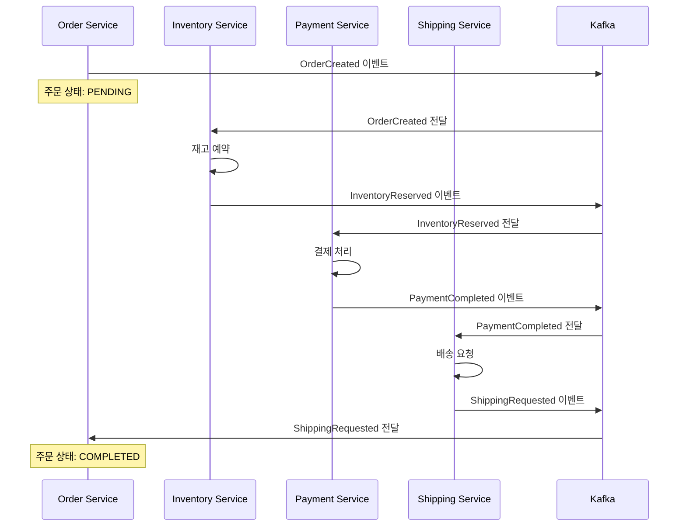
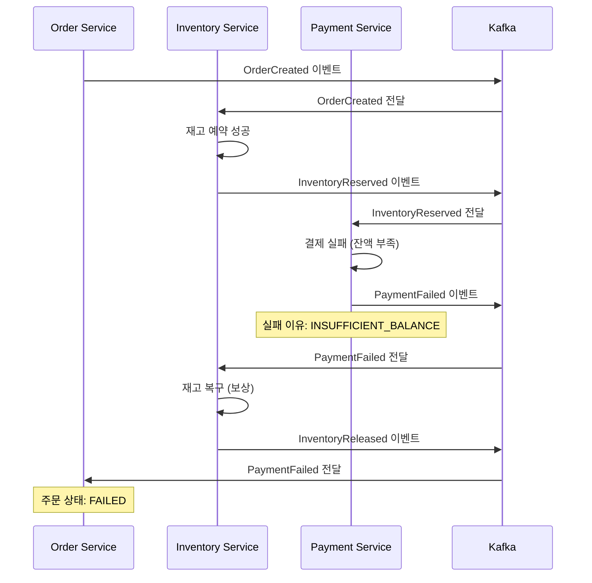
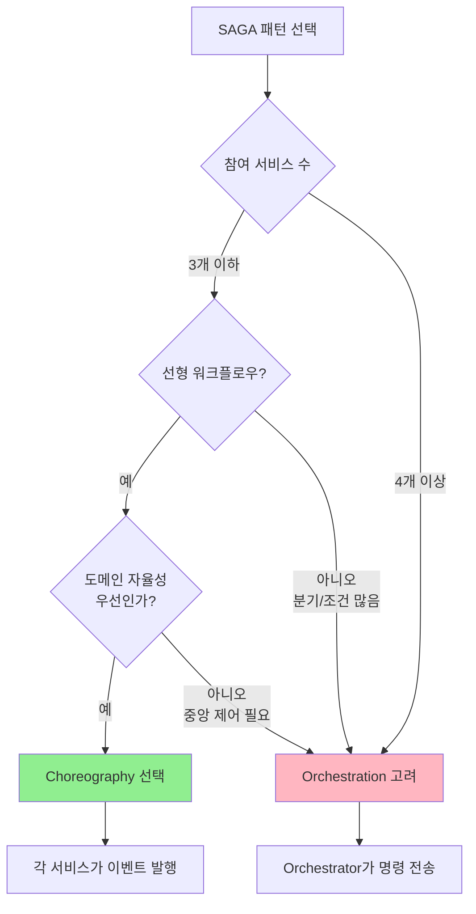

# 08. SAGA Pattern - Choreography

이벤트 기반 분산 트랜잭션 (각 서비스가 자율적으로 반응)

> **멱등성 구현 상세**: Idempotent Consumer 패턴, 멱등성 키 전략, 데이터베이스 기반 중복 방지는 [06-idempotent-consumer.md](./06-idempotent-consumer.md) 참조

---

## 왜 분산 트랜잭션이 필요한가

마이크로서비스 아키텍처에서는 각 서비스가 독립적인 데이터베이스를 가진다. 전통적인 모놀리식 시스템에서는 단일 DB 트랜잭션으로 여러 테이블을 원자적으로 업데이트할 수 있었지만, 분산 환경에서는 이것이 불가능하다. 2PC(Two-Phase Commit)와 같은 분산 트랜잭션 프로토콜도 존재하지만, 동기적 lock으로 인한 성능 저하, 단일 코디네이터의 단일 장애점, 긴 대기 시간으로 인한 처리량 감소 등의 문제가 있다.

SAGA 패턴은 이러한 한계를 극복하기 위해 등장했다. 하나의 긴 트랜잭션을 여러 로컬 트랜잭션으로 분할하고, 각 로컬 트랜잭션이 완료되면 다음 단계로 진행하며, 실패 시 보상 트랜잭션(Compensating Transaction)을 통해 이미 완료된 작업을 되돌린다. 이는 최종 일관성(Eventual Consistency)을 전제로 하며, 즉시 일관성 대신 "언젠가는 일관된 상태에 도달한다"는 것을 보장한다.

SAGA 패턴은 크게 두 가지 방식으로 구현된다: Choreography(안무)와 Orchestration(오케스트라). 이 문서는 Choreography 방식을 다룬다.

---

## Choreography 방식

Choreography는 중앙 조정자 없이 각 서비스가 이벤트를 발행하고 구독하며 자율적으로 반응하는 방식이다. 마치 댄서들이 안무를 외워 각자 판단해서 움직이듯, 각 서비스는 "어떤 이벤트가 오면 무엇을 해야 하는지"를 미리 알고 있으며, 외부의 지시 없이 스스로 다음 단계를 수행한다.

**왜 중앙 조정자가 없는가?** 마이크로서비스의 핵심 원칙 중 하나는 서비스 자율성이다. 각 팀이 독립적으로 배포하고 확장할 수 있어야 하는데, 중앙 조정자가 있으면 모든 워크플로우가 조정자에 의존하게 되어 결합도가 높아진다. Choreography는 이벤트 메시지 브로커(Kafka, RabbitMQ 등)만 공유하고, 비즈니스 로직은 각 서비스에 캡슐화된다.

**장점:**
- **느슨한 결합**: 서비스 간 직접 호출이 없으므로 서비스 추가/삭제가 용이하다.
- **확장성**: 이벤트 브로커가 부하를 분산하므로 수평 확장이 자연스럽다.
- **단순성**: 단순한 워크플로우(2~3개 서비스)에서는 구현이 직관적이다.
- **도메인 자율성**: 각 도메인이 자신의 비즈니스 규칙을 완전히 제어한다.

**비용:**
- **복잡한 워크플로우 추적 어려움**: 4개 이상 서비스가 연결되면 전체 플로우를 한눈에 파악하기 어렵다.
- **순환 의존성 위험**: A→B→C→A 같은 이벤트 체인이 생길 수 있다.
- **디버깅 난이도**: 실패 지점을 찾으려면 여러 서비스의 로그를 추적해야 한다.
- **트랜잭션 상태 추적 부재**: 전체 SAGA의 진행 상태를 저장하는 주체가 없다.

---

## 시나리오: 주문 처리

### 정상 플로우



### 실패 및 보상 플로우



결제가 실패하면 `PaymentFailed` 이벤트가 발행되고, Inventory Service는 이 이벤트를 구독하고 있다가 이미 예약한 재고를 복구한다. 이것이 보상 트랜잭션이다.

---

## Kafka 트랜잭션: 브로커 레벨의 원자적 메시지 발행

### SAGA와 Kafka 트랜잭션은 다른 레이어의 문제

SAGA 패턴은 **서비스 간** 분산 트랜잭션을 다룬다. 반면 Kafka/Redpanda 트랜잭션(Transactional Producer)은 **브로커 내부**에서 여러 메시지의 원자적 발행을 다룬다. 두 개념은 레이어가 다르며, 실무에서는 함께 사용한다.

**문제**: Choreography 패턴에서 각 서비스는 "DB 업데이트 + 이벤트 발행"을 동시에 해야 한다. 예를 들어 Inventory Service가 재고를 차감한 후 `InventoryReserved` 이벤트를 발행해야 하는데, DB는 성공했지만 Kafka 전송이 실패하면 **재고는 차감됐는데 이벤트는 없는** 불일치 상태가 된다.

```
시나리오: DB 성공 + Kafka 실패
1. inventory.reserve(quantity)     → DB 반영 ✅
2. kafkaTemplate.send("event")    → 네트워크 오류 ❌
3. → 재고는 줄었는데 다음 서비스는 아무것도 모름
   → SAGA가 영원히 멈춤
```

### Kafka Transactional Producer

Kafka 트랜잭션은 **여러 토픽/파티션에 대한 메시지 발행을 원자적으로** 보장한다. `beginTransaction()` → `send()` → `commitTransaction()` 사이의 모든 메시지는 전부 커밋되거나 전부 롤백된다.

```java
@Configuration
public class KafkaTransactionConfig {

    @Bean
    public ProducerFactory<String, Object> producerFactory() {
        Map<String, Object> props = new HashMap<>();
        props.put(ProducerConfig.BOOTSTRAP_SERVERS_CONFIG, "localhost:19092");
        props.put(ProducerConfig.ENABLE_IDEMPOTENCE_CONFIG, true);          // 필수
        props.put(ProducerConfig.TRANSACTIONAL_ID_CONFIG, "saga-producer"); // 트랜잭션 활성화
        props.put(ProducerConfig.ACKS_CONFIG, "all");                       // 필수

        DefaultKafkaProducerFactory<String, Object> factory =
            new DefaultKafkaProducerFactory<>(props);
        factory.setTransactionIdPrefix("saga-tx-");  // 인스턴스별 고유 접두사
        return factory;
    }

    @Bean
    public KafkaTemplate<String, Object> kafkaTemplate(
            ProducerFactory<String, Object> producerFactory) {
        return new KafkaTemplate<>(producerFactory);
    }
}
```

**핵심 설정**:
- `transactional.id`: 트랜잭션 활성화. 프로듀서 인스턴스를 식별하며, 재시작 후에도 이전 미완료 트랜잭션을 정리(fencing)한다
- `enable.idempotence=true`: 트랜잭션의 전제조건. PID + 시퀀스 번호로 메시지 중복 방지
- `acks=all`: 모든 ISR 브로커가 확인해야 커밋

### Spring Boot에서의 Kafka 트랜잭션 사용

```java
@Service
@RequiredArgsConstructor
public class InventoryServiceWithTransaction {

    private final KafkaTemplate<String, Object> kafkaTemplate;
    private final InventoryRepository inventoryRepository;

    // 방법 1: executeInTransaction (Kafka 트랜잭션만)
    public void reserveWithKafkaTransaction(OrderCreated event) {
        kafkaTemplate.executeInTransaction(operations -> {
            // 이 블록 안의 모든 send()는 원자적
            operations.send("inventory-reserved",
                new InventoryReserved(event.orderId(), ...));
            operations.send("audit-log",
                new AuditEvent("inventory-reserved", event.orderId()));

            // 예외 발생 시 → 두 메시지 모두 abort (Consumer에게 보이지 않음)
            return null;
        });
    }

    // 방법 2: @Transactional + KafkaTransactionManager (DB + Kafka 동기화)
    // 주의: 이 방식은 DB 트랜잭션과 Kafka 트랜잭션을 동기화하지만
    //       완벽한 원자성은 아님 (Transactional Outbox 패턴이 더 안전)
    @Transactional
    public void reserveWithChainedTransaction(OrderCreated event) {
        // 1. DB 업데이트
        Inventory inventory = inventoryRepository.findByProductId(...)
            .orElseThrow();
        inventory.reserve(quantity);
        inventoryRepository.save(inventory);

        // 2. Kafka 메시지 발행 (같은 트랜잭션 컨텍스트)
        kafkaTemplate.send("inventory-reserved",
            new InventoryReserved(event.orderId(), ...));
        // DB 커밋 + Kafka 커밋이 순차적으로 발생
    }
}
```

### Commit vs Abort: 메시지 가시성

Kafka 트랜잭션의 핵심은 **Consumer의 `isolation.level` 설정**에 따라 메시지 가시성이 달라진다는 것이다.

```
Producer: beginTransaction() → send(msg1) → send(msg2) → send(msg3)

시나리오 A: commitTransaction()
  → msg1, msg2, msg3 모두 Consumer에게 보임 ✅

시나리오 B: msg2 전송 후 예외 발생 → abortTransaction()
  → msg1, msg2 모두 Consumer에게 보이지 않음 ❌
  → msg3은 전송 자체가 안 됨

시나리오 C: msg2 전송 후 Producer 크래시 (commit도 abort도 안 함)
  → 트랜잭션 타임아웃 후 자동 abort
  → msg1, msg2 모두 Consumer에게 보이지 않음 ❌
```

```yaml
# Consumer 설정
spring:
  kafka:
    consumer:
      properties:
        isolation.level: read_committed  # 커밋된 트랜잭션 메시지만 읽음
        # read_uncommitted (기본값): 트랜잭션 상관없이 모든 메시지를 읽음
```

| isolation.level | 동작 | 사용 사례 |
|----------------|------|----------|
| `read_uncommitted` (기본) | 모든 메시지를 즉시 읽음 | 트랜잭션 미사용 시 |
| `read_committed` | 커밋된 트랜잭션 메시지만 읽음 | **트랜잭션 사용 시 필수** |

> **Redpanda 특이사항**: Redpanda는 Kafka 트랜잭션 API를 완전 호환하며, Kafka 대비 **2-10배 높은 트랜잭션 처리량**을 제공한다. Raft 기반 합의로 ZooKeeper 없이 트랜잭션 코디네이터를 운영한다.

### SAGA에서 Kafka 트랜잭션을 쓰는 위치

Kafka 트랜잭션은 SAGA의 **각 단계 내부**에서 사용한다. SAGA 전체를 하나의 Kafka 트랜잭션으로 감싸는 것이 아니라, 각 서비스가 "이벤트 처리 + 결과 이벤트 발행"을 원자적으로 수행하는 데 사용한다.

```
SAGA 전체를 하나의 Kafka 트랜잭션으로? → ❌ 불가능 (여러 서비스가 관여)

각 단계를 Kafka 트랜잭션으로? → ✅ 권장
  Step 1 (Inventory): beginTx → 재고 이벤트 발행 → commitTx
  Step 2 (Payment):   beginTx → 결제 이벤트 발행 → commitTx
  Step 3 (Shipping):  beginTx → 배송 이벤트 발행 → commitTx
```

---

## 보상 트랜잭션의 순서가 중요한 이유

보상 트랜잭션은 정방향 트랜잭션의 **역순**으로 실행되어야 한다. 예를 들어 정방향이 "재고 예약 → 결제 → 배송"이라면, 보상은 "배송 취소 → 환불 → 재고 복구" 순서가 되어야 한다.

왜냐하면 각 단계가 이전 단계의 결과에 의존하기 때문이다. 배송이 실패했다면:
1. **먼저 결제를 환불**해야 한다 (고객에게 돈을 돌려줌)
2. **그 다음 재고를 복구**해야 한다 (환불했으므로 상품을 다시 판매 가능)

만약 순서를 바꿔서 "재고 복구 → 환불"을 하면, 재고는 복구됐는데 환불이 실패하는 경우 고객은 돈을 낸 채로 상품을 받지 못하는 불일치 상태가 된다.

### 부분 실패 + 보상 실패 시나리오

더 복잡한 문제는 **보상 트랜잭션 자체가 실패**하는 경우다. 예를 들어:
- 결제는 성공했는데 배송이 실패
- 환불을 시도했는데 PG사 API가 장애
- 재고 복구를 시도했는데 DB lock 타임아웃

이런 경우를 대비해:
1. **재시도 메커니즘**: 보상 이벤트를 DLQ(Dead Letter Queue)에 보관하고 일정 간격으로 재시도
2. **멱등성 보장**: 같은 보상 요청이 여러 번 와도 결과가 동일하도록 구현 (예: `reservation_id` 기준으로 중복 체크)
3. **수동 개입 플래그**: N회 재시도 후에도 실패하면 `REQUIRES_MANUAL_INTERVENTION` 상태로 표시하고 알림

---

## 이벤트 정의

```java
// 기본 이벤트 인터페이스
public sealed interface OrderSagaEvent {
    String orderId();
    String correlationId();
    Instant timestamp();
}

// === 성공 이벤트 ===
public record OrderCreated(
    String orderId,
    String correlationId,
    Instant timestamp,
    String customerId,
    List<OrderItem> items,
    BigDecimal totalAmount
) implements OrderSagaEvent {}

public record InventoryReserved(
    String orderId,
    String correlationId,
    Instant timestamp,
    List<String> reservationIds
) implements OrderSagaEvent {}

public record PaymentCompleted(
    String orderId,
    String correlationId,
    Instant timestamp,
    String transactionId,
    BigDecimal amount
) implements OrderSagaEvent {}

public record ShippingRequested(
    String orderId,
    String correlationId,
    Instant timestamp,
    String trackingNumber
) implements OrderSagaEvent {}

// === 실패 이벤트 ===
public record InventoryReservationFailed(
    String orderId,
    String correlationId,
    Instant timestamp,
    String reason,
    List<String> failedItems
) implements OrderSagaEvent {}

public record PaymentFailed(
    String orderId,
    String correlationId,
    Instant timestamp,
    String reason,
    String errorCode
) implements OrderSagaEvent {}

public record ShippingFailed(
    String orderId,
    String correlationId,
    Instant timestamp,
    String reason
) implements OrderSagaEvent {}

// === 보상 이벤트 ===
public record InventoryReleased(
    String orderId,
    String correlationId,
    Instant timestamp,
    List<String> reservationIds
) implements OrderSagaEvent {}

public record PaymentRefunded(
    String orderId,
    String correlationId,
    Instant timestamp,
    String transactionId,
    BigDecimal amount
) implements OrderSagaEvent {}
```

---

## Order Service

```java
@Service
@RequiredArgsConstructor
@Slf4j
public class OrderService {

    private final KafkaTemplate<String, Object> kafkaTemplate;
    private final OrderRepository orderRepository;

    // 주문 생성
    @Transactional
    public Order createOrder(CreateOrderRequest request) {
        String correlationId = UUID.randomUUID().toString();

        Order order = Order.builder()
            .id(UUID.randomUUID().toString())
            .customerId(request.customerId())
            .items(request.items())
            .totalAmount(calculateTotal(request.items()))
            .status(OrderStatus.PENDING)
            .correlationId(correlationId)
            .build();

        orderRepository.save(order);

        // 이벤트 발행
        kafkaTemplate.send("order-created",
            new OrderCreated(
                order.getId(),
                correlationId,
                Instant.now(),
                order.getCustomerId(),
                order.getItems(),
                order.getTotalAmount()
            ));

        log.info("Order created: orderId={}, correlationId={}",
            order.getId(), correlationId);

        return order;
    }

    // 최종 성공 처리
    @KafkaListener(topics = "shipping-requested", groupId = "order-service")
    @Transactional
    public void onShippingRequested(ShippingRequested event) {
        Order order = orderRepository.findById(event.orderId())
            .orElseThrow();

        order.setStatus(OrderStatus.COMPLETED);
        order.setTrackingNumber(event.trackingNumber());
        orderRepository.save(order);

        log.info("Order completed: orderId={}", event.orderId());
    }

    // 실패 처리
    @KafkaListener(topics = {"inventory-reservation-failed", "payment-failed", "shipping-failed"},
                   groupId = "order-service")
    @Transactional
    public void onSagaFailed(OrderSagaEvent event) {
        Order order = orderRepository.findById(event.orderId())
            .orElseThrow();

        order.setStatus(OrderStatus.FAILED);
        order.setFailureReason(getFailureReason(event));
        orderRepository.save(order);

        log.error("Order failed: orderId={}, reason={}",
            event.orderId(), getFailureReason(event));
    }
}
```

---

## Inventory Service

### KafkaTemplate 방식 (명시적 제어)

```java
@Service
@RequiredArgsConstructor
@Slf4j
public class InventoryService {

    private final KafkaTemplate<String, Object> kafkaTemplate;
    private final InventoryRepository inventoryRepository;
    private final ReservationRepository reservationRepository;

    // OrderCreated 이벤트 처리 → 재고 예약
    @KafkaListener(topics = "order-created", groupId = "inventory-service")
    @Transactional
    public void onOrderCreated(OrderCreated event) {
        log.info("Processing inventory for order: {}", event.orderId());

        try {
            List<String> reservationIds = new ArrayList<>();

            for (OrderItem item : event.items()) {
                // 재고 확인 및 차감
                Inventory inventory = inventoryRepository
                    .findByProductIdWithLock(item.productId())
                    .orElseThrow(() -> new ProductNotFoundException(item.productId()));

                if (inventory.getAvailableQuantity() < item.quantity()) {
                    throw new InsufficientStockException(item.productId());
                }

                inventory.reserve(item.quantity());
                inventoryRepository.save(inventory);

                // 예약 기록
                Reservation reservation = Reservation.builder()
                    .id(UUID.randomUUID().toString())
                    .orderId(event.orderId())
                    .productId(item.productId())
                    .quantity(item.quantity())
                    .status(ReservationStatus.RESERVED)
                    .build();
                reservationRepository.save(reservation);
                reservationIds.add(reservation.getId());
            }

            // 성공 이벤트
            kafkaTemplate.send("inventory-reserved",
                new InventoryReserved(
                    event.orderId(),
                    event.correlationId(),
                    Instant.now(),
                    reservationIds
                ));

            log.info("Inventory reserved: orderId={}", event.orderId());

        } catch (Exception e) {
            // 실패 이벤트
            kafkaTemplate.send("inventory-reservation-failed",
                new InventoryReservationFailed(
                    event.orderId(),
                    event.correlationId(),
                    Instant.now(),
                    e.getMessage(),
                    List.of()
                ));

            log.error("Inventory reservation failed: orderId={}", event.orderId(), e);
        }
    }

    // 보상: 결제 실패 시 재고 복구
    @KafkaListener(topics = "payment-failed", groupId = "inventory-service")
    @Transactional
    public void onPaymentFailed(PaymentFailed event) {
        log.info("Compensating inventory for order: {}", event.orderId());

        releaseInventory(event.orderId(), event.correlationId());
    }

    // 보상: 배송 실패 시 재고 복구 (환불 후)
    @KafkaListener(topics = "payment-refunded", groupId = "inventory-service")
    @Transactional
    public void onPaymentRefunded(PaymentRefunded event) {
        log.info("Compensating inventory after refund: {}", event.orderId());

        releaseInventory(event.orderId(), event.correlationId());
    }

    private void releaseInventory(String orderId, String correlationId) {
        List<Reservation> reservations = reservationRepository
            .findByOrderIdAndStatus(orderId, ReservationStatus.RESERVED);

        List<String> reservationIds = new ArrayList<>();

        for (Reservation reservation : reservations) {
            Inventory inventory = inventoryRepository
                .findByProductId(reservation.getProductId())
                .orElseThrow();

            inventory.release(reservation.getQuantity());
            inventoryRepository.save(inventory);

            reservation.setStatus(ReservationStatus.RELEASED);
            reservationRepository.save(reservation);
            reservationIds.add(reservation.getId());
        }

        kafkaTemplate.send("inventory-released",
            new InventoryReleased(orderId, correlationId, Instant.now(), reservationIds));

        log.info("Inventory released: orderId={}", orderId);
    }
}
```

### @SendTo 어노테이션 방식 (간결한 전달)

`@SendTo` 어노테이션을 사용하면 Consumer가 처리 결과를 자동으로 다른 토픽으로 전달할 수 있습니다. KafkaTemplate을 명시적으로 호출하지 않아도 되므로 코드가 간결해집니다.

```java
@Service
@RequiredArgsConstructor
@Slf4j
public class InventoryServiceWithSendTo {

    private final InventoryRepository inventoryRepository;
    private final ReservationRepository reservationRepository;

    // @SendTo로 결과 이벤트를 자동 전달
    @KafkaListener(topics = "order-created", groupId = "inventory-service")
    @SendTo("inventory-reserved")  // 성공 시 이 토픽으로 자동 전송
    @Transactional
    public InventoryReserved onOrderCreated(OrderCreated event) {
        log.info("Processing inventory for order: {}", event.orderId());

        List<String> reservationIds = new ArrayList<>();

        for (OrderItem item : event.items()) {
            Inventory inventory = inventoryRepository
                .findByProductIdWithLock(item.productId())
                .orElseThrow(() -> new ProductNotFoundException(item.productId()));

            if (inventory.getAvailableQuantity() < item.quantity()) {
                throw new InsufficientStockException(item.productId());
            }

            inventory.reserve(item.quantity());
            inventoryRepository.save(inventory);

            Reservation reservation = Reservation.builder()
                .id(UUID.randomUUID().toString())
                .orderId(event.orderId())
                .productId(item.productId())
                .quantity(item.quantity())
                .status(ReservationStatus.RESERVED)
                .build();
            reservationRepository.save(reservation);
            reservationIds.add(reservation.getId());
        }

        log.info("Inventory reserved: orderId={}", event.orderId());

        // 반환값이 자동으로 inventory-reserved 토픽으로 전송됨
        return new InventoryReserved(
            event.orderId(),
            event.correlationId(),
            Instant.now(),
            reservationIds
        );
        // 예외 발생 시 별도 ErrorHandler에서 처리 (06-dlq-strategy.md 참조)
    }
}
```

**언제 어느 방식을 사용할까?**

| 상황 | KafkaTemplate 방식 | @SendTo 방식 |
|------|-------------------|--------------|
| **성공/실패 분기** | ✅ try-catch로 명확히 분리 | ❌ ErrorHandler로 분리 필요 |
| **다중 토픽 발행** | ✅ 여러 send() 호출 가능 | ❌ 하나의 토픽만 지정 |
| **조건부 발행** | ✅ if문으로 제어 가능 | ❌ 항상 반환값 전송 |
| **코드 간결성** | 보통 | ✅ 매우 간결 |
| **적합 상황** | 복잡한 비즈니스 로직, 분기 처리 | 단순 변환 파이프라인 |

SAGA Choreography처럼 성공/실패 분기가 명확한 경우 **KafkaTemplate 방식이 더 적합**합니다. `@SendTo`는 단순 이벤트 변환/전달에 유용하지만, 실패 이벤트를 별도 토픽으로 보내는 로직은 ErrorHandler로 구현해야 하므로 오히려 복잡해집니다.

---

## Payment Service

```java
@Service
@RequiredArgsConstructor
@Slf4j
public class PaymentService {

    private final KafkaTemplate<String, Object> kafkaTemplate;
    private final PaymentRepository paymentRepository;
    private final PaymentGateway paymentGateway;

    // InventoryReserved 이벤트 처리 → 결제
    @KafkaListener(topics = "inventory-reserved", groupId = "payment-service")
    @Transactional
    public void onInventoryReserved(InventoryReserved event) {
        log.info("Processing payment for order: {}", event.orderId());

        try {
            // 결제 처리
            PaymentResult result = paymentGateway.charge(
                event.orderId(),
                getOrderAmount(event.orderId())
            );

            // 결제 기록
            Payment payment = Payment.builder()
                .id(UUID.randomUUID().toString())
                .orderId(event.orderId())
                .transactionId(result.transactionId())
                .amount(result.amount())
                .status(PaymentStatus.COMPLETED)
                .build();
            paymentRepository.save(payment);

            // 성공 이벤트
            kafkaTemplate.send("payment-completed",
                new PaymentCompleted(
                    event.orderId(),
                    event.correlationId(),
                    Instant.now(),
                    result.transactionId(),
                    result.amount()
                ));

            log.info("Payment completed: orderId={}, transactionId={}",
                event.orderId(), result.transactionId());

        } catch (PaymentException e) {
            // 실패 이벤트
            kafkaTemplate.send("payment-failed",
                new PaymentFailed(
                    event.orderId(),
                    event.correlationId(),
                    Instant.now(),
                    e.getMessage(),
                    e.getErrorCode()
                ));

            log.error("Payment failed: orderId={}", event.orderId(), e);
        }
    }

    // 보상: 배송 실패 시 환불
    @KafkaListener(topics = "shipping-failed", groupId = "payment-service")
    @Transactional
    public void onShippingFailed(ShippingFailed event) {
        log.info("Refunding payment for order: {}", event.orderId());

        Payment payment = paymentRepository.findByOrderId(event.orderId())
            .orElseThrow();

        paymentGateway.refund(payment.getTransactionId());

        payment.setStatus(PaymentStatus.REFUNDED);
        paymentRepository.save(payment);

        kafkaTemplate.send("payment-refunded",
            new PaymentRefunded(
                event.orderId(),
                event.correlationId(),
                Instant.now(),
                payment.getTransactionId(),
                payment.getAmount()
            ));

        log.info("Payment refunded: orderId={}", event.orderId());
    }
}
```

---

## Shipping Service

```java
@Service
@RequiredArgsConstructor
@Slf4j
public class ShippingService {

    private final KafkaTemplate<String, Object> kafkaTemplate;
    private final ShippingRepository shippingRepository;
    private final ShippingProvider shippingProvider;

    // PaymentCompleted 이벤트 처리 → 배송 요청
    @KafkaListener(topics = "payment-completed", groupId = "shipping-service")
    @Transactional
    public void onPaymentCompleted(PaymentCompleted event) {
        log.info("Processing shipping for order: {}", event.orderId());

        try {
            // 배송 요청
            ShippingResult result = shippingProvider.createShipment(event.orderId());

            // 배송 기록
            Shipping shipping = Shipping.builder()
                .id(UUID.randomUUID().toString())
                .orderId(event.orderId())
                .trackingNumber(result.trackingNumber())
                .status(ShippingStatus.REQUESTED)
                .build();
            shippingRepository.save(shipping);

            // 성공 이벤트
            kafkaTemplate.send("shipping-requested",
                new ShippingRequested(
                    event.orderId(),
                    event.correlationId(),
                    Instant.now(),
                    result.trackingNumber()
                ));

            log.info("Shipping requested: orderId={}, tracking={}",
                event.orderId(), result.trackingNumber());

        } catch (ShippingException e) {
            // 실패 이벤트
            kafkaTemplate.send("shipping-failed",
                new ShippingFailed(
                    event.orderId(),
                    event.correlationId(),
                    Instant.now(),
                    e.getMessage()
                ));

            log.error("Shipping failed: orderId={}", event.orderId(), e);
        }
    }
}
```

---

## 토픽 구성

```java
@Configuration
public class SagaTopicConfig {

    @Bean
    public NewTopic orderCreatedTopic() {
        return TopicBuilder.name("order-created").partitions(6).replicas(3).build();
    }

    @Bean
    public NewTopic inventoryReservedTopic() {
        return TopicBuilder.name("inventory-reserved").partitions(6).replicas(3).build();
    }

    @Bean
    public NewTopic inventoryReservationFailedTopic() {
        return TopicBuilder.name("inventory-reservation-failed").partitions(6).replicas(3).build();
    }

    @Bean
    public NewTopic paymentCompletedTopic() {
        return TopicBuilder.name("payment-completed").partitions(6).replicas(3).build();
    }

    @Bean
    public NewTopic paymentFailedTopic() {
        return TopicBuilder.name("payment-failed").partitions(6).replicas(3).build();
    }

    @Bean
    public NewTopic paymentRefundedTopic() {
        return TopicBuilder.name("payment-refunded").partitions(6).replicas(3).build();
    }

    @Bean
    public NewTopic shippingRequestedTopic() {
        return TopicBuilder.name("shipping-requested").partitions(6).replicas(3).build();
    }

    @Bean
    public NewTopic shippingFailedTopic() {
        return TopicBuilder.name("shipping-failed").partitions(6).replicas(3).build();
    }

    @Bean
    public NewTopic inventoryReleasedTopic() {
        return TopicBuilder.name("inventory-released").partitions(6).replicas(3).build();
    }
}
```

---

## Choreography의 한계

### 1. 순환 의존성 위험

이벤트 체인이 복잡해지면 의도치 않게 순환 구조가 생길 수 있다.

```
Order → Inventory → Payment → Fraud Detection → Order (재검증)
```

이 경우 Order Service가 `FraudDetected` 이벤트를 받아 주문을 취소하고, 취소 이벤트가 다시 Inventory로 가고, Inventory가 또 Payment로 보상 이벤트를 보내는 등 무한 루프가 발생할 수 있다. 해결책은:
- **이벤트 타입 세분화**: `OrderCreated`와 `OrderCancelled`를 명확히 구분
- **상태 체크**: 이미 처리한 이벤트는 무시 (멱등성)
- **이벤트 버전관리**: 같은 `correlationId`에 대해 처리 횟수 제한

### 2. 워크플로우 추적 어려움

Choreography에서는 전체 SAGA의 진행 상태를 한곳에 저장하지 않는다. "이 주문이 지금 어느 단계에 있는지"를 알려면:
- Order Service의 `order.status`
- Inventory Service의 `reservation.status`
- Payment Service의 `payment.status`
- Shipping Service의 `shipping.status`

이 4곳을 모두 조회해야 한다. 운영 중에 "결제는 됐는데 배송이 안 간 주문"을 찾으려면 여러 서비스를 넘나들며 correlationId를 추적해야 한다.

### 3. 디버깅 난이도

어느 서비스에서 이벤트 발행을 깜빡했거나, 이벤트가 Kafka에서 손실됐다면? 주문이 "재고 예약 후 멈춤" 상태가 되는데, 이유를 찾으려면:
1. Kafka 토픽의 메시지 확인 (`kafka-console-consumer`)
2. 각 서비스의 로그 검색 (`grep correlationId`)
3. Consumer Group offset 확인 (메시지를 읽었는지)
4. DLQ(Dead Letter Queue) 확인 (처리 실패한 메시지)

Orchestration 방식이라면 중앙 오케스트레이터의 로그 하나만 보면 되지만, Choreography는 분산 추적 도구(Zipkin, Jaeger)가 필수다.

---

## 언제 Choreography를 선택하는가



**Choreography 적합 조건:**
- 참여 서비스가 2~3개로 적다
- 워크플로우가 선형적이다 (A→B→C, 분기 거의 없음)
- 각 도메인 팀이 독립적으로 배포/확장해야 한다
- 이벤트 기반 아키텍처를 이미 사용 중이다
- 느슨한 결합이 최우선 목표다

**Orchestration으로 전환해야 하는 시점:**
- 서비스가 4개 이상으로 늘어남
- 조건 분기가 많아짐 ("VIP 고객이면 배송비 무료" 같은 복잡한 규칙)
- 전체 워크플로우를 한눈에 보고 싶음 (비즈니스 팀 요구)
- 보상 트랜잭션이 3단계 이상으로 복잡함

---

## Orchestration과의 비교

Choreography와 Orchestration 방식의 상세 비교는 `09-saga-orchestration.md`를 참조하라. 핵심 차이점:

| 측면 | Choreography | Orchestration |
|------|--------------|---------------|
| **제어 주체** | 각 서비스 자율 | 중앙 오케스트레이터 |
| **결합도** | 낮음 (이벤트만 공유) | 높음 (오케스트레이터에 의존) |
| **가시성** | 낮음 (분산 로그) | 높음 (중앙 상태 머신) |
| **적합 규모** | 소규모 (2~3 서비스) | 중대규모 (4개 이상) |
| **워크플로우 변경** | 여러 서비스 수정 | 오케스트레이터만 수정 |

실무에서는 하이브리드 방식도 가능하다. 예를 들어 "주문 처리"는 Choreography로, "정산 배치"는 Orchestration으로 구현하는 식이다.

---

## 참고

- [SAGA Pattern - Choreography](https://microservices.io/patterns/data/saga.html)
- [Event-driven Architecture](https://docs.microsoft.com/en-us/azure/architecture/guide/architecture-styles/event-driven)
- [Orchestration vs Choreography](09-saga-orchestration.md) - 다음 문서에서 Orchestration 방식 학습
