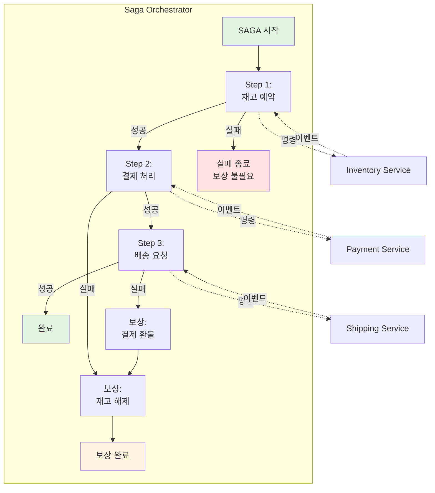
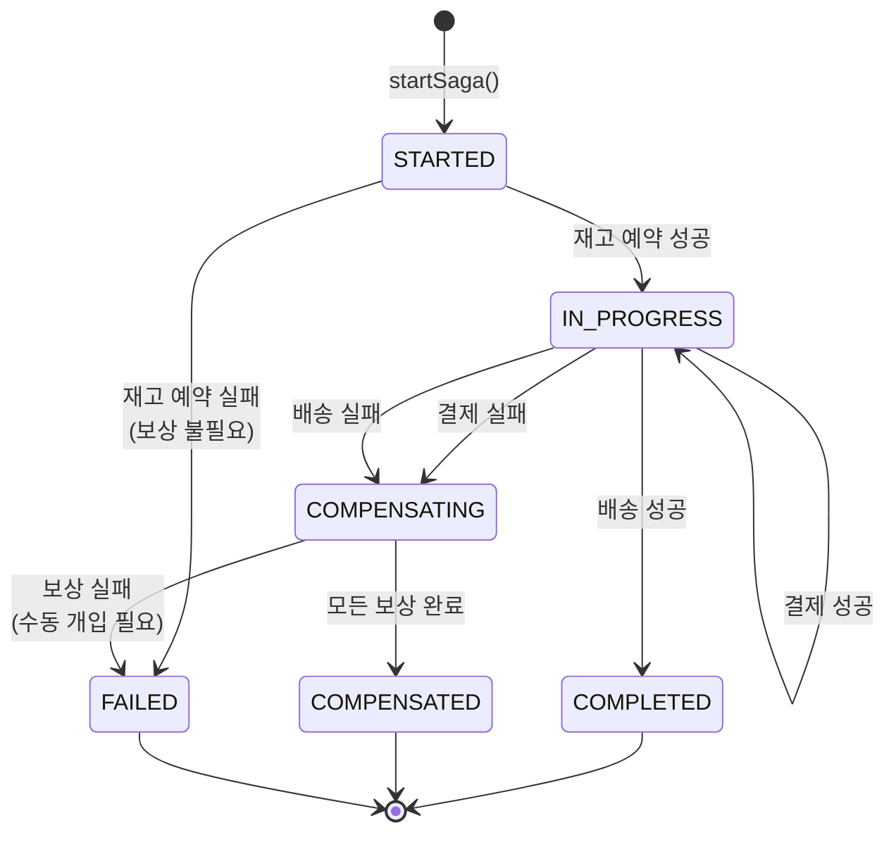
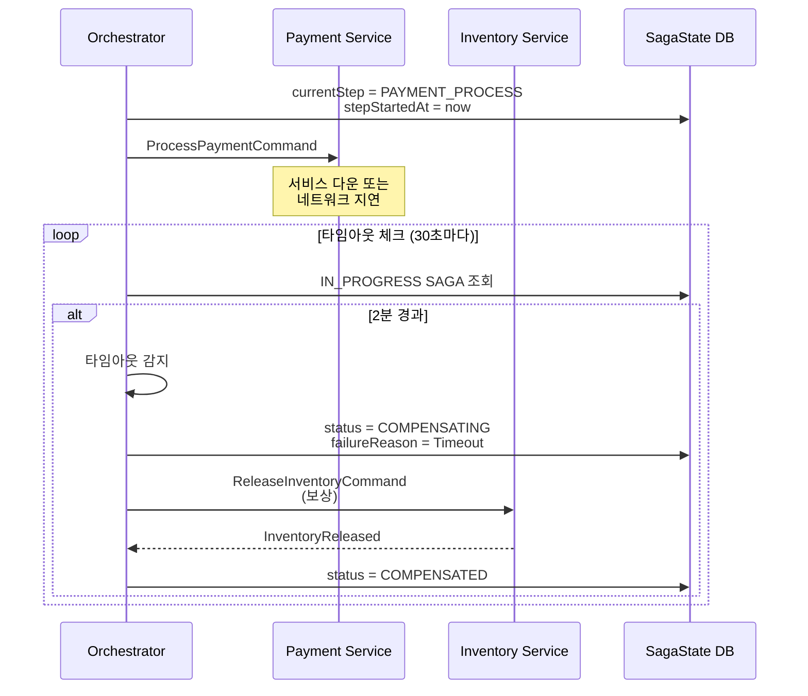

# 09. SAGA Pattern - Orchestration

중앙 조정자 기반 분산 트랜잭션 패턴으로, Saga Orchestrator가 전체 워크플로우를 제어하고 각 단계의 실행 순서와 보상 로직을 명시적으로 관리한다.

## Orchestration 방식의 핵심 개념

Orchestration 방식은 분산 트랜잭션의 "지휘자" 역할을 하는 중앙 Orchestrator를 두는 접근법이다. 각 서비스는 자신이 받은 명령(Command)만 처리하고, 전체 워크플로우의 흐름은 Orchestrator가 제어한다. 이는 복잡한 비즈니스 프로세스를 명확하게 정의하고 추적할 수 있게 해준다.

**왜 중앙 Orchestrator를 사용하는가?**

첫째, **명확한 워크플로우 정의**가 가능하다. 주문 → 재고 예약 → 결제 → 배송이라는 흐름이 코드에 명시적으로 드러나며, 어느 단계에서 실패했는지, 어떤 보상이 필요한지 한눈에 파악할 수 있다.

둘째, **상태 추적이 용이**하다. Orchestrator가 현재 진행 중인 단계, 완료된 작업, 실패한 시점을 중앙에서 관리하므로 운영 중 문제가 발생해도 빠르게 원인을 파악할 수 있다.

셋째, **복잡한 조건 분기**가 필요한 경우 적합하다. 예를 들어 "VIP 고객은 결제 전 쿠폰 적용, 일반 고객은 재고 확인 후 할인 계산" 같은 복잡한 비즈니스 로직을 Choreography 방식으로 구현하면 각 서비스가 다른 서비스의 이벤트를 모두 알아야 하지만, Orchestration은 Orchestrator에 조건을 집중할 수 있다.

**트레이드오프**

물론 단점도 있다. Orchestrator는 **단일 장애점(Single Point of Failure)**이 되며, 각 서비스가 Orchestrator의 명령에 의존하므로 **결합도가 높아진다**. 하지만 명확성과 제어 가능성이 중요한 비즈니스 크리티컬한 워크플로우에서는 이 트레이드오프가 합리적이다.

---

## 아키텍처



위 다이어그램은 Orchestrator가 각 단계를 순차적으로 제어하는 모습을 보여준다. 각 단계는 성공 시 다음 단계로 진행하거나, 실패 시 이전 단계들을 역순으로 보상한다. 점선은 Kafka 메시지를 통한 비동기 통신을 나타낸다.

---

## Saga 상태 관리

### SagaState Entity

```java
@Entity
@Table(name = "saga_state")
@Getter @Setter
@NoArgsConstructor
public class SagaState {

    @Id
    private String sagaId;

    @Column(nullable = false)
    private String orderId;

    @Enumerated(EnumType.STRING)
    private SagaStep currentStep;

    @Enumerated(EnumType.STRING)
    private SagaStatus status;

    // 각 단계의 결과 저장 (보상에 필요)
    @ElementCollection
    @CollectionTable(name = "saga_inventory_reservations")
    private List<String> inventoryReservationIds = new ArrayList<>();

    private String paymentTransactionId;
    private BigDecimal paymentAmount;
    private String trackingNumber;

    private String failureReason;
    private String failedStep;

    private Instant createdAt;
    private Instant updatedAt;
    private Instant completedAt;

    @PrePersist
    void onCreate() {
        createdAt = Instant.now();
        updatedAt = Instant.now();
    }

    @PreUpdate
    void onUpdate() {
        updatedAt = Instant.now();
    }
}

public enum SagaStep {
    INVENTORY_RESERVE,
    PAYMENT_PROCESS,
    SHIPPING_REQUEST,
    COMPLETED
}

public enum SagaStatus {
    STARTED,
    IN_PROGRESS,
    COMPENSATING,
    COMPLETED,
    COMPENSATED,
    FAILED
}
```

---

## Saga 상태 전이 다이어그램



---

## Saga Orchestrator

```java
@Service
@RequiredArgsConstructor
@Slf4j
public class OrderSagaOrchestrator {

    private final KafkaTemplate<String, Object> kafkaTemplate;
    private final SagaStateRepository sagaStateRepository;

    // ==================== SAGA 시작 ====================

    @Transactional
    public String startSaga(CreateOrderCommand command) {
        String sagaId = UUID.randomUUID().toString();

        // Saga 상태 초기화
        SagaState state = new SagaState();
        state.setSagaId(sagaId);
        state.setOrderId(command.orderId());
        state.setCurrentStep(SagaStep.INVENTORY_RESERVE);
        state.setStatus(SagaStatus.STARTED);
        sagaStateRepository.save(state);

        log.info("SAGA started: sagaId={}, orderId={}", sagaId, command.orderId());

        // Step 1: 재고 예약 요청
        kafkaTemplate.send("inventory-commands",
            new ReserveInventoryCommand(
                command.orderId(),
                sagaId,
                command.items()
            ));

        return sagaId;
    }

    // ==================== STEP 1: 재고 ====================

    @KafkaListener(topics = "inventory-reserved", groupId = "saga-orchestrator")
    @Transactional
    public void onInventoryReserved(InventoryReserved event) {
        SagaState state = getSagaState(event.correlationId());

        if (state.getStatus() != SagaStatus.STARTED &&
            state.getStatus() != SagaStatus.IN_PROGRESS) {
            log.warn("Invalid state for inventory reserved: {}", state.getStatus());
            return;
        }

        // 상태 업데이트
        state.setCurrentStep(SagaStep.PAYMENT_PROCESS);
        state.setStatus(SagaStatus.IN_PROGRESS);
        state.setInventoryReservationIds(event.reservationIds());
        sagaStateRepository.save(state);

        log.info("SAGA step completed: sagaId={}, step=INVENTORY_RESERVE",
            event.correlationId());

        // Step 2: 결제 요청
        kafkaTemplate.send("payment-commands",
            new ProcessPaymentCommand(
                event.orderId(),
                event.correlationId(),
                getOrderAmount(event.orderId())
            ));
    }

    @KafkaListener(topics = "inventory-reservation-failed", groupId = "saga-orchestrator")
    @Transactional
    public void onInventoryFailed(InventoryReservationFailed event) {
        SagaState state = getSagaState(event.correlationId());

        // Step 1 실패 → 보상 불필요, 바로 실패
        state.setStatus(SagaStatus.FAILED);
        state.setFailureReason(event.reason());
        state.setFailedStep("INVENTORY_RESERVE");
        sagaStateRepository.save(state);

        log.error("SAGA failed at step 1: sagaId={}, reason={}",
            event.correlationId(), event.reason());

        // 실패 알림 이벤트
        kafkaTemplate.send("saga-failed",
            new SagaFailed(event.orderId(), event.correlationId(),
                "INVENTORY_RESERVE", event.reason()));
    }

    // ==================== STEP 2: 결제 ====================

    @KafkaListener(topics = "payment-completed", groupId = "saga-orchestrator")
    @Transactional
    public void onPaymentCompleted(PaymentCompleted event) {
        SagaState state = getSagaState(event.correlationId());

        // 상태 업데이트
        state.setCurrentStep(SagaStep.SHIPPING_REQUEST);
        state.setPaymentTransactionId(event.transactionId());
        state.setPaymentAmount(event.amount());
        sagaStateRepository.save(state);

        log.info("SAGA step completed: sagaId={}, step=PAYMENT_PROCESS",
            event.correlationId());

        // Step 3: 배송 요청
        kafkaTemplate.send("shipping-commands",
            new RequestShippingCommand(
                event.orderId(),
                event.correlationId(),
                getShippingAddress(event.orderId())
            ));
    }

    @KafkaListener(topics = "payment-failed", groupId = "saga-orchestrator")
    @Transactional
    public void onPaymentFailed(PaymentFailed event) {
        SagaState state = getSagaState(event.correlationId());

        // Step 2 실패 → Step 1 보상 필요
        state.setStatus(SagaStatus.COMPENSATING);
        state.setFailureReason(event.reason());
        state.setFailedStep("PAYMENT_PROCESS");
        sagaStateRepository.save(state);

        log.error("SAGA failed at step 2, starting compensation: sagaId={}",
            event.correlationId());

        // 보상: 재고 해제 요청
        kafkaTemplate.send("inventory-commands",
            new ReleaseInventoryCommand(
                event.orderId(),
                event.correlationId(),
                state.getInventoryReservationIds()
            ));
    }

    // ==================== STEP 3: 배송 ====================

    @KafkaListener(topics = "shipping-requested", groupId = "saga-orchestrator")
    @Transactional
    public void onShippingRequested(ShippingRequested event) {
        SagaState state = getSagaState(event.correlationId());

        // SAGA 성공 완료
        state.setCurrentStep(SagaStep.COMPLETED);
        state.setStatus(SagaStatus.COMPLETED);
        state.setTrackingNumber(event.trackingNumber());
        state.setCompletedAt(Instant.now());
        sagaStateRepository.save(state);

        log.info("SAGA completed successfully: sagaId={}, orderId={}",
            event.correlationId(), event.orderId());

        // 성공 알림 이벤트
        kafkaTemplate.send("saga-completed",
            new SagaCompleted(event.orderId(), event.correlationId(),
                event.trackingNumber()));
    }

    @KafkaListener(topics = "shipping-failed", groupId = "saga-orchestrator")
    @Transactional
    public void onShippingFailed(ShippingFailed event) {
        SagaState state = getSagaState(event.correlationId());

        // Step 3 실패 → Step 2, Step 1 보상 필요
        state.setStatus(SagaStatus.COMPENSATING);
        state.setFailureReason(event.reason());
        state.setFailedStep("SHIPPING_REQUEST");
        sagaStateRepository.save(state);

        log.error("SAGA failed at step 3, starting compensation: sagaId={}",
            event.correlationId());

        // 보상: 결제 환불 요청
        kafkaTemplate.send("payment-commands",
            new RefundPaymentCommand(
                event.orderId(),
                event.correlationId(),
                state.getPaymentTransactionId(),
                state.getPaymentAmount()
            ));
    }

    // ==================== 보상 처리 ====================

    @KafkaListener(topics = "payment-refunded", groupId = "saga-orchestrator")
    @Transactional
    public void onPaymentRefunded(PaymentRefunded event) {
        SagaState state = getSagaState(event.correlationId());

        log.info("Payment refunded, releasing inventory: sagaId={}",
            event.correlationId());

        // 보상: 재고 해제 요청
        kafkaTemplate.send("inventory-commands",
            new ReleaseInventoryCommand(
                event.orderId(),
                event.correlationId(),
                state.getInventoryReservationIds()
            ));
    }

    @KafkaListener(topics = "inventory-released", groupId = "saga-orchestrator")
    @Transactional
    public void onInventoryReleased(InventoryReleased event) {
        SagaState state = getSagaState(event.correlationId());

        // 모든 보상 완료
        state.setStatus(SagaStatus.COMPENSATED);
        state.setCompletedAt(Instant.now());
        sagaStateRepository.save(state);

        log.info("SAGA compensation completed: sagaId={}", event.correlationId());

        // 실패 알림 이벤트
        kafkaTemplate.send("saga-failed",
            new SagaFailed(event.orderId(), event.correlationId(),
                state.getFailedStep(), state.getFailureReason()));
    }

    // ==================== 헬퍼 ====================

    private SagaState getSagaState(String sagaId) {
        return sagaStateRepository.findById(sagaId)
            .orElseThrow(() -> new SagaNotFoundException(sagaId));
    }
}
```

---

## Orchestrator 장애 복구

**Orchestrator가 죽으면 어떻게 되는가?**

Orchestrator는 단일 장애점이므로, 실행 중인 SAGA 도중 Orchestrator가 다운되면 해당 SAGA는 중단된 상태로 남는다. 이때 중요한 것은 **상태 영속화**다.

### 복구 전략

1. **DB 기반 상태 복구**
   - `SagaState` 엔티티가 DB에 저장되어 있으므로 Orchestrator 재시작 시 `status`가 `IN_PROGRESS` 또는 `COMPENSATING`인 SAGA를 조회한다
   - `currentStep`을 보고 어느 단계에서 멈췄는지 파악한 뒤, 해당 단계부터 재실행 또는 타임아웃 처리한다

2. **복구 스케줄러 예시**
```java
@Scheduled(fixedDelay = 60000) // 1분마다
public void recoverStalledSagas() {
    Instant threshold = Instant.now().minus(5, ChronoUnit.MINUTES);

    List<SagaState> stalled = sagaStateRepository
        .findByStatusInAndUpdatedAtBefore(
            List.of(SagaStatus.IN_PROGRESS, SagaStatus.COMPENSATING),
            threshold
        );

    for (SagaState saga : stalled) {
        log.warn("Recovering stalled SAGA: {}", saga.getSagaId());

        if (saga.getStatus() == SagaStatus.IN_PROGRESS) {
            // 마지막 단계 재시도 또는 타임아웃 처리
            handleTimeout(saga);
        } else {
            // 보상 재시도
            retryCompensation(saga);
        }
    }
}
```

3. **Idempotency 보장**
   - 복구 과정에서 같은 명령이 중복 전송될 수 있으므로 각 서비스는 `sagaId` + `commandId`로 중복 처리를 방지해야 한다
   - 예: Inventory Service는 같은 `sagaId`로 재고 예약 요청이 오면 이미 처리했는지 확인 후 멱등성 보장

**핵심**: Orchestrator가 Stateless해도 SagaState를 DB에 저장하면 언제든 복구 가능. 하지만 5분 이상 응답 없는 SAGA는 타임아웃으로 간주하고 보상 트리거.

---

## 타임아웃 처리

**서비스가 응답하지 않으면 어떻게 되는가?**

분산 환경에서는 네트워크 지연, 서비스 다운 등으로 이벤트가 영원히 오지 않을 수 있다. 이때 Orchestrator는 무한정 기다릴 수 없으므로 **단계별 타임아웃**을 설정해야 한다.

### 타임아웃 구현 전략

1. **SagaState에 타임아웃 필드 추가**
```java
@Entity
public class SagaState {
    // ...
    private Instant stepStartedAt;
    private Duration stepTimeout = Duration.ofMinutes(2); // 단계별 기본 2분
}
```

2. **타임아웃 감지 스케줄러**
```java
@Scheduled(fixedDelay = 30000) // 30초마다
public void checkTimeouts() {
    Instant now = Instant.now();

    List<SagaState> timedOut = sagaStateRepository
        .findByStatusIn(List.of(SagaStatus.IN_PROGRESS, SagaStatus.COMPENSATING))
        .stream()
        .filter(saga -> {
            Instant deadline = saga.getStepStartedAt().plus(saga.getStepTimeout());
            return now.isAfter(deadline);
        })
        .toList();

    for (SagaState saga : timedOut) {
        log.error("SAGA step timeout: sagaId={}, step={}",
            saga.getSagaId(), saga.getCurrentStep());

        triggerCompensation(saga, "Timeout waiting for " + saga.getCurrentStep());
    }
}

private void triggerCompensation(SagaState saga, String reason) {
    saga.setStatus(SagaStatus.COMPENSATING);
    saga.setFailureReason(reason);
    saga.setFailedStep(saga.getCurrentStep().name());
    sagaStateRepository.save(saga);

    // 보상 시작 (역순)
    if (saga.getCurrentStep() == SagaStep.PAYMENT_PROCESS) {
        kafkaTemplate.send("inventory-commands",
            new ReleaseInventoryCommand(saga.getOrderId(), saga.getSagaId(),
                saga.getInventoryReservationIds()));
    } else if (saga.getCurrentStep() == SagaStep.SHIPPING_REQUEST) {
        kafkaTemplate.send("payment-commands",
            new RefundPaymentCommand(saga.getOrderId(), saga.getSagaId(),
                saga.getPaymentTransactionId(), saga.getPaymentAmount()));
    }
}
```

### 타임아웃 시나리오 다이어그램



**핵심**: 타임아웃은 SAGA가 무한정 대기하지 않도록 보장하는 안전장치다. 각 단계마다 합리적인 타임아웃(예: 재고 30초, 결제 2분, 배송 1분)을 설정하고, 초과 시 즉시 보상을 트리거한다.

---

## 상태 영속화 심화

Orchestrator의 복구 가능성은 상태를 어떻게 저장하느냐에 달려 있다. 두 가지 주요 접근법을 비교한다.

### 1. DB 기반 상태 관리 (현재 구현)

**방식**: `SagaState` 엔티티를 RDB에 저장하고, 각 이벤트 수신 시 트랜잭션으로 업데이트.

**장점**:
- 구현 단순, 기존 애플리케이션 DB 재활용 가능
- 조회 쿼리 용이 (`findByOrderId`, `findByStatus` 등)
- 복구 간단 (DB 조회 → 상태 복원)

**단점**:
- Kafka 이벤트 수신과 DB 업데이트의 원자성 보장 어려움 (메시지 중복 처리 가능)
- DB가 단일 장애점 (DB 다운 시 새 SAGA 시작 불가)
- 상태 변경 이력 추적 어려움 (UPDATE만 하면 이전 상태 손실)

### 2. Event Sourcing 기반 상태 관리

**방식**: SAGA 상태 자체를 저장하지 않고, 모든 이벤트를 Kafka Topic에 저장. 상태는 이벤트 재생으로 복원.

```java
// 이벤트 스트림
saga-events Topic:
  - SagaStarted(sagaId, orderId)
  - InventoryReserved(sagaId, reservationIds)
  - PaymentCompleted(sagaId, transactionId)
  - ShippingRequested(sagaId, trackingNumber)

// 상태 복원
public SagaState rebuildState(String sagaId) {
    List<SagaEvent> events = kafkaConsumer.readAll("saga-events", sagaId);
    SagaState state = new SagaState(sagaId);

    for (SagaEvent event : events) {
        state.apply(event); // 이벤트 재생
    }
    return state;
}
```

**장점**:
- 완벽한 감사 추적 (모든 상태 변경 이력 보존)
- Kafka가 이미 분산 복제되므로 고가용성
- 시간 여행 가능 (특정 시점의 상태로 롤백)

**단점**:
- 복잡도 높음 (이벤트 재생 로직 필요)
- 조회 성능 낮음 (매번 이벤트 재생 필요 → Materialized View 필요)
- 이벤트 스키마 진화 관리 복잡

### 선택 가이드

| 상황 | 추천 방식 |
|------|----------|
| 감사(audit) 요구사항 강함 | Event Sourcing |
| 빠른 개발, 단순한 SAGA | DB 기반 |
| 복구 시간 < 1초 필요 | Event Sourcing (스냅샷 + 델타) |
| 조회 성능 중요 | DB 기반 |

**하이브리드**: DB에 현재 상태 저장 + Kafka에 이벤트 로그 보관 (둘 다 활용)

### 산업 레퍼런스: Eventuate Tram 스키마

Chris Richardson의 Eventuate Tram Sagas 프레임워크는 프로덕션급 SAGA 상태 관리를 위해 4개 테이블을 사용한다:

| 테이블 | 역할 | 주요 컬럼 |
|--------|------|----------|
| `saga_instance` | SAGA 인스턴스 상태 | saga_type, saga_id, state_name, end_state, compensating, failed, saga_data_json |
| `saga_instance_participants` | 참여 서비스 추적 | saga_type, saga_id, destination, resource |
| `saga_lock_table` | 동시 접근 제어 | target, saga_type, saga_id |
| `saga_stash_table` | 대기 메시지 보관 | message_id, target, saga_type, saga_id, message_headers, message_payload |

### 현재 구현과 비교

| 항목 | 현재 (SagaState 엔티티) | Eventuate Tram | 평가 |
|------|------------------------|----------------|------|
| 상태 저장 | 단일 테이블, 도메인 필드 인라인 | `saga_instance` + `saga_data_json` | 인라인이 학습용으로 의도 명확 |
| 참여자 추적 | 없음 (하드코딩) | `saga_instance_participants` | 단계 고정이라 불필요 |
| 멱등성 | sagaId + commandId 수동 체크 | 프레임워크 내장 | 동일 패턴 |
| 동시성 | `@Version` (Optimistic Lock) | `saga_lock_table` (Pessimistic) | 접근 방식 차이 |
| 메시지 스태싱 | 없음 | `saga_stash_table` | 순차 실행만 지원 |
| 보상 데이터 | 엔티티에 직접 저장 | saga_data_json에 직렬화 | 인라인이 더 명시적 |

**왜 현재 방식이 학습에 적합한가?**
1. `paymentTransactionId`가 컬럼으로 보이므로 "보상에 무엇이 필요한지" 즉시 파악 가능
2. 참여자가 고정이므로 동적 추적 테이블이 오히려 과설계
3. Optimistic Lock이 단일 인스턴스에서 구현 간결

### 프로덕션 확장 시 고려사항

1. **saga_instance_participants**: 동적 단계 추가 시 참여자 테이블이 필요해진다
2. **saga_lock_table**: 멀티 인스턴스 환경에서 동시 보상 방지에 Pessimistic Lock이 적합하다
3. **saga_stash_table**: 순서 보장이 필요한 메시지 대기열 (비순차 이벤트 도착 대응)
4. **saga_data_json**: 도메인 변경에 유연한 직렬화 — 인라인 필드는 DDL 마이그레이션 필요
5. **완료 SAGA 클린업**: 아카이빙 또는 TTL 전략으로 테이블 크기 관리

> 스키마 원본: [eventuate-tram-sagas/postgres/tram-saga-schema.sql](https://github.com/eventuate-tram/eventuate-tram-sagas/blob/master/postgres/tram-saga-schema.sql)

---

## Kafka 트랜잭션과 Orchestrator

### Orchestrator에서 Kafka 트랜잭션이 필요한 이유

Orchestrator는 이벤트를 수신하고, 상태를 DB에 저장하고, 다음 명령을 Kafka로 발행하는 세 가지를 한 단계에서 수행한다. 이 중 하나라도 실패하면 불일치가 발생한다.

```
문제 시나리오:
1. InventoryReserved 이벤트 수신              ✅
2. SagaState DB 업데이트 (PAYMENT_PROCESS)    ✅
3. ProcessPaymentCommand Kafka 전송           ❌ (네트워크 오류)

→ DB에는 "결제 단계"로 기록됐지만, 실제 결제 명령은 전송되지 않음
→ SAGA가 영원히 결제 단계에서 멈춤
```

### Consume-Transform-Produce 패턴

Kafka 트랜잭션의 가장 강력한 사용법은 **Consume-Transform-Produce(CTP)** 패턴이다. 하나의 트랜잭션 안에서 "소스 토픽의 오프셋 커밋 + 결과 메시지 발행"을 원자적으로 처리한다. Orchestrator에 적용하면:

```java
@Configuration
public class OrchestratorTransactionConfig {

    @Bean
    public ProducerFactory<String, Object> producerFactory() {
        Map<String, Object> props = new HashMap<>();
        props.put(ProducerConfig.BOOTSTRAP_SERVERS_CONFIG, "localhost:19092");
        props.put(ProducerConfig.ENABLE_IDEMPOTENCE_CONFIG, true);
        props.put(ProducerConfig.TRANSACTIONAL_ID_CONFIG, "orchestrator-producer");
        props.put(ProducerConfig.ACKS_CONFIG, "all");

        DefaultKafkaProducerFactory<String, Object> factory =
            new DefaultKafkaProducerFactory<>(props);
        factory.setTransactionIdPrefix("orch-tx-");
        return factory;
    }

    @Bean
    public ConcurrentKafkaListenerContainerFactory<String, Object> kafkaListenerContainerFactory(
            ConsumerFactory<String, Object> consumerFactory,
            KafkaTransactionManager<String, Object> transactionManager) {

        ConcurrentKafkaListenerContainerFactory<String, Object> factory =
            new ConcurrentKafkaListenerContainerFactory<>();
        factory.setConsumerFactory(consumerFactory);

        // Spring Kafka 3.0+: setKafkaAwareTransactionManager() 사용
        // (이전 API인 setTransactionManager()는 3.0에서 deprecated)
        factory.getContainerProperties().setKafkaAwareTransactionManager(transactionManager);
        return factory;
    }
}
```

**`setKafkaAwareTransactionManager()`란?**

Spring Kafka 3.0에서 `ContainerProperties.setTransactionManager(PlatformTransactionManager)`가 deprecated되고, `setKafkaAwareTransactionManager(KafkaAwareTransactionManager)`로 대체되었다. 이 변경의 이유는 타입 안전성이다.

기존 `setTransactionManager()`는 `PlatformTransactionManager` 인터페이스를 받아서, 실수로 `JpaTransactionManager`(DB 전용)를 넣어도 컴파일 오류 없이 런타임에 실패했다. 새로운 API는 `KafkaAwareTransactionManager` 인터페이스를 요구하므로, Kafka 트랜잭션을 지원하는 매니저(`KafkaTransactionManager`)만 허용된다.

```
Spring Kafka 2.x:  setTransactionManager(PlatformTransactionManager)  ← 아무 TxManager나 받음
Spring Kafka 3.x:  setKafkaAwareTransactionManager(KafkaAwareTransactionManager)  ← Kafka 전용만 허용
```

이렇게 설정하면 `@KafkaListener` 메서드 안의 모든 `kafkaTemplate.send()`가 자동으로 트랜잭션 안에서 실행된다. 메서드가 정상 완료되면 commit, 예외가 발생하면 abort된다.

```
트랜잭션 범위:
  beginTransaction()
    ├── 소스 이벤트 오프셋 커밋 (InventoryReserved 처리 완료 표시)
    ├── kafkaTemplate.send("payment-commands", ProcessPaymentCommand)
    └── commitTransaction()

예외 발생 시:
  abortTransaction()
    ├── 소스 이벤트 오프셋 롤백 → 다음 poll()에서 재수신
    └── payment-commands에 메시지 미전달 (Consumer에게 보이지 않음)
```

### DB + Kafka 원자성의 한계

주의할 점은 **Kafka 트랜잭션과 DB 트랜잭션은 별개**라는 것이다. `@Transactional`(Spring의 DB 트랜잭션)과 Kafka 트랜잭션을 같이 사용하면 체이닝(chaining)은 가능하지만, 둘 사이의 완벽한 원자성은 보장되지 않는다.

```
DB 커밋 성공 → Kafka 커밋 실패: 불일치 발생 가능
DB 커밋 실패 → Kafka는 abort: 정합성 유지
```

이 간극을 완전히 해소하려면 **Transactional Outbox 패턴**을 사용해야 한다. DB에 outbox 테이블을 두고, 비즈니스 데이터와 발행할 이벤트를 같은 DB 트랜잭션으로 저장한 뒤, 별도 프로세스가 outbox를 폴링하여 Kafka로 발행한다. 이 패턴은 [14-middleware-architecture.md](./14-middleware-architecture.md)에서 다룬다.

| 방식 | DB+Kafka 원자성 | 복잡도 | 적합 상황 |
|------|----------------|--------|----------|
| Kafka 트랜잭션만 | Kafka 내부만 보장 | 낮음 | Kafka-to-Kafka 변환 |
| DB @Transactional + Kafka TX 체이닝 | 대부분 안전, 간극 존재 | 중간 | 대부분의 SAGA |
| Transactional Outbox | 완벽한 원자성 | 높음 | 금융, 결제 등 크리티컬 |

---

## Command 정의

```java
// 재고 명령
public record ReserveInventoryCommand(
    String orderId,
    String sagaId,
    List<OrderItem> items
) {}

public record ReleaseInventoryCommand(
    String orderId,
    String sagaId,
    List<String> reservationIds
) {}

// 결제 명령
public record ProcessPaymentCommand(
    String orderId,
    String sagaId,
    BigDecimal amount
) {}

public record RefundPaymentCommand(
    String orderId,
    String sagaId,
    String transactionId,
    BigDecimal amount
) {}

// 배송 명령
public record RequestShippingCommand(
    String orderId,
    String sagaId,
    ShippingAddress address
) {}
```

---

## 각 서비스 (Command Handler)

### Inventory Service

```java
@Service
@RequiredArgsConstructor
@Slf4j
public class InventoryCommandHandler {

    private final KafkaTemplate<String, Object> kafkaTemplate;
    private final InventoryRepository inventoryRepository;

    @KafkaListener(topics = "inventory-commands", groupId = "inventory-service")
    @Transactional
    public void handleCommand(Object command) {
        if (command instanceof ReserveInventoryCommand cmd) {
            handleReserve(cmd);
        } else if (command instanceof ReleaseInventoryCommand cmd) {
            handleRelease(cmd);
        }
    }

    private void handleReserve(ReserveInventoryCommand cmd) {
        try {
            List<String> reservationIds = reserveItems(cmd.items());

            kafkaTemplate.send("inventory-reserved",
                new InventoryReserved(cmd.orderId(), cmd.sagaId(),
                    Instant.now(), reservationIds));

        } catch (Exception e) {
            kafkaTemplate.send("inventory-reservation-failed",
                new InventoryReservationFailed(cmd.orderId(), cmd.sagaId(),
                    Instant.now(), e.getMessage(), List.of()));
        }
    }

    private void handleRelease(ReleaseInventoryCommand cmd) {
        releaseItems(cmd.reservationIds());

        kafkaTemplate.send("inventory-released",
            new InventoryReleased(cmd.orderId(), cmd.sagaId(),
                Instant.now(), cmd.reservationIds()));
    }
}
```

---

## Saga 상태 조회 API

```java
@RestController
@RequestMapping("/api/sagas")
@RequiredArgsConstructor
public class SagaController {

    private final SagaStateRepository sagaStateRepository;

    @GetMapping("/{sagaId}")
    public SagaState getSagaState(@PathVariable String sagaId) {
        return sagaStateRepository.findById(sagaId)
            .orElseThrow(() -> new ResponseStatusException(
                HttpStatus.NOT_FOUND, "Saga not found"));
    }

    @GetMapping("/order/{orderId}")
    public List<SagaState> getSagasByOrder(@PathVariable String orderId) {
        return sagaStateRepository.findByOrderId(orderId);
    }
}
```

---

## Orchestration 안티패턴

Orchestration을 잘못 사용하면 오히려 복잡도만 높아진다. 다음 안티패턴을 피해야 한다.

### 1. God Orchestrator (신 오케스트레이터)

**증상**: Orchestrator에 비즈니스 로직이 집중되어 수천 줄의 거대한 클래스가 됨.

```java
// ❌ 나쁜 예
public void onInventoryReserved(InventoryReserved event) {
    // 재고 예약 성공 후 할인 계산, 쿠폰 적용, 포인트 차감 등...
    BigDecimal discount = calculateDiscount(event.customerId());
    BigDecimal couponAmount = applyCoupon(event.orderId());
    int pointsUsed = deductPoints(event.customerId(), event.amount());

    // 결제 금액 계산
    BigDecimal finalAmount = event.amount()
        .subtract(discount)
        .subtract(couponAmount)
        .subtract(BigDecimal.valueOf(pointsUsed));

    kafkaTemplate.send("payment-commands", ...);
}
```

**해결**: 비즈니스 로직은 각 도메인 서비스에 위임. Orchestrator는 **흐름 제어만**.

```java
// ✅ 좋은 예
public void onInventoryReserved(InventoryReserved event) {
    SagaState state = getSagaState(event.correlationId());
    state.setCurrentStep(SagaStep.PAYMENT_PROCESS);
    state.setInventoryReservationIds(event.reservationIds());
    sagaStateRepository.save(state);

    // 금액 계산은 Order Service의 책임
    kafkaTemplate.send("payment-commands",
        new ProcessPaymentCommand(event.orderId(), event.correlationId(),
            orderService.calculateFinalAmount(event.orderId())));
}
```

### 2. 동기 호출 섞기

**증상**: 비동기 SAGA 중간에 REST API 동기 호출을 섞어 사용.

```java
// ❌ 나쁜 예
public void onPaymentCompleted(PaymentCompleted event) {
    // 배송지 주소를 REST API로 동기 조회
    ShippingAddress address = restTemplate.getForObject(
        "http://customer-service/api/customers/{id}/address",
        ShippingAddress.class, event.customerId());

    kafkaTemplate.send("shipping-commands",
        new RequestShippingCommand(event.orderId(), event.correlationId(), address));
}
```

**문제**: Customer Service가 다운되면 SAGA가 멈춤. SAGA의 장점(장애 격리)이 사라짐.

**해결**: 필요한 데이터는 SAGA 시작 시 수집하거나, 이벤트에 포함.

```java
// ✅ 좋은 예
public void onPaymentCompleted(PaymentCompleted event) {
    SagaState state = getSagaState(event.correlationId());

    // SAGA 시작 시 이미 저장된 배송지 사용
    kafkaTemplate.send("shipping-commands",
        new RequestShippingCommand(event.orderId(), event.correlationId(),
            state.getShippingAddress()));
}
```

### 3. 보상 로직 누락

**증상**: 정상 흐름만 구현하고 보상(Compensation) 로직을 빼먹음.

```java
// ❌ 나쁜 예: shipping-failed 핸들러 없음
@KafkaListener(topics = "shipping-requested")
public void onShippingRequested(ShippingRequested event) {
    // SAGA 완료 처리만 있음
}
```

**결과**: 배송 요청이 실패하면 결제는 완료되고 재고는 예약된 채로 남아 데이터 불일치.

**해결**: 모든 단계마다 실패 핸들러와 보상 로직 필수.

```java
// ✅ 좋은 예
@KafkaListener(topics = "shipping-failed")
public void onShippingFailed(ShippingFailed event) {
    SagaState state = getSagaState(event.correlationId());
    state.setStatus(SagaStatus.COMPENSATING);

    // 보상: 결제 환불
    kafkaTemplate.send("payment-commands",
        new RefundPaymentCommand(...));
}
```

---

## 보상 트랜잭션 실패 처리

> 출처: [The Hidden Challenge of Microservices: Unraveling the Saga Pattern](https://www.linkedin.com/pulse/hidden-challenge-microservices-unraveling-saga-pattern-edmar-fagundes-ryrmf/)

보상 트랜잭션(Compensating Transaction)이 **항상 성공한다고 가정하면 안 된다**. 결제 환불 API가 다운되거나, DB 불일치로 롤백이 차단되는 경우가 실무에서 발생한다.

### 전략 1: 재시도 + Exponential Backoff

일시적 네트워크 오류에 대응합니다.

```java
@Retryable(value = Exception.class, maxAttempts = 3,
           backoff = @Backoff(delay = 2000))
public void refundPayment(Long orderId) {
    paymentService.refund(orderId);
}
```

### 전략 2: DLQ로 실패한 보상 격리

재시도 후에도 실패하면 DLQ에 보관하여 무한 루프를 방지합니다.

```java
@KafkaListener(topics = "compensate-payment")
public void handleCompensation(ConsumerRecord<String, String> record) {
    try {
        paymentService.refundPayment(record.value());
    } catch (Exception e) {
        kafkaTemplate.send("compensate-payment-dlq", record.value());
        // DLQ에 보관 → 운영팀이 수동 처리
    }
}
```

### 전략 3: 수동 개입 (Manual Intervention)

자동 복구가 불가능한 경우 사람이 개입해야 합니다:
- 결제 게이트웨이 장기 장애
- DB 불일치로 롤백 차단
- 비즈니스 로직 충돌 (부분 출고 완료 등)

**핵심**: 모니터링 + 알림 시스템이 자동 복구 실패를 즉시 감지하여 엔지니어에게 통보해야 한다. Saga 설계 시 "보상도 실패할 수 있다"는 전제로 3단계 방어(재시도 → DLQ → 수동 개입)를 구축해야 한다.

---

## Choreography vs Orchestration

두 방식은 서로 다른 트레이드오프를 가진다. 어느 것이 더 나은지는 상황에 따라 다르다.

**Choreography를 선택해야 하는 경우**:
- 서비스 간 결합도를 최소화하고 싶을 때
- 각 서비스가 독립적으로 진화해야 할 때
- 단순한 이벤트 체인 (A → B → C)으로 표현 가능한 워크플로우

**Orchestration을 선택해야 하는 경우**:
- 복잡한 조건 분기가 많을 때 (VIP 고객 특별 처리, 국가별 세금 계산 등)
- 전체 워크플로우를 한눈에 파악하고 관리해야 할 때
- 감사(audit) 추적이 중요한 금융/의료 도메인

| 항목 | Choreography | Orchestration |
|------|--------------|---------------|
| 조정자 | 없음 (서비스 간 이벤트 체인) | Saga Orchestrator |
| 결합도 | 낮음 (이벤트만 의존) | 높음 (Orchestrator가 모든 서비스 알아야 함) |
| 추적 | 어려움 (분산 로그 수집 필요) | 쉬움 (Orchestrator가 전체 상태 보유) |
| 복잡한 흐름 | 어려움 (각 서비스가 조건 분기 처리) | 적합 (Orchestrator에 집중) |
| 단일 장애점 | 없음 | Orchestrator (복구 전략 필요) |
| 테스트 | 어려움 (전체 흐름 통합 테스트 필요) | 쉬움 (Orchestrator 단위 테스트 가능) |
| 서비스 확장 | 쉬움 (새 서비스가 이벤트 구독만 추가) | 어려움 (Orchestrator 수정 필요) |

**비교 관점에서 핵심 차이**:

Choreography는 **자율성**을 중시한다. 각 서비스가 "재고 예약됨" 이벤트를 들으면 자발적으로 결제를 진행한다. 중앙 조정자가 없으므로 서비스 추가/제거가 유연하지만, 전체 흐름을 파악하려면 여러 서비스의 코드를 뒤져야 한다.

Orchestration은 **제어**를 중시한다. Orchestrator가 "재고 예약 성공 → 이제 결제 해"라고 명령한다. 워크플로우가 명시적이라 신규 팀원도 빠르게 이해할 수 있지만, Orchestrator가 죽으면 새 SAGA를 시작할 수 없다.

**실무 가이드**: 간단한 워크플로우는 Choreography, 복잡하고 변경 빈도가 낮은 핵심 비즈니스 프로세스는 Orchestration. 같은 시스템에서 두 방식을 혼용해도 된다.

더 자세한 Choreography 방식 구현은 [08-saga-choreography.md](./08-saga-choreography.md)를 참고.

---

## 실전 사례: 대안적 구현 접근법

### WorkflowStep 인터페이스 패턴 (Reactive 방식)

> 출처: [Orchestration Saga Pattern with Spring Boot](https://blog.vinsguru.com/orchestration-saga-pattern-with-spring-boot/)

Kafka 토픽 기반 비동기 통신 대신, **WorkflowStep 인터페이스 + WebClient** 로 간결하게 구현하는 접근법입니다. 서비스 수가 적고 동기 호출이 허용되는 경우에 적합합니다.

```java
// 각 SAGA 단계를 추상화하는 인터페이스
public interface WorkflowStep {
    WorkflowStepStatus getStatus();
    Mono<Boolean> process();   // 정방향 실행
    Mono<Boolean> revert();    // 보상 (롤백)
}
```

각 서비스는 두 가지 엔드포인트를 노출합니다:
- **Action**: `POST /payment/deduct` (결제 차감)
- **Compensation**: `POST /payment/refund` (결제 환불)

**Orchestrator — Reactor Flux 기반 순차 실행 + 선택적 보상**:

```java
public Mono<OrchestratorResponseDTO> orderProduct(OrchestratorRequestDTO request) {
    Workflow orderWorkflow = getOrderWorkflow(request);  // [InventoryStep, PaymentStep]
    return Flux.fromStream(() -> orderWorkflow.getSteps().stream())
        .flatMap(WorkflowStep::process)
        .handle((result, sink) -> {
            if (orderWorkflow.getSteps().stream()
                    .anyMatch(s -> s.getStatus() == WorkflowStepStatus.FAILED)) {
                // 실패 발생 → 완료된 단계만 선택적 보상
                orderWorkflow.getSteps().stream()
                    .filter(s -> s.getStatus() == WorkflowStepStatus.COMPLETE)
                    .forEach(WorkflowStep::revert);
            }
        })
        .then(Mono.fromSupplier(() -> toResponse(request, orderWorkflow)));
}
```

**이 패턴과 Kafka 기반 패턴의 비교**:

| 항목 | WorkflowStep + WebClient | Kafka 토픽 기반 |
|------|:----------------------:|:--------------:|
| 통신 방식 | HTTP (동기/비동기) | 메시지 큐 (비동기) |
| 장애 격리 | 낮음 (서비스 다운 시 블로킹) | 높음 (메시지 보존) |
| 구현 복잡도 | 낮음 | 높음 |
| 적합한 규모 | 소규모 (서비스 3~5개) | 대규모 |
| 상태 추적 | 메모리/DB | Kafka 토픽 + DB |

### Spring State Machine을 Orchestrator로 활용

> 출처: [Implementing SAGA Orchestration with Spring Boot State Machine and Kafka](https://blog.stackademic.com/implementing-saga-orchestration-with-spring-boot-state-machine-and-kafka-a-production-ready-guide-a5a91881d62a)

Spring State Machine을 사용하면 SAGA의 상태 전이를 **선언적**으로 정의할 수 있습니다. 현재 문서의 `SagaState` 엔티티 + 수동 상태 관리 대신, 프레임워크가 전이 규칙을 강제합니다.

```java
@Configuration
@EnableStateMachine
public class OrderSagaStateMachineConfig
        extends StateMachineConfigurerAdapter<OrderStates, OrderEvents> {

    @Override
    public void configure(StateMachineStateConfigurer<OrderStates, OrderEvents> states)
            throws Exception {
        states.withStates()
            .initial(OrderStates.ORDER_CREATED)
            .state(OrderStates.INVENTORY_RESERVING)
            .state(OrderStates.PAYMENT_PROCESSING)
            .state(OrderStates.SHIPPING_REQUESTED)
            .end(OrderStates.ORDER_COMPLETED)
            .end(OrderStates.ORDER_CANCELLED);  // 보상 완료 상태
    }

    @Override
    public void configure(StateMachineTransitionConfigurer<OrderStates, OrderEvents> transitions)
            throws Exception {
        transitions
            // 정방향
            .withExternal().source(ORDER_CREATED).target(INVENTORY_RESERVING)
                .event(RESERVE_INVENTORY).and()
            .withExternal().source(INVENTORY_RESERVING).target(PAYMENT_PROCESSING)
                .event(INVENTORY_RESERVED).and()
            .withExternal().source(PAYMENT_PROCESSING).target(SHIPPING_REQUESTED)
                .event(PAYMENT_COMPLETED).and()
            .withExternal().source(SHIPPING_REQUESTED).target(ORDER_COMPLETED)
                .event(SHIPPING_CONFIRMED).and()
            // 보상 (역방향)
            .withExternal().source(PAYMENT_PROCESSING).target(INVENTORY_RESERVING)
                .event(PAYMENT_FAILED).action(refundAction()).and()
            .withExternal().source(SHIPPING_REQUESTED).target(PAYMENT_PROCESSING)
                .event(SHIPPING_FAILED).action(cancelShippingAction()).and();
    }
}
```

**State Machine 방식의 장점**:
- 잘못된 상태 전이 불가 (프레임워크가 차단)
- 상태 다이어그램과 코드가 1:1 대응
- Guard 조건으로 전이 전 검증 가능

**트레이드오프**: State Machine 프레임워크 학습 비용, 복잡한 병렬 단계 표현의 어려움

---

## 참고

- [SAGA Pattern - Orchestration](https://microservices.io/patterns/data/saga.html)
- [Eventuate Tram Sagas](https://eventuate.io/docs/manual/eventuate-tram/latest/getting-started-eventuate-tram-sagas.html)
- [Temporal Workflow Orchestration](https://docs.temporal.io/workflows)
- [Chris Richardson - Sagas (2018)](https://www.youtube.com/watch?v=xDuwrtwYHu8)
