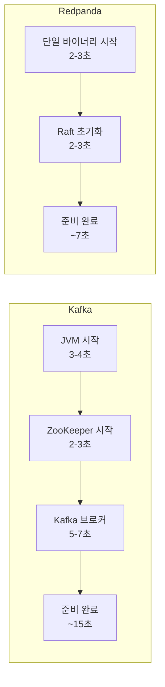
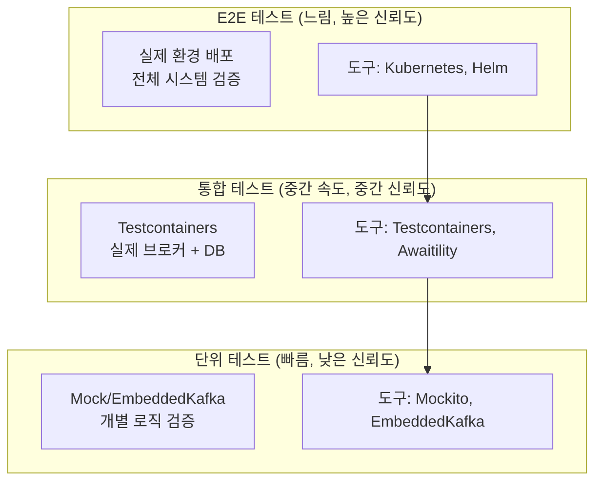
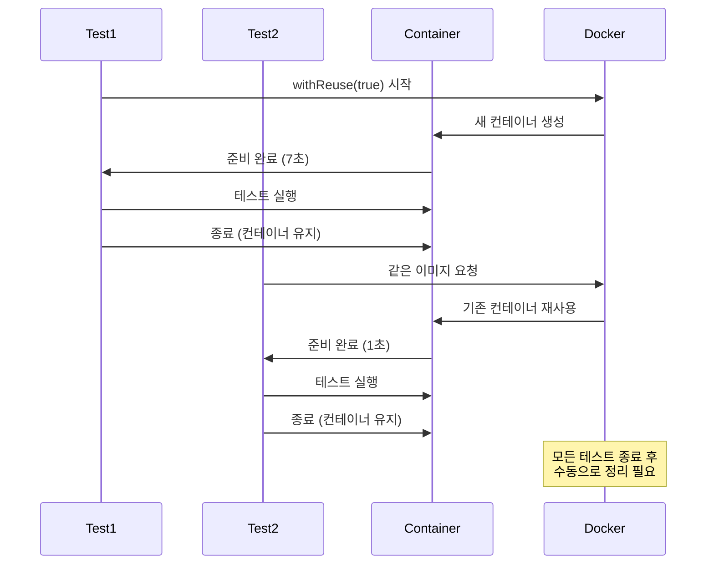

# 10. Testing

Testcontainers를 활용한 Redpanda 통합 테스트

---

## 왜 Testcontainers인가?

Kafka 애플리케이션을 테스트하는 방법은 크게 세 가지가 있다. 각각은 서로 다른 목적과 트레이드오프를 가진다.

### EmbeddedKafka vs Testcontainers

| 구분 | EmbeddedKafka | Testcontainers |
|------|---------------|----------------|
| **실행 방식** | JVM 내부 인메모리 | Docker 컨테이너 |
| **시작 속도** | 빠름 (~3초) | 중간 (~7초 Redpanda) |
| **실제 브로커** | 아니오 | 예 |
| **호환성** | Kafka API만 | 완전한 Kafka 호환 |
| **네트워크 격리** | 없음 | 있음 |
| **CI 환경** | 쉬움 | Docker 필요 |
| **Admin API** | 제한적 | 완전 지원 |

**EmbeddedKafka의 한계**:
- Kafka Streams, Kafka Connect 테스트 불가능
- Admin API 기능 제한 (토픽 파티션 변경, ACL 등)
- 실제 프로덕션 환경과 다른 동작 가능

**Testcontainers의 장점**:
- 실제 Kafka 브로커로 동작하므로 프로덕션 환경과 동일한 테스트 가능
- 네트워크 격리로 포트 충돌 없음
- 여러 서비스 통합 테스트 가능 (Kafka + DB + Redis)

### 왜 Redpanda가 2배 빠른가?

Kafka 컨테이너가 15초 걸릴 때 Redpanda는 7초에 시작된다. 그 이유는:

1. **단일 바이너리**: Kafka는 JVM + ZooKeeper/KRaft 필요, Redpanda는 C++ 단일 바이너리
2. **JVM 부트스트랩 제거**: JVM 시작, 클래스 로딩, GC 초기화 시간 없음
3. **ZooKeeper 제거**: Redpanda는 Raft 기반 내부 컨센서스 사용
4. **경량 시작**: 메타데이터 초기화가 훨씬 빠름



---

## 테스트 전략 레이어

테스트는 피라미드 구조로 설계해야 한다. 각 레이어는 다른 목적과 속도, 신뢰도를 가진다.



### 각 레이어의 적합성

| 레이어 | 테스트 대상 | 예시 | 도구 |
|--------|------------|------|------|
| **단위 테스트** | 순수 로직, 메시지 변환 | JSON 직렬화, 비즈니스 로직 | Mockito, JUnit |
| **통합 테스트** | Producer/Consumer, SAGA | 메시지 발행→소비, 보상 트랜잭션 | Testcontainers, Awaitility |
| **E2E 테스트** | 전체 워크플로우 | 주문→결제→배송 완료 | Kubernetes, Postman |

**언제 어떤 테스트를 작성할까?**

- **Mock 사용 (단위 테스트)**: 메시지 형식 변환, 유효성 검증, 재시도 로직
- **Testcontainers (통합 테스트)**: 실제 메시지 발행/소비, Consumer Group 동작, DLQ 처리
- **E2E 테스트**: 사용자 시나리오, 장애 복구, 성능 테스트

---

## Testcontainers 설정

### 의존성

```groovy
dependencies {
    testImplementation 'org.testcontainers:testcontainers'
    testImplementation 'org.testcontainers:redpanda'
    testImplementation 'org.testcontainers:junit-jupiter'
    testImplementation 'org.awaitility:awaitility'
}
```

### 핵심 어노테이션 상세

**@Testcontainers** — JUnit 5 확장이다. `@Container`가 붙은 필드를 찾아서 테스트 생명주기에 맞게 컨테이너를 시작/종료한다. 이 어노테이션이 없으면 `@Container`가 동작하지 않는다.

**@Container** — 이 필드가 Testcontainers가 관리해야 할 컨테이너임을 표시한다. `static` 필드에 붙이면 클래스 단위로 한 번만 생성되고(테스트 메서드마다 재생성하지 않음), 인스턴스 필드에 붙이면 매 테스트 메서드마다 새 컨테이너를 띄운다. 브로커 시작에 수 초가 걸리므로 `static`을 사용하여 한 번만 띄운다.

**RedpandaContainer** — Testcontainers가 제공하는 Redpanda 전용 컨테이너다. Kafka API와 Schema Registry를 모두 내장하고 있어서 별도의 Schema Registry 컨테이너가 불필요하다. `getBootstrapServers()`로 Kafka 주소를, `getSchemaRegistryAddress()`로 Schema Registry 주소를 가져온다. 포트는 매번 랜덤으로 할당된다.

**@DynamicPropertySource** — Spring 테스트에서 `application.yml`의 설정을 동적으로 덮어쓴다. Testcontainers의 포트는 매번 달라지므로, 컨테이너 시작 후 실제 할당된 주소를 Spring 설정에 주입해야 한다. 이 메서드가 없으면 `application.yml`에 하드코딩된 `localhost:9092`로 연결을 시도하여 실패한다.

**@DirtiesContext** — 각 테스트 클래스 실행 후 Spring ApplicationContext를 재생성한다. Kafka Consumer는 ApplicationContext에 바인딩되므로, 이전 테스트의 Consumer가 다음 테스트에 영향을 줄 수 있다. `@DirtiesContext`로 매번 깨끗한 상태에서 시작한다. 대신 ApplicationContext 재생성 비용이 있어 테스트 시간이 늘어난다.

`org.testcontainers:redpanda`는 Kafka + Schema Registry를 하나의 컨테이너로 제공한다. `org.testcontainers:kafka`를 사용하면 Confluent Kafka 이미지를 사용하며, Schema Registry는 별도 컨테이너로 띄워야 한다.

---

## 기본 통합 테스트

```java
@SpringBootTest
@Testcontainers
class KafkaIntegrationTest {

    @Container
    static RedpandaContainer redpanda = new RedpandaContainer(
        "docker.redpanda.com/redpandadata/redpanda:v25.3.1");

    @DynamicPropertySource
    static void kafkaProperties(DynamicPropertyRegistry registry) {
        registry.add("spring.kafka.bootstrap-servers", redpanda::getBootstrapServers);
    }

    @Autowired
    KafkaTemplate<String, Object> kafkaTemplate;

    @Autowired
    OrderProducer orderProducer;

    @Test
    void shouldSendAndReceiveMessage() {
        // Given
        OrderEvent event = new OrderEvent("order-1", "test-data");

        // When
        CompletableFuture<SendResult<String, Object>> future =
            orderProducer.send(event);

        // Then
        assertDoesNotThrow(() -> future.get(10, TimeUnit.SECONDS));
    }
}
```

---

## SAGA 통합 테스트

```java
@SpringBootTest
@Testcontainers
class OrderSagaIntegrationTest {

    @Container
    static RedpandaContainer redpanda = new RedpandaContainer(
        "docker.redpanda.com/redpandadata/redpanda:v25.3.1");

    @DynamicPropertySource
    static void kafkaProperties(DynamicPropertyRegistry registry) {
        registry.add("spring.kafka.bootstrap-servers", redpanda::getBootstrapServers);
    }

    @Autowired
    OrderSagaOrchestrator sagaOrchestrator;

    @Autowired
    SagaStateRepository sagaStateRepository;

    @Autowired
    InventoryRepository inventoryRepository;

    @BeforeEach
    void setup() {
        inventoryRepository.save(new Inventory("product-1", 100));
        inventoryRepository.save(new Inventory("product-2", 50));
    }

    @Test
    void shouldCompleteOrderSagaSuccessfully() {
        // Given
        CreateOrderCommand command = new CreateOrderCommand(
            "order-123",
            "customer-1",
            List.of(
                new OrderItem("product-1", 2, BigDecimal.valueOf(100)),
                new OrderItem("product-2", 1, BigDecimal.valueOf(50))
            )
        );

        // When
        String sagaId = sagaOrchestrator.startSaga(command);

        // Then
        await()
            .atMost(Duration.ofSeconds(30))
            .pollInterval(Duration.ofMillis(500))
            .until(() -> {
                SagaState state = sagaStateRepository.findById(sagaId).orElse(null);
                return state != null && state.getStatus() == SagaStatus.COMPLETED;
            });

        SagaState finalState = sagaStateRepository.findById(sagaId).orElseThrow();
        assertThat(finalState.getStatus()).isEqualTo(SagaStatus.COMPLETED);
        assertThat(finalState.getTrackingNumber()).isNotNull();
    }

    @Test
    void shouldCompensateWhenPaymentFails() {
        mockPaymentServiceToFail();

        CreateOrderCommand command = new CreateOrderCommand(
            "order-456",
            "customer-1",
            List.of(new OrderItem("product-1", 2, BigDecimal.valueOf(100)))
        );

        int initialStock = inventoryRepository.findByProductId("product-1")
            .orElseThrow().getAvailableQuantity();

        String sagaId = sagaOrchestrator.startSaga(command);

        await()
            .atMost(Duration.ofSeconds(30))
            .until(() -> {
                SagaState state = sagaStateRepository.findById(sagaId).orElse(null);
                return state != null && state.getStatus() == SagaStatus.COMPENSATED;
            });

        int finalStock = inventoryRepository.findByProductId("product-1")
            .orElseThrow().getAvailableQuantity();
        assertThat(finalStock).isEqualTo(initialStock);
    }

    @Test
    void shouldCompensateWhenShippingFails() {
        mockShippingServiceToFail();

        CreateOrderCommand command = new CreateOrderCommand(
            "order-789",
            "customer-1",
            List.of(new OrderItem("product-1", 1, BigDecimal.valueOf(100)))
        );

        String sagaId = sagaOrchestrator.startSaga(command);

        await()
            .atMost(Duration.ofSeconds(30))
            .until(() -> {
                SagaState state = sagaStateRepository.findById(sagaId).orElse(null);
                return state != null && state.getStatus() == SagaStatus.COMPENSATED;
            });

        SagaState finalState = sagaStateRepository.findById(sagaId).orElseThrow();
        assertThat(finalState.getFailedStep()).isEqualTo("SHIPPING_REQUEST");
    }
}
```

---

## Consumer 테스트

### EmbeddedKafka (단위 테스트용)

```java
@SpringBootTest
@EmbeddedKafka(partitions = 1, topics = {"orders"})
class OrderConsumerTest {

    @Autowired
    EmbeddedKafkaBroker embeddedKafka;

    @Autowired
    OrderConsumer orderConsumer;

    @Test
    void shouldConsumeOrderEvent() {
        OrderEvent event = new OrderEvent("order-1", "test");

        Map<String, Object> producerProps = KafkaTestUtils.producerProps(embeddedKafka);
        ProducerFactory<String, Object> pf = new DefaultKafkaProducerFactory<>(producerProps);
        KafkaTemplate<String, Object> template = new KafkaTemplate<>(pf);
        template.send("orders", event);

        await()
            .atMost(Duration.ofSeconds(10))
            .until(() -> orderConsumer.getProcessedOrders().contains("order-1"));
    }
}
```

---

## 테스트 설정 클래스

```java
@TestConfiguration
public class TestKafkaConfig {

    @Bean
    @Primary
    public ConsumerFactory<String, Object> testConsumerFactory(
            @Value("${spring.kafka.bootstrap-servers}") String bootstrapServers) {

        Map<String, Object> config = new HashMap<>();
        config.put(ConsumerConfig.BOOTSTRAP_SERVERS_CONFIG, bootstrapServers);
        config.put(ConsumerConfig.GROUP_ID_CONFIG, "test-group");
        config.put(ConsumerConfig.AUTO_OFFSET_RESET_CONFIG, "earliest");
        config.put(ConsumerConfig.KEY_DESERIALIZER_CLASS_CONFIG, StringDeserializer.class);
        config.put(ConsumerConfig.VALUE_DESERIALIZER_CLASS_CONFIG, JsonDeserializer.class);
        config.put(JsonDeserializer.TRUSTED_PACKAGES, "*");

        return new DefaultKafkaConsumerFactory<>(config);
    }
}
```

---

## 테스트 유틸리티

### KafkaTestHelper

```java
@Component
public class KafkaTestHelper {

    @Autowired
    private KafkaTemplate<String, Object> kafkaTemplate;

    public void sendAndWait(String topic, Object message) {
        try {
            kafkaTemplate.send(topic, message).get(10, TimeUnit.SECONDS);
        } catch (Exception e) {
            throw new RuntimeException("Failed to send test message", e);
        }
    }

    public <T> T waitForMessage(String topic, String groupId, Class<T> type,
                                Duration timeout) {
        Map<String, Object> props = new HashMap<>();
        props.put(ConsumerConfig.BOOTSTRAP_SERVERS_CONFIG,
            kafkaTemplate.getProducerFactory().getConfigurationProperties()
                .get(ProducerConfig.BOOTSTRAP_SERVERS_CONFIG));
        props.put(ConsumerConfig.GROUP_ID_CONFIG, groupId);
        props.put(ConsumerConfig.AUTO_OFFSET_RESET_CONFIG, "earliest");
        props.put(ConsumerConfig.KEY_DESERIALIZER_CLASS_CONFIG, StringDeserializer.class);
        props.put(ConsumerConfig.VALUE_DESERIALIZER_CLASS_CONFIG, JsonDeserializer.class);

        try (Consumer<String, T> consumer = new KafkaConsumer<>(props)) {
            consumer.subscribe(List.of(topic));

            Instant deadline = Instant.now().plus(timeout);
            while (Instant.now().isBefore(deadline)) {
                ConsumerRecords<String, T> records = consumer.poll(Duration.ofMillis(100));
                if (!records.isEmpty()) {
                    return records.iterator().next().value();
                }
            }
        }

        throw new AssertionError("No message received within timeout");
    }
}
```

---

## Flaky 테스트 방지

비동기 메시징 테스트는 타이밍 이슈로 인해 간헐적으로 실패하는 Flaky 테스트가 되기 쉽다. 이를 방지하는 핵심 원칙들이 있다.

### Consumer Timing 문제

**잘못된 패턴**:
```java
// ❌ Thread.sleep()은 정확한 시간을 보장하지 않음
kafkaTemplate.send("orders", event);
Thread.sleep(3000);  // 3초면 충분하겠지?
assertThat(orderRepository.findAll()).hasSize(1);
```

**문제점**:
- CI 환경에서 컨테이너가 느리면 3초로 부족할 수 있음
- 성공하면 불필요하게 3초를 기다림
- 실패 원인이 타이밍인지 로직 오류인지 구분 불가

**올바른 패턴**:
```java
// ✅ Awaitility로 조건 기반 대기
kafkaTemplate.send("orders", event);

await()
    .atMost(Duration.ofSeconds(10))
    .pollInterval(Duration.ofMillis(100))
    .ignoreExceptions()
    .until(() -> orderRepository.findAll().size() == 1);
```

### Awaitility 사용 패턴

```java
// 기본 패턴
await()
    .atMost(Duration.ofSeconds(30))        // 최대 대기 시간
    .pollInterval(Duration.ofMillis(500))  // 체크 주기
    .until(() -> condition());             // 조건

// 예외 무시 (DB 조회 중 일시적 실패 허용)
await()
    .atMost(Duration.ofSeconds(10))
    .pollInterval(Duration.ofMillis(100))
    .ignoreExceptions()  // Optional을 반환하는 경우 등에 유용
    .until(() -> orderRepository.findById(orderId).isPresent());

// Alias 사용 (실패 메시지 개선)
await("Order should be completed")
    .atMost(Duration.ofSeconds(30))
    .until(() -> {
        SagaState state = sagaStateRepository.findById(sagaId).orElse(null);
        return state != null && state.getStatus() == SagaStatus.COMPLETED;
    });

// 값 반환
String trackingNumber = await()
    .atMost(Duration.ofSeconds(10))
    .until(() -> sagaStateRepository.findById(sagaId)
        .map(SagaState::getTrackingNumber)
        .orElse(null),
        Objects::nonNull);
```

### Container Reuse 전략

테스트마다 컨테이너를 새로 시작하면 느리다. 재사용 전략으로 CI 시간을 줄일 수 있다.

**로컬 개발 환경**:
```properties
# ~/.testcontainers.properties
testcontainers.reuse.enable=true
```

```java
@Container
static RedpandaContainer redpanda = new RedpandaContainer(
    "docker.redpanda.com/redpandadata/redpanda:v25.3.1")
    .withReuse(true);  // 컨테이너 재사용
```

**CI 환경**:
- GitHub Actions: Docker Layer Caching 활성화
- GitLab CI: `services:` 키워드로 Kafka를 사이드카로 실행
- Jenkins: Docker-in-Docker 대신 Docker Socket 마운트

**주의사항**:
- 테스트 간 토픽은 분리해야 함 (같은 토픽 공유 시 오염 가능)
- Consumer Group ID를 테스트마다 다르게 설정
- `@DirtiesContext` 사용 시 컨테이너 재사용 효과 없음



---

## DLQ 테스트

Dead Letter Queue는 실패한 메시지를 별도 토픽으로 라우팅한다. 이를 테스트하려면 의도적인 실패 주입이 필요하다.

> **참고**: DLQ 전략 상세는 `06-dlq-strategy.md` 참조

### 실패 주입 패턴

```java
@SpringBootTest
@Testcontainers
class DlqIntegrationTest {

    @Container
    static RedpandaContainer redpanda = new RedpandaContainer(
        "docker.redpanda.com/redpandadata/redpanda:v25.3.1");

    @DynamicPropertySource
    static void kafkaProperties(DynamicPropertyRegistry registry) {
        registry.add("spring.kafka.bootstrap-servers", redpanda::getBootstrapServers);
    }

    @Autowired
    KafkaTemplate<String, Object> kafkaTemplate;

    @Autowired
    PaymentConsumer paymentConsumer;

    @Autowired
    DltRepository dltRepository;

    @Test
    void shouldSendToDltAfterMaxRetries() {
        // Given - 실패를 유발하는 메시지
        PaymentEvent invalidEvent = PaymentEvent.builder()
            .orderId("order-999")
            .amount(BigDecimal.valueOf(-100))  // 음수 금액 = 유효성 검증 실패
            .build();

        // When
        kafkaTemplate.send("payment-events", invalidEvent);

        // Then - DLT로 전송됨
        await()
            .atMost(Duration.ofSeconds(30))
            .pollInterval(Duration.ofMillis(500))
            .until(() -> dltRepository.findByOriginalTopic("payment-events")
                .stream()
                .anyMatch(dlt -> dlt.getOrderId().equals("order-999")));

        // DLT 메시지 검증
        DltMessage dltMessage = dltRepository
            .findByOriginalTopic("payment-events")
            .stream()
            .filter(dlt -> dlt.getOrderId().equals("order-999"))
            .findFirst()
            .orElseThrow();

        assertThat(dltMessage.getRetryCount()).isEqualTo(3);
        assertThat(dltMessage.getException()).contains("Invalid amount");
    }
}
```

### @RetryableTopic 동작 테스트

```java
@Test
void shouldRetryBeforeDlt() {
    // Given
    AtomicInteger attemptCount = new AtomicInteger(0);
    paymentConsumer.setOnProcessHook(() -> {
        int count = attemptCount.incrementAndGet();
        if (count < 3) {
            throw new TransientException("Database temporarily unavailable");
        }
    });

    PaymentEvent event = new PaymentEvent("order-123", BigDecimal.valueOf(100));

    // When
    kafkaTemplate.send("payment-events", event);

    // Then - 3번 시도 후 성공
    await()
        .atMost(Duration.ofSeconds(10))
        .until(() -> attemptCount.get() == 3);

    // DLT로 가지 않음
    assertThat(dltRepository.findByOriginalTopic("payment-events")).isEmpty();
}

@Test
void shouldNotRetryNonRetryableException() {
    // Given - 재시도 불가능한 예외 (비즈니스 로직 오류)
    paymentConsumer.setOnProcessHook(() -> {
        throw new NonRetryableException("Invalid payment method");
    });

    PaymentEvent event = new PaymentEvent("order-456", BigDecimal.valueOf(100));

    // When
    kafkaTemplate.send("payment-events", event);

    // Then - 즉시 DLT로 전송 (재시도 없음)
    await()
        .atMost(Duration.ofSeconds(5))
        .until(() -> dltRepository.findByOriginalTopic("payment-events")
            .stream()
            .anyMatch(dlt -> dlt.getOrderId().equals("order-456")));

    DltMessage dltMessage = dltRepository
        .findByOriginalTopic("payment-events")
        .get(0);

    assertThat(dltMessage.getRetryCount()).isEqualTo(0);  // 재시도 없음
}
```

### DLT 메시지 검증

```java
@Test
void shouldPreserveOriginalMessageInDlt() {
    PaymentEvent originalEvent = PaymentEvent.builder()
        .orderId("order-789")
        .amount(BigDecimal.valueOf(500))
        .currency("USD")
        .customerId("customer-1")
        .build();

    // 실패 주입
    paymentConsumer.setAlwaysFail(true);

    kafkaTemplate.send("payment-events", originalEvent);

    await()
        .atMost(Duration.ofSeconds(30))
        .until(() -> !dltRepository.findByOriginalTopic("payment-events").isEmpty());

    DltMessage dltMessage = dltRepository.findByOriginalTopic("payment-events").get(0);

    // 원본 메시지 보존 확인
    PaymentEvent preserved = objectMapper.readValue(
        dltMessage.getOriginalMessage(),
        PaymentEvent.class
    );

    assertThat(preserved.getOrderId()).isEqualTo("order-789");
    assertThat(preserved.getAmount()).isEqualByComparingTo(BigDecimal.valueOf(500));
    assertThat(preserved.getCurrency()).isEqualTo("USD");

    // 메타데이터 확인
    assertThat(dltMessage.getOriginalTopic()).isEqualTo("payment-events");
    assertThat(dltMessage.getOriginalPartition()).isNotNull();
    assertThat(dltMessage.getOriginalOffset()).isNotNull();
    assertThat(dltMessage.getTimestamp()).isNotNull();
}
```

---

## Testcontainers 최적화

### 컨테이너 재사용

```java
@Testcontainers
abstract class AbstractKafkaTest {

    @Container
    static RedpandaContainer redpanda = new RedpandaContainer(
        "docker.redpanda.com/redpandadata/redpanda:v25.3.1")
        .withReuse(true);

    @DynamicPropertySource
    static void kafkaProperties(DynamicPropertyRegistry registry) {
        registry.add("spring.kafka.bootstrap-servers", redpanda::getBootstrapServers);
    }
}

class OrderServiceTest extends AbstractKafkaTest {
    // 테스트...
}

class PaymentServiceTest extends AbstractKafkaTest {
    // 테스트...
}
```

### .testcontainers.properties

```properties
# ~/.testcontainers.properties
testcontainers.reuse.enable=true
```

---

## 안티패턴

Kafka 테스트에서 자주 발생하는 실수들과 해결 방법이다.

### 1. Thread.sleep() 남용

**안티패턴**:
```java
// ❌ 고정 시간 대기
kafkaTemplate.send("orders", event);
Thread.sleep(5000);  // "충분히 길게 잡으면 되겠지?"
assertThat(orderRepository.count()).isEqualTo(1);
```

**문제점**:
- 환경에 따라 시간이 부족하거나 과도함
- 테스트 스위트 전체가 느려짐 (100개 테스트 × 5초 = 8분 추가)
- 실패 시 디버깅 어려움

**올바른 패턴**:
```java
// ✅ 조건 기반 대기
kafkaTemplate.send("orders", event);

await()
    .atMost(Duration.ofSeconds(10))
    .pollInterval(Duration.ofMillis(100))
    .until(() -> orderRepository.count() == 1);
```

### 2. 하드코딩된 포트

**안티패턴**:
```java
// ❌ 고정 포트
@Container
static GenericContainer kafka = new GenericContainer("kafka:latest")
    .withExposedPorts(9092);

@DynamicPropertySource
static void props(DynamicPropertyRegistry registry) {
    registry.add("spring.kafka.bootstrap-servers", () -> "localhost:19092");
}
```

**문제점**:
- 포트가 이미 사용 중이면 테스트 실패
- 병렬 테스트 불가능
- CI 환경에서 충돌 가능

**올바른 패턴**:
```java
// ✅ 동적 포트 할당
@Container
static RedpandaContainer redpanda = new RedpandaContainer(
    "docker.redpanda.com/redpandadata/redpanda:v25.3.1");

@DynamicPropertySource
static void props(DynamicPropertyRegistry registry) {
    registry.add("spring.kafka.bootstrap-servers", redpanda::getBootstrapServers);
}
```

### 3. 테스트 간 토픽 공유

**안티패턴**:
```java
// ❌ 모든 테스트가 같은 토픽 사용
class OrderTest1 {
    @Test
    void test1() {
        kafkaTemplate.send("orders", event1);
        // ...
    }
}

class OrderTest2 {
    @Test
    void test2() {
        kafkaTemplate.send("orders", event2);  // test1의 메시지가 남아있을 수 있음
        // ...
    }
}
```

**문제점**:
- 이전 테스트의 메시지가 남아있어 오염됨
- 테스트 실행 순서에 따라 결과가 달라짐
- 병렬 실행 불가능

**올바른 패턴**:
```java
// ✅ 테스트마다 고유 토픽 또는 Consumer Group
class OrderTest {
    @Test
    void test1() {
        String topic = "orders-" + UUID.randomUUID();
        kafkaTemplate.send(topic, event);
        // ...
    }

    // 또는 Consumer Group ID를 테스트마다 다르게
    @Test
    void test2() {
        String groupId = "test-group-" + UUID.randomUUID();
        // ...
    }
}
```

### 4. @DirtiesContext 남용

**안티패턴**:
```java
// ❌ 매 테스트마다 Spring Context 재시작
@SpringBootTest
@DirtiesContext(classMode = ClassMode.AFTER_EACH_TEST_METHOD)
class OrderServiceTest {
    @Test void test1() { /* ... */ }
    @Test void test2() { /* ... */ }
    @Test void test3() { /* ... */ }
}
```

**문제점**:
- Spring Context 재시작은 매우 느림 (테스트당 5-10초 추가)
- 컨테이너 재사용 효과 없음
- 실제 문제(상태 공유)를 숨김

**올바른 패턴**:
```java
// ✅ @BeforeEach로 상태 정리
@SpringBootTest
class OrderServiceTest {
    @Autowired
    OrderRepository orderRepository;

    @BeforeEach
    void cleanup() {
        orderRepository.deleteAll();
    }

    @Test void test1() { /* ... */ }
    @Test void test2() { /* ... */ }
}
```

### 5. 예외 무시

**안티패턴**:
```java
// ❌ 실패를 조용히 무시
@KafkaListener(topics = "orders")
public void consume(OrderEvent event) {
    try {
        processOrder(event);
    } catch (Exception e) {
        // 아무것도 안 함
    }
}
```

**문제점**:
- 테스트가 통과해도 실제로는 실패한 것일 수 있음
- 프로덕션에서 메시지 유실
- 디버깅 불가능

**올바른 패턴**:
```java
// ✅ 실패를 명시적으로 처리
@KafkaListener(topics = "orders")
public void consume(OrderEvent event) {
    try {
        processOrder(event);
    } catch (TransientException e) {
        throw e;  // 재시도 가능
    } catch (BusinessException e) {
        log.error("Business logic failed", e);
        throw e;  // DLT로 전송
    }
}
```

---

## Redpanda vs Kafka 테스트 성능

| 항목 | Kafka | Redpanda |
|------|-------|----------|
| 컨테이너 시작 | ~15초 | ~7초 |
| 첫 메시지 처리 | ~3초 | ~1초 |
| 테스트 격리 | 토픽 분리 필요 | 토픽 분리 필요 |
| 메모리 사용량 | ~512MB | ~256MB |
| CPU 사용량 | 높음 (JVM) | 낮음 (네이티브) |

---

## 참고

- [Testcontainers Redpanda](https://www.testcontainers.org/modules/redpanda/)
- [Spring Kafka Testing](https://docs.spring.io/spring-kafka/reference/#testing)
- [Awaitility](http://www.awaitility.org/)
- [05-dlq-strategy.md](./05-dlq-strategy.md) - DLQ 전략 상세
