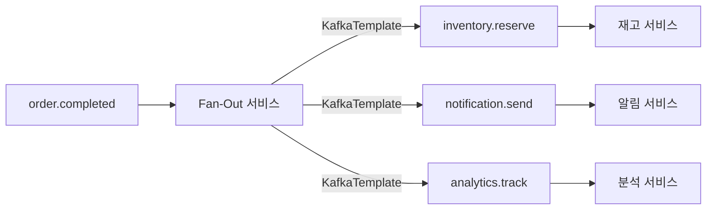
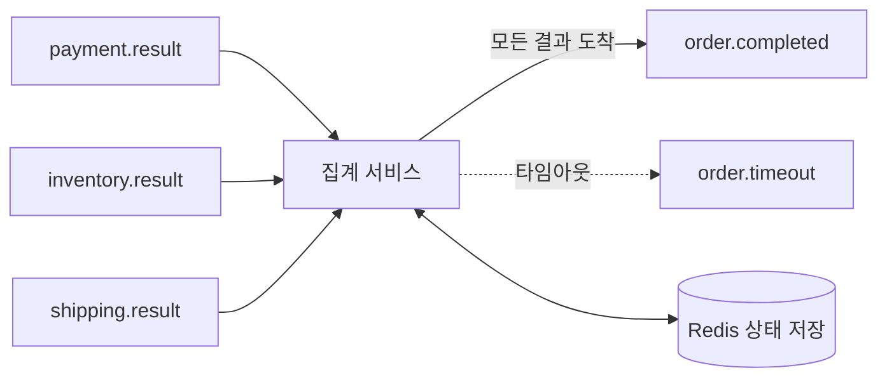
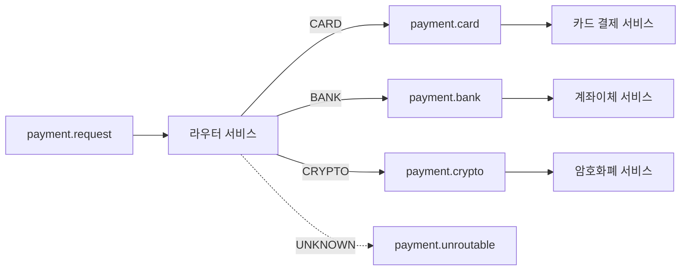
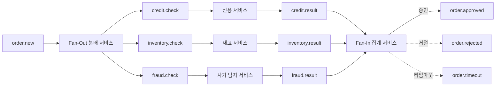
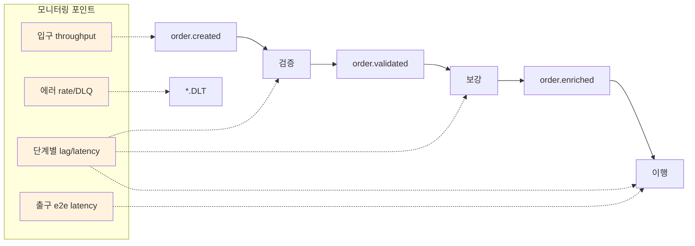

# 11. 토픽 파이프라인 아키텍처

메시지가 여러 토픽을 단계적으로 거치며 처리되는 파이프라인 패턴과 설계 원칙

> 메시징 패턴(EIP) 구현 상세는 [13-messaging-patterns-impl.md](./13-messaging-patterns-impl.md) 참조
> **기본 @SendTo 사용법**은 [02-producer-consumer.md](02-producer-consumer.md) 참조
> **Choreography SAGA와의 비교**는 [08-saga-choreography.md](08-saga-choreography.md) 참조
> **DLQ/재시도 전략**은 [05-dlq-strategy.md](05-dlq-strategy.md) 참조
> **트랜잭션 패턴**은 [07-transaction-patterns.md](07-transaction-patterns.md) 참조

---

## 1. 토픽 파이프라인이란?

### 정의

토픽 파이프라인은 메시지가 하나의 토픽에서 시작하여 여러 중간 토픽을 거치며 단계적으로 처리되는 아키텍처 패턴이다. 각 단계(stage)는 독립적인 Consumer Group으로 구성되며, 입력 토픽에서 메시지를 소비하고 처리 결과를 출력 토픽에 발행한다. Unix의 파이프(`|`)와 개념이 같다: 각 단계는 입력을 받아 변환하고, 다음 단계에 전달한다.

### 왜 필요한가?

단일 토픽에서 모든 처리를 수행하면 세 가지 한계에 부딪힌다.

**첫째, 관심사 분리가 불가능하다.** 주문 검증, 재고 확인, 결제 처리를 하나의 Consumer에서 모두 수행하면 코드가 비대해지고, 한 로직의 변경이 다른 로직에 영향을 준다. 파이프라인은 각 단계를 독립적인 서비스로 분리하여 이 문제를 해결한다.

**둘째, 독립적 스케일링이 불가능하다.** 검증은 CPU 집약적이고 결제는 I/O 집약적일 수 있다. 하나의 Consumer에서 처리하면 병목 지점에 맞춰 전체를 스케일해야 한다. 파이프라인은 각 단계를 독립적으로 스케일할 수 있다. 검증 서비스는 10개 인스턴스, 결제 서비스는 3개 인스턴스처럼 비용 효율적으로 자원을 배분할 수 있다.

**셋째, 장애 격리가 어렵다.** 결제 서비스에 장애가 발생하면, 하나의 Consumer에서는 검증까지 중단된다. 파이프라인에서는 결제 단계만 멈추고, 검증된 메시지는 중간 토픽에 안전하게 버퍼링된다. 결제 서비스가 복구되면 밀린 메시지를 이어서 처리할 수 있다.

### 파이프라인 vs Simple Pub/Sub vs Choreography SAGA

| 특징 | 토픽 파이프라인 | Simple Pub/Sub | Choreography SAGA |
|------|----------------|----------------|-------------------|
| 메시지 흐름 | 순차적 단계 (A→B→C) | 1:N 브로드캐스트 | 이벤트 기반 자율 반응 |
| 목적 | 데이터 변환/가공 | 이벤트 알림 | 분산 트랜잭션 |
| 보상 트랜잭션 | 없음 (실패 시 DLQ) | 없음 | 있음 (rollback 이벤트) |
| 적합 시점 | ETL, 다단계 검증, 데이터 파이프라인 | 알림, 로깅, 캐시 갱신 | 주문 처리, 결제 등 비즈니스 워크플로우 |
| 복잡도 | 중간 | 낮음 | 높음 |
| 상태 관리 | 각 단계 독립 (stateless 가능) | 없음 | 각 서비스가 상태 추적 필요 |

핵심 차이는 **목적**이다. 파이프라인은 데이터를 단계적으로 가공하는 것이 목적이고, Choreography SAGA는 여러 서비스 간 비즈니스 트랜잭션을 일관되게 유지하는 것이 목적이다. 파이프라인에는 보상 트랜잭션이 없다. 실패하면 DLQ로 보내고 끝이다. SAGA는 실패 시 이전 단계를 되돌려야 한다.

### 기본 파이프라인 구조

```mermaid
flowchart LR
    P[Producer] -->|발행| T1[order.created]
    T1 --> C1[검증 서비스]
    C1 -->|@SendTo| T2[order.validated]
    T2 --> C2[보강 서비스]
    C2 -->|@SendTo| T3[order.enriched]
    T3 --> C3[이행 서비스]
    C3 -->|완료| DB[(DB 저장)]

    style T1 fill:#e1f5fe
    style T2 fill:#e1f5fe
    style T3 fill:#e1f5fe
```

각 서비스는 독립적인 Consumer Group이다. `order.created`에서 시작한 메시지가 검증을 거쳐 `order.validated`로, 다시 보강을 거쳐 `order.enriched`로 흐른다. 각 중간 토픽은 버퍼 역할을 하며, 다음 단계가 자신의 속도로 처리할 수 있게 한다.

---

## 토픽 생성과 관리

### 토픽 생성 방식

Kafka/Redpanda에서 토픽을 생성하는 방식은 크게 두 가지다.

**Broker-side 자동 생성 (`auto.create.topics.enable=true`)**은 Producer가 존재하지 않는 토픽에 메시지를 보내거나, Consumer가 존재하지 않는 토픽을 구독할 때 브로커가 자동으로 토픽을 생성한다. Redpanda는 이 설정이 기본적으로 활성화되어 있다. 편리하지만 파티션 수와 복제 계수가 브로커 기본값으로 설정되므로, 프로덕션에서는 의도하지 않은 토픽이 생길 위험이 있다.

**Spring KafkaAdmin (`NewTopic` 빈)**은 애플리케이션이 기동될 때 `KafkaAdmin`이 `ApplicationContext`에서 `NewTopic` 타입의 빈을 모두 찾아서 브로커에 없는 토픽을 생성한다. 파티션 수, 복제 계수, retention 등 토픽 설정을 코드로 관리할 수 있으므로 프로덕션에서 권장되는 방식이다.

| 방식 | 동작 시점 | 파티션/설정 제어 | 적합한 환경 |
|------|----------|-----------------|------------|
| Broker-side (`auto.create.topics.enable`) | 첫 produce/consume 시 | 브로커 기본값 사용 | 개발, 프로토타이핑 |
| Spring KafkaAdmin (`NewTopic` 빈) | 앱 기동 시 | 코드로 명시적 제어 | **프로덕션 권장** |

### KafkaAdmin 동작 흐름

```
앱 기동 → KafkaAutoConfiguration이 KafkaAdmin 빈 자동 등록
→ KafkaAdmin이 ApplicationContext에서 NewTopic 빈 탐색
→ 브로커에 토픽 존재 여부 확인
→ 없으면 생성, 있으면 무시 (기존 설정 변경 안 함)
```

`KafkaAdmin`은 `KafkaAutoConfiguration`에서 `@ConditionalOnMissingBean`으로 자동 등록된다. 별도의 설정 없이 `NewTopic` 빈만 선언하면 된다.

### NewTopic 빈 선언

```java
@Configuration
public class KafkaTopicConfig {

    @Bean
    public NewTopic ordersTopic() {
        return TopicBuilder.name("chapter2.orders")
                .partitions(3)
                .replicas(1)
                .build();
    }

    // retention, cleanup.policy 등 토픽 설정도 가능
    @Bean
    public NewTopic auditTopic() {
        return TopicBuilder.name("audit-events")
                .partitions(6)
                .replicas(3)
                .config(TopicConfig.RETENTION_MS_CONFIG, "604800000")  // 7일
                .config(TopicConfig.CLEANUP_POLICY_CONFIG, "compact")
                .build();
    }
}
```

### 주의사항

**이미 존재하는 토픽의 설정은 변경되지 않는다.** `NewTopic` 빈에서 파티션 수를 3에서 5로 변경해도 기존 토픽은 그대로 유지된다. 토픽 설정을 변경하려면 `AdminClient`를 직접 사용하거나, CLI(`rpk topic alter-config`)로 수정해야 한다.

**챕터별 토픽 네이밍 충돌에 주의한다.** 여러 챕터가 같은 프로젝트에 공존할 때 `orders`처럼 범용적인 이름을 사용하면 충돌이 발생한다. `chapter2.orders`처럼 네임스페이스를 접두사로 붙이면 충돌을 방지할 수 있다.

**`@RetryableTopic`은 재시도/DLT 토픽을 자동으로 생성한다.** `KafkaAdmin`이 내부적으로 `NewTopic` 빈을 등록하므로 개발자가 직접 선언하지 않아도 된다. 다만 프로덕션에서는 파티션 수와 복제 계수를 직접 제어하기 위해 명시적으로 선언하는 것이 권장된다.

---

## 2. @SendTo 심화 (파이프라인 구현 도구)

[02-producer-consumer.md](02-producer-consumer.md)에서 `@SendTo`의 기본 사용법을 다뤘다. 이 섹션에서는 파이프라인 구현에 필요한 심화 내용을 다룬다.

### 내부 동작 원리

`@SendTo`는 `@KafkaListener` 메서드의 반환값을 자동으로 다른 토픽에 전송하는 선언적 메커니즘이다. 내부적으로 다음 과정을 거친다.

1. **MessagingMessageConverter**: `@KafkaListener` 메서드가 값을 반환하면, Spring Kafka는 `MessagingMessageConverter`를 사용하여 반환값을 Kafka `ProducerRecord`로 변환한다.
2. **ReplyTemplate**: 변환된 레코드는 `KafkaTemplate`(ReplyTemplate이라고도 불림)을 통해 전송된다. `ConcurrentKafkaListenerContainerFactory`에 `setReplyTemplate()`으로 설정하거나, Spring Boot 자동 설정이 기본 `KafkaTemplate`을 사용한다.
3. **헤더 전파**: 원본 메시지의 `KafkaHeaders.REPLY_TOPIC` 헤더가 있으면 해당 토픽으로 전송된다. 없으면 `@SendTo` 어노테이션에 지정된 토픽으로 전송된다.
4. **null 반환 = 전송 안 함**: 메서드가 `null`을 반환하면 아무것도 전송하지 않는다. 이를 이용하여 조건부 파이프라인 진행이 가능하다.

```java
@Configuration
public class KafkaListenerConfig {

    @Bean
    public ConcurrentKafkaListenerContainerFactory<String, Object> kafkaListenerContainerFactory(
            ConsumerFactory<String, Object> consumerFactory,
            KafkaTemplate<String, Object> kafkaTemplate) {

        ConcurrentKafkaListenerContainerFactory<String, Object> factory =
            new ConcurrentKafkaListenerContainerFactory<>();
        factory.setConsumerFactory(consumerFactory);
        factory.setReplyTemplate(kafkaTemplate);  // @SendTo가 사용할 KafkaTemplate
        return factory;
    }
}
```

### 토픽 지정 방식

`@SendTo`는 세 가지 방식으로 대상 토픽을 지정할 수 있다.

**정적 토픽명**

```java
@KafkaListener(topics = "order.created", groupId = "validation-service")
@SendTo("order.validated")
public OrderValidatedEvent validate(OrderCreatedEvent event) {
    return validationService.validate(event);
}
```

**Property Placeholder (환경별 토픽)**

```java
@KafkaListener(topics = "${app.source-topic}", groupId = "validation-service")
@SendTo("${app.result-topic}")
public OrderValidatedEvent validate(OrderCreatedEvent event) {
    return validationService.validate(event);
}
```

`application.yml`에서 환경별로 다른 토픽명을 설정할 수 있다. 개발 환경에서는 `dev.order.validated`, 운영 환경에서는 `order.validated`처럼 분리할 수 있다.

**SpEL (Spring Expression Language)**

```java
@KafkaListener(topics = "order.created", groupId = "validation-service")
@SendTo("!{@topicResolver.resolve(source.headers)}")
public OrderValidatedEvent validate(OrderCreatedEvent event) {
    return validationService.validate(event);
}
```

SpEL 표현식은 `!{}`로 감싼다 (`${}`는 Property Placeholder). `source`는 수신한 `Message<?>` 객체를 참조하며, 헤더나 페이로드 기반으로 동적 라우팅이 가능하다.

### 반환 타입별 동작

| 반환 타입 | 동작 | 토픽 결정 |
|----------|------|----------|
| POJO | 자동 직렬화 후 @SendTo 토픽으로 전송 | @SendTo 값 |
| `Message<T>` | 헤더 포함 전송, 토픽 오버라이드 가능 | Message 헤더 우선, 없으면 @SendTo |
| `Collection<Message<T>>` | 각 Message별 토픽 분기 가능 | 각 Message 헤더 |
| `null` | 전송하지 않음 | - |

`Message<T>` 반환이 파이프라인에서 가장 유용하다. correlation-id, trace-id 등 커스텀 헤더를 다음 단계에 전파할 수 있기 때문이다.

```java
@KafkaListener(topics = "order.created", groupId = "validation-service")
@SendTo("order.validated")
public Message<OrderValidatedEvent> validate(
        @Payload OrderCreatedEvent event,
        @Header("correlation-id") String correlationId) {

    OrderValidatedEvent validated = validationService.validate(event);

    return MessageBuilder.withPayload(validated)
            .setHeader(KafkaHeaders.KEY, event.getOrderId())
            .setHeader("correlation-id", correlationId)
            .build();
}
```

### 에러 발생 시 동작

`@KafkaListener` 메서드에서 예외가 발생하면 `@SendTo`는 실행되지 않는다. 대신 `ErrorHandler`가 호출된다. 이는 파이프라인에서 중요한 의미를 가진다: 처리 실패한 메시지는 다음 단계로 전파되지 않는다.

```
정상: @KafkaListener 실행 → 반환값 → @SendTo → 다음 토픽
예외: @KafkaListener 실행 → 예외 발생 → ErrorHandler → (DLQ 또는 재시도)
```

[05-dlq-strategy.md](05-dlq-strategy.md)의 `@RetryableTopic`이나 `DefaultErrorHandler`와 결합하여 재시도 후에도 실패하면 DLQ로 보내는 전략을 구성할 수 있다.

### @SendTo vs KafkaTemplate.send() 선택 기준

| 기준 | @SendTo | KafkaTemplate.send() |
|------|---------|---------------------|
| 대상 토픽 수 | 단일 (또는 SpEL로 동적) | 다중 |
| 흐름 제어 | 선언적 (어노테이션) | 명시적 (코드) |
| 에러 처리 | ErrorHandler에 위임 | try-catch로 직접 제어 |
| 헤더 커스터마이징 | Message<T> 반환 시 가능 | 완전 제어 |
| 조건부 전송 | null 반환으로 스킵 | if문으로 분기 |
| 적합 시점 | 1:1 순차 변환 (Linear Chain) | 1:N 분기, 조건부 라우팅, 복잡한 파이프라인 |

**경험적 규칙**: 하나의 입력에 하나의 출력이면 `@SendTo`, 그 외에는 `KafkaTemplate.send()`를 사용한다.

---

## 3. 토픽 파이프라인 아키텍처 패턴

파이프라인 아키텍처는 5가지 핵심 패턴으로 분류할 수 있다. 각 패턴은 특정 문제를 해결하며, 실제 시스템에서는 이들을 조합하여 사용한다.

### 패턴 1: Linear Chain (순차 변환)

#### 개념

메시지가 A→B→C 순서로 토픽을 거치며 단계적으로 처리된다. 각 단계는 하나의 책임만 가지며, 입력을 변환하여 다음 단계로 전달한다. Unix 파이프라인(`cat file | grep pattern | sort`)과 동일한 개념이다.

왜 이 패턴이 필요한가? 하나의 Consumer에서 검증→보강→변환을 모두 수행하면 코드가 비대해지고, 한 단계의 장애가 전체를 중단시킨다. Linear Chain은 각 단계를 독립적인 서비스로 분리하여, 개별 배포와 스케일링이 가능하게 한다.

#### 구조

```mermaid
flowchart LR
    T1[order.created] --> V[검증 서비스]
    V -->|@SendTo| T2[order.validated]
    T2 --> E[보강 서비스]
    E -->|@SendTo| T3[order.enriched]
    T3 --> F[이행 서비스]
    F --> Result[처리 완료]

    V -.->|실패| DLQ1[order.created.DLT]
    E -.->|실패| DLQ2[order.validated.DLT]
    F -.->|실패| DLQ3[order.enriched.DLT]
```

#### 구현

```java
// 1단계: 검증
@Component
@Slf4j
public class OrderValidationConsumer {

    private final OrderValidator validator;

    @KafkaListener(topics = "order.created", groupId = "validation-service")
    @SendTo("order.validated")
    public OrderValidatedEvent validate(OrderCreatedEvent event) {
        log.info("Validating order: {}", event.getOrderId());

        validator.validate(event);  // 실패 시 예외 → DLQ로

        return OrderValidatedEvent.builder()
                .orderId(event.getOrderId())
                .validatedAt(Instant.now())
                .items(event.getItems())
                .build();
    }
}

// 2단계: 보강 (외부 데이터 추가)
@Component
@Slf4j
public class OrderEnrichmentConsumer {

    private final CustomerService customerService;
    private final PricingService pricingService;

    @KafkaListener(topics = "order.validated", groupId = "enrichment-service")
    @SendTo("order.enriched")
    public OrderEnrichedEvent enrich(OrderValidatedEvent event) {
        log.info("Enriching order: {}", event.getOrderId());

        CustomerInfo customer = customerService.getCustomer(event.getCustomerId());
        PricingResult pricing = pricingService.calculate(event.getItems());

        return OrderEnrichedEvent.builder()
                .orderId(event.getOrderId())
                .customerName(customer.getName())
                .shippingAddress(customer.getAddress())
                .totalAmount(pricing.getTotal())
                .discount(pricing.getDiscount())
                .enrichedAt(Instant.now())
                .build();
    }
}

// 3단계: 이행
@Component
@Slf4j
public class OrderFulfillmentConsumer {

    private final FulfillmentService fulfillmentService;

    @KafkaListener(topics = "order.enriched", groupId = "fulfillment-service")
    public void fulfill(OrderEnrichedEvent event) {
        log.info("Fulfilling order: {}", event.getOrderId());
        fulfillmentService.process(event);
    }
}
```

#### 적합 시점과 트레이드오프

**적합**: ETL 파이프라인, 다단계 데이터 검증, 데이터 보강(enrichment), 이벤트 변환

**장점**: 각 단계가 단일 책임을 가져 코드가 명확하고, 독립적으로 스케일링/배포할 수 있다. 중간 토픽이 버퍼 역할을 하여 단계 간 처리 속도 차이를 흡수한다.

**비용**: 체인이 길어질수록 end-to-end 지연 시간이 증가한다. 각 단계마다 직렬화/역직렬화가 발생하고, 브로커를 거치므로 네트워크 홉이 추가된다. 전체 플로우를 추적하려면 distributed tracing이 필요하다.

**주의**: 체인 깊이가 5단계를 넘어가면 지연 시간과 디버깅 복잡도가 급격히 증가한다. 그 시점에서 일부 단계를 하나의 서비스로 합치는 것을 고려해야 한다. 또한 각 단계의 에러 처리를 반드시 설계해야 한다. 중간 단계에서 실패한 메시지가 어떻게 되는지 명확해야 한다.

---

### 패턴 2: Fan-Out (1:N 브로드캐스트)

#### 개념

하나의 소스 토픽에서 발생한 이벤트를 N개의 다운스트림 토픽으로 분배한다. 동일한 이벤트를 서로 다른 관점에서 처리해야 할 때 사용한다. 예를 들어 주문 완료 이벤트가 발생하면 재고 차감, 알림 발송, 분석 데이터 수집이 동시에 필요하다.

왜 `@SendTo`를 사용하지 않는가? `@SendTo`는 하나의 토픽에만 전송할 수 있다. Fan-Out은 여러 토픽에 동시에 전송해야 하므로 `KafkaTemplate.send()`를 직접 사용한다.

#### 구조



#### 구현

```java
@Component
@RequiredArgsConstructor
@Slf4j
public class OrderCompletedFanOutConsumer {

    private final KafkaTemplate<String, Object> kafkaTemplate;

    @KafkaListener(topics = "order.completed", groupId = "fan-out-service")
    public void fanOut(OrderCompletedEvent event) {
        String orderId = event.getOrderId();
        log.info("Fan-out order completed: {}", orderId);

        // 재고 예약 요청
        kafkaTemplate.send("inventory.reserve", orderId,
                InventoryReserveEvent.builder()
                        .orderId(orderId)
                        .items(event.getItems())
                        .build());

        // 알림 발송 요청
        kafkaTemplate.send("notification.send", orderId,
                NotificationEvent.builder()
                        .orderId(orderId)
                        .customerId(event.getCustomerId())
                        .type(NotificationType.ORDER_COMPLETED)
                        .build());

        // 분석 데이터 수집
        kafkaTemplate.send("analytics.track", orderId,
                AnalyticsEvent.builder()
                        .orderId(orderId)
                        .totalAmount(event.getTotalAmount())
                        .timestamp(Instant.now())
                        .build());
    }
}
```

#### 적합 시점과 트레이드오프

**적합**: 이벤트 알림, CQRS read model 갱신, 감사 로깅, 한 이벤트에 대한 다중 후속 처리

**장점**: 소스 서비스와 다운스트림 서비스가 완전히 분리된다. 새로운 다운스트림을 추가해도 소스 서비스를 수정할 필요가 없다(Fan-Out 서비스만 수정). 각 다운스트림은 자신의 속도로 독립 처리한다.

**비용**: 여러 토픽에 전송하므로 부분 실패 가능성이 있다. `inventory.reserve`는 성공했지만 `notification.send`는 실패할 수 있다. 원자적 전송이 필요하면 [07-transaction-patterns.md](07-transaction-patterns.md)의 Kafka 트랜잭션을 적용해야 한다.

**주의**: Fan-Out 서비스 자체가 단일 장애점이 될 수 있다. Consumer Group 인스턴스를 충분히 확보하고, Fan-Out 실패 시 DLQ 전략을 반드시 구성해야 한다. 또한 각 다운스트림 토픽 간에는 순서 보장이 없다는 것을 인지해야 한다.

**트랜잭션으로 원자적 Fan-Out** (부분 실패 방지):

```java
@Transactional("kafkaTransactionManager")
@KafkaListener(topics = "order.completed", groupId = "fan-out-service")
public void fanOutTransactional(OrderCompletedEvent event) {
    String orderId = event.getOrderId();

    kafkaTemplate.send("inventory.reserve", orderId,
            InventoryReserveEvent.builder().orderId(orderId).items(event.getItems()).build());
    kafkaTemplate.send("notification.send", orderId,
            NotificationEvent.builder().orderId(orderId).customerId(event.getCustomerId()).build());
    kafkaTemplate.send("analytics.track", orderId,
            AnalyticsEvent.builder().orderId(orderId).totalAmount(event.getTotalAmount()).build());
    // 하나라도 실패하면 전체 롤백 — 트랜잭션 설정은 07-transaction-patterns.md 참조
}
```

---

### 패턴 3: Fan-In (N:1 집계/합류)

#### 개념

여러 소스 토픽의 메시지가 하나의 집계 지점으로 수렴한다. 병렬 처리 결과를 모아 최종 결정을 내릴 때 사용한다. Scatter-Gather 패턴의 Gather 부분에 해당한다.

왜 외부 상태 저장소가 필요한가? 여러 토픽에서 들어오는 메시지의 도착 순서와 시점을 예측할 수 없다. 결제 결과가 먼저 올 수도, 재고 결과가 먼저 올 수도 있다. correlation-id(주문 ID 등)로 메시지를 묶고, 모든 결과가 도착했는지 추적하려면 외부 상태 저장소(Redis, DB)가 필요하다.

#### 구조



#### 구현

```java
@Component
@RequiredArgsConstructor
@Slf4j
public class OrderAggregatorConsumer {

    private final AggregationStore aggregationStore;  // Redis 기반
    private final KafkaTemplate<String, Object> kafkaTemplate;

    private static final Set<String> REQUIRED_TOPICS = Set.of(
            "payment.result", "inventory.result", "shipping.result");

    @KafkaListener(
            topics = {"payment.result", "inventory.result", "shipping.result"},
            groupId = "aggregator-service")
    public void aggregate(ConsumerRecord<String, Object> record) {
        String orderId = record.key();
        String sourceTopic = record.topic();

        log.info("Received partial result: orderId={}, topic={}", orderId, sourceTopic);

        // 부분 결과 저장
        aggregationStore.savePartialResult(orderId, sourceTopic, record.value());

        // 모든 결과가 도착했는지 확인
        Set<String> receivedTopics = aggregationStore.getReceivedTopics(orderId);

        if (receivedTopics.containsAll(REQUIRED_TOPICS)) {
            log.info("All results received for order: {}", orderId);

            OrderAggregation result = aggregationStore.buildResult(orderId);
            kafkaTemplate.send("order.completed", orderId, result);
            aggregationStore.cleanup(orderId);
        }
    }
}
```

```java
// AggregationStore 구현 (Redis 기반)
@Component
@RequiredArgsConstructor
public class RedisAggregationStore implements AggregationStore {

    private final RedisTemplate<String, Object> redisTemplate;
    private static final Duration TTL = Duration.ofMinutes(30);

    @Override
    public void savePartialResult(String orderId, String topic, Object result) {
        String key = "aggregation:" + orderId;
        redisTemplate.opsForHash().put(key, topic, result);
        redisTemplate.expire(key, TTL);  // TTL 설정: 부분 실패 시 자동 정리
    }

    @Override
    public Set<String> getReceivedTopics(String orderId) {
        String key = "aggregation:" + orderId;
        return redisTemplate.opsForHash().keys(key).stream()
                .map(Object::toString)
                .collect(Collectors.toSet());
    }

    @Override
    public OrderAggregation buildResult(String orderId) {
        String key = "aggregation:" + orderId;
        Map<Object, Object> entries = redisTemplate.opsForHash().entries(key);
        return OrderAggregation.from(entries);
    }

    @Override
    public void cleanup(String orderId) {
        redisTemplate.delete("aggregation:" + orderId);
    }
}
```

타임아웃 처리도 필수다. 한 브랜치가 영원히 응답하지 않을 수 있기 때문이다.

```java
// 타임아웃 처리 (스케줄러)
@Component
@RequiredArgsConstructor
@Slf4j
public class AggregationTimeoutChecker {

    private final AggregationStore aggregationStore;
    private final KafkaTemplate<String, Object> kafkaTemplate;

    @Scheduled(fixedRate = 60_000)  // 1분마다 체크
    public void checkTimeouts() {
        List<String> timedOutOrders = aggregationStore.findTimedOut(Duration.ofMinutes(10));

        for (String orderId : timedOutOrders) {
            log.warn("Aggregation timeout for order: {}", orderId);
            Set<String> missing = aggregationStore.getMissingTopics(orderId);

            kafkaTemplate.send("order.timeout", orderId,
                    OrderTimeoutEvent.builder()
                            .orderId(orderId)
                            .missingResults(missing)
                            .build());

            aggregationStore.cleanup(orderId);
        }
    }
}
```

#### 적합 시점과 트레이드오프

**적합**: Scatter-Gather 패턴, 병렬 작업 완료 대기, 주문 집계, 다중 소스 데이터 결합

**장점**: 병렬 처리로 전체 처리 시간을 단축할 수 있다. 각 브랜치가 독립적으로 동작하므로 한 브랜치의 지연이 다른 브랜치에 영향을 주지 않는다.

**비용**: 외부 상태 저장소(Redis/DB)가 필수이며, 이 저장소 자체의 가용성을 관리해야 한다. 타임아웃 처리, 부분 실패 처리, 중복 도착 처리 등 엣지 케이스가 많다.

**주의**: TTL을 반드시 설정하여 미완료 집계가 영원히 남지 않게 해야 한다. 한 브랜치가 응답하지 않을 때의 정책(타임아웃 후 어떻게 할 것인가)을 사전에 정의해야 한다.

---

### 패턴 4: Filter-Branch (조건부 라우팅)

#### 개념

메시지의 내용을 검사하여 조건에 따라 다른 토픽으로 라우팅한다. Content-Based Router 패턴이라고도 한다. 하나의 입력 토픽에서 메시지 타입이나 속성에 따라 서로 다른 처리 경로로 분기시킨다.

왜 Consumer Group만으로는 부족한가? Consumer Group은 같은 토픽의 메시지를 분산 처리하지만, 메시지 내용에 따른 라우팅은 할 수 없다. 카드 결제와 계좌이체는 완전히 다른 처리 로직이 필요한데, 같은 토픽에 두면 각 Consumer가 자신의 메시지 타입인지 먼저 확인해야 한다. Filter-Branch는 라우터가 미리 분류하여 각 Consumer가 자기 타입만 받도록 한다.

#### 구조



#### 구현

```java
@Component
@RequiredArgsConstructor
@Slf4j
public class PaymentRouterConsumer {

    private final KafkaTemplate<String, Object> kafkaTemplate;

    @KafkaListener(topics = "payment.request", groupId = "payment-router")
    public void route(PaymentRequestEvent event) {
        String orderId = event.getOrderId();

        String targetTopic = switch (event.getPaymentMethod()) {
            case CARD -> "payment.card";
            case BANK_TRANSFER -> "payment.bank";
            case CRYPTO -> "payment.crypto";
        };

        log.info("Routing payment: orderId={}, method={}, target={}",
                orderId, event.getPaymentMethod(), targetTopic);

        kafkaTemplate.send(targetTopic, orderId, event);
    }
}
```

라우팅 규칙이 복잡해지면 전략 패턴으로 분리하는 것이 좋다.

```java
// 라우팅 전략 인터페이스
public interface RoutingStrategy<T> {
    String resolveTargetTopic(T event);
    String fallbackTopic();
}

@Component
public class PaymentRoutingStrategy implements RoutingStrategy<PaymentRequestEvent> {

    private static final Map<PaymentMethod, String> TOPIC_MAP = Map.of(
            PaymentMethod.CARD, "payment.card",
            PaymentMethod.BANK_TRANSFER, "payment.bank",
            PaymentMethod.CRYPTO, "payment.crypto"
    );

    @Override
    public String resolveTargetTopic(PaymentRequestEvent event) {
        return TOPIC_MAP.getOrDefault(event.getPaymentMethod(), fallbackTopic());
    }

    @Override
    public String fallbackTopic() {
        return "payment.unroutable";
    }
}

// 범용 라우터
@Component
@RequiredArgsConstructor
@Slf4j
public class GenericRouterConsumer {

    private final KafkaTemplate<String, Object> kafkaTemplate;
    private final PaymentRoutingStrategy routingStrategy;

    @KafkaListener(topics = "payment.request", groupId = "payment-router")
    public void route(PaymentRequestEvent event) {
        String targetTopic = routingStrategy.resolveTargetTopic(event);
        log.info("Routing to: {}", targetTopic);
        kafkaTemplate.send(targetTopic, event.getOrderId(), event);
    }
}
```

#### 적합 시점과 트레이드오프

**적합**: Content-Based Routing, A/B 테스팅, 우선순위 큐, 메시지 타입별 분리

**장점**: 다운스트림 Consumer가 자신의 타입만 처리하면 되므로 로직이 단순해진다. 새로운 결제 수단 추가 시 라우터에 분기만 추가하면 된다.

**비용**: 라우터가 단일 장애점이 된다. 모든 메시지가 라우터를 거쳐야 하므로 라우터의 처리량이 전체 시스템의 병목이 될 수 있다. 토픽이 과도하게 늘어나는 토픽 폭발(Topic Explosion) 위험도 있다.

**주의**: 반드시 fallback 토픽을 설정해야 한다. 예상하지 못한 메시지 타입이 들어왔을 때 라우터가 예외를 던지면, 해당 파티션의 모든 메시지 처리가 중단된다. unroutable 토픽에 보내고 알림을 발송하는 것이 안전하다.

---

### 패턴 5: Diamond (Fan-Out + Fan-In 결합)

#### 개념

메시지를 여러 브랜치로 분산(Fan-Out)하고, 각 브랜치의 결과를 다시 합류(Fan-In)시키는 패턴이다. 실무에서 가장 많이 사용되면서 가장 복잡한 패턴이다. 주문 처리에서 신용 확인, 재고 확인, 사기 탐지를 병렬로 수행한 뒤 모든 결과를 종합하여 최종 승인/거절을 결정하는 것이 대표적 예시다.

왜 Linear Chain이 아닌 Diamond인가? 신용 확인(2초), 재고 확인(500ms), 사기 탐지(3초)를 순차로 처리하면 총 5.5초가 걸린다. Diamond로 병렬 처리하면 가장 느린 3초에 수렴한다. 단계 간 의존성이 없을 때 병렬화하여 전체 지연을 줄이는 것이 핵심이다.

#### 구조



#### 구현

**Fan-Out (분배)**

```java
@Component
@RequiredArgsConstructor
@Slf4j
public class OrderCheckFanOutConsumer {

    private final KafkaTemplate<String, Object> kafkaTemplate;

    @KafkaListener(topics = "order.new", groupId = "order-check-fanout")
    public void distribute(OrderNewEvent event) {
        String orderId = event.getOrderId();
        String correlationId = UUID.randomUUID().toString();

        log.info("Distributing checks: orderId={}, correlationId={}", orderId, correlationId);

        // correlation-id를 헤더에 포함하여 Fan-In에서 결합
        Headers headers = new RecordHeaders();
        headers.add("correlation-id", correlationId.getBytes(StandardCharsets.UTF_8));

        kafkaTemplate.send(new ProducerRecord<>(
                "credit.check", null, orderId, toCreditCheckRequest(event), headers));

        kafkaTemplate.send(new ProducerRecord<>(
                "inventory.check", null, orderId, toInventoryCheckRequest(event), headers));

        kafkaTemplate.send(new ProducerRecord<>(
                "fraud.check", null, orderId, toFraudCheckRequest(event), headers));
    }

    private CreditCheckRequest toCreditCheckRequest(OrderNewEvent event) {
        return CreditCheckRequest.builder()
                .orderId(event.getOrderId())
                .customerId(event.getCustomerId())
                .requestedAmount(event.getTotalAmount())
                .build();
    }

    private InventoryCheckRequest toInventoryCheckRequest(OrderNewEvent event) {
        return InventoryCheckRequest.builder()
                .orderId(event.getOrderId())
                .items(event.getItems())
                .build();
    }

    private FraudCheckRequest toFraudCheckRequest(OrderNewEvent event) {
        return FraudCheckRequest.builder()
                .orderId(event.getOrderId())
                .customerId(event.getCustomerId())
                .shippingAddress(event.getShippingAddress())
                .totalAmount(event.getTotalAmount())
                .build();
    }
}
```

**각 브랜치 처리 (예: 신용 확인)**

```java
@Component
@RequiredArgsConstructor
@Slf4j
public class CreditCheckConsumer {

    private final CreditService creditService;

    @KafkaListener(topics = "credit.check", groupId = "credit-service")
    @SendTo("credit.result")
    public Message<CreditCheckResult> check(
            @Payload CreditCheckRequest request,
            @Header("correlation-id") String correlationId) {

        log.info("Credit check: orderId={}", request.getOrderId());

        CreditCheckResult result = creditService.check(
                request.getCustomerId(), request.getRequestedAmount());

        return MessageBuilder.withPayload(result)
                .setHeader(KafkaHeaders.KEY, request.getOrderId())
                .setHeader("correlation-id", correlationId)
                .build();
    }
}
```

**Fan-In (집계 + 최종 결정)**

```java
@Component
@RequiredArgsConstructor
@Slf4j
public class OrderDecisionAggregator {

    private final AggregationStore aggregationStore;
    private final KafkaTemplate<String, Object> kafkaTemplate;

    private static final Set<String> REQUIRED = Set.of(
            "credit.result", "inventory.result", "fraud.result");

    @KafkaListener(
            topics = {"credit.result", "inventory.result", "fraud.result"},
            groupId = "order-decision-aggregator")
    public void aggregate(ConsumerRecord<String, Object> record,
                          @Header("correlation-id") String correlationId) {

        String orderId = record.key();
        log.info("Partial result: orderId={}, topic={}", orderId, record.topic());

        aggregationStore.savePartialResult(orderId, record.topic(), record.value());

        Set<String> received = aggregationStore.getReceivedTopics(orderId);
        if (!received.containsAll(REQUIRED)) {
            return;  // 아직 모든 결과가 도착하지 않음
        }

        // 모든 결과 도착 → 최종 결정
        OrderDecision decision = makeDecision(orderId);

        if (decision.isApproved()) {
            kafkaTemplate.send("order.approved", orderId, decision);
        } else {
            kafkaTemplate.send("order.rejected", orderId, decision);
        }

        aggregationStore.cleanup(orderId);
    }

    private OrderDecision makeDecision(String orderId) {
        CreditCheckResult credit = aggregationStore.getResult(orderId, "credit.result");
        InventoryCheckResult inventory = aggregationStore.getResult(orderId, "inventory.result");
        FraudCheckResult fraud = aggregationStore.getResult(orderId, "fraud.result");

        boolean approved = credit.isApproved()
                && inventory.isAvailable()
                && !fraud.isSuspicious();

        return OrderDecision.builder()
                .orderId(orderId)
                .creditApproved(credit.isApproved())
                .inventoryAvailable(inventory.isAvailable())
                .fraudClear(!fraud.isSuspicious())
                .approved(approved)
                .decidedAt(Instant.now())
                .build();
    }
}
```

#### 적합 시점과 트레이드오프

**적합**: 주문 승인/거절, 대출 심사, 다중 요소 인증, 병렬 검증이 필요한 모든 워크플로우

**장점**: 병렬 처리로 전체 지연 시간을 최소화한다. 각 브랜치가 독립적으로 스케일링되며, 한 브랜치의 장애가 다른 브랜치에 영향을 주지 않는다.

**비용**: 5가지 패턴 중 가장 복잡하다. correlation-id 전파, 외부 상태 저장소, 타임아웃 처리, 부분 실패 처리를 모두 구현해야 한다. Circuit Breaker 패턴과 결합하여, 특정 브랜치가 지속적으로 실패하면 해당 브랜치를 일시적으로 건너뛰는 로직도 필요할 수 있다.

**주의**: correlation-id는 필수다. correlation-id 없이는 어떤 결과가 어떤 요청에 대한 것인지 알 수 없다. 또한 한 브랜치가 영원히 응답하지 않는 경우를 반드시 처리해야 한다. 타임아웃 + 기본값(예: 사기 탐지 타임아웃 시 보수적으로 거절) 전략을 사전에 정의해야 한다.

---

### 패턴 선택 가이드

| 상황 | 추천 패턴 | 이유 |
|------|----------|------|
| 단계별 데이터 변환 (ETL, 검증) | Linear Chain | 각 단계 독립 스케일링, 단일 책임 |
| 하나의 이벤트 → 여러 서비스 알림 | Fan-Out | 관심사 분리, 독립적 후속 처리 |
| 여러 결과를 모아 최종 결정 | Fan-In | 병렬 처리 후 합류 |
| 메시지 타입별 다른 처리 | Filter-Branch | 조건부 라우팅, Consumer 로직 단순화 |
| 병렬 검증 후 종합 판단 | Diamond | Fan-Out + Fan-In, 지연 시간 최소화 |
| 순차 변환 + 조건 분기 | Linear Chain + Filter-Branch | 패턴 조합 |
| 이벤트 분배 + 결과 수집 | Fan-Out + Fan-In (Diamond) | 패턴 조합 |

실제 시스템에서는 하나의 패턴만 사용하는 경우가 드물다. 예를 들어 주문 시스템은 Linear Chain(검증→보강) → Diamond(병렬 확인→집계) → Fan-Out(알림 분배) 형태로 여러 패턴이 연결된다.

---

## 4. 토픽 설계 원칙

파이프라인 아키텍처에서 토픽 설계는 데이터베이스의 테이블 설계만큼 중요하다. 잘못된 토픽 설계는 나중에 변경하기 매우 어렵다.

### 네이밍 컨벤션

```
{domain}.{entity}.{stage}.{version}
```

| 구성 요소 | 설명 | 예시 |
|----------|------|------|
| domain | 비즈니스 도메인 | order, payment, inventory |
| entity | 대상 엔티티 | order, payment, stock |
| stage | 처리 단계 또는 상태 | created, validated, completed, failed |
| version | 스키마 버전 (선택) | v1, v2 |

**예시**

```
order.payment.requested.v1    → 결제 요청됨
order.payment.completed.v1    → 결제 완료됨
order.payment.failed.v1       → 결제 실패됨
order.fulfillment.started.v1  → 이행 시작됨
inventory.stock.reserved.v1   → 재고 예약됨
inventory.stock.released.v1   → 재고 해제됨
```

왜 이 컨벤션인가? 토픽명만 보고도 어떤 도메인의 어떤 엔티티가 어떤 상태에 있는지 파악할 수 있다. 특히 `stage`가 명확하면 파이프라인의 현재 위치를 즉시 알 수 있다. 버전을 포함하면 스키마 변경 시 새 토픽으로 마이그레이션할 수 있다.

### 파티션 전략

파이프라인에서 파티션 키는 **엔티티 ID**를 사용한다. 같은 주문의 모든 이벤트가 같은 파티션에 들어가야 순서가 보장되기 때문이다.

```java
// 주문 ID를 키로 사용 → 같은 주문의 이벤트는 항상 같은 파티션
kafkaTemplate.send("order.validated", event.getOrderId(), event);
```

파이프라인의 모든 단계에서 동일한 키를 유지해야 한다. 1단계에서 주문 ID를 키로 사용했으면 2단계, 3단계에서도 주문 ID를 키로 사용한다. 중간에 키가 바뀌면 같은 주문의 이벤트가 다른 파티션에 분산되어 순서가 깨진다.

### 토픽 정책

| 정책 | 이벤트 토픽 | 감사 토픽 | DLQ 토픽 |
|------|-----------|----------|---------|
| Retention | 7일 | 30일 | 90일 |
| Replication Factor | 3 (프로덕션) | 3 | 3 |
| Compression | lz4 | lz4 | none |
| Partition 수 | 처리량 기준 | 3~6 | 3 |
| Cleanup Policy | delete | delete | delete |

왜 DLQ의 retention이 가장 긴가? DLQ에 들어간 메시지는 수동 분석과 재처리가 필요하다. 운영팀이 대응할 시간을 충분히 확보해야 한다. 90일이면 대부분의 운영 이슈를 커버할 수 있다.

### 안티패턴

| 안티패턴 | 문제 | 해결 |
|---------|------|------|
| 거대 토픽 (God Topic) | 모든 이벤트가 한 토픽에 혼재 → 파티션 핫스팟, 스키마 혼재, Consumer 복잡도 증가 | 도메인별 토픽 분리 |
| 토픽 폭발 (Topic Explosion) | 조건마다 토픽 생성 → 관리 불가, 브로커 메타데이터 비대화 | Filter-Branch + 메시지 헤더 기반 라우팅 |
| 스키마 미버저닝 | 호환 불가 변경 시 Consumer 일괄 장애 | Avro + Schema Registry로 호환성 검증 |
| DLQ 미설계 | 처리 실패 메시지 유실, 원인 분석 불가 | 파이프라인 각 단계에 DLQ 토픽 배치 |
| 순환 의존 (Circular Dependency) | A→B→C→A 무한 루프, 메시지 무한 증식 | DAG 구조 강제 + TTL 헤더로 루프 감지 |

**순환 의존 방지 코드 예시**

```java
@KafkaListener(topics = "order.process", groupId = "order-service")
public void process(ConsumerRecord<String, Object> record) {
    // TTL 헤더로 순환 감지
    Header ttlHeader = record.headers().lastHeader("pipeline-ttl");
    int ttl = ttlHeader != null
            ? Integer.parseInt(new String(ttlHeader.value())) - 1
            : 5;  // 기본 TTL: 5홉

    if (ttl <= 0) {
        log.error("Pipeline TTL expired. Possible circular dependency. key={}", record.key());
        kafkaTemplate.send("order.process.DLT", record.key(), record.value());
        return;
    }

    // 처리 후 다음 토픽으로 전송 시 TTL 감소
    ProducerRecord<String, Object> next = new ProducerRecord<>("next.topic", record.key(), result);
    next.headers().add("pipeline-ttl", String.valueOf(ttl).getBytes());
    kafkaTemplate.send(next);
}
```

---

## 5. Request-Reply 패턴

비동기 파이프라인이 아닌 동기적 요청-응답이 필요한 경우, Spring Kafka는 `ReplyingKafkaTemplate`을 제공한다. 이 패턴은 API Gateway → Kafka → 처리 서비스 → Kafka → API Gateway 흐름에서 HTTP 응답을 Kafka 기반으로 받아야 할 때 사용한다.

ReplyingKafkaTemplate은 요청 시 `reply-topic`과 `correlation-id` 헤더를 자동 주입하고, 응답자가 `@SendTo`로 응답하면 correlation-id로 매칭하여 호출자에게 전달한다.

> **구현 상세**: 동작 원리, 비동기 변형, 다중 인스턴스 라우팅, 에러 전파, AggregatingReplyingKafkaTemplate(Scatter-Gather) 등은 [12-replying-kafka-template.md](./12-replying-kafka-template.md) 참조

---

## 6. 파이프라인 관측성

파이프라인은 메시지가 여러 토픽과 서비스를 거치므로, 단일 서비스보다 관측성(Observability)이 훨씬 중요하다. 메시지가 어디서 멈췄는지, 어디서 느려졌는지, 어디서 실패했는지를 추적할 수 있어야 한다.

### 헤더 전파

파이프라인의 모든 단계에서 `correlation-id`와 `trace-id`를 전파해야 한다. 이를 통해 하나의 요청이 파이프라인을 거치는 전체 경로를 추적할 수 있다.

```java
@Component
@Slf4j
public class PipelineStageConsumer {

    private final EnrichmentService enrichService;

    @KafkaListener(topics = "order.validated", groupId = "enrichment-service")
    @SendTo("order.enriched")
    public Message<OrderEnrichedEvent> enrich(
            @Payload OrderValidatedEvent event,
            @Header(KafkaHeaders.RECEIVED_KEY) String key,
            @Header("correlation-id") String correlationId,
            @Header(name = "trace-id", required = false) String traceId) {

        // MDC에 설정하여 로그에 자동 포함
        MDC.put("correlationId", correlationId);
        MDC.put("traceId", traceId != null ? traceId : correlationId);

        try {
            log.info("Enriching order: {}", event.getOrderId());
            OrderEnrichedEvent enriched = enrichService.enrich(event);

            return MessageBuilder.withPayload(enriched)
                    .setHeader(KafkaHeaders.KEY, key)
                    .setHeader("correlation-id", correlationId)
                    .setHeader("trace-id", MDC.get("traceId"))
                    .setHeader("pipeline-stage", "enrichment")
                    .setHeader("processed-at", Instant.now().toString())
                    .build();
        } finally {
            MDC.clear();
        }
    }
}
```

매번 헤더 전파 코드를 작성하는 것은 반복적이다. 공통 인터셉터로 추출하면 각 Consumer가 비즈니스 로직에만 집중할 수 있다.

```java
// 헤더 전파 인터셉터
// ProducerInterceptor는 Kafka 클라이언트 레벨 인터셉터이므로 @Component만으로는 등록되지 않는다.
// spring.kafka.producer.properties.interceptor.classes=com.example.PipelineHeaderInterceptor
// 속성에 FQCN을 설정하거나, ProducerPostProcessor를 사용해야 한다.
public class PipelineHeaderInterceptor implements ProducerInterceptor<String, Object> {

    private static final List<String> PROPAGATION_HEADERS = List.of(
            "correlation-id", "trace-id", "pipeline-ttl");

    @Override
    public ProducerRecord<String, Object> onSend(ProducerRecord<String, Object> record) {
        // MDC에서 헤더 값을 가져와 자동 추가
        for (String headerName : PROPAGATION_HEADERS) {
            String value = MDC.get(headerName);
            if (value != null && record.headers().lastHeader(headerName) == null) {
                record.headers().add(headerName, value.getBytes(StandardCharsets.UTF_8));
            }
        }
        return record;
    }

    @Override public void onAcknowledgement(RecordMetadata metadata, Exception exception) {}
    @Override public void close() {}
    @Override public void configure(Map<String, ?> configs) {}
}
```

### 모니터링 지표

| 지표 | 설명 | 임계값 예시 | 대응 |
|------|------|-----------|------|
| Consumer Lag | 토픽별 처리 지연 메시지 수 | > 10,000 | Consumer 인스턴스 증가 |
| Processing Time (p99) | 단계별 처리 시간 99 percentile | > 5초 | 해당 단계 최적화 |
| Error Rate | 단계별 에러 발생률 | > 1% | DLQ 확인, 원인 분석 |
| Pipeline Throughput | 파이프라인 전체 초당 처리량 | 목표 대비 50% 미만 | 병목 단계 식별 |
| DLQ Size | DLQ 토픽에 쌓인 메시지 수 | > 0 (즉시 알림) | 수동 분석 및 재처리 |
| End-to-End Latency | 파이프라인 진입~완료 총 소요 시간 | > 30초 | 각 단계 latency 분석 |

### @RetryableTopic과 DLQ 통합

파이프라인의 각 단계에 `@RetryableTopic`을 적용하면, 일시적 오류에 대한 자동 재시도와 최종 실패 시 DLQ 전송을 선언적으로 구성할 수 있다. 상세한 구현은 [05-dlq-strategy.md](05-dlq-strategy.md)를 참조한다.

```java
@Component
@RequiredArgsConstructor
@Slf4j
public class ResilientPipelineConsumer {

    private final EnrichmentService enrichService;
    private final AlertService alertService;

    @RetryableTopic(
            attempts = "4",
            backoff = @Backoff(delay = 1000, multiplier = 2.0, maxDelay = 10000),
            dltTopicSuffix = ".DLT",
            autoCreateTopics = "true",
            exclude = {DeserializationException.class, MessageConversionException.class}
    )
    @KafkaListener(topics = "order.validated", groupId = "enrichment-service")
    @SendTo("order.enriched")
    public OrderEnrichedEvent enrich(OrderValidatedEvent event) {
        log.info("Enriching order: {}", event.getOrderId());
        return enrichService.enrich(event);  // 실패 시 자동 재시도
    }

    @DltHandler
    public void handleDlt(OrderValidatedEvent event, @Header(KafkaHeaders.RECEIVED_TOPIC) String topic) {
        log.error("DLT received: orderId={}, topic={}", event.getOrderId(), topic);
        alertService.sendAlert("Pipeline DLT: " + event.getOrderId());
    }
}
```

`exclude`에 `DeserializationException`을 포함한 이유는, 역직렬화 오류는 재시도해도 해결되지 않는 Non-Transient Error이기 때문이다. 즉시 DLT로 보내야 리소스 낭비를 방지할 수 있다.

> **주의**: `@RetryableTopic` + `@SendTo` 조합은 Spring Kafka 3.1+ 에서 안정적으로 동작한다. 이전 버전에서는 재시도 토픽(`order.validated-retry-0` 등)에서 재소비된 메시지가 `@SendTo` 대상 토픽으로 정상 전달되지 않을 수 있다. 버전을 확인하고, 필요시 `KafkaTemplate.send()`를 직접 사용하는 방식으로 대체해야 한다.

### 파이프라인 모니터링 포인트



각 모니터링 포인트에서 수집해야 하는 정보는 다음과 같다.

1. **입구 (Ingress)**: 파이프라인에 진입하는 초당 메시지 수. 전체 시스템 부하를 파악한다.
2. **단계별 (Per-Stage)**: Consumer Lag(밀린 메시지 수)과 처리 시간. 병목 단계를 식별한다. 특정 단계의 lag만 증가하면 해당 단계가 병목이다.
3. **에러 (Error)**: 에러율과 DLQ 크기. DLQ에 메시지가 쌓이기 시작하면 즉시 알림을 발송해야 한다.
4. **출구 (Egress)**: 파이프라인 진입부터 최종 처리까지의 end-to-end 지연 시간. 파이프라인 전체 건강도를 나타내는 핵심 지표다.

Micrometer + Prometheus를 사용하면 Spring Boot Actuator에서 Kafka Consumer 메트릭(`kafka.consumer.*`)을 자동으로 수집할 수 있다. Grafana 대시보드에서 단계별 lag, throughput, error rate를 한눈에 볼 수 있도록 구성하는 것을 권장한다.
