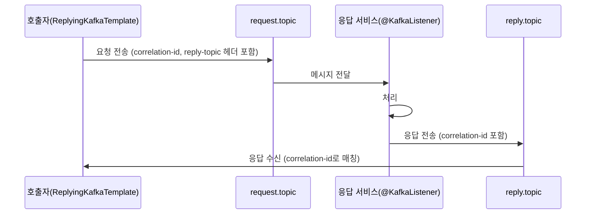
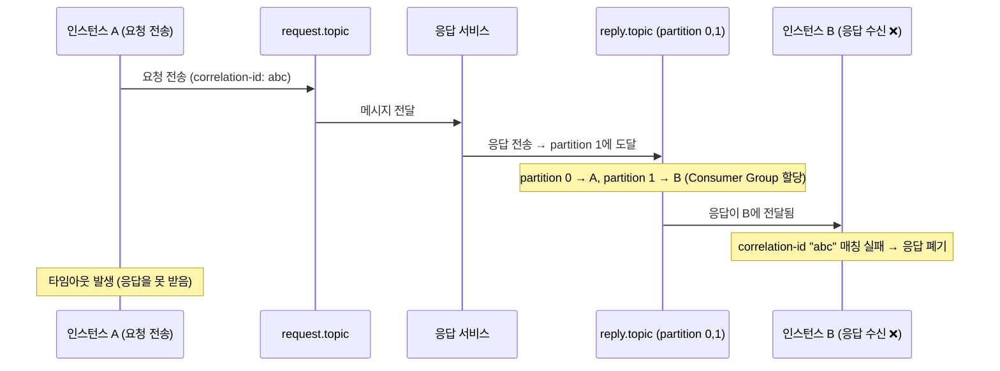
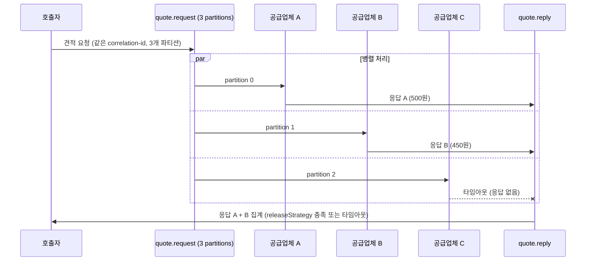

# 12. ReplyingKafkaTemplate (Request-Reply 패턴)

헤더 기반 상관관계 ID로 동기/비동기 Request-Reply와 Scatter-Gather 패턴 구현. 파이프라인 패턴은 [11-topic-pipeline-architecture.md](./11-topic-pipeline-architecture.md) 참조.

---

## 1. ReplyingKafkaTemplate (Request-Reply 패턴)

### 개념

ReplyingKafkaTemplate은 Kafka 위에서 동기식 Request-Reply 패턴을 구현한다. 일반적으로 Kafka는 비동기 메시징에 사용되지만, 때로는 "요청을 보내고 응답을 기다려야 하는" 경우가 있다. 예를 들어, 주문 서비스가 재고 서비스에 "이 상품 재고 있어?"라고 질문하고 응답을 기다려야 할 때 사용한다.

**왜 HTTP가 아닌 Kafka로 Request-Reply를 하는가?**

이미 Kafka 인프라가 있는 환경에서 추가적인 서비스 디스커버리나 로드 밸런서 없이 RPC를 수행할 수 있다. 또한 요청이 토픽에 영구 저장되므로 응답 서비스가 일시적으로 다운되어도 요청이 유실되지 않는다. 다만, 지연 시간이 HTTP보다 길고 처리량이 낮으므로 고빈도 호출에는 적합하지 않다.

이 기능이 궁극적으로 필요한 이유는 **이미 이벤트 기반으로 설계된 시스템에서 "가끔 동기 응답이 필요한" 경계 지점**이 존재하기 때문이다. 구체적으로 세 가지 시나리오에서 HTTP/gRPC 대신 ReplyingKafkaTemplate이 적합하다.

첫째, **기존 파이프라인 중간에 동기 검증이 끼어드는 경우**다. 주문 파이프라인이 이미 Kafka 토픽 체인으로 구성되어 있는데, "결제 전 사기 탐지 서비스에 실시간 판정을 받아야 한다"는 요구가 추가되었다고 하자. 사기 탐지 서비스를 HTTP로 호출하면 네트워크 경로가 이원화되고(Kafka + HTTP), 사기 탐지 서비스의 디스커버리/로드밸런싱/서킷브레이커를 별도로 구축해야 한다. ReplyingKafkaTemplate을 쓰면 기존 Kafka 인프라 위에서 동기 호출을 추가할 수 있다.

둘째, **요청 유실이 허용되지 않는 동기 조회**다. HTTP 호출은 응답 서비스가 다운되면 요청 자체가 유실된다. 재시도 로직을 호출자에 구현할 수 있지만, 호출자까지 재시작되면 재시도할 요청도 사라진다. Kafka에 요청을 넣으면 브로커가 영구 저장하므로, 응답 서비스가 복구된 후에도 밀린 요청을 처리할 수 있다. 금융 거래의 잔액 조회처럼 "반드시 응답을 받아야 하지만, 요청 유실은 절대 안 되는" 경우에 유용하다.

셋째, **호출자와 응답자가 서로의 존재를 몰라야 하는 경우**다. HTTP/gRPC는 호출자가 응답자의 주소(호스트, 포트)를 알아야 한다. 서비스 디스커버리로 추상화할 수 있지만, 근본적으로 네트워크 레벨의 연결이 필요하다. ReplyingKafkaTemplate은 토픽이라는 추상 채널을 통해 통신하므로, 호출자와 응답자가 서로의 물리적 위치를 전혀 모른다. 멀티 리전 배포에서 리전 간 직접 HTTP 호출을 피하고 싶을 때 이 특성이 유리하다.

### 동작 원리



1. 호출자가 ReplyingKafkaTemplate으로 요청을 전송한다. 이때 `KafkaHeaders.CORRELATION_ID`와 `KafkaHeaders.REPLY_TOPIC` 헤더가 자동으로 추가된다.
2. 응답 서비스가 요청을 처리하고, `@SendTo`로 응답을 전송한다. Spring Kafka가 원본 메시지의 `REPLY_TOPIC` 헤더를 읽어 자동으로 해당 토픽에 응답한다.
3. 호출자의 reply container가 응답 토픽을 구독하고 있다가, `CORRELATION_ID`로 요청-응답을 매칭한다.

**헤더 자동 주입의 내부 동작**

개발자가 직접 헤더를 세팅하는 코드를 작성하지 않아도 되는 이유는, `ReplyingKafkaTemplate.sendAndReceive()`가 내부적으로 세 가지 헤더를 ProducerRecord에 주입하기 때문이다.

| 헤더 | 값 | 주입 시점 | 역할 |
|------|-----|----------|------|
| `KafkaHeaders.CORRELATION_ID` | UUID 바이트 배열 | `sendAndReceive()` 호출 시 | 요청과 응답을 1:1로 매칭하는 식별자. 호출자가 내부 `Map<correlationId, Future>`에 등록해두고, 응답이 오면 이 ID로 대기 중인 Future를 찾아서 완료시킨다. |
| `KafkaHeaders.REPLY_TOPIC` | reply 토픽 이름 (바이트) | `sendAndReceive()` 호출 시 | 응답 서비스에게 "응답을 이 토픽으로 보내라"고 알려준다. `@SendTo` 어노테이션에 토픽을 명시하지 않으면, Spring Kafka가 이 헤더값을 읽어 응답 대상 토픽을 결정한다. |
| `KafkaHeaders.REPLY_PARTITION` | 파티션 번호 (선택) | `setSharedReplyTopic(true)` 설정 시 | 다중 인스턴스 환경에서 응답이 요청을 보낸 인스턴스로 정확히 돌아오게 한다. 설정하지 않으면 응답이 아무 파티션에 도달할 수 있다. |

이 과정을 의사 코드로 표현하면 다음과 같다.

```
// ReplyingKafkaTemplate.sendAndReceive() 내부 (의사 코드)
function sendAndReceive(record):
    correlationId = UUID.randomUUID().toBytes()

    // 1) 헤더 자동 주입
    record.headers.add("kafka_correlationId", correlationId)
    record.headers.add("kafka_replyTopic", this.replyContainer.getTopicName())
    if (sharedReplyTopic):
        record.headers.add("kafka_replyPartition", this.replyContainer.getAssignedPartition())

    // 2) Future 등록 — 응답이 오면 이 Future를 완료시킨다
    future = new CompletableFuture()
    pendingReplies.put(correlationId, future)

    // 3) 요청 전송
    kafkaTemplate.send(record)

    return future  // 호출자는 이 future로 응답을 대기
```

응답 서비스 측에서 `@SendTo`가 붙은 리스너가 값을 반환하면, Spring Kafka의 `MessagingMessageListenerAdapter`가 원본 메시지의 헤더를 읽는다. `REPLY_TOPIC` 헤더가 있으면 `@SendTo`에 명시된 토픽 대신 헤더의 토픽으로 응답을 보낸다. `CORRELATION_ID`도 응답 메시지에 자동으로 복사된다. 그래서 `@SendTo`에 토픽을 적지 않아도(`@SendTo` 만 선언) 동작하는 것이다.

```
// MessagingMessageListenerAdapter 내부 (의사 코드)
function handleResult(result, originalMessage):
    replyTopic = originalMessage.headers.get("kafka_replyTopic")   // 헤더에서 읽기
    correlationId = originalMessage.headers.get("kafka_correlationId")

    replyRecord = new ProducerRecord(replyTopic, result)
    replyRecord.headers.add("kafka_correlationId", correlationId)  // 자동 복사

    if originalMessage.headers.has("kafka_replyPartition"):
        replyRecord.partition = originalMessage.headers.get("kafka_replyPartition")

    kafkaTemplate.send(replyRecord)
```

호출자의 reply container가 응답을 수신하면, `CORRELATION_ID`를 추출하여 `pendingReplies` 맵에서 대기 중인 Future를 찾고 `complete(response)`로 완료시킨다. 이것이 `future.get()`이 응답을 반환하는 원리다.

### 구현

**설정**

```java
@Configuration
public class ReplyingKafkaConfig {

    @Value("${app.reply-topic}")
    private String replyTopic;

    /**
     * Reply Container: 응답 토픽을 구독하는 전용 리스너 컨테이너.
     * ReplyingKafkaTemplate이 이 컨테이너를 통해 응답 메시지를 수신하고,
     * correlation-id로 요청과 매칭한다.
     *
     * 일반 @KafkaListener와 달리, 이 컨테이너는 ReplyingKafkaTemplate 내부에서
     * 관리되며 직접 메시지를 처리하지 않는다.
     */
    @Bean
    public ConcurrentMessageListenerContainer<String, OrderResponse> repliesContainer(
            ConsumerFactory<String, OrderResponse> consumerFactory) {

        ContainerProperties containerProperties = new ContainerProperties(replyTopic);
        // reply 전용 Consumer Group — 다른 Consumer와 공유하면 응답이 엉뚱한 곳에 전달됨
        containerProperties.setGroupId("order-reply-group");

        return new ConcurrentMessageListenerContainer<>(consumerFactory, containerProperties);
    }

    /**
     * ReplyingKafkaTemplate: 요청 전송 + 응답 대기를 하나의 메서드(sendAndReceive)로 제공.
     *
     * 내부적으로:
     * 1) ProducerFactory로 요청 메시지를 전송 (이때 correlation-id, reply-topic 헤더 자동 주입)
     * 2) repliesContainer로 응답 토픽을 구독하며 대기
     * 3) correlation-id가 일치하는 응답이 오면 Future를 완료시켜 호출자에게 반환
     */
    @Bean
    public ReplyingKafkaTemplate<String, OrderRequest, OrderResponse> replyingTemplate(
            ProducerFactory<String, OrderRequest> producerFactory,
            ConcurrentMessageListenerContainer<String, OrderResponse> repliesContainer) {

        ReplyingKafkaTemplate<String, OrderRequest, OrderResponse> template =
                new ReplyingKafkaTemplate<>(producerFactory, repliesContainer);
        // 응답이 이 시간 내에 안 오면 TimeoutException 발생
        template.setDefaultReplyTimeout(Duration.ofSeconds(10));
        return template;
    }
}
```

**호출자 (요청 측)**

```java
@Service
@RequiredArgsConstructor
@Slf4j
public class OrderQueryService {

    private final ReplyingKafkaTemplate<String, OrderRequest, OrderResponse> replyingTemplate;

    public OrderResponse queryOrder(String orderId) {
        OrderRequest request = new OrderRequest(orderId);
        // ProducerRecord만 만들면 된다 — correlation-id, reply-topic 헤더는
        // sendAndReceive() 내부에서 자동으로 주입되므로 직접 설정할 필요 없다
        ProducerRecord<String, OrderRequest> record =
                new ProducerRecord<>("order.request", orderId, request);

        try {
            // sendAndReceive()가 하는 일:
            // 1) record에 CORRELATION_ID + REPLY_TOPIC 헤더 자동 추가
            // 2) 내부 pendingReplies 맵에 {correlationId → Future} 등록
            // 3) ProducerFactory로 요청 전송
            // 4) RequestReplyFuture 반환 (전송 결과 + 응답 결과 분리)
            RequestReplyFuture<String, OrderRequest, OrderResponse> future =
                    replyingTemplate.sendAndReceive(record);

            // getSendFuture(): 브로커에 메시지가 전달되었는지 확인 (전송 실패 시 여기서 예외)
            // 응답 대기와 별개 — 전송 자체가 실패하면 응답을 기다릴 필요가 없다
            future.getSendFuture().get(5, TimeUnit.SECONDS);
            log.info("Request sent for order: {}", orderId);

            // future.get(): reply container가 correlation-id 일치하는 응답을 수신할 때까지 블로킹
            // 타임아웃 내에 응답이 안 오면 TimeoutException 발생
            ConsumerRecord<String, OrderResponse> response =
                    future.get(10, TimeUnit.SECONDS);
            log.info("Response received for order: {}", orderId);

            // ConsumerRecord에서 value()로 응답 객체 추출
            return response.value();

        } catch (TimeoutException e) {
            // 응답 서비스가 다운되었거나, 처리가 지연되는 경우
            log.error("Reply timeout for order: {}", orderId);
            throw new OrderQueryTimeoutException(orderId, e);
        } catch (InterruptedException e) {
            // 대기 중 스레드 인터럽트 — 스레드 인터럽트 상태 복원 필수
            Thread.currentThread().interrupt();
            throw new OrderQueryException(orderId, e);
        } catch (ExecutionException e) {
            // 전송 또는 수신 과정에서 발생한 예외를 unwrap
            throw new OrderQueryException(orderId, e.getCause());
        }
    }
}
```

**응답자 (서버 측)**

```java
@Component
@RequiredArgsConstructor
@Slf4j
public class OrderRequestHandler {

    private final OrderRepository orderRepository;

    // @SendTo에 토픽을 명시하지 않으면, Spring Kafka가 수신 메시지의
    // KafkaHeaders.REPLY_TOPIC 헤더를 읽어 응답 대상 토픽을 자동 결정한다.
    // 즉, 호출자가 "order.reply"로 보내달라고 헤더에 적어두면 여기서는 알 필요 없다.
    //
    // 반환값은 MessagingMessageListenerAdapter가 받아서:
    // 1) REPLY_TOPIC 헤더의 토픽으로 응답 전송
    // 2) CORRELATION_ID를 응답 메시지에 자동 복사 (호출자가 매칭할 수 있도록)
    // 3) REPLY_PARTITION이 있으면 해당 파티션으로 전송
    @KafkaListener(topics = "order.request", groupId = "order-request-handler")
    @SendTo
    public OrderResponse handle(OrderRequest request) {
        log.info("Handling order request: {}", request.getOrderId());

        return orderRepository.findById(request.getOrderId())
                .map(order -> OrderResponse.builder()
                        .orderId(order.getId())
                        .status(order.getStatus())
                        .totalAmount(order.getTotalAmount())
                        .build())
                .orElse(OrderResponse.notFound(request.getOrderId()));
    }
}
```

### 비동기 변형

앞의 `queryOrder()` 예시는 `future.get()`으로 스레드를 블로킹한다. 트래픽이 적은 내부 조회라면 괜찮지만, 웹 요청 스레드에서 블로킹하면 톰캣 스레드 풀이 빠르게 고갈된다. Spring Kafka 3.x부터 `sendAndReceive()`가 `CompletableFuture`를 반환하므로, 비동기 체인으로 전환할 수 있다.

**CompletableFuture 패턴**

```java
public CompletableFuture<OrderResponse> queryOrderAsync(String orderId) {
    ProducerRecord<String, OrderRequest> record =
            new ProducerRecord<>("order.request", orderId, new OrderRequest(orderId));

    RequestReplyFuture<String, OrderRequest, OrderResponse> future =
            replyingTemplate.sendAndReceive(record);

    return future.thenApply(ConsumerRecord::value)
            .orTimeout(10, TimeUnit.SECONDS)
            .exceptionally(ex -> {
                log.error("Reply failed for order: {}", orderId, ex);
                throw new OrderQueryException(orderId, ex);
            });
}
```

**WebFlux 통합**

리액티브 스택에서는 `Mono.fromFuture()`로 감싸면 된다. 블로킹 없이 Netty 이벤트 루프에서 응답을 처리할 수 있다.

```java
@GetMapping("/orders/{id}")
public Mono<OrderResponse> getOrder(@PathVariable String id) {
    return Mono.fromFuture(() -> queryOrderAsync(id));
}
```

**다중 요청 동시 전송**

여러 서비스에 독립적인 요청을 보내고 응답을 모아야 할 때, 각각을 `CompletableFuture`로 보내고 `allOf()`로 합류한다.

```java
public OrderSummary queryOrderSummary(String orderId) {
    CompletableFuture<OrderResponse> orderFuture = queryOrderAsync(orderId);
    CompletableFuture<PaymentResponse> paymentFuture = queryPaymentAsync(orderId);
    CompletableFuture<ShippingResponse> shippingFuture = queryShippingAsync(orderId);

    CompletableFuture.allOf(orderFuture, paymentFuture, shippingFuture)
            .orTimeout(15, TimeUnit.SECONDS)
            .join();

    return new OrderSummary(
            orderFuture.join(),
            paymentFuture.join(),
            shippingFuture.join()
    );
}
```

이 패턴은 3개의 요청을 병렬로 보내므로, 순차 호출 대비 지연 시간이 `max(응답1, 응답2, 응답3)`으로 줄어든다. 다만 `join()`은 블로킹이므로, 완전한 비동기가 필요하면 `thenCombine()` 체인이나 앞서 본 WebFlux 방식을 사용해야 한다.

### @SendTo vs ReplyingKafkaTemplate

| 기준 | @SendTo | ReplyingKafkaTemplate |
|------|---------|----------------------|
| 통신 방향 | Fire-and-forward (단방향) | Request-Reply (양방향) |
| 호출자 블로킹 | 없음 | 있음 (응답 대기) |
| 용도 | 파이프라인 연결 (다음 단계 전달) | 동기식 조회/검증 |
| correlation | 불필요 (혹은 수동 전파) | 자동 (KafkaHeaders.CORRELATION_ID) |
| 타임아웃 처리 | 해당 없음 | 내장 (setDefaultReplyTimeout) |
| 처리량 | 높음 (비동기) | 낮음 (동기 대기) |
| reply 토픽 관리 | 불필요 | 필요 (전용 reply 토픽) |

### 다중 인스턴스 Reply 라우팅

호출자 인스턴스가 하나일 때는 문제가 없다. 그런데 인스턴스가 여러 개로 스케일 아웃되면, 응답이 요청을 보낸 인스턴스가 아닌 다른 인스턴스에 전달되는 문제가 발생한다. 같은 Consumer Group의 파티션 할당 메커니즘 때문이다.



인스턴스 A가 보낸 요청의 응답이 파티션 1에 도달하면, 해당 파티션을 할당받은 인스턴스 B가 수신한다. B는 correlation-id "abc"에 대응하는 대기 Future가 없으므로 응답을 폐기하고, A는 타임아웃에 빠진다.

**해결법 1: REPLY_PARTITION 헤더**

요청을 보낼 때 "이 응답은 파티션 N으로 보내달라"고 지정하는 방식이다. 각 인스턴스가 자신에게 할당된 파티션 번호를 알고 있어야 한다.

```java
@Bean
public ReplyingKafkaTemplate<String, OrderRequest, OrderResponse> replyingTemplate(
        ProducerFactory<String, OrderRequest> producerFactory,
        ConcurrentMessageListenerContainer<String, OrderResponse> repliesContainer) {

    ReplyingKafkaTemplate<String, OrderRequest, OrderResponse> template =
            new ReplyingKafkaTemplate<>(producerFactory, repliesContainer);
    template.setDefaultReplyTimeout(Duration.ofSeconds(10));

    // 핵심: 자동으로 REPLY_PARTITION 헤더를 설정
    // reply container에 할당된 파티션을 감지하여 응답이 정확한 인스턴스로 돌아오게 한다
    template.setSharedReplyTopic(true);
    return template;
}
```

`setSharedReplyTopic(true)`를 호출하면 Spring Kafka가 reply container에 할당된 파티션 정보를 자동으로 `REPLY_PARTITION` 헤더에 설정한다. 이 방식이 가장 간단하고 권장되는 방법이다.

수동으로 파티션을 고정할 수도 있다. reply 토픽의 파티션 수를 인스턴스 수 이상으로 만들고, 각 인스턴스에 고정 파티션을 할당한다.

```java
@Bean
public ConcurrentMessageListenerContainer<String, OrderResponse> repliesContainer(
        ConsumerFactory<String, OrderResponse> consumerFactory) {

    // 특정 파티션만 구독 (인스턴스별로 다른 파티션)
    TopicPartitionOffset partition = new TopicPartitionOffset(
            replyTopic,
            Integer.parseInt(instanceIndex)  // 환경변수 등으로 인스턴스 인덱스 주입
    );
    ContainerProperties containerProperties = new ContainerProperties(partition);
    return new ConcurrentMessageListenerContainer<>(consumerFactory, containerProperties);
}
```

**해결법 2: 인스턴스별 고유 reply 토픽**

각 인스턴스가 자기만의 reply 토픽을 사용하는 방식이다. 파티션 관리가 불필요하지만, 인스턴스 수만큼 토픽이 생성된다.

```java
@Bean
public ConcurrentMessageListenerContainer<String, OrderResponse> repliesContainer(
        ConsumerFactory<String, OrderResponse> consumerFactory,
        @Value("${spring.application.instance-id:#{T(java.util.UUID).randomUUID().toString()}}")
        String instanceId) {

    // 인스턴스별 고유 reply 토픽
    String uniqueReplyTopic = "order.reply." + instanceId;
    ContainerProperties containerProperties = new ContainerProperties(uniqueReplyTopic);
    containerProperties.setGroupId("reply-" + instanceId);

    return new ConcurrentMessageListenerContainer<>(consumerFactory, containerProperties);
}
```

**어떤 방법을 선택할까?**

| 기준 | REPLY_PARTITION | 고유 reply 토픽 |
|------|----------------|----------------|
| 토픽 수 | 1개 (공유) | 인스턴스 수만큼 |
| 설정 난이도 | 낮음 (`setSharedReplyTopic(true)`) | 중간 (토픽 자동 생성 필요) |
| 인스턴스 변동 | 파티션 재할당 시 주의 | 자유로움 |
| 토픽 정리 | 불필요 | 인스턴스 종료 시 토픽 삭제 필요 |
| 권장 환경 | 인스턴스 수 고정 또는 변동 적음 | K8s처럼 인스턴스가 자주 생성/삭제 |

대부분의 경우 `setSharedReplyTopic(true)`로 충분하다. 인스턴스가 빈번하게 생성/삭제되는 환경에서만 고유 reply 토픽을 고려한다.

### 에러 전파

응답 서비스에서 예외가 발생하면 어떻게 될까? Spring Kafka의 `@SendTo`는 정상 반환값만 reply 토픽에 보낸다. 예외가 발생하면 기본적으로 응답 자체가 전송되지 않고, 호출자는 타임아웃을 맞는다.

이것은 "서버가 죽었는지, 느린 건지, 비즈니스 에러인지" 구분할 수 없어서 실무에서 문제가 된다. Spring Kafka는 이를 해결하기 위해 에러 정보를 reply 메시지의 헤더에 직렬화하여 전송하는 메커니즘을 제공한다.

**서버 측: 예외를 응답으로 전환**

```java
@Component
@RequiredArgsConstructor
@Slf4j
public class OrderRequestHandler {

    private final OrderRepository orderRepository;

    @KafkaListener(topics = "order.request", groupId = "order-request-handler")
    @SendTo
    public OrderResponse handle(OrderRequest request) {
        log.info("Handling order request: {}", request.getOrderId());

        Order order = orderRepository.findById(request.getOrderId())
                .orElseThrow(() -> new OrderNotFoundException(request.getOrderId()));

        // 예외가 발생하면 Spring Kafka의 에러 핸들러가
        // KafkaHeaders.REPLY_TOPIC으로 에러 헤더를 포함한 응답을 전송한다
        return OrderResponse.from(order);
    }
}
```

기본 동작에서는 예외 시 응답이 전송되지 않는다. 에러를 reply에 포함시키려면 `ReplyingKafkaTemplate`의 에러 핸들러를 설정해야 한다.

```java
@Bean
public ConcurrentKafkaListenerContainerFactory<String, OrderRequest> kafkaListenerContainerFactory(
        ConsumerFactory<String, OrderRequest> consumerFactory,
        KafkaTemplate<String, OrderResponse> replyTemplate) {

    ConcurrentKafkaListenerContainerFactory<String, OrderRequest> factory =
            new ConcurrentKafkaListenerContainerFactory<>();
    factory.setConsumerFactory(consumerFactory);

    // 리스너 예외 시 에러 정보를 reply 토픽에 전송
    factory.setReplyTemplate(replyTemplate);
    factory.setReplyHeadersConfigurer((rawHeaders, isExceptionReply) -> {
        // 에러 reply에도 커스텀 헤더를 포함시킬 수 있다
        if (isExceptionReply) {
            rawHeaders.put("error-source", "order-request-handler");
        }
        return true;  // true = 에러 헤더 포함
    });

    return factory;
}
```

**호출자 측: 에러 감지 및 처리**

```java
public OrderResponse queryOrder(String orderId) {
    ProducerRecord<String, OrderRequest> record =
            new ProducerRecord<>("order.request", orderId, new OrderRequest(orderId));

    try {
        RequestReplyFuture<String, OrderRequest, OrderResponse> future =
                replyingTemplate.sendAndReceive(record);

        ConsumerRecord<String, OrderResponse> response =
                future.get(10, TimeUnit.SECONDS);

        // 에러 헤더 확인
        Header exceptionHeader = response.headers()
                .lastHeader(KafkaHeaders.EXCEPTION_FQCN);

        if (exceptionHeader != null) {
            String exceptionClass = new String(exceptionHeader.value());
            Header messageHeader = response.headers()
                    .lastHeader(KafkaHeaders.EXCEPTION_MESSAGE);
            String message = messageHeader != null
                    ? new String(messageHeader.value()) : "Unknown error";

            log.error("Server error [{}]: {}", exceptionClass, message);

            // 비즈니스 예외 유형에 따라 분기 처리
            if (exceptionClass.contains("OrderNotFoundException")) {
                throw new OrderNotFoundException(orderId);
            }
            throw new RemoteServiceException(exceptionClass, message);
        }

        return response.value();

    } catch (TimeoutException e) {
        throw new OrderQueryTimeoutException(orderId, e);
    } catch (InterruptedException e) {
        Thread.currentThread().interrupt();
        throw new OrderQueryException(orderId, e);
    } catch (ExecutionException e) {
        throw new OrderQueryException(orderId, e.getCause());
    }
}
```

에러 헤더에는 `EXCEPTION_FQCN`(예외 클래스명), `EXCEPTION_MESSAGE`(메시지), `EXCEPTION_STACKTRACE`(스택 트레이스)가 포함된다. 스택 트레이스는 크기가 클 수 있으므로, 프로덕션에서는 `EXCEPTION_FQCN`과 `EXCEPTION_MESSAGE`만으로 분기 처리하는 것이 일반적이다.

### AggregatingReplyingKafkaTemplate

기본 ReplyingKafkaTemplate은 1:1 요청-응답이다. 하나의 요청을 여러 서비스에 보내고 응답을 모아야 하는 경우는 어떻게 할까? 예를 들어, 가격 비교 서비스가 3개 공급업체에 동시에 견적을 요청하고, 모든 응답(또는 타임아웃 내 도착한 응답)을 집계하는 시나리오다. 이것이 Scatter-Gather 패턴이며, `AggregatingReplyingKafkaTemplate`이 이를 지원한다.



**구현**

```java
@Configuration
public class AggregatingReplyConfig {

    @Bean
    public AggregatingReplyingKafkaTemplate<String, QuoteRequest, QuoteResponse>
            aggregatingTemplate(
                    ProducerFactory<String, QuoteRequest> producerFactory,
                    ConcurrentMessageListenerContainer<String, Collection<ConsumerRecord<String, QuoteResponse>>> repliesContainer) {

        // releaseStrategy: 응답을 언제 집계 완료로 판단할지 결정
        // 3개 공급업체에서 응답이 와야 하므로 size == 3이면 즉시 릴리스
        AggregatingReplyingKafkaTemplate<String, QuoteRequest, QuoteResponse> template =
                new AggregatingReplyingKafkaTemplate<>(producerFactory, repliesContainer,
                        (consumerRecords, timedOut) -> {
                            if (timedOut) {
                                return true;  // 타임아웃 시 도착한 응답만으로 릴리스
                            }
                            return consumerRecords.size() >= 3;  // 3개 모이면 릴리스
                        });

        template.setDefaultReplyTimeout(Duration.ofSeconds(5));
        template.setReturnPartialOnTimeout(true);  // 타임아웃 시 부분 결과 반환
        return template;
    }
}
```

**호출자**

```java
@Service
@RequiredArgsConstructor
@Slf4j
public class QuoteAggregationService {

    private final AggregatingReplyingKafkaTemplate<String, QuoteRequest, QuoteResponse>
            aggregatingTemplate;

    public QuoteSummary getBestQuote(String productId) {
        QuoteRequest request = new QuoteRequest(productId);

        // 같은 요청을 3개 파티션에 전송 (각 공급업체가 다른 파티션 구독)
        List<ProducerRecord<String, QuoteRequest>> records = List.of(
                new ProducerRecord<>("quote.request", 0, productId, request),
                new ProducerRecord<>("quote.request", 1, productId, request),
                new ProducerRecord<>("quote.request", 2, productId, request)
        );

        try {
            RequestReplyFuture<String, QuoteRequest, Collection<ConsumerRecord<String, QuoteResponse>>>
                    future = aggregatingTemplate.sendAndReceive(records);

            Collection<ConsumerRecord<String, QuoteResponse>> responses =
                    future.get(10, TimeUnit.SECONDS);

            log.info("Received {} quotes out of 3", responses.size());

            return responses.stream()
                    .map(ConsumerRecord::value)
                    .min(Comparator.comparing(QuoteResponse::getPrice))
                    .map(best -> new QuoteSummary(best, responses.size()))
                    .orElseThrow(() -> new NoQuotesReceivedException(productId));

        } catch (TimeoutException e) {
            throw new QuoteTimeoutException(productId, e);
        } catch (InterruptedException e) {
            Thread.currentThread().interrupt();
            throw new QuoteException(productId, e);
        } catch (ExecutionException e) {
            throw new QuoteException(productId, e.getCause());
        }
    }
}
```

`releaseStrategy`의 두 번째 파라미터 `timedOut`이 핵심이다. `false`일 때는 아직 응답이 도착 중이므로 원하는 수만큼 기다릴 수 있고, `true`로 바뀌면 타임아웃이 발생한 것이므로 현재까지 도착한 응답으로 릴리스해야 한다. `setReturnPartialOnTimeout(true)`와 함께 사용하면 3개 중 2개만 도착해도 부분 결과를 반환할 수 있다.

사용 시나리오는 다음과 같다.

- **가격 비교**: 여러 공급업체에 견적 요청 후 최저가 선택
- **다중 소스 조회**: 여러 데이터 소스에서 정보 수집 후 병합
- **투표/합의**: 여러 노드에 검증 요청 후 과반수 응답으로 결정

### 사용 시 주의사항

**고빈도 호출 금지**

초당 수천 건의 RPC가 필요하면 HTTP나 gRPC를 사용해야 한다. Kafka를 거치는 Request-Reply는 지연 시간이 수십ms~수백ms이므로 실시간 API에는 부적합하다. ReplyingKafkaTemplate은 "이미 Kafka 인프라가 있고, 가끔 동기 조회가 필요한" 경우에 적합하다.

**reply 토픽 retention 설정**

reply 토픽에는 일회성 응답만 저장되므로, retention을 짧게 설정해야 한다. 기본 7일은 과도하다. 응답이 소비된 후에는 의미 없는 데이터가 디스크를 점유할 뿐이다.

```properties
# reply 토픽 생성 시 retention 설정 (1시간이면 충분)
kafka-topics --create --topic order.reply \
    --partitions 3 \
    --config retention.ms=3600000 \
    --config cleanup.policy=delete
```

타임아웃이 10초라면, retention은 최소 타임아웃의 수배(예: 1시간) 정도면 충분하다. 디버깅을 위해 너무 짧게 설정하면 문제 재현이 어려울 수 있으므로 1시간이 실무적 균형점이다.

**타임아웃 설정 전략**

타임아웃은 응답 서비스의 SLA 기반으로 설정한다. 서비스 P99 지연이 2초라면, 타임아웃은 그보다 충분히 크게(예: 10초) 잡아야 간헐적 지연에 대응할 수 있다. 너무 짧으면 정상 응답도 타임아웃으로 처리되고, 너무 길면 장애 시 호출자 스레드가 오래 점유된다.

```java
// 전역 기본 타임아웃
template.setDefaultReplyTimeout(Duration.ofSeconds(10));

// 요청별 타임아웃 (급한 요청은 짧게)
ProducerRecord<String, OrderRequest> record = new ProducerRecord<>(...);
RequestReplyFuture<String, OrderRequest, OrderResponse> future =
        replyingTemplate.sendAndReceive(record, Duration.ofSeconds(3));
```

**Consumer Group 설정 주의**

reply 토픽의 Consumer Group에 ReplyingKafkaTemplate 외의 Consumer가 참여하면 안 된다. 다른 Consumer가 응답 메시지를 가져가면 호출자가 응답을 받지 못한다. reply 토픽 전용 Consumer Group을 사용하고, 모니터링 목적이라면 별도 Group으로 구독해야 한다.

**모니터링: reply 지연 시간 메트릭**

ReplyingKafkaTemplate이 자체적으로 reply 지연 메트릭을 제공하지는 않는다. Micrometer로 직접 측정할 수 있다.

```java
@Service
@RequiredArgsConstructor
public class MonitoredOrderQueryService {

    private final ReplyingKafkaTemplate<String, OrderRequest, OrderResponse> replyingTemplate;
    private final MeterRegistry meterRegistry;

    public OrderResponse queryOrder(String orderId) {
        Timer.Sample sample = Timer.start(meterRegistry);

        try {
            ProducerRecord<String, OrderRequest> record =
                    new ProducerRecord<>("order.request", orderId, new OrderRequest(orderId));
            ConsumerRecord<String, OrderResponse> response =
                    replyingTemplate.sendAndReceive(record).get(10, TimeUnit.SECONDS);

            sample.stop(meterRegistry.timer("kafka.reply.latency",
                    "topic", "order.request", "status", "success"));
            return response.value();

        } catch (TimeoutException e) {
            sample.stop(meterRegistry.timer("kafka.reply.latency",
                    "topic", "order.request", "status", "timeout"));
            meterRegistry.counter("kafka.reply.timeout", "topic", "order.request").increment();
            throw new OrderQueryTimeoutException(orderId, e);
        } catch (Exception e) {
            sample.stop(meterRegistry.timer("kafka.reply.latency",
                    "topic", "order.request", "status", "error"));
            throw new OrderQueryException(orderId, e);
        }
    }
}
```

`kafka.reply.latency` 타이머로 P50/P95/P99 지연을 추적하고, `kafka.reply.timeout` 카운터로 타임아웃 빈도를 모니터링한다. 타임아웃 비율이 급증하면 응답 서비스에 문제가 있다는 신호다.

**트랜잭션 격리수준과 교착 상태**

ReplyingKafkaTemplate과 `read_committed` 격리수준을 함께 사용하면 교착 상태가 발생할 수 있다. 이 조합이 왜 위험한지 이해하려면 두 메커니즘의 충돌 지점을 알아야 한다.

ReplyingKafkaTemplate의 `sendAndReceive()`는 내부적으로 다음 순서로 동작한다: (1) 요청 메시지를 트랜잭션 내에서 전송 → (2) 응답을 동기적으로 대기 → (3) 응답 수신 후 트랜잭션 커밋. 문제는 2단계에서 발생한다. 응답을 기다리는 동안 트랜잭션이 열려 있으므로 요청 메시지가 아직 커밋되지 않은 상태다.

이때 응답 서비스의 Consumer가 `isolation.level=read_committed`로 설정되어 있으면, 커밋되지 않은 요청 메시지를 읽을 수 없다. 호출자는 응답을 기다리고, 응답 서비스는 요청을 읽을 수 없으므로 영원히 교착 상태에 빠진다.

```
호출자: sendAndReceive() → 요청 전송(미커밋) → 응답 대기...
                                    ↑                          ↓
                              트랜잭션 열림              타임아웃까지 블로킹
                                    ↑                          ↓
응답 서비스: read_committed → 미커밋 메시지 읽기 불가 → 처리 불가 → 응답 못 보냄
```

**해결법: ContainerFactory 분리**

Request-Reply 요청을 수신하는 리스너와 일반 비동기 메시지를 수신하는 리스너의 ContainerFactory를 분리한다.

```java
@Configuration
public class KafkaConsumerConfig {

    // 1) Request-Reply 수신용: read_committed 미적용
    //    ReplyingKafkaTemplate 요청은 트랜잭션 커밋 전에 읽어야 하므로
    @Bean
    public ConcurrentKafkaListenerContainerFactory<String, Object> replyListenerFactory(
            ConsumerFactory<String, Object> consumerFactory) {

        ConcurrentKafkaListenerContainerFactory<String, Object> factory =
                new ConcurrentKafkaListenerContainerFactory<>();
        factory.setConsumerFactory(consumerFactory);
        // isolation.level = read_uncommitted (기본값) — 의도적으로 설정하지 않음
        return factory;
    }

    // 2) 일반 비동기 메시지용: read_committed 적용
    //    트랜잭셔널 프로듀서의 메시지를 정확히 한번 처리하기 위해
    @Bean
    public ConcurrentKafkaListenerContainerFactory<String, Object> transactionalListenerFactory(
            DefaultKafkaConsumerFactory<String, Object> consumerFactory) {

        Map<String, Object> props = new HashMap<>(consumerFactory.getConfigurationProperties());
        props.put(ConsumerConfig.ISOLATION_LEVEL_CONFIG, "read_committed");

        ConcurrentKafkaListenerContainerFactory<String, Object> factory =
                new ConcurrentKafkaListenerContainerFactory<>();
        factory.setConsumerFactory(new DefaultKafkaConsumerFactory<>(props));
        return factory;
    }
}
```

```java
// Request-Reply 수신: read_uncommitted로 동작
@KafkaListener(topics = "order.request", containerFactory = "replyListenerFactory")
@SendTo
public OrderResponse handle(OrderRequest request) { ... }

// 일반 비동기 수신: read_committed로 동작
@KafkaListener(topics = "order.events", containerFactory = "transactionalListenerFactory")
public void handleEvent(OrderEvent event) { ... }
```

이 문제의 근본 원인은 "비동기 메시징 시스템 위에 동기식 패턴을 얹은 것"이다. Request-Reply 토픽에는 트랜잭셔널 프로듀서를 사용하지 않거나, 사용하더라도 응답 서비스 측은 `read_uncommitted`로 읽어야 교착을 피할 수 있다. 트랜잭션이 반드시 필요한 시나리오라면, ReplyingKafkaTemplate 대신 HTTP/gRPC로 동기 통신하고 Kafka는 비동기 이벤트 전달에만 사용하는 것이 더 적합할 수 있다.
