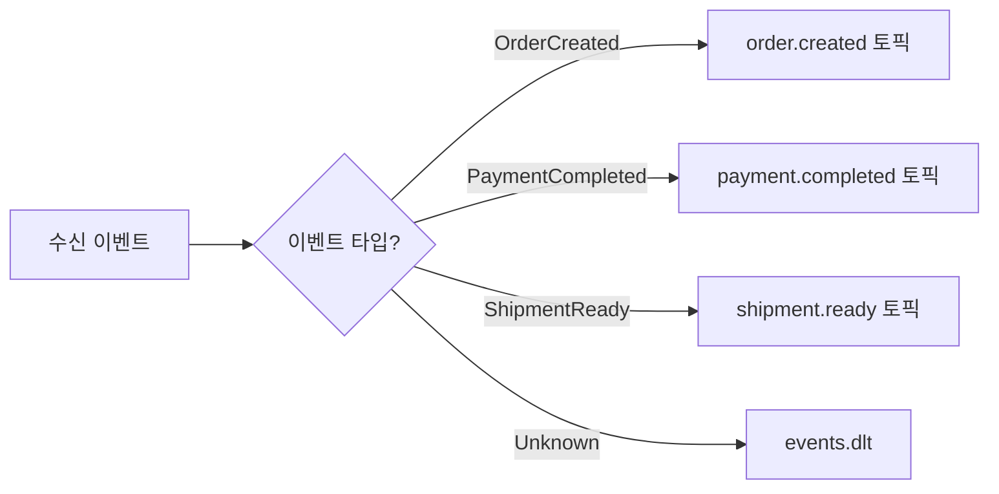
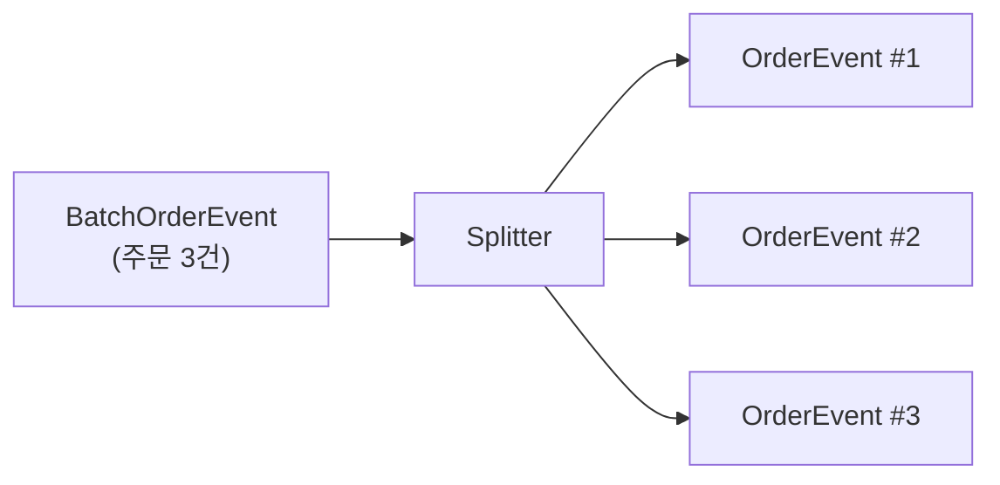
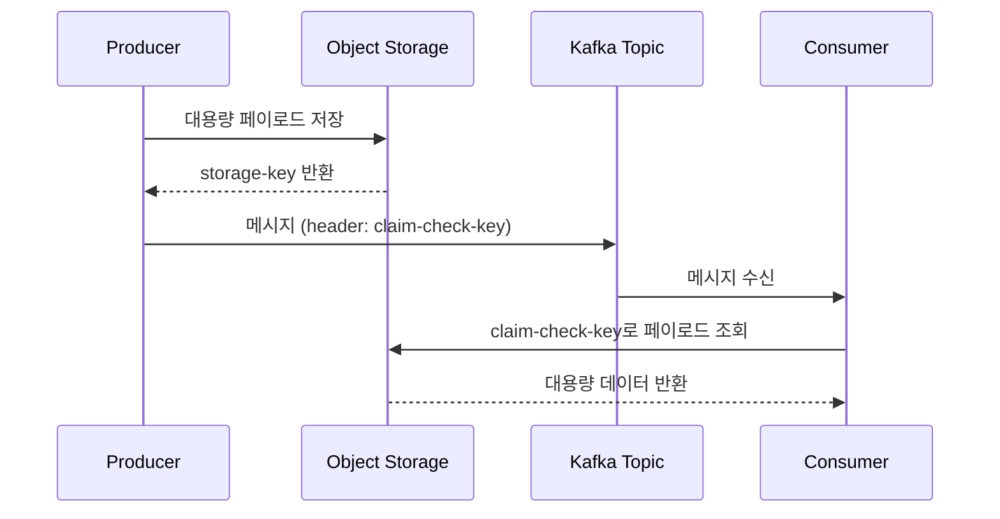

# 13. 메시징 패턴 Spring Boot 구현 (EIP Patterns)

EIP 이론([16-messaging-patterns.md](../01-event-driven/learning/16-messaging-patterns.md))의 Spring Kafka + Kafka Streams 구현. 파이프라인 패턴은 [11-topic-pipeline-architecture.md](./11-topic-pipeline-architecture.md) 참조.

---

## 1. Spring Boot에서 EIP 패턴이 필요한 이유

마이크로서비스 간 이벤트를 교환할 때 세 가지 문제가 불가피하게 발생한다.

**첫째, 이벤트 형식이 서비스마다 다르다.** 주문 서비스는 OrderCreatedEvent를 발행하지만, 결제 서비스는 PaymentRequestEvent를 기대한다. 누군가 변환해야 한다.

**둘째, 하나의 이벤트가 여러 서비스로 가야 한다.** 주문 생성 이벤트는 재고 서비스, 결제 서비스, 알림 서비스 모두에 전달되어야 한다. 누가 어디로 보낼지 결정해야 한다.

**셋째, 대용량 페이로드가 Kafka 메시지 크기 제한을 초과한다.** Kafka 기본 메시지 크기는 1MB다. 이미지나 대용량 JSON이 포함된 이벤트는 이 제한에 걸린다.

EIP 패턴은 이 세 문제에 대한 검증된 해결책이다. 이 문서는 Spring Kafka와 Kafka Streams로 이 패턴들을 구현하는 방법을 보인다.

### Spring Integration vs Spring Kafka 선택 기준

Spring Integration은 EIP 패턴을 추상화 수준 높게 제공하지만, Kafka 고유 기능(파티션, 정확히-한번 처리, Streams DSL)에 접근하기 어렵다. Spring Kafka는 Kafka 네이티브 API에 가깝게 동작하므로 성능과 제어권이 높다. 이 문서는 **Spring Kafka + Kafka Streams** 중심으로 구현한다. Spring Integration은 레거시 시스템 연동이나 HTTP/파일 채널이 필요할 때 별도로 고려한다.

### build.gradle 기본 설정

이 문서의 모든 예시에서 공통으로 사용하는 의존성이다.

```groovy
plugins {
    id 'org.springframework.boot' version '3.3.0'
    id 'io.spring.dependency-management' version '1.1.5'
    id 'com.github.davidmc24.gradle.plugin.avro' version '1.9.1'
    id 'java'
}

java {
    sourceCompatibility = JavaVersion.VERSION_17
}

dependencies {
    implementation 'org.springframework.boot:spring-boot-starter'
    implementation 'org.springframework.kafka:spring-kafka'
    implementation 'org.apache.kafka:kafka-streams'

    // Avro + Schema Registry
    implementation 'io.confluent:kafka-avro-serializer:7.6.0'
    implementation 'io.confluent:kafka-schema-registry-client:7.6.0'
    implementation 'io.confluent:kafka-streams-avro-serde:7.6.0'
    implementation 'org.apache.avro:avro:1.11.3'

    // AWS S3 (Claim Check 패턴)
    implementation platform('software.amazon.awssdk:bom:2.25.0')
    implementation 'software.amazon.awssdk:s3'

    testImplementation 'org.springframework.boot:spring-boot-starter-test'
    testImplementation 'org.springframework.kafka:spring-kafka-test'
    testImplementation 'org.testcontainers:kafka:1.19.7'
    testImplementation 'org.testcontainers:junit-jupiter:1.19.7'
}

repositories {
    mavenCentral()
    maven { url 'https://packages.confluent.io/maven/' }
}

avro {
    createSetters = false
    fieldVisibility = 'PRIVATE'
}

generateAvroJava {
    source('src/main/avro')
}
```

---

## 2. Event Envelope 구현

Event Envelope 패턴은 비즈니스 페이로드(body)와 메타데이터(envelope)를 분리한다. 이론에서 설명했듯이, Consumer는 페이로드 내용을 파싱하지 않고도 이벤트 타입, 발신자, 버전을 알 수 있어야 한다. Kafka에서는 **Record Headers**가 이 역할을 한다.

### 왜 Headers인가?

Kafka 메시지는 key, value, headers 세 부분으로 구성된다. Headers에 메타데이터를 넣으면 Consumer가 value(Avro 직렬화된 페이로드)를 역직렬화하지 않고도 라우팅 결정을 내릴 수 있다. 이것이 성능과 관심사 분리 두 가지를 동시에 달성하는 방법이다.

CloudEvents 표준 헤더 매핑은 다음과 같다.

```
ce-specversion  : "1.0"
ce-type         : "com.example.order.created"
ce-source       : "/orders-service"
ce-id           : UUID
ce-time         : ISO-8601 타임스탬프
ce-dataschema   : Schema Registry URL
```

### ProducerInterceptor로 헤더 자동 주입

모든 Producer에 수동으로 헤더를 추가하는 것은 실수를 유발한다. `ProducerInterceptor`를 사용하면 모든 메시지에 자동으로 표준 헤더가 추가된다.

```java
// CloudEventsProducerInterceptor.java
package com.example.kafka.interceptor;

import org.apache.kafka.clients.producer.ProducerInterceptor;
import org.apache.kafka.clients.producer.ProducerRecord;
import org.apache.kafka.clients.producer.RecordMetadata;
import org.apache.kafka.common.header.Headers;

import java.nio.charset.StandardCharsets;
import java.time.Instant;
import java.util.Map;
import java.util.UUID;

public class CloudEventsProducerInterceptor implements ProducerInterceptor<String, Object> {

    private String serviceSource;

    @Override
    public void configure(Map<String, ?> configs) {
        // application.properties의 spring.application.name을 읽어 source 설정
        this.serviceSource = (String) configs.getOrDefault(
            "ce.source", "/unknown-service"
        );
    }

    @Override
    public ProducerRecord<String, Object> onSend(ProducerRecord<String, Object> record) {
        Headers headers = record.headers();

        // 이미 ce-id가 있으면 중복 추가하지 않음 (명시적으로 설정한 경우 존중)
        if (headers.lastHeader("ce-id") == null) {
            headers.add("ce-id", UUID.randomUUID().toString().getBytes(StandardCharsets.UTF_8));
        }
        if (headers.lastHeader("ce-specversion") == null) {
            headers.add("ce-specversion", "1.0".getBytes(StandardCharsets.UTF_8));
        }
        if (headers.lastHeader("ce-source") == null) {
            headers.add("ce-source", serviceSource.getBytes(StandardCharsets.UTF_8));
        }
        if (headers.lastHeader("ce-time") == null) {
            headers.add("ce-time", Instant.now().toString().getBytes(StandardCharsets.UTF_8));
        }
        // ce-type은 발신자가 명시적으로 설정해야 함 (자동 주입 불가)

        return record;
    }

    @Override
    public void onAcknowledgement(RecordMetadata metadata, Exception exception) {}

    @Override
    public void close() {}
}
```

인터셉터는 `@Component`만으로는 등록되지 않는다. `ProducerFactory` 설정에서 명시적으로 등록해야 한다.

```java
// KafkaProducerConfig.java
@Configuration
public class KafkaProducerConfig {

    @Value("${spring.application.name}")
    private String appName;

    @Bean
    public ProducerFactory<String, Object> producerFactory(KafkaProperties kafkaProperties) {
        Map<String, Object> props = new HashMap<>(kafkaProperties.buildProducerProperties());
        props.put(
            ProducerConfig.INTERCEPTOR_CLASSES_CONFIG,
            CloudEventsProducerInterceptor.class.getName()
        );
        // Interceptor에 ce.source 전달
        props.put("ce.source", "/" + appName);
        return new DefaultKafkaProducerFactory<>(props);
    }

    @Bean
    public KafkaTemplate<String, Object> kafkaTemplate(ProducerFactory<String, Object> pf) {
        return new KafkaTemplate<>(pf);
    }
}
```

### Producer에서 ce-type 헤더 설정

```java
// OrderEventPublisher.java
@Service
@RequiredArgsConstructor
public class OrderEventPublisher {

    private final KafkaTemplate<String, Object> kafkaTemplate;

    public void publishOrderCreated(OrderCreatedEvent event) {
        ProducerRecord<String, Object> record = new ProducerRecord<>(
            "order.events",
            event.getOrderId(),   // 파티션 키: 주문 ID로 같은 주문 이벤트가 같은 파티션에 들어감
            event
        );
        // ce-type은 이벤트 타입 식별자 (Consumer 라우팅에 사용)
        record.headers().add(
            "ce-type",
            "com.example.order.created".getBytes(StandardCharsets.UTF_8)
        );
        kafkaTemplate.send(record);
    }
}
```

### Consumer에서 @Header로 헤더 추출

```java
// OrderEventConsumer.java
@Component
public class OrderEventConsumer {

    @KafkaListener(topics = "order.events", groupId = "order-processor")
    public void consume(
        @Payload OrderCreatedEvent event,
        @Header("ce-type") String eventType,
        @Header("ce-source") String source,
        @Header("ce-id") String eventId,
        @Header(value = "ce-time", required = false) String eventTime
    ) {
        log.info("이벤트 수신 - type: {}, source: {}, id: {}", eventType, source, eventId);
        // 헤더를 기반으로 페이로드 파싱 없이 라우팅 결정 가능
        processEvent(eventType, event);
    }
}
```

---

## 3. Event Router 구현

Event Router는 이벤트 속성(헤더, 페이로드 필드)에 따라 다른 채널(토픽)로 전달하는 패턴이다. Spring Boot에서는 세 가지 방식으로 구현할 수 있다.

### 3.1 @KafkaListener + @KafkaHandler 기반 라우팅

#### @KafkaHandler란?

일반적으로 `@KafkaListener`는 **메서드 레벨**에 붙여서 하나의 메서드가 하나의 토픽을 처리한다. 그런데 하나의 토픽에 여러 타입의 메시지가 섞여 들어오는 경우가 있다. 예를 들어 `order.events` 토픽에 `OrderCreatedEvent`, `OrderCancelledEvent`, `OrderUpdatedEvent`가 모두 발행되는 구조다.

이때 `@KafkaListener`를 **클래스 레벨**에 붙이고, 각 메서드에 `@KafkaHandler`를 붙이면 Spring Kafka가 메시지의 **역직렬화된 타입**을 보고 적절한 핸들러 메서드로 자동 디스패치한다.

```
@KafkaListener (메서드 레벨)          @KafkaListener (클래스 레벨) + @KafkaHandler
─────────────────────────          ──────────────────────────────────────────
@KafkaListener(topics = "t1")      @KafkaListener(topics = "t1")
public void handle(Object msg) {   public class MyHandler {
    if (msg instanceof A) ...          @KafkaHandler
    else if (msg instanceof B) ...     public void handleA(A msg) { ... }
}                                      @KafkaHandler
                                       public void handleB(B msg) { ... }
→ 수동 타입 분기 (if-else)             @KafkaHandler(isDefault = true)
→ 타입 안전하지 않음                    public void fallback(Object msg) { ... }
                                   }
                                   → 자동 타입 디스패치
                                   → 컴파일 타임 타입 안전
```

**동작 조건:**
- `@KafkaListener`가 반드시 **클래스 레벨**에 있어야 한다. 메서드 레벨 `@KafkaListener`와 `@KafkaHandler`를 함께 사용하면 동작하지 않는다.
- 역직렬화 결과의 Java 타입으로 매칭하므로, Schema Registry(Avro/Protobuf)나 `JsonDeserializer`의 type mapping 설정이 선행되어야 한다.
- `@KafkaHandler(isDefault = true)`는 매칭되는 핸들러가 없을 때의 fallback이다. 없으면 매칭 실패 시 `ListenerExecutionFailedException`이 발생한다.

단일 토픽에서 여러 이벤트 타입이 오는 경우, `@KafkaHandler`로 타입별 분기를 처리한다.

```java
// OrderEventRouter.java
@Component
@KafkaListener(topics = "order.events", groupId = "order-router")
public class OrderEventRouter {

    private final KafkaTemplate<String, Object> kafkaTemplate;

    // Avro Union 타입이나 Object 타입으로 받을 때 타입별 분기
    @KafkaHandler
    public void handleCreated(OrderCreatedEvent event) {
        // 결제가 필요한 주문은 payment 토픽으로
        if (event.getPaymentRequired()) {
            kafkaTemplate.send("payment.requests", event.getOrderId(), event);
        } else {
            // 무료 주문은 바로 fulfillment로
            kafkaTemplate.send("fulfillment.orders", event.getOrderId(), event);
        }
    }

    @KafkaHandler
    public void handleCancelled(OrderCancelledEvent event) {
        kafkaTemplate.send("cancellation.processing", event.getOrderId(), event);
    }

    // 처리하지 못한 타입은 여기서 포착
    @KafkaHandler(isDefault = true)
    public void handleUnknown(Object unknown) {
        log.warn("알 수 없는 이벤트 타입: {}", unknown.getClass().getSimpleName());
    }
}
```

헤더 기반 라우팅은 페이로드를 역직렬화하지 않아도 되므로 더 효율적이다.

```java
@KafkaListener(topics = "order.events", groupId = "header-router")
public void routeByHeader(
    ConsumerRecord<String, Object> record
) {
    String ceType = new String(
        record.headers().lastHeader("ce-type").value(),
        StandardCharsets.UTF_8
    );

    switch (ceType) {
        case "com.example.order.created" ->
            kafkaTemplate.send("order.created.downstream", record.key(), record.value());
        case "com.example.order.cancelled" ->
            kafkaTemplate.send("order.cancelled.downstream", record.key(), record.value());
        default ->
            kafkaTemplate.send("order.unknown", record.key(), record.value());
    }
}
```

### 3.2 Kafka Streams 기반 라우팅

Kafka Streams는 선언적 DSL로 라우팅 토폴로지를 정의한다. `KStream.split()`은 하나의 스트림을 여러 브랜치로 분리하는 가장 명확한 방법이다.

```java
// KafkaStreamsConfig.java
@Configuration
@EnableKafkaStreams
public class KafkaStreamsConfig {

    @Bean(name = KafkaStreamsDefaultConfiguration.DEFAULT_STREAMS_CONFIG_BEAN_NAME)
    public KafkaStreamsConfiguration streamsConfig(
        @Value("${spring.kafka.bootstrap-servers}") String bootstrapServers,
        @Value("${spring.application.name}") String appName
    ) {
        Map<String, Object> props = new HashMap<>();
        props.put(StreamsConfig.APPLICATION_ID_CONFIG, appName + "-streams");
        props.put(StreamsConfig.BOOTSTRAP_SERVERS_CONFIG, bootstrapServers);
        props.put(StreamsConfig.DEFAULT_KEY_SERDE_CLASS_CONFIG, Serdes.String().getClass());
        props.put(StreamsConfig.DEFAULT_VALUE_SERDE_CLASS_CONFIG, SpecificAvroSerde.class);
        props.put("schema.registry.url", "http://localhost:8081");
        // Redpanda는 Schema Registry 내장이므로 별도 컨테이너 불필요
        return new KafkaStreamsConfiguration(props);
    }
}
```

```java
// OrderEventRouterTopology.java
@Configuration
@RequiredArgsConstructor
public class OrderEventRouterTopology {

    @Bean
    public KStream<String, OrderEvent> orderEventRouterStream(StreamsBuilder builder) {
        KStream<String, OrderEvent> source = builder.stream("order.events");

        // KStream.split()으로 조건 기반 분기
        source.split(Named.as("order-router-"))
            .branch(
                (key, event) -> event.getStatus().equals("CREATED"),
                Branched.withConsumer(
                    stream -> stream.to("order.created"),
                    "created"
                )
            )
            .branch(
                (key, event) -> event.getStatus().equals("CANCELLED"),
                Branched.withConsumer(
                    stream -> stream.to("order.cancelled"),
                    "cancelled"
                )
            )
            .branch(
                (key, event) -> event.getStatus().equals("COMPLETED"),
                Branched.withConsumer(
                    stream -> stream.to("order.completed"),
                    "completed"
                )
            )
            .defaultBranch(
                Branched.withConsumer(
                    stream -> stream.to("order.unknown"),
                    "unknown"
                )
            );

        return source;
    }
}
```

동적 토픽 라우팅이 필요할 때는 `TopicNameExtractor`를 사용한다. 이벤트 내용에 따라 런타임에 목적지 토픽을 결정한다.

```java
@Bean
public KStream<String, OrderEvent> dynamicRouterStream(StreamsBuilder builder) {
    KStream<String, OrderEvent> source = builder.stream("order.events");

    // 이벤트의 region 필드에 따라 다른 토픽으로 라우팅
    TopicNameExtractor<String, OrderEvent> topicExtractor =
        (key, event, recordContext) -> "order.events." + event.getRegion().toLowerCase();

    source.to(topicExtractor);
    return source;
}
```

ASCII로 표현한 라우팅 토폴로지:

```
order.events (source)
       |
  [split()]
  /    |    \
created cancelled completed
  |        |          |
order.   order.    order.
created cancelled completed
```



### 3.3 @SendTo 기반 라우팅

정적 라우팅은 `@SendTo`로 간단하게 처리한다. 동적 라우팅은 `Message<T>` 리턴 타입과 `KafkaHeaders.TOPIC` 헤더로 제어한다. 자세한 내용은 `13-topic-pipeline-architecture.md`를 참조한다.

```java
// 정적: 항상 같은 토픽으로
@KafkaListener(topics = "order.raw")
@SendTo("order.validated")
public OrderValidatedEvent validate(OrderCreatedEvent event) {
    return validator.validate(event);
}

// 동적: 조건에 따라 다른 토픽으로
@KafkaListener(topics = "order.raw")
@SendTo   // 빈 @SendTo = 리턴 Message의 헤더에서 토픽 결정
public Message<OrderEvent> routeDynamically(OrderCreatedEvent event) {
    String targetTopic = event.isPriority() ? "order.priority" : "order.standard";
    return MessageBuilder
        .withPayload(toOrderEvent(event))
        .setHeader(KafkaHeaders.TOPIC, targetTopic)
        .build();
}
```

---

## 4. Event Splitter 구현

Event Splitter는 하나의 배치 이벤트를 여러 개별 이벤트로 분리한다. 예를 들어 `OrderBatchCreatedEvent`(주문 100건 묶음)를 100개의 `OrderCreatedEvent`로 나눈다. 왜 이것이 필요한가? 배치로 수신한 이벤트를 그대로 처리하면 하나의 실패가 전체 배치를 재처리하게 만든다. 개별 이벤트로 분리하면 실패한 건만 DLQ로 가고 나머지는 정상 처리된다.

```java
// OrderBatchSplitter.java
@Component
@RequiredArgsConstructor
public class OrderBatchSplitter {

    private final KafkaTemplate<String, OrderCreatedEvent> kafkaTemplate;

    @KafkaListener(topics = "order.batch", groupId = "batch-splitter")
    public void splitBatch(OrderBatchCreatedEvent batch) {
        log.info("배치 분리 시작: {} 건", batch.getOrders().size());

        for (OrderCreatedEvent order : batch.getOrders()) {
            // 파티션 키를 orderId로 설정: 같은 주문의 이벤트는 항상 같은 파티션
            // 이것이 순서 보장의 핵심이다
            kafkaTemplate.send("order.events", order.getOrderId(), order);
        }

        log.info("배치 분리 완료: {} 건 발행", batch.getOrders().size());
    }
}
```



Kafka Streams에서는 `flatMap()`이 Splitter 역할을 한다. `flatMap()`은 하나의 레코드를 0개 이상의 레코드로 변환한다. 키 변경이 필요 없으면 `flatMapValues()`를 사용한다(`flatMapValues`는 리파티셔닝을 트리거하지 않아 성능이 좋다).

```java
@Bean
public KStream<String, OrderCreatedEvent> batchSplitterStream(StreamsBuilder builder) {
    KStream<String, OrderBatchCreatedEvent> batchStream = builder.stream("order.batch");

    KStream<String, OrderCreatedEvent> individualStream = batchStream.flatMap(
        (batchId, batch) -> batch.getOrders().stream()
            .map(order -> KeyValue.pair(
                order.getOrderId(),   // 각 주문의 ID를 새 파티션 키로
                order
            ))
            .collect(Collectors.toList())
    );

    individualStream.to("order.events");
    return individualStream;
}
```

파티션 키를 유지하는 것이 왜 중요한가? Kafka는 같은 키의 메시지를 같은 파티션에 넣는다. 같은 파티션 내 메시지는 순서가 보장된다. 따라서 주문 ID를 파티션 키로 사용하면, 같은 주문의 모든 이벤트(생성 → 결제 → 완료)가 순서대로 처리된다.

---

## 5. Event Translator 구현

Event Translator는 이벤트 형식을 변환한다. 가장 흔한 시나리오는 레거시 시스템의 JSON/XML 이벤트를 Avro로 변환하거나, Avro 스키마 v1을 v2로 마이그레이션하는 것이다.

### Avro 스키마 진화를 활용한 자동 변환

Schema Registry의 backward 호환성을 활용하면 Consumer 코드 변경 없이 v1 Producer가 발행한 메시지를 v2로 읽을 수 있다. 이것이 명시적 변환보다 선호되는 이유다. 상세 내용은 `14-schema-registry-strategy.md` 참조.

### Kafka Streams로 명시적 변환

```java
// LegacyEventTranslatorTopology.java
@Configuration
public class LegacyEventTranslatorTopology {

    @Bean
    public KStream<String, OrderCreatedEvent> translatorStream(StreamsBuilder builder) {
        // 레거시 시스템이 발행하는 JSON 토픽 (String Serde로 읽음)
        KStream<String, String> legacyStream = builder.stream(
            "legacy.orders",
            Consumed.with(Serdes.String(), Serdes.String())
        );

        // JSON 문자열 → Avro OrderCreatedEvent 변환
        KStream<String, OrderCreatedEvent> modernStream = legacyStream.mapValues(
            jsonString -> translateLegacyOrder(jsonString)
        );

        modernStream.to("order.events");
        return modernStream;
    }

    private OrderCreatedEvent translateLegacyOrder(String json) {
        // ObjectMapper로 레거시 JSON 파싱
        LegacyOrderDto legacy = objectMapper.readValue(json, LegacyOrderDto.class);

        return OrderCreatedEvent.newBuilder()
            .setOrderId(legacy.getOrd_no())          // 필드명 매핑
            .setCustomerId(legacy.getCust_id())
            .setTotalAmount(legacy.getAmt().doubleValue())
            .setStatus("CREATED")
            .setCreatedAt(Instant.now().toString())
            .build();
    }
}
```

### @KafkaListener 기반 변환 서비스

```java
@Component
@RequiredArgsConstructor
public class LegacyEventTranslator {

    private final KafkaTemplate<String, OrderCreatedEvent> kafkaTemplate;
    private final ObjectMapper objectMapper;

    @KafkaListener(
        topics = "legacy.orders",
        groupId = "legacy-translator",
        containerFactory = "stringKafkaListenerContainerFactory"  // String 역직렬화
    )
    public void translate(String legacyJson) throws Exception {
        LegacyOrderDto legacy = objectMapper.readValue(legacyJson, LegacyOrderDto.class);

        OrderCreatedEvent modern = OrderCreatedEvent.newBuilder()
            .setOrderId(legacy.getOrdNo())
            .setCustomerId(legacy.getCustId())
            .setTotalAmount(legacy.getAmount())
            .build();

        kafkaTemplate.send("order.events", modern.getOrderId(), modern);
    }
}
```

---

## 6. Content Filter 구현

Content Filter는 이벤트에서 특정 필드를 제거하거나 마스킹한 후 전달한다. 가장 중요한 실무 시나리오는 GDPR 준수다. 주문 이벤트에 포함된 고객 이름, 이메일, 주소 같은 PII(개인식별정보)를 분석 파이프라인에 보내기 전에 제거해야 한다.

```
원본 이벤트                    필터링 후
+-----------+                +-----------+
| orderId   |                | orderId   |
| customerId|  [Filter]      | customerId|
| name      |  -------->     | amount    |
| email     |                | status    |
| address   |                +-----------+
| amount    |   PII 제거
| status    |
+-----------+
```

### Kafka Streams PII 필터

```java
// PiiFilterTopology.java
@Configuration
public class PiiFilterTopology {

    @Bean
    public KStream<String, OrderAnalyticsEvent> piiFilterStream(StreamsBuilder builder) {
        KStream<String, OrderCreatedEvent> source = builder.stream("order.events");

        KStream<String, OrderAnalyticsEvent> filtered = source.mapValues(
            event -> OrderAnalyticsEvent.newBuilder()
                .setOrderId(event.getOrderId())
                .setCustomerId(event.getCustomerId())  // ID는 유지 (익명화 가능)
                .setAmount(event.getTotalAmount())
                .setStatus(event.getStatus())
                .setRegion(event.getRegion())
                // name, email, address 필드는 복사하지 않음 → PII 제거
                .build()
        );

        filtered.to("order.analytics");
        return filtered;
    }
}
```

### Avro GenericRecord 기반 필드 제거

특정 필드 목록을 동적으로 제거할 때 `GenericRecord`를 사용한다.

```java
@Component
public class PiiFilterProcessor {

    private static final Set<String> PII_FIELDS = Set.of(
        "customerName", "email", "phoneNumber", "address", "ipAddress"
    );

    /**
     * GenericRecord에서 PII 필드를 제거한다.
     * specific.avro.reader=false 설정 필요
     */
    public GenericRecord filterPii(GenericRecord original) {
        Schema schema = original.getSchema();

        // PII 필드가 제거된 새 스키마 생성
        List<Schema.Field> filteredFields = schema.getFields().stream()
            .filter(field -> !PII_FIELDS.contains(field.name()))
            .map(field -> new Schema.Field(
                field.name(), field.schema(), field.doc(), field.defaultVal()
            ))
            .collect(Collectors.toList());

        Schema filteredSchema = Schema.createRecord(
            schema.getName() + "Filtered",
            schema.getDoc(),
            schema.getNamespace(),
            false,
            filteredFields
        );

        GenericRecord filtered = new GenericData.Record(filteredSchema);
        for (Schema.Field field : filteredFields) {
            filtered.put(field.name(), original.get(field.name()));
        }

        return filtered;
    }
}
```

### @KafkaListener에서 DTO 변환 시 필터링

Consumer에서 직접 필터링하는 가장 단순한 방법이다.

```java
@KafkaListener(topics = "order.events.raw", groupId = "pii-filter")
public void filterAndForward(OrderCreatedEvent event) {
    // DTO 변환 시 PII 필드를 포함하지 않음
    OrderAnalyticsDto analyticsDto = OrderAnalyticsDto.builder()
        .orderId(event.getOrderId())
        .customerId(hashCustomerId(event.getCustomerId()))  // 가명화
        .amount(event.getTotalAmount())
        .status(event.getStatus())
        // name, email, address: 포함하지 않음
        .build();

    kafkaTemplate.send("order.analytics", event.getOrderId(), analyticsDto);
}

private String hashCustomerId(String customerId) {
    // GDPR: ID도 직접 전달하지 않고 단방향 해시로 가명화
    return DigestUtils.sha256Hex(customerId + salt);
}
```

---

## 7. Claim Check 구현

Claim Check 패턴은 대용량 페이로드를 외부 저장소(S3)에 보관하고, Kafka에는 참조 URI만 전송하는 패턴이다. Kafka 기본 메시지 크기 제한(1MB)을 우회하는 동시에 Kafka 브로커의 부하를 줄인다.

```
Producer                    S3                  Kafka
   |                         |                    |
   |-- 파일 업로드 ---------->|                    |
   |<- S3 URI 반환 ----------|                    |
   |                         |                    |
   |-- URI만 발행 ---------------------------------------->|
   |                         |                    |

Consumer                    S3                  Kafka
   |                                              |
   |<-- URI 수신 ---------------------------------|
   |                         |
   |-- 파일 다운로드 -------->|
   |<- 실제 데이터 반환 ------|
   |-- 비즈니스 로직 처리
```



### S3StorageService

```java
// S3StorageService.java
@Service
@RequiredArgsConstructor
public class S3StorageService {

    private final S3Client s3Client;

    @Value("${aws.s3.bucket-name}")
    private String bucketName;

    public String upload(String key, byte[] data, String contentType) {
        s3Client.putObject(
            PutObjectRequest.builder()
                .bucket(bucketName)
                .key(key)
                .contentType(contentType)
                .build(),
            RequestBody.fromBytes(data)
        );
        return "s3://" + bucketName + "/" + key;
    }

    public byte[] download(String s3Uri) {
        // "s3://bucket/key" 파싱
        String key = s3Uri.substring(("s3://" + bucketName + "/").length());
        ResponseBytes<GetObjectResponse> response = s3Client.getObjectAsBytes(
            GetObjectRequest.builder().bucket(bucketName).key(key).build()
        );
        return response.asByteArray();
    }
}
```

### ClaimCheckProducer

크기 임계값(500KB)을 초과하면 자동으로 Claim Check를 적용한다.

```java
// ClaimCheckProducer.java
@Service
@RequiredArgsConstructor
public class ClaimCheckProducer {

    private static final long SIZE_THRESHOLD_BYTES = 500 * 1024; // 500KB

    private final KafkaTemplate<String, Object> kafkaTemplate;
    private final S3StorageService s3StorageService;
    private final ObjectMapper objectMapper;

    public void send(String topic, String key, Object payload) throws Exception {
        byte[] serialized = objectMapper.writeValueAsBytes(payload);

        if (serialized.length > SIZE_THRESHOLD_BYTES) {
            // Claim Check: S3에 업로드하고 URI만 Kafka에 발행
            String s3Key = "kafka-payloads/" + UUID.randomUUID() + ".json";
            String s3Uri = s3StorageService.upload(s3Key, serialized, "application/json");

            ClaimCheckReference reference = ClaimCheckReference.newBuilder()
                .setStorageUri(s3Uri)
                .setOriginalTopic(topic)
                .setContentType("application/json")
                .setSizeBytes(serialized.length)
                .build();

            log.info("Claim Check 적용 - 원본 크기: {}KB, S3: {}", serialized.length / 1024, s3Uri);
            kafkaTemplate.send(topic + ".claim-check", key, reference);
        } else {
            // 일반 발행
            kafkaTemplate.send(topic, key, payload);
        }
    }
}
```

### ClaimCheckConsumer

```java
// ClaimCheckConsumer.java
@Component
@RequiredArgsConstructor
public class ClaimCheckConsumer {

    private final S3StorageService s3StorageService;
    private final ObjectMapper objectMapper;
    private final OrderService orderService;

    @KafkaListener(topics = "order.events.claim-check", groupId = "claim-check-consumer")
    public void consumeClaimCheck(ClaimCheckReference reference) throws Exception {
        log.info("Claim Check 수신 - URI: {}", reference.getStorageUri());

        // S3에서 실제 페이로드 다운로드
        byte[] payload = s3StorageService.download(reference.getStorageUri());
        LargeOrderEvent event = objectMapper.readValue(payload, LargeOrderEvent.class);

        // 비즈니스 로직 처리
        orderService.processLargeOrder(event);
    }

    // 일반 크기 이벤트는 그대로 처리
    @KafkaListener(topics = "order.events", groupId = "claim-check-consumer")
    public void consumeDirect(OrderCreatedEvent event) {
        orderService.processOrder(event);
    }
}
```

### build.gradle S3 설정

```groovy
dependencies {
    // AWS SDK BOM으로 버전 일관성 보장
    implementation platform('software.amazon.awssdk:bom:2.25.0')
    implementation 'software.amazon.awssdk:s3'
    implementation 'software.amazon.awssdk:sts'  // IAM Role 기반 인증
}
```

```yaml
# application.yml
aws:
  s3:
    bucket-name: ${AWS_S3_BUCKET:my-kafka-payloads}
  region: ${AWS_REGION:ap-northeast-2}
```

---

## 8. Event Chunking 구현

Event Chunking은 Claim Check의 대안이다. S3 같은 외부 저장소 없이 대용량 페이로드를 여러 Kafka 메시지로 분할하여 전송한다. Consumer는 모든 청크를 수집한 후 재조립한다.

**Claim Check vs Chunking 선택 기준**

| 기준 | Claim Check (S3) | Chunking |
|------|-----------------|---------|
| 외부 의존성 | S3 필요 | 없음 |
| 처리 복잡도 | 단순 (URI 전달) | 복잡 (청크 조립) |
| 순서 보장 | 불필요 | 파티션 키로 보장 필요 |
| 페이로드 크기 | 제한 없음 | Kafka 설정에 따라 다름 |
| 비용 | S3 스토리지 비용 | Kafka 처리량 증가 |
| 적합 | 이미지/파일, 수백MB | 구조화 데이터, 수MB |

### ChunkingProducer

```java
// ChunkingProducer.java
@Service
@RequiredArgsConstructor
public class ChunkingProducer {

    private static final int CHUNK_SIZE_BYTES = 900 * 1024; // 900KB (1MB 제한 이하)

    private final KafkaTemplate<String, ChunkedEvent> kafkaTemplate;

    public void sendChunked(String topic, String correlationId, byte[] largePayload) {
        int totalChunks = (int) Math.ceil((double) largePayload.length / CHUNK_SIZE_BYTES);
        String chunkGroupId = UUID.randomUUID().toString();

        for (int i = 0; i < totalChunks; i++) {
            int start = i * CHUNK_SIZE_BYTES;
            int end = Math.min(start + CHUNK_SIZE_BYTES, largePayload.length);
            byte[] chunk = Arrays.copyOfRange(largePayload, start, end);

            ChunkedEvent chunkedEvent = ChunkedEvent.newBuilder()
                .setChunkGroupId(chunkGroupId)
                .setCorrelationId(correlationId)
                .setChunkIndex(i)
                .setTotalChunks(totalChunks)
                .setPayload(ByteBuffer.wrap(chunk))
                .build();

            ProducerRecord<String, ChunkedEvent> record = new ProducerRecord<>(
                topic, correlationId, chunkedEvent  // correlationId를 키로: 같은 파티션 보장
            );
            record.headers().add("X-Chunk-Index", String.valueOf(i).getBytes());
            record.headers().add("X-Total-Chunks", String.valueOf(totalChunks).getBytes());
            record.headers().add("X-Correlation-Id", correlationId.getBytes());

            kafkaTemplate.send(record);
        }

        log.info("청크 발행 완료 - correlationId: {}, 총 {}개 청크", correlationId, totalChunks);
    }
}
```

### ChunkAssemblyConsumer

Kafka Streams State Store를 사용하여 청크를 수집하고 재조립한다. State Store는 인메모리(또는 RocksDB) 저장소로, Consumer가 청크를 임시 보관하는 데 적합하다.

```java
// ChunkAssemblyTopology.java
@Configuration
public class ChunkAssemblyTopology {

    @Bean
    public KStream<String, ChunkedEvent> chunkAssemblyStream(StreamsBuilder builder) {
        // State Store 정의: correlationId → 수집된 청크 목록
        StoreBuilder<KeyValueStore<String, List<ChunkedEvent>>> storeBuilder =
            Stores.keyValueStoreBuilder(
                Stores.persistentKeyValueStore("chunk-store"),
                Serdes.String(),
                new ListSerde<>(ChunkedEvent.class)  // 커스텀 Serde
            );
        builder.addStateStore(storeBuilder);

        KStream<String, ChunkedEvent> chunkedStream = builder.stream("order.events.chunked");

        chunkedStream.process(
            () -> new ChunkAssemblyProcessor(),
            "chunk-store"
        );

        return chunkedStream;
    }
}

// ChunkAssemblyProcessor.java
public class ChunkAssemblyProcessor implements Processor<String, ChunkedEvent, String, Object> {

    private KeyValueStore<String, List<ChunkedEvent>> store;
    private ProcessorContext<String, Object> context;

    @Override
    public void init(ProcessorContext<String, Object> context) {
        this.context = context;
        this.store = context.getStateStore("chunk-store");
    }

    @Override
    public void process(Record<String, ChunkedEvent> record) {
        ChunkedEvent chunk = record.value();
        String correlationId = chunk.getCorrelationId();

        // State Store에 청크 추가
        List<ChunkedEvent> chunks = store.get(correlationId);
        if (chunks == null) chunks = new ArrayList<>();
        chunks.add(chunk);
        store.put(correlationId, chunks);

        // 모든 청크가 도착했으면 재조립
        if (chunks.size() == chunk.getTotalChunks()) {
            byte[] reassembled = reassemble(chunks);
            context.forward(record.withValue(reassembled));
            store.delete(correlationId);  // 재조립 완료 후 State Store 정리
            log.info("청크 재조립 완료 - correlationId: {}", correlationId);
        }
    }

    private byte[] reassemble(List<ChunkedEvent> chunks) {
        // chunkIndex 순서로 정렬 후 병합
        return chunks.stream()
            .sorted(Comparator.comparingInt(ChunkedEvent::getChunkIndex))
            .map(c -> c.getPayload().array())
            .reduce(new byte[0], (a, b) -> {
                byte[] combined = new byte[a.length + b.length];
                System.arraycopy(a, 0, combined, 0, a.length);
                System.arraycopy(b, 0, combined, a.length, b.length);
                return combined;
            });
    }
}
```

---

## 9. 패턴 조합: 주문 처리 파이프라인

실무에서는 패턴들이 조합된다. 다음은 주문 생성부터 저장까지 전체 파이프라인이다.

```
[주문 서비스]
     |
     | OrderCreatedEvent (대용량 가능)
     v
[ClaimCheck Producer] --> S3 (대용량 시)
     |
     | ClaimCheckReference 또는 OrderCreatedEvent
     v
[order.raw 토픽]
     |
[Envelope Interceptor] --> ce-type, ce-id 헤더 자동 주입
     |
     v
[Content Filter] --> PII 제거 (Streams mapValues)
     |
     v
[order.filtered 토픽]
     |
[Event Router] --> KStream.split()
     |            /          \
     v           v            v
[order.  ] [payment.  ] [notification.]
[created ]  [requests]   [events     ]
```

### Kafka Streams로 전체 파이프라인 구성

```java
// OrderProcessingTopology.java
@Configuration
@RequiredArgsConstructor
public class OrderProcessingTopology {

    @Bean
    public KStream<String, OrderCreatedEvent> orderProcessingPipeline(StreamsBuilder builder) {

        // 1단계: 원본 이벤트 수신
        KStream<String, OrderCreatedEvent> raw = builder.stream("order.raw");

        // 2단계: Content Filter - PII 제거
        KStream<String, OrderCreatedEvent> filtered = raw.mapValues(
            event -> OrderCreatedEvent.newBuilder(event)
                .setCustomerName("")       // 이름 제거
                .setCustomerEmail("")      // 이메일 제거
                .setCustomerPhone("")      // 전화번호 제거
                .build()
        );

        // 3단계: Event Router - 결제 필요 여부로 분기
        filtered.split(Named.as("order-pipeline-"))
            .branch(
                // 결제 필요: 결제 서비스로
                (key, event) -> event.getPaymentRequired(),
                Branched.withConsumer(
                    stream -> stream.to("payment.requests"),
                    "needs-payment"
                )
            )
            .branch(
                // 무료 주문: 바로 이행 서비스로
                (key, event) -> !event.getPaymentRequired(),
                Branched.withConsumer(
                    stream -> stream.to("fulfillment.orders"),
                    "free-order"
                )
            )
            .defaultBranch(
                Branched.withConsumer(
                    stream -> stream.to("order.unknown"),
                    "unknown"
                )
            );

        // 4단계: 분석용 스트림 (별도 토픽에 병렬 발행)
        filtered.mapValues(event -> OrderAnalyticsEvent.newBuilder()
                .setOrderId(event.getOrderId())
                .setAmount(event.getTotalAmount())
                .setRegion(event.getRegion())
                .build()
            )
            .to("order.analytics");

        return filtered;
    }
}
```

---

## 10. 테스트 전략

### TopologyTestDriver로 Kafka Streams 단위 테스트

`TopologyTestDriver`는 실제 Kafka 브로커 없이 Kafka Streams 토폴로지를 테스트한다. 빠르고 결정론적이다.

```java
// RouterTopologyTest.java
@SpringBootTest
class RouterTopologyTest {

    private TopologyTestDriver testDriver;
    private TestInputTopic<String, OrderCreatedEvent> inputTopic;
    private TestOutputTopic<String, OrderCreatedEvent> paymentTopic;
    private TestOutputTopic<String, OrderCreatedEvent> fulfillmentTopic;

    @Autowired
    private StreamsBuilder streamsBuilder;

    @BeforeEach
    void setup() {
        // 실제 토폴로지 빌드
        OrderProcessingTopology topology = new OrderProcessingTopology();
        topology.orderProcessingPipeline(streamsBuilder);

        Properties props = new Properties();
        props.put(StreamsConfig.APPLICATION_ID_CONFIG, "test-router");
        props.put(StreamsConfig.BOOTSTRAP_SERVERS_CONFIG, "dummy:9092");
        props.put(StreamsConfig.DEFAULT_KEY_SERDE_CLASS_CONFIG, Serdes.String().getClass());

        testDriver = new TopologyTestDriver(streamsBuilder.build(), props);

        SpecificAvroSerde<OrderCreatedEvent> serde = new SpecificAvroSerde<>();
        // TopologyTestDriver에서는 MockSchemaRegistryClient 사용
        serde.configure(Map.of("schema.registry.url", "mock://test"), false);

        inputTopic = testDriver.createInputTopic("order.raw", new StringSerializer(), serde.serializer());
        paymentTopic = testDriver.createOutputTopic("payment.requests", new StringDeserializer(), serde.deserializer());
        fulfillmentTopic = testDriver.createOutputTopic("fulfillment.orders", new StringDeserializer(), serde.deserializer());
    }

    @Test
    void 결제필요_주문은_payment_토픽으로_라우팅된다() {
        OrderCreatedEvent event = OrderCreatedEvent.newBuilder()
            .setOrderId("ORD-001")
            .setPaymentRequired(true)
            .setTotalAmount(50000.0)
            .build();

        inputTopic.pipeInput("ORD-001", event);

        assertThat(paymentTopic.isEmpty()).isFalse();
        assertThat(fulfillmentTopic.isEmpty()).isTrue();

        OrderCreatedEvent routed = paymentTopic.readValue();
        assertThat(routed.getOrderId()).isEqualTo("ORD-001");
        // PII 필드가 제거되었는지 검증
        assertThat(routed.getCustomerName()).isEmpty();
        assertThat(routed.getCustomerEmail()).isEmpty();
    }

    @Test
    void 무료_주문은_fulfillment_토픽으로_라우팅된다() {
        OrderCreatedEvent event = OrderCreatedEvent.newBuilder()
            .setOrderId("ORD-002")
            .setPaymentRequired(false)
            .setTotalAmount(0.0)
            .build();

        inputTopic.pipeInput("ORD-002", event);

        assertThat(fulfillmentTopic.isEmpty()).isFalse();
        assertThat(paymentTopic.isEmpty()).isTrue();
    }

    @AfterEach
    void teardown() {
        testDriver.close();
    }
}
```

### Testcontainers + Redpanda 통합 테스트

실제 Redpanda와 S3(LocalStack)를 사용한 Claim Check 통합 테스트다.

```java
// ClaimCheckIntegrationTest.java
@SpringBootTest
@Testcontainers
class ClaimCheckIntegrationTest {

    @Container
    static RedpandaContainer redpanda = new RedpandaContainer(
        DockerImageName.parse("redpandadata/redpanda:v23.3.6")
    );

    @Container
    static LocalStackContainer localstack = new LocalStackContainer(
        DockerImageName.parse("localstack/localstack:3.0")
    ).withServices(LocalStackContainer.Service.S3);

    @DynamicPropertySource
    static void configure(DynamicPropertyRegistry registry) {
        registry.add("spring.kafka.bootstrap-servers", redpanda::getBootstrapServers);
        registry.add("spring.kafka.properties.schema.registry.url",
            redpanda::getSchemaRegistryAddress);
        registry.add("aws.s3.endpoint", () -> localstack.getEndpointOverride(S3));
        registry.add("aws.s3.bucket-name", () -> "test-bucket");
    }

    @Autowired
    private ClaimCheckProducer claimCheckProducer;

    @Autowired
    private KafkaTemplate<String, Object> kafkaTemplate;

    @Test
    void 대용량_페이로드는_S3에_저장되고_URI만_Kafka에_발행된다() throws Exception {
        // 500KB 이상의 더미 페이로드 생성
        byte[] largePayload = new byte[600 * 1024];
        new Random().nextBytes(largePayload);
        LargeOrderEvent largeEvent = createLargeEvent(largePayload);

        // S3 버킷 생성
        s3Client.createBucket(CreateBucketRequest.builder().bucket("test-bucket").build());

        claimCheckProducer.send("order.events", "ORD-LARGE-001", largeEvent);

        // claim-check 토픽에 ClaimCheckReference가 발행되었는지 검증
        ConsumerRecord<String, ClaimCheckReference> record = consumeOnce("order.events.claim-check");
        assertThat(record.value().getStorageUri()).startsWith("s3://test-bucket/");
        assertThat(record.value().getSizeBytes()).isGreaterThan(500 * 1024);
    }

    @Test
    void 소용량_페이로드는_직접_Kafka에_발행된다() throws Exception {
        SmallOrderEvent smallEvent = createSmallEvent();
        claimCheckProducer.send("order.events", "ORD-SMALL-001", smallEvent);

        // 일반 order.events 토픽에 직접 발행되었는지 검증
        ConsumerRecord<String, Object> record = consumeOnce("order.events");
        assertThat(record).isNotNull();
    }
}
```

### 각 패턴별 테스트 포인트 요약

| 패턴 | 테스트 방법 | 핵심 검증 포인트 |
|------|------------|-----------------|
| Event Envelope | `@KafkaListener`에서 `@Header` 주입 검증 | ce-id, ce-type 헤더 존재 |
| Event Router | `TopologyTestDriver` 브랜치 분기 | 입력 조건별 출력 토픽 확인 |
| Event Splitter | 출력 토픽 메시지 수 검증 | 배치 1개 → N개 개별 메시지 |
| Event Translator | 입출력 필드 매핑 검증 | 레거시 필드명 → 표준 필드명 |
| Content Filter | PII 필드 제거 검증 | name, email 필드 빈 문자열 |
| Claim Check | 임계값 기반 경로 분기 | 대용량 → S3 URI, 소용량 → 직접 |
| Event Chunking | State Store 청크 수집 | 모든 청크 도착 후 재조립 |

---

## 참고 자료

- [Spring for Apache Kafka Reference Documentation](https://docs.spring.io/spring-kafka/reference/)
- [Kafka Streams DSL](https://kafka.apache.org/documentation/streams/developer-guide/dsl-api.html)
- [CloudEvents Specification](https://cloudevents.io/)
- [AWS SDK for Java 2.x - S3](https://docs.aws.amazon.com/sdk-for-java/latest/developer-guide/examples-s3.html)
- **기존 문서**
  - `13-topic-pipeline-architecture.md` — @SendTo, 파이프라인 패턴 심화
  - `14-schema-registry-strategy.md` — Avro 스키마 진화, 호환성 전략
  - `03-saga-choreography.md` — Choreography SAGA, 멱등성, MDC 추적
  - `01-event-driven/learning/16-messaging-patterns.md` — EIP 이론 전체
