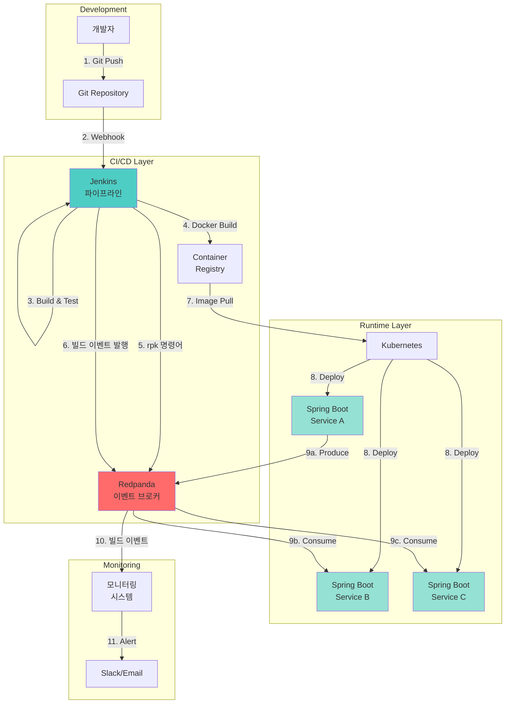
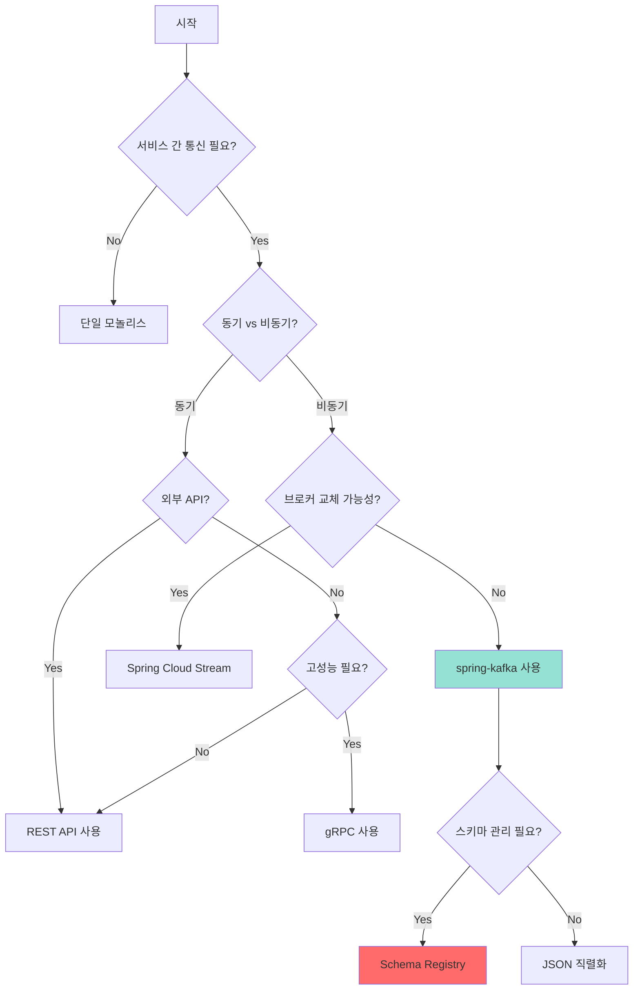

# 14. 미들웨어 간 통신 아키텍처 (Spring Boot - Redpanda - Jenkins)

이 문서는 Spring Boot, Redpanda, Jenkins 세 가지 미들웨어가 어떻게 통신하고 협력하는지를 설명합니다. 단순히 기술을 나열하는 것이 아니라, 왜 이런 구조가 필요한지, 실무에서 어떻게 적용하는지를 중심으로 설명합니다.

---

## 1. 전체 아키텍처 개요

### 1.1 세 컴포넌트의 역할

#### Spring Boot: 비즈니스 로직 담당 마이크로서비스
Spring Boot는 실제 비즈니스 로직을 구현하는 애플리케이션 계층입니다. 주문 처리, 사용자 인증, 결제 등 도메인 로직을 담당합니다. 여러 개의 Spring Boot 마이크로서비스가 독립적으로 배포되고 운영되며, 서로 통신하면서 전체 시스템을 구성합니다.

왜 Spring Boot인가? Java 생태계에서 가장 성숙한 프레임워크이고, 엔터프라이즈급 기능(트랜잭션, 보안, 모니터링)을 기본 제공하기 때문입니다. 특히 Spring Kafka 통합이 우수하여 Redpanda와의 연동이 매우 간단합니다.

#### Redpanda: 이벤트 브로커 (Kafka API 호환, C++ 기반)
Redpanda는 이벤트 스트리밍 플랫폼으로, 마이크로서비스 간 비동기 메시지를 중개합니다. Kafka API와 100% 호환되지만 C++로 작성되어 JVM 기반 Kafka보다 빠르고 가볍습니다. ZooKeeper가 필요 없고, 메모리 사용량이 절반이며, 시작 속도가 2배 빠릅니다.

왜 Redpanda를 선택하는가? 첫째, 운영이 단순합니다. Kafka는 ZooKeeper + Broker를 관리해야 하지만 Redpanda는 단일 바이너리입니다. 둘째, 리소스 효율이 높습니다. 같은 처리량을 유지하면서 서버 비용을 30-50% 절감할 수 있습니다. 셋째, Kafka 클라이언트를 그대로 사용할 수 있어 마이그레이션이 쉽습니다.

#### Jenkins: CI/CD 파이프라인 자동화
Jenkins는 코드 빌드, 테스트, 배포를 자동화하는 CI/CD 도구입니다. Git 커밋이 발생하면 자동으로 빌드를 시작하고, 테스트를 실행하고, Docker 이미지를 만들고, Kubernetes에 배포합니다.

왜 Jenkins가 Redpanda와 통신하는가? 빌드/배포 이벤트를 중앙 이벤트 스트림에 기록하면, 다른 시스템(모니터링, 알림, 감사)이 구독할 수 있습니다. 또한 Redpanda 토픽 생성/관리를 CI/CD에서 자동화할 수 있습니다.

### 1.2 세 컴포넌트 간 통신 관계

#### Spring Boot ↔ Redpanda: 이벤트 기반 비동기 통신
이것이 핵심 통신 경로입니다. Spring Boot 서비스 A가 주문을 생성하면, 주문 생성 이벤트를 Redpanda 토픽에 발행합니다. 서비스 B(재고 관리)와 서비스 C(알림)는 이 토픽을 구독하여 각자 필요한 작업을 수행합니다.

왜 이렇게 하는가? 서비스 A는 B와 C가 다운되어 있는지 신경 쓰지 않습니다. 이벤트를 발행하고 즉시 다음 작업으로 넘어갑니다. B와 C는 각자의 속도로 이벤트를 소비합니다. 이를 "시간적 결합 제거"라고 합니다.

**통신 방식**:
- Producer: Spring Boot의 KafkaTemplate으로 메시지 발행
- Consumer: @KafkaListener 어노테이션으로 메시지 소비
- 프로토콜: Kafka Wire Protocol (Redpanda가 100% 호환)

#### Jenkins → Redpanda: 빌드 이벤트 발행, 토픽 관리 자동화
Jenkins 파이프라인에서 빌드가 완료되면, "order-service v1.2.3 빌드 성공" 같은 이벤트를 Redpanda 토픽에 발행합니다. 이 이벤트를 구독하는 시스템이 Slack 알림을 보내거나, 대시보드를 업데이트하거나, 통합 테스트를 트리거할 수 있습니다.

왜 빌드 이벤트를 발행하는가? 빌드 이력을 중앙화하면 조직 전체의 배포 흐름을 추적할 수 있습니다. "어제 몇 번 배포했나?", "어떤 서비스가 가장 자주 배포되나?"를 실시간으로 분석할 수 있습니다.

또한 Jenkins는 rpk(Redpanda CLI)를 사용하여 토픽 생성/파티션 설정을 자동화합니다. 개발자가 수동으로 토픽을 만들 필요가 없습니다.

#### Jenkins → Spring Boot: 빌드, 테스트, 배포 파이프라인
Jenkins가 Spring Boot 애플리케이션의 코드를 가져와 빌드하고, 단위/통합 테스트를 실행하고, Docker 이미지를 만들고, Kubernetes에 배포합니다.

왜 Jenkins가 필요한가? 수동 배포는 오류가 발생하기 쉽고, 재현하기 어렵습니다. Jenkins 파이프라인은 배포 과정을 코드로 정의하여(Jenkinsfile) 항상 같은 방식으로 배포됩니다.

#### Redpanda → Jenkins: 이벤트 트리거 빌드 (선택적)
Redpanda 토픽에 특정 이벤트가 발행되면 Jenkins 빌드를 자동으로 트리거할 수 있습니다. 예를 들어, "공통 라이브러리 배포" 이벤트가 발행되면, 이 라이브러리를 사용하는 모든 마이크로서비스의 통합 테스트를 자동으로 실행합니다.

왜 이벤트 트리거가 유용한가? 의존 관계가 복잡한 마이크로서비스 환경에서, 한 서비스의 변경이 다른 서비스에 영향을 줄 때 자동으로 검증할 수 있습니다.

### 1.3 전체 구성도



**흐름 설명**:
1. 개발자가 코드를 Git에 푸시합니다.
2. Git Webhook이 Jenkins 빌드를 트리거합니다.
3. Jenkins가 코드를 빌드하고 테스트합니다.
4. Docker 이미지를 생성하여 레지스트리에 푸시합니다.
5. Jenkins가 rpk 명령어로 Redpanda 토픽을 생성/설정합니다.
6. Jenkins가 "빌드 성공" 이벤트를 Redpanda에 발행합니다.
7-8. Kubernetes가 이미지를 풀하여 Spring Boot 서비스를 배포합니다.
9. 서비스 A가 이벤트를 발행하면, 서비스 B와 C가 소비합니다.
10-11. 모니터링 시스템이 빌드 이벤트를 구독하여 Slack 알림을 보냅니다.

---

## 2. 미들웨어 통신 패턴 이론

### 2.1 동기(Synchronous) vs 비동기(Asynchronous) 통신의 근본적 차이

#### 동기 통신: REST, gRPC
동기 통신에서 요청자는 응답을 받을 때까지 기다립니다. 예를 들어, 서비스 A가 서비스 B에 REST API 호출을 하면, B가 응답할 때까지 A의 스레드는 블로킹됩니다.

**장점**:
- 구현이 단순합니다. HTTP 요청/응답 모델은 직관적입니다.
- 디버깅이 쉽습니다. 호출 체인을 따라가면 문제를 찾을 수 있습니다.
- 즉각적인 응답을 받을 수 있습니다.

**단점**:
- 강한 결합: 서비스 B가 다운되면 A도 영향을 받습니다.
- 성능 병목: B가 느리면 A도 느려집니다.
- 확장성 제약: 동시 호출 수가 많으면 스레드가 고갈됩니다.

#### 비동기 통신: Message Queue (Redpanda/Kafka)
비동기 통신에서 요청자는 메시지를 보내고 즉시 다음 작업으로 넘어갑니다. 수신자는 자신의 속도로 메시지를 처리합니다.

**장점**:
- 느슨한 결합: 서비스 B가 다운되어도 A는 계속 동작합니다. 메시지는 큐에 쌓입니다.
- 시간적 결합 제거: A와 B가 동시에 동작하지 않아도 됩니다.
- 부하 분산: Consumer Group으로 여러 인스턴스가 병렬로 처리합니다.
- 이벤트 재생: Kafka/Redpanda는 로그를 보관하므로 과거 이벤트를 다시 처리할 수 있습니다.

**단점**:
- 복잡성: 메시지 순서, 중복, 유실을 고려해야 합니다.
- 디버깅 어려움: 호출 체인이 명확하지 않습니다.
- 즉각적인 응답 불가: 요청/응답 패턴에는 부적합합니다.

### 2.2 왜 메시지 큐 기반 비동기 통신인가?

#### 서비스 간 시간적 결합 제거
동기 통신에서는 Producer와 Consumer가 동시에 동작해야 합니다. Consumer가 다운되면 Producer도 실패합니다. 메시지 큐를 사용하면 Producer는 메시지를 발행하고 종료합니다. Consumer는 복구 후 큐에 쌓인 메시지를 처리합니다.

실무 예시: 주문 서비스가 주문을 생성하면 주문 생성 이벤트를 발행합니다. 이메일 발송 서비스가 점검 중이어도 주문 서비스는 정상 동작합니다. 점검이 끝나면 이메일 서비스가 밀린 주문 이벤트를 처리하여 이메일을 발송합니다.

#### 부하 분산 (Consumer Group으로 수평 확장)
Redpanda/Kafka의 Consumer Group을 사용하면, 하나의 토픽을 여러 Consumer 인스턴스가 나눠서 처리합니다. 파티션 수만큼 병렬 처리가 가능합니다.

실무 예시: 주문 이벤트가 초당 1000건 발생합니다. Consumer 인스턴스 하나로는 감당할 수 없습니다. 토픽을 10개 파티션으로 나누고, Consumer를 10개 인스턴스로 확장하면 각 인스턴스가 초당 100건씩 처리합니다.

#### 이벤트 재생 가능 (Kafka/Redpanda의 로그 기반 특성)
Kafka/Redpanda는 메시지를 삭제하지 않고 로그로 보관합니다(설정한 보관 기간 동안). Consumer는 오프셋을 조정하여 과거 이벤트를 다시 읽을 수 있습니다.

실무 예시: 추천 시스템을 새로 개발했습니다. 지난 3개월의 사용자 행동 이벤트를 다시 재생하여 추천 모델을 학습시킬 수 있습니다. 기존 서비스는 영향을 받지 않습니다.

### 2.3 세 가지 통신 패턴 비교

| 항목 | REST | gRPC | Redpanda (Message Queue) |
|------|------|------|--------------------------|
| **통신 방식** | 동기 | 동기 (+ 스트리밍) | 비동기 |
| **데이터 형식** | JSON (텍스트) | Protobuf (바이너리) | Avro/JSON/Protobuf |
| **결합도** | 강함 (서비스가 서로 알아야 함) | 중간 (스키마 공유 필요) | 느슨함 (Producer는 Consumer 몰라도 됨) |
| **디버깅** | 쉬움 (HTTP 도구 사용) | 보통 (Protobuf 디코딩 필요) | 복잡함 (이벤트 추적 도구 필요) |
| **처리량** | 중간 (텍스트 파싱 오버헤드) | 높음 (바이너리 직렬화) | 매우 높음 (배치 처리) |
| **장애 전파** | 전파됨 (B 다운 → A 실패) | 전파됨 | 격리됨 (B 다운 → A 정상) |
| **즉각 응답** | 가능 | 가능 | 불가능 (비동기) |
| **순서 보장** | 보장 (단일 연결) | 보장 | 파티션 내에서만 보장 |
| **적합 상황** | 외부 API, 단순 조회 | 내부 고성능 RPC | 이벤트 전파, 부하 분산 |

### 2.4 하이브리드 접근법: 실무에서는 REST + Message Queue를 혼합 사용

실제 프로덕션 시스템은 단일 통신 패턴만 사용하지 않습니다. 상황에 따라 적절한 패턴을 선택합니다.

#### 외부 API → REST
외부 클라이언트(웹 브라우저, 모바일 앱)와의 통신은 REST를 사용합니다. HTTP는 방화벽 친화적이고, JSON은 디버깅이 쉬우며, Swagger로 문서화가 간단합니다.

예시: 모바일 앱에서 주문 조회 API(GET /api/orders/123)를 호출합니다. 즉각적인 응답이 필요하므로 REST가 적합합니다.

#### 내부 서비스 간 → Redpanda (비동기)
마이크로서비스 간 이벤트 전파는 Redpanda를 사용합니다. 서비스 간 결합도를 낮추고, 장애를 격리하기 위함입니다.

예시: 주문 서비스가 주문을 생성하면 order-created 이벤트를 발행합니다. 재고 서비스, 배송 서비스, 알림 서비스가 각자 이벤트를 구독하여 처리합니다.

#### 고성능 내부 호출 → gRPC (선택적)
실시간 성능이 중요한 내부 서비스 간 호출은 gRPC를 사용할 수 있습니다. Protobuf는 JSON보다 3-5배 빠르고, HTTP/2 멀티플렉싱으로 레이턴시를 줄입니다.

예시: API Gateway가 인증 서비스에 토큰 검증을 요청합니다. 모든 API 호출마다 발생하므로 gRPC로 레이턴시를 최소화합니다.

---

## 3. Spring Boot ↔ Redpanda 통신 상세

이것이 가장 핵심적인 통신 경로입니다. 마이크로서비스 간 비동기 이벤트 통신을 구현하는 방법을 설명합니다.

### 3.1 Producer/Consumer 기본 모델

#### Producer: KafkaTemplate으로 메시지 발행

```java
@Service
@RequiredArgsConstructor
public class OrderService {
    private final KafkaTemplate<String, OrderEvent> kafkaTemplate;
    private final OrderRepository orderRepository;

    public Order createOrder(CreateOrderRequest request) {
        // 1. 도메인 로직: 주문 생성
        Order order = Order.create(request);
        orderRepository.save(order);

        // 2. 이벤트 발행: 주문 생성 알림
        OrderEvent event = OrderEvent.builder()
            .orderId(order.getId())
            .userId(order.getUserId())
            .amount(order.getAmount())
            .timestamp(Instant.now())
            .build();

        kafkaTemplate.send("order-created", order.getId(), event);

        return order;
    }
}
```

왜 이렇게 하는가? kafkaTemplate.send()는 비동기로 동작합니다. 메시지를 전송하고 즉시 반환하므로 주문 생성 응답이 빨라집니다. 토픽명 "order-created"는 이벤트 타입을 명확히 표현합니다. 키를 지정하여 같은 주문 ID의 이벤트는 같은 파티션으로 전송되므로 순서가 보장됩니다.

#### Consumer: @KafkaListener로 메시지 소비

```java
@Component
@RequiredArgsConstructor
@Slf4j
public class InventoryEventListener {
    private final InventoryService inventoryService;

    @KafkaListener(
        topics = "order-created",
        groupId = "inventory-service",
        containerFactory = "kafkaListenerContainerFactory"
    )
    public void handleOrderCreated(ConsumerRecord<String, OrderEvent> record) {
        OrderEvent event = record.value();
        log.info("Received order created event: orderId={}", event.getOrderId());

        try {
            inventoryService.decreaseStock(event);
            log.info("Stock decreased for order: {}", event.getOrderId());
        } catch (Exception e) {
            log.error("Failed to process order event: {}", event.getOrderId(), e);
            throw e;
        }
    }
}
```

왜 이렇게 하는가? groupId를 지정하여 재고 서비스의 여러 인스턴스가 Consumer Group을 형성합니다. 하나의 이벤트는 한 인스턴스만 처리합니다. ConsumerRecord로 메시지와 메타데이터(offset, partition, timestamp)에 접근할 수 있습니다.

### 3.2 spring-kafka vs Spring Cloud Stream 선택 기준

| 항목 | spring-kafka | Spring Cloud Stream |
|------|-------------|-------------------|
| **복잡도** | 낮음 | 중간 |
| **브로커 종속** | Kafka/Redpanda 전용 | 브로커 추상화 |
| **제어 수준** | 세밀함 | 추상화됨 |
| **적합 상황** | Redpanda 전용, 직접 제어 | 브로커 교체 가능성 |

실무 가이드: Redpanda 전용이면 spring-kafka 추천합니다. Spring Cloud Stream은 브로커를 추상화하지만, 이미 Redpanda를 선택했다면 추상화 계층이 오히려 복잡도를 높입니다.

#### spring-kafka 설정 (application.yml)

```yaml
spring:
  kafka:
    bootstrap-servers: redpanda:9092
    producer:
      key-serializer: org.apache.kafka.common.serialization.StringSerializer
      value-serializer: org.springframework.kafka.support.serializer.JsonSerializer
      acks: all
      retries: 3
    consumer:
      key-deserializer: org.apache.kafka.common.serialization.StringDeserializer
      value-deserializer: org.springframework.kafka.support.serializer.JsonDeserializer
      group-id: order-service
      auto-offset-reset: earliest
      enable-auto-commit: false
      properties:
        spring.json.trusted.packages: "com.example.order.event"
```

왜 이 설정을 사용하는가? acks=all로 모든 replica에 쓰기가 완료된 후 ACK를 받으므로 메시지 유실을 방지합니다. enable-auto-commit=false로 수동 커밋하여 정확히 한 번 처리를 보장합니다.

---

## 4. Jenkins ↔ Redpanda 통신 상세

### 4.1 Jenkins → Redpanda (빌드 이벤트 발행)

왜 빌드 이벤트를 발행하는가? 빌드/배포 이벤트를 중앙 이벤트 스트림에 기록하면 모니터링 시스템이 구독하여 대시보드를 업데이트하고, 알림 시스템이 Slack으로 알림을 보낼 수 있습니다.

#### Jenkinsfile에서 rpk로 이벤트 발행

```groovy
pipeline {
    agent any

    environment {
        REDPANDA_BROKERS = 'redpanda:9092'
        SERVICE_NAME = 'order-service'
    }

    stages {
        stage('Build') {
            steps {
                sh './gradlew build'
            }
        }

        stage('Publish Build Event') {
            steps {
                script {
                    def buildEvent = """
                    {
                        "service": "${SERVICE_NAME}",
                        "version": "${env.BUILD_NUMBER}",
                        "commit": "${env.GIT_COMMIT}",
                        "status": "SUCCESS",
                        "timestamp": "${new Date().format("yyyy-MM-dd'T'HH:mm:ss'Z'")}"
                    }
                    """

                    sh """
                        echo '${buildEvent}' | \\
                        rpk topic produce build-events \\
                            --brokers ${REDPANDA_BROKERS} \\
                            --key ${SERVICE_NAME}
                    """
                }
            }
        }
    }
}
```

### 4.2 Jenkins의 Redpanda 토픽 관리 자동화

왜 토픽 관리를 자동화하는가? 개발자가 수동으로 토픽을 생성하면 설정 불일치가 발생합니다. CI/CD에서 토픽을 자동 생성하면 Infrastructure as Code가 됩니다.

```groovy
stage('Setup Redpanda Topics') {
    steps {
        script {
            def topics = [
                [name: 'order-created', partitions: 10, replicas: 3],
                [name: 'order-shipped', partitions: 5, replicas: 3]
            ]

            topics.each { topic ->
                sh """
                    rpk topic create ${topic.name} \\
                        --brokers ${REDPANDA_BROKERS} \\
                        --partitions ${topic.partitions} \\
                        --replicas ${topic.replicas} \\
                        || echo "Topic already exists"
                """
            }
        }
    }
}
```

---

## 5. Jenkins → Spring Boot (CI/CD 파이프라인)

### 5.1 Testcontainers + Redpanda로 통합 테스트

왜 Testcontainers를 사용하는가? 통합 테스트에서 실제 Redpanda 브로커를 Docker 컨테이너로 실행하면 테스트 환경과 프로덕션 환경이 동일합니다. Redpanda는 Kafka보다 2배 빠르게 시작합니다.

```java
@SpringBootTest
@Testcontainers
class OrderServiceIntegrationTest {

    @Container
    static RedpandaContainer redpanda = new RedpandaContainer(
        "docker.redpanda.com/redpandadata/redpanda:v25.3.1"
    );

    @DynamicPropertySource
    static void kafkaProperties(DynamicPropertyRegistry registry) {
        registry.add("spring.kafka.bootstrap-servers", redpanda::getBootstrapServers);
    }

    @Test
    void 주문_생성시_이벤트가_발행되어야_한다() throws Exception {
        // Given
        CreateOrderRequest request = CreateOrderRequest.builder()
            .userId("user-123")
            .items(List.of(new OrderItem("item-1", 2)))
            .build();

        // When
        Order order = orderService.createOrder(request);

        // Then
        assertThat(order.getId()).isNotNull();
    }
}
```

### 5.2 전체 Jenkinsfile 파이프라인

```groovy
pipeline {
    agent any

    environment {
        DOCKER_REGISTRY = 'docker.io/mycompany'
        SERVICE_NAME = 'order-service'
        REDPANDA_BROKERS = 'redpanda:9092'
    }

    stages {
        stage('Build') {
            steps {
                sh './gradlew clean build -x test'
            }
        }

        stage('Test') {
            steps {
                sh './gradlew test integrationTest'
            }
        }

        stage('Docker Build') {
            steps {
                script {
                    def imageTag = "${DOCKER_REGISTRY}/${SERVICE_NAME}:${env.BUILD_NUMBER}"
                    sh "docker build -t ${imageTag} ."
                }
            }
        }

        stage('Deploy to Kubernetes') {
            steps {
                script {
                    def imageTag = "${DOCKER_REGISTRY}/${SERVICE_NAME}:${env.BUILD_NUMBER}"
                    sh """
                        kubectl set image deployment/${SERVICE_NAME} \\
                            ${SERVICE_NAME}=${imageTag} \\
                            -n production
                    """
                }
            }
        }
    }
}
```

---

## 6. 통합 아키텍처 패턴

### 6.1 Event-Driven Microservices Platform 패턴

codecentric/event-driven-microservices-platform 참조 아키텍처를 Redpanda로 적용하면:

**구성 요소**:
1. Jenkins Job DSL: 마이크로서비스별 파이프라인 자동 생성
2. Spring Cloud Config: 중앙 설정 관리 (Redpanda 브로커 주소)
3. Spring Boot Admin: 서비스 모니터링
4. Redpanda: 서비스 간 비동기 통신

#### Jenkins Job DSL로 파이프라인 자동 생성

```groovy
def services = ['order-service', 'inventory-service', 'shipping-service']

services.each { serviceName ->
    pipelineJob(serviceName) {
        definition {
            cpsScm {
                scm {
                    git {
                        remote {
                            url("https://github.com/mycompany/${serviceName}.git")
                        }
                        branch('*/main')
                    }
                }
                scriptPath('Jenkinsfile')
            }
        }
    }
}
```

왜 Job DSL을 사용하는가? 마이크로서비스가 10개, 100개로 늘어날 때 수동으로 Jenkins Job을 만들 수 없습니다. Job DSL로 코드로 정의하면 자동으로 생성됩니다.

### 6.2 환경별 구성 전략

| 환경 | Spring Boot | Redpanda | Jenkins | 인프라 |
|------|-------------|----------|---------|--------|
| **개발** | 단일 인스턴스 | 단일 노드 | 로컬 | Docker Compose |
| **스테이징** | 3 인스턴스 | 3노드 클러스터 | Agent 3개 | Kubernetes |
| **프로덕션** | 10+ 인스턴스 | 5노드 + Tiered Storage | Agent 10개 | K8s + 모니터링 |

#### 개발 환경: Docker Compose

```yaml
services:
  redpanda:
    image: docker.redpanda.com/redpandadata/redpanda:v25.3.1
    command:
      - redpanda start
      - --smp 1
      - --kafka-addr internal://0.0.0.0:9092
    ports:
      - "19092:19092"

  order-service:
    build: ./order-service
    environment:
      SPRING_KAFKA_BOOTSTRAP_SERVERS: redpanda:9092
    depends_on:
      - redpanda
```

---

## 7. 실무 적용 시 주의사항

### 7.1 스키마 관리

왜 스키마 관리가 중요한가? Producer가 이벤트 스키마를 변경하면 Consumer가 파싱 오류를 일으킬 수 있습니다. Schema Registry로 스키마 호환성을 검증합니다.

#### Redpanda Schema Registry 설정

```yaml
spring:
  kafka:
    properties:
      schema.registry.url: http://redpanda:8081
    producer:
      value-serializer: io.confluent.kafka.serializers.KafkaAvroSerializer
    consumer:
      value-deserializer: io.confluent.kafka.serializers.KafkaAvroDeserializer
```

### 7.2 데이터 정합성

#### Transactional Outbox 패턴

DB 트랜잭션과 Kafka 메시지 발행의 원자성을 보장하기 위해 Transactional Outbox 패턴을 사용합니다. DB 트랜잭션 안에서 outbox 테이블에 이벤트를 저장하고, 별도 프로세스가 주기적으로 outbox를 조회하여 Kafka로 발행합니다.

```java
@Service
@Transactional
public class OrderService {
    private final OrderRepository orderRepository;
    private final OutboxRepository outboxRepository;

    public void createOrder(CreateOrderRequest request) {
        // 1. 도메인 로직: 주문 저장
        Order order = orderRepository.save(new Order(request));

        // 2. Outbox에 이벤트 저장 (같은 트랜잭션)
        OrderCreatedEvent event = new OrderCreatedEvent(order);
        OutboxEvent outboxEvent = OutboxEvent.builder()
            .aggregateType("Order")
            .aggregateId(order.getId())
            .eventType("ORDER_CREATED")
            .payload(objectMapper.writeValueAsString(event))
            .published(false)
            .build();

        outboxRepository.save(outboxEvent);
        // DB 트랜잭션 커밋: 주문과 이벤트가 원자적으로 저장됨
    }
}
```

### 7.3 장애 대응

#### Redpanda 다운 시: Spring Boot의 재시도 정책

```yaml
spring:
  kafka:
    producer:
      retries: 10
      retry.backoff.ms: 1000
```

#### Spring Boot 다운 시: Consumer Group 리밸런싱
Spring Boot 인스턴스가 크래시하면 Consumer Group이 리밸런싱하여 다른 인스턴스가 파티션을 인계받습니다.

### 7.4 모니터링 포인트

#### Lag 모니터링
Consumer Lag은 Producer가 생산한 메시지 수와 Consumer가 소비한 메시지 수의 차이입니다. Lag이 계속 증가하면 Consumer가 처리 속도를 따라가지 못하는 것입니다.

```bash
rpk group describe order-processor --brokers redpanda:9092
```

#### End-to-end latency 측정

```java
@KafkaListener(topics = "order-created")
public void handleOrderCreated(OrderEvent event) {
    long latency = System.currentTimeMillis() - event.getTimestamp();
    meterRegistry.timer("kafka.consumer.latency", "topic", "order-created")
        .record(latency, TimeUnit.MILLISECONDS);
}
```

---

## 8. 아키텍처 선택 가이드

### 8.1 규모별 권장 아키텍처

| 규모 | Spring Boot ↔ Redpanda | Jenkins 통합 | 인프라 |
|------|----------------------|-------------|--------|
| **소규모** (서비스 <5) | spring-kafka, 직접 연결 | 단일 Jenkins, rpk 스크립트 | Docker Compose |
| **중규모** (서비스 5-20) | spring-kafka + DLQ | Pipeline, Testcontainers | K8s + Helm |
| **대규모** (서비스 >20) | Spring Cloud Stream + Schema Registry | Job DSL + GitOps | K8s + Tiered Storage |

### 8.2 의사결정 플로우차트



### 8.3 체크리스트

#### Spring Boot ↔ Redpanda 통합
- [ ] spring-kafka 또는 Spring Cloud Stream 선택
- [ ] Producer: KafkaTemplate 설정, acks=all
- [ ] Consumer: @KafkaListener, Consumer Group 설정
- [ ] 재시도 정책: DefaultErrorHandler + BackOff (RetryTemplate은 Spring Kafka 3.x에서 제거됨)
- [ ] 모니터링: Lag, Latency 메트릭

#### Jenkins 통합
- [ ] Jenkinsfile: Build → Test → Deploy
- [ ] Testcontainers + Redpanda 통합 테스트
- [ ] rpk로 토픽 자동 생성
- [ ] 빌드 이벤트 발행

#### 프로덕션 준비
- [ ] Redpanda 클러스터: 최소 3노드, 복제 계수 3
- [ ] Schema Registry 활성화
- [ ] 모니터링: Prometheus + Grafana
- [ ] 재해 복구 계획

---

## 참고 자료

### 공식 문서
- [Redpanda Documentation](https://docs.redpanda.com/)
- [Spring Kafka Documentation](https://docs.spring.io/spring-kafka/reference/html/)
- [Spring Cloud Stream Documentation](https://docs.spring.io/spring-cloud-stream/docs/current/reference/html/)
- [Jenkins Documentation](https://www.jenkins.io/doc/)

### 블로그 및 튜토리얼
- [Building event-driven microservices with Spring Boot - Redpanda](https://www.redpanda.com/blog/build-event-driven-microservices-spring-boot)
- [Redpanda TDD & CI Testing](https://www.redpanda.com/blog/test-driven-development-ci-testing-kafka)
- [Event-Driven Microservices Platform (codecentric)](https://github.com/codecentric/event-driven-microservices-platform)
- [spring-kafka vs Spring Cloud Stream](https://saturncloud.io/blog/springkafka-vs-springcloudstream-kafka-which-one-to-choose/)

### 도구
- [Jenkins JMS Messaging Plugin](https://plugins.jenkins.io/jms-messaging/)
- [Kafka Connect Jenkins Connector](https://github.com/yaravind/kafka-connect-jenkins)
- [Testcontainers Redpanda Module](https://www.testcontainers.org/modules/redpanda/)
- [rpk (Redpanda CLI)](https://docs.redpanda.com/docs/reference/rpk/)

### 패턴
- [Transactional Outbox Pattern](https://microservices.io/patterns/data/transactional-outbox.html)
- [Event Sourcing Pattern](https://martinfowler.com/eaaDev/EventSourcing.html)
- [CQRS Pattern](https://martinfowler.com/bliki/CQRS.html)

---

## 요약

이 문서는 Spring Boot, Redpanda, Jenkins 세 미들웨어의 통신 아키텍처를 설명했습니다.

**핵심 포인트**:
1. **Spring Boot ↔ Redpanda**: 이벤트 기반 비동기 통신으로 서비스 간 결합도를 낮춥니다. spring-kafka로 직접 제어하거나 Spring Cloud Stream으로 추상화합니다.
2. **Jenkins → Redpanda**: 빌드 이벤트를 발행하여 중앙 이벤트 스트림을 형성하고, rpk로 토픽 관리를 자동화합니다.
3. **Jenkins → Spring Boot**: CI/CD 파이프라인으로 빌드, 테스트, 배포를 자동화합니다. Testcontainers로 Redpanda 통합 테스트를 실행합니다.
4. **패턴**: Transactional Outbox로 데이터 정합성을 보장하고, Schema Registry로 스키마를 관리합니다.
5. **규모별 아키텍처**: 소규모는 Docker Compose, 중규모는 Kubernetes, 대규모는 Tiered Storage + Schema Registry를 추가합니다.

**실무 가이드**: Redpanda 전용이면 spring-kafka 추천. Schema Registry는 프로덕션에서 강력히 권장. Testcontainers로 통합 테스트를 자동화하면 Redpanda와의 통합을 빠르게 검증할 수 있습니다.
