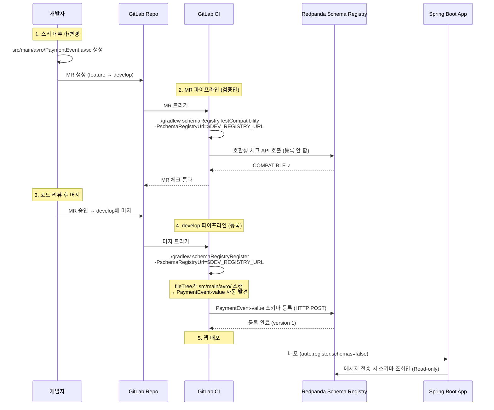
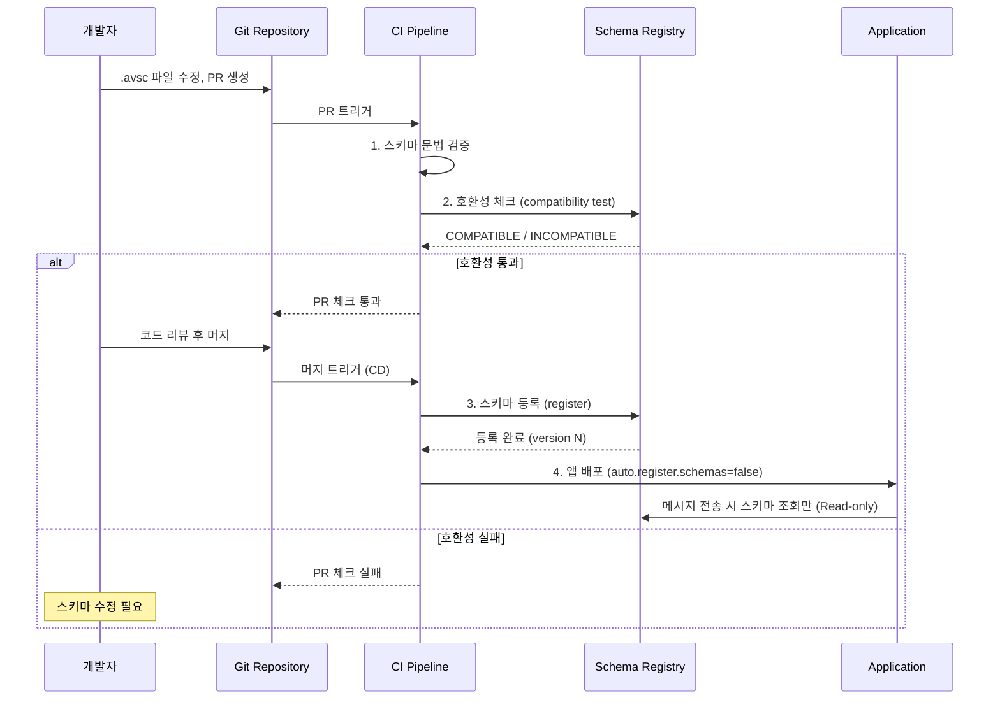

# 15. Schema Registry 등록 전략

Schema Registry 등록 방식, CI/CD 워크플로우, 브랜치 전략 및 호환 불가 변경 대처법

---

## 자동 등록 vs 수동 등록

Producer가 Avro 메시지를 보내려면, 해당 스키마가 Schema Registry에 등록되어 있어야 한다. 등록 방식은 두 가지다.

**자동 등록 (`auto.register.schemas=true`)**은 Producer가 첫 메시지를 전송할 때 스키마를 Schema Registry에 자동으로 등록한다. 개발 환경에서 빠른 프로토타이핑에 편리하지만, 프로덕션에서는 위험하다. 아무 클라이언트나 스키마를 등록할 수 있고, 호환되지 않는 스키마 변경이 검토 없이 적용될 수 있기 때문이다.

**수동 등록 (`auto.register.schemas=false`)**은 CI/CD 파이프라인에서 스키마를 사전 등록하고, 애플리케이션은 이미 등록된 스키마만 사용한다. 스키마 변경이 코드 리뷰와 호환성 검증을 거치므로, 프로덕션에서 안전하다.

### 환경별 설정

| 환경 | `auto.register.schemas` | 등록 방법 | Schema Registry 접근 |
|------|------------------------|-----------|---------------------|
| **개발** | `true` | 자동 (편의성) | Read/Write |
| **스테이징** | `false` | CI/CD 파이프라인 | 제한적 Write |
| **프로덕션** | `false` | CI/CD 파이프라인 | **Read-only** |

### 프로덕션에서 자동 등록이 위험한 이유

첫째, **거버넌스 부재**. 누가, 언제, 왜 스키마를 변경했는지 추적할 수 없다. Git 히스토리와 분리되어 감사 로그가 없다.

둘째, **호환성 파괴**. Consumer가 아직 이전 스키마를 사용 중인데, Producer가 호환되지 않는 새 스키마를 등록하면 역직렬화 실패가 발생한다. CI에서 호환성을 검증했다면 방지할 수 있었다.

셋째, **롤백 어려움**. 문제가 발생해도 어떤 스키마 변경이 원인인지 파악하기 어렵고, 배포 프로세스 없이 등록되었으므로 되돌리기도 어렵다.

---

## 수동 등록 도구와 CI/CD 워크플로우

스키마를 코드로 관리하고 CI/CD에서 등록하는 것이 업계 표준이다. 아래 두 도구는 **같은 목적의 대안(택 1)**이다.

| | Gradle Plugin | schema-registry-gitops |
|---|---|---|
| 방식 | `build.gradle`에 스키마 정의 | 별도 YAML 파일에 스키마 정의 |
| 실행 | `./gradlew schemaRegistryRegister` | `schema-registry-gitops apply` |
| 적합 | Java/Gradle 프로젝트 (빌드와 통합) | 다중 언어, 스키마만 별도 repo 관리 |

**방법 A. Gradle Plugin** — Java/Gradle 프로젝트에서 빌드 파이프라인과 자연스럽게 통합. 스키마(.avsc)와 앱 코드가 같은 repo에 있으면 이 방식이 자연스럽다:

```groovy
plugins {
    id "com.github.imflog.kafka-schema-registry-gradle-plugin" version "2.1.0"
}

schemaRegistry {
    url = project.findProperty('schemaRegistryUrl') ?: 'http://localhost:8081'
    register {
        // 폴더 전체 동적 등록: .avsc 파일 추가 시 build.gradle 수정 불필요
        fileTree('src/main/avro').matching { include '*.avsc' }.each { file ->
            def subjectName = file.name.replace('.avsc', '-value')
            subject(subjectName, file.path, 'AVRO')
        }
    }
}
```

`fileTree`로 폴더 전체를 스캔하므로, `.avsc` 파일을 추가/삭제하면 자동으로 등록 대상이 변경된다. subject 이름은 `{파일명}-value` 컨벤션을 따른다 (예: `OrderEvent.avsc` → `OrderEvent-value`).

CI에서 환경별 Registry URL을 주입할 수 있도록 `project.findProperty()`로 동적 설정한다.

**방법 B. GitOps 방식** (`schema-registry-gitops`) — 스키마를 앱 코드와 분리하여 별도 repo로 관리할 때 적합. 다중 언어 환경에서 스키마 중앙 관리가 필요한 경우:

```yaml
# schema-registry.yml
subjects:
  orders-value:
    schema: schemas/OrderEvent.avsc
    compatibility: BACKWARD
```

**실제 사용 흐름** (방법 A 기준):



이 흐름의 핵심: **Gradle Plugin은 Schema Registry의 REST API를 호출하는 클라이언트 도구**다. Redpanda가 Git을 감시하거나 파일을 자동 탐지하는 것이 아니라, CI가 명시적으로 Gradle task를 실행하여 Registry에 등록한다.

---

## 브랜치 전략과 Schema Registry

Schema Registry는 stateful 공유 자원이다. 여러 브랜치가 동시에 스키마를 변경하면 충돌이 발생할 수 있으므로, **검증과 등록을 분리**해야 한다.

핵심 원칙: feature 브랜치는 호환성 검증만, 공유 브랜치(develop/main)에서만 등록한다.

```
feature/add-field ──→ validate only (등록 안 함)
develop           ──→ dev Registry에 등록
main              ──→ prod Registry에 등록
```

**GitLab CI 예시**:

```yaml
stages:
  - validate
  - register

# 모든 MR: 호환성 검증만 (등록하지 않음)
schema-validate:
  stage: validate
  script:
    - ./gradlew schemaRegistryTestCompatibility
        -PschemaRegistryUrl=$DEV_REGISTRY_URL
  rules:
    - if: $CI_MERGE_REQUEST_IID

# develop 머지 후: dev 환경에 등록
schema-register-dev:
  stage: register
  script:
    - ./gradlew schemaRegistryRegister
        -PschemaRegistryUrl=$DEV_REGISTRY_URL
  rules:
    - if: $CI_COMMIT_BRANCH == "develop"

# main 머지 후: prod 환경에 등록
schema-register-prod:
  stage: register
  script:
    - ./gradlew schemaRegistryRegister
        -PschemaRegistryUrl=$PROD_REGISTRY_URL
  rules:
    - if: $CI_COMMIT_BRANCH == "main"
```

feature 브랜치에서 등록하면, 다른 브랜치가 머지할 때 예상치 못한 호환성 실패가 발생한다. `testCompatibility`는 실제 등록 없이 현재 Registry 상태에 대해 검증만 수행하므로 안전하다.

**브랜치 충돌 시나리오**:

```
branch-A: OrderEvent에 "address" 필드 추가 (optional, default null)
branch-B: OrderEvent에 "phone" 필드 추가 (optional, default null)
둘 다 develop에 머지하면?
→ BACKWARD 호환이므로 둘 다 optional이면 문제없다. 두 필드 모두 추가되어 v3 스키마가 된다.
```

| 상황 | 위험도 | 대응 |
|------|--------|------|
| 둘 다 optional 필드 추가 | 안전 | 자동 머지 가능 |
| 같은 필드명, 다른 타입 | 충돌 | MR 리뷰에서 잡아야 함 |
| 한쪽이 필드 삭제 | 위험 | 호환성 검증 실패 → CI 차단 |

---

## 프로덕션 CI/CD 파이프라인 예시



이 파이프라인의 핵심은 **스키마가 앱보다 먼저 등록된다**는 것이다. 앱은 이미 등록된 스키마를 조회만 하므로, Schema Registry에 Write 권한이 필요 없다.

---

## 스키마 진화 정책 (Compatibility Types)

Schema Registry는 새 스키마를 등록할 때 기존 스키마와의 호환성을 자동 검증한다. 어떤 호환성 정책을 선택하느냐에 따라 허용되는 변경의 범위가 달라지므로, 프로젝트 초기에 팀 전체가 합의해야 한다.

### 호환성 유형

**BACKWARD (기본값)** — 새 스키마로 이전 데이터를 읽을 수 있다. "Consumer를 먼저 업그레이드하고, Producer는 나중에"라는 배포 순서에 맞는다. Confluent Schema Registry와 Redpanda 모두 기본값이다.

**FORWARD** — 이전 스키마로 새 데이터를 읽을 수 있다. "Producer를 먼저 업그레이드하고, Consumer는 나중에"라는 배포 순서에 맞는다.

**FULL** — BACKWARD + FORWARD를 동시에 만족한다. 가장 엄격하지만, Producer와 Consumer를 어떤 순서로든 배포할 수 있어 운영이 단순해진다.

**NONE** — 호환성 검증을 하지 않는다. 개발 초기 프로토타이핑에서만 쓰고, 프로덕션에서는 사용하지 않는다.

| 정책 | 핵심 질문 | 안전한 변경 | 위험한 변경 |
|------|----------|-----------|-----------|
| BACKWARD | 새 코드가 옛 데이터를 읽을 수 있는가? | optional 필드 추가, 필드 삭제 | required 필드 추가, 타입 변경 |
| FORWARD | 옛 코드가 새 데이터를 읽을 수 있는가? | 필드 삭제, default 있는 필드 추가 | default 없는 필드 추가 |
| FULL | 양방향 모두 가능한가? | default 있는 optional 필드 추가/삭제 | 그 외 모든 변경 |

### TRANSITIVE 변형

기본 호환성은 **직전 버전**과만 비교한다. TRANSITIVE 변형은 **등록된 모든 이전 버전**과 비교한다.

```
BACKWARD:             v3 ↔ v2만 비교
BACKWARD_TRANSITIVE:  v3 ↔ v2, v3 ↔ v1 모두 비교
```

v1 → v2 → v3로 진화한 스키마에서, BACKWARD는 v3이 v2와만 호환되면 등록이 성공한다. v1 데이터를 v3으로 읽을 수 없어도 통과한다. BACKWARD_TRANSITIVE는 v3이 v2와 v1 **모두**와 호환되어야 한다.

언제 TRANSITIVE가 필요한가? retention이 길거나 compacted topic에서 오래된 데이터를 재처리하는 시나리오다. Consumer가 v1으로 직렬화된 데이터를 v3 스키마로 읽어야 할 때, TRANSITIVE가 아니면 역직렬화 실패가 발생할 수 있다.

### Avro 필드 진화 규칙

이 프로젝트의 Ch10 실습이 보여주듯, Avro는 스키마 진화를 위한 구체적인 규칙이 있다.

**필드 추가** — `default` 값이 있어야 BACKWARD 호환된다. 이 프로젝트의 `SchemaEvolutionV2.avsc`가 정확히 이 패턴이다:

```json
// V1에는 없던 필드를 V2에서 추가
{ "name": "phone", "type": ["null", "string"], "default": null },
{ "name": "age",   "type": ["null", "int"],    "default": null }
```

V1으로 직렬화된 데이터에는 `phone`, `age`가 없으므로, V2 스키마로 읽을 때 default 값(`null`)이 채워진다. `default`가 없으면 값을 결정할 수 없어 역직렬화가 실패한다.

**필드 삭제** — 삭제하려는 필드에 `default` 값이 있었다면 FORWARD 호환된다. 새 스키마에서 삭제된 필드가 이전 데이터에 있어도, 역직렬화 시 해당 필드를 무시하면 된다.

**타입 승격 (Type Promotion)** — Avro는 일부 타입 간 자동 승격을 지원한다:

| 원래 타입 | 승격 가능 타입 |
|----------|-------------|
| `int` | `long`, `float`, `double` |
| `long` | `float`, `double` |
| `float` | `double` |
| `string` | `bytes` (양방향) |

`int → long`은 안전하지만, 역방향(`long → int`)은 데이터 손실 가능성이 있어 비호환이다.

**필드 이름 변경 (aliases)** — Avro의 `aliases`로 이전 이름을 인식할 수 있다:

```json
{ "name": "customerName", "type": "string", "aliases": ["userName"] }
```

다만 Schema Registry의 호환성 검증이 aliases를 일관되게 처리하지 않는 경우가 있다. 실무에서는 아래 "호환 불가 스키마 변경 대처법"의 방법 1(deprecated + 새 필드 추가)이 더 안전하다.

**enum 심볼 변경** — 심볼 추가는 BACKWARD 호환이다(새 Consumer가 이전 데이터를 읽을 수 있다). 심볼 제거는 BACKWARD 비호환이다(이전 데이터에 삭제된 심볼이 있으면 역직렬화 실패).

### 진화 규칙 요약

| 변경 유형 | BACKWARD | FORWARD | FULL |
|----------|----------|---------|------|
| optional 필드 추가 (default 있음) | O | O | O |
| required 필드 추가 (default 없음) | X | O | X |
| default 있는 필드 삭제 | O | O | O |
| default 없는 필드 삭제 | O | X | X |
| 타입 승격 (int→long) | O | X | X |
| enum 심볼 추가 | O | X | X |
| enum 심볼 제거 | X | O | X |

### Subject 레벨 vs 글로벌 레벨 설정

호환성 정책은 글로벌과 subject 두 수준에서 설정할 수 있다.

```bash
# 글로벌 호환성 조회/변경
curl http://localhost:8081/config
curl -X PUT http://localhost:8081/config \
  -H "Content-Type: application/json" \
  -d '{"compatibility": "FULL"}'

# 특정 subject만 다른 정책 적용 (글로벌 오버라이드)
curl -X PUT http://localhost:8081/config/OrderEvent-value \
  -H "Content-Type: application/json" \
  -d '{"compatibility": "FULL"}'
```

실무에서는 글로벌을 BACKWARD로 두고, 결제/정산처럼 민감한 도메인 이벤트는 subject 레벨에서 FULL로 강화하는 패턴이 일반적이다.

---

## 호환 불가 스키마 변경 대처법

위 진화 규칙에서 BACKWARD 호환이 깨지는 대표 사례: 필드 타입 변경(`string → int`), required 필드 추가(default 없음), 필드명 변경(rename), enum 심볼 제거.

이런 변경이 필요할 때 대처법은 네 가지다.

**방법 1. 호환 가능한 형태로 변환 (가장 실용적)**

breaking change를 non-breaking change로 바꾸는 방법이다. rename이 필요하면 기존 필드를 deprecated 처리하고 새 필드를 추가한다.

```json
// rename이 필요한 경우: 삭제가 아닌 deprecate + add
{ "name": "userName", "type": "string", "doc": "@deprecated use customerName" },
{ "name": "customerName", "type": ["null", "string"], "default": null }

// 타입 변경이 필요한 경우: 기존 유지 + 새 필드 추가
{ "name": "amount", "type": "string", "doc": "@deprecated" },
{ "name": "amountDecimal", "type": ["null", "bytes"], "default": null,
  "logicalType": "decimal", "precision": 10, "scale": 2 }
```

기존 Consumer가 그대로 동작하면서 새 Consumer는 새 필드를 사용한다. 전환 완료 후 다음 major 버전에서 deprecated 필드를 제거한다.

**방법 2. 새 토픽으로 마이그레이션**

스키마 변경이 너무 크면 새 토픽을 만들고 이중 쓰기(dual-write)로 전환한다.

```
orders-v1 토픽 (기존 스키마)
    ↓ 전환 기간: Producer가 양쪽에 쓴다
orders-v2 토픽 (새 스키마)
```

```java
// Producer: 전환 기간 동안 양쪽에 쓴다
kafkaTemplate.send("orders-v1", toV1(event));
kafkaTemplate.send("orders-v2", toV2(event));
// Consumer 전환 완료 후 v1 제거
```

장점은 기존 Consumer가 전혀 깨지지 않고 롤백이 쉽다는 것이다. 단점은 이중 쓰기 기간 동안 운영 복잡도가 증가한다.

**방법 3. Subject 삭제 후 재등록**

```bash
# soft delete → hard delete → 새 스키마 등록
curl -X DELETE http://registry:8081/subjects/orders-value
curl -X DELETE http://registry:8081/subjects/orders-value?permanent=true
curl -X POST http://registry:8081/subjects/orders-value/versions \
  -d '{"schema": "..."}'
```

**주의: 기존 스키마로 직렬화된 데이터가 토픽에 남아있으면 Consumer가 깨진다.** retention이 만료되어 기존 데이터가 없는 경우에만 안전하다.

**방법 4. 일시적 호환성 완화 (최후 수단)**

```bash
# 호환성 레벨을 NONE으로 변경 → 등록 → 복원
curl -X PUT http://registry:8081/config/orders-value \
  -d '{"compatibility": "NONE"}'
curl -X POST http://registry:8081/subjects/orders-value/versions \
  -d '{"schema": "..."}'
curl -X PUT http://registry:8081/config/orders-value \
  -d '{"compatibility": "BACKWARD"}'
```

**dev 환경에서만 허용하는 곳이 대부분이다.** prod에서 사용하면 기존 데이터를 읽는 Consumer가 실패할 수 있다.

**판단 기준**:

| 조건 | 권장 방법 |
|------|----------|
| 변경을 optional 추가로 표현 가능 | 방법 1 (호환 변환) |
| 구조 자체가 완전히 달라짐 | 방법 2 (새 토픽 + 이중 쓰기) |
| 토픽에 기존 데이터 없음 (retention 만료) | 방법 3 (삭제 후 재등록) |
| dev 환경에서 빠른 반복 필요 | 방법 4 (호환성 완화) |

업계 실무에서는 **방법 1을 우선 시도하고, 정말 불가능할 때만 방법 2를 쓴다.**

---

## 이 프로젝트의 현재 설정

```yaml
# application.yml
spring:
  kafka:
    producer:
      properties:
        auto.register.schemas: true   # 개발 환경이므로 자동 등록
```

개발/학습 프로젝트이므로 자동 등록을 사용한다. 프로덕션 전환 시 `false`로 변경하고 CI/CD 파이프라인에서 스키마를 등록해야 한다.
