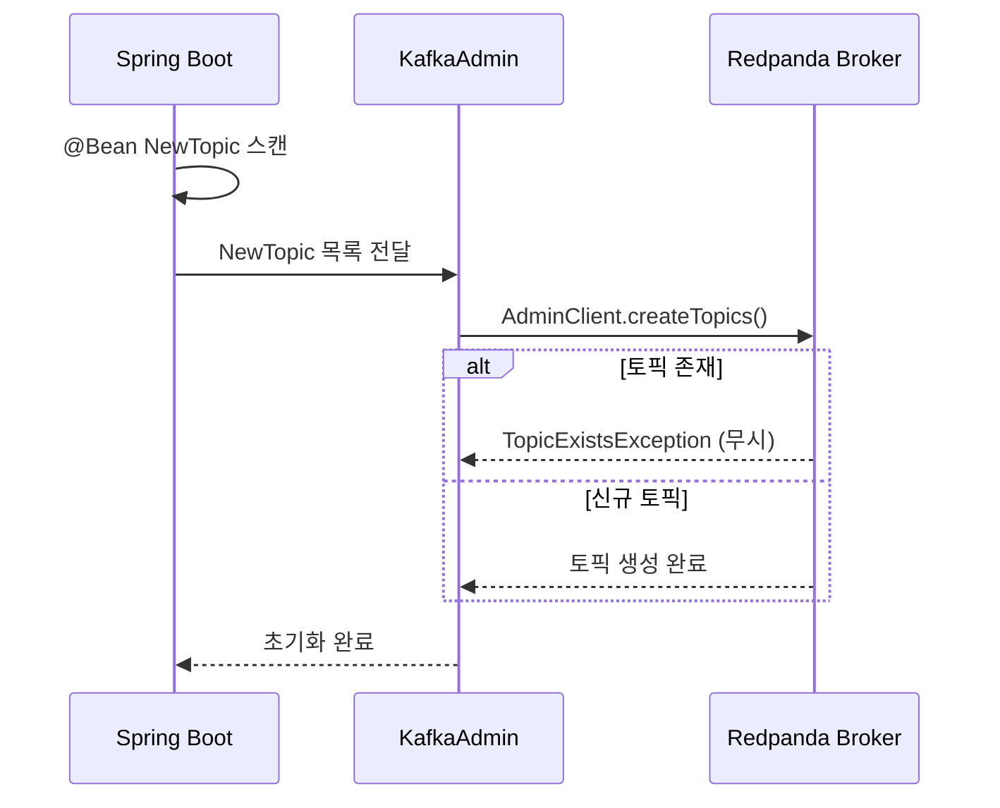

# 16. 토픽 생명주기 관리

KafkaAdmin/TopicBuilder로 토픽 선언적 정의, cleanup.policy 선택, DLT 운영 패턴. 설정 카탈로그는 [02-configuration-reference.md](./02-configuration-reference.md) 참조.

---

## 토픽 관리

### KafkaAdmin의 동작 원리

Spring Boot가 시작되면 `KafkaAdmin` Bean이 ApplicationContext에서 모든 `NewTopic` Bean을 탐색합니다. 발견된 토픽 정의를 Kafka Admin API를 통해 브로커에 전달하고, 브로커는 토픽이 없으면 생성하고 이미 존재하면 무시합니다. 이 과정은 애플리케이션 시작 시 한 번만 실행됩니다.

`KafkaAdmin`은 기본적으로 Auto-configuration으로 등록됩니다. `spring.kafka.bootstrap-servers`만 설정되어 있으면 별도 Bean 정의 없이도 동작합니다. 토픽 생성에 실패하면(브로커 연결 불가 등) 기본적으로 경고 로그만 출력하고 애플리케이션은 정상 시작됩니다.



#### yml 설정 방식

대부분의 KafkaAdmin 동작은 `application.yml`로 제어할 수 있습니다.

```yaml
spring:
  kafka:
    bootstrap-servers: localhost:19092

    admin:
      fail-fast: true             # 브로커 연결 실패 시 앱 시작 중단 (기본값 false)
      auto-create: true           # NewTopic Bean 자동 생성 (기본값 true)
      operation-timeout: 30       # Admin 작업 타임아웃 (초)
      close-timeout: 10           # AdminClient 종료 대기 시간 (초)
      modify-topic-configs: false # 기존 토픽 설정 수정 여부 (기본값 false)
      properties:                 # AdminClient에 전달할 추가 설정
        request.timeout.ms: 5000
```

| 설정 | 기본값 | 설명 |
|------|--------|------|
| `spring.kafka.admin.fail-fast` | `false` | `true`이면 브로커 연결 실패 시 애플리케이션 시작을 중단합니다. |
| `spring.kafka.admin.auto-create` | `true` | `false`이면 `NewTopic` Bean이 있어도 토픽을 자동 생성하지 않습니다. |
| `spring.kafka.admin.operation-timeout` | `30` | Admin API 작업(토픽 생성 등)의 타임아웃(초). |
| `spring.kafka.admin.close-timeout` | `10` | AdminClient를 닫을 때 대기하는 시간(초). |
| `spring.kafka.admin.modify-topic-configs` | `false` | `true`이면 기존 토픽의 설정값(retention 등)을 `NewTopic` Bean 정의에 맞게 업데이트합니다. |

`modify-topic-configs`는 주의가 필요합니다. `true`로 설정하면 `NewTopic` Bean에 정의된 config 값이 기존 토픽 설정을 덮어씁니다. 예를 들어 `retention.ms`를 7일에서 3일로 변경하면 배포 시점에 기존 데이터가 삭제될 수 있습니다.

#### Java Configuration 방식

yml로 표현하기 어려운 세밀한 제어가 필요할 때 Configuration 클래스를 사용합니다. 예를 들어 커스텀 초기화 로직, 조건부 토픽 생성, 환경별 분기 등이 해당됩니다.

```java
@Bean
public KafkaAdmin kafkaAdmin() {
    Map<String, Object> config = new HashMap<>();
    config.put(AdminClientConfig.BOOTSTRAP_SERVERS_CONFIG, "localhost:19092");

    KafkaAdmin admin = new KafkaAdmin(config);
    admin.setFatalIfBrokerNotAvailable(true);   // = spring.kafka.admin.fail-fast: true
    admin.setAutoCreate(true);                  // = spring.kafka.admin.auto-create: true
    return admin;
}
```

| Java 메서드 | yml 대응 | 설명 |
|------------|----------|------|
| `setFatalIfBrokerNotAvailable(true)` | `spring.kafka.admin.fail-fast: true` | 브로커 연결 실패 시 앱 시작 중단 |
| `setAutoCreate(false)` | `spring.kafka.admin.auto-create: false` | 토픽 자동 생성 비활성화 |
| `setOperationTimeout(30)` | `spring.kafka.admin.operation-timeout: 30` | Admin 작업 타임아웃 |
| `setCloseTimeout(10)` | `spring.kafka.admin.close-timeout: 10` | AdminClient 종료 대기 |
| `setModifyTopicConfigs(true)` | `spring.kafka.admin.modify-topic-configs: true` | 기존 토픽 설정 업데이트 |

> **어떤 방식을 선택할까?** 대부분의 경우 yml 설정만으로 충분합니다. Java Configuration은 Auto-configuration을 오버라이드하므로, 커스텀 로직이 필요한 경우에만 사용합니다. 두 가지를 동시에 설정하면 Java Configuration이 우선합니다.

> **주의**: `KafkaAdmin`은 토픽이 이미 존재할 때 **파티션 수를 증가**시킬 수는 있지만, **감소**시키거나 **복제 계수를 변경**하는 것은 불가능합니다. 기존 토픽 설정을 변경하려면 토픽을 삭제하고 재생성하거나 `rpk topic alter-config` 명령을 사용해야 합니다.

#### 기존 토픽 수정 방법

운영 중인 토픽을 수정해야 할 때, 변경 유형에 따라 도구가 다릅니다.

**1. 토픽 설정 변경 (retention, cleanup.policy 등)**

KafkaAdmin의 `modify-topic-configs: true`로 앱 배포 시 자동 반영하거나, CLI로 직접 변경합니다.

```bash
# Redpanda CLI
rpk topic alter-config orders --set retention.ms=259200000    # 3일로 변경
rpk topic alter-config orders --set cleanup.policy=compact    # 압축 정책

# Kafka CLI (호환)
kafka-configs.sh --bootstrap-server localhost:9092 \
  --entity-type topics --entity-name orders \
  --alter --add-config retention.ms=259200000
```

**2. 파티션 수 증가** (감소 불가)

```bash
# Redpanda CLI
rpk topic add-partitions orders --num 12    # 6 → 12개로 증가

# Spring Boot KafkaAdmin으로도 가능
# NewTopic Bean의 partitions를 12로 변경 후 배포하면 자동 증가
```

> **주의**: 파티션 증가 시 키 기반 파티셔닝을 사용하는 Consumer는 같은 키가 다른 파티션으로 라우팅될 수 있습니다. 순서 보장이 깨질 수 있으므로 Consumer 측 영향을 반드시 검토해야 합니다.

**3. 파티션 감소 / 복제 계수 변경** (KafkaAdmin 불가)

Kafka/Redpanda 모두 파티션 감소를 지원하지 않습니다. 복제 계수 변경은 Kafka에서는 `kafka-reassign-partitions.sh`, Redpanda에서는 `rpk topic alter-config`로 가능하지만 위험도가 높습니다.

안전한 방법은 **새 토픽 생성 → 데이터 마이그레이션 → 기존 토픽 삭제**입니다.

```bash
# 1. 새 토픽 생성 (원하는 파티션/복제 설정)
rpk topic create orders-v2 --partitions 3 --replicas 3

# 2. Consumer를 새 토픽으로 전환, Producer도 새 토픽으로 전환
# 3. 기존 토픽의 모든 메시지가 소비된 후 삭제
rpk topic delete orders
```

| 변경 유형 | KafkaAdmin | rpk CLI | 방법 |
|----------|-----------|---------|------|
| 설정 변경 (retention 등) | `modify-topic-configs: true` | `rpk topic alter-config` | 즉시 반영 |
| 파티션 증가 | `NewTopic` Bean 수정 후 배포 | `rpk topic add-partitions` | 즉시 반영, Consumer 영향 검토 |
| 파티션 감소 | **불가** | **불가** | 새 토픽 생성 → 마이그레이션 |
| 복제 계수 변경 | **불가** | `rpk topic alter-config` (제한적) | 새 토픽 생성 → 마이그레이션 권장 |

### KafkaTopicConfig

`@Configuration` 클래스에 `NewTopic` Bean을 정의하면, `KafkaAdmin`이 애플리케이션 시작 시 자동으로 토픽을 생성합니다. 토픽 설정이 코드로 버전 관리되므로 환경 간 불일치를 방지하는 Infrastructure as Code 패턴입니다.

```java
@Configuration
public class KafkaTopicConfig {

    @Bean
    public NewTopic ordersTopic() {
        return TopicBuilder.name("orders")
            .partitions(6)
            .replicas(3)
            .config(TopicConfig.RETENTION_MS_CONFIG, "604800000")  // 7일
            .build();
    }

    @Bean
    public NewTopic orderEventsTopic() {
        return TopicBuilder.name("order-events")
            .partitions(6)
            .replicas(3)
            .build();
    }

    @Bean
    public NewTopic dlqTopic() {
        return TopicBuilder.name("orders.DLT")  // Dead Letter Topic
            .partitions(3)
            .replicas(3)
            .build();
    }
}
```

#### 각 Bean 설명

**`ordersTopic`** - 주문 데이터를 저장하는 메인 토픽입니다. 6개 파티션으로 최대 6개 Consumer가 병렬 처리할 수 있습니다. `retention.ms=604800000`으로 7일 동안 메시지를 보존한 후 자동 삭제합니다. 이 값은 Kafka/Redpanda의 브로커 기본값(`log.retention.ms`)과 동일하므로, 명시적으로 지정하지 않아도 같은 결과입니다. 다만 토픽 레벨에서 명시하면 브로커 전역 설정이 변경되어도 이 토픽은 영향을 받지 않는 장점이 있습니다. 주문 조회나 재처리가 필요할 때 7일 이내라면 다시 읽을 수 있습니다.

**`orderEventsTopic`** - 주문 상태 변경 이벤트(생성, 결제, 배달 완료 등)를 발행하는 토픽입니다. 주문 토픽과 같은 6개 파티션으로 처리량을 맞춥니다. `retention.ms`를 별도 지정하지 않았으므로 브로커 기본값(7일)이 적용됩니다.

> `.config()`로 지정할 수 있는 전체 토픽 레벨 설정은 아래 [토픽 레벨 설정 (Topic Config)](#토픽-레벨-설정-topic-config) 섹션에서 카테고리별로 정리합니다.

**`dlqTopic`** - 처리 실패한 메시지를 저장하는 Dead Letter Topic입니다. 메인 토픽(6개)보다 적은 3개 파티션을 사용합니다. DLT에 들어오는 메시지는 실패한 소수이므로 메인 토픽만큼의 병렬성이 필요하지 않습니다. 토픽 이름은 `{원본토픽}.DLT` 규칙을 따릅니다.

#### 환경별 토픽 설정 분기

개발 환경과 프로덕션 환경에서 파티션 수, 복제 계수가 다를 수 있습니다. `@Profile`로 환경별 Bean을 분리하거나, `@Value`로 외부 설정을 주입합니다.

```java
@Configuration
public class KafkaTopicConfig {

    @Value("${app.kafka.partitions:6}")
    private int partitions;

    @Value("${app.kafka.replicas:3}")
    private int replicas;

    @Bean
    public NewTopic ordersTopic() {
        return TopicBuilder.name("orders")
            .partitions(partitions)
            .replicas(replicas)
            .config(TopicConfig.RETENTION_MS_CONFIG, "604800000")
            .build();
    }
}
```

```yaml
# application-local.yml - 로컬 환경 (단일 브로커)
app:
  kafka:
    partitions: 3
    replicas: 1       # 로컬에 브로커 1개이므로 복제 불가

# application-prod.yml - 프로덕션
app:
  kafka:
    partitions: 12    # 프로덕션 처리량에 맞게 확장
    replicas: 3       # 3 브로커 클러스터
```

이렇게 하면 같은 코드로 환경별 토픽 설정을 다르게 적용할 수 있습니다. 로컬에서 `replicas: 3`으로 설정하면 단일 브로커 환경에서 토픽 생성이 실패하므로, 환경별 분리가 필수입니다.

### TopicBuilder API

`TopicBuilder`는 Kafka의 `NewTopic` 객체를 생성하는 빌더 패턴입니다. 주요 메서드를 정리합니다.

| 메서드 | 설명 |
|--------|------|
| `.name(String)` | 토픽 이름. 필수. |
| `.partitions(int)` | 파티션 수. 병렬 처리 수준을 결정합니다. |
| `.replicas(int)` | 복제 계수. 브로커 장애 시 데이터 보존 수준을 결정합니다. |
| `.compact()` | cleanup.policy를 `compact`로 설정합니다. |
| `.config(String, String)` | 토픽 레벨 설정을 추가합니다. |

### 파티션과 복제 계수

**파티션 수**는 병렬 처리 수준을 결정합니다. 6개 파티션이면 최대 6개 Consumer가 병렬로 처리할 수 있습니다. 파티션 수는 나중에 늘릴 수 있지만 줄일 수는 없으므로, 초기에 적절한 값을 설정해야 합니다. 일반적으로 예상 최대 Consumer 수의 2~3배로 설정하여 향후 확장 여지를 남깁니다.

**복제 계수 3**은 프로덕션 표준입니다. 브로커 2개가 동시에 다운되어도 데이터를 유지합니다. 복제 계수는 브로커 수를 초과할 수 없으므로, 3 브로커 클러스터에서 최대 복제 계수는 3입니다.

#### 단일 브로커에서 파티션의 의미

로컬 개발 환경처럼 브로커가 1개인 경우, 파티션을 여러 개로 설정해도 **브로커 레벨의 I/O 분산 효과는 없습니다.** 모든 파티션이 같은 브로커의 디스크와 네트워크를 공유하므로, 프로덕션처럼 I/O가 여러 노드로 분산되지 않습니다. Confluent 공식 문서에서도 "Serving all partitions from a single broker limits the number of consumers it can support"라고 명시하고 있습니다.

하지만 **Consumer 레벨의 병렬 처리는 동작합니다.** Kafka와 Redpanda 모두 "파티션은 병렬 처리의 단위(unit of parallelism)"라고 정의합니다. 파티션이 3개이고 Consumer 스레드가 3개면, 각 스레드가 서로 다른 파티션을 담당하여 동시에 메시지를 처리합니다. 단일 파티션 내에서는 반드시 순서가 보장되지만, 서로 다른 파티션 간에는 병렬 처리가 가능합니다.

```
# 파티션 1개 (순차 처리)
스레드1: [A 처리 100ms] → [B 처리 100ms] → [C 처리 100ms]  = 총 300ms

# 파티션 3개 (병렬 처리)
스레드1: [A 처리 100ms]
스레드2: [B 처리 100ms]    = 이론상 ~100ms
스레드3: [C 처리 100ms]
```

다만 **실제 처리량이 파티션 수에 정확히 비례하지는 않습니다.** Consumer Group 리밸런싱 오버헤드, fetch 지연, 단일 브로커의 디스크/네트워크 공유 등으로 인해 이론적 최대치보다 낮은 성능을 보입니다. 병목 지점은 상황에 따라 다릅니다. Consumer 측 비즈니스 로직(DB 쿼리, API 호출)이 무거우면 Consumer가 병목이고, 메시지 볼륨이 크면 브로커 I/O가 병목이 됩니다.

| 환경 | 브로커 | 파티션 | 브로커 I/O 분산 | Consumer 병렬 | 비고 |
|------|--------|--------|---------------|--------------|------|
| 로컬 | 1개 | 1개 | - | X (1 스레드) | 기준 |
| 로컬 | 1개 | 3개 | X (동일 노드) | O (3 스레드) | Consumer 처리 로직이 병목일 때 효과적 |
| 프로덕션 | 3개 | 6개 | O (노드당 2파티션) | O (6 스레드) | I/O + 로직 모두 분산 |

> **Kafka/Redpanda의 설계 철학**: 스케일아웃은 **여러 브로커에 파티션을 분산**하는 것이 핵심입니다. 단일 브로커에서 파티션을 늘리는 것은 Consumer 병렬 처리에 도움이 되지만, 진정한 확장은 브로커를 추가하여 I/O와 네트워크를 분산하는 것입니다.

로컬에서도 파티션을 1개가 아닌 3개로 설정하는 이유는 두 가지입니다. 첫째, Consumer 측 병렬 처리로 처리 속도가 향상될 수 있습니다. 둘째, `concurrency: 3`으로 설정한 Consumer 리스너가 실제로 파티션을 분배받아 동작하는지 검증할 수 있습니다. 파티션이 1개인데 `concurrency: 3`이면 2개 스레드가 유휴 상태로 남아 프로덕션과 다른 동작을 보입니다.

> **참고 문서**:
> - [Confluent - Choose and Change the Partition Count](https://docs.confluent.io/kafka/operations-tools/partition-determination.html)
> - [Redpanda - How Redpanda Works](https://docs.redpanda.com/current/get-started/architecture/)
> - [Confluent Blog - Multi-Threaded Messaging with Kafka Consumer](https://www.confluent.io/blog/kafka-consumer-multi-threaded-messaging/)

### 토픽 레벨 설정 (Topic Config)

`TopicBuilder.config()`로 토픽 단위 설정을 지정할 수 있습니다. 브로커 전역 설정을 토픽별로 오버라이드합니다.

#### 데이터 보존 (Retention)

| 설정 | 기본값 | 설명 |
|------|--------|------|
| `retention.ms` | `604800000` (7일) | 메시지 보존 기간. 초과 시 삭제됩니다. |
| `retention.bytes` | `-1` (무제한) | 파티션당 최대 보존 바이트. 초과 시 오래된 세그먼트부터 삭제. |
| `cleanup.policy` | `delete` | `delete`(기간/크기 초과 시 삭제), `compact`(키 기준 최신 값만 보존), `compact,delete`(둘 다). |

#### 세그먼트 (Segment)

| 설정 | 기본값 | 설명 |
|------|--------|------|
| `segment.bytes` | `1073741824` (1GB) | 로그 세그먼트 파일 크기. 가득 차면 새 세그먼트 생성. |
| `segment.ms` | `604800000` (7일) | 세그먼트 롤링 주기. 크기 미달이라도 이 시간 지나면 새 세그먼트. |

#### 복제 및 안전성

| 설정 | 기본값 | 설명 |
|------|--------|------|
| `min.insync.replicas` | `1` | `acks=all`일 때 최소 동기화 복제본 수. **프로덕션에서 `2` 권장.** |
| `unclean.leader.election.enable` | `false` | `true`이면 ISR 밖의 복제본이 리더가 될 수 있음. 데이터 유실 가능. |

#### 메시지 크기

| 설정 | 기본값 | 설명 |
|------|--------|------|
| `max.message.bytes` | `1048588` (약 1MB) | 토픽이 수용하는 최대 메시지 크기. |

#### 프로덕션 토픽 설정 예시

**Java (TopicBuilder)**

```java
@Bean
public NewTopic ordersTopic() {
    return TopicBuilder.name("orders")
        .partitions(6)
        .replicas(3)
        .config(TopicConfig.RETENTION_MS_CONFIG, "604800000")           // 7일 보존
        .config(TopicConfig.MIN_IN_SYNC_REPLICAS_CONFIG, "2")          // 최소 2개 ISR
        .config(TopicConfig.SEGMENT_BYTES_CONFIG, "536870912")         // 512MB 세그먼트
        .config(TopicConfig.MAX_MESSAGE_BYTES_CONFIG, "1048588")       // 최대 메시지 1MB
        .build();
}
```

**rpk CLI (CI/CD 파이프라인 또는 수동 생성 시)**

```bash
rpk topic create orders \
  --partitions 6 \
  --replicas 3 \
  --topic-config retention.ms=604800000 \
  --topic-config min.insync.replicas=2 \
  --topic-config segment.bytes=536870912 \
  --topic-config max.message.bytes=1048588
```

**기존 토픽 설정 변경 (rpk)**

```bash
# 설정 조회
rpk topic describe orders -c

# retention 변경 (7일 → 14일)
rpk topic alter-config orders --set retention.ms=1209600000

# 여러 설정 동시 변경
rpk topic alter-config orders \
  --set retention.ms=1209600000 \
  --set segment.bytes=1073741824
```

> Spring Boot의 `NewTopic` Bean은 토픽 **생성** 시에만 설정을 적용합니다. 이미 존재하는 토픽의 설정을 변경하려면 `spring.kafka.admin.modify-topic-configs: true`를 설정하거나, `rpk topic alter-config` 명령을 사용합니다.

> **`min.insync.replicas`와 `acks=all`의 관계**: `acks=all`은 ISR에 있는 모든 복제본에 쓰기를 요구합니다. ISR이 1개로 줄어들면 리더 하나만 확인해도 성공입니다. `min.insync.replicas=2`를 설정하면 ISR이 2개 미만일 때 Producer에 `NotEnoughReplicasException`을 던져 데이터 유실을 방지합니다. 프로덕션에서 `replicas=3` + `min.insync.replicas=2` 조합이 표준입니다.

**`replicas`와 `min.insync.replicas`는 다른 개념입니다.** 혼동하기 쉬운 부분이므로 정리합니다.

- **`replicas=3`**: 파티션 데이터를 **3개 브로커 모두에 복제**합니다. 리더 1개 + 팔로워 2개로, 항상 3벌의 데이터가 존재합니다.
- **`min.insync.replicas=2`**: `acks=all`일 때 **쓰기 성공의 최소 조건**입니다. "최소 2개의 동기화된 복제본이 살아있어야 쓰기를 허용한다"는 의미입니다. 복제 개수를 줄이는 것이 아닙니다.

```
[정상 상태] 브로커 3개 모두 가동
  → replicas=3: 3개 브로커 모두에 복제
  → min.insync.replicas=2: 동기화 복제본 3개 ≥ 2 → 쓰기 허용 ✅

[장애 1] 브로커 1개 다운
  → replicas=3: 여전히 2개 브로커에 데이터 존재
  → min.insync.replicas=2: 동기화 복제본 2개 ≥ 2 → 쓰기 허용 ✅

[장애 2] 브로커 2개 다운
  → replicas=3: 1개 브로커에만 데이터 존재
  → min.insync.replicas=2: 동기화 복제본 1개 < 2 → 쓰기 거부 ❌ (NotEnoughReplicasException)
  → 읽기는 가능 (리더가 살아있으므로)
```

`min.insync.replicas=2`가 쓰기를 거부하는 이유는, 동기화 복제본이 1개인 상태에서 쓰기를 허용하면 그 1개 브로커마저 다운될 때 데이터가 유실되기 때문입니다. 차라리 쓰기를 거부하고 Producer에게 에러를 반환하여 "지금은 안전하게 저장할 수 없다"고 알리는 것이 낫습니다.

#### Kafka vs Redpanda: ISR과 Raft의 차이

Kafka와 Redpanda는 `min.insync.replicas` 설정을 동일하게 사용할 수 있지만, **내부 복제 메커니즘이 근본적으로 다릅니다.**

**Kafka: ISR(In-Sync Replica) 기반**

Kafka는 Leader가 ISR 목록을 동적으로 관리합니다. Follower가 Leader를 따라잡으면 ISR에 추가되고, 뒤처지면 ISR에서 제거됩니다. `acks=all`은 **ISR에 속한 모든 복제본**이 메시지를 받을 때까지 대기합니다.

**Redpanda: Raft 쿼럼(Quorum) 기반**

Redpanda는 ISR 대신 Raft 합의 프로토콜을 사용합니다. Raft는 **과반수(majority)의 복제본이 동의**하면 commit이 완료됩니다. `acks=all`을 설정해도 내부적으로는 Raft 쿼럼만 기다립니다.

| 항목 | Kafka (ISR) | Redpanda (Raft) |
|------|-------------|-----------------|
| 복제 방식 | Leader → ISR 전체 복제 | Leader → Raft 쿼럼(과반수) |
| `acks=all` 동작 | ISR 전체가 받을 때까지 대기 | 과반수가 commit하면 ACK |
| RF=3일 때 대기 수 | ISR 크기에 따라 1~3개 | 항상 2개 (과반수) |
| RF=5일 때 대기 수 | ISR 크기에 따라 1~5개 | 항상 3개 (과반수) |
| Leader 선출 | ISR 기반 (+ ZooKeeper/KRaft) | Raft 투표 (자체 관리) |
| Split-brain 방지 | ZooKeeper/KRaft에 의존 | Raft 쿼럼으로 수학적 보장 |

**`min.insync.replicas=2`의 의미 차이:**

```
Kafka (RF=3, min.insync.replicas=2):
  → ISR이 {B1, B2, B3}이면: acks=all → 3개 모두 대기
  → ISR이 {B1, B2}이면:     acks=all → 2개 대기
  → ISR이 {B1}이면:         쓰기 거부 (ISR < min.insync.replicas)

Redpanda (RF=3, min.insync.replicas=2):
  → Raft 쿼럼 = 과반수 = 2개
  → 항상 2개(과반수)가 commit하면 ACK
  → 살아있는 브로커가 1개이면: 쿼럼 미달 → 쓰기 거부
```

RF=3일 때 Raft의 과반수(2)와 `min.insync.replicas=2`가 정확히 일치하므로, 실질적으로 같은 안전성을 보장합니다. 하지만 RF=5일 때 Kafka는 ISR이 5개면 5개 모두 대기하고, Redpanda는 항상 3개(과반수)만 기다리므로 **Redpanda가 더 빠른 응답**을 제공합니다.

> **Spring Boot 개발자 관점**: 설정 방법은 Kafka와 동일합니다. `acks=all` + `min.insync.replicas=2`를 그대로 사용하면 됩니다. 내부 메커니즘은 다르지만 클라이언트 API는 100% 호환됩니다.
>
> **참고**: [Redpanda Architecture - Data Safety](https://docs.redpanda.com/current/get-started/architecture/#data-safety), [Redpanda Kafka Compatibility](https://docs.redpanda.com/current/reference/kafka-compatibility/)

### cleanup.policy 상세

토픽의 `cleanup.policy`는 오래된 메시지를 어떻게 정리할지 결정합니다. 세 가지 모드가 있으며, 각각 동작 방식과 적합한 사용 사례가 다릅니다.

#### delete 모드 (기본값)

`cleanup.policy=delete`는 `retention.ms` 또는 `retention.bytes` 기준을 초과한 **세그먼트 단위로** 데이터를 삭제합니다. 개별 메시지가 아닌 세그먼트 파일 전체가 삭제 대상입니다.

**Java (TopicBuilder)**

```java
// 주문 이벤트 토픽 - 7일 보존 후 삭제
@Bean
public NewTopic orderEventsTopic() {
    return TopicBuilder.name("order-events")
        .partitions(6)
        .replicas(3)
        .config(TopicConfig.CLEANUP_POLICY_CONFIG, "delete")           // 기본값이므로 생략 가능
        .config(TopicConfig.RETENTION_MS_CONFIG, "604800000")          // 7일 보존
        .config(TopicConfig.RETENTION_BYTES_CONFIG, "-1")              // 크기 제한 없음 (기본값)
        .config(TopicConfig.SEGMENT_BYTES_CONFIG, "536870912")         // 512MB 세그먼트
        .config(TopicConfig.SEGMENT_MS_CONFIG, "86400000")             // 1일마다 세그먼트 롤링
        .build();
}
```

**rpk CLI**

```bash
rpk topic create order-events \
  --partitions 6 \
  --replicas 3 \
  --topic-config cleanup.policy=delete \
  --topic-config retention.ms=604800000 \
  --topic-config retention.bytes=-1 \
  --topic-config segment.bytes=536870912 \
  --topic-config segment.ms=86400000
```

**delete에서 관련 설정:**

| 설정 | 기본값 | 설명 |
|------|--------|------|
| `retention.ms` | `604800000` (7일) | 이 시간이 지난 세그먼트를 삭제 대상으로 표시 |
| `retention.bytes` | `-1` (무제한) | 파티션당 총 크기가 이 값을 초과하면 오래된 세그먼트부터 삭제 |
| `segment.bytes` | `1073741824` (1GB) | 세그먼트 파일 최대 크기. 가득 차면 새 세그먼트 생성 |
| `segment.ms` | `604800000` (7일) | 크기 미달이라도 이 시간이 지나면 세그먼트를 닫고 새로 생성 |

> `retention.ms`와 `retention.bytes`는 **OR 조건**입니다. 둘 중 하나라도 초과하면 삭제됩니다. `retention.bytes=-1`이면 크기 기준은 비활성화되어 시간 기준만 적용됩니다.

#### 세그먼트와 삭제의 관계

Kafka/Redpanda는 파티션 데이터를 **세그먼트 파일** 단위로 나눠 저장합니다. 삭제는 개별 메시지가 아닌 세그먼트 단위로 발생하므로, 세그먼트 크기가 삭제 정밀도를 결정합니다.

```
파티션 0의 디스크 구조:

segment-0.log  [offset 0~999]     생성: 1월 1일  ← retention 초과 → 삭제 대상
segment-1.log  [offset 1000~1999] 생성: 1월 3일  ← retention 초과 → 삭제 대상
segment-2.log  [offset 2000~2999] 생성: 1월 5일  ← retention 이내 → 보존
segment-3.log  [offset 3000~현재]  생성: 1월 7일  ← 현재 활성(active) → 삭제 불가
```

**활성 세그먼트(active segment)는 절대 삭제되지 않습니다.** 현재 쓰기가 진행 중인 세그먼트는 retention 기준을 초과해도 삭제할 수 없습니다. 따라서 `segment.ms`나 `segment.bytes`를 적절히 설정하여 활성 세그먼트가 너무 오래/크게 유지되지 않도록 해야 합니다.

**세그먼트 크기와 삭제 정밀도의 트레이드오프:**

| segment.bytes | 장점 | 단점 |
|---------------|------|------|
| 작게 (100MB) | 삭제가 세밀하게 발생, 디스크 회수 빠름 | 파일 수 증가, 파일 핸들 소모, 브로커 오버헤드 |
| 크게 (1GB, 기본) | 파일 수 적음, 브로커 효율적 | 삭제 단위가 커서 retention 초과 데이터가 오래 남을 수 있음 |

예를 들어 `retention.ms=7일` + `segment.ms=7일`이면, 세그먼트가 닫힌 후 7일이 지나야 삭제됩니다. 최악의 경우 데이터가 **최대 14일** 보존될 수 있습니다(세그먼트 생성 직후 메시지 + 7일 세그먼트 유지 + 7일 retention). 더 정확한 삭제가 필요하면 `segment.ms`를 줄입니다.

#### compact 모드

`cleanup.policy=compact`는 같은 키의 메시지 중 **최신 값만 유지**합니다. 이벤트 스트림이 아닌 상태 저장소로 사용할 때 유용합니다.

**Java (TopicBuilder)**

```java
// 사용자 프로필 캐시 토픽 - 항상 최신 상태만 유지
@Bean
public NewTopic userProfilesTopic() {
    return TopicBuilder.name("user-profiles")
        .partitions(6)
        .replicas(3)
        .compact()                                                     // cleanup.policy=compact
        .config(TopicConfig.MIN_COMPACTION_LAG_MS_CONFIG, "3600000")   // 1시간 동안은 이전 값도 보존
        .config(TopicConfig.DELETE_RETENTION_MS_CONFIG, "86400000")    // tombstone 24시간 보존
        .build();
}
```

**rpk CLI**

```bash
rpk topic create user-profiles \
  --partitions 6 \
  --replicas 3 \
  --topic-config cleanup.policy=compact \
  --topic-config min.compaction.lag.ms=3600000 \
  --topic-config delete.retention.ms=86400000
```

**compact에서 관련 설정:**

| 설정 | 기본값 | 설명 |
|------|--------|------|
| `min.compaction.lag.ms` | `0` | 이 시간이 지나지 않은 메시지는 compaction 대상에서 제외. 최근 변경 이력을 보존할 때 사용. |
| `max.compaction.lag.ms` | `Long.MAX_VALUE` | 이 시간 내에 반드시 compaction 실행을 보장. |
| `delete.retention.ms` | `86400000` (24시간) | tombstone(key=X, value=null) 레코드의 보존 기간. 이 기간이 지나면 tombstone도 삭제. |
| `min.cleanable.dirty.ratio` | `0.5` | dirty(미정리) 세그먼트 비율이 이 값을 초과하면 compaction 시작. 낮을수록 자주 정리. |

**Compaction 동작 원리**: 백그라운드 Log Cleaner 스레드가 주기적으로 닫힌 세그먼트를 스캔합니다. 같은 키를 가진 레코드가 여러 개 있으면 가장 최신 레코드만 남기고 나머지를 삭제합니다. 활성 세그먼트는 compaction 대상이 아닙니다. 키가 `null`인 값(tombstone)은 `delete.retention.ms` 동안 유지된 후 삭제됩니다. tombstone은 "이 키의 데이터를 삭제했다"는 신호로, 다운스트림 Consumer가 삭제 사실을 인지할 수 있도록 일정 기간 보존합니다.

```
Compaction 전:
  offset 0: key=user1, value={"name":"Kim"}
  offset 1: key=user2, value={"name":"Lee"}
  offset 2: key=user1, value={"name":"Kim (수정)"}    ← user1 최신
  offset 3: key=user2, value=null                      ← user2 tombstone
  offset 4: key=user3, value={"name":"Park"}

Compaction 후:
  offset 2: key=user1, value={"name":"Kim (수정)"}    ← 보존 (최신)
  offset 3: key=user2, value=null                      ← 보존 (tombstone, delete.retention.ms 이내)
  offset 4: key=user3, value={"name":"Park"}           ← 보존 (유일)
```

#### compact,delete 모드

두 정책을 동시에 적용합니다. 먼저 compact로 키당 최신 값만 남기고, retention 기준을 초과한 세그먼트는 delete로 삭제합니다. 설정 변경 이력처럼 "최근 상태는 유지하되, 아주 오래된 데이터는 삭제"할 때 사용합니다.

```java
@Bean
public NewTopic configChangelogTopic() {
    return TopicBuilder.name("config.changelog")
        .partitions(3)
        .replicas(3)
        .config(TopicConfig.CLEANUP_POLICY_CONFIG, "compact,delete")
        .config(TopicConfig.RETENTION_MS_CONFIG, "2592000000")         // 30일 이후 delete
        .config(TopicConfig.MIN_COMPACTION_LAG_MS_CONFIG, "86400000")  // 1일 이내 이력 보존
        .build();
}
```

#### 사용 사례별 정리

| 사용 사례 | cleanup.policy | 주요 설정 | 이유 |
|-----------|----------------|-----------|------|
| 주문 이벤트 | `delete` | `retention.ms=604800000` (7일) | 시간 순서로 모든 이벤트 보존 후 만료 삭제 |
| 사용자 프로필 | `compact` | `min.compaction.lag.ms=3600000` | 키당 최신 상태만 필요 |
| 감사 로그 | `delete` | `retention.ms=157680000000` (5년) | 규정 기간 동안 모든 로그 보존 |
| 설정 변경 이력 | `compact,delete` | `retention.ms=2592000000` (30일) | 최신 설정 유지 + 오래된 것은 삭제 |

### DLT (Dead Letter Topic)

> **DLT vs DLQ**: DLQ(Dead Letter Queue)는 RabbitMQ, AWS SQS 등에서 사용하는 일반적인 메시징 용어입니다. Kafka/Redpanda에서는 Queue가 아닌 Topic이므로 **DLT(Dead Letter Topic)**로 부릅니다. Spring Kafka 공식 문서도 DLT를 사용합니다(`DeadLetterPublishingRecoverer`). 업계에서는 두 용어가 혼용되지만, Kafka 컨텍스트에서는 DLT가 정확한 표현입니다.

DLT는 처리 실패한 메시지를 저장하는 토픽입니다. Consumer가 예외를 던지면, 재시도 후에도 실패한 메시지를 DLT로 전송하여 메인 토픽의 흐름을 막지 않습니다.

**DLT는 브로커 설정과 무관하게 반드시 명시적으로 생성해야 합니다.** Spring Kafka의 `DefaultErrorHandler` + `DeadLetterPublishingRecoverer`를 설정해도 DLT 토픽 자체를 자동으로 만들어주지 않습니다. 이 조합은 "실패한 메시지를 DLT 토픽으로 보내는 역할"만 하고, 토픽 생성은 별개의 책임입니다.

브로커에 `auto_create_topics_enabled=true`가 설정되어 있으면, DLT에 첫 메시지를 보내는 시점에 브로커가 토픽을 자동 생성합니다. 하지만 이때 기본값(1 파티션, 1 복제본)으로 생성되므로 프로덕션 요구사항을 만족하지 못합니다. 프로덕션에서는 이 설정을 `false`로 변경해야 하는데, 이 경우 DLT 토픽이 없으면 `DeadLetterPublishingRecoverer`가 메시지 전송에 실패합니다.

`auto_create_topics_enabled`는 **Spring Boot가 아닌 브로커 측 설정**입니다. Spring의 `application.yml`에서는 설정할 수 없고, 브로커 자체의 설정 파일이나 CLI를 통해 변경합니다.

**Redpanda 설정:**

```bash
# rpk CLI로 클러스터 설정 변경
rpk cluster config set auto_create_topics_enabled false

# 현재 설정 확인
rpk cluster config get auto_create_topics_enabled
```

```yaml
# redpanda.yaml (브로커 설정 파일)
redpanda:
  auto_create_topics_enabled: false
```

**Kafka 설정:**

```properties
# server.properties (브로커 설정 파일)
auto.create.topics.enable=false
```

> **기본값은 `true`입니다.** Kafka, Redpanda 모두 기본적으로 토픽 자동 생성이 활성화되어 있습니다. 로컬 개발 환경에서는 `true`가 편리하므로 그대로 두는 것이 일반적이고, 프로덕션에서만 `false`로 변경합니다. 위 프로젝트의 `docker-compose.yml`에서도 별도 설정하지 않았으므로 기본값 `true`가 적용되어 있습니다.

> **설정 키 이름 차이**: Kafka는 `auto.create.topics.enable` (점 구분, enable), Redpanda는 `auto_create_topics_enabled` (언더스코어 구분, enabled). Redpanda는 Kafka API를 호환하지만 브로커 설정 키는 자체 네이밍을 따릅니다.

**Docker Compose에서 설정 (로컬 개발):**

```yaml
services:
  redpanda:
    image: docker.redpanda.com/redpandadata/redpanda:v25.3.6
    command:
      - redpanda start
      - --kafka-addr 0.0.0.0:9092
      - --set auto_create_topics_enabled=false   # 토픽 자동 생성 비활성화
```

따라서 위 `KafkaTopicConfig`처럼 `NewTopic` Bean으로 DLT를 명시적으로 정의하는 것이 올바른 패턴입니다. 파티션 수와 복제 계수를 직접 지정하여 프로덕션 환경에서도 안정적으로 동작합니다.

#### NewTopic Bean과 auto_create_topics_enabled는 독립적

이 두 메커니즘은 서로 다른 경로로 동작하며, 하나가 다른 하나에 의존하지 않습니다.

```
[NewTopic Bean + KafkaAdmin]
  Spring Boot 시작 → KafkaAdmin이 Admin API로 브로커에 토픽 생성 요청
  → auto_create_topics_enabled 값과 무관하게 동작
  → 지정한 파티션 수, 복제 계수, 토픽 설정이 그대로 적용

[auto_create_topics_enabled=true (브로커)]
  Producer/Consumer가 존재하지 않는 토픽에 접근
  → 브로커가 기본값(1 파티션, 1 복제본)으로 토픽을 자동 생성
  → NewTopic Bean 정의 여부와 무관하게 동작
```

따라서 `auto_create_topics_enabled=false`로 설정해도 `NewTopic` Bean으로 정의한 토픽은 정상적으로 생성됩니다. `KafkaAdmin`은 브로커의 Admin API를 사용하기 때문입니다. 반대로 `auto_create_topics_enabled=true`인 상태에서 `NewTopic` Bean 없이 Producer가 메시지를 보내면, 브로커가 기본값으로 토픽을 만들어버립니다.

#### 실무 환경별 토픽 관리 전략

실무에서는 환경에 따라 이 두 설정을 조합하여 사용합니다.

| 환경 | auto_create_topics_enabled | 토픽 관리 방식 | 이유 |
|------|---------------------------|---------------|------|
| **로컬 개발** | `true` (기본값) | NewTopic Bean | 편의성. Bean 미정의 토픽도 자동 생성되어 빠른 개발 가능 |
| **스테이징** | `false` | NewTopic Bean | 프로덕션과 동일한 설정으로 사전 검증 |
| **프로덕션** | `false` | IaC(Terraform) + NewTopic Bean | 토픽 생성을 코드 리뷰와 배포 파이프라인으로 통제 |

**프로덕션에서 `false` + 명시적 관리가 표준인 이유:**

1. **의도하지 않은 토픽 방지**: Producer 코드의 오타(`ordr-events`)로 쓸모없는 토픽이 생성되는 것을 차단
2. **설정 보장**: 자동 생성 토픽은 항상 기본값(1 파티션, 1 복제본)이므로 성능/가용성 요구사항 미달
3. **감사 추적**: IaC 도구(Terraform, Ansible) 또는 Git에 토픽 정의를 관리하면 변경 이력 추적 가능
4. **환경 일관성**: 모든 환경에서 동일한 토픽 스펙을 재현 가능

**대규모 조직의 일반적인 패턴:**

```
인프라팀: Terraform으로 토픽 기본 구조 관리 (파티션, 복제, 보존 정책)
     ↓
개발팀: NewTopic Bean으로 앱 수준 토픽 정의 (Spring Boot 시작 시 KafkaAdmin이 생성)
     ↓
공존 가능: Terraform이 먼저 토픽을 만들면, KafkaAdmin은 이미 존재하므로 건너뜀
            (spring.kafka.admin.modify-topic-configs=true면 설정 차이만 업데이트)
```

#### "결국 코드로 선언하는 건 같은데 왜 분리하는가?"

`NewTopic` Bean이든 Terraform이든 CLI 스크립트든, "토픽 스펙을 어딘가에 선언한다"는 점은 동일하다. 차이는 **누가, 언제 실행하느냐**다.

```
NewTopic Bean 방식:
  애플리케이션 시작 → Spring이 KafkaAdmin 호출 → 토픽 생성 → 비즈니스 로직 시작
  → 애플리케이션이 인프라를 직접 건드림

IaC/CLI 방식:
  CI/CD 파이프라인 → 토픽 생성 (앱과 무관) → 앱 배포 → 비즈니스 로직 시작
  → 애플리케이션은 토픽이 이미 있다고 가정
```

분리하는 이유는 세 가지다.

**1. 권한 분리.** 프로덕션에서 애플리케이션에게 토픽 생성/삭제 권한(Admin API)을 주지 않는 것이 보안 원칙이다. 앱은 읽기/쓰기만, 토픽 관리는 인프라 팀의 파이프라인만 할 수 있도록 제한한다.

**2. 배포 순서 독립.** `NewTopic` Bean은 앱이 시작될 때 실행된다. 앱 인스턴스 3개가 동시에 뜨면서 같은 토픽을 생성하려고 경합이 발생할 수 있다. 인프라에서 미리 만들어두면 앱은 토픽 존재 여부를 신경 쓰지 않아도 된다.

**3. 변경 범위 분리.** 토픽 파티션을 6 → 12로 늘리고 싶을 때, `NewTopic` Bean이면 앱을 재배포해야 한다. IaC면 인프라 파이프라인만 실행하면 된다. 앱 재배포 없이 인프라만 변경 가능하다.

소규모 팀이나 학습 프로젝트에서는 `NewTopic` Bean이 전혀 문제없다. 규모가 커지면서 팀이 분리되고 보안 정책이 강화될 때 IaC로 이동하는 것이 자연스러운 흐름이다.

#### auto.create.topics.enable=true가 위험한 이유 — 실제 사고 사례

"개발자가 토픽을 관리하니까 `true`로 열어도 되지 않나?"라는 생각은 합리적이지만, auto-create의 문제는 **"누가 관리하느냐"가 아니라 "통제된 생성이냐"**다.

**사례 1: Project44 — DLT 자동 생성으로 인한 장애 직전 상황**

auto-create로 생성된 Dead Letter Queue 토픽이 **파티션 1개, 복제본 1개**(기본값)로 만들어졌다. 초당 수천 건의 실패 메시지가 단일 파티션에 몰리면서 해당 브로커의 디스크가 포화 직전까지 갔다. 명시적으로 파티션 수와 복제본을 지정했다면 발생하지 않았을 사고다.

**사례 2: Wikimedia — 무한 토픽 생성 루프 (2018.07)**

버그로 인해 서비스가 모든 토픽을 구독하면서 retry 토픽을 자동 생성했다. `orders-retry` → `orders-retry-retry` → `orders-retry-retry-retry`... 10초마다 새 토픽이 생성되는 무한 루프에 빠져 Kafka 클러스터가 degraded 상태에 진입했다.

**사례 3: 오타가 토픽이 되는 문제**

```java
// 실수로 오타
@KafkaListener(topics = "order-evnets")  // events → evnets
// → "order-evnets" 토픽이 조용히 생성됨
// → 메시지 유실 (진짜 토픽은 "order-events")
// → auto.create=false였다면 즉시 에러 → 오타 발견
```

> Confluent Cloud와 Redpanda 모두 **프로덕션 기본값을 `false`로 설정**한다. Confluent Cloud는 비용 통제, Redpanda는 복제 안전성이 주된 이유다.

#### DLT/Retry 토픽 — auto.create=false일 때 어떻게 관리하는가?

`@RetryableTopic`을 쓰면 retry/DLT 토픽이 필요한데, `auto.create=false`면 이 토픽들을 누가 만드는가? 이것이 현실적인 고민이다.

**접근법 1: @RetryableTopic의 autoCreateTopics 활용 (Spring 기본)**

`@RetryableTopic`은 내부적으로 `RetryTopicConfiguration`이 `NewTopic` Bean을 등록하고, `KafkaAdmin`이 Admin API로 토픽을 생성한다. 이 과정은 `auto.create.topics.enable`과 **무관하게** 동작한다.

```java
@RetryableTopic(
    attempts = "3",
    backoff = @Backoff(delay = 1000, multiplier = 2),
    autoCreateTopics = "true",   // 기본값이 true — KafkaAdmin으로 생성
    numPartitions = "6",         // ⚠️ 기본값 1이므로 반드시 지정
    replicationFactor = "3"      // ⚠️ 기본값 1이므로 반드시 지정
)
@KafkaListener(topics = "orders")
public void consume(OrderEvent event) { ... }
// 생성되는 토픽: orders-retry-0, orders-retry-1, orders-dlt
// 모두 파티션 6, 복제본 3으로 생성
```

> `autoCreateTopics = "true"`는 브로커의 `auto.create.topics.enable`과 다르다. 전자는 **KafkaAdmin이 Admin API로 명시적 생성**, 후자는 **브로커가 접근 시 암묵적 생성**이다.

**접근법 2: Factory 패턴으로 일괄 생성 (대규모 서비스)**

토픽이 수십 개로 늘어나면 `@RetryableTopic`마다 파티션/복제본을 지정하는 것이 번거롭다. Factory 패턴으로 main + retry + DLT를 일괄 생성한다.

```java
@Configuration
public class TopicFactory {

    private static final int PARTITIONS = 6;
    private static final short REPLICAS = 3;
    private static final List<String> DOMAINS = List.of("order", "payment", "shipping");

    @Bean
    public KafkaAdmin.NewTopics domainTopics() {
        return new KafkaAdmin.NewTopics(
            DOMAINS.stream()
                .flatMap(domain -> Stream.of(
                    TopicBuilder.name(domain + "-events")
                        .partitions(PARTITIONS).replicas(REPLICAS).build(),
                    TopicBuilder.name(domain + "-events-retry-0")
                        .partitions(PARTITIONS).replicas(REPLICAS).build(),
                    TopicBuilder.name(domain + "-events-retry-1")
                        .partitions(PARTITIONS).replicas(REPLICAS).build(),
                    TopicBuilder.name(domain + "-events-dlt")
                        .partitions(PARTITIONS / 2).replicas(REPLICAS).build()
                ))
                .toArray(NewTopic[]::new)
        );
    }
}
// order-events, order-events-retry-0, order-events-retry-1, order-events-dlt
// payment-events, payment-events-retry-0, ...
// shipping-events, shipping-events-retry-0, ...
// → 총 12개 토픽이 앱 시작 시 일괄 생성
```

> `KafkaAdmin.NewTopics`(Spring Kafka 2.7+)는 여러 `NewTopic`을 하나의 Bean으로 묶어 등록할 수 있다. 이미 존재하는 토픽은 건너뛴다.

**접근법 3: Topic-as-Code — GitOps (Kubernetes 환경)**

K8s 환경이라면 Strimzi Operator의 `KafkaTopic` CRD로 토픽을 YAML로 선언하고, ArgoCD/Flux로 GitOps 관리한다.

```yaml
# k8s/topics/order-events.yaml
apiVersion: kafka.strimzi.io/v1beta2
kind: KafkaTopic
metadata:
  name: order-events
  labels:
    strimzi.io/cluster: redpanda-cluster
spec:
  partitions: 6
  replicas: 3
  config:
    retention.ms: "604800000"    # 7일
    cleanup.policy: "delete"
---
apiVersion: kafka.strimzi.io/v1beta2
kind: KafkaTopic
metadata:
  name: order-events-dlt
spec:
  partitions: 3
  replicas: 3
  config:
    retention.ms: "2592000000"   # 30일 (DLT는 더 오래 보관)
```

```
Git Push → ArgoCD 감지 → kubectl apply → Strimzi TopicOperator → 브로커에 토픽 생성
```

이 방식의 장점은 토픽 변경이 PR 리뷰를 거치므로 **감사 추적**이 가능하고, 환경별로 동일한 토픽 스펙을 재현할 수 있다.

**접근법 4: Self-Service 포털 (대규모 조직)**

DoorDash는 Spotify Backstage 기반 셀프서비스 포털을 구축하여, 토픽 생성 시간을 **평균 12시간 → 5분 미만**으로 줄였다. 개발자가 포털에서 3번 클릭하면 PR이 자동 생성되고, Terraform을 거쳐 토픽이 배포된다.

```
개발자 → Backstage 포털 → PR 자동 생성 → 리뷰 → Merge →
Terraform Plan/Apply → 토픽 생성 완료
```

| 접근법 | 적합 규모 | 토픽 생성 주체 | 장점 | 단점 |
|--------|----------|--------------|------|------|
| @RetryableTopic autoCreate | 소규모 | 앱(KafkaAdmin) | 설정 간편, 코드 가까이 | 앱에 Admin 권한 필요 |
| Factory 패턴 일괄 생성 | 중규모 | 앱(KafkaAdmin) | 일관된 스펙, 중복 제거 | 여전히 앱에 권한 필요 |
| Strimzi/GitOps | K8s 환경 | 인프라(Operator) | 감사 추적, PR 리뷰 | K8s 종속 |
| Self-Service 포털 | 대규모 | 인프라(자동화) | 빠른 프로비저닝, 가드레일 | 포털 구축 비용 |

#### 한국 IT 기업의 Kafka 토픽 관리 사례

한국 주요 IT 기업들은 대부분 **auto.create=false + 명시적 토픽 관리**를 채택하고 있으며, 규모에 따라 관리 방식이 다르다.

**LINE — 하루 1,500억 건 메시지 처리**

회사 전체 데이터 파이프라인을 Kafka 위에 구축했다. 이 규모에서 auto-create는 불가능하며, 중앙 집중식 토픽 관리와 모니터링 체계를 운영한다. 40PB 이상의 축적 데이터를 관리하면서 토픽별 보존 정책과 파티션 전략을 세밀하게 통제한다.

**카카오 — CDC 파이프라인**

if(kakaoAI)2024에서 발표된 대규모 CDC 파이프라인은 Flink + Kafka Connect를 사용하여 MySQL에서 Iceberg로 수십억 건의 레코드를 동기화한다. 토픽은 Kafka Connect의 설정 파일에서 명시적으로 정의하며, 소스 테이블과 1:1 매핑되는 네이밍 규칙을 사용한다.

**우아한형제들(배민) — EDA 기반 ReadModel**

배민스토어는 Kafka Pub/Sub으로 Seller/Shop 데이터를 이벤트로 발행하고, Consumer가 DynamoDB와 Redis에 적재하는 구조다. 마이크로서비스 간 느슨한 결합을 위해 Kafka를 사용하며, 각 서비스 도메인별로 토픽을 명시적으로 정의한다.

**네이버 — 하루 250억 건 이상**

Redis/HBase 하이브리드 데이터스토어와 Kafka를 조합하여 비동기 처리를 수행한다. DEVIEW 2019에서 "스케일 아웃 없이 주문 폭증 처리하기"를 발표하며 Kafka 기반 마이크로서비스 아키텍처를 공유했다.

**공통 패턴: 규모가 커질수록 인프라팀 주도 토픽 관리**

```
[초기 스타트업]
  개발자가 NewTopic Bean으로 직접 관리
  ↓ 서비스 10개+, 토픽 50개+ 넘어가면

[중규모]
  Factory 패턴으로 표준화 + 네이밍 컨벤션 강제
  ↓ 팀 10개+, 토픽 200개+ 넘어가면

[대규모]
  인프라팀이 IaC/GitOps로 중앙 관리
  또는 Self-Service 포털 구축
  개발자는 포털에서 요청, 인프라가 자동 프로비저닝
```

> **정리**: `auto_create_topics_enabled=false`가 프로덕션 업계 표준이다. DLT/Retry 토픽은 `@RetryableTopic`의 `autoCreateTopics` + `numPartitions`/`replicationFactor` 지정으로 관리하거나, 대규모에서는 Factory 패턴 또는 GitOps로 일괄 관리한다. 핵심은 **"어떤 토픽이든 기본값(파티션 1, 복제본 1)으로 생성되면 안 된다"**는 것이다.

### 토픽 네이밍 컨벤션

토픽 이름은 조직 전체에서 일관된 규칙을 따라야 합니다. 토픽이 수백 개로 늘어나면 이름만 보고 용도를 파악할 수 있어야 합니다.

| 패턴 | 예시 | 설명 |
|------|------|------|
| `{도메인}.{이벤트}` | `order.created` | 도메인 이벤트 |
| `{서비스}.{엔티티}.{동작}` | `payment.invoice.issued` | 세분화된 이벤트 |
| `{원본토픽}.DLT` | `orders.DLT` | Dead Letter Topic |
| `{원본토픽}.retry` | `orders.retry` | 재시도 토픽 |
| `{도메인}.{엔티티}.changelog` | `user.profile.changelog` | Compacted 상태 토픽 |

규칙:
- 소문자 + 하이픈(`-`) 또는 점(`.`) 구분자 사용 (조직 내 통일)
- 언더스코어(`_`)는 Kafka 내부에서 점과 충돌할 수 있으므로 피합니다
- DLT/retry 접미사로 관련 토픽임을 명시합니다

### 토픽 이름과 Schema Registry Subject의 관계

토픽 네이밍이 중요한 또 다른 이유는, 기본 설정(TopicNameStrategy)에서 **토픽 이름이 곧 Schema Registry subject 이름의 접두사**가 되기 때문이다.

```
토픽: order-events → subject: order-events-key, order-events-value
토픽: order-events.DLT → subject: order-events.DLT-key, order-events.DLT-value
```

토픽 이름을 바꾸면 subject도 새로 생기므로, 기존 스키마 버전 히스토리와 단절된다. 토픽 네이밍은 한번 정하면 변경 비용이 높으므로 초기에 컨벤션을 확정해야 한다.

> Subject 네이밍 전략(TopicNameStrategy, RecordNameStrategy, TopicRecordNameStrategy)의 상세 비교는 [17-design-and-tuning.md](./17-design-and-tuning.md#subject-네이밍-전략)에서 다룬다.
