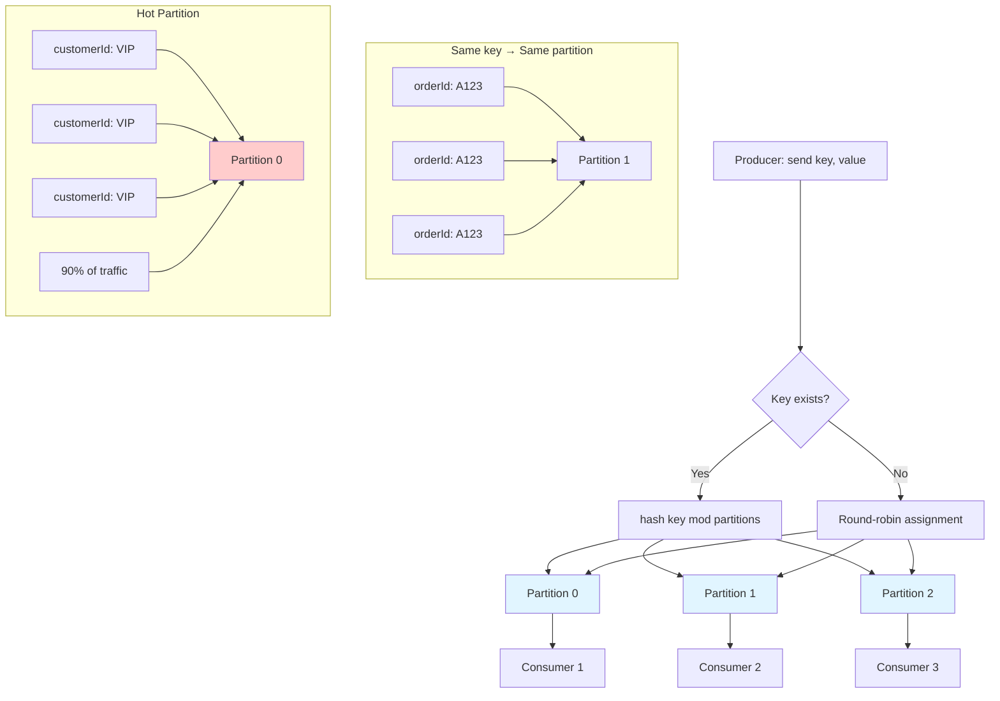
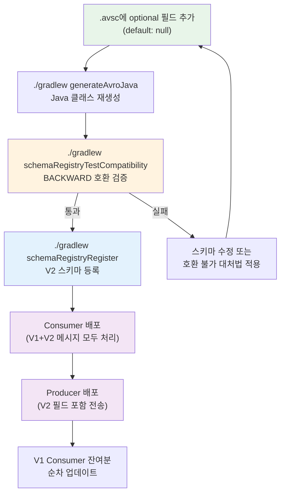

# 17. 설계와 튜닝

성능 튜닝, 메시지 키 설계, 이벤트 정의 가이드

---

## 성능 튜닝

성능 튜닝은 처리량(throughput), 지연 시간(latency), 리소스 사용량 간의 트레이드오프를 조정하는 작업이다. 각 설정의 의미와 영향을 이해해야 적절한 값을 선택할 수 있다.

### Producer 튜닝 설정 상세

**batch-size + linger.ms**: 처리량 vs 지연 시간의 핵심 트레이드오프다. `batch-size`는 한 번에 보낼 메시지의 최대 크기(바이트)를 정한다. `linger.ms`는 배치가 가득 차지 않아도 이 시간이 지나면 전송한다. 예를 들어 `batch-size=16KB`, `linger.ms=10`이면, 16KB가 차거나 10ms가 지나면 전송한다.

높은 처리량이 필요하면 `batch-size=32KB`, `linger.ms=100`처럼 크게 설정해 네트워크 왕복을 줄인다. 대신 지연 시간이 100ms 이상 증가한다. 낮은 지연 시간이 중요하면 `batch-size=1KB`, `linger.ms=0`으로 설정해 즉시 전송한다. 대신 처리량은 크게 떨어진다.

실시간 주문 시스템이라면 `linger.ms=0~5`, 로그 집계라면 `linger.ms=50~100`이 적절하다.

**compression-type**: CPU vs 네트워크 트레이드오프다. `lz4`, `snappy`, `gzip`, `zstd` 중 선택한다. 압축하면 네트워크 전송량이 줄지만 CPU 사용량이 증가한다. `lz4`는 압축 속도가 빠르고 CPU 부담이 적지만 압축률은 낮다. `gzip`은 압축률은 높지만 CPU 부담이 크다.

네트워크 대역폭이 병목이면 `gzip`, CPU가 충분하고 낮은 지연이 중요하면 `lz4`, 균형이 필요하면 `snappy`를 선택한다. 텍스트 로그는 압축률이 70~80%까지 나오므로 압축이 효과적이다. 이미 압축된 데이터(JSON 이미지 등)는 효과가 적다.

**buffer-memory**: Producer가 브로커로 전송하기 전에 메시지를 저장하는 버퍼 크기다. 기본값은 32MB다. 버퍼가 가득 차면 `send()`가 블록된다. 처리량이 높으면 64MB 이상으로 늘린다. 대신 메모리 사용량이 증가한다.

### Consumer 튜닝 설정 상세

**max-poll-records**: 한 번의 `poll()` 호출로 가져올 레코드 수다. 배치 크기와 rebalancing 위험 간의 트레이드오프다. 값이 크면 네트워크 오버헤드가 줄고 처리량이 증가한다. 하지만 처리 시간이 `max.poll.interval.ms`를 초과하면 Consumer가 죽은 것으로 간주되어 rebalancing이 발생한다.

예를 들어 메시지당 처리 시간이 10ms이고, `max.poll.interval.ms=300000`(5분)이면, `max-poll-records`는 최대 30000까지 가능하다. 하지만 실제로는 안전 마진을 두어 10000~15000 정도로 설정한다.

처리 시간이 불규칙하면 작게(100~500), 일정하면 크게(1000~5000) 설정한다.

**fetch-min-size + fetch-max-wait**: 브로커에서 최소 `fetch-min-size` 바이트가 쌓이거나, `fetch-max-wait` 시간이 지나면 데이터를 반환한다. 메시지 생산 속도가 느리면 `fetch-max-wait` 때문에 지연이 발생한다. 빠르면 `fetch-min-size`로 배치 효율이 좋아진다.

실시간성이 중요하면 `fetch-max-wait=100`, 배치 효율이 중요하면 `fetch-max-wait=500~1000`으로 설정한다.

**concurrency**: 한 Consumer Group 내에서 몇 개의 Consumer 인스턴스를 띄울지 정한다. 파티션 수 이하로 설정해야 모든 Consumer가 일을 한다. 파티션이 3개면 `concurrency=3`, 6개면 `concurrency=6`이 최적이다. 그 이상은 idle 상태가 된다.

### Producer 튜닝

```yaml
spring:
  kafka:
    producer:
      batch-size: 16384              # 16KB
      linger-ms: 10                  # 10ms 대기 후 전송
      buffer-memory: 33554432        # 32MB 버퍼
      compression-type: lz4          # 압축
```

### Consumer 튜닝

```yaml
spring:
  kafka:
    consumer:
      max-poll-records: 500          # 한 번에 가져올 레코드 수
      fetch-min-size: 1              # 최소 fetch 크기
      fetch-max-wait: 500            # 최대 대기 시간 (ms)
    listener:
      concurrency: 3                 # 파티션 수에 맞춤
```

---

## 메시지 키 설계

메시지 키는 파티션 할당과 메시지 순서를 결정하는 중요한 요소다. 잘못 설계하면 Hot Partition이 발생하거나 순서 보장이 깨진다.

### 파티션 할당과 순서 보장

Kafka는 메시지 키의 해시값으로 파티션을 결정한다. 같은 키를 가진 메시지는 항상 같은 파티션에 저장되고, 파티션 내에서는 순서가 보장된다. 다른 파티션 간의 순서는 보장되지 않는다.

예를 들어 주문 시스템에서 `orderId`를 키로 사용하면, 같은 주문의 모든 이벤트(생성, 결제, 배송)가 같은 파티션에 순서대로 저장된다. Consumer는 이벤트를 발생 순서대로 처리할 수 있다.

하지만 `customerId`를 키로 사용하면, 한 고객의 모든 주문이 같은 파티션에 몰린다. 특정 고객이 주문을 많이 하면 해당 파티션만 부하가 증가한다(Hot Partition). 파티션 간 부하가 불균형해지면 일부 Consumer만 바쁘고 나머지는 놀게 된다.

### Hot Partition 방지 전략

**1. 키 분산도 높이기**: 카디널리티(고유값 개수)가 높은 값을 키로 사용한다. `customerId`(수천 개)보다 `orderId`(수백만 개)가 분산에 유리하다. 하지만 순서 보장 범위가 좁아진다는 트레이드오프가 있다.

**2. 복합 키 사용**: `customerId + timestamp` 또는 `customerId + random`처럼 복합 키를 만들어 분산도를 높인다. 순서는 포기하지만 Hot Partition을 방지할 수 있다.

**3. 키 없이 전송**: 키를 null로 보내면 라운드 로빈으로 파티션이 할당된다. 완벽한 분산이지만 순서 보장이 전혀 안 된다. 로그 수집처럼 순서가 중요하지 않은 경우 사용한다.

**4. 파티션 수 증가**: 파티션을 늘리면 같은 키라도 여러 Consumer가 나눠 처리할 수 있다. 단, Consumer Group의 Consumer 수도 함께 늘려야 한다. 파티션은 나중에 줄일 수 없으므로 신중히 결정한다.

실무에서는 **비즈니스 도메인의 집합 단위**를 키로 사용한다. 주문 시스템이라면 `orderId`, 사용자 활동 로그라면 `userId`, 센서 데이터라면 `deviceId`가 자연스럽다. 단, Hot Entity 문제가 예상되면 복합 키나 파티션 증가를 고려한다.

### 메시지 키와 파티션 할당 플로우



---

## 이벤트 스키마 설계

### OrderEvent 예시

이 프로젝트는 Avro 기반이므로, 이벤트는 `.avsc` 스키마 파일로 정의하고 빌드 시 Java 클래스가 자동 생성된다.

```json
{
  "type": "record",
  "name": "OrderEvent",
  "namespace": "com.study.redpanda.avro",
  "doc": "Ch02: 주문 이벤트",
  "fields": [
    {"name": "eventId",     "type": "string", "doc": "이벤트 고유 ID"},
    {"name": "eventType",   "type": "string", "doc": "이벤트 유형"},
    {"name": "timestamp",   "type": {"type": "long", "logicalType": "timestamp-millis"},   "doc": "발생 시각 (epoch millis)"},
    {"name": "orderId",     "type": "string", "doc": "주문 ID"},
    {"name": "productName", "type": "string", "doc": "상품명"},
    {"name": "quantity",    "type": "int",    "doc": "수량"},
    {"name": "price",       "type": "double", "doc": "가격"}
  ]
}
```

Avro가 생성하는 `OrderEvent` 클래스는 `SpecificRecord`를 구현하며, Builder 패턴으로 인스턴스를 생성한다.

```java
// Avro Builder 패턴으로 OrderEvent 생성
OrderEvent event = OrderEvent.newBuilder()
    .setEventId(UUID.randomUUID().toString())
    .setEventType("ORDER_CREATED")
    .setTimestamp(Instant.now().toEpochMilli())
    .setOrderId("ORD-001")
    .setProductName("상품A")
    .setQuantity(2)
    .setPrice(15000.0)
    .build();
```

### 공통 필드 불일치 문제

이 프로젝트의 .avsc 파일들을 보면, 각 챕터별로 공통 필드의 구성과 네이밍이 다르다:

| 스키마 | eventId | correlationId | timestamp 타입 |
|--------|---------|---------------|---------------|
| `OrderEvent` (ch02) | O (`eventId`) | X | `timestamp-millis` |
| `SagaOrderCreated` (ch03) | X | O (`correlationId`) | `string` |
| `StatusChangeEvent` (ch05) | O (`eventId`) | O (`correlationId`) | `timestamp-millis` |

ch02는 `correlationId`가 없고, ch03은 `eventId`가 없으며, timestamp 표현 방식도 제각각이다. 학습 프로젝트라서 챕터별로 독립적으로 만들었기 때문인데, 실무에서 이런 불일치가 발생하면 Consumer 측에서 이벤트마다 다른 파싱 로직이 필요해진다.

### 공통 필드 컨벤션

Avro는 Java의 상속(`extends`)이나 interface를 지원하지 않는다. 따라서 "모든 이벤트가 반드시 포함해야 할 필드"를 강제하려면, 스키마 레벨의 상속이 아닌 **팀 컨벤션 + 검증 도구**로 관리해야 한다.

실무에서 쓰는 세 가지 접근법을 비교한다.

#### 접근법 1: 공통 필드 컨벤션 (가장 실용적)

모든 이벤트 스키마가 반드시 포함해야 할 필드 목록을 정의하고, CI에서 검증한다:

```json
{
  "type": "record",
  "name": "PaymentCompleted",
  "namespace": "com.study.redpanda.avro",
  "fields": [
    // ── 공통 필드 (모든 이벤트 필수) ──
    {"name": "eventId",       "type": "string",  "doc": "이벤트 고유 ID (UUID)"},
    {"name": "eventType",     "type": "string",  "doc": "이벤트 유형 (PAYMENT_COMPLETED)"},
    {"name": "timestamp",     "type": {"type": "long", "logicalType": "timestamp-millis"}, "doc": "발생 시각"},
    {"name": "correlationId", "type": "string",  "doc": "분산 추적 ID"},
    {"name": "source",        "type": "string",  "doc": "발행 서비스 이름"},

    // ── 도메인 필드 ──
    {"name": "paymentId",     "type": "string"},
    {"name": "orderId",       "type": "string"},
    {"name": "amount",        "type": "double"}
  ]
}
```

**공통 필드 체크리스트**:

| 필드 | 타입 | 용도 |
|------|------|------|
| `eventId` | `string` | 이벤트 고유 식별 (멱등성 키로 활용 가능) |
| `eventType` | `string` | 이벤트 유형 식별 (Consumer 라우팅) |
| `timestamp` | `long` (timestamp-millis) | 발생 시각 (epoch millis로 통일) |
| `correlationId` | `string` | 분산 추적, SAGA 흐름 연결 |
| `source` | `string` | 발행 서비스 식별 (디버깅, 감사) |

이 필드들이 이벤트 상단에 일관되게 배치되면, Consumer는 도메인과 무관하게 공통 로직(로깅, 추적, 멱등성 체크)을 통합 처리할 수 있다.

#### 접근법 2: Envelope 래퍼 스키마

공통 필드를 Envelope 레코드로 감싸고, 실제 페이로드는 `bytes`로 전달하는 방식이다:

```json
{
  "type": "record",
  "name": "EventEnvelope",
  "namespace": "com.study.redpanda.avro",
  "fields": [
    {"name": "eventId",       "type": "string"},
    {"name": "eventType",     "type": "string"},
    {"name": "timestamp",     "type": {"type": "long", "logicalType": "timestamp-millis"}},
    {"name": "correlationId", "type": "string"},
    {"name": "source",        "type": "string"},
    {"name": "payload",       "type": "bytes", "doc": "도메인 이벤트 (별도 Avro 직렬화)"}
  ]
}
```

Consumer는 Envelope을 먼저 역직렬화하여 공통 필드를 처리하고, `eventType`을 보고 `payload`를 적절한 도메인 스키마로 2차 역직렬화한다. 공통 필드가 스키마 레벨에서 강제되지만, **이중 직렬화 비용**과 **Consumer 측 라우팅 복잡도**가 증가한다. 대규모 조직에서 수백 개의 이벤트 타입을 다룰 때 주로 채택한다.

#### 접근법 3: Avro Union 타입

```json
{
  "name": "payload",
  "type": ["OrderEvent", "PaymentEvent", "ShippingEvent"]
}
```

`payload`를 Union으로 정의하면 타입 안전성이 생기지만, Union에 새 타입을 추가하는 것 자체가 스키마 변경이 되어 호환성 관리가 복잡해진다. 이벤트 타입이 자주 추가되는 환경에서는 비실용적이다.

#### 어떤 접근법을 선택할까?

| 조건 | 권장 |
|------|------|
| 서비스 5개 미만, 이벤트 타입 20개 미만 | 접근법 1 (컨벤션) |
| 대규모 조직, 공통 처리 로직 통합 필수 | 접근법 2 (Envelope) |
| 이벤트 타입이 고정적 (추가 드뭄) | 접근법 3 (Union) |

이 프로젝트 규모에서는 **접근법 1**이 적합하다. 스키마 파일 상단에 공통 필드를 동일한 순서와 타입으로 배치하는 컨벤션을 정하고, CI에서 `.avsc` 파일을 파싱하여 공통 필드 존재 여부를 검증하면 된다.

### CI 검증 스크립트 예시

```bash
#!/bin/bash
# validate-common-fields.sh
REQUIRED_FIELDS=("eventId" "eventType" "timestamp" "correlationId" "source")

for avsc in src/main/avro/**/*.avsc; do
  for field in "${REQUIRED_FIELDS[@]}"; do
    if ! jq -e ".fields[] | select(.name == \"$field\")" "$avsc" > /dev/null 2>&1; then
      echo "FAIL: $avsc is missing required field: $field"
      exit 1
    fi
  done
done
echo "All schemas contain required common fields."
```

### 실전 예시: OrderEvent V1 → V2 진화 흐름

ch02의 `OrderEvent`에 `customerEmail` 필드를 추가한다고 가정하자. BACKWARD 호환(기본값)을 유지하면서 진행하는 전체 흐름을 단계별로 정리한다.

#### 1단계: 스키마 변경

`src/main/avro/ch02/OrderEvent.avsc`에 새 필드를 추가한다. BACKWARD 호환을 유지하려면 **반드시 default 값이 있는 optional 필드**로 추가해야 한다:

```json
{
  "type": "record",
  "name": "OrderEvent",
  "namespace": "com.study.redpanda.avro",
  "doc": "Ch02: 주문 이벤트 (V2 - customerEmail 추가)",
  "fields": [
    {"name": "eventId",     "type": "string", "doc": "이벤트 고유 ID"},
    {"name": "eventType",   "type": "string", "doc": "이벤트 유형"},
    {"name": "timestamp",   "type": "long",   "doc": "발생 시각", "logicalType": "timestamp-millis"},
    {"name": "orderId",     "type": "string", "doc": "주문 ID"},
    {"name": "productName", "type": "string", "doc": "상품명"},
    {"name": "quantity",    "type": "int",    "doc": "수량"},
    {"name": "price",       "type": "double", "doc": "가격"},
    {"name": "customerEmail", "type": ["null", "string"], "default": null, "doc": "V2: 고객 이메일"}
  ]
}
```

`"type": ["null", "string"]`은 Avro Union 타입이다. `"default": null`이 있으므로, V1 스키마로 작성된 메시지를 V2 Consumer가 읽으면 `customerEmail`이 `null`로 채워진다. 이것이 BACKWARD 호환의 핵심이다.

ch10의 `SchemaEvolutionV1→V2`도 같은 패턴을 사용한다(`phone`, `age` 필드를 `["null", "string"]` + `default: null`로 추가).

#### 2단계: Java 클래스 재생성

```bash
./gradlew generateAvroJava
```

Avro Gradle Plugin이 `.avsc` 파일을 읽어 `build/generated-main-avro-java/` 아래에 `OrderEvent.java`를 재생성한다. V2 클래스에는 `getCustomerEmail()`, `setCustomerEmail()`, Builder의 `setCustomerEmail()` 메서드가 추가된다.

기존 코드는 **수정할 필요가 없다.** V1에서 사용하던 7개 필드의 getter/setter/builder 메서드는 그대로 유지된다. 새 필드를 사용하지 않는 코드는 컴파일 에러 없이 동작한다.

#### 3단계: 호환성 검증

```bash
./gradlew schemaRegistryTestCompatibility
```

이 프로젝트의 `build.gradle`이 `fileTree('src/main/avro')`로 모든 `.avsc`를 스캔하므로, 변경된 `OrderEvent.avsc`도 자동으로 검증 대상에 포함된다. Schema Registry에 등록된 기존 V1과 비교하여 BACKWARD 호환인지 확인한다.

검증이 실패하면 스키마 변경이 호환성을 깨뜨린 것이다. 예를 들어 `default` 없이 required 필드를 추가하면 실패한다(호환 불가 대처법은 [15-schema-registry-strategy.md](./15-schema-registry-strategy.md#호환-불가-변경이-필요할-때) 참조).

#### 4단계: 스키마 등록

```bash
./gradlew schemaRegistryRegister
```

Schema Registry에 `OrderEvent-value` subject의 새 버전으로 V2 스키마가 등록된다. 이 시점부터 V1과 V2 두 버전이 Registry에 공존한다. Consumer는 메시지에 포함된 schema ID로 어떤 버전으로 역직렬화할지 자동 판단한다.

#### 5단계: Producer 코드 수정

`OrderProducer.java`에서 새 필드를 채워 보내도록 수정한다:

```java
// V2: customerEmail 포함
OrderEvent event = OrderEvent.newBuilder()
    .setEventId(UUID.randomUUID().toString())
    .setEventType("ORDER_CREATED")
    .setTimestamp(Instant.now().toEpochMilli())
    .setOrderId("ORD-001")
    .setProductName("상품A")
    .setQuantity(2)
    .setPrice(15000.0)
    .setCustomerEmail("user@example.com")  // V2 필드
    .build();
```

`setCustomerEmail()`을 호출하지 않아도 `default: null`에 의해 `null`이 들어간다. 기존 Producer 코드가 즉시 깨지지 않으므로, 모든 Producer를 동시에 배포할 필요가 없다.

#### 6단계: Consumer 코드 수정

`OrderConsumer.java`는 두 가지 상황을 처리해야 한다:

```java
@KafkaListener(topics = "chapter2.orders", groupId = "order-consumer-group")
public void consume(@Payload OrderEvent event, ...) {
    // V1 메시지: customerEmail == null
    // V2 메시지: customerEmail == "user@example.com"
    String email = event.getCustomerEmail();  // null 또는 값
    if (email != null) {
        log.info("Customer email: {}", email);
    }
}
```

V2 Consumer가 V1 메시지를 읽으면 `customerEmail`은 `null`이다(default 값). V2 메시지를 읽으면 실제 값이 들어온다. null 체크만 하면 V1/V2 메시지를 모두 처리할 수 있다.

#### 7단계: 배포 순서

BACKWARD 호환이므로 **Consumer를 먼저 배포**한다:

```
1. Consumer 배포 (V2 스키마 적용)
   → V1 메시지를 읽어도 default: null로 처리
   → V2 메시지를 읽으면 새 필드 활용

2. Producer 배포 (V2 스키마 적용)
   → 새 필드 포함하여 전송 시작
```

Consumer가 먼저 V2로 올라가도 토픽에 남아있는 V1 메시지를 정상 처리한다. 반대로 FORWARD 호환이면 Producer를 먼저 배포한다(기존 Consumer가 모르는 필드를 무시하므로).

#### 전체 흐름 요약



핵심은 **스키마 변경 → 빌드 → 검증 → 등록 → 배포** 순서를 반드시 지키는 것이다. 이 흐름 중 하나라도 건너뛰면 런타임 역직렬화 실패가 발생한다.

---

## 토픽/스키마 통합 관리

토픽과 스키마는 독립적으로 관리되지만, 실제로는 강하게 연결된다. 토픽에 메시지를 보내면 Schema Registry에 subject가 생기고, subject 이름이 토픽 이름에서 파생되기 때문이다.

### Subject 네이밍 전략

Schema Registry의 subject 이름은 **네이밍 전략(SubjectNameStrategy)**에 의해 결정된다. 세 가지 전략이 있으며, 토픽과 스키마의 관계를 정의한다.

**TopicNameStrategy (기본값)** — subject 이름이 `{토픽명}-key`, `{토픽명}-value`로 결정된다.

```
토픽: orders          → subject: orders-key, orders-value
토픽: order-events    → subject: order-events-key, order-events-value
```

한 토픽에 하나의 스키마만 허용된다. 가장 단순하고, 대부분의 프로젝트에서 충분하다. 이 프로젝트의 Gradle Plugin 설정(`fileTree`로 `{파일명}-value` 생성)도 이 전략을 따른다.

**RecordNameStrategy** — subject 이름이 Avro 레코드의 `{namespace}.{name}`으로 결정된다.

```
OrderEvent.avsc (namespace: com.study.redpanda.avro)
  → subject: com.study.redpanda.avro.OrderEvent
```

한 토픽에 여러 스키마를 보낼 수 있다. 이벤트 소싱에서 하나의 aggregate 토픽에 다양한 이벤트 타입을 저장할 때 유용하다. 다만 토픽과 subject의 연결이 느슨해져 관리가 복잡해진다.

**TopicRecordNameStrategy** — 둘을 조합하여 `{토픽명}-{namespace}.{name}`으로 결정된다.

```
토픽: orders + OrderEvent.avsc
  → subject: orders-com.study.redpanda.avro.OrderEvent
```

한 토픽에 여러 스키마를 허용하면서도 토픽별로 호환성을 분리 관리할 수 있다. 가장 유연하지만 subject 이름이 길어진다.

### Spring Boot 설정

```yaml
spring:
  kafka:
    producer:
      properties:
        # 기본값은 TopicNameStrategy (변경할 때만 설정)
        value.subject.name.strategy: io.confluent.kafka.serializers.subject.TopicNameStrategy
        # RecordNameStrategy로 변경 시:
        # value.subject.name.strategy: io.confluent.kafka.serializers.subject.RecordNameStrategy
```

### 전략 선택 기준

| 조건 | 전략 | 이유 |
|------|------|------|
| 토픽 1개 = 이벤트 타입 1개 | TopicNameStrategy | 단순, 직관적 |
| 토픽 1개에 여러 이벤트 타입 | RecordNameStrategy | 스키마별 독립 진화 |
| 여러 토픽에 같은 이벤트 타입 | TopicRecordNameStrategy | 토픽별 호환성 분리 |

이 프로젝트처럼 챕터별로 토픽과 이벤트가 1:1 매핑되는 구조에서는 **TopicNameStrategy**가 적합하다. `OrderEvent`는 `orders` 토픽에만, `SagaOrderCreated`는 `saga-order-created` 토픽에만 전송하므로, 토픽 이름만으로 어떤 스키마인지 식별할 수 있다.

### 토픽-스키마 생명주기 동기화

토픽과 스키마는 별개 시스템에서 관리되지만, 생명주기가 연동되어야 한다:

```
[생성 순서]
  1. Schema Registry에 스키마 등록 (CI/CD)
  2. 브로커에 토픽 생성 (KafkaAdmin 또는 IaC)
  3. 앱 배포 (Producer/Consumer 시작)

[삭제 순서 — 역순]
  1. 모든 Consumer 중단
  2. Producer 중단 (메시지 유입 차단)
  3. 토픽 데이터 소진 확인 후 토픽 삭제
  4. Schema Registry에서 subject 삭제 (soft → hard)
```

스키마가 먼저 등록되어야 하는 이유는, 프로덕션에서 앱이 시작될 때 스키마를 조회하기 때문이다(프로덕션 등록 전략은 [15-schema-registry-strategy.md](./15-schema-registry-strategy.md) 참조). 토픽이 먼저 있어도 스키마가 없으면 Producer가 메시지를 직렬화할 수 없다. 반대로 삭제 시에는 토픽에 남은 데이터를 읽는 Consumer가 스키마를 참조하므로, 스키마를 토픽보다 먼저 삭제하면 역직렬화 실패가 발생한다.
