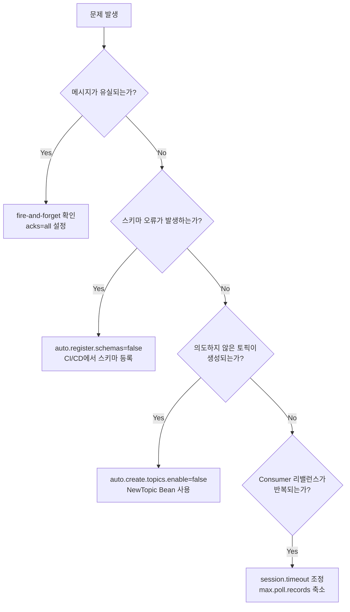
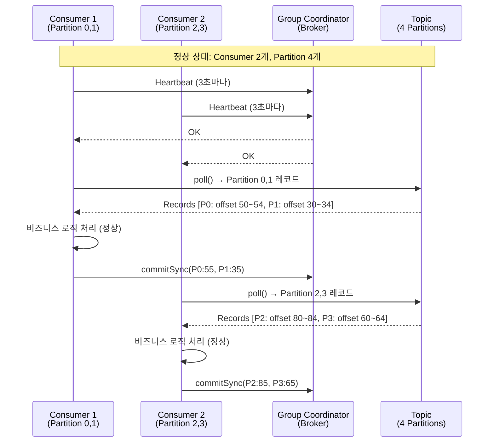
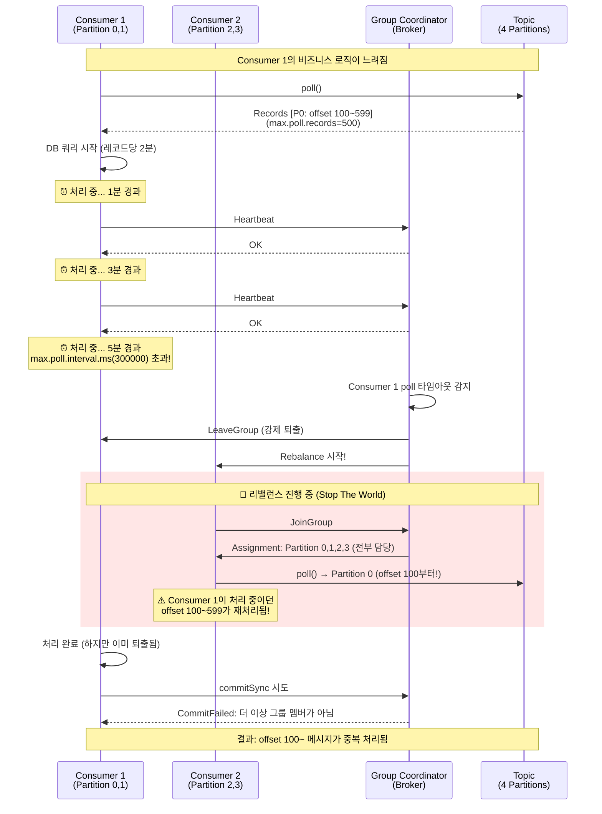
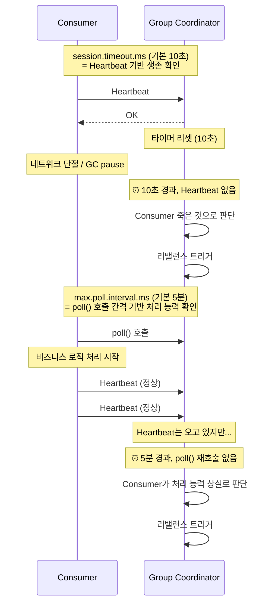

# 18. Anti-Patterns & Troubleshooting

Spring Kafka 설정 안티패턴 + Consumer 리밸런스 트러블슈팅

---

## 트러블슈팅 결정 트리

문제 발생 시 아래 흐름에 따라 원인을 좁혀간다.



---

## 1. auto-commit과 수동 처리 혼용

```java
// ❌ 잘못된 예시
spring:
  kafka:
    consumer:
      enable-auto-commit: true  // 자동 커밋 활성화

@KafkaListener(topics = "orders")
public void handle(OrderEvent event) {
    orderService.process(event);  // 예외 발생 가능
}
```

**문제:** 자동 커밋이 5초마다 발생하는데, 비즈니스 로직이 3초 후 예외를 던지면 이미 오프셋이 커밋되었을 수 있습니다. 메시지가 유실됩니다.

**해결:** `enable-auto-commit: false`로 설정하고 `ack-mode: manual`로 수동 커밋합니다.

```java
// ✅ 올바른 예시
@KafkaListener(topics = "orders")
public void handle(OrderEvent event, Acknowledgment ack) {
    try {
        orderService.process(event);
        ack.acknowledge();  // 성공 시에만 커밋
    } catch (Exception e) {
        log.error("Processing failed, will retry", e);
        // 커밋하지 않음 → 재시도
    }
}
```

## 2. 프로덕션에서 auto.register.schemas=true 사용

```yaml
# ❌ 프로덕션에서 위험
spring:
  kafka:
    producer:
      properties:
        auto.register.schemas: true
```

**문제:** 개발자가 실수로 호환되지 않는 스키마를 배포하면 Schema Registry에 자동 등록되어 Consumer가 역직렬화에 실패합니다. 프로덕션에서는 스키마 변경이 CI/CD 파이프라인을 통해 검증된 후에만 등록되어야 합니다.

**해결:** 프로덕션에서는 `auto.register.schemas: false`로 설정하고, CI/CD에서 `curl`이나 Maven/Gradle 플러그인으로 스키마를 사전 등록합니다.

```yaml
# ✅ 안전한 설정
spring:
  kafka:
    producer:
      properties:
        auto.register.schemas: false
        use.latest.version: true         # Registry에서 최신 스키마 ID 자동 조회
```

## 3. 프로덕션에서 토픽 자동 생성 의존

```java
// ❌ 프로덕션에서 위험
kafkaTemplate.send("new-topic-123", message);
// Redpanda가 auto.create.topics.enable=true면 토픽이 자동 생성됨
```

**문제:** 토픽 이름 오타가 있으면 잘못된 토픽이 생성됩니다. 파티션/복제 설정이 기본값(1 파티션, 1 복제)으로 생성되어 프로덕션 요구사항을 만족하지 못합니다.

**해결:** 프로덕션 Redpanda는 `auto.create.topics.enable=false`로 설정하고, `NewTopic` Bean으로 명시적으로 생성합니다. CI/CD 파이프라인에서 `rpk topic create`로 토픽을 생성하는 것도 좋은 방법입니다.

```yaml
# Redpanda 설정
auto_create_topics_enabled: false
```

```java
// ✅ 명시적 토픽 생성
@Bean
public NewTopic ordersTopic() {
    return TopicBuilder.name("orders")
        .partitions(10)
        .replicas(3)
        .build();
}
```

## 4. Fire-and-Forget in Production

프로덕션에서 `kafkaTemplate.send()`를 호출하고 결과를 무시하는 패턴이다.

```java
// 안티패턴
kafkaTemplate.send("orders", event);  // 결과 확인 안 함
```

**문제:** 네트워크 장애, 브로커 다운, 직렬화 오류 등이 발생해도 알 수 없다. 메시지가 조용히 사라진다. 최소한 콜백으로 실패를 로깅하거나, 중요한 메시지는 동기 전송으로 예외를 받아야 한다.

```java
// 개선
kafkaTemplate.send("orders", event)
    .whenComplete((result, ex) -> {
        if (ex != null) {
            log.error("Message lost: {}", event, ex);
            // 알림, 재시도 큐 등
        }
    });
```

## 5. 무한 재시도

에러 핸들러에서 재시도 횟수를 제한하지 않는 패턴이다.

```java
// 안티패턴
new DefaultErrorHandler(recoverer, new FixedBackOff(1000L, Long.MAX_VALUE));
```

**문제:** 일시적 장애는 재시도로 해결되지만, 영구적 장애(잘못된 데이터, 코드 버그)는 무한 재시도해도 성공하지 않는다. Consumer가 같은 메시지에 계속 막혀 다음 메시지를 처리하지 못한다(poison pill). 재시도 횟수를 제한하고, Dead Letter Topic으로 보내 수동 처리해야 한다.

```java
// 개선
new DefaultErrorHandler(recoverer, new FixedBackOff(1000L, 3));  // 최대 3회
```

## 6. ACK 없는 Consumer

Consumer에서 메시지를 처리하지만 ACK를 호출하지 않는 패턴이다.

```java
// 안티패턴
@KafkaListener(topics = "orders", groupId = "order-service")
public void consume(OrderEvent event) {
    processOrder(event);
    // ACK 없음
}
```

**문제:** 자동 ACK 모드가 아니면 offset이 커밋되지 않는다. Consumer 재시작 시 같은 메시지를 계속 가져온다. 처리는 반복되지만 진행은 안 된다. 수동 ACK를 사용한다면 반드시 성공 시 `ack.acknowledge()`를 호출해야 한다.

```java
// 개선
@KafkaListener(topics = "orders", groupId = "order-service")
public void consume(OrderEvent event, Acknowledgment ack) {
    processOrder(event);
    ack.acknowledge();  // 필수
}
```

---

## Consumer 리밸런스와 메시지 중복 소비 시퀀스

Consumer Group의 리밸런스는 프로덕션에서 가장 빈번하게 겪는 문제입니다. `max.poll.interval.ms` 초과, 세션 타임아웃, Consumer 추가/제거 시 리밸런스가 발생하며, 이 과정에서 메시지 중복 소비가 일어날 수 있습니다.

### 정상 동작 시퀀스



### 리밸런스 발생 시퀀스 (max.poll.interval.ms 초과)



### session.timeout.ms vs max.poll.interval.ms 비교



### 핵심 설정 관계

| 설정 | 기본값 | 역할 | 조정 기준 |
|------|--------|------|----------|
| `session.timeout.ms` | 10,000ms | Consumer 생존 확인 | 네트워크 안정성에 따라 |
| `heartbeat.interval.ms` | 3,000ms | 생존 신호 주기 | `session.timeout`의 1/3 이하 |
| `max.poll.interval.ms` | 300,000ms | 처리 능력 확인 | `max.poll.records × 레코드당 처리 시간` 기반 |
| `max.poll.records` | 500 | 한 번에 가져올 최대 레코드 수 | 비즈니스 로직 처리 시간 기반 |

**공식**: `max.poll.interval.ms > max.poll.records × 레코드당_최대_처리_시간`

예를 들어 레코드당 처리 시간이 100ms이고 `max.poll.records=500`이면:
- 최대 처리 시간 = 500 × 100ms = 50초
- `max.poll.interval.ms`는 최소 50초 이상 + 여유분(2배) = 100초 이상 권장

사람인 사례처럼 레코드당 2분이 걸리는 경우:
- `max.poll.records=2`로 줄이고
- `max.poll.interval.ms=600000`(10분)으로 설정하여 해결
