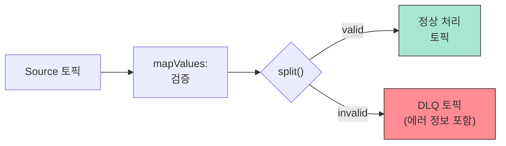
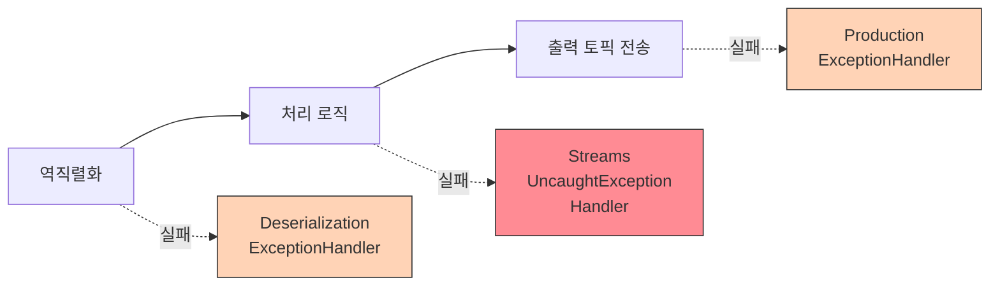

# 23. Kafka Streams + Spring Boot 통합

Kafka Streams DSL 연산, 조인, 윈도우, 에러 처리를 Spring Boot에서 구현하는 방법을 다룬다.

---

---

## 1. @KafkaListener vs Kafka Streams 판단 가이드

> **개념적 판단 기준**(비교 표, 플로우차트, 마이그레이션 신호, State Store ≠ DB)은 [09-kafka-streams/01-stream-processing § 9](../09-kafka-streams/01-stream-processing.md#9-kafkalistener-vs-kafka-streams-판단-가이드)로 이동했다. 이 섹션에서는 Spring Boot에서 두 모델을 공존시키는 **구현 패턴**에 집중한다.

### 두 모델 공존 패턴

하나의 Spring Boot 애플리케이션에서 `@KafkaListener`와 Kafka Streams를 동시에 사용할 수 있다. Stateless 처리(알림 발송, 로깅)는 `@KafkaListener`로, Stateful 집계(카운트, 합계, 윈도우)는 Kafka Streams로 분리하면 각각의 강점을 활용할 수 있다.

```java
@Configuration
@EnableKafkaStreams  // Streams 활성화
public class HybridConfig {
    // Kafka Streams: Stateful 집계
    @Bean
    public KStream<String, OrderEvent> orderAggregation(StreamsBuilder builder) {
        KTable<String, Long> counts = builder
            .<String, OrderEvent>stream("orders")
            .groupByKey()
            .count(Materialized.as("order-count-store"));

        counts.toStream().to("order-counts",
            Produced.with(Serdes.String(), Serdes.Long()));
        return builder.stream("orders");
    }
}

@Component
public class NotificationListener {
    // @KafkaListener: Stateless 알림 발송
    @KafkaListener(topics = "order-counts")
    public void onOrderCount(@Header(KafkaHeaders.RECEIVED_KEY) String userId,
                             @Payload Long count) {
        if (count % 100 == 0) {
            notificationService.send(userId, count + "번째 주문 감사합니다!");
        }
    }
}
```

주의: 두 모델이 **같은 Consumer Group**을 공유하면 안 된다. Kafka Streams는 자체 Consumer Group(`application.id`)을 사용하므로, `@KafkaListener`의 `group-id`와 겹치지 않도록 설정해야 한다.

---

## 2. Spring Boot 설정

### @EnableKafkaStreams와 StreamsBuilderFactoryBean

`@EnableKafkaStreams`를 선언하면 두 가지가 자동으로 등록된다.

1. **StreamsBuilderFactoryBean**: `StreamsBuilder`의 라이프사이클(생성, 시작, 종료)을 Spring이 관리한다.
2. **StreamsBuilder 빈**: 생성자 주입으로 받아 토폴로지를 정의할 수 있다.

순수 Kafka Streams API에서는 `StreamsBuilder`로 토폴로지를 정의한 뒤, `KafkaStreams` 인스턴스를 직접 생성하고 `start()`/`close()`를 호출해야 한다. Spring Boot에서는 이 과정이 전부 자동화된다.

```java
// 순수 API: 직접 생성, 시작, 종료
StreamsBuilder builder = new StreamsBuilder();
// ... 토폴로지 정의 ...
KafkaStreams streams = new KafkaStreams(builder.build(), props);
streams.start();
Runtime.getRuntime().addShutdownHook(new Thread(streams::close));

// Spring Boot: @EnableKafkaStreams 선언만으로 위 과정이 자동화됨
@Configuration
@EnableKafkaStreams
public class StreamsAppConfig {
    // StreamsBuilder는 Spring이 자동 생성하여 빈으로 등록
}
```

### KafkaStreamsConfiguration 빈 등록

`@EnableKafkaStreams`를 사용하려면 `defaultKafkaStreamsConfig`라는 이름의 빈을 등록해야 한다. 이 이름이 정확히 일치해야 Spring Kafka가 `KafkaStreams` 인스턴스를 생성한다.

```java
@Bean(name = KafkaStreamsDefaultConfiguration.DEFAULT_STREAMS_CONFIG_BEAN_NAME)
public KafkaStreamsConfiguration kStreamsConfig() {
    Map<String, Object> props = new HashMap<>();
    props.put(StreamsConfig.APPLICATION_ID_CONFIG, "my-streams-app");
    props.put(StreamsConfig.BOOTSTRAP_SERVERS_CONFIG, bootstrapServers);
    props.put(StreamsConfig.DEFAULT_KEY_SERDE_CLASS_CONFIG, Serdes.StringSerde.class);
    props.put("schema.registry.url", schemaRegistryUrl);
    props.put("specific.avro.reader", true);
    props.put(ConsumerConfig.AUTO_OFFSET_RESET_CONFIG, "earliest");
    return new KafkaStreamsConfiguration(props);
}
```

각 속성의 역할은 다음과 같다.

| 속성 | 값 예시 | 역할 |
|------|---------|------|
| `APPLICATION_ID_CONFIG` | `"my-streams-app"` | Kafka Streams 앱의 고유 식별자. Consumer Group ID로도 사용되며, 내부 토픽(changelog, repartition)의 접두사가 된다. |
| `BOOTSTRAP_SERVERS_CONFIG` | `"localhost:19092"` | Kafka/Redpanda 브로커 주소 |
| `DEFAULT_KEY_SERDE_CLASS_CONFIG` | `Serdes.StringSerde.class` | 키의 기본 직렬화 방식 |
| `schema.registry.url` | `"http://localhost:18081"` | Avro Schema Registry 주소. SpecificAvroSerde가 스키마를 조회하는 데 사용한다. |
| `specific.avro.reader` | `true` | `true`면 SpecificRecord(생성 클래스), `false`면 GenericRecord(Map 형태)로 역직렬화한다. |
| `AUTO_OFFSET_RESET_CONFIG` | `"earliest"` | `earliest` 필수: 처음 기동 시 모든 이벤트를 읽어야 State Store를 완전히 재구성할 수 있다. |

### application.yml 대안

Java 빈 대신 application.yml로도 설정할 수 있다. 둘 다 사용할 경우 Java 빈이 우선한다.

```yaml
spring:
  kafka:
    bootstrap-servers: localhost:19092
    streams:
      application-id: my-streams-app
      properties:
        schema.registry.url: http://localhost:18081
        specific.avro.reader: true
        default.key.serde: org.apache.kafka.common.serialization.Serdes$StringSerde
        default.value.serde: io.confluent.kafka.streams.serdes.avro.SpecificAvroSerde
```

### 토폴로지 등록: @Bean vs @Component 패턴

토폴로지를 등록하는 방법은 두 가지다.

```java
// 패턴 A: @Bean 리턴
@Configuration
public class OrderStreamsConfig {
    @Bean
    public KStream<String, Event> topology(StreamsBuilder builder) {
        // 토폴로지 정의 + KStream 반환
        return builder.stream("events");
    }
}

// 패턴 B: @Component + 생성자 주입 (토폴로지를 독립 클래스로 분리)
@Component
public class OrderStreamTopology {
    public OrderStreamTopology(StreamsBuilder builder) {
        // 생성자에서 토폴로지 정의 (반환값 없음)
        builder.stream("orders")
               .groupByKey()
               .aggregate(/* ... */);
    }
}
```

패턴 B의 장점은 **토폴로지를 독립된 클래스로 분리**할 수 있다는 점이다. `OrderStreamTopology`와 `InventoryStreamTopology`처럼 도메인별로 나누면 단일 책임 원칙을 지킬 수 있다. 생성자 주입으로 `StreamsBuilder`를 받으면 Spring이 빈 초기화 과정에서 자동으로 주입하므로, 모든 토폴로지가 하나의 `StreamsBuilder`에 등록된다.

> **실습 코드** — `cqrs/query/topology/PostsStreamTopology.java`
>
> CQRS 프로젝트에서는 패턴 B를 사용하되 `@PostConstruct`로 토폴로지를 등록한다. 생성자에서 `StreamsBuilder`를 주입받고, `@PostConstruct`에서 토폴로지를 구성하는 방식이다. 이렇게 하면 `SchemaRegistryUrl` 같은 `@Value` 필드가 주입된 이후 시점에 토폴로지를 빌드할 수 있다.
>
> ```java
> @Component
> public class PostsStreamTopology {
>     private final StreamsBuilder streamsBuilder;
>     private final String schemaRegistryUrl;
>
>     // 생성자 주입: Spring이 StreamsBuilder 빈과 Schema Registry URL을 주입
>     public PostsStreamTopology(
>             StreamsBuilder streamsBuilder,
>             @Value("${spring.kafka.producer.properties.schema.registry.url}") String schemaRegistryUrl) {
>         this.streamsBuilder = streamsBuilder;
>         this.schemaRegistryUrl = schemaRegistryUrl;
>     }
>
>     // @PostConstruct: @Value 필드 주입이 완료된 이후 시점에 토폴로지를 빌드
>     @PostConstruct
>     public void buildTopology() {
>         // 1) Serde 준비 — Avro value용 (CqrsSerdeFactory로 중복 제거)
>         SpecificAvroSerde<SpecificRecord> avroSerde =
>                 CqrsSerdeFactory.createAvroValueSerde(schemaRegistryUrl);
>
>         // 2) Consumed 설정 — 토픽에서 읽을 때 key=String, value=Avro로 역직렬화
>         Consumed<String, SpecificRecord> consumed =
>                 Consumed.with(Serdes.String(), avroSerde);
>
>         // 3) 토픽별 스트림 생성 — 1 토픽 1 이벤트 원칙
>         //    CqrsTopics 상수 클래스로 토픽명 중앙 관리
>         KStream<String, SpecificRecord> created =
>                 streamsBuilder.stream(CqrsTopics.POST_CREATED, consumed);
>         KStream<String, SpecificRecord> liked =
>                 streamsBuilder.stream(CqrsTopics.POST_LIKED, consumed);
>
>         // 4) merge → groupByKey → aggregate → state store
>         //    merge: 두 토픽을 하나의 스트림으로 합침 (타입이 SpecificRecord로 소실)
>         //    groupByKey: postId(파티션 키) 기준 그룹핑 — repartition 없음
>         //    aggregate: instanceof로 이벤트 타입 분기 → PostView 집계
>         //    Materialized: State Store 이름 + value Serde 지정 (입력 Avro, 저장 JSON)
>         created.merge(liked)
>                 .groupByKey()
>                 .aggregate(
>                         () -> null,           // 초기값: 첫 이벤트 도착 전까지 null
>                         this::applyPostEvent, // 집계 함수 (메서드 레퍼런스)
>                         Materialized.<String, PostView, KeyValueStore<Bytes, byte[]>>
>                                 as("posts-store")
>                                 .withKeySerde(Serdes.String())
>                                 .withValueSerde(new JsonSerde<>(PostView.class))
>                 );
>     }
> }
> ```
>
> `PostsStreamTopology`와 `FollowsStreamTopology` 두 개의 독립 클래스가 같은 `StreamsBuilder`에 등록되어, 하나의 Kafka Streams 인스턴스에서 두 토폴로지가 동시에 실행된다.

### Topology 시각화

디버깅이나 문서화를 위해 토폴로지 구조를 텍스트로 출력할 수 있다.

```java
@Bean
public CommandLineRunner printTopology(StreamsBuilderFactoryBean factoryBean) {
    return args -> {
        Topology topology = factoryBean.getTopology();
        log.info("Topology:\n{}", topology.describe());
    };
}
```

출력 예시:

```
Topologies:
   Sub-topology: 0
    Source: KSTREAM-SOURCE-0000000000 (topics: [orders])
      --> KSTREAM-AGGREGATE-0000000002
    Processor: KSTREAM-AGGREGATE-0000000002 (stores: [order-count-store])
      --> none
      <-- KSTREAM-SOURCE-0000000000
```

---

## 3. Serde (Serializer/Deserializer)

Kafka Streams에서 Serde는 **토폴로지의 각 단계에서 직렬화/역직렬화 방식을 지정**하는 역할을 한다. 기본 타입은 내장 Serde를 쓰고, 도메인 객체는 직접 구현해야 한다.

### 기본 Serde

```java
Serdes.String()   // String
Serdes.Long()     // Long
Serdes.Integer()  // Integer
Serdes.ByteArray() // byte[]
```

### JSON Serde 커스텀 구현

프로젝트에서 도메인 객체를 JSON으로 직렬화하려면 `Serde<T>` 인터페이스를 구현한다.

```java
public class JsonSerde<T> implements Serde<T> {
    private final ObjectMapper mapper = new ObjectMapper();
    private final Class<T> type;

    public JsonSerde(Class<T> type) { this.type = type; }

    @Override
    public Serializer<T> serializer() {
        return (topic, data) -> {
            try { return mapper.writeValueAsBytes(data); }
            catch (Exception e) { throw new SerializationException(e); }
        };
    }

    @Override
    public Deserializer<T> deserializer() {
        return (topic, data) -> {
            try { return mapper.readValue(data, type); }
            catch (Exception e) { throw new SerializationException(e); }
        };
    }
}

// 사용 예시
Materialized.<String, Post, KeyValueStore<Bytes, byte[]>>as("posts-store")
    .withKeySerde(Serdes.String())
    .withValueSerde(new JsonSerde<>(Post.class));
```

### SpecificAvroSerde (Avro + Schema Registry)

Avro를 사용하면 Confluent의 `SpecificAvroSerde`를 사용한다. Schema Registry와 통합되어 호환성 검증까지 자동으로 수행한다는 점에서 JsonSerde와 근본적으로 다르다.

| 항목 | JsonSerde | SpecificAvroSerde |
|------|-----------|-------------------|
| **직렬화 포맷** | JSON (텍스트) | Avro (바이너리) |
| **스키마 검증** | 없음 (POJO 필드 불일치 시 런타임 에러) | Schema Registry에서 호환성 자동 검증 |
| **클래스 생성** | 수동 POJO 작성 | `.avsc`에서 빌드 플러그인이 자동 생성 |
| **크기** | 필드명 포함으로 큼 | 바이너리 인코딩으로 작음 |
| **의존성** | Spring Kafka 내장 | `io.confluent:kafka-streams-avro-serde` 별도 추가 |

#### configure() 메서드는 필수

`SpecificAvroSerde`는 생성 직후 `configure()`를 반드시 호출해야 한다. Schema Registry URL과 역직렬화 옵션을 주입하는 과정이다. 이 호출을 빠뜨리면 Schema Registry에 연결할 수 없어 직렬화/역직렬화가 실패한다.

```java
SpecificAvroSerde<SpecificRecord> avroSerde = new SpecificAvroSerde<>();
avroSerde.configure(
    Map.of(
        "schema.registry.url", schemaRegistryUrl,
        "specific.avro.reader", true
    ),
    false  // isKey: false면 value serde, true면 key serde
);
```

세 번째 파라미터 `isKey`는 이 Serde가 키용인지 값용인지를 구분한다. 대부분의 경우 key는 `Serdes.String()`을 쓰고 value만 Avro를 쓰므로 `false`가 된다.

`isKey`에 따라 Schema Registry subject 이름이 달라진다. `false`면 `-value` suffix, `true`면 `-key` suffix가 붙는다. Schema Registry는 subject 단위로 호환성을 관리하므로 key/value subject가 분리되어야 한다. 또한 Confluent 직렬화기가 읽는 설정 prefix도 `isKey`에 따라 `value.*` 또는 `key.*`로 달라진다.

> **실습 코드** — `cqrs/config/CqrsSerdeFactory.java`
>
> CQRS 프로젝트에서는 두 토폴로지에서 동일한 Avro Serde 생성 로직이 중복되어 있었다. 이를 유틸리티 클래스로 추출하여 한 곳에서 관리한다.
>
> ```java
> @UtilityClass
> public class CqrsSerdeFactory {
>     public static <T extends SpecificRecord> SpecificAvroSerde<T> createAvroValueSerde(
>             String schemaRegistryUrl) {
>         SpecificAvroSerde<T> serde = new SpecificAvroSerde<>();
>         serde.configure(
>                 Map.of(
>                         "schema.registry.url", schemaRegistryUrl,
>                         "specific.avro.reader", true
>                 ),
>                 false  // isKey=false → value serde (subject에 "-value" suffix 적용)
>         );
>         return serde;
>     }
> }
> ```
>
> 토폴로지에서는 `CqrsSerdeFactory.createAvroValueSerde(schemaRegistryUrl)`로 호출한다.

#### 입력 Serde ≠ 출력 Serde 혼합 패턴

토픽에서 읽을 때는 Avro, State Store에 쓸 때는 JSON을 사용하는 경우가 있다. 입력 이벤트는 Producer가 Avro로 발행했고, State Store 값은 Avro 생성 클래스가 아닌 직접 작성한 POJO일 때 이 패턴이 자연스럽다.

```java
// 입력: Avro (SpecificAvroSerde)
KStream<String, SpecificRecord> stream = builder.stream(
    "order.events",
    Consumed.with(Serdes.String(), avroSerde)
);

// 출력: JSON (JsonSerde) → State Store
stream.groupByKey().aggregate(
    () -> null,
    (key, event, view) -> { /* Avro 이벤트 → OrderView 변환 */ },
    Materialized.<String, OrderView, KeyValueStore<Bytes, byte[]>>as("orders-store")
        .withKeySerde(Serdes.String())
        .withValueSerde(new JsonSerde<>(OrderView.class))
);
```

### 한 토픽 다중 Avro 타입 (instanceof 분기)

`TopicRecordNameStrategy`를 사용하면 하나의 토픽에 여러 Avro 타입이 공존한다. Consumer 측에서는 `SpecificRecord`(모든 Avro 생성 클래스의 부모)로 선언하고 `instanceof`로 분기한다.

```java
KStream<String, SpecificRecord> stream = builder.stream(
    "order.events",
    Consumed.with(Serdes.String(), avroSerde)
);

stream.groupByKey().aggregate(
    () -> null,
    (orderId, event, currentView) -> {
        if (event instanceof OrderCreated created) {
            return new OrderView(created.getOrderId(), created.getAmount());
        } else if (event instanceof OrderPaid paid) {
            if (currentView == null) return null;  // 순서 역전 방어
            currentView.setPaid(true);
            return currentView;
        }
        return currentView;  // 알 수 없는 타입은 무시
    },
    Materialized.as("orders-store")
);
```

순서 역전 방어(`currentView == null` 체크)를 빠뜨리면 NPE가 발생한다. 파티션 재배치 등으로 `OrderPaid`가 `OrderCreated`보다 먼저 도착할 수 있기 때문이다.

> **실습 코드와의 관계** — 토픽 1:1 분리 후에도 instanceof가 필요한 이유
>
> CQRS 프로젝트에서는 1 토픽 N 이벤트 방식 대신 **토픽 1 이벤트 1** 원칙으로 분리했다(`social.events.post-created`, `social.events.post-liked`). 하지만 하나의 State Store에 집계하려면 `merge()`로 두 스트림을 합쳐야 하고, merge 후 타입이 `SpecificRecord`로 소실되므로 `instanceof` 분기가 여전히 필요하다.
>
> ```java
> // 토픽별 스트림 생성 (각각 단일 이벤트 타입)
> KStream<String, SpecificRecord> created = streamsBuilder.stream(CqrsTopics.POST_CREATED, consumed);
> KStream<String, SpecificRecord> liked = streamsBuilder.stream(CqrsTopics.POST_LIKED, consumed);
>
> // merge 후 타입 정보 소실 → instanceof 필요
> created.merge(liked)
>         .groupByKey()
>         .aggregate(() -> null, this::applyPostEvent, ...);
> ```
>
> instanceof 없이 하려면 merge 대신 `process()`로 각 스트림이 같은 State Store에 독립 접근하는 방식이 있으나, Processor 클래스가 이벤트 타입당 1개씩 필요해서 코드가 복잡해진다.

---

## 4. DSL 연산 카탈로그

Kafka Streams DSL은 Stateless 연산과 Stateful 연산으로 나뉜다. Stateless는 이전 이벤트의 상태 없이 현재 이벤트만 처리하고, Stateful은 State Store에 중간 결과를 유지하면서 처리한다.

### 4.1 Stateless 연산

#### filter — 조건에 맞는 이벤트만 통과

```java
KStream<String, Order> highValue = orders
    .filter((key, order) -> order.getAmount() >= 10_000);
```

불필요한 이벤트를 초기에 제거하여 하류 처리 부하를 줄인다.

#### mapValues — 값만 변환 (키 유지)

```java
KStream<String, OrderSummary> summaries = orders
    .mapValues(order -> new OrderSummary(order.getId(), order.getAmount()));
```

**왜 mapValues가 map보다 낫는가**: `map()`은 키를 변경할 수 있으므로 **repartition을 유발**한다. 키가 바뀌면 파티션 할당이 변하므로 내부 토픽에 데이터를 재전송해야 한다. 키를 바꿀 필요가 없다면 반드시 `mapValues()`를 사용해야 한다.

#### flatMapValues — 하나의 이벤트를 여러 개로 분리

```java
// 주문 안의 아이템 하나하나를 별도 이벤트로 분리
KStream<String, OrderItem> items = orders
    .flatMapValues(order -> order.getItems());
```

집계 단위를 변환할 때 사용한다. 예를 들어 주문 단위 집계에서 아이템 단위 집계로 전환할 때 유용하다.

#### selectKey — 키 변경 (repartition 유발)

```java
// 주문 키를 orderId에서 userId로 변경
KStream<String, Order> byUser = orders
    .selectKey((key, order) -> order.getUserId());
```

repartition이 발생한다. 이후 `groupByKey()`나 Join 전에 키를 맞춰야 할 때만 사용한다.

#### peek — 사이드 이펙트 (로깅, 메트릭)

```java
KStream<String, Order> logged = orders
    .peek((key, order) -> log.info("Processing order: {}", order.getId()));
```

토폴로지 흐름을 변경하지 않으면서 모니터링 포인트를 삽입한다. 프로덕션 디버깅에 유용하다.

#### merge — 두 스트림을 하나로 합치기

```java
KStream<String, Order> allOrders = onlineOrders.merge(offlineOrders);
```

서로 다른 소스에서 들어오는 동일 유형의 이벤트를 하나의 파이프라인으로 통합한다.

> **실습 코드** — `cqrs/query/topology/PostsStreamTopology.java`
>
> CQRS 프로젝트에서 토픽을 이벤트 타입별로 분리한 뒤, Query Side에서 merge로 재결합하여 하나의 State Store에 집계한다. `post-created`와 `post-liked` 두 토픽을 합쳐서 `posts-store`를 구성하는 패턴이다.
>
> ```java
> KStream<String, SpecificRecord> created = streamsBuilder.stream(CqrsTopics.POST_CREATED, consumed);
> KStream<String, SpecificRecord> liked = streamsBuilder.stream(CqrsTopics.POST_LIKED, consumed);
>
> created.merge(liked)          // 두 토픽을 하나의 스트림으로 합침
>         .groupByKey()          // postId(파티션 키) 기준 그룹핑 — repartition 없음
>         .aggregate(...);       // PostView로 집계
> ```
>
> 토픽 분리의 이점은 Consumer가 필요한 이벤트만 선택 구독할 수 있다는 점이다. 예를 들어 "좋아요 알림 서비스"는 `post-liked` 토픽만 구독하면 된다.

### 4.2 Stateful 연산

#### groupByKey — 현재 키 기준으로 그룹핑

```java
KGroupedStream<String, Order> grouped = orders.groupByKey();
```

현재 키를 그대로 사용하므로 **repartition이 발생하지 않는다**.

#### groupBy — 새로운 키로 그룹핑 (repartition 유발)

```java
KGroupedStream<String, Order> byRegion = orders
    .groupBy(
        (key, order) -> order.getRegion(),
        Grouped.with(Serdes.String(), orderSerde)
    );
```

**groupByKey vs groupBy**: 핵심 차이는 repartition 발생 여부다. `groupByKey()`는 기존 키를 유지하므로 repartition이 없고, `groupBy()`는 새 키를 지정하므로 내부 repartition 토픽이 생성된다. 성능 차이가 크므로, 키를 바꿀 필요가 없다면 `groupByKey()`를 써야 한다.

#### count — 건수 집계

```java
KTable<String, Long> orderCounts = orders
    .groupByKey()
    .count(Materialized.as("order-count-store"));
```

#### reduce — 두 값을 하나로 축소

```java
KTable<String, Order> latestOrders = orders
    .groupByKey()
    .reduce(
        (oldOrder, newOrder) -> newOrder,  // 항상 최신 값
        Materialized.as("latest-order-store")
    );
```

#### aggregate — 초기값 + 집계 함수 (타입 변환 가능)

aggregate는 reduce보다 유연하다. 입력 타입과 출력 타입이 다를 수 있고, 초기값을 지정할 수 있다.

```java
@Bean
public KStream<String, SpecificRecord> orderAggregation(StreamsBuilder builder) {
    SpecificAvroSerde<SpecificRecord> avroSerde = new SpecificAvroSerde<>();
    avroSerde.configure(
        Map.of("schema.registry.url", schemaRegistryUrl, "specific.avro.reader", true),
        false
    );

    KStream<String, SpecificRecord> stream = builder.stream(
        "order.events",
        Consumed.with(Serdes.String(), avroSerde)
    );

    stream.groupByKey()
        .aggregate(
            OrderStats::new,                                    // 초기값
            (userId, event, stats) -> stats.apply(event),       // 집계 함수
            Materialized.<String, OrderStats, KeyValueStore<Bytes, byte[]>>as("order-stats-store")
                .withKeySerde(Serdes.String())
                .withValueSerde(new JsonSerde<>(OrderStats.class))
        );

    return stream;
}
```

> **실습 코드** — `cqrs/query/topology/PostsStreamTopology.java`
>
> CQRS 프로젝트의 aggregate는 위 패턴과 동일한 구조다. 입력은 Avro(`SpecificAvroSerde`), 출력 State Store는 JSON(`JsonSerde<PostView>`)이다. 초기값을 `null`로 두고, 첫 `PostCreated` 이벤트에서 빌더로 `PostView`를 생성한다.
>
> ```java
> created.merge(liked)
>         .groupByKey()
>         .aggregate(
>                 () -> null,                    // 초기값: 첫 이벤트 전까지 null
>                 this::applyPostEvent,          // 집계 함수 (instanceof로 이벤트 타입 분기)
>                 Materialized.<String, PostView, KeyValueStore<Bytes, byte[]>>as("posts-store")
>                         .withKeySerde(Serdes.String())
>                         .withValueSerde(new JsonSerde<>(PostView.class))
>         );
>
> // 집계 함수: PostCreated → 새 뷰 생성, PostLiked → 기존 뷰 변경
> private PostView applyPostEvent(String postId, SpecificRecord event, PostView currentView) {
>     if (event instanceof PostCreated created) {
>         return PostView.builder()
>                 .postId(created.getPostId())
>                 .userId(created.getUserId())
>                 .content(created.getContent())
>                 .likeCount(0)
>                 .likedBy(new ArrayList<>())
>                 .createdAt(created.getTimestamp())
>                 .build();
>     }
>     if (event instanceof PostLiked liked) {
>         if (currentView == null) return null;  // 순서 역전 방어
>         currentView.setLikeCount(currentView.getLikeCount() + 1);
>         currentView.getLikedBy().add(liked.getUserId());
>         return currentView;
>     }
>     return currentView;
> }
> ```
>
> 새 객체 생성(`PostCreated`)에는 빌더, 기존 객체 변경(`PostLiked`)에는 setter를 사용한다. 매번 빌더로 복사하면 비효율적이므로, mutate에는 setter가 자연스럽다.

### 4.3 연산 선택 가이드

| 연산 | 용도 | Repartition | State Store |
|------|------|:-----------:|:-----------:|
| `filter` | 조건 필터링 | 없음 | 없음 |
| `mapValues` | 값 변환 (키 유지) | 없음 | 없음 |
| `map` | 키+값 변환 | **발생** | 없음 |
| `flatMapValues` | 1:N 값 분리 | 없음 | 없음 |
| `selectKey` | 키 변경 | **발생** | 없음 |
| `peek` | 사이드 이펙트 | 없음 | 없음 |
| `merge` | 스트림 합치기 | 없음 | 없음 |
| `groupByKey` | 현재 키 그룹핑 | 없음 | 필요 |
| `groupBy` | 새 키 그룹핑 | **발생** | 필요 |
| `count` | 건수 집계 | - | 필요 |
| `reduce` | 값 축소 | - | 필요 |
| `aggregate` | 범용 집계 (타입 변환) | - | 필요 |

> **핵심 원칙**: repartition은 네트워크 비용이 크다. 키를 바꿀 필요가 없다면 `mapValues` > `map`, `groupByKey` > `groupBy`를 선택한다.

---

## 5. 조인 연산

Kafka Streams의 조인은 SQL JOIN과 유사하지만, **스트림 데이터의 시간 특성**을 반영하는 점이 다르다. 세 가지 조인 타입이 있다.

### 5.1 Stream-Stream Join (JoinWindows)

두 개의 이벤트 스트림을 **시간 윈도우 내에서** 결합한다. 양쪽 스트림에서 같은 키를 가진 이벤트가 지정된 시간 범위 안에 도착하면 조인된다.

**사용 사례**: 주문 이벤트와 결제 이벤트가 10분 이내에 매칭되어야 하는 경우.

```java
@Bean
public KStream<String, EnrichedOrder> orderPaymentJoin(StreamsBuilder builder) {
    KStream<String, OrderCreated> orders = builder.stream(
        "order.events", Consumed.with(Serdes.String(), orderSerde));
    KStream<String, PaymentCompleted> payments = builder.stream(
        "payment.events", Consumed.with(Serdes.String(), paymentSerde));

    // 주문과 결제를 orderId 키로 조인 (양쪽 모두 orderId가 키라고 가정)
    KStream<String, EnrichedOrder> enriched = orders.join(
        payments,
        (order, payment) -> new EnrichedOrder(
            order.getOrderId(),
            order.getAmount(),
            payment.getPaymentMethod(),
            payment.getPaidAt()
        ),
        JoinWindows.ofTimeDifferenceWithNoGrace(Duration.ofMinutes(10)),
        StreamJoined.with(Serdes.String(), orderSerde, paymentSerde)
    );

    enriched.to("order.enriched", Produced.with(Serdes.String(), enrichedSerde));
    return enriched;
}
```

**JoinWindows의 의미**: `ofTimeDifferenceWithNoGrace(10분)`은 "왼쪽 이벤트 전후 10분 이내에 오른쪽 이벤트가 도착하면 조인"을 의미한다. 이 범위를 벗어나면 조인되지 않는다.

**inner join vs left join vs outer join**: 위 코드는 inner join이다. 한쪽만 도착한 경우에도 결과를 내보내려면 `leftJoin()`이나 `outerJoin()`을 사용한다.

```java
// left join: 주문은 항상 전달, 결제가 없으면 payment=null
orders.leftJoin(payments, (order, payment) -> {
    if (payment == null) return new EnrichedOrder(order, "미결제");
    return new EnrichedOrder(order, payment);
}, JoinWindows.ofTimeDifferenceWithNoGrace(Duration.ofMinutes(10)),
   StreamJoined.with(Serdes.String(), orderSerde, paymentSerde));
```

### 5.2 Stream-Table Join (이벤트 보강)

KStream의 이벤트를 KTable의 **최신 상태로 보강(enrich)** 한다. 주문 이벤트에 상품 정보를 붙이는 것이 전형적인 예다.

```java
@Bean
public KStream<String, EnrichedOrder> enrichOrders(StreamsBuilder builder) {
    KStream<String, Order> orders = builder.stream("orders",
        Consumed.with(Serdes.String(), orderSerde));
    KTable<String, Product> products = builder.table("products",
        Consumed.with(Serdes.String(), productSerde));

    // productId를 키로 맞춘 뒤 조인
    return orders
        .selectKey((key, order) -> order.getProductId())
        .join(
            products,
            (order, product) -> new EnrichedOrder(
                order, product.getName(), product.getPrice()
            )
        );
}
```

KTable은 항상 **최신 상태**를 반영한다. 상품 가격이 변경되면, 이후 도착하는 주문은 새 가격으로 보강된다.

### 5.3 Stream-GlobalKTable Join (참조 데이터)

GlobalKTable은 **모든 파티션의 데이터를 각 인스턴스에 전부 복제**한다. 덕분에 co-partitioning 요구사항이 없다.

```java
@Bean
public KStream<String, EnrichedOrder> enrichWithGlobal(StreamsBuilder builder) {
    KStream<String, Order> orders = builder.stream("orders",
        Consumed.with(Serdes.String(), orderSerde));
    GlobalKTable<String, Region> regions = builder.globalTable("regions",
        Consumed.with(Serdes.String(), regionSerde));

    // GlobalKTable 조인은 키 매핑 함수를 직접 지정
    return orders.join(
        regions,
        (orderId, order) -> order.getRegionCode(),  // 조인 키 추출
        (order, region) -> new EnrichedOrder(order, region.getName())
    );
}
```

**co-partitioning이 불필요한 이유**: 일반 KTable 조인은 양쪽 토픽의 파티션 수가 같아야 한다. GlobalKTable은 모든 데이터가 모든 인스턴스에 복제되므로 이 제약이 없다. 참조 데이터(국가 코드, 카테고리 등)처럼 전체 크기가 작은 데이터에 적합하다.

### 5.4 조인 타입 비교

| 항목 | Stream-Stream | Stream-Table | Stream-GlobalKTable |
|------|:------------:|:------------:|:-------------------:|
| **왼쪽** | KStream | KStream | KStream |
| **오른쪽** | KStream | KTable | GlobalKTable |
| **시간 윈도우** | 필수 (JoinWindows) | 없음 | 없음 |
| **Co-partitioning** | 필수 | 필수 | **불필요** |
| **오른쪽 데이터** | 윈도우 내 이벤트 | 최신 상태 | 전체 데이터 복제 |
| **적합한 사례** | 주문+결제 매칭 | 이벤트 보강 | 참조 데이터 조회 |
| **메모리 사용** | 윈도우 크기에 비례 | 파티션 크기에 비례 | **전체 데이터 크기** |

### Co-partitioning 규칙

일반 조인(Stream-Stream, Stream-Table)은 **양쪽 토픽의 파티션 수가 동일**해야 한다. 같은 키의 데이터가 같은 파티션에 있어야 같은 인스턴스에서 조인할 수 있기 때문이다.

```
orders 토픽:   6 파티션, key = orderId
payments 토픽: 6 파티션, key = orderId  ← 파티션 수 일치 필수

orders 토픽:   6 파티션
payments 토픽: 3 파티션  ← ❌ TopologyException 또는 데이터 누락
```

co-partitioning이 깨진 상태로 조인하면 `TopologyException`이 발생하거나 데이터가 누락된다. 토픽 생성 시 파티션 수를 통일하고, `selectKey()` 후에는 내부 repartition이 자동으로 수행된다.

---

## 6. 윈도우 집계 Spring Boot 구현

> 윈도우 개념(Tumbling, Hopping, Session)의 이론은 [09-kafka-streams/01 §5](../09-kafka-streams/01-stream-processing.md)를 참조한다. 이 섹션은 **Spring Boot @Bean으로 구현하는 방법**에 집중한다.

### 6.1 Tumbling Window @Bean (5분 단위 집계)

```java
@Bean
public KStream<String, Order> tumblingWindowAggregation(StreamsBuilder builder) {
    SpecificAvroSerde<Order> orderSerde = new SpecificAvroSerde<>();
    orderSerde.configure(
        Map.of("schema.registry.url", schemaRegistryUrl, "specific.avro.reader", true),
        false
    );

    KStream<String, Order> orders = builder.stream(
        "orders", Consumed.with(Serdes.String(), orderSerde));

    // 5분 Tumbling Window로 지역별 주문 건수 합산
    KTable<Windowed<String>, Long> windowedCounts = orders
        .groupBy(
            (key, order) -> order.getRegion(),
            Grouped.with(Serdes.String(), orderSerde)
        )
        .windowedBy(TimeWindows.ofSizeWithNoGrace(Duration.ofMinutes(5)))
        .count(Materialized.<String, Long, WindowStore<Bytes, byte[]>>as(
                "region-order-count-5m")
            .withKeySerde(Serdes.String())
            .withValueSerde(Serdes.Long())
        );

    // 윈도우 결과를 토픽에 전송 (Windowed key → String 변환)
    windowedCounts.toStream()
        .map((windowedKey, count) -> KeyValue.pair(
            windowedKey.key() + "@" + windowedKey.window().startTime().toEpochMilli(),
            count
        ))
        .to("region-order-count-5m", Produced.with(Serdes.String(), Serdes.Long()));

    return orders;
}
```

**Windowed key 처리**: `KTable<Windowed<String>, Long>`의 키는 `Windowed<String>` 타입이다. 이를 토픽에 전송하려면 일반 `String`으로 변환해야 한다. `windowedKey.key()`로 원래 키를, `windowedKey.window().startTime()`으로 윈도우 시작 시각을 추출한다.

### 6.2 Session Window (사용자 세션 활동)

```java
@Bean
public KStream<String, ClickEvent> sessionWindowAggregation(StreamsBuilder builder) {
    KStream<String, ClickEvent> clicks = builder.stream("clicks",
        Consumed.with(Serdes.String(), clickSerde));

    // 30분 비활성 간격 기준 세션 윈도우
    KTable<Windowed<String>, Long> sessionCounts = clicks
        .groupByKey()
        .windowedBy(SessionWindows.ofInactivityGapWithNoGrace(Duration.ofMinutes(30)))
        .count(Materialized.as("user-session-count"));

    sessionCounts.toStream()
        .peek((windowedKey, count) -> log.info(
            "User {} session [{} ~ {}]: {} clicks",
            windowedKey.key(),
            windowedKey.window().startTime(),
            windowedKey.window().endTime(),
            count
        ));

    return clicks;
}
```

**Session Window의 특성**: 윈도우 크기가 동적이다. 사용자가 계속 클릭하면 세션이 연장되고, 30분 동안 클릭이 없으면 세션이 종료된다. 세션이 종료된 후 새 클릭이 오면 새 세션이 시작된다.

### 6.3 Suppress (최종 결과만 전달)

윈도우 집계는 이벤트가 도착할 때마다 중간 결과를 업데이트한다. 5분 윈도우에서 100개 이벤트가 들어오면 100번의 업데이트가 하류로 전파된다. `Suppress`는 **윈도우가 닫힐 때 최종 결과만 전달**한다.

```java
KTable<Windowed<String>, Long> suppressed = orders
    .groupByKey()
    .windowedBy(TimeWindows.ofSizeAndGrace(
        Duration.ofMinutes(5), Duration.ofSeconds(30)))
    .count(Materialized.as("order-count-suppressed"))
    .suppress(Suppressed.untilWindowCloses(
        Suppressed.BufferConfig.unbounded()));
```

**grace period**: `ofSizeAndGrace(5분, 30초)`는 윈도우 종료 후 30초까지 늦게 도착하는 이벤트를 수용한다. grace period가 지나면 윈도우가 완전히 닫히고 Suppress가 최종 결과를 방출한다.

**주의**: `BufferConfig.unbounded()`는 메모리 제한 없이 버퍼링한다. 프로덕션에서는 `maxRecords()` 또는 `maxBytes()`로 제한을 걸어야 OOM을 방지할 수 있다.

```java
// 프로덕션 권장: 메모리 제한
.suppress(Suppressed.untilWindowCloses(
    Suppressed.BufferConfig
        .maxRecords(100_000)
        .shutDownWhenFull()));
```

### 6.4 WindowedSerdes

윈도우 결과를 토픽에 전송할 때 `Windowed<K>` 키를 직렬화해야 한다. Kafka Streams는 이를 위한 `WindowedSerdes`를 제공한다.

```java
// Tumbling/Hopping Window용
Serde<Windowed<String>> windowedSerde =
    WindowedSerdes.timeWindowedSerdeFrom(String.class, Duration.ofMinutes(5).toMillis());

// Session Window용
Serde<Windowed<String>> sessionSerde =
    WindowedSerdes.sessionWindowedSerdeFrom(String.class);
```

이 Serde를 `Produced.with()`에 전달하면 Windowed key를 변환 없이 직접 토픽에 전송할 수 있다. 다만 하류 Consumer가 이 키 포맷을 이해해야 하므로, 일반 `String`으로 변환하는 6.1의 방식이 더 범용적이다.

> **프로덕션 사례**: Tumbling Window + Suppress를 정산에 적용한 컬리 사례는 [19-production-case-studies.md §컬리 SCM](./19-production-case-studies.md)을 참조한다.

---

## 7. 이벤트 검증과 라우팅: split() + DLQ 패턴

> [13-messaging-patterns-impl](./13-messaging-patterns-impl.md)에서 split() 기본 라우팅(Event Router)을 다룬다. 이 섹션은 **검증 로직 + DLQ 격리** 확장에 집중한다.

### 검증 토폴로지



### ValidationResult 래퍼 패턴

검증 결과를 별도 래퍼 객체에 담으면, split() 분기에서 원본 이벤트와 에러 정보를 함께 전달할 수 있다.

```java
public record ValidationResult<T>(
    T original,
    boolean valid,
    String errorMessage
) {
    public static <T> ValidationResult<T> ok(T value) {
        return new ValidationResult<>(value, true, null);
    }
    public static <T> ValidationResult<T> fail(T value, String reason) {
        return new ValidationResult<>(value, false, reason);
    }
}
```

### split() + Branched.withConsumer 구현

```java
@Bean
public KStream<String, Order> validationTopology(StreamsBuilder builder) {
    KStream<String, Order> orders = builder.stream("orders",
        Consumed.with(Serdes.String(), orderSerde));

    // 1. 검증: 원본을 ValidationResult로 래핑
    KStream<String, ValidationResult<Order>> validated = orders.mapValues(order -> {
        if (order.getAmount() <= 0) {
            return ValidationResult.fail(order, "금액이 0 이하: " + order.getAmount());
        }
        if (order.getUserId() == null || order.getUserId().isBlank()) {
            return ValidationResult.fail(order, "userId 누락");
        }
        return ValidationResult.ok(order);
    });

    // 2. split(): valid/invalid 분기
    validated.split(Named.as("validation-"))
        .branch(
            (key, result) -> result.valid(),
            Branched.<String, ValidationResult<Order>>withConsumer(
                stream -> stream
                    .mapValues(ValidationResult::original)
                    .to("orders.validated",
                        Produced.with(Serdes.String(), orderSerde))
            ).withName("valid")
        )
        .branch(
            (key, result) -> !result.valid(),
            Branched.<String, ValidationResult<Order>>withConsumer(
                stream -> stream
                    .mapValues(result -> new DlqRecord(
                        result.original().toString(),
                        result.errorMessage(),
                        Instant.now()
                    ))
                    .to("orders.dlq",
                        Produced.with(Serdes.String(), dlqSerde))
            ).withName("invalid")
        );

    return orders;
}
```

### @KafkaListener DLQ와의 차이

| 항목 | @KafkaListener DLQ (ch05) | Kafka Streams split()+DLQ |
|------|--------------------------|--------------------------|
| **DLQ 이동 시점** | 예외 발생 후 (DefaultErrorHandler) | 검증 실패 즉시 (비즈니스 로직 전) |
| **에러 정보** | 예외 스택트레이스 (헤더) | 비즈니스 검증 메시지 (값에 포함) |
| **재시도** | @RetryableTopic 자동 재시도 | 재시도 없음 (검증 실패는 데이터 문제) |
| **적합 사례** | 일시적 오류 (네트워크, DB 타임아웃) | 데이터 품질 문제 (필수 필드 누락, 범위 초과) |

---

## 8. 에러 처리

Kafka Streams의 에러 처리는 `@KafkaListener`와 체계가 다르다. 세 가지 핸들러가 토폴로지의 서로 다른 단계에서 발생하는 에러를 담당한다.



### 8.1 DeserializationExceptionHandler (역직렬화 실패)

토픽에서 메시지를 읽을 때 역직렬화가 실패하면 호출된다. Poison Pill(잘못된 포맷의 메시지)을 건너뛸지, 전체를 중단할지 결정한다.

```yaml
spring:
  kafka:
    streams:
      properties:
        default.deserialization.exception.handler: >-
          org.apache.kafka.streams.errors.LogAndContinueExceptionHandler
```

| 핸들러 | 동작 |
|--------|------|
| `LogAndContinueExceptionHandler` | 로그 남기고 해당 레코드 스킵 |
| `LogAndFailExceptionHandler` (기본값) | 로그 남기고 스트림 종료 |

커스텀 핸들러로 DLQ에 전송할 수도 있다.

```java
public class DlqDeserializationHandler implements DeserializationExceptionHandler {

    private Producer<byte[], byte[]> dlqProducer;

    @Override
    public void configure(Map<String, ?> configs) {
        Properties props = new Properties();
        props.put(ProducerConfig.BOOTSTRAP_SERVERS_CONFIG,
            configs.get(StreamsConfig.BOOTSTRAP_SERVERS_CONFIG));
        props.put(ProducerConfig.KEY_SERIALIZER_CLASS_CONFIG,
            ByteArraySerializer.class);
        props.put(ProducerConfig.VALUE_SERIALIZER_CLASS_CONFIG,
            ByteArraySerializer.class);
        this.dlqProducer = new KafkaProducer<>(props);
    }

    @Override
    public DeserializationHandlerResponse handle(ProcessorContext context,
                                                  ConsumerRecord<byte[], byte[]> record,
                                                  Exception exception) {
        dlqProducer.send(new ProducerRecord<>(
            "streams.deserialization.dlq", record.key(), record.value()));
        log.warn("Deserialization failed, sent to DLQ: topic={}, partition={}, offset={}",
            record.topic(), record.partition(), record.offset(), exception);
        return DeserializationHandlerResponse.CONTINUE;
    }
}
```

### 8.2 ProductionExceptionHandler (전송 실패)

토폴로지에서 출력 토픽에 쓰기가 실패하면 호출된다.

| 핸들러 | 동작 |
|--------|------|
| `DefaultProductionExceptionHandler` (기본값) | 모든 예외에 FAIL (스트림 종료) |
| `AlwaysContinueProductionExceptionHandler` | 모든 예외에 CONTINUE |

### 8.3 StreamsUncaughtExceptionHandler (처리 로직 예외)

토폴로지 내부에서 발생하는 예외(비즈니스 로직 오류, NPE 등)를 처리한다. Spring Boot에서는 `StreamsBuilderFactoryBeanConfigurer`로 설정한다.

```java
@Bean
public StreamsBuilderFactoryBeanConfigurer configurer() {
    return factoryBean -> {
        factoryBean.setStreamsUncaughtExceptionHandler(exception -> {
            log.error("Streams 처리 중 예외 발생", exception);

            if (exception instanceof RetriableException) {
                return StreamThreadExceptionResponse.REPLACE_THREAD;
            }
            return StreamThreadExceptionResponse.SHUTDOWN_CLIENT;
        });
    };
}
```

| 응답 | 동작 | 사용 시점 |
|------|------|----------|
| `REPLACE_THREAD` | 죽은 스레드를 새 스레드로 교체 | 일시적 오류 (네트워크 순단) |
| `SHUTDOWN_CLIENT` | 현재 인스턴스 종료 | 복구 불가능한 오류 |
| `SHUTDOWN_APPLICATION` | 전체 애플리케이션 종료 | 치명적 오류 (데이터 손상) |

### @KafkaListener 에러 처리와 비교

| 항목 | @KafkaListener | Kafka Streams |
|------|---------------|---------------|
| **역직렬화 에러** | ErrorHandlingDeserializer (래퍼) | DeserializationExceptionHandler |
| **처리 로직 에러** | DefaultErrorHandler, @RetryableTopic | StreamsUncaughtExceptionHandler |
| **전송 에러** | KafkaTemplate 콜백/Future | ProductionExceptionHandler |
| **DLQ** | DeadLetterPublishingRecoverer | 직접 구현 (커스텀 핸들러) |
| **자동 재시도** | @RetryableTopic (non-blocking) | REPLACE_THREAD (스레드 교체) |

### 에러 처리 설정 통합

```yaml
spring:
  kafka:
    streams:
      application-id: my-streams-app
      properties:
        # 역직렬화 실패: 스킵
        default.deserialization.exception.handler: >-
          org.apache.kafka.streams.errors.LogAndContinueExceptionHandler
        # 전송 실패: 기본 (FAIL)
        default.production.exception.handler: >-
          org.apache.kafka.streams.errors.DefaultProductionExceptionHandler
```

---

## 9. Interactive Query: State Store 외부 조회

토폴로지가 집계한 결과는 State Store에 저장된다. **Interactive Query**를 사용하면 이 State Store를 REST API 같은 외부 인터페이스에서 직접 조회할 수 있다. 별도 DB 없이도 실시간 데이터를 서빙할 수 있다는 점이 핵심이다.

> Interactive Query의 개념, 한계, DB와의 차이는 [17 §4 State Store](../09-kafka-streams/01-stream-processing.md)를 참조한다. CQRS 패턴에 특화된 Materialized View 구축은 [06-cqrs/04-kafka-streams-topology](../06-cqrs-event-sourcing/04-kafka-streams-topology.md)를 참조한다.

### Spring Boot에서 State Store 접근

Spring Boot 환경에서는 `StreamsBuilderFactoryBean`이 내부적으로 `KafkaStreams` 인스턴스를 관리한다. State Store를 조회하려면 이 인스턴스를 가져와서 `store()` 메서드를 호출한다.

```java
@Service
@RequiredArgsConstructor
public class OrderQueryService {
    private final StreamsBuilderFactoryBean factoryBean;

    public Long getOrderCount(String userId) {
        KafkaStreams kafkaStreams = factoryBean.getKafkaStreams();

        // RUNNING 상태가 아니면 State Store 접근 불가
        if (kafkaStreams == null || kafkaStreams.state() != KafkaStreams.State.RUNNING) {
            throw new ServiceUnavailableException("Streams not ready");
        }

        ReadOnlyKeyValueStore<String, Long> store = kafkaStreams.store(
            StoreQueryParameters.fromNameAndType(
                "order-count-store",            // Materialized.as()에서 지정한 이름
                QueryableStoreTypes.keyValueStore()
            )
        );

        return store.get(userId);  // key lookup만 가능
    }
}
```

```java
@RestController
@RequestMapping("/api/orders")
@RequiredArgsConstructor
public class OrderQueryController {
    private final OrderQueryService queryService;

    @GetMapping("/count/{userId}")
    public ResponseEntity<Long> getOrderCount(@PathVariable String userId) {
        Long count = queryService.getOrderCount(userId);
        if (count == null) {
            return ResponseEntity.notFound().build();
        }
        return ResponseEntity.ok(count);
    }
}
```

### 윈도우 State Store 조회

윈도우 집계 결과를 조회할 때는 `ReadOnlyWindowStore`를 사용한다. 시간 범위를 지정하여 특정 구간의 집계값을 가져올 수 있다.

```java
public List<WindowedCount> getOrderCountByWindow(String userId, Instant from, Instant to) {
    KafkaStreams kafkaStreams = factoryBean.getKafkaStreams();

    ReadOnlyWindowStore<String, Long> windowStore = kafkaStreams.store(
        StoreQueryParameters.fromNameAndType(
            "order-count-per-window",
            QueryableStoreTypes.windowStore()
        )
    );

    List<WindowedCount> results = new ArrayList<>();
    try (WindowStoreIterator<Long> iter = windowStore.fetch(userId, from, to)) {
        while (iter.hasNext()) {
            KeyValue<Long, Long> next = iter.next();
            results.add(new WindowedCount(
                Instant.ofEpochMilli(next.key),  // 윈도우 시작 시각
                next.value                        // 집계값
            ));
        }
    }
    return results;
}
```

### 주의사항

| 항목 | 설명 |
|------|------|
| **RUNNING 상태 확인 필수** | 시작 직후에는 Changelog 복원 중이라 빈 결과를 반환할 수 있다. `kafkaStreams.state()` 체크 필수. |
| **파티션 로컬성** | State Store는 파티션별로 분산 저장된다. `store.get("user1")`은 해당 파티션을 가진 인스턴스에서만 조회 가능하다. 다른 인스턴스에서 조회하면 `null`이 반환된다. |
| **인스턴스 간 조회** | 전체 데이터를 조회하려면 `KafkaStreams.metadataForAllStreamsClients()`로 각 키가 어느 인스턴스에 있는지 확인한 뒤, 해당 인스턴스에 RPC 요청을 보내야 한다. |
| **리밸런싱 중 불가** | Consumer Group 리밸런싱 동안 State Store 접근이 일시적으로 차단된다. |
| **쓰기 불가** | Interactive Query는 **읽기 전용**이다. 데이터는 오직 스트림 토폴로지를 통해서만 들어온다. |

---

## 10. Streams 전용 성능 튜닝

> Producer/Consumer 튜닝은 [17-design-and-tuning](./17-design-and-tuning.md)을 참조한다. 이 섹션은 Kafka Streams 고유 파라미터에 집중한다.

### 핵심 파라미터

| 파라미터 | 기본값 | 역할 | 튜닝 방향 |
|---------|--------|------|----------|
| `num.stream.threads` | 1 | 토폴로지 처리 스레드 수 | CPU 코어 수까지 증가. 파티션 수보다 많으면 효과 없음. |
| `state.dir` | `/tmp/kafka-streams` | RocksDB State Store 경로 | SSD 경로로 변경. 컨테이너 환경에서는 PV 마운트. |
| `statestore.cache.max.bytes` | 10MB | State Store 인메모리 캐시 | 캐시가 클수록 하류 전파 빈도 감소. 메모리와 트레이드오프. |
| `commit.interval.ms` | 30000 | 처리 결과 커밋 간격 | 낮추면 재처리량 감소, 높이면 처리량 증가. EOS 사용 시 100ms 권장. |
| `topology.optimization` | `none` | 토폴로지 최적화 | `all`로 설정하면 불필요한 repartition 토픽 제거. |
| `rocksdb.config.setter` | none | RocksDB 세부 설정 | 블록 캐시, 압축 등 커스텀 설정 가능. |

### application.yml 설정 예시

```yaml
spring:
  kafka:
    streams:
      application-id: my-streams-app
      properties:
        num.stream.threads: 4
        state.dir: /data/kafka-streams
        statestore.cache.max.bytes: 52428800  # 50MB
        commit.interval.ms: 100               # EOS 사용 시
        topology.optimization: all
        processing.guarantee: exactly_once_v2
```

### State Store 크기 관리

State Store는 데이터가 쌓이면 RocksDB 파일이 계속 커진다. 윈도우 집계는 자동으로 만료되지만, 일반 `KTable`은 명시적으로 삭제하지 않으면 영구 보존된다.

- **윈도우 집계**: `retention` 파라미터로 보존 기간 설정
- **일반 KTable**: `null` 값을 보내면 해당 키가 State Store에서 삭제됨 (tombstone)

```java
// 윈도우 State Store 보존 기간: 7일
Materialized.<String, Long, WindowStore<Bytes, byte[]>>as("my-window-store")
    .withRetention(Duration.ofDays(7));
```

---

## 11. TopologyTestDriver 심화

TopologyTestDriver는 **실제 Kafka 클러스터 없이** 토폴로지를 단위 테스트한다. 인메모리로 토픽을 시뮬레이션하므로 ms 단위로 빠르게 검증할 수 있다.

### 11.1 기본 테스트 패턴

```java
@Test
void 주문_집계_토폴로지를_검증한다() {
    // 1. 토폴로지 정의
    StreamsBuilder builder = new StreamsBuilder();
    KStream<String, String> stream = builder.stream("orders");
    stream.groupByKey()
          .count(Materialized.as("order-count"));
    Topology topology = builder.build();

    // 2. TestDriver 생성
    Properties props = new Properties();
    props.put(StreamsConfig.APPLICATION_ID_CONFIG, "test");
    props.put(StreamsConfig.BOOTSTRAP_SERVERS_CONFIG, "dummy:1234");
    props.put(StreamsConfig.DEFAULT_KEY_SERDE_CLASS_CONFIG,
        Serdes.StringSerde.class);
    props.put(StreamsConfig.DEFAULT_VALUE_SERDE_CLASS_CONFIG,
        Serdes.StringSerde.class);

    try (TopologyTestDriver driver = new TopologyTestDriver(topology, props)) {
        // 3. 입력 토픽 생성
        TestInputTopic<String, String> input = driver.createInputTopic(
            "orders", new StringSerializer(), new StringSerializer());

        // 4. 이벤트 발행
        input.pipeInput("user1", "order-A");
        input.pipeInput("user1", "order-B");
        input.pipeInput("user2", "order-C");

        // 5. State Store로 검증
        KeyValueStore<String, Long> store = driver.getKeyValueStore("order-count");
        assertThat(store.get("user1")).isEqualTo(2L);
        assertThat(store.get("user2")).isEqualTo(1L);
    }
}
```

### 11.2 Avro Serde + mock-schema-registry

Avro Serde를 테스트할 때는 실제 Schema Registry 대신 `mock://` URL을 사용한다.

```java
@Test
void Avro_토폴로지를_검증한다() {
    String mockSchemaRegistry = "mock://test-registry";

    SpecificAvroSerde<OrderCreated> orderSerde = new SpecificAvroSerde<>();
    orderSerde.configure(
        Map.of("schema.registry.url", mockSchemaRegistry,
               "specific.avro.reader", true),
        false
    );

    StreamsBuilder builder = new StreamsBuilder();
    builder.<String, OrderCreated>stream("orders",
            Consumed.with(Serdes.String(), orderSerde))
        .groupByKey()
        .count(Materialized.as("order-count"));

    Properties props = new Properties();
    props.put(StreamsConfig.APPLICATION_ID_CONFIG, "test");
    props.put(StreamsConfig.BOOTSTRAP_SERVERS_CONFIG, "dummy:1234");
    props.put("schema.registry.url", mockSchemaRegistry);

    try (TopologyTestDriver driver = new TopologyTestDriver(
            builder.build(), props)) {
        TestInputTopic<String, OrderCreated> input = driver.createInputTopic(
            "orders", new StringSerializer(), orderSerde.serializer());

        input.pipeInput("user1", OrderCreated.newBuilder()
            .setOrderId("order-1")
            .setUserId("user1")
            .setAmount(10000L)
            .build());

        KeyValueStore<String, Long> store =
            driver.getKeyValueStore("order-count");
        assertThat(store.get("user1")).isEqualTo(1L);
    }
}
```

### 11.3 윈도우 집계 테스트 (시간 제어)

윈도우 테스트에서는 **이벤트의 타임스탬프를 직접 지정**하여 시간을 제어한다. `pipeInput`의 세 번째 인자로 `Instant`를 전달한다.

```java
@Test
void Tumbling_Window_5분_집계를_검증한다() {
    StreamsBuilder builder = new StreamsBuilder();
    builder.<String, String>stream("clicks")
        .groupByKey()
        .windowedBy(TimeWindows.ofSizeWithNoGrace(Duration.ofMinutes(5)))
        .count(Materialized.as("click-count-5m"));

    Properties props = new Properties();
    props.put(StreamsConfig.APPLICATION_ID_CONFIG, "test");
    props.put(StreamsConfig.BOOTSTRAP_SERVERS_CONFIG, "dummy:1234");
    props.put(StreamsConfig.DEFAULT_KEY_SERDE_CLASS_CONFIG,
        Serdes.StringSerde.class);
    props.put(StreamsConfig.DEFAULT_VALUE_SERDE_CLASS_CONFIG,
        Serdes.StringSerde.class);

    try (TopologyTestDriver driver = new TopologyTestDriver(
            builder.build(), props)) {
        TestInputTopic<String, String> input = driver.createInputTopic(
            "clicks", new StringSerializer(), new StringSerializer());

        Instant baseTime = Instant.parse("2024-01-01T00:00:00Z");

        // 첫 번째 윈도우 (00:00 ~ 00:05)
        input.pipeInput("user1", "click", baseTime);
        input.pipeInput("user1", "click", baseTime.plusSeconds(120));  // +2분
        input.pipeInput("user1", "click", baseTime.plusSeconds(240));  // +4분

        // 두 번째 윈도우 (00:05 ~ 00:10)
        input.pipeInput("user1", "click", baseTime.plusSeconds(360));  // +6분

        // State Store 검증
        WindowStore<String, Long> store =
            driver.getWindowStore("click-count-5m");

        // 첫 번째 윈도우: 3건
        try (WindowStoreIterator<Long> iter = store.fetch(
                "user1", baseTime, baseTime.plusSeconds(299))) {
            assertThat(iter.next().value).isEqualTo(3L);
        }

        // 두 번째 윈도우: 1건
        try (WindowStoreIterator<Long> iter = store.fetch(
                "user1", baseTime.plusSeconds(300),
                baseTime.plusSeconds(599))) {
            assertThat(iter.next().value).isEqualTo(1L);
        }
    }
}
```

### 11.4 split() + DLQ 테스트

```java
@Test
void 검증_실패_이벤트가_DLQ로_라우팅된다() {
    StreamsBuilder builder = new StreamsBuilder();
    KStream<String, String> orders = builder.stream("orders");

    orders.mapValues(value -> {
            int amount = Integer.parseInt(value);
            return amount > 0
                ? new ValidationResult<>(value, true, null)
                : new ValidationResult<>(value, false, "금액 0 이하");
        })
        .split(Named.as("validation-"))
        .branch((key, r) -> r.valid(),
            Branched.withConsumer(
                s -> s.mapValues(r -> r.original()).to("orders.validated")))
        .branch((key, r) -> !r.valid(),
            Branched.withConsumer(
                s -> s.mapValues(r -> r.errorMessage()).to("orders.dlq")));

    Properties props = new Properties();
    props.put(StreamsConfig.APPLICATION_ID_CONFIG, "test");
    props.put(StreamsConfig.BOOTSTRAP_SERVERS_CONFIG, "dummy:1234");
    props.put(StreamsConfig.DEFAULT_KEY_SERDE_CLASS_CONFIG,
        Serdes.StringSerde.class);
    props.put(StreamsConfig.DEFAULT_VALUE_SERDE_CLASS_CONFIG,
        Serdes.StringSerde.class);

    try (TopologyTestDriver driver = new TopologyTestDriver(
            builder.build(), props)) {
        TestInputTopic<String, String> input = driver.createInputTopic(
            "orders", new StringSerializer(), new StringSerializer());
        TestOutputTopic<String, String> validOutput =
            driver.createOutputTopic(
                "orders.validated",
                new StringDeserializer(), new StringDeserializer());
        TestOutputTopic<String, String> dlqOutput =
            driver.createOutputTopic(
                "orders.dlq",
                new StringDeserializer(), new StringDeserializer());

        // 정상 주문
        input.pipeInput("order1", "5000");
        // 비정상 주문
        input.pipeInput("order2", "-100");

        // 검증
        assertThat(validOutput.readValue()).isEqualTo("5000");
        assertThat(dlqOutput.readValue()).isEqualTo("금액 0 이하");
        assertThat(validOutput.isEmpty()).isTrue();
        assertThat(dlqOutput.isEmpty()).isTrue();
    }
}
```

---

## 핵심 교훈

> "Kafka Streams는 @KafkaListener의 Stateful 한계를 해결하는 도구다.<br>
> 조인, 윈도우, split()을 선언적으로 표현하고, TopologyTestDriver로 브로커 없이 검증한다."

- **@KafkaListener vs Kafka Streams**: Stateful 집계, 조인, 윈도우가 필요하면 Kafka Streams. 단순 이벤트 처리는 @KafkaListener가 적합하다.
- **mapValues > map**: 키를 바꾸지 않는 변환은 반드시 `mapValues()`를 써야 repartition을 방지한다.
- **groupByKey > groupBy**: 같은 이유로, 기존 키를 유지할 수 있다면 `groupByKey()`가 성능에 유리하다.
- **Co-partitioning 필수**: Stream-Stream, Stream-Table 조인은 양쪽 토픽의 파티션 수가 일치해야 한다. GlobalKTable은 이 제약이 없다.
- **Suppress로 노이즈 제거**: 윈도우 집계의 중간 결과가 하류를 과부하시킬 수 있다. Suppress로 최종 결과만 전달하면 된다.
- **에러 처리 3단계**: 역직렬화(DeserializationExceptionHandler) → 처리 로직(StreamsUncaughtExceptionHandler) → 전송(ProductionExceptionHandler). 각 단계마다 별도 핸들러가 있다는 점이 @KafkaListener와 근본적으로 다르다.
- **SpecificAvroSerde는 configure() 필수다.** Schema Registry URL을 주입해야 동작하며, 입력(Avro)과 출력(JSON) Serde를 혼합하는 패턴이 실무에서 흔하다.
- **TopologyTestDriver는 ms 단위다.** 실제 Kafka 없이 토폴로지를 검증하므로, CI에서 빠르고 안정적인 테스트가 가능하다.
