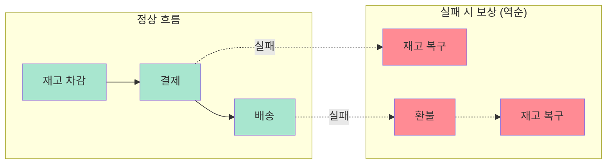

# 03. Spring Boot Integration

## 개요

Redpanda와 Spring Boot를 연계하는 방법을 다룬다. 기본 설정부터 SAGA 패턴 기반 분산 트랜잭션, DLQ 전략, EIP 패턴 구현, 멱등 소비자까지 실무에 필요한 통합 패턴 전반을 포함한다.

## 챕터 목록

| # | 문서 | 설명 | 상태 |
|---|------|------|------|
| 01 | [01-basic-setup.md](./01-basic-setup.md) | 의존성, 기본 연결 설정 (핵심 설정만 — 상세는 02 참조) | 완료 |
| 02 | [02-configuration-reference.md](./02-configuration-reference.md) | 전체 설정 레퍼런스 — 01에서 분리한 설정 파라미터 상세 | 완료 |
| 03 | [03-producer-consumer.md](./03-producer-consumer.md) | Producer/Consumer 구현 패턴 | 완료 |
| 04 | [04-manual-commit-deep-dive.md](./04-manual-commit-deep-dive.md) | 수동 커밋 심화 (함정, 실수, 체크리스트) | 완료 |
| 05 | [05-dlq-strategy.md](./05-dlq-strategy.md) | Dead Letter Queue, 에러 처리, 재시도 전략 (기본 DLQ) | 완료 |
| 06 | [06-idempotent-consumer.md](./06-idempotent-consumer.md) | 멱등 소비자 (Dedup, Upsert, Preemptive Acquire) | 완료 |
| 07 | [07-transaction-patterns.md](./07-transaction-patterns.md) | Kafka 트랜잭션 구현, CTP, DB+Kafka 원자성, 실행 제어 패턴 | 완료 |
| 08 | [08-saga-choreography.md](./08-saga-choreography.md) | SAGA 패턴 — Choreography 방식 (이벤트 기반 조정) | 완료 |
| 09 | [09-saga-orchestration.md](./09-saga-orchestration.md) | SAGA 패턴 — Orchestration 방식 (중앙 조정자) | 완료 |
| 10 | [10-testing.md](./10-testing.md) | Testcontainers, 통합 테스트 전략 | 완료 |
| 11 | [11-topic-pipeline-architecture.md](./11-topic-pipeline-architecture.md) | 토픽 파이프라인 아키텍처 패턴, @SendTo 심화, 5가지 패턴 (§5는 12로 분리) | 완료 |
| 12 | [12-replying-kafka-template.md](./12-replying-kafka-template.md) | ReplyingKafkaTemplate 심화 — 11에서 분리한 요청/응답 패턴 | 완료 |
| 13 | [13-messaging-patterns-impl.md](./13-messaging-patterns-impl.md) | EIP 패턴 구현 (Claim Check, Router, Splitter, Translator) | 완료 |
| 14 | [14-middleware-architecture.md](./14-middleware-architecture.md) | Spring Boot — Redpanda — Jenkins 간 통신 아키텍처 | 완료 |
| 15 | [15-schema-registry-strategy.md](./15-schema-registry-strategy.md) | Schema Registry 등록 전략, CI/CD, 브랜치 전략, 호환성 | 완료 |
| 16 | [16-topic-lifecycle.md](./16-topic-lifecycle.md) | 토픽 생명주기 관리 — 01에서 분리한 토픽 생성/삭제/변경 절차 | 완료 |
| 17 | [17-design-and-tuning.md](./17-design-and-tuning.md) | 성능 튜닝, 메시지 키 설계, 이벤트 정의 | WIP |
| 18 | [18-anti-patterns-troubleshooting.md](./18-anti-patterns-troubleshooting.md) | 안티패턴 + Consumer 리밸런스 트러블슈팅 | 완료 |
| 19 | [19-production-case-studies.md](./19-production-case-studies.md) | 국내 IT기업 Kafka 프로덕션 설정 사례 | 완료 |
| 20 | [20-jdbc-source-pipeline.md](./20-jdbc-source-pipeline.md) | JDBC Source Connector 쿼리 모드, 데이터 누락 방어, SMT, 모니터링 | 완료 |
| 21 | [21-outbox-retry-architecture.md](./21-outbox-retry-architecture.md) | Outbox Pattern + @RetryableTopic 자가 치유 아키텍처 (컬리 3PL 사례) | 완료 |
| 22 | [22-official-tutorial-supplement.md](./22-official-tutorial-supplement.md) | 공식 튜토리얼 보충 자료 | 완료 |
| 23 | [23-kafka-streams-spring-boot.md](./23-kafka-streams-spring-boot.md) | Kafka Streams DSL 연산, 조인, 윈도우, 에러 처리 Spring Boot 통합 | 완료 |
| Appendix | [appendix-source-sink-connector.md](./appendix-source-sink-connector.md) | Source/Sink 구현 개요 → 상세는 `07-connectors/` 참조 (리디렉트) | 리디렉트 |

## 학습 순서 (권장)

> **설계 원칙**: "환경 구성" → "메시지 신뢰성" → "트랜잭션/SAGA" → "테스트 검증" → "아키텍처 패턴" → "관리" → "실무 심화" 순서로 진행. 각 단계를 끝낸 뒤 다음 단계로 넘어가는 것을 권장하지만, 단계 내 문서는 순서 무관하게 읽어도 된다.

### 1단계: 환경 구성과 기본 패턴 (Setup & Basics)

> 목표: Spring Boot + Redpanda 연결을 완성하고, Producer/Consumer로 메시지를 주고받을 수 있다.

| 순서 | 문서 | 핵심 질문 | 난이도 |
|:---:|------|----------|:-----:|
| ① | 01-basic-setup | 의존성과 기본 연결은 어떻게 설정하는가? | ★☆☆ |
| ② | 02-configuration-reference | 설정 파라미터의 의미와 권장값은? | ★☆☆ |
| ③ | 03-producer-consumer | Producer/Consumer 패턴을 어떻게 구현하는가? | ★☆☆ |

### 2단계: 메시지 신뢰성 (Message Reliability)

> 목표: 메시지 유실 방지, 에러 처리, 중복 제거까지 신뢰할 수 있는 소비자를 구현한다.

| 순서 | 문서 | 핵심 질문 | 난이도 |
|:---:|------|----------|:-----:|
| ④ | 04-manual-commit-deep-dive | 수동 커밋의 함정과 올바른 사용법은? | ★★☆ |
| ⑤ | 05-dlq-strategy | 실패한 메시지를 어떻게 격리하고 재처리하는가? | ★★☆ |
| ⑥ | 06-idempotent-consumer | 중복 메시지를 어떻게 안전하게 처리하는가? | ★★★ |

> ④→⑤ 흐름: 커밋 제어를 이해해야 DLQ에서의 오프셋 관리가 보인다. ⑤→⑥ 흐름: DLQ로 에러를 격리한 뒤, 멱등성으로 중복까지 잡는다.

### 3단계: 트랜잭션과 SAGA (Transactions & Distributed TX)

> 목표: Kafka 트랜잭션 시맨틱스를 이해하고, SAGA 패턴으로 분산 트랜잭션을 구현한다.

| 순서 | 문서 | 핵심 질문 | 난이도 |
|:---:|------|----------|:-----:|
| ⑦ | 07-transaction-patterns | Kafka 트랜잭션과 DB+Kafka 원자성은 어떻게 구현하는가? | ★★★ |
| ⑧ | 08-saga-choreography | 이벤트 기반 SAGA를 어떻게 구현하는가? | ★★★ |
| ⑨ | 09-saga-orchestration | 중앙 조정자 SAGA를 어떻게 구현하는가? | ★★★ |

> ⑦→⑧→⑨ 흐름: 단일 서비스 트랜잭션 → Choreography(이벤트 기반) → Orchestration(중앙 조정자). 복잡도 순으로 점진 학습.

### 4단계: 테스트 검증 (Testing)

> 목표: 1~3단계에서 구현한 패턴들을 Testcontainers로 통합 테스트한다.

| 순서 | 문서 | 핵심 질문 | 난이도 |
|:---:|------|----------|:-----:|
| ⑩ | 10-testing | Testcontainers로 Kafka 통합 테스트를 어떻게 구성하는가? | ★★☆ |

### 5단계: 아키텍처와 메시징 패턴 (Architecture Patterns)

> 목표: 토픽 파이프라인, 요청/응답, EIP 패턴, 미들웨어 아키텍처를 설계할 수 있다.

| 순서 | 문서 | 핵심 질문 | 난이도 |
|:---:|------|----------|:-----:|
| ⑪ | 11-topic-pipeline-architecture | @SendTo로 토픽 파이프라인을 어떻게 구성하는가? | ★★★ |
| ⑫ | 12-replying-kafka-template | ReplyingKafkaTemplate으로 동기 요청/응답을 어떻게 구현하는가? | ★★★ |
| ⑬ | 13-messaging-patterns-impl | Claim Check, Router, Splitter 등 EIP 패턴을 어떻게 구현하는가? | ★★★ |
| ⑭ | 14-middleware-architecture | Spring Boot — Redpanda — Jenkins 통신을 어떻게 설계하는가? | ★★☆ |

> ⑪→⑫ 흐름: 단방향 파이프라인 → 양방향 요청/응답. ⑫→⑬ 흐름: 단순 패턴 → EIP 고급 패턴.

### 6단계: 스키마와 토픽 관리 (Schema & Topic Management)

> 목표: 스키마 진화 전략, 토픽 생명주기, 성능 튜닝까지 운영 관점의 관리를 이해한다.

| 순서 | 문서 | 핵심 질문 | 난이도 |
|:---:|------|----------|:-----:|
| ⑮ | 15-schema-registry-strategy | 스키마 호환성과 CI/CD 전략을 어떻게 설정하는가? | ★★☆ |
| ⑯ | 16-topic-lifecycle | 토픽 생성/수정/삭제를 어떻게 관리하는가? | ★★☆ |
| ⑰ | 17-design-and-tuning | 메시지 키 설계와 성능 튜닝은 어떻게 하는가? _(WIP)_ | ★★☆ |

> ⑮→⑯ 흐름: 스키마 관리 → 토픽 관리. 둘 다 운영 시 필수적인 거버넌스 영역.

### 7단계: 실무 심화 (Production Insights)

> 목표: 안티패턴을 피하고, 실제 프로덕션 사례를 학습하여 운영 감각을 기른다.

| 순서 | 문서 | 핵심 질문 | 난이도 |
|:---:|------|----------|:-----:|
| ⑱ | 18-anti-patterns-troubleshooting | 흔한 안티패턴과 리밸런스 문제를 어떻게 해결하는가? | ★★☆ |
| ⑲ | 19-production-case-studies | 국내 기업들은 Kafka를 프로덕션에서 어떻게 쓰는가? | ★★☆ |
| ⑳ | 20-jdbc-source-pipeline | JDBC Source Connector로 데이터 파이프라인을 어떻게 구축하는가? | ★★☆ |
| ㉑ | 21-outbox-retry-architecture | Outbox + @RetryableTopic으로 자가 치유 아키텍처를 어떻게 구현하는가? | ★★★ |
| ㉒ | 22-official-tutorial-supplement | 공식 튜토리얼에서 놓치기 쉬운 포인트는? | ★☆☆ |

> ⑱→⑲ 흐름: 이론적 안티패턴 → 실제 기업 사례(종합). ⑲→⑳→㉑ 흐름: 종합 사례 → JDBC 파이프라인(인프라) → Outbox+Retry(애플리케이션 신뢰성). ⑳과 ㉑은 ⑲에서 분리한 심화 문서.

### 8단계: 스트림 처리 (Stream Processing)

> 목표: Kafka Streams DSL 연산을 이해하고, 조인/윈도우/에러 처리를 Spring Boot에서 구현한다.

| 순서 | 문서 | 핵심 질문 | 난이도 |
|:---:|------|----------|:-----:|
| (23) | 23-kafka-streams-spring-boot | Kafka Streams DSL과 조인/윈도우를 어떻게 구현하는가? | ★★★ |

> 선행: 09-kafka-streams/01(이론), 06-cqrs/04(CQRS 특화). 1~7단계 @KafkaListener 패턴을 이해한 뒤 진행.

### 제외

| 문서 | 사유 |
|------|------|
| appendix-source-sink-connector | 리디렉트 stub → `07-connectors/` 참조 |

## SAGA 패턴 시나리오



## DLQ 전략 개요

```mermaid
flowchart TD
    Msg[메시지 처리 실패] --> Classify{에러 분류}

    Classify -->|Transient<br>일시적 오류| Retry[재시도<br>Exponential Backoff]
    Classify -->|Non-Transient<br>Poison Pill| DLT[즉시 DLT로 이동]

    Retry -->|성공| Done[처리 완료]
    Retry -->|최대 재시도 초과| DLT

    DLT --> Analyze[분석 및 재처리]

    subgraph "구현 옵션"
        O1[DefaultErrorHandler<br>+ DeadLetterPublishingRecoverer]
        O2[@RetryableTopic<br>Non-blocking 재시도]
        O3[ErrorHandlingDeserializer<br>역직렬화 에러]
    end

    style Retry fill:#ffd3b6
    style DLT fill:#ff8b94
    style Done fill:#a8e6cf
```

## 관련 폴더

- [02-fundamentals](../02-fundamentals/) — 토픽 설계, 트랜잭션 시맨틱스 이론
- [04-advanced-patterns](../04-advanced-patterns/) — DLQ 고급 패턴 (05-error-handling), 모니터링, CI/CD
- [06-cqrs-event-sourcing](../06-cqrs-event-sourcing/) — Kafka Streams CQRS 적용 (04-kafka-streams-topology)
- [07-connectors](../07-connectors/) — appendix-source-sink-connector의 구현 상세

## 문서 분리 이력

- **12-replying-kafka-template.md** (신규): 11-topic-pipeline-architecture §5에서 분리. ReplyingKafkaTemplate을 이용한 요청/응답 패턴을 독립 문서로 관리한다.
- **02-configuration-reference.md** (신규): 01-basic-setup에서 분리. 모든 설정 파라미터의 레퍼런스 역할을 한다.
- **16-topic-lifecycle.md** (신규): 01-basic-setup에서 분리. 토픽 생성/수정/삭제 절차와 정책을 다룬다.
- **17-design-and-tuning.md**: 성능 튜닝 내용이 미완성(WIP) 상태. 추가 작성 필요.
- **20-jdbc-source-pipeline.md** (신규): 19-production-case-studies §컬리 데이터서비스에서 분리. JDBC Source Connector 쿼리 모드, 데이터 누락 방어, SMT, 모니터링 심화.
- **21-outbox-retry-architecture.md** (신규): 19-production-case-studies §컬리 3PL에서 분리. Namastack Outbox + @RetryableTopic 자가 치유 아키텍처 심화.
- **appendix-source-sink-connector.md**: Source/Sink 구현 상세는 `07-connectors/`로 이동. 이 파일은 개요와 링크만 유지.

## Practice 프로젝트

실습 코드는 [project/](../../project/) 디렉토리에 있다.
- Docker Compose로 Redpanda 실행
- Spring Boot + Kafka 통합 프로젝트 (ch01~ch07)
- TPS 패턴을 모사한 미들웨어 아키텍처 (ch07)
